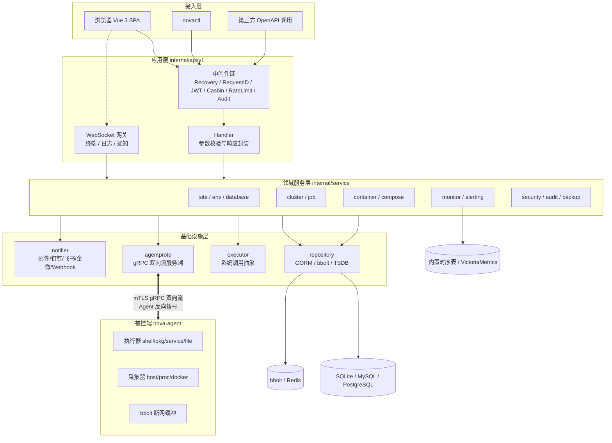
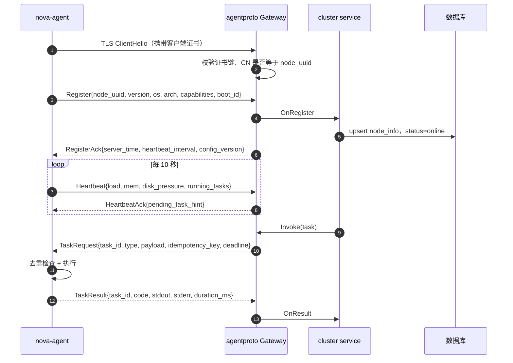
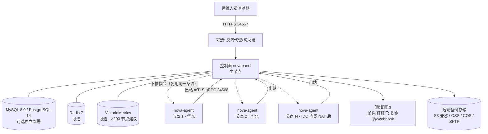
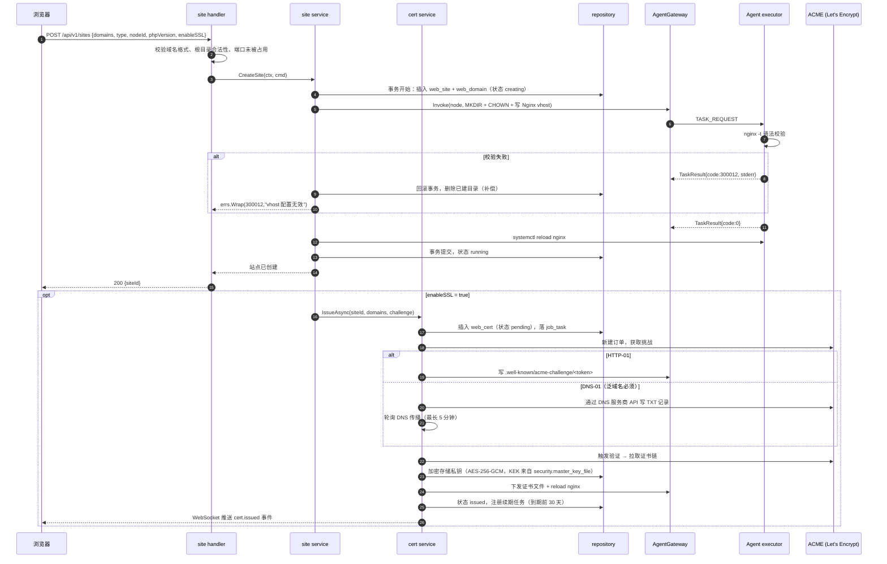
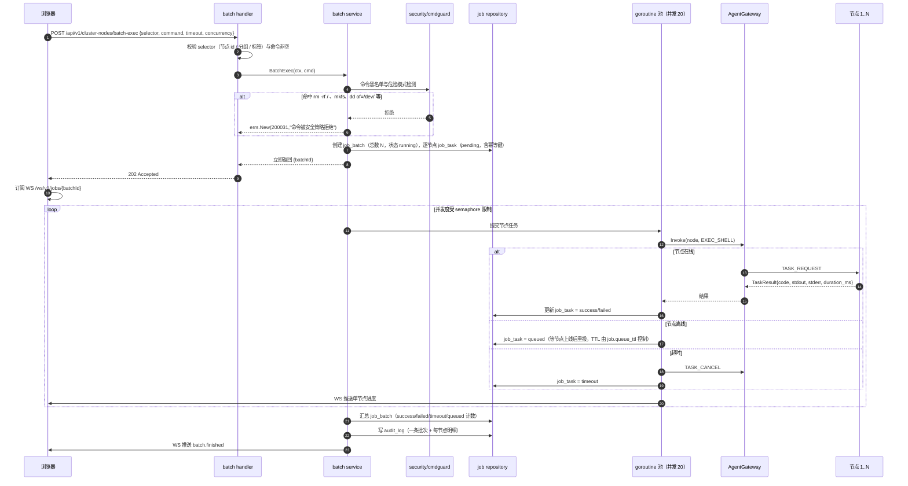
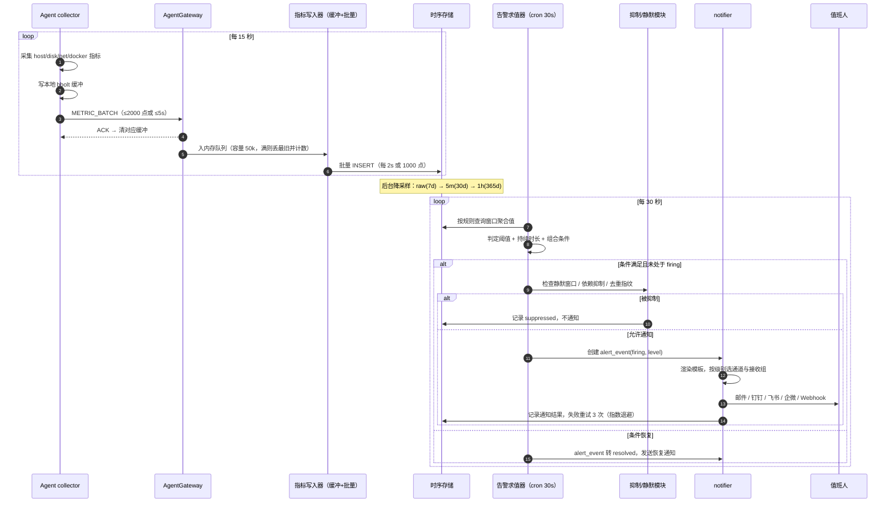
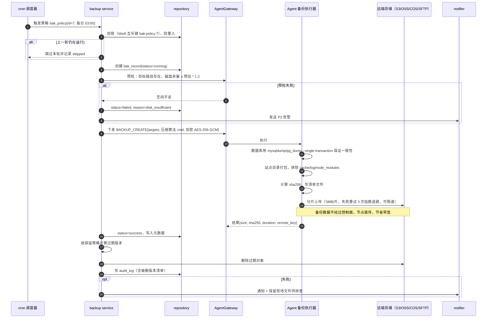
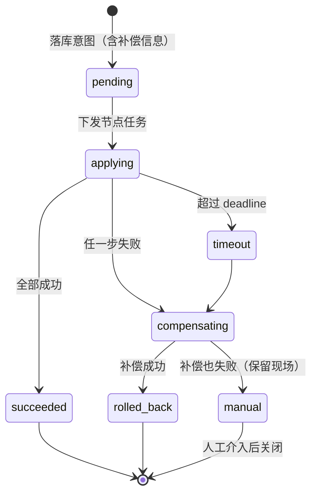

# NovaPanel（星舵面板）· 系统架构设计

## 文档信息

| 项目 | 内容 |
| --- | --- |
| 文档名称 | 02-系统架构设计 |
| 文档版本 | v1.0 |
| 更新日期 | 2026-08-17 |
| 状态 | 定稿 |
| 适用版本 | NovaPanel v1.0 |
| 产品代号 | nova |
| 覆盖内容 | 分层架构、职责边界、通信协议总览、部署拓扑、核心时序、ADR 决策记录、并发与一致性、容错降级、容量估算 |
| 关联文档 | [产品定位与需求规格](./01-产品定位与需求规格.md)、[技术栈与工程规范](./03-技术栈与工程规范.md)、[数据库设计](./04-数据库设计.md)、[API 接口规范](./05-API接口规范.md)、[多节点集群与 Agent](./10-多节点集群与Agent.md)、[安全与合规设计](./12-安全与合规设计.md) |

## 目录

- [2.1 架构目标与约束](#21-架构目标与约束)
- [2.2 总体架构分层](#22-总体架构分层)
- [2.3 控制面与被控端职责边界](#23-控制面与被控端职责边界)
- [2.4 Server-Agent 通信设计总览](#24-server-agent-通信设计总览)
- [2.5 部署拓扑](#25-部署拓扑)
- [2.6 核心业务时序图](#26-核心业务时序图)
- [2.7 模块依赖关系与依赖倒置](#27-模块依赖关系与依赖倒置)
- [2.8 分层代码规约](#28-分层代码规约)
- [2.9 架构决策记录 ADR](#29-架构决策记录-adr)
- [2.10 并发与资源模型](#210-并发与资源模型)
- [2.11 缓存策略](#211-缓存策略)
- [2.12 事务与一致性](#212-事务与一致性)
- [2.13 容错与降级](#213-容错与降级)
- [2.14 可扩展点](#214-可扩展点)
- [2.15 安全架构总览](#215-安全架构总览)
- [2.16 性能容量估算](#216-性能容量估算)
- [2.17 技术风险与对策](#217-技术风险与对策)

## 2.1 架构目标与约束

### 2.1.1 架构目标

| 编号 | 目标 | 可度量判据 |
| --- | --- | --- |
| G1 | 单控制面纳管 500 个节点 | 500 Agent 长连接下面板常驻内存 < 150MB，心跳丢失率 < 0.1% |
| G2 | 控制面零外部依赖即可运行 | 全新机器执行 `install.sh` 后 60 秒内可登录，无需装 MySQL/Redis |
| G3 | 被控端可穿透 NAT 与防火墙 | Agent 侧只出不进，仅需放行出站 34568 |
| G4 | 所有变更可审计、可回溯 | 任一写操作可由 `audit_log` 还原「谁、何时、在哪个节点、做了什么、结果如何」 |
| G5 | 单机模式与集群模式同一套代码 | 主节点内置 Agent，模式差异仅体现在配置与节点数量 |
| G6 | 领域逻辑与系统调用解耦 | `internal/service` 不出现 `os/exec`、`net/http` 客户端调用 |
| G7 | 可扩展至第三方指标与告警后端 | 时序读写与通知发送均为接口，可替换实现而不改上层 |

### 2.1.2 硬约束

| 约束 | 说明 | 影响 |
| --- | --- | --- |
| 免 CGO | 使用 `modernc.org/sqlite` 纯 Go 驱动 | 交叉编译 amd64/arm64 无需交叉工具链 |
| 单二进制交付 | 前端产物用 `embed` 打进 `novapanel` | 无 Nginx 也能直接提供 Web 界面 |
| Agent 极简 | Agent 不含 Web 服务、不写业务库 | 内存目标 < 40MB，仅本地 bbolt 缓冲 |
| 系统兼容 | 覆盖 systemd 系发行版，见 [1.10 兼容性矩阵](./01-产品定位与需求规格.md#110-兼容性矩阵) | 禁用发行版特有命令，能力探测优先 |
| 离线可用 | 内网无外网时核心功能不降级 | 应用商店、证书签发允许离线包与私有 ACME |

### 2.1.3 架构原则

1. 依赖倒置：上层定义接口，下层实现，编译期依赖方向自外向内。
2. 系统调用集中：一切 shell、文件、包管理、服务管理操作只能出现在 `internal/executor`。
3. 无状态优先：控制面 HTTP 层无会话状态，状态落库或落 KV，为后续多副本留出空间。
4. 显式优于隐式：跨节点操作必须显式带 `X-Node-Id`，禁止「默认当前节点」的隐式行为。
5. 失败可见：部分失败必须逐节点返回结果，禁止聚合成单一布尔值。

## 2.2 总体架构分层

### 2.2.1 分层图



### 2.2.2 各层职责与准入规则

| 层 | Go 包 | 职责 | 允许依赖 | 禁止事项 |
| --- | --- | --- | --- | --- |
| 接入层 | `web/`、`cmd/novactl` | 展示、交互、命令行封装 | 仅 HTTP/WS 协议 | 禁止内嵌业务规则 |
| 应用层 | `internal/api/v1` | 路由、参数绑定校验、鉴权、响应封装、WS 升级 | service 接口 | 禁止直接用 GORM、禁止拼 SQL、禁止调用 executor |
| 领域服务层 | `internal/service` | 业务编排、事务边界、领域校验、作业下发 | repository 接口、executor 接口、agentproto 接口 | 禁止出现 `gin.Context`、`http.Request`、`os/exec` |
| 数据访问 | `internal/repository` | CRUD、查询构造、KV、时序读写 | GORM、bbolt、Redis 客户端 | 禁止业务判断与跨表编排 |
| 系统调用 | `internal/executor` | shell、包管理、systemd、文件、Docker、Nginx 配置 | 操作系统与 Docker API | 禁止访问业务库 |
| 通信 | `internal/agentproto` | gRPC 服务端、流管理、消息编解码、幂等去重 | grpc、protobuf | 禁止解释业务语义 |
| 采集 | `internal/collector` | 指标采集、降采样、写入 TSDB | gopsutil、Docker API | 禁止触发告警动作 |
| 告警 | `internal/alerting` | 规则求值、静默抑制、通知分发 | notifier 接口、TSDB 读接口 | 禁止直接查业务表明细 |
| 安全 | `internal/security` | 认证、鉴权、加密、审计写入、2FA | crypto、casbin、jwt | 禁止被 repository 反向依赖 |
| 公共 | `internal/pkg` | errs、logx、config、idgen、pool、validator | 标准库与基础三方库 | 禁止依赖 internal 内任何业务包 |

依赖方向由 `golangci-lint` 的 `depguard` 规则在 CI 强制，违规即失败，配置见 [3.14 代码质量门禁](./03-技术栈与工程规范.md#314-代码质量门禁)。

### 2.2.3 请求穿透示例

以「重启节点 42 上的 Nginx」为例，逐层落点：

| 步骤 | 位置 | 动作 |
| --- | --- | --- |
| 1 | 中间件 | 校验 JWT，解析 `X-Node-Id: 42`，Casbin 判定 `env:service:exec` |
| 2 | Handler | 绑定并校验 `ServiceActionReq`，写入 `traceId` |
| 3 | Service | 生成幂等键，落 `job_task` 记录，调用 `AgentGateway.Invoke` |
| 4 | agentproto | 查节点 42 的活跃流，推送 `SERVICE_CONTROL` 消息，等待响应或超时 |
| 5 | Agent | `executor.Systemd.Restart("nginx")`，回传退出码与 stderr |
| 6 | Service | 更新作业状态，写审计记录 |
| 7 | Handler | 按统一响应结构返回 |

## 2.3 控制面与被控端职责边界

### 2.3.1 职责划分

| 能力 | 控制面 novapanel | 被控端 nova-agent | 判定依据 |
| --- | --- | --- | --- |
| Web 界面与 API | 独有 | 无 | Agent 不监听任何入站端口 |
| 业务元数据存储 | 独有 | 无 | 唯一事实来源在控制面 |
| 用户、角色、策略 | 独有 | 无 | 鉴权不下沉 |
| 作业编排与状态机 | 独有 | 无 | Agent 只执行单条指令 |
| 告警规则求值 | 独有 | 无 | 规则依赖历史数据与全局视图 |
| 证书签发（ACME） | 独有 | 仅落盘与 reload | 需统一管理 DNS/HTTP 挑战 |
| 系统命令执行 | 仅本机内置 Agent | 独有 | 一切系统调用经 executor |
| 软件包与服务管理 | 无 | 独有 | 依赖本机发行版能力 |
| 指标采集 | 无 | 独有 | 采集在数据产生地 |
| 指标降采样与落库 | 独有 | 仅本地缓冲 | 存储集中，Agent 不做持久聚合 |
| 文件读写与传输 | 转发 | 独有 | 大文件走流式分片 |
| 终端会话 | WS 网关与录制 | PTY 承载 | 双向流转发 |
| 容器操作 | 无 | 独有（调本机 Docker API） | Docker socket 不暴露 |
| 备份打包 | 编排与校验 | 打包与上传 | 避免数据穿过控制面 |

### 2.3.2 边界规则

1. Agent 不持有任何业务数据库连接串，不知道自己所属租户之外的信息。
2. Agent 收到的每条指令必须自带 `task_id` 与 `idempotency_key`，重复投递直接返回缓存结果。
3. Agent 拒绝执行未在能力清单中声明的消息类型，返回 `UNSUPPORTED` 而非静默忽略。
4. 控制面不得假设 Agent 在线，所有跨节点调用必须处理「离线」与「超时」两种失败。
5. Agent 升级由控制面下发，但校验签名并保留上一版本二进制以便自回滚。

### 2.3.3 主节点内置 Agent

单机模式下控制面进程内嵌 Agent 逻辑，通过进程内管道替代 gRPC，节省一次序列化：

| 项 | 集群模式 | 单机模式 |
| --- | --- | --- |
| 传输 | mTLS gRPC 双向流 | 进程内 channel |
| 序列化 | protobuf | 直接传结构体指针 |
| 节点记录 | 每 Agent 一条 `node_info` | 一条 `node_info`，`is_builtin=true` |
| 上层代码 | 无差异，统一走 `AgentGateway` 接口 | 无差异 |

## 2.4 Server-Agent 通信设计总览

本节给出协议总览与序列图，字段级定义、proto 文件、状态机细节见 [多节点集群与 Agent](./10-多节点集群与Agent.md)。

### 2.4.1 连接模型

Agent 主动向控制面 34568 端口反向拨号，建立一条 gRPC 双向流并长期持有；控制面通过该流下推指令。这样被控机无需开放任何入站端口，天然穿透 NAT 与安全组。



### 2.4.2 消息类型枚举

| 枚举值 | 方向 | 用途 | 是否需要响应 |
| --- | --- | --- | --- |
| `REGISTER` | Agent → Panel | 注册与能力上报 | 是 |
| `REGISTER_ACK` | Panel → Agent | 下发心跳间隔与配置版本 | 否 |
| `HEARTBEAT` | Agent → Panel | 存活与轻量负载 | 是 |
| `TASK_REQUEST` | Panel → Agent | 通用任务下发 | 是 |
| `TASK_RESULT` | Agent → Panel | 任务结果 | 否 |
| `TASK_CANCEL` | Panel → Agent | 取消进行中任务 | 是 |
| `METRIC_BATCH` | Agent → Panel | 指标批量上报 | 是（ACK 后清缓冲） |
| `LOG_STREAM` | Agent → Panel | 日志流分片 | 否 |
| `TERM_OPEN` / `TERM_DATA` / `TERM_RESIZE` / `TERM_CLOSE` | 双向 | 终端会话 | 部分 |
| `FILE_CHUNK` | 双向 | 文件分片传输 | 是 |
| `EVENT_NOTIFY` | Agent → Panel | 本地事件（服务崩溃、磁盘告警） | 否 |
| `CONFIG_SYNC` | Panel → Agent | 采集配置与黑名单同步 | 是 |
| `AGENT_UPGRADE` | Panel → Agent | 自升级指令 | 是 |

### 2.4.3 心跳与离线判定

| 参数 | 默认值 | 配置键 | 说明 |
| --- | --- | --- | --- |
| 心跳间隔 | 10s | `agent.heartbeat_interval` | 由 `REGISTER_ACK` 下发，Agent 侧不硬编码 |
| 离线判定阈值 | 3 个周期（30s） | `agent.offline_threshold` | 连续缺失即置 `offline` |
| 状态机 | `online` → `unstable` → `offline` | — | 缺 1 个周期进 `unstable`，不立即告警，避免抖动误报 |
| 离线告警延迟 | 60s | `alert.node_offline_delay` | 与重启维护窗口叠加判断，维护中不告警 |
| 会话清理 | 离线后 5 分钟 | `agent.session_ttl` | 清理流句柄，保留排队任务 |

### 2.4.4 断线重连退避

Agent 侧采用带抖动的指数退避，避免控制面重启后 500 个 Agent 同时冲击：

```text
第 n 次重试等待 = min(base * 2^(n-1), max) * (1 + rand(-0.2, 0.2))
base = 1s, max = 60s
实际序列约: 1s, 2s, 4s, 8s, 16s, 32s, 60s, 60s, ...
连续失败超过 30 分钟：降低到 300s 间隔并写本地日志告警
```

重连成功后 Agent 必须重放本地 bbolt 中未确认的 `METRIC_BATCH` 与 `EVENT_NOTIFY`，缓冲上限 `agent.buffer_max_mb`（默认 64MB），超限按时间从旧到新丢弃并计数上报。

### 2.4.5 任务幂等与去重

| 环节 | 机制 |
| --- | --- |
| 幂等键生成 | 控制面按 `sha256(node_id + task_type + 规范化payload + 业务单号)` 生成 |
| Agent 侧去重 | bbolt bucket `task_done` 存 `idempotency_key → result`，TTL 24 小时；命中直接回放结果 |
| 控制面侧去重 | `job_task` 表对 `(node_id, idempotency_key)` 建唯一索引 |
| 超时重投 | 超过 `deadline` 未收到结果，控制面重投同一 `task_id` 与幂等键，最多 3 次 |
| 不可重试类型 | 明确标记 `retryable=false` 的任务（如已扣费的迁移、不可逆删除）只投一次，超时转人工确认 |

### 2.4.6 消息压缩与大小限制

| 项 | 值 | 说明 |
| --- | --- | --- |
| 压缩算法 | gzip（gRPC 内置） | payload > 4KB 时启用，小消息不压缩以省 CPU |
| 单消息上限 | 4MB | `grpc.MaxRecvMsgSize`，超限必须分片 |
| 文件传输 | 1MB/片 | `FILE_CHUNK` 携带序号与 sha256，接收端校验 |
| 日志与终端流 | 不压缩 | 交互延迟优先，单帧上限 64KB |
| 指标批量 | 每批 ≤ 2000 点或 ≤ 5s | 两者先到即发 |

## 2.5 部署拓扑

### 2.5.1 单机模式

适用 1 台服务器，控制面与被控能力同进程，数据库用 SQLite。

```text
┌──────────────────────────────────────────────────────────┐
│ 服务器 A                                                  │
│                                                          │
│  ┌────────────────────────────────────────────────────┐  │
│  │ novapanel (单进程)                                  │  │
│  │  ├─ HTTPS :34567  ← 浏览器 / novactl                │  │
│  │  ├─ gRPC  :34568  ← 预留（本模式无外部 Agent）       │  │
│  │  ├─ 内置 Agent（进程内 channel，无网络往返）          │  │
│  │  └─ cron 调度器 / 采集器 / 告警引擎                   │  │
│  └────────────────────────────────────────────────────┘  │
│         │                    │                  │        │
│  /opt/novapanel/data   /opt/novapanel/conf   .../logs    │
│   nova.db (SQLite)     panel.yaml            panel.log   │
│   kv.bolt (bbolt)                            audit.log   │
│                                                          │
│  被管资源：Nginx / PHP-FPM / MySQL / Docker / 站点目录     │
└──────────────────────────────────────────────────────────┘
```

### 2.5.2 集群模式



### 2.5.3 网络与端口要求

| 方向 | 源 | 目标 | 端口/协议 | 必需 |
| --- | --- | --- | --- | --- |
| 入站 | 运维网段 | 控制面 | 34567/TCP HTTPS | 是 |
| 入站 | 各节点 | 控制面 | 34568/TCP gRPC over mTLS | 集群模式必需 |
| 出站 | 控制面 | ACME 服务商 / DNS API | 443/TCP | 自动签发证书时必需 |
| 出站 | 控制面 | 通知服务 | 443/25/587 | 按启用通道 |
| 出站 | 节点 | 备份存储 | 443/22 | 启用备份时 |
| 入站 | 无 | 节点 | 无 | Agent 不监听入站 |

规模建议：≤ 50 节点用默认 SQLite；50-200 节点建议切 MySQL/PostgreSQL；> 200 节点建议同时外接 VictoriaMetrics 与 Redis。

## 2.6 核心业务时序图

### 2.6.1 登录鉴权与 Token 刷新

```mermaid
sequenceDiagram
    autonumber
    participant W as 浏览器
    participant H as auth handler
    participant S as auth service
    participant SEC as security/token
    participant KV as bbolt/Redis
    participant DB as sys_user

    W->>H: POST /api/v1/auth/login {username, password, totp?}
    H->>H: 参数校验 + 登录频率限流（同 IP 5 次/分钟）
    H->>S: Login(ctx, cmd)
    S->>DB: 查用户、状态、bcrypt 校验
    alt 密码错误
        S->>DB: fail_count+1，达 5 次锁定 15 分钟
        S-->>H: errs.New(110002, "凭据无效")
        H-->>W: 401 {code:110002}
    end
    opt 已开启 2FA
        S->>SEC: 校验 TOTP（±1 时间窗）
    end
    S->>SEC: 签发 accessToken(15m) + refreshToken(7d)
    SEC->>KV: 存 refresh 句柄 jti → {userId, deviceFp, exp}
    S->>DB: 写 sec_login_log + audit_log
    S-->>H: {accessToken, expiresIn, user, permissions}
    H-->>W: 200 + Set-Cookie: nova_rt=<refreshToken>; HttpOnly; Secure; SameSite=Strict; Path=/api/v1/auth
    Note over W: accessToken 存内存（Pinia），不落 localStorage
    W->>H: 业务请求 Authorization: Bearer <accessToken>
    H-->>W: 401 {code:110004 token 过期}
    W->>H: POST /api/v1/auth/refresh（自动携带 Cookie）
    H->>SEC: 校验 refreshToken + 设备指纹
    SEC->>KV: 旋转 jti（旧 jti 立即失效）
    alt 检测到旧 jti 复用
        SEC->>KV: 吊销该用户全部会话
        SEC-->>W: 401 {code:110006 会话异常已全部下线}
    end
    SEC-->>W: 新 accessToken + 新 refreshToken Cookie
    W->>H: 重放原请求
```

要点：并发请求遇 401 时前端只发起一次 refresh，其余请求进等待队列，成功后统一重放；refreshToken 采用一次性旋转以检测窃取。

### 2.6.2 创建网站并签发证书



失败补偿：任一步骤失败均将站点置为 `abnormal` 并保留现场（不自动删除用户目录），在站点详情页给出「重试」与「清理」两个显式动作。

### 2.6.3 跨节点批量执行命令



设计要点：接口立即返回 `batchId`，避免长连接阻塞；结果按节点粒度落库，前端可只筛失败项并对失败集合发起「重试」（复用同一批次的新一轮，幂等键含轮次号）。

### 2.6.4 指标采集到告警触发通知



关键规则：

| 规则 | 说明 |
| --- | --- |
| 去重指纹 | `sha256(rule_id + node_id + labels)`，同指纹在 `alert.repeat_interval`（默认 30 分钟）内只通知一次 |
| 依赖抑制 | 节点 offline 时，自动抑制该节点上的所有其他告警，避免告警风暴 |
| 持续时长 | 规则需连续满足 `for` 时长（默认 3 个求值周期）才 firing，防抖动 |
| 分级路由 | P1 全通道 + 电话（v1.2）；P2 即时通讯；P3 仅站内与日报 |
| 通知失败 | 3 次重试后写失败事件，并在仪表盘「通知异常」区提示 |

### 2.6.5 备份任务调度与远端上传



一致性要点：`bak_record` 先落库再执行，任何异常退出后由启动自愈任务将 `running` 且超过 `deadline` 的记录标为 `unknown`，并触发一次远端对象存在性核对。

## 2.7 模块依赖关系与依赖倒置

### 2.7.1 依赖关系图

```mermaid
flowchart LR
    subgraph API["api/v1"]
        AH["handlers"]
    end
    subgraph SVC["service"]
        S1["SiteService"]
        S2["ClusterService"]
        S3["MonitorService"]
        S4["BackupService"]
    end
    subgraph IF["service 内定义的接口"]
        I1["SiteRepository"]
        I2["AgentGateway"]
        I3["NginxExecutor"]
        I4["TSDBWriter / TSDBReader"]
        I5["ObjectStorage"]
        I6["Notifier"]
        I7["Clock / IDGen"]
    end
    subgraph IMPL["基础设施实现"]
        R1["repository.siteRepoGorm"]
        R2["agentproto.gateway"]
        R3["executor.nginx"]
        R4["repository.tsdbSQLite / tsdbVictoria"]
        R5["storage.s3 / oss / cos / sftp"]
        R6["notifier.mail / dingtalk / feishu / wecom / webhook"]
        R7["pkg.realClock / snowflake"]
    end

    AH --> SVC
    SVC --> IF
    IMPL -. "实现（编译期由 cmd 装配）" .-> IF
    style IF fill:#f6f8fa,stroke:#8c8c8c
```



### 2.7.2 依赖倒置落地方式

| 项 | 做法 |
| --- | --- |
| 接口归属 | 接口定义在**使用方**包内（`internal/service/xxx/port.go`），不在实现方包 |
| 装配位置 | 只在 `cmd/panel/main.go` 手工构造依赖树，不引入 DI 框架，保持可读与编译期可查 |
| 替换成本 | 切换 TSDB 实现只改 `main.go` 中一行构造与配置项 `monitor.tsdb.driver` |
| 测试策略 | `mockgen` 基于接口生成 mock，service 单测不依赖数据库与操作系统 |
| 循环依赖 | `depguard` + `import-boundaries` 规则禁止 service 之间互相 import，跨服务协作通过事件总线或上层编排 |

### 2.7.3 服务间协作规则

跨服务调用只允许三种形式，其余在评审中拒绝：

| 形式 | 适用场景 | 示例 |
| --- | --- | --- |
| 上层编排 | 用例需要多个服务参与 | `SiteService` 创建站点后由 `api` 层的 use-case 触发 `CertService.IssueAsync` |
| 内部事件总线 | 弱耦合的副作用 | 站点删除 → 发 `site.deleted` 事件 → 备份策略、监控规则各自清理 |
| 显式端口依赖 | 稳定的下游能力 | `BackupService` 依赖 `ObjectStorage` 接口 |

事件总线为进程内实现（`internal/pkg/eventbus`），同步派发 + 单事件超时 5s，订阅者异常不影响发布方；事件不做持久化，需要可靠投递的场景一律落 `job_task`。

## 2.8 分层代码规约

### 2.8.1 各层允许与禁止

| 层 | 必须做 | 禁止做 | 代码行数软上限 |
| --- | --- | --- | --- |
| handler | 绑定 DTO、调用 validator、转换错误为统一响应、写 swag 注解 | 事务、循环调用 service、拼装业务规则 | 单函数 40 行 |
| service | 开启/提交事务、编排 repository 与 executor、领域校验、发领域事件 | 感知 HTTP、拼 SQL、执行 shell | 单函数 80 行 |
| repository | 构造查询、映射实体、注入 `tenant_id`、处理软删 | 业务分支、跨聚合编排 | 单函数 50 行 |
| executor | 能力探测、构造安全命令（参数数组）、解析输出 | 访问数据库、判断业务状态 | 单函数 60 行 |

### 2.8.2 handler 模板

```go
// CreateSite 创建站点
// @Summary  创建站点
// @Tags     网站管理
// @Accept   json
// @Produce  json
// @Param    X-Node-Id  header  int64             true  "目标节点 ID"
// @Param    body       body    model.SiteCreateReq  true  "站点参数"
// @Success  200  {object}  response.Result[model.SiteVO]
// @Failure  400  {object}  response.Result[any]  "300001 参数错误"
// @Router   /api/v1/sites [post]
// @Security BearerAuth
func (h *SiteHandler) CreateSite(c *gin.Context) {
	var req model.SiteCreateReq
	if err := c.ShouldBindJSON(&req); err != nil {
		response.Fail(c, errs.Wrap(err, errs.CodeSiteInvalidParam, "站点参数不合法"))
		return
	}
	vo, err := h.siteSvc.CreateSite(ctxutil.From(c), &req)
	if err != nil {
		response.Fail(c, err)
		return
	}
	response.OK(c, vo)
}
```

### 2.8.3 service 事务边界

事务只在 service 层开启，通过 `repository.TxManager` 传播；executor 与跨节点调用**不得**放在数据库事务内（避免长事务持锁）。正确顺序为：短事务落「意图」→ 提交 → 执行外部动作 → 短事务落「结果」。

```go
func (s *siteService) CreateSite(ctx context.Context, req *model.SiteCreateReq) (*model.SiteVO, error) {
	// 阶段一：短事务落意图，状态 creating
	site, err := s.txm.InTx(ctx, func(ctx context.Context) (*model.Site, error) {
		if dup, err := s.repo.ExistsByDomain(ctx, req.Domains...); err != nil {
			return nil, err
		} else if dup {
			return nil, errs.New(errs.CodeSiteDomainDuplicated, "域名已被其他站点占用")
		}
		return s.repo.Create(ctx, model.NewSite(req, s.idgen.Next()))
	})
	if err != nil {
		return nil, err
	}
	// 阶段二：事务外执行系统动作
	if err := s.applyToNode(ctx, site); err != nil {
		_ = s.markAbnormal(ctx, site.ID, err) // 阶段三：短事务落结果
		return nil, err
	}
	return s.markRunning(ctx, site.ID)
}
```

## 2.9 架构决策记录 ADR

ADR 编号一经分配不复用；后续变更以新 ADR 取代旧 ADR 并在此标注。

### ADR-001 后端语言选用 Go

状态：已接受

| 方案 | 优点 | 缺点 | 结论 |
| --- | --- | --- | --- |
| Go | 静态编译单文件、免运行时依赖、并发模型契合长连接与批量任务、交叉编译容易、内存可控 | 泛型生态较新，部分库成熟度不及 Java | 采纳 |
| Python | 生态丰富、开发快 | 依赖系统 Python 版本（宝塔的主要痛点）、GIL 限制并发、打包分发困难、内存占用高 | 拒绝 |
| Rust | 性能与安全性最佳 | 开发效率与团队招聘成本高，gRPC/ORM 生态弱于 Go | 拒绝 |
| Java | 生态成熟 | JVM 内存基线远超 150MB 目标，不适合被控端 | 拒绝 |
| Node.js | 前后端同语言 | 需 Node 运行时、CPU 密集任务弱、单二进制方案不成熟 | 拒绝 |

理由：目标 NFR-P3（面板 < 150MB）与 NFR-P4（Agent < 40MB）以及「单二进制、免依赖」是硬约束，Go 是唯一同时满足的选项。宝塔面板因依赖系统 Python 造成的升级崩溃问题正是本项目要规避的。

### ADR-002 默认数据库采用 SQLite（modernc.org/sqlite）

状态：已接受

| 方案 | 优点 | 缺点 | 结论 |
| --- | --- | --- | --- |
| modernc.org/sqlite | 纯 Go 免 CGO、交叉编译零成本、零运维、单文件备份 | 写并发受限（单写者）、大表性能弱于 MySQL | 采纳为默认 |
| mattn/go-sqlite3 | 性能更好、成熟 | 需 CGO，破坏交叉编译与静态链接 | 拒绝 |
| 内嵌 MySQL/PG | 性能强 | 安装体积与运维复杂度暴涨，违背「60 秒可用」 | 拒绝 |
| 强制外部 MySQL | 性能与并发好 | 个人站长场景门槛过高 | 作为可选，非默认 |

配套措施：开启 WAL 模式、`busy_timeout=5000`、写操作串行化到单连接（`SetMaxOpenConns(1)` 用于写库句柄，读库句柄独立且允许多连接）；节点数 > 50 时在系统设置中主动提示切换到 MySQL/PostgreSQL，并提供在线迁移向导。

### ADR-003 Agent 反向拨号 + gRPC 双向流

状态：已接受

| 方案 | 穿透 NAT | 实时性 | 连接数 | 实现复杂度 | 结论 |
| --- | --- | --- | --- | --- | --- |
| Agent 反向拨号 + gRPC 双向流 | 是 | 毫秒级下推 | 每节点 1 条长连接 | 中 | 采纳 |
| 控制面主动轮询 Agent HTTP | 否（需开入站端口） | 取决于轮询间隔 | 高频短连接 | 低 | 拒绝 |
| Agent 轮询控制面拉任务 | 是 | 秒级延迟，空转浪费 | 500 节点 × 1s = 500 QPS 空请求 | 低 | 拒绝 |
| SSH 直连执行 | 否 | 好 | 每次新建连接 | 低 | 拒绝（需存私钥、无法采集、无法穿透） |
| MQTT / NATS 中间件 | 是 | 好 | 需额外组件 | 中高 | 拒绝（违背零外部依赖） |

理由：被控机开放入站端口在生产环境常被安全组与合规规则拒绝；轮询在 500 节点规模下产生大量空请求且下发延迟不可接受。gRPC 双向流一条连接同时承载指令下发、指标上报、终端与文件流，且原生支持 mTLS 与流控。

### ADR-004 自研 SQLite 降采样时序表，而非内嵌 Prometheus

状态：已接受

| 方案 | 体积影响 | 运维成本 | 查询能力 | 结论 |
| --- | --- | --- | --- | --- |
| 内置 SQLite 三级降采样表 | 0（复用主库引擎） | 零 | 够用（按 metric+label+时间范围聚合） | 采纳为默认 |
| 内嵌 Prometheus（引入 TSDB 库） | +30MB 以上，且需管理 WAL 与 block 压缩 | 中 | 强（PromQL） | 拒绝为默认 |
| 外接 Prometheus | 0 | 高（用户须自行部署） | 强 | 拒绝为默认，不作为选项（改用 VM） |
| 外接 VictoriaMetrics | 0 | 中 | 强 + 高压缩比 | 采纳为大规模可选 |

理由：目标用户中绝大多数只需要「看曲线 + 阈值告警」，PromQL 表达力对其是负担；内嵌 Prometheus 会显著增大二进制体积并引入其存储生命周期管理复杂度，与「零依赖、单文件」冲突。降采样表结构与保留策略见 [监控与告警设计](./11-监控告警与可观测.md)。

保留策略：`mon_metric_raw`（15s 粒度，7 天）→ `mon_metric_5m`（30 天）→ `mon_metric_1h`（365 天）；降采样由 cron 每 5 分钟增量执行，过期数据按分区表批量删除而非逐行删。

### ADR-005 权限模型采用 Casbin

状态：已接受

| 方案 | 表达力 | 性能 | 可维护性 | 结论 |
| --- | --- | --- | --- | --- |
| Casbin（RBAC with domains + 资源匹配） | 高（模型可配置、支持通配与域隔离） | 策略常驻内存，判定 μs 级 | 策略与代码解耦，可动态 reload | 采纳 |
| 自研中间件 + 权限位图 | 中 | 最快 | 每加一种资源都要改代码 | 拒绝 |
| 纯数据库查询判权 | 低 | 每请求多次查库 | 简单但慢 | 拒绝 |
| OPA / Rego | 极高 | 需额外进程或嵌入较重 | 学习曲线陡 | 拒绝 |

模型配置：`RBAC with domains`，`sub, dom, obj, act`，其中 `dom` 映射 `tenant_id`，`obj` 为 `module:resource` 或 `module:resource:实例ID`，`act` 为七种 action。策略持久化用 `gorm-adapter`，变更后广播 reload；`auditor` 角色额外在代码层硬拦截非只读 action（防策略误配）。

### ADR-006 前端产物 embed 进单二进制

状态：已接受

| 方案 | 部署复杂度 | 升级一致性 | 体积 | 结论 |
| --- | --- | --- | --- | --- |
| `embed.FS` 打包 dist | 最低（一个文件） | 前后端版本天然一致 | +8-12MB（gzip 预压缩后） | 采纳 |
| 独立静态目录 + Nginx | 需额外配置 Web 服务器 | 易出现前后端版本错配 | 小 | 拒绝 |
| 前端单独部署到 CDN | 需公网与构建流水线 | 版本管理复杂，内网不可用 | 小 | 拒绝 |

配套：构建期用 `vite-plugin-compression` 生成 `.gz`/`.br`，运行时按 `Accept-Encoding` 直接返回预压缩文件，避免每请求 gzip 的 CPU 开销；静态资源带内容哈希，`index.html` 设 `no-cache`，其余设 `max-age=31536000, immutable`。

### ADR-007 系统调用统一收敛到 executor 层

状态：已接受

| 方案 | 可测性 | 安全性 | 跨发行版适配 | 结论 |
| --- | --- | --- | --- | --- |
| 统一 executor 接口 + 各发行版实现 | 高（可 mock） | 高（命令构造集中审计，黑名单单点生效） | 好（能力探测集中） | 采纳 |
| service 内直接 `exec.Command` | 低（须真机） | 低（注入风险分散在各处） | 差（分支散落） | 拒绝 |
| 全部通过 shell 脚本文件 | 中 | 低（脚本易被篡改） | 中 | 拒绝 |

executor 接口按能力拆分：`ShellExecutor`、`PackageManager`、`ServiceManager`、`FileManager`、`FirewallManager`、`DockerClient`、`NginxManager`。命令一律以参数数组形式构造（禁止字符串拼接），用户输入只能作为参数值且经白名单校验。

### ADR-008 作业采用「先落库、后执行、异步回填」模型

状态：已接受

| 方案 | 可观测 | 崩溃恢复 | 实现复杂度 | 结论 |
| --- | --- | --- | --- | --- |
| 落库 job_task + 幂等键 + 异步回填 | 高（每节点结果可查） | 好（重启后可重放/标记） | 中 | 采纳 |
| 同步阻塞等待全部节点返回 | 低 | 差（请求断开即丢） | 低 | 拒绝 |
| 内存队列不落库 | 低 | 差 | 低 | 拒绝 |
| 引入外部消息队列 | 高 | 好 | 高（违背零依赖） | 拒绝 |

### ADR-009 会话令牌：短期 JWT + 一次性旋转 refreshToken

状态：已接受

| 方案 | 吊销能力 | 无状态程度 | XSS 风险 | 结论 |
| --- | --- | --- | --- | --- |
| accessToken 15 分钟（内存持有）+ refreshToken 7 天（HttpOnly Cookie，一次性旋转） | 好（refresh 句柄可吊销） | 高 | 低（access 不落 localStorage） | 采纳 |
| 长期 JWT（7 天） | 差（无法吊销） | 最高 | 高 | 拒绝 |
| 纯服务端 Session | 最好 | 低（需共享存储） | 低 | 拒绝（多副本前置条件不成立时收益有限） |
| accessToken 存 localStorage | 好 | 高 | 高（XSS 可窃取） | 拒绝 |

refreshToken 旋转时旧 `jti` 立即失效；若检测到旧 `jti` 被再次使用，判定为令牌窃取，吊销该用户全部会话并写高危审计。

### ADR-010 SQLite 写并发：单写连接 + 读写分离句柄

状态：已接受

| 方案 | 写吞吐 | 实现成本 | `database is locked` 风险 | 结论 |
| --- | --- | --- | --- | --- |
| WAL + 写句柄 MaxOpenConns=1 + 读句柄多连接 | 够用（指标走批量事务） | 低 | 基本消除 | 采纳 |
| 默认配置直接多连接写 | 低 | 无 | 高 | 拒绝 |
| 应用层全局互斥锁 | 低 | 低 | 消除但读也被阻塞 | 拒绝 |

指标写入通过内存队列聚合，每 2 秒或满 1000 点开启一次事务批量插入，把 20k point/s 折算为约 20 次事务/秒，落在 SQLite 单写者能力范围内。切换 MySQL/PostgreSQL 时该限制自动放开（由 driver 能力标志控制）。

### ADR-011 备份数据由节点直传远端，不经控制面

状态：已接受

理由：500 节点每日备份若汇聚经控制面转发，控制面出口带宽与磁盘会成为瓶颈，且备份数据在控制面落地会扩大敏感数据暴露面。代价是每个节点需具备访问对象存储的网络能力与凭据，凭据由控制面按任务下发且用后即弃（不落 Agent 磁盘）。

### ADR-012 不引入 DI 框架，在 main 中手工装配

状态：已接受

理由：依赖树规模可控（约 40 个构造函数），手工装配保证编译期可验证、跳转可读、无反射与启动期魔法；代价是新增服务需改 `main.go`，通过按模块拆分 `wire_*.go` 文件缓解。

## 2.10 并发与资源模型

### 2.10.1 goroutine 治理

禁止裸启 goroutine，统一走 `internal/pkg/pool`。三类池按用途隔离，互不抢占：

| 池名 | 用途 | 容量（默认） | 配置键 | 超限行为 |
| --- | --- | --- | --- | --- |
| `taskPool` | 跨节点任务下发与结果处理 | 200 worker | `runtime.task_pool_size` | 排队，队列满则返回 `CodeRateLimited` |
| `streamPool` | 终端、日志、文件流 | 每会话 2 goroutine，会话上限 200 | `runtime.max_streams` | 拒绝新会话并提示 |
| `bgPool` | 采集、降采样、备份、清理 | 32 worker | `runtime.bg_pool_size` | 排队，无上限但有优先级 |

批量作业额外用 `semaphore.Weighted` 控制单批次并发度（默认 20，用户可在 1-50 调整），保证单个大批次不耗尽 `taskPool`。所有池在 `SIGTERM` 时停止收新任务并等待 ≤ 15s。

### 2.10.2 限流

| 层级 | 对象 | 默认阈值 | 实现 |
| --- | --- | --- | --- |
| 全局 | 面板 API | 2000 QPS | `golang.org/x/time/rate` 令牌桶 |
| 单 IP | 登录接口 | 5 次/分钟 | 滑动窗口（bbolt/Redis 计数） |
| 单用户 | 写接口 | 60 次/分钟 | 令牌桶，按 userID 分桶 |
| 单节点 | 下发任务 | 20 并发 / 100 排队 | Agent 侧同样限制，双向保护 |
| WebSocket | 单用户会话数 | 终端 5，日志 10 | 连接建立时校验 |
| 文件上传 | 单连接带宽 | 可配（默认不限） | `io.Copy` + 限速 reader |

超限响应统一 `429` + `code:100005`，并带 `Retry-After` 头。

### 2.10.3 队列与背压

指标写入是唯一高吞吐路径，采用有界队列 + 显式丢弃策略：

```text
Agent 采集 → 本地 bbolt 缓冲(64MB) → gRPC 批量上报
   → 控制面内存队列(容量 50,000 点) → 批量写入器(每 2s 或 1000 点)
   → TSDB

背压链条：
  队列水位 > 60%  → 记 warn 日志，指标 nova_metric_queue_ratio 上升
  队列水位 > 85%  → 向 Agent 回压：ACK 中携带 slow_down，Agent 采集间隔临时翻倍
  队列水位 = 100% → 丢弃最旧数据并累加 nova_metric_dropped_total（该指标本身必写）
```

原则：宁可丢指标，不可拖垮控制面导致告警与运维操作不可用。业务操作类队列（`job_task`）不允许丢弃，只允许排队与超时。

### 2.10.4 资源上限

| 资源 | 上限 | 保护手段 |
| --- | --- | --- |
| 单请求体 | 10MB（文件上传接口除外） | Gin `MaxMultipartMemory` + 中间件校验 |
| 文件上传单文件 | 可配，默认 5GB | 分片 + 流式落盘，不进内存 |
| 单次查询返回行数 | 分页 `pageSize` ≤ 200 | 参数校验强制 |
| 指标查询时间跨度 | 原始 7 天，聚合最长 1 年 | 按跨度自动选择降采样表 |
| 日志接口单次返回 | 2MB 或 5000 行 | 尾部截断并提示 |
| GOMEMLIMIT | 物理内存的 60%，最低 512MiB | 启动时按 cgroup 限制自动设置 |

## 2.11 缓存策略

### 2.11.1 分级缓存

| 级别 | 载体 | 内容 | TTL | 失效方式 |
| --- | --- | --- | --- | --- |
| L0 进程内 | `sync.Map` / LRU | Casbin 策略、系统设置、节点在线表、i18n 词条 | 常驻 | 写操作后主动 reload |
| L1 KV | bbolt（可选 Redis） | 会话 refresh 句柄、幂等键、限流计数、一次性注册 token | 15m-7d | 到期自动清理 |
| L2 查询缓存 | 进程内 LRU（1000 项） | 节点基础信息、站点列表首页、应用模板清单 | 30s-5m | 版本号失效 |
| L3 浏览器 | HTTP 缓存头 | 静态资源、i18n JSON | 静态资源 1 年（带 hash） | 内容哈希变更 |

### 2.11.2 失效规则

采用「写后主动失效 + 版本号兜底」，不用延迟双删：

| 数据 | 失效触发 | 兜底 |
| --- | --- | --- |
| 权限策略 | 角色/策略变更 → `eventbus` 发 `authz.changed` → Casbin `LoadPolicy` | 每 5 分钟全量 reload |
| 系统设置 | 设置保存 → 直接替换进程内快照 | 启动时加载 |
| 节点在线表 | 连接建立/断开 → 立即更新 | 心跳超时扫描（每 10s） |
| 列表类缓存 | 对应表写操作 → 递增该 `tenant_id` 的 `listVersion` | TTL 到期 |

禁止缓存：审计流水、告警事件、指标查询结果、终端与日志流、任何含权限判定结果的响应体。

## 2.12 事务与一致性

### 2.12.1 一致性分级

| 数据类别 | 一致性要求 | 手段 |
| --- | --- | --- |
| 面板元数据（用户、角色、站点记录） | 强一致 | 单库 ACID 事务 |
| 节点侧实际状态（Nginx 配置、容器、文件） | 最终一致 | 状态机 + 补偿 + 定期对账 |
| 指标与日志 | 弱一致（允许丢） | 有界队列，丢弃计数可观测 |
| 审计流水 | 强一致且不可丢 | 与业务写操作同事务或先写后行（write-ahead） |

### 2.12.2 跨节点操作的 Saga 思路

跨节点操作无法用数据库事务覆盖，采用「状态机 + 补偿动作」的简化 Saga（无中央协调器，由 service 编排）：



| 业务 | 正向步骤 | 补偿动作 | 补偿失败处置 |
| --- | --- | --- | --- |
| 创建站点 | 建目录 → 写 vhost → reload | 删 vhost → reload（不删用户目录） | 置 `abnormal`，页面给「重试/清理」按钮 |
| 部署 Compose | 拉镜像 → up | `compose down`（保留卷） | 标记 manual 并告警 |
| 站点迁移 | 目标建站 → 同步数据 → 切流 → 源下线 | 回切流量 → 目标清理 | 保留双份，人工确认 |
| 节点下线 | 停 Agent → 清理凭据 → 删记录 | 恢复记录并要求重新纳管 | 允许强制删除（写高危审计） |

补偿动作必须幂等，且信息在创建正向任务时就已落库（`job_task.compensate_payload`），确保控制面重启后仍可执行。

### 2.12.3 定期对账

| 对账项 | 频率 | 差异处理 |
| --- | --- | --- |
| 站点记录 vs 节点 vhost 文件 | 每小时 | 差异标记 `drift`，页面展示并提供「以面板为准/以节点为准」两种修复 |
| 容器记录 vs Docker 实际 | 每 5 分钟 | 以 Docker 为准刷新缓存，孤儿记录标记 |
| 备份记录 vs 远端对象 | 每天 | 缺失对象标记 `lost` 并告警 |
| 证书记录 vs 节点证书文件 | 每天 | 缺失则重新下发 |

## 2.13 容错与降级

### 2.13.1 故障场景与应对

| 故障 | 影响面 | 应对策略 | 用户可见行为 |
| --- | --- | --- | --- |
| 单个 Agent 离线 | 该节点操作不可用 | 操作入队（TTL 默认 30 分钟），指标停更 | 节点标灰，操作按钮提示「将在节点上线后执行」，可取消 |
| 大批 Agent 同时离线（控制面重启） | 短暂全局 | Agent 指数退避重连，指标本地缓冲 | 恢复后指标补齐，无空洞 |
| 数据库不可用 | 全局写失败 | 只读降级：缓存内容仍可展示，写接口返回 100004 并提示 | 顶部黄条提示「数据库连接异常」 |
| Redis 不可用（可选组件） | 会话与限流 | 自动回退到 bbolt 本地实现 | 无感知，日志 warn |
| VictoriaMetrics 不可用（可选） | 指标查询 | 回退查询内置 SQLite 表（数据可能不完整） | 图表提示数据源降级 |
| 通知通道故障 | 告警送达 | 3 次退避重试 → 落 `alert_notify_failed` → 仪表盘红点 | 通知异常区列出失败项，可手动重发 |
| 磁盘写满 | 指标与日志写入失败 | 优先保审计与业务写：暂停指标写入，日志切到 warn 级 | 顶部红条提示，强制引导清理 |
| 证书过期（面板自身） | 无法访问 | 启动自检发现过期即用自签证书兜底并告警 | 浏览器告警 + 面板内提示 |
| Agent 版本过旧不兼容 | 部分能力 | 按能力协商降级，不支持的操作明确禁用 | 节点详情标注「需升级 Agent」，禁用相关按钮 |
| 时钟偏移过大 | 指标错位、JWT 校验失败 | 指标以控制面时间戳为准；JWT 允许 60s 容差 | 节点告警「时钟偏移 Xs」 |

### 2.13.2 部分失败的结果聚合

跨多节点操作**禁止**返回单一布尔值。统一返回结构（详见 [API 接口规范](./05-API接口规范.md)）：

```json
{
  "code": 0,
  "message": "ok",
  "data": {
    "batchId": "1857432190112",
    "total": 50,
    "summary": { "success": 47, "failed": 2, "timeout": 1, "queued": 0 },
    "items": [
      { "nodeId": 12, "nodeName": "web-01", "status": "success",
        "exitCode": 0, "stdout": "5.15.0-119-generic", "stderr": "", "costMs": 143 },
      { "nodeId": 18, "nodeName": "web-07", "status": "failed",
        "exitCode": 127, "stdout": "", "stderr": "command not found", "costMs": 89,
        "code": 200041, "message": "命令执行失败" },
      { "nodeId": 25, "nodeName": "db-02", "status": "timeout",
        "code": 100006, "message": "操作超时", "costMs": 30000 }
    ]
  },
  "traceId": "0f9c2d7a5b134e88",
  "timestamp": 1755417600
}
```

约定：`code` 为 0 表示「批次已受理并完成」，不代表全部节点成功；前端必须按 `summary` 与 `items[].status` 呈现，禁止只看顶层 `code`。

### 2.13.3 熔断与自愈

| 机制 | 触发条件 | 行为 | 恢复条件 |
| --- | --- | --- | --- |
| 节点熔断 | 单节点连续 10 次任务失败 | 暂停向该节点下发非诊断类任务 5 分钟 | 探测任务成功 |
| 通道熔断 | 某通知通道连续 20 次失败 | 停用 10 分钟并告警 | 手动测试成功或到期自动半开 |
| 采集降级 | 队列水位 > 85% | 通知 Agent 采集间隔翻倍 | 水位 < 50% 恢复 |
| 启动自愈 | 进程启动 | 将超期 `running` 作业标 `unknown`、清理孤儿临时文件、校验迁移版本 | — |
| 崩溃恢复 | systemd `Restart=always` | 5s 后重启，10 分钟内超过 5 次则停止并告警 | 人工介入 |

## 2.14 可扩展点

### 2.14.1 扩展点清单

| 扩展点 | 形式 | 加载时机 | 隔离级别 | 典型用途 |
| --- | --- | --- | --- | --- |
| 应用模板 | YAML（Compose + 参数 schema） | 运行时导入 | 无需代码执行，安全 | 新增一键部署软件 |
| 通知通道 | Go 接口 `Notifier` + 内置通用 Webhook | 编译期（内置）/ 运行时（Webhook 配置） | 通用 Webhook 可满足多数需求 | 对接内部告警平台 |
| 认证扩展 | OIDC / LDAP 配置项 | 启动时 | 配置驱动，无代码 | 企业 SSO |
| 事件 Hook | HTTP 回调（出站） | 运行时注册 | 出站请求，超时 5s，失败不阻断主流程 | 变更同步到 CMDB |
| 采集器插件 | Agent 侧脚本采集（约定 stdout 格式） | 运行时下发 | 以受限用户执行，超时终止 | 采集业务自定义指标 |
| 巡检项 | 声明式规则（检查命令 + 期望值 + 修复建议） | 运行时导入 | 命令经黑名单校验 | 合规基线扩展 |
| 二进制插件 | 独立进程 + gRPC（v2.0） | 运行时 | 进程隔离 | 深度功能扩展 |

v1.0 明确：不提供进程内动态加载（Go plugin），因其与静态编译、跨版本 ABI 兼容冲突。

### 2.14.2 事件 Hook 定义

```text
事件名格式：<模块>.<资源>.<动作>
例：site.created / site.deleted / cert.issued / cert.renew_failed
    node.online / node.offline / job.batch.finished
    alert.firing / alert.resolved / backup.succeeded / backup.failed
    user.login / user.login_failed / security.command_rejected
```

Hook 请求体统一包含 `event`、`occurredAt`、`tenantId`、`actor`、`resource`、`payload`、`traceId`，并带 `X-Nova-Signature`（HMAC-SHA256，密钥为 Hook 配置的 secret）供接收方验签。Hook 为「至多一次」投递，失败重试 2 次后丢弃并记录，不保证可靠投递；需要可靠性的场景应轮询 API。

### 2.14.3 自定义应用模板结构

```yaml
apiVersion: nova/v1
kind: AppTemplate
metadata:
  key: uptime-kuma          # 全局唯一
  name: Uptime Kuma
  version: 1.23.13
  categories: [monitoring]
  minPanelVersion: 1.0.0
spec:
  params:                   # 生成部署表单，类型驱动校验
    - key: PORT
      label: 访问端口
      type: port
      default: 3001
      required: true
    - key: DATA_DIR
      label: 数据目录
      type: path
      default: /opt/novapanel/data/apps/uptime-kuma
  compose: |                # 支持 ${PARAM} 插值
    services:
      uptime-kuma:
        image: louislam/uptime-kuma:1.23.13
        restart: unless-stopped
        ports: ["${PORT}:3001"]
        volumes: ["${DATA_DIR}:/app/data"]
  healthCheck:
    type: http
    path: /
    port: ${PORT}
    timeoutSeconds: 60
  postInstall:
    tips: 首次访问需创建管理员账号
```

模板导入时校验：schema 合法性、镜像名白名单（可配）、参数插值完整性、compose 语法（compose-go）、端口与路径冲突预检。

## 2.15 安全架构总览

细节见 [安全与合规设计](./12-安全合规与审计.md)，此处给纵深防御分层与控制点。

### 2.15.1 纵深防御分层

```text
┌ 第 1 层 网络边界 ────────────────────────────────────────┐
│ 面板端口仅对运维网段开放；Agent 无入站端口；安全入口路径     │
│ IP 白名单（CIDR）；可选反代前置 WAF                        │
├ 第 2 层 传输 ───────────────────────────────────────────┤
│ 面板 HTTPS（TLS ≥1.2，默认 1.3）；Agent 通道 mTLS 双向认证  │
│ HSTS；安全响应头；WebSocket 同源校验                       │
├ 第 3 层 身份认证 ───────────────────────────────────────┤
│ bcrypt(cost=12)；TOTP 二次验证；登录失败锁定；设备指纹      │
│ 短期 accessToken + 一次性旋转 refreshToken（ADR-009）      │
├ 第 4 层 授权 ───────────────────────────────────────────┤
│ Casbin RBAC + 租户域 + 资源实例级；七种 action              │
│ auditor 硬拦截；越权授予禁止；repository 强制注入 tenant_id │
├ 第 5 层 操作管控 ───────────────────────────────────────┤
│ 命令黑名单；路径黑名单；危险操作二次验证；终端会话录制       │
│ 参数数组化执行（无 shell 拼接）；executor 单点收敛           │
├ 第 6 层 数据保护 ───────────────────────────────────────┤
│ 敏感字段 AES-256-GCM（KEK 来自 master.key，0600）          │
│ 日志与审计脱敏；备份加密；凭据下发后即弃                     │
├ 第 7 层 审计与检测 ─────────────────────────────────────┤
│ 全量写操作审计（含变更前后）；审计不可界面删除                │
│ 异常登录检测；高危事件告警；安全基线巡检                     │
└──────────────────────────────────────────────────────────┘
```

### 2.15.2 关键控制点

| 控制点 | 位置 | 失效后果 | 兜底 |
| --- | --- | --- | --- |
| JWT 校验 | 中间件 | 未授权访问 | 路由白名单极小化，默认拒绝 |
| Casbin 判权 | 中间件 | 越权操作 | service 层对高危动作二次校验角色 |
| `tenant_id` 注入 | repository 基类 | 跨租户数据泄露 | 单测覆盖 + 集成测试用双租户数据校验 |
| 命令黑名单 | executor 入口 + Agent 侧 | 破坏性命令执行 | 双端校验，Agent 独立持有黑名单 |
| 路径校验 | `safepath` validator + FileManager | 任意文件读写 | 白名单根目录 + 拒绝符号链接逃逸 |
| 敏感字段加密 | model 层自定义类型（Scan/Value） | 明文落库 | 迁移脚本禁止明文列；CI 检查敏感字段类型 |
| 审计写入 | service 装饰器 | 操作不可追溯 | 写失败则整体操作失败（审计优先） |

### 2.15.3 攻击面与缓解

| 攻击面 | 风险 | 缓解 |
| --- | --- | --- |
| 面板登录页暴露公网 | 暴力破解、指纹识别 | 安全入口路径、IP 白名单、登录限流、TOTP |
| Web 终端 | 提权、绕过审计 | 会话录制、命令黑名单、以受限用户执行、超时断开 |
| 文件上传 | 上传 webshell | 站点目录执行权限控制、扩展名与内容双重校验、上传目录禁 PHP 执行 |
| Compose / 应用模板 | 挂载宿主敏感目录、特权容器 | 模板校验拒绝 `privileged`、拒绝挂载 `/`、`/etc`、`/var/run/docker.sock`（白名单例外需管理员确认） |
| Agent 通道 | 伪造节点、中间人 | mTLS + CN 绑定 `node_uuid` + 一次性注册 token |
| 依赖供应链 | 恶意包 | 许可证白名单、`govulncheck`、锁版本、`go mod verify` |
| 升级包 | 植入后门 | 签名校验 + sha256 校验 + 失败回滚 |
| 日志与审计 | 敏感信息泄露 | 统一脱敏管道，禁止绕过 |

## 2.16 性能容量估算

### 2.16.1 控制面资源估算

按稳态运行推算，指标采集间隔 15s，单节点 40 个指标序列。

| 节点数 | 指标写入速率 | 长连接数 | 内存估算 | CPU 估算（4 核） | 建议数据库 | 磁盘/年（指标） |
| --- | --- | --- | --- | --- | --- | --- |
| 1（单机） | 3 point/s | 0 | 60MB | < 3% | SQLite | 0.15GB |
| 10 | 27 point/s | 10 | 75MB | < 5% | SQLite | 1.5GB |
| 50 | 133 point/s | 50 | 95MB | 8% | SQLite | 7GB |
| 100 | 267 point/s | 100 | 110MB | 15% | MySQL/PG | 14GB |
| 200 | 533 point/s | 200 | 130MB | 25% | MySQL/PG | 28GB |
| 500 | 1,333 point/s | 500 | 148MB | 45% | MySQL/PG + VM 可选 | 60GB |

说明：磁盘估算按「原始 7 天 + 5m 30 天 + 1h 365 天」三级保留，单点约 24 字节（含索引摊销）。NFR-P2 的 20k point/s 是峰值设计余量（覆盖 500 节点开启容器与自定义指标的场景），稳态远低于此。

### 2.16.2 内存构成拆解（500 节点）

| 组成 | 估算 | 说明 |
| --- | --- | --- |
| Go runtime 基线 | 12MB | — |
| gRPC 连接与缓冲 | 500 × 48KB ≈ 24MB | 每连接读写缓冲 |
| 指标队列 | 50,000 点 × 120B ≈ 6MB | 有界 |
| Casbin 策略 | 约 8MB | 5,000 条策略量级 |
| GORM 连接池与预编译语句 | 15MB | 25 连接 |
| 缓存（L0 + L2） | 20MB | 节点表、设置、列表缓存 |
| 静态资源 embed（只读映射） | 12MB | 常驻但可被回收页 |
| HTTP 请求瞬时 | 30MB | 200 并发 × 平均 150KB |
| 冗余余量 | 21MB | — |
| 合计 | 约 148MB | 满足 NFR-P3 |

### 2.16.3 关键路径耗时预算

| 路径 | 预算 | 分解 |
| --- | --- | --- |
| 列表类 API P99 < 300ms | 300ms | 中间件 5ms + 判权 1ms + 查询 200ms + 序列化 20ms + 余量 74ms |
| 跨节点单命令 P95 < 1.5s | 1.5s | 落库 20ms + 下发 10ms + 网络 RTT 50ms + 执行 100ms + 回传 50ms + 更新 20ms + 余量 1.25s |
| 指标写入批次 | < 200ms | 1000 点单事务插入 |
| 降采样任务 | < 30s | 500 节点 5 分钟增量 |
| 告警求值一轮 | < 10s | 1000 条规则，聚合查询走降采样表 |
| 页面首屏 < 2s | 2s | HTML 100ms + 主包 400KB/4G ≈ 800ms + 首屏接口 300ms + 渲染 300ms |

### 2.16.4 压测方案

| 场景 | 工具 | 通过标准 |
| --- | --- | --- |
| 500 Agent 长连接 | 自研 `agent-simulator`（Go，单进程模拟 100 Agent） | 24 小时无泄漏，心跳丢失 < 0.1% |
| 指标写入 20k point/s | `agent-simulator` 提高上报频率 | 队列水位 < 60%，无丢点 |
| API 并发 | k6，200 VU 混合读写 | P99 < 300ms，错误率 < 0.1% |
| 批量执行 500 节点 | 面板 API + simulator | 3 分钟内完成，内存增长 < 30MB |
| 终端并发 200 会话 | 自研 WS 压测脚本 | 输入延迟 P95 < 150ms |

## 2.17 技术风险与对策

### 2.17.1 风险登记

等级：H 高（需专项预案）、M 中（需监控与预案）、L 低（知悉即可）。

| 编号 | 风险 | 等级 | 影响 | 对策 | 责任角色 |
| --- | --- | --- | --- | --- | --- |
| R1 | SQLite 在 100+ 节点写入下出现锁竞争 | H | 写超时、指标丢失 | ADR-010 单写句柄 + 批量事务；50 节点起提示切库；提供在线迁移向导；压测覆盖 | 后端负责人 |
| R2 | 500 长连接下 goroutine 或内存泄漏 | H | 面板 OOM | 池化管理（禁裸启）、`-race` + pprof 纳入 CI、24 小时长稳测试、`GOMEMLIMIT` 兜底 | 后端负责人 |
| R3 | 跨发行版命令差异导致执行失败 | H | 部分 OS 功能不可用 | executor 能力探测 + 各发行版实现分离；一级 OS 全量 CI 矩阵；不支持能力显式禁用而非报错 | 后端负责人 |
| R4 | Agent 升级失败导致节点失联 | H | 节点需人工介入 | 保留上一版本二进制、启动自检失败自动回滚、灰度批次（默认每批 10%）、升级前健康快照 | 后端负责人 |
| R5 | mTLS 证书过期导致大批节点掉线 | H | 集群不可控 | 客户端证书 1 年有效期 + 到期前 60 天自动轮换 + 到期前 30/7 天告警；CA 到期 90 天前强制提醒 | 运维负责人 |
| R6 | 指标写入压垮控制面 | M | 面板卡顿 | 有界队列 + 背压 + 主动丢弃 + 水位指标告警；业务操作与指标队列隔离 | 后端负责人 |
| R7 | 前端主包体积膨胀导致首屏超标 | M | 体验下降 | 路由级懒加载、ECharts/Monaco 按需、CI 门禁主包 gzip ≤ 500KB | 前端负责人 |
| R8 | Docker API 版本差异（用户环境低于 1.45） | M | 容器模块异常 | 启动协商 API 版本，低于最低要求时禁用相关能力并明确提示 | 后端负责人 |
| R9 | ACME 速率限制或验证失败 | M | 证书签发失败 | 失败重试退避、支持多 CA（Let's Encrypt / ZeroSSL）、DNS-01 优先用于泛域名、失败原因透传 | 后端负责人 |
| R10 | 审计表膨胀影响查询 | M | 列表变慢 | 按月分区/归档、时间范围强制、导出走流式、保留期可配 | 后端负责人 |
| R11 | 时序表降采样任务与业务写竞争 | M | 写延迟抖动 | 降采样在低峰执行、分批小事务、SQLite 下限制单批行数 | 后端负责人 |
| R12 | 插件与应用模板引入恶意内容 | M | 宿主被控 | 模板校验拒绝特权与敏感挂载、镜像白名单可配、导入需管理员确认并留审计 | 安全负责人 |
| R13 | 国产 OS（Kylin/UOS）适配问题 | M | 二级支持不稳 | 建立真机验证环境、能力探测优先、问题清单公开 | 测试负责人 |
| R14 | 团队对 Casbin 模型理解不足导致权限配错 | L | 越权风险 | 内置角色不可随意改、提供权限自测页、集成测试双租户覆盖、`auditor` 硬拦截 | 后端负责人 |
| R15 | 文档与实现漂移 | L | 开发返工 | 错误码与接口由 CI 校验一致性、`make swagger` 纳入流水线、基线变更需同步 4 份文档 | 架构负责人 |

### 2.17.2 需专项预案的风险

| 风险 | 预案要点 |
| --- | --- |
| R1 数据库瓶颈 | 提供 `novactl migrate-db --to mysql` 在线迁移：全量导出 → 校验行数与校验和 → 切换配置 → 双写验证窗口（可选）→ 切换；失败可回退到 SQLite 文件 |
| R2 内存泄漏 | 内置 pprof（需鉴权，默认仅本机）、每日自动采样对比、发布前 24 小时长稳测试作为发布门槛 |
| R4 Agent 升级 | 灰度分批 + 每批完成后健康校验 + 任一批失败即暂停全局 + 保留 `nova-agent.prev` 与 systemd 回滚单元 |
| R5 证书过期 | 轮换任务独立于业务调度、失败连续 3 次升级为 P1 告警、提供 `novactl cert renew-agents --force` 手动通道 |

### 2.17.3 变更记录

| 版本 | 日期 | 变更内容 | 责任人 |
| --- | --- | --- | --- |
| v1.0 | 2026-08-17 | 首次定稿，确立分层架构、通信模型、ADR-001 至 ADR-012、并发与一致性方案、容量估算与风险登记 | 架构负责人 |

