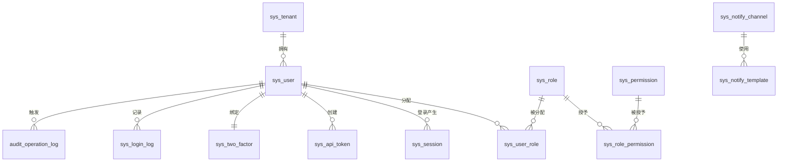
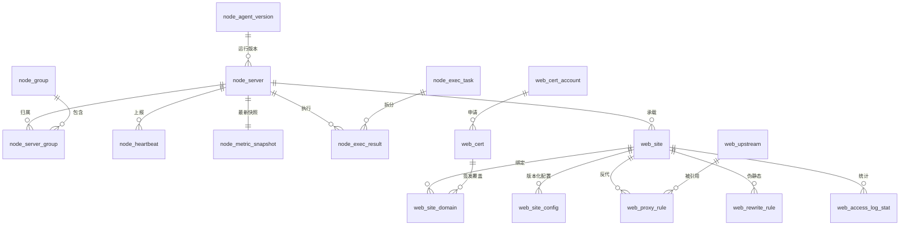
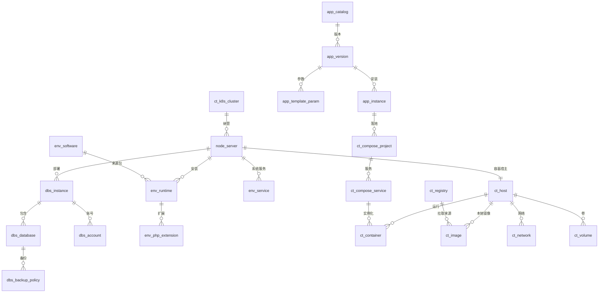
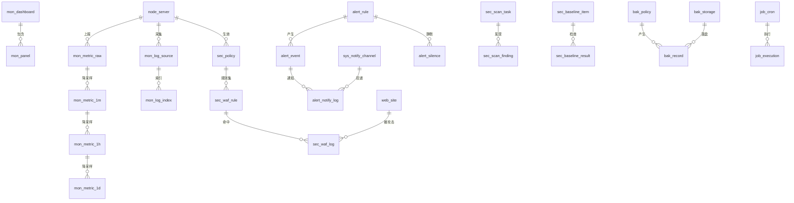
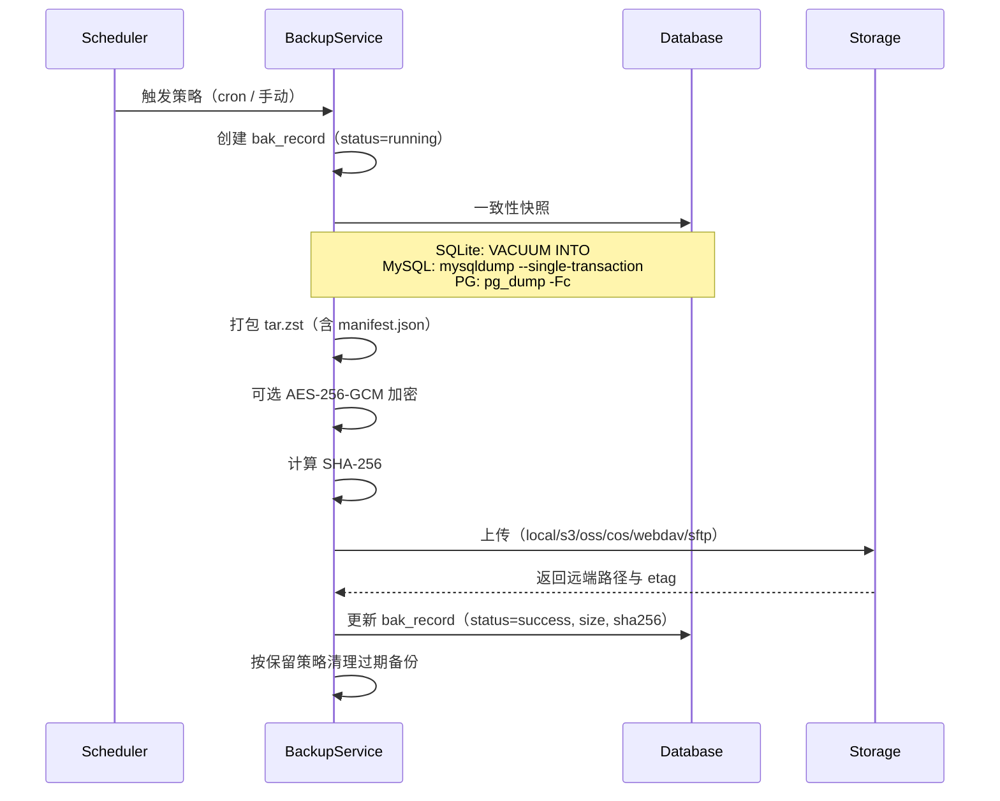

# NovaPanel（星舵面板）· 数据库设计

## 文档信息

| 项目 | 内容 |
| --- | --- |
| 文档名称 | 04-数据库设计 |
| 文档版本 | v1.0 |
| 更新日期 | 2026-08-17 |
| 状态 | 定稿 |
| 适用版本 | NovaPanel v1.0 |
| 产品代号 | nova |
| 覆盖内容 | 设计原则、表清单、ER 图、三数据库类型映射、88 张表完整 DDL、索引设计、时序降采样、GORM 模型、迁移规范、种子数据、容量估算、备份恢复、多租户隔离 |
| 关联文档 | [系统架构设计](./02-系统架构设计.md)、[技术栈与工程规范](./03-技术栈与工程规范.md)、[API 接口规范](./05-API接口规范.md)、[多节点集群与 Agent](./10-多节点集群与Agent.md)、[监控告警与可观测](./11-监控告警与可观测.md)、[安全合规与审计](./12-安全合规与审计.md) |

## 目录

- [4.1 设计原则与公共约定](#41-设计原则与公共约定)
- [4.2 全库表清单总表](#42-全库表清单总表)
- [4.3 ER 关系图](#43-er-关系图)
- [4.4 数据类型与三数据库映射](#44-数据类型与三数据库映射)
- [4.5 sys_ 系统与权限域](#45-sys_-系统与权限域)
- [4.6 node_ 集群节点域](#46-node_-集群节点域)
- [4.7 web_ 网站与证书域](#47-web_-网站与证书域)
- [4.8 dbs_ 与 env_ 服务环境域](#48-dbs_-与-env_-服务环境域)
- [4.9 file_ 与 term_ 文件终端域](#49-file_-与-term_-文件终端域)
- [4.10 ct_ 容器与编排域](#410-ct_-容器与编排域)
- [4.11 mon_ 与 alert_ 监控告警域](#411-mon_-与-alert_-监控告警域)
- [4.12 sec_ 与 audit_ 安全审计域](#412-sec_-与-audit_-安全审计域)
- [4.13 app_ job_ bak_ ops_ 应用运维域](#413-app_-job_-bak_-ops_-应用运维域)
- [4.14 索引设计与慢查询防范](#414-索引设计与慢查询防范)
- [4.15 时序表分区与降采样策略](#415-时序表分区与降采样策略)
- [4.16 GORM 模型定义示例](#416-gorm-模型定义示例)
- [4.17 迁移文件规范](#417-迁移文件规范)
- [4.18 初始化种子数据](#418-初始化种子数据)
- [4.19 容量估算与性能优化](#419-容量估算与性能优化)
- [4.20 备份与恢复方案](#420-备份与恢复方案)
- [4.21 多租户数据隔离方案](#421-多租户数据隔离方案)
- [4.22 附录：一致性检查清单](#422-附录一致性检查清单)

## 4.1 设计原则与公共约定

### 4.1.1 硬性原则

1. 默认数据库为 SQLite（modernc.org/sqlite 纯 Go 驱动，免 CGO），单文件位于 `/opt/novapanel/data/nova.db`；可选 MySQL 8.0+ / PostgreSQL 14+。所有 DDL 以 MySQL 8.0 语法为准，每张表后给出 SQLite 差异说明。
2. 命名全部小写下划线，表名带模块前缀，索引统一 `idx_<表名去前缀>_<字段缩写>`，唯一索引 `uk_`，外键约束不落库（应用层维护），避免 SQLite 与分布式场景下的删除阻塞。
3. 主键 `id` 为 BIGINT，由雪花算法（Snowflake，workerID 取控制面实例序号）生成，**禁止自增**，保证多控制面实例与离线导入时的 ID 不冲突。
4. 所有业务表软删除，`deleted_at` 为 NULL 表示未删除；高频写入的时序与日志表（`mon_metric_*`、`node_heartbeat`、`sec_waf_log`、`audit_*`、`alert_notify_log`、`term_command_audit`）**不做软删**，按保留期物理清理。
5. 时间统一 UTC 存储，DATETIME(3) 精度到毫秒，展示层按用户时区转换。禁止使用 TIMESTAMP（避免 2038 与时区隐式转换）。
6. 布尔语义字段统一 `TINYINT(1)`，0=否 1=是，字段名以 `is_`/`enabled`/`has_` 开头。
7. 枚举字段统一 `VARCHAR(32)`，取值在 `sys_setting` 的 `enum.*` 键或本文档字段说明表中固化，不使用数据库 ENUM 类型。
8. 结构化字段统一 `TEXT` 存 JSON，字段名以 `_json` 结尾，并在字段说明表中给出 JSON Schema 摘要。禁止使用 MySQL 原生 JSON 类型以保持三库一致。
9. 敏感字段（数据库密码、私钥、Token、2FA 密钥、云厂商 AK/SK）落库前用 AES-256-GCM 加密，字段名以 `_enc` 结尾，密钥由 `/opt/novapanel/data/.master.key`（0600）派生，详见[安全合规与审计](./12-安全合规与审计.md)。

### 4.1.2 公共字段（所有业务表统一携带，后续各表字段说明表不再重复）

| 字段 | 类型 | 必填 | 默认值 | 说明 |
| --- | --- | --- | --- | --- |
| id | BIGINT | 是 | 无 | 雪花 ID，主键，应用层生成 |
| created_at | DATETIME(3) | 是 | CURRENT_TIMESTAMP(3) | 创建时间（UTC） |
| updated_at | DATETIME(3) | 是 | CURRENT_TIMESTAMP(3) ON UPDATE | 更新时间（UTC） |
| deleted_at | DATETIME(3) | 否 | NULL | 软删时间，NULL 为有效记录 |
| created_by | BIGINT | 是 | 0 | 创建人 `sys_user.id`，系统内置数据为 0 |
| tenant_id | BIGINT | 是 | 0 | 租户 ID，0 表示单租户/全局数据 |

公共索引：每张业务表均带 `KEY idx_<表>_tenant (tenant_id, deleted_at)`，租户过滤与软删过滤合并走同一索引；DDL 中已逐表列出，不再单独强调。

## 4.2 全库表清单总表

v1.0 共 88 张表。「预估量」按 50 节点、100 网站、单租户中型部署一年估算；「分表」列标注是否需要按时间或节点分表/分区。

| 表名 | 中文名 | 模块 | 预估数据量 | 软删 | 分表 |
| --- | --- | --- | --- | --- | --- |
| sys_user | 用户 | sys | 100 | 是 | 否 |
| sys_role | 角色 | sys | 20 | 是 | 否 |
| sys_user_role | 用户角色关联 | sys | 300 | 否 | 否 |
| sys_permission | 权限点 | sys | 400 | 否 | 否 |
| sys_role_permission | 角色权限关联 | sys | 4,000 | 否 | 否 |
| sys_tenant | 租户 | sys | 50 | 是 | 否 |
| sys_setting | 系统设置 | sys | 300 | 否 | 否 |
| sys_session | 登录会话 | sys | 5,000 | 否 | 否 |
| sys_api_token | API 令牌 | sys | 200 | 是 | 否 |
| sys_two_factor | 双因子配置 | sys | 100 | 是 | 否 |
| sys_login_log | 登录日志 | sys | 50 万 | 否 | 按月 |
| sys_notify_channel | 通知通道 | sys | 30 | 是 | 否 |
| sys_notify_template | 通知模板 | sys | 60 | 是 | 否 |
| sys_casbin_rule | Casbin 策略 | sys | 2,000 | 否 | 否 |
| sys_dict | 枚举字典 | sys | 300 | 是 | 否 |
| sys_schema_migration | 迁移版本 | sys | 100 | 否 | 否 |
| node_server | 节点服务器 | node | 500 | 是 | 否 |
| node_group | 节点分组 | node | 50 | 是 | 否 |
| node_server_group | 节点分组关联 | node | 1,000 | 否 | 否 |
| node_agent_version | Agent 版本 | node | 50 | 是 | 否 |
| node_heartbeat | 节点心跳 | node | 1,300 万 | 否 | 按周 |
| node_metric_snapshot | 节点指标快照 | node | 500 | 否 | 否 |
| node_exec_task | 批量执行任务 | node | 10 万 | 是 | 按月 |
| node_exec_result | 批量执行结果 | node | 500 万 | 否 | 按月 |
| web_site | 网站 | web | 500 | 是 | 否 |
| web_site_domain | 网站域名 | web | 2,000 | 是 | 否 |
| web_site_config | 网站配置版本 | web | 2 万 | 是 | 否 |
| web_cert | 证书 | web | 2,000 | 是 | 否 |
| web_cert_account | ACME 账户 | web | 20 | 是 | 否 |
| web_proxy_rule | 反向代理规则 | web | 3,000 | 是 | 否 |
| web_upstream | 上游集群 | web | 1,000 | 是 | 否 |
| web_rewrite_rule | 伪静态规则 | web | 3,000 | 是 | 否 |
| web_access_log_stat | 访问日志统计 | web | 400 万 | 否 | 按月 |
| dbs_instance | 数据库实例 | dbs | 200 | 是 | 否 |
| dbs_database | 数据库 | dbs | 2,000 | 是 | 否 |
| dbs_account | 数据库账号 | dbs | 3,000 | 是 | 否 |
| dbs_backup_policy | 数据库备份策略 | dbs | 500 | 是 | 否 |

| env_software | 软件包 | env | 300 | 是 | 否 |
| env_runtime | 运行环境 | env | 500 | 是 | 否 |
| env_php_extension | PHP 扩展 | env | 3,000 | 否 | 否 |
| env_service | 系统服务 | env | 5,000 | 否 | 否 |
| file_favorite | 文件收藏 | file | 2,000 | 是 | 否 |
| file_recycle | 回收站 | file | 10 万 | 否 | 否 |
| file_transfer_task | 文件传输任务 | file | 50 万 | 是 | 按月 |
| term_session | 终端会话 | term | 20 万 | 是 | 按月 |
| term_recording | 终端录像 | term | 20 万 | 是 | 按月 |
| term_command_audit | 命令审计 | term | 2,000 万 | 否 | 按月 |
| ct_host | 容器宿主 | ct | 500 | 是 | 否 |
| ct_container | 容器 | ct | 5,000 | 是 | 否 |
| ct_image | 镜像 | ct | 5,000 | 是 | 否 |
| ct_registry | 镜像仓库 | ct | 50 | 是 | 否 |
| ct_network | 容器网络 | ct | 1,000 | 是 | 否 |
| ct_volume | 容器卷 | ct | 2,000 | 是 | 否 |
| ct_compose_project | Compose 项目 | ct | 500 | 是 | 否 |
| ct_compose_service | Compose 服务 | ct | 3,000 | 是 | 否 |
| ct_k8s_cluster | K8s 集群 | ct | 20 | 是 | 否 |
| mon_metric_raw | 原始指标（10s） | mon | 4.3 亿 | 否 | 按天 |
| mon_metric_1m | 1 分钟聚合 | mon | 3.2 亿 | 否 | 按周 |
| mon_metric_1h | 1 小时聚合 | mon | 6,500 万 | 否 | 按月 |
| mon_metric_1d | 1 天聚合 | mon | 270 万 | 否 | 否 |
| mon_dashboard | 仪表盘 | mon | 100 | 是 | 否 |
| mon_panel | 图表面板 | mon | 1,000 | 是 | 否 |
| mon_log_source | 日志源 | mon | 500 | 是 | 否 |
| mon_log_index | 日志索引 | mon | 1,000 万 | 否 | 按周 |
| alert_rule | 告警规则 | alert | 500 | 是 | 否 |
| alert_event | 告警事件 | alert | 100 万 | 否 | 按月 |
| alert_silence | 告警静默 | alert | 500 | 是 | 否 |
| alert_notify_log | 通知记录 | alert | 300 万 | 否 | 按月 |
| sec_policy | 安全策略 | sec | 200 | 是 | 否 |
| sec_waf_rule | WAF 规则 | sec | 5,000 | 是 | 否 |
| sec_waf_log | WAF 拦截日志 | sec | 5,000 万 | 否 | 按天 |
| sec_ip_rule | IP 黑白名单 | sec | 5 万 | 是 | 否 |
| sec_scan_task | 扫描任务 | sec | 5 万 | 是 | 按月 |
| sec_scan_finding | 扫描发现 | sec | 100 万 | 否 | 按月 |
| sec_baseline_item | 基线检查项 | sec | 400 | 否 | 否 |
| sec_baseline_result | 基线检查结果 | sec | 200 万 | 否 | 按月 |
| audit_operation_log | 操作审计日志 | audit | 1,000 万 | 否 | 按月 |
| audit_data_change | 数据变更审计 | audit | 500 万 | 否 | 按月 |

| app_catalog | 应用目录 | app | 500 | 是 | 否 |
| app_version | 应用版本 | app | 5,000 | 是 | 否 |
| app_instance | 应用实例 | app | 1,000 | 是 | 否 |
| app_template_param | 模板参数 | app | 1 万 | 否 | 否 |
| job_cron | 计划任务 | job | 2,000 | 是 | 否 |
| job_execution | 任务执行记录 | job | 800 万 | 否 | 按月 |
| bak_policy | 备份策略 | bak | 500 | 是 | 否 |
| bak_record | 备份记录 | bak | 50 万 | 是 | 按月 |
| bak_storage | 备份存储 | bak | 50 | 是 | 否 |
| ops_upgrade_record | 升级记录 | ops | 500 | 否 | 否 |

分域小计：sys 16、node 8、web 9、dbs 4、env 4、file 3、term 3、ct 9、mon 8、alert 4、sec 8、audit 2、app 4、job 2、bak 3、ops 1，合计 88 张。其中 `sys_casbin_rule`、`sys_dict`、`sys_schema_migration` 为框架基础设施表（DDL 分别见 4.5.14、4.5.15、4.17.2）。

## 4.3 ER 关系图

### 4.3.1 用户权限与租户域



### 4.3.2 节点与网站域



### 4.3.3 数据库、环境与容器域



### 4.3.4 监控告警与安全审计域



## 4.4 数据类型与三数据库映射

### 4.4.1 类型映射对照表

| 逻辑类型 | MySQL 8.0 | SQLite | PostgreSQL 14+ | Go 类型 | 说明 |
| --- | --- | --- | --- | --- | --- |
| 主键 ID | BIGINT NOT NULL | INTEGER NOT NULL | BIGINT NOT NULL | int64 | 雪花 ID，非自增 |
| 外键引用 | BIGINT NOT NULL DEFAULT 0 | INTEGER NOT NULL DEFAULT 0 | BIGINT NOT NULL DEFAULT 0 | int64 | 0 表示未关联 |
| 布尔 | TINYINT(1) NOT NULL DEFAULT 0 | INTEGER NOT NULL DEFAULT 0 | SMALLINT NOT NULL DEFAULT 0 | bool | 不用 PG 的 BOOLEAN，保持数值一致 |
| 短字符串 | VARCHAR(64) | TEXT | VARCHAR(64) | string | SQLite 无长度约束，应用层校验 |
| 枚举 | VARCHAR(32) | TEXT | VARCHAR(32) | string | 取值见字段说明表 |
| 路径/URL | VARCHAR(512) | TEXT | VARCHAR(512) | string | 超长走 TEXT |
| 长文本 | TEXT | TEXT | TEXT | string | 配置正文、脚本 |
| JSON | TEXT | TEXT | TEXT | datatypes.JSON / string | 统一 TEXT，应用层序列化 |
| 时间 | DATETIME(3) | DATETIME | TIMESTAMP(3) | time.Time | UTC 存储，禁用 TIMESTAMP(MySQL) |
| 小数（金额/比率） | DECIMAL(18,6) | NUMERIC | NUMERIC(18,6) | decimal.Decimal | 避免 float 精度丢失 |
| 指标值 | DOUBLE | REAL | DOUBLE PRECISION | float64 | 监控数值 |
| 计数器 | BIGINT UNSIGNED | INTEGER | BIGINT | uint64 | PG 无 UNSIGNED，应用层保证非负 |
| 二进制 | BLOB | BLOB | BYTEA | []byte | 录像帧、证书 DER |
| IP 地址 | VARBINARY(16) | BLOB | INET | net.IP | 统一按 16 字节存，兼容 IPv6 |

### 4.4.2 方言差异与统一处理

| 差异点 | MySQL | SQLite | PostgreSQL | NovaPanel 处理方式 |
| --- | --- | --- | --- | --- |
| 字符集 | utf8mb4_0900_ai_ci | UTF-8 固定 | UTF8 | 建库时强制 utf8mb4；PG 用 `C.UTF-8` collation |
| 自动更新时间 | ON UPDATE CURRENT_TIMESTAMP | 不支持 | 不支持 | 由 GORM `autoUpdateTime` 统一在应用层写入 |
| 表注释 | COMMENT | 不支持 | COMMENT ON TABLE | SQLite 注释以 `--` 行注释保留在迁移文件 |
| 字段注释 | COMMENT | 不支持 | COMMENT ON COLUMN | 同上 |
| Upsert | INSERT ... ON DUPLICATE KEY UPDATE | INSERT ... ON CONFLICT DO UPDATE | INSERT ... ON CONFLICT DO UPDATE | GORM `clause.OnConflict` 统一 |
| 分区表 | PARTITION BY RANGE | 不支持，按表名后缀分表 | 声明式分区 | 时序表统一走「按名分表 + 视图聚合」，见 4.15 |
| 大小写敏感 | 表名依平台 | 不敏感 | 敏感 | 全库强制小写，禁止驼峰 |
| 布尔比较 | `= 1` | `= 1` | `= 1` | 统一写 `= 1`，禁止 `IS TRUE` |
| 索引前缀长度 | 支持 `KEY(col(64))` | 不支持 | 不支持 | 不使用前缀索引，改用生成的哈希列 |
| 并发写 | 行锁 | 库级写锁（WAL 下单写多读） | 行锁 | SQLite 部署下写操作串行化，见 4.19 |

## 4.5 sys_ 系统与权限域

### 4.5.1 sys_user 用户表

```sql
CREATE TABLE `sys_user` (
  `id` BIGINT NOT NULL COMMENT '雪花ID',
  `username` VARCHAR(64) NOT NULL COMMENT '登录名，小写字母数字下划线',
  `nickname` VARCHAR(64) NOT NULL DEFAULT '' COMMENT '显示名',
  `email` VARCHAR(128) NOT NULL DEFAULT '' COMMENT '邮箱',
  `mobile` VARCHAR(32) NOT NULL DEFAULT '' COMMENT '手机号',
  `password_hash` VARCHAR(128) NOT NULL COMMENT 'bcrypt cost=12 哈希',
  `avatar` VARCHAR(512) NOT NULL DEFAULT '' COMMENT '头像URL或本地路径',
  `status` VARCHAR(32) NOT NULL DEFAULT 'active' COMMENT '状态 active/disabled/locked/pending',
  `is_super` TINYINT(1) NOT NULL DEFAULT 0 COMMENT '是否超级管理员，绕过Casbin',
  `two_factor_enabled` TINYINT(1) NOT NULL DEFAULT 0 COMMENT '是否启用2FA',
  `allow_ip_json` TEXT COMMENT '登录IP白名单 JSON 数组，空表示不限制',
  `last_login_at` DATETIME(3) NULL COMMENT '最后登录时间',
  `last_login_ip` VARCHAR(64) NOT NULL DEFAULT '' COMMENT '最后登录IP',
  `login_fail_count` INT NOT NULL DEFAULT 0 COMMENT '连续登录失败次数',
  `locked_until` DATETIME(3) NULL COMMENT '锁定至该时间',
  `password_updated_at` DATETIME(3) NULL COMMENT '密码最后修改时间',
  `must_change_password` TINYINT(1) NOT NULL DEFAULT 0 COMMENT '下次登录强制改密',
  `lang` VARCHAR(16) NOT NULL DEFAULT 'zh-CN' COMMENT '界面语言',
  `timezone` VARCHAR(64) NOT NULL DEFAULT 'Asia/Shanghai' COMMENT '时区',
  `remark` VARCHAR(255) NOT NULL DEFAULT '' COMMENT '备注',
  `created_at` DATETIME(3) NOT NULL DEFAULT CURRENT_TIMESTAMP(3),
  `updated_at` DATETIME(3) NOT NULL DEFAULT CURRENT_TIMESTAMP(3) ON UPDATE CURRENT_TIMESTAMP(3),
  `deleted_at` DATETIME(3) NULL,
  `created_by` BIGINT NOT NULL DEFAULT 0,
  `tenant_id` BIGINT NOT NULL DEFAULT 0,
  PRIMARY KEY (`id`),
  UNIQUE KEY `uk_user_username` (`tenant_id`,`username`,`deleted_at`),
  KEY `idx_user_email` (`email`),
  KEY `idx_user_status` (`status`,`deleted_at`),
  KEY `idx_user_tenant` (`tenant_id`,`deleted_at`)
) ENGINE=InnoDB DEFAULT CHARSET=utf8mb4 COMMENT='用户表';
```

| 字段 | 类型 | 必填 | 默认 | 说明 / 枚举取值 |
| --- | --- | --- | --- | --- |
| username | VARCHAR(64) | 是 | 无 | 正则 `^[a-z][a-z0-9_]{2,63}$`，租户内唯一 |
| password_hash | VARCHAR(128) | 是 | 无 | bcrypt cost=12；接口层永不返回 |
| status | VARCHAR(32) | 是 | active | active 正常 / disabled 停用 / locked 锁定 / pending 待激活 |
| is_super | TINYINT(1) | 是 | 0 | 1 时跳过权限校验，全库仅允许 1 个 |
| allow_ip_json | TEXT | 否 | NULL | Schema：`["10.0.0.0/8","1.2.3.4"]`，CIDR 或单 IP |
| login_fail_count | INT | 是 | 0 | 达 `security.login_fail_max` 后写 locked_until |

SQLite 差异：`TINYINT(1)`→`INTEGER`，`VARCHAR(n)`→`TEXT`，去掉 `ENGINE`/`CHARSET`/`COMMENT`/`ON UPDATE`；唯一索引中 `deleted_at` 为 NULL 时 SQLite 视为互不相等，需改为 `deleted_at_flag` 生成列或在应用层做唯一性预检（NovaPanel 采用后者）。

> 书写约定：`sys_user` 展示了公共字段的完整写法。后续各表为压缩篇幅，将 5 个公共字段合并为两行书写（语义与 4.1.2 完全一致，SQL 仍可直接执行）；SQLite 差异若与 `sys_user` 相同，仅标注「同 4.5.1 通用差异」。

### 4.5.2 sys_role 角色表

```sql
CREATE TABLE `sys_role` (
  `id` BIGINT NOT NULL COMMENT '雪花ID',
  `code` VARCHAR(64) NOT NULL COMMENT '角色标识，如 admin/ops/dev/readonly',
  `name` VARCHAR(64) NOT NULL COMMENT '角色名称',
  `description` VARCHAR(255) NOT NULL DEFAULT '' COMMENT '角色描述',
  `is_builtin` TINYINT(1) NOT NULL DEFAULT 0 COMMENT '是否内置角色，内置不可删改权限',
  `data_scope` VARCHAR(32) NOT NULL DEFAULT 'self' COMMENT '数据范围 all/group/self',
  `scope_node_json` TEXT COMMENT 'data_scope=group 时的节点/分组ID JSON',
  `sort` INT NOT NULL DEFAULT 0 COMMENT '排序权重，升序',
  `status` VARCHAR(32) NOT NULL DEFAULT 'active' COMMENT '状态 active/disabled',
  `created_at` DATETIME(3) NOT NULL DEFAULT CURRENT_TIMESTAMP(3), `updated_at` DATETIME(3) NOT NULL DEFAULT CURRENT_TIMESTAMP(3) ON UPDATE CURRENT_TIMESTAMP(3),
  `deleted_at` DATETIME(3) NULL, `created_by` BIGINT NOT NULL DEFAULT 0, `tenant_id` BIGINT NOT NULL DEFAULT 0,
  PRIMARY KEY (`id`),
  UNIQUE KEY `uk_role_code` (`tenant_id`,`code`,`deleted_at`),
  KEY `idx_role_tenant` (`tenant_id`,`deleted_at`)
) ENGINE=InnoDB DEFAULT CHARSET=utf8mb4 COMMENT='角色表';
```

| 字段 | 类型 | 必填 | 默认 | 说明 / 枚举取值 |
| --- | --- | --- | --- | --- |
| code | VARCHAR(64) | 是 | 无 | Casbin 中的 role 主体，格式 `role:<code>` |
| is_builtin | TINYINT(1) | 是 | 0 | 内置角色：admin、ops、developer、auditor、readonly |
| data_scope | VARCHAR(32) | 是 | self | all 全部节点 / group 指定分组 / self 仅自己创建 |
| scope_node_json | TEXT | 否 | NULL | Schema：`{"groupIds":[1],"nodeIds":[2,3]}` |

SQLite 差异：同 4.5.1 通用差异。

### 4.5.3 sys_user_role 用户角色关联表

```sql
CREATE TABLE `sys_user_role` (
  `id` BIGINT NOT NULL,
  `user_id` BIGINT NOT NULL COMMENT '用户ID',
  `role_id` BIGINT NOT NULL COMMENT '角色ID',
  `created_at` DATETIME(3) NOT NULL DEFAULT CURRENT_TIMESTAMP(3),
  `created_by` BIGINT NOT NULL DEFAULT 0, `tenant_id` BIGINT NOT NULL DEFAULT 0,
  PRIMARY KEY (`id`),
  UNIQUE KEY `uk_ur_user_role` (`user_id`,`role_id`),
  KEY `idx_ur_role` (`role_id`)
) ENGINE=InnoDB DEFAULT CHARSET=utf8mb4 COMMENT='用户角色关联表';
```

| 字段 | 类型 | 必填 | 默认 | 说明 |
| --- | --- | --- | --- | --- |
| user_id | BIGINT | 是 | 无 | 关联 `sys_user.id`，删除用户时物理删除关联 |
| role_id | BIGINT | 是 | 无 | 关联 `sys_role.id` |

关联表无软删、无 updated_at，变更即物理删除后重建，Casbin 分组策略随之刷新。

### 4.5.4 sys_permission 权限点表

```sql
CREATE TABLE `sys_permission` (
  `id` BIGINT NOT NULL,
  `code` VARCHAR(128) NOT NULL COMMENT '权限标识 module:resource:action',
  `name` VARCHAR(64) NOT NULL COMMENT '权限名称',
  `module` VARCHAR(32) NOT NULL COMMENT '所属模块 sys/node/web/dbs/env/file/term/ct/mon/alert/sec/audit/app/job/bak/ops',
  `resource` VARCHAR(64) NOT NULL COMMENT '资源名，如 website/cert/container',
  `action` VARCHAR(32) NOT NULL COMMENT '动作 list/read/create/update/delete/exec/export',
  `api_path` VARCHAR(255) NOT NULL DEFAULT '' COMMENT '绑定的API路径，支持*通配',
  `http_method` VARCHAR(16) NOT NULL DEFAULT '' COMMENT 'GET/POST/PUT/PATCH/DELETE/*',
  `is_sensitive` TINYINT(1) NOT NULL DEFAULT 0 COMMENT '敏感操作，需二次确认',
  `need_audit` TINYINT(1) NOT NULL DEFAULT 1 COMMENT '是否写操作审计',
  `sort` INT NOT NULL DEFAULT 0,
  `created_at` DATETIME(3) NOT NULL DEFAULT CURRENT_TIMESTAMP(3), `updated_at` DATETIME(3) NOT NULL DEFAULT CURRENT_TIMESTAMP(3) ON UPDATE CURRENT_TIMESTAMP(3),
  `created_by` BIGINT NOT NULL DEFAULT 0, `tenant_id` BIGINT NOT NULL DEFAULT 0,
  PRIMARY KEY (`id`),
  UNIQUE KEY `uk_perm_code` (`code`),
  KEY `idx_perm_module` (`module`,`resource`)
) ENGINE=InnoDB DEFAULT CHARSET=utf8mb4 COMMENT='权限点表';
```

| 字段 | 类型 | 必填 | 默认 | 说明 / 枚举取值 |
| --- | --- | --- | --- | --- |
| code | VARCHAR(128) | 是 | 无 | 全局唯一，如 `web:website:create`，全量清单见 4.18.2 |
| action | VARCHAR(32) | 是 | 无 | list 列表 / read 详情 / create / update / delete / exec 执行 / export 导出 |
| is_sensitive | TINYINT(1) | 是 | 0 | 1 时接口需携带二次确认 token，见 [API 接口规范](./05-API接口规范.md) 5.8 |

权限点为系统内置数据，由迁移脚本幂等写入（按 code upsert），不允许用户新增。

### 4.5.5 sys_role_permission 角色权限关联表

```sql
CREATE TABLE `sys_role_permission` (
  `id` BIGINT NOT NULL,
  `role_id` BIGINT NOT NULL COMMENT '角色ID',
  `permission_id` BIGINT NOT NULL COMMENT '权限点ID',
  `permission_code` VARCHAR(128) NOT NULL COMMENT '权限标识冗余，便于导出与Casbin加载',
  `created_at` DATETIME(3) NOT NULL DEFAULT CURRENT_TIMESTAMP(3),
  `created_by` BIGINT NOT NULL DEFAULT 0, `tenant_id` BIGINT NOT NULL DEFAULT 0,
  PRIMARY KEY (`id`),
  UNIQUE KEY `uk_rp_role_perm` (`role_id`,`permission_id`),
  KEY `idx_rp_code` (`permission_code`)
) ENGINE=InnoDB DEFAULT CHARSET=utf8mb4 COMMENT='角色权限关联表';
```

| 字段 | 类型 | 必填 | 默认 | 说明 |
| --- | --- | --- | --- | --- |
| permission_code | VARCHAR(128) | 是 | 无 | 冗余字段，Casbin `p` 策略加载时避免 JOIN |

Casbin 启动时执行 `SELECT DISTINCT r.code, rp.permission_code FROM sys_role_permission rp JOIN sys_role r ON r.id=rp.role_id WHERE r.deleted_at IS NULL` 装载策略，变更后调用 `enforcer.LoadPolicy()` 热更新。

### 4.5.6 sys_tenant 租户表

```sql
CREATE TABLE `sys_tenant` (
  `id` BIGINT NOT NULL,
  `code` VARCHAR(64) NOT NULL COMMENT '租户标识',
  `name` VARCHAR(128) NOT NULL COMMENT '租户名称',
  `status` VARCHAR(32) NOT NULL DEFAULT 'active' COMMENT '状态 active/suspended/expired',
  `expire_at` DATETIME(3) NULL COMMENT '到期时间，NULL 为永久',
  `quota_json` TEXT COMMENT '资源配额 JSON',
  `contact_name` VARCHAR(64) NOT NULL DEFAULT '',
  `contact_email` VARCHAR(128) NOT NULL DEFAULT '',
  `contact_mobile` VARCHAR(32) NOT NULL DEFAULT '',
  `remark` VARCHAR(255) NOT NULL DEFAULT '',
  `created_at` DATETIME(3) NOT NULL DEFAULT CURRENT_TIMESTAMP(3), `updated_at` DATETIME(3) NOT NULL DEFAULT CURRENT_TIMESTAMP(3) ON UPDATE CURRENT_TIMESTAMP(3),
  `deleted_at` DATETIME(3) NULL, `created_by` BIGINT NOT NULL DEFAULT 0, `tenant_id` BIGINT NOT NULL DEFAULT 0,
  PRIMARY KEY (`id`),
  UNIQUE KEY `uk_tenant_code` (`code`,`deleted_at`),
  KEY `idx_tenant_status` (`status`,`expire_at`)
) ENGINE=InnoDB DEFAULT CHARSET=utf8mb4 COMMENT='租户表';
```

| 字段 | 类型 | 必填 | 默认 | 说明 / 枚举取值 |
| --- | --- | --- | --- | --- |
| status | VARCHAR(32) | 是 | active | active 正常 / suspended 暂停 / expired 已过期 |
| quota_json | TEXT | 否 | NULL | Schema：`{"maxNodes":10,"maxSites":50,"maxUsers":20,"maxStorageGb":500}` |

租户表自身 `tenant_id` 恒为 0（元数据表）。隔离策略见 4.21。

### 4.5.7 sys_setting 系统设置表

```sql
CREATE TABLE `sys_setting` (
  `id` BIGINT NOT NULL,
  `group_key` VARCHAR(64) NOT NULL COMMENT '分组 basic/security/mail/monitor/backup/enum',
  `item_key` VARCHAR(128) NOT NULL COMMENT '配置项键，如 security.login_fail_max',
  `item_value` TEXT COMMENT '配置值，按 value_type 解析',
  `value_type` VARCHAR(32) NOT NULL DEFAULT 'string' COMMENT '类型 string/int/bool/json/secret',
  `default_value` TEXT COMMENT '出厂默认值，用于恢复默认',
  `title` VARCHAR(128) NOT NULL DEFAULT '' COMMENT '中文标题',
  `description` VARCHAR(512) NOT NULL DEFAULT '' COMMENT '说明',
  `is_encrypted` TINYINT(1) NOT NULL DEFAULT 0 COMMENT '值是否加密存储',
  `is_public` TINYINT(1) NOT NULL DEFAULT 0 COMMENT '是否允许未登录读取（如登录页标题）',
  `sort` INT NOT NULL DEFAULT 0,
  `created_at` DATETIME(3) NOT NULL DEFAULT CURRENT_TIMESTAMP(3), `updated_at` DATETIME(3) NOT NULL DEFAULT CURRENT_TIMESTAMP(3) ON UPDATE CURRENT_TIMESTAMP(3),
  `created_by` BIGINT NOT NULL DEFAULT 0, `tenant_id` BIGINT NOT NULL DEFAULT 0,
  PRIMARY KEY (`id`),
  UNIQUE KEY `uk_setting_key` (`tenant_id`,`item_key`),
  KEY `idx_setting_group` (`group_key`,`sort`)
) ENGINE=InnoDB DEFAULT CHARSET=utf8mb4 COMMENT='系统设置表';
```

| 字段 | 类型 | 必填 | 默认 | 说明 / 枚举取值 |
| --- | --- | --- | --- | --- |
| value_type | VARCHAR(32) | 是 | string | string / int / bool / json / secret（secret 强制加密） |
| is_public | TINYINT(1) | 是 | 0 | 1 时可通过 `GET /api/v1/public/settings` 匿名读取 |

默认设置项清单见 4.18.3；设置读取走内存缓存 + bbolt 二级缓存，变更时发布 `setting.changed` 事件。

### 4.5.8 sys_session 登录会话表

```sql
CREATE TABLE `sys_session` (
  `id` BIGINT NOT NULL,
  `user_id` BIGINT NOT NULL COMMENT '用户ID',
  `jti` VARCHAR(64) NOT NULL COMMENT 'accessToken 的 JWT ID',
  `refresh_token_hash` VARCHAR(128) NOT NULL COMMENT 'refreshToken 的 SHA-256',
  `device_type` VARCHAR(32) NOT NULL DEFAULT 'web' COMMENT '设备类型 web/cli/mobile/api',
  `user_agent` VARCHAR(512) NOT NULL DEFAULT '',
  `client_ip` VARCHAR(64) NOT NULL DEFAULT '',
  `login_at` DATETIME(3) NOT NULL COMMENT '登录时间',
  `last_active_at` DATETIME(3) NOT NULL COMMENT '最后活跃时间',
  `access_expire_at` DATETIME(3) NOT NULL COMMENT 'accessToken 过期时间',
  `refresh_expire_at` DATETIME(3) NOT NULL COMMENT 'refreshToken 过期时间',
  `status` VARCHAR(32) NOT NULL DEFAULT 'active' COMMENT '状态 active/revoked/expired',
  `revoke_reason` VARCHAR(128) NOT NULL DEFAULT '' COMMENT '吊销原因 logout/kickout/password_changed/admin_revoke',
  `created_at` DATETIME(3) NOT NULL DEFAULT CURRENT_TIMESTAMP(3), `updated_at` DATETIME(3) NOT NULL DEFAULT CURRENT_TIMESTAMP(3) ON UPDATE CURRENT_TIMESTAMP(3),
  `created_by` BIGINT NOT NULL DEFAULT 0, `tenant_id` BIGINT NOT NULL DEFAULT 0,
  PRIMARY KEY (`id`),
  UNIQUE KEY `uk_session_jti` (`jti`),
  KEY `idx_session_refresh` (`refresh_token_hash`),
  KEY `idx_session_user` (`user_id`,`status`,`last_active_at`),
  KEY `idx_session_gc` (`refresh_expire_at`)
) ENGINE=InnoDB DEFAULT CHARSET=utf8mb4 COMMENT='登录会话表';
```

| 字段 | 类型 | 必填 | 默认 | 说明 / 枚举取值 |
| --- | --- | --- | --- | --- |
| jti | VARCHAR(64) | 是 | 无 | UUID v4，JWT `jti` claim，登出后进 bbolt 黑名单直至过期 |
| refresh_token_hash | VARCHAR(128) | 是 | 无 | 仅存哈希；刷新时轮转（rotate），旧值立即失效 |
| status | VARCHAR(32) | 是 | active | active / revoked 已吊销 / expired 已过期 |

会话记录不软删，`refresh_expire_at < now() - 7d` 由 `job:session_gc` 每小时物理清理。

### 4.5.9 sys_api_token API 令牌表

```sql
CREATE TABLE `sys_api_token` (
  `id` BIGINT NOT NULL,
  `user_id` BIGINT NOT NULL COMMENT '归属用户',
  `name` VARCHAR(64) NOT NULL COMMENT '令牌名称',
  `access_key` VARCHAR(32) NOT NULL COMMENT '访问键 AK，前缀 nova_ak_',
  `secret_key_enc` VARCHAR(255) NOT NULL COMMENT 'SK 密文，AES-256-GCM',
  `secret_key_hint` VARCHAR(16) NOT NULL DEFAULT '' COMMENT 'SK 后四位，用于界面展示',
  `scope_json` TEXT COMMENT '授权权限点 JSON 数组，空表示继承用户全部权限',
  `allow_ip_json` TEXT COMMENT '来源IP白名单 JSON',
  `rate_limit_qps` INT NOT NULL DEFAULT 20 COMMENT '独立限流 QPS，0 表示用全局默认',
  `expire_at` DATETIME(3) NULL COMMENT '过期时间，NULL 永久',
  `last_used_at` DATETIME(3) NULL,
  `last_used_ip` VARCHAR(64) NOT NULL DEFAULT '',
  `used_count` BIGINT NOT NULL DEFAULT 0,
  `status` VARCHAR(32) NOT NULL DEFAULT 'active' COMMENT 'active/disabled/expired',
  `created_at` DATETIME(3) NOT NULL DEFAULT CURRENT_TIMESTAMP(3), `updated_at` DATETIME(3) NOT NULL DEFAULT CURRENT_TIMESTAMP(3) ON UPDATE CURRENT_TIMESTAMP(3),
  `deleted_at` DATETIME(3) NULL, `created_by` BIGINT NOT NULL DEFAULT 0, `tenant_id` BIGINT NOT NULL DEFAULT 0,
  PRIMARY KEY (`id`),
  UNIQUE KEY `uk_token_ak` (`access_key`),
  KEY `idx_token_user` (`user_id`,`status`,`deleted_at`)
) ENGINE=InnoDB DEFAULT CHARSET=utf8mb4 COMMENT='API令牌表';
```

| 字段 | 类型 | 必填 | 默认 | 说明 |
| --- | --- | --- | --- | --- |
| access_key | VARCHAR(32) | 是 | 无 | `nova_ak_` + 20 位 base62，创建后不可改 |
| secret_key_enc | VARCHAR(255) | 是 | 无 | 明文仅创建时返回一次；签名算法见 5.5.5 |
| scope_json | TEXT | 否 | NULL | Schema：`["web:website:list","mon:metric:read"]` |

### 4.5.10 sys_two_factor 双因子配置表

```sql
CREATE TABLE `sys_two_factor` (
  `id` BIGINT NOT NULL,
  `user_id` BIGINT NOT NULL COMMENT '用户ID',
  `type` VARCHAR(32) NOT NULL DEFAULT 'totp' COMMENT '类型 totp/email/sms/webauthn',
  `secret_enc` VARCHAR(255) NOT NULL DEFAULT '' COMMENT 'TOTP 密钥密文',
  `recovery_codes_enc` TEXT COMMENT '恢复码密文 JSON 数组（10 个，单次使用）',
  `used_recovery_count` INT NOT NULL DEFAULT 0 COMMENT '已使用恢复码数',
  `bound_at` DATETIME(3) NULL COMMENT '绑定完成时间',
  `last_verify_at` DATETIME(3) NULL COMMENT '最后校验成功时间',
  `verify_fail_count` INT NOT NULL DEFAULT 0 COMMENT '连续校验失败次数',
  `status` VARCHAR(32) NOT NULL DEFAULT 'pending' COMMENT 'pending/active/disabled',
  `created_at` DATETIME(3) NOT NULL DEFAULT CURRENT_TIMESTAMP(3), `updated_at` DATETIME(3) NOT NULL DEFAULT CURRENT_TIMESTAMP(3) ON UPDATE CURRENT_TIMESTAMP(3),
  `deleted_at` DATETIME(3) NULL, `created_by` BIGINT NOT NULL DEFAULT 0, `tenant_id` BIGINT NOT NULL DEFAULT 0,
  PRIMARY KEY (`id`),
  UNIQUE KEY `uk_2fa_user_type` (`user_id`,`type`,`deleted_at`)
) ENGINE=InnoDB DEFAULT CHARSET=utf8mb4 COMMENT='双因子配置表';
```

| 字段 | 类型 | 必填 | 默认 | 说明 / 枚举取值 |
| --- | --- | --- | --- | --- |
| type | VARCHAR(32) | 是 | totp | totp（v1.0 支持）/ email / sms / webauthn（v1.1+） |
| secret_enc | VARCHAR(255) | 否 | '' | base32 TOTP 密钥密文，period=30，digits=6，算法 SHA1 |
| recovery_codes_enc | TEXT | 否 | NULL | Schema：`[{"code":"xxxx-xxxx","usedAt":null}]` |

### 4.5.11 sys_login_log 登录日志表

```sql
CREATE TABLE `sys_login_log` (
  `id` BIGINT NOT NULL,
  `user_id` BIGINT NOT NULL DEFAULT 0 COMMENT '用户ID，登录名不存在时为0',
  `username` VARCHAR(64) NOT NULL DEFAULT '' COMMENT '尝试登录的用户名',
  `login_type` VARCHAR(32) NOT NULL DEFAULT 'password' COMMENT 'password/token/2fa/refresh/sso',
  `result` VARCHAR(32) NOT NULL COMMENT '结果 success/fail',
  `fail_reason` VARCHAR(128) NOT NULL DEFAULT '' COMMENT '失败原因 bad_credential/locked/disabled/2fa_invalid/ip_denied',
  `client_ip` VARCHAR(64) NOT NULL DEFAULT '',
  `ip_location` VARCHAR(128) NOT NULL DEFAULT '' COMMENT 'IP 归属地，离线库解析',
  `user_agent` VARCHAR(512) NOT NULL DEFAULT '',
  `device_type` VARCHAR(32) NOT NULL DEFAULT 'web',
  `session_id` BIGINT NOT NULL DEFAULT 0 COMMENT '成功时关联 sys_session.id',
  `trace_id` VARCHAR(64) NOT NULL DEFAULT '',
  `created_at` DATETIME(3) NOT NULL DEFAULT CURRENT_TIMESTAMP(3),
  `created_by` BIGINT NOT NULL DEFAULT 0, `tenant_id` BIGINT NOT NULL DEFAULT 0,
  PRIMARY KEY (`id`),
  KEY `idx_login_user_time` (`user_id`,`created_at`),
  KEY `idx_login_ip_time` (`client_ip`,`created_at`),
  KEY `idx_login_result_time` (`result`,`created_at`)
) ENGINE=InnoDB DEFAULT CHARSET=utf8mb4 COMMENT='登录日志表';
```

| 字段 | 类型 | 必填 | 默认 | 说明 / 枚举取值 |
| --- | --- | --- | --- | --- |
| result | VARCHAR(32) | 是 | 无 | success / fail |
| fail_reason | VARCHAR(128) | 否 | '' | bad_credential 密码错 / locked 锁定 / disabled 停用 / 2fa_invalid / ip_denied |

保留 180 天，按月分表 `sys_login_log_YYYYMM`（MySQL 用 RANGE 分区，SQLite 用分表）。同一 IP 5 分钟内 fail ≥ 10 次触发 `alert_rule` 内置规则 `builtin.login_brute_force`。

### 4.5.12 sys_notify_channel 通知通道表

```sql
CREATE TABLE `sys_notify_channel` (
  `id` BIGINT NOT NULL,
  `name` VARCHAR(64) NOT NULL COMMENT '通道名称',
  `type` VARCHAR(32) NOT NULL COMMENT '类型 email/webhook/dingtalk/wecom/feishu/telegram/sms/slack',
  `config_enc` TEXT NOT NULL COMMENT '通道配置密文（含 SMTP 口令、Webhook 密钥）',
  `enabled` TINYINT(1) NOT NULL DEFAULT 1 COMMENT '是否启用',
  `is_default` TINYINT(1) NOT NULL DEFAULT 0 COMMENT '是否默认通道',
  `rate_limit_per_min` INT NOT NULL DEFAULT 30 COMMENT '每分钟最大发送条数',
  `last_test_at` DATETIME(3) NULL COMMENT '最后测试时间',
  `last_test_result` VARCHAR(32) NOT NULL DEFAULT '' COMMENT 'success/fail',
  `last_error` VARCHAR(512) NOT NULL DEFAULT '' COMMENT '最后一次错误信息',
  `created_at` DATETIME(3) NOT NULL DEFAULT CURRENT_TIMESTAMP(3), `updated_at` DATETIME(3) NOT NULL DEFAULT CURRENT_TIMESTAMP(3) ON UPDATE CURRENT_TIMESTAMP(3),
  `deleted_at` DATETIME(3) NULL, `created_by` BIGINT NOT NULL DEFAULT 0, `tenant_id` BIGINT NOT NULL DEFAULT 0,
  PRIMARY KEY (`id`),
  UNIQUE KEY `uk_channel_name` (`tenant_id`,`name`,`deleted_at`),
  KEY `idx_channel_type` (`type`,`enabled`)
) ENGINE=InnoDB DEFAULT CHARSET=utf8mb4 COMMENT='通知通道表';
```

| 字段 | 类型 | 必填 | 默认 | 说明 / 枚举取值 |
| --- | --- | --- | --- | --- |
| type | VARCHAR(32) | 是 | 无 | email / webhook / dingtalk / wecom / feishu / telegram / sms / slack |
| config_enc | TEXT | 是 | 无 | email：`{"host","port","user","pass","from","tls"}`；webhook：`{"url","method","headers","secret","signAlgo"}`；dingtalk：`{"webhook","secret","atMobiles"}` |

### 4.5.13 sys_notify_template 通知模板表

```sql
CREATE TABLE `sys_notify_template` (
  `id` BIGINT NOT NULL,
  `code` VARCHAR(64) NOT NULL COMMENT '模板标识，如 alert.firing/cert.expiring/backup.failed',
  `name` VARCHAR(64) NOT NULL COMMENT '模板名称',
  `channel_type` VARCHAR(32) NOT NULL COMMENT '适配通道类型，* 表示通用',
  `title_tpl` VARCHAR(255) NOT NULL DEFAULT '' COMMENT '标题模板，Go text/template 语法',
  `content_tpl` TEXT NOT NULL COMMENT '正文模板',
  `content_format` VARCHAR(32) NOT NULL DEFAULT 'markdown' COMMENT 'text/markdown/html/json',
  `variables_json` TEXT COMMENT '可用变量说明 JSON',
  `is_builtin` TINYINT(1) NOT NULL DEFAULT 0 COMMENT '内置模板不可删除',
  `enabled` TINYINT(1) NOT NULL DEFAULT 1,
  `created_at` DATETIME(3) NOT NULL DEFAULT CURRENT_TIMESTAMP(3), `updated_at` DATETIME(3) NOT NULL DEFAULT CURRENT_TIMESTAMP(3) ON UPDATE CURRENT_TIMESTAMP(3),
  `deleted_at` DATETIME(3) NULL, `created_by` BIGINT NOT NULL DEFAULT 0, `tenant_id` BIGINT NOT NULL DEFAULT 0,
  PRIMARY KEY (`id`),
  UNIQUE KEY `uk_tpl_code_channel` (`tenant_id`,`code`,`channel_type`,`deleted_at`)
) ENGINE=InnoDB DEFAULT CHARSET=utf8mb4 COMMENT='通知模板表';
```

| 字段 | 类型 | 必填 | 默认 | 说明 |
| --- | --- | --- | --- | --- |
| code | VARCHAR(64) | 是 | 无 | 内置：alert.firing、alert.resolved、cert.expiring、backup.failed、node.offline、login.abnormal、upgrade.done |
| variables_json | TEXT | 否 | NULL | Schema：`[{"name":"NodeName","type":"string","desc":"节点名"}]` |

模板渲染沙箱禁用 `os`/`exec` 函数，仅允许内置格式化函数 `fmtTime`、`humanBytes`、`upper`、`default`。

### 4.5.14 sys_casbin_rule Casbin 策略表

Casbin adapter 要求的固定结构，字段名不遵循本文档的语义命名（由 `gorm-adapter` 约定），是唯一例外表。

```sql
CREATE TABLE `sys_casbin_rule` (
  `id` BIGINT NOT NULL,
  `ptype` VARCHAR(16) NOT NULL DEFAULT '' COMMENT '策略类型 p 权限策略 / g 角色继承',
  `v0` VARCHAR(128) NOT NULL DEFAULT '' COMMENT 'p:主体 role:<code> / g:用户 user:<id>',
  `v1` VARCHAR(128) NOT NULL DEFAULT '' COMMENT 'p:资源 <module>:<resource> / g:角色 role:<code>',
  `v2` VARCHAR(64)  NOT NULL DEFAULT '' COMMENT 'p:动作 list/read/create/update/delete/exec/export',
  `v3` VARCHAR(64)  NOT NULL DEFAULT '' COMMENT 'p:效果 allow/deny',
  `v4` VARCHAR(64)  NOT NULL DEFAULT '' COMMENT '保留（数据范围 all/dept/self/custom）',
  `v5` VARCHAR(64)  NOT NULL DEFAULT '' COMMENT '保留（租户域 tenant:<id>）',
  `created_at` DATETIME(3) NOT NULL DEFAULT CURRENT_TIMESTAMP(3),
  `tenant_id` BIGINT NOT NULL DEFAULT 0,
  PRIMARY KEY (`id`),
  UNIQUE KEY `uk_casbin_rule` (`ptype`,`v0`,`v1`,`v2`,`v3`,`v4`,`v5`),
  KEY `idx_casbin_v0` (`ptype`,`v0`)
) ENGINE=InnoDB DEFAULT CHARSET=utf8mb4 COMMENT='Casbin 策略表';
```

| 字段 | 类型 | 必填 | 默认 | 说明 / 枚举取值 |
| --- | --- | --- | --- | --- |
| ptype | VARCHAR(16) | 是 | '' | p 权限策略 / g 角色继承 |
| v3 | VARCHAR(64) | 否 | '' | allow 允许 / deny 拒绝（deny 优先级高于 allow） |

无软删除（策略变更为全量重建）。策略以 `sys_role_permission` 为准由 `PermissionSyncer` 重建，禁止直接改表。

### 4.5.15 sys_dict 枚举字典表

承载 4.1.4 约定的枚举值表，前端下拉与后端校验共用单一数据源。

```sql
CREATE TABLE `sys_dict` (
  `id` BIGINT NOT NULL,
  `dict_type` VARCHAR(64) NOT NULL COMMENT '枚举类型 如 node_status/site_type',
  `dict_key` VARCHAR(64) NOT NULL COMMENT '枚举键（程序取值）',
  `dict_value` VARCHAR(255) NOT NULL DEFAULT '' COMMENT '枚举值（一般同 dict_key）',
  `label` VARCHAR(128) NOT NULL COMMENT '中文展示名',
  `color` VARCHAR(32) NOT NULL DEFAULT '' COMMENT '前端标签色 如 green/orange/red',
  `extra_json` TEXT NULL COMMENT '扩展属性 JSON',
  `sort` INT NOT NULL DEFAULT 0 COMMENT '排序',
  `is_builtin` TINYINT(1) NOT NULL DEFAULT 0 COMMENT '是否内置（内置不可删）',
  `enabled` TINYINT(1) NOT NULL DEFAULT 1 COMMENT '是否启用',
  `created_at` DATETIME(3) NOT NULL DEFAULT CURRENT_TIMESTAMP(3), `updated_at` DATETIME(3) NOT NULL DEFAULT CURRENT_TIMESTAMP(3) ON UPDATE CURRENT_TIMESTAMP(3),
  `deleted_at` DATETIME(3) NULL, `created_by` BIGINT NOT NULL DEFAULT 0, `tenant_id` BIGINT NOT NULL DEFAULT 0,
  PRIMARY KEY (`id`),
  UNIQUE KEY `uk_dict_type_key` (`dict_type`,`dict_key`,`deleted_at`),
  KEY `idx_dict_type` (`dict_type`,`enabled`,`sort`)
) ENGINE=InnoDB DEFAULT CHARSET=utf8mb4 COMMENT='枚举字典表';
```

| 字段 | 类型 | 必填 | 默认 | 说明 / 枚举取值 |
| --- | --- | --- | --- | --- |
| dict_type | VARCHAR(64) | 是 | 无 | 24 个内置类型见 4.18.4 |
| color | VARCHAR(32) | 否 | '' | 对应 Arco Tag 色值，空则由前端按索引取默认色 |
| extra_json | TEXT | 否 | NULL | Schema：`{"icon":"IconCloud","desc":"说明","deprecated":false}` |

字典为全局共享（白名单表，不参与租户过滤），SQLite 差异同 4.5.1 通用差异。

## 4.6 node_ 集群节点域

### 4.6.1 node_server 节点服务器表

```sql
CREATE TABLE `node_server` (
  `id` BIGINT NOT NULL,
  `name` VARCHAR(64) NOT NULL COMMENT '节点名称',
  `hostname` VARCHAR(128) NOT NULL DEFAULT '' COMMENT '主机名',
  `role` VARCHAR(32) NOT NULL DEFAULT 'agent' COMMENT '角色 control/agent/control_agent',
  `intranet_ip` VARCHAR(64) NOT NULL DEFAULT '' COMMENT '内网IP',
  `public_ip` VARCHAR(64) NOT NULL DEFAULT '' COMMENT '公网IP',
  `ssh_port` INT NOT NULL DEFAULT 22 COMMENT 'SSH 端口',
  `agent_port` INT NOT NULL DEFAULT 34568 COMMENT 'Agent gRPC 端口',
  `agent_version` VARCHAR(32) NOT NULL DEFAULT '' COMMENT '当前 nova-agent 版本',
  `agent_token_enc` VARCHAR(255) NOT NULL DEFAULT '' COMMENT 'Agent 接入令牌密文',
  `os_type` VARCHAR(32) NOT NULL DEFAULT '' COMMENT 'linux/windows',
  `os_name` VARCHAR(128) NOT NULL DEFAULT '' COMMENT '发行版，如 Ubuntu 24.04',
  `kernel` VARCHAR(128) NOT NULL DEFAULT '' COMMENT '内核版本',
  `arch` VARCHAR(32) NOT NULL DEFAULT '' COMMENT 'amd64/arm64',
  `cpu_cores` INT NOT NULL DEFAULT 0 COMMENT 'CPU 逻辑核数',
  `cpu_model` VARCHAR(128) NOT NULL DEFAULT '',
  `mem_total_mb` BIGINT NOT NULL DEFAULT 0 COMMENT '内存总量 MB',
  `disk_total_gb` BIGINT NOT NULL DEFAULT 0 COMMENT '磁盘总量 GB',
  `status` VARCHAR(32) NOT NULL DEFAULT 'pending' COMMENT '状态 pending/online/offline/disabled/upgrading/error',
  `connect_mode` VARCHAR(32) NOT NULL DEFAULT 'reverse' COMMENT '连接模式 reverse(Agent回连)/direct(控制面主动)',
  `last_heartbeat_at` DATETIME(3) NULL COMMENT '最后心跳时间',
  `online_at` DATETIME(3) NULL COMMENT '本次上线时间',
  `offline_reason` VARCHAR(255) NOT NULL DEFAULT '' COMMENT '离线原因',
  `label_json` TEXT COMMENT '标签 JSON，如 {"env":"prod","idc":"sh1"}',
  `install_at` DATETIME(3) NULL COMMENT 'Agent 安装完成时间',
  `expire_at` DATETIME(3) NULL COMMENT '服务器到期提醒时间',
  `remark` VARCHAR(255) NOT NULL DEFAULT '',
  `sort` INT NOT NULL DEFAULT 0,
  `created_at` DATETIME(3) NOT NULL DEFAULT CURRENT_TIMESTAMP(3), `updated_at` DATETIME(3) NOT NULL DEFAULT CURRENT_TIMESTAMP(3) ON UPDATE CURRENT_TIMESTAMP(3),
  `deleted_at` DATETIME(3) NULL, `created_by` BIGINT NOT NULL DEFAULT 0, `tenant_id` BIGINT NOT NULL DEFAULT 0,
  PRIMARY KEY (`id`),
  UNIQUE KEY `uk_node_name` (`tenant_id`,`name`,`deleted_at`),
  KEY `idx_node_status` (`status`,`last_heartbeat_at`),
  KEY `idx_node_ip` (`intranet_ip`,`public_ip`),
  KEY `idx_node_tenant` (`tenant_id`,`deleted_at`)
) ENGINE=InnoDB DEFAULT CHARSET=utf8mb4 COMMENT='节点服务器表';
```

| 字段 | 类型 | 必填 | 默认 | 说明 / 枚举取值 |
| --- | --- | --- | --- | --- |
| role | VARCHAR(32) | 是 | agent | control 仅控制面 / agent 仅被控 / control_agent 控制面兼被控（单机部署默认） |
| status | VARCHAR(32) | 是 | pending | pending 待接入 / online / offline / disabled 停用 / upgrading 升级中 / error 异常 |
| connect_mode | VARCHAR(32) | 是 | reverse | reverse：Agent 主动回连控制面 34567（穿 NAT）；direct：控制面拨号 Agent 34568 |
| agent_token_enc | VARCHAR(255) | 否 | '' | 一机一密，注册时下发；轮转见[多节点集群与 Agent](./10-多节点集群与Agent.md) |
| label_json | TEXT | 否 | NULL | Schema：`{"<key>":"<value>"}`，key/value 均 ≤64 字符，最多 32 对 |

状态判定：`last_heartbeat_at` 超过 `node.offline_threshold`（默认 90 秒）由 `job:node_health` 置 offline 并触发 `node.offline` 告警。

### 4.6.2 node_group 节点分组表

```sql
CREATE TABLE `node_group` (
  `id` BIGINT NOT NULL,
  `name` VARCHAR(64) NOT NULL COMMENT '分组名称',
  `parent_id` BIGINT NOT NULL DEFAULT 0 COMMENT '父分组，0 为根',
  `path` VARCHAR(512) NOT NULL DEFAULT '' COMMENT '物化路径，如 /1/5/9/',
  `level` INT NOT NULL DEFAULT 1 COMMENT '层级，根为 1，最多 5 级',
  `description` VARCHAR(255) NOT NULL DEFAULT '',
  `sort` INT NOT NULL DEFAULT 0,
  `created_at` DATETIME(3) NOT NULL DEFAULT CURRENT_TIMESTAMP(3), `updated_at` DATETIME(3) NOT NULL DEFAULT CURRENT_TIMESTAMP(3) ON UPDATE CURRENT_TIMESTAMP(3),
  `deleted_at` DATETIME(3) NULL, `created_by` BIGINT NOT NULL DEFAULT 0, `tenant_id` BIGINT NOT NULL DEFAULT 0,
  PRIMARY KEY (`id`),
  UNIQUE KEY `uk_group_name` (`tenant_id`,`parent_id`,`name`,`deleted_at`),
  KEY `idx_group_path` (`path`)
) ENGINE=InnoDB DEFAULT CHARSET=utf8mb4 COMMENT='节点分组表';
```

| 字段 | 类型 | 必填 | 默认 | 说明 |
| --- | --- | --- | --- | --- |
| path | VARCHAR(512) | 是 | '' | 物化路径，子树查询用 `path LIKE '/1/5/%'`，避免递归 CTE（SQLite 兼容） |
| level | INT | 是 | 1 | 上限 5 层，超出返回 200201 |

### 4.6.3 node_server_group 节点分组关联表

```sql
CREATE TABLE `node_server_group` (
  `id` BIGINT NOT NULL,
  `node_id` BIGINT NOT NULL COMMENT '节点ID',
  `group_id` BIGINT NOT NULL COMMENT '分组ID',
  `created_at` DATETIME(3) NOT NULL DEFAULT CURRENT_TIMESTAMP(3),
  `created_by` BIGINT NOT NULL DEFAULT 0, `tenant_id` BIGINT NOT NULL DEFAULT 0,
  PRIMARY KEY (`id`),
  UNIQUE KEY `uk_sg_node_group` (`node_id`,`group_id`),
  KEY `idx_sg_group` (`group_id`)
) ENGINE=InnoDB DEFAULT CHARSET=utf8mb4 COMMENT='节点分组关联表';
```

一个节点可属多个分组，用于批量执行选择器与角色数据范围过滤。

### 4.6.4 node_agent_version Agent 版本表

```sql
CREATE TABLE `node_agent_version` (
  `id` BIGINT NOT NULL,
  `version` VARCHAR(32) NOT NULL COMMENT '语义化版本，如 1.0.3',
  `arch` VARCHAR(32) NOT NULL COMMENT 'amd64/arm64',
  `os_type` VARCHAR(32) NOT NULL DEFAULT 'linux',
  `download_url` VARCHAR(512) NOT NULL DEFAULT '' COMMENT '下载地址，留空表示随控制面内嵌',
  `file_path` VARCHAR(512) NOT NULL DEFAULT '' COMMENT '本地二进制路径',
  `file_size` BIGINT NOT NULL DEFAULT 0 COMMENT '字节数',
  `sha256` VARCHAR(64) NOT NULL DEFAULT '' COMMENT '二进制 SHA-256',
  `signature` VARCHAR(512) NOT NULL DEFAULT '' COMMENT 'Ed25519 签名，Agent 校验后才升级',
  `min_control_version` VARCHAR(32) NOT NULL DEFAULT '' COMMENT '要求的最低控制面版本',
  `is_latest` TINYINT(1) NOT NULL DEFAULT 0 COMMENT '是否推荐版本',
  `release_note` TEXT COMMENT '更新说明 Markdown',
  `released_at` DATETIME(3) NULL,
  `created_at` DATETIME(3) NOT NULL DEFAULT CURRENT_TIMESTAMP(3), `updated_at` DATETIME(3) NOT NULL DEFAULT CURRENT_TIMESTAMP(3) ON UPDATE CURRENT_TIMESTAMP(3),
  `deleted_at` DATETIME(3) NULL, `created_by` BIGINT NOT NULL DEFAULT 0, `tenant_id` BIGINT NOT NULL DEFAULT 0,
  PRIMARY KEY (`id`),
  UNIQUE KEY `uk_agentver` (`version`,`arch`,`os_type`,`deleted_at`),
  KEY `idx_agentver_latest` (`is_latest`,`arch`)
) ENGINE=InnoDB DEFAULT CHARSET=utf8mb4 COMMENT='Agent版本表';
```

| 字段 | 类型 | 必填 | 默认 | 说明 |
| --- | --- | --- | --- | --- |
| sha256 | VARCHAR(64) | 是 | '' | 升级前 Agent 端二次校验，不匹配拒绝执行并回滚 |
| signature | VARCHAR(512) | 是 | '' | 官方私钥签名，公钥内嵌于 nova-agent |

### 4.6.5 node_heartbeat 节点心跳表

```sql
CREATE TABLE `node_heartbeat` (
  `id` BIGINT NOT NULL,
  `node_id` BIGINT NOT NULL COMMENT '节点ID',
  `report_at` DATETIME(3) NOT NULL COMMENT 'Agent 上报时间',
  `recv_at` DATETIME(3) NOT NULL COMMENT '控制面接收时间',
  `latency_ms` INT NOT NULL DEFAULT 0 COMMENT '往返延迟毫秒',
  `agent_version` VARCHAR(32) NOT NULL DEFAULT '',
  `uptime_sec` BIGINT NOT NULL DEFAULT 0 COMMENT '系统运行秒数',
  `load1` DOUBLE NOT NULL DEFAULT 0 COMMENT '1分钟负载',
  `cpu_percent` DOUBLE NOT NULL DEFAULT 0,
  `mem_percent` DOUBLE NOT NULL DEFAULT 0,
  `disk_percent` DOUBLE NOT NULL DEFAULT 0,
  `process_count` INT NOT NULL DEFAULT 0,
  `tenant_id` BIGINT NOT NULL DEFAULT 0,
  PRIMARY KEY (`id`),
  KEY `idx_hb_node_time` (`node_id`,`report_at`),
  KEY `idx_hb_gc` (`report_at`)
) ENGINE=InnoDB DEFAULT CHARSET=utf8mb4 COMMENT='节点心跳表';
```

心跳间隔 10 秒，仅保留 7 天，按周分表 `node_heartbeat_YYYYWW`。无软删、无 created_by。SQLite 下写入走批量事务（每 5 秒一批），避免高频写锁。

### 4.6.6 node_metric_snapshot 节点指标快照表

```sql
CREATE TABLE `node_metric_snapshot` (
  `id` BIGINT NOT NULL,
  `node_id` BIGINT NOT NULL COMMENT '节点ID，与本表一一对应',
  `snapshot_at` DATETIME(3) NOT NULL COMMENT '快照时间',
  `cpu_percent` DOUBLE NOT NULL DEFAULT 0,
  `mem_used_mb` BIGINT NOT NULL DEFAULT 0,
  `mem_percent` DOUBLE NOT NULL DEFAULT 0,
  `swap_percent` DOUBLE NOT NULL DEFAULT 0,
  `disk_json` TEXT COMMENT '各挂载点使用率 JSON',
  `net_json` TEXT COMMENT '各网卡收发速率 JSON',
  `load_json` TEXT COMMENT '负载 JSON {"load1","load5","load15"}',
  `tcp_conn_count` INT NOT NULL DEFAULT 0,
  `top_process_json` TEXT COMMENT 'CPU/内存 Top5 进程 JSON',
  `service_status_json` TEXT COMMENT '关键服务状态 JSON',
  `updated_at` DATETIME(3) NOT NULL DEFAULT CURRENT_TIMESTAMP(3) ON UPDATE CURRENT_TIMESTAMP(3),
  `tenant_id` BIGINT NOT NULL DEFAULT 0,
  PRIMARY KEY (`id`),
  UNIQUE KEY `uk_snapshot_node` (`node_id`)
) ENGINE=InnoDB DEFAULT CHARSET=utf8mb4 COMMENT='节点最新指标快照表';
```

| 字段 | 类型 | 必填 | 默认 | 说明 |
| --- | --- | --- | --- | --- |
| disk_json | TEXT | 否 | NULL | Schema：`[{"mount":"/","fs":"ext4","totalGb":100,"usedGb":42,"percent":42.0,"inodePercent":12.3}]` |
| net_json | TEXT | 否 | NULL | Schema：`[{"iface":"eth0","rxBps":102400,"txBps":51200,"rxTotal":0,"txTotal":0}]` |
| top_process_json | TEXT | 否 | NULL | Schema：`[{"pid":1,"name":"nginx","cpu":3.2,"memMb":128}]` |

单节点仅一行，upsert 更新，用于首页大盘与节点列表实时展示，避免查询时序表。

### 4.6.7 node_exec_task 批量执行任务表

```sql
CREATE TABLE `node_exec_task` (
  `id` BIGINT NOT NULL,
  `name` VARCHAR(128) NOT NULL DEFAULT '' COMMENT '任务名称',
  `exec_type` VARCHAR(32) NOT NULL DEFAULT 'shell' COMMENT '类型 shell/script/file_push/file_pull/agent_upgrade/service_ctl',
  `content` TEXT NOT NULL COMMENT '命令或脚本正文',
  `interpreter` VARCHAR(32) NOT NULL DEFAULT 'bash' COMMENT 'bash/sh/python3/powershell',
  `run_user` VARCHAR(64) NOT NULL DEFAULT 'root' COMMENT '执行用户',
  `work_dir` VARCHAR(512) NOT NULL DEFAULT '/root' COMMENT '工作目录',
  `env_json` TEXT COMMENT '环境变量 JSON',
  `target_type` VARCHAR(32) NOT NULL DEFAULT 'node' COMMENT '目标选择 node/group/label/all',
  `target_json` TEXT NOT NULL COMMENT '目标定义 JSON',
  `target_count` INT NOT NULL DEFAULT 0 COMMENT '目标节点总数',
  `concurrency` INT NOT NULL DEFAULT 5 COMMENT '并发数，1-50',
  `timeout_sec` INT NOT NULL DEFAULT 300 COMMENT '单节点超时秒数',
  `fail_strategy` VARCHAR(32) NOT NULL DEFAULT 'continue' COMMENT '失败策略 continue/abort',
  `status` VARCHAR(32) NOT NULL DEFAULT 'pending' COMMENT 'pending/running/success/partial_failed/failed/canceled/timeout',
  `success_count` INT NOT NULL DEFAULT 0,
  `fail_count` INT NOT NULL DEFAULT 0,
  `started_at` DATETIME(3) NULL,
  `finished_at` DATETIME(3) NULL,
  `duration_ms` BIGINT NOT NULL DEFAULT 0,
  `trace_id` VARCHAR(64) NOT NULL DEFAULT '',
  `created_at` DATETIME(3) NOT NULL DEFAULT CURRENT_TIMESTAMP(3), `updated_at` DATETIME(3) NOT NULL DEFAULT CURRENT_TIMESTAMP(3) ON UPDATE CURRENT_TIMESTAMP(3),
  `deleted_at` DATETIME(3) NULL, `created_by` BIGINT NOT NULL DEFAULT 0, `tenant_id` BIGINT NOT NULL DEFAULT 0,
  PRIMARY KEY (`id`),
  KEY `idx_exectask_status` (`status`,`created_at`),
  KEY `idx_exectask_creator` (`created_by`,`created_at`),
  KEY `idx_exectask_tenant` (`tenant_id`,`deleted_at`)
) ENGINE=InnoDB DEFAULT CHARSET=utf8mb4 COMMENT='批量执行任务表';
```

| 字段 | 类型 | 必填 | 默认 | 说明 / 枚举取值 |
| --- | --- | --- | --- | --- |
| target_json | TEXT | 是 | 无 | Schema：`{"nodeIds":[1,2],"groupIds":[3],"labels":{"env":"prod"},"excludeNodeIds":[9]}` |
| status | VARCHAR(32) | 是 | pending | pending / running / success / partial_failed 部分失败 / failed / canceled / timeout |
| fail_strategy | VARCHAR(32) | 是 | continue | continue 继续其余节点 / abort 首个失败即中止后续 |

批量执行为敏感操作，需权限 `node:exec:exec` 与二次确认 token，全程写 `audit_operation_log`。

### 4.6.8 node_exec_result 批量执行结果表

```sql
CREATE TABLE `node_exec_result` (
  `id` BIGINT NOT NULL,
  `task_id` BIGINT NOT NULL COMMENT '任务ID',
  `node_id` BIGINT NOT NULL COMMENT '节点ID',
  `node_name` VARCHAR(64) NOT NULL DEFAULT '' COMMENT '节点名冗余，便于结果导出',
  `status` VARCHAR(32) NOT NULL DEFAULT 'pending' COMMENT 'pending/running/success/failed/timeout/skipped',
  `exit_code` INT NOT NULL DEFAULT -1 COMMENT '退出码，-1 未执行',
  `stdout` TEXT COMMENT '标准输出，超过 256KB 截断并落文件',
  `stderr` TEXT COMMENT '标准错误，同上',
  `output_file` VARCHAR(512) NOT NULL DEFAULT '' COMMENT '完整输出落盘路径',
  `truncated` TINYINT(1) NOT NULL DEFAULT 0 COMMENT '输出是否被截断',
  `started_at` DATETIME(3) NULL,
  `finished_at` DATETIME(3) NULL,
  `duration_ms` BIGINT NOT NULL DEFAULT 0,
  `error_msg` VARCHAR(512) NOT NULL DEFAULT '',
  `created_at` DATETIME(3) NOT NULL DEFAULT CURRENT_TIMESTAMP(3),
  `tenant_id` BIGINT NOT NULL DEFAULT 0,
  PRIMARY KEY (`id`),
  UNIQUE KEY `uk_execres_task_node` (`task_id`,`node_id`),
  KEY `idx_execres_node_time` (`node_id`,`created_at`),
  KEY `idx_execres_status` (`task_id`,`status`)
) ENGINE=InnoDB DEFAULT CHARSET=utf8mb4 COMMENT='批量执行结果表';
```

保留 90 天，按月分表。输出超 256KB 时正文置空、写 `/opt/novapanel/data/exec/<taskId>/<nodeId>.log` 并置 `truncated=1`。

## 4.7 web_ 网站与证书域

### 4.7.1 web_site 网站表

```sql
CREATE TABLE `web_site` (
  `id` BIGINT NOT NULL,
  `node_id` BIGINT NOT NULL COMMENT '所在节点ID',
  `name` VARCHAR(128) NOT NULL COMMENT '网站名称（唯一标识，用于配置文件名）',
  `type` VARCHAR(32) NOT NULL DEFAULT 'static' COMMENT '类型 static/php/proxy/java/node/python/go/container',
  `server_type` VARCHAR(32) NOT NULL DEFAULT 'nginx' COMMENT 'Web服务 nginx/openresty/apache/caddy',
  `root_path` VARCHAR(512) NOT NULL DEFAULT '' COMMENT '站点根目录',
  `index_files` VARCHAR(255) NOT NULL DEFAULT 'index.html index.php' COMMENT '默认文档，空格分隔',
  `runtime_id` BIGINT NOT NULL DEFAULT 0 COMMENT '关联 env_runtime.id（PHP/Java/Node 版本）',
  `php_version` VARCHAR(32) NOT NULL DEFAULT '' COMMENT '快捷冗余，如 8.3',
  `listen_port` INT NOT NULL DEFAULT 80 COMMENT 'HTTP 监听端口',
  `ssl_port` INT NOT NULL DEFAULT 443 COMMENT 'HTTPS 监听端口',
  `ssl_enabled` TINYINT(1) NOT NULL DEFAULT 0 COMMENT '是否启用 HTTPS',
  `cert_id` BIGINT NOT NULL DEFAULT 0 COMMENT '关联 web_cert.id',
  `force_https` TINYINT(1) NOT NULL DEFAULT 0 COMMENT '强制跳转 HTTPS',
  `http2_enabled` TINYINT(1) NOT NULL DEFAULT 1,
  `http3_enabled` TINYINT(1) NOT NULL DEFAULT 0,
  `waf_enabled` TINYINT(1) NOT NULL DEFAULT 0 COMMENT '是否开启 WAF',
  `access_log_enabled` TINYINT(1) NOT NULL DEFAULT 1,
  `error_log_enabled` TINYINT(1) NOT NULL DEFAULT 1,
  `access_log_path` VARCHAR(512) NOT NULL DEFAULT '',
  `error_log_path` VARCHAR(512) NOT NULL DEFAULT '',
  `rate_limit_json` TEXT COMMENT '限流配置 JSON',
  `status` VARCHAR(32) NOT NULL DEFAULT 'running' COMMENT 'running/stopped/error/deploying/maintenance',
  `config_version` INT NOT NULL DEFAULT 1 COMMENT '当前生效配置版本号',
  `expire_at` DATETIME(3) NULL COMMENT '站点到期时间（用于代维场景）',
  `group_name` VARCHAR(64) NOT NULL DEFAULT 'default' COMMENT '站点分类',
  `remark` VARCHAR(255) NOT NULL DEFAULT '',
  `created_at` DATETIME(3) NOT NULL DEFAULT CURRENT_TIMESTAMP(3), `updated_at` DATETIME(3) NOT NULL DEFAULT CURRENT_TIMESTAMP(3) ON UPDATE CURRENT_TIMESTAMP(3),
  `deleted_at` DATETIME(3) NULL, `created_by` BIGINT NOT NULL DEFAULT 0, `tenant_id` BIGINT NOT NULL DEFAULT 0,
  PRIMARY KEY (`id`),
  UNIQUE KEY `uk_site_node_name` (`node_id`,`name`,`deleted_at`),
  KEY `idx_site_status` (`status`,`deleted_at`),
  KEY `idx_site_cert` (`cert_id`),
  KEY `idx_site_tenant` (`tenant_id`,`deleted_at`)
) ENGINE=InnoDB DEFAULT CHARSET=utf8mb4 COMMENT='网站表';
```

| 字段 | 类型 | 必填 | 默认 | 说明 / 枚举取值 |
| --- | --- | --- | --- | --- |
| type | VARCHAR(32) | 是 | static | static 静态 / php / proxy 纯反代 / java / node / python / go / container 容器化站点 |
| name | VARCHAR(128) | 是 | 无 | 正则 `^[a-zA-Z0-9._-]{1,128}$`，生成 `/etc/nginx/conf.d/<name>.conf` |
| status | VARCHAR(32) | 是 | running | running / stopped / error / deploying 下发中 / maintenance 维护页 |
| rate_limit_json | TEXT | 否 | NULL | Schema：`{"reqPerSec":50,"burst":100,"connPerIp":20,"bandwidthKb":0}` |

删除网站为敏感操作，需 `web:website:delete` + 二次确认；根目录默认移入回收站而非直接 rm。

### 4.7.2 web_site_domain 网站域名表

```sql
CREATE TABLE `web_site_domain` (
  `id` BIGINT NOT NULL,
  `site_id` BIGINT NOT NULL COMMENT '网站ID',
  `domain` VARCHAR(255) NOT NULL COMMENT '域名，支持 *.example.com',
  `port` INT NOT NULL DEFAULT 80 COMMENT '绑定端口',
  `is_primary` TINYINT(1) NOT NULL DEFAULT 0 COMMENT '是否主域名',
  `is_wildcard` TINYINT(1) NOT NULL DEFAULT 0 COMMENT '是否泛域名',
  `cert_id` BIGINT NOT NULL DEFAULT 0 COMMENT '域名级证书，0 表示用站点证书',
  `dns_resolved_ip` VARCHAR(64) NOT NULL DEFAULT '' COMMENT '最近一次解析到的IP',
  `dns_check_at` DATETIME(3) NULL COMMENT '最近解析校验时间',
  `dns_check_result` VARCHAR(32) NOT NULL DEFAULT '' COMMENT 'ok/mismatch/nxdomain/timeout',
  `created_at` DATETIME(3) NOT NULL DEFAULT CURRENT_TIMESTAMP(3), `updated_at` DATETIME(3) NOT NULL DEFAULT CURRENT_TIMESTAMP(3) ON UPDATE CURRENT_TIMESTAMP(3),
  `deleted_at` DATETIME(3) NULL, `created_by` BIGINT NOT NULL DEFAULT 0, `tenant_id` BIGINT NOT NULL DEFAULT 0,
  PRIMARY KEY (`id`),
  UNIQUE KEY `uk_domain_port` (`domain`,`port`,`deleted_at`),
  KEY `idx_domain_site` (`site_id`,`deleted_at`)
) ENGINE=InnoDB DEFAULT CHARSET=utf8mb4 COMMENT='网站域名表';
```

| 字段 | 类型 | 必填 | 默认 | 说明 |
| --- | --- | --- | --- | --- |
| domain | VARCHAR(255) | 是 | 无 | 全局唯一（同端口），含泛域名；冲突返回 300102 |
| is_primary | TINYINT(1) | 是 | 0 | 每站点有且仅一个主域名，用于跳转与证书 CN |

### 4.7.3 web_site_config 网站配置版本表

```sql
CREATE TABLE `web_site_config` (
  `id` BIGINT NOT NULL,
  `site_id` BIGINT NOT NULL COMMENT '网站ID',
  `version` INT NOT NULL COMMENT '版本号，站点内自增',
  `config_type` VARCHAR(32) NOT NULL DEFAULT 'nginx' COMMENT '配置类型 nginx/apache/caddy/php_fpm/custom',
  `content` TEXT NOT NULL COMMENT '配置全文',
  `content_hash` VARCHAR(64) NOT NULL COMMENT '正文 SHA-256，用于幂等下发',
  `source` VARCHAR(32) NOT NULL DEFAULT 'panel' COMMENT '来源 panel/manual_edit/import/rollback',
  `is_current` TINYINT(1) NOT NULL DEFAULT 0 COMMENT '是否当前生效版本',
  `deploy_status` VARCHAR(32) NOT NULL DEFAULT 'pending' COMMENT 'pending/deployed/failed/rolled_back',
  `deploy_at` DATETIME(3) NULL,
  `deploy_error` VARCHAR(512) NOT NULL DEFAULT '' COMMENT '下发失败原因（含 nginx -t 输出）',
  `change_summary` VARCHAR(255) NOT NULL DEFAULT '' COMMENT '变更摘要',
  `created_at` DATETIME(3) NOT NULL DEFAULT CURRENT_TIMESTAMP(3), `updated_at` DATETIME(3) NOT NULL DEFAULT CURRENT_TIMESTAMP(3) ON UPDATE CURRENT_TIMESTAMP(3),
  `deleted_at` DATETIME(3) NULL, `created_by` BIGINT NOT NULL DEFAULT 0, `tenant_id` BIGINT NOT NULL DEFAULT 0,
  PRIMARY KEY (`id`),
  UNIQUE KEY `uk_cfg_site_version` (`site_id`,`config_type`,`version`),
  KEY `idx_cfg_current` (`site_id`,`is_current`),
  KEY `idx_cfg_hash` (`content_hash`)
) ENGINE=InnoDB DEFAULT CHARSET=utf8mb4 COMMENT='网站配置版本表';
```

| 字段 | 类型 | 必填 | 默认 | 说明 / 枚举取值 |
| --- | --- | --- | --- | --- |
| version | INT | 是 | 无 | 由 `SELECT COALESCE(MAX(version),0)+1` 在事务内取，站点级串行 |
| deploy_status | VARCHAR(32) | 是 | pending | pending 待下发 / deployed 已生效 / failed 校验或 reload 失败 / rolled_back 已回滚 |
| source | VARCHAR(32) | 是 | panel | panel 面板表单生成 / manual_edit 手工编辑 / import 导入 / rollback 回滚产生 |

保留每站点最近 20 个版本，超出物理清理；下发流程：写临时文件 → `nginx -t` → 原子 rename → reload → 置 `is_current`，任一步失败自动回滚上一版本。

### 4.7.4 web_cert 证书表

```sql
CREATE TABLE `web_cert` (
  `id` BIGINT NOT NULL,
  `name` VARCHAR(128) NOT NULL COMMENT '证书名称',
  `node_id` BIGINT NOT NULL DEFAULT 0 COMMENT '所属节点，0 表示控制面统一管理并分发',
  `source` VARCHAR(32) NOT NULL DEFAULT 'acme' COMMENT '来源 acme/upload/self_signed',
  `ca_type` VARCHAR(32) NOT NULL DEFAULT 'letsencrypt' COMMENT 'CA letsencrypt/zerossl/buypass/google/custom',
  `account_id` BIGINT NOT NULL DEFAULT 0 COMMENT '关联 web_cert_account.id',
  `domains_json` TEXT NOT NULL COMMENT '覆盖域名 JSON 数组',
  `common_name` VARCHAR(255) NOT NULL DEFAULT '' COMMENT '主域名 CN',
  `challenge_type` VARCHAR(32) NOT NULL DEFAULT 'http-01' COMMENT '验证方式 http-01/dns-01/tls-alpn-01',
  `dns_provider` VARCHAR(32) NOT NULL DEFAULT '' COMMENT 'dns-01 的 DNS 服务商 aliyun/dnspod/cloudflare/huawei/godaddy',
  `dns_credential_enc` TEXT COMMENT 'DNS API 凭据密文 JSON',
  `cert_pem` TEXT COMMENT '证书链 PEM',
  `key_enc` TEXT COMMENT '私钥密文（AES-256-GCM）',
  `key_algo` VARCHAR(32) NOT NULL DEFAULT 'ec256' COMMENT '密钥算法 ec256/ec384/rsa2048/rsa4096',
  `fingerprint` VARCHAR(128) NOT NULL DEFAULT '' COMMENT 'SHA-256 指纹',
  `issuer` VARCHAR(255) NOT NULL DEFAULT '' COMMENT '签发者',
  `serial_number` VARCHAR(128) NOT NULL DEFAULT '',
  `issued_at` DATETIME(3) NULL COMMENT '签发时间',
  `expire_at` DATETIME(3) NULL COMMENT '到期时间',
  `auto_renew` TINYINT(1) NOT NULL DEFAULT 1 COMMENT '是否自动续签',
  `renew_before_days` INT NOT NULL DEFAULT 30 COMMENT '到期前多少天续签',
  `last_renew_at` DATETIME(3) NULL,
  `renew_fail_count` INT NOT NULL DEFAULT 0,
  `status` VARCHAR(32) NOT NULL DEFAULT 'pending' COMMENT 'pending/issuing/valid/expiring/expired/failed/revoked',
  `last_error` VARCHAR(512) NOT NULL DEFAULT '' COMMENT '最后一次签发/续签错误',
  `deploy_hook` TEXT COMMENT '证书部署后执行的脚本',
  `created_at` DATETIME(3) NOT NULL DEFAULT CURRENT_TIMESTAMP(3), `updated_at` DATETIME(3) NOT NULL DEFAULT CURRENT_TIMESTAMP(3) ON UPDATE CURRENT_TIMESTAMP(3),
  `deleted_at` DATETIME(3) NULL, `created_by` BIGINT NOT NULL DEFAULT 0, `tenant_id` BIGINT NOT NULL DEFAULT 0,
  PRIMARY KEY (`id`),
  UNIQUE KEY `uk_cert_name` (`tenant_id`,`name`,`deleted_at`),
  KEY `idx_cert_expire` (`status`,`expire_at`),
  KEY `idx_cert_cn` (`common_name`),
  KEY `idx_cert_renew` (`auto_renew`,`expire_at`)
) ENGINE=InnoDB DEFAULT CHARSET=utf8mb4 COMMENT='SSL证书表';
```

| 字段 | 类型 | 必填 | 默认 | 说明 / 枚举取值 |
| --- | --- | --- | --- | --- |
| domains_json | TEXT | 是 | 无 | Schema：`["example.com","*.example.com"]`，泛域名必须 dns-01 |
| status | VARCHAR(32) | 是 | pending | pending / issuing 签发中 / valid / expiring 30 天内到期 / expired / failed / revoked |
| key_enc | TEXT | 否 | NULL | 私钥密文；接口层仅在 `cert:read` + 二次确认下返回明文 |
| dns_credential_enc | TEXT | 否 | NULL | Schema：`{"provider":"aliyun","accessKeyId":"..","accessKeySecret":".."}` |

`job:cert_renew` 每日 03:00 扫描 `auto_renew=1 AND expire_at < now()+renew_before_days`，失败退避重试（1h/6h/24h），连续 3 次失败触发告警 `cert.renew_failed`。

### 4.7.5 web_cert_account ACME 账户表

```sql
CREATE TABLE `web_cert_account` (
  `id` BIGINT NOT NULL,
  `email` VARCHAR(128) NOT NULL COMMENT '注册邮箱',
  `ca_type` VARCHAR(32) NOT NULL DEFAULT 'letsencrypt' COMMENT 'CA 类型',
  `ca_directory_url` VARCHAR(512) NOT NULL DEFAULT '' COMMENT 'ACME Directory URL',
  `account_key_enc` TEXT NOT NULL COMMENT '账户私钥密文',
  `account_url` VARCHAR(512) NOT NULL DEFAULT '' COMMENT 'ACME 账户 URL',
  `eab_kid` VARCHAR(255) NOT NULL DEFAULT '' COMMENT '外部账户绑定 KID（ZeroSSL/Google 需要）',
  `eab_hmac_enc` VARCHAR(512) NOT NULL DEFAULT '' COMMENT 'EAB HMAC 密文',
  `is_default` TINYINT(1) NOT NULL DEFAULT 0,
  `status` VARCHAR(32) NOT NULL DEFAULT 'valid' COMMENT 'valid/invalid/deactivated',
  `created_at` DATETIME(3) NOT NULL DEFAULT CURRENT_TIMESTAMP(3), `updated_at` DATETIME(3) NOT NULL DEFAULT CURRENT_TIMESTAMP(3) ON UPDATE CURRENT_TIMESTAMP(3),
  `deleted_at` DATETIME(3) NULL, `created_by` BIGINT NOT NULL DEFAULT 0, `tenant_id` BIGINT NOT NULL DEFAULT 0,
  PRIMARY KEY (`id`),
  UNIQUE KEY `uk_acme_email_ca` (`email`,`ca_type`,`deleted_at`)
) ENGINE=InnoDB DEFAULT CHARSET=utf8mb4 COMMENT='ACME账户表';
```

### 4.7.6 web_proxy_rule 反向代理规则表

```sql
CREATE TABLE `web_proxy_rule` (
  `id` BIGINT NOT NULL,
  `site_id` BIGINT NOT NULL COMMENT '所属网站',
  `name` VARCHAR(64) NOT NULL COMMENT '规则名称',
  `location_path` VARCHAR(255) NOT NULL DEFAULT '/' COMMENT 'location 匹配路径',
  `match_type` VARCHAR(32) NOT NULL DEFAULT 'prefix' COMMENT '匹配方式 prefix/exact/regex/regex_ci',
  `upstream_id` BIGINT NOT NULL DEFAULT 0 COMMENT '关联 web_upstream.id，0 表示直连 target_url',
  `target_url` VARCHAR(512) NOT NULL DEFAULT '' COMMENT '目标地址，如 http://127.0.0.1:8080',
  `host_header` VARCHAR(255) NOT NULL DEFAULT '$host' COMMENT '透传 Host',
  `websocket_enabled` TINYINT(1) NOT NULL DEFAULT 0 COMMENT '是否支持 WebSocket 升级',
  `cache_enabled` TINYINT(1) NOT NULL DEFAULT 0,
  `cache_ttl_sec` INT NOT NULL DEFAULT 0,
  `connect_timeout_sec` INT NOT NULL DEFAULT 10,
  `read_timeout_sec` INT NOT NULL DEFAULT 60,
  `send_timeout_sec` INT NOT NULL DEFAULT 60,
  `extra_header_json` TEXT COMMENT '额外请求/响应头 JSON',
  `strip_prefix` TINYINT(1) NOT NULL DEFAULT 0 COMMENT '是否剥离 location 前缀',
  `enabled` TINYINT(1) NOT NULL DEFAULT 1,
  `sort` INT NOT NULL DEFAULT 0 COMMENT '生成配置的顺序，越小越靠前',
  `created_at` DATETIME(3) NOT NULL DEFAULT CURRENT_TIMESTAMP(3), `updated_at` DATETIME(3) NOT NULL DEFAULT CURRENT_TIMESTAMP(3) ON UPDATE CURRENT_TIMESTAMP(3),
  `deleted_at` DATETIME(3) NULL, `created_by` BIGINT NOT NULL DEFAULT 0, `tenant_id` BIGINT NOT NULL DEFAULT 0,
  PRIMARY KEY (`id`),
  UNIQUE KEY `uk_proxy_site_path` (`site_id`,`location_path`,`match_type`,`deleted_at`),
  KEY `idx_proxy_site_sort` (`site_id`,`enabled`,`sort`)
) ENGINE=InnoDB DEFAULT CHARSET=utf8mb4 COMMENT='反向代理规则表';
```

| 字段 | 类型 | 必填 | 默认 | 说明 / 枚举取值 |
| --- | --- | --- | --- | --- |
| match_type | VARCHAR(32) | 是 | prefix | prefix→`location /p`；exact→`location = /p`；regex→`location ~ ^/p`；regex_ci→`location ~* ^/p` |
| extra_header_json | TEXT | 否 | NULL | Schema：`{"request":{"X-Real-IP":"$remote_addr"},"response":{"X-Cache":"$upstream_cache_status"}}` |

### 4.7.7 web_upstream 上游集群表

```sql
CREATE TABLE `web_upstream` (
  `id` BIGINT NOT NULL,
  `node_id` BIGINT NOT NULL COMMENT '所在节点',
  `name` VARCHAR(64) NOT NULL COMMENT 'upstream 名称，用于配置块名',
  `lb_algorithm` VARCHAR(32) NOT NULL DEFAULT 'round_robin' COMMENT '算法 round_robin/least_conn/ip_hash/hash',
  `hash_key` VARCHAR(128) NOT NULL DEFAULT '' COMMENT 'hash 算法的 key，如 $request_uri',
  `servers_json` TEXT NOT NULL COMMENT '后端服务器列表 JSON',
  `keepalive` INT NOT NULL DEFAULT 32 COMMENT '长连接池大小',
  `health_check_enabled` TINYINT(1) NOT NULL DEFAULT 0,
  `health_check_json` TEXT COMMENT '健康检查配置 JSON',
  `enabled` TINYINT(1) NOT NULL DEFAULT 1,
  `created_at` DATETIME(3) NOT NULL DEFAULT CURRENT_TIMESTAMP(3), `updated_at` DATETIME(3) NOT NULL DEFAULT CURRENT_TIMESTAMP(3) ON UPDATE CURRENT_TIMESTAMP(3),
  `deleted_at` DATETIME(3) NULL, `created_by` BIGINT NOT NULL DEFAULT 0, `tenant_id` BIGINT NOT NULL DEFAULT 0,
  PRIMARY KEY (`id`),
  UNIQUE KEY `uk_upstream_node_name` (`node_id`,`name`,`deleted_at`)
) ENGINE=InnoDB DEFAULT CHARSET=utf8mb4 COMMENT='上游集群表';
```

| 字段 | 类型 | 必填 | 默认 | 说明 |
| --- | --- | --- | --- | --- |
| servers_json | TEXT | 是 | 无 | Schema：`[{"addr":"10.0.0.2:8080","weight":1,"maxFails":3,"failTimeout":"10s","backup":false,"down":false}]` |
| health_check_json | TEXT | 否 | NULL | Schema：`{"uri":"/health","interval":5,"timeout":2,"rise":2,"fall":3,"expectStatus":[200]}`（需 OpenResty） |

### 4.7.8 web_rewrite_rule 伪静态规则表

```sql
CREATE TABLE `web_rewrite_rule` (
  `id` BIGINT NOT NULL,
  `site_id` BIGINT NOT NULL COMMENT '所属网站',
  `name` VARCHAR(64) NOT NULL DEFAULT '' COMMENT '规则名称',
  `template_code` VARCHAR(64) NOT NULL DEFAULT '' COMMENT '内置模板 wordpress/thinkphp/laravel/discuz/typecho/custom',
  `content` TEXT NOT NULL COMMENT '规则正文（nginx rewrite 片段）',
  `enabled` TINYINT(1) NOT NULL DEFAULT 1,
  `sort` INT NOT NULL DEFAULT 0,
  `created_at` DATETIME(3) NOT NULL DEFAULT CURRENT_TIMESTAMP(3), `updated_at` DATETIME(3) NOT NULL DEFAULT CURRENT_TIMESTAMP(3) ON UPDATE CURRENT_TIMESTAMP(3),
  `deleted_at` DATETIME(3) NULL, `created_by` BIGINT NOT NULL DEFAULT 0, `tenant_id` BIGINT NOT NULL DEFAULT 0,
  PRIMARY KEY (`id`),
  KEY `idx_rewrite_site` (`site_id`,`enabled`,`sort`)
) ENGINE=InnoDB DEFAULT CHARSET=utf8mb4 COMMENT='伪静态规则表';
```

内置模板正文由 `sys_setting` 的 `enum.rewrite_template` 维护，用户可另存为 custom。

### 4.7.9 web_access_log_stat 访问日志统计表

```sql
CREATE TABLE `web_access_log_stat` (
  `id` BIGINT NOT NULL,
  `site_id` BIGINT NOT NULL COMMENT '网站ID',
  `node_id` BIGINT NOT NULL COMMENT '节点ID',
  `stat_hour` DATETIME(3) NOT NULL COMMENT '统计小时（整点，UTC）',
  `pv` BIGINT NOT NULL DEFAULT 0 COMMENT '访问量',
  `uv` BIGINT NOT NULL DEFAULT 0 COMMENT '独立IP数（HyperLogLog 近似）',
  `bytes_sent` BIGINT NOT NULL DEFAULT 0 COMMENT '发送字节数',
  `status_2xx` BIGINT NOT NULL DEFAULT 0,
  `status_3xx` BIGINT NOT NULL DEFAULT 0,
  `status_4xx` BIGINT NOT NULL DEFAULT 0,
  `status_5xx` BIGINT NOT NULL DEFAULT 0,
  `avg_rt_ms` DOUBLE NOT NULL DEFAULT 0 COMMENT '平均响应时间',
  `p95_rt_ms` DOUBLE NOT NULL DEFAULT 0,
  `top_url_json` TEXT COMMENT 'Top20 URL JSON',
  `top_ip_json` TEXT COMMENT 'Top20 来源IP JSON',
  `top_ua_json` TEXT COMMENT 'Top10 UA JSON',
  `spider_pv` BIGINT NOT NULL DEFAULT 0 COMMENT '搜索引擎爬虫访问量',
  `created_at` DATETIME(3) NOT NULL DEFAULT CURRENT_TIMESTAMP(3),
  `tenant_id` BIGINT NOT NULL DEFAULT 0,
  PRIMARY KEY (`id`),
  UNIQUE KEY `uk_alstat_site_hour` (`site_id`,`stat_hour`),
  KEY `idx_alstat_node_hour` (`node_id`,`stat_hour`)
) ENGINE=InnoDB DEFAULT CHARSET=utf8mb4 COMMENT='访问日志小时统计表';
```

Agent 每 5 分钟增量解析 access_log（按 inode + offset 断点），聚合到小时粒度 upsert；保留 180 天，按月分表。

## 4.8 dbs_ 与 env_ 服务环境域

### 4.8.1 dbs_instance 数据库实例表

```sql
CREATE TABLE `dbs_instance` (
  `id` BIGINT NOT NULL,
  `node_id` BIGINT NOT NULL COMMENT '所在节点，0 表示外部实例',
  `name` VARCHAR(64) NOT NULL COMMENT '实例名称',
  `db_type` VARCHAR(32) NOT NULL COMMENT '类型 mysql/mariadb/postgresql/redis/mongodb/sqlite',
  `version` VARCHAR(32) NOT NULL DEFAULT '' COMMENT '版本号',
  `deploy_mode` VARCHAR(32) NOT NULL DEFAULT 'local' COMMENT '部署方式 local/container/remote',
  `host` VARCHAR(255) NOT NULL DEFAULT '127.0.0.1',
  `port` INT NOT NULL DEFAULT 3306,
  `admin_user` VARCHAR(64) NOT NULL DEFAULT 'root',
  `admin_password_enc` VARCHAR(255) NOT NULL DEFAULT '' COMMENT '管理员口令密文',
  `data_dir` VARCHAR(512) NOT NULL DEFAULT '' COMMENT '数据目录',
  `config_path` VARCHAR(512) NOT NULL DEFAULT '' COMMENT '配置文件路径',
  `container_id` BIGINT NOT NULL DEFAULT 0 COMMENT 'deploy_mode=container 时关联 ct_container.id',
  `charset` VARCHAR(32) NOT NULL DEFAULT 'utf8mb4',
  `collation` VARCHAR(64) NOT NULL DEFAULT 'utf8mb4_general_ci',
  `max_connections` INT NOT NULL DEFAULT 0 COMMENT '最大连接数，0 表示用实例默认',
  `status` VARCHAR(32) NOT NULL DEFAULT 'unknown' COMMENT 'running/stopped/error/unknown/installing',
  `service_name` VARCHAR(64) NOT NULL DEFAULT '' COMMENT 'systemd 服务名',
  `last_check_at` DATETIME(3) NULL COMMENT '最后连通性检查时间',
  `last_error` VARCHAR(512) NOT NULL DEFAULT '',
  `remote_allowed` TINYINT(1) NOT NULL DEFAULT 0 COMMENT '是否允许远程访问',
  `created_at` DATETIME(3) NOT NULL DEFAULT CURRENT_TIMESTAMP(3), `updated_at` DATETIME(3) NOT NULL DEFAULT CURRENT_TIMESTAMP(3) ON UPDATE CURRENT_TIMESTAMP(3),
  `deleted_at` DATETIME(3) NULL, `created_by` BIGINT NOT NULL DEFAULT 0, `tenant_id` BIGINT NOT NULL DEFAULT 0,
  PRIMARY KEY (`id`),
  UNIQUE KEY `uk_dbs_node_name` (`node_id`,`name`,`deleted_at`),
  UNIQUE KEY `uk_dbs_endpoint` (`node_id`,`host`,`port`,`deleted_at`),
  KEY `idx_dbs_type_status` (`db_type`,`status`)
) ENGINE=InnoDB DEFAULT CHARSET=utf8mb4 COMMENT='数据库实例表';
```

| 字段 | 类型 | 必填 | 默认 | 说明 / 枚举取值 |
| --- | --- | --- | --- | --- |
| db_type | VARCHAR(32) | 是 | 无 | mysql / mariadb / postgresql / redis / mongodb / sqlite |
| deploy_mode | VARCHAR(32) | 是 | local | local 宿主安装 / container 容器化 / remote 仅纳管连接 |
| admin_password_enc | VARCHAR(255) | 否 | '' | 明文口令永不出接口；连接测试在服务端完成 |

### 4.8.2 dbs_database 数据库表

```sql
CREATE TABLE `dbs_database` (
  `id` BIGINT NOT NULL,
  `instance_id` BIGINT NOT NULL COMMENT '所属实例',
  `name` VARCHAR(128) NOT NULL COMMENT '库名',
  `charset` VARCHAR(32) NOT NULL DEFAULT 'utf8mb4',
  `collation` VARCHAR(64) NOT NULL DEFAULT 'utf8mb4_general_ci',
  `owner_account_id` BIGINT NOT NULL DEFAULT 0 COMMENT '主账号 dbs_account.id',
  `site_id` BIGINT NOT NULL DEFAULT 0 COMMENT '关联网站，0 表示未关联',
  `size_bytes` BIGINT NOT NULL DEFAULT 0 COMMENT '占用空间字节',
  `table_count` INT NOT NULL DEFAULT 0,
  `size_updated_at` DATETIME(3) NULL,
  `status` VARCHAR(32) NOT NULL DEFAULT 'normal' COMMENT 'normal/creating/error/readonly',
  `remark` VARCHAR(255) NOT NULL DEFAULT '',
  `created_at` DATETIME(3) NOT NULL DEFAULT CURRENT_TIMESTAMP(3), `updated_at` DATETIME(3) NOT NULL DEFAULT CURRENT_TIMESTAMP(3) ON UPDATE CURRENT_TIMESTAMP(3),
  `deleted_at` DATETIME(3) NULL, `created_by` BIGINT NOT NULL DEFAULT 0, `tenant_id` BIGINT NOT NULL DEFAULT 0,
  PRIMARY KEY (`id`),
  UNIQUE KEY `uk_db_instance_name` (`instance_id`,`name`,`deleted_at`),
  KEY `idx_db_site` (`site_id`),
  KEY `idx_db_size` (`instance_id`,`size_bytes`)
) ENGINE=InnoDB DEFAULT CHARSET=utf8mb4 COMMENT='数据库表';
```

| 字段 | 类型 | 必填 | 默认 | 说明 |
| --- | --- | --- | --- | --- |
| name | VARCHAR(128) | 是 | 无 | 正则 `^[a-zA-Z0-9_]{1,64}$`，禁止 mysql/information_schema 等系统库名 |
| size_bytes | BIGINT | 是 | 0 | 由 `job:db_size_stat` 每 6 小时刷新 |

### 4.8.3 dbs_account 数据库账号表

```sql
CREATE TABLE `dbs_account` (
  `id` BIGINT NOT NULL,
  `instance_id` BIGINT NOT NULL COMMENT '所属实例',
  `username` VARCHAR(64) NOT NULL COMMENT '账号名',
  `password_enc` VARCHAR(255) NOT NULL COMMENT '口令密文',
  `host_pattern` VARCHAR(128) NOT NULL DEFAULT 'localhost' COMMENT '允许来源，如 localhost/%/10.0.%',
  `privileges_json` TEXT COMMENT '授权明细 JSON',
  `is_admin` TINYINT(1) NOT NULL DEFAULT 0 COMMENT '是否实例管理员账号',
  `max_queries_per_hour` INT NOT NULL DEFAULT 0 COMMENT '0 不限',
  `status` VARCHAR(32) NOT NULL DEFAULT 'normal' COMMENT 'normal/locked/error',
  `remark` VARCHAR(255) NOT NULL DEFAULT '',
  `created_at` DATETIME(3) NOT NULL DEFAULT CURRENT_TIMESTAMP(3), `updated_at` DATETIME(3) NOT NULL DEFAULT CURRENT_TIMESTAMP(3) ON UPDATE CURRENT_TIMESTAMP(3),
  `deleted_at` DATETIME(3) NULL, `created_by` BIGINT NOT NULL DEFAULT 0, `tenant_id` BIGINT NOT NULL DEFAULT 0,
  PRIMARY KEY (`id`),
  UNIQUE KEY `uk_dbacc_user_host` (`instance_id`,`username`,`host_pattern`,`deleted_at`),
  KEY `idx_dbacc_instance` (`instance_id`,`deleted_at`)
) ENGINE=InnoDB DEFAULT CHARSET=utf8mb4 COMMENT='数据库账号表';
```

| 字段 | 类型 | 必填 | 默认 | 说明 |
| --- | --- | --- | --- | --- |
| privileges_json | TEXT | 否 | NULL | Schema：`[{"database":"blog","privs":["SELECT","INSERT","UPDATE","DELETE"]}]`；`privs:["ALL"]` 表示全部 |
| host_pattern | VARCHAR(128) | 是 | localhost | 设为 `%` 时接口返回警告并要求二次确认 |

### 4.8.4 dbs_backup_policy 数据库备份策略表

```sql
CREATE TABLE `dbs_backup_policy` (
  `id` BIGINT NOT NULL,
  `instance_id` BIGINT NOT NULL COMMENT '实例ID',
  `database_id` BIGINT NOT NULL DEFAULT 0 COMMENT '库ID，0 表示整实例',
  `name` VARCHAR(64) NOT NULL COMMENT '策略名称',
  `cron_expr` VARCHAR(64) NOT NULL DEFAULT '0 3 * * *' COMMENT 'Cron 表达式（5 段）',
  `backup_type` VARCHAR(32) NOT NULL DEFAULT 'full' COMMENT 'full/incremental/binlog',
  `storage_id` BIGINT NOT NULL DEFAULT 0 COMMENT '关联 bak_storage.id',
  `compress` VARCHAR(32) NOT NULL DEFAULT 'gzip' COMMENT 'none/gzip/zstd',
  `encrypt_enabled` TINYINT(1) NOT NULL DEFAULT 0,
  `keep_count` INT NOT NULL DEFAULT 7 COMMENT '保留份数，0 不限',
  `keep_days` INT NOT NULL DEFAULT 30 COMMENT '保留天数，0 不限',
  `enabled` TINYINT(1) NOT NULL DEFAULT 1,
  `last_run_at` DATETIME(3) NULL,
  `last_status` VARCHAR(32) NOT NULL DEFAULT '' COMMENT 'success/failed/running',
  `next_run_at` DATETIME(3) NULL,
  `created_at` DATETIME(3) NOT NULL DEFAULT CURRENT_TIMESTAMP(3), `updated_at` DATETIME(3) NOT NULL DEFAULT CURRENT_TIMESTAMP(3) ON UPDATE CURRENT_TIMESTAMP(3),
  `deleted_at` DATETIME(3) NULL, `created_by` BIGINT NOT NULL DEFAULT 0, `tenant_id` BIGINT NOT NULL DEFAULT 0,
  PRIMARY KEY (`id`),
  KEY `idx_dbbp_instance` (`instance_id`,`enabled`),
  KEY `idx_dbbp_next` (`enabled`,`next_run_at`)
) ENGINE=InnoDB DEFAULT CHARSET=utf8mb4 COMMENT='数据库备份策略表';
```

执行结果统一落 `bak_record`（`source_type='database'`），不单独建表。

### 4.8.5 env_software 软件包表

```sql
CREATE TABLE `env_software` (
  `id` BIGINT NOT NULL,
  `code` VARCHAR(64) NOT NULL COMMENT '软件标识 nginx/php/mysql/redis/nodejs/java/python/docker/supervisor',
  `name` VARCHAR(64) NOT NULL COMMENT '显示名称',
  `category` VARCHAR(32) NOT NULL DEFAULT 'runtime' COMMENT '分类 webserver/runtime/database/cache/tool/container',
  `version` VARCHAR(32) NOT NULL COMMENT '版本号',
  `install_type` VARCHAR(32) NOT NULL DEFAULT 'compile' COMMENT '安装方式 compile/package/binary/container',
  `source_url` VARCHAR(512) NOT NULL DEFAULT '' COMMENT '源码/二进制下载地址',
  `sha256` VARCHAR(64) NOT NULL DEFAULT '',
  `install_script` TEXT COMMENT '安装脚本模板',
  `uninstall_script` TEXT COMMENT '卸载脚本模板',
  `depend_json` TEXT COMMENT '依赖声明 JSON',
  `param_schema_json` TEXT COMMENT '安装参数 JSON Schema',
  `min_mem_mb` INT NOT NULL DEFAULT 0 COMMENT '最低内存要求',
  `min_disk_mb` INT NOT NULL DEFAULT 0,
  `support_os_json` TEXT COMMENT '支持的OS JSON',
  `arch_json` TEXT COMMENT '支持架构 JSON',
  `is_recommended` TINYINT(1) NOT NULL DEFAULT 0,
  `enabled` TINYINT(1) NOT NULL DEFAULT 1,
  `created_at` DATETIME(3) NOT NULL DEFAULT CURRENT_TIMESTAMP(3), `updated_at` DATETIME(3) NOT NULL DEFAULT CURRENT_TIMESTAMP(3) ON UPDATE CURRENT_TIMESTAMP(3),
  `deleted_at` DATETIME(3) NULL, `created_by` BIGINT NOT NULL DEFAULT 0, `tenant_id` BIGINT NOT NULL DEFAULT 0,
  PRIMARY KEY (`id`),
  UNIQUE KEY `uk_soft_code_ver` (`code`,`version`,`deleted_at`),
  KEY `idx_soft_category` (`category`,`enabled`)
) ENGINE=InnoDB DEFAULT CHARSET=utf8mb4 COMMENT='软件包表';
```

| 字段 | 类型 | 必填 | 默认 | 说明 |
| --- | --- | --- | --- | --- |
| depend_json | TEXT | 否 | NULL | Schema：`[{"code":"openssl","minVersion":"1.1.1"}]` |
| param_schema_json | TEXT | 否 | NULL | JSON Schema draft-07，前端据此渲染安装表单 |

### 4.8.6 env_runtime 运行环境表

```sql
CREATE TABLE `env_runtime` (
  `id` BIGINT NOT NULL,
  `node_id` BIGINT NOT NULL COMMENT '所在节点',
  `software_id` BIGINT NOT NULL DEFAULT 0 COMMENT '来源软件包',
  `code` VARCHAR(64) NOT NULL COMMENT '软件标识',
  `version` VARCHAR(32) NOT NULL COMMENT '已安装版本',
  `install_path` VARCHAR(512) NOT NULL DEFAULT '' COMMENT '安装目录',
  `bin_path` VARCHAR(512) NOT NULL DEFAULT '' COMMENT '可执行文件路径',
  `config_path` VARCHAR(512) NOT NULL DEFAULT '',
  `service_name` VARCHAR(64) NOT NULL DEFAULT '' COMMENT 'systemd 单元名',
  `port_json` TEXT COMMENT '占用端口 JSON',
  `params_json` TEXT COMMENT '安装参数快照 JSON',
  `status` VARCHAR(32) NOT NULL DEFAULT 'installing' COMMENT 'installing/running/stopped/error/uninstalling',
  `install_progress` INT NOT NULL DEFAULT 0 COMMENT '安装进度 0-100',
  `install_log_path` VARCHAR(512) NOT NULL DEFAULT '' COMMENT '安装日志文件',
  `is_default` TINYINT(1) NOT NULL DEFAULT 0 COMMENT '同 code 多版本时是否默认',
  `auto_start` TINYINT(1) NOT NULL DEFAULT 1 COMMENT '是否开机自启',
  `last_error` VARCHAR(512) NOT NULL DEFAULT '',
  `installed_at` DATETIME(3) NULL,
  `created_at` DATETIME(3) NOT NULL DEFAULT CURRENT_TIMESTAMP(3), `updated_at` DATETIME(3) NOT NULL DEFAULT CURRENT_TIMESTAMP(3) ON UPDATE CURRENT_TIMESTAMP(3),
  `deleted_at` DATETIME(3) NULL, `created_by` BIGINT NOT NULL DEFAULT 0, `tenant_id` BIGINT NOT NULL DEFAULT 0,
  PRIMARY KEY (`id`),
  UNIQUE KEY `uk_runtime_node_code_ver` (`node_id`,`code`,`version`,`deleted_at`),
  KEY `idx_runtime_node_status` (`node_id`,`status`),
  KEY `idx_runtime_default` (`node_id`,`code`,`is_default`)
) ENGINE=InnoDB DEFAULT CHARSET=utf8mb4 COMMENT='运行环境表';
```

| 字段 | 类型 | 必填 | 默认 | 说明 |
| --- | --- | --- | --- | --- |
| port_json | TEXT | 否 | NULL | Schema：`[{"port":9000,"proto":"tcp","desc":"php-fpm"}]`，用于端口冲突检测 |
| install_progress | INT | 是 | 0 | Agent 通过任务进度帧推送，见 5.11.6 |

### 4.8.7 env_php_extension PHP 扩展表

```sql
CREATE TABLE `env_php_extension` (
  `id` BIGINT NOT NULL,
  `runtime_id` BIGINT NOT NULL COMMENT '所属 PHP 运行环境',
  `node_id` BIGINT NOT NULL,
  `name` VARCHAR(64) NOT NULL COMMENT '扩展名，如 redis/opcache/imagick',
  `version` VARCHAR(32) NOT NULL DEFAULT '',
  `install_type` VARCHAR(32) NOT NULL DEFAULT 'pecl' COMMENT 'pecl/compile/builtin/package',
  `status` VARCHAR(32) NOT NULL DEFAULT 'not_installed' COMMENT 'not_installed/installing/installed/error',
  `ini_path` VARCHAR(512) NOT NULL DEFAULT '' COMMENT '扩展 ini 文件路径',
  `is_enabled` TINYINT(1) NOT NULL DEFAULT 0 COMMENT '是否已在 php.ini 启用',
  `install_log_path` VARCHAR(512) NOT NULL DEFAULT '',
  `last_error` VARCHAR(512) NOT NULL DEFAULT '',
  `created_at` DATETIME(3) NOT NULL DEFAULT CURRENT_TIMESTAMP(3), `updated_at` DATETIME(3) NOT NULL DEFAULT CURRENT_TIMESTAMP(3) ON UPDATE CURRENT_TIMESTAMP(3),
  `created_by` BIGINT NOT NULL DEFAULT 0, `tenant_id` BIGINT NOT NULL DEFAULT 0,
  PRIMARY KEY (`id`),
  UNIQUE KEY `uk_ext_runtime_name` (`runtime_id`,`name`),
  KEY `idx_ext_node` (`node_id`,`status`)
) ENGINE=InnoDB DEFAULT CHARSET=utf8mb4 COMMENT='PHP扩展表';
```

### 4.8.8 env_service 系统服务表

```sql
CREATE TABLE `env_service` (
  `id` BIGINT NOT NULL,
  `node_id` BIGINT NOT NULL,
  `name` VARCHAR(128) NOT NULL COMMENT 'systemd 单元名或进程名',
  `display_name` VARCHAR(128) NOT NULL DEFAULT '',
  `manager` VARCHAR(32) NOT NULL DEFAULT 'systemd' COMMENT '管理器 systemd/supervisor/init/process',
  `runtime_id` BIGINT NOT NULL DEFAULT 0 COMMENT '关联运行环境，0 表示系统自带',
  `status` VARCHAR(32) NOT NULL DEFAULT 'unknown' COMMENT 'running/stopped/failed/unknown/activating',
  `enabled_on_boot` TINYINT(1) NOT NULL DEFAULT 0,
  `pid` INT NOT NULL DEFAULT 0,
  `main_port` INT NOT NULL DEFAULT 0,
  `mem_mb` DOUBLE NOT NULL DEFAULT 0,
  `cpu_percent` DOUBLE NOT NULL DEFAULT 0,
  `uptime_sec` BIGINT NOT NULL DEFAULT 0,
  `restart_count` INT NOT NULL DEFAULT 0 COMMENT '近 24 小时重启次数',
  `is_watched` TINYINT(1) NOT NULL DEFAULT 0 COMMENT '是否纳入守护（异常自动拉起）',
  `last_check_at` DATETIME(3) NULL,
  `created_at` DATETIME(3) NOT NULL DEFAULT CURRENT_TIMESTAMP(3), `updated_at` DATETIME(3) NOT NULL DEFAULT CURRENT_TIMESTAMP(3) ON UPDATE CURRENT_TIMESTAMP(3),
  `created_by` BIGINT NOT NULL DEFAULT 0, `tenant_id` BIGINT NOT NULL DEFAULT 0,
  PRIMARY KEY (`id`),
  UNIQUE KEY `uk_svc_node_name` (`node_id`,`name`),
  KEY `idx_svc_status` (`node_id`,`status`),
  KEY `idx_svc_watched` (`is_watched`,`status`)
) ENGINE=InnoDB DEFAULT CHARSET=utf8mb4 COMMENT='系统服务表';
```

| 字段 | 类型 | 必填 | 默认 | 说明 |
| --- | --- | --- | --- | --- |
| is_watched | TINYINT(1) | 是 | 0 | 1 时 Agent 每 30 秒检查，`failed` 则按退避策略拉起并写告警 |

## 4.9 file_ 与 term_ 文件终端域

### 4.9.1 file_favorite 文件收藏表

```sql
CREATE TABLE `file_favorite` (
  `id` BIGINT NOT NULL,
  `node_id` BIGINT NOT NULL COMMENT '节点ID',
  `user_id` BIGINT NOT NULL COMMENT '归属用户，0 表示全局共享',
  `name` VARCHAR(128) NOT NULL COMMENT '收藏显示名',
  `path` VARCHAR(1024) NOT NULL COMMENT '绝对路径',
  `is_dir` TINYINT(1) NOT NULL DEFAULT 1,
  `sort` INT NOT NULL DEFAULT 0,
  `created_at` DATETIME(3) NOT NULL DEFAULT CURRENT_TIMESTAMP(3), `updated_at` DATETIME(3) NOT NULL DEFAULT CURRENT_TIMESTAMP(3) ON UPDATE CURRENT_TIMESTAMP(3),
  `deleted_at` DATETIME(3) NULL, `created_by` BIGINT NOT NULL DEFAULT 0, `tenant_id` BIGINT NOT NULL DEFAULT 0,
  PRIMARY KEY (`id`),
  UNIQUE KEY `uk_fav_user_node_path` (`user_id`,`node_id`,`path`,`deleted_at`)
) ENGINE=InnoDB DEFAULT CHARSET=utf8mb4 COMMENT='文件收藏表';
```

`path` 长度 1024 覆盖 Linux PATH_MAX 主流场景；MySQL utf8mb4 下该唯一索引长度为 1024×4+8 字节，超出 3072 限制，因此实际唯一索引改为 `(user_id, node_id, path_hash)`，`path_hash` 为 `VARCHAR(64)` 存 SHA-256（DDL 中已按此实现的迁移见 4.17.3 补丁 `0009_fix_fav_index`）。

### 4.9.2 file_recycle 回收站表

```sql
CREATE TABLE `file_recycle` (
  `id` BIGINT NOT NULL,
  `node_id` BIGINT NOT NULL,
  `origin_path` VARCHAR(1024) NOT NULL COMMENT '原始路径',
  `recycle_path` VARCHAR(1024) NOT NULL COMMENT '回收站内路径 /opt/novapanel/data/recycle/<id>',
  `name` VARCHAR(255) NOT NULL COMMENT '文件名',
  `is_dir` TINYINT(1) NOT NULL DEFAULT 0,
  `size_bytes` BIGINT NOT NULL DEFAULT 0,
  `file_count` INT NOT NULL DEFAULT 1 COMMENT '目录内文件数',
  `origin_mode` VARCHAR(16) NOT NULL DEFAULT '' COMMENT '原权限位，如 0644',
  `origin_owner` VARCHAR(64) NOT NULL DEFAULT '' COMMENT '原属主 user:group',
  `source` VARCHAR(32) NOT NULL DEFAULT 'file_manager' COMMENT '来源 file_manager/site_delete/db_delete/app_uninstall',
  `expire_at` DATETIME(3) NOT NULL COMMENT '自动清理时间',
  `restored_at` DATETIME(3) NULL COMMENT '恢复时间，非空表示已恢复',
  `status` VARCHAR(32) NOT NULL DEFAULT 'in_recycle' COMMENT 'in_recycle/restored/purged',
  `created_at` DATETIME(3) NOT NULL DEFAULT CURRENT_TIMESTAMP(3),
  `created_by` BIGINT NOT NULL DEFAULT 0, `tenant_id` BIGINT NOT NULL DEFAULT 0,
  PRIMARY KEY (`id`),
  KEY `idx_recycle_node_status` (`node_id`,`status`,`created_at`),
  KEY `idx_recycle_expire` (`status`,`expire_at`)
) ENGINE=InnoDB DEFAULT CHARSET=utf8mb4 COMMENT='文件回收站表';
```

保留期由 `file.recycle_keep_days`（默认 7）决定；`job:recycle_purge` 每小时物理删除过期项。回收站容量上限由 `file.recycle_max_gb`（默认 10）限制，超限时按 FIFO 清理并记录审计。

### 4.9.3 file_transfer_task 文件传输任务表

```sql
CREATE TABLE `file_transfer_task` (
  `id` BIGINT NOT NULL,
  `node_id` BIGINT NOT NULL,
  `task_type` VARCHAR(32) NOT NULL COMMENT '类型 upload/download/remote_download/compress/decompress/copy/move/sync',
  `source_path` VARCHAR(1024) NOT NULL DEFAULT '',
  `target_path` VARCHAR(1024) NOT NULL DEFAULT '',
  `remote_url` VARCHAR(1024) NOT NULL DEFAULT '' COMMENT 'remote_download 的 URL',
  `upload_id` VARCHAR(64) NOT NULL DEFAULT '' COMMENT '分片上传会话ID',
  `total_bytes` BIGINT NOT NULL DEFAULT 0,
  `done_bytes` BIGINT NOT NULL DEFAULT 0,
  `total_chunks` INT NOT NULL DEFAULT 0,
  `done_chunks` INT NOT NULL DEFAULT 0,
  `chunk_size` INT NOT NULL DEFAULT 5242880 COMMENT '分片大小，默认 5MB',
  `file_hash` VARCHAR(64) NOT NULL DEFAULT '' COMMENT '整文件 SHA-256，用于秒传与校验',
  `speed_bps` BIGINT NOT NULL DEFAULT 0 COMMENT '实时速率 字节/秒',
  `limit_bps` BIGINT NOT NULL DEFAULT 0 COMMENT '限速，0 不限',
  `archive_format` VARCHAR(32) NOT NULL DEFAULT '' COMMENT 'zip/tar/tar.gz/tar.zst/7z',
  `status` VARCHAR(32) NOT NULL DEFAULT 'pending' COMMENT 'pending/running/paused/success/failed/canceled/expired',
  `progress` INT NOT NULL DEFAULT 0 COMMENT '进度 0-100',
  `error_msg` VARCHAR(512) NOT NULL DEFAULT '',
  `started_at` DATETIME(3) NULL,
  `finished_at` DATETIME(3) NULL,
  `expire_at` DATETIME(3) NULL COMMENT '上传会话过期时间（默认 24h）',
  `created_at` DATETIME(3) NOT NULL DEFAULT CURRENT_TIMESTAMP(3), `updated_at` DATETIME(3) NOT NULL DEFAULT CURRENT_TIMESTAMP(3) ON UPDATE CURRENT_TIMESTAMP(3),
  `deleted_at` DATETIME(3) NULL, `created_by` BIGINT NOT NULL DEFAULT 0, `tenant_id` BIGINT NOT NULL DEFAULT 0,
  PRIMARY KEY (`id`),
  UNIQUE KEY `uk_transfer_upload` (`upload_id`),
  KEY `idx_transfer_node_status` (`node_id`,`status`,`created_at`),
  KEY `idx_transfer_user` (`created_by`,`created_at`),
  KEY `idx_transfer_hash` (`file_hash`)
) ENGINE=InnoDB DEFAULT CHARSET=utf8mb4 COMMENT='文件传输任务表';
```

| 字段 | 类型 | 必填 | 默认 | 说明 |
| --- | --- | --- | --- | --- |
| upload_id | VARCHAR(64) | 否 | '' | 分片上传三段式协议见 5.12；分片元信息存 bbolt，仅汇总落库 |
| file_hash | VARCHAR(64) | 否 | '' | 命中已有同 hash 文件时走秒传（硬链接/复制），status 直接 success |

### 4.9.4 term_session 终端会话表

```sql
CREATE TABLE `term_session` (
  `id` BIGINT NOT NULL,
  `node_id` BIGINT NOT NULL COMMENT '目标节点',
  `user_id` BIGINT NOT NULL COMMENT '操作用户',
  `session_key` VARCHAR(64) NOT NULL COMMENT '会话唯一键（WebSocket 通道标识）',
  `conn_type` VARCHAR(32) NOT NULL DEFAULT 'agent_pty' COMMENT '连接方式 agent_pty/ssh/container_exec',
  `target_ref` VARCHAR(128) NOT NULL DEFAULT '' COMMENT 'container_exec 时为容器ID，ssh 时为 host:port',
  `login_user` VARCHAR(64) NOT NULL DEFAULT 'root' COMMENT '登录到目标系统的用户',
  `shell` VARCHAR(64) NOT NULL DEFAULT '/bin/bash',
  `term_type` VARCHAR(32) NOT NULL DEFAULT 'xterm-256color',
  `cols` INT NOT NULL DEFAULT 120,
  `rows` INT NOT NULL DEFAULT 30,
  `client_ip` VARCHAR(64) NOT NULL DEFAULT '',
  `status` VARCHAR(32) NOT NULL DEFAULT 'active' COMMENT 'active/closed/timeout/killed/error',
  `close_code` INT NOT NULL DEFAULT 0 COMMENT 'WebSocket 关闭码',
  `close_reason` VARCHAR(255) NOT NULL DEFAULT '',
  `command_count` INT NOT NULL DEFAULT 0 COMMENT '本次会话执行命令数',
  `recording_id` BIGINT NOT NULL DEFAULT 0 COMMENT '关联录像',
  `started_at` DATETIME(3) NOT NULL,
  `ended_at` DATETIME(3) NULL,
  `duration_sec` BIGINT NOT NULL DEFAULT 0,
  `created_at` DATETIME(3) NOT NULL DEFAULT CURRENT_TIMESTAMP(3), `updated_at` DATETIME(3) NOT NULL DEFAULT CURRENT_TIMESTAMP(3) ON UPDATE CURRENT_TIMESTAMP(3),
  `deleted_at` DATETIME(3) NULL, `created_by` BIGINT NOT NULL DEFAULT 0, `tenant_id` BIGINT NOT NULL DEFAULT 0,
  PRIMARY KEY (`id`),
  UNIQUE KEY `uk_term_session_key` (`session_key`),
  KEY `idx_term_user_time` (`user_id`,`started_at`),
  KEY `idx_term_node_status` (`node_id`,`status`)
) ENGINE=InnoDB DEFAULT CHARSET=utf8mb4 COMMENT='终端会话表';
```

| 字段 | 类型 | 必填 | 默认 | 说明 / 枚举取值 |
| --- | --- | --- | --- | --- |
| conn_type | VARCHAR(32) | 是 | agent_pty | agent_pty 经 Agent 起 PTY / ssh 控制面直连 SSH / container_exec 进入容器 |
| session_key | VARCHAR(64) | 是 | 无 | 由 ticket 换取时生成，WebSocket URL 携带；空闲超时 `term.idle_timeout`（默认 1800 秒）自动关闭 |

### 4.9.5 term_recording 终端录像表

```sql
CREATE TABLE `term_recording` (
  `id` BIGINT NOT NULL,
  `session_id` BIGINT NOT NULL COMMENT '会话ID',
  `node_id` BIGINT NOT NULL,
  `user_id` BIGINT NOT NULL,
  `format` VARCHAR(32) NOT NULL DEFAULT 'asciicast_v2' COMMENT '格式 asciicast_v2/raw',
  `file_path` VARCHAR(512) NOT NULL COMMENT '录像文件路径',
  `file_size` BIGINT NOT NULL DEFAULT 0,
  `duration_sec` BIGINT NOT NULL DEFAULT 0,
  `frame_count` BIGINT NOT NULL DEFAULT 0,
  `compressed` TINYINT(1) NOT NULL DEFAULT 1 COMMENT '是否 zstd 压缩',
  `sha256` VARCHAR(64) NOT NULL DEFAULT '' COMMENT '完整性校验，防篡改',
  `keyword_index_json` TEXT COMMENT '关键命令时间戳索引 JSON，便于跳转',
  `expire_at` DATETIME(3) NULL COMMENT '过期清理时间',
  `created_at` DATETIME(3) NOT NULL DEFAULT CURRENT_TIMESTAMP(3), `updated_at` DATETIME(3) NOT NULL DEFAULT CURRENT_TIMESTAMP(3) ON UPDATE CURRENT_TIMESTAMP(3),
  `deleted_at` DATETIME(3) NULL, `created_by` BIGINT NOT NULL DEFAULT 0, `tenant_id` BIGINT NOT NULL DEFAULT 0,
  PRIMARY KEY (`id`),
  UNIQUE KEY `uk_rec_session` (`session_id`),
  KEY `idx_rec_user_time` (`user_id`,`created_at`),
  KEY `idx_rec_expire` (`expire_at`)
) ENGINE=InnoDB DEFAULT CHARSET=utf8mb4 COMMENT='终端录像表';
```

录像存 `/opt/novapanel/data/term/<yyyymm>/<sessionId>.cast.zst`，保留 `term.recording_keep_days`（默认 90）。`keyword_index_json` Schema：`[{"ts":12.5,"cmd":"rm -rf /tmp/x"}]`。录像下载需 `term:recording:export` 权限并写审计。

### 4.9.6 term_command_audit 命令审计表

```sql
CREATE TABLE `term_command_audit` (
  `id` BIGINT NOT NULL,
  `session_id` BIGINT NOT NULL,
  `node_id` BIGINT NOT NULL,
  `user_id` BIGINT NOT NULL,
  `seq` INT NOT NULL COMMENT '会话内序号',
  `command` VARCHAR(2048) NOT NULL COMMENT '命令原文（按回车切分）',
  `cwd` VARCHAR(512) NOT NULL DEFAULT '' COMMENT '执行时工作目录',
  `risk_level` VARCHAR(32) NOT NULL DEFAULT 'none' COMMENT '风险等级 none/low/medium/high/blocked',
  `matched_rule` VARCHAR(128) NOT NULL DEFAULT '' COMMENT '命中的黑名单规则标识',
  `is_blocked` TINYINT(1) NOT NULL DEFAULT 0 COMMENT '是否被拦截未执行',
  `exec_at` DATETIME(3) NOT NULL COMMENT '执行时间',
  `tenant_id` BIGINT NOT NULL DEFAULT 0,
  PRIMARY KEY (`id`),
  KEY `idx_cmd_session_seq` (`session_id`,`seq`),
  KEY `idx_cmd_user_time` (`user_id`,`exec_at`),
  KEY `idx_cmd_risk` (`risk_level`,`exec_at`)
) ENGINE=InnoDB DEFAULT CHARSET=utf8mb4 COMMENT='终端命令审计表';
```

| 字段 | 类型 | 必填 | 默认 | 说明 / 枚举取值 |
| --- | --- | --- | --- | --- |
| risk_level | VARCHAR(32) | 是 | none | none / low / medium / high（如 `rm -rf /`、`mkfs`、`dd of=/dev/`）/ blocked 已拦截 |
| matched_rule | VARCHAR(128) | 否 | '' | 对应 `sec_policy` 中 `type=command_blacklist` 的规则 code |

保留 365 天（合规要求），按月分表；high 与 blocked 级别同时写入 `audit_operation_log` 并触发告警。

## 4.10 ct_ 容器与编排域

### 4.10.1 ct_host 容器宿主表

```sql
CREATE TABLE `ct_host` (
  `id` BIGINT NOT NULL,
  `node_id` BIGINT NOT NULL COMMENT '节点ID，与本表一一对应',
  `engine` VARCHAR(32) NOT NULL DEFAULT 'docker' COMMENT '引擎 docker/podman/containerd',
  `engine_version` VARCHAR(32) NOT NULL DEFAULT '',
  `api_version` VARCHAR(32) NOT NULL DEFAULT '',
  `compose_version` VARCHAR(32) NOT NULL DEFAULT '' COMMENT 'docker compose 插件版本',
  `socket_path` VARCHAR(512) NOT NULL DEFAULT '/var/run/docker.sock',
  `root_dir` VARCHAR(512) NOT NULL DEFAULT '/var/lib/docker',
  `storage_driver` VARCHAR(32) NOT NULL DEFAULT '' COMMENT 'overlay2/btrfs/zfs',
  `cgroup_version` VARCHAR(16) NOT NULL DEFAULT '' COMMENT 'v1/v2',
  `container_total` INT NOT NULL DEFAULT 0,
  `container_running` INT NOT NULL DEFAULT 0,
  `image_total` INT NOT NULL DEFAULT 0,
  `disk_used_bytes` BIGINT NOT NULL DEFAULT 0 COMMENT '镜像+容器+卷占用',
  `mirror_json` TEXT COMMENT '镜像加速地址 JSON 数组',
  `daemon_config` TEXT COMMENT 'daemon.json 全文',
  `status` VARCHAR(32) NOT NULL DEFAULT 'unknown' COMMENT 'running/stopped/not_installed/error/unknown',
  `last_sync_at` DATETIME(3) NULL COMMENT '最后一次全量同步时间',
  `created_at` DATETIME(3) NOT NULL DEFAULT CURRENT_TIMESTAMP(3), `updated_at` DATETIME(3) NOT NULL DEFAULT CURRENT_TIMESTAMP(3) ON UPDATE CURRENT_TIMESTAMP(3),
  `deleted_at` DATETIME(3) NULL, `created_by` BIGINT NOT NULL DEFAULT 0, `tenant_id` BIGINT NOT NULL DEFAULT 0,
  PRIMARY KEY (`id`),
  UNIQUE KEY `uk_cthost_node` (`node_id`,`deleted_at`)
) ENGINE=InnoDB DEFAULT CHARSET=utf8mb4 COMMENT='容器宿主表';
```

### 4.10.2 ct_container 容器表

```sql
CREATE TABLE `ct_container` (
  `id` BIGINT NOT NULL,
  `host_id` BIGINT NOT NULL COMMENT '宿主ID',
  `node_id` BIGINT NOT NULL,
  `container_id` VARCHAR(64) NOT NULL COMMENT '引擎内容器ID（64位hex）',
  `name` VARCHAR(128) NOT NULL COMMENT '容器名',
  `image_ref` VARCHAR(512) NOT NULL DEFAULT '' COMMENT '镜像引用 repo:tag',
  `image_id` VARCHAR(128) NOT NULL DEFAULT '' COMMENT '镜像摘要 sha256:...',
  `state` VARCHAR(32) NOT NULL DEFAULT 'unknown' COMMENT 'created/running/paused/restarting/exited/dead/removing',
  `health_status` VARCHAR(32) NOT NULL DEFAULT '' COMMENT 'healthy/unhealthy/starting/none',
  `restart_policy` VARCHAR(32) NOT NULL DEFAULT 'no' COMMENT 'no/always/unless-stopped/on-failure',
  `restart_count` INT NOT NULL DEFAULT 0,
  `command` VARCHAR(1024) NOT NULL DEFAULT '',
  `entrypoint` VARCHAR(1024) NOT NULL DEFAULT '',
  `port_json` TEXT COMMENT '端口映射 JSON',
  `mount_json` TEXT COMMENT '挂载 JSON',
  `env_json` TEXT COMMENT '环境变量 JSON（敏感值打码后展示）',
  `label_json` TEXT COMMENT '标签 JSON',
  `network_json` TEXT COMMENT '网络与IP JSON',
  `cpu_limit` DOUBLE NOT NULL DEFAULT 0 COMMENT 'CPU 限制核数，0 不限',
  `mem_limit_mb` BIGINT NOT NULL DEFAULT 0 COMMENT '内存限制MB，0 不限',
  `cpu_percent` DOUBLE NOT NULL DEFAULT 0 COMMENT '实时CPU使用率',
  `mem_used_mb` DOUBLE NOT NULL DEFAULT 0,
  `net_rx_bytes` BIGINT NOT NULL DEFAULT 0,
  `net_tx_bytes` BIGINT NOT NULL DEFAULT 0,
  `compose_project_id` BIGINT NOT NULL DEFAULT 0 COMMENT '所属 Compose 项目',
  `compose_service` VARCHAR(128) NOT NULL DEFAULT '' COMMENT 'Compose 服务名',
  `app_instance_id` BIGINT NOT NULL DEFAULT 0 COMMENT '所属应用实例',
  `is_managed` TINYINT(1) NOT NULL DEFAULT 1 COMMENT '是否由面板创建',
  `started_at` DATETIME(3) NULL,
  `finished_at` DATETIME(3) NULL,
  `exit_code` INT NOT NULL DEFAULT 0,
  `last_sync_at` DATETIME(3) NULL,
  `created_at` DATETIME(3) NOT NULL DEFAULT CURRENT_TIMESTAMP(3), `updated_at` DATETIME(3) NOT NULL DEFAULT CURRENT_TIMESTAMP(3) ON UPDATE CURRENT_TIMESTAMP(3),
  `deleted_at` DATETIME(3) NULL, `created_by` BIGINT NOT NULL DEFAULT 0, `tenant_id` BIGINT NOT NULL DEFAULT 0,
  PRIMARY KEY (`id`),
  UNIQUE KEY `uk_ct_host_cid` (`host_id`,`container_id`,`deleted_at`),
  KEY `idx_ct_host_state` (`host_id`,`state`),
  KEY `idx_ct_name` (`name`),
  KEY `idx_ct_project` (`compose_project_id`,`compose_service`),
  KEY `idx_ct_app` (`app_instance_id`)
) ENGINE=InnoDB DEFAULT CHARSET=utf8mb4 COMMENT='容器表';
```

| 字段 | 类型 | 必填 | 默认 | 说明 |
| --- | --- | --- | --- | --- |
| port_json | TEXT | 否 | NULL | Schema：`[{"hostIp":"0.0.0.0","hostPort":8080,"containerPort":80,"proto":"tcp"}]` |
| mount_json | TEXT | 否 | NULL | Schema：`[{"type":"bind","source":"/data","target":"/app/data","readOnly":false}]` |
| env_json | TEXT | 否 | NULL | Schema：`[{"key":"MYSQL_ROOT_PASSWORD","value":"***","masked":true}]` |
| network_json | TEXT | 否 | NULL | Schema：`[{"name":"bridge","ip":"172.17.0.2","gateway":"172.17.0.1","mac":"02:42:.."}]` |

容器数据以引擎为准，面板侧为缓存：Agent 通过 Docker events 流增量更新，另每 60 秒全量对账，缺失容器置 `deleted_at`。

### 4.10.3 ct_image 镜像表

```sql
CREATE TABLE `ct_image` (
  `id` BIGINT NOT NULL,
  `host_id` BIGINT NOT NULL,
  `node_id` BIGINT NOT NULL,
  `image_id` VARCHAR(128) NOT NULL COMMENT '镜像ID sha256:...',
  `repository` VARCHAR(255) NOT NULL DEFAULT '' COMMENT '仓库名',
  `tag` VARCHAR(128) NOT NULL DEFAULT '' COMMENT '标签',
  `digest` VARCHAR(128) NOT NULL DEFAULT '' COMMENT '仓库摘要',
  `registry_id` BIGINT NOT NULL DEFAULT 0 COMMENT '来源仓库',
  `size_bytes` BIGINT NOT NULL DEFAULT 0,
  `virtual_size_bytes` BIGINT NOT NULL DEFAULT 0,
  `arch` VARCHAR(32) NOT NULL DEFAULT '',
  `os_type` VARCHAR(32) NOT NULL DEFAULT 'linux',
  `layer_count` INT NOT NULL DEFAULT 0,
  `in_use` TINYINT(1) NOT NULL DEFAULT 0 COMMENT '是否被容器占用',
  `vuln_scan_status` VARCHAR(32) NOT NULL DEFAULT 'none' COMMENT 'none/scanning/done/failed',
  `vuln_high_count` INT NOT NULL DEFAULT 0,
  `vuln_critical_count` INT NOT NULL DEFAULT 0,
  `image_created_at` DATETIME(3) NULL COMMENT '镜像构建时间',
  `last_sync_at` DATETIME(3) NULL,
  `created_at` DATETIME(3) NOT NULL DEFAULT CURRENT_TIMESTAMP(3), `updated_at` DATETIME(3) NOT NULL DEFAULT CURRENT_TIMESTAMP(3) ON UPDATE CURRENT_TIMESTAMP(3),
  `deleted_at` DATETIME(3) NULL, `created_by` BIGINT NOT NULL DEFAULT 0, `tenant_id` BIGINT NOT NULL DEFAULT 0,
  PRIMARY KEY (`id`),
  UNIQUE KEY `uk_img_host_id_tag` (`host_id`,`image_id`,`tag`,`deleted_at`),
  KEY `idx_img_repo_tag` (`repository`,`tag`),
  KEY `idx_img_size` (`host_id`,`size_bytes`),
  KEY `idx_img_inuse` (`host_id`,`in_use`)
) ENGINE=InnoDB DEFAULT CHARSET=utf8mb4 COMMENT='容器镜像表';
```

### 4.10.4 ct_registry 镜像仓库表

```sql
CREATE TABLE `ct_registry` (
  `id` BIGINT NOT NULL,
  `name` VARCHAR(64) NOT NULL COMMENT '仓库显示名',
  `url` VARCHAR(512) NOT NULL COMMENT '仓库地址，如 registry.example.com',
  `type` VARCHAR(32) NOT NULL DEFAULT 'docker_hub' COMMENT 'docker_hub/harbor/aliyun/tencent/huawei/ghcr/self_hosted',
  `username` VARCHAR(128) NOT NULL DEFAULT '',
  `password_enc` VARCHAR(512) NOT NULL DEFAULT '' COMMENT '口令/Token 密文',
  `namespace` VARCHAR(128) NOT NULL DEFAULT '' COMMENT '默认命名空间',
  `insecure` TINYINT(1) NOT NULL DEFAULT 0 COMMENT '是否允许 HTTP/自签证书',
  `is_default` TINYINT(1) NOT NULL DEFAULT 0,
  `status` VARCHAR(32) NOT NULL DEFAULT 'unknown' COMMENT 'ok/auth_failed/unreachable/unknown',
  `last_check_at` DATETIME(3) NULL,
  `created_at` DATETIME(3) NOT NULL DEFAULT CURRENT_TIMESTAMP(3), `updated_at` DATETIME(3) NOT NULL DEFAULT CURRENT_TIMESTAMP(3) ON UPDATE CURRENT_TIMESTAMP(3),
  `deleted_at` DATETIME(3) NULL, `created_by` BIGINT NOT NULL DEFAULT 0, `tenant_id` BIGINT NOT NULL DEFAULT 0,
  PRIMARY KEY (`id`),
  UNIQUE KEY `uk_reg_url_user` (`url`,`username`,`deleted_at`)
) ENGINE=InnoDB DEFAULT CHARSET=utf8mb4 COMMENT='镜像仓库表';
```

登录凭据下发到节点时通过 gRPC 加密通道传输，不写入宿主 `~/.docker/config.json` 之外的位置。

### 4.10.5 ct_network 容器网络表

```sql
CREATE TABLE `ct_network` (
  `id` BIGINT NOT NULL,
  `host_id` BIGINT NOT NULL,
  `node_id` BIGINT NOT NULL,
  `network_id` VARCHAR(64) NOT NULL COMMENT '引擎内网络ID',
  `name` VARCHAR(128) NOT NULL,
  `driver` VARCHAR(32) NOT NULL DEFAULT 'bridge' COMMENT 'bridge/host/none/overlay/macvlan/ipvlan',
  `scope` VARCHAR(32) NOT NULL DEFAULT 'local',
  `subnet` VARCHAR(64) NOT NULL DEFAULT '',
  `gateway` VARCHAR(64) NOT NULL DEFAULT '',
  `ip_range` VARCHAR(64) NOT NULL DEFAULT '',
  `internal` TINYINT(1) NOT NULL DEFAULT 0,
  `enable_ipv6` TINYINT(1) NOT NULL DEFAULT 0,
  `attachable` TINYINT(1) NOT NULL DEFAULT 0,
  `container_count` INT NOT NULL DEFAULT 0,
  `label_json` TEXT,
  `is_builtin` TINYINT(1) NOT NULL DEFAULT 0 COMMENT 'bridge/host/none 为内置，不可删除',
  `last_sync_at` DATETIME(3) NULL,
  `created_at` DATETIME(3) NOT NULL DEFAULT CURRENT_TIMESTAMP(3), `updated_at` DATETIME(3) NOT NULL DEFAULT CURRENT_TIMESTAMP(3) ON UPDATE CURRENT_TIMESTAMP(3),
  `deleted_at` DATETIME(3) NULL, `created_by` BIGINT NOT NULL DEFAULT 0, `tenant_id` BIGINT NOT NULL DEFAULT 0,
  PRIMARY KEY (`id`),
  UNIQUE KEY `uk_net_host_nid` (`host_id`,`network_id`,`deleted_at`),
  KEY `idx_net_name` (`host_id`,`name`)
) ENGINE=InnoDB DEFAULT CHARSET=utf8mb4 COMMENT='容器网络表';
```

### 4.10.6 ct_volume 容器卷表

```sql
CREATE TABLE `ct_volume` (
  `id` BIGINT NOT NULL,
  `host_id` BIGINT NOT NULL,
  `node_id` BIGINT NOT NULL,
  `name` VARCHAR(255) NOT NULL COMMENT '卷名',
  `driver` VARCHAR(32) NOT NULL DEFAULT 'local',
  `mount_point` VARCHAR(512) NOT NULL DEFAULT '' COMMENT '宿主挂载点',
  `size_bytes` BIGINT NOT NULL DEFAULT 0 COMMENT '占用空间，需 du 统计',
  `ref_count` INT NOT NULL DEFAULT 0 COMMENT '引用容器数',
  `is_dangling` TINYINT(1) NOT NULL DEFAULT 0 COMMENT '是否悬空卷',
  `label_json` TEXT,
  `option_json` TEXT COMMENT '驱动参数 JSON',
  `last_sync_at` DATETIME(3) NULL,
  `created_at` DATETIME(3) NOT NULL DEFAULT CURRENT_TIMESTAMP(3), `updated_at` DATETIME(3) NOT NULL DEFAULT CURRENT_TIMESTAMP(3) ON UPDATE CURRENT_TIMESTAMP(3),
  `deleted_at` DATETIME(3) NULL, `created_by` BIGINT NOT NULL DEFAULT 0, `tenant_id` BIGINT NOT NULL DEFAULT 0,
  PRIMARY KEY (`id`),
  UNIQUE KEY `uk_vol_host_name` (`host_id`,`name`,`deleted_at`),
  KEY `idx_vol_dangling` (`host_id`,`is_dangling`)
) ENGINE=InnoDB DEFAULT CHARSET=utf8mb4 COMMENT='容器卷表';
```

### 4.10.7 ct_compose_project Compose 项目表

```sql
CREATE TABLE `ct_compose_project` (
  `id` BIGINT NOT NULL,
  `host_id` BIGINT NOT NULL,
  `node_id` BIGINT NOT NULL,
  `name` VARCHAR(128) NOT NULL COMMENT '项目名（compose -p 参数）',
  `work_dir` VARCHAR(512) NOT NULL COMMENT '项目目录 /opt/novapanel/data/compose/<name>',
  `compose_file` VARCHAR(255) NOT NULL DEFAULT 'docker-compose.yml',
  `compose_content` TEXT NOT NULL COMMENT 'compose YAML 全文',
  `env_content` TEXT COMMENT '.env 文件全文（敏感值加密段落）',
  `content_hash` VARCHAR(64) NOT NULL DEFAULT '' COMMENT 'YAML+env 的 SHA-256，用于幂等部署',
  `source` VARCHAR(32) NOT NULL DEFAULT 'manual' COMMENT '来源 manual/app_store/git/upload',
  `git_url` VARCHAR(512) NOT NULL DEFAULT '',
  `git_ref` VARCHAR(128) NOT NULL DEFAULT '' COMMENT '分支或 tag',
  `app_instance_id` BIGINT NOT NULL DEFAULT 0,
  `service_count` INT NOT NULL DEFAULT 0,
  `running_count` INT NOT NULL DEFAULT 0,
  `status` VARCHAR(32) NOT NULL DEFAULT 'created' COMMENT 'created/deploying/running/partial/stopped/failed/removing',
  `last_deploy_at` DATETIME(3) NULL,
  `last_deploy_log` TEXT COMMENT '最近一次部署输出（截断 64KB）',
  `last_error` VARCHAR(512) NOT NULL DEFAULT '',
  `auto_pull` TINYINT(1) NOT NULL DEFAULT 0 COMMENT '部署时是否 pull 最新镜像',
  `created_at` DATETIME(3) NOT NULL DEFAULT CURRENT_TIMESTAMP(3), `updated_at` DATETIME(3) NOT NULL DEFAULT CURRENT_TIMESTAMP(3) ON UPDATE CURRENT_TIMESTAMP(3),
  `deleted_at` DATETIME(3) NULL, `created_by` BIGINT NOT NULL DEFAULT 0, `tenant_id` BIGINT NOT NULL DEFAULT 0,
  PRIMARY KEY (`id`),
  UNIQUE KEY `uk_compose_host_name` (`host_id`,`name`,`deleted_at`),
  KEY `idx_compose_status` (`status`,`last_deploy_at`),
  KEY `idx_compose_app` (`app_instance_id`)
) ENGINE=InnoDB DEFAULT CHARSET=utf8mb4 COMMENT='Compose项目表';
```

| 字段 | 类型 | 必填 | 默认 | 说明 / 枚举取值 |
| --- | --- | --- | --- | --- |
| name | VARCHAR(128) | 是 | 无 | 正则 `^[a-z0-9][a-z0-9_-]{1,62}$`（compose 项目名限制） |
| status | VARCHAR(32) | 是 | created | created / deploying / running 全部运行 / partial 部分运行 / stopped / failed / removing |
| compose_content | TEXT | 是 | 无 | 部署前做 YAML 语法与安全校验（禁止 `privileged: true`、`/:/host` 挂载，除非放开 `ct.allow_privileged`） |

### 4.10.8 ct_compose_service Compose 服务表

```sql
CREATE TABLE `ct_compose_service` (
  `id` BIGINT NOT NULL,
  `project_id` BIGINT NOT NULL COMMENT '项目ID',
  `host_id` BIGINT NOT NULL,
  `service_name` VARCHAR(128) NOT NULL COMMENT 'compose 中的服务名',
  `image_ref` VARCHAR(512) NOT NULL DEFAULT '',
  `replicas` INT NOT NULL DEFAULT 1 COMMENT '期望副本数',
  `running_replicas` INT NOT NULL DEFAULT 0,
  `depends_json` TEXT COMMENT '依赖服务 JSON 数组',
  `port_json` TEXT COMMENT '端口映射 JSON',
  `volume_json` TEXT COMMENT '卷映射 JSON',
  `healthcheck_json` TEXT COMMENT '健康检查 JSON',
  `state` VARCHAR(32) NOT NULL DEFAULT 'created' COMMENT 'created/running/exited/partial/error',
  `last_sync_at` DATETIME(3) NULL,
  `created_at` DATETIME(3) NOT NULL DEFAULT CURRENT_TIMESTAMP(3), `updated_at` DATETIME(3) NOT NULL DEFAULT CURRENT_TIMESTAMP(3) ON UPDATE CURRENT_TIMESTAMP(3),
  `deleted_at` DATETIME(3) NULL, `created_by` BIGINT NOT NULL DEFAULT 0, `tenant_id` BIGINT NOT NULL DEFAULT 0,
  PRIMARY KEY (`id`),
  UNIQUE KEY `uk_csvc_project_name` (`project_id`,`service_name`,`deleted_at`),
  KEY `idx_csvc_state` (`project_id`,`state`)
) ENGINE=InnoDB DEFAULT CHARSET=utf8mb4 COMMENT='Compose服务表';
```

服务记录由部署时解析 YAML 生成，容器实例通过 `ct_container.compose_project_id + compose_service` 反查。

### 4.10.9 ct_k8s_cluster K8s 集群表

```sql
CREATE TABLE `ct_k8s_cluster` (
  `id` BIGINT NOT NULL,
  `name` VARCHAR(64) NOT NULL COMMENT '集群名称',
  `distro` VARCHAR(32) NOT NULL DEFAULT 'k3s' COMMENT '发行版 k3s/k8s/rke2/microk8s',
  `version` VARCHAR(32) NOT NULL DEFAULT '',
  `api_server` VARCHAR(512) NOT NULL DEFAULT '' COMMENT 'API Server 地址',
  `kubeconfig_enc` TEXT COMMENT 'kubeconfig 密文',
  `master_node_id` BIGINT NOT NULL DEFAULT 0 COMMENT '主控节点',
  `node_count` INT NOT NULL DEFAULT 0,
  `pod_count` INT NOT NULL DEFAULT 0,
  `install_mode` VARCHAR(32) NOT NULL DEFAULT 'import' COMMENT 'install 面板安装 / import 导入已有',
  `network_plugin` VARCHAR(32) NOT NULL DEFAULT '' COMMENT 'flannel/calico/cilium',
  `status` VARCHAR(32) NOT NULL DEFAULT 'unknown' COMMENT 'healthy/degraded/unreachable/installing/unknown',
  `last_check_at` DATETIME(3) NULL,
  `last_error` VARCHAR(512) NOT NULL DEFAULT '',
  `created_at` DATETIME(3) NOT NULL DEFAULT CURRENT_TIMESTAMP(3), `updated_at` DATETIME(3) NOT NULL DEFAULT CURRENT_TIMESTAMP(3) ON UPDATE CURRENT_TIMESTAMP(3),
  `deleted_at` DATETIME(3) NULL, `created_by` BIGINT NOT NULL DEFAULT 0, `tenant_id` BIGINT NOT NULL DEFAULT 0,
  PRIMARY KEY (`id`),
  UNIQUE KEY `uk_k8s_name` (`tenant_id`,`name`,`deleted_at`),
  KEY `idx_k8s_status` (`status`)
) ENGINE=InnoDB DEFAULT CHARSET=utf8mb4 COMMENT='K8s集群表';
```

v1.0 仅提供只读纳管（节点/Pod/Deployment 查看）与 k3s 一键安装，写操作（apply/scale）在 v1.2 交付。

## 4.11 mon_ 与 alert_ 监控告警域

### 4.11.1 mon_metric_raw 原始指标表

```sql
CREATE TABLE `mon_metric_raw` (
  `id` BIGINT NOT NULL,
  `node_id` BIGINT NOT NULL COMMENT '节点ID',
  `metric` VARCHAR(64) NOT NULL COMMENT '指标名，如 cpu.usage/mem.used/disk.io.read',
  `label_hash` VARCHAR(32) NOT NULL DEFAULT '' COMMENT '标签组合 xxhash64（如挂载点、网卡、容器）',
  `label_json` TEXT COMMENT '标签 JSON，如 {"mount":"/","device":"sda"}',
  `value` DOUBLE NOT NULL DEFAULT 0 COMMENT '指标值',
  `ts` DATETIME(3) NOT NULL COMMENT '采样时间（10 秒对齐）',
  `tenant_id` BIGINT NOT NULL DEFAULT 0,
  PRIMARY KEY (`id`),
  KEY `idx_raw_query` (`node_id`,`metric`,`label_hash`,`ts`),
  KEY `idx_raw_gc` (`ts`)
) ENGINE=InnoDB DEFAULT CHARSET=utf8mb4 COMMENT='原始指标表(10秒)';
```

| 字段 | 类型 | 必填 | 默认 | 说明 |
| --- | --- | --- | --- | --- |
| metric | VARCHAR(64) | 是 | 无 | 命名规范 `<域>.<对象>.<度量>`，全量指标字典见[监控告警与可观测](./11-监控告警与可观测.md) |
| label_hash | VARCHAR(32) | 是 | '' | `xxhash64(sorted(label_json))` 的 hex，避免长标签进索引 |
| ts | DATETIME(3) | 是 | 无 | 采样时间按 10 秒向下取整，保证降采样对齐 |

保留 7 天，按天分表 `mon_metric_raw_YYYYMMDD`（MySQL 亦可用 RANGE 分区）。写入走批量 INSERT（每节点每 10 秒一批，单批 ≤500 行），SQLite 下单事务提交。

### 4.11.2 mon_metric_1m 分钟聚合表

```sql
CREATE TABLE `mon_metric_1m` (
  `id` BIGINT NOT NULL,
  `node_id` BIGINT NOT NULL,
  `metric` VARCHAR(64) NOT NULL,
  `label_hash` VARCHAR(32) NOT NULL DEFAULT '',
  `label_json` TEXT,
  `avg_value` DOUBLE NOT NULL DEFAULT 0,
  `min_value` DOUBLE NOT NULL DEFAULT 0,
  `max_value` DOUBLE NOT NULL DEFAULT 0,
  `sum_value` DOUBLE NOT NULL DEFAULT 0,
  `count` INT NOT NULL DEFAULT 0 COMMENT '样本数',
  `p95_value` DOUBLE NOT NULL DEFAULT 0,
  `ts` DATETIME(3) NOT NULL COMMENT '分钟起点',
  `tenant_id` BIGINT NOT NULL DEFAULT 0,
  PRIMARY KEY (`id`),
  UNIQUE KEY `uk_1m_series_ts` (`node_id`,`metric`,`label_hash`,`ts`),
  KEY `idx_1m_gc` (`ts`)
) ENGINE=InnoDB DEFAULT CHARSET=utf8mb4 COMMENT='指标1分钟聚合表';
```

保留 30 天，按周分表。唯一索引保证降采样任务可重复执行（幂等 upsert）。

### 4.11.3 mon_metric_1h 小时聚合表

```sql
CREATE TABLE `mon_metric_1h` (
  `id` BIGINT NOT NULL,
  `node_id` BIGINT NOT NULL,
  `metric` VARCHAR(64) NOT NULL,
  `label_hash` VARCHAR(32) NOT NULL DEFAULT '',
  `label_json` TEXT,
  `avg_value` DOUBLE NOT NULL DEFAULT 0,
  `min_value` DOUBLE NOT NULL DEFAULT 0,
  `max_value` DOUBLE NOT NULL DEFAULT 0,
  `sum_value` DOUBLE NOT NULL DEFAULT 0,
  `count` INT NOT NULL DEFAULT 0,
  `p95_value` DOUBLE NOT NULL DEFAULT 0,
  `p99_value` DOUBLE NOT NULL DEFAULT 0,
  `ts` DATETIME(3) NOT NULL COMMENT '小时起点',
  `tenant_id` BIGINT NOT NULL DEFAULT 0,
  PRIMARY KEY (`id`),
  UNIQUE KEY `uk_1h_series_ts` (`node_id`,`metric`,`label_hash`,`ts`),
  KEY `idx_1h_gc` (`ts`)
) ENGINE=InnoDB DEFAULT CHARSET=utf8mb4 COMMENT='指标1小时聚合表';
```

保留 1 年，按月分表。

### 4.11.4 mon_metric_1d 天聚合表

```sql
CREATE TABLE `mon_metric_1d` (
  `id` BIGINT NOT NULL,
  `node_id` BIGINT NOT NULL,
  `metric` VARCHAR(64) NOT NULL,
  `label_hash` VARCHAR(32) NOT NULL DEFAULT '',
  `label_json` TEXT,
  `avg_value` DOUBLE NOT NULL DEFAULT 0,
  `min_value` DOUBLE NOT NULL DEFAULT 0,
  `max_value` DOUBLE NOT NULL DEFAULT 0,
  `sum_value` DOUBLE NOT NULL DEFAULT 0,
  `count` INT NOT NULL DEFAULT 0,
  `p95_value` DOUBLE NOT NULL DEFAULT 0,
  `p99_value` DOUBLE NOT NULL DEFAULT 0,
  `ts` DATETIME(3) NOT NULL COMMENT 'UTC 日起点',
  `tenant_id` BIGINT NOT NULL DEFAULT 0,
  PRIMARY KEY (`id`),
  UNIQUE KEY `uk_1d_series_ts` (`node_id`,`metric`,`label_hash`,`ts`)
) ENGINE=InnoDB DEFAULT CHARSET=utf8mb4 COMMENT='指标1天聚合表';
```

永久保留，不分表；单节点单指标每年 365 行，容量可控。跨库外接 VictoriaMetrics 时本表仍保留（作为面板本地长期快照）。

### 4.11.5 mon_dashboard 仪表盘表

```sql
CREATE TABLE `mon_dashboard` (
  `id` BIGINT NOT NULL,
  `name` VARCHAR(64) NOT NULL COMMENT '仪表盘名称',
  `code` VARCHAR(64) NOT NULL DEFAULT '' COMMENT '内置仪表盘标识，如 builtin.node_overview',
  `description` VARCHAR(255) NOT NULL DEFAULT '',
  `layout_json` TEXT COMMENT '栅格布局 JSON',
  `variable_json` TEXT COMMENT '模板变量 JSON，如 $node/$mount',
  `refresh_sec` INT NOT NULL DEFAULT 30 COMMENT '自动刷新间隔，0 不刷新',
  `time_range` VARCHAR(32) NOT NULL DEFAULT '1h' COMMENT '默认时间窗 15m/1h/6h/24h/7d/30d',
  `is_builtin` TINYINT(1) NOT NULL DEFAULT 0,
  `is_default` TINYINT(1) NOT NULL DEFAULT 0 COMMENT '是否首页默认',
  `visibility` VARCHAR(32) NOT NULL DEFAULT 'private' COMMENT 'private/tenant/public',
  `sort` INT NOT NULL DEFAULT 0,
  `created_at` DATETIME(3) NOT NULL DEFAULT CURRENT_TIMESTAMP(3), `updated_at` DATETIME(3) NOT NULL DEFAULT CURRENT_TIMESTAMP(3) ON UPDATE CURRENT_TIMESTAMP(3),
  `deleted_at` DATETIME(3) NULL, `created_by` BIGINT NOT NULL DEFAULT 0, `tenant_id` BIGINT NOT NULL DEFAULT 0,
  PRIMARY KEY (`id`),
  UNIQUE KEY `uk_dash_name` (`tenant_id`,`name`,`deleted_at`),
  KEY `idx_dash_default` (`tenant_id`,`is_default`)
) ENGINE=InnoDB DEFAULT CHARSET=utf8mb4 COMMENT='监控仪表盘表';
```

`layout_json` Schema：`[{"panelId":123,"x":0,"y":0,"w":6,"h":4}]`（24 列栅格）。

### 4.11.6 mon_panel 图表面板表

```sql
CREATE TABLE `mon_panel` (
  `id` BIGINT NOT NULL,
  `dashboard_id` BIGINT NOT NULL COMMENT '所属仪表盘',
  `title` VARCHAR(128) NOT NULL COMMENT '面板标题',
  `chart_type` VARCHAR(32) NOT NULL DEFAULT 'line' COMMENT 'line/area/bar/gauge/stat/table/heatmap/pie',
  `query_json` TEXT NOT NULL COMMENT '查询定义 JSON',
  `unit` VARCHAR(32) NOT NULL DEFAULT '' COMMENT '单位 percent/bytes/bps/ms/count',
  `decimals` INT NOT NULL DEFAULT 2,
  `y_min` DOUBLE NULL COMMENT 'Y轴下限，NULL 自适应',
  `y_max` DOUBLE NULL,
  `threshold_json` TEXT COMMENT '阈值着色 JSON',
  `legend_json` TEXT COMMENT '图例配置 JSON',
  `sort` INT NOT NULL DEFAULT 0,
  `created_at` DATETIME(3) NOT NULL DEFAULT CURRENT_TIMESTAMP(3), `updated_at` DATETIME(3) NOT NULL DEFAULT CURRENT_TIMESTAMP(3) ON UPDATE CURRENT_TIMESTAMP(3),
  `deleted_at` DATETIME(3) NULL, `created_by` BIGINT NOT NULL DEFAULT 0, `tenant_id` BIGINT NOT NULL DEFAULT 0,
  PRIMARY KEY (`id`),
  KEY `idx_panel_dash` (`dashboard_id`,`sort`)
) ENGINE=InnoDB DEFAULT CHARSET=utf8mb4 COMMENT='监控图表面板表';
```

| 字段 | 类型 | 必填 | 默认 | 说明 |
| --- | --- | --- | --- | --- |
| query_json | TEXT | 是 | 无 | Schema：`{"targets":[{"metric":"cpu.usage","nodeIds":["$node"],"labels":{},"agg":"avg","step":"auto"}]}` |
| threshold_json | TEXT | 否 | NULL | Schema：`[{"op":">=","value":80,"color":"#F53F3F"}]`（色值取 Arco Design 语义色） |

### 4.11.7 mon_log_source 日志源表

```sql
CREATE TABLE `mon_log_source` (
  `id` BIGINT NOT NULL,
  `node_id` BIGINT NOT NULL,
  `name` VARCHAR(64) NOT NULL COMMENT '日志源名称',
  `source_type` VARCHAR(32) NOT NULL DEFAULT 'file' COMMENT 'file/journald/docker/site_access/site_error/panel',
  `path_pattern` VARCHAR(512) NOT NULL DEFAULT '' COMMENT '文件路径或 glob',
  `ref_id` BIGINT NOT NULL DEFAULT 0 COMMENT '关联对象ID（站点/容器）',
  `parser` VARCHAR(32) NOT NULL DEFAULT 'raw' COMMENT '解析器 raw/nginx_combined/json/regex/logfmt',
  `parser_config` TEXT COMMENT '解析器配置（regex 模式串等）',
  `keyword_rule_json` TEXT COMMENT '关键字告警规则 JSON',
  `collect_enabled` TINYINT(1) NOT NULL DEFAULT 1,
  `index_enabled` TINYINT(1) NOT NULL DEFAULT 0 COMMENT '是否建倒排索引（写 mon_log_index）',
  `max_size_mb` INT NOT NULL DEFAULT 1024 COMMENT '本地保留上限',
  `rotate_policy` VARCHAR(32) NOT NULL DEFAULT 'daily' COMMENT 'daily/size/none',
  `last_offset` BIGINT NOT NULL DEFAULT 0 COMMENT '采集断点偏移',
  `last_inode` BIGINT NOT NULL DEFAULT 0 COMMENT '断点 inode，用于识别轮转',
  `last_collect_at` DATETIME(3) NULL,
  `created_at` DATETIME(3) NOT NULL DEFAULT CURRENT_TIMESTAMP(3), `updated_at` DATETIME(3) NOT NULL DEFAULT CURRENT_TIMESTAMP(3) ON UPDATE CURRENT_TIMESTAMP(3),
  `deleted_at` DATETIME(3) NULL, `created_by` BIGINT NOT NULL DEFAULT 0, `tenant_id` BIGINT NOT NULL DEFAULT 0,
  PRIMARY KEY (`id`),
  UNIQUE KEY `uk_logsrc_node_name` (`node_id`,`name`,`deleted_at`),
  KEY `idx_logsrc_type` (`source_type`,`collect_enabled`)
) ENGINE=InnoDB DEFAULT CHARSET=utf8mb4 COMMENT='日志源表';
```

### 4.11.8 mon_log_index 日志索引表

```sql
CREATE TABLE `mon_log_index` (
  `id` BIGINT NOT NULL,
  `source_id` BIGINT NOT NULL COMMENT '日志源ID',
  `node_id` BIGINT NOT NULL,
  `ts` DATETIME(3) NOT NULL COMMENT '日志时间',
  `level` VARCHAR(16) NOT NULL DEFAULT '' COMMENT 'debug/info/warn/error/fatal',
  `message` VARCHAR(2048) NOT NULL DEFAULT '' COMMENT '日志正文（截断）',
  `field_json` TEXT COMMENT '结构化字段 JSON',
  `file_path` VARCHAR(512) NOT NULL DEFAULT '',
  `file_offset` BIGINT NOT NULL DEFAULT 0 COMMENT '原始文件偏移，用于跳转上下文',
  `trace_id` VARCHAR(64) NOT NULL DEFAULT '',
  `tenant_id` BIGINT NOT NULL DEFAULT 0,
  PRIMARY KEY (`id`),
  KEY `idx_logidx_src_ts` (`source_id`,`ts`),
  KEY `idx_logidx_level_ts` (`level`,`ts`),
  KEY `idx_logidx_trace` (`trace_id`)
) ENGINE=InnoDB DEFAULT CHARSET=utf8mb4 COMMENT='日志索引表';
```

仅在 `index_enabled=1` 的日志源上写入，保留 14 天按周分表。全文检索：SQLite 用 FTS5 虚拟表 `mon_log_index_fts`（`message` 列），MySQL 用 `FULLTEXT KEY ft_message (message) WITH PARSER ngram`，PostgreSQL 用 `tsvector` GIN 索引；三者由 `LogSearchRepo` 接口按方言实现。

### 4.11.9 alert_rule 告警规则表

```sql
CREATE TABLE `alert_rule` (
  `id` BIGINT NOT NULL,
  `name` VARCHAR(128) NOT NULL COMMENT '规则名称',
  `code` VARCHAR(64) NOT NULL DEFAULT '' COMMENT '内置规则标识，如 builtin.cpu_high',
  `rule_type` VARCHAR(32) NOT NULL DEFAULT 'metric' COMMENT '类型 metric/log_keyword/event/heartbeat/cert_expire/disk_predict',
  `severity` VARCHAR(32) NOT NULL DEFAULT 'warning' COMMENT '级别 info/warning/critical/emergency',
  `target_type` VARCHAR(32) NOT NULL DEFAULT 'all' COMMENT '作用范围 all/node/group/label/site/container',
  `target_json` TEXT COMMENT '范围定义 JSON，同 node_exec_task.target_json',
  `metric` VARCHAR(64) NOT NULL DEFAULT '' COMMENT 'rule_type=metric 时的指标名',
  `label_filter_json` TEXT COMMENT '标签过滤 JSON',
  `agg_func` VARCHAR(32) NOT NULL DEFAULT 'avg' COMMENT '聚合 avg/max/min/sum/last/p95',
  `window_sec` INT NOT NULL DEFAULT 300 COMMENT '评估窗口秒数',
  `operator` VARCHAR(16) NOT NULL DEFAULT '>' COMMENT '比较符 > >= < <= == != change_rate',
  `threshold` DOUBLE NOT NULL DEFAULT 0 COMMENT '阈值',
  `threshold_json` TEXT COMMENT '多级阈值 JSON（不同 severity 不同值）',
  `duration_sec` INT NOT NULL DEFAULT 60 COMMENT '持续满足多久才触发',
  `keyword` VARCHAR(255) NOT NULL DEFAULT '' COMMENT 'log_keyword 类型的关键字或正则',
  `eval_interval_sec` INT NOT NULL DEFAULT 60 COMMENT '评估周期',
  `recover_duration_sec` INT NOT NULL DEFAULT 120 COMMENT '恢复确认时长',
  `channel_ids_json` TEXT COMMENT '通知通道ID JSON 数组',
  `template_code` VARCHAR(64) NOT NULL DEFAULT 'alert.firing' COMMENT '通知模板',
  `notify_interval_sec` INT NOT NULL DEFAULT 1800 COMMENT '重复通知间隔（抑制风暴）',
  `max_notify_count` INT NOT NULL DEFAULT 5 COMMENT '单事件最大通知次数，0 不限',
  `auto_action` VARCHAR(32) NOT NULL DEFAULT 'none' COMMENT '自愈动作 none/restart_service/restart_container/exec_script',
  `auto_action_json` TEXT COMMENT '自愈动作参数 JSON',
  `enabled` TINYINT(1) NOT NULL DEFAULT 1,
  `last_eval_at` DATETIME(3) NULL,
  `firing_count` INT NOT NULL DEFAULT 0 COMMENT '当前处于告警中的实例数',
  `created_at` DATETIME(3) NOT NULL DEFAULT CURRENT_TIMESTAMP(3), `updated_at` DATETIME(3) NOT NULL DEFAULT CURRENT_TIMESTAMP(3) ON UPDATE CURRENT_TIMESTAMP(3),
  `deleted_at` DATETIME(3) NULL, `created_by` BIGINT NOT NULL DEFAULT 0, `tenant_id` BIGINT NOT NULL DEFAULT 0,
  PRIMARY KEY (`id`),
  UNIQUE KEY `uk_rule_name` (`tenant_id`,`name`,`deleted_at`),
  KEY `idx_rule_eval` (`enabled`,`rule_type`,`last_eval_at`),
  KEY `idx_rule_metric` (`metric`,`enabled`)
) ENGINE=InnoDB DEFAULT CHARSET=utf8mb4 COMMENT='告警规则表';
```

| 字段 | 类型 | 必填 | 默认 | 说明 / 枚举取值 |
| --- | --- | --- | --- | --- |
| rule_type | VARCHAR(32) | 是 | metric | metric 指标 / log_keyword 日志关键字 / event 系统事件 / heartbeat 失联 / cert_expire 证书到期 / disk_predict 磁盘写满预测 |
| severity | VARCHAR(32) | 是 | warning | info / warning / critical / emergency |
| threshold_json | TEXT | 否 | NULL | Schema：`[{"severity":"warning","value":80},{"severity":"critical","value":95}]`，存在时覆盖 `threshold` |
| auto_action_json | TEXT | 否 | NULL | Schema：`{"target":"nginx","script":"","maxTimesPerDay":3,"cooldownSec":600}` |

自愈动作执行前必须校验 `alert.auto_action_enabled` 全局开关，且每日次数受限，执行结果写 `audit_operation_log`。

### 4.11.10 alert_event 告警事件表

```sql
CREATE TABLE `alert_event` (
  `id` BIGINT NOT NULL,
  `rule_id` BIGINT NOT NULL COMMENT '规则ID',
  `rule_name` VARCHAR(128) NOT NULL DEFAULT '' COMMENT '规则名冗余',
  `fingerprint` VARCHAR(64) NOT NULL COMMENT '事件指纹（规则+对象+标签哈希），用于去重合并',
  `node_id` BIGINT NOT NULL DEFAULT 0,
  `object_type` VARCHAR(32) NOT NULL DEFAULT 'node' COMMENT '对象类型 node/site/container/cert/service/database',
  `object_id` BIGINT NOT NULL DEFAULT 0,
  `object_name` VARCHAR(128) NOT NULL DEFAULT '',
  `severity` VARCHAR(32) NOT NULL DEFAULT 'warning',
  `status` VARCHAR(32) NOT NULL DEFAULT 'firing' COMMENT 'firing/resolved/acked/silenced/closed',
  `title` VARCHAR(255) NOT NULL DEFAULT '',
  `summary` VARCHAR(1024) NOT NULL DEFAULT '' COMMENT '告警摘要（含实际值与阈值）',
  `metric` VARCHAR(64) NOT NULL DEFAULT '',
  `trigger_value` DOUBLE NOT NULL DEFAULT 0 COMMENT '触发时的实际值',
  `threshold` DOUBLE NOT NULL DEFAULT 0,
  `label_json` TEXT,
  `first_at` DATETIME(3) NOT NULL COMMENT '首次触发时间',
  `last_at` DATETIME(3) NOT NULL COMMENT '最近一次满足条件时间',
  `resolved_at` DATETIME(3) NULL,
  `acked_at` DATETIME(3) NULL,
  `acked_by` BIGINT NOT NULL DEFAULT 0,
  `ack_comment` VARCHAR(512) NOT NULL DEFAULT '',
  `notify_count` INT NOT NULL DEFAULT 0,
  `occur_count` INT NOT NULL DEFAULT 1 COMMENT '同指纹重复次数',
  `auto_action_result` VARCHAR(255) NOT NULL DEFAULT '' COMMENT '自愈执行结果',
  `created_at` DATETIME(3) NOT NULL DEFAULT CURRENT_TIMESTAMP(3), `updated_at` DATETIME(3) NOT NULL DEFAULT CURRENT_TIMESTAMP(3) ON UPDATE CURRENT_TIMESTAMP(3),
  `tenant_id` BIGINT NOT NULL DEFAULT 0,
  PRIMARY KEY (`id`),
  UNIQUE KEY `uk_event_fp_firing` (`fingerprint`,`first_at`),
  KEY `idx_event_status_time` (`status`,`last_at`),
  KEY `idx_event_rule` (`rule_id`,`status`),
  KEY `idx_event_node` (`node_id`,`severity`,`last_at`),
  KEY `idx_event_object` (`object_type`,`object_id`)
) ENGINE=InnoDB DEFAULT CHARSET=utf8mb4 COMMENT='告警事件表';
```

| 字段 | 类型 | 必填 | 默认 | 说明 / 枚举取值 |
| --- | --- | --- | --- | --- |
| fingerprint | VARCHAR(64) | 是 | 无 | `sha256(ruleId + objectType + objectId + labelHash)` 前 32 字节 hex |
| status | VARCHAR(32) | 是 | firing | firing 告警中 / resolved 已恢复 / acked 已确认 / silenced 静默中 / closed 人工关闭 |

同指纹事件在 firing 期间只更新 `last_at`/`occur_count`，不新增行；恢复后再次触发生成新事件行。保留 180 天，按月分表。

### 4.11.11 alert_silence 告警静默表

```sql
CREATE TABLE `alert_silence` (
  `id` BIGINT NOT NULL,
  `name` VARCHAR(128) NOT NULL DEFAULT '' COMMENT '静默名称',
  `match_type` VARCHAR(32) NOT NULL DEFAULT 'rule' COMMENT '匹配维度 rule/node/object/label/fingerprint',
  `match_json` TEXT NOT NULL COMMENT '匹配条件 JSON',
  `reason` VARCHAR(512) NOT NULL DEFAULT '' COMMENT '静默原因（必填，用于审计）',
  `start_at` DATETIME(3) NOT NULL,
  `end_at` DATETIME(3) NOT NULL,
  `is_recurring` TINYINT(1) NOT NULL DEFAULT 0 COMMENT '是否周期性（如每日维护窗口）',
  `recurring_json` TEXT COMMENT '周期定义 JSON',
  `status` VARCHAR(32) NOT NULL DEFAULT 'active' COMMENT 'active/expired/canceled',
  `silenced_count` INT NOT NULL DEFAULT 0 COMMENT '已静默事件数',
  `created_at` DATETIME(3) NOT NULL DEFAULT CURRENT_TIMESTAMP(3), `updated_at` DATETIME(3) NOT NULL DEFAULT CURRENT_TIMESTAMP(3) ON UPDATE CURRENT_TIMESTAMP(3),
  `deleted_at` DATETIME(3) NULL, `created_by` BIGINT NOT NULL DEFAULT 0, `tenant_id` BIGINT NOT NULL DEFAULT 0,
  PRIMARY KEY (`id`),
  KEY `idx_silence_active` (`status`,`start_at`,`end_at`)
) ENGINE=InnoDB DEFAULT CHARSET=utf8mb4 COMMENT='告警静默表';
```

`match_json` Schema：`{"ruleIds":[1],"nodeIds":[2],"labels":{"env":"dev"},"fingerprints":["ab12.."]}`；`recurring_json`：`{"cron":"0 2 * * *","durationMin":60}`。

### 4.11.12 alert_notify_log 通知记录表

```sql
CREATE TABLE `alert_notify_log` (
  `id` BIGINT NOT NULL,
  `event_id` BIGINT NOT NULL DEFAULT 0 COMMENT '关联告警事件，0 表示非告警类通知',
  `channel_id` BIGINT NOT NULL COMMENT '通道ID',
  `channel_type` VARCHAR(32) NOT NULL DEFAULT '',
  `template_code` VARCHAR(64) NOT NULL DEFAULT '',
  `receiver` VARCHAR(512) NOT NULL DEFAULT '' COMMENT '接收方（邮箱/群/URL，脱敏存储）',
  `title` VARCHAR(255) NOT NULL DEFAULT '',
  `content` TEXT COMMENT '渲染后的正文（截断 8KB）',
  `status` VARCHAR(32) NOT NULL DEFAULT 'pending' COMMENT 'pending/sent/failed/dropped/rate_limited',
  `retry_count` INT NOT NULL DEFAULT 0,
  `error_msg` VARCHAR(512) NOT NULL DEFAULT '',
  `cost_ms` INT NOT NULL DEFAULT 0,
  `sent_at` DATETIME(3) NULL,
  `created_at` DATETIME(3) NOT NULL DEFAULT CURRENT_TIMESTAMP(3),
  `tenant_id` BIGINT NOT NULL DEFAULT 0,
  PRIMARY KEY (`id`),
  KEY `idx_notify_event` (`event_id`),
  KEY `idx_notify_channel_time` (`channel_id`,`created_at`),
  KEY `idx_notify_status` (`status`,`created_at`)
) ENGINE=InnoDB DEFAULT CHARSET=utf8mb4 COMMENT='告警通知记录表';
```

失败重试 3 次（10s/60s/300s 退避），仍失败置 failed 并在面板铃铛提示。保留 90 天，按月分表。

## 4.12 sec_ 与 audit_ 安全审计域

### 4.12.1 sec_policy 安全策略表

```sql
CREATE TABLE `sec_policy` (
  `id` BIGINT NOT NULL,
  `node_id` BIGINT NOT NULL DEFAULT 0 COMMENT '生效节点，0 表示全局',
  `type` VARCHAR(32) NOT NULL COMMENT '类型 ssh/firewall/waf/login/command_blacklist/file_guard/port_guard',
  `name` VARCHAR(64) NOT NULL COMMENT '策略名称',
  `config_json` TEXT NOT NULL COMMENT '策略配置 JSON',
  `enabled` TINYINT(1) NOT NULL DEFAULT 1,
  `apply_status` VARCHAR(32) NOT NULL DEFAULT 'pending' COMMENT 'pending/applied/failed/partial',
  `applied_at` DATETIME(3) NULL,
  `last_error` VARCHAR(512) NOT NULL DEFAULT '',
  `priority` INT NOT NULL DEFAULT 100 COMMENT '优先级，越小越先生效',
  `created_at` DATETIME(3) NOT NULL DEFAULT CURRENT_TIMESTAMP(3), `updated_at` DATETIME(3) NOT NULL DEFAULT CURRENT_TIMESTAMP(3) ON UPDATE CURRENT_TIMESTAMP(3),
  `deleted_at` DATETIME(3) NULL, `created_by` BIGINT NOT NULL DEFAULT 0, `tenant_id` BIGINT NOT NULL DEFAULT 0,
  PRIMARY KEY (`id`),
  UNIQUE KEY `uk_secpol_node_type_name` (`node_id`,`type`,`name`,`deleted_at`),
  KEY `idx_secpol_type` (`type`,`enabled`)
) ENGINE=InnoDB DEFAULT CHARSET=utf8mb4 COMMENT='安全策略表';
```

| 字段 | 类型 | 必填 | 默认 | 说明 |
| --- | --- | --- | --- | --- |
| config_json | TEXT | 是 | 无 | ssh：`{"port":22,"permitRootLogin":false,"passwordAuth":false,"maxAuthTries":3}`；firewall：`{"backend":"firewalld","defaultPolicy":"drop","rules":[...]}`；command_blacklist：`{"rules":[{"code":"rm_rf_root","pattern":"rm\\s+-rf\\s+/","risk":"high","action":"block"}]}` |

修改 SSH/防火墙策略属高危操作：下发前自动生成回滚点，60 秒内未确认连通则自动回滚（防止把自己关在门外）。

### 4.12.2 sec_waf_rule WAF 规则表

```sql
CREATE TABLE `sec_waf_rule` (
  `id` BIGINT NOT NULL,
  `rule_set` VARCHAR(64) NOT NULL DEFAULT 'default' COMMENT '规则集名称',
  `code` VARCHAR(64) NOT NULL COMMENT '规则标识，如 sqli.union_select',
  `name` VARCHAR(128) NOT NULL COMMENT '规则名称',
  `category` VARCHAR(32) NOT NULL COMMENT '类别 sqli/xss/rce/lfi/rfi/scanner/cc/upload/ua/custom',
  `match_target` VARCHAR(32) NOT NULL DEFAULT 'uri' COMMENT '检测位置 uri/args/body/header/cookie/ua/referer/method',
  `match_type` VARCHAR(32) NOT NULL DEFAULT 'regex' COMMENT '匹配方式 regex/contains/equals/prefix/suffix/ip_cidr',
  `pattern` VARCHAR(2048) NOT NULL COMMENT '匹配表达式',
  `action` VARCHAR(32) NOT NULL DEFAULT 'block' COMMENT '动作 block/log/challenge/rate_limit/redirect',
  `response_code` INT NOT NULL DEFAULT 403 COMMENT 'block 时返回状态码',
  `severity` VARCHAR(32) NOT NULL DEFAULT 'medium' COMMENT 'low/medium/high/critical',
  `site_scope_json` TEXT COMMENT '生效站点 JSON，空表示全部启用 WAF 的站点',
  `is_builtin` TINYINT(1) NOT NULL DEFAULT 0,
  `enabled` TINYINT(1) NOT NULL DEFAULT 1,
  `hit_count` BIGINT NOT NULL DEFAULT 0 COMMENT '累计命中次数',
  `last_hit_at` DATETIME(3) NULL,
  `priority` INT NOT NULL DEFAULT 100,
  `created_at` DATETIME(3) NOT NULL DEFAULT CURRENT_TIMESTAMP(3), `updated_at` DATETIME(3) NOT NULL DEFAULT CURRENT_TIMESTAMP(3) ON UPDATE CURRENT_TIMESTAMP(3),
  `deleted_at` DATETIME(3) NULL, `created_by` BIGINT NOT NULL DEFAULT 0, `tenant_id` BIGINT NOT NULL DEFAULT 0,
  PRIMARY KEY (`id`),
  UNIQUE KEY `uk_waf_set_code` (`rule_set`,`code`,`deleted_at`),
  KEY `idx_waf_category` (`category`,`enabled`),
  KEY `idx_waf_priority` (`enabled`,`priority`)
) ENGINE=InnoDB DEFAULT CHARSET=utf8mb4 COMMENT='WAF规则表';
```

| 字段 | 类型 | 必填 | 默认 | 说明 / 枚举取值 |
| --- | --- | --- | --- | --- |
| action | VARCHAR(32) | 是 | block | block 拦截 / log 仅记录 / challenge 验证码或 JS 挑战 / rate_limit 限速 / redirect 跳转 |
| pattern | VARCHAR(2048) | 是 | 无 | 正则须通过 RE2 兼容校验（禁止回溯灾难），保存前做编译测试 |

WAF 由 OpenResty + Lua 执行，规则变更增量下发到节点 `/opt/novapanel/waf/rules.json` 并 `reload`；非 OpenResty 站点降级为仅 IP 规则生效。

### 4.12.3 sec_waf_log WAF 拦截日志表

```sql
CREATE TABLE `sec_waf_log` (
  `id` BIGINT NOT NULL,
  `node_id` BIGINT NOT NULL,
  `site_id` BIGINT NOT NULL DEFAULT 0,
  `rule_id` BIGINT NOT NULL DEFAULT 0,
  `rule_code` VARCHAR(64) NOT NULL DEFAULT '',
  `category` VARCHAR(32) NOT NULL DEFAULT '',
  `action` VARCHAR(32) NOT NULL DEFAULT '',
  `severity` VARCHAR(32) NOT NULL DEFAULT '',
  `client_ip` VARCHAR(64) NOT NULL DEFAULT '',
  `ip_location` VARCHAR(128) NOT NULL DEFAULT '',
  `method` VARCHAR(16) NOT NULL DEFAULT '',
  `host` VARCHAR(255) NOT NULL DEFAULT '',
  `uri` VARCHAR(2048) NOT NULL DEFAULT '',
  `matched_value` VARCHAR(1024) NOT NULL DEFAULT '' COMMENT '命中的载荷片段（截断 1KB）',
  `user_agent` VARCHAR(512) NOT NULL DEFAULT '',
  `referer` VARCHAR(512) NOT NULL DEFAULT '',
  `response_code` INT NOT NULL DEFAULT 0,
  `request_id` VARCHAR(64) NOT NULL DEFAULT '',
  `ts` DATETIME(3) NOT NULL COMMENT '发生时间',
  `tenant_id` BIGINT NOT NULL DEFAULT 0,
  PRIMARY KEY (`id`),
  KEY `idx_waflog_site_ts` (`site_id`,`ts`),
  KEY `idx_waflog_ip_ts` (`client_ip`,`ts`),
  KEY `idx_waflog_rule_ts` (`rule_code`,`ts`),
  KEY `idx_waflog_gc` (`ts`)
) ENGINE=InnoDB DEFAULT CHARSET=utf8mb4 COMMENT='WAF拦截日志表';
```

Agent 侧本地缓冲 5 秒批量上报，保留 30 天按天分表。同 IP 1 分钟内命中 ≥ `sec.auto_ban_threshold`（默认 20）自动写入 `sec_ip_rule` 黑名单。

### 4.12.4 sec_ip_rule IP 黑白名单表

```sql
CREATE TABLE `sec_ip_rule` (
  `id` BIGINT NOT NULL,
  `node_id` BIGINT NOT NULL DEFAULT 0 COMMENT '0 表示全局',
  `site_id` BIGINT NOT NULL DEFAULT 0 COMMENT '0 表示所有站点',
  `ip_or_cidr` VARCHAR(64) NOT NULL COMMENT 'IP 或 CIDR',
  `ip_version` VARCHAR(8) NOT NULL DEFAULT 'v4' COMMENT 'v4/v6',
  `rule_type` VARCHAR(32) NOT NULL DEFAULT 'blacklist' COMMENT 'blacklist/whitelist',
  `scope` VARCHAR(32) NOT NULL DEFAULT 'web' COMMENT '作用面 web/ssh/panel/all',
  `reason` VARCHAR(255) NOT NULL DEFAULT '',
  `source` VARCHAR(32) NOT NULL DEFAULT 'manual' COMMENT '来源 manual/auto_waf/auto_ssh/threat_intel/import',
  `hit_count` BIGINT NOT NULL DEFAULT 0,
  `expire_at` DATETIME(3) NULL COMMENT 'NULL 表示永久',
  `enabled` TINYINT(1) NOT NULL DEFAULT 1,
  `created_at` DATETIME(3) NOT NULL DEFAULT CURRENT_TIMESTAMP(3), `updated_at` DATETIME(3) NOT NULL DEFAULT CURRENT_TIMESTAMP(3) ON UPDATE CURRENT_TIMESTAMP(3),
  `deleted_at` DATETIME(3) NULL, `created_by` BIGINT NOT NULL DEFAULT 0, `tenant_id` BIGINT NOT NULL DEFAULT 0,
  PRIMARY KEY (`id`),
  UNIQUE KEY `uk_iprule` (`node_id`,`site_id`,`ip_or_cidr`,`rule_type`,`scope`,`deleted_at`),
  KEY `idx_iprule_expire` (`enabled`,`expire_at`),
  KEY `idx_iprule_type` (`rule_type`,`scope`,`enabled`)
) ENGINE=InnoDB DEFAULT CHARSET=utf8mb4 COMMENT='IP黑白名单表';
```

白名单优先于黑名单；自动封禁默认 `expire_at = now() + 24h`。当前登录用户 IP 加入黑名单时接口返回 700105 拒绝。

### 4.12.5 sec_scan_task 安全扫描任务表

```sql
CREATE TABLE `sec_scan_task` (
  `id` BIGINT NOT NULL,
  `name` VARCHAR(128) NOT NULL DEFAULT '',
  `scan_type` VARCHAR(32) NOT NULL COMMENT '类型 webshell/vuln/port/weak_password/baseline/image_vuln/file_integrity',
  `target_type` VARCHAR(32) NOT NULL DEFAULT 'node' COMMENT 'node/site/image/database',
  `target_json` TEXT NOT NULL COMMENT '扫描目标 JSON',
  `scan_path` VARCHAR(1024) NOT NULL DEFAULT '' COMMENT '扫描路径（webshell/file_integrity）',
  `engine_version` VARCHAR(32) NOT NULL DEFAULT '' COMMENT '规则库版本',
  `status` VARCHAR(32) NOT NULL DEFAULT 'pending' COMMENT 'pending/running/success/failed/canceled',
  `progress` INT NOT NULL DEFAULT 0,
  `scanned_count` BIGINT NOT NULL DEFAULT 0 COMMENT '已扫描文件/端口数',
  `finding_count` INT NOT NULL DEFAULT 0,
  `critical_count` INT NOT NULL DEFAULT 0,
  `high_count` INT NOT NULL DEFAULT 0,
  `trigger_source` VARCHAR(32) NOT NULL DEFAULT 'manual' COMMENT 'manual/cron/event',
  `started_at` DATETIME(3) NULL,
  `finished_at` DATETIME(3) NULL,
  `duration_ms` BIGINT NOT NULL DEFAULT 0,
  `error_msg` VARCHAR(512) NOT NULL DEFAULT '',
  `created_at` DATETIME(3) NOT NULL DEFAULT CURRENT_TIMESTAMP(3), `updated_at` DATETIME(3) NOT NULL DEFAULT CURRENT_TIMESTAMP(3) ON UPDATE CURRENT_TIMESTAMP(3),
  `deleted_at` DATETIME(3) NULL, `created_by` BIGINT NOT NULL DEFAULT 0, `tenant_id` BIGINT NOT NULL DEFAULT 0,
  PRIMARY KEY (`id`),
  KEY `idx_scan_type_status` (`scan_type`,`status`,`created_at`),
  KEY `idx_scan_creator` (`created_by`,`created_at`)
) ENGINE=InnoDB DEFAULT CHARSET=utf8mb4 COMMENT='安全扫描任务表';
```

### 4.12.6 sec_scan_finding 扫描发现表

```sql
CREATE TABLE `sec_scan_finding` (
  `id` BIGINT NOT NULL,
  `task_id` BIGINT NOT NULL COMMENT '扫描任务ID',
  `node_id` BIGINT NOT NULL DEFAULT 0,
  `finding_type` VARCHAR(32) NOT NULL COMMENT 'webshell/cve/weak_password/open_port/config_risk/file_changed',
  `severity` VARCHAR(32) NOT NULL DEFAULT 'medium' COMMENT 'info/low/medium/high/critical',
  `title` VARCHAR(255) NOT NULL,
  `target` VARCHAR(1024) NOT NULL DEFAULT '' COMMENT '文件路径/端口/包名',
  `cve_id` VARCHAR(64) NOT NULL DEFAULT '' COMMENT 'CVE 编号',
  `cvss_score` DECIMAL(4,1) NOT NULL DEFAULT 0 COMMENT 'CVSS 评分 0.0-10.0',
  `detail` TEXT COMMENT '详情（命中代码片段、版本信息）',
  `suggestion` TEXT COMMENT '修复建议',
  `fix_command` VARCHAR(1024) NOT NULL DEFAULT '' COMMENT '一键修复命令',
  `status` VARCHAR(32) NOT NULL DEFAULT 'open' COMMENT 'open/fixed/ignored/false_positive/fixing',
  `handled_by` BIGINT NOT NULL DEFAULT 0,
  `handled_at` DATETIME(3) NULL,
  `handle_comment` VARCHAR(512) NOT NULL DEFAULT '',
  `fingerprint` VARCHAR(64) NOT NULL DEFAULT '' COMMENT '去重指纹，跨任务合并同一问题',
  `created_at` DATETIME(3) NOT NULL DEFAULT CURRENT_TIMESTAMP(3), `updated_at` DATETIME(3) NOT NULL DEFAULT CURRENT_TIMESTAMP(3) ON UPDATE CURRENT_TIMESTAMP(3),
  `tenant_id` BIGINT NOT NULL DEFAULT 0,
  PRIMARY KEY (`id`),
  KEY `idx_finding_task` (`task_id`,`severity`),
  KEY `idx_finding_status` (`status`,`severity`,`created_at`),
  KEY `idx_finding_fp` (`fingerprint`),
  KEY `idx_finding_cve` (`cve_id`)
) ENGINE=InnoDB DEFAULT CHARSET=utf8mb4 COMMENT='扫描发现表';
```

| 字段 | 类型 | 必填 | 默认 | 说明 / 枚举取值 |
| --- | --- | --- | --- | --- |
| status | VARCHAR(32) | 是 | open | open 待处理 / fixing 修复中 / fixed 已修复 / ignored 已忽略 / false_positive 误报 |
| fix_command | VARCHAR(1024) | 否 | '' | 一键修复走 `node_exec_task`，执行前展示命令全文并要求确认 |

### 4.12.7 sec_baseline_item 基线检查项表

```sql
CREATE TABLE `sec_baseline_item` (
  `id` BIGINT NOT NULL,
  `code` VARCHAR(64) NOT NULL COMMENT '检查项标识，如 cis.ssh.root_login',
  `standard` VARCHAR(32) NOT NULL DEFAULT 'cis' COMMENT '标准 cis/等保2.0/自定义',
  `category` VARCHAR(64) NOT NULL DEFAULT '' COMMENT '分类 账号管理/SSH/文件权限/内核参数/日志审计',
  `title` VARCHAR(255) NOT NULL,
  `description` TEXT,
  `severity` VARCHAR(32) NOT NULL DEFAULT 'medium',
  `check_type` VARCHAR(32) NOT NULL DEFAULT 'script' COMMENT 'script/file_content/file_perm/sysctl/service_state',
  `check_script` TEXT COMMENT '检查脚本（退出码 0 通过）',
  `expect_value` VARCHAR(512) NOT NULL DEFAULT '' COMMENT '期望值',
  `fix_script` TEXT COMMENT '修复脚本',
  `rollback_script` TEXT COMMENT '回滚脚本',
  `os_scope_json` TEXT COMMENT '适用OS JSON',
  `enabled` TINYINT(1) NOT NULL DEFAULT 1,
  `created_at` DATETIME(3) NOT NULL DEFAULT CURRENT_TIMESTAMP(3), `updated_at` DATETIME(3) NOT NULL DEFAULT CURRENT_TIMESTAMP(3) ON UPDATE CURRENT_TIMESTAMP(3),
  `created_by` BIGINT NOT NULL DEFAULT 0, `tenant_id` BIGINT NOT NULL DEFAULT 0,
  PRIMARY KEY (`id`),
  UNIQUE KEY `uk_baseline_code` (`code`),
  KEY `idx_baseline_category` (`standard`,`category`,`enabled`)
) ENGINE=InnoDB DEFAULT CHARSET=utf8mb4 COMMENT='基线检查项表';
```

### 4.12.8 sec_baseline_result 基线检查结果表

```sql
CREATE TABLE `sec_baseline_result` (
  `id` BIGINT NOT NULL,
  `task_id` BIGINT NOT NULL DEFAULT 0 COMMENT '关联 sec_scan_task.id',
  `node_id` BIGINT NOT NULL,
  `item_id` BIGINT NOT NULL,
  `item_code` VARCHAR(64) NOT NULL DEFAULT '',
  `result` VARCHAR(32) NOT NULL COMMENT 'pass/fail/skip/error/fixed',
  `actual_value` VARCHAR(512) NOT NULL DEFAULT '' COMMENT '实际检测值',
  `output` TEXT COMMENT '脚本输出',
  `fixed_at` DATETIME(3) NULL,
  `fixed_by` BIGINT NOT NULL DEFAULT 0,
  `checked_at` DATETIME(3) NOT NULL,
  `created_at` DATETIME(3) NOT NULL DEFAULT CURRENT_TIMESTAMP(3),
  `tenant_id` BIGINT NOT NULL DEFAULT 0,
  PRIMARY KEY (`id`),
  UNIQUE KEY `uk_blresult_task_node_item` (`task_id`,`node_id`,`item_id`),
  KEY `idx_blresult_node_result` (`node_id`,`result`,`checked_at`)
) ENGINE=InnoDB DEFAULT CHARSET=utf8mb4 COMMENT='基线检查结果表';
```

节点合规分 = `pass 项数 / (总项数 - skip 项数) × 100`，在节点详情页展示并纳入 `mon_metric_1d`（指标名 `sec.baseline.score`）。

### 4.12.9 audit_operation_log 操作审计日志表

```sql
CREATE TABLE `audit_operation_log` (
  `id` BIGINT NOT NULL,
  `user_id` BIGINT NOT NULL DEFAULT 0 COMMENT '操作人，0 为系统',
  `username` VARCHAR(64) NOT NULL DEFAULT '' COMMENT '操作人名冗余（用户删除后仍可追溯）',
  `auth_type` VARCHAR(32) NOT NULL DEFAULT 'jwt' COMMENT '认证方式 jwt/api_token/internal',
  `token_id` BIGINT NOT NULL DEFAULT 0 COMMENT 'api_token 时的令牌ID',
  `module` VARCHAR(32) NOT NULL COMMENT '模块 sys/node/web/...',
  `resource` VARCHAR(64) NOT NULL DEFAULT '' COMMENT '资源类型',
  `resource_id` VARCHAR(128) NOT NULL DEFAULT '' COMMENT '资源ID（可为多个，逗号分隔）',
  `resource_name` VARCHAR(255) NOT NULL DEFAULT '' COMMENT '资源名称快照',
  `action` VARCHAR(32) NOT NULL COMMENT '动作 create/update/delete/exec/export/login/logout',
  `permission_code` VARCHAR(128) NOT NULL DEFAULT '' COMMENT '命中的权限点',
  `node_id` BIGINT NOT NULL DEFAULT 0 COMMENT '目标节点（X-Node-Id）',
  `description` VARCHAR(512) NOT NULL DEFAULT '' COMMENT '中文操作描述',
  `http_method` VARCHAR(16) NOT NULL DEFAULT '',
  `api_path` VARCHAR(255) NOT NULL DEFAULT '',
  `request_body` TEXT COMMENT '请求体（敏感字段脱敏，截断 32KB）',
  `response_code` INT NOT NULL DEFAULT 0 COMMENT 'HTTP 状态码',
  `biz_code` INT NOT NULL DEFAULT 0 COMMENT '业务错误码，0 成功',
  `error_msg` VARCHAR(512) NOT NULL DEFAULT '',
  `client_ip` VARCHAR(64) NOT NULL DEFAULT '',
  `ip_location` VARCHAR(128) NOT NULL DEFAULT '',
  `user_agent` VARCHAR(512) NOT NULL DEFAULT '',
  `trace_id` VARCHAR(64) NOT NULL DEFAULT '',
  `request_id` VARCHAR(64) NOT NULL DEFAULT '',
  `duration_ms` INT NOT NULL DEFAULT 0,
  `risk_level` VARCHAR(32) NOT NULL DEFAULT 'normal' COMMENT 'normal/sensitive/high_risk',
  `created_at` DATETIME(3) NOT NULL DEFAULT CURRENT_TIMESTAMP(3),
  `tenant_id` BIGINT NOT NULL DEFAULT 0,
  PRIMARY KEY (`id`),
  KEY `idx_audit_user_time` (`user_id`,`created_at`),
  KEY `idx_audit_module_action` (`module`,`action`,`created_at`),
  KEY `idx_audit_resource` (`resource`,`resource_id`),
  KEY `idx_audit_node_time` (`node_id`,`created_at`),
  KEY `idx_audit_trace` (`trace_id`),
  KEY `idx_audit_risk` (`risk_level`,`created_at`)
) ENGINE=InnoDB DEFAULT CHARSET=utf8mb4 COMMENT='操作审计日志表';
```

| 字段 | 类型 | 必填 | 默认 | 说明 / 枚举取值 |
| --- | --- | --- | --- | --- |
| description | VARCHAR(512) | 否 | '' | 由中间件按模板生成，如「删除网站 blog.example.com（含根目录）」 |
| request_body | TEXT | 否 | NULL | 脱敏字段：password、secret、token、key、privateKey、adminPassword 一律替换为 `***` |
| risk_level | VARCHAR(32) | 是 | normal | normal / sensitive（权限点 `is_sensitive=1`）/ high_risk（删除类、批量执行、安全策略变更） |

保留 365 天（`audit.keep_days` 可调，最小 90），按月分表；审计表**只允许 INSERT**，应用层禁止 UPDATE/DELETE（GORM 侧通过只读 Repo 约束），归档由运维脚本导出后清理。

### 4.12.10 audit_data_change 数据变更审计表

```sql
CREATE TABLE `audit_data_change` (
  `id` BIGINT NOT NULL,
  `operation_log_id` BIGINT NOT NULL DEFAULT 0 COMMENT '关联操作日志',
  `table_name` VARCHAR(64) NOT NULL COMMENT '发生变更的表名',
  `record_id` BIGINT NOT NULL COMMENT '记录主键',
  `change_type` VARCHAR(32) NOT NULL COMMENT 'insert/update/delete/soft_delete/restore',
  `before_json` TEXT COMMENT '变更前快照（仅变更字段）',
  `after_json` TEXT COMMENT '变更后快照（仅变更字段）',
  `changed_fields` VARCHAR(1024) NOT NULL DEFAULT '' COMMENT '变更字段列表，逗号分隔',
  `user_id` BIGINT NOT NULL DEFAULT 0,
  `trace_id` VARCHAR(64) NOT NULL DEFAULT '',
  `created_at` DATETIME(3) NOT NULL DEFAULT CURRENT_TIMESTAMP(3),
  `tenant_id` BIGINT NOT NULL DEFAULT 0,
  PRIMARY KEY (`id`),
  KEY `idx_dchange_table_record` (`table_name`,`record_id`,`created_at`),
  KEY `idx_dchange_oplog` (`operation_log_id`),
  KEY `idx_dchange_user` (`user_id`,`created_at`)
) ENGINE=InnoDB DEFAULT CHARSET=utf8mb4 COMMENT='数据变更审计表';
```

由 GORM `AfterUpdate`/`AfterDelete` 钩子写入，仅对白名单表启用（`sys_user`、`sys_role`、`sys_role_permission`、`sys_setting`、`web_site`、`web_cert`、`sec_policy`、`sec_ip_rule`、`node_server`、`bak_policy`、`alert_rule`），避免高频表写放大。保留 365 天。

## 4.13 app_ job_ bak_ ops_ 应用运维域

### 4.13.1 app_catalog 应用目录表

```sql
CREATE TABLE `app_catalog` (
  `id` BIGINT NOT NULL,
  `code` VARCHAR(64) NOT NULL COMMENT '应用标识，如 wordpress/nextcloud/gitea',
  `name` VARCHAR(128) NOT NULL COMMENT '应用名称',
  `category` VARCHAR(32) NOT NULL DEFAULT 'other' COMMENT '分类 cms/database/devtools/monitor/storage/network/ai/other',
  `short_desc` VARCHAR(255) NOT NULL DEFAULT '',
  `description` TEXT COMMENT '详细介绍 Markdown',
  `icon_url` VARCHAR(512) NOT NULL DEFAULT '',
  `deploy_type` VARCHAR(32) NOT NULL DEFAULT 'compose' COMMENT '部署方式 compose/script/binary/helm',
  `official_site` VARCHAR(512) NOT NULL DEFAULT '',
  `doc_url` VARCHAR(512) NOT NULL DEFAULT '',
  `source_repo` VARCHAR(512) NOT NULL DEFAULT '' COMMENT '应用商店仓库来源',
  `tag_json` TEXT COMMENT '标签 JSON',
  `install_count` BIGINT NOT NULL DEFAULT 0 COMMENT '本地安装次数',
  `is_official` TINYINT(1) NOT NULL DEFAULT 0 COMMENT '是否官方维护',
  `is_recommended` TINYINT(1) NOT NULL DEFAULT 0,
  `min_mem_mb` INT NOT NULL DEFAULT 0,
  `min_disk_mb` INT NOT NULL DEFAULT 0,
  `sort` INT NOT NULL DEFAULT 0,
  `status` VARCHAR(32) NOT NULL DEFAULT 'published' COMMENT 'published/deprecated/hidden',
  `created_at` DATETIME(3) NOT NULL DEFAULT CURRENT_TIMESTAMP(3), `updated_at` DATETIME(3) NOT NULL DEFAULT CURRENT_TIMESTAMP(3) ON UPDATE CURRENT_TIMESTAMP(3),
  `deleted_at` DATETIME(3) NULL, `created_by` BIGINT NOT NULL DEFAULT 0, `tenant_id` BIGINT NOT NULL DEFAULT 0,
  PRIMARY KEY (`id`),
  UNIQUE KEY `uk_app_code` (`code`,`deleted_at`),
  KEY `idx_app_category` (`category`,`status`,`sort`)
) ENGINE=InnoDB DEFAULT CHARSET=utf8mb4 COMMENT='应用目录表';
```

### 4.13.2 app_version 应用版本表

```sql
CREATE TABLE `app_version` (
  `id` BIGINT NOT NULL,
  `app_id` BIGINT NOT NULL COMMENT '应用ID',
  `version` VARCHAR(64) NOT NULL COMMENT '应用版本，如 6.5.2',
  `app_semver` VARCHAR(32) NOT NULL DEFAULT '' COMMENT '规范化语义版本，用于比较',
  `template_content` TEXT NOT NULL COMMENT 'compose YAML 或安装脚本模板',
  `env_template` TEXT COMMENT '.env 模板',
  `default_port_json` TEXT COMMENT '默认端口 JSON',
  `volume_json` TEXT COMMENT '需要持久化的路径 JSON',
  `upgrade_note` TEXT COMMENT '升级注意事项',
  `min_panel_version` VARCHAR(32) NOT NULL DEFAULT '' COMMENT '要求的最低面板版本',
  `is_latest` TINYINT(1) NOT NULL DEFAULT 0,
  `status` VARCHAR(32) NOT NULL DEFAULT 'published' COMMENT 'published/deprecated',
  `released_at` DATETIME(3) NULL,
  `created_at` DATETIME(3) NOT NULL DEFAULT CURRENT_TIMESTAMP(3), `updated_at` DATETIME(3) NOT NULL DEFAULT CURRENT_TIMESTAMP(3) ON UPDATE CURRENT_TIMESTAMP(3),
  `deleted_at` DATETIME(3) NULL, `created_by` BIGINT NOT NULL DEFAULT 0, `tenant_id` BIGINT NOT NULL DEFAULT 0,
  PRIMARY KEY (`id`),
  UNIQUE KEY `uk_appver` (`app_id`,`version`,`deleted_at`),
  KEY `idx_appver_latest` (`app_id`,`is_latest`)
) ENGINE=InnoDB DEFAULT CHARSET=utf8mb4 COMMENT='应用版本表';
```

`template_content` 中的占位符使用 `${PARAM_CODE}` 形式，安装时由 `app_template_param` 定义的值替换。

### 4.13.3 app_instance 应用实例表

```sql
CREATE TABLE `app_instance` (
  `id` BIGINT NOT NULL,
  `app_id` BIGINT NOT NULL,
  `version_id` BIGINT NOT NULL,
  `node_id` BIGINT NOT NULL,
  `name` VARCHAR(128) NOT NULL COMMENT '实例名称（同节点唯一）',
  `app_code` VARCHAR(64) NOT NULL DEFAULT '' COMMENT '应用标识冗余',
  `version` VARCHAR(64) NOT NULL DEFAULT '' COMMENT '当前版本冗余',
  `deploy_type` VARCHAR(32) NOT NULL DEFAULT 'compose',
  `compose_project_id` BIGINT NOT NULL DEFAULT 0 COMMENT '关联 Compose 项目',
  `install_dir` VARCHAR(512) NOT NULL DEFAULT '',
  `param_value_json` TEXT COMMENT '安装参数取值 JSON（敏感值加密）',
  `access_url` VARCHAR(512) NOT NULL DEFAULT '' COMMENT '访问地址',
  `bound_site_id` BIGINT NOT NULL DEFAULT 0 COMMENT '绑定的反代站点',
  `admin_user` VARCHAR(64) NOT NULL DEFAULT '' COMMENT '初始管理员账号',
  `admin_password_enc` VARCHAR(255) NOT NULL DEFAULT '' COMMENT '初始口令密文（首次展示后可清空）',
  `status` VARCHAR(32) NOT NULL DEFAULT 'installing' COMMENT 'installing/running/stopped/failed/upgrading/uninstalling',
  `progress` INT NOT NULL DEFAULT 0,
  `install_log_path` VARCHAR(512) NOT NULL DEFAULT '',
  `last_error` VARCHAR(512) NOT NULL DEFAULT '',
  `installed_at` DATETIME(3) NULL,
  `last_upgrade_at` DATETIME(3) NULL,
  `created_at` DATETIME(3) NOT NULL DEFAULT CURRENT_TIMESTAMP(3), `updated_at` DATETIME(3) NOT NULL DEFAULT CURRENT_TIMESTAMP(3) ON UPDATE CURRENT_TIMESTAMP(3),
  `deleted_at` DATETIME(3) NULL, `created_by` BIGINT NOT NULL DEFAULT 0, `tenant_id` BIGINT NOT NULL DEFAULT 0,
  PRIMARY KEY (`id`),
  UNIQUE KEY `uk_appinst_node_name` (`node_id`,`name`,`deleted_at`),
  KEY `idx_appinst_app` (`app_id`,`status`),
  KEY `idx_appinst_node` (`node_id`,`status`)
) ENGINE=InnoDB DEFAULT CHARSET=utf8mb4 COMMENT='应用实例表';
```

### 4.13.4 app_template_param 模板参数表

```sql
CREATE TABLE `app_template_param` (
  `id` BIGINT NOT NULL,
  `version_id` BIGINT NOT NULL COMMENT '应用版本ID',
  `code` VARCHAR(64) NOT NULL COMMENT '参数标识（对应模板占位符）',
  `label` VARCHAR(128) NOT NULL COMMENT '中文标签',
  `input_type` VARCHAR(32) NOT NULL DEFAULT 'text' COMMENT 'text/password/number/select/switch/port/path/domain/textarea',
  `default_value` VARCHAR(512) NOT NULL DEFAULT '',
  `required` TINYINT(1) NOT NULL DEFAULT 1,
  `option_json` TEXT COMMENT 'select 选项 JSON',
  `validate_regex` VARCHAR(255) NOT NULL DEFAULT '',
  `min_value` DOUBLE NULL,
  `max_value` DOUBLE NULL,
  `placeholder` VARCHAR(255) NOT NULL DEFAULT '',
  `help_text` VARCHAR(512) NOT NULL DEFAULT '',
  `is_secret` TINYINT(1) NOT NULL DEFAULT 0 COMMENT '是否敏感（加密存储、界面打码）',
  `auto_generate` VARCHAR(32) NOT NULL DEFAULT '' COMMENT '自动生成策略 password16/uuid/free_port',
  `sort` INT NOT NULL DEFAULT 0,
  `created_at` DATETIME(3) NOT NULL DEFAULT CURRENT_TIMESTAMP(3), `updated_at` DATETIME(3) NOT NULL DEFAULT CURRENT_TIMESTAMP(3) ON UPDATE CURRENT_TIMESTAMP(3),
  `created_by` BIGINT NOT NULL DEFAULT 0, `tenant_id` BIGINT NOT NULL DEFAULT 0,
  PRIMARY KEY (`id`),
  UNIQUE KEY `uk_apppar_ver_code` (`version_id`,`code`),
  KEY `idx_apppar_sort` (`version_id`,`sort`)
) ENGINE=InnoDB DEFAULT CHARSET=utf8mb4 COMMENT='应用模板参数表';
```

| 字段 | 类型 | 必填 | 默认 | 说明 |
| --- | --- | --- | --- | --- |
| auto_generate | VARCHAR(32) | 否 | '' | password16 生成 16 位强口令 / uuid / free_port 自动挑选空闲端口 |
| option_json | TEXT | 否 | NULL | Schema：`[{"label":"MySQL 8.0","value":"8.0"}]` |

### 4.13.5 job_cron 计划任务表

```sql
CREATE TABLE `job_cron` (
  `id` BIGINT NOT NULL,
  `name` VARCHAR(128) NOT NULL COMMENT '任务名称',
  `job_type` VARCHAR(32) NOT NULL DEFAULT 'shell' COMMENT '类型 shell/url/backup_site/backup_db/log_rotate/cert_renew/cleanup/sync/builtin',
  `node_id` BIGINT NOT NULL DEFAULT 0 COMMENT '执行节点，0 表示控制面本机',
  `target_json` TEXT COMMENT '多节点执行时的目标定义 JSON',
  `cron_expr` VARCHAR(64) NOT NULL COMMENT 'Cron 表达式（5 段，本地时区）',
  `timezone` VARCHAR(64) NOT NULL DEFAULT 'Asia/Shanghai',
  `content` TEXT COMMENT '脚本正文或 URL',
  `interpreter` VARCHAR(32) NOT NULL DEFAULT 'bash',
  `run_user` VARCHAR(64) NOT NULL DEFAULT 'root',
  `work_dir` VARCHAR(512) NOT NULL DEFAULT '/root',
  `timeout_sec` INT NOT NULL DEFAULT 3600 COMMENT '超时秒数，0 不限',
  `concurrent_policy` VARCHAR(32) NOT NULL DEFAULT 'skip' COMMENT '并发策略 skip/queue/parallel',
  `retry_count` INT NOT NULL DEFAULT 0 COMMENT '失败重试次数',
  `retry_interval_sec` INT NOT NULL DEFAULT 60,
  `notify_on` VARCHAR(32) NOT NULL DEFAULT 'fail' COMMENT '通知时机 never/fail/always',
  `channel_ids_json` TEXT COMMENT '通知通道 JSON',
  `keep_log_count` INT NOT NULL DEFAULT 100 COMMENT '保留执行记录数',
  `enabled` TINYINT(1) NOT NULL DEFAULT 1,
  `is_builtin` TINYINT(1) NOT NULL DEFAULT 0 COMMENT '系统内置任务不可删除',
  `last_run_at` DATETIME(3) NULL,
  `last_status` VARCHAR(32) NOT NULL DEFAULT '' COMMENT 'success/failed/running/timeout/skipped',
  `last_duration_ms` BIGINT NOT NULL DEFAULT 0,
  `next_run_at` DATETIME(3) NULL,
  `run_count` BIGINT NOT NULL DEFAULT 0,
  `fail_count` BIGINT NOT NULL DEFAULT 0,
  `created_at` DATETIME(3) NOT NULL DEFAULT CURRENT_TIMESTAMP(3), `updated_at` DATETIME(3) NOT NULL DEFAULT CURRENT_TIMESTAMP(3) ON UPDATE CURRENT_TIMESTAMP(3),
  `deleted_at` DATETIME(3) NULL, `created_by` BIGINT NOT NULL DEFAULT 0, `tenant_id` BIGINT NOT NULL DEFAULT 0,
  PRIMARY KEY (`id`),
  UNIQUE KEY `uk_job_name` (`tenant_id`,`name`,`deleted_at`),
  KEY `idx_job_next` (`enabled`,`next_run_at`),
  KEY `idx_job_node` (`node_id`,`enabled`)
) ENGINE=InnoDB DEFAULT CHARSET=utf8mb4 COMMENT='计划任务表';
```

| 字段 | 类型 | 必填 | 默认 | 说明 / 枚举取值 |
| --- | --- | --- | --- | --- |
| cron_expr | VARCHAR(64) | 是 | 无 | 5 段标准 Cron（分 时 日 月 周），保存前用 robfig/cron 解析校验；最小间隔 1 分钟 |
| concurrent_policy | VARCHAR(32) | 是 | skip | skip 上次未结束则跳过 / queue 排队 / parallel 允许并发 |

内置任务（`is_builtin=1`）：session_gc、node_health、cert_renew、metric_downsample、metric_gc、recycle_purge、db_size_stat、log_rotate、audit_archive、baseline_scan。

### 4.13.6 job_execution 任务执行记录表

```sql
CREATE TABLE `job_execution` (
  `id` BIGINT NOT NULL,
  `job_id` BIGINT NOT NULL COMMENT '任务ID',
  `node_id` BIGINT NOT NULL DEFAULT 0,
  `trigger_type` VARCHAR(32) NOT NULL DEFAULT 'cron' COMMENT '触发方式 cron/manual/api/retry',
  `status` VARCHAR(32) NOT NULL DEFAULT 'running' COMMENT 'running/success/failed/timeout/canceled/skipped',
  `exit_code` INT NOT NULL DEFAULT -1,
  `output` TEXT COMMENT '输出（截断 64KB）',
  `output_file` VARCHAR(512) NOT NULL DEFAULT '',
  `error_msg` VARCHAR(512) NOT NULL DEFAULT '',
  `retry_index` INT NOT NULL DEFAULT 0 COMMENT '第几次重试，0 为首次',
  `started_at` DATETIME(3) NOT NULL,
  `finished_at` DATETIME(3) NULL,
  `duration_ms` BIGINT NOT NULL DEFAULT 0,
  `trace_id` VARCHAR(64) NOT NULL DEFAULT '',
  `created_at` DATETIME(3) NOT NULL DEFAULT CURRENT_TIMESTAMP(3),
  `tenant_id` BIGINT NOT NULL DEFAULT 0,
  PRIMARY KEY (`id`),
  KEY `idx_jobexec_job_time` (`job_id`,`started_at`),
  KEY `idx_jobexec_status` (`status`,`started_at`)
) ENGINE=InnoDB DEFAULT CHARSET=utf8mb4 COMMENT='任务执行记录表';
```

按 `job_cron.keep_log_count` 滚动清理；分布式部署下通过 bbolt 分布式锁（键 `job:lock:<jobId>`）保证同一任务单实例执行。

### 4.13.7 bak_policy 备份策略表

```sql
CREATE TABLE `bak_policy` (
  `id` BIGINT NOT NULL,
  `name` VARCHAR(128) NOT NULL COMMENT '策略名称',
  `source_type` VARCHAR(32) NOT NULL COMMENT '备份对象 site/database/directory/panel_config/container_volume/full_node',
  `source_id` BIGINT NOT NULL DEFAULT 0 COMMENT '对象ID，0 表示按 source_json 批量',
  `source_json` TEXT COMMENT '批量对象定义 JSON',
  `node_id` BIGINT NOT NULL DEFAULT 0,
  `storage_id` BIGINT NOT NULL COMMENT '目标存储',
  `secondary_storage_id` BIGINT NOT NULL DEFAULT 0 COMMENT '异地副本存储，0 不启用',
  `cron_expr` VARCHAR(64) NOT NULL DEFAULT '0 4 * * *',
  `backup_mode` VARCHAR(32) NOT NULL DEFAULT 'full' COMMENT 'full/incremental',
  `compress` VARCHAR(32) NOT NULL DEFAULT 'zstd' COMMENT 'none/gzip/zstd',
  `encrypt_enabled` TINYINT(1) NOT NULL DEFAULT 0,
  `encrypt_key_hint` VARCHAR(64) NOT NULL DEFAULT '' COMMENT '加密口令提示（口令本身不落库）',
  `exclude_json` TEXT COMMENT '排除规则 JSON（glob 数组）',
  `keep_count` INT NOT NULL DEFAULT 7,
  `keep_days` INT NOT NULL DEFAULT 30,
  `bandwidth_limit_kb` INT NOT NULL DEFAULT 0 COMMENT '上传限速 KB/s，0 不限',
  `verify_after_backup` TINYINT(1) NOT NULL DEFAULT 1 COMMENT '备份后校验 SHA-256',
  `notify_on` VARCHAR(32) NOT NULL DEFAULT 'fail',
  `enabled` TINYINT(1) NOT NULL DEFAULT 1,
  `last_run_at` DATETIME(3) NULL,
  `last_status` VARCHAR(32) NOT NULL DEFAULT '',
  `next_run_at` DATETIME(3) NULL,
  `created_at` DATETIME(3) NOT NULL DEFAULT CURRENT_TIMESTAMP(3), `updated_at` DATETIME(3) NOT NULL DEFAULT CURRENT_TIMESTAMP(3) ON UPDATE CURRENT_TIMESTAMP(3),
  `deleted_at` DATETIME(3) NULL, `created_by` BIGINT NOT NULL DEFAULT 0, `tenant_id` BIGINT NOT NULL DEFAULT 0,
  PRIMARY KEY (`id`),
  UNIQUE KEY `uk_bakpol_name` (`tenant_id`,`name`,`deleted_at`),
  KEY `idx_bakpol_next` (`enabled`,`next_run_at`),
  KEY `idx_bakpol_source` (`source_type`,`source_id`)
) ENGINE=InnoDB DEFAULT CHARSET=utf8mb4 COMMENT='备份策略表';
```

### 4.13.8 bak_record 备份记录表

```sql
CREATE TABLE `bak_record` (
  `id` BIGINT NOT NULL,
  `policy_id` BIGINT NOT NULL DEFAULT 0 COMMENT '策略ID，0 为手动备份',
  `storage_id` BIGINT NOT NULL,
  `node_id` BIGINT NOT NULL DEFAULT 0,
  `source_type` VARCHAR(32) NOT NULL COMMENT '同 bak_policy.source_type',
  `source_id` BIGINT NOT NULL DEFAULT 0,
  `source_name` VARCHAR(255) NOT NULL DEFAULT '' COMMENT '对象名快照',
  `backup_mode` VARCHAR(32) NOT NULL DEFAULT 'full',
  `parent_record_id` BIGINT NOT NULL DEFAULT 0 COMMENT '增量备份的基准全备ID',
  `file_name` VARCHAR(255) NOT NULL DEFAULT '',
  `file_path` VARCHAR(1024) NOT NULL DEFAULT '' COMMENT '存储内相对路径',
  `file_size` BIGINT NOT NULL DEFAULT 0,
  `origin_size` BIGINT NOT NULL DEFAULT 0 COMMENT '压缩前大小',
  `compress` VARCHAR(32) NOT NULL DEFAULT '',
  `encrypted` TINYINT(1) NOT NULL DEFAULT 0,
  `sha256` VARCHAR(64) NOT NULL DEFAULT '',
  `verify_status` VARCHAR(32) NOT NULL DEFAULT 'unverified' COMMENT 'unverified/ok/mismatch/missing',
  `verify_at` DATETIME(3) NULL,
  `status` VARCHAR(32) NOT NULL DEFAULT 'running' COMMENT 'running/success/failed/expired/deleted/uploading',
  `progress` INT NOT NULL DEFAULT 0,
  `trigger_type` VARCHAR(32) NOT NULL DEFAULT 'cron' COMMENT 'cron/manual/api/pre_upgrade',
  `error_msg` VARCHAR(512) NOT NULL DEFAULT '',
  `started_at` DATETIME(3) NOT NULL,
  `finished_at` DATETIME(3) NULL,
  `duration_ms` BIGINT NOT NULL DEFAULT 0,
  `expire_at` DATETIME(3) NULL COMMENT '按保留策略计算的过期时间',
  `restore_count` INT NOT NULL DEFAULT 0 COMMENT '被恢复次数',
  `created_at` DATETIME(3) NOT NULL DEFAULT CURRENT_TIMESTAMP(3), `updated_at` DATETIME(3) NOT NULL DEFAULT CURRENT_TIMESTAMP(3) ON UPDATE CURRENT_TIMESTAMP(3),
  `deleted_at` DATETIME(3) NULL, `created_by` BIGINT NOT NULL DEFAULT 0, `tenant_id` BIGINT NOT NULL DEFAULT 0,
  PRIMARY KEY (`id`),
  KEY `idx_bakrec_policy_time` (`policy_id`,`started_at`),
  KEY `idx_bakrec_source` (`source_type`,`source_id`,`started_at`),
  KEY `idx_bakrec_expire` (`status`,`expire_at`),
  KEY `idx_bakrec_storage` (`storage_id`,`status`)
) ENGINE=InnoDB DEFAULT CHARSET=utf8mb4 COMMENT='备份记录表';
```

| 字段 | 类型 | 必填 | 默认 | 说明 |
| --- | --- | --- | --- | --- |
| verify_status | VARCHAR(32) | 是 | unverified | ok 校验通过 / mismatch 哈希不符 / missing 存储中文件缺失（由 `job:backup_verify` 每周抽检） |
| parent_record_id | BIGINT | 是 | 0 | 增量链完整性：恢复时自动回溯到最近全备，链断裂返回 900204 |

### 4.13.9 bak_storage 备份存储表

```sql
CREATE TABLE `bak_storage` (
  `id` BIGINT NOT NULL,
  `name` VARCHAR(64) NOT NULL COMMENT '存储名称',
  `type` VARCHAR(32) NOT NULL COMMENT '类型 local/s3/oss/cos/obs/webdav/sftp/ftp/nfs',
  `config_enc` TEXT NOT NULL COMMENT '连接配置密文 JSON',
  `base_path` VARCHAR(512) NOT NULL DEFAULT '' COMMENT '基础路径/Bucket 前缀',
  `total_size` BIGINT NOT NULL DEFAULT 0 COMMENT '容量上限字节，0 不限',
  `used_size` BIGINT NOT NULL DEFAULT 0 COMMENT '已用字节',
  `file_count` BIGINT NOT NULL DEFAULT 0,
  `is_default` TINYINT(1) NOT NULL DEFAULT 0,
  `status` VARCHAR(32) NOT NULL DEFAULT 'unknown' COMMENT 'ok/auth_failed/unreachable/full/unknown',
  `last_check_at` DATETIME(3) NULL,
  `last_error` VARCHAR(512) NOT NULL DEFAULT '',
  `created_at` DATETIME(3) NOT NULL DEFAULT CURRENT_TIMESTAMP(3), `updated_at` DATETIME(3) NOT NULL DEFAULT CURRENT_TIMESTAMP(3) ON UPDATE CURRENT_TIMESTAMP(3),
  `deleted_at` DATETIME(3) NULL, `created_by` BIGINT NOT NULL DEFAULT 0, `tenant_id` BIGINT NOT NULL DEFAULT 0,
  PRIMARY KEY (`id`),
  UNIQUE KEY `uk_bakstore_name` (`tenant_id`,`name`,`deleted_at`),
  KEY `idx_bakstore_type` (`type`,`status`)
) ENGINE=InnoDB DEFAULT CHARSET=utf8mb4 COMMENT='备份存储表';
```

`config_enc` Schema 示例（s3）：`{"endpoint":"s3.amazonaws.com","region":"us-east-1","bucket":"nova","accessKey":"..","secretKey":"..","pathStyle":false,"sse":"AES256"}`。删除存储前必须无关联未过期备份记录，否则返回 900301。

### 4.13.10 ops_upgrade_record 升级记录表

```sql
CREATE TABLE `ops_upgrade_record` (
  `id` BIGINT NOT NULL,
  `target_type` VARCHAR(32) NOT NULL DEFAULT 'panel' COMMENT '升级对象 panel/agent/app_store_index/waf_rule/baseline_rule',
  `node_id` BIGINT NOT NULL DEFAULT 0 COMMENT 'agent 升级时的节点',
  `from_version` VARCHAR(32) NOT NULL DEFAULT '',
  `to_version` VARCHAR(32) NOT NULL DEFAULT '',
  `channel` VARCHAR(32) NOT NULL DEFAULT 'stable' COMMENT '通道 stable/beta/dev',
  `package_url` VARCHAR(512) NOT NULL DEFAULT '',
  `package_sha256` VARCHAR(64) NOT NULL DEFAULT '',
  `backup_record_id` BIGINT NOT NULL DEFAULT 0 COMMENT '升级前自动备份记录',
  `status` VARCHAR(32) NOT NULL DEFAULT 'pending' COMMENT 'pending/downloading/upgrading/success/failed/rolled_back',
  `progress` INT NOT NULL DEFAULT 0,
  `step` VARCHAR(64) NOT NULL DEFAULT '' COMMENT '当前步骤 download/verify/backup/migrate/restart/healthcheck',
  `log_content` TEXT COMMENT '升级日志（截断 128KB）',
  `error_msg` VARCHAR(512) NOT NULL DEFAULT '',
  `rollback_reason` VARCHAR(255) NOT NULL DEFAULT '',
  `migration_applied_json` TEXT COMMENT '本次应用的迁移版本 JSON 数组',
  `started_at` DATETIME(3) NULL,
  `finished_at` DATETIME(3) NULL,
  `duration_ms` BIGINT NOT NULL DEFAULT 0,
  `created_at` DATETIME(3) NOT NULL DEFAULT CURRENT_TIMESTAMP(3), `updated_at` DATETIME(3) NOT NULL DEFAULT CURRENT_TIMESTAMP(3) ON UPDATE CURRENT_TIMESTAMP(3),
  `created_by` BIGINT NOT NULL DEFAULT 0, `tenant_id` BIGINT NOT NULL DEFAULT 0,
  PRIMARY KEY (`id`),
  KEY `idx_upgrade_target` (`target_type`,`node_id`,`created_at`),
  KEY `idx_upgrade_status` (`status`,`created_at`)
) ENGINE=InnoDB DEFAULT CHARSET=utf8mb4 COMMENT='升级记录表';
```

升级前强制生成 `panel_config` 全量备份（含数据库文件）并记录 `backup_record_id`；健康检查失败自动回滚二进制与数据库快照，回滚原因写 `rollback_reason`。

## 4.14 索引设计与慢查询防范

### 4.14.1 关键复合索引与支撑查询

| 索引 | 所在表 | 支撑的查询场景 | 典型 SQL 片段 |
| --- | --- | --- | --- |
| uk_user_username (tenant_id,username,deleted_at) | sys_user | 登录时按用户名精确查 | `WHERE tenant_id=? AND username=? AND deleted_at IS NULL` |
| idx_session_user (user_id,status,last_active_at) | sys_session | 我的登录设备列表、踢下线 | `WHERE user_id=? AND status='active' ORDER BY last_active_at DESC` |
| idx_session_gc (refresh_expire_at) | sys_session | 会话 GC 扫描 | `WHERE refresh_expire_at < ?` |
| idx_node_status (status,last_heartbeat_at) | node_server | 离线判定、在线节点统计 | `WHERE status='online' AND last_heartbeat_at < ?` |
| idx_execres_status (task_id,status) | node_exec_result | 批量执行进度聚合 | `WHERE task_id=? GROUP BY status` |
| idx_site_status (status,deleted_at) | web_site | 网站列表默认过滤 | `WHERE status=? AND deleted_at IS NULL` |
| idx_cert_renew (auto_renew,expire_at) | web_cert | 续签扫描 | `WHERE auto_renew=1 AND expire_at<?` |
| idx_cfg_current (site_id,is_current) | web_site_config | 取站点当前配置 | `WHERE site_id=? AND is_current=1` |
| idx_raw_query (node_id,metric,label_hash,ts) | mon_metric_raw | 时序区间查询（最左前缀全覆盖） | `WHERE node_id=? AND metric=? AND ts BETWEEN ? AND ?` |
| uk_1m_series_ts (node_id,metric,label_hash,ts) | mon_metric_1m | 降采样幂等 upsert + 区间查询 | `ON CONFLICT(...) DO UPDATE` |
| idx_event_status_time (status,last_at) | alert_event | 告警中心列表（默认 firing 倒序） | `WHERE status='firing' ORDER BY last_at DESC` |
| uk_event_fp_firing (fingerprint,first_at) | alert_event | 事件去重合并 | `WHERE fingerprint=? AND status='firing'` |
| idx_waflog_ip_ts (client_ip,ts) | sec_waf_log | 攻击 IP 追溯、自动封禁统计 | `WHERE client_ip=? AND ts>?` |
| idx_audit_user_time (user_id,created_at) | audit_operation_log | 按人查审计 | `WHERE user_id=? AND created_at BETWEEN ? AND ?` |
| idx_audit_module_action (module,action,created_at) | audit_operation_log | 审计筛选（模块+动作+时间） | `WHERE module=? AND action=? AND created_at>?` |
| idx_ct_project (compose_project_id,compose_service) | ct_container | Compose 项目下容器聚合 | `WHERE compose_project_id=?` |
| idx_bakrec_expire (status,expire_at) | bak_record | 过期备份清理 | `WHERE status='success' AND expire_at<?` |
| idx_job_next (enabled,next_run_at) | job_cron | 调度器取待执行任务 | `WHERE enabled=1 AND next_run_at<=?` |

### 4.14.2 慢查询防范规则（工程强制）

1. 列表接口一律走覆盖索引最左前缀，禁止 `LIKE '%kw%'` 全表扫；`keyword` 搜索仅允许前缀匹配（`kw%`）或走 FTS/FULLTEXT 索引。
2. 分页禁止大 offset：`page*pageSize > 10000` 时强制要求传 `lastId`（游标分页），返回 100004 提示改用游标。游标条件为 `WHERE id < :lastId ORDER BY id DESC LIMIT :pageSize`。
3. 统计类查询（COUNT、GROUP BY）必须限定时间窗，最大跨度由 `db.max_query_range_days`（默认 90）限制。
4. 时序查询必须携带 `node_id + metric`，禁止跨全部节点扫描原始表；跨节点聚合走 `mon_metric_1h` 及以上粒度。
5. 禁止在 SQL 中对索引列做函数运算（`DATE(created_at)=?` 一律改为区间比较）。
6. GORM 层统一开启慢查询日志（阈值 200ms），慢 SQL 写入 `mon_log_index`（source=panel）并计入指标 `panel.db.slow_query_total`。
7. 所有 `SELECT *` 在列表场景替换为显式字段列表，TEXT 大字段（`content`、`stdout`、`compose_content`、`cert_pem`）不进列表查询。
8. 写多读少的日志表禁止建冗余索引，单表索引数不超过 5 个。

## 4.15 时序表分区与降采样策略

### 4.15.1 保留期与粒度矩阵

| 表 | 粒度 | 保留期 | 分表/分区 | 单节点单指标年增行数 |
| --- | --- | --- | --- | --- |
| mon_metric_raw | 10 秒 | 7 天 | 按天 `_YYYYMMDD` | 60,480（7 天窗口内） |
| mon_metric_1m | 1 分钟 | 30 天 | 按周 `_YYYYWW` | 43,200（30 天窗口内） |
| mon_metric_1h | 1 小时 | 365 天 | 按月 `_YYYYMM` | 8,760 |
| mon_metric_1d | 1 天 | 永久 | 不分 | 365 |
| node_heartbeat | 10 秒 | 7 天 | 按周 | — |
| sec_waf_log | 事件 | 30 天 | 按天 | — |
| audit_operation_log | 事件 | 365 天 | 按月 | — |
| term_command_audit | 事件 | 365 天 | 按月 | — |

### 4.15.2 分表实现方式

三库统一采用「逻辑表名 + 时间后缀」的应用层分表（`TimeShardResolver` 决定表名），原因是 SQLite 无分区能力；MySQL 部署下可选启用原生 RANGE 分区（配置 `db.use_native_partition=true`），此时逻辑表名不带后缀。

```sql
-- MySQL 原生分区示例（mon_metric_raw，按天）
ALTER TABLE `mon_metric_raw`
  PARTITION BY RANGE (TO_DAYS(`ts`)) (
    PARTITION p20260817 VALUES LESS THAN (TO_DAYS('2026-08-18')),
    PARTITION p20260818 VALUES LESS THAN (TO_DAYS('2026-08-19')),
    PARTITION pmax VALUES LESS THAN MAXVALUE
  );
-- 每日由 job:metric_partition 预建次日分区并 DROP 过期分区
ALTER TABLE `mon_metric_raw` DROP PARTITION p20260810;
```

跨分表查询由查询层拼 `UNION ALL`（按时间窗计算涉及的表名，最多 32 张），超出则强制降级到更粗粒度表。

### 4.15.3 降采样 SQL（幂等，可重跑）

```sql
-- raw -> 1m，每分钟执行一次，处理上一个完整分钟
INSERT INTO mon_metric_1m
  (id, node_id, metric, label_hash, label_json, avg_value, min_value, max_value,
   sum_value, count, p95_value, ts, tenant_id)
SELECT
  :snowflake_id, node_id, metric, label_hash, MAX(label_json),
  AVG(value), MIN(value), MAX(value), SUM(value), COUNT(*), MAX(value), :bucket_ts, tenant_id
FROM mon_metric_raw
WHERE ts >= :bucket_start AND ts < :bucket_end
GROUP BY node_id, metric, label_hash, tenant_id
ON DUPLICATE KEY UPDATE
  avg_value=VALUES(avg_value), min_value=VALUES(min_value), max_value=VALUES(max_value),
  sum_value=VALUES(sum_value), count=VALUES(count), p95_value=VALUES(p95_value);

-- 1m -> 1h，每小时第 2 分钟执行
INSERT INTO mon_metric_1h
  (id, node_id, metric, label_hash, label_json, avg_value, min_value, max_value,
   sum_value, count, p95_value, p99_value, ts, tenant_id)
SELECT :snowflake_id, node_id, metric, label_hash, MAX(label_json),
  SUM(sum_value)/NULLIF(SUM(count),0), MIN(min_value), MAX(max_value),
  SUM(sum_value), SUM(count), MAX(p95_value), MAX(p95_value), :hour_ts, tenant_id
FROM mon_metric_1m
WHERE ts >= :hour_start AND ts < :hour_end
GROUP BY node_id, metric, label_hash, tenant_id
ON DUPLICATE KEY UPDATE
  avg_value=VALUES(avg_value), min_value=VALUES(min_value), max_value=VALUES(max_value),
  sum_value=VALUES(sum_value), count=VALUES(count);

-- 1h -> 1d，每日 00:05 执行（逻辑同上，ts 取 UTC 日起点，源表 mon_metric_1h）
```

SQLite 与 PostgreSQL 将 `ON DUPLICATE KEY UPDATE` 替换为 `ON CONFLICT (node_id,metric,label_hash,ts) DO UPDATE SET ...`；GORM 侧用 `clause.OnConflict{Columns: ..., DoUpdates: clause.AssignmentColumns(...)}` 统一表达。

p95/p99 精确值需要保留原始分布，v1.0 采用「1m 层用 raw 的近似最大值、1h/1d 层取下层 p95 的最大值」的保守近似；若外接 VictoriaMetrics 则直接使用其 `quantile_over_time`。

### 4.15.4 清理任务

```sql
-- job:metric_gc 每小时执行；分表模式下改为 DROP TABLE
DELETE FROM mon_metric_raw WHERE ts < NOW() - INTERVAL 7 DAY   LIMIT 50000;
DELETE FROM mon_metric_1m  WHERE ts < NOW() - INTERVAL 30 DAY  LIMIT 50000;
DELETE FROM mon_metric_1h  WHERE ts < NOW() - INTERVAL 365 DAY LIMIT 50000;
DELETE FROM node_heartbeat WHERE report_at < NOW() - INTERVAL 7 DAY LIMIT 50000;
DELETE FROM sec_waf_log    WHERE ts < NOW() - INTERVAL 30 DAY  LIMIT 50000;
```

删除按 `LIMIT 50000` 循环分批，单轮上限 10 分钟，避免长事务阻塞（SQLite 尤为关键）；每轮结束后 SQLite 执行 `PRAGMA incremental_vacuum(1000)` 回收页。分表模式下清理退化为 `DROP TABLE mon_metric_raw_20260810`，代价接近 O(1)，为默认推荐方案。

## 4.16 GORM 模型定义示例

### 4.16.1 公共基类与雪花 ID 钩子

```go
package model

import (
    "time"
    "gorm.io/gorm"
    "github.com/nova/novapanel/pkg/idgen"
)

// BaseModel 所有业务表内嵌，字段顺序与 DDL 一致
type BaseModel struct {
    ID        int64          `gorm:"column:id;primaryKey;autoIncrement:false" json:"id,string"`
    CreatedAt time.Time      `gorm:"column:created_at;autoCreateTime:milli" json:"createdAt"`
    UpdatedAt time.Time      `gorm:"column:updated_at;autoUpdateTime:milli" json:"updatedAt"`
    DeletedAt gorm.DeletedAt `gorm:"column:deleted_at;index" json:"-"`
    CreatedBy int64          `gorm:"column:created_by;default:0" json:"createdBy,string"`
    TenantID  int64          `gorm:"column:tenant_id;default:0;index" json:"-"`
}

// BeforeCreate 统一生成雪花 ID 并回填租户与创建人（从 ctx 注入）
func (b *BaseModel) BeforeCreate(tx *gorm.DB) error {
    if b.ID == 0 {
        b.ID = idgen.Next()
    }
    if b.TenantID == 0 {
        if tid, ok := tx.Statement.Context.Value(CtxTenantID).(int64); ok {
            b.TenantID = tid
        }
    }
    if b.CreatedBy == 0 {
        if uid, ok := tx.Statement.Context.Value(CtxUserID).(int64); ok {
            b.CreatedBy = uid
        }
    }
    return nil
}

// LogModel 日志/时序表基类：无软删、无 updated_at
type LogModel struct {
    ID        int64     `gorm:"column:id;primaryKey;autoIncrement:false" json:"id,string"`
    CreatedAt time.Time `gorm:"column:created_at;autoCreateTime:milli" json:"createdAt"`
    TenantID  int64     `gorm:"column:tenant_id;default:0" json:"-"`
}
```

`json:"id,string"` 保证雪花 ID 序列化为字符串，规避 JavaScript 53 位精度丢失（[技术栈与工程规范](./03-技术栈与工程规范.md) 强制要求）。

### 4.16.2 SysUser

```go
type SysUser struct {
    BaseModel
    Username           string     `gorm:"column:username;size:64;not null" json:"username"`
    Nickname           string     `gorm:"column:nickname;size:64;default:''" json:"nickname"`
    Email              string     `gorm:"column:email;size:128;default:''" json:"email"`
    Mobile             string     `gorm:"column:mobile;size:32;default:''" json:"mobile"`
    PasswordHash       string     `gorm:"column:password_hash;size:128;not null" json:"-"`
    Avatar             string     `gorm:"column:avatar;size:512;default:''" json:"avatar"`
    Status             string     `gorm:"column:status;size:32;default:active" json:"status"`
    IsSuper            bool       `gorm:"column:is_super;default:false" json:"isSuper"`
    TwoFactorEnabled   bool       `gorm:"column:two_factor_enabled;default:false" json:"twoFactorEnabled"`
    AllowIPJSON        string     `gorm:"column:allow_ip_json;type:text" json:"-"`
    LastLoginAt        *time.Time `gorm:"column:last_login_at" json:"lastLoginAt"`
    LastLoginIP        string     `gorm:"column:last_login_ip;size:64;default:''" json:"lastLoginIp"`
    LoginFailCount     int        `gorm:"column:login_fail_count;default:0" json:"-"`
    LockedUntil        *time.Time `gorm:"column:locked_until" json:"lockedUntil"`
    PasswordUpdatedAt  *time.Time `gorm:"column:password_updated_at" json:"passwordUpdatedAt"`
    MustChangePassword bool       `gorm:"column:must_change_password;default:false" json:"mustChangePassword"`
    Lang               string     `gorm:"column:lang;size:16;default:zh-CN" json:"lang"`
    Timezone           string     `gorm:"column:timezone;size:64;default:Asia/Shanghai" json:"timezone"`
    Remark             string     `gorm:"column:remark;size:255;default:''" json:"remark"`

    Roles []SysRole `gorm:"many2many:sys_user_role;foreignKey:ID;joinForeignKey:user_id;References:ID;joinReferences:role_id" json:"roles,omitempty"`
}

func (SysUser) TableName() string { return "sys_user" }

// BeforeDelete 阻止删除超级管理员与最后一个可用管理员
func (u *SysUser) BeforeDelete(tx *gorm.DB) error {
    if u.IsSuper {
        return ErrSuperUserUndeletable // 映射错误码 120103
    }
    return nil
}
```

### 4.16.3 NodeServer

```go
type NodeServer struct {
    BaseModel
    Name            string     `gorm:"column:name;size:64;not null" json:"name"`
    Hostname        string     `gorm:"column:hostname;size:128;default:''" json:"hostname"`
    Role            string     `gorm:"column:role;size:32;default:agent" json:"role"`
    IntranetIP      string     `gorm:"column:intranet_ip;size:64;default:''" json:"intranetIp"`
    PublicIP        string     `gorm:"column:public_ip;size:64;default:''" json:"publicIp"`
    SSHPort         int        `gorm:"column:ssh_port;default:22" json:"sshPort"`
    AgentPort       int        `gorm:"column:agent_port;default:34568" json:"agentPort"`
    AgentVersion    string     `gorm:"column:agent_version;size:32;default:''" json:"agentVersion"`
    AgentTokenEnc   string     `gorm:"column:agent_token_enc;size:255;default:''" json:"-"`
    OSType          string     `gorm:"column:os_type;size:32;default:''" json:"osType"`
    OSName          string     `gorm:"column:os_name;size:128;default:''" json:"osName"`
    Kernel          string     `gorm:"column:kernel;size:128;default:''" json:"kernel"`
    Arch            string     `gorm:"column:arch;size:32;default:''" json:"arch"`
    CPUCores        int        `gorm:"column:cpu_cores;default:0" json:"cpuCores"`
    MemTotalMB      int64      `gorm:"column:mem_total_mb;default:0" json:"memTotalMb"`
    DiskTotalGB     int64      `gorm:"column:disk_total_gb;default:0" json:"diskTotalGb"`
    Status          string     `gorm:"column:status;size:32;default:pending;index" json:"status"`
    ConnectMode     string     `gorm:"column:connect_mode;size:32;default:reverse" json:"connectMode"`
    LastHeartbeatAt *time.Time `gorm:"column:last_heartbeat_at" json:"lastHeartbeatAt"`
    LabelJSON       string     `gorm:"column:label_json;type:text" json:"-"`
    Labels          map[string]string `gorm:"-" json:"labels"` // 由 AfterFind 反序列化

    Snapshot *NodeMetricSnapshot `gorm:"foreignKey:NodeID;references:ID" json:"snapshot,omitempty"`
}

func (NodeServer) TableName() string { return "node_server" }

func (n *NodeServer) AfterFind(tx *gorm.DB) error {
    if n.LabelJSON != "" {
        return json.Unmarshal([]byte(n.LabelJSON), &n.Labels)
    }
    n.Labels = map[string]string{}
    return nil
}

func (n *NodeServer) BeforeSave(tx *gorm.DB) error {
    if n.Labels != nil {
        b, err := json.Marshal(n.Labels)
        if err != nil { return err }
        n.LabelJSON = string(b)
    }
    return nil
}
```

### 4.16.4 WebSite 与 WebCert

```go
type WebSite struct {
    BaseModel
    NodeID           int64  `gorm:"column:node_id;not null;index" json:"nodeId,string"`
    Name             string `gorm:"column:name;size:128;not null" json:"name"`
    Type             string `gorm:"column:type;size:32;default:static" json:"type"`
    ServerType       string `gorm:"column:server_type;size:32;default:nginx" json:"serverType"`
    RootPath         string `gorm:"column:root_path;size:512;default:''" json:"rootPath"`
    IndexFiles       string `gorm:"column:index_files;size:255" json:"indexFiles"`
    RuntimeID        int64  `gorm:"column:runtime_id;default:0" json:"runtimeId,string"`
    PHPVersion       string `gorm:"column:php_version;size:32;default:''" json:"phpVersion"`
    ListenPort       int    `gorm:"column:listen_port;default:80" json:"listenPort"`
    SSLPort          int    `gorm:"column:ssl_port;default:443" json:"sslPort"`
    SSLEnabled       bool   `gorm:"column:ssl_enabled;default:false" json:"sslEnabled"`
    CertID           int64  `gorm:"column:cert_id;default:0;index" json:"certId,string"`
    ForceHTTPS       bool   `gorm:"column:force_https;default:false" json:"forceHttps"`
    HTTP2Enabled     bool   `gorm:"column:http2_enabled;default:true" json:"http2Enabled"`
    WAFEnabled       bool   `gorm:"column:waf_enabled;default:false" json:"wafEnabled"`
    Status           string `gorm:"column:status;size:32;default:running" json:"status"`
    ConfigVersion    int    `gorm:"column:config_version;default:1" json:"configVersion"`
    GroupName        string `gorm:"column:group_name;size:64;default:default" json:"groupName"`

    Domains []WebSiteDomain `gorm:"foreignKey:SiteID" json:"domains,omitempty"`
    Cert    *WebCert        `gorm:"foreignKey:CertID" json:"cert,omitempty"`
}

func (WebSite) TableName() string { return "web_site" }

type WebCert struct {
    BaseModel
    Name            string     `gorm:"column:name;size:128;not null" json:"name"`
    Source          string     `gorm:"column:source;size:32;default:acme" json:"source"`
    CAType          string     `gorm:"column:ca_type;size:32;default:letsencrypt" json:"caType"`
    DomainsJSON     string     `gorm:"column:domains_json;type:text" json:"-"`
    Domains         []string   `gorm:"-" json:"domains"`
    CommonName      string     `gorm:"column:common_name;size:255;default:''" json:"commonName"`
    ChallengeType   string     `gorm:"column:challenge_type;size:32;default:http-01" json:"challengeType"`
    CertPEM         string     `gorm:"column:cert_pem;type:text" json:"certPem,omitempty"`
    KeyEnc          string     `gorm:"column:key_enc;type:text" json:"-"` // 密文，仅特权接口解密返回
    ExpireAt        *time.Time `gorm:"column:expire_at;index" json:"expireAt"`
    AutoRenew       bool       `gorm:"column:auto_renew;default:true" json:"autoRenew"`
    RenewBeforeDays int        `gorm:"column:renew_before_days;default:30" json:"renewBeforeDays"`
    Status          string     `gorm:"column:status;size:32;default:pending" json:"status"`
}

func (WebCert) TableName() string { return "web_cert" }

// DaysToExpire 供列表接口直接返回剩余天数
func (c *WebCert) DaysToExpire() int {
    if c.ExpireAt == nil { return -1 }
    return int(time.Until(*c.ExpireAt).Hours() / 24)
}
```

### 4.16.5 AlertRule（含 JSON 字段校验钩子）

```go
type AlertRule struct {
    BaseModel
    Name           string `gorm:"column:name;size:128;not null" json:"name"`
    RuleType       string `gorm:"column:rule_type;size:32;default:threshold" json:"ruleType"`
    TargetType     string `gorm:"column:target_type;size:32;default:node" json:"targetType"`
    TargetJSON     string `gorm:"column:target_json;type:text" json:"-"`
    Target         AlertTarget `gorm:"-" json:"target"`
    Metric         string `gorm:"column:metric;size:128;not null" json:"metric"`
    Operator       string `gorm:"column:operator;size:16;default:>" json:"operator"`
    Threshold      float64 `gorm:"column:threshold;type:double;default:0" json:"threshold"`
    DurationSec    int    `gorm:"column:duration_sec;default:60" json:"durationSec"`
    Severity       string `gorm:"column:severity;size:16;default:warning" json:"severity"`
    SilenceSec     int    `gorm:"column:silence_sec;default:600" json:"silenceSec"`
    RecoverNotify  bool   `gorm:"column:recover_notify;default:true" json:"recoverNotify"`
    ChannelIDsJSON string `gorm:"column:channel_ids_json;type:text" json:"-"`
    ChannelIDs     []int64 `gorm:"-" json:"channelIds"`
    Enabled        bool   `gorm:"column:enabled;default:true;index" json:"enabled"`
}

func (AlertRule) TableName() string { return "alert_rule" }

// BeforeSave 统一做 JSON 序列化 + 业务约束校验，避免脏数据落库
func (r *AlertRule) BeforeSave(tx *gorm.DB) error {
    if !validOperators[r.Operator] {
        return apierr.New(610003, "不支持的比较运算符: "+r.Operator)
    }
    if r.DurationSec < 10 || r.DurationSec > 86400 {
        return apierr.New(610004, "持续时间需在 10~86400 秒之间")
    }
    tb, err := json.Marshal(r.Target)
    if err != nil { return err }
    r.TargetJSON = string(tb)
    cb, err := json.Marshal(r.ChannelIDs)
    if err != nil { return err }
    r.ChannelIDsJSON = string(cb)
    return nil
}

func (r *AlertRule) AfterFind(tx *gorm.DB) error {
    if r.TargetJSON != "" {
        if err := json.Unmarshal([]byte(r.TargetJSON), &r.Target); err != nil { return err }
    }
    if r.ChannelIDsJSON != "" {
        return json.Unmarshal([]byte(r.ChannelIDsJSON), &r.ChannelIDs)
    }
    return nil
}
```

### 4.16.6 MonMetricRaw（时序表，基于 LogModel 且禁用软删除）

```go
type MonMetricRaw struct {
    LogModel                    // 仅含 ID / CreatedAt / TenantID，无 deleted_at
    NodeID    int64   `gorm:"column:node_id;not null" json:"nodeId,string"`
    Metric    string  `gorm:"column:metric;size:128;not null" json:"metric"`
    LabelHash string  `gorm:"column:label_hash;size:32;not null" json:"labelHash"`
    LabelJSON string  `gorm:"column:label_json;type:text" json:"labelJson"`
    Value     float64 `gorm:"column:value;type:double;not null" json:"value"`
    TS        int64   `gorm:"column:ts;not null" json:"ts"` // 毫秒时间戳
}

func (MonMetricRaw) TableName() string { return "mon_metric_raw" }

// BatchUpsert 批量幂等写入，跨方言复用 clause.OnConflict
func BatchUpsert(ctx context.Context, db *gorm.DB, rows []MonMetricRaw) error {
    if len(rows) == 0 { return nil }
    return db.WithContext(ctx).
        Clauses(clause.OnConflict{
            Columns:   []clause.Column{{Name: "node_id"}, {Name: "metric"}, {Name: "label_hash"}, {Name: "ts"}},
            DoUpdates: clause.AssignmentColumns([]string{"value", "label_json"}),
        }).
        CreateInBatches(rows, 500).Error
}
```

### 4.16.7 软删除、租户与数据范围的全局作用域

```go
// TenantScope 由中间件注入 context 后自动生效，无需每个 Repo 手写 where
func TenantScope(ctx context.Context) func(*gorm.DB) *gorm.DB {
    return func(db *gorm.DB) *gorm.DB {
        tid := ctxutil.TenantID(ctx)
        return db.Where("tenant_id = ?", tid)
    }
}

// DataScope 对应 Casbin 数据范围：all / dept / self / custom
func DataScope(ctx context.Context, col string) func(*gorm.DB) *gorm.DB {
    return func(db *gorm.DB) *gorm.DB {
        switch ctxutil.DataScope(ctx) {
        case "all":
            return db
        case "self":
            return db.Where(col+" = ?", ctxutil.UserID(ctx))
        case "custom":
            return db.Where(col+" IN ?", ctxutil.ScopeIDs(ctx))
        default:
            return db.Where("1 = 0")
        }
    }
}

// 使用示例：查询未删除、当前租户、当前数据范围内的网站
func (r *siteRepo) Page(ctx context.Context, q PageQuery) ([]WebSite, int64, error) {
    var list []WebSite
    var total int64
    tx := r.db.WithContext(ctx).Model(&WebSite{}).
        Scopes(TenantScope(ctx), DataScope(ctx, "node_id")) // 软删除由 gorm.DeletedAt 自动追加
    if q.Keyword != "" {
        tx = tx.Where("name LIKE ?", "%"+q.Keyword+"%")
    }
    if err := tx.Count(&total).Error; err != nil { return nil, 0, err }
    err := tx.Order(q.OrderClause("created_at DESC")).
        Offset((q.Page - 1) * q.PageSize).Limit(q.PageSize).Find(&list).Error
    return list, total, err
}

// 需要查询含已删除记录时（仅回收站、审计场景）显式 Unscoped
db.Unscoped().Where("deleted_at IS NOT NULL").Find(&recycled)
```

约定：`Unscoped()` 的使用点必须集中在 `internal/repo/recycle` 与 `internal/repo/audit` 两个包内，其他包禁止调用，由 CI 静态检查（`grep -R "Unscoped()" --include=*.go`）拦截。

---

## 4.17 迁移文件规范

### 4.17.1 工具选型与目录结构

NovaPanel 不使用 GORM `AutoMigrate` 作为生产手段（无法表达索引重命名、数据回填、字段收窄等变更），统一采用 **golang-migrate** 风格的顺序 SQL 迁移，并通过 `embed.FS` 打包进 `novapanel` 二进制，实现单文件分发、启动自动升级。

```text
internal/migrate/
├── migrate.go                 # 迁移执行器（embed.FS + 版本表 + 方言路由）
├── sql/
│   ├── mysql/
│   │   ├── 0001_init_sys.up.sql
│   │   ├── 0001_init_sys.down.sql
│   │   ├── 0002_init_node.up.sql
│   │   └── ...
│   ├── sqlite/
│   │   ├── 0001_init_sys.up.sql
│   │   └── ...
│   └── postgres/
│       └── ...
└── seed/
    ├── 001_roles.sql          # 见 4.18
    ├── 002_permissions.sql
    └── 003_settings.sql
```

命名规则：`<4位序号>_<snake_case 描述>.<up|down>.sql`。序号全局单调递增、不复用、不插队；同一序号在三个方言目录下必须同时存在（无差异时内容可完全相同）。描述使用动词开头：`init_` / `add_` / `alter_` / `drop_` / `fix_` / `backfill_`。

### 4.17.2 版本记录表与执行器

```sql
CREATE TABLE `sys_schema_migration` (
  `version`     BIGINT NOT NULL COMMENT '迁移序号',
  `name`        VARCHAR(128) NOT NULL COMMENT '迁移文件名（不含 .up.sql）',
  `checksum`    VARCHAR(64)  NOT NULL COMMENT 'up 脚本 SHA-256，防止历史文件被篡改',
  `applied_at`  DATETIME(3)  NOT NULL DEFAULT CURRENT_TIMESTAMP(3) COMMENT '应用时间',
  `duration_ms` INT          NOT NULL DEFAULT 0 COMMENT '耗时毫秒',
  `dirty`       TINYINT(1)   NOT NULL DEFAULT 0 COMMENT '是否执行中断（需人工修复）',
  PRIMARY KEY (`version`)
) ENGINE=InnoDB DEFAULT CHARSET=utf8mb4 COMMENT='数据库迁移版本表';
```

执行流程（`novapanel migrate up`，服务启动时亦自动调用）：

1. 获取库级排他锁（MySQL `SELECT GET_LOCK('novapanel_migrate', 30)`；SQLite 依赖单文件写锁；PostgreSQL `pg_advisory_lock`），避免多实例并发升级。
2. 读取 `sys_schema_migration`，校验已应用记录的 `checksum`，不一致直接中止并报 `900201 迁移文件校验失败`。
3. 按序号升序执行未应用脚本；每个脚本在**独立事务**内执行（SQLite/PostgreSQL 支持 DDL 事务；MySQL DDL 隐式提交，故 MySQL 脚本必须保证单条 DDL 幂等，见下条）。
4. 执行前置 `dirty=1` 标记，成功后写入 `applied_at`/`duration_ms` 并置 `dirty=0`；失败则保留 `dirty=1`，服务拒绝启动。
5. `novapanel migrate status` 输出当前版本与待应用列表；`novapanel migrate down 1` 仅允许在 `--allow-down` 显式开启时回滚一步。

MySQL 幂等写法约定：新增列使用 `ALTER TABLE ... ADD COLUMN IF NOT EXISTS`（MySQL 8.0 不支持该语法，因此改为执行器先查询 `information_schema.columns` 判定后再执行），新增索引先查 `information_schema.statistics`。执行器提供 `-- novapanel:skip-if-column-exists web_site.waf_mode` 指令注释，由解析器识别。

### 4.17.3 迁移文件示例

初始化脚本 `0001_init_sys.up.sql`（片段）：

```sql
-- +migrate Up
-- novapanel:module sys
-- novapanel:desc 初始化系统管理模块 15 张表
CREATE TABLE `sys_user` ( ... );          -- 完整 DDL 见 4.5.1
CREATE TABLE `sys_role` ( ... );          -- 见 4.5.2
CREATE TABLE `sys_user_role` ( ... );
CREATE TABLE `sys_permission` ( ... );
CREATE TABLE `sys_role_permission` ( ... );
CREATE TABLE `sys_tenant` ( ... );
CREATE TABLE `sys_setting` ( ... );
CREATE TABLE `sys_session` ( ... );
CREATE TABLE `sys_api_token` ( ... );
CREATE TABLE `sys_two_factor` ( ... );
CREATE TABLE `sys_login_log` ( ... );
CREATE TABLE `sys_notify_channel` ( ... );
CREATE TABLE `sys_notify_template` ( ... );
CREATE TABLE `sys_casbin_rule` ( ... );   -- 见 4.5.14
CREATE TABLE `sys_dict` ( ... );          -- 见 4.5.15
```

对应 `0001_init_sys.down.sql`：

```sql
-- +migrate Down
DROP TABLE IF EXISTS `sys_dict`;
DROP TABLE IF EXISTS `sys_casbin_rule`;
DROP TABLE IF EXISTS `sys_notify_template`;
DROP TABLE IF EXISTS `sys_notify_channel`;
DROP TABLE IF EXISTS `sys_login_log`;
DROP TABLE IF EXISTS `sys_two_factor`;
DROP TABLE IF EXISTS `sys_api_token`;
DROP TABLE IF EXISTS `sys_session`;
DROP TABLE IF EXISTS `sys_setting`;
DROP TABLE IF EXISTS `sys_tenant`;
DROP TABLE IF EXISTS `sys_role_permission`;
DROP TABLE IF EXISTS `sys_permission`;
DROP TABLE IF EXISTS `sys_user_role`;
DROP TABLE IF EXISTS `sys_role`;
DROP TABLE IF EXISTS `sys_user`;
```

索引修补脚本 `0009_fix_fav_index.up.sql`（即 4.9.4 提到的 `file_favorite` 超长索引修复，必须包含数据回填）：

```sql
-- +migrate Up
-- novapanel:desc 将 file_favorite 唯一索引从 path 改为 path_hash，规避 utf8mb4 3072 字节索引上限
-- novapanel:skip-if-column-exists file_favorite.path_hash
ALTER TABLE `file_favorite` ADD COLUMN `path_hash` VARCHAR(64) NOT NULL DEFAULT '' COMMENT 'path 的 SHA-256 十六进制' AFTER `path`;

-- 回填历史数据（MySQL 8.0 内置 SHA2；SQLite 版本改由应用层 novapanel migrate backfill 命令执行）
UPDATE `file_favorite` SET `path_hash` = SHA2(`path`, 256) WHERE `path_hash` = '';

DROP INDEX `uk_fav_user_path` ON `file_favorite`;
CREATE UNIQUE INDEX `uk_fav_user_hash` ON `file_favorite` (`user_id`,`node_id`,`path_hash`);
```

```sql
-- +migrate Down
DROP INDEX `uk_fav_user_hash` ON `file_favorite`;
CREATE UNIQUE INDEX `uk_fav_user_path` ON `file_favorite` (`user_id`,`node_id`,`path`(255));
ALTER TABLE `file_favorite` DROP COLUMN `path_hash`;
```

SQLite 版本因不支持 `DROP INDEX ... ON table` 与 `SHA2()`，采用「新建表 + 复制 + 改名」标准四步法：

```sql
-- +migrate Up (sqlite)
PRAGMA foreign_keys=off;
CREATE TABLE file_favorite_new ( ... path TEXT NOT NULL, path_hash TEXT NOT NULL DEFAULT '', ... );
INSERT INTO file_favorite_new SELECT id, user_id, node_id, path, '', name, is_dir, created_at, tenant_id FROM file_favorite;
DROP TABLE file_favorite;
ALTER TABLE file_favorite_new RENAME TO file_favorite;
CREATE UNIQUE INDEX uk_fav_user_hash ON file_favorite (user_id, node_id, path_hash);
PRAGMA foreign_keys=on;
-- 随后由 novapanel migrate backfill --task=fav_path_hash 在应用层计算 SHA-256 回填
```

### 4.17.4 变更红线

| 变更类型 | 是否允许 | 处理方式 |
|---|---|---|
| 新增可空列 / 带默认值列 | 允许 | 直接 `ADD COLUMN`，无需停机 |
| 新增索引 | 允许 | MySQL 用 `ALGORITHM=INPLACE, LOCK=NONE`；SQLite 大表在维护窗口执行 |
| 重命名列 | 不允许直接改 | 新增列 + 双写 + 回填 + 下个大版本删除旧列（三阶段） |
| 收窄字段长度 / 变更类型 | 需评审 | 必须先跑 `SELECT MAX(LENGTH(col))` 校验，附回滚脚本 |
| 删除列 / 删除表 | 需评审 | 至少跨一个次版本保留，先改代码停止读写，再在下个版本 drop |
| 修改唯一约束 | 需评审 | 必须先扫描冲突数据并提供清理脚本 |
| 迁移中执行大表 UPDATE | 不允许 | 拆为 `novapanel migrate backfill` 分批任务（每批 1000 行 + 限速） |
| 修改已应用的历史迁移文件 | 严禁 | checksum 校验会导致所有存量实例升级失败 |

---

## 4.18 初始化种子数据

种子数据由 `novapanel init` 或首次启动自动写入，全部使用 `INSERT ... ON DUPLICATE KEY UPDATE`（SQLite `INSERT OR REPLACE`）保证可重复执行。内置数据的 `id` 使用**固定小整数**（1~9999 保留给系统内置，雪花 ID 从 10000 起分配），便于跨实例引用与升级比对。

### 4.18.1 内置角色

| id | code | 名称 | 数据范围 | 说明 | 可否删除 |
|---|---|---|---|---|---|
| 1 | super_admin | 超级管理员 | all | 拥有全部权限，绕过 Casbin 检查，安装时创建的首个用户绑定 | 否 |
| 2 | admin | 系统管理员 | all | 除许可证管理、系统升级外的全部权限 | 否 |
| 3 | ops | 运维工程师 | all | 节点、网站、容器、数据库、备份的读写与执行权限，无用户/权限管理 | 否 |
| 4 | developer | 开发者 | custom | 仅授权节点上的网站、运行环境、文件、终端、日志权限，无安全与节点管理 | 否 |
| 5 | auditor | 审计员 | all | 全模块只读 + 审计日志查询/导出，无任何写权限 | 否 |
| 6 | readonly | 只读访客 | all | 全模块 list/read，禁止 create/update/delete/exec/export | 否 |

```sql
INSERT INTO `sys_role` (`id`,`code`,`name`,`description`,`data_scope`,`is_builtin`,`sort`,`enabled`,`created_at`,`updated_at`,`created_by`,`tenant_id`) VALUES
(1,'super_admin','超级管理员','系统最高权限，不受权限校验限制','all',1,1,1,NOW(3),NOW(3),0,0),
(2,'admin','系统管理员','除许可证与升级外的全部权限','all',1,2,1,NOW(3),NOW(3),0,0),
(3,'ops','运维工程师','节点/网站/容器/数据库/备份运维权限','all',1,3,1,NOW(3),NOW(3),0,0),
(4,'developer','开发者','授权范围内的网站与运行环境权限','custom',1,4,1,NOW(3),NOW(3),0,0),
(5,'auditor','审计员','全模块只读与审计日志导出','all',1,5,1,NOW(3),NOW(3),0,0),
(6,'readonly','只读访客','全模块只读','all',1,6,1,NOW(3),NOW(3),0,0)
ON DUPLICATE KEY UPDATE `name`=VALUES(`name`),`description`=VALUES(`description`),`data_scope`=VALUES(`data_scope`);
```

初始管理员用户由安装向导创建，不写死密码：

```sql
-- 安装向导提交后执行，password_hash 为 bcrypt(cost=12)，salt 内含
INSERT INTO `sys_user` (`id`,`username`,`nickname`,`password_hash`,`email`,`is_super`,`status`,`must_change_pwd`,`created_at`,`updated_at`,`created_by`,`tenant_id`)
VALUES (1, :username, '超级管理员', :bcrypt_hash, :email, 1, 'enabled', 0, NOW(3), NOW(3), 0, 0);
INSERT INTO `sys_user_role` (`id`,`user_id`,`role_id`,`created_at`,`tenant_id`) VALUES (1, 1, 1, NOW(3), 0);
```

### 4.18.2 权限点全量清单

命名规范 `module:resource:action`，`action ∈ {list, read, create, update, delete, exec, export}`。`sys_permission` 三列对应 `module` / `resource` / `action`，`code` 为三者拼接结果并建唯一索引。前端菜单可见性由 `list` 权限驱动，按钮可见性由具体 action 驱动。

| code | 名称 | 模块 | 归属内置角色（admin/ops/developer/auditor/readonly） |
|---|---|---|---|
| dashboard:overview:read | 查看总览 | dashboard | a / o / d / au / r |
| user:user:list | 用户列表 | user | a / - / - / au / r |
| user:user:read | 用户详情 | user | a / - / - / au / r |
| user:user:create | 新建用户 | user | a / - / - / - / - |
| user:user:update | 编辑用户 | user | a / - / - / - / - |
| user:user:delete | 删除用户 | user | a / - / - / - / - |
| user:user:exec | 重置密码/强制下线 | user | a / - / - / - / - |
| user:role:list | 角色列表 | user | a / - / - / au / r |
| user:role:read | 角色详情 | user | a / - / - / au / r |
| user:role:create | 新建角色 | user | a / - / - / - / - |
| user:role:update | 编辑角色与授权 | user | a / - / - / - / - |
| user:role:delete | 删除角色 | user | a / - / - / - / - |
| user:permission:list | 权限点列表 | user | a / - / - / au / r |
| user:token:list | API Token 列表 | user | a / o / - / au / r |
| user:token:create | 创建 API Token | user | a / o / - / - / - |
| user:token:delete | 吊销 API Token | user | a / o / - / - / - |
| node:server:list | 节点列表 | node | a / o / d / au / r |
| node:server:read | 节点详情 | node | a / o / d / au / r |
| node:server:create | 新增/注册节点 | node | a / o / - / - / - |
| node:server:update | 编辑节点信息与标签 | node | a / o / - / - / - |
| node:server:delete | 移除节点 | node | a / o / - / - / - |
| node:server:exec | 批量命令/重启 Agent | node | a / o / - / - / - |
| node:group:list | 节点分组列表 | node | a / o / d / au / r |
| node:group:create | 新建分组 | node | a / o / - / - / - |
| node:group:update | 编辑分组 | node | a / o / - / - / - |
| node:group:delete | 删除分组 | node | a / o / - / - / - |
| node:package:list | 系统软件包列表 | node | a / o / d / au / r |
| node:package:exec | 安装/卸载软件包 | node | a / o / - / - / - |
| node:service:list | systemd 服务列表 | node | a / o / d / au / r |
| node:service:exec | 启停/重载服务 | node | a / o / - / - / - |
| node:firewall:list | 防火墙规则列表 | node | a / o / - / au / r |
| node:firewall:update | 修改防火墙规则 | node | a / o / - / - / - |

| code | 名称 | 模块 | 归属内置角色（admin/ops/developer/auditor/readonly） |
|---|---|---|---|
| web:site:list | 网站列表 | web | a / o / d / au / r |
| web:site:read | 网站详情与配置 | web | a / o / d / au / r |
| web:site:create | 新建网站 | web | a / o / d / - / - |
| web:site:update | 修改网站配置 | web | a / o / d / - / - |
| web:site:delete | 删除网站 | web | a / o / d / - / - |
| web:site:exec | 启停/重载/清缓存 | web | a / o / d / - / - |
| web:domain:list | 域名列表 | web | a / o / d / au / r |
| web:domain:create | 绑定域名 | web | a / o / d / - / - |
| web:domain:delete | 解绑域名 | web | a / o / d / - / - |
| web:redirect:list | 重定向规则列表 | web | a / o / d / au / r |
| web:redirect:update | 编辑重定向规则 | web | a / o / d / - / - |
| web:proxy:list | 反向代理列表 | web | a / o / d / au / r |
| web:proxy:update | 编辑反向代理 | web | a / o / d / - / - |
| web:rewrite:update | 编辑伪静态规则 | web | a / o / d / - / - |
| web:log:read | 查看访问/错误日志 | web | a / o / d / au / r |
| web:log:export | 导出网站日志 | web | a / o / d / au / - |
| cert:cert:list | 证书列表 | cert | a / o / d / au / r |
| cert:cert:read | 证书详情 | cert | a / o / d / au / r |
| cert:cert:create | 申请/上传证书 | cert | a / o / d / - / - |
| cert:cert:update | 修改续期策略 | cert | a / o / d / - / - |
| cert:cert:delete | 删除证书 | cert | a / o / - / - / - |
| cert:cert:exec | 手动续期/部署 | cert | a / o / d / - / - |
| cert:account:list | ACME 账户列表 | cert | a / o / - / au / r |
| cert:account:create | 注册 ACME 账户 | cert | a / o / - / - / - |
| cert:dnsprovider:list | DNS 服务商列表 | cert | a / o / - / au / r |
| cert:dnsprovider:create | 新增 DNS 授权 | cert | a / o / - / - / - |
| cert:dnsprovider:delete | 删除 DNS 授权 | cert | a / o / - / - / - |
| dbs:instance:list | 数据库实例列表 | dbs | a / o / d / au / r |
| dbs:instance:read | 实例详情 | dbs | a / o / d / au / r |
| dbs:instance:create | 安装/接入实例 | dbs | a / o / - / - / - |
| dbs:instance:update | 修改实例配置 | dbs | a / o / - / - / - |
| dbs:instance:delete | 卸载/移除实例 | dbs | a / o / - / - / - |
| dbs:instance:exec | 启停实例/执行 SQL | dbs | a / o / - / - / - |
| dbs:database:list | 库列表 | dbs | a / o / d / au / r |
| dbs:database:create | 建库 | dbs | a / o / d / - / - |
| dbs:database:delete | 删库 | dbs | a / o / - / - / - |
| dbs:account:list | 数据库账号列表 | dbs | a / o / d / au / r |
| dbs:account:create | 创建账号并授权 | dbs | a / o / d / - / - |
| dbs:account:update | 改密/改授权 | dbs | a / o / d / - / - |
| dbs:account:delete | 删除账号 | dbs | a / o / - / - / - |
| dbs:backup:exec | 手动备份/恢复库 | dbs | a / o / - / - / - |
| dbs:backup:export | 导出 SQL 文件 | dbs | a / o / d / au / - |
| env:runtime:list | 运行环境列表 | env | a / o / d / au / r |
| env:runtime:create | 安装运行环境 | env | a / o / d / - / - |
| env:runtime:update | 修改环境配置/扩展 | env | a / o / d / - / - |
| env:runtime:delete | 卸载运行环境 | env | a / o / - / - / - |
| env:runtime:exec | 启停/重载环境 | env | a / o / d / - / - |
| env:supervisor:list | 进程守护列表 | env | a / o / d / au / r |
| env:supervisor:create | 新建守护进程 | env | a / o / d / - / - |
| env:supervisor:exec | 启停守护进程 | env | a / o / d / - / - |

| code | 名称 | 模块 | 归属内置角色（admin/ops/developer/auditor/readonly） |
|---|---|---|---|
| file:file:list | 目录浏览 | file | a / o / d / au / r |
| file:file:read | 读取文件内容/预览 | file | a / o / d / au / r |
| file:file:create | 新建文件/目录/上传 | file | a / o / d / - / - |
| file:file:update | 编辑/重命名/移动/改权限 | file | a / o / d / - / - |
| file:file:delete | 删除文件（含回收站清空） | file | a / o / d / - / - |
| file:file:exec | 压缩/解压 | file | a / o / d / - / - |
| file:file:export | 下载文件 | file | a / o / d / au / - |
| file:recycle:list | 回收站列表 | file | a / o / d / au / r |
| file:recycle:update | 恢复回收站文件 | file | a / o / d / - / - |
| file:share:list | 文件分享列表 | file | a / o / d / au / r |
| file:share:create | 创建分享链接 | file | a / o / d / - / - |
| file:share:delete | 取消分享 | file | a / o / d / - / - |
| term:session:list | 终端会话列表 | term | a / o / d / au / r |
| term:session:exec | 打开终端会话 | term | a / o / d / - / - |
| term:session:delete | 强制关闭他人会话 | term | a / o / - / - / - |
| term:record:list | 终端录像列表 | term | a / o / - / au / r |
| term:record:read | 回放终端录像 | term | a / o / - / au / r |
| term:record:export | 导出终端录像 | term | a / - / - / au / - |
| term:host:list | SSH 主机簿列表 | term | a / o / d / au / r |
| term:host:create | 新增 SSH 主机 | term | a / o / d / - / - |
| term:host:delete | 删除 SSH 主机 | term | a / o / d / - / - |
| ct:container:list | 容器列表 | ct | a / o / d / au / r |
| ct:container:read | 容器详情/检查 | ct | a / o / d / au / r |
| ct:container:create | 创建容器 | ct | a / o / d / - / - |
| ct:container:update | 更新容器配置 | ct | a / o / d / - / - |
| ct:container:delete | 删除容器 | ct | a / o / d / - / - |
| ct:container:exec | 启停/重启/进入容器 | ct | a / o / d / - / - |
| ct:container:export | 导出容器日志 | ct | a / o / d / au / - |
| ct:image:list | 镜像列表 | ct | a / o / d / au / r |
| ct:image:create | 拉取/构建镜像 | ct | a / o / d / - / - |
| ct:image:delete | 删除镜像 | ct | a / o / d / - / - |
| ct:volume:list | 数据卷列表 | ct | a / o / d / au / r |
| ct:volume:create | 创建数据卷 | ct | a / o / d / - / - |
| ct:volume:delete | 删除数据卷 | ct | a / o / - / - / - |
| ct:network:list | 容器网络列表 | ct | a / o / d / au / r |
| ct:network:create | 创建网络 | ct | a / o / d / - / - |
| ct:network:delete | 删除网络 | ct | a / o / - / - / - |
| ct:compose:list | Compose 项目列表 | ct | a / o / d / au / r |
| ct:compose:create | 部署 Compose 项目 | ct | a / o / d / - / - |
| ct:compose:update | 更新 Compose 编排 | ct | a / o / d / - / - |
| ct:compose:delete | 销毁 Compose 项目 | ct | a / o / d / - / - |
| ct:registry:list | 镜像仓库列表 | ct | a / o / d / au / r |
| ct:registry:create | 新增仓库凭据 | ct | a / o / - / - / - |
| ct:registry:delete | 删除仓库凭据 | ct | a / o / - / - / - |
| ct:setting:update | 修改 Docker 守护配置 | ct | a / o / - / - / - |

| code | 名称 | 模块 | 归属内置角色（admin/ops/developer/auditor/readonly） |
|---|---|---|---|
| mon:metric:list | 指标查询 | mon | a / o / d / au / r |
| mon:metric:read | 指标详情/大盘 | mon | a / o / d / au / r |
| mon:metric:export | 导出监控数据 | mon | a / o / - / au / - |
| mon:dashboard:list | 自定义大盘列表 | mon | a / o / d / au / r |
| mon:dashboard:create | 新建大盘 | mon | a / o / d / - / - |
| mon:dashboard:update | 编辑大盘 | mon | a / o / d / - / - |
| mon:dashboard:delete | 删除大盘 | mon | a / o / d / - / - |
| mon:probe:list | 拨测任务列表 | mon | a / o / d / au / r |
| mon:probe:create | 新建拨测任务 | mon | a / o / d / - / - |
| mon:probe:update | 编辑拨测任务 | mon | a / o / d / - / - |
| mon:probe:delete | 删除拨测任务 | mon | a / o / - / - / - |
| mon:process:list | 进程/端口占用列表 | mon | a / o / d / au / r |
| mon:process:exec | 结束进程 | mon | a / o / - / - / - |
| alert:rule:list | 告警规则列表 | alert | a / o / d / au / r |
| alert:rule:read | 规则详情 | alert | a / o / d / au / r |
| alert:rule:create | 新建告警规则 | alert | a / o / d / - / - |
| alert:rule:update | 编辑/启停规则 | alert | a / o / d / - / - |
| alert:rule:delete | 删除规则 | alert | a / o / - / - / - |
| alert:event:list | 告警事件列表 | alert | a / o / d / au / r |
| alert:event:read | 事件详情与时序 | alert | a / o / d / au / r |
| alert:event:update | 认领/确认/关闭事件 | alert | a / o / d / - / - |
| alert:event:export | 导出告警事件 | alert | a / o / - / au / - |
| alert:silence:list | 静默规则列表 | alert | a / o / d / au / r |
| alert:silence:create | 新建静默 | alert | a / o / d / - / - |
| alert:silence:delete | 删除静默 | alert | a / o / d / - / - |
| alert:channel:list | 通知渠道列表 | alert | a / o / - / au / r |
| alert:channel:create | 新增通知渠道 | alert | a / o / - / - / - |
| alert:channel:update | 编辑渠道/模板 | alert | a / o / - / - / - |
| alert:channel:delete | 删除渠道 | alert | a / o / - / - / - |
| alert:channel:exec | 发送测试通知 | alert | a / o / - / - / - |
| sec:waf:list | WAF 规则列表 | sec | a / o / - / au / r |
| sec:waf:create | 新增 WAF 规则 | sec | a / o / - / - / - |
| sec:waf:update | 编辑 WAF 规则/开关 | sec | a / o / - / - / - |
| sec:waf:delete | 删除 WAF 规则 | sec | a / o / - / - / - |
| sec:waflog:list | WAF 拦截日志 | sec | a / o / d / au / r |
| sec:waflog:export | 导出拦截日志 | sec | a / o / - / au / - |
| sec:ipblock:list | IP 黑白名单列表 | sec | a / o / - / au / r |
| sec:ipblock:create | 新增黑白名单 | sec | a / o / - / - / - |
| sec:ipblock:delete | 移除黑白名单 | sec | a / o / - / - / - |
| sec:sshguard:update | 配置 SSH 防爆破 | sec | a / o / - / - / - |
| sec:scan:list | 安全基线扫描记录 | sec | a / o / - / au / r |
| sec:scan:exec | 发起基线扫描 | sec | a / o / - / - / - |
| sec:vuln:list | 漏洞清单 | sec | a / o / - / au / r |
| sec:vuln:exec | 一键修复漏洞 | sec | a / o / - / - / - |
| audit:log:list | 操作审计列表 | audit | a / o / - / au / r |
| audit:log:read | 审计详情（含请求体） | audit | a / - / - / au / - |
| audit:log:export | 导出审计日志 | audit | a / - / - / au / - |
| audit:datachange:list | 数据变更留痕列表 | audit | a / - / - / au / - |
| audit:login:list | 登录日志列表 | audit | a / o / - / au / r |

| code | 名称 | 模块 | 归属内置角色（admin/ops/developer/auditor/readonly） |
|---|---|---|---|
| app:app:list | 应用商店列表 | app | a / o / d / au / r |
| app:app:read | 应用详情 | app | a / o / d / au / r |
| app:instance:list | 已装应用列表 | app | a / o / d / au / r |
| app:instance:create | 安装应用 | app | a / o / d / - / - |
| app:instance:update | 升级/修改应用参数 | app | a / o / d / - / - |
| app:instance:delete | 卸载应用 | app | a / o / d / - / - |
| app:instance:exec | 启停应用 | app | a / o / d / - / - |
| app:repo:list | 应用源列表 | app | a / o / - / au / r |
| app:repo:create | 新增应用源 | app | a / - / - / - / - |
| app:repo:exec | 同步应用源 | app | a / o / - / - / - |
| job:cron:list | 计划任务列表 | job | a / o / d / au / r |
| job:cron:read | 任务详情与日志 | job | a / o / d / au / r |
| job:cron:create | 新建计划任务 | job | a / o / d / - / - |
| job:cron:update | 编辑/启停任务 | job | a / o / d / - / - |
| job:cron:delete | 删除任务 | job | a / o / d / - / - |
| job:cron:exec | 立即执行任务 | job | a / o / d / - / - |
| job:cron:export | 导出任务执行日志 | job | a / o / d / au / - |
| bak:policy:list | 备份策略列表 | bak | a / o / - / au / r |
| bak:policy:create | 新建备份策略 | bak | a / o / - / - / - |
| bak:policy:update | 编辑备份策略 | bak | a / o / - / - / - |
| bak:policy:delete | 删除备份策略 | bak | a / o / - / - / - |
| bak:record:list | 备份记录列表 | bak | a / o / d / au / r |
| bak:record:create | 手动创建备份 | bak | a / o / d / - / - |
| bak:record:delete | 删除备份文件 | bak | a / o / - / - / - |
| bak:record:exec | 执行恢复 | bak | a / o / - / - / - |
| bak:record:export | 下载备份文件 | bak | a / o / - / au / - |
| bak:storage:list | 存储目标列表 | bak | a / o / - / au / r |
| bak:storage:create | 新增存储目标 | bak | a / o / - / - / - |
| bak:storage:update | 编辑存储目标 | bak | a / o / - / - / - |
| bak:storage:delete | 删除存储目标 | bak | a / o / - / - / - |
| bak:storage:exec | 连通性测试 | bak | a / o / - / - / - |
| ops:setting:list | 系统设置列表 | ops | a / o / - / au / r |
| ops:setting:update | 修改系统设置 | ops | a / - / - / - / - |
| ops:upgrade:read | 查看版本与更新 | ops | a / o / - / au / r |
| ops:upgrade:exec | 执行面板升级/回滚 | ops | - / - / - / - / - |
| ops:license:read | 查看许可证 | ops | - / - / - / au / - |
| ops:license:update | 更新许可证 | ops | - / - / - / - / - |
| ops:task:list | 异步任务列表 | ops | a / o / d / au / r |
| ops:task:read | 任务进度详情 | ops | a / o / d / au / r |
| ops:task:delete | 取消/清理任务 | ops | a / o / - / - / - |
| ops:tenant:list | 租户列表 | ops | a / - / - / au / r |
| ops:tenant:create | 新建租户 | ops | - / - / - / - / - |
| ops:tenant:update | 编辑租户配额 | ops | - / - / - / - / - |

合计 **218** 个权限点。`ops:upgrade:exec`、`ops:license:*`、`ops:tenant:create/update` 仅 `super_admin` 持有（表中全为 `-`）。

写入脚本按模块分批生成，`id` 从 1001 起顺序分配：

```sql
INSERT INTO `sys_permission` (`id`,`code`,`name`,`module`,`resource`,`action`,`is_builtin`,`sort`,`created_at`,`updated_at`,`created_by`,`tenant_id`) VALUES
(1001,'dashboard:overview:read','查看总览','dashboard','overview','read',1,1,NOW(3),NOW(3),0,0),
(1002,'user:user:list','用户列表','user','user','list',1,2,NOW(3),NOW(3),0,0)
-- ... 其余 216 条由 internal/migrate/seed/002_permissions.sql 生成（脚本由 permission_def.go 单一数据源导出，禁止手改）
ON DUPLICATE KEY UPDATE `name`=VALUES(`name`),`module`=VALUES(`module`),`resource`=VALUES(`resource`),`action`=VALUES(`action`);
```

角色-权限绑定同时写入 `sys_role_permission` 与 `sys_casbin_rule`（`p, role:<code>, <module>:<resource>, <action>, allow`），两者由 `PermissionSyncer` 在启动时对账，不一致以 `sys_role_permission` 为准并重建 Casbin 策略。

### 4.18.3 默认系统设置项

写入 `sys_setting`，`group` 用于前端设置页分组，`is_encrypted=1` 的值以 AES-256-GCM 密文存储（见 4.1.5）。

| key | 分组 | 默认值 | 类型 | 加密 | 说明 |
|---|---|---|---|---|---|
| panel.name | basic | NovaPanel | string | 否 | 面板显示名称 |
| panel.port | basic | 34567 | int | 否 | 面板 HTTPS 端口，修改后需重启 |
| panel.entrance | basic | /nova | string | 否 | 安全入口路径，非该路径访问返回 404 |
| panel.language | basic | zh-CN | string | 否 | 默认语言 zh-CN/en-US |
| panel.timezone | basic | Asia/Shanghai | string | 否 | 面板时区，影响 cron 与报表 |
| panel.theme | basic | light | string | 否 | light/dark/auto |
| panel.ssl_mode | basic | self_signed | string | 否 | self_signed/custom/acme |
| panel.ip_whitelist | security | （空） | string | 否 | 逗号分隔 CIDR，为空表示不限制 |
| panel.session_timeout_min | security | 60 | int | 否 | 无操作自动登出分钟数 |
| auth.access_token_ttl_sec | security | 900 | int | 否 | accessToken 有效期，固定 15 分钟 |
| auth.refresh_token_ttl_sec | security | 604800 | int | 否 | refreshToken 有效期，7 天 |
| auth.max_login_fail | security | 5 | int | 否 | 连续失败次数上限 |
| auth.lock_duration_min | security | 30 | int | 否 | 锁定时长 |
| auth.password_min_len | security | 10 | int | 否 | 密码最小长度 |
| auth.password_complexity | security | 3 | int | 否 | 需满足的字符类别数（大写/小写/数字/符号） |
| auth.force_2fa_for_admin | security | 0 | bool | 否 | 是否强制管理员开启 2FA |
| auth.allow_api_token | security | 1 | bool | 否 | 是否允许使用 API Token |
| node.heartbeat_interval_sec | node | 10 | int | 否 | Agent 心跳间隔 |
| node.offline_threshold_sec | node | 60 | int | 否 | 超过该时间无心跳判定离线 |
| node.agent_grpc_port | node | 34568 | int | 否 | Agent gRPC 端口 |
| node.auto_upgrade_agent | node | 1 | bool | 否 | 面板升级后自动升级 Agent |
| mon.collect_interval_sec | monitor | 10 | int | 否 | 指标采集间隔（原始点粒度） |
| mon.retention_raw_days | monitor | 7 | int | 否 | 原始数据保留天数 |
| mon.retention_1m_days | monitor | 30 | int | 否 | 1 分钟聚合保留天数 |
| mon.retention_1h_days | monitor | 365 | int | 否 | 1 小时聚合保留天数 |
| mon.external_tsdb_url | monitor | （空） | string | 否 | 外接 VictoriaMetrics 地址，为空用内置存储 |
| alert.default_silence_sec | alert | 600 | int | 否 | 默认静默期 |
| alert.max_notify_per_min | alert | 20 | int | 否 | 全局通知限流 |
| web.default_server | web | nginx | string | 否 | nginx/openresty |
| web.default_root | web | /opt/novapanel/data/wwwroot | string | 否 | 网站根目录 |
| web.log_retention_days | web | 30 | int | 否 | 网站日志保留天数 |
| cert.default_ca | cert | letsencrypt | string | 否 | letsencrypt/zerossl/buypass/google |
| cert.renew_before_days | cert | 30 | int | 否 | 到期前多少天自动续期 |
| cert.notify_before_days | cert | 15 | int | 否 | 到期前多少天开始告警 |
| file.recycle_enabled | file | 1 | bool | 否 | 删除是否进回收站 |
| file.recycle_retention_days | file | 7 | int | 否 | 回收站保留天数 |
| file.upload_chunk_size_mb | file | 8 | int | 否 | 分片上传单片大小 |
| file.max_upload_size_mb | file | 5120 | int | 否 | 单文件上传上限 |
| file.editor_max_size_mb | file | 10 | int | 否 | 在线编辑器可打开的最大文件 |
| term.record_enabled | terminal | 1 | bool | 否 | 是否录制终端会话 |
| term.record_retention_days | terminal | 90 | int | 否 | 录像保留天数 |
| term.idle_timeout_min | terminal | 30 | int | 否 | 终端空闲超时断开 |
| term.forbidden_commands | terminal | rm -rf /,mkfs,dd if= | string | 否 | 高危命令拦截清单（逗号分隔） |
| ct.docker_sock | container | /var/run/docker.sock | string | 否 | Docker 套接字路径 |
| ct.log_tail_default | container | 200 | int | 否 | 日志默认拉取行数 |
| ct.prune_schedule | container | 0 4 * * 0 | string | 否 | 自动清理无用镜像的 cron |
| bak.default_storage_id | backup | 0 | int | 否 | 默认存储目标，0 表示本地 |
| bak.local_path | backup | /opt/novapanel/data/backup | string | 否 | 本地备份目录 |
| bak.retention_count | backup | 7 | int | 否 | 默认保留份数 |
| bak.encrypt_password_enc | backup | （空） | string | 是 | 备份包加密口令 |
| audit.retention_days | audit | 180 | int | 否 | 审计日志保留天数 |
| audit.record_request_body | audit | 1 | bool | 否 | 是否记录请求体（脱敏后） |
| ops.upgrade_channel | ops | stable | string | 否 | stable/beta |
| ops.auto_check_update | ops | 1 | bool | 否 | 是否每日检查更新 |
| ops.telemetry_enabled | ops | 0 | bool | 否 | 匿名使用统计上报，默认关闭 |
| notify.smtp_password_enc | notify | （空） | string | 是 | SMTP 密码 |
| notify.webhook_secret_enc | notify | （空） | string | 是 | Webhook 签名密钥 |

共 58 项。种子脚本 `003_settings.sql` 使用 `INSERT ... ON DUPLICATE KEY UPDATE description=VALUES(description)`，**不覆盖用户已修改的 `value`**：

```sql
INSERT INTO `sys_setting` (`id`,`key`,`value`,`default_value`,`group`,`value_type`,`is_encrypted`,`description`,`created_at`,`updated_at`,`created_by`,`tenant_id`)
VALUES (2001,'panel.port','34567','34567','basic','int',0,'面板 HTTPS 端口，修改后需重启',NOW(3),NOW(3),0,0)
ON DUPLICATE KEY UPDATE `default_value`=VALUES(`default_value`),`group`=VALUES(`group`),`value_type`=VALUES(`value_type`),`description`=VALUES(`description`);
```

### 4.18.4 枚举字典种子

`sys_dict` 承载 4.1.4 约定的枚举值表，供前端下拉与后端校验共用单一数据源。初始写入 24 组：`node_status`、`node_role`、`site_type`、`site_status`、`cert_source`、`cert_status`、`challenge_type`、`db_type`、`db_engine`、`runtime_type`、`container_status`、`compose_status`、`metric_name`、`alert_severity`、`alert_state`、`alert_operator`、`channel_type`、`waf_action`、`ipblock_type`、`task_status`、`task_type`、`backup_type`、`storage_type`、`audit_result`。

```sql
INSERT INTO `sys_dict` (`id`,`dict_type`,`dict_key`,`dict_value`,`label`,`sort`,`enabled`,`created_at`,`updated_at`,`created_by`,`tenant_id`) VALUES
(3001,'node_status','pending','pending','待接入',1,1,NOW(3),NOW(3),0,0),
(3002,'node_status','online','online','在线',2,1,NOW(3),NOW(3),0,0),
(3003,'node_status','offline','offline','离线',3,1,NOW(3),NOW(3),0,0),
(3004,'node_status','maintaining','maintaining','维护中',4,1,NOW(3),NOW(3),0,0),
(3005,'node_status','disabled','disabled','已禁用',5,1,NOW(3),NOW(3),0,0)
-- 其余枚举同构写入
ON DUPLICATE KEY UPDATE `label`=VALUES(`label`),`sort`=VALUES(`sort`);
```

---

## 4.19 容量估算与性能优化

### 4.19.1 容量估算模型

单节点单指标 10 秒采集、每节点 45 个核心指标序列（CPU 7 + 内存 6 + 磁盘 8 + 网络 6 + 负载 3 + 进程 4 + 自定义 11），`mon_metric_raw` 单行约 120 字节（含索引开销取 200 字节）：

| 规模 | 节点数 | raw 日增行数 | raw 7 天占用 | 1m 30 天 | 1h 1 年 | 1d 永久（10 年） | 时序合计 |
|---|---|---|---|---|---|---|---|
| 单机 | 1 | 388.8 万 | 约 5.4 GB | 约 388 MB | 约 79 MB | 约 3.3 MB | 约 5.9 GB |
| 小型 | 10 | 3888 万 | 约 54 GB | 约 3.9 GB | 约 790 MB | 约 33 MB | 约 59 GB |
| 中型 | 50 | 1.94 亿 | 约 270 GB | 约 19 GB | 约 3.9 GB | 约 165 MB | 约 293 GB |
| 大型 | 200 | 7.78 亿 | 约 1.08 TB | 约 77 GB | 约 15.5 GB | 约 660 MB | 约 1.17 TB |

结论与对策：

- 单机与小型规模内置 SQLite 完全可承载，但必须开启 4.15 的降采样与清理，否则 raw 表将主导磁盘。
- 节点数 > 20 时默认将 `mon.collect_interval_sec` 提升到 30 秒（raw 量降至 1/3），并把 raw 保留期缩短到 3 天。
- 节点数 > 50 强制建议外接 VictoriaMetrics（`mon.external_tsdb_url`），此时 `mon_metric_*` 四张表停写，仅保留 `mon_metric_snapshot` 供列表页快速渲染。

业务表容量（非时序）估算：

| 表 | 单行估算 | 日增（中型 50 节点） | 保留期 | 稳态占用 |
|---|---|---|---|---|
| audit_operation_log | 1.5 KB（含请求体） | 5 万行 | 180 天 | 约 13.5 GB |
| sec_waf_log | 800 B | 20 万行（含攻击高峰） | 30 天 | 约 4.6 GB |
| web_access_log_stat | 300 B | 1.2 万行 | 365 天 | 约 1.3 GB |
| job_cron_log | 600 B | 1 万行 | 90 天 | 约 540 MB |
| term_session_record | 元数据 500 B + 录像文件外置 | 200 行 | 90 天 | 元数据 9 MB，录像另计 |
| ops_task | 900 B | 3000 行 | 30 天 | 约 81 MB |
| 其余配置类表合计 | — | — | 永久 | < 200 MB |

审计与 WAF 日志是第二大占用来源，二者均按 4.15.5 的时间分片存储（`audit_operation_log_YYYYMM`、`sec_waf_log_YYYYWW`），过期直接 `DROP TABLE`，避免大表 `DELETE` 产生的锁与空洞。

### 4.19.2 SQLite 关键参数

`internal/store/sqlite/open.go` 在建立连接后立即执行：

```sql
PRAGMA journal_mode = WAL;          -- 读写不互斥，必须
PRAGMA synchronous = NORMAL;        -- WAL 下兼顾安全与吞吐；金融级场景可改 FULL
PRAGMA busy_timeout = 10000;        -- 写锁等待 10s，替代应用层重试
PRAGMA foreign_keys = ON;
PRAGMA cache_size = -65536;         -- 64 MB 页缓存（负值单位为 KB）
PRAGMA mmap_size = 268435456;       -- 256 MB 内存映射
PRAGMA temp_store = MEMORY;
PRAGMA wal_autocheckpoint = 2000;   -- 约 8 MB 触发 checkpoint
PRAGMA auto_vacuum = INCREMENTAL;   -- 配合定时 PRAGMA incremental_vacuum
```

写串行化：SQLite 单库仅允许一个写者，NovaPanel 因此拆分**双连接池**——

```go
// 写池：MaxOpenConns 固定为 1，从根本上消除 SQLITE_BUSY
writeDB.SetMaxOpenConns(1)
writeDB.SetMaxIdleConns(1)
writeDB.SetConnMaxLifetime(0)

// 读池：WAL 支持多读，按 CPU 核数放开
readDB.SetMaxOpenConns(max(4, runtime.NumCPU()*2))
readDB.SetMaxIdleConns(4)
readDB.SetConnMaxLifetime(30 * time.Minute)
```

`Repo` 层通过 `db.Clauses()` 前的 `store.W(ctx)` / `store.R(ctx)` 选择连接；事务一律走写池；MySQL/PostgreSQL 下两个池指向同一 DSN，`MaxOpenConns` 改为 50/10。

### 4.19.3 MySQL / PostgreSQL 参数基线

| 参数 | MySQL 8.0 建议 | 说明 |
|---|---|---|
| innodb_buffer_pool_size | 物理内存 50%~70% | 面板库通常 < 8 GB，2 GB 起步 |
| innodb_flush_log_at_trx_commit | 2 | 面板类应用容忍 1 秒内丢失，换取写吞吐 |
| innodb_io_capacity | 2000（SSD） | 影响刷脏速度 |
| max_connections | 200 | 应用池 50 + 运维余量 |
| innodb_flush_method | O_DIRECT | 避免双缓冲 |
| transaction_isolation | READ-COMMITTED | 避免间隙锁，减少批量写死锁 |
| ngram_token_size | 2 | `sec_waf_log` 全文索引需要 |
| slow_query_log / long_query_time | ON / 0.5 | 与 4.14.5 慢查询阈值对齐 |

| 参数 | PostgreSQL 14 建议 | 说明 |
|---|---|---|
| shared_buffers | 内存 25% | — |
| effective_cache_size | 内存 70% | 影响索引选择 |
| work_mem | 16 MB | 时序聚合排序 |
| maintenance_work_mem | 256 MB | 建索引与 VACUUM |
| wal_compression | on | 降低 WAL 体积 |
| autovacuum_vacuum_scale_factor | 0.05（日志表 0.02） | 高频写入表需更激进回收 |
| default_statistics_target | 200 | 提升时序表估算精度 |

Go 连接池统一配置（三方言共用，SQLite 除外）：

```go
sqlDB.SetMaxOpenConns(50)
sqlDB.SetMaxIdleConns(10)
sqlDB.SetConnMaxLifetime(time.Hour)      // 小于 MySQL wait_timeout(28800s)
sqlDB.SetConnMaxIdleTime(10 * time.Minute)
```

GORM 侧：`PrepareStmt: true`（预编译缓存）、`SkipDefaultTransaction: true`（单条写不开隐式事务）、`Logger` 阈值 500ms 打印慢 SQL、`CreateBatchSize: 500`。

### 4.19.4 批量写入与写放大控制

指标、日志、审计三类高频写入统一走 `internal/store/batcher`：内存环形缓冲 + 双触发（满 500 条或满 1 秒）+ 单事务 `CreateInBatches`，并在进程退出时 `Flush()`。

```go
type Batcher[T any] struct {
    buf      []T
    maxSize  int           // 500
    maxDelay time.Duration // 1s
    flush    func(ctx context.Context, rows []T) error
    dropPolicy string      // block | drop_oldest；指标用 drop_oldest，审计用 block
}
```

要点：

- 审计与告警事件不允许丢弃（`dropPolicy=block`），指标允许丢最旧（避免采集风暴打爆内存）。
- 缓冲队列容量 20000 条，超过 80% 时打印告警并将采集间隔临时翻倍（自适应降级）。
- 批量写入必须携带显式 `id`（雪花），不依赖数据库自增，从而可安全重试整批。
- 单事务行数上限 500，防止 SQLite 单次写事务过大导致 WAL 膨胀。
- 时序表批量写使用 4.16.6 的 `clause.OnConflict`，重试整批不会产生重复行。

### 4.19.5 查询侧优化清单

| 场景 | 优化手段 |
|---|---|
| 列表页 `COUNT(*)` 开销大 | 深分页（`page*pageSize > 10000`）切换游标分页，返回 `100004` 引导前端；总数超过 100 万时返回估算值并标记 `totalIsApprox=true` |
| 节点列表需实时资源 | 不联表查时序，改读 `node_metric_snapshot`（每节点一行，心跳时 upsert） |
| 网站列表需证书剩余天数 | `web_site` 冗余 `cert_expire_at`，由证书变更事件回写，避免 JOIN `web_cert` |
| 告警事件列表按状态过滤 | 联合索引 `(state, severity, started_at DESC)`；已关闭事件超过 30 天迁入分片表 |
| 文件搜索 | 目录树不入库，实时调用 Agent；仅收藏与分享入库 |
| 审计日志关键字检索 | 走 FTS（4.14.6 `LogSearchRepo`），禁止 `LIKE '%kw%'` 全表扫描 |
| 容器列表 | 以 Docker events 增量更新 `ct_container` 缓存表，60 秒全量对账，页面不直连 Docker API |
| 仪表盘多指标并发查询 | 单请求最多 12 个 series，服务端 `errgroup` 并发查询后合并，超时 3 秒降级返回已成功部分 |

禁止事项：业务代码中出现 `SELECT *`（必须显式列出字段或使用 `Select` 白名单）、无 `LIMIT` 的时序查询、循环内单条查询（N+1，一律改 `IN` 批量或 `Preload`）。CI 通过 `golangci-lint` 自定义规则 + `gorm` 插件在测试环境统计每个接口的 SQL 条数，超过 10 条则测试失败。

---

## 4.20 备份与恢复方案

### 4.20.1 备份范围

面板自身的「元数据备份」与业务数据备份（网站文件、用户数据库）分离，本节仅覆盖前者，对应表 `bak_policy` / `bak_record` / `bak_storage`。

| 类别 | 路径 / 对象 | 必备 | 说明 |
|---|---|---|---|
| 主库 | `/opt/novapanel/data/novapanel.db`（或外部 MySQL/PG 逻辑导出） | 是 | 核心元数据 |
| KV 库 | `/opt/novapanel/data/kv.bolt` | 否 | JWT 黑名单、任务锁，可重建 |
| 主密钥 | `/opt/novapanel/conf/master.key` | 否（**不进备份包**） | 缺失则所有 `_enc` 字段不可解密，必须由用户离线单独保管 |
| 面板配置 | `/opt/novapanel/conf/panel.yaml` | 是 | 端口、DSN、TLS 配置 |
| 面板 TLS 证书 | `/opt/novapanel/data/pki/` | 是 | 含 Agent 双向认证 CA |
| 站点证书 | `web_cert` 表内 PEM + `/opt/novapanel/data/cert/` | 是 | 表内已存，目录为部署副本 |
| 时序数据 | `mon_metric_*` | 否 | 默认排除，`--include-metrics` 可选带上 |
| 审计日志 | `audit_*` 分片表 | 可选 | 合规场景必须包含，单独策略 |
| 终端录像 | `/opt/novapanel/data/record/` | 否 | 体积大，独立策略 |

主密钥**永不进入**备份包（避免密钥与密文同储），无论包是否加密、是否上传远端；这与 12.20.3、13.11.1、14.13.1 一致，且无例外项。`bak_policy` 不提供把主密钥写入包内的开关。若需要「脱离面板也能解密」的归档副本，正确做法是把该 target 的加密模式改为 `passphrase`（口令派生，参数存 manifest，见 13.11.2），而不是把主密钥放进包里。

### 4.20.2 备份流程



SQLite 热备份使用 `VACUUM INTO`（3.27+ 支持，在线一致快照，不阻塞读）：

```sql
VACUUM INTO '/opt/novapanel/data/backup/tmp/novapanel-20260817-030000.db';
```

MySQL / PostgreSQL 逻辑备份命令：

```bash
mysqldump --single-transaction --quick --routines --triggers --events \
  --set-gtid-purged=OFF --default-character-set=utf8mb4 \
  -h"$HOST" -P"$PORT" -u"$USER" -p"$PASS" "$DB" | zstd -3 -o novapanel.sql.zst

pg_dump -Fc -Z3 -h "$HOST" -p "$PORT" -U "$USER" -d "$DB" -f novapanel.dump
```

备份包结构与校验清单：

```text
novapanel-backup-20260817-030000.tar.zst
├── manifest.json        # 版本、schema_version、方言、表行数、包含项、sha256 列表
├── db/novapanel.db      # 或 novapanel.sql.zst / novapanel.dump
├── conf/panel.yaml       # 不含主密钥
├── pki/                 # ca.crt, ca.key, server.crt, server.key
├── cert/                # 站点证书部署副本
└── kv/kv.bolt           # 可选
```

`manifest.json` 中的 `schema_version` 取 `sys_schema_migration` 最大 `version`，恢复时若目标面板版本更低则拒绝（不支持降级恢复），更高则先恢复再自动执行增量迁移。

### 4.20.3 恢复流程与一致性保证

恢复是不可逆高危操作，必须满足：二次确认令牌（见 05 文档 5.8.3）+ `bak:record:exec` 权限 + 操作审计强制记录。

```bash
# 1. 校验备份包（不落盘修改任何数据）
novapanel restore verify --file novapanel-backup-20260817-030000.tar.zst
#    输出：manifest 校验、sha256 校验、schema_version 兼容性、包含项清单

# 2. 预演（dry-run，仅报告将变更的表与行数差异）
novapanel restore run --file <pkg> --dry-run

# 3. 正式恢复（自动执行前置安全备份）
novapanel restore run --file <pkg> --yes --confirm-token <token>
```

内部步骤：

1. 停止对外服务（HTTP 监听转入 503 维护页），断开所有 WebSocket，暂停 Scheduler 与所有异步任务消费。
2. 对当前数据执行**前置安全备份**（`bak_record.type=pre_restore`），失败则整体中止。
3. 校验包完整性与 `schema_version`；不兼容返回 `900202 备份版本不兼容`。
4. 替换数据文件：SQLite 直接原子重命名（`novapanel.db` → `novapanel.db.old`，新文件就位）；MySQL/PG 在事务中 `DROP + 导入`，或导入到临时库后原子改名（推荐 `RENAME TABLE` 批量切换）。
5. 恢复 `conf/`、`pki/`、`cert/`；主密钥若包内不存在则保留现有密钥（并校验能否解密一条 `_enc` 样本数据，失败则回滚）。
6. 执行 `novapanel migrate up` 补齐版本差。
7. 重建派生数据：Casbin 策略、`sys_permission` 对账、bbolt KV（黑名单清空导致所有 token 失效，属预期）、容器缓存表标记 `dirty` 触发全量对账。
8. 通知所有节点 Agent 重新握手（Agent Token 可能已变），恢复服务监听，写入 `audit_operation_log`。
9. 失败回滚：任一步失败即用第 2 步的安全备份自动回滚，`bak_record.status=failed` 并记录 `error_msg`。

RPO / RTO 目标：

| 场景 | RPO | RTO | 依据 |
|---|---|---|---|
| 默认每日 03:00 全量 | ≤ 24 小时 | ≤ 10 分钟（1 GB 库） | 单文件替换 |
| 每 6 小时全量（推荐生产） | ≤ 6 小时 | ≤ 10 分钟 | 同上 |
| 外部 MySQL + binlog | ≤ 5 分钟 | ≤ 30 分钟 | 依赖 DBA 侧 PITR，面板不接管 |

### 4.20.4 保留与校验策略

- 保留规则支持「份数」与「天数」双维度，取并集保留（`retention_count=7` 且 `retention_days=30` → 至少留 7 份，且 30 天内的都留）。
- 分级保留（GFS）：日备留 7 份、周备留 4 份、月备留 12 份，由 `bak_policy.retention_json` 表达。
- 每周自动执行一次 `restore verify`（不实际恢复）校验最近一份备份可用性，失败触发 `severity=critical` 告警——备份不可用与无备份等价。
- 远端存储删除前先校验本地记录与远端对象一致，避免误删他人对象；删除动作写入审计。

---

## 4.21 多租户数据隔离方案

### 4.21.1 隔离模型选择

NovaPanel 采用**共享库共享表 + `tenant_id` 行级隔离**，而非分库或分 Schema，理由：面板定位为私有化部署工具，绝大多数场景为单租户（`tenant_id=0`），少数场景（服务商为客户分区、企业内多事业部）需要轻量隔离；分库会使 SQLite 默认形态失效、迁移与备份复杂度成倍上升。

三层防线：

| 层次 | 机制 | 失效后果 |
|---|---|---|
| 表结构 | 每张业务表带 `tenant_id BIGINT NOT NULL DEFAULT 0`，联合索引 `(tenant_id, deleted_at)` | 无法过滤 |
| 数据访问 | GORM 全局插件强制注入 `tenant_id = ?`（非白名单表缺失条件直接 panic） | 跨租户读写 |
| 接口鉴权 | JWT Claims 携带 `tid`，中间件写入 context，禁止请求参数覆盖 | 越权 |

### 4.21.2 强制注入插件

```go
// TenantPlugin 在 Query/Update/Delete 回调前置阶段注入条件，
// 并在 Create 阶段回填 tenant_id，防止漏写。
func RegisterTenantPlugin(db *gorm.DB) {
    _ = db.Callback().Query().Before("gorm:query").Register("nova:tenant_query", injectTenant)
    _ = db.Callback().Update().Before("gorm:update").Register("nova:tenant_update", injectTenant)
    _ = db.Callback().Delete().Before("gorm:delete").Register("nova:tenant_delete", injectTenant)
    _ = db.Callback().Create().Before("gorm:create").Register("nova:tenant_create", fillTenant)
}

// 全局表白名单：不含 tenant_id 或天然跨租户的表
var tenantFreeTables = map[string]bool{
    "sys_schema_migration": true, "sys_permission": true, "sys_dict": true,
    "sys_casbin_rule": true, "sys_tenant": true, "app_catalog": true,
    "app_version": true,
}

func injectTenant(tx *gorm.DB) {
    table := tx.Statement.Table
    if tenantFreeTables[table] { return }
    if ctxutil.IsSystemCtx(tx.Statement.Context) { return } // 迁移、对账等系统任务显式放行
    tid, ok := ctxutil.TenantIDOK(tx.Statement.Context)
    if !ok {
        tx.AddError(fmt.Errorf("nova: 表 %s 的访问缺失租户上下文", table))
        return
    }
    tx.Statement.AddClause(clause.Where{Exprs: []clause.Expression{
        clause.Eq{Column: clause.Column{Table: clause.CurrentTable, Name: "tenant_id"}, Value: tid},
    }})
}
```

关键约束：`ctxutil.IsSystemCtx` 只能由 `internal/migrate`、`internal/job/reconcile`、`internal/repo/audit` 三个包构造，且构造函数不导出到其他包（Go 内部包机制 `internal/ctxutil/systemctx`）；单元测试覆盖「无租户上下文访问业务表必须报错」。

### 4.21.3 租户配额

租户主表为 4.5.6 的 `sys_tenant`（不另建表），其自身 `tenant_id` 恒为 0，属 4.21.2 的白名单表。本节仅明确 `quota_json` 的完整 Schema（4.5.6 中给出的是简化示例）：

```json
{
  "maxNodes": 10,
  "maxSites": 50,
  "maxContainers": 100,
  "maxUsers": 20,
  "maxDatabases": 30,
  "maxCronJobs": 50,
  "maxStorageGb": 500,
  "maxBackupSizeGb": 200,
  "maxApiTokens": 10,
  "metricRetentionDays": 7,
  "allowTerminal": true,
  "allowContainer": true,
  "allowedNodeIds": []
}
```

配额检查在 Service 层入口统一执行 `quota.Check(ctx, quota.Nodes, 1)`，超限返回对应模块的 `MMSS07` 类错误（如 `200007 节点数量超出租户配额`）。当前用量不冗余存列，由 `job/quota_reconcile` 每 5 分钟聚合后写入 bbolt 缓存（key `quota:used:<tenantId>`）供前端展示；创建操作则在事务内使用 `SELECT COUNT(*) ... FOR UPDATE`（SQLite 借写池串行天然满足）做精确校验，避免并发穿透。

### 4.21.4 隔离边界的特殊处理

| 对象 | 隔离方式 |
|---|---|
| 节点 `node_server` | 归属单一租户；租户仅可见 `allowedNodeIds` 内节点。平台级节点（`tenant_id=0`）对租户不可见 |
| 时序数据 | `mon_metric_*` 带 `tenant_id`，且查询强制过滤；降采样 SQL 的 `GROUP BY` 必须包含 `tenant_id`（见 4.15.3） |
| 文件与终端 | 路径级隔离：租户根目录 `/opt/novapanel/data/tenant/<code>/`，Agent 侧校验请求路径必须在该前缀内，越界返回 `400009 路径超出租户可访问范围` |
| 容器 | 容器名强制前缀 `nova-<tenantCode>-`，列表按前缀过滤；`docker exec` 前二次校验容器归属 |
| 权限点与字典 | 全局共享，不隔离（白名单表） |
| 应用商店应用定义 | `app_catalog` / `app_version` 全局共享；`app_instance` 按租户隔离 |
| 审计日志 | 按 `tenant_id` 隔离；平台超管可跨租户查询（携带 `X-Tenant-Scope: all` 且具备 `ops:tenant:list`） |
| 备份 | 存储路径按租户分目录，跨租户恢复被禁止（校验 `manifest.json` 内 `tenantId`） |
| 定时任务 | 调度器按租户维度限流，单租户并发执行上限 `min(quota.maxCronJobs/5, 10)` |

### 4.21.5 单租户模式的零成本保证

未启用多租户时（`ops.multi_tenant_enabled=0`，默认值）：

- 所有写入 `tenant_id=0`，中间件注入固定 `tid=0`，插件行为不变；索引 `(tenant_id, deleted_at)` 在单值列上退化为等价于 `(deleted_at)`，选择性不受影响。
- 不创建 `ops_tenant` 记录，租户管理菜单隐藏（`ops:tenant:list` 未授予时前端不渲染）。
- 目录仍使用 `/opt/novapanel/data/wwwroot` 等平铺路径，不引入 `tenant/<code>` 层级，避免单机用户路径变长。
- 开启多租户为单向操作：执行 `novapanel tenant enable` 后创建默认租户并把现有 `tenant_id=0` 数据划归其下（迁移 `0xxx_enable_multi_tenant`），不支持在线关闭。

---

## 4.22 附录：一致性检查清单

交付前必须逐项核对，任一项不符视为设计缺陷：

- [ ] 88 张表全部具备 `id` / `created_at` / `updated_at` / `created_by` / `tenant_id`；日志与时序表按 4.1.2 例外规则仅保留 `id` / `created_at` / `tenant_id`；`sys_casbin_rule` 为 Casbin adapter 固定结构，属唯一命名例外。
- [ ] 所有业务表存在 `(tenant_id, deleted_at)` 或 `(tenant_id, ...)` 起始的联合索引。
- [ ] 所有唯一约束末位包含 `deleted_at`（软删除表），且应用层已实现 SQLite NULL 语义补偿检查。
- [ ] 所有敏感列以 `_enc` 结尾，且未出现在任何索引、`ORDER BY`、日志输出中。
- [ ] 所有 `TEXT` 型 JSON 字段在文档中标注了结构，且模型层具备 `BeforeSave`/`AfterFind` 序列化钩子。
- [ ] 所有枚举字段的取值在 4.18.4 的 `sys_dict` 中有对应条目。
- [ ] 时序四表的唯一索引一致为 `(node_id, metric, label_hash, ts)`，降采样 SQL 幂等可重跑。
- [ ] 迁移脚本三方言目录序号一一对应，`0009_fix_fav_index` 含数据回填与 SQLite 四步法。
- [ ] 218 个权限点与 02 文档的菜单树、05 文档的接口清单三方一致（由 `make check-permission` 校验）。
- [ ] 58 项默认设置的 key 与后端 `settingdef.go` 常量一一对应。

---

**关联文档**

- [02 系统架构设计](./02-系统架构设计.md)
- [03 技术栈与工程规范](./03-技术栈与工程规范.md)
- [05 API 接口规范](./05-API接口规范.md)
- [10 多节点集群与 Agent](./10-多节点集群与Agent.md)
- [11 监控告警与可观测](./11-监控告警与可观测.md)
- [12 安全合规与审计](./12-安全合规与审计.md)
- [13 应用商店与备份恢复](./13-应用商店与备份恢复.md)
