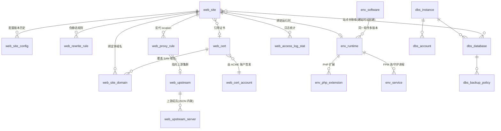
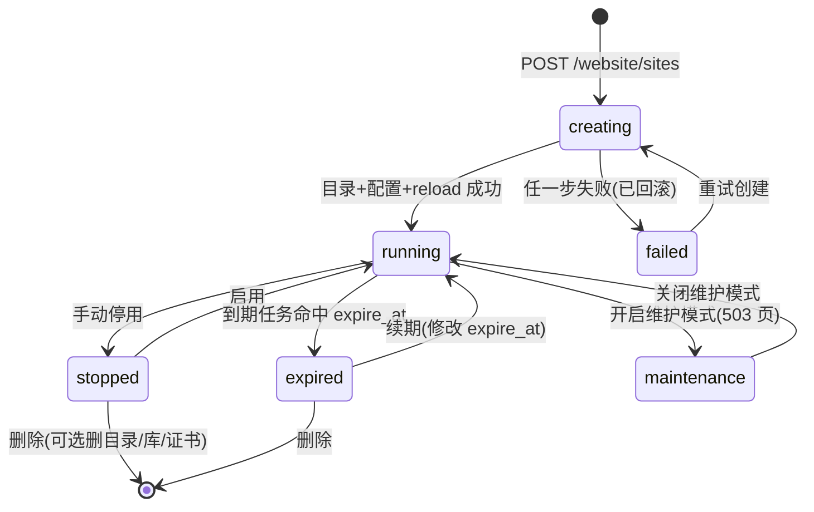
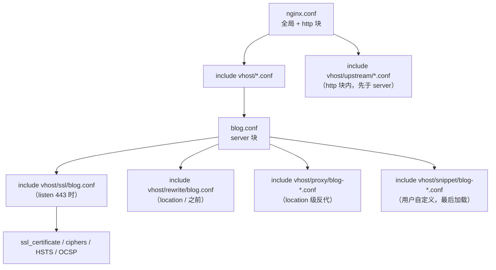
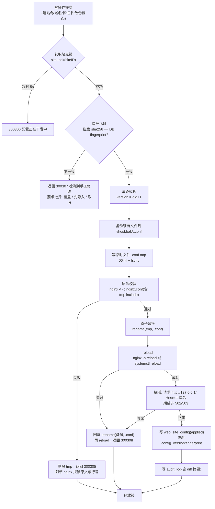
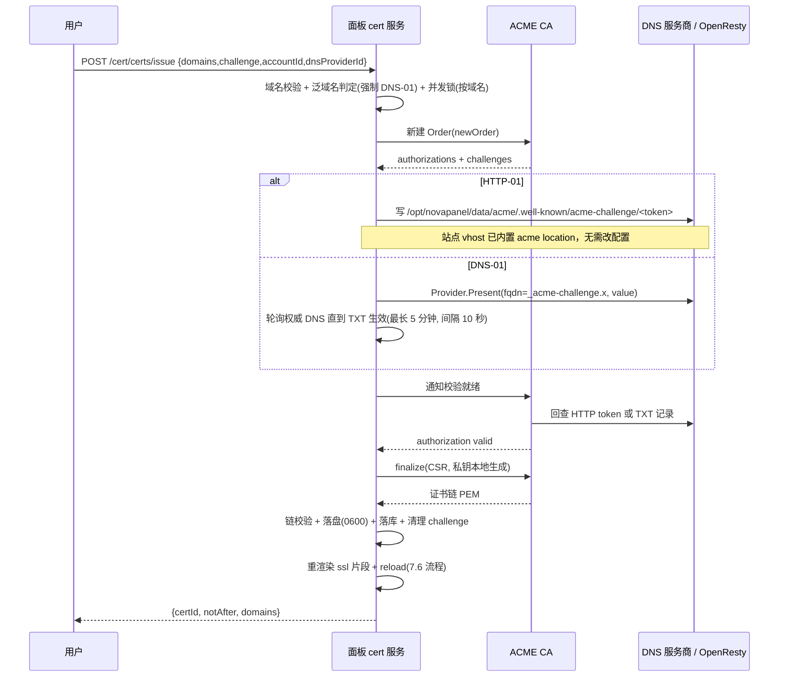
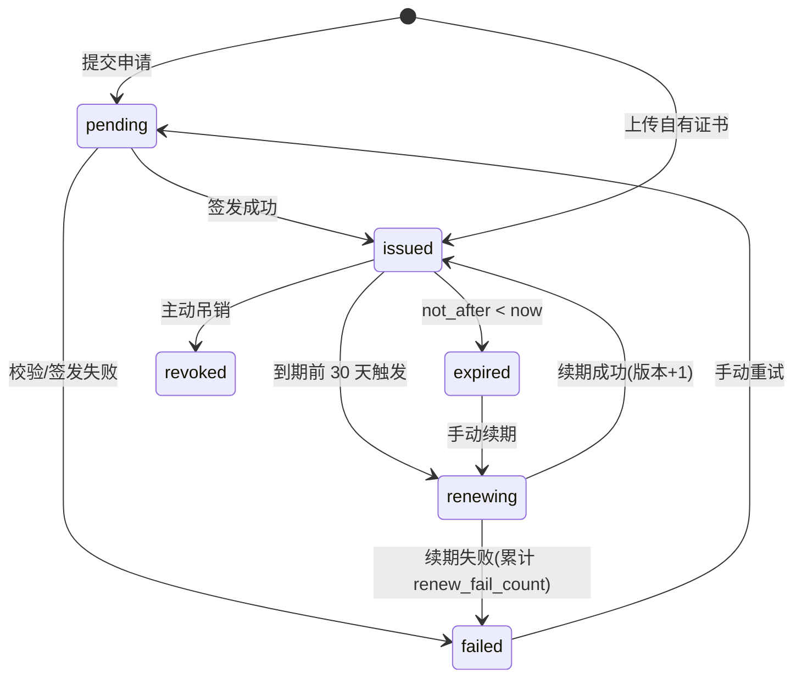
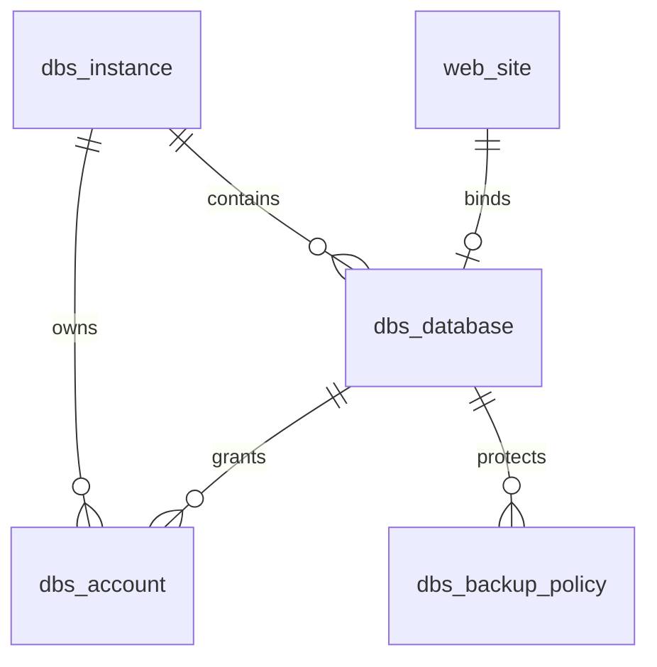

# NovaPanel（星舵面板）· 网站与运行环境

## 文档信息

| 项目 | 内容 |
| --- | --- |
| 文档名称 | 07-网站与运行环境 |
| 文档版本 | v1.0 |
| 更新日期 | 2026-08-17 |
| 状态 | 定稿 |
| 适用版本 | NovaPanel v1.0 |
| 产品代号 | nova |
| 覆盖内容 | 站点领域模型、网站类型矩阵、OpenResty/Nginx/Caddy 方案、vhost 模板引擎、配置原子下发与回滚、域名端口、伪静态规则库、ACME 证书体系与 DNS 适配层、站点运维、PHP/Node/Java/Python/Go 运行环境、数据库服务、FTP、软件商店、接口清单、排错手册 |
| 关联文档 | [数据库设计](./04-数据库设计.md)、[API 接口规范](./05-API接口规范.md)、[前端架构与 Arco 规范](./06-前端架构与Arco规范.md)、[文件管理与 WebSSH](./08-文件管理与WebSSH.md)、[多节点集群与 Agent](./10-多节点集群与Agent.md)、[安全合规与审计](./12-安全合规与审计.md)、[应用商店与备份恢复](./13-应用商店与备份恢复.md) |

## 目录

- [7.1 模块职责与边界](#71-模块职责与边界)
- [7.2 领域模型与关系图](#72-领域模型与关系图)
- [7.3 网站类型支持矩阵](#73-网站类型支持矩阵)
- [7.4 Web 服务器方案与目录布局](#74-web-服务器方案与目录布局)
- [7.5 配置模板引擎](#75-配置模板引擎)
- [7.6 配置下发流程与安全](#76-配置下发流程与安全)
- [7.7 域名与端口管理](#77-域名与端口管理)
- [7.8 伪静态与 URL 重写](#78-伪静态与-url-重写)
- [7.9 SSL/TLS 证书体系](#79-ssltls-证书体系)
- [7.10 站点运维能力](#710-站点运维能力)
- [7.11 运行环境管理](#711-运行环境管理)
- [7.12 数据库服务管理](#712-数据库服务管理)
- [7.13 FTP/SFTP 服务](#713-ftpsftp-服务)
- [7.14 软件商店与服务管理](#714-软件商店与服务管理)
- [7.15 接口清单与前端页面清单](#715-接口清单与前端页面清单)
- [7.16 异常场景与排错手册](#716-异常场景与排错手册)

## 7.1 模块职责与边界

### 7.1.1 职责范围

| 序号 | 职责 | 交付形态 | 权限点前缀 |
| --- | --- | --- | --- |
| R1 | 站点全生命周期：创建、修改、停用、到期、删除、克隆、迁移 | `web_site` 记录 + vhost 配置文件 + 站点目录 | `website:site:*` |
| R2 | 域名与端口绑定、冲突检测、默认站点管理 | `web_site_domain` + `server_name`/`listen` 指令 | `website:domain:*` |
| R3 | vhost 配置渲染、校验、原子下发、版本化与回滚 | `/opt/novapanel/data/vhost/*.conf` + `web_site_config` | `website:config:*` |
| R4 | 伪静态与重写规则管理（预置规则库 + 自定义） | `vhost/rewrite/<site>.conf` + `web_rewrite_rule` | `website:rewrite:*` |
| R5 | 反向代理与负载均衡上游管理 | `web_proxy_rule`、`web_upstream` + upstream 块 | `website:proxy:*` |
| R6 | 证书签发、续期、上传、链校验、到期监控 | `web_cert`、`web_cert_account` + `vhost/ssl/<site>.conf` | `cert:cert:*`、`cert:account:*` |
| R7 | 访问日志开关、切割、解析统计 | `web_access_log_stat` | `website:log:*` |
| R8 | 运行环境安装与版本管理（PHP/Node/Java/Python/Go/Web 服务器） | `env_software`、`env_runtime`、`env_php_extension` | `env:software:*`、`env:runtime:*` |
| R9 | 应用进程守护（Supervisor 托管 Node/Java/Python/Go 应用） | `env_service` + supervisor 程序配置 | `env:service:*` |
| R10 | 数据库服务：实例、库、账号、权限、参数、慢查询 | `dbs_instance`、`dbs_database`、`dbs_account` | `database:instance:*` 等 |
| R11 | FTP/SFTP 账号与配额 | `env_service` + Pure-FTPd 虚拟用户库 | `env:ftp:*` |

### 7.1.2 边界（本模块不做）

| 不做的事 | 归属模块 |
| --- | --- |
| 备份文件的存储、加密、异地同步与恢复编排 | [应用商店与备份恢复](./13-应用商店与备份恢复.md) |
| 站点目录内的文件增删改、在线编辑、上传下载 | [文件管理与 WebSSH](./08-文件管理与WebSSH.md) |
| 跨节点连接管理、Agent 分发与批量执行调度 | [多节点集群与 Agent](./10-多节点集群与Agent.md) |
| 站点可用性拨测、证书到期告警的通知发送 | [监控告警与可观测](./11-监控告警与可观测.md) |
| WAF 规则、防篡改、CC 防护 | [安全合规与审计](./12-安全合规与审计.md) |
| 容器化部署的站点（Compose 应用） | [容器与编排](./09-容器与编排.md) |

### 7.1.3 错误码段位分配

错误码格式 MMSSNN（模块 2 位 + 子域 2 位 + 序号 2 位），本模块占用 30/31/32/33 四个模块号。

| 模块号 | 子域 SS | 含义 | 示例错误码 | 示例文案 |
| --- | --- | --- | --- | --- |
| 30 网站 | 01 站点 | 站点主体 | 300101 | 站点不存在 |
| 30 | 02 域名 | 域名与端口 | 300203 | 域名已被站点 `blog` 绑定 |
| 30 | 03 配置 | 渲染与下发 | 300305 | `nginx -t` 语法校验失败，已回滚 |
| 30 | 04 伪静态 | 重写规则 | 300402 | 重写规则含非法指令 |
| 30 | 05 代理 | 反代与上游 | 300504 | 上游节点健康检查全部失败 |
| 30 | 06 日志 | 日志与统计 | 300601 | 访问日志文件不存在 |
| 31 证书 | 01 ACME 账户 | 账户与 EAB | 310103 | EAB 凭据无效 |
| 31 | 02 签发 | 订单与校验 | 310207 | HTTP-01 校验超时 |
| 31 | 03 DNS | DNS 适配层 | 310302 | DNS 服务商鉴权失败 |
| 31 | 04 续期 | 自动续期 | 310401 | 连续 3 次续期失败 |
| 31 | 05 导入 | 上传与解析 | 310503 | 私钥与证书不匹配 |
| 32 数据库服务 | 01 实例 | 实例安装与连接 | 320104 | 实例连接被拒绝 |
| 32 | 02 库 | 库操作 | 320202 | 同名数据库已存在 |
| 32 | 03 账号 | 账号与授权 | 320305 | 授权语句被最小权限模板拒绝 |
| 33 运行环境 | 01 软件 | 商店与安装任务 | 330106 | 依赖 `openssl-devel` 缺失 |
| 33 | 02 PHP | 版本与扩展 | 330203 | 扩展与 PHP 版本不兼容 |
| 33 | 03 语言运行时 | Node/Java/Python/Go | 330302 | JDK 版本未安装 |
| 33 | 04 进程守护 | Supervisor | 330404 | 程序启动后 3 秒内退出 |

## 7.2 领域模型与关系图

### 7.2.1 实体关系



### 7.2.2 实体职责与关键字段

字段权威定义见[数据库设计](./04-数据库设计.md) 4.7/4.8 节，此处只列本模块语义要点。

| 实体 | 职责 | 关键字段与语义 |
| --- | --- | --- |
| web_site | 站点聚合根，唯一标识 `name`（同租户内唯一，同时作为目录名与配置文件名） | `type` 站点类型枚举；`root` 站点根目录；`node_id` 所属节点；`status` 状态机；`expire_at` 到期时间；`runtime_id` 绑定运行时；`ssl_cert_id` 当前证书；`config_version` 已生效配置版本号；`config_fingerprint` 已下发文件 SHA-256 |
| web_site_domain | 一条域名 + 端口绑定 | `domain` 支持 `*.example.com` 泛域名；`port` 默认 80；`is_ssl_port`；`is_default` 是否默认站点；`verify_status` 归属校验状态 |
| web_site_config | 配置版本快照，只增不改 | `version` 自增版本号；`content` 渲染后完整文本；`render_ctx_json` 渲染上下文；`sha256`；`apply_status`（pending/applied/rolled_back）；`applied_at`；`operator` |
| web_rewrite_rule | 伪静态规则 | `template_key` 预置库标识（custom 表示自定义）；`content`；`is_enabled` |
| web_proxy_rule | 一条 location 级反代规则 | `location_path`；`match_type`（prefix/exact/regex）；`target_url` 或 `upstream_id`；`enable_websocket`；`enable_cache`；`cache_ttl`；`extra_header_json` |
| web_upstream | 负载均衡上游集群 | `algorithm`（round_robin/weighted/ip_hash/least_conn/hash_key）；`servers_json`（host/port/weight/max_fails/fail_timeout/backup/down）；`keepalive`；`health_check_json` |
| web_cert | 证书实体 | `source`（acme/upload）；`domains_json` SAN 列表；`issuer`；`not_before`/`not_after`；`cert_chain`；`key_enc` AES-256-GCM 加密私钥；`status` 状态机；`auto_renew`；`renew_fail_count` |
| web_cert_account | ACME 账户 | `ca`（letsencrypt/zerossl/google/custom）；`directory_url`；`email`；`eab_kid`/`eab_hmac_enc`；`account_key_enc`；`kid` |
| env_software | 商店中的可安装软件 | `key`（如 `php`、`openresty`、`mysql`）；`versions_json`；`install_mode`（compile/binary/pkg/script）；`deps_json` |
| env_runtime | 已安装的某一版本运行时 | `software_key`；`version`；`install_path`；`bin_path`；`status`；`is_default` |
| env_service | 受面板托管的常驻进程 | `service_type`（fpm/supervisor/systemd）；`program_name`；`config_path`；`autostart`；`autorestart` |

### 7.2.3 站点状态机



| 状态 | 值 | vhost 表现 | 允许的操作 |
| --- | --- | --- | --- |
| 创建中 | creating | 未下发 | 取消 |
| 运行中 | running | 正常 include | 全部 |
| 已停用 | stopped | 配置文件重命名为 `<site>.conf.disabled`，reload 后不再生效 | 启用、删除、改配置（暂存不生效） |
| 已到期 | expired | 保留配置，`server` 块内注入 `return 403` | 续期、删除 |
| 维护中 | maintenance | 注入 `error_page 503` 与 `return 503`，放行白名单 IP | 关闭维护、改配置 |
| 创建失败 | failed | 无残留 | 重试、删除记录 |

### 7.2.4 服务层接口签名

```go
// internal/service/site/service.go
type Service interface {
    Create(ctx context.Context, in *CreateInput) (*Site, error)
    Update(ctx context.Context, id int64, in *UpdateInput) error
    ChangeStatus(ctx context.Context, id int64, target Status) error
    Delete(ctx context.Context, id int64, opt DeleteOption) error // 是否级联删目录/库/证书
    Clone(ctx context.Context, id int64, in *CloneInput) (*Site, error)
    Rebuild(ctx context.Context, id int64) error                  // 按当前 DB 状态重渲染并下发
    Rollback(ctx context.Context, id int64, version int) error    // 回滚到指定配置版本
}
```

所有实现内部只通过 `internal/executor` 触达系统，跨节点时由 `executor.For(nodeID)` 返回 Agent 远程执行器，业务代码无分支判断。

## 7.3 网站类型支持矩阵

### 7.3.1 类型矩阵

| type | 名称 | 需要运行时 | 生成的 vhost 模板 | 附加产物 | 支持负载均衡 | 支持 HTTPS |
| --- | --- | --- | --- | --- | --- | --- |
| static | 静态站 | 无 | `static.conf.tmpl` | 站点目录 + index.html | 否 | 是 |
| php | PHP 站 | PHP-FPM 某版本 | `php.conf.tmpl` | FPM 池配置、open_basedir、伪静态文件 | 否 | 是 |
| proxy | 反向代理站 | 无 | `proxy.conf.tmpl` | proxy_cache 目录（可选） | 否 | 是 |
| balance | 负载均衡站 | 无 | `balance.conf.tmpl` + `upstream.conf.tmpl` | `web_upstream` 记录、健康检查配置 | 是 | 是 |
| node | Node 应用站 | Node.js 某版本 | `proxy.conf.tmpl`（回环端口） | supervisor 程序、`.env`、日志文件 | 是 | 是 |
| java | Java 应用站 | JDK 某版本 | `proxy.conf.tmpl` | supervisor 程序、jar/war 部署目录 | 是 | 是 |
| python | Python 应用站 | Python 某版本 | `proxy.conf.tmpl` | venv、Gunicorn/uWSGI 配置、supervisor 程序 | 是 | 是 |
| go | Go 应用站 | 无（二进制） | `proxy.conf.tmpl` | supervisor 程序、二进制目录 | 是 | 是 |
| app | 一键应用站 | 依模板而定 | 由应用清单指定 | 数据库、初始化数据、伪静态、计划任务 | 否 | 是 |

一键应用站由[应用商店与备份恢复](./13-应用商店与备份恢复.md)提供清单（`manifest.yaml`），本模块只负责「按清单落站点 + 落 vhost + 落库」，v1.0 内置清单：WordPress、Typecho、Discuz! Q、ThinkPHP 骨架、Laravel 骨架、Halo、Nextcloud、Matomo。

### 7.3.2 公共创建参数

`POST /api/v1/website/sites`

| 参数 | 类型 | 必填 | 校验规则 | 说明 |
| --- | --- | --- | --- | --- |
| name | string | 是 | `^[a-z0-9][a-z0-9_-]{1,62}$`，同租户唯一 | 站点标识，同时作为目录名与配置文件名 |
| type | string | 是 | 7.3.1 枚举 | 站点类型 |
| domains | array | 是 | 至少 1 项，单项 `domain`+`port` | 域名列表，首项为主域名 |
| root | string | 否 | 绝对路径，默认 `/www/wwwroot/<name>` | 站点根目录 |
| indexFiles | array | 否 | 默认 `["index.html","index.htm"]`，PHP 站追加 `index.php` | 默认文档 |
| remark | string | 否 | ≤ 255 | 备注 |
| expireAt | int64 | 否 | 大于当前时间，0 表示永不过期 | 到期时间 |
| nodeId | int64 | 否 | 取 `X-Node-Id`，缺省为主控节点 | 目标节点 |
| enableSSL | bool | 否 | 默认 false | 创建后立即申请证书 |
| certMode | string | 否 | `acme` / `upload` / `existing` | 与 `enableSSL` 配合 |
| rewriteTemplate | string | 否 | 预置库 key 或 `custom` | 伪静态模板 |
| logEnabled | bool | 否 | 默认 true | 访问日志开关 |
| createDatabase | object | 否 | `{instanceId,name,user,password,charset}` | 同时建库建账号 |
| createFtp | object | 否 | `{user,password,quotaMB}` | 同时建 FTP 账号 |

### 7.3.3 分类型专属参数

| type | 参数 | 类型 | 必填 | 说明 |
| --- | --- | --- | --- | --- |
| php | phpVersion | string | 是 | 如 `8.3`，须已安装且状态 running |
| php | fpmPoolMode | string | 否 | `dedicated`（每站独立池，默认）/ `shared` |
| php | openBasedir | bool | 否 | 默认 true，值为 `{root}:/tmp/:/proc/` |
| php | disableFunctions | string | 否 | 覆盖池级 `php_admin_value` |
| php | uploadMaxSizeMB | int | 否 | 同步写 `client_max_body_size` 与 `upload_max_filesize` |
| proxy | targetUrl | string | 是 | `http(s)://host:port`，禁止指向 127.0.0.1:34567（面板自身） |
| proxy | proxyHost | string | 否 | 回源 Host 头，默认 `$host` |
| proxy | enableWebSocket | bool | 否 | 默认 true |
| proxy | enableCache | bool | 否 | 默认 false |
| proxy | cacheTTL | string | 否 | 默认 `1h`，仅 200/301/302 |
| proxy | timeoutSec | object | 否 | `{connect:60,send:60,read:60}` |
| balance | upstream | object | 是 | `{algorithm,servers[],keepalive,healthCheck}` |
| balance | stickyCookie | string | 否 | 会话保持 cookie 名，仅 `hash_key` 与 `sticky` 算法有效 |
| node/java/python/go | appPort | int | 是 | 应用监听端口，1024-65535，冲突检测 |
| node/java/python/go | startCommand | string | 是 | 启动命令，落 supervisor `command` |
| node/java/python/go | workDir | string | 否 | 默认站点根目录 |
| node/java/python/go | envVars | object | 否 | 写入 `/opt/novapanel/data/vhost/env/<site>.env`，权限 0600 |
| node | nodeVersion | string | 是 | 如 `20.17.0` |
| node | packageManager | string | 否 | npm/pnpm/yarn，默认 npm |
| java | jdkVersion | string | 是 | 如 `17` |
| java | jarPath | string | 是 | jar/war 绝对路径 |
| java | jvmOpts | string | 否 | 默认 `-Xms256m -Xmx512m -XX:+UseG1GC` |
| python | pythonVersion | string | 是 | 如 `3.12` |
| python | wsgiServer | string | 否 | gunicorn（默认）/ uwsgi |
| python | wsgiApp | string | 是 | 如 `app:application` |
| go | binaryPath | string | 是 | 可执行文件绝对路径，需 `+x` |
| app | appKey | string | 是 | 应用商店清单 key，如 `wordpress` |
| app | appVersion | string | 否 | 默认清单 latest |
| app | initParams | object | 否 | 清单声明的初始化参数（站点标题、管理员账号等） |

### 7.3.4 生成产物清单

以 `name=blog`、`type=php`、`phpVersion=8.3` 为例，创建成功后落地的全部产物：

| 路径 | 内容 | 权限/属主 |
| --- | --- | --- |
| `/www/wwwroot/blog` | 站点根目录，含默认 `index.php`、`404.html` | 0755 `www:www` |
| `/www/wwwroot/blog/.user.ini` | `open_basedir` 兜底（PHP 站） | 0444 `root:root`，`chattr +i` |
| `/opt/novapanel/data/vhost/blog.conf` | server 块主配置 | 0644 `root:root` |
| `/opt/novapanel/data/vhost/rewrite/blog.conf` | 伪静态规则 | 0644 |
| `/opt/novapanel/data/vhost/ssl/blog.conf` | TLS 片段（启用 HTTPS 后生成） | 0644 |
| `/opt/novapanel/data/vhost/env/blog.env` | 应用型站点环境变量 | 0600 |
| `/opt/novapanel/data/fpm/8.3/blog.conf` | 独立 FPM 池 | 0644 |
| `/www/wwwlogs/blog.log`、`blog.error.log` | 访问与错误日志 | 0644 `www:www` |
| `web_site` / `web_site_domain` / `web_site_config`(version=1) | 数据库记录 | — |
| `audit_log` | 一条 `website:site:create` 审计 | — |

## 7.4 Web 服务器方案与目录布局

### 7.4.1 方案对比与选型

| 维度 | OpenResty（默认） | Nginx | Caddy |
| --- | --- | --- | --- |
| 版本基线 | 1.27.1.1（Nginx 1.27 核心） | 1.26.2 稳定版 | 2.8.x |
| 配置兼容 | 完全兼容 Nginx 指令 | — | 需转译 Caddyfile |
| 扩展能力 | 内置 LuaJIT，WAF/限流/动态证书可编程 | 需重编译加模块 | 插件需重编译 |
| 自动 HTTPS | 由面板 ACME 统一管理 | 同左 | Caddy 自带（面板接管后关闭） |
| HTTP/3 | 需 `--with-http_v3_module`（1.25+ 原生 QUIC） | 同左 | 默认支持 |
| 适用场景 | 默认，需要 Lua 扩展与 WAF | 极简、已有运维习惯 | 内网、少量站点、追求零配置 |

选型规则：安装引导默认勾选 OpenResty；三者互斥，同一节点只允许一个占用 80/443。`web_site` 的模板选择由 `env_software.key`（`openresty`/`nginx`/`caddy`）决定，vhost 模板目录按引擎分子目录，Nginx 与 OpenResty 共用同一套模板。

### 7.4.2 OpenResty 编译参数

编译安装脚本 `/opt/novapanel/data/scripts/install_openresty.sh` 的核心参数（由面板生成，参数随「是否启用 HTTP/3」等开关变化）：

```bash
./configure \
  --prefix=/usr/local/openresty \
  --with-luajit \
  --with-pcre-jit \
  --with-threads \
  --with-file-aio \
  --with-http_ssl_module \
  --with-http_v2_module \
  --with-http_v3_module \
  --with-http_realip_module \
  --with-http_gzip_static_module \
  --with-http_gunzip_module \
  --with-http_stub_status_module \
  --with-http_sub_module \
  --with-http_addition_module \
  --with-http_auth_request_module \
  --with-http_secure_link_module \
  --with-http_slice_module \
  --with-stream \
  --with-stream_ssl_module \
  --with-stream_ssl_preread_module \
  --add-module=/opt/novapanel/data/src/ngx_brotli \
  --with-cc-opt="-O2 -Wno-error" \
  -j"$(nproc)"
```

依赖预检（缺失则中止并回报 `330106`）：`gcc` `gcc-c++/g++` `make` `perl` `pcre2-devel` `openssl-devel`（≥ 1.1.1，HTTP/3 需 ≥ 3.0 或 BoringSSL）`zlib-devel` `libxml2-devel` `libxslt-devel` `gd-devel` `GeoIP-devel`。Debian 系映射为 `libpcre2-dev` `libssl-dev` `zlib1g-dev` 等，映射表在 `internal/executor/pkgmgr/alias.go`。

### 7.4.3 目录布局

```text
/usr/local/openresty/            # 程序目录（编译安装，不放业务配置）
├── nginx/sbin/nginx
├── nginx/conf/nginx.conf        # 面板托管的主配置（软链到下方）
└── luajit/

/opt/novapanel/
├── conf/panel.yaml              # 面板配置
├── data/
│   ├── vhost/                   # 所有站点配置的唯一权威目录
│   │   ├── nginx.conf           # 主配置真身，软链到程序目录
│   │   ├── blog.conf            # 站点 server 块
│   │   ├── blog.conf.disabled   # 停用态
│   │   ├── rewrite/blog.conf    # 伪静态
│   │   ├── ssl/blog.conf        # TLS 片段
│   │   ├── upstream/api-pool.conf
│   │   ├── env/blog.env         # 应用型站点环境变量（0600）
│   │   ├── proxy/blog-cache.conf
│   │   ├── auth/blog.htpasswd   # 目录保护口令（0640）
│   │   └── snippet/             # 用户自定义片段（面板不改写，只 include）
│   ├── fpm/8.3/blog.conf        # PHP-FPM 池
│   ├── cert/<certId>/           # fullchain.pem privkey.pem chain.pem（0600）
│   ├── backup/                  # 备份产物
│   ├── vhost.bak/               # 配置下发前的自动备份（保留 20 份）
│   └── nova.db
└── logs/panel.log

/www/wwwroot/<site>/             # 站点根目录
/www/wwwlogs/<site>.log          # 访问日志
/www/wwwlogs/<site>.error.log    # 错误日志
/www/server/php/8.3/             # PHP 多版本安装根
/www/server/nodejs/20.17.0/
/www/server/jdk/17/
/www/server/python/3.12/
```

### 7.4.4 include 组织链



加载顺序规约：`upstream` 必须在 `server` 之前被 include（`nginx.conf` 中显式先 include upstream 目录）；`rewrite` 片段位于 `location /` 之前，保证 `try_files` 不被覆盖；用户自定义 `snippet` 最后 include，可覆盖前面的同名指令，但不允许出现 `listen`、`server_name`、`root` 三个指令（下发前正则拦截，报 `300402`）。

### 7.4.5 主配置模板

`/opt/novapanel/data/vhost/nginx.conf`（由面板渲染，用户可改的项通过面板表单暴露，手工改动会被 7.6.4 指纹检测发现）：

```nginx
user  www www;
worker_processes  auto;
worker_cpu_affinity auto;
error_log  /www/wwwlogs/nginx_error.log  warn;
pid        /usr/local/openresty/nginx/logs/nginx.pid;
worker_rlimit_nofile 65535;

events {
    use epoll;
    worker_connections 51200;
    multi_accept on;
}

http {
    include       mime.types;
    default_type  application/octet-stream;
    server_names_hash_bucket_size 512;
    client_header_buffer_size 32k;
    large_client_header_buffers 4 32k;
    client_max_body_size 50m;
    sendfile on;
    tcp_nopush on;
    tcp_nodelay on;
    keepalive_timeout 60;
    server_tokens off;
    fastcgi_connect_timeout 300;
    fastcgi_send_timeout 300;
    fastcgi_read_timeout 300;
    fastcgi_buffer_size 64k;
    fastcgi_buffers 4 64k;
    gzip on;
    gzip_min_length 1k;
    gzip_comp_level 4;
    gzip_types text/plain application/javascript application/x-javascript text/javascript
               text/css application/xml application/json image/svg+xml;
    gzip_vary on;
    limit_conn_zone $binary_remote_addr zone=perip:10m;
    limit_conn_zone $server_name zone=perserver:10m;
    proxy_cache_path /www/cache/proxy levels=1:2 keys_zone=nova_cache:100m
                     max_size=5g inactive=1d use_temp_path=off;
    log_format nova '$remote_addr - $remote_user [$time_local] "$request" '
                    '$status $body_bytes_sent "$http_referer" "$http_user_agent" '
                    '"$http_x_forwarded_for" $request_time $upstream_response_time '
                    '$upstream_addr $upstream_status';
    access_log /www/wwwlogs/access.log nova;

    include /opt/novapanel/data/vhost/upstream/*.conf;   # 必须先于 server
    include /opt/novapanel/data/vhost/*.conf;            # 站点 server 块
}
```

## 7.5 配置模板引擎

### 7.5.1 引擎设计

模板用 Go 标准库 `text/template`（不用 `html/template`，避免对 Nginx 指令做 HTML 转义），模板文件以 `embed.FS` 打进二进制，同时支持用户自定义模板覆盖：优先读 `/opt/novapanel/data/vhost/tmpl/<engine>/<name>.tmpl`，不存在则回落内置。

```go
// internal/service/site/render/engine.go
package render

import (
    "bytes"
    "crypto/sha256"
    "embed"
    "encoding/hex"
    "fmt"
    "text/template"
)

//go:embed tmpl/*/*.tmpl
var builtin embed.FS

type Engine struct {
    tpl *template.Template
}

func New(overrideDir string) (*Engine, error) {
    t := template.New("vhost").Option("missingkey=error").Funcs(FuncMap)
    t, err := t.ParseFS(builtin, "tmpl/*/*.tmpl")
    if err != nil {
        return nil, fmt.Errorf("parse builtin templates: %w", err)
    }
    if overrideDir != "" { // 用户自定义模板覆盖同名 define
        if t2, err := t.ParseGlob(overrideDir + "/*/*.tmpl"); err == nil {
            t = t2
        }
    }
    return &Engine{tpl: t}, nil
}

// Render 返回渲染文本与其 SHA-256，指纹写入 web_site_config.sha256
func (e *Engine) Render(name string, ctx *SiteRenderCtx) (string, string, error) {
    var buf bytes.Buffer
    if err := e.tpl.ExecuteTemplate(&buf, name, ctx); err != nil {
        return "", "", fmt.Errorf("300301 渲染模板 %s 失败: %w", name, err)
    }
    sum := sha256.Sum256(buf.Bytes())
    return buf.String(), hex.EncodeToString(sum[:]), nil
}
```

`missingkey=error` 保证上下文字段拼写错误在渲染期立即暴露，而不是生成半截配置。

### 7.5.2 渲染上下文与模板变量表

根上下文类型 `render.SiteRenderCtx`，字段全部由 `internal/service/site` 从数据库装配，模板中不允许出现任何未在下表登记的变量。

| 变量 | 类型 | 示例值 | 说明 |
| --- | --- | --- | --- |
| `.Site.Name` | string | `blog` | 站点标识 |
| `.Site.ID` | int64 | `1832...` | 雪花 ID，写入配置注释便于反查 |
| `.Site.Type` | string | `php` | 站点类型 |
| `.Site.Root` | string | `/www/wwwroot/blog` | 站点根目录 |
| `.Site.IndexFiles` | []string | `["index.php","index.html"]` | 默认文档 |
| `.Site.Charset` | string | `utf-8` | 默认字符集 |
| `.Site.Status` | string | `running` | 决定是否注入 403/503 |
| `.Site.MaintenanceIPs` | []string | `["1.2.3.4"]` | 维护模式白名单 |
| `.Domains` | []string | `["a.com","www.a.com","*.b.com"]` | server_name 列表 |
| `.Listen` | []Listen | 见下 | 每项 `{Port,SSL,Http2,Http3,Default,IPv6,Addr}` |
| `.PHP.Enabled` | bool | `true` | 是否注入 fastcgi |
| `.PHP.Version` | string | `8.3` | 版本 |
| `.PHP.SockPath` | string | `/tmp/php-cgi-83-blog.sock` | FPM unix socket（独立池带站点后缀） |
| `.PHP.OpenBasedir` | string | `/www/wwwroot/blog/:/tmp/:/proc/` | 空串表示关闭 |
| `.PHP.UploadMaxSize` | string | `50m` | 同步到 `client_max_body_size` |
| `.SSL.Enabled` | bool | `true` | 是否 include ssl 片段 |
| `.SSL.CertPath` | string | `/opt/novapanel/data/cert/183.../fullchain.pem` | 证书链 |
| `.SSL.KeyPath` | string | `.../privkey.pem` | 私钥（0600，nginx 以 root 启动读取） |
| `.SSL.Protocols` | string | `TLSv1.2 TLSv1.3` | 协议版本 |
| `.SSL.Ciphers` | string | 见 7.5.7 | 密码套件 |
| `.SSL.PreferServerCiphers` | bool | `false` | TLS1.3 下建议 off |
| `.SSL.ForceRedirect` | bool | `true` | 强制 HTTPS 跳转 |
| `.SSL.HSTSMaxAge` | int | `31536000` | 0 表示不下发 HSTS |
| `.SSL.HSTSSubdomains` | bool | `false` | includeSubDomains |
| `.SSL.OCSPStapling` | bool | `true` | 需 `ChainPath` 存在 |
| `.SSL.ChainPath` | string | `.../chain.pem` | `ssl_trusted_certificate` |
| `.SSL.SessionTimeout` | string | `1d` | 会话缓存时长 |
| `.Proxy.Rules` | []ProxyRule | 见 7.5.5 | 每项 `{Location,MatchType,Target,UpstreamName,Host,WebSocket,Cache,CacheTTL,Timeout,ExtraHeaders,RealIP}` |
| `.Upstream.Name` | string | `api-pool` | upstream 块名 |
| `.Upstream.Algorithm` | string | `least_conn` | 见 7.5.6 |
| `.Upstream.HashKey` | string | `$cookie_NOVASESSION` | 仅 hash_key 算法 |
| `.Upstream.Servers` | []UpServer | — | `{Host,Port,Weight,MaxFails,FailTimeout,Backup,Down,SlowStart}` |
| `.Upstream.Keepalive` | int | `64` | 长连接池 |
| `.Upstream.HealthCheck` | HealthCheck | — | `{Enabled,Type,Interval,Rise,Fall,Timeout,URI,ExpectStatus}` |
| `.Log.Enabled` | bool | `true` | 关闭时写 `access_log off` |
| `.Log.AccessPath` | string | `/www/wwwlogs/blog.log` | 访问日志 |
| `.Log.ErrorPath` | string | `/www/wwwlogs/blog.error.log` | 错误日志 |
| `.Log.Format` | string | `nova` | log_format 名 |
| `.Limit.RateLimitZone` | string | `perip` | limit_conn zone |
| `.Limit.MaxConnPerIP` | int | `20` | 0 表示不限 |
| `.Limit.RateBytes` | string | `512k` | limit_rate |
| `.Limit.AntiLeechExts` | []string | `["jpg","png","mp4"]` | 防盗链扩展名 |
| `.Limit.AntiLeechRefers` | []string | `["a.com","*.b.com"]` | 允许的 Referer |
| `.Sec.BasicAuthPath` | string | `/opt/novapanel/data/vhost/auth/blog.htpasswd` | 目录保护口令文件 |
| `.Sec.BasicAuthLocations` | []string | `["/admin"]` | 受保护路径 |
| `.Sec.DenyPathRegex` | string | `\.(git\|svn\|env\|bak\|sql)$` | 敏感文件拦截 |
| `.Sec.CORS` | CORS | — | `{Enabled,Origins,Methods,Headers,Credentials,MaxAge}` |
| `.Redirects` | []Redirect | — | `{From,To,Code,KeepPath,KeepQuery}` |
| `.Rewrite.IncludePath` | string | `/opt/novapanel/data/vhost/rewrite/blog.conf` | 伪静态片段路径 |
| `.Snippets` | []string | — | 用户自定义片段路径列表 |
| `.Meta.Version` | int | `7` | 配置版本号，写入头部注释 |
| `.Meta.RenderedAt` | string | `2026-08-17T10:00:00Z` | 渲染时间 |
| `.Meta.Engine` | string | `openresty` | 引擎 |

FuncMap：`join`（切片拼接）、`quote`（加引号并转义 `"` 与 `$`）、`nginxStr`（转义 Nginx 特殊字符）、`default`、`hasSSL`、`durationOr`、`indent n`、`regexQuote`、`portList`。

### 7.5.3 静态站模板

`tmpl/nginx/static.conf.tmpl`：

```gotemplate
{{define "static.conf"}}# NovaPanel managed file. site={{.Site.Name}} id={{.Site.ID}} version={{.Meta.Version}}
# rendered_at={{.Meta.RenderedAt}} engine={{.Meta.Engine}}
# 手工修改会被面板检测并在下次下发时覆盖，自定义内容请写入 vhost/snippet/{{.Site.Name}}-*.conf
server {
{{- range .Listen}}
    listen {{.Port}}{{if .SSL}} ssl{{end}}{{if .Default}} default_server{{end}};
  {{- if .IPv6}}
    listen [::]:{{.Port}}{{if .SSL}} ssl{{end}}{{if .Default}} default_server{{end}};
  {{- end}}
  {{- if and .SSL .Http3}}
    listen {{.Port}} quic;
    listen [::]:{{.Port}} quic;
  {{- end}}
{{- end}}
    server_name {{join .Domains " "}};
    root {{.Site.Root}};
    index {{join .Site.IndexFiles " "}};
    charset {{.Site.Charset}};
{{- if .SSL.Enabled}}
    include {{.SSL.IncludePath}};
{{- end}}
{{- if eq .Site.Status "expired"}}
    location / { return 403 "site expired"; }
}
{{- else}}
{{- if eq .Site.Status "maintenance"}}
    location / {
    {{- range .Site.MaintenanceIPs}}
        allow {{.}};
    {{- end}}
        deny all;
        error_page 403 /_nova_maintenance.html;
    }
    location = /_nova_maintenance.html { root /opt/novapanel/data/vhost/static; internal; }
{{- end}}
{{- if .Limit.MaxConnPerIP}}
    limit_conn {{.Limit.RateLimitZone}} {{.Limit.MaxConnPerIP}};
{{- end}}
{{- if .Limit.RateBytes}}
    limit_rate {{.Limit.RateBytes}};
{{- end}}
{{- if .Sec.DenyPathRegex}}
    location ~ {{.Sec.DenyPathRegex}} { return 404; }
{{- end}}
{{- if .Limit.AntiLeechExts}}
    location ~* \.({{join .Limit.AntiLeechExts "|"}})$ {
        valid_referers none blocked server_names {{join .Limit.AntiLeechRefers " "}};
        if ($invalid_referer) { return 403; }
        expires 30d;
        access_log off;
    }
{{- end}}
{{- range .Sec.BasicAuthLocations}}
    location {{.}} {
        auth_basic "Restricted";
        auth_basic_user_file {{$.Sec.BasicAuthPath}};
    }
{{- end}}
{{- range .Redirects}}
    location {{.From}} { return {{.Code}} {{.To}}{{if .KeepPath}}$request_uri{{end}}; }
{{- end}}
{{- if .Sec.CORS.Enabled}}
    add_header Access-Control-Allow-Origin {{join .Sec.CORS.Origins " "}} always;
    add_header Access-Control-Allow-Methods "{{join .Sec.CORS.Methods ", "}}" always;
    add_header Access-Control-Allow-Headers "{{join .Sec.CORS.Headers ", "}}" always;
    add_header Access-Control-Max-Age {{.Sec.CORS.MaxAge}} always;
    if ($request_method = OPTIONS) { return 204; }
{{- end}}
    include {{.Rewrite.IncludePath}};
    location / {
        try_files $uri $uri/ =404;
    }
    location ~* \.(js|css|png|jpg|jpeg|gif|ico|svg|woff2?|ttf)$ {
        expires 30d;
        add_header Cache-Control "public, max-age=2592000";
        access_log off;
    }
    location = /.well-known/acme-challenge/ { root /opt/novapanel/data/acme; }
{{- range .Snippets}}
    include {{.}};
{{- end}}
{{- if .Log.Enabled}}
    access_log {{.Log.AccessPath}} {{.Log.Format}};
{{- else}}
    access_log off;
{{- end}}
    error_log {{.Log.ErrorPath}};
}
{{- if and .SSL.Enabled .SSL.ForceRedirect}}
server {
    listen 80;
{{- if .HasIPv6}}
    listen [::]:80;
{{- end}}
    server_name {{join .Domains " "}};
    location ^~ /.well-known/acme-challenge/ { root /opt/novapanel/data/acme; }
    location / { return 301 https://$host$request_uri; }
}
{{- end}}
{{- end}}
{{end}}
```

模板中 `{{- if eq .Site.Status "expired"}}` 分支直接闭合 `server` 块并 `return 403`，`{{- else}}` 分支为正常配置，两分支在末尾统一 `{{- end}}` 收口；`.HasIPv6` 为上下文顶层布尔（节点探测到 IPv6 地址且站点未显式关闭时为 true）。

### 7.5.4 PHP-FPM 站模板

公共片段（`listen`/`server_name`/日志/安全/CORS/限速）在 `tmpl/nginx/_common.tmpl` 中以 `{{define "common-head"}}`、`{{define "common-security"}}`、`{{define "common-tail"}}` 抽出，PHP 模板只声明差异部分：

```gotemplate
{{define "php.conf"}}{{template "common-head" .}}
    client_max_body_size {{.PHP.UploadMaxSize}};
{{template "common-security" .}}
    # 禁止执行上传目录内的脚本，防止上传绕过导致代码执行
    location ~* ^/(uploads|upload|static|images|attachment)/.*\.(php|php5|phtml|phar)$ {
        deny all;
        return 403;
    }
    location ~ /\.(?!well-known) { deny all; }
    include {{.Rewrite.IncludePath}};
    location / {
        try_files $uri $uri/ /index.php?$query_string;
    }
    location ~ [^/]\.php(/|$) {
        fastcgi_split_path_info ^(.+?\.php)(/.*)$;
        # 文件不存在直接 404，规避 CVE-2019-11043 一类路径解析问题
        if (!-f $document_root$fastcgi_script_name) { return 404; }
        fastcgi_pass unix:{{.PHP.SockPath}};
        fastcgi_index index.php;
        include fastcgi_params;
        fastcgi_param SCRIPT_FILENAME $document_root$fastcgi_script_name;
        fastcgi_param PATH_INFO       $fastcgi_path_info;
        fastcgi_param DOCUMENT_ROOT   $document_root;
        fastcgi_param HTTPS           $https if_not_empty;
        fastcgi_param HTTP_PROXY      "";
{{- if .PHP.OpenBasedir}}
        fastcgi_param PHP_ADMIN_VALUE "open_basedir={{.PHP.OpenBasedir}}";
{{- end}}
        fastcgi_intercept_errors on;
        fastcgi_connect_timeout 60s;
        fastcgi_send_timeout 300s;
        fastcgi_read_timeout 300s;
        fastcgi_buffer_size 128k;
        fastcgi_buffers 8 128k;
        fastcgi_busy_buffers_size 256k;
        fastcgi_hide_header X-Powered-By;
    }
    location ~* \.(js|css|png|jpg|jpeg|gif|ico|svg|woff2?)$ {
        expires 30d;
        access_log off;
    }
{{template "common-tail" .}}{{end}}
```

### 7.5.5 反向代理模板

```gotemplate
{{define "proxy.conf"}}{{template "common-head" .}}
{{template "common-security" .}}
{{- range .Proxy.Rules}}
    location {{if eq .MatchType "exact"}}= {{else if eq .MatchType "regex"}}~ {{else}}^~ {{end}}{{.Location}} {
        proxy_pass {{if .UpstreamName}}http://{{.UpstreamName}}{{else}}{{.Target}}{{end}};
        proxy_http_version 1.1;
        proxy_set_header Host {{default "$host" .Host}};
        proxy_set_header X-Real-IP $remote_addr;
        proxy_set_header X-Forwarded-For $proxy_add_x_forwarded_for;
        proxy_set_header X-Forwarded-Proto $scheme;
        proxy_set_header X-Forwarded-Host $host;
        proxy_set_header X-Forwarded-Port $server_port;
    {{- if .WebSocket}}
        proxy_set_header Upgrade $http_upgrade;
        proxy_set_header Connection $connection_upgrade;
        proxy_read_timeout 3600s;
        proxy_send_timeout 3600s;
    {{- else}}
        proxy_set_header Connection "";
        proxy_read_timeout {{.Timeout.Read}}s;
        proxy_send_timeout {{.Timeout.Send}}s;
    {{- end}}
        proxy_connect_timeout {{.Timeout.Connect}}s;
        proxy_buffering {{if .Cache}}on{{else}}off{{end}};
        proxy_buffer_size 16k;
        proxy_buffers 8 32k;
        proxy_busy_buffers_size 64k;
        proxy_next_upstream error timeout http_502 http_503 http_504;
        proxy_next_upstream_tries 2;
        proxy_ssl_server_name on;
        client_max_body_size {{default "50m" .MaxBodySize}};
    {{- if .Cache}}
        proxy_cache nova_cache;
        proxy_cache_key "$scheme$request_method$host$request_uri";
        proxy_cache_valid 200 301 302 {{.CacheTTL}};
        proxy_cache_valid 404 1m;
        proxy_cache_use_stale error timeout updating http_500 http_502 http_503 http_504;
        proxy_cache_background_update on;
        proxy_cache_lock on;
        proxy_cache_bypass $http_nova_nocache $arg_nocache;
        add_header X-Cache-Status $upstream_cache_status;
    {{- end}}
    {{- range $k, $v := .ExtraHeaders}}
        proxy_set_header {{$k}} {{quote $v}};
    {{- end}}
    }
{{- end}}
    location = /.well-known/acme-challenge/ { root /opt/novapanel/data/acme; }
{{template "common-tail" .}}{{end}}
```

`$connection_upgrade` 由 `nginx.conf` 的 http 块统一定义（`map $http_upgrade $connection_upgrade { default upgrade; '' close; }`），模板不重复声明。真实 IP 透传若面板本身位于上层 CDN 之后，需在站点上开启 `realip`，渲染时额外注入 `set_real_ip_from`（CDN 网段列表来自 `sys_setting` 的 `web.cdn_cidrs`）与 `real_ip_header X-Forwarded-For; real_ip_recursive on;`。

### 7.5.6 负载均衡上游模板

`tmpl/nginx/upstream.conf.tmpl`，渲染到 `vhost/upstream/<name>.conf`：

```gotemplate
{{define "upstream.conf"}}# NovaPanel managed upstream={{.Upstream.Name}} version={{.Meta.Version}}
upstream {{.Upstream.Name}} {
{{- if eq .Upstream.Algorithm "ip_hash"}}
    ip_hash;
{{- else if eq .Upstream.Algorithm "least_conn"}}
    least_conn;
{{- else if eq .Upstream.Algorithm "hash_key"}}
    hash {{.Upstream.HashKey}} consistent;
{{- end}}
{{- range .Upstream.Servers}}
    server {{.Host}}:{{.Port}}{{if ne .Weight 1}} weight={{.Weight}}{{end}} max_fails={{.MaxFails}} fail_timeout={{.FailTimeout}}s{{if .Backup}} backup{{end}}{{if .Down}} down{{end}}{{if .SlowStart}} slow_start={{.SlowStart}}s{{end}};
{{- end}}
{{- if .Upstream.Keepalive}}
    keepalive {{.Upstream.Keepalive}};
    keepalive_requests 1000;
    keepalive_timeout 60s;
{{- end}}
}
{{- if .Upstream.HealthCheck.Enabled}}
# 主动健康检查（OpenResty 方案，需在 http 块加载 lua-resty-upstream-healthcheck）
init_worker_by_lua_block {
    local hc = require "resty.upstream.healthcheck"
    local ok, err = hc.spawn_checker{
        shm = "healthcheck", upstream = "{{.Upstream.Name}}",
        type = "{{.Upstream.HealthCheck.Type}}",
        http_req = "GET {{.Upstream.HealthCheck.URI}} HTTP/1.0\r\nHost: {{.Upstream.HealthCheck.Host}}\r\n\r\n",
        interval = {{.Upstream.HealthCheck.Interval}}, timeout = {{.Upstream.HealthCheck.Timeout}},
        fall = {{.Upstream.HealthCheck.Fall}}, rise = {{.Upstream.HealthCheck.Rise}},
        valid_statuses = { {{join .Upstream.HealthCheck.ExpectStatus ", "}} },
        concurrency = 4,
    }
    if not ok then ngx.log(ngx.ERR, "failed to spawn health checker: ", err) end
}
{{- end}}
{{end}}
```

主动健康检查片段渲染到 `vhost/upstream/health-<name>.lua.conf` 并由 `nginx.conf` 的 http 块 include；引擎为原生 Nginx 时该片段不渲染，退化为被动健康检查（`max_fails`/`fail_timeout`），面板界面明确提示差异。健康状态通过 `/nova_status/upstream`（内部 location，仅 127.0.0.1 可访问）拉取并写入监控指标。

### 7.5.7 调度算法与会话保持对比

| 算法 | 指令 | 会话保持 | 节点增删影响 | 适用场景 | 注意事项 |
| --- | --- | --- | --- | --- | --- |
| round_robin | 默认 | 无 | 无 | 无状态应用 | 默认选项 |
| weighted | `weight=n` | 无 | 无 | 机型性能不均 | 权重建议按 CPU 核数比例 |
| least_conn | `least_conn` | 无 | 无 | 长连接、请求耗时差异大 | 与 keepalive 共用时统计更准 |
| ip_hash | `ip_hash` | 按客户端 IP | 节点变化导致大面积重新分配 | 无法改造应用、需粘性会话 | 不支持 `backup`；NAT 出口会导致分配不均；IPv6 支持前 3 段 |
| hash key consistent | `hash $key consistent` | 按任意变量（cookie/参数/URI） | 一致性哈希，仅影响 1/N 流量 | 推荐的粘性方案 | key 建议用应用会话 cookie，如 `$cookie_JSESSIONID` |
| sticky cookie | 商业版 Nginx / OpenResty Lua 实现 | 面板签发 cookie | 小 | 需严格会话粘性且无共享会话存储 | v1.0 用 `hash $cookie_NOVASESSION consistent` + 首次请求由 Lua 下发 cookie 实现 |

### 7.5.8 HTTPS 片段模板

`tmpl/nginx/ssl.conf.tmpl`，渲染到 `vhost/ssl/<site>.conf`，被 server 块 include：

```gotemplate
{{define "ssl.conf"}}# NovaPanel managed TLS for {{.Site.Name}} cert={{.SSL.CertID}} expire={{.SSL.NotAfter}}
    ssl_certificate     {{.SSL.CertPath}};
    ssl_certificate_key {{.SSL.KeyPath}};
    ssl_protocols       {{.SSL.Protocols}};
    ssl_ciphers         {{.SSL.Ciphers}};
    ssl_prefer_server_ciphers {{if .SSL.PreferServerCiphers}}on{{else}}off{{end}};
    ssl_session_cache   shared:SSL:20m;
    ssl_session_timeout {{.SSL.SessionTimeout}};
    ssl_session_tickets off;
    ssl_buffer_size     4k;
{{- if .SSL.OCSPStapling}}
    ssl_stapling on;
    ssl_stapling_verify on;
    ssl_trusted_certificate {{.SSL.ChainPath}};
    resolver 223.5.5.5 1.1.1.1 valid=300s ipv6=off;
    resolver_timeout 5s;
{{- end}}
{{- if .SSL.HSTSMaxAge}}
    add_header Strict-Transport-Security "max-age={{.SSL.HSTSMaxAge}}{{if .SSL.HSTSSubdomains}}; includeSubDomains{{end}}{{if .SSL.HSTSPreload}}; preload{{end}}" always;
{{- end}}
{{- if .SSL.Http3}}
    add_header Alt-Svc 'h3=":{{.SSL.Http3Port}}"; ma=86400' always;
    quic_retry on;
    ssl_early_data on;
{{- end}}
    add_header X-Frame-Options SAMEORIGIN always;
    add_header X-Content-Type-Options nosniff always;
    add_header Referrer-Policy strict-origin-when-cross-origin always;
{{end}}
```

密码套件与协议档位（面板下拉三选一，默认「现代兼容」）：

| 档位 | protocols | ciphers | 兼容性 |
| --- | --- | --- | --- |
| 现代（默认） | `TLSv1.2 TLSv1.3` | `ECDHE-ECDSA-AES128-GCM-SHA256:ECDHE-RSA-AES128-GCM-SHA256:ECDHE-ECDSA-AES256-GCM-SHA384:ECDHE-RSA-AES256-GCM-SHA384:ECDHE-ECDSA-CHACHA20-POLY1305:ECDHE-RSA-CHACHA20-POLY1305:DHE-RSA-AES128-GCM-SHA256:DHE-RSA-AES256-GCM-SHA384` | 放弃 IE11/Android 4.x，SSL Labs A+ |
| 仅 TLS 1.3 | `TLSv1.3` | 由 OpenSSL 默认套件决定 | 需客户端全面支持 TLS1.3 |
| 兼容旧客户端 | `TLSv1 TLSv1.1 TLSv1.2 TLSv1.3` | 现代档位追加 `ECDHE-RSA-AES128-SHA:AES128-SHA` | 界面明确红色提示「不满足等保与 PCI-DSS」 |

HTTP/2 与 HTTP/3 开关：`http2 on;` 写在 server 块（Nginx 1.25+ 语法，不再用 `listen ... http2`）；HTTP/3 需同时满足「编译含 `--with-http_v3_module`」「443/UDP 放行」「证书为 ECDSA 或 RSA 2048」，三者任一不满足则界面禁用开关并说明原因。

### 7.5.9 模板测试要求

| 用例 | 断言 |
| --- | --- |
| 每个模板 × 每种站点类型的黄金文件（golden file）测试 | 渲染结果与 `testdata/*.golden` 逐字节一致，模板改动必须同步更新 golden 并在 PR 中可见 diff |
| 渲染幂等 | 同一上下文渲染两次结果完全相同（禁止在模板中使用时间戳以外的随机量；`RenderedAt` 在测试中固定注入） |
| 语法有效 | 渲染结果送入 `nginx -t`（CI 容器内装 OpenResty），全部通过 |
| 注入防护 | 域名/路径/Header 值含 `;`、`}`、`\n`、`$` 时经 `quote`/`nginxStr` 转义，golden 中确认不产生新指令 |
| missingkey | 故意删字段的上下文渲染必须报错而非产出残缺配置 |

模板语法注入是本模块最高危的攻击面：所有用户可控字符串（域名、`proxy_pass` 目标、Header 值、伪静态内容）在入库前先过白名单正则校验，渲染时再过 `nginxStr` 转义，双重防护。

## 7.6 配置下发流程与安全

### 7.6.1 下发流程



### 7.6.2 关键约束

| 约束 | 实现 |
| --- | --- |
| 并发互斥 | 站点级锁 `siteLock(siteID)`（进程内 `keyed mutex`）+ 引擎级锁 `engineLock(nodeID)`（reload 串行化）；多控制面副本时升级为数据库行锁 `SELECT ... FOR UPDATE` 或 Redis 锁 |
| reload 合并 | 100ms 抖动窗口内的多次 reload 请求合并为一次（批量建站场景显著降低 reload 次数） |
| 校验范围 | `nginx -t` 是全局校验，任一站点配置错误都会导致失败；因此新配置先写 `.tmp` 并通过临时 include 目录校验，避免污染现网 |
| 原子性 | 同目录 `rename` 保证原子替换；`fsync` 文件与父目录，防断电后出现空文件 |
| 回滚 | 备份保留最近 20 个版本（`vhost.bak/`），DB 中 `web_site_config` 保留全部版本文本，可任意回滚 |
| 版本号 | `config_version` 单调递增，回滚也产生新版本（记录 `rollback_from`），保证审计线性 |
| 审计 | 每次下发写 `audit_log`，`detail_json` 含 `version`、`sha256`、变更字段列表与 unified diff 前 200 行 |
| 跨节点 | 远程节点由 Agent 执行「写文件 + 校验 + reload + 回滚」的复合指令，面板只下发渲染结果与期望指纹，避免多次往返；Agent 侧同样持有本地锁 |

### 7.6.3 Go 实现要点

```go
// internal/service/site/apply.go
type Applier struct {
    exec    executor.Executor // 本机或 Agent 远程
    eng     *render.Engine
    repo    Repository
    locks   *keyedmutex.KeyedMutex
    reloadQ *debounce.Queue // 100ms 抖动合并
}

func (a *Applier) Apply(ctx context.Context, siteID int64, opt ApplyOption) (err error) {
    unlock, err := a.locks.LockTimeout(ctx, siteKey(siteID), 5*time.Second)
    if err != nil {
        return errs.New(300306, "配置正在下发中，请稍后重试")
    }
    defer unlock()

    site, err := a.repo.LoadWithRelations(ctx, siteID)
    if err != nil { return err }

    // 1. 手工修改检测
    if changed, diskSum, e := a.fingerprintChanged(ctx, site); e == nil && changed && !opt.ForceOverwrite {
        return errs.New(300307, "检测到配置被手工修改").WithData(map[string]any{
            "diskSha256": diskSum, "dbSha256": site.ConfigFingerprint,
        })
    }
    // 2. 渲染
    ctxData := render.BuildCtx(site, site.Domains, site.Cert, site.ProxyRules, site.Upstream)
    ctxData.Meta.Version = site.ConfigVersion + 1
    content, sum, err := a.eng.Render(templateOf(site.Type), ctxData)
    if err != nil { return err }

    confPath := vhostPath(site.Name)                       // .../vhost/blog.conf
    bakPath := backupPath(site.Name, site.ConfigVersion)   // .../vhost.bak/blog.7.conf
    tmpPath := confPath + ".tmp"

    // 3. 备份 + 4. 写临时文件（fsync 文件与父目录）
    if err = a.exec.CopyFile(ctx, confPath, bakPath); err != nil && !executor.IsNotExist(err) { return err }
    if err = a.exec.WriteFileSync(ctx, tmpPath, []byte(content), 0644); err != nil { return err }
    defer func() { _ = a.exec.Remove(ctx, tmpPath) }()

    // 5. 语法校验：把 tmp 软链进一个只用于校验的 include 目录
    if out, e := a.exec.NginxTest(ctx, tmpPath); e != nil {
        return errs.New(300305, "配置语法校验失败").WithData(map[string]any{"stderr": out})
    }
    // 6. 原子替换 + 7. reload + 8. 探活，任一失败回滚
    if err = a.exec.Rename(ctx, tmpPath, confPath); err != nil { return err }
    if err = a.reloadQ.Do(ctx, site.NodeID, a.exec.NginxReload); err != nil {
        return a.rollback(ctx, site, bakPath, confPath, 300308, err)
    }
    if err = a.probe(ctx, site); err != nil {
        return a.rollback(ctx, site, bakPath, confPath, 300309, err)
    }
    // 9. 落库 + 审计（同一事务）
    return a.repo.SaveAppliedConfig(ctx, site, ctxData.Meta.Version, content, sum)
}
```

### 7.6.4 手工修改检测与冲突处理

| 项 | 方案 |
| --- | --- |
| 指纹 | `web_site_config.sha256` 为渲染文本指纹，`web_site.config_fingerprint` 为最后一次成功下发的磁盘文件指纹（两者一致） |
| 检测时机 | 每次下发前；站点详情页打开时（异步，不阻塞渲染）；每小时一次全站巡检任务 |
| 检测方式 | 读磁盘文件算 SHA-256 与 DB 比对；远程节点由 Agent 上报指纹（只传 32 字节哈希，不回传全文） |
| 发现不一致 | 站点列表打「已手工修改」标签，配置页顶部显示 `a-alert`，并提供三个动作 |
| 动作一：覆盖 | `force=true` 重新下发，磁盘内容先存为一个版本（`source=manual`）保底，可事后回滚 |
| 动作二：导入 | 把磁盘内容作为「自定义片段」保存到 `vhost/snippet/<site>-imported.conf`，同时重渲染主配置，尽量保留手工改动 |
| 动作三：忽略 | 更新 DB 指纹为磁盘指纹，声明「以磁盘为准」，此站点后续写操作需再次确认（避免误覆盖） |
| 巡检告警 | 巡检发现不一致时写 `audit_log`（`event=web.config.drift`）并按配置发通知，接入[监控告警与可观测](./11-监控告警与可观测.md) |
| 防篡改联动 | 若站点开启了防篡改保护，配置漂移同时触发安全事件，见[安全合规与审计](./12-安全合规与审计.md) |

`nginx -t` 校验的实现细节：不能直接对单个 server 片段做校验（缺 http 上下文），实现上在 `/opt/novapanel/data/vhost/.check/` 下生成一份「主配置副本 + 把目标站点的 include 指向 tmp 文件」的临时配置树，执行 `nginx -t -c /opt/novapanel/data/vhost/.check/nginx.conf -p /usr/local/openresty/nginx/`，校验完删除。这样既能覆盖全局语法与 include 关系，又不会污染现网配置；`.check` 目录同一节点串行使用（引擎级锁保护）。

## 7.7 域名与端口管理

### 7.7.1 校验规则

| 规则 | 实现 |
| --- | --- |
| 域名格式 | `^(\*\.)?([a-zA-Z0-9\p{Han}]([a-zA-Z0-9-]{0,61}[a-zA-Z0-9])?\.)+[a-zA-Z]{2,}$`；中文域名先 IDNA 转 punycode 再入库，界面展示原文 |
| 允许的特殊值 | `_`（catch-all 默认站点）、纯 IP、`localhost` |
| 唯一性 | 同节点内「域名 + 端口」唯一；泛域名 `*.a.com` 与具体 `www.a.com` 可共存（Nginx 精确匹配优先，界面提示优先级） |
| 端口范围 | 1-65535，1-1023 需 admin 角色（低端口需 root 或 CAP_NET_BIND_SERVICE） |
| 端口冲突检测 | 三重检测：① 查 `web_site_domain` 是否被其他站点占用；② 读 `/proc/net/tcp`+`tcp6`（等价 `ss -lntp`）看是否被其他进程监听；③ 尝试 `net.Listen` 试探（仅非 80/443） |
| 与面板端口冲突 | 禁止使用 34567（面板）、34568（Agent gRPC），报 `300205` |
| IPv6 | 站点级开关 `enableIPv6`，开启后渲染 `listen [::]:port`；节点无 IPv6 地址时开关禁用并说明 |
| 默认站点 | 同一端口只允许一个 `is_default=1`；设置新默认站点时自动取消旧的；未设置时面板自动生成 `_default.conf` 返回 444 断开，避免 IP 直访命中首个站点 |
| 域名数量 | 单站点默认上限 100 个域名（`web.max_domains_per_site`），超出报 `300206` |

### 7.7.2 域名归属校验

用于「申请证书前的预检」与「防止用户绑定他人域名做钓鱼」，三种方式任选其一（`POST /website/domains/verify`）：

| 方式 | 实现 | 适用 |
| --- | --- | --- |
| DNS 解析比对 | 解析 A/AAAA 记录，与本节点公网 IP 列表比对（公网 IP 从出网探测或手工配置获得） | 已完成解析的域名，最常用 |
| CNAME 校验 | 检查 `_nova-verify.<domain>` 的 CNAME 是否指向 `<token>.verify.novapanel.local` | 域名尚未指向本机（如迁移前预配置） |
| 文件校验 | 要求 `http://<domain>/.well-known/nova-verify/<token>` 返回指定内容 | 已指向本机但 IP 为 CDN/代理 |

`verify_status` 枚举：`unverified`（默认）/`pending`/`verified`/`failed`。是否强制校验由 `web.force_domain_verify` 控制（默认 false，单机用户体验优先；SaaS 模式建议 true）。ACME HTTP-01 申请前若 `verify_status != verified` 且强制开关打开，直接拒绝并给出待办指引。

### 7.7.3 域名变更的影响面

| 变更 | 连带动作 |
| --- | --- |
| 新增域名 | 重渲染 vhost；若站点已有证书且新域名不在 SAN 内，界面提示「需重新签发证书」并提供一键操作 |
| 删除域名 | 重渲染；若被删域名是证书的唯一 SAN，提示证书将失效 |
| 修改端口 | 端口冲突检测 → 重渲染 → 若涉及 443 变更则同步 SSL 片段 |
| 修改主域名 | 影响 ACME 申请、日志统计维度、备份文件命名；不影响站点目录 |
| 泛域名绑定 | 只能用 DNS-01 签发证书，界面自动切换校验方式 |

## 7.8 伪静态与 URL 重写

### 7.8.1 预置规则库

规则文件内置于二进制（`embed`），也可从应用商店增量更新到 `/opt/novapanel/data/rewrite/`，界面下拉选择后写入 `vhost/rewrite/<site>.conf`。

| template_key | 名称 | 适用 | 要点 |
| --- | --- | --- | --- |
| wordpress | WordPress | WP 5+/6+ | `try_files` 兜底 index.php，屏蔽 `xmlrpc.php`（可选） |
| thinkphp | ThinkPHP 5/6/8 | 单入口 | PATHINFO 支持 |
| thinkphp_multi | ThinkPHP 多入口 | admin.php/api.php | 多入口按前缀分派 |
| laravel | Laravel 9-11 | public 目录 | 需站点根指向 `public` |
| discuz | Discuz! X3 | 论坛 | 归档页与 SEO 规则 |
| discuzq | Discuz! Q | 前后端分离 | `/api` 走 index.php，其余走静态 |
| typecho | Typecho | 博客 | 单入口 |
| zblog | Z-BlogPHP | 博客 | `zb_system` 保护 |
| empirecms | 帝国 CMS | 需 `e/` 目录 | 屏蔽 `e/admin` 可选 |
| dedecms | 织梦 CMS | 老站迁移 | 屏蔽 `/install` |
| ecshop | ECShop | 商城 | — |
| maccms | 苹果 CMS | 影视站 | — |
| phpwind | phpwind | 论坛 | — |
| spa | 单页应用 | Vue/React 打包产物 | history 路由兜底 index.html |
| nuxt_ssr | Nuxt/Next SSR | 反代型 | 静态资源直出 + 其余反代 |
| yii2 | Yii2 | web 目录 | — |
| codeigniter | CodeIgniter 3/4 | — | — |
| none | 无 | 静态站默认 | 空文件 |

三个高频规则的完整内容：

```nginx
# wordpress.conf
location / { try_files $uri $uri/ /index.php?$args; }
rewrite /wp-admin$ $scheme://$host$uri/ permanent;
location = /xmlrpc.php { deny all; access_log off; log_not_found off; }
location ~* /(?:uploads|files)/.*\.php$ { deny all; }
```

```nginx
# thinkphp_multi.conf  多入口：admin.php / api.php / index.php
location / { try_files $uri $uri/ /index.php?s=$uri&$args; }
location /admin { try_files $uri $uri/ /admin.php?s=$uri&$args; }
location /api   { try_files $uri $uri/ /api.php?s=$uri&$args; }
location ~ ^/(runtime|application|thinkphp|vendor)/ { deny all; }
```

```nginx
# spa.conf  单页应用（history 模式）
location / { try_files $uri $uri/ /index.html; }
location = /index.html { add_header Cache-Control "no-cache, must-revalidate"; }
location ~* \.(js|css|woff2?|png|jpg|svg)$ { expires 1y; add_header Cache-Control "public, immutable"; }
```

### 7.8.2 自定义规则校验

| 校验项 | 规则 | 违规错误码 |
| --- | --- | --- |
| 指令白名单 | 只允许 `location` `rewrite` `if` `set` `return` `try_files` `add_header` `expires` `deny` `allow` `index` `error_page` `internal` `break` `access_log` `log_not_found` `proxy_pass`（仅站点已开启反代时） | 300402 |
| 指令黑名单 | `listen` `server_name` `root` `alias`（可配置放开） `include` `load_module` `lua_*` `perl` `ssl_certificate` `user` `pid` | 300403 |
| 结构校验 | 花括号配对、行尾分号、嵌套深度 ≤ 5 | 300404 |
| 大小限制 | ≤ 64KB、≤ 500 行 | 300405 |
| 正则安全 | 检测灾难性回溯模式（嵌套量词如 `(a+)+`），命中则警告并要求确认 | 300406（警告） |
| 落地校验 | 通过 7.6.4 的 `.check` 目录做真实 `nginx -t` | 300305 |

校验顺序为「静态白/黑名单 → 结构 → `nginx -t`」，前两步在 Go 内完成（毫秒级，给编辑器实时反馈），最后一步在保存时执行。

## 7.9 SSL/TLS 证书体系

### 7.9.1 CA 与账户

基于 `go-acme/lego/v4` 实现，不调用外部 `certbot`/`acme.sh`（避免 Python 依赖与解析外部输出）。

| CA | directory_url | 需要 EAB | 速率限制要点 | 备注 |
| --- | --- | --- | --- | --- |
| Let's Encrypt | `https://acme-v02.api.letsencrypt.org/directory` | 否 | 每注册域每周 50 证书；重复证书每周 5 | 默认 CA |
| Let's Encrypt Staging | `https://acme-staging-v02.api.letsencrypt.org/directory` | 否 | 宽松 | 调试用，界面单独开关 |
| ZeroSSL | `https://acme.zerossl.com/v2/DV90` | 是（kid + hmac） | 免费额度 3 张/账户 | 需先在 ZeroSSL 取 EAB |
| Google Trust Services | `https://dv.acme-v02.api.pki.goog/directory` | 是 | 需 GCP 项目开通 | 支持 90 天证书 |
| 自建/私有 ACME | 自填（如 step-ca、smallstep） | 可选 | 无 | 内网离线场景 |

账户创建流程：生成 EC P-256 账户密钥 → 加密存入 `web_cert_account.account_key_enc` → 向 CA 注册（带 EAB 时先做外部账户绑定）→ 保存返回的 `kid`。同一 CA 同一邮箱只保留一个账户，避免触发注册限速。

### 7.9.2 签发流程



### 7.9.3 校验方式对比

| 维度 | HTTP-01 | DNS-01 |
| --- | --- | --- |
| 前置条件 | 域名已解析到本机且 80 端口可达 | 域名 DNS 由支持的服务商托管且已配置凭据 |
| 泛域名 | 不支持 | 支持（唯一方式） |
| 内网环境 | 不可用 | 可用 |
| 校验路径 | `http://<domain>/.well-known/acme-challenge/<token>` | `_acme-challenge.<domain>` TXT |
| 常见失败 | 80 被占用/被防火墙拦、CDN 回源缓存、重定向到 HTTPS 后证书无效 | TXT 生效慢、多个 CNAME 链、服务商 API 限速 |
| 面板处理 | 全局 acme 目录 + 每站内置 location，跳转规则中 acme 路径优先放行 | 写 TXT → 轮询确认 → 校验后自动清理 |
| CNAME 委派 | 不涉及 | 支持 `_acme-challenge` CNAME 到另一域名（`dns.cname_delegation=true`），便于集中管理 |

### 7.9.4 DNS 服务商适配层

lego 自带 provider 覆盖多数厂商，但凭据管理、区域定位、错误码归一需要面板统一封装，因此定义自有接口，内部按需包装 lego provider 或直接调厂商 SDK：

```go
// internal/service/cert/dnsprovider/provider.go
package dnsprovider

type Credential struct {
    Kind   string            // aliyun|tencent|dnspod|cloudflare|huawei|route53|custom
    Fields map[string]string // 解密后的凭据字段，用完即清零
    Region string
}

type Provider interface {
    Kind() string
    // Present 写入 TXT 记录；返回记录标识用于精确清理
    Present(ctx context.Context, fqdn, value string, ttl int) (recordID string, err error)
    CleanUp(ctx context.Context, fqdn, value, recordID string) error
    // Zone 定位权威域（处理 a.b.example.com 这类多级子域）
    Zone(ctx context.Context, fqdn string) (zone string, err error)
    // Verify 凭据连通性自检，界面「测试」按钮调用
    Verify(ctx context.Context) error
    // Limits 返回厂商限速信息，供调度器控制并发
    Limits() Limits
}

type Factory func(Credential) (Provider, error)

var registry = map[string]Factory{}

func Register(kind string, f Factory) { registry[kind] = f }
func New(c Credential) (Provider, error) {
    f, ok := registry[c.Kind]
    if !ok { return nil, errs.New(310301, "不支持的 DNS 服务商: "+c.Kind) }
    return f(c)
}
```

| Kind | 凭据字段 | 权限要求 | 限速与注意 |
| --- | --- | --- | --- |
| aliyun | `accessKeyId`、`accessKeySecret` | AliyunDNSFullAccess（建议自定义策略仅授 `AddDomainRecord`/`DeleteDomainRecord`/`DescribeDomainRecords`） | QPS 20；子域解析需按 `DescribeDomains` 定位主域 |
| tencent | `secretId`、`secretKey` | QcloudDNSPodFullAccess | 与 dnspod 同源 API v3 |
| dnspod | `token`（`ID,Token` 形式）或 `secretId/secretKey` | 域名解析权限 | 旧版 API 有 5 秒最小间隔 |
| cloudflare | `apiToken`（推荐）或 `email+apiKey` | Zone:DNS:Edit + Zone:Zone:Read | 1200 请求/5 分钟；代理开启（小黄云）不影响 DNS-01 |
| huawei | `accessKey`、`secretKey`、`region` | DNS FullAccess | 区域必填 |
| route53 | `accessKeyId`、`secretAccessKey`、`hostedZoneId`（可选） | `route53:ChangeResourceRecordSets`、`ListHostedZonesByName` | 变更需等 `INSYNC`，轮询上限 3 分钟 |
| custom | `script`（可执行脚本路径） | — | 面板以 `present <fqdn> <value>` / `cleanup <fqdn> <value>` 约定调用，退出码 0 视为成功 |

凭据存储：`sec_credential` 表，`fields_enc` 为整体 JSON 的 AES-256-GCM 密文（AAD 绑定凭据 ID），主密钥来自 `/opt/novapanel/data/.master.key`；接口只支持写入与「测试连通性」，任何 GET 接口不回显密文与明文；使用完毕在内存中清零。凭据可被多个证书共用，删除前检查引用计数。

轮询确认 TXT 生效：直接向该域的权威 NS（先 `NS` 查询拿到权威服务器）发起查询，绕过本地递归缓存；间隔 10 秒、上限 5 分钟，全部权威 NS 都返回期望值才通知 CA 校验，可显著降低 `310207` 超时失败率。

### 7.9.5 证书状态机



| 状态 | 值 | 说明 | 站点表现 |
| --- | --- | --- | --- |
| 申请中 | pending | 订单已创建，等待校验 | 未生效 |
| 已签发 | issued | 正常可用 | 已 include |
| 续期中 | renewing | 旧证书仍在生效 | 旧证书继续服务 |
| 已过期 | expired | `not_after` 已过 | 浏览器报错，看板红色告警 |
| 失败 | failed | 保留 `last_error` 与 CA 原始报错 | 若为首次申请则站点仍为 HTTP |
| 已吊销 | revoked | 调用 ACME revoke | 需更换证书 |

### 7.9.6 自动续期

| 项 | 规则 |
| --- | --- |
| 调度 | `robfig/cron` 每日 03:17 执行（错峰，避免整点 CA 拥塞），逐证书判断 |
| 触发条件 | `auto_renew=1` 且 `not_after - now <= 30 天`；90 天证书等价于「剩余 1/3 生命周期」 |
| 并发 | 全局并发 2，同一 DNS 服务商并发 1（避免 API 限速），单次任务最多处理 50 张 |
| 重试 | 失败后按 1h、6h、24h 重试，`renew_fail_count` 累加；连续 3 次失败置 failed 并按「剩余天数」升级告警等级（>7 天 warning，≤7 天 critical，≤1 天 emergency） |
| 幂等 | 续期以「新证书签发成功」为提交点：先申请到新证书并落盘到临时目录，链校验通过后才替换旧文件并 reload，失败不影响现网 |
| 成功后 | 更新 `web_cert`，重渲染所有引用该证书的站点 ssl 片段，合并为一次 reload；写审计与通知 |
| 通知 | 成功（可关闭）、失败、即将过期未续期，通过通知通道下发，见[监控告警与可观测](./11-监控告警与可观测.md) |
| 手动 | `POST /cert/certs/{id}/renew` 支持强制续期（忽略剩余天数，注意 CA 重复证书限速） |

### 7.9.7 上传自有证书与链校验

上传接口 `POST /cert/certs/upload {name, certPem, keyPem, chainPem?}`，服务端顺序校验：

| 步骤 | 校验 | 失败错误码 |
| --- | --- | --- |
| 1 | PEM 解析（支持证书与私钥顺序颠倒、多余空行、CRLF） | 310501 |
| 2 | 私钥类型识别（RSA/EC/PKCS#8）与位数检查（RSA ≥ 2048，EC ≥ 256） | 310502 |
| 3 | 公私钥匹配：`tls.X509KeyPair` | 310503 |
| 4 | 链完整性：逐级校验 issuer/subject，缺中间证书时尝试 AIA 补全并提示 | 310504 |
| 5 | 有效期：`not_before <= now < not_after`，剩余 < 7 天时警告 | 310505 |
| 6 | 域名匹配：SAN 是否覆盖站点全部域名，不覆盖只警告（允许先上传后绑定） | 310506（警告） |
| 7 | 落盘：`cert/<certId>/fullchain.pem`（0644）、`privkey.pem`（0600）、`chain.pem`；私钥同时加密入库便于跨节点分发 | 310507 |

### 7.9.8 到期监控看板

看板数据来自单条聚合查询，前端用 `a-card` + `a-table` 展示，红/橙/绿三色分档（≤7 天红、≤30 天橙、其余绿）：

```sql
SELECT c.id, c.common_name, c.issuer, c.source, c.status, c.not_after, c.auto_renew,
       c.renew_fail_count,
       CAST((JULIANDAY(c.not_after) - JULIANDAY('now')) AS INTEGER) AS days_left,
       COUNT(s.id) AS site_count
FROM web_cert c
LEFT JOIN web_site s ON s.ssl_cert_id = c.id AND s.deleted_at IS NULL
WHERE c.deleted_at IS NULL AND c.tenant_id = ?
GROUP BY c.id
ORDER BY days_left ASC;
```

MySQL/PostgreSQL 下把 `JULIANDAY` 差值替换为 `DATEDIFF(c.not_after, NOW())` 与 `DATE_PART('day', c.not_after - NOW())`，由 GORM 方言分支处理（见[数据库设计](./04-数据库设计.md) 4.4）。看板同时暴露 Prometheus 指标 `nova_cert_days_left{cert,common_name}`，便于外部告警。

## 7.10 站点运维能力

### 7.10.1 能力与实现对照

| 能力 | 接口 | 落地位置 | 实现要点 |
| --- | --- | --- | --- |
| 一键 HTTPS | `POST /website/sites/{id}/ssl` | `vhost/ssl/<site>.conf` + 主配置 listen | 申请或选择证书 → 追加 443 监听 → 渲染 ssl 片段 |
| 强制跳转 | `PUT /website/sites/{id}/ssl/redirect` | 主配置 80 端口 server 块 | `return 301`，acme 路径优先放行；关闭时移除 |
| 限速 | `PUT /website/sites/{id}/limit` | 主配置 | `limit_conn perip N` + `limit_rate`；zone 在 http 块统一声明 |
| 防盗链 | `PUT /website/sites/{id}/antileech` | 主配置 | `valid_referers` + `$invalid_referer` 判定，可选允许空 Referer |
| 目录保护 | `POST /website/sites/{id}/authbasic` | `vhost/auth/<site>.htpasswd` | 口令用 bcrypt（OpenResty/Nginx 支持 `$2y$`），文件 0640 属主 `root:www` |
| 防跨站 | `PUT /website/sites/{id}/openbasedir` | FPM 池 + `.user.ini` | 双保险；`.user.ini` 加 `chattr +i` |
| 默认文档 | `PUT /website/sites/{id}/index` | 主配置 | `index` 指令，顺序即优先级 |
| 301 重定向 | `POST /website/sites/{id}/redirects` | 主配置 | 支持整站/路径/带参，`KeepPath`/`KeepQuery` 开关 |
| CORS | `PUT /website/sites/{id}/cors` | 主配置 | `add_header ... always` + OPTIONS 快速返回 204 |
| 日志开关 | `PUT /website/sites/{id}/log` | 主配置 | 关闭写 `access_log off`；错误日志级别可选 |
| 维护模式 | `PUT /website/sites/{id}/maintenance` | 主配置 | IP 白名单 + 503 页；页面模板可自定义 |
| 目录浏览 | `PUT /website/sites/{id}/autoindex` | 主配置 | `autoindex on` + `autoindex_exact_size off`，默认关闭并在界面提示风险 |
| 静态缓存 | `PUT /website/sites/{id}/cache` | 主配置 | `expires` 档位（不缓存/1 小时/1 天/30 天/1 年） |
| HTTP/2、HTTP/3 | `PUT /website/sites/{id}/protocol` | 主配置 + ssl 片段 | 依赖编译参数与端口放行探测 |

### 7.10.2 日志切割

| 项 | 规则 |
| --- | --- |
| 方式 | 面板自实现，不依赖 logrotate：`rename` 日志文件 → `nginx -s reopen`（`USR1`）→ 压缩旧文件 |
| 触发 | cron 每日 00:05；或单文件 > `web.log_rotate_size`（默认 1GB）时由巡检触发 |
| 命名 | `<site>.log.20260816.gz`（gzip -6），错误日志同理 |
| 保留 | 默认 30 天（`web.log_keep_days`），可站点级覆盖；删除前若开启「日志备份到远端」则先上传 |
| reopen 合并 | 同一节点所有站点切割完成后只执行一次 `reopen`，避免多次信号 |
| 磁盘保护 | 日志分区可用空间 < 5% 时立即切割 + 删除最旧文件，并发通知 |

### 7.10.3 访问日志分析

解析任务（`internal/service/site/logstat`）每 10 分钟增量解析各站点访问日志，按「站点 + 小时」聚合写入 `web_access_log_stat`：

| 项 | 实现 |
| --- | --- |
| 增量位点 | 记录 `inode + offset`，切割后 inode 变化则从 0 开始并把旧文件剩余部分读完 |
| 解析 | 按 `nova` 日志格式的固定分隔位置切分（不用正则，实测 3 倍速度差），非法行计数后跳过 |
| 指标 | PV、UV（按 IP 的 HyperLogLog 近似基数，误差 < 2%）、独立 URL 数、流量字节、各状态码计数（2xx/3xx/4xx/5xx 及 404/499/502 单列）、平均与 P95 响应时间、爬虫 PV（UA 匹配） |
| Top 榜 | Top 50 URL、Top 50 IP、Top 20 Referer、Top 20 慢请求（`request_time` 降序，含 URL 与耗时）存 JSON 字段 |
| 性能 | 单核解析约 25 万行/秒；单次任务处理上限 500MB，超出部分下轮继续 |
| 存储 | 小时粒度保留 30 天，日粒度保留 1 年（降采样任务见[数据库设计](./04-数据库设计.md) 4.15） |

统计看板查询（近 7 天趋势 + 状态码分布）：

```sql
-- 站点近 7 天按天汇总
SELECT DATE(stat_hour) AS day,
       SUM(pv) AS pv, SUM(uv_estimate) AS uv,
       SUM(bytes_sent) AS bytes,
       SUM(status_2xx) AS s2, SUM(status_3xx) AS s3,
       SUM(status_4xx) AS s4, SUM(status_5xx) AS s5,
       SUM(status_404) AS s404, SUM(status_502) AS s502,
       ROUND(SUM(rt_sum) / NULLIF(SUM(pv), 0), 3) AS avg_rt
FROM web_access_log_stat
WHERE site_id = ? AND stat_hour >= DATETIME('now', '-7 day')
GROUP BY DATE(stat_hour)
ORDER BY day;
```

### 7.10.4 备份、迁移与克隆

| 操作 | 接口 | 内容 | 说明 |
| --- | --- | --- | --- |
| 一键备份 | `POST /website/sites/{id}/backup` | 站点目录 + 关联库 + vhost 配置 + 证书 + 伪静态 + 环境变量 | 生成 `/opt/novapanel/data/backup/site/<site>/<ts>.tar.zst` + `manifest.json`（含站点元数据与校验和），执行与存储策略见[应用商店与备份恢复](./13-应用商店与备份恢复.md) |
| 克隆 | `POST /website/sites/{id}/clone` | 新站点名 + 新域名 + 是否复制数据库 | 复制目录（`cp -a` 保留权限）→ 建新库并导入 → 替换配置文件中的域名/库名占位 → 渲染下发；克隆后的站点状态为 stopped，需人工确认后启用 |
| 迁移到其他节点 | `POST /website/sites/{id}/migrate` | 目标节点、是否保留源站 | 源节点打备份包 → 走 `file_transfer_task` 传到目标节点 → 目标节点还原 → 校验（配置指纹 + 目录大小 + 库表数）→ 源站置 stopped（不自动删除）；失败自动清理目标节点残留 |
| 导入外部站点 | `POST /website/sites/import` | 已存在的目录 + 域名 | 扫描目录识别应用类型（`wp-config.php`→WordPress、`think`→ThinkPHP 等），生成配置并纳管 |

迁移的一致性策略：默认「停写迁移」（源站先进维护模式），若用户选择在线迁移则提示存在数据不一致风险，并在迁移完成后提供「增量同步一次」的动作（`rsync` 差量 + 数据库增量导出）。

### 7.10.5 到期与停用

| 项 | 规则 |
| --- | --- |
| 到期检查 | cron 每小时执行，`expire_at <= now` 且 status=running 的站点置 expired 并重渲染（注入 403） |
| 到期前提醒 | 提前 7 天、3 天、1 天各通知一次 |
| 停用行为 | 配置文件重命名为 `<site>.conf.disabled` 后 reload，站点目录与数据库不动；FPM 池与 supervisor 程序同步停止 |
| 启用行为 | 恢复文件名 → 重新校验（可能期间端口被占用）→ reload → 启动关联进程 |
| 删除行为 | 三个独立开关：删配置（必选）、删目录（默认关，删除时移入回收站而非直接 `rm`，见 8.8）、删数据库（默认关，删前强制备份） |
| 删除保护 | 站点存在时间 < 10 分钟的误建站可直接删除；运行超 7 天的站点删除需输入站点名二次确认 |

## 7.11 运行环境管理

### 7.11.1 PHP 多版本共存

安装到 `/www/server/php/<ver>`（`ver` 取 `74`、`80`…`84` 两位形式的目录名，界面展示 `7.4`、`8.4`），互不干扰；每个版本一个 systemd 服务 `php-fpm-<ver>.service`，池配置在 `/opt/novapanel/data/fpm/<ver>/`。

| 版本 | 状态 | 安装方式 | 说明 |
| --- | --- | --- | --- |
| 7.4 | 兼容 | 源码编译 | 老站兼容，官方已停止支持，界面标注风险 |
| 8.0 / 8.1 | 兼容 | 源码编译 / 二进制包 | — |
| 8.2 / 8.3 | 推荐 | 源码编译 / 二进制包 | 默认推荐 8.3 |
| 8.4 | 新版 | 源码编译 | 部分扩展尚未适配，界面提示 |

安装方式选择：优先「预编译二进制包」（面板 CDN 提供 amd64/arm64 的 glibc 2.17+ 构建，30 秒完成，无需编译器）；用户勾选「源码编译」时使用下列参数（约 8-25 分钟，取决于 CPU）：

```bash
./configure \
  --prefix=/www/server/php/83 \
  --with-config-file-path=/www/server/php/83/etc \
  --with-config-file-scan-dir=/www/server/php/83/etc/php.d \
  --enable-fpm --with-fpm-user=www --with-fpm-group=www \
  --enable-mysqlnd --with-mysqli=mysqlnd --with-pdo-mysql=mysqlnd \
  --with-openssl --with-zlib --with-curl --with-zip \
  --enable-mbstring --enable-sockets --enable-bcmath --enable-exif \
  --enable-pcntl --enable-ftp --enable-intl --enable-soap \
  --with-gettext --with-iconv --with-libxml --with-xsl \
  --enable-gd --with-jpeg --with-freetype --with-webp \
  --enable-opcache --enable-fileinfo --with-readline \
  --disable-debug --disable-rpath
```

### 7.11.2 php.ini 关键项白名单

界面提供「常用参数表单 + 高级文本编辑」双模式；表单模式只允许修改白名单项（其余项保存时被忽略并提示），文本模式保存前做 `php --ini` 语法检查与危险项拦截。

| 参数 | 默认值 | 允许范围 | 说明 |
| --- | --- | --- | --- |
| memory_limit | 256M | 32M-8G | 单请求内存上限 |
| max_execution_time | 300 | 0-3600 | 0 表示不限（CLI 默认不限） |
| max_input_time | 300 | -1-3600 | — |
| post_max_size | 50M | 1M-2G | 需 ≥ upload_max_filesize |
| upload_max_filesize | 50M | 1M-2G | 同步写 `client_max_body_size` |
| max_file_uploads | 20 | 1-1000 | — |
| max_input_vars | 3000 | 100-100000 | 大表单场景 |
| default_socket_timeout | 60 | 1-600 | — |
| date.timezone | Asia/Shanghai | 合法时区 | — |
| display_errors | Off | On/Off | 生产强制 Off，开 On 时界面红色提示 |
| error_reporting | E_ALL & ~E_NOTICE & ~E_DEPRECATED | 预设三档 | — |
| log_errors / error_log | On / `/www/server/php/83/var/log/php_error.log` | — | — |
| disable_functions | `passthru,exec,system,chroot,chgrp,chown,shell_exec,proc_open,proc_get_status,popen,ini_alter,ini_restore,dl,openlog,syslog,readlink,symlink,popepassthru,pcntl_alarm,pcntl_fork,pcntl_exec` | 可增不可随意减 | 移除任一项需二次确认并记审计 |
| open_basedir | 由站点生成 | — | 池级配置覆盖 |
| expose_php | Off | On/Off | 隐藏版本号 |
| realpath_cache_size / _ttl | 4096k / 120 | — | 大项目性能相关 |
| session.save_handler / save_path | files / `/tmp` | files/redis/memcached | 选 redis 时同时校验连通性 |
| cgi.fix_pathinfo | 0 | 0/1 | 固定 0，防解析漏洞；界面不暴露 |

### 7.11.3 扩展安装矩阵

| 扩展 | 7.4 | 8.0/8.1 | 8.2/8.3 | 8.4 | 安装方式 | 备注 |
| --- | --- | --- | --- | --- | --- | --- |
| opcache | 内置 | 内置 | 内置 | 内置 | 编译期 | 默认开启 |
| redis | 是 | 是 | 是 | 是 | pecl | 会话与缓存常用 |
| memcached | 是 | 是 | 是 | 是 | pecl + libmemcached | — |
| imagick | 是 | 是 | 是 | 是 | pecl + ImageMagick-devel | 编译耗时较长 |
| swoole | 4.x | 5.x | 5.x | 5.1+ | pecl | 与 fpm 共存需注意 `disable_functions` 放开 pcntl |
| mongodb | 是 | 是 | 是 | 是 | pecl | — |
| xdebug | 3.1 | 3.2 | 3.3 | 3.4 | pecl | 生产禁用，界面警告 |
| ionCube | 是 | 是 | 部分 | 否 | 二进制 so | 按官方版本矩阵校验 |
| SourceGuardian | 是 | 是 | 是 | 部分 | 二进制 so | 同上 |
| zip / fileinfo / bcmath / intl / soap / exif | 是 | 是 | 是 | 是 | 编译期 | 已在默认参数内 |
| yaf / yar | 是 | 是 | 是 | 部分 | pecl | — |
| apcu | 是 | 是 | 是 | 是 | pecl | — |
| grpc / protobuf | 是 | 是 | 是 | 是 | pecl | 编译耗时长，界面提示 |

矩阵数据存 `env_php_extension` 表（`software_key='php'` + `version_range` + `install_mode` + `deps_json`），随应用商店清单更新；安装前按矩阵校验兼容性，不兼容直接报 `330203` 而不是尝试编译失败。

### 7.11.4 FPM 池参数与调优

池模板 `/opt/novapanel/data/fpm/83/blog.conf`：

```ini
[blog]
user = www
group = www
listen = /tmp/php-cgi-83-blog.sock
listen.owner = www
listen.group = www
listen.mode = 0660
listen.backlog = 8192
pm = dynamic
pm.max_children = 40
pm.start_servers = 10
pm.min_spare_servers = 5
pm.max_spare_servers = 20
pm.max_requests = 2000
pm.process_idle_timeout = 30s
pm.status_path = /nova-fpm-status
request_slowlog_timeout = 5s
slowlog = /www/wwwlogs/blog.slow.log
request_terminate_timeout = 300s
rlimit_files = 65535
catch_workers_output = yes
php_admin_value[open_basedir] = /www/wwwroot/blog/:/tmp/:/proc/
php_admin_value[error_log] = /www/wwwlogs/blog.php-error.log
php_admin_flag[log_errors] = on
php_admin_value[memory_limit] = 256M
php_admin_value[upload_max_filesize] = 50M
php_admin_value[post_max_size] = 50M
env[TMPDIR] = /tmp
```

`pm.max_children` 计算公式（面板在界面上直接给出推荐值与推导过程）：

```text
可用内存 = 物理内存 × 0.7 − 其他常驻服务内存（MySQL/Redis/面板等实测值）
单进程内存 = max(实测 RSS 均值, 40MB)        # 实测取 pm.status 的 last 10min 平均
max_children = floor(可用内存 / 单进程内存)
start_servers      = max(2, round(max_children × 0.25))
min_spare_servers  = max(1, round(max_children × 0.125))
max_spare_servers  = max(3, round(max_children × 0.5))
```

例：16GB 内存机器，MySQL 占 4GB、Redis 0.5GB、面板 0.2GB，单进程 60MB → 可用 (16×0.7−4.7)=6.5GB → `max_children = 6.5×1024/60 ≈ 110`，取整 110，`start_servers=28`、`min_spare=14`、`max_spare=55`。

### 7.11.5 opcache 与 JIT

```ini
[opcache]
opcache.enable = 1
opcache.enable_cli = 0
opcache.memory_consumption = 256
opcache.interned_strings_buffer = 16
opcache.max_accelerated_files = 20000
opcache.validate_timestamps = 1
opcache.revalidate_freq = 60
opcache.save_comments = 1
opcache.file_cache = /www/server/php/83/tmp/opcache
opcache.jit = tracing
opcache.jit_buffer_size = 64M
```

| 参数 | 建议 | 说明 |
| --- | --- | --- |
| `memory_consumption` | 128–512MB | 按 `opcache_get_status()` 的 `memory_usage.free_memory` 调整，剩余 < 10% 则翻倍 |
| `max_accelerated_files` | 站点 PHP 文件数 × 1.3 | 面板扫描站点目录后给出推荐值 |
| `validate_timestamps` | 生产 `1` + `revalidate_freq=60`；发布流程可控时置 `0` | 置 0 后每次发版必须"刷新 opcache" |
| `save_comments` | `1` | 置 0 会破坏依赖注解的框架（Doctrine 等） |
| `jit` | 8.0+ 可选 `tracing`；框架型站点收益有限（0–8%） | 计算密集型建议开启；开启后需回归 |
| `jit_buffer_size` | 64M | 与部分扩展（xdebug/ionCube）冲突，面板检测到即自动置 0 并提示 |

刷新 opcache 不重启 FPM：面板在站点目录写入受保护的 `nova-opcache-reset.php`（仅允许本机 IP 访问、随机文件名、执行后立即删除），或对启用 `pm.status_path` 的池发送 `SIGUSR2` 平滑重载。

### 7.11.6 Node.js / Java / Python / Go 托管

| 运行时 | 版本管理 | 安装目录 | 启动方式 | 反代模板 |
| --- | --- | --- | --- | --- |
| Node.js | 多版本共存，二进制包解压 | `/www/server/nodejs/v22.11.0` | `supervisor` 守护 `npm run start` 或 `node dist/main.js` | `proxy` 模板，`proxy_http_version 1.1` + Upgrade 头 |
| Java | JDK 8/11/17/21 共存 | `/www/server/java/jdk-21` | `java -jar app.jar --server.port=<port>`，war 走 Tomcat 10 | `proxy` 模板 + `proxy_set_header X-Forwarded-Proto` |
| Python | 每站独立 venv | `/www/wwwroot/<site>/.venv` | `gunicorn`/`uwsgi`/`uvicorn`，unix socket 优先 | `proxy` 模板（socket 上游） |
| Go | 用户自行构建 | `/www/wwwroot/<site>/app` | 直接托管二进制 | `proxy` 模板 |

端口分配：面板从 `runtime.portRange`（默认 20000–29999）取空闲端口写入 `env_runtime.port`，创建前用 `net.Listen` 实探 + 与已分配记录去重，避免与系统服务冲突。

Node.js 进程管理器对比：

| 方案 | 优点 | 缺点 | 结论 |
| --- | --- | --- | --- |
| PM2 | 生态成熟、集群模式、`pm2 logs` 友好 | 引入 Node 全局依赖、自身需守护、多版本下易错乱、日志路径不统一 | 仅作为可选项，由用户显式选择 |
| Supervisor（默认） | 与 Python/Java/Go 统一，systemd 托管，日志路径统一到 `/www/wwwlogs/` | 无内置集群，需自行起多实例 + upstream 负载 | 默认方案 |
| systemd unit | 最贴近系统、开机自启可靠 | 每次改配置需 `daemon-reload`，多租户下单元名易冲突 | 面板自身与数据库等基础服务使用 |

统一采用 Supervisor 的核心理由：面板只需实现一套"进程组"抽象（`env_service` 表）即可覆盖 4 类运行时，日志、自动重启、状态采集逻辑复用，减少排错面。

### 7.11.7 Supervisor 配置模板

`/etc/supervisor/conf.d/nova-<site>.conf`（由模板引擎渲染，变量取自 `env_runtime`）：

```ini
[program:nova-{{.Name}}]
directory={{.WorkDir}}
command={{.Command}}
process_name=%(program_name)s_%(process_num)02d
numprocs={{.NumProcs}}
autostart=true
autorestart=unexpected
exitcodes=0
startsecs={{default 5 .StartSecs}}
startretries=3
stopsignal={{default "TERM" .StopSignal}}
stopwaitsecs=20
stopasgroup=true
killasgroup=true
user={{.RunUser}}
umask=022
environment={{join "," .Envs}}
stdout_logfile=/www/wwwlogs/{{.Name}}.out.log
stdout_logfile_maxbytes=50MB
stdout_logfile_backups=5
stderr_logfile=/www/wwwlogs/{{.Name}}.err.log
stderr_logfile_maxbytes=50MB
stderr_logfile_backups=5
```

要点：`autorestart=unexpected` + `exitcodes=0` 保证正常退出不反复重启；`startretries=3` 后进入 FATAL，面板通过 `supervisorctl status` 解析状态并在站点列表打红标；`stopasgroup/killasgroup` 避免 `npm start` 留下孤儿子进程。下发流程与 vhost 相同：渲染 → 备份 → 临时文件 → `supervisorctl reread` → `update nova-<site>`，失败回滚并写审计。进程状态、CPU、内存由 Agent 每 15s 采样一次写入时序表，前端展示 1h/24h 曲线。


## 7.12 数据库服务管理

### 7.12.1 支持矩阵与安装方式

| 服务 | 支持版本 | 安装方式 | 数据目录 | 默认端口 | 配置文件 |
| --- | --- | --- | --- | --- | --- |
| MySQL | 5.7 / 8.0 / 8.4 | 官方 yum/apt 仓库优先，离线走面板镜像二进制包 | `/www/server/data` | 3306 | `/etc/my.cnf` |
| MariaDB | 10.6 / 10.11 / 11.4 | 官方仓库 | `/www/server/mariadb-data` | 3306 | `/etc/my.cnf.d/server.cnf` |
| PostgreSQL | 14 / 15 / 16 / 17 | PGDG 仓库 | `/www/server/pgsql/data` | 5432 | `postgresql.conf` + `pg_hba.conf` |
| Redis | 6.2 / 7.2 / 7.4 | 源码编译（`make MALLOC=jemalloc`） | `/www/server/redis-data` | 6379 | `/www/server/redis/redis.conf` |
| MongoDB | 6.0 / 7.0 / 8.0 | 官方仓库 | `/www/server/mongodb-data` | 27017 | `/etc/mongod.conf` |

MySQL 与 MariaDB 互斥（二进制与配置冲突），安装前检测已存在实例，命中即返回 `320102` 并给出"先卸载或改用外部实例"的引导。所有安装均为异步任务，日志流式推送，参见 7.14.2。

初始化硬约束：

- MySQL 8.0 首次启动后立即执行 `ALTER USER 'root'@'localhost' IDENTIFIED WITH caching_sha2_password BY '<随机 24 位>'`，密码写入 `dbs_instance.root_password_enc`（AES-256-GCM）并从日志中脱敏。
- 删除匿名账号与 `test` 库：`DELETE FROM mysql.user WHERE User=''; DROP DATABASE IF EXISTS test;`。
- `bind-address` 默认 `127.0.0.1`；开启远程访问必须同时配置白名单（7.12.4），否则拒绝下发。
- Redis 默认 `bind 127.0.0.1 -::1`、`protected-mode yes`、`requirepass <随机 32 位>`，并重命名高危命令：`rename-command FLUSHALL ""`、`rename-command KEYS ""`、`rename-command CONFIG nova_config_<随机 8 位>`。
- MongoDB 默认开启 `security.authorization: enabled` 并创建 `root` 角色账号。
- PostgreSQL `pg_hba.conf` 本地 `scram-sha-256`，禁止 `trust`。

### 7.12.2 实例、库与账号模型



| 表 | 关键字段 | 说明 |
| --- | --- | --- |
| `dbs_instance` | `kind`(mysql/mariadb/pgsql/redis/mongodb)、`version`、`host`、`port`、`is_local`、`root_user`、`root_password_enc`、`status`、`node_id` | 本地实例与外部实例统一建模；外部实例 `is_local=0`，不提供启停与配置编辑 |
| `dbs_database` | `instance_id`、`name`、`charset`、`collation`、`owner_account_id`、`site_id`、`size_bytes`、`table_count` | `size_bytes`/`table_count` 由定时任务采集，非实时 |
| `dbs_account` | `instance_id`、`username`、`password_enc`、`host_pattern`、`privilege_scope`、`grants_json` | 一账号可授权多库，`grants_json` 记录实际执行的授权语句摘要 |
| `dbs_backup_policy` | `target_type`(instance/database)、`cron`、`retain_count`、`retain_days`、`storage_id`、`compress`、`last_run_at` | 执行细节见 [应用商店与备份恢复](./13-应用商店与备份恢复.md) |

字段完整定义见 [数据库设计](./04-数据库设计.md)。库名与账号名统一校验 `^[a-zA-Z_][a-zA-Z0-9_]{0,31}$`，拒绝 MySQL 保留字与 `mysql`/`information_schema`/`performance_schema`/`sys`/`postgres`/`template0` 等系统名（`320201`）。

### 7.12.3 最小权限授权模板

MySQL / MariaDB（面板固定使用参数化执行，标识符经白名单校验后拼接，值走 `?` 占位）：

```sql
-- 建库
CREATE DATABASE `{{db}}` CHARACTER SET utf8mb4 COLLATE utf8mb4_0900_ai_ci;

-- 业务账号：仅本机访问，最小权限（默认档）
CREATE USER `{{user}}`@'localhost' IDENTIFIED BY ?;
GRANT SELECT, INSERT, UPDATE, DELETE, CREATE, DROP, INDEX, ALTER,
      CREATE TEMPORARY TABLES, LOCK TABLES, EXECUTE,
      CREATE VIEW, SHOW VIEW, CREATE ROUTINE, ALTER ROUTINE, REFERENCES, TRIGGER
  ON `{{db}}`.* TO `{{user}}`@'localhost';

-- 只读账号（报表/从库场景）
GRANT SELECT, SHOW VIEW ON `{{db}}`.* TO `{{ro_user}}`@'localhost';

-- 备份账号（全局最小集）
GRANT SELECT, LOCK TABLES, SHOW VIEW, EVENT, TRIGGER, RELOAD,
      PROCESS, REPLICATION CLIENT, BACKUP_ADMIN ON *.* TO `nova_backup`@'localhost';
FLUSH PRIVILEGES;
```

| 权限档 | 授权集 | 适用场景 |
| --- | --- | --- |
| 默认（DDL+DML） | 上表业务账号权限 | 绝大多数 CMS/框架站点，支持迁移工具建表 |
| 只读 | `SELECT, SHOW VIEW` | 报表、数据分析、对外只读 |
| 仅 DML | `SELECT, INSERT, UPDATE, DELETE, EXECUTE` | 表结构由 DBA 管控的生产库 |
| 自定义 | 勾选式，权限项来自服务端白名单 | 高级用户 |

禁止项（服务端强制拦截，界面不提供）：`ALL PRIVILEGES ON *.*`、`GRANT OPTION`、`SUPER`、`FILE`、`SHUTDOWN`、`WITH GRANT OPTION`，命中返回 `320304`。

PostgreSQL 采用"库属主 + REVOKE PUBLIC"模式，避免默认 schema 越权：

```sql
CREATE ROLE "{{user}}" LOGIN PASSWORD '{{pwd}}' NOSUPERUSER NOCREATEDB NOCREATEROLE;
CREATE DATABASE "{{db}}" OWNER "{{user}}" ENCODING 'UTF8' TEMPLATE template0 LC_COLLATE 'C';
REVOKE ALL ON DATABASE "{{db}}" FROM PUBLIC;
GRANT CONNECT, TEMPORARY ON DATABASE "{{db}}" TO "{{user}}";
\connect "{{db}}"
REVOKE ALL ON SCHEMA public FROM PUBLIC;
GRANT USAGE, CREATE ON SCHEMA public TO "{{user}}";
-- 只读账号
GRANT CONNECT ON DATABASE "{{db}}" TO "{{ro_user}}";
GRANT USAGE ON SCHEMA public TO "{{ro_user}}";
GRANT SELECT ON ALL TABLES IN SCHEMA public TO "{{ro_user}}";
ALTER DEFAULT PRIVILEGES FOR ROLE "{{user}}" IN SCHEMA public
  GRANT SELECT ON TABLES TO "{{ro_user}}";
```

MongoDB 使用内置角色：业务账号 `readWrite@<db>`，只读 `read@<db>`，备份 `backup@admin`；Redis 6+ 使用 ACL：`ACL SETUSER {{user}} on >{{pwd}} ~{{prefix}}:* +@read +@write +@keyspace -@dangerous`。

### 7.12.4 远程访问与白名单

远程开放是高危操作，面板要求"三件套同时满足"才允许下发，缺一即拒绝：

| 前置条件 | 校验方式 | 失败错误码 |
| --- | --- | --- |
| 明确的来源白名单（禁止 `%`/`0.0.0.0/0`） | 解析为 IP/CIDR 列表，长度 ≥ 1 且不含全量段 | `320401` |
| 账号密码强度 ≥ 16 位且非弱口令 | 强度校验 + 弱口令字典（约 1 万条） | `320402` |
| 二次确认令牌 | 前端弹窗输入实例名称，换取 `confirmToken` | `320403` |

下发动作按服务类型拆解：

```bash
# MySQL：账号维度授权 + 防火墙精确放行（不改 bind-address 为 0.0.0.0 之外的行为）
mysql -e "CREATE USER 'app'@'203.0.113.7' IDENTIFIED BY '***'; \
          GRANT SELECT,INSERT,UPDATE,DELETE ON \`blog\`.* TO 'app'@'203.0.113.7';"
firewall-cmd --permanent --add-rich-rule='rule family=ipv4 source address=203.0.113.7/32 port port=3306 protocol=tcp accept'
firewall-cmd --reload
```

- MySQL/MariaDB：`bind-address = 0.0.0.0`（或指定内网 IP）+ 账号 `host` 精确到 IP/CIDR，绝不使用 `%`。
- PostgreSQL：`listen_addresses` + `pg_hba.conf` 追加 `host <db> <user> 203.0.113.7/32 scram-sha-256`，追加后 `pg_ctl reload`。
- Redis/MongoDB：仅追加 `bind` 地址 + 防火墙精确放行，且必须已设置密码/ACL。

白名单变更全量记录到审计（含旧值、新值、操作人、来源 IP），并支持"临时开放"：设置 `expire_at`，到期由 `robfig/cron` 任务自动回收账号与防火墙规则，回收结果推送通知。面板首页对存在 `%` 授权的历史账号持续告警，提供一键收紧。

### 7.12.5 配置调优与参数白名单

配置文件不允许自由编辑全文，只开放白名单参数的表单化修改，理由与 php.ini 一致：数据库参数写错会导致服务无法启动，而数据库启动失败的恢复成本远高于 PHP。需要改白名单外参数的用户走「高级模式」，即在文件管理器里直接编辑并自行承担风险，面板只保证改前自动备份。

MySQL/MariaDB 白名单及推荐值（`{{mem}}` 为节点物理内存 MB）：

| 参数 | 取值范围 | 推荐公式 | 说明 |
| --- | --- | --- | --- |
| `innodb_buffer_pool_size` | 128M ~ 0.7×mem | 独占机 `0.6×mem`，混跑 `0.25×mem` | 最关键项，超过 0.8×mem 拒绝下发（`320501`） |
| `innodb_log_file_size` | 48M ~ 4G | `buffer_pool/8`，上限 2G | 修改需重启，面板明确提示 |
| `innodb_flush_log_at_trx_commit` | 0/1/2 | 生产 1，测试 2 | 改为 0/2 需二次确认并记审计 |
| `innodb_io_capacity` | 100 ~ 20000 | SSD 2000，NVMe 8000，HDD 200 | 面板自动探测磁盘类型给默认值 |
| `max_connections` | 50 ~ 10000 | `min(500, mem/4)` | 与 `innodb_buffer_pool_size` 联动校验总内存 |
| `table_open_cache` | 200 ~ 100000 | `max_connections×2` | 需同步检查 `ulimit -n` |
| `tmp_table_size` / `max_heap_table_size` | 16M ~ 1G | 两者取等值 | 不等值时面板自动对齐并提示 |
| `slow_query_log` / `long_query_time` | on/off、0.1 ~ 10 | on、1.0 | 默认开启，慢日志用于 7.12.6 |
| `character_set_server` | utf8mb4 固定 | — | 不开放修改，避免乱码事故 |
| `sql_mode` | 预设三档 | `STRICT_TRANS_TABLES,NO_ENGINE_SUBSTITUTION` | 提供「严格 / 兼容 / 宽松」三个预设而非自由填写 |
| `binlog_expire_logs_seconds` | 3600 ~ 2592000 | 604800（7 天） | 与磁盘余量联动校验 |

下发前做四类校验，任一不通过即拒绝：内存总和（`buffer_pool + max_connections×(sort+join+read buffers)` 不超过 `0.85×mem`，否则 `320502`）、参数间约束（如 `max_heap_table_size >= tmp_table_size`）、是否需要重启（面板标注并要求确认）、语法校验（`mysqld --validate-config` 或 `postgres --check`，失败 `320503`）。

```bash
# 下发流程：备份 → 写入 → 语法校验 → 重载或重启 → 健康检查 → 失败回滚
cp /etc/my.cnf /opt/novapanel/data/backup/dbconf/my.cnf.20260817112500
# 渲染后的完整配置写入临时文件
mysqld --defaults-file=/tmp/nova-my.cnf --validate-config || exit 1
install -m 0644 /tmp/nova-my.cnf /etc/my.cnf
systemctl restart mysqld
mysqladmin --defaults-file=/etc/my.cnf ping || {
  install -m 0644 /opt/novapanel/data/backup/dbconf/my.cnf.20260817112500 /etc/my.cnf
  systemctl restart mysqld
  exit 1
}
```

PostgreSQL 白名单核心项：`shared_buffers`（0.25×mem）、`effective_cache_size`（0.7×mem）、`work_mem`（`mem/max_connections/4`）、`maintenance_work_mem`、`max_connections`、`wal_level`、`checkpoint_completion_target`、`random_page_cost`（SSD 1.1）、`log_min_duration_statement`（1000ms）。Redis 白名单：`maxmemory`（默认 0.5×mem）、`maxmemory-policy`（默认 `allkeys-lru`）、`appendonly`、`appendfsync`、`save`、`timeout`、`tcp-keepalive`、`maxclients`。修改 `maxmemory-policy` 为 `noeviction` 时提示 OOM 风险。

一键优化向导按「用途 + 内存 + 磁盘类型」生成整套参数：用途分「独占数据库服务器 / 与网站混跑 / 开发测试」三档，生成后展示逐项 diff 供确认，不静默应用。

### 7.12.6 状态监控、慢查询与容量

数据库指标由 Agent 的数据库采集器每 30 秒抓取一次，写入 `mon_metric_*` 表，指标名前缀 `db_`，标签含 `instanceId`、`dbType`：

| 指标 | 来源 | 告警建议阈值 |
| --- | --- | --- |
| `db_connections_active` / `db_connections_max` | `SHOW GLOBAL STATUS` / `pg_stat_activity` | 使用率 > 80% 告警 |
| `db_qps` / `db_tps` | `Questions`、`Com_commit` 差值 | 无固定阈值，看基线偏离 |
| `db_slow_queries` | `Slow_queries` 差值 | 5 分钟内新增 > 10 告警 |
| `db_innodb_buffer_hit_ratio` | `Innodb_buffer_pool_read_requests` 与 `reads` | < 95% 提示扩容 buffer pool |
| `db_replication_lag` | `SHOW REPLICA STATUS` / `pg_last_wal_replay_lsn` | > 30 秒告警 |
| `db_table_locks_waited` | `Table_locks_waited` | 持续增长告警 |
| `db_data_size` / `db_index_size` | `information_schema.tables` 汇总，5 分钟一次 | 磁盘剩余 < 15% 告警 |
| `db_deadlocks` | `Innodb_deadlocks` / `pg_stat_database.deadlocks` | 新增即告警 |
| `redis_hit_rate` / `redis_evicted_keys` | `INFO stats` | 命中率 < 90%、有驱逐即提示 |

慢查询分析不引入外部依赖，自实现轻量解析：定时读取慢日志增量（记录 offset），按「归一化 SQL 指纹」聚合（把字面量替换为 `?`、统一空白与大小写），落到 `dbs_slow_query` 表，界面按「总耗时 / 平均耗时 / 执行次数 / 扫描行数」排序。点开单条指纹展示样例 SQL、`EXPLAIN` 结果（面板自动在只读连接上执行）与索引建议：

| 检出模式 | 建议 |
| --- | --- |
| `type=ALL` 且 `rows` 大 | 缺索引，给出候选列组合 |
| `Using filesort` + `ORDER BY` | 建议覆盖索引 |
| `Using temporary` | 检查 `GROUP BY` 与 `tmp_table_size` |
| `key_len` 远小于索引长度 | 索引未完全命中，检查隐式类型转换 |
| 同指纹执行次数极高、单次很快 | 应用层 N+1 查询，建议批量化 |

`EXPLAIN` 只在用户点击时执行，且强制加 `SET SESSION max_execution_time=3000`，避免分析动作本身拖慢生产库。容量趋势用 7 天数据线性外推预测「磁盘写满剩余天数」，低于 14 天在首页待办中提示。

### 7.12.7 备份、导入导出与迁移

数据库备份与 [应用商店与备份恢复](./13-应用商店与备份恢复.md) 的统一备份框架对接，本节只定义数据库专属的执行细节。

| 类型 | 命令 | 适用 | 一致性 |
| --- | --- | --- | --- |
| 逻辑备份 | `mysqldump --single-transaction --routines --triggers --events --set-gtid-purged=OFF` | InnoDB，中小库（< 50 GB） | 事务级一致 |
| 逻辑备份（PG） | `pg_dump -Fc -Z6` | PostgreSQL | 快照一致 |
| 物理备份 | `xtrabackup --backup --compress` | MySQL 大库 | 需 v1.5 提供，v1.0 不含 |
| 目录快照 | 停服 + `tar` | Redis RDB、MongoDB | 需停机窗口 |
| Redis | `BGSAVE` + 拷贝 RDB / AOF | Redis | 点时刻一致 |
| MongoDB | `mongodump --oplog` | MongoDB | oplog 回放一致 |

导出走流式管道，不落中间文件，直接压缩后送往目标存储：

```bash
mysqldump --defaults-extra-file=/tmp/nova-dump.cnf --single-transaction \
  --routines --triggers --events --set-gtid-purged=OFF --hex-blob blog_prod \
  | zstd -6 -T2 \
  | tee >(sha256sum > /tmp/blog_prod.sha256) \
  > /opt/novapanel/data/backup/db/blog_prod-20260817113000.sql.zst
```

凭据经 `--defaults-extra-file` 传入临时文件（权限 0600，用后立即删除），绝不出现在命令行参数里，否则会暴露在 `ps` 与审计日志中。

导入前置校验：文件大小与目标磁盘余量、字符集声明与目标库是否一致（不一致给出转换提示）、是否含 `DROP DATABASE` 或 `CREATE USER` 等越界语句（命中则要求二次确认）、是否含 `DEFINER` 子句（自动改写为当前账号，避免恢复后触发器失效）。导入过程按语句计数上报进度，失败时返回 `320006` 并带出错行号与上下文 3 行。

跨实例迁移向导支持「同版本直迁」与「跨版本迁移」两种：前者流式管道 `mysqldump | mysql`，不落盘；后者先导出到本地，跑兼容性检查（保留字冲突、废弃语法、字符集与排序规则差异、`sql_mode` 差异），出报告后再导入。迁移完成自动做行数与校验和比对（逐表 `COUNT(*)` 与 `CHECKSUM TABLE`），差异项列在报告中而不静默通过。

### 7.12.8 Web 管理工具

面板集成 phpMyAdmin 与 Adminer（数据库客户端）以及 phpRedisAdmin，但不默认安装，也不长期暴露：

| 约束 | 规则 |
| --- | --- |
| 安装方式 | 作为软件商店应用安装，跑在独立站点上，绑定专用端口 |
| 访问控制 | 强制 Basic Auth + 面板 IP 白名单 + 仅 HTTPS；默认只允许安装时的来源 IP |
| 会话时长 | 免登录跳转票据 60 秒有效，进入后由工具自身会话接管，超时 30 分钟 |
| 免密登录 | 面板生成一次性登录参数注入，不在 URL 中传明文密码 |
| 自动关闭 | 空闲 2 小时后自动停止对应服务，下次点击再拉起，减少暴露面 |
| 审计 | 打开工具的动作记审计（含实例、库、操作人、IP），工具内的 SQL 操作面板无法审计，界面明确提示这一点 |

不把「面板内嵌 SQL 编辑器」列入 v1.0 范围（见 [产品定位与需求规格](./01-产品定位与需求规格.md) 的范围外事项），原因是自研 SQL 编辑器要处理结果集分页、大字段、事务边界、危险语句拦截等大量细节，成熟工具已经做得足够好，v1.0 优先保证托管与安全边界。

## 7.13 FTP/SFTP 服务

FTP 在 2026 年已属遗留协议，但大量存量场景（老 CMS 的插件更新、美工与外包的交付方式、打印机与摄像头等设备上传）仍依赖它，所以面板提供但默认不启用，并在界面上明确推荐 SFTP。

### 7.13.1 服务选型与安装

选 **Pure-FTPd** 而非 vsftpd，理由是 Pure-FTPd 的虚拟用户（`pure-pw` 数据库）不需要创建系统账号，与面板的「一个网站一个 FTP 账号」模型天然契合；vsftpd 的虚拟用户要么依赖 PAM 配置，要么落到系统账号，权限隔离更难做干净。

| 项 | 值 |
| --- | --- |
| 软件 | Pure-FTPd 1.0.50+，源码编译（`--with-puredb --with-tls --with-throttling --with-quotas`） |
| 配置 | `/etc/pure-ftpd/pure-ftpd.conf`，虚拟用户库 `/etc/pure-ftpd/pureftpd.pdb` |
| 端口 | 控制 21（可改），被动模式数据端口范围 39000-40000（面板自动放行） |
| systemd | `pure-ftpd.service`，由面板托管 |
| 表 | `file_ftp_account`（见 [数据库设计](./04-数据库设计.md)） |

被动端口范围是 FTP 部署最常见的坑：不显式指定 `PassivePortRange` 时，服务端会用随机高位端口，防火墙与 NAT 环境下必然连不上。面板固定 39000-40000（1000 个并发数据连接足够），安装时一并写入防火墙规则与云厂商安全组提示。若节点位于 NAT 后（面板通过对比 `ForcePassiveIP` 与网卡地址判断），还需设置 `ForcePassiveIP` 为公网 IP，面板在检测到内网地址与出口 IP 不一致时自动提示配置。

### 7.13.2 账号模型与目录隔离

```yaml
# file_ftp_account 关键字段语义
username: web_blog          # 全局唯一，建议 <站点标识> 前缀
passwordEnc: <AES-256-GCM>  # 面板需要能重放给 pure-pw，故可解密存储而非哈希
homeDir: /www/wwwroot/blog.example.com   # 强制在站点根内
uid/gid: 1000/1000          # 映射到站点运行用户，不用 root
quotaFiles: 0               # 0 为不限
quotaSizeMb: 5120
bandwidthUlKb: 2048         # 上行限速
bandwidthDlKb: 4096
status: enabled|disabled
expireAt: 2026-09-30T00:00:00Z   # 到期自动禁用，交付类账号必填
allowIps: ["203.0.113.0/24"]     # 空为不限，写入 pure-ftpd 的 per-user 限制
```

FTP 账号密码之所以可解密存储（与面板登录密码用 Argon2id 哈希不同），是因为 Pure-FTPd 的虚拟用户库需要面板在修改配额、限速等属性时重新提交密码；这是协议与工具决定的硬约束，不是设计疏忽。补偿措施是：密钥独立于面板主密钥、`file_ftp_account.password_enc` 字段在任何接口响应中都不返回（只返回 `hasPassword: true`）、审计记录「重置 FTP 密码」而不记录密码值、界面提示「FTP 密码可被面板管理员恢复，请勿与其他系统复用」。

目录隔离三重保障：`ChrootEveryone yes` 让每个用户锁在自己的 home；`homeDir` 由面板强制校验必须落在 `/www/wwwroot/` 之下且不含 `..`（路径规范化后比较前缀，规则与 [文件管理与WebSSH](./08-文件管理与WebSSH.md) 的路径安全一致）；`CreateHomeDir yes` 但目录属主设为站点用户而非 root，防止后续写入权限错乱。

```bash
# 创建账号
pure-pw useradd web_blog -u 1000 -g 1000 -d /www/wwwroot/blog.example.com \
  -N 5120 -n 0 -t 2048 -T 4096 -z 0000-2359 -f /etc/pure-ftpd/pureftpd.passwd
pure-pw mkdb /etc/pure-ftpd/pureftpd.pdb -f /etc/pure-ftpd/pureftpd.passwd
# 密码通过 stdin 传入，不走命令行参数
```

### 7.13.3 加密与安全约束

| 项 | 默认 | 说明 |
| --- | --- | --- |
| `TLS` | `2`（强制 FTPS） | 只有用户显式勾选「允许明文 FTP」才降为 `1`，且需二次确认 + 审计（`400901`） |
| 证书 | 复用面板证书或站点证书 | 无可用证书时禁止开启服务，避免明文传输被默认接受 |
| `TLSCipherSuite` | `HIGH:!aNULL:!SSLv3:!TLSv1:!TLSv1.1` | 与 7.9 节 SSL 策略一致 |
| `MaxClientsNumber` | 50 | |
| `MaxClientsPerIP` | 8 | |
| `AnonymousOnly` / `NoAnonymous` | `no` / `yes` | 匿名 FTP 永不开放，此项不暴露给界面 |
| `ProhibitDotFilesWrite` | `yes` | 禁止上传覆盖 `.htaccess`、`.env` 等点文件 |
| `DontResolve` | `yes` | 不做反向 DNS，避免登录慢 |
| 上传文件权限 | `Umask 133:022` | 上传文件不带执行位，杜绝「上传 shell 直接执行」 |
| 危险后缀 | 拒绝 `.php .phtml .jsp .asp .aspx .sh .py .pl` 之外白名单外的可执行类型 | 通过 `pure-ftpd` 的 `--with-uploadscript` 钩子做后置检查，检出即隔离到回收站并告警 |

上传后置钩子是 FTP 安全的关键补丁。Pure-FTPd 的 `pure-uploadscript` 会在每个文件上传完成后调用指定脚本，面板注册的脚本做三件事：按扩展名与 magic bytes 双重判断类型、对 PHP 文件跑一次轻量 webshell 特征匹配（与 [安全合规与审计](./12-安全合规与审计.md) 的检测规则共用规则库）、命中则移入回收站并推送告警事件 `security.webshell_detected`。

```bash
# /opt/novapanel/bin/nova-ftp-hook.sh，由 pure-uploadscript 调用，$1 为上传文件绝对路径
#!/bin/sh
exec /opt/novapanel/bin/novactl ftp-upload-check --path "$1" --timeout 5s
```

### 7.13.4 SFTP 与推荐路径

SFTP 不需要额外服务，复用 OpenSSH 的 internal-sftp 子系统，面板做的是「安全的 chroot 配置生成」：

```
# /etc/ssh/sshd_config.d/nova-sftp.conf（面板托管，含 nova-managed 标记）
Match Group novasftp
    ChrootDirectory /www/chroot/%u
    ForceCommand internal-sftp -u 0022 -l INFO
    AllowTcpForwarding no
    X11Forwarding no
    PermitTunnel no
    PasswordAuthentication yes
```

chroot 的硬性要求是 `ChrootDirectory` 及其所有上级目录必须 root 属主且非组/其他可写，否则 sshd 直接拒绝连接且日志晦涩。面板因此不把站点目录直接当 chroot 根，而是建 `/www/chroot/<user>/`（root:root 0755），再把站点目录 bind mount 进去：

```bash
install -d -o root -g root -m 0755 /www/chroot/sftp_blog
install -d -o 1000 -g 1000 -m 0755 /www/chroot/sftp_blog/wwwroot
mount --bind /www/wwwroot/blog.example.com /www/chroot/sftp_blog/wwwroot
# 写入 /etc/fstab 保证重启后仍在
echo "/www/wwwroot/blog.example.com /www/chroot/sftp_blog/wwwroot none bind 0 0" >> /etc/fstab
```

SFTP 账号支持密码与公钥两种认证，界面默认引导上传公钥。创建 SFTP 账号会同时创建系统用户（`--no-create-home --shell /sbin/nologin`）并加入 `novasftp` 组，删除账号时一并清理 bind mount、fstab 条目与系统用户。修改 sshd 配置后一律 `sshd -t` 校验再 `systemctl reload sshd`，校验失败立即回滚——这条规则与面板自身的 SSH 加固逻辑共用同一段代码，因为「改 sshd 把自己锁在门外」是运维面板最不能犯的错误。

| 对比项 | FTP/FTPS | SFTP |
| --- | --- | --- |
| 端口 | 21 + 被动range | 22（复用 SSH） |
| 加密 | 需配 TLS | 天然加密 |
| 防火墙友好度 | 差（多端口） | 好（单端口） |
| 账号模型 | 虚拟用户，无系统账号 | 需系统账号 + chroot |
| 客户端兼容 | 老设备/老 CMS 支持好 | 现代客户端全支持 |
| 面板推荐度 | 仅存量兼容 | 默认推荐 |

界面在创建传输账号时默认选中 SFTP，选 FTP 会出现一行说明而非弹窗警告——弹窗会被无脑点掉，行内说明的实际阅读率更高。

## 7.14 软件商店与服务管理

软件商店管理的是「装在宿主机上的服务」（OpenResty、MySQL、PHP、Redis、Supervisor 等），与 [应用商店与备份恢复](./13-应用商店与备份恢复.md) 的「应用商店」是两件不同的事：软件商店装的是运行时与基础服务，装完由 systemd 托管；应用商店装的是业务应用（WordPress、GitLab、n8n 等），基于 Docker Compose 编排。界面上分两个入口，避免用户混淆。

### 7.14.1 软件包定义

每个可安装软件由一份 `software.yaml` 描述，随面板二进制内嵌一份基线，也支持从远程仓库增量更新：

```yaml
key: openresty
name: OpenResty
category: web            # web | database | runtime | tool | security
icon: openresty.svg
description: 基于 Nginx 的高性能 Web 平台，NovaPanel 的默认 Web 服务
versions:
  - version: "1.27.1.1"
    default: true
    lts: true
    source:
      type: source                       # source | package | binary | script
      url: https://openresty.org/download/openresty-1.27.1.1.tar.gz
      sha256: 8d5a2d4bd8c2d3e9f1a0b7c6d5e4f3a2b1c0d9e8f7a6b5c4d3e2f1a0b9c8d7e6
      mirrors:
        - https://mirror.novapanel.dev/openresty/openresty-1.27.1.1.tar.gz
    requires:
      os: ["centos>=7", "rocky>=8", "ubuntu>=20.04", "debian>=11"]
      memoryMb: 512
      diskMb: 800
      packages: [gcc, make, pcre2-devel, openssl-devel, zlib-devel]
    conflicts: [nginx, apache2, httpd]
    buildArgs:
      - --with-http_v2_module
      - --with-http_v3_module
      - --with-http_realip_module
      - --with-http_stub_status_module
      - --with-http_sub_module
      - --with-stream
      - --with-stream_ssl_preread_module
      - --with-pcre-jit
    installDir: /www/server/openresty
    service:
      name: openresty
      type: systemd
      startCmd: /www/server/openresty/nginx/sbin/nginx
      reloadCmd: /www/server/openresty/nginx/sbin/nginx -s reload
      testCmd: /www/server/openresty/nginx/sbin/nginx -t
      healthCheck:
        type: http
        url: http://127.0.0.1/nova-health
        timeout: 3s
    ports: [80, 443]
    configFiles:
      - path: /www/server/openresty/nginx/conf/nginx.conf
        managed: true                    # 面板托管，用户改动会被覆盖（改前备份）
      - path: /www/server/openresty/nginx/conf/nova/custom.conf
        managed: false                   # 留给用户的自定义入口，面板永不覆盖
    postInstall: scripts/openresty-post.sh
    uninstallGuard:
      - type: dependency
        check: website_count > 0
        message: 存在 {n} 个站点依赖 OpenResty，请先删除或迁移站点
```

`managed` 标记划清了责任边界：面板托管文件由模板渲染，用户在文件管理器里改了下次下发会被覆盖（但每次覆盖前自动备份到 `data/backup/conf/`）；非托管文件用 `include` 引入，面板只创建不修改。这条约定解决了「面板改配置把用户定制冲掉」这个宝塔时代最招骂的问题。

### 7.14.2 安装编排与进度

安装是长任务，走统一的任务框架（`sys_task` 表 + WebSocket `setting.software_task` topic 推进度），不占用 HTTP 长连接。阶段划分固定为 7 步，每步单独上报状态与日志尾部：

| 阶段 | 内容 | 失败处理 |
| --- | --- | --- |
| `precheck` | OS/内存/磁盘/端口占用/冲突软件/依赖包检查 | 直接失败，列出全部不满足项而非只报第一条 |
| `download` | 下载源码或包，校验 sha256，支持镜像回退与断点续传 | 主源失败自动切镜像，全失败返回 `330201` |
| `dependency` | `yum/apt install` 编译依赖 | 记录本次新装的包，卸载时不自动清理（可能被其他软件依赖） |
| `build` | `./configure && make -j$(nproc)` | 保留完整构建日志供排错，`make` 并发数上限 8 防止 OOM |
| `install` | `make install` + 目录与权限初始化 | |
| `configure` | 渲染托管配置、生成随机凭据、写 systemd unit | |
| `verify` | `testCmd` + `healthCheck` + 服务开机自启 | 健康检查失败标记「已安装但异常」，不回滚（便于人工排查） |

并发控制：同一节点同时只允许一个软件安装任务（用 `sys_lock` 表的节点级互斥锁），因为并行编译会互相抢 CPU 且 `yum/apt` 本身有全局锁。排队中的任务状态为 `queued`，界面显示队列位置。编译型软件的预估耗时按「CPU 核数 + 历史统计」给出，误差控制在 ±50% 即可——用户需要的是「大概 5 分钟还是 40 分钟」这个量级判断。

```go
// service/software/install.go 阶段推进骨架
func (s *SoftwareService) Install(ctx context.Context, in *dto.SoftwareInstallIn) (int64, error) {
    pkg, err := s.repo.GetPackage(ctx, in.Key, in.Version)
    if err != nil { return 0, err }
    if issues := s.precheck(ctx, in.NodeID, pkg); len(issues) > 0 {
        return 0, errs.New(330101).WithDetail("precheck failed").WithField("issues", issues)
    }
    task, err := s.task.Create(ctx, &model.SysTask{
        Type: "software.install", NodeID: in.NodeID,
        Subject: pkg.Key + "@" + pkg.Version,
        Stages: softwareStages, Timeout: pkg.EstimateTimeout(),
    })
    if err != nil { return 0, err }
    s.pool.Submit(func() {  // 有界 worker 池，节点级互斥在 runner 内获取
        s.runInstall(context.WithoutCancel(ctx), task, pkg)
    })
    return task.ID, nil
}
```

`context.WithoutCancel` 是关键细节：安装任务不能因为发起它的 HTTP 请求结束而被取消，但仍要继承 trace 与租户信息。任务自身的超时由 `task.Timeout` 独立控制。

### 7.14.3 服务生命周期与守护

统一的服务操作面板，覆盖软件商店安装的服务与系统已有服务：

| 操作 | 实现 | 约束 |
| --- | --- | --- |
| 启动/停止/重启 | `systemctl` 对应子命令 | 停止 OpenResty、MySQL 等被依赖服务需二次确认并列出受影响站点数 |
| 重载 | `reloadCmd`，无则 `systemctl reload` | 优先重载而非重启，Web 服务改配置默认走重载 |
| 开机自启 | `systemctl enable/disable` | |
| 配置校验 | `testCmd` | 无 `testCmd` 的服务界面隐藏该按钮而非报错 |
| 日志 | `journalctl -u <unit> -n 500 --no-pager` + 软件自身日志文件 | 走 08 号的日志流式查看通道 |
| 卸载 | `uninstallGuard` 校验 → 停服 → `make uninstall` 或删目录 → 清 unit | 数据目录默认保留，需显式勾选「同时删除数据」并输入服务名确认 |
| 版本切换 | 并存安装 + 切换软链（PHP、Node 等）或先卸后装（数据库） | 数据库大版本升级不提供一键切换，只给迁移向导 |

自愈守护由 Agent 侧的 watchdog 承担，每 30 秒检查托管服务状态，异常时按策略处理：

```yaml
watchdog:
  enabled: true
  services:
    - unit: openresty
      onFailure: restart          # restart | notify | none
      maxRestarts: 3              # 10 分钟窗口内
      cooldown: 60s
      escalate: notify            # 超出重启次数后只告警不再重启
    - unit: mysqld
      onFailure: notify           # 数据库默认不自动重启，避免掩盖数据损坏
```

数据库默认 `notify` 而非 `restart` 是有意的：MySQL 崩溃往往意味着数据损坏、磁盘满或 OOM，反复自动重启会加剧损坏并让根因更难查。Web 服务与 PHP-FPM 则默认自动重启，因为它们无状态且重启代价低。每次自愈动作写入 `ops_selfheal_record` 并推送事件，避免「服务半夜挂了又起来了但没人知道」。

### 7.14.4 依赖关系与卸载保护

面板维护一张运行时依赖图，节点为软件实例，边为「站点/应用依赖某软件」：

| 依赖来源 | 阻断规则 |
| --- | --- |
| `web_site.runtime_id` → PHP/Node/Java 实例 | 有引用则禁止卸载该运行时版本 |
| `web_site` 数量 > 0 → OpenResty | 禁止卸载，提示先删站点 |
| `dbs_database` 数量 > 0 → 数据库服务 | 禁止卸载 |
| `env_supervisor_program` → Supervisor | 有守护进程则禁止卸载 |
| `app_instance` → Docker | 有运行中应用则禁止卸载 Docker |

卸载前的影响面报告直接列出受影响对象的名称与数量（而不只给个数字），因为「3 个站点依赖」和「blog.example.com、shop.example.com、api.example.com 依赖」对用户的决策价值完全不同。强制卸载（`force=true`）保留但需要 `X-Confirm-Token`，并在审计中标记为高危操作。

## 7.15 接口清单与前端页面清单

接口契约的唯一来源是 [API接口规范](./05-API接口规范.md) 的 5.7.3 节，本节只做「本文档功能点 → 接口 → 前端页面」的映射，便于分工与验收对照，不重复定义参数。所有路径省略 `/api/v1` 前缀。

### 7.15.1 功能点与接口映射

| 本文档章节 | 主要接口 | 权限点 |
| --- | --- | --- |
| 7.2 站点类型矩阵、7.3 创建流程 | `GET/POST /website/sites`、`GET /website/templates` | `website:site:list/create` |
| 7.4 域名与端口绑定 | `GET/POST /website/sites/{id}/domains`、`DELETE .../domains/{did}` | `website:site:read/update` |
| 7.5 配置模板与下发 | `GET/PUT /website/sites/{id}/config`、`POST /website/nginx/reload` | `website:site:update`、`website:service:exec` |
| 7.6 伪静态 | `GET/PUT /website/sites/{id}/rewrite` | `website:site:read/update` |
| 7.7 反向代理与负载均衡 | `PUT /website/sites/{id}`（type=proxy/lb 时的 upstream 字段） | `website:site:update` |
| 7.8 站点安全策略 | `GET/PUT /website/sites/{id}/security`、`POST /website/sites/{id}/redirect` | `website:site:read/update` |
| 7.9 SSL 与 ACME | `GET/PUT /website/sites/{id}/ssl`、`/cert/certs`、`/cert/orders`、`/cert/accounts`、`/cert/dns-providers` | `cert:*` |
| 7.10 日志与切割 | `GET/PUT /website/sites/{id}/logs` | `website:site:read/update` |
| 7.11 运行时多版本 | `/runtime/runtimes` 全组、`/runtime/runtimes/{id}/extensions` | `runtime:runtime:*` |
| 7.11.7 进程守护 | `/runtime/processes` 全组 | `runtime:process:*` |
| 7.12 数据库服务 | `/database/instances`、`/database/databases`、`/database/service/*` | `database:instance/database/service:*` |
| 7.12.6 慢查询 | `GET /database/service/slow-log`、`GET /database/service/status` | `database:service:read` |
| 7.12.7 备份导入导出 | `POST /database/databases/{id}/backup|restore|import`、`GET .../export` | `database:database:exec/export` |
| 7.13 FTP | `/database/ftp/accounts` 全组 | `database:ftp:*` |
| 7.14 软件商店与服务 | `GET /runtime/software`、`POST /runtime/software/{key}/install`、`DELETE /runtime/software/{key}` | `runtime:software:*` |

### 7.15.2 需回写 05 号的接口增补

本文档细化过程中新增的能力，05 号 5.7.3 尚未列出，需在下一版接口规范中补齐（登记在此避免实现时各自发挥）：

| 建议路径 | 说明 | 权限点 | 来源 |
| --- | --- | --- | --- |
| `GET/POST /database/sftp/accounts` | SFTP 账号列表与创建 | `database:sftp:list/create` | 7.13.4 |
| `PUT/DELETE /database/sftp/accounts/{id}` | 修改与删除，连带清理 bind mount | `database:sftp:update/delete` | 7.13.4 |
| `POST /database/ftp/accounts/{id}/password` | 单独重置 FTP 密码 | `database:ftp:update` | 7.13.2 |
| `GET /database/service/slow-queries` | 慢查询指纹聚合列表（区别于原始日志） | `database:service:read` | 7.12.6 |
| `POST /database/service/slow-queries/{fingerprint}/explain` | 对指纹样例执行 EXPLAIN | `database:service:exec` | 7.12.6 |
| `POST /database/service/tune` | 一键优化向导，返回参数 diff（不直接应用） | `database:service:update` | 7.12.5 |
| `POST /database/migrations` | 创建跨实例迁移任务 | `database:database:exec` | 7.12.7 |
| `GET /database/migrations/{id}` | 迁移进度与比对报告 | `database:database:read` | 7.12.7 |
| `POST /runtime/software/{key}/{action}` | 服务启停重启重载（action ∈ start/stop/restart/reload） | `runtime:software:exec` | 7.14.3 |
| `GET /runtime/software/{key}/dependents` | 卸载前影响面查询 | `runtime:software:read` | 7.14.4 |
| `GET/PUT /runtime/software/{key}/watchdog` | 自愈策略读取与修改 | `runtime:software:read/update` | 7.14.3 |
| `POST /website/sites/{id}/tools/{tool}/ticket` | 换取 phpMyAdmin 等工具的一次性登录票据 | `database:service:exec` | 7.12.8 |

同时登记两处已知归类偏差，实现时按 05 号为准，不要自行"纠正"：FTP/SFTP 接口挂在 `database` 模块下（沿袭一级菜单「数据库」旁的位置习惯），而数据表用 `file_ftp_account` 前缀（表前缀按功能域划分）；数据库服务的错误码使用 `3201xx`~`3205xx` 子域，比 05 号 5.5.5 现列的 `320001`~`320009` 更细，两者同属 `MMSSNN` 体系不冲突，需在 5.5.5 补登记子域段。

### 7.15.3 前端页面清单

页面路由与组件约定见 [前端架构与Arco规范](./06-前端架构与Arco规范.md)，此处给出 07 号涉及的页面与关键组件。

| 路由 | 页面 | 关键 Arco 组件与自研组件 |
| --- | --- | --- |
| `/website/sites` | 站点列表 | `NodeSelector` + `a-table`（可展开行显示域名与证书状态）、`StatusBadge` |
| `/website/sites/create` | 创建站点向导 | `a-steps` 四步、`a-form` 动态字段随类型切换、`RuntimeSelector` |
| `/website/sites/:id` | 站点详情（标签页） | `a-tabs`：概览/域名/配置/伪静态/SSL/日志/安全/备份，各页懒加载 |
| `/website/sites/:id/config` | 配置编辑 | `CodeEditor`（monaco，nginx 语法高亮）+ 「校验」按钮 + diff 预览 |
| `/website/nginx` | Web 服务设置 | `a-form` 性能参数、`a-descriptions` 状态、实时连接数折线 |
| `/cert/certs` | 证书管理 | `a-table` 到期天数染色（<15 天红、<30 天橙）、`a-badge` |
| `/cert/orders/:id` | 签发进度 | `a-timeline` 展示 ACME 各阶段、失败节点可展开原始响应 |
| `/cert/dns-providers` | DNS 凭证 | `a-form` 按服务商动态字段、`a-modal` 测试结果 |
| `/database/databases` | 数据库列表 | `a-table`、`PasswordReveal`（点击才请求明文并 10 秒后隐藏） |
| `/database/instances` | 实例管理 | `a-table` + 连通性测试内联结果 |
| `/database/service` | 服务设置 | `a-tabs`：参数（表单化白名单）/状态/慢查询/优化建议 |
| `/database/slow-queries` | 慢查询分析 | `a-table` 按耗时排序、抽屉展示 EXPLAIN 与索引建议 |
| `/runtime/php` | PHP 多版本 | 版本卡片列表、`a-transfer` 管理扩展、`php.ini` 表单 |
| `/runtime/node`、`/runtime/java`、`/runtime/python`、`/runtime/go` | 各运行时 | 结构同 PHP 页，字段随语言差异 |
| `/runtime/processes` | 进程守护 | `a-table` + 日志抽屉（复用 08 号 `LogViewer`） |
| `/runtime/software` | 软件商店 | `a-card` 网格 + 分类筛选、安装进度 `a-progress` 由 WebSocket 驱动 |
| `/database/ftp` | 传输账号 | `a-table` 含 FTP/SFTP 类型列、创建时默认选 SFTP |

三个页面级交互约定：站点列表默认按「最近修改」排序而非按创建时间，因为运维关注的是最近动过什么；配置编辑页保存前强制展示 diff（`a-modal` 内左右对照），避免误改整段；所有涉及重启服务的操作按钮统一为危险色 `status="danger"` 并在 tooltip 中写明影响范围。

## 7.16 异常场景与排错手册

本节按「现象 → 根因 → 定位命令 → 处置」组织，覆盖网站与运行环境模块上线后最高频的故障。面板在对应操作失败时会把这里的条目 ID 作为 `errs.WithDetail` 的 `helpId` 返回，前端据此在错误弹窗中给出「查看排错建议」链接。

### 7.16.1 网站访问异常

| ID | 现象 | 常见根因 | 定位与处置 |
| --- | --- | --- | --- |
| `W-001` | 502 Bad Gateway | PHP-FPM 未启动、socket 路径不匹配、FPM 池打满 | `systemctl status php-8.3-fpm`；核对站点 conf 的 `fastcgi_pass` 与 `www.conf` 的 `listen`；查 `slowlog` 与 `pm.max_children` 是否触顶（`grep 'server reached pm.max_children' /www/server/php/*/var/log/*.log`） |
| `W-002` | 504 Gateway Timeout | 上游慢、`fastcgi_read_timeout` 过小、数据库锁等待 | 先看 `db_slow_queries` 指标是否同步上升；确认是应用慢而非超时配置小，再决定调大超时还是优化 SQL |
| `W-003` | 403 Forbidden | 目录权限、`index` 缺失、目录保护规则、SELinux | `namei -l /www/wwwroot/x/index.php` 逐级看权限；`getenforce`；检查站点安全策略中的 IP 黑名单是否误命中 |
| `W-004` | 404 但文件存在 | 伪静态规则错误、`root` 与 `alias` 混用、大小写 | `curl -I` 看响应头 `X-Nova-Site` 确认命中的是哪个 server 块；核对 7.6 节伪静态模板 |
| `W-005` | 访问到了错误的站点 | 域名未绑定命中 default server、`server_name` 冲突 | `openresty -T \| grep -n server_name` 查重复；确认默认站点已设为「拒绝未绑定域名」 |
| `W-006` | 首页正常子页面 404 | 框架路由未配伪静态 | 按框架选内置模板（ThinkPHP/Laravel/WordPress 等） |
| `W-007` | 上传大文件失败 | `client_max_body_size`、`upload_max_filesize`、`post_max_size` 三者不一致 | 面板「上传限制」入口一次性改三处，不要单改其一 |
| `W-008` | 中文文件名乱码 | `charset` 与文件系统编码 | 站点 conf 加 `charset utf-8;`；FTP 客户端编码设 UTF-8 |
| `W-009` | 站点间可互相读文件 | 未开 `open_basedir` | 在 PHP 池配置中开启并限制到站点目录 + tmp，见 7.11.4 |

### 7.16.2 证书与 HTTPS

| ID | 现象 | 常见根因 | 定位与处置 |
| --- | --- | --- | --- |
| `C-001` | ACME 签发失败 `unauthorized` | 域名未解析到本机、80 端口被占、`.well-known` 被伪静态拦截 | `dig +short <domain>` 对比出口 IP；`curl http://<domain>/.well-known/acme-challenge/test`；面板下发的 conf 已在最前置 `location ^~ /.well-known/`，自定义规则不要覆盖 |
| `C-002` | DNS 校验超时 | DNS 服务商 API 权限不足、TXT 记录传播慢 | 用 `/cert/dns-providers/{id}/test` 验证凭证；把传播等待从默认 20 秒调到 120 秒（泛解析与部分国内厂商需要） |
| `C-003` | 触发 Let's Encrypt 限流 | 同域名 1 周 5 次失败重试 | 切到 staging 环境调通再回生产；面板已内置失败退避，勿手动连点 |
| `C-004` | 证书已续但浏览器仍显示旧证书 | reload 未执行或多 worker 未生效 | `openresty -s reload`；`echo \| openssl s_client -connect 127.0.0.1:443 -servername <domain> 2>/dev/null \| openssl x509 -noout -dates` |
| `C-005` | 部分客户端握手失败 | 禁用 TLSv1.0/1.1 后老客户端不兼容 | 确认调用方版本；不建议为个别老客户端全局降级，可为该站点单独放宽并记审计 |
| `C-006` | 混合内容告警 | 应用内硬编码 http 链接 | 开启 HSTS 前先修应用；面板在开 HSTS 时会提示不可逆风险（浏览器缓存 max-age） |

### 7.16.3 运行环境与进程

| ID | 现象 | 常见根因 | 定位与处置 |
| --- | --- | --- | --- |
| `R-001` | 扩展安装成功但 `phpinfo` 不显示 | 未重启 FPM、装到了别的 PHP 版本 | 确认操作的版本号与站点绑定版本一致；`php -v && php -m` 用绝对路径调用对应版本 |
| `R-002` | PHP 版本切换后站点 500 | 新版本移除了旧函数、扩展未装齐 | 切换前面板已跑兼容检查，忽略警告导致；回切并按报告补扩展 |
| `R-003` | `opcache` 改代码不生效 | `validate_timestamps=0` | 部署后调 `opcache_reset()` 或走面板「清理 opcache」按钮 |
| `R-004` | Node 应用启动后立刻退出 | 端口冲突、环境变量缺失、`NODE_ENV` 未设 | 看 Supervisor 日志尾部；面板已捕获 stdout/stderr，不要只看 exit code |
| `R-005` | 守护进程反复重启 | `startsecs` 太短、应用启动慢 | 调大 `startsecs` 到实际启动耗时的 2 倍；超过 `startretries` 后 Supervisor 会 FATAL 不再拉起 |
| `R-006` | Java 应用 OOM 被杀 | 容器/cgroup 内存限制与 `-Xmx` 不匹配 | 用 `-XX:MaxRAMPercentage=75` 替代硬编码 `-Xmx`；查 `dmesg -T \| grep -i oom` |
| `R-007` | 编译安装卡住不动 | `make -j` 并发过高触发 swap | 面板已限制并发 ≤8；内存 < 2 GB 的节点建议先加 swap 再装 |

### 7.16.4 数据库

| ID | 现象 | 常见根因 | 定位与处置 |
| --- | --- | --- | --- |
| `D-001` | MySQL 启动失败 | 参数写错、`ibdata` 损坏、磁盘满、`innodb_buffer_pool_size` 超物理内存 | `journalctl -u mysqld -n 100`；`mysqld --validate-config`；面板改配置有自动回滚，手动改的需从 `data/backup/dbconf/` 取回 |
| `D-002` | 连接数打满 `Too many connections` | 应用未用连接池、`wait_timeout` 过长 | `SHOW PROCESSLIST` 看 Sleep 连接占比；调 `wait_timeout` 到 300 秒比单纯加大 `max_connections` 更有效 |
| `D-003` | 远程连不上 | 未开远程、白名单未含来源 IP、防火墙、账号 host 限制 | 三层依次排查：`ss -lntp \| grep 3306` 看监听地址、`firewall-cmd --list-rich-rules`、`SELECT user,host FROM mysql.user` |
| `D-004` | 导入大 SQL 中断 | `max_allowed_packet`、超时、磁盘不足 | 调 `max_allowed_packet=512M`；面板导入走流式且带断点信息，重试从失败语句附近继续需人工确认幂等性 |
| `D-005` | 磁盘被 binlog 占满 | 未设过期时间 | `PURGE BINARY LOGS BEFORE ...`；设 `binlog_expire_logs_seconds`；勿直接 `rm` binlog 文件（会与 index 不一致） |
| `D-006` | 备份文件恢复后数据不全 | `--single-transaction` 与 MyISAM 表混用 | 确认表引擎；MyISAM 需 `--lock-tables`，面板在检出 MyISAM 时会提示 |
| `D-007` | Redis 数据丢失 | 只开 RDB 且未到保存点就重启、`maxmemory-policy` 驱逐 | 开 AOF（`appendfsync everysec`）；检查 `evicted_keys` 指标 |
| `D-008` | PostgreSQL 连接被拒 `no pg_hba.conf entry` | `pg_hba.conf` 未加来源 | 面板远程开放会自动写入并 reload；手动改后需 `SELECT pg_reload_conf()` |

### 7.16.5 传输与软件商店

| ID | 现象 | 常见根因 | 定位与处置 |
| --- | --- | --- | --- |
| `F-001` | FTP 能登录但列不出目录 | 被动端口未放行、NAT 未设 `ForcePassiveIP` | 客户端切主动模式验证；放行 39000-40000 并核对云安全组 |
| `F-002` | FTP 登录失败 `530` | 账号禁用/过期、密码库未 `mkdb`、chroot 目录不存在 | `pure-pw show <user>`；面板「修复」按钮会重建 pdb 与目录 |
| `F-003` | SFTP 连接立即断开 | chroot 目录属主非 root 或组可写 | `ls -ld /www/chroot/<user>`，必须 `root:root` 且不含组写位；`journalctl -u sshd` 会写明 `bad ownership` |
| `F-004` | SFTP 上传的文件网站读不到 | bind mount 丢失（重启后 fstab 缺条目） | `findmnt /www/chroot/<user>/wwwroot`；面板启动自检会尝试重新挂载并告警 |
| `F-005` | 软件安装失败在 `dependency` 阶段 | 系统源不可用、yum/apt 被其他进程占锁 | 面板已串行化，若报锁冲突多为用户手动在 SSH 里同时装包；`fuser /var/lib/dpkg/lock` |
| `F-006` | 安装成功但服务起不来 | 端口被占、配置模板与已存在的手工配置冲突 | 面板 `verify` 阶段会标「已安装但异常」，按对应服务的 `journalctl` 排查 |
| `F-007` | 卸载被阻止 | 存在依赖引用 | 用 `GET /runtime/software/{key}/dependents` 看清单，逐个迁移后再卸载 |

### 7.16.6 自检与一键诊断

面板提供「站点诊断」按钮，串行执行 12 项检查并输出报告，覆盖上面高频项：域名解析是否指向本机、80/443 端口连通性、站点目录是否存在与权限、`index` 文件是否存在、OpenResty 配置语法、站点是否被其他 server 块抢占、绑定的运行时是否在运行、FPM 池是否触顶、证书是否有效及剩余天数、日志目录可写性、磁盘与 inode 余量、最近 5 分钟错误日志中的 Top 3 错误。每项给出「通过 / 警告 / 失败」与一句话建议，失败项直接链到本节对应 ID。

```bash
novactl site diagnose --domain blog.example.com --node node-3 --output table
```

诊断只做读操作与本机自连（`curl --resolve <domain>:443:127.0.0.1`），不修改任何配置，因此可以在生产随时执行。这一点在界面上明确写出，否则用户在故障时不敢点。
