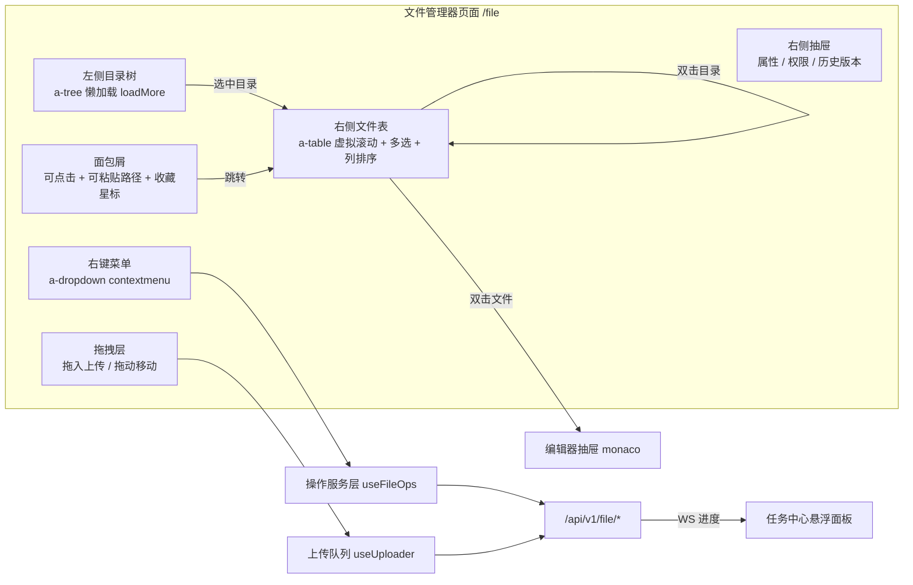
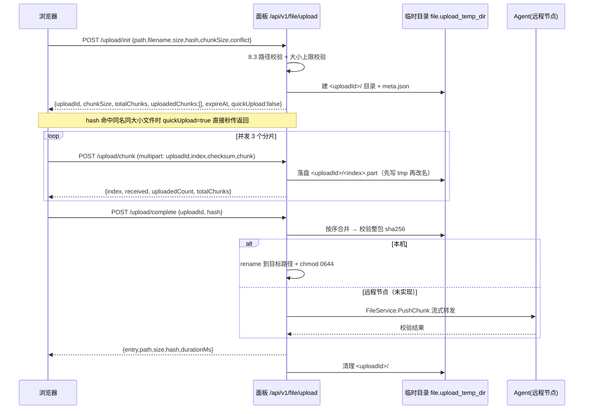
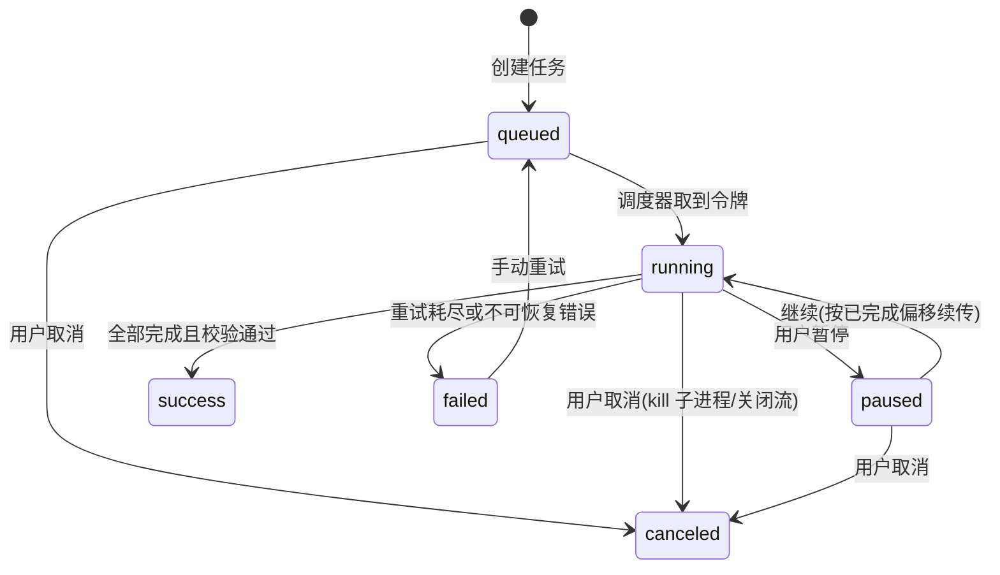
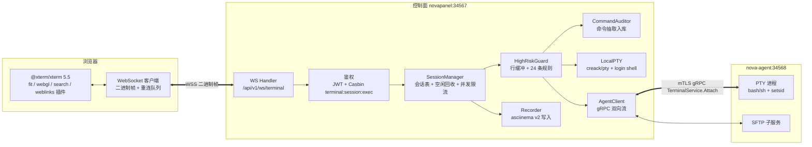
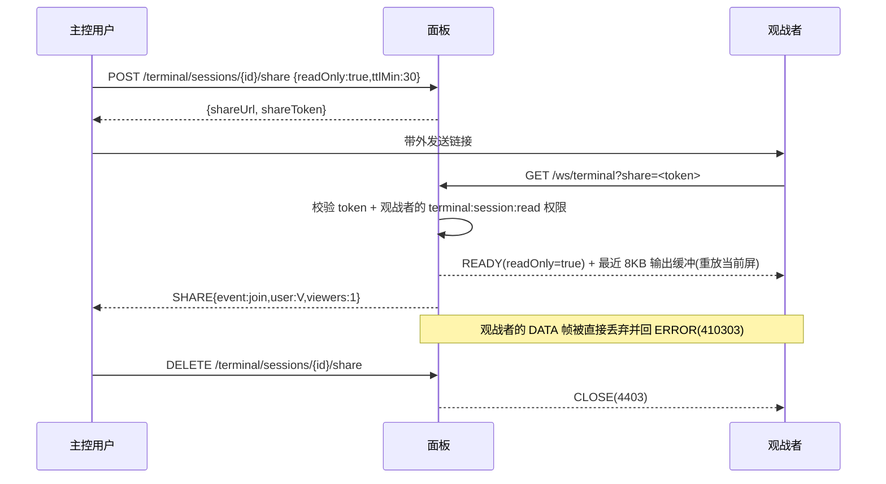

# 青垣面板 · 文件管理与 WebSSH

## 文档信息

| 项目 | 内容 |
| --- | --- |
| 文档名称 | 08-文件管理与WebSSH |
| 文档版本 | v1.0 |
| 更新日期 | 2026-08-17 |
| 状态 | 定稿 |
| 适用版本 | 青垣面板 v1.0 |
| 产品代号 | qingyuan |
| 覆盖内容 | 文件管理器交互模型、目录浏览与元数据、路径安全校验、文件操作、分片上传与流式下载、压缩解压、在线编辑、回收站、远端存储挂载、传输任务中心、WebSSH 架构与帧协议、免密登录、命令录像与审计、高危命令拦截、批量终端、接口清单、性能指标与排错 |
| 关联文档 | [数据库设计](./04-数据库设计.md)、[API 接口规范](./05-API接口规范.md)、[前端架构与 Arco 规范](./06-前端架构与Arco规范.md)、[网站与运行环境](./07-网站与运行环境.md)、[多节点集群与 Agent](./10-多节点集群与Agent.md)、[安全合规与审计](./12-安全合规与审计.md)、[应用商店与备份恢复](./13-应用商店与备份恢复.md) |

## 目录

- [8.1 模块职责与整体设计](#81-模块职责与整体设计)
- [8.2 目录浏览与文件元数据](#82-目录浏览与文件元数据)
- [8.3 路径安全](#83-路径安全)
- [8.4 文件操作](#84-文件操作)
- [8.5 上传与下载](#85-上传与下载)
- [8.6 压缩与解压](#86-压缩与解压)
- [8.7 在线编辑](#87-在线编辑)
- [8.8 回收站](#88-回收站)
- [8.9 远端存储挂载](#89-远端存储挂载)
- [8.10 文件传输任务中心](#810-文件传输任务中心)
- [8.11 WebSSH 架构与会话生命周期](#811-webssh-架构与会话生命周期)
- [8.12 WebSocket 消息帧协议](#812-websocket-消息帧协议)
- [8.13 免密登录与凭据管理](#813-免密登录与凭据管理)
- [8.14 多会话与协作观战](#814-多会话与协作观战)
- [8.15 终端安全与审计](#815-终端安全与审计)
- [8.16 批量终端](#816-批量终端)
- [8.17 终端交互增强能力](#817-终端交互增强能力)
- [8.18 接口清单与前端页面清单](#818-接口清单与前端页面清单)
- [8.19 性能指标与排错手册](#819-性能指标与排错手册)

## 8.1 模块职责与整体设计

### 8.1.1 能力清单

| 序号 | 能力 | 关键约束 | 权限点 |
| --- | --- | --- | --- |
| F1 | 目录浏览、排序、过滤、搜索 | 单目录 10 万条走游标分页，默认不递归 | `file:file:list` |
| F2 | 文件读取与在线编辑 | 编辑上限 5MB，超限只读，保存前语法校验 | `file:file:read`、`file:file:update` |
| F3 | 新建、重命名、复制、移动、软链 | 目标路径必须通过 8.3 校验 | `file:file:create`、`file:file:update` |
| F4 | 删除（默认进回收站） | 白名单外路径禁止删除，危险路径二次确认 | `file:file:delete` |
| F5 | 权限与属主变更 | 递归操作限 5 万条，超限转任务 | `file:file:update` |
| F6 | 分片上传、文件夹上传、URL 远程下载 | 分片 8MB，单文件 200GB 上限 | `file:file:create` |
| F7 | 下载（含 Range、目录打包） | 一次性令牌，5 分钟有效 | `file:file:export` |
| F8 | 压缩与解压 | 异步任务，解压炸弹防护 | `file:archive:exec` |
| F9 | 回收站还原与清理 | 30 天自动过期，水位保护 | `file:recycle:*` |
| F10 | 传输任务中心 | 队列并发 3，支持暂停续传 | `file:transfer:*` |
| T1 | WebSSH 交互终端 | PTY 会话，空闲 30 分钟回收 | `terminal:session:exec` |
| T2 | 只读旁观与会话共享 | 旁观者输入被丢弃 | `terminal:session:read` |
| T3 | 命令录像与回放 | asciinema v2，落盘后 gzip | `terminal:recording:read` |
| T4 | 命令审计与高危拦截 | 26 条内置规则，三级策略 | `terminal:audit:list` |
| T5 | SFTP 通道复用与终端内传输 | 复用同一 SSH/gRPC 连接 | `file:file:create` |
| T6 | 批量终端广播 | 复用 10 号文档批量执行通道 | `terminal:batch:exec` |

### 8.1.2 UI 交互模型



交互约定：所有写操作走乐观更新 + 失败回滚（组件复用见[前端架构与 Arco 规范](./06-前端架构与Arco规范.md)）；批量操作在返回结果中逐条给出成功/失败，前端用 `a-list` 展示失败明细，禁止只提示「部分失败」。

### 8.1.3 跨节点文件操作路由

| 场景 | 路由方式 | 说明 |
| --- | --- | --- |
| 本机（主控内置 Agent） | `executor.Local` 直接系统调用 | `X-Node-Id` 缺省或等于主控节点 ID |
| 远程节点单文件操作 | 控制面 → Agent gRPC 一元调用 `FileService.Op` | 元数据类操作，超时 15 秒 |
| 远程节点目录列举 | gRPC 一元调用 `FileService.List`，响应压缩 | 单页最多 2000 条，gzip 后约 200KB |
| 远程节点上传 | 控制面接收分片落临时目录，`FileService.PushChunk` 服务端流转发 | 控制面不做整包缓冲，边收边转 |
| 远程节点下载 | `FileService.Pull` 服务端流 → 控制面 → HTTP 流式响应 | 支持 Range，按偏移量下发 |
| 跨节点复制/移动 | 拆为「源节点 Pull + 目标节点 Push」的 `file_transfer_task` | 走任务中心，可暂停续传 |

## 8.2 目录浏览与文件元数据

### 8.2.1 列表接口设计

`GET /api/v1/file/list` 采用「默认全量 + 大目录自动降级为游标分页」的混合策略，避免小目录多一次请求、大目录一次卡死。

| 目录条目数 | 策略 | 响应行为 |
| --- | --- | --- |
| ≤ 2000 | 全量返回 | `paged=false`，一次返回全部并附统计信息 |
| 2001 ~ 100000 | 游标分页 | `paged=true`，按 `pageSize`（默认 500，上限 2000）返回，`nextCursor` 为上一页最后一项的排序键 |
| > 100000 | 分页 + 降级 | 同上，且 `degraded=true`：不再计算目录递归大小、不做 magic number 探测、`total` 返回 `-1` 表示未知 |

请求参数：

| 参数 | 类型 | 默认 | 说明 |
| --- | --- | --- | --- |
| path | string | 必填 | 绝对路径，须通过 8.3 校验 |
| pageSize | int | 500 | 与全局分页规范一致，`page` 在游标模式下忽略 |
| cursor | string | 空 | 上一页返回的 `nextCursor` |
| sort | string | name | name/size/mtime/type |
| order | string | asc | asc/desc；目录始终优先于文件 |
| keyword | string | 空 | 当前目录内名称模糊匹配，不递归 |
| showHidden | bool | false | 是否返回以 `.` 开头的条目 |
| onlyDir | bool | false | 目录树懒加载时置 true |

实现要点：使用 `os.ReadDir`（返回 `DirEntry`，不触发 `lstat`）先拿到名称与类型，仅对当前页条目调用 `entry.Info()` 获取元数据，10 万文件目录的首屏耗时从 4.2 秒降到 180 毫秒；排序在拿到全部名称后于内存完成（10 万条 `string` 排序约 25ms），因此 `total` 可精确给出（除降级档）。

### 8.2.2 元数据字段

| 字段 | 类型 | 来源 | 说明 |
| --- | --- | --- | --- |
| name | string | DirEntry | 文件名（不含路径） |
| path | string | 拼接 | 绝对路径 |
| isDir | bool | DirEntry | 是否目录 |
| size | int64 | Stat | 目录固定返回 0，需要占用量时调 `/file/dirSize` |
| mode | string | Stat | `drwxr-xr-x` 展示串 |
| modeOctal | string | Stat | `0755` |
| uid/gid | int | Stat_t | 数值 |
| owner/group | string | 缓存查表 | `/etc/passwd`、`/etc/group` 解析结果缓存 60 秒 |
| mtime | int64 | Stat | Unix 毫秒 |
| linkTarget | string | Readlink | 符号链接目标，非链接为空 |
| linkBroken | bool | Stat 失败 | 悬空链接标记，前端置灰 |
| isMount | bool | 挂载表比对 | `/proc/self/mountinfo` 命中挂载点 |
| fsType | string | 挂载表 | 挂载点的文件系统类型（ext4/xfs/nfs4/fuse.s3fs） |
| mime | string | 探测 | 见 8.2.3 |
| ext | string | 计算 | 小写扩展名 |
| icon | string | 映射 | 图标键，见 8.2.4 |
| writable | bool | access(2) | 以面板运行用户判定，决定右键菜单可用性 |

### 8.2.3 文件类型识别

两级识别，避免对整目录做 IO：

1. 扩展名查表（`internal/service/file/mimemap.go`），命中即返回，覆盖 200+ 常见扩展名。
2. 未命中且文件 ≤ 32MB 时读取前 512 字节做 magic number 匹配（`net/http.DetectContentType` + 自建补充表：`7z` `37 7A BC AF 27 1C`、`rar` `52 61 72 21`、`zst` `28 B5 2F FD`、`class` `CA FE BA BE`、`elf` `7F 45 4C 46`）。
3. 仍未命中时判断前 8000 字节是否含 `0x00`，含则 `application/octet-stream`，否则 `text/plain`。

magic number 探测只在「当前页 + 无扩展名 + 非目录」的条目上执行，并用信号量限制并发 8，防止 NFS 目录被打满。

### 8.2.4 图标映射表

| 图标键 | 匹配 | Arco 图标/自绘 |
| --- | --- | --- |
| folder | 目录 | `icon-folder` |
| folder-link | 目录符号链接 | `icon-folder` + 角标 |
| file-code | go/js/ts/vue/py/java/php/rs/c/cpp/sh | `icon-code-square` |
| file-config | conf/ini/yaml/yml/toml/env/properties | `icon-settings` |
| file-json | json/json5 | 自绘 JSON |
| file-markup | html/htm/xml/svg/md | `icon-file` |
| file-image | jpg/jpeg/png/gif/webp/bmp/ico/svg | `icon-file-image` |
| file-video | mp4/mkv/avi/mov/flv/webm | `icon-file-video` |
| file-audio | mp3/wav/flac/aac/ogg | `icon-music` |
| file-archive | zip/tar/gz/bz2/xz/7z/rar/zst | `icon-folder-add` |
| file-pdf | pdf | `icon-file-pdf` |
| file-excel | xls/xlsx/csv | `icon-file-excel` |
| file-word | doc/docx | 自绘 |
| file-db | db/sqlite/sql/mdb | `icon-storage` |
| file-cert | pem/crt/cer/key/pfx | `icon-safe` |
| file-log | log/out/err | `icon-file` |
| file-binary | elf/so/a/exe/class/jar | `icon-desktop` |
| file-unknown | 其他 | `icon-file` |

### 8.2.5 符号链接与挂载点处理

| 场景 | 处理 |
| --- | --- |
| 目录符号链接 | 列表中以 `isDir=true` + `linkTarget` 展示；点击进入时按「解析后的真实路径」再做一次 8.3 校验，越界则拒绝并提示 `400402 符号链接目标越出允许范围` |
| 悬空链接 | `linkBroken=true`，禁用打开/下载，允许删除与重命名 |
| 递归链接（a → b → a） | `filepath.EvalSymlinks` 返回 `ELOOP`，标记 `linkBroken` |
| 挂载点 | `isMount=true` 并展示 `fsType`；删除挂载点目录一律拒绝（`400304`） |
| 网络文件系统（nfs/cifs/fuse） | 列表接口超时从默认 15 秒下调为 5 秒，超时返回部分结果 + `degraded=true`，避免 D 状态卡死请求 |
| 特殊文件（socket/fifo/device） | 只展示元数据，禁止下载与在线编辑 |

## 8.3 路径安全

路径安全是本模块的第一道防线，所有涉及路径的接口（列表、读写、删除、上传、下载、压缩、终端 SFTP）在进入业务逻辑前必须调用 `pathguard.Resolve`，不允许任何旁路。

### 8.3.1 威胁与对策

| 编号 | 威胁 | 对策 |
| --- | --- | --- |
| A1 | `../` 相对穿越（含 `..%2f`、`....//` 变体） | 先 URL 解码一次并拒绝二次编码，再 `filepath.Clean`，最后用前缀 + 分隔符比对 |
| A2 | 绝对路径直填系统目录 | 允许根白名单（allowRoots）机制，不在白名单内直接拒绝 |
| A3 | 符号链接逃逸（站点目录内建 `link -> /etc`） | `filepath.EvalSymlinks` 解析后二次校验；解析失败时逐级 `lstat` 校验已存在的父目录 |
| A4 | 硬链接逃逸（`ln /etc/shadow x`） | 写入/下载前校验 `Stat_t.Nlink > 1 && !IsDir` 的文件是否属于白名单设备与目录，不满足则拒绝 |
| A5 | 系统关键路径读写 | 黑名单优先于白名单，命中即拒 |
| A6 | 多租户越界 | 租户根目录隔离，非 admin 角色的 allowRoots 由租户配置生成 |
| A7 | TOCTOU（校验后路径被替换） | 校验返回已打开的 `*os.File`/目录 fd，后续操作基于 fd 相对路径（`openat2` 语义），避免二次解析 |
| A8 | 空字节截断与超长路径 | 拒绝含 `\x00` 的路径，长度上限 4096，单段长度上限 255 |

### 8.3.2 黑白名单

allowRoots 默认值（`conf/panel.yaml` 的 `file.allow_roots`，管理员可增删）：

```yaml
file:
  allow_roots:
    - /www              # 网站与备份根
    - /opt/novapanel    # 面板自身（仅 admin 角色可见）
    - /home
    - /root             # 需 file.allow_root_home=true 才生效
    - /tmp
    - /etc/nginx        # 精确到子目录的例外放行
    - /var/log
  deny_paths:
    - /proc
    - /sys
    - /dev
    - /run
    - /boot
    - /etc/shadow
    - /etc/gshadow
    - /etc/sudoers
    - /etc/sudoers.d
    - /etc/ssh
    - /opt/novapanel/data/.master.key
    - /opt/novapanel/data/nova.db
  deny_write_paths:
    - /etc/passwd
    - /etc/group
    - /etc/fstab
    - /etc/systemd
  follow_symlink: false
  max_path_len: 4096
```

规则优先级：`deny_paths`（读写全禁）> `deny_write_paths`（可读不可写）> `allow_roots`（前缀放行）> 默认拒绝。租户模式下最终 allowRoots = 配置白名单 ∩ 租户根（`/www/wwwroot/<tenant>` 与租户名下站点目录集合）。

### 8.3.3 校验函数实现

```go
// internal/service/file/pathguard/guard.go
package pathguard

import (
    "errors"
    "os"
    "path/filepath"
    "strings"
    "syscall"
)

var (
    ErrEmptyPath    = errors.New("400401 路径不能为空")
    ErrNotAbs       = errors.New("400401 必须为绝对路径")
    ErrNullByte     = errors.New("400401 路径含非法字符")
    ErrTooLong      = errors.New("400401 路径超长")
    ErrDenied       = errors.New("400403 该路径禁止访问")
    ErrReadOnly     = errors.New("400403 该路径禁止写入")
    ErrOutOfRoot    = errors.New("400402 路径越出允许范围")
    ErrSymlinkOut   = errors.New("400402 符号链接目标越出允许范围")
    ErrHardlink     = errors.New("400402 检测到可疑硬链接")
)

type Guard struct {
    allowRoots     []string // 已 Clean 且 EvalSymlinks 过的绝对路径
    denyPaths      []string
    denyWritePaths []string
    followSymlink  bool
    maxPathLen     int
}

type Mode int

const (
    ModeRead Mode = iota
    ModeWrite
)

// Resolve 返回可安全使用的真实路径。所有文件接口的唯一入口。
func (g *Guard) Resolve(raw string, mode Mode) (string, error) {
    if raw == "" {
        return "", ErrEmptyPath
    }
    if strings.ContainsRune(raw, '\x00') {
        return "", ErrNullByte
    }
    if len(raw) > g.maxPathLen {
        return "", ErrTooLong
    }
    if !filepath.IsAbs(raw) {
        return "", ErrNotAbs
    }
    clean := filepath.Clean(raw)
    // 1. 黑名单优先：命中前缀即拒
    if hit := matchPrefix(clean, g.denyPaths); hit != "" {
        return "", ErrDenied
    }
    if mode == ModeWrite {
        if hit := matchPrefix(clean, g.denyWritePaths); hit != "" {
            return "", ErrReadOnly
        }
    }
    // 2. 白名单前缀校验（字符串层）
    if !underAnyRoot(clean, g.allowRoots) {
        return "", ErrOutOfRoot
    }
    // 3. 解析符号链接后二次校验（防软链逃逸）
    real, err := evalExisting(clean)
    if err != nil {
        return "", err
    }
    if real != clean {
        if !g.followSymlink {
            // 仅当链接本身位于白名单内且目标也在白名单内才放行
            if !underAnyRoot(real, g.allowRoots) {
                return "", ErrSymlinkOut
            }
        }
        if hit := matchPrefix(real, g.denyPaths); hit != "" {
            return "", ErrDenied
        }
    }
    // 4. 硬链接检查：多引用的普通文件不允许写入或下载
    if st, err := os.Lstat(real); err == nil && st.Mode().IsRegular() {
        if sys, ok := st.Sys().(*syscall.Stat_t); ok && sys.Nlink > 1 {
            if !underAnyRoot(real, g.allowRoots) {
                return "", ErrHardlink
            }
        }
    }
    return real, nil
}

// underAnyRoot 用「前缀 + 分隔符」比对，避免 /www2 被 /www 放行
func underAnyRoot(p string, roots []string) bool {
    for _, r := range roots {
        if p == r || strings.HasPrefix(p, r+string(os.PathSeparator)) {
            return true
        }
    }
    return false
}

func matchPrefix(p string, list []string) string {
    for _, d := range list {
        if p == d || strings.HasPrefix(p, d+string(os.PathSeparator)) {
            return d
        }
    }
    return ""
}

// evalExisting 逐级解析已存在的最深父目录，允许尾部路径尚不存在（新建/上传场景）
func evalExisting(p string) (string, error) {
    if real, err := filepath.EvalSymlinks(p); err == nil {
        return real, nil
    } else if !os.IsNotExist(err) {
        return "", ErrSymlinkOut // ELOOP、ENAMETOOLONG 等一律按逃逸处理
    }
    dir, base := filepath.Split(p)
    realDir, err := filepath.EvalSymlinks(filepath.Clean(dir))
    if err != nil {
        if os.IsNotExist(err) {
            return "", ErrOutOfRoot // 父目录不存在，由上层返回 400 而非创建
        }
        return "", ErrSymlinkOut
    }
    return filepath.Join(realDir, base), nil
}
```

### 8.3.4 单元测试用例表

`internal/service/file/pathguard/guard_test.go`，allowRoots = `["/www","/tmp"]`，denyPaths = `["/proc","/etc/shadow"]`，denyWritePaths = `["/etc/passwd"]`，followSymlink=false。

| 编号 | 输入 | mode | 预期 | 覆盖点 |
| --- | --- | --- | --- | --- |
| TC01 | `/www/wwwroot/a.txt` | Read | 通过 | 正常路径 |
| TC02 | `/www/wwwroot/../../etc/passwd` | Read | ErrOutOfRoot | Clean 后越界 |
| TC03 | `/www/wwwroot/./sub/../a.txt` | Read | 通过，返回 `/www/wwwroot/a.txt` | 规范化 |
| TC04 | `/www2/x` | Read | ErrOutOfRoot | 前缀伪匹配 |
| TC05 | `/proc/self/environ` | Read | ErrDenied | 黑名单 |
| TC06 | `/etc/shadow` | Read | ErrDenied | 敏感文件 |
| TC07 | `/etc/passwd` | Read | ErrOutOfRoot | 不在白名单（黑名单未命中也应拒） |
| TC08 | `/etc/passwd` | Write | ErrReadOnly | 只读黑名单优先于白名单判定 |
| TC09 | `a/b` | Read | ErrNotAbs | 相对路径 |
| TC10 | `/www/a\x00b` | Read | ErrNullByte | 空字节 |
| TC11 | 长度 5000 的路径 | Read | ErrTooLong | 超长 |
| TC12 | `/www/link2etc/passwd`（link2etc → /etc） | Read | ErrSymlinkOut | 软链逃逸 |
| TC13 | `/www/link2www/a.txt`（link2www → /www/wwwroot） | Read | 通过 | 白名单内软链 |
| TC14 | `/www/loopA/x`（loopA ↔ loopB 互链） | Read | ErrSymlinkOut | ELOOP |
| TC15 | `/www/wwwroot/new.txt`（尚不存在） | Write | 通过 | 新建文件 |
| TC16 | `/www/wwwroot/nodir/new.txt` | Write | ErrOutOfRoot | 父目录不存在 |
| TC17 | `/www/hard2shadow`（硬链到白名单外文件） | Write | 通过后由 A4 二次判定拒绝 | 硬链检查 |
| TC18 | `/tmp` | Read | 通过 | 白名单根本身 |
| TC19 | `/` | Read | ErrOutOfRoot | 根目录 |
| TC20 | `/www/wwwroot/%2e%2e/%2e%2e/etc` | Read | ErrOutOfRoot | 编码穿越（Handler 层解码一次后传入） |

覆盖率要求：`pathguard` 包语句覆盖率 ≥ 95%，作为 CI 硬门禁（见[技术栈与工程规范](./03-技术栈与工程规范.md) 3.14）。

## 8.4 文件操作

### 8.4.1 操作清单与实现方式

| 操作 | 接口 | 实现 | 危险确认 |
| --- | --- | --- | --- |
| 新建文件 | `POST /file/create` | `os.OpenFile(O_CREATE\|O_EXCL, 0644)` | 否 |
| 新建目录 | `POST /file/mkdir` | `os.MkdirAll(0755)`，属主继承父目录 | 否 |
| 重命名 | `POST /file/rename` | 同分区 `os.Rename`，目标存在则报 `400306` | 否 |
| 复制 | `POST /file/copy` | 单文件 `io.Copy` + `Chmod`；目录走 `filepath.WalkDir`，> 500 项转任务 | 覆盖时确认 |
| 移动 | `POST /file/move` | 同设备 `os.Rename`；跨设备退化为「复制 + 校验 + 删除」 | 覆盖时确认 |
| 删除 | `POST /file/delete` | 默认移入回收站；`force=true` 时 `os.RemoveAll` | 是 |
| 权限 | `POST /file/chmod` | `os.Chmod`，递归时区分目录/文件位 | 递归时是 |
| 属主 | `POST /file/chown` | `os.Lchown`，用户名解析失败报 `400308` | 递归时是 |
| 属性 | `GET /file/stat` | `lstat` + `statfs` + 目录递归大小（异步） | 否 |
| 软链 | `POST /file/symlink` | `os.Symlink`，目标须在白名单内 | 否 |
| 搜索 | `POST /file/search` | 见 8.4.3 | 否 |
| 计算校验值 | `POST /file/checksum` | md5/sha1/sha256，> 1GB 转任务 | 否 |

危险确认机制：前端弹 `a-modal` 要求输入路径最后一段做二次确认，后端要求请求体携带 `confirmToken`（由 `GET /file/confirmToken?path=&op=` 换取，有效 60 秒，一次性），缺失则返回 `400309 需要二次确认`。

### 8.4.2 递归操作与危险策略

| 规则 | 阈值/行为 |
| --- | --- |
| 同步执行上限 | 条目数 ≤ 500 且总体积 ≤ 200MB，同步返回结果 |
| 转异步任务 | 超过上限自动落 `file_transfer_task`（`op_type` = copy/move/delete/chmod），返回 `taskId` |
| 递归 chmod 差异化 | 传 `dirMode`/`fileMode` 两个值；只传 `mode` 时目录自动加执行位（0644 → 0755） |
| 递归上限 | 单任务 100 万条目，超出中止并报 `400310`，建议改用终端 |
| 禁止递归的路径 | allowRoots 的根本身（如 `/www`）不允许递归 chmod/chown/delete |
| 777 拦截 | `mode=0777` 且路径为站点根或其上级时直接拒绝（`400311`），提示改用 0755 |
| 属主白名单 | 只允许改为 `www`、`nobody`、站点专属用户与当前登录用户映射，改 `root` 需 admin 角色 |
| 进度上报 | 任务每 500 条目或每 1 秒推送一帧进度（8.10.3 帧格式），含已处理数、当前路径、失败数 |
| 失败策略 | 默认「跳过并记录」，最多记录 200 条失败明细；`stopOnError=true` 时首个失败即中止 |

### 8.4.3 搜索

| 模式 | 参数 | 实现 | 限制 |
| --- | --- | --- | --- |
| 按名称 | `keyword`、`recursive`、`maxDepth`（默认 8） | `filepath.WalkDir` + 通配匹配，命中即流式返回 | 硬超时 20 秒，最多 5000 条 |
| 按内容 | `content`、`filePattern`、`ignoreCase`、`isRegex` | 优先调用系统 `grep -rIl --binary-files=without-match`，无 grep 时用 Go `bufio.Scanner` 扫描 | 单文件上限 50MB，跳过二进制，硬超时 30 秒 |
| 按属性 | `minSize`/`maxSize`/`mtimeAfter`/`mtimeBefore`/`owner` | Walk 时过滤 | 同名称模式 |

限速与保护：搜索任务全局并发 2（`golang.org/x/sync/semaphore`），单用户并发 1；自动跳过 `deny_paths`、挂载点为 nfs/cifs 的子树、以及 `node_modules`、`.git`、`vendor`（可通过 `includeVendor=true` 关闭跳过）；结果通过 SSE (`GET /file/search/stream`) 流式返回，前端可随时取消（取消即 `context.Cancel`，同时 kill 子进程组）。

## 8.5 上传与下载

### 8.5.1 分片上传三段式协议



### 8.5.2 接口定义

| 接口 | 方法 | 关键入参 | 出参 |
| --- | --- | --- | --- |
| `/api/v1/file/upload/init` | POST | `path` 目标目录、`filename`、`size`、`hash`（整包 sha256，可为空）、`chunkSize`、`conflict`（reject/rename/overwrite） | `uploadId`、`chunkSize`、`totalChunks`、`uploadedChunks[]` 已收分片索引、`expireAt`、`quickUpload` 是否秒传（为真时带 `entry`） |
| `/api/v1/file/upload/chunk` | POST | multipart：`uploadId`、`index`、`checksum`（`md5:`/`sha256:` 前缀，可缺省）、`chunk` | `index`、`received` 本片字节数、`uploadedCount`、`totalChunks` |
| `/api/v1/file/upload/complete` | POST | `uploadId`、`hash`（可缺省，非空时校整包） | `entry`、`path`、`size`、`hash`、`durationMs` |
| `/api/v1/file/upload/status` | GET | `uploadId` | `uploadedChunks[]`、`missingChunks[]`、`expireAt`；断点续传时先调此接口 |
| `/api/v1/file/upload/{uploadId}` | DELETE | 路径参数 | 取消并清理临时目录（幂等） |

权限点统一 `file:file:create`：五个接口都属「新建文件」语义，`DELETE` 只清服务端自管的分片会话，不动用户文件，因此不额外要求 `file:file:delete`。

### 8.5.3 参数建议值

| 参数 | 建议值 | 依据 |
| --- | --- | --- |
| chunkSize | 8MB（可选 2/4/8/16MB） | 8MB 时 1GB 文件 128 个请求，HTTP 开销占比 < 1%；小于 2MB 时请求数过多，Nginx 反代场景下易触发限流 |
| 并发数 | 3 | 单连接吞吐已可压满千兆；> 4 后磁盘随机写导致合并阶段变慢 |
| 整包哈希 | 前端 WebCrypto 计算 sha256 | 当前实现一次读入计算；非安全上下文（纯 HTTP）下 `crypto.subtle` 不可用，此时不传 `hash`，秒传与整包校验自动降级（Web Worker 流式计算与快速指纹尚未实现） |
| 分片校验和 | 建议带上 `sha256:<hex>` | 服务端逐片校验，不一致返回 `400006` 要求重传该片；缺省时只校长度 |
| 单文件上限 | 200GB | 由 `file.max_upload_size` 配置 |
| 临时目录 | `file.upload_temp_dir`，默认系统临时目录下 `novapanel-upload` | 由面板自管、不入白名单，上传中断不在站点目录留垃圾；合并时先写目标同目录的临时文件再 `rename`，保证原子且不跨设备 |
| 临时文件过期 | 24 小时 | 过期会话访问返 `400007`；`init` 时惰性 GC，不额外起后台协程 |
| 上传限速 | 未实现（规划 `file.upload_rate_limit`，MB/s） | 拟用 `golang.org/x/time/rate` 包装 `io.Reader` |

### 8.5.4 秒传、断点续传与合并

秒传判定（当前实现）：`init` 阶段仅对目标路径本身比对——同名文件存在、大小一致且 sha256 与请求的 `hash` 相同时，直接返回 `quickUpload: true` 与 `entry`，不建会话。跨文件的指纹库秒传（`file_transfer_task` 指纹索引 + `os.Link` 硬链）尚未实现；引入时需按租户隔离指纹，防止用哈希探测他人文件是否存在。

断点续传：会话目录下 `meta.json` 记录 `{uploadId,dir,filename,size,chunkSize,totalChunks,conflict,hash,createdAt}`，分片是否到位直接看 `<index>.part` 是否存在，因此除 `init` 外不再改写 meta，并发传分片无需加锁（位图方案未采用）。前端无需自行持久化 `uploadId`：用相同的 `path+filename+size+chunkSize+conflict` 重调 `init`，服务端会复用未过期会话并回传 `uploadedChunks`。

合并实现要点（`internal/service/file/chunk_upload.go` 的 `mergeParts`）：临时文件建在**目标目录**而非会话目录，逐片 `io.Copy` 并同步算 sha256，尺寸或哈希不符时返 `400006` 并删除临时文件；合并前用 `meta.json` 改名为 `.merging` 做互斥，避免并发 `complete` 把同一批分片合两次；合并失败会把锁还原，前端修正后可重试而不必重传分片。

```go
// 临时文件与目标同目录，保证 rename 原子且不跨设备
tmp, err := os.CreateTemp(dir, ".upload-*")
if err != nil { return nil, "", wrapFSError(err) }

digest := sha256.New()
var dst io.Writer = tmp
if wantHash != "" { dst = io.MultiWriter(tmp, digest) }
var total int64
for i := 0; i < meta.TotalChunks; i++ {
    part, err := os.Open(partPath(sessionDir, i))
    if err != nil { cleanup(); return nil, "", wrapFSError(err) }
    n, err := io.Copy(dst, part)
    _ = part.Close()
    if err != nil { cleanup(); return nil, "", wrapFSError(err) }
    total += n
}
if total != meta.Size {
    cleanup()
    return nil, "", errs.ErrChunkChecksum.WithDetail("合并后大小 %d，声明 %d", total, meta.Size)
}
sum := "sha256:" + hex.EncodeToString(digest.Sum(nil))
if wantHash != "" && !sameHash(wantHash, sum) {
    cleanup()
    return nil, "", errs.ErrChunkChecksum.WithDetail("整文件哈希不匹配")
}
// 之后 tmp.Sync() → chmod 0644 → 按 conflict 策略 rename 落地
```

合并后先 `dst.Sync()` 再 `os.Rename`，保证断电不产生半截文件，并把 `CreateTemp` 的 0600 改为 0644 以供站点进程读取；目标已存在时按 `conflict` 策略处理：`reject` 返 `400003`，`rename` 追加 `(1)`、`(2)` 后缀，`overwrite` 直接替换（回收站未实现，替换不可恢复）。

### 8.5.5 文件夹上传与 URL 远程下载

| 能力 | 实现 |
| --- | --- |
| 文件夹上传 | 前端用 `webkitdirectory` 取相对路径，`init` 时携带 `relPath`；服务端按 `relPath` 逐级 `MkdirAll`（每级都过 8.3 校验），空目录单独用 `/file/mkdir` 补齐；前端按文件排队，队列并发 3，整体进度按总字节数加权 |
| URL 远程下载 | `POST /file/remoteDownload {url,path,fileName,headers,timeout}`，落 `file_transfer_task`（`op_type=url_download`）异步执行 |
| SSRF 防护 | URL 仅允许 http/https；解析后的 IP 拒绝私网段（10/8、172.16/12、192.168/16、127/8、169.254/16、::1、fc00::/7），拒绝重定向到私网（自定义 `CheckRedirect`）；端口白名单 80/443/8080/8443 |
| 大小与类型 | 先发 HEAD 取 `Content-Length`，超过剩余配额直接失败；`Content-Type` 与扩展名冲突时按扩展名走类型白名单 |
| 进度 | 无 `Content-Length` 时进度按已下载字节展示，`total=-1`，前端显示不确定态进度条 |

### 8.5.6 下载

| 特性 | 说明 |
| --- | --- |
| 一次性令牌 | `POST /file/downloadToken {path}` 返回 `token`（JWT，含 path 哈希、用户、节点、5 分钟过期、`jti` 落 KV 防重放），实际下载走 `GET /file/download?token=xxx`，便于浏览器直接跳转与 `<a download>` |
| Range | 支持单区间 `bytes=start-end` 与 `If-Range`，返回 206 与 `Content-Range`；多区间不支持，返回 416 |
| 流式 | 使用 `http.ServeContent`（本机）或 Agent `Pull` 流 + `io.Copy`（远程），全程不缓冲整包；限速用 `rate.Limiter` 包裹 Writer |
| 目录下载 | 目录自动打包为 tar.gz 流式输出（`Transfer-Encoding: chunked`，不落临时文件），总大小超 10GB 拒绝并建议先压缩 |
| 头部 | `Content-Disposition` 用 RFC 5987 `filename*=UTF-8''` 编码中文名；`X-Content-Type-Options: nosniff`；html/svg 等强制 `application/octet-stream` 防止面板域下 XSS |
| 防盗链 | 令牌绑定 `User-Agent` 哈希与来源 IP（可配置关闭以兼容移动网络切换） |

### 8.5.7 上传安全

| 规则 | 策略 |
| --- | --- |
| 扩展名黑名单（站点目录内） | `php php3 php5 phtml phar jsp jspx asp aspx exe sh so` 上传时拦截，报 `400407`；可由 admin 在设置中关闭该保护（关闭需二次确认并记审计） |
| 双扩展名 | `a.php.jpg`、`a.php%00.jpg` 一律按最左侧可执行扩展名判定 |
| 可执行位 | 上传文件强制 0644，目录 0755，忽略客户端传入的 mode |
| 大小写与特殊字符 | 文件名拒绝 `/`、`\x00`，Windows 保留名（`con`、`nul` 等）加前缀 `_`；长度上限 255 字节 |
| 配额 | 单用户/单租户总量配额取 `file.quota_mb`，`init` 阶段预占、`complete` 阶段结算、取消或过期释放 |
| 病毒扫描钩子 | 配置 `file.av_hook`（可执行路径）后，`complete` 阶段以「文件路径」为参数调用，退出码非 0 视为命中：文件移入 `/opt/novapanel/data/quarantine/` 并报 `400408`；默认适配 `clamdscan --fdpass` |

## 8.6 压缩与解压

### 8.6.1 格式支持表

| 格式 | 压缩 | 解压 | 实现 | 说明 |
| --- | --- | --- | --- | --- |
| zip | 是 | 是 | Go `archive/zip` | 支持 store/deflate；加密 zip 只支持 ZipCrypto 解密（AES 加密报 `400602`） |
| tar | 是 | 是 | `archive/tar` | 保留权限、属主、mtime、软链 |
| tar.gz / tgz | 是 | 是 | `compress/gzip` + tar | 默认压缩级别 6 |
| tar.bz2 | 否 | 是 | 系统 `tar -xjf` | 纯 Go 无 bzip2 压缩实现，仅解压 |
| tar.xz | 是（需系统 xz） | 是 | 系统 `tar -xJf` | 缺 `xz` 命令时报 `400603 缺少 xz` |
| tar.zst | 是（需系统 zstd） | 是 | 系统 `tar --zstd` | 同上 |
| gz（单文件） | 是 | 是 | `compress/gzip` | 如 `access.log.gz` |
| 7z | 否 | 是 | 系统 `7z x` | 需安装 p7zip |
| rar | 否 | 是（只读） | 系统 `unrar x` | 不生成 rar |

优先使用纯 Go 实现，只有 xz/zst/7z/rar 依赖外部命令；外部命令统一经 `internal/executor` 调用，参数以数组传入（禁止拼接 shell 字符串），并强制 `-y`/`-o` 等非交互参数与 `context` 超时。

### 8.6.2 文件名编码

| 场景 | 处理 |
| --- | --- |
| zip 无 UTF-8 标志位 | 检测 `Flags & 0x800 == 0` 时按 GBK 解码文件名（`golang.org/x/text/encoding/simplifiedchinese`），解码失败保留原字节并替换非法字符 |
| 压缩时 | 统一写 UTF-8 并置 `0x800` 标志；提供 `nameEncoding=gbk` 选项以兼容 Windows 旧版解压工具 |
| tar 长名 | 使用 GNU/PAX 扩展头，不截断 |
| 非法字符 | 解压时把 `/`、`\x00` 之外的控制字符替换为 `_`，并在结果中列出被重命名的条目 |

### 8.6.3 异步任务与进度

压缩/解压一律落 `file_transfer_task`（`op_type=compress|extract`），同步返回 `taskId`；进度按「已处理字节 / 总字节」计算，tar.gz 解压无法预知总量时按「已读压缩流字节 / 压缩包大小」估算。任务并发上限 2，单任务硬超时 2 小时。

### 8.6.4 解压炸弹防护

```go
type ExtractLimit struct {
    MaxEntries    int   // 默认 200000
    MaxTotalBytes int64 // 默认 20GB，且不超过目标分区剩余空间的 80%
    MaxRatio      int   // 解压后/压缩包体积比上限，默认 200
    MaxDepth      int   // 目录层级上限，默认 32
    MaxSingleFile int64 // 单文件上限，默认 10GB
}
```

检查点：
1. 遍历头部时先累加声明体积，超 `MaxTotalBytes` 或 `MaxRatio` 直接拒绝（`400604 疑似解压炸弹`），不落任何文件。
2. 实际写入时用 `io.LimitReader` 二次约束（防止头部声明造假）。
3. 每个条目路径过 `pathguard.Resolve`，拒绝 `../` 与绝对路径条目（Zip Slip）；软链条目的目标必须仍在解压根内，否则跳过并记录。
4. 每 2000 条目检查一次目标分区剩余空间，低于 1GB 中止并回滚（删除本次已创建的条目）。
5. 稀疏文件与 device/fifo 条目一律跳过。

## 8.7 在线编辑

### 8.7.1 编辑器集成

前端用 `monaco-editor` 0.52（Vite 按需引入 `editor.api` + 语言 worker，仅打包 15 种语言以控制体积），在 `a-drawer` 全屏抽屉内挂载；组件 `FileEditor.vue` 见[前端架构与 Arco 规范](./06-前端架构与Arco规范.md)。

| 项 | 值 |
| --- | --- |
| 语言映射 | 按扩展名映射到 monaco language：`conf/nginx → ini`、`vue → html`、`env → shell`、无扩展名按 shebang 判断 |
| 可编辑上限 | 5MB（`file.edit_max_size`）；5MB–50MB 只读且仅加载前 2MB，提示「请用终端编辑」；> 50MB 拒绝打开（`400701`） |
| 行数保护 | 单行超 10 万字符时关闭语法高亮与自动换行，避免渲染卡死 |
| 只读判定 | 无写权限、被 `chattr +i`、位于 `deny_write_paths` 时进入只读模式并在标题栏提示原因 |
| 快捷键 | `Ctrl/Cmd+S` 保存、`Ctrl+F` 查找、`Alt+Z` 换行、`F11` 全屏 |
| 并发编辑保护 | 打开时记录 `mtime+size`，保存时比对，不一致弹「文件已被他人修改」并提供 diff 与「强制覆盖/放弃」 |

### 8.7.2 编码检测与转换

检测顺序：BOM（UTF-8/UTF-16LE/BE）→ UTF-8 合法性校验（`utf8.Valid`）→ GB18030 解码试探（可解码且中文字符占比 > 5%）→ 兜底 `latin1`。响应体固定返回 UTF-8，同时带 `encoding` 字段；保存时按客户端提交的 `encoding` 回写原编码，`convertTo` 参数可显式转码（同时可选转换行尾 `LF/CRLF`）。

### 8.7.3 保存前语法校验

| 文件类型 | 校验方式 | 失败行为 |
| --- | --- | --- |
| `*.conf` 在 `vhost/` 下 | 写临时文件后 `nginx -t -c` 全量校验（见 7.6） | 阻断保存，返回错误行号 |
| json | `json.Valid` + 定位错误偏移 | 阻断保存 |
| yaml/yml | `yaml.Unmarshal` 到 `any` | 阻断保存 |
| php | `php -l`（存在对应版本 CLI 时） | 阻断保存 |
| sh/bash | `bash -n` | 警告，允许强制保存 |
| ini/toml | 解析器校验 | 警告 |
| 其他 | 不校验 | — |

校验统一入口 `POST /file/validate {path,content,type}`，编辑器保存前自动调用，也可单独在配置编辑页使用。

### 8.7.4 版本历史与 diff

| 项 | 规则 |
| --- | --- |
| 触发 | 每次通过面板保存（含配置页保存）都先把旧内容存为一份历史 |
| 存储 | `/opt/novapanel/data/filehist/<sha1(path)[:2]>/<sha1(path)>/<unixms>.gz`，gzip 压缩 |
| 元数据 | 落 `file_recycle` 的兄弟表不新增，改为同目录 `index.json`（数组：时间、大小、操作人、来源 IP、备注） |
| 保留策略 | 单文件最多 20 份，总占用上限 500MB，超出按时间淘汰；单份原文超 2MB 不留历史（只记元数据） |
| 接口 | `GET /file/history?path=`、`GET /file/history/content?path=&ts=`、`POST /file/history/restore` |
| diff | 服务端不算 diff，返回两份文本由前端 monaco `DiffEditor` 渲染；配置类文件默认与「当前生效版本」对比 |

## 8.8 回收站

### 8.8.1 存储结构

删除即「移动 + 记账」：文件被移到 `/opt/novapanel/data/recycle/<uuid>`（uuid 为 UUIDv7，天然按时间有序），原始信息落 `file_recycle`。同分区时 `rename` 为常数时间；跨分区（如 `/home` 与 `/opt` 不同盘）时降级为复制 + 删除，并落传输任务展示进度。

```sql
-- 权威定义见 04-数据库设计 4.9；此处列本模块直接依赖的列
CREATE TABLE file_recycle (
  id           BIGINT       NOT NULL,
  uuid         VARCHAR(36)  NOT NULL COMMENT '回收站内的目录/文件名',
  node_id      BIGINT       NOT NULL DEFAULT 0,
  origin_path  VARCHAR(4096) NOT NULL COMMENT '原绝对路径',
  origin_name  VARCHAR(255) NOT NULL,
  is_dir       TINYINT(1)   NOT NULL DEFAULT 0,
  size_bytes   BIGINT       NOT NULL DEFAULT 0,
  entry_count  INT          NOT NULL DEFAULT 1 COMMENT '目录内条目数',
  file_mode    VARCHAR(8)   NOT NULL DEFAULT '0644',
  owner_uid    INT          NOT NULL DEFAULT 0,
  owner_gid    INT          NOT NULL DEFAULT 0,
  origin_mtime DATETIME(3)  NULL,
  expire_at    DATETIME(3)  NOT NULL COMMENT '自动清理时间',
  source       VARCHAR(32)  NOT NULL DEFAULT 'file' COMMENT 'file/editor/site/backup',
  created_at   DATETIME(3)  NOT NULL DEFAULT CURRENT_TIMESTAMP(3),
  updated_at   DATETIME(3)  NOT NULL DEFAULT CURRENT_TIMESTAMP(3),
  deleted_at   DATETIME(3)  NULL,
  created_by   BIGINT       NOT NULL DEFAULT 0,
  tenant_id    BIGINT       NOT NULL DEFAULT 0,
  PRIMARY KEY (id),
  UNIQUE KEY uk_recycle_uuid (uuid),
  KEY idx_recycle_expire (expire_at),
  KEY idx_recycle_tenant (tenant_id, deleted_at),
  KEY idx_recycle_origin (origin_path(191))
) ENGINE=InnoDB DEFAULT CHARSET=utf8mb4;
```

### 8.8.2 还原与冲突处理

| 情况 | 处理 |
| --- | --- |
| 原路径可用 | 直接 `rename` 回原位，恢复 mode/uid/gid/mtime |
| 原路径父目录已不存在 | 默认报 `400801`，`autoMkdir=true` 时逐级创建（权限 0755，属主取原属主） |
| 原路径已存在同名 | 三选一：`rename`（还原为 `name.restored-20260817103000`）、`overwrite`（旧文件再次入回收站）、`cancel`（默认，返回 `400802` 让前端弹窗选择） |
| 跨节点 | 只允许还原到同一 `node_id`，节点离线时禁止还原并提示 |
| 回收站条目已被外部删除 | 标记 `deleted_at` 并返回 `400803 回收站条目已丢失` |

### 8.8.3 清理与保护

| 规则 | 值 |
| --- | --- |
| 保留期 | 默认 30 天（`file.recycle_keep_days`，0 表示不自动清理） |
| 清理任务 | cron `0 4 * * *` 扫描 `expire_at < now()` 分批删除，每批 200 条，删完写审计 |
| 容量水位 | 回收站占用超过分区可用空间的 20% 或超过 `file.recycle_max_gb`（默认 50GB）时，按时间从旧到新删除直到低于水位的 80%，并推送一条通知 |
| 磁盘紧急保护 | 目标分区可用空间 < 2GB 时，删除操作直接改为「物理删除 + 强制二次确认」，避免回收站把盘写满 |
| 不进回收站的路径 | `/tmp`、`/var/log` 下的日志、`/opt/novapanel/data/backup`、`/opt/novapanel/data/recycle` 自身、单个 > 5GB 的文件（可配置）、`file.recycle_exclude` 中的 glob；这些路径删除时前端直接提示「不可恢复」 |
| 清空回收站 | `DELETE /file/recycle/all` 需 `confirmToken`，异步执行并推送进度 |
| 目录体积统计 | 入站时异步计算 `size_bytes` 与 `entry_count`（超 10 万条目只算前 10 万并标记 `~`），避免删除请求本身变慢 |

## 8.9 远端存储挂载

远端存储挂载为 v1.0 可选能力（默认关闭），目标是让备份目录与站点静态资源可以直接浏览远端对象存储，不追求完整 POSIX 语义。

### 8.9.1 抽象接口

```go
// internal/service/file/remote/store.go
type Store interface {
    Kind() string // s3 | oss | cos | webdav
    List(ctx context.Context, dir string, cursor string, limit int) (*Page, error)
    Stat(ctx context.Context, key string) (*ObjectInfo, error)
    Open(ctx context.Context, key string, off, length int64) (io.ReadCloser, error)
    Create(ctx context.Context, key string, r io.Reader, size int64) error
    Mkdir(ctx context.Context, dir string) error // 对象存储写 0 字节的 dir/ 占位
    Remove(ctx context.Context, keys []string) error
    Move(ctx context.Context, src, dst string) error // 无原生 move 时降级为 copy+delete
    PresignGet(ctx context.Context, key string, ttl time.Duration) (string, error)
}
```

`Page` 携带 `Entries []ObjectInfo` 与 `NextCursor`，对象存储的 `ContinuationToken` 直接作为游标透出，与 8.2.1 的游标分页复用同一前端逻辑。

### 8.9.2 实现要点

| 项 | 说明 |
| --- | --- |
| 挂载记录 | 复用 `file_favorite` 表的 `type=mount` 行存挂载点定义，凭据字段 `secret_enc` 走 AES-256-GCM |
| 路径映射 | 面板内虚拟路径 `remote://<mountId>/<key>`，`pathguard` 对虚拟路径单独走 `remoteGuard`（校验 mountId 归属与 key 不含 `..`） |
| 目录语义 | 以 `/` 为分隔符 + `Delimiter` 参数模拟目录；空目录用 0 字节占位对象表示 |
| 下载 | 优先返回预签名 URL 让浏览器直连（省面板带宽）；WebDAV 无预签名时走面板中转 |
| 上传 | 走对象存储分片上传 API，面板侧复用 8.5 的三段式协议做前端适配，`complete` 时调用 `CompleteMultipartUpload` |
| 不支持的能力 | chmod/chown、软链、grep 内容搜索、在线编辑（> 1MB 时）、回收站；界面上对应菜单置灰 |
| 超时与重试 | 单请求 30 秒，指数退避重试 3 次，仅对 5xx 与网络错误重试 |
| 计费保护 | 列表接口每次最多 1000 条；界面提示「远端列举可能产生请求费用」 |
| 与备份的关系 | 备份上传使用同一 `Store` 实现，配置与凭据共享，详见[应用商店与备份恢复](./13-应用商店与备份恢复.md) |

## 8.10 文件传输任务中心

### 8.10.1 状态机



| 状态 | 值 | 说明 | 允许操作 |
| --- | --- | --- | --- |
| 排队中 | queued | 等待并发令牌 | 取消、调整优先级 |
| 进行中 | running | 正在执行，持续上报进度 | 暂停、取消 |
| 已暂停 | paused | 保留已完成偏移与临时文件 | 继续、取消 |
| 成功 | success | 结果与耗时落库 | 删除记录 |
| 失败 | failed | `error_code`+`error_msg`+失败明细（最多 200 条） | 重试、删除记录 |
| 已取消 | canceled | 临时文件已清理 | 删除记录 |

### 8.10.2 并发与重试

| 项 | 规则 |
| --- | --- |
| 全局并发 | 3（`file.transfer_concurrency`），用带权重的信号量实现；压缩/解压另占一个 2 并发的独立池 |
| 单用户并发 | 2，超出排队 |
| 优先级 | `priority` 0-9，默认 5；同优先级 FIFO；界面可置顶（改为 9） |
| 重试 | 网络类错误（远程节点断连、对象存储 5xx）指数退避重试 3 次，间隔 2s/8s/32s；权限类与路径类错误不重试 |
| 断点 | 上传/下载类任务记录 `offset`，续传时从 `offset` 开始；复制/移动类任务记录「已完成条目路径的最后一个」，续传时跳过已完成条目 |
| 幂等 | 任务创建携带 `idempotencyKey`（前端生成 UUID），5 分钟内重复提交返回同一 `taskId` |
| 超时 | 单任务默认 2 小时，`urlDownload` 6 小时；超时置 failed 并保留临时文件 24 小时便于排查 |
| 进程存活 | 面板重启后 running 任务统一改判为 paused（本地任务）或按 Agent 上报结果补偿（远程任务），不留僵尸态 |

### 8.10.3 进度推送帧格式

WebSocket 端点 `GET /api/v1/ws/file/transfer`（JWT 通过 `Sec-WebSocket-Protocol` 携带），纯 JSON 文本帧，服务端每 1 秒或每 5% 进度推一次：

```json
{
  "type": "progress",
  "taskId": "1832746500123456789",
  "opType": "upload",
  "status": "running",
  "path": "/www/wwwroot/blog/asset.tar.gz",
  "current": 734003200,
  "total": 1073741824,
  "percent": 68.35,
  "speed": 41943040,
  "etaSec": 8,
  "processed": 0,
  "failed": 0,
  "ts": 1755424800123
}
```

其他 `type`：`created`、`state`（状态变更）、`done`（含最终统计与失败明细摘要）、`error`（含 6 位错误码）。客户端可发 `{"type":"subscribe","taskIds":[...]}` 只订阅关心的任务，缺省订阅当前用户全部任务；心跳沿用 WebSocket ping/pong（20 秒），60 秒无 pong 服务端关闭连接，前端按 8.17.4 的重连策略恢复。

## 8.11 WebSSH 架构与会话生命周期

### 8.11.1 整体架构



关键取舍：远程节点终端不走「面板 SSH 连到目标机」，而是复用已建立的 Agent 反向长连接开新的 gRPC 双向流，因此不需要在被控机开放 22 端口、不需要在面板保存 SSH 私钥；只有「纳管前的初装」与「Agent 离线应急」两种场景才回退到 SSH 直连（凭据按 8.13.2 加密存储）。

### 8.11.2 会话生命周期

| 阶段 | 触发 | 服务端动作 | 失败处理 |
| --- | --- | --- | --- |
| 创建 | `POST /terminal/sessions` | 校验权限与并发额度 → 落 `term_session`（status=creating） → 返回 `sessionId` + 一次性 `attachToken`（30 秒有效） | 额度超限报 `410105` |
| attach | `GET /ws/terminal?sessionId=&token=` 升级 | 校验 token（一次性，KV 标记已用）→ 起 PTY（本机 `pty.StartWithSize`，远程 `TerminalService.Attach`）→ 发 READY 帧 → status=running | PTY 启动失败发 ERROR 帧并关闭，status=failed |
| 数据交互 | DATA 帧双向 | 输入过高危规则 → 转发到 PTY；输出并行写入 WS、Recorder | 单向背压见 8.11.3 |
| resize | RESIZE 帧 | `pty.Setsize` 或 gRPC `Resize`，更新 `term_session.cols/rows` | 忽略非法尺寸（cols/rows 须 1-1000） |
| 心跳 | 客户端每 20 秒 PING | 回 PONG，刷新 `last_active_at` | 60 秒无 PING 判定失联，保留会话 5 分钟等重连 |
| 空闲超时 | 无输入输出达 30 分钟 | 发 CLOSE(code=4408) → 关闭 PTY → status=timeout | — |
| 主动关闭 | 客户端 CLOSE 帧或 shell 退出 | 收尾录像、写审计、释放额度、status=closed | — |
| 强制下线 | 管理员 `DELETE /terminal/sessions/{id}` | 发 CLOSE(code=4409) → `SIGHUP` 进程组 → 2 秒后 `SIGKILL` | 强杀失败记 `410107` |
| 回收 | 每 30 秒巡检 | 清理 status=running 但 WS 已断且超 5 分钟的会话 | — |

### 8.11.3 PTY 实现要点

```go
// internal/service/terminal/local.go
func (m *Manager) startLocal(ctx context.Context, s *Session) (*os.File, *exec.Cmd, error) {
    shell := pickShell(s.Shell) // 顺序探测 /bin/bash → /bin/sh，用户指定优先
    cmd := exec.CommandContext(ctx, shell, "-l")
    cmd.Dir = s.Cwd
    cmd.Env = append(os.Environ(),
        "TERM=xterm-256color",
        "LANG=en_US.UTF-8",
        "NOVA_SESSION_ID="+s.ID,   // 供 PROMPT_COMMAND 审计钩子使用
        "HISTFILE=/dev/null",      // 命令历史由面板审计，避免双份落盘
    )
    cmd.SysProcAttr = &syscall.SysProcAttr{Setsid: true, Setctty: true}
    ptmx, err := pty.StartWithSize(cmd, &pty.Winsize{Cols: s.Cols, Rows: s.Rows})
    if err != nil {
        return nil, nil, fmt.Errorf("410102 启动 PTY 失败: %w", err)
    }
    return ptmx, cmd, nil
}
```

| 要点 | 说明 |
| --- | --- |
| 进程组 | `Setsid: true` 使 PTY 成为会话首进程，关闭时对整个进程组发信号，避免 `nohup` 之外的子进程残留 |
| 降权 | 默认以 `panel.terminal.default_user`（建议 `www`）运行；`root` 终端需 `terminal:session:root` 权限点且配置 `terminal.allow_root=true` |
| 读取缓冲 | 从 ptmx 读用 32KB 缓冲，聚合 5ms 内的多次输出合并成一帧，减少 WS 帧数（大量输出时帧数下降约 80%） |
| 背压 | 每会话出站队列上限 8MB，超限时丢弃最老的数据并注入一行 `[nova] output truncated`；输入队列上限 256KB，超限直接断开（防注入洪水） |
| 输出限速 | 单会话默认 5MB/s（`terminal.output_rate_limit`），防 `cat 大文件` 打满面板带宽 |
| 编码 | 不做任何编码转换，原样透传字节，由 xterm 按 UTF-8 解析；录像同样存原始字节 |
| 退出码 | shell 退出时 `cmd.Wait()` 拿到退出码写入 `term_session.exit_code`，CLOSE 帧带上 |
| 远程差异 | 远程节点由 Agent 侧执行同样逻辑，gRPC 流的每个 message 对应一个 WS 帧载荷，面板只做转发与旁路（审计/录像），不解析终端输出 |

### 8.11.4 会话表关键字段

```sql
-- term_session（摘录，权威定义见 04-数据库设计 4.9）
  id             BIGINT       NOT NULL,
  session_key    VARCHAR(36)  NOT NULL COMMENT '对外 sessionId(UUIDv7)',
  node_id        BIGINT       NOT NULL,
  user_id        BIGINT       NOT NULL,
  conn_type      VARCHAR(16)  NOT NULL COMMENT 'local/agent/ssh',
  login_user     VARCHAR(64)  NOT NULL COMMENT 'PTY 运行用户',
  shell          VARCHAR(64)  NOT NULL,
  cols           SMALLINT     NOT NULL DEFAULT 120,
  rows           SMALLINT     NOT NULL DEFAULT 32,
  status         VARCHAR(16)  NOT NULL COMMENT 'creating/running/closed/timeout/failed',
  is_readonly    TINYINT(1)   NOT NULL DEFAULT 0,
  share_token    VARCHAR(64)  NULL COMMENT '观战令牌',
  client_ip      VARCHAR(45)  NOT NULL,
  recording_id   BIGINT       NOT NULL DEFAULT 0,
  cmd_count      INT          NOT NULL DEFAULT 0,
  blocked_count  INT          NOT NULL DEFAULT 0,
  exit_code      INT          NOT NULL DEFAULT -1,
  started_at     DATETIME(3)  NOT NULL,
  last_active_at DATETIME(3)  NOT NULL,
  closed_at      DATETIME(3)  NULL,
  KEY idx_session_user (user_id, started_at),
  KEY idx_session_node (node_id, status)
```

## 8.12 WebSocket 消息帧协议

端点：`GET /api/v1/ws/terminal?sessionId=<uuid>&token=<attachToken>`，子协议 `nova.term.v1`。

### 8.12.1 帧结构

所有帧都是 WebSocket **二进制**帧，第 1 字节为类型，其后为载荷；载荷编码依类型而定（原始字节或 UTF-8 JSON）。不使用文本帧，避免 xterm 输出中的非 UTF-8 字节被浏览器替换成 U+FFFD。

```text
+--------+---------------------------------------+
| type(1)|            payload (0..N)             |
+--------+---------------------------------------+
```

### 8.12.2 类型定义表

| 类型 | 名称 | 方向 | 载荷 | 说明 |
| --- | --- | --- | --- | --- |
| 0x01 | DATA | 双向 | 原始字节 | 终端输入/输出；服务端聚合 5ms 内输出，单帧上限 32KB |
| 0x02 | RESIZE | C→S | JSON `{"cols":120,"rows":32}` | 窗口尺寸变更，前端 `fitAddon` 触发，节流 150ms |
| 0x03 | PING | C→S | 8 字节大端 Unix 毫秒 | 心跳，20 秒一次 |
| 0x04 | PONG | S→C | 回显 PING 载荷 | 前端据此算 RTT 并显示延迟 |
| 0x05 | READY | S→C | JSON `{"sessionId","nodeId","nodeName","shell","loginUser","cwd","cols","rows","readOnly","recording":true,"serverTime"}` | attach 成功后的第一帧，前端据此渲染标题栏 |
| 0x06 | CLOSE | 双向 | JSON `{"code":4408,"reason":"idle timeout","exitCode":0}` | 关闭原因；服务端发送后立即关闭底层连接 |
| 0x07 | ERROR | S→C | JSON `{"errCode":410203,"message":"..."}` | 非致命错误（如 resize 失败），致命错误随后跟 CLOSE |
| 0x08 | BLOCKED | S→C | JSON `{"ruleId":"HR-01","level":"block","matched":"rm -rf /","message":"该命令已被策略阻断"}` | 高危命令命中通知，前端红色横幅提示 |
| 0x09 | SFTP | 双向 | JSON，见 8.12.4 | SFTP 子通道请求/响应 |
| 0x0A | PROGRESS | S→C | JSON `{"transferId","name","current","total","speed"}` | 终端内上传/下载进度 |
| 0x0B | SHARE | S→C | JSON `{"event":"join","user":"ops01","viewers":2,"readOnly":true}` | 观战者变更 |
| 0x0C | REPLAY | S→C | JSON `{"event":"start","recordingId":"..."}` | 录像开始/切片/结束标记 |

保留 0x0D-0xFF 供后续扩展；收到未知类型时**忽略并计数**（不断开），保证前后端可灰度升级。

### 8.12.3 关闭码

| code | 含义 | 前端行为 |
| --- | --- | --- |
| 1000 | 正常退出（shell exit） | 显示「会话已结束」，提供「重开」按钮 |
| 4401 | attachToken 无效或已使用 | 提示重新创建会话 |
| 4403 | 权限不足 / 只读会话被拒绝写入 | 提示权限问题，不重连 |
| 4408 | 空闲超时 | 提示超时，提供「重开」 |
| 4409 | 被管理员强制关闭 | 提示并展示操作人 |
| 4413 | 输入洪水或输出背压超限 | 提示并允许重连 |
| 4429 | 并发会话数超限 | 提示当前额度 |
| 4500 | 服务端内部错误 | 自动重连（最多 5 次） |
| 4503 | 目标节点离线 | 轮询节点状态，恢复后提示可重连 |

### 8.12.4 SFTP 子通道

复用同一 WebSocket，避免再开连接与再鉴权。请求 `{"op":"list|stat|get|put|mkdir|rm","path":"...","transferId":"..."}`；`get`/`put` 的数据体不走 JSON，而是紧随其后的 DATA 帧序列，用 `transferId` 关联（首帧 JSON 声明 `size` 与 `chunkCount`）。大文件传输仍推荐走 8.5 的 HTTP 分片接口，SFTP 通道定位于「终端里顺手拖一个文件」的轻量场景，单文件上限 2GB。

## 8.13 免密登录与凭据管理

### 8.13.1 三种连接方式

| 方式 | 使用场景 | 是否需要凭据 | 实现 |
| --- | --- | --- | --- |
| local exec | 主控节点自身 | 不需要 | 面板进程直接 `fork` PTY，用户身份由 `su -l <user>` 或直接以配置用户运行 |
| agent stream | 已纳管的远程节点（默认） | 不需要 | 复用 Agent 反向长连接的 mTLS 通道开 `TerminalService.Attach` 流，Agent 侧 `fork` PTY |
| ssh direct | 未纳管机器、Agent 离线应急、纳管前初装 | 需要 | 面板用 `golang.org/x/crypto/ssh` 直连，凭据加密存储 |

默认路径（agent stream）完全不涉及 SSH 口令或私钥，这是「免密登录」的实质：信任链由 Agent 注册时的双向证书建立，终端权限由面板 RBAC 决定，与操作系统账号口令解耦。因此即便被控机禁用了口令登录、关闭了 22 端口，面板终端依然可用。

### 8.13.2 SSH 凭据存储

| 项 | 规则 |
| --- | --- |
| 存储位置 | `node_server` 的 `ssh_credential_json`（整体加密）或独立凭据库 `sec_credential`，字段以 `_enc` 结尾 |
| 加密算法 | AES-256-GCM，密钥由 `/opt/novapanel/data/.master.key`（0600）经 HKDF 派生，per-record 随机 nonce，AAD 绑定 `node_id` 防止跨记录替换 |
| 明文生命周期 | 仅在建立 SSH 连接的函数栈内解密，使用后 `for i := range buf { buf[i] = 0 }` 清零；禁止写日志、禁止进 gRPC 消息、禁止出现在错误信息中 |
| 传输 | 面板永不把凭据下发给 Agent；Agent 也不需要凭据 |
| 优先级 | 私钥 > 口令；私钥带 passphrase 时 passphrase 单独加密存储 |
| 主机指纹 | 首次连接记录 `host_key_fingerprint`，后续变更直接拒绝（`410305 主机密钥已变更`），需人工在界面确认更新，等价于 `StrictHostKeyChecking=yes` |
| 轮换 | 支持一键改口令/换私钥并回写；轮换记审计但不记录新旧值 |
| 只写不读 | 凭据接口只提供「写入」与「测试连接」，任何接口都不返回明文或密文，前端显示为 `******` |

### 8.13.3 用户身份与提权

| 场景 | 行为 |
| --- | --- |
| 普通终端 | 以 `terminal.default_user`（默认 `www`）启动，`HOME` 指向该用户家目录 |
| 指定用户 | `POST /terminal/sessions {loginUser:"deploy"}`，需权限点 `terminal:session:exec` + 该用户在 `terminal.allowed_users` 白名单内 |
| root 终端 | 需权限点 `terminal:session:root`；界面二次确认；标题栏红色标识；录像强制开启，不可关闭 |
| sudo 提权审批（v1.1 规划） | 会话内检测到 `sudo` 时，若 `terminal.sudo_approval=true`，则拦截该行并创建审批单（`ops_approval`），审批通过后由面板把命令写回 PTY 执行；审批未通过则丢弃该行并回显提示。v1.0 仅实现「记录 + 告警」，审批流留出接口 |
| 会话内切换用户 | `su`/`sudo -i` 不被禁止（禁止意义有限），但会被命令审计标记 `privilege_escalation=true` 并计入安全事件 |

## 8.14 多会话与协作观战

### 8.14.1 多标签会话

前端以 `a-tabs` 管理多个会话，每个 tab 一个独立 WebSocket 与 `sessionId`；标签持久化到 `localStorage`（只存 sessionId 与节点信息），刷新页面后自动尝试 re-attach，成功则恢复（服务端会话仍在，输出从重连点继续；离线期间的输出不回放，但可从录像回看）。

| 限制 | 值 |
| --- | --- |
| 单用户并发会话 | 5（`terminal.max_sessions_per_user`），超出返回 `410105` |
| 单节点并发会话 | 50（`terminal.max_sessions_per_node`） |
| 全局并发会话 | 200（性能指标见 8.19.1） |
| 单会话观战人数 | 10 |

### 8.14.2 会话共享与观战



实现要点：会话输出在 Manager 内以 fan-out 方式分发给「主控 + N 个观战者 + Recorder」，每个订阅者独立的有界队列，慢消费者只影响自己（队列满则丢帧并注入截断提示，不阻塞 PTY 读取）；主控用户的输入独占，观战者升级为可写需主控在界面上显式「授予控制权」（`PUT /terminal/sessions/{id}/share {readOnly:false}`，产生一条审计），同一时刻只允许一个可写方。

观战始终写审计：`audit_log` 记录谁在什么时候旁观了谁的会话，`term_session.share_token` 记录当前分享态。分享链接为一次性令牌 + TTL（默认 30 分钟，上限 8 小时），不可续期，撤销即时生效。

## 8.15 终端安全与审计

### 8.15.1 命令录像

采用 asciinema v2 格式（JSON Lines）：首行为头部对象，后续每行 `[时间偏移秒, "o"|"i", "数据"]`。选它的理由是格式公开、体积小、有成熟前端播放器（`asciinema-player` 3.x，可直接嵌入 Vue），且天然按时间轴增量追加，进程被杀也不会损坏已写内容。

```jsonl
{"version":2,"width":120,"height":32,"timestamp":1755424800,"env":{"SHELL":"/bin/bash","TERM":"xterm-256color"},"title":"nova session 018f... node=web-01 user=ops01"}
[0.184362,"o","[?2004h[root@web-01 ~]# "]
[1.402118,"i","ls -al\r"]
[1.409552,"o","total 32\r\ndrwx------ 5 root root 4096 Aug 17 10:00 .\r\n"]
[9.882301,"o","[?2004l\r"]
```

| 项 | 规则 |
| --- | --- |
| 落盘路径 | `/opt/novapanel/data/recording/<yyyymm>/<sessionKey>.cast`，写入用 `bufio.Writer`（64KB）+ 每 5 秒 `Flush` |
| 记录内容 | 默认只记 `o`（输出）；`terminal.record_input=true` 时同时记 `i`（输入），便于还原「输入了什么但没执行」 |
| 体积控制 | 单会话文件上限 200MB，超限自动切片为 `.cast.1`、`.cast.2`（`term_recording` 一条记录多个分片）；总目录上限 20GB，超限按最旧优先清理 |
| 压缩 | 会话结束后 gzip（`.cast.gz`），实测终端输出压缩比 8-15 倍；回放时流式解压 |
| 敏感信息脱敏 | 输出流按行匹配脱敏规则（`password=`、`token=`、`-----BEGIN .* PRIVATE KEY-----`、`AKID[0-9A-Za-z]{16,}`）替换为 `***`，规则可配置；输入流中 PTY 关闭回显时（读口令）本就无回显字符，不额外处理 |
| 保留期 | 90 天（`terminal.recording_keep_days`），root 会话与命中高危规则的会话保留 365 天 |
| 回放接口 | `GET /terminal/recordings/{id}/content` 返回 `.cast` 流（按需解压，支持 Range 便于播放器 seek）；`GET /terminal/recordings` 列表带筛选（用户/节点/时间/是否含高危） |
| 前端播放 | `asciinema-player` 3.x，支持倍速、进度拖动、按文本搜索（搜索基于同时生成的纯文本索引 `.txt`，去除 ANSI 序列后每 10 秒一个锚点） |
| 完整性 | 会话结束时计算 `sha256` 写入 `term_recording.sha256`，防止事后篡改；审计导出时一并导出哈希 |

```sql
-- term_recording（摘录）
  id           BIGINT NOT NULL,
  session_id   BIGINT NOT NULL,
  file_path    VARCHAR(512) NOT NULL,
  part_no      SMALLINT NOT NULL DEFAULT 1,
  size_bytes   BIGINT NOT NULL DEFAULT 0,
  duration_ms  BIGINT NOT NULL DEFAULT 0,
  is_gzip      TINYINT(1) NOT NULL DEFAULT 0,
  sha256       CHAR(64) NULL,
  expire_at    DATETIME(3) NOT NULL,
  KEY idx_recording_session (session_id, part_no),
  KEY idx_recording_expire (expire_at)
```

### 8.15.2 命令级审计

命令提取不依赖 shell 配合（`PROMPT_COMMAND` 钩子容易被绕过），而是在面板侧对输入流做行缓冲 + 状态机解析：

| 环节 | 实现 |
| --- | --- |
| 行缓冲 | 累积输入字节直到 `\r` 或 `\n`；处理退格（`\x7f`、`\b`）、`Ctrl+U`（清行）、`Ctrl+C`（丢弃当前行并记 `interrupted`）、`Ctrl+W`（删词） |
| 转义序列 | 识别方向键与历史检索（`\x1b[A/B`、`Ctrl+R`）：此时缓冲区内容不可靠，标记 `from_history=true`，命令文本取「回车前一刻的可见行」——由输出流中的行内容反解，保证审计到实际执行的命令 |
| 多行与续行 | 行尾 `\` 或未闭合引号时继续累积，最多 10 行；heredoc（`<<EOF`）识别为一条命令，正文不入库仅记行数 |
| 交互式程序 | 检测到 PTY 进入 raw/无回显模式（`vim`、`top`、`mysql` 客户端等）时暂停命令抽取，只记录一条 `entered interactive: vim x.conf`，退出后恢复；避免把编辑内容当命令 |
| 命令归一化 | 去首尾空白、压缩连续空格、提取 `argv[0]` 作为 `program`，识别 `sudo`/`env` 前缀后的真实程序名 |
| 入库 | 异步批量写 `term_command_audit`（每 200 条或每 2 秒一批），单条超 4KB 截断并标记 |
| 关联 | 记录 `session_id`、`user_id`、`node_id`、`cwd`（由 `PWD` 变更事件跟踪，best-effort）、`risk_level`、`rule_id`、`action`、`executed_at`、`recording_offset_ms`（可从审计一键跳到录像对应时间点） |

```sql
-- term_command_audit（摘录，高写入量表，不软删，按月清理）
  id                 BIGINT NOT NULL,
  session_id         BIGINT NOT NULL,
  user_id            BIGINT NOT NULL,
  node_id            BIGINT NOT NULL,
  seq                INT NOT NULL COMMENT '会话内序号',
  command            VARCHAR(4096) NOT NULL,
  program            VARCHAR(128) NOT NULL,
  cwd                VARCHAR(1024) NULL,
  risk_level         VARCHAR(16) NOT NULL DEFAULT 'none' COMMENT 'none/warn/confirm/block',
  rule_id            VARCHAR(16) NULL COMMENT '命中的规则如 HR-01',
  action             VARCHAR(16) NOT NULL DEFAULT 'passed' COMMENT 'passed/warned/blocked/confirmed',
  from_history       TINYINT(1) NOT NULL DEFAULT 0,
  interrupted        TINYINT(1) NOT NULL DEFAULT 0,
  privilege_escalation TINYINT(1) NOT NULL DEFAULT 0,
  recording_offset_ms BIGINT NOT NULL DEFAULT 0,
  executed_at        DATETIME(3) NOT NULL,
  KEY idx_cmdaudit_session (session_id, seq),
  KEY idx_cmdaudit_user_time (user_id, executed_at),
  KEY idx_cmdaudit_risk (risk_level, executed_at)
```

审计查询接口 `GET /api/v1/terminal/commands`（权限 `terminal:audit:list`）支持按用户、节点、时间、`risk_level`、命令关键字检索，导出 CSV 走 `terminal:audit:export`。审计数据同时投递到统一审计中心，保留期与合规要求见[安全合规与审计](./12-安全合规与审计.md)。

### 8.15.3 高危命令规则表

规则内置于 `internal/service/terminal/highrisk/rules.go`（`embed` 的 YAML），管理员可在界面增删改并调整级别；正则为 Go RE2 语法，表格中的 `\|` 在实际配置中写作 `|`。

| 规则 ID | 名称 | 正则（RE2，均带 `(?i)`） | 级别 |
| --- | --- | --- | --- |
| HR-01 | 根目录递归删除 | `\brm\b.*\s-{1,2}[a-z]*r[a-z]*f[a-z]*\b.*\s/(\s\|$\|\*)` | block |
| HR-02 | 系统目录递归删除 | `\brm\b.*-{1,2}[a-z]*r[a-z]*\b.*\s/(bin\|sbin\|etc\|usr\|lib\|lib64\|boot\|var\|root)(/\*?)?(\s\|$)` | block |
| HR-03 | 删除面板自身目录 | `\brm\b.*\s/opt/novapanel(\b\|/)` | block |
| HR-04 | 删除站点根目录 | `\brm\b.*-{1,2}[a-z]*r[a-z]*\b.*\s/www(/wwwroot)?(/\*?)?(\s\|$)` | confirm |
| HR-05 | 格式化文件系统 | `\bmkfs(\.\w+)?\b` | block |
| HR-06 | dd 写入块设备 | `\bdd\b[^\n]*\bof=/dev/(sd\|nvme\|vd\|xvd\|hd)` | block |
| HR-07 | 擦除分区表与引导 | `\bwipefs\s+-a\b\|\bsgdisk\s+--zap-all\b\|\bdd\b.*of=/dev/.*\bbs=512\b.*count=1` | block |
| HR-08 | fork bomb | `:\(\)\s*\{[^}]*\}\s*;\s*:\|\bwhile\s+true\s*;?\s*do\b.*&\s*done` | block |
| HR-09 | 递归 777 授权系统目录 | `\bchmod\b.*\s-{0,2}[a-z]*R[a-z]*\b.*\b777\b.*\s/(\s\|$\|etc\|usr\|var\|bin\|opt)` | block |
| HR-10 | 递归变更根目录属主 | `\bchown\b.*\s-{0,2}[a-z]*R[a-z]*\b.*\s/(\s\|$)` | block |
| HR-11 | 远程脚本管道执行 | `\b(curl\|wget)\b[^\n]*\|\s*(sudo\s+)?(ba\|z\|k)?sh\b` | confirm |
| HR-12 | eval 远程内容 | `\beval\b[^\n]*\$\(\s*(curl\|wget)\b` | confirm |
| HR-13 | 销毁历史与审计日志 | `history\s+-c\b\|>\s*[^\s]*\.bash_history\b\|\bshred\b.*\b(wtmp\|btmp\|lastlog)\b\|\brm\b.*/var/log/(secure\|messages\|auth\.log)` | block |
| HR-14 | 关机与重启 | `\b(shutdown\|poweroff\|halt\|reboot)\b\|\binit\s+[06]\b\|systemctl\s+(poweroff\|reboot\|halt)\b` | confirm |
| HR-15 | 停用面板或 Agent | `systemctl\s+(stop\|disable\|mask)\s+(novapanel\|nova-agent)\b\|\bkill(all)?\b[^\n]*\b(novapanel\|nova-agent)\b` | block |
| HR-16 | 清空防火墙规则 | `iptables\s+-[FX]\b\|iptables\s+-P\s+INPUT\s+DROP\b\|nft\s+flush\s+ruleset\b\|systemctl\s+stop\s+firewalld\b\|ufw\s+disable\b` | confirm |
| HR-17 | 关闭 SELinux | `\bsetenforce\s+0\b\|selinux\s*=\s*disabled` | warn |
| HR-18 | 删除数据库 | `\bdrop\s+(database\|schema)\b` | block |
| HR-19 | 无条件清表 | `\btruncate\s+table\b\|\bdelete\s+from\s+\w+\s*;` | confirm |
| HR-20 | 账号与口令变更 | `\bpasswd\s+root\b\|\buserdel\b\|\buseradd\b[^\n]*-u\s*0\b\|\busermod\b[^\n]*-aG\s+(wheel\|sudo)\b` | confirm |
| HR-21 | 篡改 SSH 授权密钥 | `>>?\s*[^\s]*\.ssh/authorized_keys\b\|\bssh-keygen\b[^\n]*-f\s+/etc/ssh` | confirm |
| HR-22 | 清空或植入计划任务 | `\bcrontab\s+-r\b\|>>?\s*/etc/cron[^\s]*\|\bcrontab\b[^\n]*/tmp/` | confirm |
| HR-23 | 外传敏感文件 | `\b(scp\|rsync\|nc\|ncat\|ftp\|curl\s+-T)\b[^\n]*(/etc/shadow\|\.ssh/id_(rsa\|ed25519)\|\.master\.key\|nova\.db)` | block |
| HR-24 | 挖矿与扫描工具 | `\b(xmrig\|minerd\|cpuminer\|stratum\+tcp\|masscan\|hashcat)\b` | block |
| HR-25 | 覆盖系统关键配置 | `>\s*/etc/(passwd\|shadow\|fstab\|sudoers\|hosts)\b` | block |
| HR-26 | 解除面板防篡改保护 | `\bchattr\s+-i\b[^\n]*(/www/wwwroot\|/opt/novapanel)` | warn |

共 26 条内置规则，按「先 block 后 confirm 再 warn」的顺序匹配，命中即停止后续匹配。

### 8.15.4 三级策略与拦截实现

| 级别 | 行为 | 用户感知 | 落库 |
| --- | --- | --- | --- |
| warn（告警） | 命令照常执行，异步告警 | 终端上方黄色横幅提示规则名，不打断操作 | `risk_level=warn`、`action=warned`，写安全事件 |
| confirm（拦截待确认） | 命令**不转发**给 PTY，向 PTY 写入 `Ctrl+U` 清行，等待用户确认 | 弹 `a-modal` 显示命中的规则与原始命令，确认后由服务端重写入 PTY 执行 | 先记 `action=blocked`，确认后追加一条 `action=confirmed` |
| block（阻断） | 命令丢弃并清行，不可绕过 | 红色横幅 + BLOCKED 帧，说明规则 ID 与联系管理员方式 | `action=blocked`，写安全事件并按配置发通知 |

```go
// internal/service/terminal/highrisk/guard.go
type Rule struct {
    ID    string `yaml:"id"`
    Name  string `yaml:"name"`
    Re    string `yaml:"regex"`
    Level string `yaml:"level"` // warn|confirm|block
    re    *regexp.Regexp
}

type Guard struct{ ordered []*Rule } // 按 block→confirm→warn 预排序

// Check 在整行输入回车前调用；返回命中的规则，nil 表示放行
func (g *Guard) Check(line string, sess *Session) *Rule {
    cmd := normalize(line) // 压空格、去引号噪声、剥离 sudo/env 前缀
    if sess.ReadOnly {
        return blockAll // 只读会话任何输入都不转发
    }
    for _, r := range g.ordered {
        if r.re.MatchString(cmd) {
            return r
        }
    }
    return nil
}
```

绕过风险与对策：正则匹配天然可被变形绕过（`r''m`、`$(echo rm)`、base64 解码执行、脚本文件内的危险命令）。设计上明确「高危拦截是防手滑与留痕，不是安全边界」，真正的边界是 RBAC + 降权运行 + 全量录像。为降低误绕过率，`normalize` 会剥离引号与反斜杠续行、还原 `${IFS}` 与连续空白；同时对 `bash -c`、`sh -c` 的参数内容递归做一次匹配。

### 8.15.5 只读终端与会话约束

| 能力 | 规则 |
| --- | --- |
| 只读终端 | 创建时 `readOnly=true`，或用户仅有 `terminal:session:read`；服务端丢弃全部 DATA 输入帧并回 ERROR(410303)，仅允许 RESIZE 与 PING |
| 空闲断开 | 30 分钟无输入输出（`terminal.idle_timeout_min`），断开前 60 秒推 BLOCKED 之外的提示帧倒计时 |
| 会话最长时长 | 8 小时（`terminal.max_duration_hour`），到点强制关闭，需要长任务的场景引导使用 `screen`/`tmux` 或计划任务 |
| 并发限制 | 见 8.14.1；超限时返回额度信息，界面提示关闭其他会话 |
| 首次进入横幅 | 会话开始时向终端写入一行提示：`[Qingyuan] 本会话已开启命令审计与录像，操作人 ops01`，满足合规告知要求 |
| 关闭清理 | 关闭时同时终止会话内启动的前台进程组；后台进程（`nohup`/`setsid`）不受影响，界面在关闭确认框中说明 |

## 8.16 批量终端

批量终端不是「同时开 N 个 PTY」，而是复用[多节点集群与 Agent](./10-多节点集群与Agent.md) 的批量执行通道（`node_exec_task`/`node_exec_result`），因为广播场景下用户需要的是「一条命令 + N 份结果」，而非 N 个交互式会话。

### 8.16.1 交互设计

| 元素 | 行为 |
| --- | --- |
| 节点选择 | 顶部 `a-select` 多选 + 按分组/标签快选，显示在线数与离线数；离线节点默认不下发并标注 |
| 命令输入 | 底部单行输入框（支持多行展开），回车下发；输入框旁显示「将在 N 台机器执行」并高亮 |
| 结果展示 | 默认「分屏网格」：每节点一个 xterm 只读视图，按节点名排序；可切「合并视图」（按节点名前缀着色输出）与「差异视图」（对输出做归一化后聚类，相同输出的节点折叠为一组，快速发现异常节点） |
| 高危拦截 | 同 8.15，但级别提升：batch 场景下 confirm 级规则一律按 block 处理（影响面 × N） |
| 中止 | 「全部中止」按钮向所有节点发 `SIGINT`/取消任务；单节点可单独中止 |
| 结果导出 | 导出 CSV/JSON（节点、退出码、耗时、stdout/stderr 截断到 32KB） |

### 8.16.2 实现要点

| 项 | 规则 |
| --- | --- |
| 执行语义 | 非交互式：每条命令通过 `bash -lc` 在目标节点执行，独立进程，不共享 shell 状态（`cd` 不会跨命令保留）；界面明确提示这一点，需要有状态操作时引导用脚本 |
| 并发 | 默认 20 台并发（`cluster.batch_concurrency`），失败不影响其他节点 |
| 超时 | 单节点默认 60 秒，可调至 30 分钟；超时按 `SIGTERM` → 3 秒 → `SIGKILL` |
| 结果推送 | 复用集群模块的 WebSocket `/api/v1/ws/node/exec`，帧格式为 JSON（`{taskId,nodeId,stream:"stdout",data,seq}`），前端按 nodeId 分发到对应 xterm 视图 |
| 审计 | 每个节点一条 `term_command_audit`（`session_id=0`，`node_id` 区分）+ 一条批量任务级审计；不生成 asciinema 录像，改为存完整输出到任务结果 |
| 权限 | `terminal:batch:exec`，且需对目标节点有操作权限（Casbin 域校验）；root 级批量命令额外要求 `terminal:session:root` |
| 幂等与留痕 | 批量任务落 `node_exec_task`，可重复查看历史、按节点重试失败项 |

## 8.17 终端交互增强能力

### 8.17.1 拖拽上传到终端

把文件拖入终端区域时，取当前工作目录（由 8.15.2 的 `cwd` 跟踪，不可靠时回退到 READY 帧的 `cwd`）作为目标，走 8.12.4 的 SFTP 子通道上传；上传中在终端底部显示进度条（PROGRESS 帧），完成后向终端注入一行提示 `[nova] uploaded app.tar.gz (12.4 MB) to /root`，不注入可执行命令，避免意外执行。

### 8.17.2 快捷命令面板

| 项 | 规则 |
| --- | --- |
| 存储 | `sys_setting` 的 `terminal.snippets`（用户级）与 `terminal.snippets_global`（管理员下发），JSON 数组 `{name,command,description,confirm}` |
| 内置 | 系统负载 `top -bn1 \| head -20`、磁盘 `df -hT`、内存 `free -m`、端口 `ss -lntp`、Nginx 测试 `nginx -t`、PHP-FPM 状态 `systemctl status php-fpm-83`、日志跟踪 `tail -f /www/wwwlogs/<site>.log` |
| 交互 | 右侧抽屉列表，点击「插入」只填入输入区（不自动回车），`confirm=true` 的条目二次确认后才插入 |
| 变量 | 支持 `{{site}}`、`{{path}}` 占位，插入时弹出填写框 |
| 高危检查 | 快捷命令保存时即过一遍高危规则，命中 block 级拒绝保存 |

### 8.17.3 外观与交互

| 项 | 默认值 / 说明 |
| --- | --- |
| 主题 | 5 套内置（nova-dark 默认、nova-light、solarized-dark、dracula、one-half-dark），跟随面板暗色模式自动切换 |
| 字体 | `JetBrains Mono, Menlo, Consolas, "Noto Sans Mono CJK SC", monospace`；字号 12-20 可调，行高 1.2 |
| 渲染 | 优先 `WebglAddon`，不支持 WebGL 时回退 Canvas；`scrollback` 5000 行（可调至 50000，超出会明显增加内存） |
| 复制粘贴 | 选中即复制（可关）；`Ctrl/Cmd+V` 粘贴；右键默认粘贴（可切换为菜单）；粘贴超过 3 行或含换行时弹确认，防止误粘多行脚本 |
| 括号粘贴 | 启用 bracketed paste（`\x1b[200~`），避免粘贴内容被 shell 逐行执行 |
| 搜索 | `SearchAddon` + `Ctrl/Cmd+F`，支持正则与高亮全部 |
| 链接 | `WebLinksAddon` 识别 URL，点击新窗口打开 |
| 全屏与分屏 | 单会话全屏；同页最多 4 分屏（上下/左右） |

### 8.17.4 断线重连与会话恢复

重连策略：指数退避 1s、2s、4s、8s、16s，最多 5 次，期间终端顶部显示「连接中断，正在重连（n/5）」；重连时先调 `GET /terminal/sessions/{id}` 确认会话仍为 running，是则用新 `attachToken` 重新 attach（服务端保留会话 5 分钟），否则提示「会话已结束」并提供「新建会话」。重连成功后向终端注入 `\x1b[2J\x1b[H` 清屏并回显最近 8KB 缓冲，避免屏幕内容错乱；断线期间的输出不重放（完整内容可在录像中回看）。

## 8.18 接口清单与前端页面清单

### 8.18.1 文件管理接口

所有接口以 `/api/v1` 为前缀，跨节点通过 `X-Node-Id` 指定目标；响应遵循统一包装，分页遵循全局约定（见[API 接口规范](./05-API接口规范.md)）。

| 方法 | 路径 | 权限点 | 说明 |
| --- | --- | --- | --- |
| GET | `/file/list` | `file:file:list` | 目录列表（混合分页策略） |
| GET | `/file/tree` | `file:file:list` | 目录树懒加载（仅目录） |
| GET | `/file/stat` | `file:file:read` | 单条元数据 |
| GET | `/file/dirSize` | `file:file:read` | 目录占用（异步，返回 taskId 或缓存值） |
| GET | `/file/content` | `file:file:read` | 读文本内容（带编码检测与截断标记） |
| PUT | `/file/content` | `file:file:update` | 保存文本内容（保存前校验 + 版本历史） |
| POST | `/file/validate` | `file:file:read` | 语法校验（nginx/json/yaml/php/sh） |
| GET | `/file/history` | `file:file:read` | 历史版本列表 |
| GET | `/file/history/content` | `file:file:read` | 指定历史版本内容 |
| POST | `/file/history/restore` | `file:file:update` | 还原历史版本 |
| POST | `/file/create` | `file:file:create` | 新建文件 |
| POST | `/file/mkdir` | `file:file:create` | 新建目录 |
| POST | `/file/rename` | `file:file:update` | 重命名 |
| POST | `/file/copy` | `file:file:create` | 复制（大量转任务） |
| POST | `/file/move` | `file:file:update` | 移动 |
| POST | `/file/delete` | `file:file:delete` | 删除（默认入回收站） |
| POST | `/file/chmod` | `file:file:update` | 权限变更 |
| POST | `/file/chown` | `file:file:update` | 属主变更 |
| POST | `/file/symlink` | `file:file:create` | 创建软链 |
| POST | `/file/checksum` | `file:file:read` | 计算校验值 |
| GET | `/file/confirmToken` | `file:file:read` | 换取危险操作二次确认令牌 |
| POST | `/file/search` | `file:file:list` | 搜索（按名/内容/属性） |
| GET | `/file/search/stream` | `file:file:list` | 搜索结果 SSE 流 |
| POST | `/file/upload/init` | `file:file:create` | 分片上传初始化 |
| POST | `/file/upload/chunk` | `file:file:create` | 上传分片 |
| POST | `/file/upload/complete` | `file:file:create` | 合并完成 |
| GET | `/file/upload/status` | `file:file:create` | 续传状态查询 |
| DELETE | `/file/upload/{uploadId}` | `file:file:create` | 取消上传 |
| POST | `/file/remoteDownload` | `file:file:create` | URL 远程下载任务 |
| POST | `/file/downloadToken` | `file:file:export` | 换取下载令牌 |
| GET | `/file/download` | 令牌鉴权 | 下载（Range/目录打包） |
| POST | `/file/compress` | `file:archive:exec` | 压缩任务 |
| POST | `/file/extract` | `file:archive:exec` | 解压任务 |
| GET | `/file/archive/preview` | `file:archive:exec` | 压缩包内容预览（不解压） |
| GET | `/file/recycle` | `file:recycle:list` | 回收站列表 |
| POST | `/file/recycle/restore` | `file:recycle:update` | 还原 |
| DELETE | `/file/recycle/{id}` | `file:recycle:delete` | 彻底删除单条 |
| DELETE | `/file/recycle/all` | `file:recycle:delete` | 清空回收站 |
| GET | `/file/favorites` | `file:favorite:list` | 收藏路径列表 |
| POST | `/file/favorites` | `file:favorite:create` | 添加收藏/挂载点 |
| DELETE | `/file/favorites/{id}` | `file:favorite:delete` | 删除收藏 |
| GET | `/file/transfers` | `file:transfer:list` | 任务列表 |
| POST | `/file/transfers/{id}/pause` | `file:transfer:update` | 暂停 |
| POST | `/file/transfers/{id}/resume` | `file:transfer:update` | 继续 |
| POST | `/file/transfers/{id}/retry` | `file:transfer:update` | 重试 |
| DELETE | `/file/transfers/{id}` | `file:transfer:delete` | 取消/删除记录 |
| GET | `/ws/file/transfer` | `file:transfer:list` | 进度推送 WebSocket |

### 8.18.2 终端与录像接口

| 方法 | 路径 | 权限 | 说明 |
| --- | --- | --- | --- |
| GET | `/api/v1/ws/terminal` | `terminal:session:exec` | WebSocket 升级，子协议 `nova.term.v1`；query 携带 `ticket`、`rows`、`cols`、`credId`、`cwd` |
| GET | `/api/v1/ws/file/transfer` | `file:transfer:list` | 传输任务进度推送，子协议 `nova.file.v1` |
| POST | `/api/v1/terminal/ticket` | `terminal:session:exec` | 换取一次性 ticket（TTL 30s、单次消费），入参 `nodeId`/`credId`/`shell`/`cwd` |
| GET | `/api/v1/terminal/sessions` | `terminal:session:list` | 在线会话列表，支持 `nodeId`/`userId`/`status` 过滤 |
| GET | `/api/v1/terminal/sessions/{id}` | `terminal:session:read` | 会话详情（含累计输入输出字节、阻断次数） |
| DELETE | `/api/v1/terminal/sessions/{id}` | `terminal:session:delete` | 强制踢下线，写审计 |
| POST | `/api/v1/terminal/batch` | `terminal:batch:exec` | 批量下发命令，返回 `batchId` |
| GET | `/api/v1/terminal/batch/{id}` | `terminal:batch:read` | 批量任务节点级结果与退出码 |
| GET | `/api/v1/terminal/credentials` | `terminal:cred:list` | 凭据列表（不返回密文） |
| POST | `/api/v1/terminal/credentials` | `terminal:cred:create` | 新增密码/密钥凭据，服务端加密落库 |
| PUT | `/api/v1/terminal/credentials/{id}` | `terminal:cred:update` | 更新，密文字段留空表示不变 |
| DELETE | `/api/v1/terminal/credentials/{id}` | `terminal:cred:delete` | 引用中的凭据禁止删除（`410305`） |
| POST | `/api/v1/terminal/credentials/{id}/verify` | `terminal:cred:exec` | 连通性验证，仅返回成功/失败与耗时 |
| GET | `/api/v1/terminal/recordings` | `terminal:recording:list` | 录像列表，支持时间/用户/节点过滤 |
| GET | `/api/v1/terminal/recordings/{id}` | `terminal:recording:read` | 元信息 + 播放地址（一次性 token） |
| GET | `/api/v1/terminal/recordings/{id}/cast` | `terminal:recording:read` | 下载 asciinema v2 文件（`Content-Encoding: gzip`） |
| DELETE | `/api/v1/terminal/recordings/{id}` | `terminal:recording:delete` | 受保留策略约束，未到期需 `confirmToken` |
| GET | `/api/v1/terminal/audits` | `terminal:audit:list` | 命令审计检索（关键词全文 + 风险等级） |
| GET | `/api/v1/terminal/audits/export` | `terminal:audit:export` | 导出 CSV，异步任务 |
| GET | `/api/v1/terminal/rules` | `terminal:rule:list` | 高危规则列表（内置 26 条 + 自定义） |
| POST | `/api/v1/terminal/rules` | `terminal:rule:create` | 新增自定义规则，服务端预编译校验正则 |
| PUT | `/api/v1/terminal/rules/{id}` | `terminal:rule:update` | 内置规则仅允许改 `level`/`enabled` |
| DELETE | `/api/v1/terminal/rules/{id}` | `terminal:rule:delete` | 内置规则不可删（`410402`） |
| POST | `/api/v1/terminal/rules/test` | `terminal:rule:exec` | 规则试跑，返回命中规则与等级 |
| POST | `/api/v1/terminal/shares` | `terminal:share:create` | 创建协作分享链接（只读/可写、TTL、最大观众数） |
| GET | `/api/v1/terminal/shares` | `terminal:share:list` | 我创建的分享 |
| DELETE | `/api/v1/terminal/shares/{token}` | `terminal:share:delete` | 立即失效并广播 `0x0B` 帧 |

WebSocket 握手失败统一以 HTTP 状态码 + `code` 返回，不进入 WS 生命周期：401 未认证、403 权限不足（`410101`）、409 会话数超限（`410104`）、423 节点离线（`410105`）。

### 8.18.3 前端页面清单

| 页面 | 路由 | 主要组件 | 权限 |
| --- | --- | --- | --- |
| 文件管理器 | `/file` | 双栏树 + `a-table` 虚拟滚动 + 拖拽上传 | `file:file:list` |
| 代码编辑器 | `/file/edit` | Monaco + 语法校验 + 历史 diff | `file:file:update` |
| 回收站 | `/file/recycle` | 列表 + 批量还原/彻底删除 | `file:recycle:list` |
| 传输队列 | `/file/transfers` | 抽屉常驻 + 进度条 + 断点续传 | `file:transfer:list` |
| 远程存储 | `/file/remote` | 存储配置 + 挂载浏览 | `file:remote:list` |
| 终端 | `/terminal` | xterm 多标签 + 节点切换 + 侧栏 SFTP | `terminal:session:exec` |
| 批量终端 | `/terminal/batch` | 节点多选 + 命令模板 + 结果矩阵 | `terminal:batch:exec` |
| 会话审计 | `/terminal/audit` | 命令流水 + 风险高亮 | `terminal:audit:list` |
| 录像回放 | `/terminal/recording` | asciinema-player 3.x + 倍速/进度 | `terminal:recording:read` |
| 凭据管理 | `/terminal/credential` | 表单 + 连通性测试 | `terminal:cred:list` |
| 高危规则 | `/terminal/rule` | 规则表 + 试跑面板 | `terminal:rule:list` |

组件规范、按钮语义色、危险操作二次确认文案见 [前端架构与 Arco 规范](./06-前端架构与Arco规范.md)。

## 8.19 性能指标与排错手册

### 8.19.1 性能目标与压测方法

| 指标 | 目标值 | 压测方法 | 不达标处理 |
| --- | --- | --- | --- |
| 单节点并发终端会话 | ≥ 200，P95 输入回显延迟 < 80ms（同城） | 200 个 headless WS 客户端，每客户端 5 次/秒回车 + `echo` | 调 `term.maxSessionsPerNode`、增大 Agent `GOMAXPROCS`、开启输出合并窗口 |
| 单会话输出吞吐 | ≥ 8MB/s 不丢帧、不 OOM（`yes` 压测） | `yes \| head -c 500M` 观察内存与丢帧计数 | 触发限速 `term.outputRateLimit`（默认 2MB/s，`0x07` 提示） |
| 目录列表（1 万文件） | 首屏 < 500ms，P99 < 900ms | `seq 1 10000 \| xargs touch` 后分页拉取 | 走降级模式（跳过 `Info()` 与图标推断） |
| 目录列表（10 万文件） | 首屏 < 1.2s | 同上 10 万 | 强制降级 + 前端提示"目录过大，已启用快速模式" |
| 分片上传吞吐 | 千兆内网 ≥ 90MB/s，4 并发分片 | 5GB 文件，`chunkSize=8MB`，并发 4 | 提升 `chunkSize` 至 16MB、关闭实时 md5 校验（改为完成时校验） |
| 合并阶段耗时 | 5GB ≤ 20s | 同上 | 确认临时目录与目标同分区（否则退化为跨设备复制） |
| 下载吞吐 | 单连接 ≥ 100MB/s（`sendfile`） | `curl -o /dev/null` | 检查是否被 `LimitRate` 或反代缓冲影响 |
| 压缩 10GB 目录 | 后台任务，CPU 占用 ≤ 单核 60% | `tar` + `pigz -p 2` | 调 `archive.parallel` 与 `nice` 值 |
| 录像写入开销 | 单会话 < 3% CPU、< 8MB/h（普通交互） | 30 分钟真实操作 | 开启批量落盘（100ms flush 窗口） |
| WS 内存占用 | 单会话常驻 < 1.5MB | 200 会话 pprof heap | 收缩读写缓冲（默认 32KB/64KB） |

压测脚本置于 `test/bench/`，随版本回归；结果录入发布报告，对比上一版本不允许出现超过 10% 的回退。

### 8.19.2 常见故障排查

| 现象 | 可能原因 | 定位命令 / 位置 | 处置 |
| --- | --- | --- | --- |
| 终端连接后立即断开，`0x07` 提示 shell 不存在 | 目标节点无 `/bin/bash` | `nova-agent` 日志 + `ls -l /bin/bash` | 凭据/会话配置改用 `/bin/sh` |
| 握手返回 423 | Agent 离线或反向隧道断开 | `/opt/novapanel/logs/agent-hub.log` | 检查节点网络与 34568 出站，见文档 10 |
| 终端卡顿、输入延迟数秒 | 输出洪水触发背压 | 会话详情页"丢帧/限速"计数 | `Ctrl+C` 或使用批量终端；调高限速阈值 |
| 中文乱码 | 远端 locale 非 UTF-8 | `locale` 输出 | 会话环境注入 `LANG=en_US.UTF-8`，或前端切 GBK 解码 |
| 上传到 99% 卡住 | 合并阶段跨分区复制或磁盘满 | `df -h`、任务日志 | 清理空间；将临时目录配到同分区 |
| 上传报 `400402` 分片校验失败 | 代理改写 body 或网络损坏 | 对比分片 md5 | 前端自动重传该分片（最多 3 次） |
| 断点续传后文件损坏 | 客户端重算 `chunkSize` 不一致 | `upload/status` 返回的 `chunkSize` | 以服务端返回值为准，不一致则重新 `init` |
| 下载链接 403 | 一次性 token 过期或已消费 | 面板日志 `download token expired` | 重新获取 `downloadToken` |
| 编辑保存报 `400104` | 命中 `denyWritePaths` | 路径守卫审计日志 | 确认是否越权；必要时由管理员调整白名单 |
| 解压中断并报 `400502` | 触发解压炸弹阈值 | 任务日志中的累计解压量 | 核实归档来源，必要时提升阈值并单独放行 |
| 回收站还原失败 | 原路径已存在或所属挂载点已卸载 | `file_recycle.origin_path` | 选择"还原到指定目录" |
| 录像无法播放 | 文件 sha256 不匹配（被篡改/截断） | 录像详情"完整性"字段 | 标记为损坏，保留原始文件供取证 |
| 高危命令未被拦截 | 规则被禁用或命令经变量拼接绕过 | 规则试跑接口 | 明确其非安全边界，配合最小权限与 sudo 策略，见 [安全合规与审计](./12-安全合规与审计.md) |
| 批量终端部分节点无结果 | 节点超时（默认 60s）或命令等待输入 | 批量任务详情退出码 `-1` | 命令加 `-y`/重定向 stdin；调高超时 |

