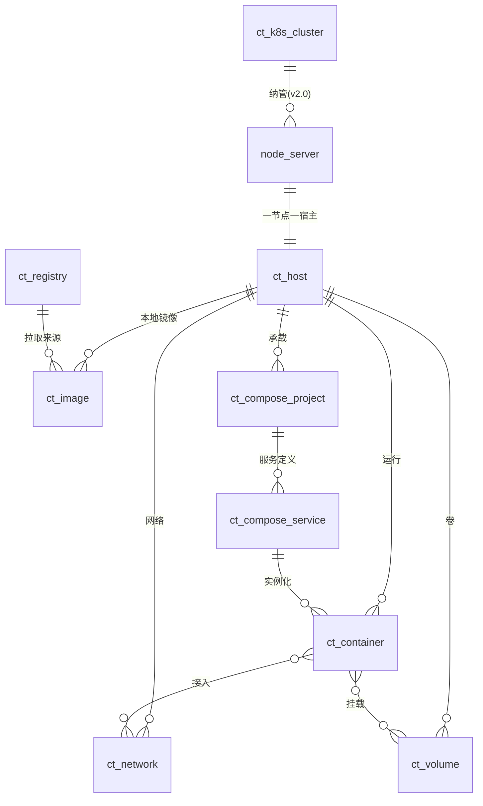
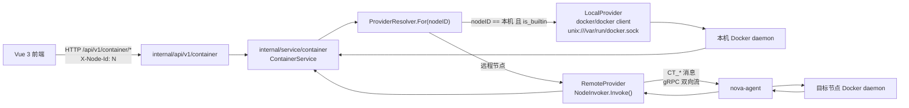
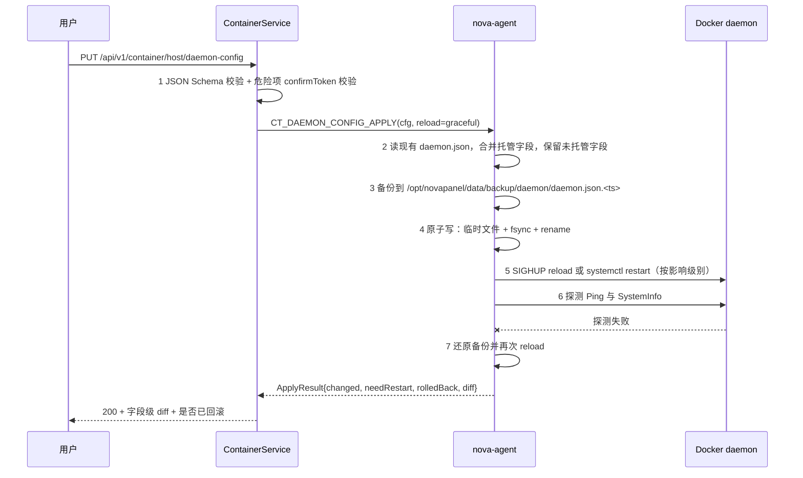
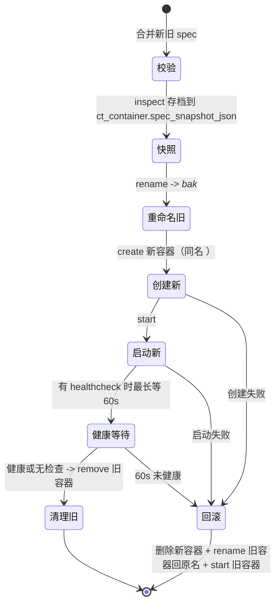
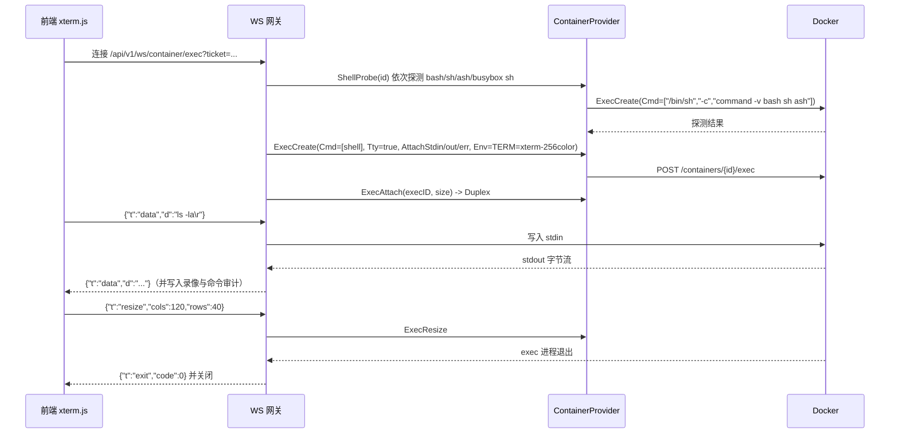
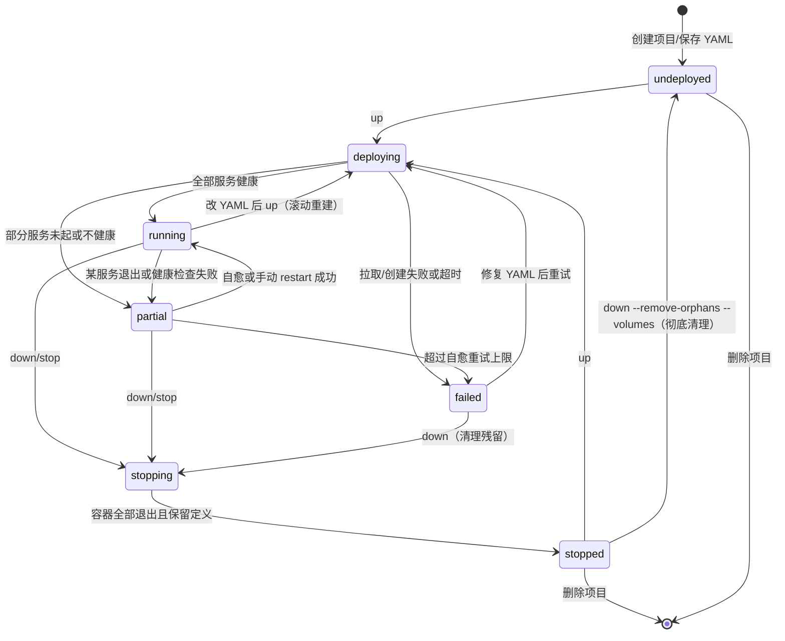

# NovaPanel（星舵面板）· 容器与编排

## 文档信息

| 项目 | 内容 |
| --- | --- |
| 文档名称 | 09-容器与编排 |
| 文档版本 | v1.0 |
| 更新日期 | 2026-08-17 |
| 状态 | 定稿 |
| 适用版本 | NovaPanel v1.0 |
| 产品代号 | nova |
| 覆盖内容 | 容器领域模型、ContainerProvider 抽象与调用链、Docker 环境与 daemon.json 管理、容器全生命周期与创建参数模型、日志与 exec 与文件交互、镜像构建拉取与扫描、镜像仓库、网络与存储卷、Compose 编排与模板库、系统清理、Kubernetes 纳管设计、容器安全基线、接口清单、性能指标与排错手册 |
| 关联文档 | [系统架构设计](./02-系统架构设计.md)、[数据库设计](./04-数据库设计.md)、[API 接口规范](./05-API接口规范.md)、[前端架构与 Arco 规范](./06-前端架构与Arco规范.md)、[文件管理与 WebSSH](./08-文件管理与WebSSH.md)、[多节点集群与 Agent](./10-多节点集群与Agent.md)、[监控告警与可观测](./11-监控告警与可观测.md)、[安全合规与审计](./12-安全合规与审计.md)、[应用商店与备份恢复](./13-应用商店与备份恢复.md)、[部署安装与升级](./14-部署安装与升级.md) |

## 目录

- [9.1 模块职责与边界](#91-模块职责与边界)
- [9.2 领域模型与关系图](#92-领域模型与关系图)
- [9.3 调用链与 ContainerProvider 抽象](#93-调用链与-containerprovider-抽象)
- [9.4 Docker 环境管理](#94-docker-环境管理)
- [9.5 容器生命周期管理](#95-容器生命周期管理)
- [9.6 创建参数模型与 Docker API 映射](#96-创建参数模型与-docker-api-映射)
- [9.7 容器交互能力](#97-容器交互能力)
- [9.8 镜像管理](#98-镜像管理)
- [9.9 镜像仓库管理](#99-镜像仓库管理)
- [9.10 网络与存储卷](#910-网络与存储卷)
- [9.11 Compose 编排](#911-compose-编排)
- [9.12 编排模板库](#912-编排模板库)
- [9.13 系统资源统计与清理](#913-系统资源统计与清理)
- [9.14 Kubernetes 纳管设计](#914-kubernetes-纳管设计)
- [9.15 容器安全基线](#915-容器安全基线)
- [9.16 接口清单与前端页面清单](#916-接口清单与前端页面清单)
- [9.17 性能指标与排错手册](#917-性能指标与排错手册)

## 9.1 模块职责与边界

### 9.1.1 职责范围

容器与编排模块把 Docker Engine 的原生能力包装成面板可控、可审计、可跨节点的运维操作。v1.0 承担以下职责：

| 序号 | 职责 | 落地形态 | 错误码模块 |
| --- | --- | --- | --- |
| 1 | 容器运行时环境的安装、检测与 daemon 配置管理 | `ct_host` + daemon.json 模板下发 | 50 |
| 2 | 容器全生命周期操作与参数化创建 | `ct_container` + Docker API v1.45 | 50 |
| 3 | 容器交互（日志流、exec 终端、文件传输、进程、实时指标） | WebSocket 网关 + Agent PTY/文件通道 | 50 |
| 4 | 镜像的拉取、构建、打标、导入导出、清理、扫描 | `ct_image` + buildx + trivy 钩子 | 50 |
| 5 | 镜像仓库凭据管理与登录校验 | `ct_registry` | 52 |
| 6 | 容器网络与存储卷管理 | `ct_network`、`ct_volume` | 50 |
| 7 | Compose 项目编排与模板库 | `ct_compose_project`、`ct_compose_service` | 51 |
| 8 | 容器安全基线拦截与风险巡检 | 准入校验器 + 巡检任务 | 50 |
| 9 | Kubernetes 只读纳管（v2.0，本版仅设计） | `ct_k8s_cluster` + client-go | 51 |

### 9.1.2 边界与不做的事

1. 本模块不实现容器运行时，也不替换 Docker 的任何组件；所有操作最终落到 Docker Engine API 或 `docker compose` 等价实现。
2. 本模块不直连远程节点的 Docker socket。跨节点操作一律经 `nova-agent`，socket 只在 Agent 所在宿主的本机可见，详见 [9.3](#93-调用链与-containerprovider-抽象)。
3. 容器内部的应用配置（例如 WordPress 的站点设置）不属于本模块，由[应用商店与备份恢复](./13-应用商店与备份恢复.md)负责。
4. 指标的长期存储、聚合与告警规则求值不在本模块，本模块只产出实时采样帧并把落库交给[监控告警与可观测](./11-监控告警与可观测.md)。
5. v1.0 不做 Swarm 编排、不做 CNI 插件管理、不做镜像签名验签（cosign 留在 v2.0）、不做 K8s 写操作（除 YAML 应用外的控制器编辑）。

### 9.1.3 与其他模块的依赖关系

| 依赖方向 | 对方模块 | 依赖内容 |
| --- | --- | --- |
| 本模块依赖 | [多节点集群与 Agent](./10-多节点集群与Agent.md) | `NodeInvoker` 路由、PTY 通道、文件分片通道 |
| 本模块依赖 | [文件管理与 WebSSH](./08-文件管理与WebSSH.md) | 路径白名单校验器、终端录制与回放、WS 帧基座 |
| 本模块依赖 | [安全合规与审计](./12-安全合规与审计.md) | 凭据加密（`*_enc`）、审计写入、漏洞库对接 |
| 本模块被依赖 | [应用商店与备份恢复](./13-应用商店与备份恢复.md) | Compose 项目的创建与生命周期作为应用落地载体 |
| 本模块被依赖 | [监控告警与可观测](./11-监控告警与可观测.md) | 容器级指标源、磁盘水位联动清理建议 |

## 9.2 领域模型与关系图

### 9.2.1 实体关系图



### 9.2.2 核心实体定义

| 实体 | 表 | 唯一键 | 生命周期主体 | 与 Docker 对象的关系 |
| --- | --- | --- | --- | --- |
| 容器宿主 | `ct_host` | `uk_host_node (node_id)` | 面板 | 一个 Docker daemon 的面板视图 |
| 容器 | `ct_container` | `uk_container_cid (host_id, container_id)` | Docker | 缓存 + 面板扩展属性（备注、分组、创建来源） |
| 镜像 | `ct_image` | `uk_image_digest (host_id, image_id)` | Docker | 缓存，含体积与层数分析结果 |
| 镜像仓库 | `ct_registry` | `uk_registry_url (tenant_id, registry_url)` | 面板 | 无对应对象，凭据存于面板 |
| 网络 | `ct_network` | `uk_network_nid (host_id, network_id)` | Docker | 缓存 |
| 存储卷 | `ct_volume` | `uk_volume_name (host_id, volume_name)` | Docker | 缓存 |
| Compose 项目 | `ct_compose_project` | `uk_compose_name (host_id, project_name)` | 面板 | 面板是事实来源，YAML 落盘后同步 |
| Compose 服务 | `ct_compose_service` | `uk_cs_name (project_id, service_name)` | 面板解析产物 | 由 compose-go 解析 YAML 生成 |
| K8s 集群 | `ct_k8s_cluster` | `uk_k8s_name (tenant_id, cluster_name)` | 面板 | kubeconfig 持有者 |

### 9.2.3 事实来源与缓存一致性

Docker 自身是容器、镜像、网络、卷的事实来源，`ct_*` 缓存表存在的目的只有三个：跨节点聚合查询、面板扩展属性承载、离线时的最后已知状态展示。据此确立三条规则：

1. **读优先直取**：单宿主的列表与详情请求直接调 Docker API，缓存只用于超时兜底并在响应中带 `stale: true` 与 `syncedAt`。
2. **写后回填**：任何写操作成功后立即以 inspect 结果覆盖对应缓存行，不做增量推断。
3. **周期对账**：Agent 每 60 秒上报一次容器/镜像/网络/卷的摘要（ID + 状态 + 摘要哈希），控制面比对哈希，不一致才拉全量，避免 500 节点下的放大。摘要哈希算法为 `sha256(sorted(id + ":" + state))` 取前 16 字节 hex。

Compose 项目是唯一反向的实体：面板持有的 YAML 与 `ct_compose_project.desired_state` 是事实来源，Docker 侧状态是收敛结果，因此对账发现漂移时会产出「配置漂移」事件而非静默覆盖面板数据，处理方式见 [10.16 配置与资产同步](./10-多节点集群与Agent.md#1016-配置与资产同步)。

## 9.3 调用链与 ContainerProvider 抽象

### 9.3.1 两条调用链

面板对容器的所有操作走同一份业务代码，差异被压在 provider 实现层。



| 维度 | LocalProvider | RemoteProvider |
| --- | --- | --- |
| 传输 | 本机 unix socket | mTLS gRPC 双向流（Agent 反向拨号） |
| 序列化 | Docker client 原生结构体 | protobuf `CtRequest` / `CtResponse` |
| 流式能力（日志/stats/build/pull） | `io.ReadCloser` 直读 | 分片消息 `CT_STREAM_CHUNK`，按 `stream_id` 重组 |
| 超时 | 由 `context` 控制 | `context` + Agent 侧独立超时，取较小值 |
| 失败模式 | socket 不可用、权限不足 | 节点离线、流断开、Agent 不支持该能力 |
| 幂等 | 由 service 层保证 | service 层幂等键 + Agent 侧结果缓存（TTL 10 分钟） |

约束：LocalProvider 只在「控制面所在机器且该节点记录 `is_builtin=true`」时被选中，其余情况一律 RemoteProvider，即使目标是同一台机器上手工装的独立 Agent。这条规则避免出现「同一宿主两条路径行为不一致」的调试地狱。

### 9.3.2 ContainerProvider 接口定义

接口位于 `internal/service/container/provider.go`，所有方法首参为 `context.Context`，返回错误统一为 `errs.Error`（携带 6 位错误码）。

```go
package container

import (
	"context"
	"io"

	"github.com/docker/docker/api/types/container"
	"github.com/docker/docker/api/types/image"
	"github.com/docker/docker/api/types/network"
	"github.com/docker/docker/api/types/system"
	"github.com/docker/docker/api/types/volume"
)

// ContainerProvider 是容器能力的唯一抽象。LocalProvider 直连本机 socket，
// RemoteProvider 经 NodeInvoker 转发到目标节点的 nova-agent。
// 实现必须是并发安全的，且所有阻塞调用都必须尊重 ctx 取消。
type ContainerProvider interface {
	// —— 环境与守护进程 ——
	Ping(ctx context.Context) (EngineInfo, error)
	SystemInfo(ctx context.Context) (system.Info, error)
	DiskUsage(ctx context.Context) (DiskUsage, error)
	DaemonConfigGet(ctx context.Context) (DaemonConfig, error)
	DaemonConfigApply(ctx context.Context, cfg DaemonConfig, reload ReloadMode) (ApplyResult, error)
	Prune(ctx context.Context, scope PruneScope) (PruneReport, error)

	// —— 容器生命周期 ——
	ContainerList(ctx context.Context, f ContainerFilter) ([]ContainerBrief, error)
	ContainerInspect(ctx context.Context, id string) (container.InspectResponse, error)
	ContainerCreate(ctx context.Context, spec ContainerSpec) (string, []string, error)
	ContainerStart(ctx context.Context, id string) error
	ContainerStop(ctx context.Context, id string, timeoutSec int) error
	ContainerRestart(ctx context.Context, id string, timeoutSec int) error
	ContainerKill(ctx context.Context, id, signal string) error
	ContainerPause(ctx context.Context, id string, resume bool) error
	ContainerRemove(ctx context.Context, id string, opt RemoveOption) error
	ContainerRename(ctx context.Context, id, newName string) error
	ContainerUpdate(ctx context.Context, id string, spec ContainerSpec, mode UpdateMode) (string, error)
	ContainerCommit(ctx context.Context, id string, opt CommitOption) (string, error)
	ContainerExport(ctx context.Context, id string) (io.ReadCloser, error)

	// —— 容器交互 ——
	ContainerLogs(ctx context.Context, id string, opt LogOption) (io.ReadCloser, error)
	ContainerStats(ctx context.Context, id string, stream bool) (io.ReadCloser, error)
	ContainerTop(ctx context.Context, id, psArgs string) (container.TopResponse, error)
	ExecCreate(ctx context.Context, id string, opt ExecOption) (string, error)
	ExecAttach(ctx context.Context, execID string, size TTYSize) (Duplex, error)
	ExecResize(ctx context.Context, execID string, size TTYSize) error
	CopyFromContainer(ctx context.Context, id, path string) (io.ReadCloser, PathStat, error)
	CopyToContainer(ctx context.Context, id, path string, tar io.Reader, opt CopyOption) error
	ContainerStatPath(ctx context.Context, id, path string) (PathStat, error)

	// —— 镜像 ——
	ImageList(ctx context.Context, all bool) ([]ImageBrief, error)
	ImageInspect(ctx context.Context, ref string) (image.InspectResponse, error)
	ImageHistory(ctx context.Context, ref string) ([]image.HistoryResponseItem, error)
	ImagePull(ctx context.Context, ref string, auth RegistryAuth) (io.ReadCloser, error)
	ImagePush(ctx context.Context, ref string, auth RegistryAuth) (io.ReadCloser, error)
	ImageBuild(ctx context.Context, opt BuildOption) (io.ReadCloser, error)
	ImageTag(ctx context.Context, src, target string) error
	ImageRemove(ctx context.Context, ref string, force, pruneChildren bool) error
	ImageSave(ctx context.Context, refs []string) (io.ReadCloser, error)
	ImageLoad(ctx context.Context, tar io.Reader, quiet bool) (io.ReadCloser, error)
	RegistryLogin(ctx context.Context, auth RegistryAuth) (string, error)

	// —— 网络与卷 ——
	NetworkList(ctx context.Context) ([]network.Summary, error)
	NetworkInspect(ctx context.Context, id string) (network.Inspect, error)
	NetworkCreate(ctx context.Context, spec NetworkSpec) (string, error)
	NetworkRemove(ctx context.Context, id string) error
	NetworkConnect(ctx context.Context, netID, ctrID string, cfg EndpointConfig) error
	NetworkDisconnect(ctx context.Context, netID, ctrID string, force bool) error
	VolumeList(ctx context.Context) ([]volume.Volume, error)
	VolumeCreate(ctx context.Context, spec VolumeSpec) (volume.Volume, error)
	VolumeInspect(ctx context.Context, name string) (volume.Volume, error)
	VolumeRemove(ctx context.Context, name string, force bool) error

	// —— Compose ——
	ComposeUp(ctx context.Context, p ComposeRef, opt UpOption) (io.ReadCloser, error)
	ComposeDown(ctx context.Context, p ComposeRef, opt DownOption) (io.ReadCloser, error)
	ComposeRestart(ctx context.Context, p ComposeRef, services []string) (io.ReadCloser, error)
	ComposePull(ctx context.Context, p ComposeRef, services []string) (io.ReadCloser, error)
	ComposeScale(ctx context.Context, p ComposeRef, replicas map[string]int) (io.ReadCloser, error)
	ComposePs(ctx context.Context, p ComposeRef) ([]ComposeServiceState, error)
	ComposeLogs(ctx context.Context, p ComposeRef, opt LogOption) (io.ReadCloser, error)
	ComposeConfigWrite(ctx context.Context, p ComposeRef, files map[string][]byte) error
	ComposeConfigRead(ctx context.Context, p ComposeRef) (map[string][]byte, error)
}

// Duplex 是 exec attach 与 PTY 的双向管道抽象，本机为 net.Conn 的 hijack 结果，
// 远程为基于 stream_id 的 gRPC 帧适配器。
type Duplex interface {
	io.ReadWriteCloser
	CloseWrite() error
}

// EngineInfo 是环境探测结果，DaemonConfigApply 前必须先 Ping 通过。
type EngineInfo struct {
	Kind          string `json:"kind"`          // docker | podman
	ServerVersion string `json:"serverVersion"` // 27.3.1
	APIVersion    string `json:"apiVersion"`    // 1.45
	StorageDriver string `json:"storageDriver"` // overlay2
	CgroupDriver  string `json:"cgroupDriver"`  // systemd
	CgroupVersion string `json:"cgroupVersion"` // 2
	Rootless      bool   `json:"rootless"`
	LiveRestore   bool   `json:"liveRestore"`
	BuildxVersion string `json:"buildxVersion"` // 空表示未安装
	ComposeVersion string `json:"composeVersion"`
}
```

### 9.3.3 接口分组与能力位

Agent 在注册时上报能力位，控制面据此决定前端功能是否置灰，避免「点了才报不支持」。

| 能力位 | 覆盖方法 | 缺失时的降级 |
| --- | --- | --- |
| `ct.core` | 容器生命周期、镜像、网络、卷 | 整个容器菜单隐藏 |
| `ct.exec` | ExecCreate / ExecAttach / ExecResize | 终端按钮置灰 |
| `ct.build` | ImageBuild | 构建入口隐藏，仍可拉取 |
| `ct.buildx` | 多架构构建 | 只允许单架构，隐藏平台选择器 |
| `ct.compose` | Compose 全部方法 | 编排菜单隐藏，应用商店仅支持单容器应用 |
| `ct.scan` | 漏洞扫描 | 扫描按钮提示「未安装 trivy」并给出一键安装 |
| `ct.gpu` | `--gpus` 支持 | 创建向导隐藏 GPU 分组 |

能力位判定实现：`Ping` 结果 + `SystemInfo.Runtimes` + 二进制探测（`docker buildx version`、`docker compose version`、`which trivy`），结果缓存于 `ct_host.capability_json`，TTL 10 分钟，daemon 配置变更后立即失效。

## 9.4 Docker 环境管理

### 9.4.1 安装与版本检测

面板不自行编译 Docker，安装动作由 Agent 调用发行版包管理器完成，安装源可在 `panel.yaml` 中改为内网镜像。

| 发行版 | 安装方式 | 服务名 | 备注 |
| --- | --- | --- | --- |
| Ubuntu 20.04+/Debian 11+ | `apt-get install docker-ce docker-ce-cli containerd.io docker-buildx-plugin docker-compose-plugin` | docker | 先写入 `/etc/apt/keyrings/docker.asc` |
| RHEL/CentOS/Rocky 8+ | `dnf install docker-ce ...` | docker | 需先 `dnf config-manager --add-repo` |
| Alibaba Cloud Linux 3 | 同 RHEL，仓库替换为阿里云源 | docker | |
| openEuler 22.03+ | `dnf install docker` | docker | 版本可能低于 24，检测后提示 |
| Alpine 3.18+ | `apk add docker docker-cli-compose` | docker | OpenRC，非 systemd |

版本检测矩阵与最低要求：

| 检测项 | 最低要求 | 不满足时的行为 |
| --- | --- | --- |
| Docker Server | 24.0（API 1.43） | 阻断写操作，只读列表，提示升级 |
| Docker API | 1.43 | 客户端以 `client.WithAPIVersionNegotiation()` 协商，低于 1.43 时禁用 `ContainerUpdate` 等新参数 |
| compose plugin | v2.20 | 隐藏编排菜单，提供一键安装 |
| buildx plugin | v0.12 | 单架构构建可用，多架构禁用 |
| cgroup | v2 优先 | v1 时禁用 `pids_limit` 与部分内存参数并在 UI 标注 |
| 内核 | 4.19+ | 低于此版本拒绝安装并给出说明 |

目标 API 版本固定为 v1.45（对应 Docker 26/27），客户端构造：

```go
cli, err := dockerclient.NewClientWithOpts(
	dockerclient.WithHost(hostURL),                  // unix:///var/run/docker.sock
	dockerclient.WithVersion("1.45"),
	dockerclient.WithAPIVersionNegotiation(),        // 服务端更低时自动降级
	dockerclient.WithHTTPClient(&http.Client{Timeout: 0}), // 流式接口不能设整体超时
	dockerclient.WithTimeout(30*time.Second),
)
```

流式接口（logs / stats / build / pull / attach）必须使用无整体超时的 `http.Client`，靠 `context` 控制生命周期；非流式接口在 service 层统一包 30 秒 `context.WithTimeout`。

### 9.4.2 daemon.json 托管字段

面板只托管下表列出的字段，其余用户手写字段在读取时保留、在写回时原样透传，避免覆盖用户的定制项。托管字段集合固化在 `internal/service/container/daemoncfg.go` 的 `managedKeys` 白名单中。

| 字段 | 类型 | 面板默认 | 说明与约束 |
| --- | --- | --- | --- |
| `registry-mirrors` | []string | 空 | 镜像加速地址，必须 https 或显式在 insecure 列表；最多 8 个 |
| `insecure-registries` | []string | 空 | 支持 `host:port` 与 CIDR；写入前二次确认，记审计 |
| `log-driver` | string | `json-file` | 可选 `json-file`/`local`/`journald`/`syslog`/`fluentd` |
| `log-opts.max-size` | string | `50m` | 单文件上限，正则 `^[0-9]+[kmg]$` |
| `log-opts.max-file` | string | `3` | 保留文件数，1-20 |
| `log-opts.compress` | string | `true` | `local` 驱动默认开启 |
| `storage-driver` | string | `overlay2` | 变更需重启 daemon 且已有容器不可见，UI 需强确认 |
| `exec-opts` | []string | `native.cgroupdriver=systemd` | systemd 系发行版强制 |
| `live-restore` | bool | `true` | 与 Swarm 互斥；开启后 daemon 重启不停容器 |
| `default-address-pools` | []object | `172.20.0.0/16, size 24` | 规避与内网网段冲突 |
| `data-root` | string | `/var/lib/docker` | 变更需迁移数据，面板提供迁移向导 |
| `default-ulimits.nofile` | object | `{Hard:65535,Soft:65535}` | |
| `iptables` | bool | `true` | 关闭会破坏端口映射，UI 加危险标记 |
| `userland-proxy` | bool | `false` | 高并发下降低转发开销 |
| `max-concurrent-downloads` | int | `6` | 取值 1-20 |
| `max-concurrent-uploads` | int | `5` | 取值 1-20 |
| `default-runtime` | string | `runc` | 装了 nvidia-container-toolkit 后可选 `nvidia` |
| `features.buildkit` | bool | `true` | 构建默认走 BuildKit |

### 9.4.3 配置变更的安全下发

变更不允许「读-改-写」直接落盘，必须走下述事务，任一步失败即回滚。



字段变更影响分级，决定是 reload 还是 restart：

| 级别 | 字段 | 生效方式 | 对运行中容器的影响 |
| --- | --- | --- | --- |
| L1 热生效 | `registry-mirrors`、`insecure-registries`、`max-concurrent-*`、`log-opts`（仅新容器） | `SIGHUP` | 无 |
| L2 需重启 | `live-restore`、`iptables`、`userland-proxy`、`default-address-pools`、`default-runtime`、`exec-opts` | `systemctl restart docker` | `live-restore=true` 时容器存活，否则全部重启 |
| L3 高危 | `storage-driver`、`data-root` | 重启 + 数据迁移 | 已有镜像与容器在新驱动下不可见，必须先导出 |

L2/L3 变更必须由前端二次确认对话框产出一次性 `confirmToken`（服务端签发、60 秒有效、绑定变更内容哈希），缺失或不匹配返回 `500403 危险配置变更需确认令牌`。配置写入前后各产生一条审计记录，含操作人、节点、字段级 diff，详见[安全合规与审计](./12-安全合规与审计.md)。

批量下发到多节点时，按 [10.14 批量任务下发](./10-多节点集群与Agent.md#1014-批量任务下发)的分批灰度策略执行，默认 10% 试点、失败阈值 1 个节点即熔断，防止一次配置错误打挂全集群的容器网络。

### 9.4.4 Podman 兼容性

Podman 4.x 提供 Docker 兼容 API（`podman.socket`，路径 `/run/podman/podman.sock`），面板以「有限兼容」模式支持，不作为一等公民。

| 能力 | Docker | Podman 4.x | 面板处理 |
| --- | --- | --- | --- |
| 容器 CRUD | 支持 | 支持 | 完全复用 |
| exec / logs / stats | 支持 | 支持（stats 字段不全） | stats 缺失字段展示为「-」 |
| 镜像构建 | BuildKit | Buildah 后端 | 禁用 BuildKit 专属参数（`--mount=type=cache`） |
| Compose | compose plugin | 需装 podman-compose 或 docker-compose | 检测不到即隐藏编排菜单 |
| `live-restore` | 支持 | 不支持 | daemon 配置页隐藏该项 |
| daemon.json | 支持 | 用 `containers.conf` / `registries.conf` | 配置页切换为 Podman 专用表单（v2.0），v1.0 只读展示 |
| rootless | 可选 | 默认 | 检测到 rootless 时提示端口 <1024 不可映射 |
| 事件流 | 支持 | 支持 | 复用 |

判定逻辑：`SystemInfo` 返回体中 `ServerVersion` 含 `podman` 或 `/version` 的 `Components[].Name` 为 `Podman Engine` 时，`EngineInfo.Kind = "podman"`，写入 `ct_host.engine_kind`，前端据此裁剪功能。v1.0 对 Podman 宿主禁用 daemon 配置写入与 Compose 编排，其余能力等同 Docker。

## 9.5 容器生命周期管理

### 9.5.1 状态模型与映射

Docker 的 `State.Status` 有 7 种取值，面板对外收敛为 6 种展示状态，并额外派生「异常」用于健康检查失败与频繁重启。

| Docker Status | ExitCode/Health | 面板状态 | 徽标色 | 可用操作 |
| --- | --- | --- | --- | --- |
| `created` | - | 已创建 | gray | 启动、删除、重命名 |
| `running` | health=healthy 或无健康检查 | 运行中 | green | 停止、重启、暂停、强杀、exec、日志、更新 |
| `running` | health=unhealthy | 异常 | red | 同运行中，列表置顶并高亮 |
| `running` | health=starting | 启动中 | blue | 停止、日志 |
| `restarting` | - | 重启中 | orange | 停止、日志 |
| `paused` | - | 已暂停 | purple | 恢复、停止、删除 |
| `exited` | ExitCode=0 | 已停止 | gray | 启动、删除、导出、commit |
| `exited` | ExitCode!=0 | 异常退出 | red | 启动、删除、日志（自动定位末尾 200 行） |
| `dead` | - | 异常 | red | 强制删除 |
| `removing` | - | 删除中 | gray | 无（禁用全部按钮） |

派生规则：`RestartCount > 3 且最近 5 分钟内有重启` 时无论状态一律追加「频繁重启」标签，并触发 `container.flapping` 事件推送到[监控告警与可观测](./11-监控告警与可观测.md)。

### 9.5.2 列表查询与过滤

`GET /api/v1/container/containers`，权限 `container:container:list`，除通用分页参数外支持：

| 参数 | 类型 | 说明 | 落到 Docker 的位置 |
| --- | --- | --- | --- |
| `state` | string[] | 面板状态多选，映射回 Docker filter | `filters.status` |
| `name` | string | 名称模糊 | `filters.name`（Docker 侧为正则） |
| `image` | string | 镜像名前缀 | `filters.ancestor` |
| `label` | string[] | `k=v` 或 `k` | `filters.label` |
| `network` | string | 网络名或 ID | `filters.network` |
| `composeProject` | string | 项目名 | `filters.label=com.docker.compose.project=<v>` |
| `source` | string | `panel`/`compose`/`app`/`external` | 面板侧过滤，依据 `ct_container.source` |
| `publishedPort` | int | 宿主端口精确匹配 | 面板侧过滤 inspect 结果 |
| `keyword` | string | 同时匹配名称、镜像、ID 前 12 位 | 面板侧合并过滤 |
| `sort` | string | `name`/`createdAt`/`cpu`/`memory`/`state` | 按 `cpu`/`memory` 排序时需先取指标快照 |
| `withStats` | bool | 是否附带资源占用列，默认 false | 见下 |

资源占用实时列的实现要点：不为每行发起 `stats` 长连接。Agent 侧维护一个 2 秒周期的 `stats` 聚合采集器（对全部 running 容器复用一次 `/containers/{id}/stats?stream=true` 的读取协程池），把最近一次样本写入进程内 `sync.Map`；`withStats=true` 时直接读取该缓存并随列表返回，字段为 `cpuPercent`、`memUsage`、`memLimit`、`memPercent`、`netIO`、`blockIO`、`pids`、`sampledAt`。前端在列表页额外开一条 WebSocket（`/api/v1/ws/container/stats`）接收 2 秒一帧的增量更新，避免轮询。

### 9.5.3 生命周期操作清单

| 操作 | 方法与路径 | 权限点 | Docker 端点 | 关键参数与语义 |
| --- | --- | --- | --- | --- |
| 启动 | `POST /container/containers/{id}/start` | `container:container:update` | `POST /containers/{id}/start` | 幂等：已 running 返回成功并标注 `noop` |
| 停止 | `POST /container/containers/{id}/stop` | `container:container:update` | `POST /containers/{id}/stop?t=` | `timeoutSec` 默认 10，超时后 daemon 自动 SIGKILL |
| 重启 | `POST /container/containers/{id}/restart` | `container:container:update` | `POST /containers/{id}/restart?t=` | 同上 |
| 强杀 | `POST /container/containers/{id}/kill` | `container:container:exec` | `POST /containers/{id}/kill?signal=` | 默认 SIGKILL，可选 SIGTERM/SIGHUP/SIGUSR1/SIGQUIT |
| 暂停/恢复 | `POST /container/containers/{id}/pause` | `container:container:update` | `pause`/`unpause` | 请求体 `{"resume":bool}`；cgroup freezer，v1 下部分内核不支持 |
| 删除 | `DELETE /container/containers/{id}` | `container:container:delete` | `DELETE /containers/{id}` | `force`、`removeVolumes`、`removeLinks`；running 且未 force 时返回 `500409` |
| 重命名 | `POST /container/containers/{id}/rename` | `container:container:update` | `POST /containers/{id}/rename` | 名称正则 `^[a-zA-Z0-9][a-zA-Z0-9_.-]{1,63}$`，冲突返回 `500410` |
| 更新 | `PUT /container/containers/{id}` | `container:container:update` | 见 9.5.4 | 分「热更新」与「重建」两条路径 |
| 导出 | `GET /container/containers/{id}/export` | `container:container:export` | `GET /containers/{id}/export` | 输出 tar 流，仅文件系统不含元数据 |
| 提交为镜像 | `POST /container/containers/{id}/commit` | `container:image:create` | `POST /commit` | `repo`、`tag`、`comment`、`author`、`pause`（默认 true） |
| 批量操作 | `POST /container/containers/batch` | 按 action 对应权限 | 循环 | 请求体 `{"ids":[],"action":"start|stop|restart|remove"}`，并发 5，返回逐项结果 |

批量操作的返回结构固定为 `data.items[]`，每项含 `id`、`name`、`success`、`code`、`message`，HTTP 状态恒为 200，整体成败由前端按 items 汇总，避免部分成功时的语义歧义。

### 9.5.4 更新与 recreate 策略

Docker 只允许在线修改资源限额一类参数，其余变更必须重建容器。面板按参数类别自动选路，并在提交前把选路结果显示给用户。

| 参数类别 | 可热更新 | 实现 | 说明 |
| --- | --- | --- | --- |
| CPU/内存/pids/重启策略/blkio | 是 | `POST /containers/{id}/update` | 秒级生效，不断服 |
| 端口映射、卷挂载、网络、环境变量、镜像、entrypoint/cmd、labels、capabilities、用户、健康检查、日志配置 | 否 | recreate | 需停机窗口 |

recreate 流程（`mode=recreate`）：



关键约束：

1. 旧容器只重命名不删除，直到新容器通过健康等待，保证任意失败点都能回滚到可运行状态。
2. 匿名卷在 recreate 时默认继承（把旧容器 `Mounts` 中 `Type=volume && Name` 为 64 位 hex 的项显式声明到新 spec），否则数据会「消失」。这是最容易出事的一点，UI 上以显式清单展示将被继承的卷。
3. recreate 会改变容器 ID，与之关联的 `ct_container` 行以 `container_id` 更新而非新增，`recreate_count` 自增，历史 spec 追加到 `spec_history_json`（保留最近 5 版，支持一键回滚）。
4. Compose 管理的容器禁止走单容器 recreate，必须改 YAML 后 `compose up`，请求时返回 `510409 该容器由 Compose 管理，请通过项目更新`。

## 9.6 创建参数模型与 Docker API 映射

### 9.6.1 创建请求 JSON Schema

`POST /api/v1/container/containers`，权限 `container:container:create`，请求体 Schema（Draft 2020-12，节选必要约束）：

```json
{
  "$id": "https://novapanel.io/schema/container-create.json",
  "type": "object",
  "required": ["name", "image"],
  "additionalProperties": false,
  "properties": {
    "name":    {"type": "string", "pattern": "^[a-zA-Z0-9][a-zA-Z0-9_.-]{1,63}$"},
    "image":   {"type": "string", "minLength": 1, "maxLength": 512},
    "pullPolicy": {"enum": ["always", "ifNotPresent", "never"], "default": "ifNotPresent"},
    "restartPolicy": {
      "type": "object",
      "properties": {
        "name": {"enum": ["no", "on-failure", "always", "unless-stopped"], "default": "unless-stopped"},
        "maximumRetryCount": {"type": "integer", "minimum": 0, "maximum": 100, "default": 0}
      }
    },
    "ports": {"type": "array", "maxItems": 64, "items": {
      "type": "object", "required": ["containerPort"],
      "properties": {
        "hostIP":        {"type": "string", "format": "ipv4", "default": "0.0.0.0"},
        "hostPort":      {"type": "integer", "minimum": 0, "maximum": 65535},
        "containerPort": {"type": "integer", "minimum": 1, "maximum": 65535},
        "protocol":      {"enum": ["tcp", "udp", "sctp"], "default": "tcp"}
      }}},
    "mounts": {"type": "array", "maxItems": 64, "items": {
      "type": "object", "required": ["type", "target"],
      "properties": {
        "type":     {"enum": ["bind", "volume", "tmpfs"]},
        "source":   {"type": "string"},
        "target":   {"type": "string", "pattern": "^/.*"},
        "readOnly": {"type": "boolean", "default": false},
        "bindPropagation": {"enum": ["rprivate", "private", "rshared", "shared", "rslave", "slave"]},
        "tmpfsSizeBytes":  {"type": "integer", "minimum": 0}
      }}},
    "env":     {"type": "array", "maxItems": 256, "items": {"type": "object",
                 "required": ["key"], "properties": {
                   "key":    {"type": "string", "pattern": "^[A-Za-z_][A-Za-z0-9_]*$"},
                   "value":  {"type": "string", "maxLength": 32768},
                   "secret": {"type": "boolean", "default": false}}}},
    "labels":  {"type": "object", "additionalProperties": {"type": "string"}},
    "network": {"type": "object", "properties": {
      "mode":       {"enum": ["bridge", "host", "none", "container", "custom"], "default": "bridge"},
      "networks":   {"type": "array", "items": {"type": "object", "properties": {
                       "name": {"type": "string"}, "ipv4Address": {"type": "string"},
                       "aliases": {"type": "array", "items": {"type": "string"}}}}},
      "containerRef": {"type": "string"},
      "hostname":   {"type": "string"},
      "dns":        {"type": "array", "maxItems": 6, "items": {"type": "string"}},
      "extraHosts": {"type": "array", "items": {"type": "string", "pattern": "^[^:]+:[^:]+$"}}}},
```

### 9.6.2 资源与安全字段 Schema（续）

```json
    "resources": {"type": "object", "properties": {
      "cpus":            {"type": "number", "minimum": 0.01, "maximum": 512},
      "cpusetCpus":      {"type": "string", "pattern": "^[0-9,-]*$"},
      "cpuShares":       {"type": "integer", "minimum": 2, "maximum": 262144},
      "memoryBytes":     {"type": "integer", "minimum": 6291456},
      "memorySwapBytes": {"type": "integer", "minimum": -1},
      "memoryReservationBytes": {"type": "integer", "minimum": 0},
      "pidsLimit":       {"type": "integer", "minimum": -1, "maximum": 65535},
      "blkioWeight":     {"type": "integer", "minimum": 10, "maximum": 1000},
      "ulimits":         {"type": "array", "items": {"type": "object",
                            "required": ["name", "soft", "hard"]}},
      "oomKillDisable":  {"type": "boolean", "default": false}}},
    "healthcheck": {"type": "object", "properties": {
      "test":         {"type": "array", "items": {"type": "string"}},
      "intervalSec":  {"type": "integer", "minimum": 1, "default": 30},
      "timeoutSec":   {"type": "integer", "minimum": 1, "default": 5},
      "retries":      {"type": "integer", "minimum": 1, "default": 3},
      "startPeriodSec": {"type": "integer", "minimum": 0, "default": 0},
      "disable":      {"type": "boolean", "default": false}}},
    "entrypoint": {"type": "array", "items": {"type": "string"}},
    "cmd":        {"type": "array", "items": {"type": "string"}},
    "workingDir": {"type": "string"},
    "security":   {"type": "object", "properties": {
      "privileged":   {"type": "boolean", "default": false},
      "capAdd":       {"type": "array", "items": {"type": "string"}},
      "capDrop":      {"type": "array", "items": {"type": "string"}},
      "user":         {"type": "string", "pattern": "^[^\\s]*$"},
      "readonlyRootfs": {"type": "boolean", "default": false},
      "noNewPrivileges": {"type": "boolean", "default": true},
      "securityOpt":  {"type": "array", "items": {"type": "string"}},
      "sysctls":      {"type": "object", "additionalProperties": {"type": "string"}},
      "devices":      {"type": "array", "items": {"type": "object",
                        "required": ["pathOnHost", "pathInContainer"]}},
      "shmSizeBytes": {"type": "integer", "minimum": 0}}},
    "logging": {"type": "object", "properties": {
      "driver":  {"enum": ["json-file", "local", "journald", "syslog", "fluentd", "none"]},
      "options": {"type": "object", "additionalProperties": {"type": "string"}}}},
    "gpu": {"type": "object", "properties": {
      "enabled":      {"type": "boolean", "default": false},
      "count":        {"type": "integer", "minimum": -1},
      "deviceIDs":    {"type": "array", "items": {"type": "string"}},
      "capabilities": {"type": "array", "items": {"type": "string"},
                       "default": [["gpu"]]}}},
    "autoStart":  {"type": "boolean", "default": true},
    "tty":        {"type": "boolean", "default": false},
    "stdinOpen":  {"type": "boolean", "default": false},
    "stopSignal": {"type": "string", "default": "SIGTERM"},
    "stopTimeoutSec": {"type": "integer", "minimum": 0, "default": 10},
    "remark":     {"type": "string", "maxLength": 512}
  }
}
```

### 9.6.3 到 Docker API 的参数映射

`ContainerCreate` 需要三个结构体，映射关系如下（`C` = `container.Config`，`H` = `container.HostConfig`，`N` = `network.NetworkingConfig`）。

| 面板字段 | 目标结构体字段 | 转换规则 |
| --- | --- | --- |
| `name` | 查询参数 `?name=` | 直接传递 |
| `image` | `C.Image` | 无 tag 时补 `:latest` |
| `pullPolicy` | 前置动作 | `always` 每次 pull；`ifNotPresent` 本地无则 pull；`never` 本地无则报 `500404` |
| `restartPolicy` | `H.RestartPolicy{Name,MaximumRetryCount}` | `on-failure` 外的策略强制 retry=0 |
| `ports[]` | `C.ExposedPorts` + `H.PortBindings` | key 为 `nat.Port("80/tcp")`；`hostPort=0` 表示随机端口 |
| `mounts[]` | `H.Mounts[]` | 统一走 `Mounts` 而非 `Binds`，类型安全且支持 propagation |
| `env[]` | `C.Env[]` | 拼 `KEY=VALUE`；`secret=true` 的值落库前 AES-256-GCM 加密，inspect 回显时打码 |
| `labels` | `C.Labels` | 面板追加 `io.novapanel.managed=true`、`io.novapanel.node=<nodeId>`、`io.novapanel.source=panel` |
| `network.mode` | `H.NetworkMode` | `custom` 时取 `networks[0].name`；`container` 时为 `container:<id>` |
| `network.networks[1..]` | 创建后逐个 `NetworkConnect` | Docker 创建时只能接一个网络 |
| `network.networks[0].ipv4Address` | `N.EndpointsConfig[name].IPAMConfig` | 必须落在该网络子网内，否则 `500412` |
| `network.hostname` | `C.Hostname` | 默认取容器名 |
| `network.dns` | `H.DNS` | host 网络模式下忽略并给出警告 |
| `network.extraHosts` | `H.ExtraHosts` | 格式 `host:ip` |
| `resources.cpus` | `H.NanoCPUs` | `int64(cpus * 1e9)`；与 `cpuShares` 互斥优先 NanoCPUs |
| `resources.cpusetCpus` | `H.CpusetCpus` | 校验不超过 `SystemInfo.NCPU` |
| `resources.memoryBytes` | `H.Memory` | 最小 6MiB（Docker 硬限制） |
| `resources.memorySwapBytes` | `H.MemorySwap` | `-1` 不限；必须 ≥ `Memory`，否则 `500412` |
| `resources.pidsLimit` | `H.PidsLimit` | cgroup v1 下不支持则忽略并回传 warning |
| `resources.ulimits` | `H.Ulimits[]` | |
| `healthcheck` | `C.Healthcheck` | `test` 首元素为 `CMD`/`CMD-SHELL`/`NONE`；`disable=true` 转 `["NONE"]`；秒转 `time.Duration` |
| `entrypoint` / `cmd` | `C.Entrypoint` / `C.Cmd` | 空数组表示沿用镜像定义，`[""]` 表示清空 |
| `workingDir` | `C.WorkingDir` | |
| `security.privileged` | `H.Privileged` | 触发安全基线拦截，见 [9.15](#915-容器安全基线) |
| `security.capAdd/capDrop` | `H.CapAdd` / `H.CapDrop` | 大写并补 `CAP_` 前缀；黑名单见 9.15 |
| `security.user` | `C.User` | 支持 `uid:gid` 与 `name:group` |
| `security.readonlyRootfs` | `H.ReadonlyRootfs` | |
| `security.noNewPrivileges` | `H.SecurityOpt += "no-new-privileges"` | 默认开启 |
| `security.sysctls` | `H.Sysctls` | 仅允许 `net.*`、`kernel.shm*`、`fs.mqueue.*` 命名空间化前缀 |
| `security.devices` | `H.Devices[]` | 宿主路径需在设备白名单内 |
| `security.shmSizeBytes` | `H.ShmSize` | 默认 64MiB |
| `logging` | `H.LogConfig{Type,Config}` | 未指定时继承 daemon 默认 |
| `gpu` | `H.DeviceRequests[]` | `Driver="nvidia"`，`Count=-1` 表示全部；需 `default-runtime` 或 nvidia runtime 存在 |
| `tty` / `stdinOpen` | `C.Tty` / `C.OpenStdin` + `C.StdinOnce=false` | |
| `stopSignal` / `stopTimeoutSec` | `C.StopSignal` / `C.StopTimeout` | |
| `autoStart` | 创建后是否调用 start | 面板侧逻辑 |
| `remark` | `ct_container.remark` | 不下发到 Docker |

创建的服务端顺序固定为：安全基线校验 → 端口冲突检测 → 路径白名单校验 → 镜像准备（按 pullPolicy） → 自定义网络存在性检查（不存在按需创建） → `ContainerCreate` → 附加网络 → 可选 `start` → inspect 回填 `ct_container`。任一步失败时，若容器已创建则回滚删除，保证不留半成品。

## 9.7 容器交互能力

### 9.7.1 日志查看

WebSocket 端点 `GET /api/v1/ws/container/logs?id=<cid>&nodeId=<n>`，鉴权走查询参数中的一次性 `wsTicket`（60 秒有效，由 `POST /api/v1/container/containers/{id}/logs/ticket` 签发），复用 [8.12 WebSocket 消息帧协议](./08-文件管理与WebSSH.md#812-websocket-消息帧协议)的帧基座。

| 参数 | 默认 | 说明 |
| --- | --- | --- |
| `tail` | 500 | 初始拉取行数，0-10000，`all` 表示全部（>50MB 时强制截断并提示） |
| `follow` | true | 是否持续跟随 |
| `since` / `until` | 空 | RFC3339 时间范围，与 follow 同时给出时 until 优先关闭流 |
| `timestamps` | true | 由 Docker 侧输出时间戳，前端可切换显示 |
| `stream` | both | `stdout`/`stderr`/`both`，用于只看错误 |
| `grep` | 空 | 关键字过滤，服务端按行匹配后再下发，支持 `!` 前缀取反 |
| `regex` | false | `grep` 是否按正则解释，正则编译失败返回 `500422` |

实现要点：Docker 的日志流在非 TTY 容器上是多路复用格式（8 字节头 + payload），必须用 `stdcopy.StdCopy` 拆分；TTY 容器则是裸流。服务端按行缓冲（最大单行 64KB，超长截断并追加 `...[truncated]`），每 100 毫秒或累计 32KB 合并成一帧下发，避免高频小包打满 WebSocket。客户端 3 秒无帧时服务端发 `ping` 保活。日志下载走独立 HTTP 端点 `GET /container/containers/{id}/logs/download`，返回 `text/plain` 附 `Content-Disposition`，服务端流式转发不落盘。

### 9.7.2 exec 终端

终端会话与 WebSSH 共用会话管理器、录像器与审计写入器，差异只在 PTY 来源：WebSSH 是宿主 `pty.Start`，容器终端是 Docker `ExecCreate + ExecAttach`。



| 要点 | 设计 |
| --- | --- |
| shell 探测 | 顺序 `bash` → `sh` → `ash` → `/busybox sh`，全部失败返回 `500424 容器内无可用 shell`，并建议用 `nsenter` 模式（v2.0） |
| 用户切换 | 支持指定 `user`（默认取镜像 `Config.User`），非 root 时提示部分命令不可用 |
| 工作目录 | 默认容器 `WorkingDir`，可覆盖 |
| resize | 前端 debounce 120ms 后发送，服务端调 `ExecResize` |
| 录像 | asciicast v2 格式落 `/opt/novapanel/data/term/rec/ct-<sessionId>.cast`，保留期与 WebSSH 一致 |
| 命令审计 | 从 stdin 提取回车分隔的命令行写 `term_command_audit`，`session_type=container_exec`，含容器 ID 与镜像 |
| 危险命令 | 复用 WebSSH 的命令黑名单策略（如 `rm -rf /`），命中时按策略阻断或告警 |
| 空闲超时 | 15 分钟无输入自动关闭，前端提示可续期 |
| 并发限制 | 单容器同时 3 个 exec 会话，单用户全局 10 个 |

### 9.7.3 容器内文件浏览与传输

基于 `docker cp` 的底层端点实现，不进入容器执行命令，因此对没有 shell 的镜像同样可用。

| 能力 | 端点 | Docker 端点 | 说明 |
| --- | --- | --- | --- |
| 目录列表 | `GET /container/containers/{id}/files?path=` | `PUT /containers/{id}/archive` 的 `HEAD` + tar 解析 | Docker 无 ls 接口，实现为取该目录 tar（`depth=1` 过滤）后解析 header；单目录条目上限 5000 |
| 下载文件/目录 | `GET /container/containers/{id}/files/download?path=` | `GET /containers/{id}/archive` | 返回 tar 流；单文件时服务端解包后直出原文件 |
| 上传 | `POST /container/containers/{id}/files/upload` | `PUT /containers/{id}/archive` | 前端多文件打 tar 或服务端代打；`noOverwriteDirNonDir=true` |
| 元数据 | `HEAD /containers/{id}/archive` | 同名 | 返回 `X-Docker-Container-Path-Stat`（base64 JSON） |

安全约束：容器内路径不受宿主白名单限制，但**上传的目标路径必须校验不落在 bind mount 指向宿主敏感目录的挂载点内**。实现方式是把请求路径与 inspect 得到的 `Mounts` 逐条比对，若命中 `Type=bind` 且 `Source` 在宿主敏感路径集合（`/etc`、`/root`、`/boot`、`/opt/novapanel`、`/var/run`）内，则拒绝并返回 `500425 目标路径穿透到宿主敏感目录`。宿主侧路径白名单实现复用 [8.3 路径安全](./08-文件管理与WebSSH.md#83-路径安全)。

### 9.7.4 进程、指标与网络诊断

| 能力 | 端点 | 实现 | 备注 |
| --- | --- | --- | --- |
| 进程列表 | `GET /container/containers/{id}/top` | `GET /containers/{id}/top?ps_args=-ef` | 依赖宿主 ps；Alpine 宿主自动降级为 `-o pid,user,comm,args` |
| 实时指标图表 | WS `/api/v1/ws/container/stats?id=` | `GET /containers/{id}/stats?stream=true` | 见下 |
| 端口与网络信息 | `GET /container/containers/{id}/network` | inspect 汇总 | 输出 IP、网关、MAC、端口映射、所属网络、DNS |
| 容器内连通性诊断 | `POST /container/containers/{id}/diagnose` | exec 探测 | 见下 |

指标流的采样与降频策略：

| 场景 | 采样间隔 | 下发间隔 | 保留窗口 |
| --- | --- | --- | --- |
| 详情页单容器 | 1s（Docker 原生 stream 约 1s 一帧） | 1s | 前端环形缓冲 300 点（5 分钟） |
| 列表页多容器 | 2s（Agent 侧聚合采集器复用） | 2s，一帧含全部容器 | 前端仅保留最新值 |
| 后台落库 | 15s（取聚合器最近样本） | 写 `mon_metric_raw` | 由[监控告警与可观测](./11-监控告警与可观测.md)按保留策略降采样 |

CPU 百分比必须自行计算，Docker 只给累计值：

```go
// cpuPercent 依据前后两次 stats 样本计算，与 docker stats 口径一致。
func cpuPercent(cur, pre *container.StatsResponse) float64 {
	cpuDelta := float64(cur.CPUStats.CPUUsage.TotalUsage - pre.CPUStats.CPUUsage.TotalUsage)
	sysDelta := float64(cur.CPUStats.SystemUsage - pre.CPUStats.SystemUsage)
	if sysDelta <= 0 || cpuDelta < 0 {
		return 0
	}
	cores := float64(cur.CPUStats.OnlineCPUs)
	if cores == 0 {
		cores = float64(len(cur.CPUStats.CPUUsage.PercpuUsage))
	}
	return cpuDelta / sysDelta * cores * 100.0
}
```

内存口径统一为 `usage - stats["inactive_file"]`（cgroup v2 用 `inactive_file`，v1 用 `total_inactive_file`），与 `docker stats` 保持一致，避免用户看到的数字与命令行不同。

连通性诊断在容器内依次尝试 `ping -c 3 <target>`、`curl -sS -o /dev/null -w "%{http_code}"`、`nc -zv <host> <port>`、`getent hosts <name>`，命令缺失时返回 `toolMissing` 并给出「用临时诊断容器（`nicolaka/netshoot`）加入同网络」的替代方案入口。

## 9.8 镜像管理

### 9.8.1 列表与体积分析

`GET /api/v1/container/images` 返回镜像列表，`all=true` 时包含中间层。体积分析要点：

1. `Size` 是镜像展开后总大小，多个镜像共享层时简单求和会严重放大。列表额外给出 `SharedSize` 与 `UniqueSize`（`UniqueSize = Size - SharedSize`），排序默认按 `UniqueSize` 降序，让用户看到「删掉它真能省多少」。数据来自 `GET /system/df?verbose=1` 而非 `/images/json`。
2. 层级展示走 `GET /container/images/{ref}/history`，把每层的 `CreatedBy` 指令、`Size`、`Comment` 以时间线渲染，可一键复制为等效 Dockerfile 片段（仅供参考，`ADD file:xxx` 类指令无法还原）。
3. 悬空镜像（`<none>:<none>`，即 `dangling=true`）单独分页展示，提供批量删除，删除前列出被引用情况。

### 9.8.2 拉取进度帧格式

拉取走 WebSocket `/api/v1/ws/container/image/pull`，服务端把 Docker 的 JSON 行流归并为面板帧，避免前端处理上百个层的原始事件。

Docker 原始行为 `{"status":"Downloading","progressDetail":{"current":1024,"total":10240},"id":"a1b2c3"}`，面板归并后的帧：

```json
{
  "type": "progress",
  "seq": 42,
  "ref": "nginx:1.27-alpine",
  "phase": "downloading",
  "overall": {"current": 18874368, "total": 41943040, "percent": 45.0, "speedBps": 3145728, "etaSec": 7},
  "layers": [
    {"id": "a1b2c3d4", "phase": "downloading", "current": 10485760, "total": 20971520, "percent": 50.0},
    {"id": "e5f6a7b8", "phase": "extracting", "current": 8388608, "total": 8388608, "percent": 100.0},
    {"id": "c9d0e1f2", "phase": "exists", "current": 0, "total": 0, "percent": 100.0}
  ],
  "timestamp": 1755404400123
}
```

| 字段 | 说明 |
| --- | --- |
| `type` | `progress` / `done` / `error` / `log` |
| `seq` | 单调递增，前端据此丢弃乱序帧 |
| `phase` | `waiting`/`pulling-fs`/`downloading`/`verifying`/`extracting`/`complete`；取全部层的最小进度阶段 |
| `overall.speedBps` | 最近 3 秒滑动平均，避免抖动 |
| `layers[].phase` | 额外含 `exists`（本地已有）、`retrying` |

下发节流：服务端每 300 毫秒最多发一帧，层数超过 40 时只发 `overall` 与进度最慢的 10 层。结束帧 `{"type":"done","ref":"...","digest":"sha256:...","sizeBytes":...,"durationMs":...}`。失败帧携带错误码，常见映射：认证失败 `520401`、仓库不存在 `520404`、超时 `520504`、磁盘不足 `500507`。

同一节点上同一 `ref` 的并发拉取请求做单飞合并（`golang.org/x/sync/singleflight`），后到的连接直接订阅已有进度流。

### 9.8.3 构建

| 能力 | 设计 |
| --- | --- |
| Dockerfile 在线编辑 | 复用 [8.7 在线编辑](./08-文件管理与WebSSH.md#87-在线编辑)的 Monaco 编辑器，带 Dockerfile 语法高亮与指令补全；保存到 `/opt/novapanel/data/build/<buildId>/Dockerfile` |
| 构建上下文 | 三种来源：面板目录选择（校验路径白名单）、前端上传 tar/zip（上限 512MB）、Git 仓库（`remote` 参数，v1.0 仅支持公开仓库与 HTTP 基本认证） |
| .dockerignore | 前端可编辑，服务端打包上下文时严格执行，减少传输量 |
| 缓存策略 | 默认使用缓存；可选 `noCache`；BuildKit 下支持 `--cache-from type=registry,ref=<repo>:buildcache` 与 `--cache-to`，用于跨节点复用缓存 |
| 构建参数 | `buildArgs`（键值对，敏感值加密存储不落构建日志）、`target`（多阶段目标）、`platform`、`labels`、`network`、`extraHosts` |
| 多阶段 | 由 Dockerfile 决定；面板解析 `FROM ... AS <name>` 提供 `target` 下拉选择 |
| 多架构 | 需 `ct.buildx` 能力位。实现为 Agent 侧执行 `docker buildx build --platform linux/amd64,linux/arm64 --push`；多架构产物无法留在本地镜像库，因此**强制要求指定推送目标仓库**，未指定时返回 `500412` |
| 构建日志流 | WebSocket `/api/v1/ws/container/image/build`，帧格式与拉取一致但 `type=log`，`data` 为原始输出行；BuildKit 的 `moby.buildkit.trace` 结构化事件转成 `{"type":"step","step":3,"total":9,"name":"RUN apk add ...","status":"running","durationMs":1200}` |
| 超时与取消 | 默认 30 分钟超时；前端断开或显式取消时 `context` 取消，BuildKit 会中断构建；构建目录在成功或失败后按 `keepContext` 设置保留 24 小时便于排查 |

### 9.8.4 打标、导入导出与清理

| 操作 | 端点 | 权限点 | 说明 |
| --- | --- | --- | --- |
| 打标签 | `POST /container/images/{ref}/tag` | `container:image:update` | 目标 ref 已存在时覆盖并使原镜像可能变悬空 |
| 推送 | `POST /container/images/{ref}/push` | `container:image:create` | 需匹配到 `ct_registry` 凭据，否则 `520401` |
| 导出 | `GET /container/images/export?refs=a,b` | `container:image:export` | 多镜像合并为一个 tar，共享层只存一次 |
| 导入 | `POST /container/images/import` | `container:image:create` | 支持 `docker save` tar 与 gzip；流式转发，不在面板落盘 |
| 删除 | `DELETE /container/images/{ref}` | `container:image:delete` | 被容器引用且未 `force` 时返回 `500409` 并列出引用容器 |
| 清理悬空 | `POST /container/images/prune` | `container:image:delete` | `filters.dangling=true`；可选 `until=<duration>` 与 `label` |

清理策略提供三档预设，避免用户误删正在用的镜像：

| 预设 | 过滤条件 | 典型回收 |
| --- | --- | --- |
| 保守 | 仅 `dangling=true` | 构建产生的中间悬空层 |
| 标准 | `dangling=true` + `until=168h` 且无容器引用 | 一周前的旧版本镜像 |
| 激进 | 所有无容器引用的镜像（`filters.dangling=false`） | 需二次确认，等价 `docker image prune -a` |

### 9.8.5 漏洞扫描钩子

扫描不内置实现，采用「本地 trivy 优先，容器化 trivy 兜底」的钩子式集成。

| 项 | 设计 |
| --- | --- |
| 检测 | `which trivy`，缺失时提示以容器方式运行 `aquasec/trivy:0.56.2` |
| 执行 | `trivy image --format json --scanners vuln,secret,misconfig --severity HIGH,CRITICAL --timeout 10m <ref>`；离线环境支持 `--offline-scan` 与预置 DB 目录 `/opt/novapanel/data/trivy/db` |
| 触发时机 | 手动触发、构建成功后（可开关）、拉取成功后（可开关）、定时全量（cron，默认每周日 03:00） |
| 结果落库 | 写入 `sec_vuln_scan` 与 `sec_vuln_item`（表定义在[安全合规与审计](./12-安全合规与审计.md)），`ct_image.last_scan_id`、`last_scan_at`、`vuln_high`、`vuln_critical` 反写用于列表徽标 |
| 策略联动 | `sec_policy` 中可配置「CRITICAL > N 的镜像禁止创建容器」，命中时创建请求返回 `500403` 并给出扫描报告链接 |
| 结果展示 | 按 CVE 聚合，可下钻到包名、当前版本、修复版本、层归属；支持导出 CSV |

Go 侧钩子接口，便于后续替换为 grype 或云厂商扫描服务：

```go
// ImageScanner 是镜像扫描的可替换实现，注册在 internal/service/container/scanner。
type ImageScanner interface {
	Name() string                                    // trivy | grype | acr
	Available(ctx context.Context, p ContainerProvider) (bool, string)
	Scan(ctx context.Context, p ContainerProvider, ref string, opt ScanOption) (*ScanReport, error)
	UpdateDB(ctx context.Context, p ContainerProvider) error
}
```

## 9.9 镜像仓库管理

### 9.9.1 ct_registry 表设计

```sql
CREATE TABLE `ct_registry` (
  `id` BIGINT NOT NULL COMMENT '雪花ID',
  `name` VARCHAR(64) NOT NULL COMMENT '显示名称',
  `kind` VARCHAR(32) NOT NULL DEFAULT 'custom' COMMENT 'dockerhub/harbor/acr/tcr/ghcr/ecr/custom',
  `registry_url` VARCHAR(255) NOT NULL COMMENT '仓库地址，dockerhub 固定 docker.io',
  `namespace` VARCHAR(128) NOT NULL DEFAULT '' COMMENT '默认命名空间/项目',
  `username` VARCHAR(128) NOT NULL DEFAULT '',
  `password_enc` VARCHAR(1024) NOT NULL DEFAULT '' COMMENT 'AES-256-GCM 密文，明文可为密码或token',
  `auth_type` VARCHAR(16) NOT NULL DEFAULT 'basic' COMMENT 'basic/token/anonymous',
  `is_insecure` TINYINT(1) NOT NULL DEFAULT 0 COMMENT '是否 http 或自签证书',
  `ca_cert` TEXT COMMENT '自签 CA PEM，非空时下发到 /etc/docker/certs.d/',
  `is_default` TINYINT(1) NOT NULL DEFAULT 0 COMMENT '默认仓库，全局唯一',
  `mirror_of` VARCHAR(255) NOT NULL DEFAULT '' COMMENT '非空表示该地址是某上游的加速镜像',
  `status` VARCHAR(16) NOT NULL DEFAULT 'unknown' COMMENT 'unknown/ok/auth_failed/unreachable',
  `last_check_at` DATETIME(3) NULL,
  `last_error` VARCHAR(512) NOT NULL DEFAULT '',
  `node_scope_json` TEXT COMMENT '生效节点范围，NULL 表示全部节点',
  `created_at` DATETIME(3) NOT NULL DEFAULT CURRENT_TIMESTAMP(3),
  `updated_at` DATETIME(3) NOT NULL DEFAULT CURRENT_TIMESTAMP(3) ON UPDATE CURRENT_TIMESTAMP(3),
  `deleted_at` DATETIME(3) NULL,
  `created_by` BIGINT NOT NULL DEFAULT 0,
  `tenant_id` BIGINT NOT NULL DEFAULT 0,
  PRIMARY KEY (`id`),
  UNIQUE KEY `uk_registry_url` (`tenant_id`, `registry_url`, `namespace`, `deleted_at`),
  KEY `idx_registry_tenant` (`tenant_id`, `deleted_at`)
) ENGINE=InnoDB DEFAULT CHARSET=utf8mb4 COMMENT='镜像仓库';
```

SQLite 差异：`TINYINT(1)` 用 `INTEGER`，`DATETIME(3)` 用 `TEXT` 存 RFC3339 毫秒串，`ON UPDATE` 由 GORM 钩子代替，唯一索引中的 `deleted_at` 需用 `IFNULL(deleted_at,'')` 表达式索引。

### 9.9.2 凭据处理与登录校验

| 环节 | 设计 |
| --- | --- |
| 加密 | `password_enc` = AES-256-GCM(明文, 主密钥派生子密钥, nonce 随机 12 字节)，存储格式 `v1:<base64(nonce+ct+tag)>`；主密钥来自 `/opt/novapanel/data/.master.key` |
| 回显 | 接口永不返回密码字段，仅返回 `hasPassword: true`；更新时字段为空表示不修改 |
| 下发 | 不写 `~/.docker/config.json`，而是在每次 pull/push 时把 `RegistryAuth`（base64 的 `{"username","password","serveraddress"}`）随请求头 `X-Registry-Auth` 传给 Docker，避免凭据长期落在节点磁盘 |
| 远程节点 | 凭据随 `CT_IMAGE_PULL` 消息在 mTLS 流内传输，Agent 用后即弃，不写盘、不进日志（日志中固定打码为 `***`） |
| 登录校验 | `POST /container/registries/{id}/check` 调 `POST /auth`，成功写 `status=ok`；401 写 `auth_failed`；网络错误写 `unreachable`。校验在「保存时」自动执行一次，另有 6 小时定时巡检 |
| 自签 CA | `ca_cert` 非空时，Agent 写入 `/etc/docker/certs.d/<host:port>/ca.crt`（0644）；`is_insecure=true` 时把地址加入 daemon.json 的 `insecure-registries` 并触发 L1 reload |

镜像引用解析规则（决定用哪套凭据）：取 ref 的第一段，含 `.` 或 `:` 或等于 `localhost` 时视为 registry host，否则为 Docker Hub。按 `host + namespace` 最长前缀匹配 `ct_registry`，未匹配到则匿名拉取。

### 9.9.3 私有仓库一键部署

| 维度 | registry:2 | Harbor v2.11 |
| --- | --- | --- |
| 部署形态 | 单容器 | Compose 项目，10+ 容器 |
| 资源需求 | 128MB 内存 | 4GB 内存、4 核、40GB 磁盘起 |
| 认证 | htpasswd 基本认证 | 数据库用户体系、RBAC、OIDC/LDAP |
| Web UI | 无 | 有 |
| 镜像扫描 | 无 | 内置 Trivy |
| 复制与保留策略 | 无 | 有 |
| 部署耗时 | 秒级 | 5-10 分钟 |
| 面板落地 | 内置模板，创建容器 + 自动注册 `ct_registry` | 走 Compose 模板 + 应用商店，参数化 `hostname`、`admin` 密码、HTTPS 证书 |
| 推荐场景 | 单机、内网、只要能推拉 | 多团队、需权限与审计 |

两者部署完成后均自动创建对应 `ct_registry` 记录并执行登录校验；registry:2 模板默认生成随机 htpasswd 密码并存入凭据表，且默认只监听 `127.0.0.1:5000`，需用户显式改为对外监听（此时强制要求配置 TLS 或加入 insecure 列表）。

## 9.10 网络与存储卷

### 9.10.1 网络驱动与参数

| 驱动 | 适用场景 | 面板支持 | 关键参数 | 约束 |
| --- | --- | --- | --- | --- |
| `bridge` | 单机默认 | 创建/删除/连接 | `subnet`、`gateway`、`ipRange`、`icc`、`enableICC`、`mtu`、`internal`、`attachable` | 默认网桥 `docker0` 不可删；自建 bridge 提供内置 DNS，容器可用服务名互访 |
| `host` | 需要宿主网络性能 | 仅使用 | 无 | 端口映射失效，端口冲突风险由面板预检 |
| `none` | 完全隔离 | 仅使用 | 无 | 无网卡，仅 loopback |
| `macvlan` | 容器需独立 LAN IP | 创建/删除/连接 | `parent`（宿主网卡）、`subnet`、`gateway`、`ipRange`、`auxAddress`、`macvlanMode`（bridge/vepa/passthru） | 需网卡支持混杂模式；宿主与容器默认不能互通，UI 明确提示 |
| `ipvlan` | 同上，L2/L3 模式 | 创建/删除/连接 | `parent`、`ipvlanMode`（l2/l3）、`ipvlanFlag` | 云环境常因 MAC 限制只能用 ipvlan |
| `overlay` | 跨主机（需 Swarm） | 仅展示 | `subnet`、`encrypted` | v1.0 不做 Swarm，检测到 Swarm 未激活时创建入口置灰并说明原因 |

IPAM 配置表单固定字段：`driver`（default/null）、`subnet`（CIDR，必须与宿主已有网段及其他 Docker 网络不重叠）、`ipRange`（子网内的分配范围）、`gateway`、`auxAddresses`（保留地址，如网关外的路由器 IP）。子网重叠校验在服务端执行：取宿主全部网络的 `IPAM.Config[].Subnet` 加上 `ip route` 得到的宿主路由表网段，与请求子网做 `net.IPNet` 相交判定，冲突返回 `500412` 并列出冲突对象。

### 9.10.2 端口冲突检测

创建容器与网络前的端口预检分三层，任一层命中即拒绝：

| 层 | 检测源 | 命中返回 |
| --- | --- | --- |
| 面板已知容器 | 遍历同宿主 running 容器的 `NetworkSettings.Ports` | `500413 端口 <p> 已被容器 <name> 占用` |
| 宿主监听 | Agent 读 `/proc/net/tcp{,6}`、`/proc/net/udp{,6}` 解析 LISTEN 状态 | `500413 端口 <p> 已被进程 <pid>/<comm> 占用` |
| 面板保留 | 34567（面板）、34568（Agent gRPC）及 `sys_setting` 中的保留端口列表 | `500414 端口 <p> 为系统保留端口` |

`hostPort=0` 时跳过检测，由 Docker 从 `/proc/sys/net/ipv4/ip_local_port_range` 分配，创建后 inspect 回填实际端口。

### 9.10.3 存储卷管理

| 能力 | 端点 | 说明 |
| --- | --- | --- |
| 列表 | `GET /container/volumes` | 附带 `usedBy[]`（引用容器名，来自遍历容器 Mounts）、`sizeBytes`（来自 `/system/df?verbose=1` 的 `UsageData`，可能为 -1 表示未统计） |
| 创建 | `POST /container/volumes` | `name`（正则 `^[a-zA-Z0-9][a-zA-Z0-9_.-]{1,63}$`）、`driver`（local/nfs/cifs）、`driverOpts`、`labels` |
| 详情 | `GET /container/volumes/{name}` | 含 `Mountpoint`（宿主真实路径），可一键跳转文件管理器（受路径白名单约束） |
| 删除 | `DELETE /container/volumes/{name}` | 有引用时返回 `500409` 并列出容器；`force=true` 走 Docker force |
| 清理 | `POST /container/volumes/prune` | 默认仅清理无引用**且**无 `io.novapanel.keep=true` 标签的卷；匿名卷单独分组展示，删除前强确认 |
| 备份到远端 | `POST /container/volumes/{name}/backup` | 见下 |

NFS/CIFS 卷的 `driverOpts` 模板：

```yaml
# NFS v4
type: nfs
o: "addr=10.0.0.10,rw,nfsvers=4,soft,timeo=30,retrans=2"
device: ":/export/appdata"
# CIFS
type: cifs
o: "username=svc,password=***,vers=3.0,uid=1000,gid=1000,file_mode=0644,dir_mode=0755"
device: "//10.0.0.20/share"
```

卷备份复用[应用商店与备份恢复](./13-应用商店与备份恢复.md)的备份通道：Agent 启一个临时容器（`alpine:3.20`）以 `--volumes-from` 或直接挂载目标卷到 `/backup:ro`，`tar czf - /backup` 输出到 stdout，由 Agent 边读边流式上传到目标存储（本地/S3/OSS/COS/WebDAV），全程不在节点磁盘落中间文件。恢复为反向流程，且要求目标卷为空或用户显式勾选覆盖。

### 9.10.4 bind mount 路径安全

bind 挂载是容器逃逸的主要入口，校验规则按顺序执行，命中即拒绝：

| 序号 | 规则 | 错误码 |
| --- | --- | --- |
| 1 | 宿主路径必须为绝对路径，不含 `..`，经 `filepath.Clean` 与 `filepath.EvalSymlinks` 解析后再校验（防符号链接绕过） | `500415` |
| 2 | 解析后路径必须落在[文件管理与 WebSSH](./08-文件管理与WebSSH.md#83-路径安全)定义的允许根集合内（默认 `/opt/novapanel/data/volumes`、`/home`、`/www`、`/srv`、`/data`，可在设置中扩展） | `500416` |
| 3 | 命中绝对禁止清单：`/`、`/etc`、`/boot`、`/dev`、`/proc`、`/sys`、`/root`、`/var/run`、`/run`、`/usr`、`/lib*`、`/bin`、`/sbin`、`/opt/novapanel/conf`、`/opt/novapanel/data/.master.key` 及其任意父路径挂载 | `500417` |
| 4 | 命中高危具体路径清单：`/var/run/docker.sock`、`/var/lib/docker`、`/etc/shadow`、`~/.ssh` | `500418`，仅超级管理员且携带 `confirmToken` 可放行，放行必记审计与告警 |
| 5 | 挂载点不得穿透到其他租户的数据目录（多租户模式下按 `tenant_id` 前缀隔离） | `500419` |

只读优先：面板在创建向导中对 `/etc`、配置类目录的挂载默认勾选 `readOnly`，用户取消勾选时给出黄色警示。

## 9.11 Compose 编排

### 9.11.1 数据模型

```sql
CREATE TABLE `ct_compose_project` (
  `id` BIGINT NOT NULL,
  `host_id` BIGINT NOT NULL COMMENT 'ct_host.id',
  `node_id` BIGINT NOT NULL COMMENT '冗余便于跨节点查询',
  `project_name` VARCHAR(64) NOT NULL COMMENT 'compose 项目名，小写字母数字与-_',
  `display_name` VARCHAR(128) NOT NULL DEFAULT '',
  `work_dir` VARCHAR(512) NOT NULL COMMENT '/opt/novapanel/data/compose/<project>',
  `compose_files_json` TEXT NOT NULL COMMENT '["docker-compose.yml","override.yml"] 顺序即合并顺序',
  `env_file_content_enc` TEXT COMMENT '.env 内容，含敏感值故整体加密',
  `profiles_json` TEXT COMMENT '启用的 profiles 列表',
  `source` VARCHAR(16) NOT NULL DEFAULT 'panel' COMMENT 'panel/template/app/imported',
  `template_key` VARCHAR(64) NOT NULL DEFAULT '' COMMENT '来自模板库时的模板标识',
  `app_instance_id` BIGINT NOT NULL DEFAULT 0 COMMENT '应用商店实例，0 表示非应用',
  `status` VARCHAR(24) NOT NULL DEFAULT 'undeployed',
  `desired_state` VARCHAR(16) NOT NULL DEFAULT 'up' COMMENT 'up/down，期望状态',
  `config_hash` CHAR(64) NOT NULL DEFAULT '' COMMENT 'sha256(合并后规范化 YAML + .env)',
  `deployed_hash` CHAR(64) NOT NULL DEFAULT '' COMMENT '最近一次成功部署的 hash，与上者不等即漂移',
  `service_count` INT NOT NULL DEFAULT 0,
  `running_count` INT NOT NULL DEFAULT 0,
  `last_op` VARCHAR(24) NOT NULL DEFAULT '' COMMENT 'up/down/restart/pull/scale',
  `last_op_task_id` BIGINT NOT NULL DEFAULT 0,
  `last_error` VARCHAR(1024) NOT NULL DEFAULT '',
  `auto_start` TINYINT(1) NOT NULL DEFAULT 1,
  `created_at` DATETIME(3) NOT NULL DEFAULT CURRENT_TIMESTAMP(3),
  `updated_at` DATETIME(3) NOT NULL DEFAULT CURRENT_TIMESTAMP(3) ON UPDATE CURRENT_TIMESTAMP(3),
  `deleted_at` DATETIME(3) NULL,
  `created_by` BIGINT NOT NULL DEFAULT 0,
  `tenant_id` BIGINT NOT NULL DEFAULT 0,
  PRIMARY KEY (`id`),
  UNIQUE KEY `uk_compose_name` (`host_id`, `project_name`, `deleted_at`),
  KEY `idx_compose_node` (`node_id`, `status`),
  KEY `idx_compose_tenant` (`tenant_id`, `deleted_at`)
) ENGINE=InnoDB DEFAULT CHARSET=utf8mb4 COMMENT='Compose 项目';
```

`ct_compose_service` 由 compose-go 解析产出，字段含 `project_id`、`service_name`、`image`、`replicas`、`depends_on_json`、`ports_json`、`volumes_json`、`profiles_json`、`healthcheck_json`、`state`（running/exited/absent）、`container_ids_json`，每次 YAML 保存后整表按项目重建（先软删旧行再插入），保证与 YAML 严格一致。

### 9.11.2 项目状态机



| 状态 | 判定条件 | 允许操作 |
| --- | --- | --- |
| `undeployed` 未部署 | 无任何属于该项目的容器 | up、编辑、删除 |
| `deploying` 部署中 | 有进行中的 up/pull 任务 | 查看日志、取消 |
| `running` 运行中 | `running_count == service_count` 且无 unhealthy | down、restart、scale、pull、编辑、日志 |
| `partial` 部分异常 | `0 < running_count < service_count` 或存在 unhealthy | 同 running，额外提供「仅重启异常服务」 |
| `stopped` 已停止 | 容器存在但全部 exited | up、删除、编辑 |
| `failed` 失败 | 最近一次操作以错误结束且 `running_count == 0` | 查看错误、重试、down 清理 |

状态刷新时机：操作结束后立即刷新；Agent 每 60 秒的对账摘要中携带各项目的服务状态；容器事件流（`/events` 的 `container die/start/health_status`）中带 compose label 时立即触发单项目刷新，保证异常在秒级可见。

### 9.11.3 YAML 编辑与校验

保存前的校验链，全部在控制面执行（不依赖节点），失败不落盘：

| 序号 | 校验 | 实现 | 错误码 |
| --- | --- | --- | --- |
| 1 | YAML 语法 | `yaml.Unmarshal` | `510422` |
| 2 | Compose Schema | `compose-go/v2` 的 `loader.Load` 带 `WithSkipValidation(false)` | `510423` |
| 3 | 变量插值 | `.env` + 面板注入变量 + `${VAR:?err}` 必填检查 | `510424` |
| 4 | profiles 合法性 | 引用的 profile 必须在服务定义中出现 | `510425` |
| 5 | 卷与路径安全 | 对所有 bind 型 volumes 执行 9.10.4 校验 | `500416`/`500417` |
| 6 | 端口冲突 | 对所有 `ports` 的宿主端口执行 9.10.2 预检 | `500413` |
| 7 | 安全基线 | `privileged`、`pid: host`、`network_mode: host`、危险挂载 | `500403` |
| 8 | 依赖闭环 | `depends_on` 拓扑排序检测环 | `510426` |
| 9 | 镜像可达性 | 可选（默认关闭），对每个 image 做 manifest HEAD | `520404` |

```go
// LoadCompose 解析并规范化 compose 配置，返回规范化 YAML 与 config hash。
func LoadCompose(ctx context.Context, workDir string, files []string,
	envMap map[string]string, profiles []string) (*types.Project, string, error) {

	details := types.ConfigDetails{WorkingDir: workDir, Environment: envMap}
	for _, f := range files {
		b, err := os.ReadFile(filepath.Join(workDir, f))
		if err != nil {
			return nil, "", errs.New(510422, "读取 %s 失败: %v", f, err)
		}
		details.ConfigFiles = append(details.ConfigFiles, types.ConfigFile{Filename: f, Content: b})
	}
	prj, err := loader.LoadWithContext(ctx, details, func(o *loader.Options) {
		o.SetProjectName(filepath.Base(workDir), true)
		o.ResolvePaths = true
		o.Profiles = profiles
	})
	if err != nil {
		return nil, "", errs.New(510423, "compose 校验失败: %v", err)
	}
	norm, err := prj.MarshalYAML() // 规范化输出，消除格式差异
	if err != nil {
		return nil, "", errs.Wrap(510423, err)
	}
	sum := sha256.Sum256(append(norm, []byte(sortedEnv(envMap))...))
	return prj, hex.EncodeToString(sum[:]), nil
}
```

编辑器能力：Monaco + compose JSON Schema 提示、变量高亮、保存时格式化开关、与上一版本的行级 diff、版本历史（保留最近 20 版，每版记录操作人与 config_hash，可一键回滚）。`.env` 单独 tab 编辑，值列支持标记为「敏感」，标记后整体加密存储且编辑器内打码。

### 9.11.4 操作实现与幂等

所有操作在 Agent 侧执行 `docker compose` 等价调用（Agent 内嵌 compose-go 生成计划，实际执行仍调 Docker API，不 fork 外部二进制，避免对 compose plugin 版本的强依赖；当检测到 `ct.compose` 能力位来自外部 plugin 时退化为调用 `docker compose` CLI）。

| 操作 | 端点 | 参数 | 幂等设计 |
| --- | --- | --- | --- |
| up | `POST /container/compose/{id}/up` | `services[]`、`recreate`（auto/always/never）、`pull`（missing/always/never）、`removeOrphans`、`waitHealthy`、`timeoutSec`（默认 600） | 以 `config_hash` 为幂等键；hash 未变且 `recreate=auto` 时只启动未运行的服务，已运行的不动 |
| down | `POST /container/compose/{id}/down` | `removeVolumes`、`removeImages`（none/local/all）、`removeOrphans`、`timeoutSec` | 已 down 时返回成功并标 `noop` |
| restart | `POST /container/compose/{id}/restart` | `services[]`、`timeoutSec` | 无状态操作，天然幂等 |
| pull | `POST /container/compose/{id}/pull` | `services[]`、`includeDeps`、`ignorePullFailures` | 同镜像 singleflight 合并 |
| scale | `POST /container/compose/{id}/scale` | `replicas`（map，服务名到副本数 0-50） | 以目标副本数为期望值，重复请求收敛到同一结果 |
| logs | WS `/api/v1/ws/container/compose/logs?id=` | `services[]`、`tail`、`follow`、`grep` | 多容器日志按服务名染色合并，帧内含 `service` 字段 |
| ps | `GET /container/compose/{id}/services` | 无 | 只读 |
| 单服务操作 | `POST /container/compose/{id}/services/{name}/{action}` | action 取 `start`/`stop`/`restart`/`recreate`/`pull` | 服务级操作不触发整项目重建 |

依赖顺序与健康等待：按 `depends_on` 做拓扑排序分层启动，同层并发。`depends_on` 使用长语法且 `condition: service_healthy` 时，等待被依赖服务 inspect 的 `State.Health.Status == healthy`，轮询间隔 2 秒，单服务最长等待取 `healthcheck.start_period + interval * retries + 30s`，上限 300 秒；超时则整体标记 `failed` 并在错误中指明卡在哪个服务。`condition: service_completed_successfully` 时等待容器 exited 且 ExitCode=0。

并发保护：同一项目的写操作通过 `project_id` 维度的分布式互斥（单实例为进程内 `keyed mutex`，多实例为 Redis `SET NX` 锁，TTL 与操作超时对齐）串行化，冲突时返回 `510409 项目正在执行 <op>，请稍后重试`。

### 9.11.5 目录规范与项目导入

项目目录固定在 `/opt/novapanel/data/compose/<project_name>/`，由 Agent 创建，属主 root，权限 0750：

```text
/opt/novapanel/data/compose/wordpress-prod/
├── docker-compose.yml        # 主文件，面板托管，0640
├── docker-compose.override.yml  # 可选覆盖文件
├── .env                      # 变量文件，0600（含敏感值）
├── .novapanel.json           # 面板元数据：projectId、templateKey、configHash、version
└── data/                     # 约定的 bind mount 数据根，模板一律用相对路径 ./data/xxx
    ├── mysql/
    └── html/
```

约定：模板中的 bind 挂载一律使用 `./data/<service>` 相对路径，由 compose-go 的 `ResolvePaths` 展开到项目目录下，从而天然落在路径白名单内且随项目一起备份；禁止模板使用宿主绝对路径。

导入已存在的 compose 项目支持两种入口：

| 方式 | 流程 | 注意 |
| --- | --- | --- |
| 扫描发现 | 列出宿主上带 `com.docker.compose.project` label 的容器，按项目名聚合，读取 `com.docker.compose.project.config_files` label 定位原 YAML 路径 | 原路径不在白名单内时只做只读纳管，操作受限于 start/stop/logs |
| 指定目录导入 | 用户填写宿主目录，Agent 读取其中的 compose 文件与 .env | 校验链同 9.11.3；`copyIntoManaged=true` 时把整个目录复制到标准路径后接管，原目录重命名为 `<dir>.imported.bak` |

导入后 `source=imported`，`deployed_hash` 置为当前实际配置的 hash，不触发自动重建，避免接管瞬间重启用户的生产服务。

## 9.12 编排模板库

### 9.12.1 模板机制

模板是「compose YAML + 变量声明 + 前置校验」的组合，内置模板随面板二进制 embed，自定义模板存于 `sys_setting` 的 `compose.template.*` 或独立表（v1.1）。变量声明格式：

```yaml
# template.meta.yaml
key: wordpress-stack
name: WordPress 全栈（Nginx + PHP + MySQL + Redis）
category: cms
minMemoryMB: 2048
minDiskGB: 10
requiredPorts: [80]
variables:
  - name: WP_PORT
    label: 对外端口
    type: port
    default: "8080"
  - name: MYSQL_ROOT_PASSWORD
    label: MySQL root 密码
    type: password
    generate: random32          # 未填时自动生成
    sensitive: true
  - name: WP_DB_PASSWORD
    label: WordPress 数据库密码
    type: password
    generate: random32
    sensitive: true
  - name: TZ
    label: 时区
    type: enum
    options: [Asia/Shanghai, UTC]
    default: Asia/Shanghai
```

变量类型支持 `text`/`password`/`port`/`enum`/`bool`/`int`/`path`/`domain`，`port` 类型自动执行端口冲突预检，`domain` 类型自动校验解析并可联动申请证书。

### 9.12.2 模板一：WordPress + MySQL + Redis

```yaml
name: wordpress-stack
services:
  db:
    image: mysql:8.0.39
    restart: unless-stopped
    command:
      - --character-set-server=utf8mb4
      - --collation-server=utf8mb4_unicode_ci
      - --default-authentication-plugin=caching_sha2_password
      - --innodb-buffer-pool-size=512M
    environment:
      MYSQL_ROOT_PASSWORD: ${MYSQL_ROOT_PASSWORD:?required}
      MYSQL_DATABASE: wordpress
      MYSQL_USER: wordpress
      MYSQL_PASSWORD: ${WP_DB_PASSWORD:?required}
      TZ: ${TZ:-Asia/Shanghai}
    volumes:
      - ./data/mysql:/var/lib/mysql
    healthcheck:
      test: ["CMD", "mysqladmin", "ping", "-h", "127.0.0.1", "-p${MYSQL_ROOT_PASSWORD}"]
      interval: 10s
      timeout: 5s
      retries: 12
      start_period: 40s
    deploy:
      resources:
        limits: {cpus: "2.0", memory: 1G}
    networks: [backend]

  redis:
    image: redis:7.4-alpine
    restart: unless-stopped
    command: ["redis-server", "--appendonly", "yes", "--maxmemory", "256mb",
              "--maxmemory-policy", "allkeys-lru"]
    volumes:
      - ./data/redis:/data
    healthcheck:
      test: ["CMD", "redis-cli", "ping"]
      interval: 10s
      timeout: 3s
      retries: 5
    deploy:
      resources:
        limits: {cpus: "0.5", memory: 320M}
    networks: [backend]

  wordpress:
    image: wordpress:6.6-php8.3-fpm-alpine
    restart: unless-stopped
    depends_on:
      db: {condition: service_healthy}
      redis: {condition: service_healthy}
    environment:
      WORDPRESS_DB_HOST: db:3306
      WORDPRESS_DB_NAME: wordpress
      WORDPRESS_DB_USER: wordpress
      WORDPRESS_DB_PASSWORD: ${WP_DB_PASSWORD:?required}
      WORDPRESS_CONFIG_EXTRA: |
        define('WP_REDIS_HOST', 'redis');
        define('WP_REDIS_PORT', 6379);
        define('WP_CACHE', true);
      TZ: ${TZ:-Asia/Shanghai}
    volumes:
      - ./data/html:/var/www/html
    healthcheck:
      test: ["CMD-SHELL", "php -r 'exit(0);'"]
      interval: 30s
      timeout: 5s
      retries: 3
    deploy:
      resources:
        limits: {cpus: "2.0", memory: 1G}
    networks: [backend, frontend]

  nginx:
    image: nginx:1.27-alpine
    restart: unless-stopped
    depends_on:
      wordpress: {condition: service_started}
    ports:
      - "${WP_PORT:-8080}:80"
    volumes:
      - ./data/html:/var/www/html:ro
      - ./conf/nginx.conf:/etc/nginx/conf.d/default.conf:ro
    healthcheck:
      test: ["CMD", "wget", "-qO-", "http://127.0.0.1/healthz"]
      interval: 15s
      timeout: 3s
      retries: 3
    networks: [frontend]

networks:
  frontend: {driver: bridge}
  backend: {driver: bridge, internal: true}
```

`backend` 网络设为 `internal: true`，数据库与 Redis 无法访问外网也无法被外部访问，只有 `wordpress` 同时接入两个网络，这是模板库统一遵循的分层网络约定。

### 9.12.3 模板二：GitLab CE

```yaml
name: gitlab-ce
services:
  gitlab:
    image: gitlab/gitlab-ce:17.4.2-ce.0
    restart: unless-stopped
    hostname: ${GITLAB_HOST:?required}
    shm_size: "256m"
    environment:
      TZ: ${TZ:-Asia/Shanghai}
      GITLAB_ROOT_PASSWORD: ${GITLAB_ROOT_PASSWORD:?required}
      GITLAB_OMNIBUS_CONFIG: |
        external_url 'http://${GITLAB_HOST}:${GITLAB_HTTP_PORT:-8929}'
        gitlab_rails['gitlab_shell_ssh_port'] = ${GITLAB_SSH_PORT:-2224}
        gitlab_rails['time_zone'] = '${TZ:-Asia/Shanghai}'
        puma['worker_processes'] = 2
        sidekiq['max_concurrency'] = 10
        postgresql['shared_buffers'] = "256MB"
        prometheus_monitoring['enable'] = false
        gitlab_rails['backup_keep_time'] = 604800
    ports:
      - "${GITLAB_HTTP_PORT:-8929}:${GITLAB_HTTP_PORT:-8929}"
      - "${GITLAB_SSH_PORT:-2224}:22"
    volumes:
      - ./data/config:/etc/gitlab
      - ./data/logs:/var/log/gitlab
      - ./data/data:/var/opt/gitlab
      - ./data/backups:/var/opt/gitlab/backups
    healthcheck:
      test: ["CMD", "/opt/gitlab/bin/gitlab-healthcheck", "--fail", "--max-time", "10"]
      interval: 60s
      timeout: 30s
      retries: 10
      start_period: 300s
    deploy:
      resources:
        limits: {cpus: "4.0", memory: 6G}
        reservations: {memory: 4G}
    logging:
      driver: json-file
      options: {max-size: "50m", max-file: "3"}
```

模板前置校验：`minMemoryMB: 8192`、`minDiskGB: 50`；`start_period: 300s` 与面板的健康等待上限 300 秒对齐，首次部署 UI 显式提示「GitLab 首次初始化需 5-10 分钟」，并把 `waitHealthy` 默认关闭以避免任务超时，改由项目状态机在后台收敛到 `running`。`external_url` 中的端口必须与映射端口一致，否则 GitLab 生成的克隆地址错误，模板通过同一变量引用来消除这个经典坑。

### 9.12.4 模板三：监控栈 VictoriaMetrics + Grafana

```yaml
name: monitoring-stack
services:
  victoriametrics:
    image: victoriametrics/victoria-metrics:v1.106.1
    restart: unless-stopped
    command:
      - "--storageDataPath=/storage"
      - "--retentionPeriod=${VM_RETENTION:-6}"
      - "--httpListenAddr=:8428"
      - "--maxLabelsPerTimeseries=40"
      - "--search.maxQueryDuration=60s"
      - "--dedup.minScrapeInterval=15s"
    volumes:
      - ./data/vm:/storage
    ports:
      - "${VM_PORT:-8428}:8428"
    healthcheck:
      test: ["CMD", "wget", "-qO-", "http://127.0.0.1:8428/health"]
      interval: 15s
      timeout: 5s
      retries: 5
    deploy:
      resources:
        limits: {cpus: "2.0", memory: 2G}
    networks: [monitor]

  vmagent:
    image: victoriametrics/vmagent:v1.106.1
    restart: unless-stopped
    depends_on:
      victoriametrics: {condition: service_healthy}
    command:
      - "--promscrape.config=/etc/vmagent/scrape.yml"
      - "--remoteWrite.url=http://victoriametrics:8428/api/v1/write"
      - "--remoteWrite.tmpDataPath=/vmagent-data"
      - "--promscrape.suppressScrapeErrors=true"
    volumes:
      - ./conf/scrape.yml:/etc/vmagent/scrape.yml:ro
      - ./data/vmagent:/vmagent-data
    deploy:
      resources:
        limits: {cpus: "1.0", memory: 512M}
    networks: [monitor]

  node-exporter:
    image: prom/node-exporter:v1.8.2
    restart: unless-stopped
    command:
      - "--path.rootfs=/host"
      - "--collector.filesystem.mount-points-exclude=^/(sys|proc|dev|host|etc)($$|/)"
    pid: host
    volumes:
      - /:/host:ro,rslave
    networks: [monitor]

  grafana:
    image: grafana/grafana:11.2.2
    restart: unless-stopped
    depends_on:
      victoriametrics: {condition: service_healthy}
    environment:
      GF_SECURITY_ADMIN_PASSWORD: ${GRAFANA_PASSWORD:?required}
      GF_USERS_ALLOW_SIGN_UP: "false"
      GF_INSTALL_PLUGINS: ""
      GF_SERVER_ROOT_URL: "http://${GRAFANA_HOST:-localhost}:${GRAFANA_PORT:-3000}"
      TZ: ${TZ:-Asia/Shanghai}
    ports:
      - "${GRAFANA_PORT:-3000}:3000"
    volumes:
      - ./data/grafana:/var/lib/grafana
      - ./conf/provisioning:/etc/grafana/provisioning:ro
    user: "472"
    healthcheck:
      test: ["CMD-SHELL", "wget -qO- http://127.0.0.1:3000/api/health | grep -q ok"]
      interval: 20s
      timeout: 5s
      retries: 5
    deploy:
      resources:
        limits: {cpus: "1.0", memory: 512M}
    networks: [monitor]

networks:
  monitor: {driver: bridge}
```

该模板附带 `conf/provisioning/datasources/vm.yml`（预置 VictoriaMetrics 数据源，URL `http://victoriametrics:8428`）与两块内置仪表盘（节点概览、容器概览），部署完成后 Grafana 免配置可用。`node-exporter` 使用 `pid: host` 与根挂载，属于安全基线的例外项，模板中显式标注 `securityException: [pid-host, root-mount]`，创建时 UI 展示例外说明并要求用户确认，参见 [9.15](#915-容器安全基线)。`./data/grafana` 目录需 `chown 472:472`，由模板的 `preCreate` 钩子（Agent 执行 `install -d -o 472 -g 472`）完成。

`$$` 转义用于避免 compose 变量插值吃掉正则中的 `$`，这是模板编写的强制约定，校验链第 3 步会把裸 `$` 的可疑用法作为警告返回。

## 9.13 系统资源统计与清理

### 9.13.1 磁盘占用视图

`GET /api/v1/container/system/df` 封装 `GET /system/df?verbose=1`，返回四类对象的占用与可回收量：

| 分类 | 字段 | 可回收判定 | 展示 |
| --- | --- | --- | --- |
| 镜像 | `count`、`sizeBytes`、`reclaimableBytes` | 无容器引用即可回收 | 环形图 + 悬空镜像单独标注 |
| 容器 | `count`、`sizeBytes`（可写层总和）、`reclaimableBytes` | 非 running 的容器可写层 | 按可写层大小排序的 Top 10（定位日志写在容器内的问题） |
| 卷 | `count`、`sizeBytes`、`reclaimableBytes` | 无引用的卷 | 匿名卷与命名卷分列 |
| 构建缓存 | `count`、`sizeBytes`、`reclaimableBytes` | BuildKit 缓存全部可回收 | 单独条目，附「构建缓存能加速构建」提示 |

容器可写层大小需 `verbose=1` 才返回（对应 `SizeRw`/`SizeRootFs`），该调用在镜像层数多时耗时可达数秒，因此结果缓存 5 分钟，手动刷新可强制穿透。

### 9.13.2 分项清理

`POST /api/v1/container/system/prune`，权限 `container:container:delete`，请求体按分项独立开关，服务端串行执行并逐项返回结果：

```json
{
  "images": {"enabled": true, "danglingOnly": true, "until": "168h"},
  "containers": {"enabled": true, "until": "24h", "excludeLabels": ["io.novapanel.keep=true"]},
  "networks": {"enabled": true},
  "volumes": {"enabled": false, "includeAnonymous": false},
  "buildCache": {"enabled": true, "keepStorageBytes": 5368709120},
  "confirmToken": "..."
}
```

| 分项 | Docker 端点 | 默认 | 风险与保护 |
| --- | --- | --- | --- |
| 悬空镜像 | `POST /images/prune?filters={"dangling":["true"]}` | 开 | 低风险 |
| 停止的容器 | `POST /containers/prune` | 开 | 会连带删除其可写层数据，`until` 默认只清 24 小时前的；带 `io.novapanel.keep` 标签的跳过 |
| 未使用网络 | `POST /networks/prune` | 开 | 会删掉暂时无容器的自建网络，重建容器时面板会按需重建网络，故风险可控 |
| 未使用卷 | `POST /volumes/prune` | **关** | 数据不可恢复。开启需 `confirmToken`，且默认排除匿名卷（匿名卷常是数据库数据所在） |
| 构建缓存 | `POST /build/prune` | 开 | 仅影响下次构建速度 |

响应逐项返回 `{"item":"images","deleted":12,"reclaimedBytes":2147483648,"errors":[]}`，整体 HTTP 200。所有清理动作写审计，卷清理额外触发一条 `warning` 级通知。

### 9.13.3 磁盘水位联动

监控模块在节点磁盘使用率跨越阈值时产出事件，容器模块订阅并给出可执行建议，形成闭环而不是只告警：

| 水位 | 事件 | 容器模块动作 |
| --- | --- | --- |
| ≥75% | `disk.warning` | 在容器首页横幅展示「可回收 X GB」，一键跳清理页并预勾选保守项 |
| ≥85% | `disk.critical` | 同上；并自动执行一次「悬空镜像 + 构建缓存」清理（可在设置中关闭），结果写通知 |
| ≥92% | `disk.emergency` | 阻断新的镜像拉取与构建（返回 `500507 磁盘空间不足，剩余 X GB`），保留容器启停等救急操作 |
| `data-root` 所在分区 | 单独监控 | 与系统盘不同分区时按 `data-root` 分区判定，避免误判 |

阻断阈值与是否自动清理均可在 `sys_setting` 的 `container.disk.*` 中调整，详见[监控告警与可观测](./11-监控告警与可观测.md)。

## 9.14 Kubernetes 纳管设计

本节为 v2.0 能力的设计先行，v1.0 只落地数据表与 kubeconfig 导入校验，界面入口默认隐藏（可用 `feature.k8s=true` 开启只读预览）。

### 9.14.1 接入与多集群切换

| 项 | 设计 |
| --- | --- |
| 接入方式 | 上传 kubeconfig（支持多 context，导入时选择要纳管的 context）；v2.1 增加 ServiceAccount token + CA 方式 |
| 存储 | `ct_k8s_cluster.kubeconfig_enc`（AES-256-GCM），`api_server`、`context_name`、`cluster_version`、`node_count`、`status`、`last_check_at` 明文冗余便于列表 |
| 连通校验 | 导入时调 `/version` 与 `SelfSubjectRulesReview`，把当前凭据实际拥有的权限记录到 `granted_rules_json`，界面按实际权限裁剪按钮 |
| 客户端 | client-go 的 `kubernetes.Clientset` + `dynamic.Interface`，按集群 ID 缓存，`QPS=20`、`Burst=40`，空闲 30 分钟释放 |
| 网络可达 | API Server 可能仅内网可达，此时经该内网的某个 Agent 做 TCP 隧道转发（复用 [10.20 中继与跳板场景](./10-多节点集群与Agent.md#1020-中继与跳板场景)的通道），面板不要求直连 |
| 多集群切换 | 顶部集群选择器，集群 ID 通过 `X-Cluster-Id` 请求头传递（与 `X-Node-Id` 并列，互斥使用） |
| 资源同步 | 不做全量缓存与 informer（v2.0 规模不需要），按需实时查询 + 5 秒结果缓存 |

### 9.14.2 只读视图范围

| 资源 | 列表 | 详情 | 附加能力 |
| --- | --- | --- | --- |
| Node | 是 | 是 | 状态、角色、版本、容量与可分配、污点、标签 |
| Namespace | 是 | 是 | 作为其余资源的筛选维度 |
| Deployment / StatefulSet / DaemonSet | 是 | 是 | 副本数、就绪数、镜像、更新策略、滚动状态 |
| Pod | 是 | 是 | 容器列表、重启次数、节点、QoS、事件、日志、exec |
| Service | 是 | 是 | 类型、ClusterIP、端口、Endpoints |
| Ingress | 是 | 是 | 规则、TLS、后端 Service 与就绪状态 |
| ConfigMap / Secret | 是 | 是 | Secret 值默认打码，需 `cluster:secret:read` 才可解码查看 |
| PV / PVC / StorageClass | 是 | 是 | 容量、绑定关系、回收策略 |
| Event | 是 | - | 按对象聚合，默认展示 Warning 优先 |
| Job / CronJob | 是 | 是 | 执行历史与状态 |

### 9.14.3 写操作范围与 YAML diff

v2.0 仅开放三类写操作，全部经 YAML 通道，不做表单式编辑，避免面板与 K8s 版本演进的字段追赶：

| 操作 | 实现 | 保护 |
| --- | --- | --- |
| YAML 应用 | `dynamic` 客户端 Server-Side Apply（`FieldManager: novapanel`，`Force: false`） | 冲突时返回字段级冲突详情，需用户确认后 `Force: true` |
| 变更预览 | `PATCH` 带 `dryRun=All`，把返回对象与现对象做结构化 diff | 展示为「将新增/修改/删除」的字段树，与 `kubectl diff` 口径一致 |
| 伸缩与重启 | `scale` 子资源；重启为给 Pod 模板打 `kubectl.kubernetes.io/restartedAt` 注解 | 只对工作负载生效 |
| 删除 | `DELETE`，`propagationPolicy=Foreground` | 需输入资源名确认，Namespace 删除额外二次确认 |

明确 v2.0 不做：Helm 管理、CRD 表单化、集群创建与节点加入、网络策略编辑、RBAC 编辑、多集群联邦、GitOps 同步。

### 9.14.4 权限映射

面板角色不直接映射到 K8s RBAC（凭据是固定的 kubeconfig），而是在面板侧做二次授权：面板权限点决定「能否发起」，kubeconfig 的实际 RBAC 决定「能否成功」。两者取交集。

| 面板权限点 | 允许的操作 | 建议的 K8s ClusterRole |
| --- | --- | --- |
| `cluster:k8s:list` | 集群列表与概览 | 无需 |
| `cluster:k8s:read` | 全部只读视图（不含 Secret 解码） | `view` |
| `cluster:secret:read` | Secret 值解码查看 | 自定义（`secrets: get`） |
| `cluster:k8s:exec` | Pod exec 与日志 | 自定义（`pods/exec`、`pods/log`） |
| `cluster:k8s:update` | YAML 应用、伸缩、重启 | `edit` |
| `cluster:k8s:delete` | 资源删除 | `edit` |
| `cluster:k8s:create` | 集群纳管与 kubeconfig 更新 | 无需（面板侧配置） |

导入时通过 `SelfSubjectRulesReview` 提前发现权限不足，界面直接标注「当前凭据不支持该操作」，而不是等到操作失败。

### 9.14.5 与容器模块的 UI 复用

| 复用组件 | 复用方式 |
| --- | --- |
| 日志查看器 | 同一 Vue 组件，数据源切换为 `/api/v1/k8s/pods/{ns}/{name}/logs`（`container` 参数选容器） |
| 终端 | 同一 xterm 组件，后端改用 client-go 的 `remotecommand.NewSPDYExecutor`，帧协议不变，录制与审计完全复用 |
| YAML 编辑器 | 同一 Monaco 封装，schema 换为 K8s OpenAPI |
| 资源列表 | 同一 Arco Table 封装 + 列配置，仅列定义与筛选器不同 |
| 事件时间线 | 与容器事件流共用组件 |

## 9.15 容器安全基线

### 9.15.1 准入拦截规则表

创建与更新容器、保存 compose YAML 时统一经 `AdmissionChecker` 校验。处置分三级：`deny`（直接拒绝）、`confirm`（需超级管理员 + confirmToken）、`warn`（放行并记事件）。

| 编号 | 规则 | 检测字段 | 默认处置 | 错误码 |
| --- | --- | --- | --- | --- |
| CT-S01 | 特权容器 | `H.Privileged == true` | confirm | `500403` |
| CT-S02 | 挂载 Docker socket | mounts 含 `/var/run/docker.sock` 或 `/run/docker.sock` | confirm | `500418` |
| CT-S03 | 根目录挂载 | mounts source 为 `/` | deny | `500417` |
| CT-S04 | 挂载宿主敏感目录 | source 命中 9.10.4 规则 3 清单 | deny | `500417` |
| CT-S05 | 挂载 `/var/lib/docker` | source 前缀匹配 | confirm | `500418` |
| CT-S06 | 危险 capability | capAdd 含 `SYS_ADMIN`/`SYS_PTRACE`/`SYS_MODULE`/`DAC_READ_SEARCH`/`BPF`/`PERFMON`/`ALL` | confirm | `500403` |
| CT-S07 | 共享宿主命名空间 | `H.PidMode=host` / `H.IpcMode=host` / `H.UTSMode=host` / `H.CgroupnsMode=host` | confirm | `500403` |
| CT-S08 | 宿主网络模式 | `H.NetworkMode=host` | warn（端口冲突另行预检） | - |
| CT-S09 | 关闭 AppArmor/Seccomp | `securityOpt` 含 `apparmor=unconfined` 或 `seccomp=unconfined` | confirm | `500403` |
| CT-S10 | 设备直通 | `H.Devices` 非空且不在设备白名单（默认仅 `/dev/net/tun`、`/dev/fuse`、`/dev/dri/*`、`/dev/nvidia*`） | confirm | `500403` |
| CT-S11 | 无资源限额 | `Memory == 0 && NanoCPUs == 0` | warn 或 deny（见 9.15.4） | `500412` |
| CT-S12 | 以 root 运行且可写根 | `C.User` 为空/root 且 `ReadonlyRootfs=false` | warn | - |
| CT-S13 | 镜像使用 latest 标签 | ref 以 `:latest` 结尾或无 tag | warn | - |
| CT-S14 | 镜像来源不在白名单 | 见 9.15.2 | deny（白名单启用时） | `500420` |
| CT-S15 | 镜像存在 CRITICAL 漏洞 | 扫描结果超阈值 | 按策略 deny/warn | `500403` |
| CT-S16 | 敏感环境变量明文 | env 的 key 命中 `PASSWORD|SECRET|TOKEN|KEY` 且值非引用 | warn + 建议标记为 secret | - |
| CT-S17 | 端口绑定 0.0.0.0 且服务为数据库类 | hostIP 为 0.0.0.0 且 containerPort 命中 3306/5432/6379/27017/9200/11211 | confirm | `500403` |
| CT-S18 | 关闭 no-new-privileges | `noNewPrivileges=false` | warn | - |

`confirm` 级规则的放行记录写入 `sec_exception`（含规则号、对象、审批人、原因、有效期），并在容器列表以盾牌图标标注，便于事后审查。规则的处置级别可在[安全合规与审计](./12-安全合规与审计.md)的策略中心按租户调整，但 `deny` 级的 CT-S03/CT-S04 不可降级。

### 9.15.2 镜像来源白名单

```json
{
  "enabled": true,
  "mode": "allowlist",
  "rules": [
    {"registry": "docker.io", "namespaces": ["library", "bitnami"], "action": "allow"},
    {"registry": "registry.cn-hangzhou.aliyuncs.com", "namespaces": ["*"], "action": "allow"},
    {"registry": "harbor.internal.example.com", "namespaces": ["*"], "action": "allow"},
    {"registry": "*", "namespaces": ["*"], "action": "deny"}
  ],
  "digestPinRequired": false,
  "exemptLabels": ["io.novapanel.source=app"]
}
```

规则自上向下首次匹配即生效。`digestPinRequired=true` 时要求镜像引用带 `@sha256:`，用于强合规环境。应用商店下发的镜像默认豁免（`exemptLabels`），因为其来源已在商店侧审核。

### 9.15.3 逃逸风险巡检项

巡检为定时任务（默认每日 02:00，可手动触发），对每个宿主的全部容器打分，输出风险清单。

| 检查项 | 判定 | 风险级 | 建议 |
| --- | --- | --- | --- |
| 特权容器存在 | `Privileged=true` | 高 | 改为精确 capability |
| Docker socket 挂载 | mounts 命中 | 高 | 改用面板 API 或 socket 代理（只读代理） |
| 危险 capability | 命中 CT-S06 清单 | 高 | 逐项裁剪 |
| 宿主 PID 命名空间 | `PidMode=host` | 中 | 仅监控类容器保留 |
| seccomp/AppArmor 关闭 | 命中 CT-S09 | 中 | 恢复默认 profile |
| 容器内以 root 运行 | `User` 为空或 0 | 中 | 镜像内建非 root 用户 |
| 可写根文件系统 | `ReadonlyRootfs=false` | 低 | 配合 tmpfs 挂载可写目录 |
| 未设资源限额 | 命中 CT-S11 | 中 | 单容器 OOM 会拖垮宿主 |
| 镜像超过 90 天未更新 | 镜像 `Created` 早于 90 天 | 低 | 拉取新版本并重建 |
| 存在 CRITICAL 漏洞 | 扫描结果 | 高 | 升级基础镜像 |
| 容器内存在 setuid 二进制新增 | 与镜像基线 diff（v2.0） | 中 | 排查入侵 |

巡检结果写 `sec_baseline_result`，宿主级得分 = 100 - 加权扣分（高 15 / 中 8 / 低 3，同类只计一次上限 30），得分低于 60 触发通知。

### 9.15.4 资源限额强制策略

| 策略 | 取值 | 行为 |
| --- | --- | --- |
| `container.limit.mode` | `off` / `warn` / `enforce` | 默认 `warn`；`enforce` 下未设限额直接拒绝创建 |
| `container.limit.defaultMemoryMB` | 默认 512 | `enforce` 模式下用户未填时自动填入 |
| `container.limit.defaultCPUs` | 默认 1.0 | 同上 |
| `container.limit.maxMemoryPercent` | 默认 80 | 单容器内存上限不得超过宿主总内存的该比例 |
| `container.limit.maxCPUs` | 默认 = 宿主核数 | 超出返回 `500412` |
| `container.limit.defaultPidsLimit` | 默认 2048 | 防 fork 炸弹；cgroup v1 下跳过 |
| `container.limit.oomKillDisableForbidden` | 默认 true | 禁止 `oomKillDisable=true`（会导致宿主级 OOM 卡死） |

宿主总内存的 80% 校验在服务端用最近一次节点指标快照（`node_metric_snapshot`）计算，快照缺失时跳过该项并记 warning，避免因监控数据缺失阻断正常创建。

## 9.16 接口清单与前端页面清单

### 9.16.1 HTTP 接口清单

所有路径省略前缀 `/api/v1`，目标节点由 `X-Node-Id` 指定（缺省为控制面本机节点）。

| 方法 | 路径 | 权限点 | 说明 |
| --- | --- | --- | --- |
| GET | `/container/host` | `container:host:read` | 宿主环境信息、版本、能力位 |
| POST | `/container/host/install` | `container:host:create` | 安装 Docker（异步任务） |
| GET | `/container/host/daemon-config` | `container:host:read` | 读 daemon.json（托管字段 + 原始内容） |
| PUT | `/container/host/daemon-config` | `container:host:update` | 写 daemon.json 并 reload |
| POST | `/container/host/restart` | `container:host:update` | 重启 docker 服务 |
| GET | `/container/containers` | `container:container:list` | 容器列表（多维过滤、可带 stats） |
| GET | `/container/containers/{id}` | `container:container:read` | 容器详情（inspect + 面板扩展） |
| POST | `/container/containers` | `container:container:create` | 创建容器 |
| PUT | `/container/containers/{id}` | `container:container:update` | 更新（热更新或 recreate） |
| DELETE | `/container/containers/{id}` | `container:container:delete` | 删除容器 |
| POST | `/container/containers/{id}/start\|stop\|restart\|pause` | `container:container:update` | 生命周期操作 |
| POST | `/container/containers/{id}/kill` | `container:container:exec` | 发送信号 |
| POST | `/container/containers/{id}/rename` | `container:container:update` | 重命名 |
| POST | `/container/containers/{id}/commit` | `container:image:create` | 提交为镜像 |
| GET | `/container/containers/{id}/export` | `container:container:export` | 导出文件系统 tar |
| POST | `/container/containers/{id}/import` | `container:container:create` | 从 tar 导入为镜像并可选创建 |
| POST | `/container/containers/batch` | 按 action | 批量操作 |
| GET | `/container/containers/{id}/logs/download` | `container:container:read` | 日志下载 |
| POST | `/container/containers/{id}/logs/ticket` | `container:container:read` | 签发日志 WS 票据 |
| POST | `/container/containers/{id}/exec/ticket` | `container:container:exec` | 签发终端 WS 票据 |
| GET | `/container/containers/{id}/top` | `container:container:read` | 进程列表 |
| GET | `/container/containers/{id}/network` | `container:container:read` | 网络与端口信息 |
| POST | `/container/containers/{id}/diagnose` | `container:container:exec` | 容器内连通性诊断 |
| GET | `/container/containers/{id}/files` | `container:container:read` | 容器内目录列表 |
| GET | `/container/containers/{id}/files/download` | `container:container:read` | 容器内文件下载 |
| POST | `/container/containers/{id}/files/upload` | `container:container:update` | 上传到容器 |
| GET | `/container/images` | `container:image:list` | 镜像列表 |
| GET | `/container/images/{ref}` | `container:image:read` | 镜像详情 |
| GET | `/container/images/{ref}/history` | `container:image:read` | 层级历史 |
| POST | `/container/images/pull/ticket` | `container:image:create` | 签发拉取 WS 票据 |
| POST | `/container/images/build/ticket` | `container:image:create` | 签发构建 WS 票据 |
| POST | `/container/images/{ref}/push` | `container:image:create` | 推送镜像 |
| POST | `/container/images/{ref}/tag` | `container:image:update` | 打标签 |
| DELETE | `/container/images/{ref}` | `container:image:delete` | 删除镜像 |
| GET | `/container/images/export` | `container:image:export` | 导出镜像 tar |
| POST | `/container/images/import` | `container:image:create` | 导入镜像 tar |
| POST | `/container/images/prune` | `container:image:delete` | 清理镜像 |
| POST | `/container/images/{ref}/scan` | `container:image:read` | 触发漏洞扫描 |
| GET | `/container/images/{ref}/scan-report` | `container:image:read` | 扫描报告 |
| GET | `/container/registries` | `container:registry:list` | 仓库列表 |
| POST | `/container/registries` | `container:registry:create` | 新增仓库 |
| PUT | `/container/registries/{id}` | `container:registry:update` | 修改仓库 |
| DELETE | `/container/registries/{id}` | `container:registry:delete` | 删除仓库 |
| POST | `/container/registries/{id}/check` | `container:registry:read` | 登录校验 |
| POST | `/container/registries/{id}/default` | `container:registry:update` | 设为默认 |
| POST | `/container/registries/deploy` | `container:registry:create` | 一键部署私有仓库 |
| GET | `/container/networks` | `container:network:list` | 网络列表 |
| GET | `/container/networks/{id}` | `container:network:read` | 网络详情 |
| POST | `/container/networks` | `container:network:create` | 创建网络 |
| DELETE | `/container/networks/{id}` | `container:network:delete` | 删除网络 |
| POST | `/container/networks/{id}/connect` | `container:network:update` | 容器加入网络 |
| POST | `/container/networks/{id}/disconnect` | `container:network:update` | 容器退出网络 |
| POST | `/container/networks/prune` | `container:network:delete` | 清理未用网络 |
| GET | `/container/volumes` | `container:volume:list` | 卷列表 |
| GET | `/container/volumes/{name}` | `container:volume:read` | 卷详情 |
| POST | `/container/volumes` | `container:volume:create` | 创建卷 |
| DELETE | `/container/volumes/{name}` | `container:volume:delete` | 删除卷 |
| POST | `/container/volumes/prune` | `container:volume:delete` | 清理未用卷 |
| POST | `/container/volumes/{name}/backup` | `container:volume:export` | 卷备份到远端 |
| POST | `/container/volumes/{name}/restore` | `container:volume:update` | 卷恢复 |
| GET | `/container/compose` | `container:compose:list` | 项目列表 |
| GET | `/container/compose/{id}` | `container:compose:read` | 项目详情（含服务与 YAML） |
| POST | `/container/compose` | `container:compose:create` | 创建项目 |
| PUT | `/container/compose/{id}` | `container:compose:update` | 保存 YAML 与 .env |
| DELETE | `/container/compose/{id}` | `container:compose:delete` | 删除项目 |
| POST | `/container/compose/validate` | `container:compose:read` | 仅校验不保存 |
| POST | `/container/compose/{id}/up\|down\|restart\|pull\|scale` | `container:compose:update` | 编排操作 |
| GET | `/container/compose/{id}/services` | `container:compose:read` | 服务状态 |
| POST | `/container/compose/{id}/services/{name}/{action}` | `container:compose:update` | 服务级操作 |
| GET | `/container/compose/{id}/versions` | `container:compose:read` | YAML 版本历史 |
| POST | `/container/compose/{id}/rollback` | `container:compose:update` | 回滚到指定版本 |
| GET | `/container/compose/templates` | `container:compose:list` | 模板库列表 |
| POST | `/container/compose/import` | `container:compose:create` | 导入已存在项目 |
| GET | `/container/compose/discover` | `container:compose:list` | 扫描宿主未纳管项目 |
| GET | `/container/system/df` | `container:host:read` | 磁盘占用统计 |
| POST | `/container/system/prune` | `container:container:delete` | 分项清理 |
| GET | `/container/system/events` | `container:host:read` | 最近容器事件（SSE 可选） |
| GET | `/container/baseline` | `container:host:read` | 安全基线巡检结果 |
| POST | `/container/baseline/scan` | `container:host:update` | 触发基线巡检 |

### 9.16.2 WebSocket 端点

| 端点 | 权限点 | 帧类型 | 说明 |
| --- | --- | --- | --- |
| `/ws/container/logs` | `container:container:read` | `log`/`ping`/`error`/`eof` | 容器日志流 |
| `/ws/container/exec` | `container:container:exec` | `data`/`resize`/`exit`/`error` | 容器终端 |
| `/ws/container/stats` | `container:container:read` | `stats` | 单容器或列表页指标流 |
| `/ws/container/image/pull` | `container:image:create` | `progress`/`done`/`error` | 镜像拉取进度 |
| `/ws/container/image/push` | `container:image:create` | `progress`/`done`/`error` | 镜像推送进度 |
| `/ws/container/image/build` | `container:image:create` | `log`/`step`/`done`/`error` | 构建日志 |
| `/ws/container/compose/logs` | `container:compose:read` | `log`（含 `service` 字段） | 多服务聚合日志 |
| `/ws/container/compose/op` | `container:compose:update` | `log`/`progress`/`done` | up/down 等操作实时输出 |
| `/ws/container/events` | `container:host:read` | `event` | Docker 事件流（过滤后） |

### 9.16.3 前端页面清单

| 页面 | 路由 | 要点 |
| --- | --- | --- |
| 容器列表 | `/container/list` | 卡片/表格双视图切换、状态筛选胶囊、实时 CPU/内存列、批量选择栏、快捷终端与日志入口 |
| 容器详情 | `/container/detail/:id` | Tab：概览、日志、终端、文件、进程、监控、网络、环境变量、事件 |
| 创建容器向导 | `/container/create` | 分步（基础、网络、存储、环境、资源、健康检查、高级安全）、YAML 预览与「等价 docker run 命令」展示 |
| 镜像管理 | `/container/image` | 体积分析条形图、悬空镜像 Tab、拉取抽屉、构建抽屉 |
| 镜像构建 | `/container/image/build` | 左编辑器右构建日志的分栏布局 |
| 仓库管理 | `/container/registry` | 状态徽标、凭据校验按钮、私有仓库部署入口 |
| 网络管理 | `/container/network` | 网络拓扑图（容器与网络的力导向图）、子网冲突提示 |
| 存储卷 | `/container/volume` | 使用者列、体积排序、备份抽屉 |
| 编排项目列表 | `/container/compose` | 项目卡片含服务健康环、状态机可视化 |
| 编排项目详情 | `/container/compose/:id` | Tab：服务、YAML 编辑、.env、日志、事件、版本历史 |
| 模板库 | `/container/compose/template` | 分类筛选、资源需求预检提示、一键部署表单 |
| 系统清理 | `/container/system` | 磁盘占用环形图、分项清理确认清单 |
| 安全基线 | `/container/security` | 得分卡、风险清单下钻、例外审批记录 |
| K8s 集群（v2.0） | `/k8s/*` | 特性开关控制入口显隐 |

## 9.17 性能指标与排错手册

### 9.17.1 性能指标

| 指标 | 目标 | 测量条件 | 保障手段 |
| --- | --- | --- | --- |
| 500 容器列表首屏 | < 800ms（P95） | 单宿主 500 容器，4C8G，本机 provider，`withStats=true` | 列表只调 `/containers/json`（不逐个 inspect），stats 取内存缓存；分页 50/页；前端虚拟滚动 |
| 远程节点 500 容器列表 | < 1200ms（P95） | 同上，经 Agent，RTT 30ms | 单帧返回压缩后 protobuf（gzip，实测约 180KB） |
| 容器详情 | < 300ms | inspect 单次 | 无额外聚合 |
| 日志流端到端延迟 | < 1s（P95） | 容器每秒输出 100 行 | 100ms 合帧窗口 + 无缓冲转发；禁用 Nagle |
| 终端按键回显 | < 200ms（P95，RTT 30ms 内） | - | 单字节即发，不合帧 |
| 指标帧延迟 | < 2.5s | 2 秒采样周期 | Agent 侧聚合采集器复用连接 |
| 创建容器（镜像已存在） | < 2s | - | 预检并行执行 |
| Compose up（5 服务，镜像已存在） | < 30s | 含健康等待 | 同层并发启动 |
| 单宿主 stats 采集开销 | CPU < 3%，内存 < 30MB | 500 容器 | 单协程池，每容器复用一条 stats 连接；容器数 > 200 时采样周期自动退化到 5s |
| 控制面内存增量 | < 80MB | 50 节点 × 100 容器的缓存 | 缓存只存摘要字段，详情不缓存 |

压测方法：用 `for i in $(seq 1 500); do docker run -d --name bench-$i --memory 16m alpine:3.20 sleep infinity; done` 构造容器，`hey -n 200 -c 10` 压列表接口；日志延迟用容器内 `while true; do date +%s%3N; sleep 0.01; done` 输出时间戳，与前端接收时刻比对。

### 9.17.2 排错手册

| 现象 | 可能原因 | 定位步骤 | 处置 |
| --- | --- | --- | --- |
| 容器菜单整体不可用 | Docker 未安装或 socket 权限不足 | 面板显示 `Ping` 失败原因；节点上 `systemctl status docker`、`ls -l /var/run/docker.sock` | 安装 Docker 或把 Agent 运行用户加入 docker 组（Agent 默认 root，一般不涉及） |
| 列表能看、操作全失败 | Docker 版本低于 24，写操作被阻断 | 查 `ct_host.server_version` 与面板顶部提示 | 升级 Docker |
| 拉取镜像超时 | 网络不通或未配加速 | 节点上 `curl -sI https://registry-1.docker.io/v2/`；查 daemon.json 的 `registry-mirrors` | 配置镜像加速；内网环境配私有仓库 |
| 拉取报 `unauthorized` | 凭据未匹配到或已失效 | 查仓库列表 `status`；执行登录校验 | 更新凭据；检查 ref 的 registry 前缀是否与仓库记录一致 |
| 创建报端口占用但 `docker ps` 看不到 | 宿主进程占用而非容器 | `ss -lntp \| grep :<port>` | 换端口或停用占用进程 |
| 容器起后立刻退出 | entrypoint/cmd 错误、配置文件缺失、权限 | 查最近 200 行日志；`docker inspect` 的 `State.Error` 与 `OOMKilled` | 按日志修正；`OOMKilled=true` 则提高内存限额 |
| 容器反复重启 | 健康检查失败或应用崩溃 | 面板「频繁重启」标签；查 `RestartCount` 与健康检查历史 `State.Health.Log` | 修正健康检查命令或应用配置 |
| 终端打不开 | 容器内无 shell、容器非 running | 面板返回 `500424`；确认状态 | 用 `docker cp` 方式管理文件；或临时用带 shell 的调试镜像 |
| 日志页空白 | 日志驱动非 json-file/local | 查 `HostConfig.LogConfig.Type` | `journald` 等驱动不支持 API 读日志，面板提示改用宿主日志查看 |
| 日志刷屏卡死浏览器 | 输出速率过高 | 观察帧速率 | 开启 `grep` 过滤或关闭 follow；面板在 >5000 行/秒时自动降频并提示 |
| 卷删不掉 | 仍被已停止容器引用 | 响应中的引用容器列表 | 先删容器再删卷 |
| 磁盘满但清理无效 | 占用在容器可写层或日志 | `/container/system/df` 的容器 Top 10 | 配置日志轮转（`max-size`）；把数据写到卷而非可写层 |
| Compose up 卡在健康等待 | 依赖服务健康检查过严或初始化慢 | 项目详情的服务状态与 `State.Health.Log` | 调大 `start_period`；或关闭 `waitHealthy` 由状态机后台收敛 |
| Compose 状态与实际不符 | 有人在节点上直接执行了 docker 命令 | `config_hash != deployed_hash` 或对账发现漂移 | 界面「以实际为准刷新」或「以面板为准重新部署」二选一 |
| macvlan 容器 ping 不通宿主 | macvlan 固有限制 | - | 在宿主创建 macvlan 子接口做路由，或改用 ipvlan l3 |
| 多架构构建失败 | 未指定推送目标 | 返回 `500412` | 指定目标仓库；或改为单架构构建 |
| GPU 容器起不来 | runtime 未注册 | `docker info \| grep -i runtime`；`nvidia-smi` | 安装 nvidia-container-toolkit 并在 daemon.json 注册 runtime 后重启 docker |
| 远程节点操作报离线 | Agent 断连 | 节点详情的连接状态与最后心跳 | 见 [10.22 故障演练与排错手册](./10-多节点集群与Agent.md#1022-故障演练与排错手册) |

日志定位入口：控制面容器相关日志在 `/opt/novapanel/logs/panel.log` 中以 `module=container` 过滤，Agent 侧在 `/opt/novapanel/logs/agent.log` 中以 `comp=ct` 过滤，两侧共享同一 `traceId`，可直接串联一次操作的完整链路。
