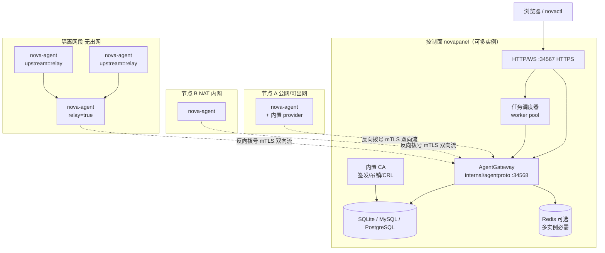
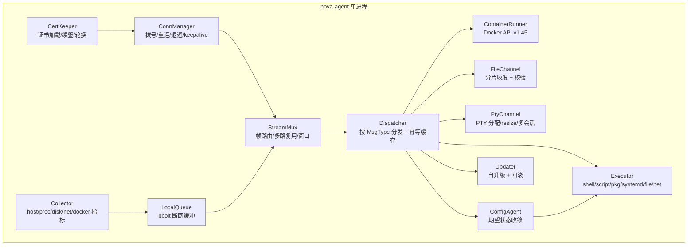
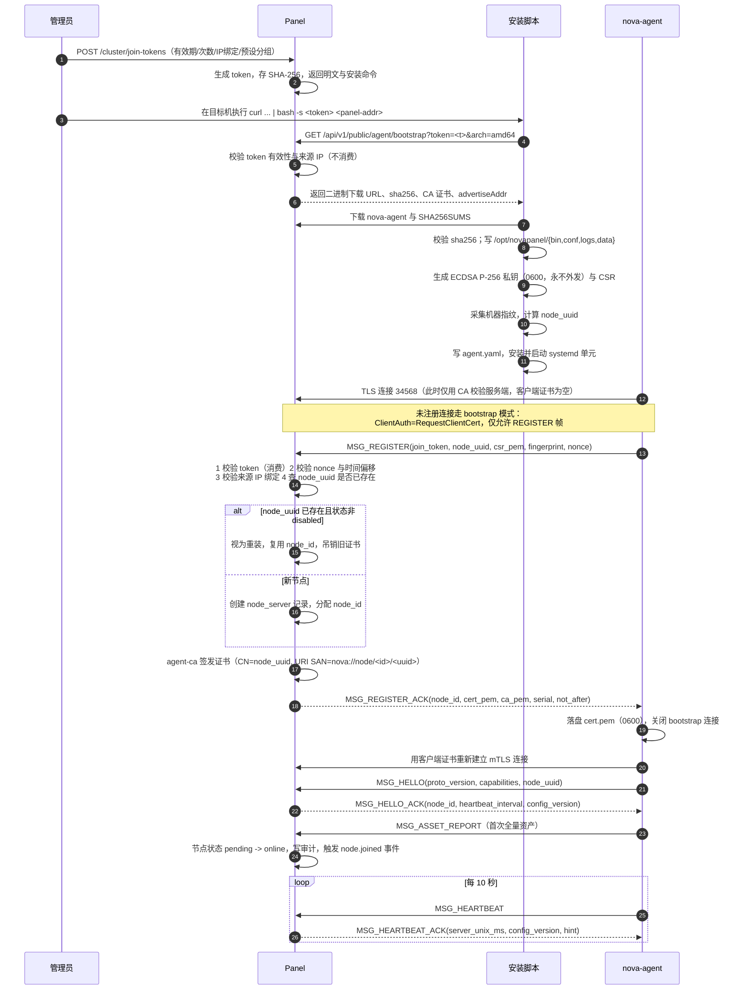
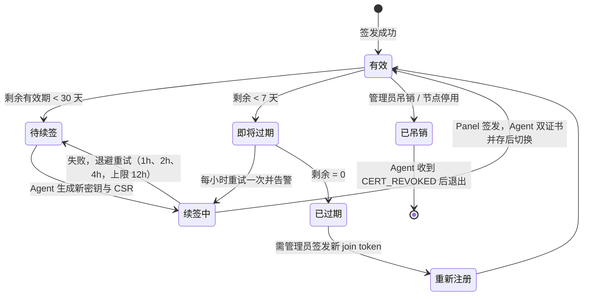
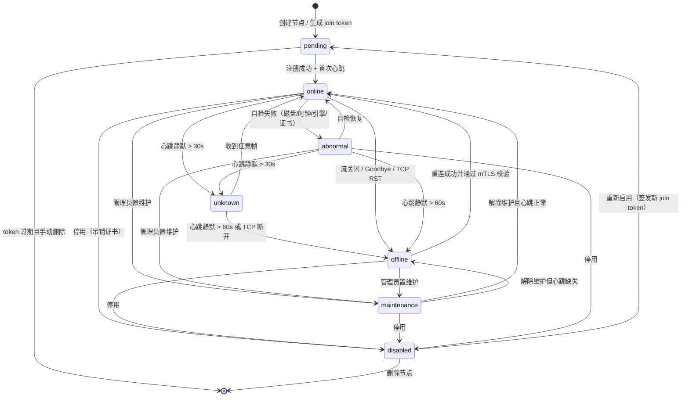
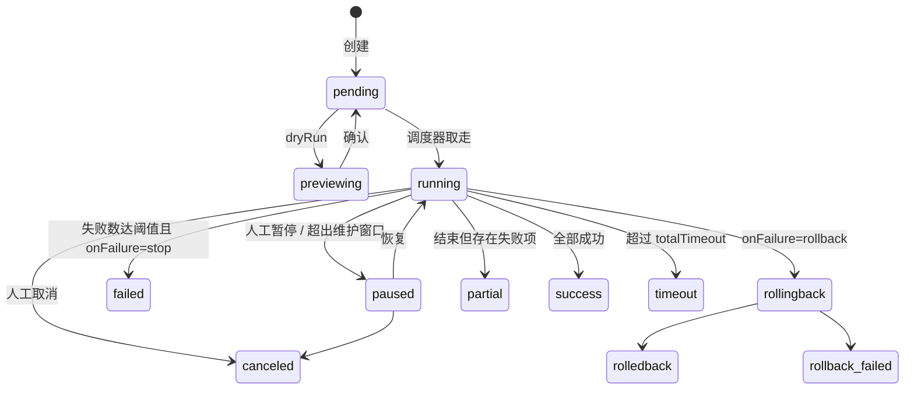
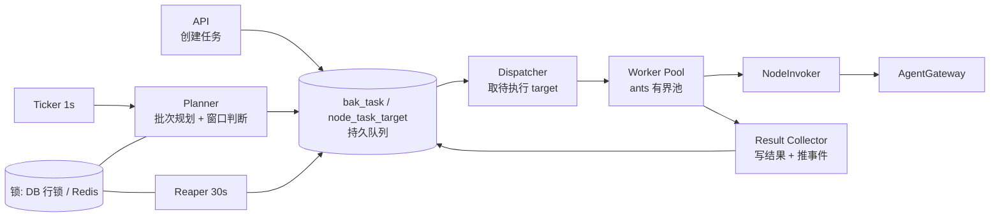
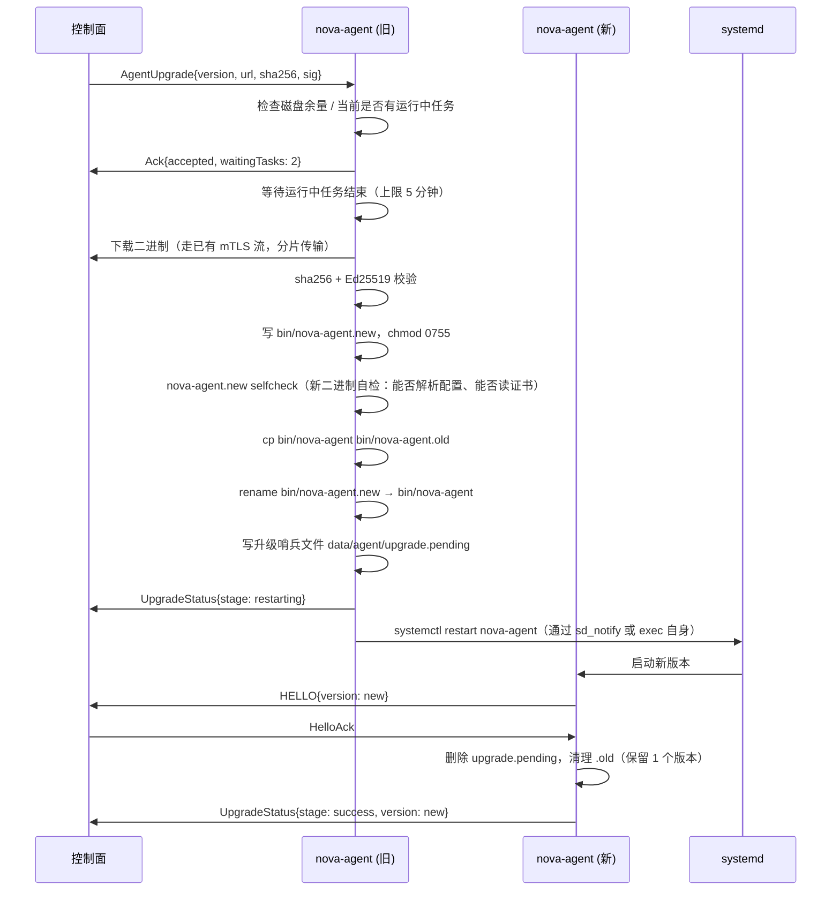
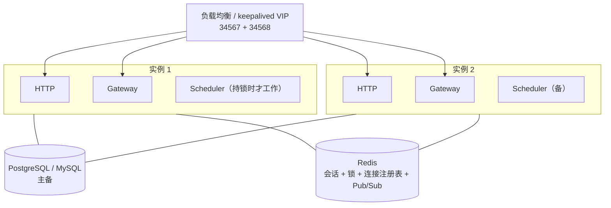
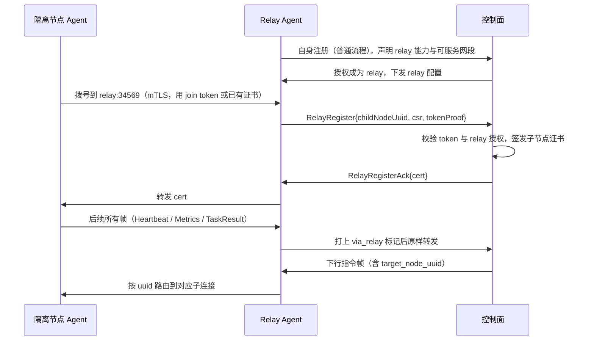

# 青垣面板 · 多节点集群与 Agent

## 文档信息

| 项目 | 内容 |
| --- | --- |
| 文档名称 | 10-多节点集群与Agent |
| 文档版本 | v1.0 |
| 更新日期 | 2026-08-17 |
| 状态 | 定稿 |
| 适用版本 | 青垣面板 v1.0 |
| 产品代号 | qingyuan |
| 覆盖内容 | 集群角色与拓扑、单机与集群一致性、Agent 内部模块与资源目标、AgentStream 双向流协议与完整 proto、帧路由与流控背压、内置 CA 与 mTLS、join token 注册与证书轮换、节点状态机与生命周期、心跳与故障判定、批量任务调度器、期望状态同步与漂移纠偏、NodeInvoker 跨节点路由、Agent 自升级、500 节点规模化与高可用、中继场景、接口清单、故障演练与排错手册 |
| 关联文档 | [系统架构设计](./02-系统架构设计.md)、[技术栈与工程规范](./03-技术栈与工程规范.md)、[数据库设计](./04-数据库设计.md)、[API 接口规范](./05-API接口规范.md)、[文件管理与 WebSSH](./08-文件管理与WebSSH.md)、[容器与编排](./09-容器与编排.md)、[监控告警与可观测](./11-监控告警与可观测.md)、[安全合规与审计](./12-安全合规与审计.md)、[部署安装与升级](./14-部署安装与升级.md) |

## 目录

- [10.1 集群架构总览与角色定义](#101-集群架构总览与角色定义)
- [10.2 单机与集群模式的一致性设计](#102-单机与集群模式的一致性设计)
- [10.3 Agent 内部设计](#103-agent-内部设计)
- [10.4 通信协议模型](#104-通信协议模型)
- [10.5 完整 proto 定义](#105-完整-proto-定义)
- [10.6 帧路由、多路复用与流控背压](#106-帧路由多路复用与流控背压)
- [10.7 mTLS 与 CA 体系](#107-mtls-与-ca-体系)
- [10.8 节点注册流程](#108-节点注册流程)
- [10.9 证书轮换与节点身份防伪](#109-证书轮换与节点身份防伪)
- [10.10 节点生命周期状态机](#1010-节点生命周期状态机)
- [10.11 节点接入与批量部署](#1011-节点接入与批量部署)
- [10.12 节点分组、标签与选择器](#1012-节点分组标签与选择器)
- [10.13 心跳与故障判定](#1013-心跳与故障判定)
- [10.14 批量任务下发](#1014-批量任务下发)
- [10.15 调度器实现](#1015-调度器实现)
- [10.16 配置与资产同步](#1016-配置与资产同步)
- [10.17 跨节点能力路由 NodeInvoker](#1017-跨节点能力路由-nodeinvoker)
- [10.18 Agent 自升级](#1018-agent-自升级)
- [10.19 高可用与规模化](#1019-高可用与规模化)
- [10.20 中继与跳板场景](#1020-中继与跳板场景)
- [10.21 接口清单与前端页面清单](#1021-接口清单与前端页面清单)
- [10.22 故障演练与排错手册](#1022-故障演练与排错手册)

## 10.1 集群架构总览与角色定义

### 10.1.1 拓扑图



连接方向固定为 Agent 主动拨号到控制面 34568，控制面从不主动连接 Agent。这一条决定了整套设计：NAT 与防火墙无需任何入站放行，节点可以在任意网络位置；代价是控制面必须维护长连接注册表，且「节点在线」等价于「流存活」。

### 10.1.2 角色定义

| 角色 | 二进制 | 监听端口 | 出站需求 | 职责 |
| --- | --- | --- | --- | --- |
| 控制面 Panel | `novapanel` | 34567/tcp（HTTPS）、34568/tcp（gRPC） | 无（除 ACME、通知、镜像等业务需要） | Web/API、鉴权、编排、状态机、CA、任务调度、指标落库、告警 |
| 被控端 Agent | `nova-agent` | 无（不监听任何入站端口） | 到控制面 34568 | 指令执行、指标采集、文件与 PTY 通道、本地缓冲、自升级 |
| 中继 Agent Relay | `nova-agent`（`relay: true`） | 34569/tcp（仅本网段） | 到控制面 34568 | 为无出网节点代理注册与转发帧，见 [10.20](#1020-中继与跳板场景) |
| 命令行 CLI | `novactl` | 无 | 到控制面 34567 | 与浏览器等价的 API 客户端，不直连 Agent |

Agent 不监听入站端口是硬约束，唯一例外是显式开启的 relay 模式，且 relay 监听地址必须绑定到具体内网 IP（不允许 `0.0.0.0`），并同样要求 mTLS 双向校验。

### 10.1.3 端口与网络要求

| 方向 | 源 | 目标 | 端口 | 协议 | 必需 |
| --- | --- | --- | --- | --- | --- |
| 入站 | 管理员浏览器 | Panel | 34567 | TCP/HTTPS | 是 |
| 入站 | 全部 Agent | Panel | 34568 | TCP/gRPC over TLS 1.3 | 是 |
| 出站 | Agent | Panel | 34568 | 同上 | 是 |
| 出站 | Agent | 镜像仓库/软件源 | 443/80 | HTTPS/HTTP | 按业务 |
| 内部 | 隔离网段 Agent | Relay Agent | 34569 | TCP/gRPC over TLS 1.3 | relay 场景 |

不需要开放的：Panel 到 Agent 的任何入站、Agent 之间的互通（relay 场景除外）、SSH（仅首次批量部署时可选使用，见 [10.11](#1011-节点接入与批量部署)）。

## 10.2 单机与集群模式的一致性设计

### 10.2.1 选型：本机走 in-process provider

两种候选方案：

| 方案 | 描述 | 优点 | 缺点 |
| --- | --- | --- | --- |
| A 独立进程 | 控制面所在机器也装一个独立的 `nova-agent` 进程，同样反向拨号到本机 34568 | 代码路径完全统一；控制面崩溃不影响 Agent | 多一个进程与一份内存；单机用户（绝大多数）多一次本机 TLS 握手与两次序列化；安装复杂度上升；Agent 与 Panel 版本可能不一致 |
| B in-process | 控制面进程内嵌 Agent 的执行器与采集器，通过 Go channel 替代 gRPC | 单机零额外开销；安装只有一个二进制一个 systemd 单元；不存在本机版本错配 | 需要保证上层代码对两种传输无感；控制面进程崩溃时本机能力一并不可用 |

**定版选择 B（in-process provider）**，与 [2.3.3 主节点内置 Agent](./02-系统架构设计.md#233-主节点内置-agent) 一致。理由：

1. 产品定位是单机为主、集群为增量，绝大多数部署只有一个节点，为极少数场景付出常驻进程成本不划算。
2. 控制面进程崩溃时，浏览器已无法访问面板，本机 Agent 存活并无实际价值（远程节点的 Agent 存活才有价值，它们本来就是独立进程）。
3. 一致性风险可以用类型系统消除：上层只依赖 `NodeInvoker` 与 `ContainerProvider` 接口，两种实现共用同一套契约测试（table-driven，同一组用例分别跑 in-process 与 gRPC 实现），CI 强制两者结果一致。

### 10.2.2 一致性保障机制

| 层面 | 机制 |
| --- | --- |
| 接口 | 业务代码只见 `NodeInvoker`/`ContainerProvider`，看不到 `grpc.ClientConn` 也看不到 `os/exec` |
| 节点记录 | 内置节点在 `node_server` 中同样有一行，`is_builtin=1`、`agent_mode='inprocess'`、`node_uuid` 由同一算法生成 |
| 幂等与审计 | in-process 调用同样生成 `task_id` 与 `idempotency_key`，同样写审计，不走捷径 |
| 序列化 | in-process 默认跳过 protobuf 编解码；但在 `NOVA_FORCE_CODEC=1` 环境下强制走一次编解码，用于在开发环境暴露「只有远程才出现」的序列化问题 |
| 契约测试 | `internal/nodeinvoke/contract_test.go` 对两种实现跑同一组 120+ 用例，覆盖成功、超时、取消、大 payload、流式、错误码透传 |
| 行为差异清单 | 显式维护在 [10.17.3](#1017-跨节点能力路由-nodeinvoker)，任何新增差异必须补文档与测试 |

### 10.2.3 模式切换

单机升级为集群不需要重装：控制面始终监听 34568（可在 `panel.yaml` 中关闭），添加第一个远程节点时无任何前置操作。反向操作（集群缩为单机）为逐个下线远程节点，内置节点不可删除。

```yaml
# /opt/novapanel/conf/panel.yaml 集群相关片段
cluster:
  enabled: true                 # false 时不监听 34568，纯单机
  grpcListen: "0.0.0.0:34568"
  advertiseAddr: "panel.example.com:34568"  # 下发给 Agent 的回连地址，必须可达
  maxAgents: 500
  builtinNode:
    enabled: true
    name: "本机"
  heartbeat:
    interval: 10s
    unknownAfter: 30s
    offlineAfter: 60s
  stream:
    maxRecvMsgBytes: 4194304    # 4MB
    windowSize: 64              # 每 stream 未确认帧上限
    sendQueueSize: 1024         # 每节点发送队列
    keepaliveTime: 20s
    keepaliveTimeout: 10s
```

## 10.3 Agent 内部设计

### 10.3.1 模块划分



| 模块 | 职责 | 关键设计 |
| --- | --- | --- |
| ConnManager | 建立并维持到控制面的双向流 | 指数退避重连（1s 起，×1.6，上限 60s，±20% 抖动）；同一时刻只有一条活跃流；连接成功后先发 `REGISTER`/`HELLO` |
| StreamMux | 帧的多路复用与路由 | 每逻辑流一个 `stream_id`，读协程单一（避免乱序），写走带缓冲 channel + 单写协程 |
| Dispatcher | 按消息类型分发到 handler | 每类型注册 handler；未注册返回 `UNSUPPORTED`；幂等键 LRU 缓存（10000 条 / TTL 10 分钟） |
| Executor | 系统调用统一出口 | 所有命令经 `exec.CommandContext`，禁止 shell 拼接（除显式的 shell 任务类型，此时用 `bash -lc` 并把脚本写临时文件） |
| ContainerRunner | 容器能力实现 | 复用 [09 号文档](./09-容器与编排.md)的 provider 实现，Agent 侧即 LocalProvider |
| Collector | 指标采集 | gopsutil v4；采集周期分级（见 [11 号文档](./11-监控告警与可观测.md)）；采集失败不阻塞其他项 |
| FileChannel | 大文件分片传输 | 默认分片 256KB，滑动窗口 8 片；分片与整体双重 sha256 校验；支持断点续传 |
| PtyChannel | 终端会话 | `creack/pty` 分配 PTY；单节点最多 20 个并发会话；空闲超时由控制面控制 |
| LocalQueue | 断网期间的上行数据缓冲 | bbolt 单文件 `/opt/novapanel/data/agent/queue.db`；指标按时间桶，上限 200MB 或 6 小时，超限丢弃最旧 |
| ConfigAgent | 期望状态收敛 | 见 [10.16](#1016-配置与资产同步) |
| Updater | 自升级 | 见 [10.18](#1018-agent-自升级) |
| CertKeeper | 证书生命周期 | 见 [10.9](#109-证书轮换与节点身份防伪) |

### 10.3.2 资源占用目标与达成手段

| 指标 | 目标 | 达成手段 |
| --- | --- | --- |
| 常驻内存 RSS | < 40MB（空闲），< 120MB（500 容器 + 传输中） | 不缓存业务数据；指标结构体复用 `sync.Pool`；`GOGC=50`、`GOMEMLIMIT=192MiB` 由 systemd 环境设置；日志不缓冲大块 |
| 空闲 CPU | < 1%（单核占比） | 采集周期 15s（基础指标）/ 60s（磁盘与对账）；无忙轮询；心跳 10s 一次且 payload < 200 字节 |
| 二进制体积 | < 25MB（`-ldflags "-s -w"` 后） | 单二进制不内嵌前端资源；不链接 CGO |
| goroutine 数 | 空闲 < 30，峰值 < 200 | 每逻辑流最多 2 个 goroutine；采集用固定协程池（size 4）；PTY 与文件传输按会话计 |
| 磁盘占用 | < 300MB | 缓冲队列上限 200MB；日志 lumberjack 轮转（50MB × 3）；旧版本二进制保留 1 份 |
| 启动到就绪 | < 2s | 注册与首次采集并行；不阻塞等待首次指标 |

### 10.3.3 部署形态

单二进制 `/opt/novapanel/bin/nova-agent`（实际为指向 `versions/<ver>/nova-agent` 的 symlink，见 10.18），systemd 单元：

```ini
# /etc/systemd/system/nova-agent.service
[Unit]
Description=Qingyuan Panel Agent
Documentation=https://novapanel.io/docs/agent
After=network-online.target
Wants=network-online.target

[Service]
Type=notify
NotifyAccess=main
ExecStart=/opt/novapanel/bin/nova-agent run --config /opt/novapanel/conf/agent.yaml
ExecReload=/bin/kill -HUP $MAINPID
Restart=always
RestartSec=5s
StartLimitIntervalSec=0
KillMode=mixed
KillSignal=SIGTERM
TimeoutStopSec=30s
User=root
WorkingDirectory=/opt/novapanel
Environment=GOGC=50
Environment=GOMEMLIMIT=192MiB
LimitNOFILE=65535
OOMScoreAdjust=-500
ProtectHome=false
NoNewPrivileges=false

[Install]
WantedBy=multi-user.target
```

`Type=notify` 让 systemd 在 Agent 完成注册并建立流之后才认为启动成功，便于批量部署脚本判定结果。`OOMScoreAdjust=-500` 保证宿主内存紧张时 Agent 不是第一个被杀的进程（否则会失去观测与救援能力）。`User=root` 是必要的：包管理、systemd 控制、任意路径文件操作都需要特权；非 root 模式（`--unprivileged`）作为 v1.1 能力，届时按能力位裁剪功能。

Alpine 等非 systemd 系统提供 OpenRC 脚本，Windows 与 macOS 节点不在 v1.0 范围。

### 10.3.4 OS 与架构支持矩阵

| 发行版 | 版本 | amd64 | arm64 | 服务管理 | 备注 |
| --- | --- | --- | --- | --- | --- |
| Ubuntu | 20.04 / 22.04 / 24.04 | 支持 | 支持 | systemd | 主力验证 |
| Debian | 11 / 12 | 支持 | 支持 | systemd | 主力验证 |
| CentOS Stream | 8 / 9 | 支持 | 支持 | systemd | |
| RHEL / Rocky / Alma | 8 / 9 | 支持 | 支持 | systemd | |
| openEuler | 22.03 / 24.03 | 支持 | 支持 | systemd | 包名差异由发行版适配层处理 |
| Alibaba Cloud Linux | 3 | 支持 | 支持 | systemd | |
| Anolis OS | 8 | 支持 | 支持 | systemd | |
| Kylin / UOS | V10 / 20 | 支持 | 支持 | systemd | 信创环境，需实测确认 |
| Alpine | 3.18+ | 支持 | 支持 | OpenRC | musl 静态编译产物；部分 `ps` 参数降级 |
| Debian/Ubuntu | - | - | armv7 | systemd | 尽力支持，不做性能承诺 |

编译目标：`linux/amd64`、`linux/arm64`、`linux/arm64-musl`、`linux/amd64-musl`、`linux/arm/v7`。发行物命名 `nova-agent_<version>_linux_<arch>[_musl].tar.gz`，随附 `SHA256SUMS` 与 `SHA256SUMS.sig`。

## 10.4 通信协议模型

### 10.4.1 设计要点

协议只有一个 gRPC 方法 `AgentStream(stream Envelope) returns (stream Envelope)`，所有交互都是 `Envelope` 的往来。这样做的原因：

1. 反向拨号下，控制面无法调用 Agent 的一元方法，唯一能主动下发的通道就是 Agent 发起的这条流。
2. 单方法意味着协议演进只需扩展 `MsgType` 与 `oneof payload`，不需要改 service 定义，向后兼容简单。
3. 多路复用在 `Envelope` 层做（`stream_id`），而不是开多条 gRPC 流，因为多条流在 HTTP/2 层的公平性与连接迁移都更难控制，也会让「节点在线」的判定变复杂。

`Envelope` 的核心字段职责：

| 字段 | 作用 |
| --- | --- |
| `msg_id` | 每帧唯一（Agent 侧与 Panel 侧各自单调递增，前缀区分方向），用于日志与去重 |
| `correlate_id` | 响应帧回填请求帧的 `msg_id`，实现请求-响应关联 |
| `stream_id` | 逻辑流标识，同一逻辑流的帧共享；一元请求为 0 |
| `seq` | 同一 `stream_id` 内的序号，从 1 开始，用于顺序校验与窗口确认 |
| `msg_type` | 消息类型枚举，决定 `payload` 的 oneof 分支 |
| `trace_id` | 贯穿 HTTP 请求到 Agent 执行的链路 ID，与面板日志一致 |
| `idempotency_key` | 写操作幂等键，Agent 侧缓存结果 |
| `compress` | payload 压缩算法标记 |
| `flags` | 位标记：`END_STREAM`、`NEED_ACK`、`URGENT`、`FRAGMENTED` |
| `error` | 错误结构，非空时忽略业务 payload |

### 10.4.2 消息类型枚举

| 值 | 名称 | 方向 | 用途 | 关联 stream |
| --- | --- | --- | --- | --- |
| 0 | `MSG_UNSPECIFIED` | - | 保留，收到即断连 | - |
| 1 | `MSG_HELLO` | A→P | 首帧，协议版本与能力位协商 | 0 |
| 2 | `MSG_HELLO_ACK` | P→A | 接受版本、下发服务端时间与配置版本 | 0 |
| 3 | `MSG_REGISTER` | A→P | 注册请求（join token + 机器指纹 + CSR） | 0 |
| 4 | `MSG_REGISTER_ACK` | P→A | 签发证书、分配 node_id | 0 |
| 5 | `MSG_HEARTBEAT` | A→P | 心跳（含轻量状态摘要） | 0 |
| 6 | `MSG_HEARTBEAT_ACK` | P→A | 心跳应答（含服务端时间戳用于时钟校正） | 0 |
| 7 | `MSG_GOODBYE` | 双向 | 优雅关闭（升级、维护、停用） | 0 |
| 8 | `MSG_ERROR` | 双向 | 协议级错误 | 任意 |
| 9 | `MSG_ACK` | 双向 | 通用确认（配合 `NEED_ACK`） | 任意 |
| 10 | `MSG_EXEC_REQ` | P→A | 指令下发（shell/script/pkg/systemd/file 等） | 新建 |
| 11 | `MSG_EXEC_RESULT` | A→P | 执行结果（退出码、stdout/stderr 摘要） | 同请求 |
| 12 | `MSG_EXEC_CANCEL` | P→A | 取消执行（超时或用户中止） | 同请求 |
| 13 | `MSG_EXEC_PROGRESS` | A→P | 执行中的增量输出与进度 | 同请求 |
| 20 | `MSG_METRIC_REPORT` | A→P | 指标批量上报 | 0 |
| 21 | `MSG_METRIC_CONFIG` | P→A | 采集项与周期下发 | 0 |
| 22 | `MSG_EVENT_REPORT` | A→P | 事件上报（容器 die、服务异常、磁盘水位） | 0 |
| 23 | `MSG_ASSET_REPORT` | A→P | 资产清单上报（OS/硬件/软件/运行时） | 0 |
| 24 | `MSG_RECONCILE_SUMMARY` | A→P | 对账摘要（容器/镜像/网络/卷/项目哈希） | 0 |
| 30 | `MSG_LOG_STREAM_OPEN` | P→A | 打开日志流（容器/文件/journald） | 新建 |
| 31 | `MSG_LOG_STREAM_DATA` | A→P | 日志数据帧 | 同上 |
| 32 | `MSG_LOG_STREAM_CLOSE` | 双向 | 关闭日志流 | 同上 |
| 35 | `MSG_FILE_OPEN` | 双向 | 打开文件传输（上传/下载/列目录） | 新建 |
| 36 | `MSG_FILE_CHUNK` | 双向 | 文件分片数据 | 同上 |
| 37 | `MSG_FILE_ACK` | 双向 | 分片确认与窗口推进 | 同上 |
| 38 | `MSG_FILE_CLOSE` | 双向 | 结束传输（含整体校验和） | 同上 |
| 40 | `MSG_PTY_OPEN` | P→A | 打开 PTY（宿主 shell 或容器 exec） | 新建 |
| 41 | `MSG_PTY_DATA` | 双向 | 终端输入输出字节流 | 同上 |
| 42 | `MSG_PTY_RESIZE` | P→A | 窗口尺寸变更 | 同上 |
| 43 | `MSG_PTY_CLOSE` | 双向 | 关闭会话（含退出码） | 同上 |
| 45 | `MSG_CONFIG_SYNC` | P→A | 期望状态下发（声明式 + 版本号） | 新建 |
| 46 | `MSG_CONFIG_ACK` | A→P | 收敛结果（成功/部分/失败 + 变更明细） | 同上 |
| 47 | `MSG_CONFIG_DRIFT` | A→P | 漂移上报（实际与期望不一致） | 0 |
| 50 | `MSG_UPGRADE_CMD` | P→A | 自升级指令（版本、URL、sha256、签名） | 新建 |
| 51 | `MSG_UPGRADE_PROGRESS` | A→P | 升级阶段进度与结果 | 同上 |
| 52 | `MSG_CERT_ROTATE_CMD` | P→A | 要求轮换证书 | 新建 |
| 53 | `MSG_CERT_CSR` | A→P | 提交新 CSR | 同上 |
| 54 | `MSG_CERT_ISSUED` | P→A | 下发新证书 | 同上 |
| 55 | `MSG_CERT_REVOKED` | P→A | 通知证书已吊销（Agent 收到后停止工作并退出） | 0 |
| 60 | `MSG_CT_REQ` | P→A | 容器能力调用（对应 `ContainerProvider` 方法） | 新建 |
| 61 | `MSG_CT_RESP` | A→P | 容器能力返回 | 同上 |
| 62 | `MSG_CT_STREAM_CHUNK` | A→P | 容器流式数据（logs/stats/build/pull 归并前的原始块） | 同上 |
| 70 | `MSG_FLOW_WINDOW_UPDATE` | 双向 | 窗口推进（接收方处理完 N 帧后通告） | 任意 |
| 71 | `MSG_FLOW_PAUSE` | 双向 | 背压：暂停指定 stream 或全局 | 任意 |
| 72 | `MSG_FLOW_RESUME` | 双向 | 恢复发送 | 任意 |

共 44 种消息类型。枚举值段位预留规则：0-9 控制、10-19 指令、20-29 上报、30-34 日志、35-39 文件、40-44 PTY、45-49 配置、50-59 升级与证书、60-69 业务转发、70-79 流控、80+ 预留给 v2.0（K8s 转发、隧道、eBPF 采集）。新增类型只能在段位内追加，不得复用已废弃的值。

## 10.5 完整 proto 定义

文件路径 `api/proto/agent/v1/agent.proto`，生成命令 `protoc --go_out=. --go-grpc_out=. api/proto/agent/v1/agent.proto`。

### 10.5.1 服务与信封

```proto
syntax = "proto3";

package nova.agent.v1;

option go_package = "github.com/novapanel/novapanel/api/gen/agent/v1;agentv1";

// AgentStream 是 Panel 与 Agent 之间唯一的 RPC。
// 连接方向固定为 Agent 主动拨号，Panel 通过返回流下发指令。
service AgentStream {
  rpc Stream(stream Envelope) returns (stream Envelope);
}

// Envelope 是所有帧的统一封装。
message Envelope {
  uint64 msg_id          = 1;  // 发送方单调递增，Panel 侧高位置 1 以区分方向
  uint64 correlate_id    = 2;  // 响应帧回填请求的 msg_id，0 表示非响应
  uint64 stream_id       = 3;  // 逻辑流 ID，0 表示无流（控制与上报类）
  uint32 seq             = 4;  // 流内序号，从 1 开始
  MsgType msg_type       = 5;
  string trace_id        = 6;  // 与面板 HTTP 响应中的 traceId 一致
  string idempotency_key = 7;  // 写操作幂等键，非写操作为空
  int64  sent_at_unix_ms = 8;  // 发送方时钟，用于时钟偏移检测
  Compression compress   = 9;  // payload 的压缩方式
  uint32 flags           = 10; // Flag 位或运算结果
  Error error            = 11; // 非空表示该帧承载错误

  oneof payload {
    Hello              hello               = 20;
    HelloAck           hello_ack           = 21;
    RegisterReq        register            = 22;
    RegisterAck        register_ack        = 23;
    Heartbeat          heartbeat           = 24;
    HeartbeatAck       heartbeat_ack       = 25;
    Goodbye            goodbye             = 26;
    Ack                ack                 = 27;
    ExecReq            exec_req            = 30;
    ExecResult         exec_result         = 31;
    ExecCancel         exec_cancel         = 32;
    ExecProgress       exec_progress       = 33;
    MetricReport       metric_report       = 40;
    MetricConfig       metric_config       = 41;
    EventReport        event_report        = 42;
    AssetReport        asset_report        = 43;
    ReconcileSummary   reconcile_summary   = 44;
    LogStreamOpen      log_open            = 50;
    LogStreamData      log_data            = 51;
    LogStreamClose     log_close           = 52;
    FileOpen           file_open           = 60;
    FileChunk          file_chunk          = 61;
    FileAck            file_ack            = 62;
    FileClose          file_close          = 63;
    PtyOpen            pty_open            = 70;
    PtyData            pty_data            = 71;
    PtyResize          pty_resize          = 72;
    PtyClose           pty_close           = 73;
    ConfigSync         config_sync         = 80;
    ConfigAck          config_ack          = 81;
    ConfigDrift        config_drift        = 82;
    UpgradeCmd         upgrade_cmd         = 90;
    UpgradeProgress    upgrade_progress    = 91;
    CertRotateCmd      cert_rotate         = 92;
    CertCsr            cert_csr            = 93;
    CertIssued         cert_issued         = 94;
    CertRevoked        cert_revoked        = 95;
    CtRequest          ct_req              = 100;
    CtResponse         ct_resp             = 101;
    CtStreamChunk      ct_chunk            = 102;
    FlowWindowUpdate   flow_window         = 110;
    FlowControl        flow_control        = 111;
  }
}

enum Compression {
  COMPRESSION_NONE   = 0;
  COMPRESSION_GZIP   = 1;
  COMPRESSION_ZSTD   = 2;  // 优先，payload > 4KB 时启用
  COMPRESSION_SNAPPY = 3;
}

// Flag 位定义，写入 Envelope.flags。
enum Flag {
  FLAG_NONE       = 0;
  FLAG_END_STREAM = 1;  // 本帧是该 stream 的最后一帧
  FLAG_NEED_ACK   = 2;  // 要求对端回 MSG_ACK
  FLAG_URGENT     = 4;  // 插队发送（取消、关闭、流控）
  FLAG_FRAGMENTED = 8;  // 本帧是分片之一，需按 seq 重组
  FLAG_REPLAY     = 16; // 离线队列恢复后的重放帧
}

message Error {
  uint32 code    = 1;  // 6 位 MMSSNN 错误码，与 HTTP 侧一致
  string message = 2;
  string detail  = 3;  // 可含 stderr 摘要等
  bool   retryable = 4;
}
```

### 10.5.2 消息类型枚举

```proto
enum MsgType {
  MSG_UNSPECIFIED          = 0;
  MSG_HELLO                = 1;
  MSG_HELLO_ACK            = 2;
  MSG_REGISTER             = 3;
  MSG_REGISTER_ACK         = 4;
  MSG_HEARTBEAT            = 5;
  MSG_HEARTBEAT_ACK        = 6;
  MSG_GOODBYE              = 7;
  MSG_ERROR                = 8;
  MSG_ACK                  = 9;
  MSG_EXEC_REQ             = 10;
  MSG_EXEC_RESULT          = 11;
  MSG_EXEC_CANCEL          = 12;
  MSG_EXEC_PROGRESS        = 13;
  MSG_METRIC_REPORT        = 20;
  MSG_METRIC_CONFIG        = 21;
  MSG_EVENT_REPORT         = 22;
  MSG_ASSET_REPORT         = 23;
  MSG_RECONCILE_SUMMARY    = 24;
  MSG_LOG_STREAM_OPEN      = 30;
  MSG_LOG_STREAM_DATA      = 31;
  MSG_LOG_STREAM_CLOSE     = 32;
  MSG_FILE_OPEN            = 35;
  MSG_FILE_CHUNK           = 36;
  MSG_FILE_ACK             = 37;
  MSG_FILE_CLOSE           = 38;
  MSG_PTY_OPEN             = 40;
  MSG_PTY_DATA             = 41;
  MSG_PTY_RESIZE           = 42;
  MSG_PTY_CLOSE            = 43;
  MSG_CONFIG_SYNC          = 45;
  MSG_CONFIG_ACK           = 46;
  MSG_CONFIG_DRIFT         = 47;
  MSG_UPGRADE_CMD          = 50;
  MSG_UPGRADE_PROGRESS     = 51;
  MSG_CERT_ROTATE_CMD      = 52;
  MSG_CERT_CSR             = 53;
  MSG_CERT_ISSUED          = 54;
  MSG_CERT_REVOKED         = 55;
  MSG_CT_REQ               = 60;
  MSG_CT_RESP              = 61;
  MSG_CT_STREAM_CHUNK      = 62;
  MSG_FLOW_WINDOW_UPDATE   = 70;
  MSG_FLOW_PAUSE           = 71;
  MSG_FLOW_RESUME          = 72;
}
```

### 10.5.3 握手、注册与心跳

```proto
message Hello {
  string proto_version   = 1;  // 语义化版本，如 "1.0"；不兼容时 Panel 回 Error
  string agent_version   = 2;  // nova-agent 版本
  string node_uuid       = 3;  // 机器指纹派生，见 10.9.3
  string os              = 4;  // ubuntu / centos / alpine ...
  string os_version      = 5;
  string kernel          = 6;
  string arch            = 7;  // amd64 / arm64 / arm
  repeated string capabilities = 8;  // ct.core, ct.exec, ct.compose, pty, file, upgrade ...
  string relay_of        = 9;  // 非空表示本帧经该中继节点转发
  int64  boot_at_unix_ms = 10; // 系统启动时间，用于识别重启
}

message HelloAck {
  bool   accepted          = 1;
  int64  server_unix_ms    = 2;  // 用于 Agent 侧时钟偏移计算
  int64  node_id           = 3;
  uint32 heartbeat_interval_ms = 4;
  uint64 config_version    = 5;  // 期望状态版本，与本地不一致则 Panel 随后下发 ConfigSync
  string required_agent_version = 6; // 非空表示需要升级
  repeated string enabled_features = 7;
}

message RegisterReq {
  string join_token      = 1;  // 一次性注册令牌
  string node_uuid       = 2;
  string csr_pem         = 3;  // PKCS#10，私钥不出本机
  string hostname        = 4;
  repeated string ip_list = 5; // 本机全部非回环 IP，用于 SAN 与 IP 绑定校验
  MachineFingerprint fingerprint = 6;
  string agent_version   = 7;
  string arch            = 8;
  string relay_of        = 9;
}

message MachineFingerprint {
  string machine_id     = 1;  // /etc/machine-id
  string product_uuid   = 2;  // DMI product_uuid，容器内可能为空
  string board_serial   = 3;
  repeated string mac_list = 4;
  string root_fs_uuid   = 5;  // 根分区 UUID
  uint32 cpu_count      = 6;
  uint64 mem_total_bytes = 7;
}

message RegisterAck {
  int64  node_id       = 1;
  string cert_pem      = 2;  // 签发的 Agent 证书
  string ca_pem        = 3;  // Panel 的 CA 证书链
  string serial        = 4;  // 证书序列号（十六进制）
  int64  not_after_unix = 5;
  string panel_addr    = 6;  // 规范化后的回连地址（可能与安装时不同）
  string node_name     = 7;
}

message Heartbeat {
  uint32 uptime_sec        = 1;
  float  load1             = 2;
  float  cpu_percent       = 3;
  float  mem_percent       = 4;
  float  disk_root_percent = 5;
  uint32 running_containers = 6;
  uint32 active_tasks      = 7;
  uint32 queued_reports    = 8;  // 本地缓冲队列积压条数
  uint64 config_version    = 9;
  string agent_version     = 10;
  int64  cert_not_after_unix = 11;
}

message HeartbeatAck {
  int64  server_unix_ms = 1;
  uint64 config_version = 2;  // 与 Heartbeat 不一致则 Panel 随后下发 ConfigSync
  bool   need_asset_report = 3;
  bool   need_reconcile = 4;
  NodeCommandHint hint  = 5;  // 轻量指示：需要升级/轮换证书/进入维护
}

message NodeCommandHint {
  bool upgrade_available = 1;
  bool rotate_cert       = 2;
  bool enter_maintenance = 3;
  bool drain_and_exit    = 4;
}

message Goodbye {
  string reason = 1;  // shutdown / upgrade / maintenance / revoked / decommission
  bool   will_reconnect = 2;
  uint32 reconnect_after_sec = 3;
}

message Ack {
  uint64 acked_msg_id = 1;
  uint32 code         = 2;  // 0 表示成功
}
```

### 10.5.4 指令执行与上报

```proto
message ExecReq {
  int64  task_id      = 1;
  ExecKind kind       = 2;
  string command      = 3;   // kind=SHELL 时的命令行
  repeated string args = 4;  // kind=BINARY 时的参数
  string script_body  = 5;   // kind=SCRIPT 时的脚本内容
  string interpreter  = 6;   // bash / sh / python3 / ansible-playbook
  string work_dir     = 7;
  map<string, string> env = 8;
  string run_as_user  = 9;
  uint32 timeout_sec  = 10;  // 0 表示用默认 300
  bool   stream_output = 11; // true 时通过 ExecProgress 增量回传
  uint32 max_output_bytes = 12; // 结果截断上限，默认 1MB
  PkgAction pkg       = 13;  // kind=PACKAGE
  ServiceAction svc   = 14;  // kind=SERVICE
  FilePlan file       = 15;  // kind=FILE_DISTRIBUTE
  int64  expire_at_unix_ms = 16; // 离线排队 TTL，过期直接丢弃并回 EXPIRED
}

enum ExecKind {
  EXEC_UNSPECIFIED   = 0;
  EXEC_SHELL         = 1;  // bash -lc <command>
  EXEC_BINARY        = 2;  // 直接 exec，无 shell 解析
  EXEC_SCRIPT        = 3;  // 脚本落临时文件后执行
  EXEC_PACKAGE       = 4;  // apt/dnf/apk 封装
  EXEC_SERVICE       = 5;  // systemctl 封装
  EXEC_FILE_DISTRIBUTE = 6;
  EXEC_CONFIG_SYNC   = 7;
  EXEC_AGENT_UPGRADE = 8;
  EXEC_PLAYBOOK      = 9;  // 自定义编排剧本（面板 DSL）
}

message PkgAction {
  string action = 1;  // install / remove / upgrade / query
  repeated string packages = 2;
  bool   assume_yes = 3;
}

message ServiceAction {
  string name   = 1;
  string action = 2;  // start / stop / restart / reload / enable / disable / status
}

message FilePlan {
  string target_path = 1;
  uint32 mode        = 2;  // 0644 等，八进制值
  string owner       = 3;
  string group       = 4;
  string sha256      = 5;
  bool   backup_existing = 6;
  string post_command = 7; // 落盘后执行，如 nginx -s reload
}

message ExecResult {
  int64  task_id     = 1;
  int32  exit_code   = 2;
  string stdout      = 3;  // 已按 max_output_bytes 截断
  string stderr      = 4;
  bool   truncated   = 5;
  uint64 duration_ms = 6;
  ExecState state    = 7;
  string output_sha256 = 8; // 用于结果归并折叠
  map<string, string> extra = 9; // 结构化补充，如 pkg 的实际安装版本
}

enum ExecState {
  EXEC_STATE_UNSPECIFIED = 0;
  EXEC_STATE_SUCCESS     = 1;
  EXEC_STATE_FAILED      = 2;
  EXEC_STATE_TIMEOUT     = 3;
  EXEC_STATE_CANCELED    = 4;
  EXEC_STATE_EXPIRED     = 5;  // 离线队列 TTL 过期
  EXEC_STATE_UNSUPPORTED = 6;
  EXEC_STATE_SKIPPED     = 7;  // 幂等命中，返回缓存结果
}

message ExecCancel {
  int64 task_id = 1;
  bool  force   = 2;  // true 时 SIGKILL 整个进程组
}

message ExecProgress {
  int64  task_id = 1;
  uint32 percent = 2;
  string phase   = 3;
  bytes  chunk   = 4;  // 增量输出
  bool   is_stderr = 5;
}
```

### 10.5.5 指标、事件、资产与对账

```proto
message MetricReport {
  int64 collected_at_unix_ms = 1;
  repeated MetricSample samples = 2;
  bool  from_buffer = 3;  // true 表示断网缓冲的补报
}

message MetricSample {
  string name  = 1;  // node.cpu.percent / ct.mem.usage / disk.used.bytes
  map<string, string> labels = 2; // device=sda1, container=abc123
  double value = 3;
  int64  ts_unix_ms = 4;
}

message MetricConfig {
  uint32 base_interval_sec   = 1;  // 基础指标周期，默认 15
  uint32 disk_interval_sec   = 2;  // 磁盘，默认 60
  uint32 container_interval_sec = 3; // 容器，默认 15，容器数多时 Agent 可自行退化
  repeated string enabled_collectors = 4;
  repeated string disabled_metrics   = 5; // 名称或前缀，用于降噪
  uint32 batch_max_samples   = 6;  // 单帧上限，默认 2000
  bool   enable_process_top  = 7;
}

message EventReport {
  repeated NodeEvent events = 1;
}

message NodeEvent {
  string kind     = 1;  // container.die / service.failed / disk.critical / login.failed / cert.expiring
  string severity = 2;  // info / warning / critical
  string subject  = 3;  // 对象标识，如容器名或服务名
  string message  = 4;
  map<string, string> attrs = 5;
  int64  happened_at_unix_ms = 6;
  string dedup_key = 7; // 相同 key 在 Panel 侧 5 分钟内合并
}

message AssetReport {
  string hostname   = 1;
  string os         = 2;
  string os_version = 3;
  string kernel     = 4;
  string arch       = 5;
  uint32 cpu_cores  = 6;
  string cpu_model  = 7;
  uint64 mem_total_bytes = 8;
  uint64 swap_total_bytes = 9;
  repeated DiskInfo disks = 10;
  repeated NicInfo  nics  = 11;
  repeated SoftwareInfo software = 12;
  RuntimeInfo runtime = 13;
  string timezone   = 14;
  int64  boot_at_unix_ms = 15;
  string virt_type  = 16; // kvm / vmware / docker / none
  string public_ip  = 17;
}

message DiskInfo {
  string device = 1; string mountpoint = 2; string fstype = 3;
  uint64 total_bytes = 4; uint64 used_bytes = 5; bool is_rotational = 6;
}

message NicInfo {
  string name = 1; string mac = 2; repeated string addrs = 3;
  uint64 speed_mbps = 4; bool is_up = 5;
}

message SoftwareInfo {
  string name = 1; string version = 2; string kind = 3; // pkg / runtime / service
}

message RuntimeInfo {
  string container_engine = 1;  // docker / podman / none
  string engine_version   = 2;
  string compose_version  = 3;
  string buildx_version   = 4;
  string cgroup_version   = 5;
  bool   has_gpu          = 6;
  string gpu_model        = 7;
}

message ReconcileSummary {
  string containers_hash = 1;  // sha256(sorted(id:state))[:16]
  string images_hash     = 2;
  string networks_hash   = 3;
  string volumes_hash    = 4;
  repeated ProjectState projects = 5;
  uint32 container_count = 6;
  uint32 image_count     = 7;
}

message ProjectState {
  string project_name = 1;
  string status       = 2;  // running / partial / stopped / failed
  string config_hash  = 3;
  uint32 service_count = 4;
  uint32 running_count = 5;
}
```

### 10.5.6 日志、文件与 PTY 通道

```proto
message LogStreamOpen {
  string source     = 1;  // container / file / journald / compose
  string target     = 2;  // 容器 ID、文件路径、unit 名、项目名
  repeated string services = 3; // compose 场景的服务过滤
  int32  tail_lines = 4;  // -1 表示全部
  bool   follow     = 5;
  int64  since_unix = 6;
  int64  until_unix = 7;
  bool   timestamps = 8;
  string stream     = 9;  // stdout / stderr / both
  string grep       = 10;
  bool   grep_regex = 11;
  uint32 flush_ms   = 12; // 合帧窗口，默认 100
}

message LogStreamData {
  bytes  data      = 1;  // 已按行边界切分并合帧
  string service   = 2;  // compose 多服务时的来源服务
  bool   is_stderr = 3;
  uint32 line_count = 4;
  bool   dropped   = 5;  // true 表示因背压丢弃了部分行
  uint64 dropped_lines = 6;
}

message LogStreamClose {
  string reason = 1;  // eof / client_close / error / timeout
}

message FileOpen {
  FileOp op        = 1;
  string path      = 2;
  uint64 size      = 3;   // 上传时必填，用于预分配与进度
  uint32 mode      = 4;
  string owner     = 5;
  string group     = 6;
  string sha256    = 7;   // 整体校验和
  uint32 chunk_size = 8;  // 默认 262144
  uint32 window     = 9;  // 未确认分片上限，默认 8
  bool   resume     = 10; // 断点续传
  uint64 resume_offset = 11;
  bool   in_container = 12; // true 时 path 为容器内路径
  string container_id = 13;
  bool   recursive  = 14;  // 目录操作
}

enum FileOp {
  FILE_OP_UNSPECIFIED = 0;
  FILE_OP_UPLOAD   = 1;  // Panel -> Agent
  FILE_OP_DOWNLOAD = 2;  // Agent -> Panel
  FILE_OP_LIST     = 3;
  FILE_OP_STAT     = 4;
  FILE_OP_DELETE   = 5;
}

message FileChunk {
  uint64 offset = 1;
  bytes  data   = 2;
  uint32 crc32c = 3;  // 单片快速校验
  bool   last   = 4;
}

message FileAck {
  uint64 next_offset  = 1;  // 期望的下一个偏移，用于续传与窗口推进
  uint32 window_free  = 2;  // 接收方还能接收的分片数
  bool   need_resend  = 3;
  uint64 resend_offset = 4;
}

message FileClose {
  bool   success   = 1;
  string sha256    = 2;  // 实际写入内容的校验和，与 FileOpen 比对
  uint64 total_bytes = 3;
  repeated FileEntry entries = 4; // LIST 操作的结果
}

message FileEntry {
  string name = 1; bool is_dir = 2; uint64 size = 3;
  uint32 mode = 4; int64 mtime_unix = 5; string owner = 6;
  string group = 7; string link_target = 8;
}

message PtyOpen {
  string kind        = 1;  // host / container
  string container_id = 2;
  repeated string shell_candidates = 3; // ["bash","sh","ash"]
  string work_dir    = 4;
  string run_as_user = 5;
  map<string, string> env = 6;
  uint32 cols        = 7;
  uint32 rows        = 8;
  string term        = 9;  // xterm-256color
  uint32 idle_timeout_sec = 10;
  bool   record      = 11; // 是否要求 Agent 侧也留存录像（默认 false，由 Panel 录）
}

message PtyData  { bytes data = 1; }
message PtyResize { uint32 cols = 1; uint32 rows = 2; }
message PtyClose {
  int32  exit_code = 1;
  string reason    = 2;  // user / idle_timeout / process_exit / error / revoked
  string shell_used = 3;
}
```

### 10.5.7 配置同步、升级、证书与业务转发

```proto
message ConfigSync {
  uint64 config_version = 1;
  bool   full           = 2;  // true 为全量，false 为增量
  repeated ConfigItem items = 3;
  bool   auto_correct   = 4;  // 是否允许 Agent 直接纠偏
  uint32 converge_timeout_sec = 5;
}

message ConfigItem {
  string key     = 1;  // sysctl.net.core.somaxconn / file./etc/hosts / service.nginx.enabled
  string kind    = 2;  // sysctl / file / service / limit / cron / firewall
  string desired = 3;  // 期望值，file 类为内容 sha256
  bytes  content = 4;  // file 类的内容本体
  uint32 mode    = 5;
  string owner   = 6;
  string group   = 7;
  string post_command = 8;
  bool   remove  = 9;  // true 表示期望不存在
}

message ConfigAck {
  uint64 config_version = 1;
  string state          = 2;  // converged / partial / failed
  repeated ConfigItemResult results = 3;
  uint32 retry_after_sec = 4;  // partial 时建议的重试间隔
}

message ConfigItemResult {
  string key = 1; bool changed = 2; bool ok = 3;
  string old_value = 4; string new_value = 5; string error = 6;
}

message ConfigDrift {
  uint64 config_version = 1;
  repeated ConfigItemResult drifts = 2; // old_value=实际值, new_value=期望值
  int64  detected_at_unix_ms = 3;
}

message UpgradeCmd {
  string target_version = 1;
  string download_url   = 2;  // 由 Panel 提供，通常是 Panel 自身的分发端点
  string sha256         = 3;
  string signature      = 4;  // Panel 私钥对 sha256 的签名（base64）
  uint64 size_bytes     = 5;
  bool   force          = 6;  // 忽略版本比较，允许降级
  uint32 timeout_sec    = 7;
  bool   restart_now    = 8;  // false 时仅下载与校验，等待后续指令
}

message UpgradeProgress {
  string phase     = 1;  // downloading / verifying / installing / restarting / done / rolled_back
  uint32 percent   = 2;
  string from_version = 3;
  string to_version   = 4;
  bool   success   = 5;
  string message   = 6;
}

message CertRotateCmd {
  string reason = 1;  // expiring / manual / compromised
  uint32 within_sec = 2; // 要求在该时间内完成
}

message CertCsr    { string csr_pem = 1; string node_uuid = 2; }
message CertIssued {
  string cert_pem = 1; string ca_pem = 2; string serial = 3;
  int64  not_after_unix = 4;
}
message CertRevoked {
  string serial = 1; string reason = 2; bool  exit_now = 3;
}

// CtRequest 承载 09 号文档定义的 ContainerProvider 方法调用。
message CtRequest {
  string method   = 1;  // ContainerList / ContainerCreate / ImagePull / ComposeUp ...
  bytes  params   = 2;  // JSON 编码的方法参数，避免为每个方法定义 message
  bool   streaming = 3; // true 时结果通过 CtStreamChunk 返回
  uint32 timeout_sec = 4;
}

message CtResponse {
  bytes  result   = 1;  // JSON 编码的返回值
  bool   stale    = 2;  // 取自本地缓存（Docker 不可达时的兜底）
  uint64 duration_ms = 3;
}

message CtStreamChunk {
  bytes  data     = 1;
  bool   is_stderr = 2;
  bool   last     = 3;
}

message FlowWindowUpdate {
  uint64 stream_id = 1;
  uint32 processed = 2;  // 已处理帧数，发送方据此推进窗口
}

message FlowControl {
  uint64 stream_id = 1;  // 0 表示全局
  bool   pause     = 2;
  uint32 resume_after_ms = 3;
  string reason    = 4;  // queue_full / cpu_high / disk_full
}
```

### 10.5.8 版本协商与兼容规则

| 规则 | 说明 |
| --- | --- |
| 协议版本 | `Hello.proto_version` 形如 `MAJOR.MINOR`。MAJOR 不同直接拒绝（回 `MSG_ERROR` code `200401`），MINOR 取双方较小者作为有效版本 |
| 字段演进 | 只允许新增字段（新编号）与新增枚举值；禁止改类型、禁止复用编号、禁止把 optional 改必填 |
| 未知消息类型 | 接收方回 `MSG_ERROR` + `EXEC_STATE_UNSUPPORTED` 语义，不断连 |
| 未知枚举值 | proto3 保留原值，业务层按「未知」处理并记 warning |
| 能力协商 | 语义能力用 `Hello.capabilities` 声明，而非依赖版本号推断，避免版本与编译选项不一致 |
| 强制升级 | `HelloAck.required_agent_version` 非空时，Agent 完成注册后立刻进入升级流程，期间仅响应心跳与升级消息 |

## 10.6 帧路由、多路复用与流控背压

### 10.6.1 stream id 分配

| 段位 | 分配方 | 用途 |
| --- | --- | --- |
| 0 | - | 无流帧（心跳、注册、指标、事件、资产、对账、全局流控） |
| 奇数 1,3,5... | Panel | Panel 发起的逻辑流（exec、log、pty、config、upgrade、cert、ct） |
| 偶数 2,4,6... | Agent | Agent 发起的逻辑流（主动上传文件、drift 详情） |

分配用 `atomic.AddUint64(&counter, 2)`，单连接内单调递增不复用；连接重建后从 1/2 重新开始（旧流随连接一起失效）。单连接并发流上限 256，超出时新请求返回 `200429 节点并发流已满`。

帧路由在两侧对称实现：读协程单一，解出 `stream_id` 后投递到该流的接收 channel（容量 32）；`stream_id=0` 的帧投递到控制处理器。写侧为单写协程 + 优先级双队列（`FLAG_URGENT` 走高优队列，保证取消与流控帧不被大文件传输堵死）。

```go
// StreamMux 的核心结构，Panel 与 Agent 共用（internal/agentproto/mux.go）。
type StreamMux struct {
	send     chan *pb.Envelope // 普通队列，容量 sendQueueSize
	urgent   chan *pb.Envelope // 高优队列，容量 64
	streams  sync.Map          // stream_id -> *logicalStream
	counter  uint64
	nextOdd  bool // Panel 侧 true
}

type logicalStream struct {
	id        uint64
	in        chan *pb.Envelope // 容量 32
	window    int32             // 剩余可发送帧数，原子操作
	closed    atomic.Bool
	cancel    context.CancelFunc
	lastSeq   uint32
}
```

### 10.6.2 流控与背压

滑动窗口在应用层实现，不依赖 HTTP/2 的窗口（后者对单条 gRPC 流无法区分逻辑流）。

| 参数 | 默认 | 说明 |
| --- | --- | --- |
| `windowSize` | 64 帧 | 单逻辑流未被确认的帧数上限 |
| `ackBatch` | 16 帧 | 接收方每处理 16 帧发一次 `FlowWindowUpdate` |
| `sendQueueSize` | 1024 帧 | 每连接普通发送队列长度 |
| `urgentQueueSize` | 64 帧 | 高优队列长度 |
| `maxRecvMsgBytes` | 4MB | 单帧上限（gRPC `MaxRecvMsgSize`），超出直接断连 |
| `softFrameBytes` | 256KB | 建议单帧大小，超出应分片 |
| `pauseThreshold` | 队列 80% | 达到后发 `MSG_FLOW_PAUSE` |
| `resumeThreshold` | 队列 40% | 回落后发 `MSG_FLOW_RESUME` |

窗口耗尽时的行为按数据性质分三类，这是设计中最关键的取舍：

| 数据类别 | 消息类型 | 策略 | 理由 |
| --- | --- | --- | --- |
| 不可丢 | exec 请求/结果、config、upgrade、cert、file | 阻塞等待窗口（带 `context` 超时），超时则整体失败并回错误 | 丢失会导致状态不一致 |
| 可降频 | 指标、对账摘要 | 合并：新样本覆盖同 `name+labels` 的旧样本，队列满时丢最旧的批次并在下一帧标 `dropped` | 指标是时序采样，丢几个点可接受 |
| 可丢 | 日志流、PTY 输出、容器 stats 流 | 丢弃最旧数据，在 `LogStreamData.dropped_lines` 中累计告知 | 用户看实时日志，宁可跳行也不要延迟累积 |

PTY 是例外中的例外：输入方向（Panel→Agent）绝不丢弃（丢按键不可接受），输出方向可丢但改为「合并连续输出块」而非丢弃，最大合并 64KB。

Agent 侧还有一层进程级保护：当 `LocalQueue` 积压超过 200MB 或 CPU 连续 30 秒高于 90% 时，主动发 `MSG_FLOW_PAUSE`（`reason=queue_full`/`cpu_high`）并暂停接收新的 exec 请求（心跳与取消仍处理），Panel 侧把该节点标记为「过载」，调度器跳过它直到恢复。

### 10.6.3 大消息分片

超过 `softFrameBytes` 的 payload 必须分片：同一 `stream_id` 下按 `seq` 递增发送，每片置 `FLAG_FRAGMENTED`，最后一片置 `FLAG_END_STREAM`。接收方按 `seq` 顺序拼接，缺片则请求重发（`FileAck.need_resend`）或整体失败。

| 场景 | 分片单位 | 校验 | 续传 |
| --- | --- | --- | --- |
| 文件上传/下载 | 256KB（可协商） | 每片 crc32c + 整体 sha256 | 支持，按 `resume_offset` |
| 日志与 PTY | 不分片，按 64KB 截断成多帧 | 无 | 不适用 |
| exec 结果 | 超过 1MB 截断，完整输出转为文件下载通道 | sha256 | 不适用 |
| 镜像导入导出 | 走文件通道，1MB 分片 | 同文件 | 支持 |

## 10.7 mTLS 与 CA 体系

### 10.7.1 CA 层级与文件布局

面板内置两级 CA，安装时自动生成，不依赖外部 PKI：

```text
/opt/novapanel/data/pki/
├── ca/
│   ├── root-ca.crt          # 根 CA，ECDSA P-384，有效期 10 年，仅签发中间 CA
│   ├── root-ca.key          # 0600，签发中间 CA 后可离线备份并从磁盘移除
│   ├── agent-ca.crt         # 中间 CA，ECDSA P-256，有效期 5 年，签发 Agent 证书
│   ├── agent-ca.key         # 0600
│   └── crl.pem              # 吊销列表，每次吊销后重签
├── server/
│   ├── grpc.crt             # 34568 服务端证书，SAN 含 advertiseAddr 与全部本机 IP
│   └── grpc.key
└── issued/
    └── <serial>.crt         # 已签发的 Agent 证书副本，用于审计与吊销
```

| 项 | 取值 | 理由 |
| --- | --- | --- |
| 算法 | ECDSA P-256（Agent/Server）、P-384（Root） | 比 RSA 快、证书小，Go 原生支持好 |
| Agent 证书有效期 | 90 天 | 短周期降低泄露影响，配合自动续签无感 |
| 服务端证书有效期 | 2 年 | 变更成本高，且受 CA 保护 |
| Root CA 私钥 | 生成中间 CA 后建议离线保存 | 面板正常运行只需 `agent-ca.key` |
| SAN 约定 | Agent 证书 SAN 含 `URI:nova://node/<node_id>/<node_uuid>`，不含 IP/DNS | Agent 不作为服务端，无需域名校验；用 URI SAN 承载身份 |
| Subject | `CN=<node_uuid>`, `O=Qingyuan Panel`, `OU=agent`, `serialNumber=<node_id>` | CN 用 uuid 避免主机名变更导致证书失效 |
| 序列号 | 128 位随机数（`crypto/rand`），十六进制存 `node_server.cert_serial` | 便于精确吊销 |
| KeyUsage | `DigitalSignature`；ExtKeyUsage `ClientAuth` | Agent 证书**只能**做客户端认证，即使泄露也无法冒充服务端 |

### 10.7.2 TLS 加固参数

```go
// Panel 侧 gRPC 服务端 TLS 配置（internal/agentproto/server.go）。
tlsCfg := &tls.Config{
	MinVersion:   tls.VersionTLS13,          // 强制 1.3，不回落
	Certificates: []tls.Certificate{serverCert},
	ClientAuth:   tls.RequireAndVerifyClientCert,
	ClientCAs:    agentCAPool,               // 只信任 agent-ca
	NextProtos:   []string{"h2"},
	// TLS 1.3 的套件由 Go 固定为 AES-128-GCM / AES-256-GCM / ChaCha20-Poly1305，无需指定
	VerifyPeerCertificate: verifyAgentCert,  // 见下
}

// verifyAgentCert 在标准链校验之后做业务级校验。
func verifyAgentCert(rawCerts [][]byte, chains [][]*x509.Certificate) error {
	leaf := chains[0][0]
	// 1 吊销检查：序列号在黑名单中直接拒绝
	if revoked, reason := certStore.IsRevoked(leaf.SerialNumber); revoked {
		return fmt.Errorf("cert revoked: %s", reason)
	}
	// 2 身份一致性：URI SAN 必须解析出 node_id 与 node_uuid，且与库中记录匹配
	nodeID, nodeUUID, err := parseNodeURI(leaf.URIs)
	if err != nil {
		return err
	}
	n, err := nodeRepo.GetByID(nodeID)
	if err != nil || n.NodeUUID != nodeUUID || n.CertSerial != leaf.SerialNumber.Text(16) {
		return errors.New("node identity mismatch")
	}
	// 3 状态检查：已停用节点的证书拒绝握手
	if n.Status == NodeStatusDisabled {
		return errors.New("node disabled")
	}
	return nil
}
```

Agent 侧对称配置：`MinVersion: TLS13`、`RootCAs: rootCAPool`、`ServerName: advertiseAddr 的主机名`、`InsecureSkipVerify: false`（任何情况下不允许跳过），并额外校验服务端证书指纹是否与安装时记录的 `panel_ca_fingerprint` 匹配（防中间人替换整套 CA）。

keepalive 参数（两侧必须匹配，否则 gRPC 会以 `ENHANCE_YOUR_CALM` 断连）：

| 参数 | Panel 服务端 | Agent 客户端 |
| --- | --- | --- |
| `Time` | - | 20s（无数据时发 PING） |
| `Timeout` | 10s | 10s |
| `MinTime`（`EnforcementPolicy`） | 10s | - |
| `PermitWithoutStream` | true | true |
| `MaxConnectionAge` | 不设（长连接） | - |
| `MaxConnectionIdle` | 不设 | - |

### 10.7.3 防重放与通道加固

| 威胁 | 措施 |
| --- | --- |
| 重放旧指令 | 每个 `ExecReq` 带 `task_id` + `idempotency_key` + `expire_at_unix_ms`；Agent 对已执行的幂等键返回缓存结果（`EXEC_STATE_SKIPPED`），过期帧直接丢弃并回 `EXEC_STATE_EXPIRED` |
| 重放注册请求 | `join_token` 单次使用，消费后立即失效；`RegisterReq` 额外带 `nonce`（16 字节随机）与 `sent_at_unix_ms`，Panel 维护 10 分钟 nonce 缓存，重复或时间偏移 >300s 的请求拒绝（`200403`） |
| 中间人 | mTLS 双向校验 + Agent 侧 CA 指纹钉扎 |
| 凭据窃取后冒充 | 证书绑定 `node_uuid`，`node_uuid` 由机器指纹派生；换机后指纹不符会触发告警（见 10.9.3） |
| 流劫持 | 所有帧都在同一条 TLS 连接内，无跨连接的流；`stream_id` 不跨连接复用 |
| 降级攻击 | 强制 TLS 1.3，无 1.2 回落路径 |
| 证书泄露 | 90 天有效期 + 可主动吊销 + 吊销后 Panel 主动发 `MSG_CERT_REVOKED` 令 Agent 自行退出 |

## 10.8 节点注册流程

### 10.8.1 join token 设计

| 属性 | 取值 | 说明 |
| --- | --- | --- |
| 格式 | `nvj_<base58(16字节随机)>_<crc8>` | 前缀便于识别与日志脱敏，crc8 用于本地纠错提示 |
| 存储 | `node_join_token` 表存 `token_hash`（SHA-256），明文只在创建响应中出现一次 | 库泄露不等于可注册 |
| 有效期 | 默认 24 小时，可选 10 分钟 / 1 小时 / 7 天 / 永久（永久需超级管理员） | |
| 使用次数 | 默认单次；可设 N 次（批量部署场景）或不限次 | 单次是默认值，减少误用 |
| IP 绑定 | 可选，支持单 IP、CIDR、多段 | 绑定后来源 IP 不匹配直接拒绝 |
| 预设属性 | 可预设节点分组、标签、名称前缀、期望配置版本 | 批量部署时节点自动归组，无需事后整理 |
| 撤销 | 随时可撤销，撤销后已注册节点不受影响 | token 只用于注册，注册后靠证书 |

### 10.8.2 注册时序



### 10.8.3 bootstrap 连接的安全边界

未持证书的连接是整套体系里唯一的软肋，因此严格限制：

| 限制 | 实现 |
| --- | --- |
| 监听同端口但独立拦截器 | `ClientAuth: tls.VerifyClientCertIfGiven`；拦截器判定无客户端证书时打上 `bootstrap=true` 标记 |
| 只允许一种消息 | bootstrap 连接上除 `MSG_REGISTER` 外的任何帧一律断连并记安全事件 |
| 生命周期 | 建立后 30 秒内未完成注册即断开 |
| 频率限制 | 单来源 IP 每分钟 10 次注册尝试，超出 429；全局每分钟 200 次 |
| 失败惩罚 | 同一 IP 连续 5 次 token 校验失败，封禁 15 分钟并产出 `security.join_bruteforce` 事件 |
| 审计 | 每次注册尝试（成功与失败）都写 `audit_log`，含来源 IP、token 指纹前 8 位、node_uuid、结果 |

### 10.8.4 指纹校验与冲突处理

| 情形 | 判定 | 处理 |
| --- | --- | --- |
| `node_uuid` 不存在 | 新节点 | 正常注册 |
| `node_uuid` 存在，指纹完全一致 | 重装或证书丢失 | 复用 `node_id`，吊销旧证书，签发新证书，状态回 `online`，记审计 |
| `node_uuid` 存在，指纹部分变化（如换网卡） | 硬件变更 | 允许注册，更新指纹，产出 `node.fingerprint_changed` 警告事件 |
| `node_uuid` 存在，指纹大幅变化（machine-id 与 root_fs_uuid 均不同） | 疑似克隆或冒用 | 拒绝注册（`200409`），产出 `security.node_identity_conflict` 严重事件，需管理员在界面确认后放行 |
| 同一指纹派生出不同 `node_uuid` | 克隆虚拟机后 machine-id 重复 | 允许注册为新节点，但在两个节点上都打「指纹重复」标签，提示执行 `systemd-machine-id-setup --commit` |

## 10.9 证书轮换与节点身份防伪

### 10.9.1 自动续签



续签的关键细节：

1. **新密钥而非复用**：每次续签生成全新私钥，旧私钥在切换成功后擦除，避免长期密钥累积风险。
2. **双证书并存窗口**：Agent 收到新证书后先写 `cert.pem.new`，用新证书发起一条**新连接**并成功完成 `HELLO` 后，才把 `cert.pem.new` 原子重命名为 `cert.pem` 并关闭旧连接。任何环节失败都保留旧证书继续工作。
3. **续签用已有 mTLS 通道**：走 `MSG_CERT_ROTATE_CMD` / `MSG_CERT_CSR` / `MSG_CERT_ISSUED`，不需要 join token，因此不引入新的信任入口。
4. **Panel 主动推动**：Panel 每小时扫描 `node_server.cert_not_after`，对剩余 <30 天的节点发 `CERT_ROTATE_CMD`；Agent 自身也在启动时与每 6 小时检查一次，双向保证。
5. **过期后的唯一出路**：证书过期意味着无法建立 mTLS，只能重新注册。因此剩余 <7 天时告警级别升为 critical，并在节点列表以红色徽标置顶。

### 10.9.2 吊销机制

面板不实现 OCSP，用「内存黑名单 + CRL 文件」双轨：

| 机制 | 用途 | 更新时机 |
| --- | --- | --- |
| 内存黑名单 | `VerifyPeerCertificate` 中的实时判定，权威来源 | 吊销操作立即写库并广播到所有控制面实例（多实例经 Redis Pub/Sub） |
| `crl.pem` | 供外部工具与审计使用，非握手路径依赖 | 每次吊销后重签，nextUpdate 7 天 |
| 主动通知 | 吊销时若节点在线，发 `MSG_CERT_REVOKED(exit_now=true)` | 立即；Agent 收到后停止全部工作、清除本地证书、退出（systemd 会重启，但因无有效证书而无法连接，日志明示原因） |

吊销触发条件：管理员手动吊销、节点停用（`disabled`）、节点删除、指纹冲突确认为冒用、续签成功后的旧证书、检测到同一证书序列号在两个不同来源 IP 上同时活跃（疑似私钥泄露，自动吊销并告警）。

### 10.9.3 node_uuid 生成算法

`node_uuid` 必须满足：同一台机器重装后不变、不同机器不重复、不依赖主机名与 IP。

```go
// NodeUUID 由多个机器标识按可用性加权组合后哈希得到。
// 任一来源缺失不影响结果稳定性，只降低唯一性强度。
func NodeUUID(fp MachineFingerprint) string {
	var parts []string
	add := func(tag, v string) {
		if v = strings.TrimSpace(v); v != "" && !isPlaceholder(v) {
			parts = append(parts, tag+"="+strings.ToLower(v))
		}
	}
	add("mid", fp.MachineID)     // /etc/machine-id，权重最高
	add("puuid", fp.ProductUUID) // DMI product_uuid
	add("board", fp.BoardSerial)
	add("rootfs", fp.RootFsUUID) // 根分区 UUID，重装会变，仅作补充
	// MAC 排序后取前两个非虚拟网卡，规避 docker0/veth 干扰
	macs := filterPhysicalMACs(fp.MacList)
	sort.Strings(macs)
	for i, m := range macs {
		if i >= 2 {
			break
		}
		add("mac", m)
	}
	if len(parts) == 0 { // 极端情况：容器内无任何标识
		return "gen-" + uuid.NewString() // 落盘持久化，重启复用
	}
	sum := sha256.Sum256([]byte(strings.Join(parts, "|")))
	// 输出 UUIDv8 风格，便于人眼识别与日志检索
	return fmt.Sprintf("%x-%x-8%x-%x-%x",
		sum[0:4], sum[4:6], sum[6:8][1:], sum[8:10], sum[10:16])
}

// isPlaceholder 过滤厂商填充的无效值，这些值在整批机器上完全相同。
func isPlaceholder(v string) bool {
	switch strings.ToLower(v) {
	case "", "none", "unknown", "to be filled by o.e.m.", "default string",
		"00000000-0000-0000-0000-000000000000", "system serial number":
		return true
	}
	return false
}
```

计算结果在首次注册后写入 `/opt/novapanel/data/agent/node_uuid`（0600）并优先从该文件读取，保证即使硬件变更也保持身份稳定；文件丢失时重新计算，若结果与服务端记录不符则走 10.8.4 的冲突处理流程。

## 10.10 节点生命周期状态机

### 10.10.1 状态枚举

`node_server.status` 使用小写字符串枚举，共 7 个状态，禁止扩展为数字以便日志与 API 直读。

| 枚举值 | 中文 | 语义 | 是否可下发任务 | 是否计入告警 |
| --- | --- | --- | --- | --- |
| `pending` | 待注册 | 已生成 join token 或已创建节点记录，Agent 尚未完成注册 | 否 | 否（超过 token 有效期后提示） |
| `online` | 在线 | 流已建立且心跳正常 | 是 | 否 |
| `unknown` | 未知 | 心跳超过 `unknownAfter` 未到，尚未确认离线 | 是（排队，见 10.13.5） | 否 |
| `offline` | 离线 | 心跳超过 `offlineAfter`，或流主动断开 | 否（入离线队列） | 是 |
| `maintenance` | 维护中 | 管理员手动置入，抑制告警与自动任务 | 仅手动任务 | 否 |
| `abnormal` | 异常 | 在线但自检不通过（磁盘满、时钟偏移超限、Docker 不可用、证书即将过期） | 是（带警告） | 是 |
| `disabled` | 已停用 | 逻辑下线，证书已吊销，保留数据 | 否 | 否 |

```go
type NodeStatus string

const (
	NodeStatusPending     NodeStatus = "pending"
	NodeStatusOnline      NodeStatus = "online"
	NodeStatusUnknown     NodeStatus = "unknown"
	NodeStatusOffline     NodeStatus = "offline"
	NodeStatusMaintenance NodeStatus = "maintenance"
	NodeStatusAbnormal    NodeStatus = "abnormal"
	NodeStatusDisabled    NodeStatus = "disabled"
)

// Dispatchable 表示该状态下是否允许自动化任务调度落到该节点。
func (s NodeStatus) Dispatchable() bool {
	return s == NodeStatusOnline || s == NodeStatusUnknown || s == NodeStatusAbnormal
}
```

另有一个与 `status` 正交的布尔字段 `node_server.upgrade_pending`，表示「待升级」。它不是状态机的一个状态，因为待升级的节点仍然在线并可正常服务；用独立字段避免状态爆炸。前端在节点列表用独立徽标展示。

### 10.10.2 状态迁移图



### 10.10.3 迁移条件与副作用表

| # | 源状态 | 目标状态 | 触发条件 | 副作用 |
| --- | --- | --- | --- | --- |
| T01 | - | `pending` | `POST /api/v1/cluster/nodes` 或生成 join token | 写 `node_server`，审计 `cluster.node.create` |
| T02 | `pending` | `online` | `MSG_REGISTER_ACK` 后收到 `MSG_HELLO` 与首个 `MSG_HEARTBEAT` | 签发证书、写资产、事件 `node.joined`、消费 token |
| T03 | `online` | `unknown` | `now - last_heartbeat_at > unknownAfter(30s)` | 仅改状态；不告警；任务照常入队但不新起长任务 |
| T04 | `unknown` | `online` | 收到任意合法帧（心跳或业务响应） | 清除静默计数，抖动计数 +1 |
| T05 | `unknown` | `offline` | `now - last_heartbeat_at > offlineAfter(60s)` | 关闭该节点全部逻辑流、失败在途请求（`200504`）、事件 `node.offline`、触发告警、启用离线命令队列 |
| T06 | `online` | `offline` | 收到 `MSG_GOODBYE` 或 TCP 连接终止且非立即重连 | 同 T05；`Goodbye(reason=upgrade)` 时抑制告警 90s |
| T07 | `offline` | `online` | 重连并通过 `verifyAgentCert` | 事件 `node.online`、恢复告警、重放离线队列（10.13.6）、触发一次全量资产上报 |
| T08 | `online` | `abnormal` | 心跳中 `self_check.failed` 非空且连续 3 次 | 事件 `node.abnormal`，附失败项；节点详情页顶部横幅 |
| T09 | `abnormal` | `online` | 连续 3 次自检全通过 | 事件 `node.recovered` |
| T10 | 任意在线态 | `maintenance` | `POST /api/v1/cluster/nodes/{id}/maintenance` | 抑制该节点全部告警、跳过定时任务与自动升级、审计记录操作人与备注 |
| T11 | `maintenance` | `online`/`offline` | 解除维护，按当前心跳判定落点 | 恢复告警；补发维护期间累积的一条汇总事件 |
| T12 | 任意 | `disabled` | `POST /api/v1/cluster/nodes/{id}/disable` | 吊销证书、下发 `MSG_CERT_REVOKED`、断流、保留历史数据与指标 |
| T13 | `disabled` | `pending` | 重新启用 | 生成新 join token，旧 `node_uuid` 保留以复用 `node_id` |
| T14 | `pending`/`disabled` | 删除 | `DELETE /api/v1/cluster/nodes/{id}` | 软删除 `node_server`；`local` 节点禁止删除（`200403`）；级联清理 `node_heartbeat`、`node_metric_snapshot` 按保留策略异步执行 |

约束：`local` 节点（内置 Agent）恒为 `online`，不参与 T03/T05/T06/T12/T14，其自检失败仍可进入 `abnormal`。状态迁移统一经 `NodeStateMachine.Transit(ctx, nodeID, to, reason)` 落库，内部用乐观锁（`WHERE status = ?`）避免多控制面实例并发写入产生状态回退。

## 10.11 节点接入与批量部署

### 10.11.1 一键安装命令

面板在「添加节点」弹窗生成如下命令，Agent 地址与 token 由服务端填充：

```bash
curl -fsSL https://panel.example.com:34567/api/v1/public/agent/install \
  | bash -s -- --token nvj_7Kd3xQm2Vb9pRt4A_5c --panel panel.example.com:34568 \
               --ca-fingerprint sha256:3f9a...c17b
```

`install.sh` 由控制面动态渲染（`Content-Type: text/x-shellscript`），核心逻辑：

```bash
set -euo pipefail
[ "$(id -u)" -eq 0 ] || { echo "需要 root 权限" >&2; exit 1; }

ARCH=$(uname -m); case "$ARCH" in
  x86_64) ARCH=amd64;; aarch64|arm64) ARCH=arm64;;
  *) echo "不支持的架构: $ARCH" >&2; exit 2;;
esac
# 幂等：已安装且已注册则只做升级校验，不重复注册
if [ -f /opt/novapanel/data/agent/cert.pem ] && systemctl is-active --quiet nova-agent; then
  echo "nova-agent 已在运行，执行版本校验后退出"; exec /opt/novapanel/bin/nova-agent selfcheck
fi
install -d -m 0755 /opt/novapanel/bin /opt/novapanel/logs
install -d -m 0700 /opt/novapanel/data/agent

TMP=$(mktemp -d); trap 'rm -rf "$TMP"' EXIT
curl -fsSL --retry 3 --retry-delay 2 \
  "https://${PANEL_HTTP}/api/v1/public/agent/binary?os=linux&arch=${ARCH}" -o "$TMP/nova-agent"
curl -fsSL "https://${PANEL_HTTP}/api/v1/public/agent/binary.sha256?os=linux&arch=${ARCH}" -o "$TMP/sum"
(cd "$TMP" && echo "$(cat sum)  nova-agent" | sha256sum -c -) || { echo "校验失败" >&2; exit 3; }

install -m 0755 "$TMP/nova-agent" /opt/novapanel/bin/nova-agent
/opt/novapanel/bin/nova-agent bootstrap \
  --token "$TOKEN" --panel "$PANEL_GRPC" --ca-fingerprint "$CA_FP"   # 生成密钥+CSR+注册
install -m 0644 /dev/stdin /etc/systemd/system/nova-agent.service <<'UNIT'
...（见 10.3.4 完整 unit）...
UNIT
systemctl daemon-reload && systemctl enable --now nova-agent
systemctl is-active --quiet nova-agent && echo "安装完成，请在面板确认节点已上线"
```

安装脚本的幂等与安全要点：

| 要点 | 实现 |
| --- | --- |
| 幂等 | 检测到已有证书且服务活跃则跳过注册；重复执行不会产生第二个节点 |
| 二进制完整性 | 强制 sha256 校验，失败即退出，不落盘到 `bin/` |
| CA 指纹固定 | `--ca-fingerprint` 传入，Agent 首连时比对，防止 DNS 劫持导致连接伪造面板 |
| token 不落盘 | `bootstrap` 子命令通过参数接收，注册成功后不写入任何文件；shell history 由脚本内 `unset` 处理 |
| 失败可诊断 | 每步失败输出中文原因与退出码（1 权限、2 架构、3 校验、4 注册被拒、5 systemd 失败） |
| 卸载 | `nova-agent uninstall` 停服务、删 unit、吊销请求、按 `--purge` 决定是否删数据目录 |

### 10.11.2 SSH 批量部署

一键命令适合手上有终端的场景，批量接入几十台机器时需要面板代为执行 SSH。控制面内置 SSH 部署器（`golang.org/x/crypto/ssh`），不依赖节点上预装任何东西。

```yaml
# 批量部署请求体（POST /cluster/nodes/install，见 05 号 5.7.2）
name: 华东批量接入-20260817
concurrency: 10                # 并发上限，默认 10，上限 50
auth:
  type: key                    # key | password | agent-forward
  username: root
  privateKeyRef: cred_1893...  # 引用凭据库中的密钥，请求体内不出现私钥
  passphraseRef: cred_1894...
  sudo: false                  # 非 root 时用 sudo -n，需免密 sudo
targets:
  - host: 10.0.1.11
    port: 22
    alias: web-01
    tags: [env:prod, region:cn-east, role:web]
  - host: 10.0.1.12
    alias: web-02
    tags: [env:prod, region:cn-east, role:web]
  - cidr: 10.0.2.0/28          # 也支持网段展开，展开后逐台探测 22 端口
    tags: [env:staging]
options:
  hostKeyPolicy: pin-on-first  # pin-on-first | strict | ignore（ignore 需二次确认）
  timeoutPerHost: 300s
  installTimeout: 600s
  stopOnFailureRate: 0.5       # 失败率超过一半立即中止剩余任务
  proxyJump: 10.0.0.9:22       # 可选跳板，见 10.20
```

私钥永不出现在请求体或响应中，只传凭据引用。凭据存放在 `sec_credential` 表（AES-256-GCM，密钥来自面板主密钥派生），部署器在内存中解密使用后立即清零。这一点与 FTP 密码的处理不同——SSH 私钥无需回显给用户，因此可以做到「只写入不读出」。

每台机器的部署分 6 步，逐步上报，任一步失败即记录并跳到下一台：

| 步骤 | 动作 | 常见失败与提示 |
| --- | --- | --- |
| `connect` | TCP + SSH 握手，校验 host key | 端口不通 / 认证失败 / host key 变更（`200401` 并列出新旧指纹） |
| `probe` | 采集 OS、架构、内存、磁盘、已装面板痕迹 | 架构不支持、已存在其他面板（提示可能冲突但不阻断） |
| `precheck` | 端口 34568 出网可达性、systemd 可用、root/sudo 权限 | 出网不通是最高频失败，明确提示「检查安全组是否放行控制面 34568」 |
| `upload` | scp 上传 `nova-agent` 二进制（而非在目标机 curl，避免目标机无法访问面板 HTTP） | 磁盘不足 |
| `install` | 执行 bootstrap + 写 unit + 启动 | token 被拒、时钟偏差过大（`200403`） |
| `verify` | 等待控制面收到该节点首个心跳（最长 60 秒） | 已启动但未上线，多为出网被拦或 CA 指纹不符 |

```go
// service/cluster/deploy.go 单机部署，返回结构化步骤结果供前端逐步展示
func (d *SSHDeployer) deployOne(ctx context.Context, t *dto.DeployTarget, opt *dto.DeployOptions) *model.DeployResult {
    res := &model.DeployResult{Host: t.Host, Steps: make([]model.DeployStep, 0, 6)}
    step := func(name string, fn func(context.Context) (string, error)) bool {
        st := model.DeployStep{Name: name, StartedAt: time.Now()}
        out, err := fn(ctx)
        st.FinishedAt, st.Output = time.Now(), executor.TrimStderr2(out, 4096)
        if err != nil {
            st.Status, st.Error = "failed", err.Error()
            if c := errs.Code(err); c != 0 { st.Code = c }
            res.Steps, res.Status = append(res.Steps, st), "failed"
            return false
        }
        st.Status = "ok"
        res.Steps = append(res.Steps, st)
        return true
    }
    cli, err := d.dial(ctx, t, opt)
    if err != nil {
        res.Steps = append(res.Steps, model.DeployStep{Name: "connect", Status: "failed", Error: err.Error(), Code: errs.Code(err)})
        res.Status = "failed"
        return res
    }
    defer cli.Close()
    res.Steps = append(res.Steps, model.DeployStep{Name: "connect", Status: "ok"})
    if !step("probe", func(c context.Context) (string, error) { return d.probe(c, cli, res) }) { return res }
    if !step("precheck", func(c context.Context) (string, error) { return d.precheck(c, cli, res) }) { return res }
    if !step("upload", func(c context.Context) (string, error) { return d.upload(c, cli, res.Arch) }) { return res }
    if !step("install", func(c context.Context) (string, error) { return d.install(c, cli, t, opt) }) { return res }
    if !step("verify", func(c context.Context) (string, error) { return d.waitOnline(c, res.NodeUUID, 60*time.Second) }) { return res }
    res.Status = "success"
    return res
}
```

`upload` 走 scp 而不是让目标机自己下载，是踩过的坑：内网机器往往只放行了到控制面 gRPC 端口的出网，HTTP 端口未开，让它 `curl` 面板下载二进制会失败；而 SSH 通道本来就通，直接推过去更可靠。二进制约 30 MB，10 并发下带宽占用可控。

host key 策略默认 `pin-on-first`（首次连接记录指纹到 `node_ssh_hostkey`，后续变更即拒绝）。这比 `ignore` 安全，又比 `strict`（要求预先导入指纹）可用。指纹变更时不静默接受也不直接放弃，而是返回新旧指纹让用户判断是重装机器还是遭遇中间人。

批量结果页支持「仅重试失败项」，重试复用同一 `deploymentId` 并追加轮次，便于「修好安全组再重试」这个最常见的操作路径。整个部署记录保存在 `node_deployment` 与 `node_deployment_target` 两张表，保留 90 天。

## 10.12 节点分组、标签与选择器

### 10.12.1 分组与标签模型

节点组织有两套正交机制，不要混用：**分组**是树形、单归属、用于权限划分；**标签**是扁平、多值、用于筛选与批量操作。

| 维度 | 分组（`node_group`） | 标签（`node_tag` + `node_tag_rel`） |
| --- | --- | --- |
| 结构 | 树，最多 5 层 | 扁平键值对 |
| 归属 | 一个节点属于且仅属于一个组 | 一个节点可带多个标签 |
| 用途 | RBAC 数据域（Casbin domain）、配额、默认策略继承 | 批量选择、告警路由、仪表盘筛选 |
| 命名 | 自由文本，同层唯一 | `key:value` 形式，key 受控 |
| 删除 | 有子组或节点时禁止删除（`200501`） | 直接解绑，不影响节点 |

标签 key 采用受控词表而非完全自由，避免出现 `env:prod`、`Env:PROD`、`environment:production` 三套并存导致选择器失效：

| 内置 key | 取值 | 用途 |
| --- | --- | --- |
| `env` | `prod` / `staging` / `dev` / `test` | 告警严重度加权、危险操作确认强度 |
| `region` | 自定义（如 `cn-east`、`us-west`） | 就近调度、跨地域批量 |
| `role` | `web` / `db` / `cache` / `worker` / `gateway` / `build` | 采集项与巡检规则差异化 |
| `owner` | 用户名或团队标识 | 通知路由 |
| `sla` | `p0` / `p1` / `p2` | 故障判定阈值差异化，p0 心跳超时更严 |

自定义 key 允许创建但需管理员在「标签管理」中显式添加到词表，创建时校验 `^[a-z][a-z0-9_]{1,31}$`，value 校验 `^[A-Za-z0-9][A-Za-z0-9._:-]{0,63}$`。系统自动打的标签用 `sys:` 前缀（如 `sys:os:rocky9`、`sys:arch:arm64`、`sys:agent:1.0.3`），只读不可手改，每次资产上报刷新。

### 10.12.2 选择器语法

批量操作的目标不写死节点 ID 列表，而是用选择器表达式，这样「所有生产环境 Web 节点」这类意图可以保存复用，节点增减自动生效。

```
# 语法（子集借鉴 Kubernetes label selector，增加分组与状态维度）
env=prod AND role in (web,gateway) AND NOT sys:arch=arm64
group=/华东/生产 AND status=online
sla=p0 OR (env=prod AND owner=team-payment)
agent_version < 1.0.3 AND status=online
```

| 元素 | 说明 |
| --- | --- |
| 操作符 | `=` `!=` `in` `notin` `exists` `!exists` `<` `>`（后两者仅用于 `agent_version`、`uptime`、`load1` 等数值/版本字段） |
| 逻辑 | `AND` `OR` `NOT`，支持括号，优先级 `NOT > AND > OR` |
| 保留字段 | `group`（支持路径前缀匹配，`group^=/华东` 表示子树）、`status`、`agent_version`、`os`、`arch`、`node_id`、`alias` |
| 大小写 | 操作符不区分，key 与 value 区分 |
| 空结果 | 选择器解析成功但命中 0 个节点时，批量任务直接返回 `200502` 而非创建空任务 |

```go
// internal/cluster/selector/selector.go
type Selector interface {
    Match(n *model.Node) bool
    ToSQL() (where string, args []any, err error) // 能下推的部分转 SQL，其余内存过滤
}

func Parse(expr string) (Selector, error) // 递归下降解析，AST 缓存 5 分钟（key 为表达式哈希）
```

解析结果同时提供 `Match`（内存判定，用于事件路由这类高频场景）与 `ToSQL`（列表查询下推数据库）两条路径。标签条件因为是关联表，下推时用 `EXISTS` 子查询而非 `JOIN`，避免多标签条件产生行放大。表达式复杂度设上限：最多 20 个条件、嵌套 5 层，超限返回 `200503`——这个限制存在的意义是防止用户写出让数据库扫全表的表达式。

前端提供「可视化构建器 + 表达式编辑器」双向同步：可视化构建器覆盖常见组合，复杂表达式切到文本模式；文本模式改动后能被解析回可视化则同步，不能则保持文本模式并给出提示。保存的选择器存 `node_selector_preset` 表，可在批量任务、告警规则、仪表盘中共享引用。

选择器执行前一律先「预览命中节点」，展示数量与前 20 个节点名称，用户确认后才真正下发。跳过预览直接执行的能力只开放给 API 调用方（需带 `Idempotency-Key`），界面上不提供，因为「以为选中 3 台实际选中 300 台」是集群管理最容易造成大范围事故的操作。

## 10.13 心跳与故障判定

### 10.13.1 心跳设计

心跳既是存活探测也是轻量状态同步载体，因此不设计成空包，但也不能承载过多数据——心跳是最高频的消息，字段膨胀会直接放大到 `节点数 × 6 次/分钟` 的写入压力。

| 参数 | 默认值 | 可调范围 | 说明 |
| --- | --- | --- | --- |
| 心跳间隔 | 10 s | 5 ~ 60 s | 全局配置，Agent 在握手响应中获得，无需重启生效 |
| 判定失联次数 | 3 | 2 ~ 10 | 连续未达即置 `offline` |
| 判定窗口 | `interval × miss + interval/2` = 35 s | — | 加半个间隔容忍网络抖动 |
| 心跳载荷上限 | 4 KB | — | 超出则拆到独立的资产上报消息 |
| 时钟偏差容忍 | ±30 s | 5 ~ 300 s | 超出拒绝心跳并置 `clock_skew` 告警（`200403`） |
| p0 节点覆盖 | miss=2，窗口 25 s | — | 由 `sla:p0` 标签触发，更快发现故障 |

心跳载荷只带「变化频繁且体积小」的字段：负载三值、内存与磁盘使用率、运行中任务数、Agent 内部队列深度、配置版本号 `configVersion`、资产指纹 `assetHash`。后两者是对账机制的核心：控制面比对 `configVersion` 决定是否下发配置，比对 `assetHash` 决定是否要求全量资产上报。这样把「主动轮询资产」变成了「按需拉取」，1000 节点规模下资产同步流量下降一个数量级。

```protobuf
// 见 10.5.3 完整定义，此处摘要字段语义
message Heartbeat {
  int64  seq = 1;              // Agent 侧自增，用于检测丢包与乱序
  int64  agent_ts = 2;         // Agent 本地时间（毫秒），用于时钟偏差检测
  double load1 = 3;
  double load5 = 4;
  double load15 = 5;
  double mem_used_pct = 6;
  double disk_used_pct = 7;    // 根分区
  uint32 running_tasks = 8;
  uint32 queue_depth = 9;      // Agent 内部待发队列，用于背压判断
  uint64 config_version = 10;  // 已应用的配置版本
  string asset_hash = 11;      // 资产指纹（sha256 前 16 字节 hex）
  uint32 uptime_sec = 12;
  AgentHealth health = 13;     // 自检结果：ok / degraded / 具体降级项列表
}
```

控制面处理心跳不写数据库主表。每次心跳只更新内存中的节点状态表（`sync.Map` + 分片锁），并按 30 秒批量刷一次 `node_node.last_heartbeat_at` 与 `node_runtime_state`。原因很直接：1000 节点每 10 秒一次心跳是 100 QPS 的写入，SQLite 承受不住持续的单行更新，而心跳时间戳精确到 30 秒完全够用。状态从 online 变为 offline 这类跃变则立即写库并发事件，不等批量窗口。

### 10.13.2 故障判定与抖动抑制

单纯「N 次未达即离线」在真实网络中会产生大量抖动告警。判定逻辑加三层抑制：

第一层是**分级判定**。检测到心跳超时后节点先进入 `unstable` 中间态（见 10.10 状态机），此时不产生离线告警、不摘除流量、但在界面上以黄色标识并暂停向该节点下发新的批量任务。持续到 `2 × 窗口` 仍未恢复才转 `offline` 并告警。这样 30 秒级的网络闪断不会打扰人。

第二层是**控制面自身故障排除**。如果同一时刻超过 30% 的节点同时判定超时，极大概率是控制面侧问题（网卡、DNS、自身 GC 停顿、宿主机 steal 高）而非节点集体宕机。此时抑制所有离线告警，只发一条「疑似控制面网络异常，已抑制 N 个节点的离线告警」的聚合告警，并在事件详情里附上控制面自身的负载与 goroutine 数快照。这条规则来自实践教训：集群监控最常见的误报是监控方自己出问题。

```go
// internal/cluster/health/detector.go
func (d *Detector) evaluate(now time.Time) {
    var timeout, total int
    cands := make([]*nodeState, 0, 64)
    d.states.Range(func(_, v any) bool {
        s := v.(*nodeState)
        total++
        if s.status == StatusOnline || s.status == StatusUnstable {
            if now.Sub(s.lastHeartbeat) > s.window() {
                timeout++
                cands = append(cands, s)
            }
        }
        return true
    })
    if total > 0 && float64(timeout)/float64(total) > d.cfg.MassFailureRatio { // 默认 0.3
        d.raiseControlPlaneSuspicion(timeout, total)
        return // 抑制逐节点判定，等下一轮
    }
    for _, s := range cands { d.transit(s, now) }
}
```

第三层是**翻转抑制**。节点在 10 分钟内 online↔offline 翻转超过 3 次，标记为 `flapping`，后续状态变化不再逐次告警，只发一条「节点状态不稳定」的持续告警，直到连续稳定 30 分钟才解除。翻转次数记在 `node_flap_counter`（内存 + 定期落库），界面上对 flapping 节点给出「检查网络质量或 Agent 日志」的提示。

### 10.13.3 离线后的行为约定

节点离线不等于业务中断，面板要明确区分「面板管不到」与「服务真的挂了」，并在界面上如实呈现，不做乐观假设。

| 方面 | 离线后的行为 |
| --- | --- |
| 节点上的业务 | 不受影响，OpenResty/PHP/数据库继续按现有配置运行 |
| 监控数据 | 停止更新，图表在断点处留空而非补零或直线延伸 |
| 已下发任务 | 标记 `unknown` 而非 `failed`，恢复连接后由 Agent 上报真实结果对账 |
| 新任务 | 拒绝下发，返回 `200601`，界面禁用按钮并说明原因 |
| 配置修改 | 允许在面板侧保存为「待下发」，恢复后自动同步（见 10.16） |
| 站点与数据库列表 | 展示最后一次同步的快照，顶部横幅标注「数据来自 <时间>，节点当前离线」 |
| WebSSH / 文件管理 | 直接不可用，给出明确提示与排查建议，不做假的加载动画 |
| 告警规则 | 该节点的其他告警规则暂停评估，避免「离线导致指标缺失」触发一堆无意义的阈值告警 |

最后一条尤其重要：节点离线时 CPU、内存等指标都会缺数据，如果告警规则把「无数据」当成异常处理，一台机器掉线会瞬间产生十几条告警把值班的人淹没。面板的做法是节点级告警（离线）触发后自动静默该节点的指标级告警，静默随节点恢复自动解除，这在 [监控告警与可观测](./11-监控告警与可观测.md) 的静默机制中有对应实现。

## 10.14 批量任务下发

### 10.14.1 任务模型

批量任务是集群管理的核心能力，也是最容易造成大范围事故的地方，因此模型设计上把「可预览、可暂停、可回滚、有爆炸半径限制」放在便捷性之前。

```yaml
# POST /cluster/tasks 请求体
name: 全量升级 PHP 8.3 补丁版本
type: software.upgrade          # 见下方任务类型表
selector: "env=prod AND role=web"   # 或直接给 nodeIds
payload:                        # 类型相关的参数，服务端按 type 校验 schema
  key: php
  fromVersion: "8.3.10"
  toVersion: "8.3.14"
strategy:
  mode: rolling                 # rolling | parallel | canary
  batchSize: 5                  # rolling 模式每批节点数，或百分比 "10%"
  batchInterval: 30s            # 批间隔，留出观察窗口
  canaryCount: 1                # canary 模式先做 1 台，人工确认后继续
  maxFailures: 2                # 累计失败数达到即中止（绝对值或 "10%"）
  timeoutPerNode: 600s
  totalTimeout: 2h
  onFailure: stop               # stop | continue | rollback
  requireHealthy: true          # 每批完成后检查健康，不健康则中止
window:
  allowedHours: "01:00-05:00"   # 可选：只在维护窗口内执行，超窗剩余任务转次日
  timezone: Asia/Shanghai
dryRun: false
confirmToken: ct_9f3a...        # 高危类型必需
```

| 任务类型 | 幂等 | 高危 | 说明 |
| --- | --- | --- | --- |
| `command.exec` | 否 | 是 | 执行白名单内的命令模板，不接受任意 shell（见 10.14.3） |
| `script.run` | 否 | 是 | 运行脚本库中已审核的脚本，按 ID 引用而非上传正文 |
| `file.push` | 是 | 否 | 分发文件到指定路径，支持权限与属主 |
| `file.collect` | 是 | 否 | 从多节点收集文件（如日志），打包下载 |
| `pkg.install` / `pkg.remove` | 是 | 否/是 | 系统包管理 |
| `software.install` / `software.upgrade` | 是 | 否 | 软件商店条目，见 [网站与运行环境](./07-网站与运行环境.md) 7.14 |
| `service.action` | 是 | 视服务 | 启停重启重载 systemd 单元 |
| `agent.upgrade` | 是 | 否 | Agent 自升级，见 10.18 |
| `cert.deploy` | 是 | 否 | 证书批量部署 |
| `config.apply` | 是 | 否 | 期望状态下发，见 10.16 |
| `security.baseline` | 是 | 否 | 基线核查与修复，见 [安全合规与审计](./12-安全合规与审计.md) |
| `backup.run` | 是 | 否 | 触发备份 |
| `container.action` | 是 | 视操作 | 容器批量操作 |

爆炸半径的三道闸门：`selector` 预览必须先看（界面强制）、`batchSize` 默认不超过总数的 20%、`maxFailures` 默认为 `max(1, 5%)`。此外对 `env:prod` 标签的节点，批量任务默认再降一档并要求 `X-Confirm-Token`。

### 10.14.2 执行策略语义



| 模式 | 行为 | 适用 |
| --- | --- | --- |
| `parallel` | 全量并发（受全局 worker 池限制） | 只读采集、无风险的幂等操作 |
| `rolling` | 按批推进，批间等待 `batchInterval` 并做健康检查 | 服务重启、版本升级 |
| `canary` | 先 `canaryCount` 台，暂停等人工确认，确认后转 rolling | 首次执行的变更、影响面不确定的操作 |

健康检查在每批结束后执行，检查项按任务类型不同：`software.upgrade` 检查服务健康与端口监听；`service.action` 检查 systemd 状态；`config.apply` 检查配置版本已收敛。检查失败按 `onFailure` 处理，且失败节点的详细日志直接展开在任务详情页——不需要用户再点进去找。

回滚能力按类型标注，不是所有类型都可回滚：`software.upgrade` 可回滚（保留旧版本目录，切软链即可）、`config.apply` 可回滚（配置有版本历史）、`file.push` 可回滚（推送前备份原文件）、`pkg.install` 与 `command.exec` 不可回滚（界面明确标注「此操作不可自动回滚」）。声明不可回滚而不是假装能回滚，是这里的设计原则。

### 10.14.3 命令执行的安全边界

`command.exec` 是最危险的能力，设计上不提供「任意 shell 输入框」。命令必须来自模板库，参数化传入：

```yaml
# 内置命令模板示例（templates/commands/disk-cleanup.yaml）
id: disk-cleanup
name: 清理日志与包缓存
description: 清理 journal、yum/apt 缓存与 7 天前的 nginx 日志
danger: medium                 # low | medium | high
permission: cluster:task:exec
params:
  - name: journalKeepDays
    type: int
    default: 7
    min: 1
    max: 90
  - name: dryRun
    type: bool
    default: true
argv:                          # 参数化 argv，不经 shell 解析
  - ["journalctl", "--vacuum-time={{.journalKeepDays}}d"]
  - ["sh", "-c", "command -v yum >/dev/null && yum clean all || apt-get clean"]
timeout: 120s
requireConfirm: false
```

模板中确实需要 shell 的行（如上例的包管理器分支判断）显式写成 `["sh","-c", <固定字符串>]`，且该字符串不允许含 `{{ }}` 插值——即用户参数永远不会进入 shell 解析上下文。这条规则由 `make lint-templates` 在 CI 中静态检查，违反即构建失败。

自定义命令模板需管理员创建并经过「二人确认」（创建者与另一名管理员各自确认后才可用），存 `ops_command_template` 表并全程审计。真正需要自由命令行的场景引导用户走 WebSSH（有完整录像与高危拦截，见 [文件管理与WebSSH](./08-文件管理与WebSSH.md)），而不是在批量任务里开一个无审计的后门。

任务的每节点输出统一截断为 stdout 前 64 KB + 后 64 KB（中间以 `...省略 N 字节...` 标记），完整输出留在节点本地 `/opt/novapanel/data/agent/taskout/<taskId>.log` 保留 7 天，需要时按需拉取。这样避免单个批量任务的输出把控制面数据库撑爆——1000 节点 × 无限输出是很现实的风险。

## 10.15 调度器实现

### 10.15.1 组件结构

调度器不引入外部队列中间件（单机部署不该为了集群功能被迫装 Redis），而是「数据库表作为持久队列 + 内存 worker 池」的组合，多控制面实例时用数据库行锁或 Redis 锁做租约。



| 组件 | 职责 | 关键参数 |
| --- | --- | --- |
| Planner | 把任务展开成 target 行、按策略规划批次、判断维护窗口与暂停 | 每秒一轮，单实例持锁运行 |
| Dispatcher | 领取到期 target，交给 worker | 每次最多领 `poolSize × 2` 条，避免饥饿 |
| Worker Pool | 实际调用 NodeInvoker | `panda/ants` 有界池，默认 `min(64, CPU×8)` |
| Result Collector | 写回结果、推 WebSocket、触发下一批 | 结果批量写入（100 条或 200ms 刷一次） |
| Reaper | 回收超时 target、处理孤儿任务（执行实例崩溃） | 30 秒一轮，按租约过期判定 |

### 10.15.2 领取与租约

任务 target 的领取必须防止多实例重复执行。用「乐观领取 + 租约续期」而非长事务锁：

```sql
-- 领取（SQLite/MySQL/PostgreSQL 通用写法，靠 updated 行数判断是否抢到）
UPDATE node_task_target
   SET status = 'running',
       lease_owner = ?,          -- 实例 ID
       lease_until = ?,          -- now + 60s
       attempt = attempt + 1,
       started_at = COALESCE(started_at, ?)
 WHERE id IN (
     SELECT id FROM node_task_target
      WHERE status = 'pending' AND scheduled_at <= ?
      ORDER BY priority DESC, id ASC
      LIMIT ?
 ) AND status = 'pending';
```

租约默认 60 秒，worker 在执行期间每 20 秒续一次 `lease_until`。Reaper 找 `status='running' AND lease_until < now()` 的行，按 `attempt < maxAttempts` 决定重新置 pending 还是标记 `unknown`。这个设计让控制面进程被 kill -9 后，任务能在一分钟内被另一实例接管，而不需要分布式事务。

标记为 `unknown` 而非 `failed` 是重要区分：控制面不知道节点是否已执行成功，此时的正确做法是等 Agent 侧上报（Agent 会持久化任务结果并在重连后重放，见 10.5.4 的对账机制），而不是猜测。界面上 `unknown` 用灰色问号图标并给出「等待节点上报」的说明。

### 10.15.3 幂等、重试与并发限制

| 机制 | 实现 |
| --- | --- |
| 幂等键 | `idempotency_key = sha256(taskId + nodeId + payloadHash)`，Agent 侧 LRU 缓存 10 分钟内相同键直接返回上次结果 |
| 重试 | 仅对「可安全重试」的失败类别自动重试：连接失败、租约过期、节点临时不可达；执行失败（命令返回非 0）不自动重试 |
| 重试退避 | `5s × 2^(attempt-1)`，上限 120s，最多 3 次 |
| 节点级并发 | 单节点同时最多 3 个任务（`command.exec` 类最多 1 个），超出排队 |
| 全局并发 | worker 池上限；额外对 `pkg.*` 与 `software.*` 类型设全局上限 20（避免同时几百台机器拉包打爆内网源） |
| 优先级 | `priority` 字段：交互式操作（用户点按钮）100，计划任务 50，巡检 10；同优先级 FIFO |
| 公平性 | 同一 task 的 target 之间不插队，但不同 task 按优先级交错，防止一个 1000 节点的低优任务饿死交互操作 |

```go
// internal/cluster/scheduler/worker.go
func (s *Scheduler) execTarget(ctx context.Context, t *model.TaskTarget, task *model.Task) {
    ctx, cancel := context.WithTimeout(ctx, task.Strategy.TimeoutPerNode)
    defer cancel()
    stop := s.keepLease(ctx, t)   // 每 20s 续租，ctx 结束即停
    defer stop()

    if !s.nodeSem.TryAcquire(t.NodeID, task.Type) { // 节点级并发闸门
        s.requeue(ctx, t, 5*time.Second)
        return
    }
    defer s.nodeSem.Release(t.NodeID, task.Type)

    out, err := s.invoker.Exec(ctx, t.NodeID, &nodeinvoke.Request{
        Type: task.Type, Payload: task.Payload,
        IdempotencyKey: t.IdempotencyKey, Timeout: task.Strategy.TimeoutPerNode,
    })
    switch {
    case err == nil:
        s.collector.Submit(t.Success(out))
    case errs.IsRetryable(err) && t.Attempt < s.cfg.MaxAttempts:
        s.requeue(ctx, t, backoff(t.Attempt))
    case errors.Is(err, context.DeadlineExceeded):
        s.collector.Submit(t.Timeout())
    default:
        s.collector.Submit(t.Fail(err))
    }
}
```

`errs.IsRetryable` 的判定基于错误码而非字符串匹配：`200601`（节点离线）、`200602`（流不可用）、`100503`（服务暂时不可用）为可重试，其余不可重试。这样避免了「把业务失败当网络抖动反复重试」这类问题。

### 10.15.4 进度聚合与实时推送

任务进度不逐条推送（1000 节点会产生风暴），而是聚合后按 500ms 节流推送：

```json
{
  "v": 1, "type": "event", "topic": "cluster.task_progress.918273645",
  "payload": {
    "taskId": "918273645", "status": "running",
    "total": 320, "pending": 210, "running": 5, "success": 100, "failed": 4, "unknown": 1,
    "currentBatch": 21, "totalBatches": 64,
    "startedAt": "2026-08-17T01:00:12Z", "etaSec": 1860,
    "recentFailures": [
      {"nodeId": "n_1021", "alias": "web-17", "code": 330201, "message": "下载失败：所有镜像不可用"}
    ]
  },
  "ts": 1786000000000
}
```

`recentFailures` 只带最近 5 条，完整失败列表走分页接口拉取。ETA 用「已完成批次的平均耗时 × 剩余批次」计算，并在前端标注为估算值。任务详情页的节点列表用虚拟滚动（`a-table` 的 `virtual-list-props`），1000 行不掉帧；筛选器默认选中「仅失败」——用户打开任务详情页 90% 是为了看哪些失败了。

## 10.16 配置与资产同步

### 10.16.1 期望状态模型

节点上的一部分内容由面板声明式管理（面板是唯一事实来源），另一部分由节点自行上报（节点是事实来源）。混淆这两者会导致「面板改了没生效」或「面板把用户手改的配置冲掉」，所以先明确划分：

| 内容 | 事实来源 | 同步方向 | 冲突处理 |
| --- | --- | --- | --- |
| 站点配置、伪静态、SSL 绑定 | 面板 | 下发 | 节点侧手改会被下次下发覆盖，覆盖前备份并记事件 |
| 运行时版本与 php.ini 白名单项 | 面板 | 下发 | 同上 |
| 采集配置、告警规则、静默 | 面板 | 下发 | 同上 |
| 计划任务（面板创建的） | 面板 | 下发 | 同上，节点上 `# nova-managed` 标记之外的 crontab 条目不动 |
| 安全基线策略、防火墙规则（面板管理的） | 面板 | 下发 | 同上 |
| 证书文件 | 面板 | 下发 | 同上 |
| 已装软件与版本、系统包 | 节点 | 上报 | 面板只记录，差异在界面展示 |
| 硬件与系统信息、网卡、磁盘 | 节点 | 上报 | — |
| 容器与镜像列表 | 节点 | 上报 | — |
| 进程与端口占用 | 节点 | 上报 | — |
| 用户手动创建的 crontab、非托管配置文件 | 节点 | 不同步 | 面板只读展示，不接管 |

「面板托管」的边界用文件内的标记显式声明，与 [网站与运行环境](./07-网站与运行环境.md) 7.14.1 的 `managed` 标记同一套约定：

```nginx
# ==== nova-managed BEGIN (site=blog.example.com, version=87, hash=3f9a1c) ====
# 本区块由 青垣面板 生成，手动修改将在下次下发时被覆盖
server { ... }
# ==== nova-managed END ====
include /www/server/openresty/nginx/conf/nova/custom/blog.example.com.conf;  # 用户自定义，面板不改
```

### 10.16.2 版本化下发与收敛

配置以「版本号 + 内容哈希」标识，下发是幂等的全量替换而非增量补丁——增量补丁在分布式环境中极难保证正确性，全量替换加哈希校验则简单可靠。

```protobuf
// 见 10.5.7 完整定义
message ConfigSync {
  uint64 version = 1;          // 面板侧单调递增
  string scope = 2;            // "site:123" / "runtime:php83" / "collector" / "firewall"
  bytes  content = 3;          // 渲染后的完整内容（zstd 压缩）
  string content_sha256 = 4;
  bool   full_resync = 5;      // true 时 Agent 清理该 scope 下所有托管内容后重建
  ApplyPolicy policy = 6;      // 校验命令、生效命令、失败回滚策略
}
```

收敛流程：Agent 收到 `ConfigSync` → 校验哈希 → 备份现有托管内容到 `data/agent/confbak/<scope>/<ts>/` → 写入新内容 → 执行 `policy.validate`（如 `nginx -t`）→ 成功则执行 `policy.apply`（如 `nginx -s reload`）→ 健康检查 → 上报 `configVersion` 与实际生效哈希。任一步失败立即从备份恢复并上报失败原因，绝不留下半生效状态。

心跳中的 `configVersion` 让控制面知道每个节点的收敛进度。控制面维护每个 scope 的目标版本，心跳比对发现落后即下发。这个模型天然处理了「节点离线期间的配置变更」：节点重连后心跳带回旧版本号，控制面自动补下发，不需要额外的补偿队列。

### 10.16.3 资产上报与对账

资产上报分三档频率，避免全量高频上报浪费带宽：

| 档 | 内容 | 频率 | 触发 |
| --- | --- | --- | --- |
| 快 | 心跳内嵌的负载、内存、磁盘率 | 10 s | 心跳 |
| 中 | 端口监听、进程 Top20、容器状态、服务状态 | 60 s | 定时 |
| 慢 | 硬件信息、系统版本、已装软件与包列表、网卡与磁盘拓扑、内核参数 | 30 min | 定时 + 变更触发 |

慢档的关键优化是 `assetHash`：Agent 本地计算全量资产的哈希放在心跳里，控制面比对不一致才发 `AssetPullRequest` 要求上报。稳态下（资产不变）30 分钟一次的全量上报被完全省掉，只剩 16 字节的哈希在心跳里。变更事件（装了软件、加了磁盘）会立即触发一次上报，不必等下一个 30 分钟窗口。

对账在两个时机执行：Agent 重连后（补齐断网期间的变化）与每天凌晨的定期巡检。对账检查三类漂移：

| 漂移类型 | 检测方式 | 处理 |
| --- | --- | --- |
| 配置漂移 | 节点实际生效哈希 ≠ 面板目标哈希 | 默认自动纠偏（重新下发），可配置为「仅告警」 |
| 资产漂移 | 面板记录的软件/站点/库 ≠ 节点实际 | 只告警不自动处理，因为不知道该以谁为准，在界面上并列展示差异让用户选 |
| 任务结果漂移 | 面板记 `unknown` 而 Agent 有结果 | Agent 上报覆盖，面板更新为真实结果 |

自动纠偏默认开启但设了保护：单次巡检最多纠偏 10 个 scope，且不在业务高峰（默认 09:00-22:00）执行涉及 reload 的纠偏。如果连续 3 次巡检都检测到同一 scope 漂移，停止自动纠偏并升级为告警——这通常意味着有人在节点上手改配置且有正当理由，反复覆盖只会造成对抗。

```go
// internal/cluster/reconcile/reconciler.go
func (r *Reconciler) reconcileNode(ctx context.Context, n *model.Node) (*model.ReconcileReport, error) {
    rep := &model.ReconcileReport{NodeID: n.ID, At: time.Now()}
    desired, err := r.desiredState(ctx, n)      // 从数据库渲染出期望状态摘要
    if err != nil { return nil, err }
    actual, err := r.invoker.GetStateDigest(ctx, n.ID)  // 向 Agent 要实际状态摘要
    if err != nil { return nil, err }
    for scope, want := range desired.Hashes {
        got, ok := actual.Hashes[scope]
        if ok && got == want { continue }
        drift := model.Drift{Scope: scope, Want: want, Got: got, Missing: !ok}
        if r.canAutoFix(scope, n, rep) {
            if err := r.push(ctx, n.ID, scope); err != nil {
                drift.FixError = err.Error()
            } else {
                drift.Fixed = true
            }
        }
        rep.Drifts = append(rep.Drifts, drift)
    }
    return rep, r.repo.SaveReport(ctx, rep)
}
```

对账报告存 `ops_reconcile_report`，保留 30 天，在「集群健康」页以「N 个节点存在配置漂移」的形式聚合展示。这个数字在健康的集群里应该长期为 0，一旦非 0 就值得看一眼——这比逐节点巡查有效得多。

## 10.17 跨节点能力路由 NodeInvoker

### 10.17.1 接口定义

`NodeInvoker` 是业务代码访问节点能力的唯一入口。所有 service 层只见这个接口，看不到 gRPC 连接也看不到 `os/exec`——这是 [10.2](#102-单机与集群模式的一致性设计) 定下的一致性保障的落地点。

```go
// internal/nodeinvoke/invoker.go
package nodeinvoke

type Invoker interface {
    // 一次性请求响应，payload 为 proto 或 JSON 编码的类型化参数
    Exec(ctx context.Context, nodeID int64, req *Request) (*Response, error)
    // 流式：日志跟随、文件传输、PTY 等，返回双向流
    Stream(ctx context.Context, nodeID int64, req *StreamRequest) (Stream, error)
    // 状态摘要，用于对账
    GetStateDigest(ctx context.Context, nodeID int64) (*StateDigest, error)
    // 批量：内部并发调用 Exec，受节点级与全局并发限制
    ExecMulti(ctx context.Context, nodeIDs []int64, req *Request, opt *MultiOptions) (<-chan *MultiResult, error)
    // 能力探测：节点 Agent 版本是否支持某能力，避免旧版本收到不认识的消息
    Supports(ctx context.Context, nodeID int64, capability string) (bool, error)
}

type Request struct {
    Type           string        // "software.install" / "file.stat" / "container.list" ...
    Payload        any           // 类型化结构体，由 codec 按 Type 决定编码
    IdempotencyKey string
    Timeout        time.Duration // 0 表示用 ctx 的 deadline
    TraceID        string
    Actor          *Actor        // 操作人与租户，用于 Agent 侧审计
}

type Response struct {
    Payload  any
    Duration time.Duration
    NodeTime time.Time     // 节点侧完成时刻，用于时序对齐
    Warnings []string      // 非致命提示，如"操作成功但服务未重载"
}

type Stream interface {
    Send(any) error
    Recv() (any, error)
    CloseSend() error
    Close() error
}
```

`Supports` 的存在是为了让控制面在混合版本集群中安全工作。新版控制面遇到旧版 Agent 时不能直接发它不认识的消息类型，而是先探测能力（能力清单在握手时由 Agent 上报，见 10.5.8 版本协商），不支持则返回 `200701` 并在界面提示「该节点 Agent 版本过低，请先升级」。

### 10.17.2 两种实现

```go
// internal/nodeinvoke/inprocess.go —— 内置节点，Go channel 直连本地 handler
type InProcessInvoker struct {
    reg   *agentcore.HandlerRegistry  // 与远程 Agent 完全相同的 handler 注册表
    codec Codec
    force bool                        // NOVA_FORCE_CODEC=1 时强制走一次编解码
}

func (i *InProcessInvoker) Exec(ctx context.Context, nodeID int64, req *Request) (*Response, error) {
    if nodeID != builtinNodeID { return nil, errs.New(200702) } // 只服务内置节点
    h, ok := i.reg.Lookup(req.Type)
    if !ok { return nil, errs.New(200703).WithField("type", req.Type) }
    in := req.Payload
    if i.force {                    // 开发环境暴露只有远程才会出现的序列化问题
        b, err := i.codec.Marshal(req.Type, req.Payload)
        if err != nil { return nil, errs.Wrap(err, errs.ErrInternal) }
        if in, err = i.codec.Unmarshal(req.Type, b); err != nil { return nil, errs.Wrap(err, errs.ErrInternal) }
    }
    ctx = agentcore.WithActor(ctx, req.Actor)
    out, err := h.Handle(ctx, in)   // 同一个 handler，同样写审计、同样查幂等缓存
    ...
}

// internal/nodeinvoke/grpc.go —— 远程节点，经 AgentGateway 的长连接发帧
type GRPCInvoker struct {
    gw      *agentproto.Gateway
    pending *pendingTable   // requestId → 等待 channel，带超时清理
}
```

关键点是两种实现共用 `agentcore.HandlerRegistry`：Agent 二进制里注册的 handler 与控制面内嵌的 handler 是同一份代码同一套注册表，不存在两份实现漂移的可能。区别只在传输层。

选择实现的路由逻辑集中在一处，业务代码不感知：

```go
// internal/nodeinvoke/router.go
func (r *Router) pick(nodeID int64) (Invoker, error) {
    if nodeID == 0 || nodeID == builtinNodeID { return r.local, nil }
    st, ok := r.states.Get(nodeID)
    if !ok { return nil, errs.New(200604).WithField("nodeId", nodeID) }   // 节点不存在
    switch st.Status {
    case StatusOnline, StatusUnstable:
        return r.remote, nil
    case StatusOffline, StatusUnknown:
        return nil, errs.New(200601).WithField("nodeId", nodeID).WithField("lastSeen", st.LastHeartbeat)
    case StatusMaintenance:
        return nil, errs.New(200605)     // 维护模式只允许白名单类型，由上层判断后带 flag 再调
    default:
        return nil, errs.New(200606).WithField("status", st.Status)
    }
}
```

### 10.17.3 in-process 与 gRPC 的行为差异清单

两种实现无法做到完全等价，已知差异全部列在此处。新增差异必须补充本表并同步契约测试，这是 [10.2.2](#1022-一致性保障机制) 要求的显式清单。

| 序号 | 差异点 | in-process | gRPC | 上层应对 |
| --- | --- | --- | --- | --- |
| 1 | 序列化 | 默认跳过（`NOVA_FORCE_CODEC=1` 时不跳过） | 必然经过 protobuf 编解码 | payload 结构体禁止含不可序列化字段（func、chan、unsafe.Pointer），`make lint-payload` 静态检查 |
| 2 | 单次消息大小 | 无限制 | 4 MB（`maxRecvMsgBytes`） | 超过 1 MB 的数据一律走流式或分片，禁止塞进 `Exec` payload |
| 3 | 网络错误 | 不会出现 | 可能出现连接中断、超时 | 上层必须处理 `200601`/`200602`，不能假设调用一定有响应 |
| 4 | 延迟 | 微秒级 | 毫秒到百毫秒级 | 禁止在循环里逐节点串行调用，用 `ExecMulti` |
| 5 | 时钟 | 与控制面同一时钟 | 可能有偏差（±30 s 内容忍） | 时间比较统一用 `Response.NodeTime` 或控制面时间，不混用 |
| 6 | 取消传播 | `ctx` 取消立即生效 | 取消经流下发，Agent 可能已执行完 | 取消不等于未执行，取消后仍需对账 |
| 7 | 幂等缓存 | 共享控制面进程内存 | 在 Agent 进程内存 | 控制面重启后内置节点的幂等缓存丢失，远程节点的保留；幂等设计不能依赖缓存存在 |
| 8 | 大量并发 | 受 Go 调度器限制 | 额外受流窗口与发送队列限制 | 并发上限由 `ExecMulti` 统一控制，不在业务层自己开 goroutine |
| 9 | panic 影响面 | handler panic 会影响控制面进程（有 recover 兜底） | 只影响 Agent 进程 | 所有 handler 必须有 recover 并转为 `errs.ErrInternal` |
| 10 | 文件路径语义 | 与控制面同一文件系统 | 不同机器 | 任何路径参数都必须明确「哪台机器上的路径」，禁止跨实现传递路径 |
| 11 | 流量统计 | 无 | 计入节点带宽指标 | 统计报表中内置节点的通道流量恒为 0，界面上标注 |
| 12 | 证书与身份 | 无 mTLS，身份即控制面自身 | 有 mTLS，身份为节点证书 | 审计日志中内置节点的 `peer_cert_cn` 记为 `builtin`，不留空 |

契约测试位于 `internal/nodeinvoke/contract_test.go`，用同一组 table-driven 用例分别跑两种实现，覆盖成功、各类错误码、超时、取消、大 payload 边界（正好 4 MB 与 4 MB+1）、流式收发、并发。差异项在测试中用 `skipFor(implInProcess)` 显式标注并引用本表序号，禁止无注释跳过。

### 10.17.4 超时、追踪与审计传播

超时采用「控制面预算 - 网络余量」的分配方式，避免节点还在执行而控制面已经放弃（这会产生大量 `unknown`）：

```go
func (g *GRPCInvoker) Exec(ctx context.Context, nodeID int64, req *Request) (*Response, error) {
    budget := req.Timeout
    if dl, ok := ctx.Deadline(); ok {
        if rest := time.Until(dl); budget == 0 || rest < budget { budget = rest }
    }
    if budget <= 0 { return nil, errs.New(100504) }
    // 下发给 Agent 的执行超时留出 500ms 网络余量，确保 Agent 先超时并上报，而非控制面先放弃
    agentTimeout := budget - 500*time.Millisecond
    if agentTimeout < 100*time.Millisecond { agentTimeout = budget }
    ...
}
```

`X-Request-Id` 从 HTTP 入口一路传到 Agent 的执行日志：HTTP middleware 生成或复用 → 存入 `ctx` → `Request.TraceID` → proto 帧头 → Agent 侧 `slog` 的固定字段 → 任务输出日志的首行。排障时一个 request id 能串起「浏览器请求 → 控制面日志 → 节点日志 → 命令输出」全链路，这是分布式面板可运维性的基本要求。

`Actor`（操作人、租户、来源 IP）同样透传到 Agent，Agent 侧的审计记录里写的是真实操作人而不是「控制面」。这一点对合规审计是必需的，详见 [安全合规与审计](./12-安全合规与审计.md)。

## 10.18 Agent 自升级

### 10.18.1 升级约束

Agent 自升级是「自己替换自己」的操作，一旦失败节点就失联且无法远程修复（因为修复通道就是 Agent 本身），所以约束比其他升级严格得多。

| 约束 | 规则 |
| --- | --- |
| 版本兼容 | 控制面必须能管理比自己旧的 Agent（向下兼容至少 2 个小版本），但不管理比自己新的 Agent（拒绝注册并提示先升控制面） |
| 升级顺序 | 先升控制面，再升 Agent。控制面升级后不强制立即升 Agent |
| 二进制来源 | 只从控制面下载（`/api/v1/public/agent/binary`），不访问外网 |
| 校验 | sha256 + Ed25519 签名双重校验，签名公钥编译期内置于 Agent 二进制 |
| 原子替换 | 新二进制先写到 `bin/nova-agent.new`，校验通过后 `rename` 到位（同分区 rename 是原子的） |
| 保留旧版 | 旧二进制保留为 `bin/nova-agent.old`，回滚只需 rename 回来 |
| 自动回滚 | 新版本启动后 90 秒内未成功建立到控制面的流，则自动回滚到 `.old` 并重启 |
| 不可跨大版本 | v1.x → v2.x 不走自升级，必须重装（v2 可能改变数据目录结构） |
| 并发限制 | 批量升级默认 rolling，`batchSize` 上限 10%，避免一次性全量升级踩到同一个 bug 全军覆没 |
| 排除内置节点 | 内置节点的 Agent 是控制面自身的一部分，随控制面升级，不出现在 Agent 升级列表中 |

### 10.18.2 升级流程



哨兵文件 `upgrade.pending` 是自动回滚的依据。新版本启动时若发现该文件存在，说明这是升级后的首次启动，进入「观察期」：90 秒内必须完成握手并收到 `HelloAck`，否则执行回滚。若新版本根本起不来（systemd 反复重启失败），由 systemd 的 `ExecStartPre` 钩子检查哨兵文件与启动失败计数，达到 3 次即自行回滚：

```ini
# nova-agent.service 关键片段
[Service]
ExecStartPre=/opt/novapanel/bin/nova-agent upgrade-guard   # 检查哨兵与失败计数，必要时回滚二进制
ExecStart=/opt/novapanel/bin/nova-agent run --config /opt/novapanel/conf/agent.yaml
Restart=always
RestartSec=5s
StartLimitIntervalSec=120
StartLimitBurst=5
```

`upgrade-guard` 是同一个二进制的子命令，但它只做文件级操作（读哨兵、数失败次数、rename 回 `.old`），不依赖网络与配置解析——如果新版本连配置都解析不了，guard 仍然能工作。这是「回滚路径必须比正常路径更简单」的体现。

```go
// cmd/nova-agent/upgrade_guard.go
func runUpgradeGuard() int {
    sentinel := filepath.Join(dataDir, "upgrade.pending")
    b, err := os.ReadFile(sentinel)
    if err != nil { return 0 }              // 无哨兵，正常启动
    var st upgradeState
    if json.Unmarshal(b, &st) != nil { _ = os.Remove(sentinel); return 0 }
    st.Attempts++
    if st.Attempts <= maxUpgradeAttempts {  // 默认 3
        _ = writeJSON(sentinel, &st)
        return 0                            // 再给一次机会
    }
    old := filepath.Join(binDir, "nova-agent.old")
    if _, err := os.Stat(old); err == nil {
        _ = os.Rename(old, filepath.Join(binDir, "nova-agent"))
        st.RolledBack, st.Attempts = true, 0
        _ = writeJSON(filepath.Join(dataDir, "upgrade.rollback.log"), &st)
    }
    _ = os.Remove(sentinel)
    return 0                                // 让 systemd 用回滚后的二进制再启动
}
```

回滚成功后 Agent 以旧版本上线，并在握手时上报 `upgradeRolledBack: true` 与失败原因摘要，控制面据此在界面标红该节点并阻止对它重复下发同一版本的升级（避免无限循环）。同一版本对同一节点连续回滚 2 次后，该版本对该节点进入黑名单，需人工干预。

### 10.18.3 升级期间的任务与连接处理

| 场景 | 处理 |
| --- | --- |
| 有运行中的普通任务 | 等待结束，上限 5 分钟；超时则中止升级并返回 `910301`，不强杀任务 |
| 有活跃的 WebSSH 会话 | 拒绝升级（`910302`），提示「存在 N 个活跃终端会话」，用户可选择强制（会话会断开） |
| 有进行中的文件传输 | 同上，因为分片传输状态在内存中，重启即丢失 |
| 断连窗口 | 重启造成 5-15 秒断连，节点短暂进入 `unstable` 而非 `offline`（升级期间控制面对该节点临时放宽判定窗口到 180 秒） |
| 断连期间的指标 | Agent 重启后从 bbolt 队列重放断连期间缓冲的数据（升级前会强制 flush 一次），指标图上不留空洞 |
| 升级期间的新任务 | 控制面在节点状态为 `upgrading` 时拒绝新任务下发（`200607`），排队等升级完成 |

升级前强制 flush bbolt 队列这一步容易被忽略但很重要：不 flush 的话内存中尚未落盘的指标会随进程退出丢失，图表上出现一个恰好在升级时刻的空洞，事后排查「升级是否影响了业务」时缺少数据。

批量升级的推进策略默认 canary：先升 1 台，成功并稳定运行 5 分钟后再按 10% 批次推进。这个默认值不允许在界面上一键改成 parallel，要改必须走 API 并带 `X-Confirm-Token`——把「全量并行升级 Agent」这个动作的门槛抬高是有意的设计。

## 10.19 高可用与规模化

### 10.19.1 规模化的瓶颈与对策

500 节点是 v1.0 的设计上限（`cluster.maxAgents`），瓶颈依次是长连接内存、指标写入、心跳处理、批量任务并发。逐项给出实测预期与对策：

| 瓶颈 | 500 节点估算 | 对策 |
| --- | --- | --- |
| 长连接内存 | 每连接约 96 KB（gRPC stream + 读写缓冲 + 状态），合计约 48 MB | 缓冲区按需分配而非预分配；空闲连接的读缓冲缩容 |
| goroutine 数 | 每节点 3 个（读、写、心跳处理），约 1500 个 | 可接受；不为每个请求单独开 goroutine，走 worker 池 |
| 心跳处理 | 50 QPS，纯内存更新 + 30 秒批量落库 | 见 10.13.1；落库改为单条 `UPDATE ... WHERE id IN (...)` 批量语句 |
| 指标写入 | 每节点 40 个指标 × 每分钟 4 次 = 每秒 1333 点 | SQLite 单事务批量插入（500 点/事务），WAL 模式；实测约 3 万点/秒余量充足 |
| 指标存储 | raw 7 天约 8 GB（500 节点） | 多级降采样自动清理，见 [监控告警与可观测](./11-监控告警与可观测.md)；超过 200 节点建议外接 VictoriaMetrics |
| 告警评估 | 规则数 × 节点数，100 条规则 × 500 节点 = 5 万次/分钟 | 规则按 selector 预筛节点；评估结果缓存；单轮评估耗时上限 10 秒，超时告警 |
| 批量任务 | 500 节点 rolling 每批 50，10 批 | worker 池 64，节点级并发 3，实测 500 节点软件升级约 25 分钟 |
| 数据库 | SQLite 单写者 | 心跳与指标是主要写入源，均已批量化；超过 200 节点建议切 PostgreSQL |
| 前端列表 | 500 行表格 | 虚拟滚动 + 服务端分页，默认 pageSize 20 |

超过 500 节点的场景不在 v1.0 承诺范围内。给出的路径是分区管理：多个控制面各管一部分节点，上层用统一入口聚合（v2.0 的联邦能力，见 [里程碑与迭代排期](./16-里程碑与迭代排期.md)）。不做单控制面无限扩展的承诺，是因为 SQLite 默认存储与单进程模型有明确的物理边界，硬撑会牺牲单机部署的简洁性——而单机简洁正是这个产品的立足点。

### 10.19.2 控制面多实例

多实例的目标是消除控制面单点，不是横向扩容（500 节点单实例足够）。



| 组件 | 单实例 | 多实例的变化 |
| --- | --- | --- |
| 存储 | SQLite | 必须换 PostgreSQL 或 MySQL（SQLite 不支持多写者） |
| KV / 会话 | bbolt | 必须换 Redis（refreshToken、ticket、限流计数需共享） |
| Agent 连接 | 本进程内存 | 节点连在哪个实例上，记录在 Redis（`nova:agent:conn:<nodeId>` → 实例 ID，TTL 30 秒续期） |
| 跨实例转发 | 不需要 | 实例 A 要调节点但节点连在 B 上：通过 Redis Pub/Sub 转发请求给 B，B 执行后回传（见下文） |
| 调度器 | 直接运行 | 抢 Redis 锁（`nova:lock:scheduler`，TTL 15 秒，续期），只有持锁实例的 Planner/Reaper 工作；Dispatcher 各实例都跑（靠数据库租约避免重复） |
| 定时任务 | 直接运行 | 同样靠锁选主，每类定时任务独立锁 |
| WebSocket | 本地推送 | 事件经 Redis Pub/Sub 广播，各实例推给自己的连接 |
| 证书与 CA | 本地文件 | CA 私钥必须共享存储或只在主实例签发（推荐后者，签发请求转发给持锁实例） |

跨实例转发的实现刻意做得简单：请求方在 Redis 上 `PUBLISH nova:fwd:<targetInstance>` 一条含 `replyTo` 的消息，目标实例执行后 `PUBLISH nova:fwd:reply:<requestId>`。超时 30 秒。不做连接迁移也不做粘性路由，因为 Agent 重连时会随机落到任一实例，粘性没有意义。这条路径只用于「HTTP 请求落在了没有该节点连接的实例上」，延迟增加约 1-2 ms，可接受。

流式通道（WebSSH、文件传输）不做跨实例转发，而是让前端直连持有该节点连接的实例：换 ticket 时返回 `wsUrl` 含实例标识，负载均衡按该标识路由。理由是流式转发要维护双向背压与生命周期，复杂度远高于收益，而让前端直连是一行配置的事。

### 10.19.3 数据库与备份的高可用

| 层面 | 方案 |
| --- | --- |
| PostgreSQL | 流复制主备 + Patroni 或云托管；面板只需配置连接串，不参与切换 |
| MySQL | 主从 + MHA/orchestrator 或云托管 |
| 连接池 | GORM 底层 `sql.DB`：`MaxOpenConns=50`、`MaxIdleConns=10`、`ConnMaxLifetime=30m`；主备切换时靠 `ConnMaxLifetime` 自然重建连接 |
| 只读降级 | 数据库不可写时，面板进入只读模式：读接口正常、写接口返回 `100505`、界面顶部横幅提示，指标暂存内存环形缓冲（上限 5 分钟）待恢复后写入 |
| 面板自身备份 | 每日备份 `data/db` 与 `conf/`，含 CA 私钥（加密后），异地存储；恢复演练见 [应用商店与备份恢复](./13-应用商店与备份恢复.md) |
| CA 私钥 | 最关键的单点：丢失则所有节点需重新注册。强制要求初始化后立即导出离线备份，未导出时首页常驻提醒 |

只读降级模式是有意设计的：数据库出问题时，运维人员最需要的恰好是查看监控与节点状态来定位问题，此时让整个面板 500 比让它只读可用要糟糕得多。

### 10.19.4 容量规划参考

| 节点规模 | 控制面配置 | 存储 | KV | 备注 |
| --- | --- | --- | --- | --- |
| 1（单机） | 1 核 1 GB | SQLite | bbolt | 面板自身约占 150 MB 内存 |
| 2 ~ 20 | 2 核 2 GB | SQLite | bbolt | 默认配置直接可用 |
| 21 ~ 100 | 2 核 4 GB | SQLite（`data/db` 建议 SSD） | bbolt | 指标 raw 保留降为 3 天 |
| 101 ~ 200 | 4 核 8 GB | PostgreSQL 建议 | bbolt 或 Redis | 告警规则数控制在 200 条内 |
| 201 ~ 500 | 8 核 16 GB | PostgreSQL 必需 | Redis 建议 | 建议外接 VictoriaMetrics 存指标 |
| 多实例 HA | 每实例 4 核 8 GB × 2 | PostgreSQL 主备 | Redis 必需 | 见 10.19.2 |

估算基线：单节点稳态占用控制面约 1.2 MB 内存（连接 + 状态 + 缓存）、每天约 16 MB 指标存储（raw 7 天保留、40 指标、15 秒采集）、每天约 200 KB 审计与事件。这些数字在 [测试与质量保障](./15-测试与质量保障.md) 的容量测试中有对应的验证用例。

## 10.20 中继与跳板场景

### 10.20.1 适用场景与选型

有两类节点无法直连控制面：完全无出网的隔离网段（如生产内网、等保要求的隔离区），以及只能经跳板机访问的环境。分别对应两种方案：

| 场景 | 方案 | 说明 |
| --- | --- | --- |
| 隔离网段有一台可出网机器 | Relay Agent | 该机器上的 Agent 开 `relay: true`，同网段其他 Agent 把它当上游 |
| 只能经跳板机 SSH 访问，无任何机器可出网 | SSH 隧道模式 | 控制面侧不可行（控制面不主动连接），改为在跳板机上部署 Relay Agent |
| 单向网络（只允许控制面→节点） | 不支持 | v1.0 明确不支持；反向拨号是架构基石，改为双向支持会引入两套连接管理 |

明确声明不支持单向网络而不是勉强实现，是因为「控制面主动连接节点」需要节点监听端口、需要控制面持有节点的连接凭据、需要额外的 NAT 穿透处理，等于再造一套完整的通信栈。有此需求的用户应在隔离网段放一台 Relay。

### 10.20.2 Relay 工作机制



Relay 的定位是**帧转发器，不是代理执行者**。它不解密业务 payload、不缓存业务数据、不代替子节点执行任何操作。实现上：

| 特性 | 实现 |
| --- | --- |
| 转发内容 | 完整帧原样转发，只在帧头加 `via_relay` 与 `relay_node_uuid` |
| 加密 | 子节点↔控制面是端到端的应用层加密（帧 payload 用子节点证书协商的会话密钥加密），Relay 看不到明文 |
| 身份 | 子节点持有自己的证书，审计中记录的是子节点身份，Relay 只是路径信息 |
| 子节点上限 | 单 Relay 默认 50 个，可配置到 200；超限拒绝新连接并告警 |
| 级联 | 不支持 Relay 的 Relay（最多一跳），避免路径复杂化与故障定位困难 |
| Relay 故障 | 子节点全部进入 `offline`，界面上聚合展示为「Relay <name> 不可用，影响 N 个节点」而不是刷出 N 条离线告警 |
| 带宽 | Relay 上的转发流量单独计量，超过阈值（默认 50 Mbps）告警，提示可能有大文件传输或日志洪泛 |
| 缓冲 | Relay 不缓冲子节点数据；Relay 到控制面断开时，子节点自身的 bbolt 队列负责缓冲 |

端到端加密这一层设计是必要的：Relay 往往部署在网络边界机器上，安全等级不一定高于业务节点，让它能看到所有转发内容（含命令输出、文件内容）会形成新的攻击面。用双层加密（外层 mTLS 保护 Relay 链路，内层会话密钥保护端到端 payload）把 Relay 降级为纯路径设备。

```yaml
# Relay 侧配置（/opt/novapanel/conf/agent.yaml）
relay:
  enabled: true
  listen: "10.0.3.9:34569"      # 必须绑定具体内网 IP，禁止 0.0.0.0
  maxChildren: 50
  allowedCidrs:                 # 只接受这些网段的子节点接入
    - 10.0.3.0/24
    - 10.0.4.0/24
  requireJoinToken: true        # 子节点首次接入仍需 token，不因经过 relay 而放宽
  bandwidthLimitMbps: 100
```

`allowedCidrs` 与 `requireJoinToken` 保证 Relay 不会变成「任何能访问它的机器都能注册进集群」的入口。Relay 授权由控制面显式下发（普通 Agent 即使配置了 `relay: true` 也需控制面授权后才真正开始监听），避免用户在任意节点上私自开启中继。

### 10.20.3 跳板部署与运维要点

隔离网段的首次部署无法用一键 curl（没有出网），流程改为：

```bash
# 1. 在可出网机器上下载离线包（含 Relay 与子节点通用的 agent 二进制）
novactl agent package --arch amd64 --output nova-agent-1.0.3-amd64.tar.gz

# 2. 传入隔离网段（U 盘 / 跳板 scp / 内部制品库），在 Relay 机器上安装
tar -xzf nova-agent-1.0.3-amd64.tar.gz && ./install.sh \
  --token nvj_... --panel panel.example.com:34568 --ca-fingerprint sha256:3f9a...

# 3. 在面板上把该节点标记为 Relay 并授权服务网段，面板返回子节点安装命令
# 4. 在子节点上安装，--panel 指向 Relay
./install.sh --token nvj_... --panel 10.0.3.9:34569 --ca-fingerprint sha256:3f9a... --via-relay
```

`--ca-fingerprint` 在两步中相同，因为子节点校验的仍是控制面 CA 的指纹（Relay 不做证书签发，只转发 CSR）。这保证了即使 Relay 被攻破，也无法伪造控制面身份骗取子节点信任。

运维上的三个要点：Relay 机器应当只承担中继职责，不跑业务（它的故障会放大到整个网段）；Relay 的 Agent 升级需先升子节点再升自己，避免升级期间子节点全部失联；Relay 与控制面之间建议配置独立的带宽保障或 QoS，否则一次大文件分发会挤占该网段所有节点的心跳。

界面上把 Relay 与其子节点以树形结构展示（Relay 为父，子节点缩进），并在 Relay 行上显示「转发中 N 个节点、当前带宽 X Mbps」。这个视图让「某个网段整体失联」和「单台机器失联」在一眼之间就能区分开。

## 10.21 接口清单与前端页面清单

接口契约以 [API接口规范](./05-API接口规范.md) 5.7.2 节为准，本节做功能点映射与增补登记。路径省略 `/api/v1`。

### 10.21.1 功能点与接口映射

| 本文档章节 | 接口 | 权限点 |
| --- | --- | --- |
| 10.1 拓扑、10.10 状态机 | `GET /cluster/nodes`、`GET /cluster/nodes/{id}` | `cluster:node:list/read` |
| 10.8 注册 | `POST /cluster/nodes`（生成 join token）、`GET /public/agent/bootstrap` | `cluster:node:create`、public |
| 10.9 证书轮换 | `POST /cluster/nodes/{id}/cert/rotate` | `cluster:node:update` |
| 10.11.1 一键安装 | `GET /public/agent/install`、`GET /public/agent/binary` | public |
| 10.11.2 SSH 批量部署 | `POST /cluster/nodes/install`、`GET /cluster/nodes/install/{taskId}` | `cluster:node:create/read` |
| 10.12 分组与标签 | `/cluster/groups` 全组、`GET /cluster/tags` | `cluster:group:*` |
| 10.13 心跳与故障 | `POST /cluster/nodes/{id}/reconnect`、`GET /cluster/nodes/{id}/metrics` | `cluster:node:exec/read` |
| 10.14 批量任务 | `POST /cluster/tasks`、`GET /cluster/tasks`、`GET /cluster/tasks/{id}` | `cluster:task:create/list/read` |
| 10.15 调度 | `POST /cluster/tasks/{id}/cancel|retry`、`GET /cluster/tasks/{id}/nodes/{nodeId}/log` | `cluster:task:exec/read` |
| 10.18 Agent 升级 | `POST /cluster/nodes/{id}/upgrade`、`GET /cluster/agent/versions` | `cluster:node:exec/list` |

### 10.21.2 需回写 05 号的接口增补

| 建议路径 | 说明 | 权限点 | 来源 |
| --- | --- | --- | --- |
| `POST /cluster/selectors/preview` | 选择器预览命中节点（数量 + 前 20 个） | `cluster:node:list` | 10.12.2 |
| `GET/POST /cluster/selectors` | 选择器预设列表与保存 | `cluster:node:list/create` | 10.12.2 |
| `POST /cluster/tasks/preview` | 批量任务 dryRun 预览 | `cluster:task:create` | 10.14.1 |
| `POST /cluster/tasks/{id}/pause` / `resume` | 暂停与恢复推进 | `cluster:task:exec` | 10.14.2 |
| `POST /cluster/tasks/{id}/rollback` | 触发回滚（仅可回滚类型） | `cluster:task:exec` | 10.14.2 |
| `POST /cluster/tasks/{id}/approve` | canary 模式的人工确认放行 | `cluster:task:exec` | 10.14.2 |
| `GET /cluster/command-templates` | 命令模板库列表 | `cluster:task:list` | 10.14.3 |
| `POST /cluster/command-templates` / `{id}/approve` | 创建模板与二人确认 | `cluster:task:create` | 10.14.3 |
| `GET /cluster/nodes/{id}/reconcile` | 单节点对账报告 | `cluster:node:read` | 10.16.3 |
| `POST /cluster/nodes/{id}/reconcile` | 手动触发对账与纠偏 | `cluster:node:exec` | 10.16.3 |
| `GET /cluster/health` | 集群健康聚合（漂移数、离线数、flapping 数、Relay 状态） | `cluster:node:list` | 10.16.3、10.19 |
| `PUT /cluster/nodes/{id}/relay` | 授权/取消 Relay 能力与服务网段 | `cluster:node:update` | 10.20.2 |
| `GET /cluster/relays` | Relay 列表与子节点树 | `cluster:node:list` | 10.20.3 |
| `POST /cluster/nodes/{id}/maintenance` | 进入/退出维护模式 | `cluster:node:update` | 10.10 |
| `GET /public/agent/binary.sha256` | 二进制校验和（安装脚本使用） | public | 10.11.1 |
| `GET /cluster/agent/package` | 离线安装包下载（`novactl agent package` 的服务端） | `cluster:node:read` | 10.20.3 |
| `GET /cluster/ssh-credentials` | SSH 凭据引用列表（只返回引用与描述，不返回密钥） | `cluster:node:read` | 10.11.2 |

同时登记一处命名差异供 05 号 5.7.8 收录：批量部署在本文档正文中一度称为 deployment，最终以 05 号的 `POST /cluster/nodes/install` 为规范路径，数据表仍为 `node_deployment` 与 `node_deployment_target`（表名按领域概念命名，接口路径按用户视角的动作命名，两者不强求一致）。

### 10.21.3 前端页面清单

| 路由 | 页面 | 关键组件 |
| --- | --- | --- |
| `/cluster/nodes` | 节点列表 | `a-table` + 树形分组侧栏 + 标签筛选 + 选择器输入框；状态列用 `StatusBadge`（online 绿 / unstable 黄 / offline 灰红 / upgrading 蓝 / maintenance 紫） |
| `/cluster/nodes/:id` | 节点详情 | `a-tabs`：概览（硬件与系统）/ 指标 / 站点与库 / 容器 / 任务历史 / 证书 / 对账报告 / 日志 |
| `/cluster/nodes/add` | 添加节点 | 三种方式切换：一键命令（含复制按钮）、SSH 批量（表格粘贴或 CSV 导入）、离线包 |
| `/cluster/nodes/install/:taskId` | 批量部署进度 | 逐机 6 步 `a-steps` 折叠列表、失败项默认展开、"仅重试失败"按钮 |
| `/cluster/groups` | 分组与标签管理 | `a-tree`（拖拽调整归属）+ 标签词表管理 |
| `/cluster/tasks` | 批量任务列表 | `a-table`，状态与进度条内联 |
| `/cluster/tasks/create` | 创建批量任务 | 四步向导：选类型 → 填参数 → 选目标（选择器 + 预览）→ 选策略；末页展示影响面摘要 |
| `/cluster/tasks/:id` | 任务详情 | 顶部聚合进度环 + 批次时间轴 + 虚拟滚动节点表（默认筛选"仅失败"）+ 单节点日志抽屉 |
| `/cluster/health` | 集群健康 | 卡片：离线节点、配置漂移、flapping、Agent 版本分布（`a-progress` 堆叠）、Relay 状态 |
| `/cluster/relays` | 中继管理 | 树形表格，Relay 父行显示转发节点数与带宽 |
| `/cluster/command-templates` | 命令模板库 | `a-table` + 危险级别标签 + 二人确认状态 |

节点选择器（`NodeSelector`）是全站复用组件，出现在几乎每个模块的页面顶部。它的三个约定：单节点模式（多数模块）显示下拉，多节点模式（批量场景）显示选择器表达式框；切换节点时保留当前页面的筛选条件但重置分页；节点离线时下拉项灰显但仍可选中（用于查看快照数据），选中后页面顶部出现离线横幅。

## 10.22 故障演练与排错手册

### 10.22.1 必做的故障演练

集群功能的正确性只能靠演练验证，单元测试覆盖不到网络分区这类场景。以下演练在每个 release 前必须执行一遍，对应用例编号见 [测试与质量保障](./15-测试与质量保障.md)。

| 编号 | 演练 | 注入方式 | 预期行为 |
| --- | --- | --- | --- |
| `E-01` | 节点网络闪断 30 秒 | `iptables -A OUTPUT -p tcp --dport 34568 -j DROP` 后 30 秒删除 | 节点进入 unstable 不告警；恢复后自动重连；指标从 bbolt 补齐无空洞 |
| `E-02` | 节点断网 10 分钟 | 同上，持续 10 分钟 | 转 offline 并告警；该节点指标级告警被静默；恢复后 5 分钟内数据补齐 |
| `E-03` | 控制面重启 | `systemctl restart novapanel` | 所有节点在 60 秒内重连（退避 + 抖动，不产生惊群）；运行中任务由 Reaper 接管 |
| `E-04` | 控制面 kill -9 | `kill -9` | 同 E-03；租约过期后任务被其他实例或重启后的自己接管，无重复执行（幂等键生效） |
| `E-05` | Agent kill -9 | `kill -9` | systemd 5 秒内拉起；正在执行的任务标 unknown，Agent 重连后上报真实结果 |
| `E-06` | 时钟跳变 | `date -s '+10 minutes'` | 心跳被拒并告警 clock_skew；nts 校正后恢复；证书有效期判断不受影响 |
| `E-07` | 磁盘写满 | `fallocate` 占满 | Agent 停止写 bbolt 队列并降级为丢弃最旧数据，不 panic；上报 disk_full 事件 |
| `E-08` | 证书过期 | 手动把系统时间推到证书到期后 | 连接被拒；Agent 用 bootstrap 路径请求重签（若 token 仍有效）或告警需人工处理 |
| `E-09` | CA 私钥轮换 | 执行 CA 轮换流程 | 双 CA 并行期内新旧证书都可用；全部节点换发完成后旧 CA 下线 |
| `E-10` | 大量节点同时上线 | 500 个容器化 Agent 同时启动 | 控制面不过载；注册限流生效（默认 20 次/秒）；全部在 5 分钟内上线 |
| `E-11` | 批量任务中途取消 | 200 节点任务执行到 30% 时取消 | 已完成的不回滚，进行中的收到取消信号，未开始的直接标 canceled |
| `E-12` | Agent 升级失败 | 投放一个故意崩溃的二进制 | 90 秒内自动回滚到旧版本并上线；该版本对该节点进入黑名单 |
| `E-13` | Relay 宕机 | 停止 Relay 上的 Agent | 子节点全部 offline；界面聚合为一条 Relay 故障告警而非 N 条 |
| `E-14` | 网络分区（脑裂模拟） | 多实例部署下断开实例间 Redis 连接 | 调度器锁失效侧停止 Planner；不出现两个实例同时推进同一任务 |
| `E-15` | 数据库不可写 | 停止 PostgreSQL 主库 | 面板进入只读模式；指标暂存内存；恢复后写入不丢 |

### 10.22.2 排错手册

| ID | 现象 | 常见根因 | 定位与处置 |
| --- | --- | --- | --- |
| `N-001` | 节点安装成功但一直不上线 | 出网被拦、CA 指纹不符、advertiseAddr 不可达、时钟偏差 | 节点上 `nova-agent selfcheck` 会依次检查这四项并给出中文结论；再看 `journalctl -u nova-agent -n 100` |
| `N-002` | 日志报 `x509: certificate signed by unknown authority` | `--ca-fingerprint` 与实际 CA 不符（多为控制面重装过） | 控制面重装会生成新 CA，所有节点需重新注册；这也是必须离线备份 CA 私钥的原因 |
| `N-003` | 反复重连，日志报 `token expired` | join token 已过期或已用满次数 | 在面板重新生成 token 后执行 `nova-agent bootstrap --token <new>` |
| `N-004` | 节点频繁 online/offline 翻转 | 网络质量差、心跳被 QoS 限速、节点负载过高导致心跳协程饥饿 | 看 `node_flap_counter` 与该节点 load；必要时把心跳间隔调到 30 秒 |
| `N-005` | 节点在线但所有操作超时 | Agent 队列积压（`queue_depth` 高）、Agent 被 cgroup 限流 | 心跳里的 `queue_depth` 是第一手证据；`systemctl show nova-agent \| grep -i quota` |
| `N-006` | 时钟偏差告警 | 未装 NTP、虚拟机休眠恢复 | `timedatectl set-ntp true`；容器化节点需宿主机同步 |
| `N-007` | 批量任务大量 unknown | 控制面重启过、节点在任务执行期间断连 | 等 Agent 上报对账（最长一个心跳周期 + 上报延迟）；仍为 unknown 则手动触发对账 |
| `N-008` | 批量任务卡在 running 不推进 | 调度器锁被崩溃实例持有（多实例场景）、维护窗口已过 | 检查 `nova:lock:scheduler` 的 TTL；查任务的 `window` 配置 |
| `N-009` | 节点列表显示的资产信息过时 | assetHash 未变化（内容确实没变）或慢档上报被跳过 | 手动触发一次全量资产上报（节点详情页「刷新资产」）；确认不是浏览器缓存 |
| `N-010` | 配置漂移反复出现 | 有人在节点上手改托管配置、或有第三方工具（Ansible/Puppet）也在管同一文件 | 连续 3 次漂移后自动纠偏已停止；需与用户确认以谁为准，必要时把该 scope 移出托管范围 |
| `N-011` | Agent 内存持续增长 | PTY 会话未正常关闭、日志跟随流未释放、bbolt 队列积压 | `nova-agent debug pprof --heap` 导出堆快照（需在配置中显式开启 pprof）；正常稳态应稳定在 80 MB 以下 |
| `N-012` | 升级后能力缺失 | 控制面版本低于 Agent（不支持的组合） | 先升控制面；`Supports` 探测失败会返回 `200701`，界面已有提示 |
| `N-013` | Relay 上子节点连不上 | `allowedCidrs` 未含子节点网段、Relay 未获控制面授权、监听绑了 0.0.0.0 被拒 | `nova-agent selfcheck --relay` 检查这三项 |
| `N-014` | 证书即将过期但未自动续签 | 节点长期离线、CertKeeper 协程异常 | 上线后立即触发续签；剩余 7 天内仍未续签会升级为紧急告警 |
| `N-015` | 一次操作在两个节点上都执行了 | 幂等键未正确传递（自定义脚本或 API 调用方未带 `Idempotency-Key`） | 检查调用方；面板界面发起的操作一定带幂等键 |

### 10.22.3 诊断工具

```bash
# Agent 侧自检：依次检查配置、证书、时钟、出网、控制面可达性、磁盘、systemd，输出中文结论
nova-agent selfcheck [--relay] [--verbose]

# Agent 侧连接诊断：打印当前流状态、重连次数、队列深度、最近 20 条帧摘要
nova-agent debug conn

# 控制面侧：查看某节点的服务端视角状态（连接所在实例、心跳时间、租约、能力清单）
novactl cluster node inspect --node node-17

# 控制面侧：对账并输出漂移报告，不自动纠偏
novactl cluster reconcile --selector "env=prod" --dry-run

# 控制面侧：连接注册表全量导出，用于排查"节点在线但调不通"
novactl cluster conn dump --output conns.json
```

`nova-agent selfcheck` 是排错的第一站，它的设计原则是「不依赖控制面也能跑、不依赖网络也能给出部分结论、输出可以直接贴给支持人员」。每项检查输出固定格式的 `[OK]` / `[WARN]` / `[FAIL]` 加一句中文说明与建议，`--verbose` 时附原始错误。这个工具的存在把大量「节点连不上」的支持请求变成了用户自助排查。
