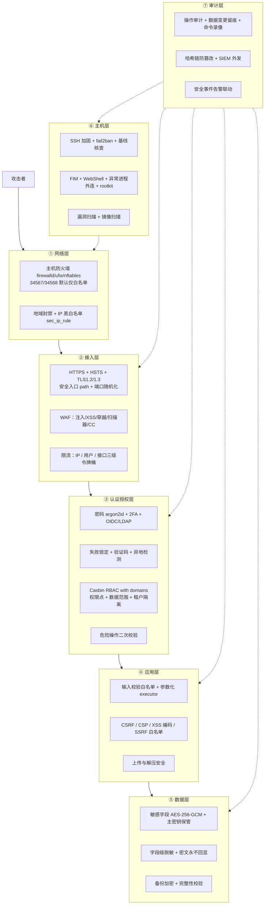
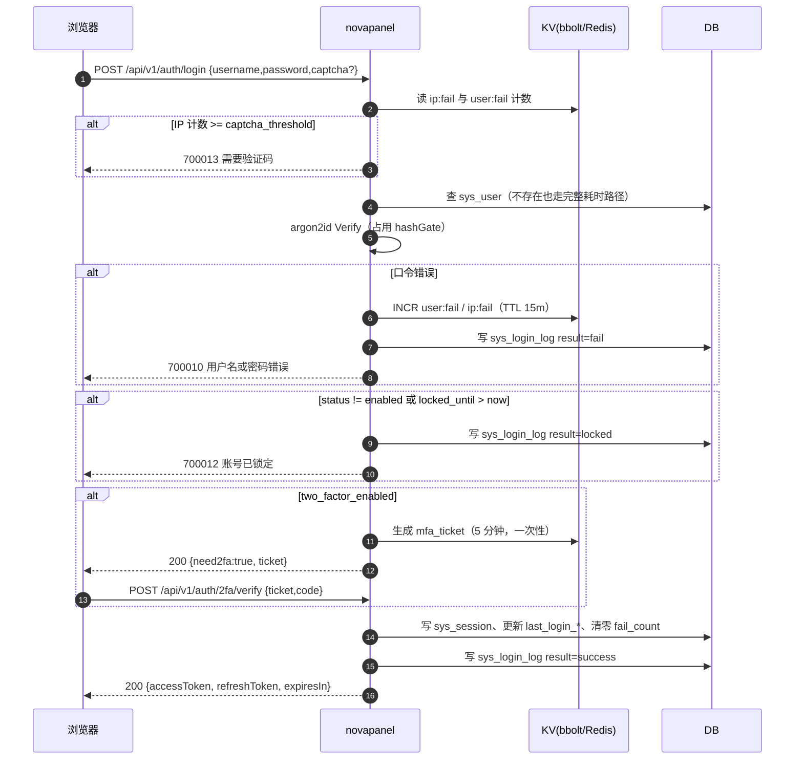
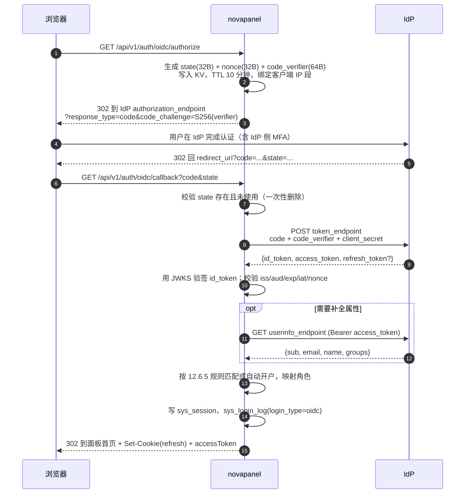
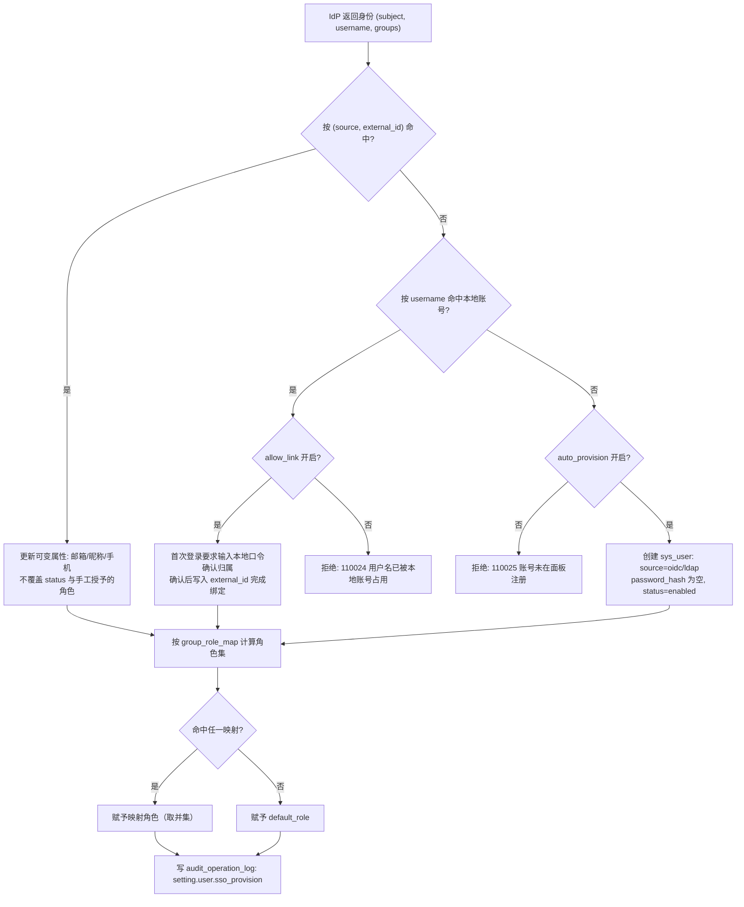
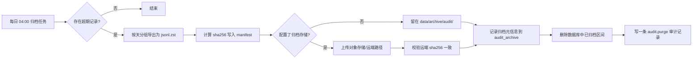

# NovaPanel（星舵面板）· 安全合规与审计

## 文档信息

| 项目 | 内容 |
| --- | --- |
| 文档名称 | 12-安全合规与审计 |
| 文档版本 | v1.0 |
| 更新日期 | 2026-08-17 |
| 状态 | 定稿 |
| 适用版本 | NovaPanel v1.0 |
| 产品代号 | nova |
| 覆盖内容 | 纵深防御分层与控制项、STRIDE 威胁建模、密码与登录防护、2FA、OIDC 与 LDAP 单点登录、API Token 与会话、Casbin RBAC with domains 模型与全量权限点、数据级权限与脱敏、操作审计与数据变更留痕、审计防篡改与合规映射、防火墙与 SSH 加固、WAF 规则集与 CC 防护、入侵检测与 FIM、漏洞扫描与 CIS 基线、数据加密、面板自身加固、供应链与安全响应、安全默认值与上线自检清单 |
| 关联文档 | [系统架构设计](./02-系统架构设计.md)、[数据库设计](./04-数据库设计.md)、[API 接口规范](./05-API接口规范.md)、[前端架构与 Arco 规范](./06-前端架构与Arco规范.md)、[网站与运行环境](./07-网站与运行环境.md)、[文件管理与 WebSSH](./08-文件管理与WebSSH.md)、[容器与编排](./09-容器与编排.md)、[多节点集群与 Agent](./10-多节点集群与Agent.md)、[监控告警与可观测](./11-监控告警与可观测.md)、[应用商店与备份恢复](./13-应用商店与备份恢复.md)、[部署安装与升级](./14-部署安装与升级.md) |

## 目录

- [12.1 安全总体设计](#121-安全总体设计)
- [12.2 威胁建模](#122-威胁建模)
- [12.3 本地账号与密码体系](#123-本地账号与密码体系)
- [12.4 登录防护](#124-登录防护)
- [12.5 双因子认证](#125-双因子认证)
- [12.6 单点登录与目录服务](#126-单点登录与目录服务)
- [12.7 API Token 与会话管理](#127-api-token-与会话管理)
- [12.8 授权体系](#128-授权体系)
- [12.9 操作审计模型](#129-操作审计模型)
- [12.10 审计埋点实现](#1210-审计埋点实现)
- [12.11 数据变更留痕](#1211-数据变更留痕)
- [12.12 审计防篡改与外部转发](#1212-审计防篡改与外部转发)
- [12.13 审计检索、导出与归档](#1213-审计检索导出与归档)
- [12.14 合规映射](#1214-合规映射)
- [12.15 防火墙与 IP 管控](#1215-防火墙与-ip-管控)
- [12.16 SSH 加固与 fail2ban](#1216-ssh-加固与-fail2ban)
- [12.17 WAF 应用防护](#1217-waf-应用防护)
- [12.18 入侵检测](#1218-入侵检测)
- [12.19 漏洞扫描与基线核查](#1219-漏洞扫描与基线核查)
- [12.20 数据安全](#1220-数据安全)
- [12.21 面板自身加固](#1221-面板自身加固)
- [12.22 供应链安全与安全响应](#1222-供应链安全与安全响应)
- [12.23 接口清单与前端页面清单](#1223-接口清单与前端页面清单)
- [12.24 安全默认值与上线自检清单](#1224-安全默认值与上线自检清单)

## 12.1 安全总体设计

### 12.1.1 安全定位

运维面板是服务器上权限最高的软件：它能读写任意文件、执行任意命令、持有所有数据库凭据。一旦被攻破，攻击者直接获得整个基础设施。因此 NovaPanel 的安全目标不是「有安全功能」，而是**假设面板自身会被攻击**，把纵深防御做在面板内部，同时对外提供主机与应用的安全能力。

两条不可妥协的产品准则：

1. **开箱即安全**：所有安全默认值取严格档（见 [12.24](#1224-安全默认值与上线自检清单)），需要用户显式降级才能变宽松，且降级必须留审计。
2. **最小权限贯穿**：Agent 不持业务凭据、执行器不接受拼接命令、Token 有作用域、角色默认只读。

### 12.1.2 纵深防御分层



各层控制项清单：

| 层 | 控制项 | 默认状态 | 实现位置 | 关联章节 |
| --- | --- | --- | --- | --- |
| ① 网络 | 面板端口仅白名单可达 | 安装时询问，默认放开但强提示 | firewalld/nftables 规则 | [12.15](#1215-防火墙与-ip-管控) |
| ① 网络 | Agent 端口 34568 仅控制面 IP 可达 | 自动写入规则 | 同上 | [12.15](#1215-防火墙与-ip-管控) |
| ① 网络 | IP 黑白名单与地域封禁 | 关闭 | `sec_ip_rule` + WAF/防火墙双执行 | [12.15](#1215-防火墙与-ip-管控) |
| ② 接入 | 强制 HTTPS + HSTS | 开启（自签引导） | Gin 中间件 | [12.20](#1220-数据安全) |
| ② 接入 | 安全入口 path | 安装时生成随机 path | 路由前缀校验中间件 | [12.21](#1221-面板自身加固) |
| ② 接入 | WAF 规则集 | 开启（拦截模式仅高危规则） | OpenResty + Lua | [12.17](#1217-waf-应用防护) |
| ② 接入 | 三级限流 | 开启 | `RateLimit` 中间件 | [12.21](#1221-面板自身加固) |
| ③ 认证 | 密码策略 12 位 + 三类字符 | 开启 | `security/password` | [12.3](#123-本地账号与密码体系) |
| ③ 认证 | 登录失败 5 次锁定 15 分钟 | 开启 | `sys_login_log` + KV 计数 | [12.4](#124-登录防护) |
| ③ 认证 | 2FA | 管理员强制、普通用户可选 | TOTP | [12.5](#125-双因子认证) |
| ③ 授权 | Casbin 鉴权中间件 | 开启（不可关闭） | `security/casbin` | [12.8](#128-授权体系) |
| ③ 授权 | 数据范围（节点/网站/租户） | 开启 | policy domain + 资源标签 | [12.8.5](#1285-数据级权限) |
| ③ 授权 | 危险操作二次校验 | 开启 | step-up token | [12.8.7](#1287-危险操作二次校验) |
| ④ 应用 | 参数白名单化 executor | 开启（不可关闭） | `internal/executor` | [12.21](#1221-面板自身加固) |
| ④ 应用 | CSP / CSRF / SSRF 防护 | 开启 | 中间件 + `httpclient` 包 | [12.21](#1221-面板自身加固) |
| ⑤ 数据 | 敏感字段加密 | 开启（不可关闭） | GORM 自定义类型 | [12.20](#1220-数据安全) |
| ⑤ 数据 | 备份加密 | 可选，默认开启 | 见 [13.11](./13-应用商店与备份恢复.md#1311-备份策略) | [12.20](#1220-数据安全) |
| ⑥ 主机 | SSH 加固建议与一键应用 | 提示，不自动改 | `sec_baseline_*` | [12.16](#1216-ssh-加固与-fail2ban) |
| ⑥ 主机 | FIM 关键文件监控 | 开启（监控不阻断） | inotify + 基线哈希 | [12.18](#1218-入侵检测) |
| ⑥ 主机 | 漏洞与基线扫描 | 每周自动 | `sec_scan_task` | [12.19](#1219-漏洞扫描与基线核查) |
| ⑦ 审计 | 全量写操作审计 | 开启（不可关闭） | Gin 中间件 + service 显式 | [12.9](#129-操作审计模型)、[12.10](#1210-审计埋点实现) |
| ⑦ 审计 | 哈希链防篡改 | 开启 | `prev_hash` | [12.12](#1212-审计防篡改与外部转发) |
| ⑦ 审计 | 命令录像 | 开启 | 见 [文件管理与 WebSSH](./08-文件管理与WebSSH.md) | [12.11](#1211-数据变更留痕) |


## 12.2 威胁建模

### 12.2.1 资产与信任边界

| 资产 | 价值 | 位置 | 信任级别 |
| --- | --- | --- | --- |
| 面板管理员会话 / JWT | 极高（等价 root） | 浏览器 + `sys_session` | 需强认证 |
| 主密钥文件 | 极高（解密全部凭据） | `/opt/novapanel/conf/master.key` 0600，root 属主 | 仅 root |
| 数据库/云存储凭据 | 高 | `*_enc` 字段 | 加密静置 |
| Agent mTLS 客户端证书 | 高（可冒充节点） | 节点 `/opt/novapanel/conf/agent.crt` | 仅 root |
| `sys_api_token` | 高（自动化入口） | 仅存 SHA-256 摘要 | 有作用域 |
| 审计日志 | 高（追责依据） | `audit_operation_log` | 只增不改 |
| 网站源码与用户数据 | 高 | 节点文件系统 | 受权限约束 |
| 备份包 | 高（含全站数据） | `bak_storage` 后端 | 加密 + 校验 |

信任边界共四条：浏览器↔控制面（HTTPS）、控制面↔Agent（mTLS gRPC）、面板进程↔宿主 OS（executor 白名单）、面板↔第三方（应用仓库、通知渠道、云存储、OIDC/LDAP）。

### 12.2.2 STRIDE 威胁清单

| # | 类别 | 威胁场景 | 影响 | 缓解措施 | 章节 |
| --- | --- | --- | --- | --- | --- |
| T01 | Spoofing | 暴力破解管理员密码 | 完全接管 | argon2id + 12 位策略 + 5 次锁定 + 验证码 | [12.3](#123-本地账号与密码体系)、[12.4](#124-登录防护) |
| T02 | Spoofing | 撞库复用弱口令 | 完全接管 | 强制 2FA（管理员）+ 弱口令字典拒绝 | [12.5](#125-双因子认证) |
| T03 | Spoofing | 伪造 Agent 接入控制面 | 注入假指标、领取任务 | mTLS 双向证书 + 节点指纹绑定 | [12.20.4](#12204-传输安全) |
| T04 | Spoofing | 伪造控制面欺骗 Agent | 下发恶意命令 | Agent 校验服务端证书 CN + 固定 CA | [12.20.4](#12204-传输安全) |
| T05 | Spoofing | 会话固定 / JWT 重放 | 越权操作 | 短期 access + 刷新轮换 + 吊销表 | [12.7](#127-api-token-与会话管理) |
| T06 | Tampering | 篡改审计日志掩盖入侵 | 无法追责 | 哈希链 + 只增表 + SIEM 外发 | [12.12](#1212-审计防篡改与外部转发) |
| T07 | Tampering | 直接改 SQLite 文件绕过面板 | 提权 | 文件 0600 + FIM 监控 + 哈希链校验 | [12.18](#1218-入侵检测) |
| T08 | Tampering | 应用仓库包被投毒 | 节点被植入后门 | minisign 签名 + sha256 校验 + 上架扫描 | [13.5](./13-应用商店与备份恢复.md#135-应用仓库与同步) |
| T09 | Tampering | 上传 WebShell 到网站目录 | 节点被控 | 上传类型白名单 + WebShell 扫描 + FIM | [12.18.3](#12183-webshell-检测) |
| T10 | Tampering | 计划任务被写入恶意命令 | 持久化后门 | cron 文件 FIM + `job_cron` 变更审计 | [12.18.5](#12185-持久化与-rootkit-检查) |
| T11 | Repudiation | 共享账号操作无法归属 | 无法追责 | 禁止共享账号 + 每请求记录 user/IP/UA | [12.9](#129-操作审计模型) |
| T12 | Repudiation | Token 操作看不出真实执行人 | 审计缺口 | Token 绑定创建者，审计记录 `actor_type` | [12.7.1](#1271-api-token-模型) |
| T13 | Info Disclosure | 接口返回明文数据库密码 | 凭据泄露 | 密文字段永不回显，只返回 `has_value` | [12.8.6](#1286-字段级脱敏) |
| T14 | Info Disclosure | 报错堆栈暴露路径与 SQL | 辅助攻击 | 生产模式统一错误码，堆栈仅入日志 | [12.21.7](#12217-错误处理与信息泄露) |
| T15 | Info Disclosure | 目录遍历读取 `/etc/shadow` | 系统信息泄露 | 路径规范化 + 根目录前缀校验 | [12.21.5](#12215-文件与上传安全) |
| T16 | Info Disclosure | 备份包被公开读取 | 全站数据泄露 | 备份 AES-256-GCM + 存储桶私有校验 | [12.20.5](#12205-备份与介质安全) |
| T17 | Info Disclosure | SSRF 探测内网与云元数据 | 凭据泄露 | 出站目标白名单 + 禁私网 + 禁 169.254 | [12.21.6](#12216-ssrf-防护) |
| T18 | DoS | 登录接口刷爆导致 CPU 打满 | 面板不可用 | argon2 并发闸门 + IP 限流 + 验证码 | [12.4.3](#1243-验证码与人机校验) |
| T19 | DoS | CC 攻击打垮托管网站 | 业务中断 | WAF CC 防护 + 人机验证 + 限速 | [12.17.6](#12176-cc-防护) |
| T20 | DoS | 恶意大文件上传占满磁盘 | 服务中断 | 单文件与总量上限 + 剩余空间预检 | [12.21.5](#12215-文件与上传安全) |
| T21 | DoS | 解压炸弹 | 磁盘耗尽 | 解压比与总大小上限 + 条目数上限 | [12.21.5](#12215-文件与上传安全) |
| T22 | Elevation | 命令拼接注入拿到 root shell | 完全接管 | executor 参数化白名单，禁 `sh -c` | [12.21.3](#12213-命令执行安全) |
| T23 | Elevation | 越权访问他人节点 | 横向移动 | Casbin domain + 数据范围过滤 | [12.8.5](#1285-数据级权限) |
| T24 | Elevation | 只读角色调用写接口 | 破坏数据 | 权限点按 action 拆分，默认拒绝 | [12.8.3](#1283-权限点清单) |
| T25 | Elevation | 低权用户自提角色 | 完全接管 | 授权接口禁止授予高于自身的角色 | [12.8.4](#1284-内置角色与权限映射) |
| T26 | Elevation | 通过 WebSSH 绕过面板权限 | 完全接管 | WebSSH 独立权限点 + 命令录像 + 高危命令拦截 | [12.11.4](#12114-命令与会话留痕) |
| T27 | Elevation | 容器挂载宿主 `/` 逃逸 | 宿主被控 | 危险挂载点黑名单 + privileged 二次确认 | [12.21.4](#12214-容器相关加固) |
| T28 | Elevation | 依赖库供应链漏洞 | 远程代码执行 | 依赖锁定 + govulncheck + SBOM | [12.22](#1222-供应链安全与安全响应) |

### 12.2.3 攻击面收敛优先级

按「可达性 × 影响」排序，P0 项在 v1.0 必须全部实现且不可关闭：

| 优先级 | 收敛动作 | 对应威胁 |
| --- | --- | --- |
| P0 | executor 参数化白名单 | T22 |
| P0 | Casbin 强制鉴权 + 默认拒绝 | T23、T24、T25 |
| P0 | 密文字段不回显 | T13 |
| P0 | 审计不可关闭 + 哈希链 | T06、T11 |
| P0 | mTLS 双向认证 | T03、T04 |
| P1 | 2FA、登录锁定、安全入口 path | T01、T02、T18 |
| P1 | SSRF 白名单、上传与解压限制 | T17、T20、T21 |
| P2 | FIM、WebShell、rootkit 检查 | T07、T09、T10 |
| P2 | 基线核查与漏洞扫描 | T28 |


## 12.3 本地账号与密码体系

### 12.3.1 sys_user 安全相关字段

```sql
CREATE TABLE sys_user (
  id            BIGINT       NOT NULL COMMENT '雪花 ID',
  username      VARCHAR(64)  NOT NULL COMMENT '登录名，小写字母数字下划线，3-32 位',
  nickname      VARCHAR(64)  NOT NULL DEFAULT '',
  email         VARCHAR(128) NOT NULL DEFAULT '',
  phone_enc     VARCHAR(255) NOT NULL DEFAULT '' COMMENT '手机号密文',
  password_hash VARCHAR(255) NOT NULL DEFAULT '' COMMENT 'PHC 字符串，SSO 用户为空',
  password_algo VARCHAR(32)  NOT NULL DEFAULT 'argon2id',
  pwd_updated_at DATETIME(3) NULL COMMENT '上次改密时间，用于过期与吊销 JWT',
  pwd_history_json TEXT      NULL COMMENT '最近 5 次口令哈希，防重复使用',
  must_change_pwd TINYINT(1) NOT NULL DEFAULT 0,
  source        VARCHAR(32)  NOT NULL DEFAULT 'local' COMMENT 'local/oidc/ldap',
  external_id   VARCHAR(191) NOT NULL DEFAULT '' COMMENT 'SSO sub 或 LDAP dn',
  status        VARCHAR(32)  NOT NULL DEFAULT 'enabled' COMMENT 'enabled/disabled/locked/pending',
  locked_until  DATETIME(3)  NULL,
  fail_count    INT          NOT NULL DEFAULT 0,
  two_factor_enabled TINYINT(1) NOT NULL DEFAULT 0,
  last_login_at DATETIME(3)  NULL,
  last_login_ip VARCHAR(45)  NOT NULL DEFAULT '',
  expire_at     DATETIME(3)  NULL COMMENT '账号有效期，到期自动禁用',
  tenant_id     BIGINT       NOT NULL DEFAULT 0,
  created_at    DATETIME(3)  NOT NULL,
  updated_at    DATETIME(3)  NOT NULL,
  deleted_at    DATETIME(3)  NULL,
  created_by    BIGINT       NOT NULL DEFAULT 0,
  PRIMARY KEY (id),
  UNIQUE KEY uk_user_name (username, tenant_id, deleted_at),
  UNIQUE KEY uk_user_ext (source, external_id, tenant_id),
  KEY idx_user_status (status)
) ENGINE=InnoDB COMMENT='面板用户';
```

`username` 与 `external_id` 的唯一键都带 `tenant_id`，保证多租户下同名不冲突；`deleted_at` 参与唯一键以允许「删除后重建同名账号」。

### 12.3.2 口令哈希算法选型

| 算法 | 抗 GPU | 内存硬 | Go 库 | 结论 |
| --- | --- | --- | --- | --- |
| MD5 / SHA-1 + salt | 差 | 无 | 标准库 | 禁用 |
| PBKDF2-SHA256 | 中 | 无 | `x/crypto/pbkdf2` | 仅兼容导入 |
| bcrypt | 良 | 弱（4KB 固定） | `x/crypto/bcrypt` | 备选，72 字节截断缺陷 |
| scrypt | 良 | 有 | `x/crypto/scrypt` | 参数难调 |
| **argon2id** | 优 | 有 | `x/crypto/argon2` | **默认** |

选定 argon2id：它同时抵抗 GPU 破解与侧信道，是 OWASP 与 RFC 9106 的推荐值。参数按「单次验证 ≈ 50-80ms、内存 64MB」标定：

| 参数 | 取值 | 说明 |
| --- | --- | --- |
| memory | 65536 KiB（64MB） | 主要成本项，内存越大 GPU 优势越小 |
| iterations（time） | 3 | RFC 9106 second recommended option |
| parallelism | 2 | 固定值，随哈希串一起存储 |
| salt | 16 字节 crypto/rand | 每用户独立 |
| keyLen | 32 字节 | 输出长度 |

低配机器（1C1G）在安装时自动降档为 memory=19456、iterations=2（RFC 9106 first option），并把实际参数写入 PHC 串，因此升级配置不影响老口令验证。

```go
// internal/security/password/argon2.go
type Params struct {
    Memory      uint32 // KiB
    Iterations  uint32
    Parallelism uint8
    SaltLen     uint32
    KeyLen      uint32
}

var Default = Params{Memory: 64 * 1024, Iterations: 3, Parallelism: 2, SaltLen: 16, KeyLen: 32}

// Hash 返回 PHC 格式字符串：
// $argon2id$v=19$m=65536,t=3,p=2$<b64salt>$<b64hash>
func Hash(plain string, p Params) (string, error) {
    if len(plain) > 1024 { // 防止超长口令引发的内存放大
        return "", ErrPasswordTooLong
    }
    salt := make([]byte, p.SaltLen)
    if _, err := rand.Read(salt); err != nil {
        return "", err
    }
    sum := argon2.IDKey([]byte(plain), salt, p.Iterations, p.Memory, p.Parallelism, p.KeyLen)
    return fmt.Sprintf("$argon2id$v=%d$m=%d,t=%d,p=%d$%s$%s",
        argon2.Version, p.Memory, p.Iterations, p.Parallelism,
        base64.RawStdEncoding.EncodeToString(salt),
        base64.RawStdEncoding.EncodeToString(sum)), nil
}

// Verify 解析 PHC 串内的参数，使用常数时间比较；
// 若哈希使用的参数低于当前 Default，返回 needRehash=true 由上层静默升级。
func Verify(plain, encoded string) (ok bool, needRehash bool, err error) {
    p, salt, want, err := parsePHC(encoded)
    if err != nil {
        return false, false, err
    }
    got := argon2.IDKey([]byte(plain), salt, p.Iterations, p.Memory, p.Parallelism, uint32(len(want)))
    if subtle.ConstantTimeCompare(got, want) != 1 {
        return false, false, nil
    }
    return true, p.Memory < Default.Memory || p.Iterations < Default.Iterations, nil
}
```

argon2 每次验证占用 64MB，必须限制并发，否则 20 个并发登录就吃掉 1.2GB：

```go
// 全局闸门，容量 = max(2, NumCPU)；获取不到直接返回 700018 系统繁忙
var hashGate = make(chan struct{}, max(2, runtime.NumCPU()))
```

### 12.3.3 密码策略

策略存于 `sec_policy`（`scope='password'`），全局唯一一行，可按租户覆盖。

| 配置项 | 键 | 默认值 | 严格档 | 说明 |
| --- | --- | --- | --- | --- |
| 最小长度 | `min_length` | 12 | 14 | 低于 8 不允许配置 |
| 最大长度 | `max_length` | 128 | 128 | 防哈希放大 |
| 字符类别数 | `min_classes` | 3 | 4 | 大写/小写/数字/符号 |
| 禁止常见弱口令 | `deny_common` | true | true | 内置 1 万条字典 |
| 禁止含用户名 | `deny_contains_username` | true | true | 忽略大小写、允许 ≥4 位子串检测 |
| 禁止键盘序列 | `deny_sequence` | true | true | `qwerty`/`123456`/`abcdef` 及反序 |
| 历史不可重用 | `history_count` | 5 | 10 | 存 `pwd_history_json` |
| 有效期 | `max_age_days` | 0（不过期） | 90 | 到期 `must_change_pwd=1` |
| 到期提醒 | `warn_days` | 7 | 14 | 登录后横幅提示 |
| 最短修改间隔 | `min_age_hours` | 24 | 24 | 防止连改绕过历史 |

强度评估用 zxcvbn 思想的轻量实现，返回 0-4 分，前端显示强度条；**分数 <2 时后端直接拒绝**，不只是前端提示。校验顺序为「长度 → 类别 → 字典 → 用户名 → 序列 → 历史」，任一失败即返回，错误码 `700011`，`message` 说明具体不满足哪一条（不回显用户输入）。

### 12.3.4 首次初始化与口令重置

安装脚本不写死默认口令。三种初始化方式：

1. **随机初始口令**：安装完成后打印到终端并写入 `/opt/novapanel/data/initial_password.txt`（0600），首次登录强制改密后自动删除该文件。
2. **安装参数指定**：`novapanel install --admin-password-stdin`，从标准输入读取，避免落在 shell history。
3. **首次访问设置**：面板处于 `pending_setup` 状态，仅接受来自 `127.0.0.1` 或安装时记录的公网 IP 的初始化请求，设置完成后状态不可回退。

忘记口令的救援路径只有本机命令行（证明拥有服务器控制权），且必须留审计：

```bash
# 重置口令（交互输入，不进 history），操作写入 audit_operation_log，actor_type=cli
novapanel user reset-password --username admin
# 临时关闭 2FA（用于 2FA 设备丢失），生成一次性 30 分钟有效的免 2FA 令牌
novapanel user disable-2fa --username admin --ttl 30m
# 列出被锁定账号并解锁
novapanel user unlock --username admin
```

面板**不提供邮件找回口令**，理由：邮件通道由用户自配 SMTP，一旦邮箱被控即等于面板被控，风险收益比不合理；企业场景应改用 OIDC 托管认证（见 [12.6](#126-单点登录与目录服务)）。


## 12.4 登录防护

### 12.4.1 登录流程



用户不存在时**也要执行一次 argon2 计算**（对固定的假哈希验证），使响应时间与真实用户一致，避免用户名枚举。

### 12.4.2 失败锁定策略

| 维度 | 键 | 阈值默认 | 窗口 | 处置 |
| --- | --- | --- | --- | --- |
| 用户 | `login:fail:u:<uid>` | 5 | 15 min | 锁定账号 15 min（写 `locked_until`） |
| 用户（长窗） | `login:fail:u24:<uid>` | 20 | 24 h | 锁定至管理员解锁，触发安全告警 |
| IP | `login:fail:ip:<ip>` | 10 | 15 min | 拒绝该 IP 登录 30 min |
| IP（枚举检测） | `login:enum:ip:<ip>` | 8 个不同用户名 | 10 min | 加入临时黑名单 60 min，写 `sec_ip_rule` |
| 全局 | `login:fail:all` | 200 | 5 min | 全局强制验证码，发「疑似撞库」告警 |

锁定采用**递增惩罚**：同一账号第 n 次触发锁定，时长为 `min(15 × 2^(n-1), 1440)` 分钟，n 在 24 小时无失败后归零。所有阈值可在 `sec_policy`（`scope='login'`）调整，但不允许把用户维度阈值设为 0（关闭）。

白名单 IP（`sec_ip_rule.action='allow'` 且 `scope='panel'`）不受 IP 维度限制，但仍受用户维度限制，避免管理员把自己锁死后无法救援；本机 `127.0.0.1` 永久豁免 IP 维度。

### 12.4.3 验证码与人机校验

| 类型 | 触发条件 | 实现 | 说明 |
| --- | --- | --- | --- |
| 无 | 失败 0-1 次 | — | 默认不打扰 |
| 图形验证码 | 失败 ≥2 次或全局告警 | `internal/security/captcha`，4 位算式，SVG 输出 | 无外部依赖，答案存 KV 2 分钟一次性 |
| 滑块 | 可选开启 | 前端轨迹 + 后端阈值 | 仅作辅助，不作唯一凭据 |
| Turnstile / hCaptcha | 可选开启 | 服务端 verify 接口 | 需出网，默认关闭 |

图形验证码为默认档，理由是面板常部署在内网/无出网环境，第三方人机验证不可用。验证码校验**在口令校验之前**，避免验证码失败仍消耗 argon2 资源。

### 12.4.4 sys_login_log 与异常登录检测

```sql
CREATE TABLE sys_login_log (
  id          BIGINT       NOT NULL,
  user_id     BIGINT       NOT NULL DEFAULT 0 COMMENT '未匹配到用户时为 0',
  username    VARCHAR(64)  NOT NULL COMMENT '原始输入，最长截断 64',
  login_type  VARCHAR(32)  NOT NULL COMMENT 'password/2fa/oidc/ldap/token/refresh',
  result      VARCHAR(32)  NOT NULL COMMENT 'success/fail/locked/2fa_fail/expired/denied',
  fail_reason VARCHAR(64)  NOT NULL DEFAULT '' COMMENT 'bad_password/no_user/captcha/ip_denied',
  ip          VARCHAR(45)  NOT NULL,
  ip_region   VARCHAR(64)  NOT NULL DEFAULT '' COMMENT 'GeoIP 归属地',
  user_agent  VARCHAR(255) NOT NULL DEFAULT '',
  device_fp   VARCHAR(64)  NOT NULL DEFAULT '' COMMENT 'UA+屏幕+时区 指纹哈希',
  session_id  BIGINT       NOT NULL DEFAULT 0,
  trace_id    VARCHAR(64)  NOT NULL DEFAULT '',
  tenant_id   BIGINT       NOT NULL DEFAULT 0,
  created_at  DATETIME(3)  NOT NULL,
  PRIMARY KEY (id),
  KEY idx_login_user_time (user_id, created_at),
  KEY idx_login_ip_time (ip, created_at),
  KEY idx_login_result (result, created_at)
) ENGINE=InnoDB COMMENT='登录日志，只增不改，保留 180 天';
```

异常登录判定规则（命中即写 `alert_event`，`category='security'`）：

| 规则 | 判定条件 | 严重级 | 动作 |
| --- | --- | --- | --- |
| 异地登录 | 成功登录的 `ip_region` 不在该用户近 30 天出现过的地区集合 | warning | 通知 + 邮件确认 |
| 新设备登录 | `device_fp` 首次出现 | info | 通知 |
| 非常用时段 | 登录时刻不在该用户历史 90% 时段区间 | info | 仅记录 |
| 短时多地 | 10 分钟内同账号出现 ≥2 个不同地区成功登录 | critical | 通知 + 可选自动踢下线 |
| 撞库特征 | 单 IP 10 分钟失败 ≥30 次 | critical | 自动封 IP 24h |
| 高危账号登录 | 拥有 `*:*:*` 的账号任何成功登录 | warning | 通知（可关闭） |

GeoIP 使用离线库（MaxMind GeoLite2-Country 或纯真 IP 库），随安装包附带，无出网需求；库缺失时 `ip_region` 留空且异地规则自动跳过，不阻断登录。


## 12.5 双因子认证

### 12.5.1 sys_two_factor 模型

```sql
CREATE TABLE sys_two_factor (
  id           BIGINT       NOT NULL,
  user_id      BIGINT       NOT NULL,
  method       VARCHAR(32)  NOT NULL COMMENT 'totp/webauthn/sms',
  secret_enc   VARCHAR(255) NOT NULL DEFAULT '' COMMENT 'TOTP 密钥密文（AES-256-GCM）',
  cred_id      VARCHAR(255) NOT NULL DEFAULT '' COMMENT 'WebAuthn credential id（base64url）',
  public_key   TEXT         NULL COMMENT 'WebAuthn COSE 公钥',
  sign_count   BIGINT       NOT NULL DEFAULT 0 COMMENT 'WebAuthn 计数器，防克隆',
  name         VARCHAR(64)  NOT NULL DEFAULT '' COMMENT '设备名，如「iPhone 上的验证器」',
  status       VARCHAR(32)  NOT NULL DEFAULT 'pending' COMMENT 'pending/active/revoked',
  recovery_json TEXT        NULL COMMENT '恢复码 bcrypt 摘要数组 + used 标记',
  last_used_at DATETIME(3)  NULL,
  last_code_step BIGINT     NOT NULL DEFAULT 0 COMMENT '上次成功的时间步，防重放',
  created_at   DATETIME(3)  NOT NULL,
  updated_at   DATETIME(3)  NOT NULL,
  PRIMARY KEY (id),
  UNIQUE KEY uk_2fa_user_method (user_id, method, cred_id),
  KEY idx_2fa_user (user_id, status)
) ENGINE=InnoDB COMMENT='双因子凭据';
```

### 12.5.2 TOTP 实现要点

| 参数 | 取值 | 说明 |
| --- | --- | --- |
| 算法 | HMAC-SHA1 | RFC 6238 默认，兼容全部主流验证器 |
| 位数 | 6 | Google/Microsoft Authenticator 通用 |
| 周期 | 30 秒 | — |
| 密钥长度 | 20 字节（Base32 32 字符） | crypto/rand 生成 |
| 时间窗容忍 | ±1 步（共 90 秒） | 兼容时钟漂移 |
| 重放防护 | `last_code_step` 必须严格递增 | 同一 code 只能用一次 |
| 尝试限制 | 5 次/10 分钟，超限锁定 | 6 位码空间仅 10^6 |

绑定流程：`POST /api/v1/user/2fa/totp/setup` 返回 `secret`（仅本次明文返回，同时以 `status='pending'` 落库）与 `otpauth://` URI，前端本地渲染二维码（**不得调用第三方二维码接口，避免密钥外泄**）；用户输入一次正确验证码后调用 `/2fa/totp/confirm` 置为 `active` 并一次性返回 10 个恢复码。绑定接口要求提供当前登录口令。

```go
// internal/security/mfa/totp.go
func Verify(secretB32 string, code string, now time.Time, lastStep int64) (step int64, ok bool) {
    key, err := base32.StdEncoding.WithPadding(base32.NoPadding).DecodeString(strings.ToUpper(secretB32))
    if err != nil {
        return 0, false
    }
    cur := now.Unix() / 30
    for _, d := range []int64{0, -1, 1} { // 先试当前步，命中率最高
        s := cur + d
        if s <= lastStep { // 已使用过的步一律拒绝
            continue
        }
        if subtle.ConstantTimeCompare([]byte(hotp(key, uint64(s))), []byte(code)) == 1 {
            return s, true
        }
    }
    return 0, false
}
```

### 12.5.3 恢复码

10 个恢复码，每个 `xxxxx-xxxxx` 共 10 位 Crockford Base32（去除易混字符 ILOU），熵约 50 bit。存储 bcrypt cost=10 摘要（数量少、无并发压力，不必用 argon2）；使用后立即标记 `used_at` 且不可重用。剩余 ≤3 个时登录后横幅提示重新生成；重新生成会作废全部旧码并写审计。恢复码可用于登录，但**用恢复码登录后强制进入 2FA 重新绑定流程**，且该会话不授予危险操作 step-up 资格。

### 12.5.4 强制策略与 WebAuthn 预留

| 用户类型 | 2FA 要求 | 宽限期 |
| --- | --- | --- |
| 拥有 `*:*:*` 或 `system:*` 的账号 | 强制 | 首次登录后 7 天内必须绑定，逾期只能访问绑定页 |
| 租户管理员 | 默认强制（可由超管关闭） | 7 天 |
| 运维工程师 | 可选，建议开启 | — |
| 只读审计员 | 可选 | — |
| API Token | 不适用（改用 IP 限制 + 短期有效） | — |

`sec_policy`（`scope='mfa'`）支持 `force_roles`（角色编码数组）、`grace_days`、`trust_device_days`（记住设备免 2FA，默认 0 即不启用，开启上限 30 天且换 IP 段即失效）。

WebAuthn/Passkey 在数据模型上已预留（`cred_id`/`public_key`/`sign_count`），v1.0 不实现注册与断言流程，v1.1 引入。预留决策：RP ID 取面板访问域名，若用户以 IP 访问则 WebAuthn 不可用，因此它只能作为 TOTP 的补充而非替代——这也是 v1.0 不把它列为 P0 的原因。


## 12.6 单点登录与目录服务

### 12.6.1 对接范围与选型

面板只做「认证外置」，不做「授权外置」：身份由 IdP 认定，权限仍由本产品的 Casbin 策略决定（见 [12.8](#128-授权体系)）。原因是权限点有 140 余个且与本产品资源模型强绑定，塞进 IdP 的 group claim 只会得到一张无人维护的映射表。

| 协议 | v1.0 | 适用场景 | 备注 |
| --- | --- | --- | --- |
| OIDC（授权码 + PKCE） | 支持 | Keycloak、Casdoor、Authing、Okta、GitLab、飞书/钉钉企业应用 | 主推方案 |
| LDAP / LDAPS | 支持 | OpenLDAP、389 Directory Server | 口令由目录校验 |
| AD（LDAP over TLS） | 支持 | Windows AD 域 | 属性映射与 LDAP 不同，见 12.6.4 |
| SAML 2.0 | 不支持 | 传统企业 IdP | XML 签名与 Canonicalization 实现风险高，v1.2 再评估 |
| CAS 3.0 | 不支持 | 高校场景 | 用户面窄，可用 IdP 桥接 |
| 裸 OAuth2（如 GitHub） | 不支持 | 开源项目自用 | 无标准 `id_token`，身份字段需逐家适配 |

同一时刻允许启用 1 个 OIDC 提供方 + 1 个 LDAP 源，不做多 IdP 并存：`sys_user` 的 `uk_user_ext (source, external_id, tenant_id)` 决定了同一自然人在多 IdP 下会产生多个账号，账号合并是一类持续的运维负担，收益不足。

### 12.6.2 OIDC 对接流程

采用授权码流程 + PKCE（S256），不使用隐式流与混合流。面板是有后端的机密客户端，本可省略 PKCE，但仍强制启用：面板经常部署在反向代理后，`redirect_uri` 被中间层日志记录的概率不低，PKCE 能把「授权码泄露」降级为无害事件。



JWKS 每 6 小时刷新一次并缓存于内存，遇到未知 `kid` 立即触发一次强制刷新（限速 1 次/分钟，防被伪造 token 打成 JWKS 拉取风暴）；IdP 不可达时**不降级为跳过验签**，直接返回 `110021 身份提供方不可用`。

### 12.6.3 OIDC 配置字段

配置存 `sec_policy`（`type='sso'`，`name='oidc'`），`client_secret` 走 `_enc` 加密字段。

| 字段 | 键 | 必填 | 默认 | 校验与说明 |
| --- | --- | --- | --- | --- |
| 启用 | `enabled` | 是 | false | 关闭时相关路由返回 404，不暴露配置痕迹 |
| 显示名 | `display_name` | 是 | 企业账号登录 | 登录页按钮文案 |
| Issuer | `issuer` | 是 | — | 必须 https（允许显式配置 http 例外，需勾选「我知晓风险」并写审计）；保存时拉取 `<issuer>/.well-known/openid-configuration` 校验可达 |
| 发现文档缓存 | `discovery_ttl` | 否 | 6h | 端点变更后手动「重新发现」立即刷新 |
| Client ID | `client_id` | 是 | — | 长度 1-255 |
| Client Secret | `client_secret_enc` | 视模式 | — | `token_endpoint_auth_method=none`（纯 PKCE 公共客户端）时可空 |
| 认证方式 | `token_auth_method` | 是 | client_secret_post | client_secret_post / client_secret_basic / none |
| Scopes | `scopes` | 是 | `openid profile email` | 必须含 `openid`；需要组映射时追加 `groups`（Keycloak 需在客户端加 group membership mapper） |
| 回调地址 | `redirect_uri` | 是 | `https://<面板域名>:34567/api/v1/auth/oidc/callback` | 只读展示 + 一键复制；必须与 IdP 侧完全一致（含端口与末尾斜杠） |
| PKCE | `pkce` | 是 | S256 | 仅允许 S256，不提供 plain 与关闭选项 |
| 用户名 claim | `claim_username` | 是 | `preferred_username` | 取空时回退 `email` 前缀，仍为空则拒绝登录 |
| 唯一标识 claim | `claim_subject` | 是 | `sub` | 落 `sys_user.external_id`，**不允许改为 email**（邮箱可变，会造成账号漂移） |
| 邮箱 claim | `claim_email` | 否 | `email` | — |
| 昵称 claim | `claim_nickname` | 否 | `name` | — |
| 组 claim | `claim_groups` | 否 | `groups` | 支持数组或空格分隔字符串；支持 `a.b.c` 点号取嵌套字段 |
| 自动开户 | `auto_provision` | 是 | true | 见 12.6.5 |
| 默认角色 | `default_role` | 是 | `readonly` | 组映射未命中时的兜底，不允许配置为 `super_admin` |
| 组映射 | `group_role_map` | 否 | `[]` | 见 12.6.5 |
| 强制 SSO | `force_sso` | 是 | false | true 时隐藏本地口令登录框（应急入口仍在，见 12.6.7） |
| 登出联动 | `rp_logout` | 是 | false | 开启后面板登出同时跳 `end_session_endpoint` |
| 时钟偏移容忍 | `clock_skew` | 是 | 60s | 上限 300s |
| 出网代理 | `http_proxy` | 否 | 空 | 面板无直接出网时使用 |

`/api/v1/auth/oidc/test` 提供不落库的联调：返回发现文档解析结果、JWKS 键数量、拼装出的完整授权 URL，以及用一次真实登录换回的 claim 原始 JSON（敏感值打码），排查 claim 名配错的效率远高于反复保存配置。

### 12.6.4 LDAP / AD 对接与属性映射

配置存 `sec_policy`（`type='sso'`，`name='ldap'`）。绑定账号使用只读服务账号，禁止用域管理员。

| 字段 | 键 | 示例（OpenLDAP） | 示例（AD） | 说明 |
| --- | --- | --- | --- | --- |
| 地址 | `url` | `ldaps://ldap.corp:636` | `ldaps://dc01.corp.local:636` | 强制 LDAPS 或 StartTLS，明文 389 需显式开启例外 |
| TLS 校验 | `tls_skip_verify` | false | false | 自签 CA 应上传 `ca_cert` 而非跳过校验 |
| Bind DN | `bind_dn` | `cn=readonly,dc=corp,dc=com` | `svc-panel@corp.local` | AD 可用 UPN 形式 |
| Bind 口令 | `bind_password_enc` | — | — | AES-256-GCM |
| 搜索基 | `base_dn` | `ou=people,dc=corp,dc=com` | `dc=corp,dc=local` | — |
| 用户过滤 | `user_filter` | `(&(objectClass=inetOrgPerson)(uid=%s))` | `(&(objectClass=user)(sAMAccountName=%s))` | `%s` 为登录名占位；由代码做 LDAP 转义后替换，禁止拼接 |
| 用户名属性 | `attr_username` | `uid` | `sAMAccountName` | 落 `sys_user.username`，转小写 |
| 唯一标识属性 | `attr_uid` | `entryUUID` | `objectGUID` | 落 `external_id`；`objectGUID` 需按小端 GUID 规则格式化后再存 |
| 邮箱属性 | `attr_email` | `mail` | `mail` | — |
| 显示名属性 | `attr_display` | `cn` | `displayName` | 落 `nickname` |
| 手机属性 | `attr_mobile` | `mobile` | `telephoneNumber` | 落 `phone_enc` |
| 组成员查询 | `group_filter` | `(&(objectClass=groupOfNames)(member=%s))` | `(&(objectClass=group)(member:1.2.840.113556.1.4.1941:=%s))` | AD 用 `LDAP_MATCHING_RULE_IN_CHAIN` 递归取嵌套组 |
| 组名属性 | `attr_group` | `cn` | `cn` | 映射输入 |
| 禁用账号判定 | `disabled_check` | `nsAccountLock` | `userAccountControl & 2` | 目录侧禁用后面板同步禁用 |
| 连接池 | `pool_size` | 5 | 5 | 上限 20 |
| 超时 | `timeout` | 5s | 5s | 连接 + 搜索合计 |
| 分页 | `page_size` | 500 | 500 | AD 默认 1000 条上限，必须走分页控制 |

登录时序为「服务账号 bind → 按 `user_filter` 搜索得到用户 DN → 用该 DN + 用户口令再 bind 校验 → 查组 → 映射角色」。用户口令**只用于第二次 bind，不落库、不缓存**，`sys_user.password_hash` 对 LDAP 用户保持为空。目录不可达时不允许用「上次成功的口令哈希」离线校验（一旦实现就等于给面板留了口令副本），改走 12.6.7 的应急入口。

### 12.6.5 自动开户与组到角色映射



组到角色的映射规则（`group_role_map`）按 `priority` 升序求值，`match` 支持 `equals`/`prefix`/`regex`：

```yaml
group_role_map:
  - { priority: 10, match: equals, value: "novapanel-superadmin", role: admin,     scope: all }
  - { priority: 20, match: equals, value: "sre",                   role: ops,       scope: all }
  - { priority: 30, match: prefix, value: "dev-team-",             role: developer, scope: group, scopeFrom: groupSuffix }
  - { priority: 40, match: regex,  value: "^audit(or)?$",          role: auditor,   scope: all }
  - { priority: 99, match: equals, value: "*",                     role: readonly,  scope: self }
```

四条硬约束，任一违反直接拒绝保存：

| 约束 | 原因 |
| --- | --- |
| 不允许映射到 `super_admin` | 该角色绕过 Casbin，一旦 IdP 组被误改就等于交出 root；必须由本地管理员手工授予 |
| `scopeFrom: groupSuffix` 解析出的分组不存在时降级为 `self` 而非 `all` | 失败方向必须朝着更小权限 |
| 每次 SSO 登录**全量重算**映射角色，删除已不匹配的映射角色 | 组被移除必须立刻收权；但通过面板手工追加的角色带 `manual=1` 标记，不受重算影响 |
| 全部映射未命中且 `default_role` 为空时拒绝登录 | 避免出现零角色的僵尸账号 |

### 12.6.6 SSO 与本地账号并存

| 场景 | 行为 |
| --- | --- |
| `force_sso=false`（默认） | 登录页同时展示口令表单与 SSO 按钮，两类账号独立 |
| `force_sso=true` | 隐藏口令表单；`source='local'` 的账号除应急入口外无法登录 |
| SSO 用户尝试口令登录 | 拒绝 `110026 该账号需通过企业账号登录`，不做「设置本地口令」的引导 |
| SSO 用户的 2FA | 由 IdP 负责；`sso_skip_2fa=true`（默认）时面板不再要求 TOTP，为 false 时叠加面板 2FA |
| IdP 侧删除用户 | 面板不主动感知，靠 `job:sso_sync`（每 6 小时）对账：LDAP 查不到或 OIDC 侧标记禁用则置 `status='disabled'`，不删除账号（保留审计关联） |
| 租户归属 | OIDC 由 `claim_tenant` 或固定值指定；未配置时归入配置该 IdP 的租户 |

降级策略遵循「认证失败即拒绝，不猜测身份」：IdP 超时、JWKS 拉取失败、`id_token` 验签失败、LDAP 连接失败，一律返回 `110021`，登录页提示「企业账号服务暂不可用，请联系管理员或使用应急入口」，并写 `sys_login_log`（`result='fail'`，`fail_reason='idp_unreachable'`）。同时触发 `alert_event`（`category='security'`，severity=critical），避免 IdP 挂了但没人知道。

### 12.6.7 应急本地登录

`force_sso=true` 且 IdP 不可用时必须有一条不依赖网络的入口，否则一次 IdP 故障会连带面板完全失控。设计原则是「拥有服务器 root 即可自救，但每一步都留痕」：

```bash
# 1. 生成一次性应急登录链接（默认 15 分钟、单次使用、绑定指定来源 IP）
novactl auth emergency-login --username admin --ttl 15m --allow-ip 203.0.113.7
#    输出 https://<host>:34567/api/v1/auth/emergency?t=<64位随机token>
# 2. 临时关闭强制 SSO（重启后仍生效，需显式恢复）
novactl auth set --force-sso=false
# 3. 查看 SSO 联调详情（发现文档、JWKS、最近 20 次失败原因）
novactl auth sso-diagnose
```

| 约束 | 取值 |
| --- | --- |
| 令牌形态 | 32 字节 crypto/rand，仅存 SHA-256 于 bbolt，进程重启不失效（防「重启后无法救援」） |
| 有效期上限 | 60 分钟，超出参数被截断 |
| 使用次数 | 1 次，用后立即删除；未使用则到期自动清理 |
| 会话权限 | 与该用户正常会话一致，但**不授予 step-up 资格**（见 [12.8.7](#1287-危险操作二次校验)），即无法执行删除类与安全策略变更类操作，只能先修 SSO 配置 |
| 生成条件 | 仅本机执行且进程 uid=0 或属 `novapanel` 组；不提供任何 HTTP 接口生成 |
| 审计 | 生成、使用、失效各写一条 `audit_operation_log`，`risk_level='high_risk'`，`actor_type='cli'`，并立即触发 critical 告警通知全部管理员 |

无论 `force_sso` 取值，`super_admin` 永远保留本地口令登录能力（若已设置口令），这是唯一不受 SSO 开关影响的账号，理由与 12.3.4 的救援路径一致：面板必须存在一条不依赖任何外部系统的控制通道。


## 12.7 API Token 与会话管理

### 12.7.1 API Token 模型

`sys_api_token` 承载两种凭据形态，二者共用一张表、由 `token_type` 区分，因为它们的生命周期管理（作用域、IP 限制、过期、吊销、审计）完全一致，拆表只会让吊销逻辑重复一遍。

| 形态 | `token_type` | 凭据 | 存储 | 适用场景 |
| --- | --- | --- | --- | --- |
| Bearer 个人访问令牌 | `bearer` | 单个不透明字符串 | 仅存 SHA-256 摘要 + 前缀 | 脚本、CI、curl、Terraform provider |
| AK/SK 签名令牌 | `hmac` | `access_key` + `secret_key` | AK 明文 + SK 密文（AES-256-GCM） | 需要防重放、跨不可信网络、要求请求完整性 |

HMAC 形态必须可逆存储 SK（验签需要原文），这是它与 Bearer 的本质差异；因此产品上默认推荐 Bearer，只在用户显式选择「签名调用」时才创建 HMAC 令牌，并在界面明示「SK 以可解密形式保存于面板数据库，安全性依赖主密钥」。

在 [数据库设计](./04-数据库设计.md) 4.5.9 基础上追加 4 个字段：

```sql
ALTER TABLE `sys_api_token`
  ADD COLUMN `token_type`   VARCHAR(16)  NOT NULL DEFAULT 'bearer' COMMENT 'bearer/hmac',
  ADD COLUMN `token_prefix` VARCHAR(32)  NOT NULL DEFAULT ''       COMMENT 'Bearer 令牌前缀，用于索引定位与界面展示',
  ADD COLUMN `token_hash`   VARCHAR(64)  NOT NULL DEFAULT ''       COMMENT 'Bearer 令牌 SHA-256（hex），hmac 型为空',
  ADD COLUMN `rotate_of`    BIGINT       NOT NULL DEFAULT 0        COMMENT '轮换来源令牌ID，用于灰度过渡',
  ADD KEY `idx_token_prefix` (`token_prefix`);
```

Bearer 令牌明文格式与生成规则：

| 组成 | 内容 | 长度 | 说明 |
| --- | --- | --- | --- |
| 固定前缀 | `nova_pat_` | 9 | 便于 GitHub secret scanning 与自建正则识别 |
| 定位段 | base62 | 12 | 落 `token_prefix`（连同固定前缀共 21 字符），建索引，用于 O(1) 定位记录 |
| 分隔符 | `.` | 1 | — |
| 秘密段 | base62（96 bit 熵） | 17 | 仅参与哈希，不落库 |
| 校验位 | base62（CRC32 前 2 位） | 2 | 前端可在提交前拦截明显的复制错误 |

示例：`nova_pat_7Kq2mB9xLp3d.aZ8Wn4Tv6Yc1RfQjE5s`。校验时按 `token_prefix` 取记录，再对秘密段做 SHA-256 与 `token_hash` 做常数时间比较——不使用 argon2，因为秘密段有 96 bit 熵，暴力破解不可行，而 API 调用是高频路径，不能承担 60ms 的哈希成本。

明文只在创建响应中返回一次（`data.plaintext`），且该字段被审计中间件的响应脱敏名单覆盖（见 [12.10.2](#12102-请求与响应脱敏)），不会落进 `audit_operation_log`。界面上关闭弹窗后仅能看到 `nova_pat_7Kq2mB9xLp3d…****`。

### 12.7.2 作用域、IP 限制与生命周期

`scope_json` 使用与权限点同构的字符串数组，支持 `*` 通配单段，**不支持跨段通配**（`security:*` 合法，`security:*:*:extra` 非法）：

| scope 写法 | 含义 | 说明 |
| --- | --- | --- |
| `["*"]` | 继承创建者全部权限 | 创建时二次确认，界面标红 |
| `["monitor:*"]` | monitor 模块全部权限点 | 展开为该模块下创建者实际拥有的权限点 |
| `["website:site:list","website:site:read"]` | 精确两个权限点 | 推荐写法 |
| `["!website:site:delete"]` | 排除项，与其他项组合 | 求值顺序：先并集，再剔除排除项 |
| `["@node:3,7"]` | 附加数据范围限制 | 与权限点条目并列，限定仅可操作节点 3、7 |

有效权限 = 创建者当前权限 ∩ scope 展开结果。**取交集而非快照**：创建者被降权后，其令牌立即同步降权；创建者被禁用或删除时，其名下全部令牌自动置 `status='disabled'`。这条规则是 T12（Token 操作看不出真实执行人）的配套约束。

| 控制项 | 字段 | 默认 | 约束 |
| --- | --- | --- | --- |
| IP 白名单 | `allow_ip_json` | 空（不限） | 支持 IPv4/IPv6 单地址与 CIDR，最多 32 条；命中失败返回 `110033`，写 `sys_login_log`（`login_type='token'`，`fail_reason='ip_denied'`） |
| 有效期 | `expire_at` | 90 天 | 界面提供 30/90/180 天与自定义；允许「永不过期」但需二次确认且列表页持续标注风险 |
| 限流 | `rate_limit_qps` | 20 | 独立令牌桶，键为 `token:<id>`，突发容量 = 2 倍 QPS |
| 只读锁 | `scope_json` 仅含 list/read/export | — | 勾选「只读令牌」时后端强制过滤掉写类 action，避免手工勾错 |
| 二次确认豁免 | 不豁免 | — | `is_sensitive=1` 的权限点通过 Token 调用时必须携带 `X-Confirm-Token`，获取方式见 [12.8.7](#1287-危险操作二次校验) |
| 到期提醒 | — | 提前 7 天 | 站内通知 + 创建者邮箱；到期后保留记录 30 天供轮换参考 |

轮换（rotate）不是「改密码」，而是「新建 + 灰度 + 停用」：`POST /api/v1/setting/token/{id}/rotate` 创建一个 `rotate_of=<原ID>` 的新令牌，继承全部配置，返回新明文；原令牌进入 `grace` 状态并在 `rotate_grace`（默认 24 小时，上限 7 天）后自动 `disabled`。宽限期内两者均可用，列表页显示「旧令牌仍有 N 次调用，最近一次 3 分钟前」，让用户能确认改完了所有调用方再彻底停用。

### 12.7.3 签名调用与验签实现

HMAC 形态的签名串构造（借鉴 AWS SigV4 但大幅简化，去掉 region/service 与派生密钥链，因为面板是单服务单区域）：

```
StringToSign =
  <HTTP-METHOD>            \n   // 大写，如 POST
  <CanonicalURI>           \n   // 路径部分，已解码后再逐段 RFC3986 编码，不含 query
  <CanonicalQueryString>   \n   // 参数按键名字节序升序，k=v 用 & 连接，键值均 RFC3986 编码，空值保留 k=
  <SignedHeadersString>    \n   // 参与签名的头，小写键名:值(去首尾空格)，每行一个，按键名升序
  <SignedHeaderNames>      \n   // 参与签名的头名，小写，分号连接，如 host;x-nova-date;x-node-id
  hex(SHA256(RequestBody))      // 空 body 取 SHA256("") 的 hex
```

请求头约定与硬性要求：

| 头 | 必填 | 示例 | 校验规则 |
| --- | --- | --- | --- |
| `X-Nova-Ak` | 是 | `nova_ak_9dK2…` | 定位令牌记录 |
| `X-Nova-Date` | 是 | `20260817T081530Z` | ISO8601 basic，UTC；与服务端时间差 > 300s 拒绝（`110035`） |
| `X-Nova-Nonce` | 是 | 32 位 hex | 与 AK 组合存 KV，TTL 310s；重复即拒绝（`110036`），防重放 |
| `X-Nova-Signature` | 是 | `hex(HMAC-SHA256(SK, StringToSign))` | 常数时间比较 |
| `X-Nova-SignedHeaders` | 是 | `host;x-nova-date;x-nova-nonce;x-node-id` | 必须包含 `host`、`x-nova-date`、`x-nova-nonce`；若请求带 `X-Node-Id` 则必须包含它 |
| `X-Nova-Body-Sha256` | 否 | hex | 提供时须与实际 body 摘要一致；流式上传场景可传 `UNSIGNED-PAYLOAD`，此时该接口被强制限流至 1 QPS |

```go
// internal/security/apisign/sign.go
package apisign

const (
    HdrAK      = "X-Nova-Ak"
    HdrDate    = "X-Nova-Date"
    HdrNonce   = "X-Nova-Nonce"
    HdrSign    = "X-Nova-Signature"
    HdrSigned  = "X-Nova-SignedHeaders"
    MaxSkew    = 300 * time.Second
    MaxBodySig = 1 << 20 // 超过 1MB 的 body 要求走 UNSIGNED-PAYLOAD，避免全量读入内存
)

// BuildStringToSign 供服务端验签与官方 SDK 共用，保证两侧算法唯一。
func BuildStringToSign(method, rawPath string, query url.Values, hdr http.Header, signed []string, bodySha string) string {
    var b strings.Builder
    b.WriteString(strings.ToUpper(method))
    b.WriteByte('\n')
    b.WriteString(canonicalURI(rawPath))
    b.WriteByte('\n')
    b.WriteString(canonicalQuery(query))
    b.WriteByte('\n')
    names := make([]string, len(signed))
    for i, n := range signed {
        names[i] = strings.ToLower(strings.TrimSpace(n))
    }
    sort.Strings(names)
    for _, n := range names {
        b.WriteString(n)
        b.WriteByte(':')
        b.WriteString(strings.TrimSpace(hdr.Get(n)))
        b.WriteByte('\n')
    }
    b.WriteString(strings.Join(names, ";"))
    b.WriteByte('\n')
    b.WriteString(bodySha)
    return b.String()
}

// Sign 计算签名；SK 由调用方从 secret_key_enc 解密得到，用后立即清零。
func Sign(sk []byte, sts string) string {
    m := hmac.New(sha256.New, sk)
    m.Write([]byte(sts))
    return hex.EncodeToString(m.Sum(nil))
}
```

```go
// internal/middleware/apitoken.go —— 验签中间件（Bearer 与 HMAC 统一入口）
func APIToken(svc *token.Service, kv kvstore.Store) gin.HandlerFunc {
    return func(c *gin.Context) {
        raw := c.GetHeader("Authorization")
        switch {
        case strings.HasPrefix(raw, "Bearer nova_pat_"):
            tk, err := svc.VerifyBearer(c, strings.TrimPrefix(raw, "Bearer "))
            if err != nil {
                response.Fail(c, err)
                c.Abort()
                return
            }
            bindToken(c, tk)
        case c.GetHeader(apisign.HdrAK) != "":
            if err := verifyHMAC(c, svc, kv); err != nil {
                response.Fail(c, err)
                c.Abort()
                return
            }
        default:
            c.Next() // 交给 JWT 中间件处理
            return
        }
        c.Next()
    }
}

func verifyHMAC(c *gin.Context, svc *token.Service, kv kvstore.Store) error {
    ts, err := time.Parse("20060102T150405Z", c.GetHeader(apisign.HdrDate))
    if err != nil || absDur(time.Since(ts)) > apisign.MaxSkew {
        return errs.New(errCodeSignExpired, "请求时间戳超出允许范围")
    }
    nonce := c.GetHeader(apisign.HdrNonce)
    ak := c.GetHeader(apisign.HdrAK)
    if len(nonce) != 32 {
        return errs.ErrInvalidParam.WithDetail("nonce 长度必须为 32")
    }
    // SetNX 语义：写入成功说明是首次出现；bbolt 实现用事务内 Get+Put 保证原子
    if ok, _ := kv.SetNX(c, "sign:nonce:"+ak+":"+nonce, []byte{1}, 310*time.Second); !ok {
        return errs.New(errCodeSignReplay, "请求已被处理，疑似重放")
    }
    tk, sk, err := svc.LoadForSign(c, ak) // 内部完成 status/expire/IP 校验并解密 SK
    if err != nil {
        return err
    }
    defer crypto.Zero(sk)
    body, err := readBodyForSign(c) // 复位 c.Request.Body 供后续 handler 读取
    if err != nil {
        return err
    }
    sts := apisign.BuildStringToSign(c.Request.Method, c.Request.URL.EscapedPath(),
        c.Request.URL.Query(), c.Request.Header,
        strings.Split(c.GetHeader(apisign.HdrSigned), ";"), body)
    if subtle.ConstantTimeCompare([]byte(apisign.Sign(sk, sts)),
        []byte(c.GetHeader(apisign.HdrSign))) != 1 {
        svc.MarkSignFail(c, tk.ID) // 连续 20 次失败自动停用令牌并告警
        return errs.New(errCodeSignInvalid, "签名校验失败")
    }
    bindToken(c, tk)
    return nil
}
```

`bindToken` 把 `actor_type='api_token'`、`token_id`、`user_id`、有效权限集写入 `gin.Context`，后续 Casbin 中间件与审计中间件读取同一份上下文，因此 Token 调用与浏览器调用走完全相同的鉴权与审计路径，不存在「Token 绕过审计」的分支。

### 12.7.4 泄露应急与吊销

| 场景 | 检测手段 | 处置 |
| --- | --- | --- |
| 令牌被推到公开仓库 | 固定前缀 `nova_pat_` 可被 GitHub secret scanning 与自建 CI 钩子识别 | 立即吊销 + 通知创建者 |
| 令牌在异常 IP 使用 | `last_used_ip` 与历史 IP 归属地突变 | 写 `alert_event`（critical），可配置自动停用 |
| 签名失败激增 | 连续 20 次验签失败 | 自动 `disabled`，需人工恢复 |
| 令牌调用越权接口 | Casbin 拒绝计数 | 单令牌 10 分钟内 403 达 50 次即停用 |
| 主密钥疑似泄露 | 人工判定 | 全量 HMAC 令牌强制失效（SK 已不可信），Bearer 令牌不受影响（只存哈希） |

三级吊销能力，全部即时生效（不依赖缓存过期）：

```bash
novactl token revoke --id 10086 --reason leaked          # 单个吊销
novactl token revoke --user alice --all --reason offboard # 按人清空（离职）
novactl token revoke --all --reason incident              # 全量吊销（应急，需 --yes-i-am-sure）
```

吊销即 `UPDATE sys_api_token SET status='disabled'` + 从 L0 内存缓存与 bbolt 缓存删除该条，并向审计写 `risk_level='high_risk'` 记录。**不做「吊销后仍可用 5 分钟」的最终一致性妥协**：令牌校验路径本来就要查一次缓存，缓存删除是 O(1) 操作，没有理由留窗口。

### 12.7.5 会话模型与 JWT 吊销

Access Token 为无状态 JWT（HS256，密钥 `security.jwt_secret`，15 分钟），Refresh Token 为不透明随机串（32 字节，仅存 SHA-256，7 天，HttpOnly + Secure + SameSite=Strict Cookie）。JWT 承载 claims：`sub`（用户ID）、`jti`、`ten`（租户）、`rol`（角色码数组）、`pwd`（`pwd_updated_at` 的 Unix 秒）、`sid`（`sys_session.id`）、`exp`/`iat`/`nbf`。

| 决策 | 选择 | 理由 |
| --- | --- | --- |
| access 是否查库 | 不查库，只查吊销名单 | 15 分钟窗口内每请求查库会让 QPS 上限被数据库锁死 |
| 吊销粒度 | `jti` 单条 + `sub+pwd` 批量 | 改密/踢人只需比对 claim 中的 `pwd` 与用户当前 `pwd_updated_at`，无需逐条写名单 |
| 权限变更 | 不进吊销名单 | 权限从 Casbin 实时读取，claim 里的 `rol` 仅用于前端菜单渲染，不作为鉴权依据 |
| refresh 轮换 | 每次刷新更换 refresh 值 | 检测到旧 refresh 被复用即判定令牌被盗，吊销整条会话族并告警 |
| 记住我 | 延长 refresh 至 30 天 | 仅延长 refresh，access 仍 15 分钟；开启时强制要求已绑定 2FA |

吊销名单采用双实现，接口统一：

```go
// internal/security/revoke/store.go
type Store interface {
    Revoke(ctx context.Context, jti string, ttl time.Duration) error
    Revoked(ctx context.Context, jti string) (bool, error)
    RevokeUser(ctx context.Context, userID int64, before time.Time) error // 写「用户级水位线」
    UserWatermark(ctx context.Context, userID int64) (time.Time, error)
}
```

| 实现 | 后端 | 键设计 | 过期回收 | 适用 |
| --- | --- | --- | --- | --- |
| `bolt.Store`（默认） | bbolt bucket `jwt_revoked` | key=`jti`，value=8 字节过期时间戳 | 每 5 分钟游标扫描删除过期键；启动时全量清理一次 | 单机 |
| `redis.Store` | Redis 7 | key=`nova:rvk:<jti>`，`SET ... EX` | 交给 Redis TTL | 多控制面实例 |

无论哪种实现，前面都套一层**内存布隆过滤器**（`bits-and-blooms/bloom/v3`，预估 10 万条、误判率 0.1%，约 175KB）。判定路径：布隆说「不存在」→ 直接放行（占绝大多数请求，零 IO）；布隆说「可能存在」→ 回查底层 Store 确认。这样把「每请求一次 bbolt 读事务」降到「每请求一次内存位运算」。布隆过滤器不支持删除，因此每 30 分钟按当前有效名单重建一次；重建期间用旧实例服务，切换为原子指针替换。

```go
func (m *Middleware) checkRevoked(ctx context.Context, cl *Claims) error {
    if m.bloom.TestString(cl.JTI) { // 可能在名单中，回查确认
        if ok, err := m.store.Revoked(ctx, cl.JTI); err != nil {
            return errs.Wrap(err, errs.ErrInternal, "吊销名单查询失败") // 查询失败按拒绝处理
        } else if ok {
            return errs.New(codeSessionRevoked, "会话已失效，请重新登录")
        }
    }
    wm, err := m.store.UserWatermark(ctx, cl.Sub) // 用户级水位线，命中率低但必须查（走 L0 缓存）
    if err == nil && !wm.IsZero() && cl.IssuedAt.Before(wm) {
        return errs.New(codeSessionRevoked, "口令或权限已变更，请重新登录")
    }
    return nil
}
```

### 12.7.6 强制下线、并发上限与记住我

| 触发原因 | `revoke_reason` | 影响范围 | 是否需重新 2FA |
| --- | --- | --- | --- |
| 用户主动登出 | `logout` | 当前会话 | — |
| 管理员踢下线 | `admin_revoke` | 指定会话或该用户全部会话 | 是 |
| 修改口令 | `password_changed` | 该用户全部会话（含当前，可选保留当前） | 是 |
| 解绑/重置 2FA | `mfa_changed` | 该用户全部会话 | 是 |
| 角色或权限变更 | 不吊销 | — | 否（Casbin 实时生效） |
| 账号被禁用/删除/到期 | `admin_revoke` | 全部会话 + 全部 API Token | — |
| 并发会话超限 | `kickout` | 最早活跃的会话 | — |
| 检测到 refresh 复用 | `token_reuse` | 整条会话族 | 是 |
| 异地登录自动处置 | `geo_anomaly` | 旧地区的会话 | 是 |

并发会话上限由 `sec_policy`（`scope='session'`）控制：

| 配置项 | 默认 | 说明 |
| --- | --- | --- |
| `max_sessions_per_user` | 5 | 0 为不限；超限时按 `last_active_at` 升序踢最早的，并向被踢端 WebSocket 推 `{"t":"kickout"}` |
| `max_sessions_per_device_type` | web:3 / cli:2 / api:0 | 分设备类型上限，`api` 型不占会话（走 Token 通道） |
| `idle_timeout` | 30min | `last_active_at` 超时即失效；终端与文件传输页通过 WebSocket 心跳维持活跃 |
| `absolute_timeout` | 12h | 绝对上限，不因活跃而延长；管理员角色缩短为 8h |
| `remember_me_days` | 30 | 记住我时的 refresh 有效期，上限 90 天；未绑 2FA 的账号不允许开启 |
| `single_session_roles` | `[]` | 列入的角色（如 `super_admin`）强制单会话，新登录挤掉旧登录 |

会话列表页展示设备、IP 与归属地、登录时间、最近活跃、当前会话标记，支持「注销其他所有会话」一键操作。`last_active_at` 采用**节流更新**：内存记录最新活跃时间，每 60 秒或会话状态变更时批量落库，避免每请求一次 UPDATE 把 SQLite 写锁占满。


## 12.8 授权体系

### 12.8.1 Casbin 模型定义

模型为 **RBAC with domains + 资源标签**：`domain` 承载租户隔离，`label` 承载数据范围（节点/网站/分组）。策略五元组的列序与 [数据库设计](./04-数据库设计.md) 4.5.14 的 `sys_casbin_rule` 字段注释严格一致（`v0=sub`、`v1=obj`、`v2=act`、`v3=eft`、`v4=scope`、`v5=dom`）。

```conf
# internal/security/authz/model.conf
[request_definition]
r = sub, obj, act, lbl, dom

[policy_definition]
p = sub, obj, act, eft, scope, dom

[role_definition]
g = _, _, _

[policy_effect]
e = some(where (p.eft == allow)) && !some(where (p.eft == deny))

[matchers]
m = g(r.sub, p.sub, r.dom) \
    && domMatch(r.dom, p.dom) \
    && objMatch(r.obj, p.obj) \
    && actMatch(r.act, p.act) \
    && labelMatch(r.lbl, p.scope)
```

| 元素 | 取值形态 | 示例 |
| --- | --- | --- |
| `r.sub` | `user:<id>`（主体恒为用户，不允许直接给用户配 p 策略） | `user:1024` |
| `r.obj` | `<module>:<resource>` | `security:waf` |
| `r.act` | 七种 action 之一 | `update` |
| `r.lbl` | 请求命中的资源标签集合，逗号分隔 | `node:7,site:31,owner:1024` |
| `r.dom` | `tenant:<id>`，单租户部署恒为 `tenant:0` | `tenant:0` |
| `p.sub` | `role:<code>` | `role:ops` |
| `p.eft` | `allow` / `deny`，deny 优先 | `deny` |
| `p.scope` | 数据范围表达式，见 [12.8.5](#1285-数据级权限) | `node:3,node:7` |
| `p.dom` | `tenant:<id>` 或 `*`（内置角色模板） | `*` |

四个自定义匹配函数注册在 `authz.NewEnforcer()` 内，全部为纯函数、无 IO，单次判定耗时在 μs 级：

| 函数 | 语义 | 实现要点 |
| --- | --- | --- |
| `domMatch(rd, pd)` | 租户匹配 | `pd == "*"` 或字符串相等；不做前缀匹配，避免 `tenant:1` 命中 `tenant:10` |
| `objMatch(ro, po)` | 资源匹配 | 支持 `*`、`module:*`；分段比较，禁止跨段通配 |
| `actMatch(ra, pa)` | 动作匹配 | 支持 `*`；`read` **不隐含** `list`，两者必须分别授予（避免「能看详情却看不到列表」的错觉式越权） |
| `labelMatch(rl, ps)` | 数据范围 | `ps` 为空或 `all` 直接通过；否则要求 `rl` 与 `ps` 至少有一个标签交集，且 `owner:` 类标签仅在 `ps` 含 `self` 时参与匹配 |

典型策略示例（`sys_casbin_rule` 行）：

```sql
-- 内置角色模板：ops 可更新 WAF 规则，任意租户生效
INSERT INTO sys_casbin_rule (ptype,v0,v1,v2,v3,v4,v5) VALUES ('p','role:ops','security:waf','update','allow','all','*');
-- 只读角色显式 deny 掉全部写动作（防止后续误加 allow 时被放行）
INSERT INTO sys_casbin_rule (ptype,v0,v1,v2,v3,v4,v5) VALUES ('p','role:readonly','*','create','deny','all','*');
-- developer 仅在节点 3、7 上有网站更新权
INSERT INTO sys_casbin_rule (ptype,v0,v1,v2,v3,v4,v5) VALUES ('p','role:developer','website:site','update','allow','node:3,node:7','tenant:0');
-- 用户 1024 在 tenant:0 域内担任 developer
INSERT INTO sys_casbin_rule (ptype,v0,v1,v2,v3,v4,v5) VALUES ('g','user:1024','role:developer','tenant:0','','','');
```

`super_admin` 不写任何 p 策略，由中间件在 Casbin 之前短路放行（`sys_user.is_super=1`）。这是有意的设计取舍：策略表损坏或迁移出错时仍保留一条可用的管理通道，代价是超管操作无法通过 Casbin 审计——但它仍然100% 走操作审计，追责链完整。

### 12.8.2 权限标识规范

标识为三段式 `module:resource:action`，全小写，多词资源用小驼峰（`ipRule`）。`module` 取值为 17 个业务模块的**全称**：

| 模块 | 前缀 | 模块 | 前缀 | 模块 | 前缀 |
| --- | --- | --- | --- | --- | --- |
| 总览 | `dashboard` | 文件管理 | `file` | 安全 | `security` |
| 集群节点 | `cluster` | 终端 | `terminal` | 审计 | `audit` |
| 网站 | `website` | 容器 | `container` | 应用商店 | `appstore` |
| 证书 | `cert` | 监控 | `monitor` | 计划任务 | `cron` |
| 数据库 | `database` | 告警与通知 | `alert` | 备份恢复 | `backup` |
| 运行环境 | `runtime` | — | — | 系统设置 | `setting` |

用户、角色、权限、令牌、会话、租户、升级均归属 `setting` 模块（与 [前端架构与 Arco 规范](./06-前端架构与Arco规范.md) 6.5.2 的 `/setting/user` → `setting:user:list` 一致）。

`action` 七种取值的判定标准，避免同类操作在不同模块落到不同 action：

| action | 判定标准 | 反例 |
| --- | --- | --- |
| `list` | 返回集合，不含敏感明细 | 不要用 `read` 表示列表 |
| `read` | 返回单个对象的完整信息（含配置、日志内容） | 详情里若含密文字段仍需 12.8.6 脱敏 |
| `create` | 产生新记录或新资源 | 上传文件属 `create` |
| `update` | 修改既有记录，含启停开关、状态流转 | 启停不用 `exec` |
| `delete` | 删除记录或资源，含清空回收站 | 软删也算 `delete` |
| `exec` | 触发副作用但不改本模块记录：命令、重载、扫描、修复、测试连通性 | 「重载 Nginx」是 `exec`，「改 Nginx 配置」是 `update` |
| `export` | 数据离开系统边界：下载文件、导出 CSV/JSON、导出录像 | 导出必须独立成点，因为它是数据泄露的主路径 |

三条命名硬约束：单个 `code` 长度 ≤ 64；同一 `module:resource` 下 action 不得重复表达同一语义；**新增权限点必须同时在 `internal/security/authz/permission_def.go`（单一数据源）登记**，CI 校验「代码中出现的权限点字符串 ⊆ 定义表」且「定义表 ⊆ 种子 SQL」，任一不满足则构建失败。

> 前缀口径说明：[数据库设计](./04-数据库设计.md) 4.18.2 的种子清单使用了 `sec`/`mon`/`dbs`/`env`/`term`/`ct`/`bak`/`job`/`ops`/`web`/`app` 等缩写前缀，属早期草稿写法。以本节全称前缀为准，`permission_def.go` 导出的 `002_permissions.sql` 覆盖旧种子；升级脚本按 `code` 做一次性重写（`UPDATE sys_permission SET code=... WHERE code=...` + `sys_role_permission.permission_code` 同步 + Casbin 全量重建）。

### 12.8.3 权限点清单

风险等级用于三处：审计 `risk_level` 初值、界面按钮配色（高/极高为红色危险按钮）、是否强制 `X-Confirm-Token`。`二确` 列为「是」的权限点对应 `sys_permission.is_sensitive=1`。

| 权限点 | 中文名 | 模块 | 风险 | 二确 |
| --- | --- | --- | --- | --- |
| `dashboard:overview:read` | 查看总览 | dashboard | 低 | 否 |
| `dashboard:overview:update` | 调整总览卡片布局 | dashboard | 低 | 否 |
| `cluster:node:list` | 节点列表 | cluster | 低 | 否 |
| `cluster:node:read` | 节点详情与指标 | cluster | 低 | 否 |
| `cluster:node:create` | 注册新节点 | cluster | 中 | 否 |
| `cluster:node:update` | 编辑节点名称、标签、分组 | cluster | 中 | 否 |
| `cluster:node:delete` | 移除节点 | cluster | 高 | 是 |
| `cluster:node:exec` | 重启 Agent / 节点重启关机 | cluster | 极高 | 是 |
| `cluster:group:list` | 节点分组列表 | cluster | 低 | 否 |
| `cluster:group:create` | 新建节点分组 | cluster | 低 | 否 |
| `cluster:group:update` | 编辑节点分组 | cluster | 低 | 否 |
| `cluster:group:delete` | 删除节点分组 | cluster | 中 | 否 |
| `cluster:token:list` | 节点注册令牌列表 | cluster | 中 | 否 |
| `cluster:token:create` | 生成节点注册令牌 | cluster | 高 | 是 |
| `cluster:batch:exec` | 批量下发命令到多节点 | cluster | 极高 | 是 |
| `cluster:secret:read` | 解码查看 Secret/ConfigMap 明文 | cluster | 高 | 是 |
| `website:site:list` | 网站列表 | website | 低 | 否 |
| `website:site:read` | 网站详情与配置文件 | website | 低 | 否 |
| `website:site:create` | 创建网站 | website | 中 | 否 |
| `website:site:update` | 修改网站配置 | website | 中 | 否 |
| `website:site:delete` | 删除网站（可含根目录与数据库） | website | 极高 | 是 |
| `website:site:exec` | 启停、重载、清缓存 | website | 中 | 否 |
| `website:domain:list` | 域名绑定列表 | website | 低 | 否 |
| `website:domain:create` | 绑定域名 | website | 中 | 否 |
| `website:domain:delete` | 解绑域名 | website | 中 | 否 |
| `website:proxy:update` | 编辑反向代理与上游 | website | 中 | 否 |
| `website:rewrite:update` | 编辑伪静态与重定向规则 | website | 中 | 否 |
| `website:log:read` | 查看访问与错误日志 | website | 低 | 否 |
| `website:log:export` | 导出网站日志 | website | 中 | 否 |
| `cert:cert:list` | 证书列表 | cert | 低 | 否 |
| `cert:cert:read` | 证书详情（不含私钥明文） | cert | 中 | 否 |
| `cert:cert:create` | 申请或上传证书 | cert | 中 | 否 |
| `cert:cert:update` | 修改续期与部署策略 | cert | 中 | 否 |
| `cert:cert:delete` | 删除证书 | cert | 高 | 是 |
| `cert:cert:exec` | 手动续期与部署到站点 | cert | 中 | 否 |
| `cert:cert:export` | 导出证书与私钥 | cert | 高 | 是 |
| `cert:acme:list` | ACME 账户与 DNS 授权列表 | cert | 中 | 否 |
| `cert:acme:update` | 配置 ACME 账户与 DNS API 凭据 | cert | 高 | 是 |
| `database:instance:list` | 数据库实例列表 | database | 低 | 否 |
| `database:instance:read` | 实例详情与参数 | database | 中 | 否 |
| `database:instance:create` | 安装或接入实例 | database | 中 | 否 |
| `database:instance:update` | 修改实例参数与 root 口令 | database | 高 | 是 |
| `database:instance:delete` | 卸载或移除实例 | database | 极高 | 是 |
| `database:instance:exec` | 启停实例、执行任意 SQL | database | 极高 | 是 |
| `database:db:list` | 库与表列表 | database | 低 | 否 |
| `database:db:create` | 创建数据库 | database | 中 | 否 |
| `database:db:delete` | 删除数据库 | database | 极高 | 是 |
| `database:account:list` | 数据库账号列表 | database | 中 | 否 |
| `database:account:update` | 创建/改密/授权数据库账号 | database | 高 | 是 |
| `database:account:delete` | 删除数据库账号 | database | 高 | 是 |
| `database:backup:export` | 导出 SQL 备份文件 | database | 高 | 是 |

| 权限点 | 中文名 | 模块 | 风险 | 二确 |
| --- | --- | --- | --- | --- |
| `runtime:runtime:list` | 运行环境列表 | runtime | 低 | 否 |
| `runtime:runtime:create` | 安装运行环境 | runtime | 中 | 否 |
| `runtime:runtime:update` | 修改环境配置与扩展 | runtime | 中 | 否 |
| `runtime:runtime:delete` | 卸载运行环境 | runtime | 高 | 是 |
| `runtime:runtime:exec` | 启停与重载环境 | runtime | 中 | 否 |
| `runtime:supervisor:list` | 进程守护列表 | runtime | 低 | 否 |
| `runtime:supervisor:update` | 新建/编辑守护进程 | runtime | 中 | 否 |
| `runtime:supervisor:exec` | 启停守护进程 | runtime | 中 | 否 |
| `file:file:list` | 目录浏览 | file | 低 | 否 |
| `file:file:read` | 读取与预览文件内容 | file | 中 | 否 |
| `file:file:create` | 新建目录、新建文件、上传 | file | 中 | 否 |
| `file:file:update` | 编辑、重命名、移动、改权限属主 | file | 高 | 否 |
| `file:file:delete` | 删除文件与目录 | file | 高 | 是 |
| `file:file:exec` | 压缩与解压 | file | 中 | 否 |
| `file:file:export` | 下载文件 | file | 高 | 否 |
| `file:recycle:list` | 回收站列表 | file | 低 | 否 |
| `file:recycle:update` | 从回收站恢复 | file | 中 | 否 |
| `file:recycle:delete` | 清空回收站 | file | 高 | 是 |
| `file:share:create` | 创建文件分享链接 | file | 高 | 是 |
| `file:share:delete` | 取消文件分享 | file | 中 | 否 |
| `terminal:session:list` | 终端会话列表 | terminal | 低 | 否 |
| `terminal:session:exec` | 打开终端会话 | terminal | 极高 | 是 |
| `terminal:session:root` | 以 root 身份打开会话 | terminal | 极高 | 是 |
| `terminal:session:delete` | 强制关闭他人会话 | terminal | 高 | 否 |
| `terminal:recording:list` | 会话录像列表 | terminal | 中 | 否 |
| `terminal:recording:read` | 回放会话录像 | terminal | 高 | 否 |
| `terminal:recording:export` | 导出会话录像 | terminal | 高 | 是 |
| `terminal:recording:delete` | 删除会话录像 | terminal | 极高 | 是 |
| `terminal:cred:list` | SSH 主机簿与凭据列表 | terminal | 中 | 否 |
| `terminal:cred:update` | 新增/编辑 SSH 凭据 | terminal | 高 | 是 |
| `terminal:cred:delete` | 删除 SSH 凭据 | terminal | 中 | 否 |
| `terminal:rule:update` | 编辑高危命令拦截规则 | terminal | 极高 | 是 |
| `terminal:share:create` | 发起会话共享与观战 | terminal | 高 | 是 |
| `container:container:list` | 容器列表 | container | 低 | 否 |
| `container:container:read` | 容器详情与 inspect | container | 中 | 否 |
| `container:container:create` | 创建容器 | container | 高 | 否 |
| `container:container:update` | 修改容器配置与重建 | container | 高 | 否 |
| `container:container:delete` | 删除容器 | container | 高 | 是 |
| `container:container:exec` | 启停、重启、进入容器 | container | 极高 | 是 |
| `container:container:export` | 导出容器日志与文件 | container | 中 | 否 |
| `container:image:list` | 镜像列表 | container | 低 | 否 |
| `container:image:create` | 拉取与构建镜像 | container | 中 | 否 |
| `container:image:delete` | 删除镜像与清理无用层 | container | 中 | 否 |
| `container:volume:list` | 数据卷与网络列表 | container | 低 | 否 |
| `container:volume:create` | 创建数据卷与网络 | container | 中 | 否 |
| `container:volume:delete` | 删除数据卷 | container | 极高 | 是 |
| `container:compose:list` | Compose 项目列表 | container | 低 | 否 |
| `container:compose:update` | 部署与更新 Compose 编排 | container | 高 | 是 |
| `container:compose:delete` | 销毁 Compose 项目 | container | 极高 | 是 |
| `container:registry:update` | 配置镜像仓库凭据 | container | 高 | 是 |
| `container:setting:update` | 修改 Docker 守护进程配置 | container | 极高 | 是 |

| 权限点 | 中文名 | 模块 | 风险 | 二确 |
| --- | --- | --- | --- | --- |
| `monitor:overview:read` | 监控概览 | monitor | 低 | 否 |
| `monitor:metric:list` | 指标字典与标签枚举 | monitor | 低 | 否 |
| `monitor:metric:read` | 时序查询与大盘渲染 | monitor | 低 | 否 |
| `monitor:metric:export` | 导出监控数据 | monitor | 中 | 否 |
| `monitor:dashboard:list` | 自定义仪表盘列表 | monitor | 低 | 否 |
| `monitor:dashboard:update` | 新建/编辑/复制仪表盘 | monitor | 低 | 否 |
| `monitor:dashboard:delete` | 删除仪表盘 | monitor | 中 | 否 |
| `monitor:probe:update` | 新建/编辑拨测任务 | monitor | 中 | 否 |
| `monitor:log:read` | 日志检索与实时 tail | monitor | 中 | 否 |
| `monitor:log:export` | 导出日志 | monitor | 高 | 是 |
| `monitor:process:list` | 进程与端口占用列表 | monitor | 低 | 否 |
| `monitor:process:exec` | 结束进程 | monitor | 极高 | 是 |
| `monitor:storage:update` | 修改监控存储与保留期 | monitor | 高 | 是 |
| `monitor:report:export` | 导出巡检报告 | monitor | 中 | 否 |
| `alert:rule:list` | 告警规则列表 | alert | 低 | 否 |
| `alert:rule:read` | 规则详情与评估状态 | alert | 低 | 否 |
| `alert:rule:create` | 新建告警规则 | alert | 中 | 否 |
| `alert:rule:update` | 编辑与启停告警规则 | alert | 中 | 否 |
| `alert:rule:delete` | 删除告警规则 | alert | 高 | 是 |
| `alert:event:list` | 告警事件列表 | alert | 低 | 否 |
| `alert:event:update` | 认领、恢复、备注事件 | alert | 低 | 否 |
| `alert:event:export` | 导出告警事件 | alert | 中 | 否 |
| `alert:silence:create` | 新建静默规则 | alert | 中 | 否 |
| `alert:silence:delete` | 删除静默规则 | alert | 中 | 否 |
| `alert:channel:list` | 通知渠道列表 | alert | 中 | 否 |
| `alert:channel:update` | 新增/编辑通知渠道与模板 | alert | 高 | 是 |
| `alert:channel:delete` | 删除通知渠道 | alert | 中 | 否 |
| `alert:channel:exec` | 发送测试通知 | alert | 低 | 否 |
| `alert:heal:exec` | 批准执行自愈动作 | alert | 极高 | 是 |
| `security:firewall:list` | 防火墙规则列表 | security | 中 | 否 |
| `security:firewall:update` | 增删改防火墙规则 | security | 极高 | 是 |
| `security:firewall:exec` | 应用/回滚防火墙快照、切换后端 | security | 极高 | 是 |
| `security:ipRule:list` | IP 黑白名单列表 | security | 中 | 否 |
| `security:ipRule:create` | 新增 IP 黑白名单 | security | 高 | 否 |
| `security:ipRule:delete` | 移除 IP 黑白名单（解封） | security | 高 | 否 |
| `security:ipRule:export` | 导出封禁清单 | security | 中 | 否 |
| `security:ssh:read` | 查看 SSH 加固配置 | security | 中 | 否 |
| `security:ssh:update` | 修改 sshd 加固项 | security | 极高 | 是 |
| `security:sshkey:list` | 授权公钥列表 | security | 高 | 否 |
| `security:sshkey:update` | 增删授权公钥 | security | 极高 | 是 |
| `security:ban:list` | 爆破封禁记录（fail2ban）列表 | security | 中 | 否 |
| `security:ban:update` | 配置 fail2ban jail 参数 | security | 高 | 是 |
| `security:waf:list` | WAF 规则列表 | security | 中 | 否 |
| `security:waf:create` | 新增自定义 WAF 规则 | security | 高 | 否 |
| `security:waf:update` | 编辑规则、切换模式与规则包 | security | 高 | 是 |
| `security:waf:delete` | 删除 WAF 规则 | security | 高 | 是 |
| `security:waflog:list` | WAF 拦截日志与看板 | security | 低 | 否 |
| `security:waflog:export` | 导出 WAF 拦截日志 | security | 中 | 否 |

| 权限点 | 中文名 | 模块 | 风险 | 二确 |
| --- | --- | --- | --- | --- |
| `security:fim:list` | 文件完整性监控项与变更列表 | security | 中 | 否 |
| `security:fim:update` | 配置监控路径与白名单 | security | 高 | 是 |
| `security:fim:exec` | 重建完整性基线 | security | 高 | 是 |
| `security:ids:list` | 入侵检测事件列表 | security | 中 | 否 |
| `security:ids:update` | 配置检测规则与阈值 | security | 高 | 是 |
| `security:ids:exec` | 执行处置（隔离文件、杀进程、封 IP） | security | 极高 | 是 |
| `security:scan:list` | 扫描任务列表 | security | 低 | 否 |
| `security:scan:read` | 扫描任务详情与报告 | security | 中 | 否 |
| `security:scan:exec` | 发起扫描（漏洞/WebShell/基线/端口） | security | 中 | 否 |
| `security:finding:list` | 扫描发现清单 | security | 中 | 否 |
| `security:finding:update` | 标记误报、忽略、处理备注 | security | 中 | 否 |
| `security:finding:exec` | 一键修复发现项 | security | 极高 | 是 |
| `security:baseline:list` | 基线核查项与结果 | security | 低 | 否 |
| `security:baseline:update` | 启停基线项、编辑期望值 | security | 高 | 是 |
| `security:baseline:exec` | 一键修复基线项与回滚 | security | 极高 | 是 |
| `security:policy:read` | 查看安全策略（口令/登录/会话/2FA） | security | 中 | 否 |
| `security:policy:update` | 修改安全策略（含降级严格档） | security | 极高 | 是 |
| `security:sso:read` | 查看 SSO 与目录服务配置 | security | 高 | 否 |
| `security:sso:update` | 修改 OIDC / LDAP 配置 | security | 极高 | 是 |
| `security:crypto:exec` | 主密钥轮换与字段重加密 | security | 极高 | 是 |
| `audit:log:list` | 操作审计列表 | audit | 低 | 否 |
| `audit:log:read` | 审计详情（含请求体与前后值） | audit | 高 | 否 |
| `audit:log:export` | 导出操作审计 | audit | 高 | 是 |
| `audit:datachange:list` | 数据变更留痕列表 | audit | 高 | 否 |
| `audit:login:list` | 登录日志列表 | audit | 低 | 否 |
| `audit:login:export` | 导出登录日志 | audit | 中 | 否 |
| `audit:chain:exec` | 执行哈希链完整性校验 | audit | 中 | 否 |
| `audit:archive:list` | 归档批次列表与恢复查询 | audit | 中 | 否 |
| `audit:archive:exec` | 触发归档与清理 | audit | 极高 | 是 |
| `audit:forward:update` | 配置 SIEM 外发（syslog/Kafka） | audit | 高 | 是 |
| `appstore:app:list` | 应用商店列表 | appstore | 低 | 否 |
| `appstore:app:read` | 应用详情与参数说明 | appstore | 低 | 否 |
| `appstore:instance:list` | 已安装应用列表 | appstore | 低 | 否 |
| `appstore:instance:create` | 安装应用 | appstore | 高 | 是 |
| `appstore:instance:update` | 升级或修改应用参数 | appstore | 高 | 否 |
| `appstore:instance:delete` | 卸载应用 | appstore | 高 | 是 |
| `appstore:instance:exec` | 启停应用 | appstore | 中 | 否 |
| `appstore:repo:update` | 新增/编辑应用源与签名公钥 | appstore | 极高 | 是 |
| `appstore:repo:exec` | 同步应用源 | appstore | 中 | 否 |
| `cron:task:list` | 计划任务列表 | cron | 低 | 否 |
| `cron:task:read` | 任务详情与执行日志 | cron | 低 | 否 |
| `cron:task:create` | 新建计划任务 | cron | 高 | 是 |
| `cron:task:update` | 编辑与启停计划任务 | cron | 高 | 是 |
| `cron:task:delete` | 删除计划任务 | cron | 中 | 否 |
| `cron:task:exec` | 立即执行一次 | cron | 高 | 否 |
| `cron:task:export` | 导出执行日志 | cron | 中 | 否 |

| 权限点 | 中文名 | 模块 | 风险 | 二确 |
| --- | --- | --- | --- | --- |
| `backup:policy:list` | 备份策略列表 | backup | 低 | 否 |
| `backup:policy:create` | 新建备份策略 | backup | 中 | 否 |
| `backup:policy:update` | 编辑备份策略与保留期 | backup | 高 | 是 |
| `backup:policy:delete` | 删除备份策略 | backup | 高 | 是 |
| `backup:task:list` | 备份记录列表 | backup | 低 | 否 |
| `backup:task:create` | 手动创建备份 | backup | 中 | 否 |
| `backup:task:delete` | 删除备份文件 | backup | 极高 | 是 |
| `backup:task:exec` | 执行恢复（覆盖现有数据） | backup | 极高 | 是 |
| `backup:task:export` | 下载备份文件 | backup | 极高 | 是 |
| `backup:storage:list` | 存储目标列表 | backup | 中 | 否 |
| `backup:storage:update` | 新增/编辑存储目标与凭据 | backup | 高 | 是 |
| `backup:storage:delete` | 删除存储目标 | backup | 高 | 是 |
| `backup:storage:exec` | 存储连通性测试 | backup | 低 | 否 |
| `setting:user:list` | 用户列表 | setting | 中 | 否 |
| `setting:user:read` | 用户详情与角色 | setting | 中 | 否 |
| `setting:user:create` | 新建用户 | setting | 高 | 是 |
| `setting:user:update` | 编辑用户、启停、改角色 | setting | 极高 | 是 |
| `setting:user:delete` | 删除用户 | setting | 极高 | 是 |
| `setting:user:exec` | 重置口令、解锁、重置 2FA | setting | 极高 | 是 |
| `setting:role:list` | 角色列表 | setting | 中 | 否 |
| `setting:role:read` | 角色详情与权限明细 | setting | 中 | 否 |
| `setting:role:create` | 新建角色 | setting | 高 | 是 |
| `setting:role:update` | 编辑角色授权与数据范围 | setting | 极高 | 是 |
| `setting:role:delete` | 删除角色 | setting | 高 | 是 |
| `setting:permission:list` | 权限点字典 | setting | 低 | 否 |
| `setting:token:list` | API Token 列表 | setting | 中 | 否 |
| `setting:token:create` | 创建 API Token | setting | 高 | 是 |
| `setting:token:update` | 编辑作用域、IP、轮换 | setting | 高 | 是 |
| `setting:token:delete` | 吊销 API Token | setting | 中 | 否 |
| `setting:session:list` | 在线会话列表 | setting | 中 | 否 |
| `setting:session:delete` | 强制下线会话 | setting | 高 | 否 |
| `setting:panel:read` | 查看面板设置 | setting | 中 | 否 |
| `setting:panel:update` | 修改面板设置（端口/入口/证书） | setting | 极高 | 是 |
| `setting:tenant:list` | 租户列表 | setting | 中 | 否 |
| `setting:tenant:update` | 新建/编辑租户与配额 | setting | 极高 | 是 |
| `setting:upgrade:read` | 查看版本与更新信息 | setting | 低 | 否 |
| `setting:upgrade:exec` | 执行面板升级与回滚 | setting | 极高 | 是 |
| `setting:license:update` | 更新许可证 | setting | 高 | 是 |
| `setting:task:list` | 异步任务列表与进度 | setting | 低 | 否 |
| `setting:task:delete` | 取消或清理异步任务 | setting | 中 | 否 |

清单共 **236** 个权限点，其中风险等级为「极高」的 38 个、「高」的 63 个，需二次确认的 85 个。数量分布特征值得注意：`security` 与 `setting` 两个模块合计占 32%，因为它们的每个动作都能直接改变系统的安全边界，粒度必须拆到最细；而 `dashboard`、`cron` 这类模块只有个位数权限点，硬拆只会增加配置负担而不增加安全性。

### 12.8.4 内置角色与权限映射

内置角色共 6 个（[数据库设计](./04-数据库设计.md) 4.18.1），其中 `super_admin` 短路放行不参与判定，实际写入 Casbin 策略的是 5 个：

| 角色 | code | 数据范围 | 定位 | 可否删改 |
| --- | --- | --- | --- | --- |
| 超级管理员 | `super_admin` | all | 绕过 Casbin，唯一可管理许可证、租户、升级 | 否 |
| 系统管理员 | `admin` | all | 除许可证、租户、升级外全部权限 | 否（可克隆后改） |
| 运维工程师 | `ops` | all | 主机与业务运维全权，无用户/角色/审计导出权 | 否 |
| 开发者 | `developer` | custom | 授权节点内的网站、运行环境、文件、终端、容器 | 否 |
| 审计员 | `auditor` | all | 全模块只读 + 审计与录像的读取导出，零写权限 | 否 |
| 只读访客 | `readonly` | all | 全模块 list/read，显式 deny 全部写动作 | 否 |

按模块的权限映射矩阵（`R` 只读=list+read，`W` 读写=含 create/update，`D` 含 delete，`X` 含 exec，`E` 含 export，`—` 无任何权限）：

| 模块 | admin | ops | developer | auditor | readonly |
| --- | --- | --- | --- | --- | --- |
| dashboard | R | R | R | R | R |
| cluster | WDX | WDX | R | R | R |
| website | WDXE | WDXE | WDXE | RE | R |
| cert | WDXE | WDXE | WX | R | R |
| database | WDXE | WDXE | W（仅库与账号） | R | R |
| runtime | WDX | WDX | WX | R | R |
| file | WDXE | WDXE | WDXE | RE | R |
| terminal | WDXE | WX（无 root、无删录像） | X（仅自己会话） | RE（录像回放导出） | R |
| container | WDXE | WDXE | WDX（无 registry、无 daemon 配置） | R | R |
| monitor | WDXE | WDXE | WX | RE | R |
| alert | WDXE | WDXE | WX | RE | R |
| security | WDX | WDX（无 `policy:update`、无 `sso:update`、无 `crypto:exec`） | — | R | R |
| audit | RE（无 `archive:exec`） | R（仅 `log:list`、`login:list`） | — | RE + `chain:exec` | R |
| appstore | WDX | WDX | WX（无 repo） | R | R |
| cron | WDXE | WDXE | WDXE | RE | R |
| backup | WDXE | WDXE | R + `task:create` | RE | R |
| setting | WDX（无 tenant/upgrade/license） | R + 自己的 token/session | 仅个人中心 | R（含 user/role 只读） | R |

三条不可绕过的授权约束，实现在 service 层而非仅前端：

| 约束 | 实现 | 违反时错误码 |
| --- | --- | --- |
| 不得授予超出自身的权限 | 授权提交时计算 `目标权限集 - 操作者权限集`，非空即拒 | `120004` |
| 不得修改自己的角色与状态 | `targetUserID == currentUserID && (改角色 或 改 status)` 直接拒绝 | `120005` |
| 不得删除或降权最后一个 `super_admin` | 提交前统计启用状态的超管数量，`< 1` 即拒 | `120006` |
| 内置角色的权限集不可编辑 | `is_builtin=1` 时仅允许改 `name`/`description`，权限项只读 | `120007` |

界面提供「克隆角色」：以内置角色为模板生成自定义角色再调整，这是唯一推荐的自定义授权路径，避免用户为了改一条权限而尝试编辑内置角色。

### 12.8.5 数据域与多租户隔离

权限点回答「能做什么」，数据域回答「对哪些对象能做」。两者是 AND 关系，缺一不可。

| 数据域类型 | 语义 | 实现 |
| --- | --- | --- |
| `all` | 全部对象 | 不加过滤条件 |
| `node` | 指定节点集合内的对象 | 查询注入 `node_id IN (...)`，跨节点操作逐节点校验 |
| `group` | 指定节点组子树内的对象 | 展开组树得到节点集合，同 `node` |
| `tenant` | 所属租户内的对象 | 注入 `tenant_id = ?`，由全局 GORM Scope 强制 |
| `resource` | 显式授权的资源列表（如指定站点） | 注入 `id IN (...)`，用于把某个站点交给外包 |
| `self` | 仅自己创建的对象 | 注入 `created_by = ?` |

数据域的落地点在 repository 层而非 handler 层，通过 GORM 的全局 Scope 注入，业务代码无需在每个查询里手写过滤条件：

```go
// internal/repository/scope.go
func DataScope(ctx context.Context) func(*gorm.DB) *gorm.DB {
    return func(db *gorm.DB) *gorm.DB {
        p := auth.FromContext(ctx)
        if p == nil { return db.Where("1=0") }        // 无主体信息一律查不到，fail-closed
        if p.TenantID != 0 { db = db.Where("tenant_id = ?", p.TenantID) }
        if p.IsSuperAdmin { return db }
        switch p.Scope.Type {
        case auth.ScopeAll:
            return db
        case auth.ScopeNode, auth.ScopeGroup:
            if len(p.Scope.NodeIDs) == 0 { return db.Where("1=0") }
            return db.Where("node_id IN ?", p.Scope.NodeIDs)
        case auth.ScopeResource:
            return db.Where("id IN ?", p.Scope.ResourceIDs)
        case auth.ScopeSelf:
            return db.Where("created_by = ?", p.UserID)
        default:
            return db.Where("1=0")
        }
    }
}
```

三处必须注意的细节：`p == nil` 时返回 `1=0` 而不是放行（fail-closed 原则，中间件遗漏时表现为查不到数据而非泄露数据）；`default` 分支同样 fail-closed（新增数据域类型忘记实现时不会意外放开）；`tenant_id` 过滤在超管判断之前（超管也不能跨租户看数据，跨租户需要显式切换租户上下文）。

不含 `node_id` 字段的表（如 `sys_user`、`audit_operation`）不适用节点数据域，它们的隔离靠 `tenant_id` 与权限点本身。CI 中有一条检查：所有带 `node_id` 的表的 repository 方法必须调用 `DataScope`，遗漏即失败（`make lint-datascope`，基于 AST 分析）。

### 12.8.6 权限缓存与实时失效

Casbin 每次 `Enforce` 都要遍历策略，用户数与权限点数增长后成为热点。缓存策略：

| 层级 | 内容 | 失效方式 |
| --- | --- | --- |
| L1 进程内 | `userID → 权限点 Set + 数据域`，TTL 5 分钟，LRU 上限 5000 | 权限变更时按 userID 精确删除 |
| L2 Casbin 内部 | Casbin 自带的 `EnableAutoSave` + 内存策略 | 策略变更时 `LoadPolicy` 重载 |
| L3 前端 | 登录时下发的权限点列表，存 Pinia（不持久化到 localStorage） | 收到 `auth.permission_changed` WebSocket 事件时重新拉取 |

权限变更的实时生效链路：修改角色或用户授权 → 更新 `sys_role_permission` → Casbin `LoadPolicy` → 删除受影响用户的 L1 缓存 → 广播 `auth.permission_changed` 事件（多实例经 Redis Pub/Sub）→ 前端收到后重新拉取权限并刷新菜单 → 若当前页面已无权限访问则跳转到 403 页。

被降权的用户不强制下线，但会立即失去新权限：正在进行的操作若已通过鉴权则允许完成（避免中途失败留下半成品），下一次请求即按新权限判定。撤销角色与禁用账号则不同——后者立即吊销全部会话（`sys_session` 标记失效 + WebSocket 关闭码 4003），因为「禁用账号」的语义就是立即断开。

```go
// internal/middleware/authz.go
func Authz(perm string) gin.HandlerFunc {
    return func(c *gin.Context) {
        p := auth.FromContext(c.Request.Context())
        if p == nil { response.Fail(c, errs.ErrUnauthorized); return }
        if p.IsSuperAdmin { c.Next(); return }              // 短路，不进 Casbin
        allowed, err := authz.Check(c.Request.Context(), p, perm, c.GetHeader("X-Node-Id"))
        if err != nil {                                      // 鉴权器故障一律拒绝，不降级放行
            slog.Error("authz failed", "err", err, "perm", perm, "user", p.UserID)
            response.Fail(c, errs.New(120001))
            return
        }
        if !allowed {
            audit.Denied(c, perm)                            // 拒绝也要记审计，用于发现越权尝试
            response.Fail(c, errs.ErrForbidden.WithField("permission", perm))
            return
        }
        c.Next()
    }
}
```

鉴权器故障时拒绝而非放行，与限流中间件故障时放行（见 [API接口规范](./05-API接口规范.md) 5.6.1）的处理方向相反，这是有意的：限流失效的后果是可用性风险，鉴权失效的后果是安全事故，两者的默认取向必须不同。

### 12.8.7 越权防护的纵深措施

| 措施 | 说明 |
| --- | --- |
| 水平越权（改 ID 访问他人资源） | 数据域在 repository 层强制注入，改 URL 里的 ID 查不到即返回 404 而非 403（不暴露资源存在性） |
| 垂直越权（提权） | 授权不得超出自身权限（`120004`）；角色权限集变更需 `security:role:update` 且记审计 |
| 参数污染 | `tenant_id`、`created_by`、`node_id` 等归属字段在请求体中一律忽略，只从上下文取值；DTO 中这些字段不存在（结构体不定义即无法绑定） |
| 批量接口的逐项校验 | 批量操作不因「已通过一次鉴权」就跳过逐项数据域校验，1000 个 ID 逐个校验（用一次 `IN` 查询批量确认归属） |
| 危险操作二次确认 | `X-Confirm-Token` 绑定操作类型 + 目标 ID + 用户 ID，5 分钟有效且一次性，防止 CSRF 与重放 |
| 越权尝试监测 | 连续 5 次 403 触发 `security.privilege_escalation_attempt` 事件并通知管理员 |
| 前端不作为安全边界 | 前端隐藏按钮只是体验优化，所有权限判定在服务端重复执行；E2E 测试中有专门用例用低权账号直接调高权接口，验证服务端拦截 |

最后一条对应一组必须存在的测试：`test/e2e/authz_bypass_test.go` 用 `readonly` 账号的 token 逐个调用所有写接口，断言全部返回 403。这组测试的用例数量等于写接口数量，由脚本从路由表自动生成，新增接口若忘记加权限中间件会立刻在 CI 中暴露。

## 12.9 操作审计模型

### 12.9.1 审计的四类记录

审计不是单一的日志表，四类记录的产生方式、保留期与查询模式差异很大，混在一张表里会导致查询性能与保留策略都无法优化。

| 类型 | 表 | 记录内容 | 默认保留 | 产生方式 |
| --- | --- | --- | --- | --- |
| 操作审计 | `audit_operation` | 谁在何时对什么对象做了什么、结果如何 | 180 天 | 中间件自动 + service 层补充 |
| 登录审计 | `audit_login` | 登录、登出、2FA、失败原因、SSO 来源 | 365 天 | 认证流程显式记录 |
| 数据变更 | `audit_change` | 关键对象的字段级前后值 diff | 180 天 | GORM Hook 自动 |
| 会话录像 | `term_session_record` | WebSSH 的完整输入输出流 | 90 天 | 终端通道旁路写入 |

登录审计保留最久（365 天）是合规要求的常见项；会话录像最短（90 天）是因为体积最大。四类都支持独立配置保留期与归档策略，且删除保留期设有下限（操作审计不得低于 30 天、登录审计不得低于 90 天），管理员不能把审计保留期改成 1 天来规避留痕。

### 12.9.2 操作审计的数据模型

```go
// internal/model/audit.go
type AuditOperation struct {
    ID          int64      `gorm:"primaryKey"`                 // 雪花 ID，天然按时间有序
    TenantID    int64      `gorm:"index:idx_tenant_time,priority:1"`
    OccurredAt  time.Time  `gorm:"index:idx_tenant_time,priority:2;index:idx_time"`
    TraceID     string     `gorm:"size:32;index"`              // 与 X-Request-Id 一致，串联多条记录

    // 主体：谁
    ActorType   string     `gorm:"size:16"`                    // user | token | system | agent
    ActorID     int64      `gorm:"index"`
    ActorName   string     `gorm:"size:64"`                    // 冗余存储，用户改名或删除后审计仍可读
    ActorIP     string     `gorm:"size:45"`
    ActorUA     string     `gorm:"size:256"`
    AuthMethod  string     `gorm:"size:16"`                    // password | 2fa | sso | token | apikey

    // 动作：做了什么
    Module      string     `gorm:"size:24;index:idx_module_action"`
    Action      string     `gorm:"size:48;index:idx_module_action"` // 与权限点的 action 一致
    Permission  string     `gorm:"size:64"`                    // 触发时校验的权限点
    Danger      string     `gorm:"size:8"`                     // low | medium | high

    // 对象：对什么
    NodeID      int64      `gorm:"index"`
    TargetType  string     `gorm:"size:32;index:idx_target"`   // site | database | container | user ...
    TargetID    string     `gorm:"size:64;index:idx_target"`
    TargetName  string     `gorm:"size:256"`                   // 同样冗余，对象删除后仍可读

    // 结果
    Result      string     `gorm:"size:16;index"`              // success | failed | denied | partial
    ErrorCode   int        `gorm:"index"`
    ErrorMsg    string     `gorm:"size:512"`
    DurationMs  int64

    // 上下文
    Method      string     `gorm:"size:8"`
    Path        string     `gorm:"size:256"`
    Params      string     `gorm:"type:text"`                  // 脱敏后的请求摘要 JSON
    Extra       string     `gorm:"type:text"`                  // 模块自定义补充字段 JSON
    Chain       string     `gorm:"size:64"`                    // 防篡改哈希链，见 12.12
    PrevChain   string     `gorm:"size:64"`
}
```

设计上的三个关键决定：

`ActorName` 与 `TargetName` 冗余存储而不是靠外键关联。审计记录必须在关联对象被删除后仍然完整可读——「张三删除了站点 blog.example.com」这条记录在张三账号被删、站点被删之后依然要能读出人名与站点名，否则审计价值大打折扣。这是审计表刻意违反范式的地方。

`TargetID` 用 `string` 而非 `int64`，因为目标可能是容器 ID（64 位 hex）、文件路径、镜像名等非数值标识。查询时按 `(TargetType, TargetID)` 组合索引。

`Result` 包含 `denied`（越权被拒），这类记录同等重要——安全事件调查中「谁尝试过做什么但被拒了」往往比成功操作更有价值。

### 12.9.3 记录范围与豁免

不是所有请求都记审计。记录规则按「是否改变状态」与「是否敏感」双维度判定：

| 类别 | 是否记录 | 说明 |
| --- | --- | --- |
| 所有写操作（POST/PUT/PATCH/DELETE） | 是 | 无豁免 |
| 危险读操作 | 是 | 查看密码、下载证书私钥、导出审计、读取配置中的凭据、下载备份 |
| 敏感对象的普通读操作 | 是 | 用户列表、角色权限、API Token 列表、SSO 配置 |
| 普通读操作（列表、详情） | 否 | 量太大且价值低；确需全量读审计的合规场景可开启「全量审计模式」 |
| 实时数据轮询（指标、状态） | 否 | 高频且无价值，开启全量审计模式也不记 |
| 健康检查、静态资源 | 否 | |
| WebSocket 订阅 | 否（订阅本身不记） | 但通过 WS 触发的操作（如终端命令）按终端审计单独处理 |
| 鉴权失败（403） | 是 | `Result=denied` |
| 认证失败（401） | 是（记入 `audit_login`） | 不重复记入操作审计 |
| 限流拒绝（429） | 否 | 计入指标而非审计，避免被刷接口时审计表爆炸 |

「全量审计模式」是给等保三级、金融等合规场景的开关，开启后所有读操作也记录，同时提示存储增长预估（约 20 倍）。默认关闭。

### 12.9.4 敏感字段脱敏

`Params` 字段存请求摘要，必须脱敏后再落库。脱敏规则集中定义，不允许各模块自行处理：

```go
// internal/audit/sanitize.go
var sensitiveKeys = []string{  // 大小写不敏感、子串匹配
    "password", "passwd", "pwd", "secret", "token", "apikey", "api_key",
    "privatekey", "private_key", "passphrase", "credential", "authorization",
    "accesskey", "access_key", "secretkey", "secret_key", "clientsecret",
    "cookie", "session", "otp", "totp", "recoverycode", "sshkey", "cert_key",
}

func Sanitize(v any) string {
    b, err := json.Marshal(v)
    if err != nil { return `{"_error":"marshal failed"}` }
    if len(b) > maxParamBytes { // 8 KB
        b = append(b[:maxParamBytes], []byte(`..."_truncated":true}`)...)
    }
    var m any
    if json.Unmarshal(b, &m) != nil { return `{"_error":"unmarshal failed"}` }
    walk(&m, func(key string, val any) any {
        if matchSensitive(key) { return "***" }
        if s, ok := val.(string); ok && looksLikeSecret(s) { return "***" }  // 兜底：高熵长字符串
        return val
    })
    out, _ := json.Marshal(m)
    return string(out)
}
```

除了按 key 匹配，还有 `looksLikeSecret` 的兜底判定（长度 > 32 且香农熵 > 4.0 的字符串一律打码），用于捕获字段名不在清单里的凭据。宁可多打码几个无害字段，也不能让一个密钥进审计表——审计表通常有更多人可读，是凭据泄露的高危路径。

对应的测试要求：`internal/audit/sanitize_test.go` 中有一组用例遍历所有 DTO 结构体（反射获取字段名），断言任何名字命中 `sensitiveKeys` 的字段在脱敏后为 `***`。新增 DTO 带密码字段但忘记处理时，测试会失败。

## 12.10 审计埋点实现

### 12.10.1 三层埋点策略

审计埋点的核心矛盾是：全靠中间件自动记录则缺少业务语义（只知道调了 `POST /websites`，不知道建的是哪个域名）；全靠 service 层手写则必然遗漏。NovaPanel 用三层叠加：

| 层次 | 记录内容 | 遗漏风险 | 实现 |
| --- | --- | --- | --- |
| 中间件（兜底层） | HTTP 语义：方法、路径、状态、耗时、主体、脱敏参数 | 无（路由注册即覆盖） | `middleware.Audit()` |
| service（语义层） | 业务语义：目标类型与名称、危险等级、模块自定义 Extra | 有，靠 lint 检查 | `audit.Enrich(ctx, ...)` |
| GORM Hook（变更层） | 字段级前后值 diff | 无（模型注册即覆盖） | 见 12.11 |

中间件先写一条基础记录到 `context` 中携带的 `*audit.Entry`，service 层通过 `audit.Enrich` 往同一个 Entry 上补充语义字段，请求结束时由中间件统一落库。**一次请求只产生一条操作审计**，避免同一操作出现两条记录导致审计条数与实际操作数不对应。

### 12.10.2 中间件实现

```go
// internal/middleware/audit.go
func Audit(sink audit.Sink, reg *audit.Registry) gin.HandlerFunc {
    return func(c *gin.Context) {
        rule := reg.Match(c.Request.Method, c.FullPath())
        if rule.Skip {
            c.Next()
            return
        }

        e := &audit.Entry{
            OccurredAt: time.Now(),
            TraceID:    requestid.From(c),
            Method:     c.Request.Method,
            Path:       c.FullPath(),          // 用路由模板而非实际 URL，避免把 ID 拼进去导致无法聚合
            Module:     rule.Module,
            Action:     rule.Action,
            Permission: rule.Permission,
            Danger:     rule.Danger,
            TargetType: rule.TargetType,       // 从路由元信息推导的默认值
            TargetID:   c.Param(rule.IDParam), // 路径参数中的 ID
            NodeID:     nodectx.From(c),
        }
        if rule.RecordBody {
            e.Params = audit.Sanitize(bodycache.Peek(c, audit.MaxBodyBytes))
        } else {
            e.Params = audit.Sanitize(c.Request.URL.Query())
        }
        ctx := audit.NewContext(c.Request.Context(), e)
        c.Request = c.Request.WithContext(ctx)

        defer func() {
            if r := recover(); r != nil {
                e.Result, e.ErrorCode = "failed", errs.CodeInternal
                e.ErrorMsg = fmt.Sprintf("panic: %v", r)
                finish(e, c, sink)
                panic(r) // 交还给 Recovery 中间件，审计不改变 panic 传播
            }
        }()

        c.Next()
        finish(e, c, sink)
    }
}

func finish(e *audit.Entry, c *gin.Context, sink audit.Sink) {
    if e.Committed() { return }              // 幂等，避免 panic 路径与正常路径重复写
    if p := auth.FromGin(c); p != nil {
        e.ActorType, e.ActorID, e.ActorName = p.ActorType, p.UserID, p.Name
        e.AuthMethod, e.TenantID = p.AuthMethod, p.TenantID
    } else {
        e.ActorType, e.ActorName = "anonymous", "-"
    }
    e.ActorIP, e.ActorUA = clientip.From(c), truncate(c.GetHeader("User-Agent"), 256)
    e.DurationMs = time.Since(e.OccurredAt).Milliseconds()
    e.Result, e.ErrorCode, e.ErrorMsg = resultOf(c)
    sink.Submit(e)
}
```

三处细节值得说明。`Path` 用 `c.FullPath()`（路由模板 `/api/v1/websites/:id`）而不是实际 URL，让「所有对站点的删除操作」可以按 path 聚合统计；实际 ID 单独存在 `TargetID`。`recover` 分支保证 panic 也留痕并且不吞掉 panic——审计中间件不应该改变错误传播行为。`Committed()` 保证幂等，因为 panic 路径与 `c.Next()` 之后的正常路径都可能走到 `finish`。

### 12.10.3 语义补充

service 层用 `audit.Enrich` 补充中间件拿不到的信息：

```go
// internal/service/website/create.go
func (s *Service) Create(ctx context.Context, req *dto.CreateWebsiteReq) (*dto.WebsiteResp, error) {
    site, err := s.build(ctx, req)
    if err != nil {
        return nil, err
    }
    audit.Enrich(ctx, audit.With{
        TargetType: "site",
        TargetID:   strconv.FormatInt(site.ID, 10),
        TargetName: site.PrimaryDomain,
        Extra: map[string]any{
            "type": site.Type, "runtime": site.RuntimeVersion,
            "domains": site.Domains, "ssl": site.SSLEnabled,
        },
    })
    return s.persist(ctx, site)
}
```

`Enrich` 在 `ctx` 中没有 Entry 时静默返回（单元测试、后台任务等场景不必构造 Entry），因此可以无条件调用。它只做字段合并，不落库，也不返回错误——审计埋点绝不能因为自身问题让业务失败。

哪些操作必须 `Enrich` 由 `make lint-audit` 静态检查：扫描所有注册为写操作且 `Danger != "low"` 的路由，追踪其 handler 调用的 service 方法，若方法体内没有 `audit.Enrich` 调用则报错。高危操作缺少目标名称的审计记录基本等于无效记录，所以这条检查是硬门禁。

### 12.10.4 异步落库与不丢失保证

审计写入不能拖慢请求，也不能丢。`Sink` 用有界队列 + 批量落库 + 溢出降级：

| 参数 | 默认值 | 说明 |
| --- | --- | --- |
| 队列容量 | 4096 | 内存约 8 MB 上限 |
| 批量大小 | 200 | 或 1 秒超时，先到先触发 |
| 写失败重试 | 3 次，退避 100ms/500ms/2s | |
| 队列满行为 | **同步阻塞写入**，最长等待 3 秒 | 不丢弃 |
| 阻塞超时后 | 落地到 `logs/audit-overflow.jsonl` 并告警 | |
| 进程退出 | `Close()` 阻塞 flush，最长 10 秒 | systemd `TimeoutStopSec` 留够 |

队列满时选择阻塞而不是丢弃，这是与普通业务日志相反的取舍：业务日志丢几条无所谓，审计日志丢了就是合规缺陷，而且丢的往往正是攻击者高频操作产生的那批。阻塞 3 秒后仍写不进去则退到本地文件，并触发 `security.audit_backlog` 告警——此时说明数据库已经严重异常，而本地文件是最后一道防线，`novactl audit import-overflow` 可在恢复后回灌。

审计数据库写入失败到达连续 10 次时，面板进入「审计不可用」状态：所有 `Danger == "high"` 的操作直接拒绝（`710006`），中低危操作继续放行。理由是高危操作没有留痕地执行，对合规场景是不可接受的；但让整个面板不可用又会阻断故障恢复本身。这个行为可以在配置里关掉（`security.audit.blockHighRiskOnFailure: false`），但默认开启并在界面上明示当前状态。

### 12.10.5 跨节点操作的审计归属

集群操作的审计有两处记录：控制面记「谁下发了什么」，节点侧记「实际执行了什么」。两者必须能对上，否则无法回答「这台机器上的这个改动是谁做的」。

实现依赖 10.17.4 定义的透传契约：`X-Request-Id` 与 `Actor`（操作人 ID、姓名、租户、来源 IP）随 `NodeInvoker` 请求一并下发到 Agent，Agent 侧写入本地审计文件的 `actor` 字段是真实操作人而非「控制面」。具体规则：

| 场景 | 控制面记录 | 节点侧记录 | 关联方式 |
| --- | --- | --- | --- |
| 单节点操作 | 一条，`NodeID` 为目标节点 | 一条，`actor` 为真实操作人 | 相同 `TraceID` |
| 批量任务 | 一条父记录（`TargetType=task`）+ 每节点一条子记录 | 每节点一条 | 父 `TraceID` + `taskId` |
| 计划任务触发 | 一条，`ActorType=system`，`Extra.cronId` 指向任务定义 | `actor` 为任务创建者 | `TraceID` |
| Agent 自主行为（自愈、重连） | 不记操作审计 | 记本地事件 | 上报为监控事件而非审计 |
| 内置节点 | 一条 | 与控制面共库，不重复写 | 同一条 |

计划任务的 `actor` 在节点侧记为任务创建者而非 `system`，因为「这个改动的责任人」在追责语义上是配置这个任务的人。控制面侧则记 `system` 并通过 `Extra.cronId` 保留线索——两侧视角不同但都指向同一个人，不冲突。

Agent 侧审计文件（`/opt/novapanel/logs/agent-audit.jsonl`，保留 30 天）在控制面不可达时仍持续写入。这是刻意的冗余：**攻击者若拿到控制面并清理审计，节点侧仍有独立副本**；反之亦然。两侧记录的一致性由 `novactl audit reconcile --node <id> --since <ts>` 比对，输出只在一侧存在的记录清单，是入侵调查的关键工具。

## 12.11 数据变更留痕

### 12.11.1 留痕范围

字段级 diff 的存储成本高，只对「改错了会造成事故、且事后需要知道原值」的对象开启。判定标准不是「重要」而是「是否需要恢复原值或追溯变更过程」：

| 对象 | 留痕 | 理由 |
| --- | --- | --- |
| 用户、角色、权限绑定 | 是 | 权限变更是审计重点 |
| 节点、分组、标签 | 是 | 影响数据域 |
| 网站、域名、伪静态、SSL 配置 | 是 | 改错直接影响线上 |
| 数据库账号与授权 | 是 | 权限相关 |
| 计划任务、备份策略 | 是 | 静默改动危害大（如把备份周期改成永不执行） |
| 告警规则、通知通道 | 是 | 改动会导致告警静默 |
| 安全配置（防火墙、WAF、2FA 策略） | 是 | 安全基线变更 |
| 面板全局设置 | 是 | |
| 容器与镜像 | 否 | 状态本身在 Docker 侧，面板不是事实来源 |
| 监控指标、时序数据 | 否 | 只追加不修改 |
| 文件内容 | 否（走文件版本，见 08 号） | diff 存文本内容会让审计表膨胀失控 |
| 审计表自身 | 否（不可修改） | |

对不留痕的对象，操作审计仍然记录（知道「谁改了容器 X」），只是没有字段级前后值。

### 12.11.2 GORM Hook 实现

```go
// internal/audit/change.go
type Auditable interface {
    AuditTargetType() string
    AuditTargetName() string
}

// 需要留痕的模型嵌入这个结构体
type ChangeTracked struct {
    snapshot map[string]any `gorm:"-"`  // 未导出，不参与序列化与建表
}

func (c *ChangeTracked) AfterFind(tx *gorm.DB) error {
    c.snapshot = fieldsOf(tx.Statement.Model)
    return nil
}

func (c *ChangeTracked) AfterUpdate(tx *gorm.DB) error {
    a, ok := tx.Statement.Model.(Auditable)
    if !ok { return nil }
    diff := diffFields(c.snapshot, fieldsOf(tx.Statement.Model))
    if len(diff) == 0 { return nil }   // 无实际变化不写记录，避免"保存但没改"产生噪声
    submitChange(tx.Statement.Context, a, "update", diff)
    return nil
}

func (c *ChangeTracked) AfterCreate(tx *gorm.DB) error { /* before 全为 nil */ }
func (c *ChangeTracked) AfterDelete(tx *gorm.DB) error { /* after 全为 nil */ }
```

`diffFields` 的三条规则：命中 12.9.4 敏感字段清单的字段，前后值都存 `***` 但仍记录「该字段发生了变化」——知道密码被改过是有价值的，知道改成了什么则是风险；`updated_at` 之类的自动字段排除；单字段值超过 4 KB 时只存前 512 字节加 `_truncated` 标记与完整值的 sha256（用于验证是否与某个已知值相同）。

`AfterFind` 里做快照带来一个约束：**必须先查出对象再更新，不能直接 `UPDATE ... WHERE` 批量改**。仓储层的 `Update` 方法一律走「查 → 改 → 存」，`make lint-datachange` 检查留痕模型上不存在 `tx.Model(&X{}).Where(...).Update(...)` 这类无快照的批量更新写法。这确实牺牲了一点性能，但配置类对象的更新频率极低，换来的是完整的变更历史。

### 12.11.3 变更记录表与查询

```sql
CREATE TABLE audit_change (
    id            BIGINT       NOT NULL PRIMARY KEY,
    tenant_id     BIGINT       NOT NULL DEFAULT 0,
    occurred_at   DATETIME     NOT NULL,
    trace_id      VARCHAR(32)  NOT NULL DEFAULT '',
    operation_id  BIGINT       NOT NULL DEFAULT 0,   -- 关联 audit_operation.id
    actor_id      BIGINT       NOT NULL DEFAULT 0,
    actor_name    VARCHAR(64)  NOT NULL DEFAULT '',
    target_type   VARCHAR(32)  NOT NULL,
    target_id     VARCHAR(64)  NOT NULL,
    target_name   VARCHAR(256) NOT NULL DEFAULT '',
    change_type   VARCHAR(8)   NOT NULL,             -- create | update | delete
    node_id       BIGINT       NOT NULL DEFAULT 0,
    diff          TEXT         NOT NULL,             -- [{"field":"...","before":...,"after":...}]
    field_count   INT          NOT NULL DEFAULT 0,
    INDEX idx_target (target_type, target_id, occurred_at),
    INDEX idx_trace (trace_id),
    INDEX idx_tenant_time (tenant_id, occurred_at)
);
```

`diff` 存 JSON 数组而不是拆成多行，因为查询模式总是「这个对象的这次变更改了哪些字段」，而不是「所有对 X 字段的修改」。`field_count` 冗余出来是为了在列表页不解析 JSON 就能显示「修改了 3 个字段」。

界面提供两种视图：对象详情页的「变更历史」时间线（按 `idx_target` 查），以及审计页的「变更记录」全局列表。时间线支持任选两个版本做字段对比，以及「回滚到此版本」——回滚不是直接写库，而是把历史值填回编辑表单让用户确认后走正常的更新流程。理由是历史配置在当前环境下不一定还合法（引用的节点可能已删除、端口可能已被占用），直接写库会绕过所有业务校验，制造出一个界面上看起来正常但实际无效的配置。

### 12.11.4 与文件版本、配置版本的分工

三套「历史」机制容易混淆，边界如下：

| 机制 | 覆盖对象 | 存储 | 保留 | 定义位置 |
| --- | --- | --- | --- | --- |
| `audit_change` | 数据库中的结构化配置对象 | 字段级 diff | 180 天 | 本节 |
| 文件版本 | 用户通过文件管理器/编辑器改的文件 | 完整快照 | 最近 20 版 | [08 号](./08-文件管理与WebSSH.md) |
| 配置版本 | 面板下发到节点的 nova-managed 配置块 | 完整快照 + hash | 最近 10 版 | [10 号 10.16](./10-多节点集群与Agent.md) |

一次「修改网站 PHP 版本」的操作会同时产生三条痕迹：`audit_operation` 一条、`audit_change` 一条（`runtime_version: 8.1 → 8.3`）、配置版本一条（vhost 文件内容变化）。三者通过 `TraceID` 串联，审计详情页把它们聚合成一个事件展示，用户看到的是一次操作而不是三条记录。

## 12.12 审计防篡改与外部转发

### 12.12.1 威胁与能力边界

审计防篡改要先说清能防什么、不能防什么，否则容易给出虚假的安全感。

| 威胁 | 本地哈希链 | 外部转发 | WORM 存储 |
| --- | --- | --- | --- |
| 应用层 Bug 导致记录错乱 | 可检测 | 可检测 | 可检测 |
| 管理员通过面板界面删除审计 | 界面不提供删除功能 | 已转发的无法追回 | 无法删除 |
| 拿到数据库权限直接 `DELETE` | **可检测，不可阻止** | 已转发的无法追回 | 无法删除 |
| 拿到数据库权限并重算整条哈希链 | 不可检测（除非有外部锚点） | 已转发的无法追回 | 无法删除 |
| 拿到 root 后清空整个数据目录 | 不可检测 | 已转发的无法追回 | 无法删除 |

结论很直白：**单机哈希链只能保证「篡改会留下痕迹」，不能保证「无法篡改」**。要真正达到不可否认，必须把审计流出本机。文档在界面上也如实呈现这一点——安全配置页的审计防护开关旁写明「本地哈希链可检测篡改；如需不可否认性请配置外部转发」，而不是简单标一个「已启用防篡改」的绿色对勾。

### 12.12.2 哈希链

每条记录的 `chain` 字段是包含前一条 `chain` 的哈希，形成单向链：

```go
// internal/audit/chain.go
func computeChain(prev string, e *Entry) string {
    h := sha256.New()
    h.Write([]byte(prev))
    // 参与计算的字段固定且有序，新增字段不得插入中间，只能追加到末尾并提升 chainVersion
    fmt.Fprintf(h, "\x00%d\x00%d\x00%s\x00%s\x00%d\x00%s\x00%s\x00%s\x00%s\x00%s\x00%d",
        e.ID, e.OccurredAt.UnixMilli(), e.ActorType, e.ActorName, e.ActorID,
        e.Module, e.Action, e.TargetType, e.TargetID, e.Result, e.ErrorCode)
    return hex.EncodeToString(h.Sum(nil))
}
```

链的维护有几处工程约束。批量落库时链必须串行计算，所以 `Sink` 的落库协程只有一个——这也是 12.10.4 里批量大小设为 200 的原因，串行不影响吞吐。多实例部署（10.19）下多个实例并发写审计会破坏单链，此时改为每实例一条独立链，`chain_stream` 字段标记实例标识，校验时按 stream 分别校验。链的起点（`ID=0` 的种子）在初始化时用 `sha256(实例 ID + 首次启动时间 + 随机 32 字节)` 生成并存入 `sys_setting`，避免链头可预测。

校验有两种触发方式：

```
novactl audit verify --from 2026-08-01 --to 2026-08-17
# 输出：
# 校验区间 2026-08-01 ~ 2026-08-17，共 128,443 条
# ✗ 断链：id=1842... 处 prev_chain 与前一条不匹配（前一条 id=1841...）
#   可能原因：记录被删除、被修改，或跨实例链切换
# ✗ 缺号：id 区间 1842...~1843... 之间缺失 3 条（雪花 ID 连续性检查）
# 结论：检测到 2 处异常，建议核对 12.12.3 的外部副本
```

以及每日 03:00 的自动校验任务，校验昨日增量，异常则触发 `security.audit_tamper` 告警（严重级，不可静默）。全量校验对 1000 万条记录约需 40 秒（纯哈希计算 + 顺序扫描），因此保留手动全量选项。

除哈希链外还有独立的雪花 ID 连续性检查。雪花 ID 在单实例内单调递增，删除记录会留下 ID 空洞——即使攻击者重算了整条哈希链，也需要同时伪造连续 ID，成本更高。两种检查互补。

### 12.12.3 数据库层保护

哈希链之外，在数据库层面尽量把「合法路径下不可删改」变成硬约束：

| 措施 | SQLite | MySQL / PostgreSQL |
| --- | --- | --- |
| 应用层无删改接口 | 是（仓储层不提供 Update/Delete 方法） | 是 |
| 触发器阻止 UPDATE/DELETE | `CREATE TRIGGER ... BEFORE UPDATE ON audit_operation BEGIN SELECT RAISE(ABORT, 'audit immutable'); END` | 同等触发器 |
| 独立低权账号 | 不适用 | 推荐：审计表用只有 `INSERT`/`SELECT` 权限的独立账号 |
| 归档文件只读 | `chattr +a`（append-only） | 同 |

触发器是最有效的一层——即使有 Bug 或有人用 SQL 客户端直连，`UPDATE audit_operation` 也会直接失败。删除只能通过保留期清理任务进行，而清理任务用的是专门的存储过程/带特殊标记的连接（先 `PRAGMA` 或临时禁用触发器再恢复），且清理动作本身会写一条 `audit_operation` 记录（`Action=audit.purge`，含删除区间与条数），形成闭环。

推荐配置里给出 MySQL 独立审计账号的建表语句，作为等保三级场景的加固项。这不是默认配置，因为单机场景下 SQLite 没有账号概念，强行要求会破坏「零依赖单二进制」的部署体验。

### 12.12.4 外部转发

外部转发是真正的防篡改手段。支持四种目标：

| 目标 | 协议 | 格式 | 适用 |
| --- | --- | --- | --- |
| Syslog | RFC 5424 over TCP/TLS | 结构化数据段 | 传统 SOC、rsyslog 汇聚 |
| Webhook | HTTPS POST | JSON 批量（默认 100 条/批） | 自建收集器、SIEM |
| 对象存储 | S3 兼容 | 每小时一个 `.jsonl.zst`，含 sha256 清单 | 长期归档、开启 Object Lock 即为 WORM |
| Kafka | Kafka 协议 | JSON，key 为 tenantId | 大规模日志平台（v1.5） |

```yaml
security:
  audit:
    forward:
      enabled: true
      mode: at-least-once        # 至少一次，允许重复不允许丢失
      buffer: /opt/novapanel/data/audit-forward.bbolt
      bufferMaxBytes: 512MB
      retry: { initial: 1s, max: 5m, factor: 2 }
      targets:
        - name: soc-syslog
          type: syslog
          endpoint: tls://siem.corp.example.com:6514
          caFile: /opt/novapanel/conf/certs/siem-ca.pem
          facility: local6
          include: { minDanger: low }
        - name: s3-archive
          type: s3
          endpoint: https://s3.example.com
          bucket: novapanel-audit
          credentialRef: cred_audit_s3      # 引用 sec_credential，不写明文
          objectLock: governance            # 提示：开启后即使有桶权限也无法在保留期内删除
          include: { minDanger: low }
```

转发采用 `at-least-once` 而非 `exactly-once`：**审计场景下重复投递可以在下游按 `traceId + id` 去重，而丢失是不可补救的**。本地缓冲用 bbolt 持久化，转发失败不阻塞写库，缓冲满（512 MB）时丢弃最旧的**非高危**记录并告警，高危记录始终保留。

转发链路自身也有可观测：`audit_forward_lag_seconds`、`audit_forward_failed_total`、`audit_forward_buffer_bytes` 三个指标，滞后超过 10 分钟触发告警。若某个目标连续失败超过 1 小时，界面在审计页顶部常驻黄条提示「外部转发中断 X 小时，此期间的审计记录尚未离机」——这个提示不可关闭，因为运维需要知道当前处于「防篡改保护降级」状态。

### 12.12.5 时间可信性

审计的时间戳可信度依赖系统时钟。三条措施：面板启动时与 Agent 心跳时都做时钟偏差检查（10.13 中 ±30s 超限告警）；`OccurredAt` 一律用 UTC 存储、展示时按用户时区转换，避免夏令时与时区配置变更造成时间跳变；检测到系统时钟被向后调整超过 60 秒时，写一条 `Action=system.clock_changed` 的高危审计记录并告警——时钟回拨是篡改审计时间线的常见前置动作。

不实现可信时间戳（RFC 3161 TSA）签名。需要该级别不可否认性的场景应通过外部转发交给专门的日志存证系统处理，在面板内自建一套 TSA 客户端会引入证书管理、网络依赖与故障模式，收益不匹配。这个取舍在文档里明确写出，避免评审时反复讨论。

## 12.13 审计检索、导出与归档

### 12.13.1 检索能力

审计检索的实际使用场景决定了要支持哪些查询，而不是把所有字段都做成筛选项。四类高频场景：

| 场景 | 典型查询 | 支撑索引 |
| --- | --- | --- |
| 追责：这个改动是谁做的 | 按 `targetType + targetId` 倒序 | `idx_target` |
| 排查：这个人今天做了什么 | 按 `actorId + 时间范围` | `idx_actor_time` |
| 事件溯源：这次操作牵连了什么 | 按 `traceId` | `idx_trace` |
| 安全巡检：有哪些高危或被拒操作 | 按 `danger/result + 时间范围` | `idx_tenant_time` + 过滤 |

```
GET /api/v1/audit/operations?startTime=&endTime=&actorId=&actorName=&module=&action=
    &targetType=&targetId=&nodeId=&result=&danger=&errorCode=&traceId=&ip=&keyword=
    &page=1&pageSize=20&sort=occurredAt&order=desc
```

`keyword` 只在 `targetName` 与 `actorName` 上做前缀匹配，**不做 `Params` 与 `Extra` 的全文检索**。原因是这两个字段是 TEXT 类型，全文 LIKE 扫描在千万级表上会打满 IO，而 SQLite 的 FTS5 索引会让审计表体积翻倍。确需全文检索的场景走外部转发到 SIEM，界面上把这个能力边界写清楚：「关键词仅匹配对象名称与操作人；如需检索请求内容请使用外部日志平台」。

时间范围是必填项，缺省时后端自动填「最近 7 天」而不是全量。这条约束防止前端一个无意的空查询扫全表。跨度上限 90 天，超出时提示改用导出功能。

### 12.13.2 查询性能

千万级审计表的三条优化：

时间范围必须能命中索引，因此 `idx_tenant_time (tenant_id, occurred_at)` 是主力索引，所有查询都带 `tenant_id`（单租户场景为 0）。深分页不用 `OFFSET` 而用游标：`page` 超过 100 页时后端返回 `nextCursor`（上一页最后一条的 `id`），前端切换为 `?cursor=` 模式，SQL 变成 `WHERE id < ? ORDER BY id DESC LIMIT ?`。雪花 ID 天然按时间有序，这一点让游标分页可以直接用主键，不需要额外的复合游标。

`total` 计数在结果集预估超过 10 万时不精确计算，返回 `total: -1` 与 `hasMore: true`，前端显示「10 万+」。精确计数对审计列表毫无价值却要付出全表扫描的代价。

### 12.13.3 导出

```
POST /api/v1/audit/operations/export
{ "filter": { ... }, "format": "csv", "fields": ["occurredAt", "actorName", "..."],
  "timezone": "Asia/Shanghai", "reason": "等保测评材料准备" }
```

导出的四项约束：

导出是异步任务而非同步下载。上限 100 万行，超出时要求收窄条件。任务完成后生成一次性下载链接（有效期 2 小时，单次有效），文件落在 `data/export/` 并在 24 小时后自动清理。同步导出在大数据量下必然超时，而流式响应又无法在中途出错时给出有意义的提示。

**导出审计本身是需要审计的高危操作**，且 `reason` 字段必填（不少于 10 字）。审计数据的批量导出等于把「谁在什么时候做了什么」打包带走，是内部威胁场景中的典型动作。记录里包含导出的筛选条件与实际行数。

导出文件中的敏感字段沿用 12.9.4 的脱敏结果（本来入库时就已脱敏，导出时不做二次解密——因为原文根本没存）。CSV 导出对以 `=`、`+`、`-`、`@` 开头的单元格值前置单引号，防止 Excel 公式注入。这是导出功能里最容易被忽略的一处安全问题。

格式支持 CSV（默认，兼容性最好）、JSONL（保留嵌套结构，供程序处理）、XLSX（带表头样式与列宽，供人阅读，上限 10 万行受格式限制）。不提供 PDF 导出，PDF 适合报告不适合数据表。

### 12.13.4 归档与清理

保留期到期的记录不是直接删除，而是先归档再删除：



关键点是「校验远端 sha256 一致」之后才删除本地。上传失败或校验不一致时**跳过删除并告警**，宁可让审计表继续增长也不能在归档不可靠的情况下删数据。连续 3 天归档失败触发严重告警。

归档文件命名 `audit-operation-2026-02-15.jsonl.zst`，同目录下 `manifest.jsonl` 每行一条 `{"file":..., "sha256":..., "rows":..., "from":..., "to":..., "archivedAt":...}`。哈希链在归档后仍可校验：`novactl audit verify --archive data/archive/audit/` 直接读归档文件校验链的连续性，包括跨归档文件边界的衔接。

| 配置项 | 默认 | 说明 |
| --- | --- | --- |
| `retention.operation` | 180d（下限 30d） | |
| `retention.login` | 365d（下限 90d） | |
| `retention.change` | 180d（下限 30d） | |
| `retention.record` | 90d（下限 7d） | 会话录像 |
| `archive.enabled` | true | 关闭则超期直接删除，需二次确认并写审计 |
| `archive.target` | local | local / s3 / sftp |
| `archive.compress` | zstd -9 | 实测约 12:1 压缩比 |
| `purge.batchSize` | 5000 | 分批删除，避免长事务锁表 |

归档查询：界面提供「包含归档数据」开关，开启后对归档文件做按需解压扫描（限定时间范围内的文件），查询明显更慢并在界面提示预计耗时。这不是一个高频功能，实现上直接串行解压过滤即可，不做归档索引——为一个季度用一次的功能建索引不划算。

## 12.14 合规映射

### 12.14.1 定位说明

先划清一条界线：**合规是使用方的责任，工具只能提供支撑能力**。NovaPanel 不声称「通过等保三级认证」——认证对象是使用者的信息系统，不是管理工具。文档在这里给出的是「面板提供了哪些控制项，可以支撑哪些条款」，以及「哪些条款面板帮不上忙，需要使用方自行落实」。产品宣传材料同样遵循这条口径，避免误导性表述带来的法律风险。

### 12.14.2 等保 2.0 三级映射

按 GB/T 22239-2019 的安全计算环境与安全管理中心两个层面，逐条对应面板能力：

| 条款 | 要求要点 | 面板支撑 | 覆盖度 |
| --- | --- | --- | --- |
| 8.1.4.1 身份鉴别 a | 唯一标识、复杂度、定期更换 | 用户名唯一、密码策略（12.3）、过期强制改密 | 完全 |
| 8.1.4.1 身份鉴别 b | 登录失败处理、超时退出 | 失败锁定、会话空闲超时（12.4、12.7） | 完全 |
| 8.1.4.1 身份鉴别 c | 远程管理防窃听 | 强制 HTTPS、mTLS、WebSSH over TLS | 完全 |
| 8.1.4.1 身份鉴别 d | 两种以上鉴别技术，其中之一为密码技术 | 密码 + TOTP/WebAuthn（12.5） | 完全 |
| 8.1.4.2 访问控制 a/b | 账号分配、默认账号处理 | 首次安装强制改密、无内置默认口令 | 完全 |
| 8.1.4.2 访问控制 c/d | 最小权限、权限分离 | Casbin RBAC + 数据域（12.8） | 完全 |
| 8.1.4.2 访问控制 e | 授权主体配置访问控制策略 | 角色与权限点管理界面 | 完全 |
| 8.1.4.2 访问控制 f/g | 主客体标记、访问控制粒度到文件 | 面板做到资源级；文件级依赖操作系统 | 部分 |
| 8.1.4.3 安全审计 a | 覆盖每个用户、重要行为与安全事件 | 12.9~12.11 | 完全 |
| 8.1.4.3 安全审计 b | 记录含日期时间、用户、类型、事件、结果 | `audit_operation` 全字段 | 完全 |
| 8.1.4.3 安全审计 c | 定期备份、防意外删除修改覆盖 | 哈希链 + 触发器 + 归档 + 外部转发（12.12、12.13） | 完全 |
| 8.1.4.3 安全审计 d | 防止审计进程被中断 | 审计不可用时阻断高危操作（12.10.4） | 完全 |
| 8.1.4.4 入侵防范 a | 最小安装、最小服务 | 单二进制、软件商店按需安装 | 完全 |
| 8.1.4.4 入侵防范 b | 关闭非必要端口服务 | 防火墙管理（12.15）+ 端口占用视图 | 完全 |
| 8.1.4.4 入侵防范 c | 限制管理终端地址 | 面板访问 IP 白名单（12.21） | 完全 |
| 8.1.4.4 入侵防范 d | 数据有效性校验 | 参数校验 + WAF（12.17） | 完全 |
| 8.1.4.4 入侵防范 e | 及时发现并修补漏洞 | 漏洞扫描与基线核查（12.19） | 部分（不提供补丁分发） |
| 8.1.4.4 入侵防范 f | 入侵行为检测与告警 | 入侵检测（12.18） | 完全 |
| 8.1.4.5 恶意代码防范 | 免受恶意代码攻击 | 文件变更监控 + 上传检测；不含杀毒引擎 | 部分 |
| 8.1.4.6 可信验证 | 系统引导与程序可信校验 | Agent 二进制签名校验；不含 TPM 度量 | 部分 |
| 8.1.4.7 数据完整性 | 传输与存储完整性校验 | TLS + 备份 sha256 校验 | 完全 |
| 8.1.4.8 数据保密性 | 重要数据加密传输存储 | 凭据 AES-256-GCM（12.20） | 完全 |
| 8.1.4.9 数据备份恢复 a/b | 本地与异地备份、恢复验证 | [13 号](./13-应用商店与备份恢复.md)备份策略与演练 | 完全 |
| 8.1.4.9 数据备份恢复 c | 重要数据处理系统热冗余 | 多实例 HA（10.19）；业务侧热冗余不在范围 | 部分 |
| 8.1.4.10 剩余信息保护 | 鉴别信息与敏感数据存储空间释放前清除 | 内存中凭据用后清零、回收站彻底删除 | 完全 |
| 8.1.4.11 个人信息保护 | 仅采集必要信息 | 只采集运维必需字段，不采集终端用户信息 | 完全 |
| 8.1.5.1 系统管理 | 系统管理员操作审计 | 12.9 | 完全 |
| 8.1.5.2 审计管理 | 审计管理员独立、审计记录分析 | `auditor` 角色只读审计（12.8.4） | 完全 |
| 8.1.5.3 安全管理 | 安全管理员配置安全策略 | 安全模块权限点独立 | 完全 |
| 8.1.5.4 集中管控 a | 划分管理区域 | 集群分组与数据域 | 完全 |
| 8.1.5.4 集中管控 b | 安全信息传输路径 | mTLS 专用通道（10 号） | 完全 |
| 8.1.5.4 集中管控 c | 集中监测运行状况 | 监控告警（[11 号](./11-监控告警与可观测.md)） | 完全 |
| 8.1.5.4 集中管控 d | 集中收集分析审计数据 | 多节点审计汇聚 + 外部转发 | 完全 |
| 8.1.5.4 集中管控 e | 集中管理安全策略、恶意代码、补丁 | 安全基线批量下发；补丁管理不在范围 | 部分 |
| 8.1.5.4 集中管控 f | 识别处置安全事件 | 安全事件中心 + 告警联动 | 完全 |

标为「部分」的六项在界面的合规自检页面明确列出并给出说明与替代建议，例如可信验证一项写明「面板校验被控端二进制签名，不覆盖操作系统引导链度量，如有要求请配合服务器固件 Secure Boot 与主机安全产品」。**如实标注部分覆盖比标注全部完全覆盖更有价值**——测评时虚标会导致整体可信度受质疑。

### 12.14.3 其他合规框架

| 框架 | 关注点 | 面板对应能力 |
| --- | --- | --- |
| GDPR / 个保法 | 数据主体权利、处理记录、跨境传输 | 面板本身不处理终端用户个人信息；审计中的运维人员信息属雇佣关系下的必要处理；提供审计数据导出与按用户删除（保留法定期限内的记录除外） |
| ISO 27001 | A.9 访问控制、A.12 运行安全、A.12.4 日志 | RBAC、变更留痕、审计不可篡改、备份 |
| SOC 2 | CC6 逻辑访问、CC7 系统运行、CC8 变更管理 | 权限矩阵与访问评审报告、监控告警、变更审计与审批流 |
| PCI DSS | 10.x 日志与监控、8.x 身份认证 | 审计保留 ≥1 年（登录审计默认 365 天）、2FA、日志集中；持卡人数据环境本身不在范围 |
| CIS Benchmark | 主机基线 | 基线核查（12.19）内置 CIS Linux 子集 |

对 GDPR 场景补充一条实现要求：删除用户账号时，`audit_operation` 中的 `actor_name` 不做匿名化处理。理由是审计记录的完整性要求与「被遗忘权」在此处冲突，而 GDPR 第 17 条第 3 款(b)允许为遵守法律义务保留数据。界面在删除用户时明示「该用户的历史审计记录将保留，其中包含用户名」。这个取舍需要使用方在隐私政策中说明，文档提供推荐措辞。

### 12.14.4 合规自检与证据包

界面提供「合规自检」页面，选择框架后运行自动检查并生成报告：

```
POST /api/v1/security/compliance/check   { "framework": "gbt22239-l3", "nodeIds": [...] }
```

检查项分三类：**自动可判定**（如「密码最小长度 ≥8」直接读配置）、**需人工确认**（如「是否定期评审权限」，提示上次评审时间并要求确认）、**范围外**（直接标注并说明）。报告输出每项的状态、证据来源（配置项路径、审计查询链接、指标截图）与整改建议。

```
GET /api/v1/security/compliance/report/{id}/export?format=docx
```

证据包导出为 docx（结构化报告，便于测评机构阅读）加一个 zip 附件（含配置快照、审计导出样本、权限矩阵 CSV、基线核查原始输出）。生成证据包是高危审计操作。

自检不做「一键整改」。检查结果里的每一项给出对应的配置页面深链，由管理员逐项确认后修改。一键批量修改安全配置在生产环境是危险动作——比如自动收紧防火墙规则可能瞬间切断业务访问。这条设计取向与 10.16 的自动纠偏保护是一致的。

## 12.15 防火墙与 IP 管控

### 12.15.1 后端选型与抽象

Linux 防火墙栈有四层实现，面板不选定其中一个，而是探测已有栈并适配。强行统一到某一种会在既有环境上造成规则冲突。

| 后端 | 探测依据 | 适用发行版 | 优先级 |
| --- | --- | --- | --- |
| firewalld | `systemctl is-active firewalld` | RHEL/CentOS/Rocky/Alma 8+ | 1 |
| ufw | `ufw status` 且 systemd 单元存在 | Ubuntu/Debian | 2 |
| nftables | `nft list ruleset` 可用且无上述两者 | Debian 11+、纯 nft 环境 | 3 |
| iptables | 兜底 | 老系统 | 4 |
| none | 均不可用 | 容器内、精简镜像 | — |

探测顺序即优先级：**已有 firewalld 或 ufw 在运行时必须通过它们操作**，因为直接写 iptables 规则会在 firewalld 重载时被清空，产生「面板显示已放行但实际不通」的诡异问题。探测为 `none` 时防火墙功能在界面上禁用并说明原因，而不是静默失败。

```go
// internal/security/firewall/backend.go
type Backend interface {
    Name() string
    Reload(ctx context.Context) error
    ListRules(ctx context.Context) ([]*model.FirewallRule, error)
    ApplyRule(ctx context.Context, r *model.FirewallRule) error
    RemoveRule(ctx context.Context, r *model.FirewallRule) error
    ListPortForwards(ctx context.Context) ([]*model.PortForward, error)
    Capabilities() Caps    // 各后端能力差异，界面按此隐藏不支持的选项
}

type Caps struct {
    RichRule     bool  // firewalld 支持 rich rule，ufw 的表达力弱
    IPSet        bool  // 大批量 IP 封禁需要
    RateLimit    bool
    Zone         bool  // 仅 firewalld
    IPv6         bool
    PortForward  bool
    Logging      bool
}
```

`Capabilities()` 是这个抽象的关键。四种后端的表达力差异很大，用最小公共子集会浪费 firewalld 的能力，用最大集合又会在 ufw 上报错。做法是界面按当前后端能力动态渲染，不支持的选项直接不显示并在页面顶部标明当前后端。

### 12.15.2 规则模型与管理

```yaml
# sec_firewall_rule 字段语义
id: 1893...
nodeId: 12
direction: in                  # in | out
action: accept                 # accept | drop | reject
protocol: tcp                  # tcp | udp | icmp | all
port: "8080"                   # 单端口 | 1000-2000 | 80,443 多值
source: "10.0.0.0/8"           # CIDR | IP | ipset 引用 | any
destination: any
zone: public                   # 仅 firewalld
priority: 100                  # 数字小者优先，同优先级按 id
persistent: true               # false 表示仅本次生效，重启失效（用于临时排查）
managedBy: panel               # panel | system | fail2ban | waf
description: "允许内网访问管理端口"
expiresAt: null                # 非空表示定时自动移除
```

`managedBy` 区分规则来源。面板只管理 `managedBy=panel` 的规则，系统已有规则以只读方式展示且**不允许通过面板删除**——用户在装面板之前配的规则可能承载着面板不知道的业务需求，面板没有资格判断它能不能删。界面对系统规则显示灰色锁定图标，提示「非面板管理，如需修改请在命令行操作」。

`expiresAt` 支持临时规则，典型用途是「临时放行调试端口 2 小时」。到期由后台任务自动移除并写审计。这比依赖人工记得关掉更可靠。

规则变更流程有一道防自锁保护：

```go
func (s *Service) ApplyRule(ctx context.Context, r *dto.FirewallRuleReq) error {
    // 关键：检查是否会切断当前操作者的连接
    if risk := s.assessLockout(ctx, r); risk != nil {
        if !r.ForceConfirmed {
            return errs.New(errs.CodeSelfLockout /* 700004 */, risk.Message).
                WithDetail("affectedPorts", risk.Ports).
                WithDetail("yourIP", risk.ClientIP).
                WithDetail("requireConfirm", true)
        }
    }
    ...
}
```

`assessLockout` 检查三件事：新规则是否会 drop 掉当前请求来源 IP 到面板端口的流量；是否会影响 SSH 端口（22 或已配置的自定义端口）；是否会影响 Agent 的 gRPC 出站连接。命中任一项时返回 `700004` 要求 `X-Confirm-Token` 二次确认，界面弹窗明确写出「此规则可能导致你无法再访问面板，请确认你有其他访问途径（如物理控制台、云厂商 VNC）」。

即使用户强制确认，仍有兜底：**危险规则应用后启动 60 秒的确认窗口**。规则先以非持久方式生效，面板每 5 秒检查当前会话是否仍活跃，60 秒内用户未点击「确认保留」则自动回滚为原规则。这与网络设备的 `commit confirmed` 是同一思路，是防止远程管理自锁的标准做法。

### 12.15.3 端口视图与一键收敛

防火墙管理最实用的功能不是规则编辑器，而是「当前哪些端口对外开着、分别是什么在监听」的合并视图：

```
GET /api/v1/security/firewall/ports?nodeId=12
```

响应把三份数据合并：`ss -lntup` 的监听列表、防火墙放行规则、面板已知的服务归属（哪个站点/容器/软件占用）。每行标注风险等级：

| 情况 | 风险 | 界面呈现 |
| --- | --- | --- |
| 监听 `0.0.0.0` 且防火墙放行且是数据库端口 | 高危 | 红色，建议改绑 `127.0.0.1` 或限制来源 |
| 监听 `0.0.0.0` 且防火墙放行且服务未知 | 高危 | 红色，提示排查未知服务 |
| 监听 `0.0.0.0` 但防火墙未放行 | 低 | 灰色，说明实际不可达 |
| 监听 `127.0.0.1` | 无 | 正常 |
| 防火墙放行但无进程监听 | 中 | 黄色，建议清理冗余规则 |

「一键收敛」功能生成建议清单（关闭 N 条冗余规则、收紧 M 个高危端口），但按 12.14.4 的原则**只生成建议不自动执行**，逐项勾选后应用，且整批应用同样走 60 秒确认窗口。

### 12.15.4 IP 黑白名单与 ipset

面板级的访问控制与主机防火墙是两层，不要混淆：

| 层次 | 作用范围 | 实现 | 生效速度 |
| --- | --- | --- | --- |
| 面板访问白名单 | 仅面板端口 | 应用层中间件 | 立即 |
| 站点级 IP 规则 | 单个站点 | OpenResty `allow/deny` | reload 后 |
| WAF 封禁 | HTTP 层 | WAF 模块（12.17） | 立即 |
| 主机防火墙黑名单 | 全部端口 | ipset + 一条 drop 规则 | 立即 |

大批量 IP 封禁必须用 ipset 而不是逐条 iptables 规则。1 万条 iptables 规则会让每个包做 1 万次线性匹配，实测在中等流量下 CPU 直接打满；ipset 是哈希查找，1 万条与 10 条的性能差异可忽略。面板创建三个内置 ipset：

```bash
ipset create nova-blacklist  hash:net  family inet  maxelem 262144
ipset create nova-whitelist  hash:net  family inet  maxelem 65536
ipset create nova-tempban    hash:ip   family inet  timeout 3600 maxelem 262144
```

`nova-tempban` 带 `timeout`，由 ipset 自身管理过期，fail2ban 与 WAF 的临时封禁都写入这里——**过期由内核处理，面板不需要维护定时清理任务，进程重启也不影响**。持久化通过 `ipset save` 到 `/opt/novapanel/data/ipset/` 并在开机时 restore（systemd 单元 `nova-ipset-restore.service`，`Before=novapanel.service`）。

白名单优先于黑名单，规则顺序固定为：whitelist accept → tempban drop → blacklist drop → 业务规则。白名单里必须至少保留一个条目（默认是安装时的来源 IP 网段），清空时警告。

### 12.15.5 集群批量与差异对比

防火墙规则的批量下发走 10.14 的批量任务框架，但有两处专门处理：

规则模板按标签下发（如「所有 `role=web` 节点放行 80/443」），节点新加入分组时自动应用对应模板。模板与节点实际规则的差异在「合规视图」中展示，一台节点缺少模板规则时标记 `drift` 并可一键补齐——这里允许一键补齐，因为「补齐缺失的放行规则」是加法操作，不会切断现有连接。反过来「删除模板外的多余规则」不提供一键操作。

批量防火墙操作的 `maxFailures` 强制为 1（不可调）。防火墙规则下发失败往往意味着节点环境异常，继续对后续节点操作只会扩大问题面。这是 10.14.2 三道闸门之外的模块特化约束。

## 12.16 SSH 加固与 fail2ban

### 12.16.1 SSH 加固项

SSH 是服务器最主要的攻击面。面板提供 `sshd_config` 的可视化管理，覆盖 14 项加固配置：

| 配置项 | 推荐值 | 风险等级 | 自锁风险 |
| --- | --- | --- | --- |
| `PermitRootLogin` | `prohibit-password` 或 `no` | 高 | 是 |
| `PasswordAuthentication` | `no`（需先确认已配置密钥） | 高 | 是 |
| `PubkeyAuthentication` | `yes` | 高 | 是 |
| `Port` | 非 22 的高位端口 | 中 | 是 |
| `PermitEmptyPasswords` | `no` | 高 | 否 |
| `MaxAuthTries` | 3 | 中 | 否 |
| `MaxSessions` | 10 | 低 | 否 |
| `LoginGraceTime` | 30 | 低 | 否 |
| `ClientAliveInterval` / `CountMax` | 300 / 2 | 低 | 否 |
| `AllowUsers` / `AllowGroups` | 显式白名单 | 高 | 是 |
| `X11Forwarding` | `no` | 低 | 否 |
| `AllowTcpForwarding` | `no`（跳板机场景除外） | 中 | 否 |
| `Ciphers` / `MACs` / `KexAlgorithms` | 仅现代算法 | 中 | 是（老客户端连不上） |
| `Banner` | 合规告知内容 | 低 | 否 |

标注「自锁风险」的 7 项在修改时必须走与 12.15.2 相同的保护流程：改动前做 `sshd -t` 语法校验，改动后**在新端口/新配置上做一次真实的自连测试**，测试失败自动回滚，成功后仍启动 60 秒确认窗口。`PasswordAuthentication: no` 额外检查 `~/.ssh/authorized_keys` 中至少存在一个有效公钥，否则直接拒绝（`700015`）——关掉密码登录又没有密钥就是必然的自锁。

```bash
# 加固下发流程（Agent 侧执行）
cp /etc/ssh/sshd_config /opt/novapanel/data/confbak/sshd/$(date +%s)/sshd_config
novactl-render-sshd --input /tmp/nova-sshd.json --output /etc/ssh/sshd_config.nova
sshd -t -f /etc/ssh/sshd_config.nova || { echo "syntax error"; exit 70; }
mv /etc/ssh/sshd_config.nova /etc/ssh/sshd_config
systemctl reload sshd     # reload 不中断已有连接，restart 会
sleep 2
ssh -o BatchMode=yes -o ConnectTimeout=5 -p ${NEW_PORT} nova-probe@127.0.0.1 true 2>&1 | \
  grep -qE 'Permission denied|publickey' || { rollback; exit 71; }
```

自连测试的判定依据是「收到了 SSH 的认证拒绝响应」而不是「登录成功」——能拒绝说明 sshd 在新端口上正常工作且协议协商成功，这已经足够证明配置生效。用一个必然失败的探测账号，避免为了测试而创建可登录账号。

改端口时防火墙必须先放行新端口再改 sshd，顺序反了就是自锁。面板把这两步合并为一个事务化操作，界面上是一次「修改 SSH 端口」，底层是「放行新端口 → 改配置 → reload → 自连验证 → 确认窗口 → 移除旧端口放行」六步，任一步失败逐步回退。

面板同时管理 `authorized_keys`：支持按用户添加/移除公钥、显示密钥指纹与算法、标记弱算法（RSA < 2048 位、DSA）、显示 `from=` 来源限制。写入时**只追加不整体覆盖**，且保留面板不认识的行，因为 `authorized_keys` 里可能有其他系统写入的密钥。

### 12.16.2 fail2ban 集成

fail2ban 处理暴力破解，面板不重新实现而是集成——它成熟、规则库丰富、与系统日志的对接经过大量验证。

| 内置 jail | 监控日志 | 触发条件 | 封禁时长 |
| --- | --- | --- | --- |
| `sshd` | `journald` / `/var/log/secure` | 5 次/10 分钟 | 1 小时（递增） |
| `nova-panel` | `/opt/novapanel/logs/auth.log` | 5 次/5 分钟 | 30 分钟（递增） |
| `nginx-http-auth` | 站点 error_log | 5 次/10 分钟 | 1 小时 |
| `nginx-limit-req` | 站点 error_log | 10 次/1 分钟 | 10 分钟 |
| `nova-waf` | WAF 日志 | 20 次/1 分钟 | 2 小时 |
| `pure-ftpd` | syslog | 5 次/10 分钟 | 1 小时 |
| `mysqld-auth` | MySQL error log | 5 次/10 分钟 | 1 小时 |

封禁时长采用递增策略（`bantime.increment = true`，`bantime.factor = 2`，上限 7 天）。同一个 IP 反复触发说明不是误操作而是持续攻击，固定时长的封禁对它几乎没有成本。

封禁动作统一写入 12.15.4 的 `nova-tempban` ipset 而不是 fail2ban 默认的逐条 iptables 规则：

```ini
# /etc/fail2ban/action.d/nova-ipset.conf
[Definition]
actionstart =
actionstop  =
actioncheck =
actionban   = ipset add nova-tempban <ip> timeout <bantime> -exist
actionunban = ipset del nova-tempban <ip> -exist
```

`actionstart/stop/check` 全为空是有意的：ipset 与那条 drop 规则由面板在初始化时创建并持久化，fail2ban 只负责往集合里增删元素。这样 fail2ban 重启不会破坏规则结构，也避免了 fail2ban 与面板对同一批 iptables 规则的竞争。

面板侧的能力：jail 启停与参数编辑、当前封禁列表（合并 `fail2ban-client status` 与 ipset 内容）、手动解封（同时从 fail2ban 与 ipset 移除，只做一处会导致状态不一致）、白名单管理（写入 `ignoreip`，面板访问白名单自动同步进去）、封禁事件流（`security.ip_banned` 事件推送到监控事件中心）。

**面板自身的登录失败同时有两道防护**：应用层的账号锁定（12.4，针对账号）与 fail2ban 的 IP 封禁（针对来源）。两者互补——前者防单账号被撞库，后者防单 IP 遍历多账号。文档明确两者不重复也不冲突。

fail2ban 未安装时相关功能在界面上显示为「未启用」并提供一键安装入口（走软件商店流程），不做静默降级。

### 12.16.3 系统账号加固

面板管理服务器上的系统账号，重点是发现异常而不是频繁改动：

| 检查项 | 判定 | 处置建议 |
| --- | --- | --- |
| UID 为 0 的非 root 账号 | 高危 | 后门特征，立即核查 |
| 空密码账号（`shadow` 中密码域为空） | 高危 | 锁定 |
| 可登录 shell 的服务账号 | 中 | 改为 `/sbin/nologin` |
| 长期未登录的账号（>180 天） | 低 | 建议禁用 |
| `sudoers` 中的 `NOPASSWD: ALL` | 中 | 收窄命令范围 |
| 新增账号（对比上次快照） | 中 | 确认是否预期 |
| `authorized_keys` 中新增公钥 | 中 | 确认来源 |

这些检查按 30 分钟周期运行，结果进「系统账号」页面并对高危项直接告警。**新增账号与新增公钥的检测依赖快照对比**，快照存在 `sec_account_snapshot`，首次运行时建立基线并提示用户确认基线（避免把已存在的可疑账号当作正常基线）。

面板不提供批量修改系统账号密码、批量删除账号这类操作。系统账号常与服务运行身份绑定，误删会导致服务无法启动，且这类操作在命令行下更清晰可控。面板的价值在于「发现并告知」，这是一条贯穿整个安全模块的定位。

## 12.17 WAF 应用防护

### 12.17.1 技术选型

WAF 不自研规则引擎，基于 OpenResty 的 Lua 层实现，规则集对接 OWASP CRS。自研正则引擎在性能与规则覆盖上都不可能追上成熟方案。

| 方案 | 取舍 |
| --- | --- |
| ModSecurity + CRS | 功能最全，但需编译 `ngx_http_modsecurity_module`，内存占用高（每 worker 约 60 MB），规则调试困难 |
| **自研 Lua 引擎 + CRS 规则子集**（选定） | 与 OpenResty 原生集成，无额外编译依赖，规则可热加载，性能开销可控；代价是不支持 CRS 全部规则语法 |
| Coraza（Go 实现的 ModSecurity） | v2.0 评估，作为独立进程或 Go 模块，可复用完整 CRS |

选定方案的边界要说清楚：**支持 CRS 中基于请求特征的检测规则（约覆盖 70%），不支持依赖 ModSecurity 完整变量体系与 Lua 脚本动作的复杂规则**。规则导入时对不支持的语法给出明确报错而不是静默忽略——静默忽略会让用户以为规则生效了。

### 12.17.2 检测能力

| 检测类型 | 实现 | 默认动作 |
| --- | --- | --- |
| SQL 注入 | 参数值正则 + 关键字组合评分 | 拦截 |
| XSS | 标签与事件属性特征 | 拦截 |
| 命令注入 | shell 元字符与命令名组合 | 拦截 |
| 路径穿越 | `../` 及其编码变体（含二次编码） | 拦截 |
| 文件包含 | `php://`、`file://` 等伪协议 | 拦截 |
| 敏感文件访问 | `.git/`、`.env`、`.svn/`、备份文件后缀 | 拦截 |
| Webshell 上传 | 文件名后缀 + magic bytes + 内容特征 | 拦截 |
| 扫描器识别 | User-Agent 特征 + 行为模式（高频 404） | 挑战或拦截 |
| CC 攻击 | 单 IP/单 URI 频率 + 并发 | 限速 → 挑战 → 封禁 |
| 恶意爬虫 | UA + robots 行为 + 频率 | 限速 |
| 请求异常 | 超长 URI、异常 header、畸形编码 | 拦截 |
| 地域封禁 | GeoIP 库（MaxMind GeoLite2） | 拦截 |
| 上传限制 | 后缀白名单、大小、MIME 一致性 | 拦截 |

动作分五档：`log`（仅记录）、`challenge`（JS 挑战或验证码）、`limit`（限速）、`block`（返回 403）、`ban`（写入 tempban ipset 封禁 N 分钟）。

编码归一化是所有检测的前置步骤，顺序固定：URL 解码（最多 2 层）→ HTML 实体解码 → Unicode 归一化（NFKC）→ 空白字符压缩 → 大小写归一。**归一化层数有上限（2 层 URL 解码）而不是循环到不变**，因为无限循环解码可以被构造成计算炸弹；超过上限仍在变化的请求直接按可疑处理。

### 12.17.3 规则模型与执行

```lua
-- 规则结构（编译后缓存在 shared dict）
{
  id = "942100", phase = "request", target = "args|body|cookie",
  operator = "regex", pattern = "(?i:union[\\s/*]+select)",
  score = 5, category = "sqli", action = "block",
  exclude = { uri = {"^/api/v1/query"}, param = {"sql_editor"} },
}
```

执行分两种模式。**独立模式**：命中即执行动作，用于高置信度规则。**评分模式**（CRS 的异常评分机制）：每条规则命中累加分值，请求处理结束时总分超过阈值（默认 5）才拦截。评分模式误报率明显更低，是默认模式；`score >= 5` 的单条高危规则同时标记为独立模式。

执行阶段与开销控制：

| 阶段 | OpenResty 钩子 | 检测内容 | 开销预算 |
| --- | --- | --- | --- |
| 连接 | `access_by_lua` 早期 | IP 黑白名单、地域、频率 | < 0.05 ms |
| 请求头 | `access_by_lua` | UA、header、URI、query | < 0.3 ms |
| 请求体 | `access_by_lua` + `ngx.req.read_body` | body 参数、上传文件头部 | < 1 ms |
| 响应 | `body_filter_by_lua` | 敏感信息泄露（默认关闭） | < 0.5 ms |

请求体检测的上限是 1 MB（`waf.maxBodyBytes`），超出部分不检测并在日志中标记 `body_truncated`。**响应体检测默认关闭**，因为它需要缓冲响应从而破坏流式输出，对大文件下载与 SSE 影响严重。开启时界面明确提示这一代价。

规则热加载通过 `lua-resty-lrucache` + `ngx.shared.DICT` 的版本号比对实现，面板更新规则后写入新版本号，各 worker 在下一次请求时检测到版本变化重新编译规则。不用 reload nginx，规则变更秒级生效。正则在编译时用 `ngx.re` 的 `jo` 选项（JIT + 缓存）。

### 12.17.4 误报处理

WAF 的实际使用体验主要由误报处理决定，而不是检测率。四项设计：

**默认学习模式**。新站点开启 WAF 后默认进入 7 天学习模式（所有动作降级为 `log`），期间收集命中记录。学习期结束时给出报告：哪些规则命中了正常流量、建议排除哪些规则或路径。用户确认后转入拦截模式。直接开拦截几乎必然误伤业务，尤其是后台管理类应用（富文本编辑器提交的内容天然像 XSS）。

**规则级与路径级排除**。可以按 `站点 + 规则 ID + URI 前缀 + 参数名` 四维组合排除。排除配置有生效范围提示（「此排除将使 /admin/ 下的所有请求跳过 XSS 检测」），避免用户为了解决一个页面的误报而全站关掉整类检测。

**从拦截日志一键生成排除规则**。拦截日志详情页展示完整的命中上下文（规则、目标、匹配到的片段），并提供「这是误报」按钮，点击后生成对应的最小范围排除规则供确认。这是把误报处理成本从「读文档找规则 ID」降到一次点击。

**拦截页面带追踪 ID**。403 页面显示 `Ref: <8 位 ID>`，用户报「网站打不开」时运维可以直接用这个 ID 查到具体拦截记录。没有这个 ID 时排查误报要靠时间与 IP 猜，效率极低。

```
GET /api/v1/security/waf/logs?siteId=&ruleId=&action=&ip=&uri=&ref=&startTime=&endTime=
```

拦截日志保留 30 天（可配置），高频攻击场景下按「相同 IP + 相同规则 + 1 分钟窗口」聚合为一条并计数，避免一次扫描产生上万条日志。

### 12.17.5 CC 防护

CC 防护独立于规则引擎，基于滑动窗口计数：

```yaml
cc:
  enabled: true
  dimensions:                  # 多维度独立计数，任一超限即触发
    - { key: "ip", window: 10s, limit: 60, action: challenge }
    - { key: "ip+uri", window: 10s, limit: 20, action: limit }
    - { key: "ip", window: 60s, limit: 300, action: ban, banSeconds: 600 }
    - { key: "uri", window: 10s, limit: 2000, action: limit }   # 单 URI 全局保护
  whitelist: { ipsetRef: "nova-whitelist", uaPatterns: ["Googlebot", "bingbot"] }
  challenge:
    type: js                   # js | captcha
    cookieName: "__nova_cc"
    ttl: 1800
  dynamicThreshold: true       # 基于 7 天基线自动调整，见下
```

计数器存 `ngx.shared.DICT`（默认 64 MB，约可容纳 40 万个键），过期由 shared dict 的 LRU 自动处理。多 worker 共享同一个 dict，因此计数是全 worker 准确的；多机部署下每台独立计数，阈值需按机器数分摊——这一点在界面配置项旁标注，避免用户在 4 台机器后面配了单机阈值却发现实际放大了 4 倍。

JS 挑战的实现是返回一段计算轻量 PoW 的页面，通过后下发签名 Cookie。**对搜索引擎爬虫不做挑战**（UA 白名单 + 反向 DNS 验证，只验 UA 会被伪造），否则会掉索引。API 类站点应关闭 JS 挑战改用限速，因为 API 客户端不执行 JS——这个提示在开启挑战时根据站点类型自动给出。

`dynamicThreshold` 基于该站点过去 7 天同时段的 QPS 基线，自动把阈值设为基线的 3~5 倍，避免固定阈值在流量增长后频繁误伤或在低流量站点上形同虚设。基线数据不足 3 天时退回固定阈值。

### 12.17.6 部署形态与可观测

WAF 的 Lua 模块随 OpenResty 安装，配置文件由面板生成到 `data/vhost/waf/`，站点 vhost 中通过一行 `include` 引入。**未启用 WAF 的站点不引入任何 Lua 代码**，零开销——这一点对性能敏感的站点很重要，也让「WAF 出问题」的排查边界清晰（关掉 include 即完全绕过）。

指标：`waf_requests_total{site,action}`、`waf_blocked_total{site,category}`、`waf_latency_seconds`（直方图）、`waf_rule_hit_total{rule_id}`、`waf_cc_challenged_total`。`waf_rule_hit_total` 用于发现「某条规则命中量异常高」——这通常意味着误报而不是攻击激增，是运维应该主动关注的信号。

`waf_latency_seconds` 的 p99 超过 5 ms 时触发告警，提示检查规则数量与请求体大小上限。WAF 引入的延迟直接叠加到每个请求上，必须持续可见。

## 12.18 入侵检测

### 12.18.1 能力定位

入侵检测是安全模块里最容易做成「装饰性功能」的部分——检出率低、误报高、用户看两次就再也不看。定位必须收窄：**NovaPanel 做的是主机层面的变化检测与已知恶意特征匹配，不是 HIDS 也不是 EDR**。

| 做 | 不做 | 理由 |
| --- | --- | --- |
| 关键文件完整性监控 | 内核级行为监控（eBPF/审计子系统 hook） | 需要内核适配，维护成本远超收益，交给专业 HIDS |
| Webshell 特征扫描 | 通用病毒查杀 | 无病毒库与查杀引擎，可对接 ClamAV 但不内置 |
| 进程与网络连接异常 | 内存马检测 | 需要运行时注入分析，超出面板能力 |
| 计划任务与启动项变更 | 沙箱行为分析 | |
| 已知后门与挖矿特征 | APT 检测、威胁狩猎 | |

界面上把这个边界写在入侵检测页顶部的说明里，并给出「如需更强的检测能力，建议配合主机安全产品」的提示。功能宣传上称「入侵痕迹检测」而不是「入侵防御」。

### 12.18.2 文件完整性监控

```yaml
# sec_fim_policy
watchPaths:
  - { path: "/etc", recursive: true, checkContent: true, priority: high }
  - { path: "/usr/bin", recursive: false, checkContent: true, priority: high }
  - { path: "/usr/local/bin", recursive: true, checkContent: true, priority: high }
  - { path: "/opt/novapanel/bin", recursive: true, checkContent: true, priority: critical }
  - { path: "/www/wwwroot/*/", recursive: true, checkContent: false, priority: medium,
      include: ["*.php", "*.jsp", "*.asp", "*.py", "*.sh"] }
  - { path: "/root/.ssh", recursive: true, checkContent: true, priority: critical }
  - { path: "/home/*/.ssh", recursive: true, checkContent: true, priority: high }
exclude:
  - "/etc/resolv.conf"          # 频繁变化且通常无害
  - "/etc/mtab"
  - "/etc/adjtime"
  - "*/cache/*"
  - "*/logs/*"
  - "*.log"
scanInterval: 30m
realtime: inotify               # inotify | poll | off
```

两种检测方式并存。基线扫描每 30 分钟遍历一遍计算 sha256 与元数据（属主、权限、大小、mtime、inode），与 `sec_fim_baseline` 比对；实时监控用 inotify 捕获变化事件。**inotify 的 watch 数有上限**（`fs.inotify.max_user_watches` 默认 8192，大站点目录轻易超出），因此实时监控只用于 `priority >= high` 的路径，站点目录走定时扫描。watch 数不足时降级为定时扫描并明确告警，而不是静默漏掉一部分目录。

检测到变化后的分类处理是这个功能是否有用的关键：

| 变化来源 | 判定依据 | 处理 |
| --- | --- | --- |
| 面板自身操作 | 变更时间落在面板操作的 `TraceID` 时间窗内且路径匹配 | 自动关联并标记为「已知变更」，不告警 |
| 包管理器操作 | `rpm -Va` / `dpkg -V` 校验通过，或 dpkg/rpm 日志中有对应记录 | 标记为「系统更新」，低优先级 |
| 站点部署 | 变更集中在单站点目录且短时间内批量 | 标记为「疑似部署」，聚合为一条 |
| 未知来源 | 以上均不匹配 | 告警，优先级按路径 priority |

自动关联面板操作这一步很重要。面板自己改了 `sshd_config` 却在 30 分钟后告警「/etc/ssh/sshd_config 被篡改」是典型的自我干扰，会训练用户忽略所有 FIM 告警。实现上在每次配置下发时向 FIM 模块注册一个 15 分钟有效的「预期变更」记录，扫描时优先匹配。

基线管理：安装后首次扫描建立基线，之后每次告警都要求用户处置（确认为正常变更则更新基线、确认为异常则进入安全事件）。**基线不自动更新**——自动更新意味着攻击者植入的文件在下一轮扫描后变成「正常」。批量确认功能有上限（单次 200 个文件），防止用户不看内容直接全选确认。

### 12.18.3 Webshell 检测

三层判定，逐层收窄以控制误报：

```go
// internal/security/webshell/detect.go
type Verdict struct {
    Level   string   // clean | suspicious | malicious
    Score   int
    Reasons []string
}

func Detect(path string, content []byte) *Verdict {
    v := &Verdict{Level: "clean"}
    // 第一层：已知样本哈希（精确匹配，零误报）
    if name, ok := knownHashes[sha256.Sum256(content)]; ok {
        return &Verdict{Level: "malicious", Score: 100,
            Reasons: []string{"匹配已知 Webshell 样本：" + name}}
    }
    // 第二层：特征规则评分
    for _, r := range featureRules {
        if r.Match(content) {
            v.Score += r.Score
            v.Reasons = append(v.Reasons, r.Desc)
        }
    }
    // 第三层：统计特征（熵、最长行长度、编码密度）
    if st := stats(content); st.Entropy > 5.5 && st.MaxLineLen > 2000 {
        v.Score += 20
        v.Reasons = append(v.Reasons, "高熵长行，疑似混淆代码")
    }
    switch {
    case v.Score >= 60: v.Level = "malicious"
    case v.Score >= 30: v.Level = "suspicious"
    }
    return v
}
```

特征规则的核心项：危险函数与变量函数调用（`eval`、`assert`、`system`、`$_POST[...]()` 这类动态调用）、编码解码链（`base64_decode` 嵌套 `gzinflate`）、写文件加执行的组合、`preg_replace` 的 `/e` 修饰符、超长单行 base64 字符串、`create_function`、反序列化入口。每条规则的分值按误报率标定，动态调用类给高分（30~40），单纯出现 `base64_decode` 只给 5 分——后者在正常代码里太常见。

误报控制的三条措施：常见框架与库的文件哈希白名单（WordPress 核心、Laravel vendor、ThinkPHP 等主流框架的发行版文件），命中白名单直接跳过；用户可标记误报，标记后按文件哈希加入本地白名单（文件内容变化则重新检测，而不是按路径永久放行）；`suspicious` 级别默认只记录不告警，只有 `malicious` 才告警并可选自动隔离。

自动隔离动作是移动到 `data/quarantine/` 并保留原路径与权限信息，**不是直接删除**。误判删除用户业务文件是不可接受的后果，隔离可恢复。隔离文件保留 30 天。

扫描触发方式：定时全量（默认每日 03:00）、FIM 检测到新增/修改的脚本文件时立即扫描、文件上传后钩子扫描（含 FTP 的 `pure-uploadscript` 与面板文件管理器上传）、手动指定目录扫描。

### 12.18.4 进程、连接与持久化检测

| 检测项 | 判定规则 | 优先级 |
| --- | --- | --- |
| 挖矿进程特征 | 进程名/命令行匹配已知矿池域名、`xmrig` 等特征、CPU 持续 >90% 且无 TTY | 高 |
| 可疑父子关系 | `nginx`/`php-fpm`/`mysqld` 派生出 `sh`/`bash`/`nc`/`curl` | 高 |
| 无文件进程 | `/proc/<pid>/exe` 指向已删除文件 | 高 |
| 异常监听端口 | 新增监听且进程不在已知服务清单 | 中 |
| 反向连接 | 出站连接到非常见端口（非 80/443/53/123 等）且目标为公网 | 中 |
| 已知恶意 IP 通信 | 出站目标匹配威胁情报列表 | 高 |
| 隐藏进程 | `/proc` 遍历结果与 `ps` 输出不一致 | 高 |
| 计划任务变更 | crontab、`/etc/cron.*`、systemd timer 变化 | 高 |
| 启动项变更 | `/etc/rc.local`、systemd 单元新增、`~/.bashrc` 追加 | 高 |
| LD_PRELOAD 劫持 | `/etc/ld.so.preload` 非空或有新增 | 高 |
| SUID 文件新增 | 对比基线的 SUID/SGID 文件清单 | 高 |
| 内核模块新增 | `lsmod` 对比基线 | 中 |

「可疑父子关系」是性价比最高的一条规则:Web 服务派生 shell 几乎总是命令执行漏洞被利用的直接证据，误报率极低。实现上采样周期 15 秒（进程快照开销小），并对匹配到的进程立即抓取完整上下文（完整命令行、cwd、环境变量摘要、打开的文件与连接）存入事件详情——这些信息在进程退出后就再也拿不到，不当场抓取事后就无从追查。

威胁情报列表来自公开源（Feodo Tracker、abuse.ch 等），每日更新，离线环境下可手动导入。**情报匹配只做告警不做自动阻断**，公开情报列表存在过期条目，自动阻断出站连接可能切断正常业务。

隐藏进程检测通过对比 `/proc` 目录遍历与 `ps` 输出发现差异，这能检出简单的 rootkit（劫持 `ps` 的 LD_PRELOAD 类）。内核级 rootkit 检测不做，文档明说。

### 12.18.5 安全事件中心

所有检测结果汇聚为统一的安全事件模型，与 11 号的告警事件共用通知通道但表结构独立：

```yaml
# sec_event
id: 1902...
nodeId: 12
type: webshell_detected        # 见事件类型清单
severity: critical             # critical | high | medium | low | info
title: "检测到 Webshell：/www/wwwroot/blog/wp-content/uploads/x.php"
source: webshell_scan          # fim | webshell_scan | process | network | waf | fail2ban | baseline
target: { type: file, path: "/www/wwwroot/blog/wp-content/uploads/x.php", siteId: 33 }
evidence:                      # 结构化证据，供详情页渲染
  sha256: "..."
  score: 85
  reasons: ["匹配已知 Webshell 样本：Behinder v4", "高熵长行，疑似混淆代码"]
  firstSeen: "2026-08-17T03:12:44+08:00"
  fileOwner: "www:www"
  relatedRequests: [...]       # 关联的 WAF 日志与访问日志
status: open                   # open | investigating | resolved | ignored | false_positive
assignee: null
occurredAt: ...
count: 1                       # 同类事件聚合计数
```

事件聚合规则：相同 `type + nodeId + target` 在 24 小时内合并并累加 `count`，避免同一个 Webshell 每次扫描都产生新事件。状态流转要求填写处置说明（`resolved` 与 `false_positive` 必填），`false_positive` 的处置会反馈到对应检测器的白名单。

`evidence.relatedRequests` 是把 Webshell 文件与访问日志关联的结果：按文件创建时间前后 5 分钟检索该站点的访问日志与 WAF 日志，找出可能的上传路径。**这一步把「发现了后门」变成「知道后门是怎么进来的」**，是入侵调查中最有价值的一步，也是纯文件扫描工具做不到而面板能做到的（面板同时持有日志与文件视图）。

事件通知策略与告警不同：`critical` 与 `high` 立即通知且不受静默规则影响（安全事件不允许被普通静默规则屏蔽，需要单独的安全事件静默且静默操作本身记高危审计），`medium` 汇总为每日报告，`low`/`info` 仅在界面展示。

## 12.19 漏洞扫描与基线核查

### 12.19.1 漏洞信息来源

面板不做漏洞扫描器（不做端口探测、不做 PoC 验证），而是做**已安装软件的版本比对**。这是能力与风险的双重考量：主动扫描需要维护 PoC 库并承担误伤业务的风险，而版本比对基于面板已有的软件清单，零额外风险且覆盖大部分实际需求。

| 数据源 | 用途 | 更新方式 |
| --- | --- | --- |
| 发行版安全公告（RHSA/DSA/USN） | 系统包漏洞 | 每日同步公告索引 |
| NVD / CNNVD | CVE 详情与评分 | 每日增量 |
| OSV | 语言包依赖漏洞（Composer/npm/pip） | 每日增量 |
| 面板软件商店元数据 | 面板管理的组件版本与安全版本对应关系 | 随商店索引同步 |
| 离线漏洞库包 | 内网环境 | 手动导入 `.nvdb` 包 |

数据同步走面板官方镜像（`https://vulndb.novapanel.io/v1/`，可配置为自建镜像），只下载索引与摘要（约 40 MB 全量、每日增量 < 1 MB），不下载完整 NVD JSON。离线环境下的 `.nvdb` 包由官方定期发布，导入后界面显示库版本与数据日期——**漏洞库的数据日期必须在界面上常驻可见**，一个三个月前的漏洞库给出的「无漏洞」结论毫无意义却极易误导。

### 12.19.2 扫描与结果

```
POST /api/v1/security/vuln/scan   { "nodeIds": [...], "scope": ["system", "runtime", "app", "deps"] }
```

四个扫描范围：`system`（发行版包，通过 `rpm -qa` / `dpkg -l` 获取清单）、`runtime`（面板安装的 PHP/Node/Python/MySQL 等）、`app`（应用商店安装的实例，如 WordPress 版本）、`deps`（站点目录下的 `composer.lock` / `package-lock.json` / `requirements.txt`）。

扫描是纯读操作（读包清单与 lock 文件），单节点耗时约 5~20 秒，可对全集群批量执行。结果表 `sec_vulnerability`：

```yaml
cveId: CVE-2026-1234
severity: high                 # critical | high | medium | low（按 CVSS v3.1 基础分归档）
cvssScore: 8.1
cvssVector: "CVSS:3.1/AV:N/AC:L/PR:N/UI:N/S:U/C:H/I:H/A:N"
component: { type: system, name: "openssl", installed: "3.0.11", fixedIn: "3.0.13" }
nodeIds: [12, 13, 15]          # 受影响节点，同一漏洞聚合展示
exploitAvailable: true         # 是否有公开 EXP（来自情报源）
inKEV: false                   # 是否在 CISA 已知被利用漏洞目录中
description: "..."
references: [...]
status: open                   # open | fixed | ignored | wont_fix
ignoreReason: null
firstDetected: ...
```

排序不用 CVSS 分数而用**修复优先级**综合排序：`inKEV`（已知被实际利用）> `exploitAvailable` 且网络可达 > CVSS 分数 > 组件是否对外暴露。一个 CVSS 9.8 但只能本地利用的漏洞，在一台没有本地用户的服务器上的实际优先级低于 CVSS 7.5 的远程可利用漏洞。界面第一列显示优先级而非 CVSS，并在悬浮提示中解释排序依据。

### 12.19.3 修复动作的边界

**面板不自动安装安全更新。** 这条是明确的产品决策，理由是自动升级系统包在生产服务器上可能导致服务重启、ABI 不兼容、配置文件被覆盖，而面板无法预判业务影响。提供的是：

| 能力 | 说明 |
| --- | --- |
| 修复命令生成 | 给出对应发行版的准确命令（`yum update-minimal --security openssl` 等），可复制 |
| 手动触发更新 | 界面按钮执行上述命令，执行前列出将被更新的包与需重启的服务，需二次确认 |
| 批量更新 | 走 10.14 批量任务框架，默认 canary 策略 |
| 重启需求判定 | `needs-restarting -r`（RHEL）/ `checkrestart`（Debian）判定是否需重启，并列出受影响服务 |
| 忽略与例外 | 单个 CVE 可标记忽略，必填理由与复审日期（到期自动重新提醒） |
| 面板组件更新 | 面板与 Agent 自身漏洞由升级流程处理（[14 号](./14-部署安装与升级.md)） |

「重启需求判定」经常被忽略但很关键：更新了 openssl 但没重启使用它的服务，漏洞实际上还在。面板在更新后检查并明确提示「以下 4 个服务仍在使用旧版本库，需重启才能完全修复」，附一键重启（逐个确认）。

忽略操作的「复审日期」设计避免了「忽略即永久遗忘」——安全例外应该是临时的。到期后漏洞重新回到列表并标记「例外已到期」。

### 12.19.4 基线核查

基线核查检查配置是否符合安全最佳实践，与漏洞扫描互补（一个查版本，一个查配置）。内置三套基线：

| 基线 | 来源 | 检查项数 | 适用 |
| --- | --- | --- | --- |
| NovaPanel 推荐基线 | 自定义，聚焦 Web 服务器场景 | 62 | 默认 |
| CIS Linux Benchmark 子集 | CIS Distribution Independent Linux v2.0 | 118 | 合规场景 |
| 等保三级配置核查项 | GB/T 22239 对应的可自动化项 | 47 | 等保测评 |

检查项定义为声明式 YAML，不是硬编码脚本：

```yaml
id: nova-ssh-001
title: "禁止 root 直接密码登录"
category: ssh
severity: high
standards: ["cis:5.2.10", "gbt22239:8.1.4.2"]
check:
  type: sshd_config           # sshd_config | file_content | file_perm | sysctl | command | package | service
  key: PermitRootLogin
  expect: { in: ["no", "prohibit-password"] }
remediation:
  description: "将 sshd_config 中 PermitRootLogin 设为 prohibit-password"
  auto: true                  # 是否支持面板一键修复
  risk: "若未配置密钥登录，修改后可能无法以 root 登录"
  link: "/security/ssh"
```

`check.type` 是有限的几种声明式类型而不是任意 shell 命令。这是安全考量：基线定义文件可能来自用户导入或社区分享，允许其中包含任意命令等于提供了远程代码执行入口。`command` 类型仅限内置白名单命令（`sysctl -n`、`stat -c`、`getenforce` 等 12 条），且参数不可含 shell 元字符。

`remediation.auto` 标记支持一键修复的项。有 `risk` 说明的项在修复前弹出该说明，且沿用 12.15/12.16 的自锁保护流程。不支持自动修复的项给出手动步骤与配置页深链。

核查结果按「通过 / 未通过 / 不适用 / 需人工确认」四态呈现，输出合规得分（通过项加权占比）与趋势曲线。`不适用` 需要给出判定依据（如「未安装 auditd，相关检查跳过」），不能静默算作通过——把不适用算作通过会虚高得分。

核查周期默认每周一次加手动触发，历史结果保留 1 年用于展示改善趋势。基线得分下降触发告警，因为这通常意味着有人改动了安全配置。

### 12.19.5 与合规自检的关系

基线核查（12.19.4）与合规自检（12.14.4）容易混淆，边界是：基线核查检查**服务器配置**，结果是配置项级别的通过/未通过；合规自检检查**面板与管理流程**是否满足合规条款，结果是条款级别的覆盖度评估，且引用基线核查的结果作为部分条款的证据。两者在界面上分属「安全 → 基线核查」与「安全 → 合规自检」，后者的报告中嵌入前者的得分。

## 12.20 数据安全

### 12.20.1 数据分级与保护要求

面板存储的数据按敏感度分四级，每级的保护要求不同。分级的意义在于把有限的加密与访问控制成本用在真正需要的地方，而不是无差别加密导致性能与可维护性受损。

| 级别 | 数据 | 存储 | 传输 | 展示 | 备份 |
| --- | --- | --- | --- | --- | --- |
| L4 极敏感 | CA 私钥、Agent 客户端私钥、面板 TLS 私钥、加密主密钥 | 文件系统 0600，不入库 | 不经业务接口传输（唯一例外见下） | 永不展示 | 需单独离线备份，不进备份包 |
| L3 敏感 | 数据库密码、SSH 私钥、云 API 密钥、SMTP 口令、SSL 证书私钥、FTP 密码 | AES-256-GCM 加密入库 | TLS | 掩码或不返回 | 加密备份 |
| L2 内部 | 用户信息、审计记录、配置、拓扑 | 明文入库 | TLS | 按权限 | 常规备份 |
| L1 公开 | 版本号、文档、公开指标定义 | 明文 | — | 无限制 | — |

L4「不传输」的唯一例外是 HA 集群加入材料的分发（14.12.2 的 `novactl cluster export`）：双副本必须共享同一份内置 CA、`jwt_secret` 与主密钥，否则 Agent 只能连一个副本、会话在副本间不通、一个副本写入的密文另一个无法解密。该例外的约束是——只能由管理员在带外通道（scp/离线介质）一次性搬运，产出文件权限 600，导出动作记审计（`cluster.export`），完成后必须删除临时 bundle；面板自身不提供任何通过 HTTP 接口读取或同步这三项材料的能力。除此之外，L4 数据不得出现在任何接口响应、日志、备份包与告警通知中。

L3 中的凭据分两类，行为差异必须明确：**只写不读**（SSH 私钥、Webhook Secret、云 API 密钥的 Secret 部分）——写入后接口只返回 `hasValue: true` 与指纹，任何情况下不提供读取接口；**可解密读取**（FTP 密码、数据库密码、SMTP 口令）——因为下游协议要求明文（Pure-FTPd 虚拟用户库、MySQL 连接、SMTP AUTH）。第二类在 07 号 7.13 已作为协议硬约束记录，此处补齐统一的补偿措施：读取操作本身是高危审计事件、只有 `security:credential:read` 权限点持有者可读、读取需 `X-Confirm-Token` 二次确认、界面明示「该凭据可被管理员恢复明文」。

### 12.20.2 加密实现

```go
// internal/crypto/vault.go
type Vault struct {
    aead    cipher.AEAD    // AES-256-GCM
    keyID   string         // 主密钥版本，支持轮换
}

func (v *Vault) Seal(plaintext []byte, ad *AssocData) (string, error) {
    nonce := make([]byte, v.aead.NonceSize())
    if _, err := rand.Read(nonce); err != nil { return "", err }
    // 附加认证数据绑定用途与归属，防止密文被搬移到其他字段复用
    aad := ad.Bytes()   // "novapanel|v1|<keyID>|<table>|<column>|<rowID>"
    ct := v.aead.Seal(nil, nonce, plaintext, aad)
    return fmt.Sprintf("nv1:%s:%s:%s", v.keyID,
        base64.RawStdEncoding.EncodeToString(nonce),
        base64.RawStdEncoding.EncodeToString(ct)), nil
}
```

关键设计是 AAD 绑定 `table + column + rowID`。没有 AAD 时，攻击者若有数据库写权限可以把 A 站点的数据库密码密文复制到 B 站点的字段上，从而让 B 站点使用 A 的凭据连接——密文虽然没被解开，但被复用了。绑定行标识后这种搬移会导致解密失败。

密文格式 `nv1:<keyID>:<nonce>:<ciphertext>` 自带版本与密钥标识，支持主密钥轮换：轮换时生成新密钥并保留旧密钥用于解密，后台任务逐步用新密钥重新加密（每批 500 条，可中断续跑），全部完成后旧密钥进入待删状态保留 30 天。轮换过程中新旧密文共存且都能正常解密。

### 12.20.3 主密钥管理

主密钥是整个加密体系的根，它的存放方式决定了实际安全水平。

| 方式 | 安全性 | 运维成本 | 默认 |
| --- | --- | --- | --- |
| 文件（`conf/master.key`，0600，root 属主） | 中——与数据库同机，拿到 root 即可同时获取 | 低 | 是 |
| 环境变量 / systemd `EnvironmentFile` | 中，略优于文件（不在数据目录中） | 低 | 可选 |
| 启动时人工输入 | 高——密钥不落盘 | 高，重启需人工介入，与自动运维冲突 | 可选 |
| 外部 KMS（Vault / 云 KMS） | 高 | 中，引入外部依赖 | v1.5 |

必须诚实说明默认方式的局限：**主密钥文件与数据库在同一台机器上，取得 root 权限的攻击者可以同时拿到两者并解密所有凭据**。加密的实际防护范围是：数据库文件被单独拷走（备份泄露、磁盘回收、SQL 注入导出）、低权限用户读取数据库文件、审计与日志中的意外泄露。这已经覆盖了相当多的实际泄露场景，但不是「即使被拿下 root 也安全」。文档与界面都不使用「军事级加密」这类模糊表述。

主密钥的三条硬性约束：首次启动自动生成 32 字节随机密钥并提示立即备份；密钥文件丢失则所有 L3 凭据不可恢复（面板启动时检测到密钥缺失但存在密文，进入受限模式并明确报错，不会静默清空数据）；备份包中**不包含主密钥**，恢复到新机器时需单独提供，这是刻意的——把密钥和密文放进同一个备份包等于加密没做。

首页在主密钥未备份时常驻提醒，与 10.19 中 CA 私钥未备份的提醒并列。这两个是整个系统里丢失后无法通过任何技术手段恢复的东西。

### 12.20.4 传输与展示安全

传输层的强制项：面板 HTTPS 强制（HTTP 请求 301 到 HTTPS，不提供纯 HTTP 模式）、最低 TLS 1.2 且默认仅启用 1.2/1.3、密码套件白名单（禁用 CBC、RC4、3DES、导出级套件）、HSTS（`max-age=31536000; includeSubDomains`，默认开启但不含 `preload`）、Agent 通道 mTLS 且最低 TLS 1.3。

首次安装使用自签名证书，界面在使用自签名证书时显示提示并引导配置正式证书或 ACME。不强制要求正式证书，因为内网 IP 访问的场景无法签发公网证书——但要让用户知道当前状态。

展示层的脱敏规则统一在前端与后端两侧实现（后端返回已脱敏，前端不做二次处理但也不显示原始字段）：

| 数据 | 展示形式 |
| --- | --- |
| 密码类 | 不返回字段，仅 `hasPassword: true` |
| API Token | 仅创建时返回一次完整值，之后仅显示前 8 位加后 4 位 |
| SSH 私钥 | 仅显示指纹与算法 |
| 证书私钥 | 不返回，仅显示证书信息 |
| 云 AK/SK | AK 完整显示，SK 不返回 |
| 数据库连接串 | 密码部分替换为 `***` |
| 手机号 / 邮箱（通知配置） | 中间掩码 |

「仅创建时返回一次」的模式适用于 Token 类凭据，界面在创建成功后弹窗展示并要求用户确认已保存，关闭后无法再次查看。这比允许反复查看更安全，也是行业惯例。

### 12.20.5 剩余信息与安全删除

对应等保 8.1.4.10「剩余信息保护」，四项措施：

内存中的凭据用后清零。Go 无法保证 GC 后内存立即被覆盖，但对显式持有的 `[]byte` 缓冲区可以主动 `Zero()`，且**避免用 `string` 承载凭据**（string 不可变，无法清零，且可能被复制到多处）。凭据在内存中的生命周期尽量短：解密后立即使用，不缓存解密结果。`internal/crypto` 提供 `Secret` 类型包装 `[]byte` 并提供 `Zero()`，`make lint-secret` 检查凭据字段的类型是否为 `Secret` 而非 `string`。

删除操作的彻底性分级：数据库记录软删除（`deleted_at`）用于业务对象，**凭据字段在软删除时立即物理清空**（置为空字符串），因为软删除的目的是保留业务关系而不是保留密钥；回收站中的文件在彻底删除时对小于 10 MB 的文件做单次覆写后 unlink（SSD 上覆写不保证物理擦除，这一点在界面说明中如实标注，不承诺不可恢复）；日志与审计中的凭据由 12.9.4 的脱敏保证从未写入，而不是事后清理。

临时文件的处理：所有涉及凭据的临时文件（如 07 号 7.12.7 的 `--defaults-extra-file`）创建时用 `0600` 并 `defer os.Remove`，进程异常退出时由启动清理任务扫描 `data/tmp/` 删除超过 1 小时的残留。备份与导出的中间文件同样处理。

交换分区与核心转储：文档在部署建议（14 号）中给出关闭 core dump（`ulimit -c 0`、systemd `LimitCORE=0`）的建议，因为 core 文件可能包含内存中的凭据。不禁用 swap（那是性能决策不是安全决策），但在加固清单中列为可选项并说明权衡。

## 12.21 面板自身加固

### 12.21.1 攻击面收敛

面板自身是权限最高的入口，被攻破等于整个服务器群被攻破。收敛措施按有效性排序：

| 措施 | 默认 | 有效性 | 代价 |
| --- | --- | --- | --- |
| 访问 IP 白名单 | 关闭（安装时提示配置） | 最高——不在白名单内连端口都摸不到 | 动态 IP 环境不便 |
| 随机化端口 | 安装时随机生成 | 中——挡自动化扫描 | 需记住端口 |
| 安全入口 path | 安装时生成随机 path | 中——未知 path 一律 404 | 需记住地址 |
| 绑定内网 IP | 关闭 | 高——公网完全不可达 | 需 VPN 或跳板 |
| 2FA 强制 | 管理员角色强制 | 高——挡凭据泄露 | 略增登录步骤 |
| 客户端证书认证 | 关闭 | 最高 | 证书分发成本高 |

「安全入口 path」的实现：面板真实路由挂在 `/<entryPath>/` 前缀下，访问 `/` 或任何其他路径返回与 nginx 默认 404 完全一致的响应（相同状态码、相同 body、相同 header，不含任何 NovaPanel 特征）。这让扫描器无法通过响应特征识别出这里跑着一个面板。

```go
// internal/middleware/entry.go
func SecureEntry(cfg *config.Panel) gin.HandlerFunc {
    fake := []byte("<html>\r\n<head><title>404 Not Found</title></head>\r\n" +
        "<body>\r\n<center><h1>404 Not Found</h1></center>\r\n" +
        "<hr><center>nginx</center>\r\n</body>\r\n</html>\r\n")
    return func(c *gin.Context) {
        if cfg.EntryPath == "" { c.Next(); return }
        if !strings.HasPrefix(c.Request.URL.Path, "/"+cfg.EntryPath) {
            c.Header("Server", "nginx")
            c.Data(http.StatusNotFound, "text/html", fake)
            // 不记审计、不记日志、不计入限流统计，避免扫描把日志刷满
            c.Abort()
            return
        }
        c.Next()
    }
}
```

三个细节：伪造 404 不记日志（否则一次扫描就能刷满磁盘）、`Server` 头伪装、路径比对用常量时间无必要（path 前缀不是秘密比对，泄露时间信息也无从利用，不做过度设计）。

IP 白名单支持 CIDR、单 IP 与「当前 IP 一键加入」。配置白名单时同样有自锁保护：新白名单不包含当前请求 IP 时要求二次确认，并启动 60 秒确认窗口（与 12.15.2 同机制）。同时提供 `novactl panel allow-ip <ip>` 与 `novactl panel disable-whitelist` 作为本机救援通道——**本机命令行永远是最后的救援路径，不受白名单限制**。

### 12.21.2 HTTP 安全响应头

| 头 | 值 | 作用 |
| --- | --- | --- |
| `Content-Security-Policy` | 见下 | 防 XSS 与资源注入 |
| `X-Frame-Options` | `DENY` | 防点击劫持 |
| `X-Content-Type-Options` | `nosniff` | 防 MIME 嗅探 |
| `Referrer-Policy` | `same-origin` | 防 URL 泄露 |
| `Permissions-Policy` | `camera=(), microphone=(), geolocation=()` | 关闭无用特性 |
| `Strict-Transport-Security` | `max-age=31536000; includeSubDomains` | 强制 HTTPS |
| `Cache-Control` | `no-store` （API 与 HTML） | 防敏感内容缓存 |
| `Cross-Origin-Opener-Policy` | `same-origin` | 隔离浏览上下文 |

```
Content-Security-Policy:
  default-src 'self';
  script-src 'self' 'wasm-unsafe-eval';
  style-src 'self' 'unsafe-inline';
  img-src 'self' data: blob:;
  font-src 'self' data:;
  connect-src 'self' wss:;
  worker-src 'self' blob:;
  frame-ancestors 'none';
  base-uri 'self';
  form-action 'self';
  object-src 'none'
```

CSP 中有两处必要的放宽，都要说明原因而不是默默留着：`style-src 'unsafe-inline'` 是 Arco Design 与 ECharts 运行时生成内联样式所必需，Vue 3 的 scoped style 也依赖它；`'wasm-unsafe-eval'` 是 monaco-editor 部分语言服务需要。`script-src` 不含 `'unsafe-inline'` 与 `'unsafe-eval'`，这是 CSP 最关键的一条——前端构建产物不使用内联脚本，index.html 中的初始化数据通过 `<script type="application/json">` 传递而非内联 JS。

`worker-src blob:` 与 `img-src blob:` 供 monaco worker 与图表导出使用。CSP 违规上报默认关闭（避免把用户环境信息发到外部），可配置为上报到本机端点用于排查。

### 12.21.3 面板依赖组件的加固

面板内嵌前端与 API，不依赖外部 Web 服务器，因此没有 nginx 配置层面的加固需求。需要加固的是 Go HTTP 服务自身：

| 项 | 配置 | 原因 |
| --- | --- | --- |
| `ReadHeaderTimeout` | 10s | 防 Slowloris |
| `ReadTimeout` | 60s（上传接口单独放宽） | |
| `WriteTimeout` | 120s（下载与 WS 排除） | |
| `IdleTimeout` | 90s | |
| `MaxHeaderBytes` | 64 KB | 防超大 header |
| 请求体上限 | 10 MB（上传接口走分片，单独通道） | 防内存耗尽 |
| `h2` 并发流上限 | 250 | 防 HTTP/2 资源耗尽 |
| 优雅关闭 | 30s 超时 | 避免请求被硬切 |

进程运行身份：面板必须以 root 运行（需要管理系统服务、写系统配置、绑定特权端口的场景），这一点无法回避。补偿措施是**把危险操作收口在 `internal/executor` 的参数化白名单**（03 号规范），以及 systemd 层面的能力限制：

```ini
# novapanel.service 安全相关配置
NoNewPrivileges=false          # 需要提权执行系统命令，无法开启
ProtectSystem=false            # 需要写 /etc，无法开启
ProtectHome=read-only          # 可以：面板不需要写用户主目录
PrivateTmp=false               # 需要与被管服务共享 /tmp 的场景
RestrictSUIDSGID=true          # 可以：面板自身不创建 SUID 文件
RestrictRealtime=true
LockPersonality=true
MemoryDenyWriteExecute=false   # Lua/JIT 相关组件需要
SystemCallArchitectures=native
LimitCORE=0                    # 禁 core dump，防凭据落盘
```

这份配置里一半的加固项写着 `false`。这是如实反映现实：运维面板的本质工作就是修改系统，大部分 systemd 沙箱选项与它的职责直接冲突。**列出来并注明「无法开启」比不写更有价值**——评审时可以直接看到哪些防护不可用，从而在其他层面补偿。Agent 侧的约束相同。

### 12.21.4 前端安全

前端不是安全边界（12.8.7 已述），但仍有几项必须做对：

Token 存储用内存加 HttpOnly Cookie 组合：accessToken 存 Pinia（内存，刷新页面即丢失，通过 refreshToken 静默续期），refreshToken 存 HttpOnly + Secure + SameSite=Strict 的 Cookie。accessToken **不写 localStorage**——XSS 一旦发生，localStorage 中的 token 会被直接窃取并可长期使用，而内存中的 token 随页面关闭失效。

CSRF 防护：所有写请求要求自定义头 `X-Requested-With: NovaPanel`（简单请求无法携带自定义头，会触发预检），加上 refreshToken Cookie 的 `SameSite=Strict`。刷新 token 的接口额外要求 `Origin` 校验。不使用 CSRF token 表单字段，因为纯 API 架构下前述两项已足够且更简洁。

XSS 防护：Vue 模板默认转义，全项目禁用 `v-html`（ESLint 规则 `vue/no-v-html` 设为 error），确需渲染富文本的场景（如告警通知模板预览）走 DOMPurify 白名单过滤且在独立的 sandbox iframe 中渲染。用户可控内容出现在 URL、`style`、事件属性中的场景由 code review 检查。

第三方资源：前端构建产物完全自托管，**不引用任何 CDN**。这既是安全考虑（CDN 被投毒或劫持等于面板被植入代码），也是可用性考虑（内网环境无法访问外部 CDN）。字体、图标、地图数据全部内嵌，构建产物约 4.5 MB（gzip 后约 1.4 MB）。

### 12.21.5 面板自身的入侵检测

面板对自身的保护有三项，独立于 12.18 对主机的检测：

面板二进制与 web 资源的完整性由 FIM 以 `critical` 优先级监控（12.18.2 的 watchPaths 已含 `/opt/novapanel/bin`）。此外面板启动时自校验：比对自身二进制的 sha256 与安装时记录的值，不一致时**仍然启动但在首页显示醒目警告并写高危审计**。不阻止启动是因为合法的升级也会改变哈希，而升级流程会同步更新记录值；不一致意味着「有人绕过升级流程替换了二进制」，这需要人来判断。

异常行为检测：同一账号在短时间内从多个地理位置登录（基于 GeoIP，跨国跳变直接告警）、非常用时间段的高危操作（基于该用户 30 天历史行为的时段分布）、单次会话中的高危操作数量异常（超过历史 p99 的 3 倍）。这三项都只告警不阻断，因为误报是必然的（出差、加班、批量运维都会触发），阻断会造成运维事故。

自身日志的完整性：面板日志（`logs/panel.log`、`logs/auth.log`）与审计一样纳入 FIM 监控，日志文件被截断或删除时告警。日志轮转由 lumberjack 在进程内完成，外部 logrotate 的介入会被识别为异常——安装时检查是否存在冲突的 logrotate 配置并提示。

## 12.22 供应链安全与安全响应

### 12.22.1 依赖与构建

面板管理服务器，一次供应链投毒的影响面是所有安装了该版本的服务器。防护措施覆盖依赖引入、构建、分发三个环节。

| 环节 | 措施 | 门禁 |
| --- | --- | --- |
| 依赖引入 | `go.mod` 精确版本 + `go.sum` 校验；新增依赖需在 PR 中说明用途、许可证、维护活跃度 | 人工评审 |
| 依赖引入 | 前端 `pnpm-lock.yaml` 锁定；禁用 `postinstall` 脚本（`pnpm config set ignore-scripts true`） | CI 检查 |
| 依赖审计 | `govulncheck`、`pnpm audit --audit-level high`、`osv-scanner` | 每日定时 + PR 阻断 |
| 依赖更新 | Renovate 自动 PR，安全更新优先；主版本升级人工评估 | — |
| 构建 | 固定 Go 与 Node 版本（`.tool-versions`）；`CGO_ENABLED=0` 静态编译 | CI 强制 |
| 构建 | 可复现构建：`-trimpath -buildvcs=true -ldflags "-s -w -buildid="`，两次构建产物哈希一致 | CI 校验 |
| 构建 | GitHub Actions 使用 commit SHA 固定 action 版本，不用 tag | CI 检查 |
| 产物 | 生成 SBOM（CycloneDX 格式），随 release 发布 | 自动 |
| 产物 | sha256 校验和 + Ed25519 签名 + cosign 签名（v1.1 起产出，v1.5 起进 CI 强制验证） | 自动 |
| 分发 | 安装脚本校验二进制签名；镜像站不持有签名私钥 | 强制 |

`pnpm` 禁用 `postinstall` 是最容易被忽略也最有效的一条。npm 生态的供应链攻击绝大多数通过安装脚本执行，禁用后即使拉到了投毒包，恶意代码也不会在构建机上执行。确实需要安装脚本的包（如 esbuild 下载二进制）在 `pnpm.onlyBuiltDependencies` 中显式列出并逐个评审。

可复现构建的价值在于让第三方可以独立验证「发布的二进制确实来自公开的源码」。CI 中每次 release 做两次独立构建并比对哈希，不一致则阻断发布。`-buildid=` 清空是为了消除 Go 链接器引入的不确定性。

Agent 二进制的签名验证在 10.18 已定义（sha256 + Ed25519 双重校验，公钥编译期内置）。此处补充签名私钥的管理：私钥只存在于离线签名机与 CI 的加密 secret 中，CI 使用的是仅能签名不能导出的形式；密钥轮换时新旧公钥并存两个大版本，让存量 Agent 有时间升级。

### 12.22.2 应用商店与镜像的供应链

应用商店的应用包与容器镜像来自外部，风险高于自研代码。

| 对象 | 措施 |
| --- | --- |
| 官方应用包 | 官方仓库签名，`app.yaml` 与所有文件的哈希清单一并签名，安装前校验 |
| 第三方仓库 | 添加时明确警告「第三方仓库的应用未经审核」，界面标注来源，不与官方应用混排 |
| 应用包内容 | 安装前静态检查：禁止的宿主路径挂载、禁止 `privileged`、禁止 `host` 网络（除白名单类型）、`capabilities` 需声明 |
| 容器镜像 | 展示镜像的 digest 而非只显示 tag；记录首次拉取的 digest，tag 指向变化时提示 |
| 镜像扫描 | 可选对接 Trivy（不内置），扫描结果展示在镜像详情页 |
| 镜像来源 | 默认仓库可配置；不默认信任任意 registry，添加 registry 记高危审计 |

「tag 指向变化时提示」处理的是 mutable tag 问题：`nginx:latest` 今天和明天可能是不同的镜像。面板记录每个使用中的镜像 tag 对应的 digest，重新拉取时 digest 变化则在部署前提示差异，让用户知道自己更新了什么。这不阻断部署，但把隐式变更变成显式的。

应用包的静态检查规则在 13 号定义，此处只强调一条：**检查在安装前完成且不可跳过**。用户可以在明确知晓的前提下添加第三方仓库，但不能关掉安全检查——一个要求特权容器加宿主根目录挂载的「应用」实际上就是一个后门，没有需要放行它的正当场景。

### 12.22.3 漏洞披露与响应

对外的安全联系方式与流程要在项目首页与文档中明确，缺失渠道会导致研究者直接公开披露。

| 项 | 内容 |
| --- | --- |
| 报告渠道 | `security@novapanel.io`（PGP 公钥公开），GitHub Security Advisory |
| 首次响应 | 3 个工作日内确认收到 |
| 评估完成 | 10 个工作日内给出严重级别与修复计划 |
| 修复时限 | 严重 7 天、高危 30 天、中危 90 天、低危随版本 |
| 披露策略 | 协同披露，修复版本发布后 7 天公开细节；90 天后即使未修复研究者也可公开 |
| 致谢 | 安全公告与 `SECURITY.md` 中列出报告者（可匿名） |
| 范围外 | 需要物理访问、需要已有 root、社会工程学、第三方组件漏洞（转报上游）、理论性问题无 PoC |

严重级别判定不只看 CVSS，还看利用前置条件：未认证可远程执行代码为严重；已认证的低权限用户可提权为严重；需要管理员权限才能触发的问题多为中危（管理员本身就有等价能力）。这个判定标准公开写出，避免与报告者反复争论评级。

安全更新的分发：严重与高危漏洞的修复版本走独立的安全更新通道，面板检测到有安全更新时在首页显示不可关闭的横幅（普通版本更新只在设置页提示），并在通知渠道推送。安全公告包含受影响版本范围、缓解措施（在无法立即升级时的临时方案）与升级步骤。**提供缓解措施很重要**——生产环境的升级窗口可能要等一周，这一周里需要有办法降低风险。

### 12.22.4 内部安全实践

| 实践 | 落地方式 |
| --- | --- |
| 代码审查 | 安全相关目录（`internal/security`、`internal/auth`、`internal/crypto`、`internal/executor`）改动需两人审批，CODEOWNERS 强制 |
| 静态扫描 | `gosec`、`staticcheck`、自定义 lint（`lint-datascope`、`lint-audit`、`lint-secret`、`lint-templates`、`lint-datachange`） |
| 密钥扫描 | `gitleaks` 在 pre-commit 与 CI 双重检查，防凭据入库 |
| 安全测试 | 见 [15 号](./15-测试与质量保障.md) 12.x 对应用例，含越权测试自动生成（12.8.7） |
| 威胁建模复审 | 每个大版本前复审 12.2 的威胁模型，新增攻击面同步更新 |
| 渗透测试 | v1.0 GA 前一次第三方渗透测试，之后每年一次 |
| 依赖巡检 | 每月人工过一遍直接依赖的维护状态，长期未更新或转手的依赖标记评估 |

五个自定义 lint 是这套文档中反复出现的机制，集中说明其共同点：都基于 AST 分析而非文本匹配，都在 `make lint` 中执行且 CI 阻断合并，都有 `//nolint:novaXXX // 原因` 的显式豁免形式且豁免必须写原因（无原因的豁免注释同样报错）。**能被静态检查的安全约束就不要只写在文档里**——文档会被忘记，CI 不会。

「依赖巡检」针对的是供应链中最难防的一类：维护者账号被接管或项目被恶意转手。技术手段对此无效，只能靠定期人工观察依赖项目的活跃度、维护者变更、异常提交。每月一次，记录在内部文档中。

## 12.23 接口清单与前端页面清单

### 12.23.1 功能点到接口的映射

以 [05 号 5.7.7](./05-API接口规范.md) 的清单为准，本文各节功能对应的接口如下。表中「05 号已列」表示接口已在总表中定义，「需增补」表示本文详设过程中确认必需但总表尚未收录，明细见 12.23.2。

| 本文小节 | 功能 | 主要接口 | 状态 |
| --- | --- | --- | --- |
| 12.3~12.7 | 账号、登录防护、2FA、SSO、Token | `/auth/*`、`/user/*`（5.7.1） | 05 号已列 |
| 12.8 | 角色权限与数据域 | `/user/roles`、`/user/permissions`（5.7.1） | 05 号已列 |
| 12.9~12.11 | 操作审计、变更留痕 | `GET /audit/operations`、`/audit/operations/{id}` | 05 号已列 |
| 12.11 | 变更历史独立检索 | `GET /audit/changes` | 需增补 |
| 12.12 | 哈希链校验、外部转发 | `POST /audit/verify`、`/audit/forward/config` | 05 号已列 |
| 12.13 | 检索、导出、归档 | `/audit/operations`、`/audit/archives` | 05 号已列 |
| 12.13.3 | 异步导出任务 | `POST /audit/operations/export`、`GET /audit/exports/{id}` | 需增补（方法变更） |
| 12.14 | 合规映射与自检 | `/security/compliance/*` | 需增补 |
| 12.15 | 防火墙规则与端口视图 | `/security/firewall/rules`、`/security/firewall/status` | 05 号已列 |
| 12.15.3~12.15.4 | 端口合并视图、ipset | `/security/firewall/ports`、`/security/ipsets` | 需增补 |
| 12.16.1 | SSH 加固与公钥 | `/security/ssh/config`、`/security/ssh/keys` | 05 号已列 |
| 12.16.2 | fail2ban | `/security/fail2ban`、`/security/fail2ban/bans/{ip}` | 05 号已列 |
| 12.16.3 | 系统账号检查 | `/security/accounts` | 需增补 |
| 12.17 | WAF 配置、规则、日志 | `/security/waf/*` | 05 号已列 |
| 12.17.4 | 误报排除与 Ref 查询 | `/security/waf/exclusions`、`/security/waf/logs?ref=` | 需增补 |
| 12.18.2 | 文件完整性监控 | `/security/fim/*` | 需增补 |
| 12.18.3 | Webshell 扫描与隔离 | `/security/webshell/*`、`/security/quarantine/*` | 需增补 |
| 12.18.4~12.18.5 | 进程网络检测、安全事件中心 | `GET /security/ids/events`、`PUT /security/ids/config` | 05 号已列 |
| 12.19.1~12.19.3 | 漏洞扫描与清单 | `/security/vuln/scans` | 05 号已列 |
| 12.19.2~12.19.3 | 漏洞清单、状态、库版本 | `/security/vuln/vulnerabilities`、`/security/vuln/db` | 需增补 |
| 12.19.4 | 基线核查 | `/security/baseline/*` | 05 号已列 |
| 12.20 | 凭据与主密钥 | `/security/credentials`、`/security/master-key/*` | 需增补 |
| 12.21 | 面板加固配置 | `/security/panel/config` | 05 号已列 |
| 12.21.5 | 面板自身完整性 | `/security/panel/integrity` | 需增补 |
| 12.22.3 | 安全更新提示 | `/setting/upgrade/check`（`data.security` 标记） | 05 号已列（字段增补） |

### 12.23.2 需回写 05 号的接口增补

以下 26 条在 05 号 5.7.7 补齐，权限点沿用 12.8.3 的清单。补齐后 5.7.7 的接口总数由约 240 条增至约 266 条。

| 方法与路径 | 说明 | 权限点 | 节点 | 幂等 | 确认 |
| --- | --- | --- | --- | --- | --- |
| `GET /audit/changes` | 数据变更记录检索（按对象、操作人、时间） | `audit:change:list` | — | — | |
| `GET /audit/changes/{id}` | 单条变更的字段级 diff | `audit:change:read` | — | — | |
| `POST /audit/operations/export` | 创建异步导出任务（替换原 `GET`） | `audit:operation:export` | — | I | |
| `GET /audit/exports/{id}` | 导出任务进度与一次性下载链接 | `audit:operation:export` | — | — | |
| `GET /audit/retention` | 四类审计的保留期与归档配置 | `audit:archive:read` | — | — | |
| `PUT /audit/retention` | 修改保留期（受 12.13.4 下限约束） | `audit:archive:update` | — | — | C |
| `POST /audit/reconcile` | 控制面与节点审计对账 | `audit:operation:exec` | Y | I | |
| `GET /security/compliance/frameworks` | 支持的合规框架与检查项数 | `security:compliance:list` | — | — | |
| `POST /security/compliance/check` | 触发合规自检 | `security:compliance:exec` | M | I | |
| `GET /security/compliance/reports` | 自检报告列表与得分趋势 | `security:compliance:list` | — | — | |
| `GET /security/compliance/reports/{id}` | 报告详情（逐条款覆盖度与证据） | `security:compliance:read` | — | — | |
| `GET /security/compliance/reports/{id}/export` | 导出证据包（docx + zip） | `security:compliance:export` | — | — | C |
| `GET /security/firewall/ports` | 监听端口、放行规则、服务归属合并视图 | `security:firewall:read` | Y | — | |
| `POST /security/firewall/converge` | 生成收敛建议清单（只生成不执行） | `security:firewall:read` | Y | — | |
| `POST /security/firewall/rules/{id}/confirm` | 确认保留危险规则，结束 60 秒回滚窗口 | `security:firewall:update` | Y | — | |
| `GET /security/ipsets` | 内置 ipset 内容与统计 | `security:ip:list` | Y | — | |
| `POST /security/ipsets/{name}/entries` | 批量添加条目（支持 timeout） | `security:ip:create` | Y | I | |
| `DELETE /security/ipsets/{name}/entries/{ip}` | 移除条目（同时清 fail2ban） | `security:ip:delete` | Y | — | |
| `GET /security/accounts` | 系统账号与 sudoers 检查结果 | `security:baseline:list` | Y | — | |
| `POST /security/accounts/baseline` | 确认账号与公钥基线 | `security:baseline:exec` | Y | I | C |
| `GET /security/waf/exclusions` | 误报排除规则列表 | `security:waf:list` | Y | — | |
| `POST /security/waf/exclusions` | 新增排除（可由拦截日志一键生成） | `security:waf:create` | Y | I | |
| `DELETE /security/waf/exclusions/{id}` | 删除排除 | `security:waf:delete` | Y | — | |
| `GET /security/waf/cc` | CC 防护配置与当前挑战统计 | `security:waf:read` | Y | — | |
| `PUT /security/waf/cc` | 修改 CC 维度与阈值 | `security:waf:update` | Y | — | |
| `GET /security/fim/policy` | 文件完整性监控策略 | `security:ids:read` | Y | — | |

（续表，同批增补）

| 方法与路径 | 说明 | 权限点 | 节点 | 幂等 | 确认 |
| --- | --- | --- | --- | --- | --- |
| `PUT /security/fim/policy` | 修改监控路径与排除规则 | `security:ids:update` | Y | — | |
| `GET /security/fim/changes` | 文件变更列表（含来源分类） | `security:ids:list` | M | — | |
| `POST /security/fim/changes/confirm` | 批量确认为正常变更并更新基线（单次上限 200） | `security:ids:exec` | Y | I | C |
| `POST /security/webshell/scans` | 触发 Webshell 扫描（可指定目录） | `security:ids:exec` | M | I | |
| `GET /security/webshell/results` | 扫描结果（按判定级别筛选） | `security:ids:list` | M | — | |
| `POST /security/webshell/results/{id}/quarantine` | 隔离文件 | `security:ids:exec` | Y | I | C |
| `POST /security/webshell/results/{id}/false-positive` | 标记误报并加入哈希白名单 | `security:ids:update` | Y | — | |
| `GET /security/quarantine` | 隔离区文件列表 | `security:ids:list` | Y | — | |
| `POST /security/quarantine/{id}/restore` | 恢复隔离文件到原路径 | `security:ids:exec` | Y | I | C |
| `DELETE /security/quarantine/{id}` | 彻底删除隔离文件 | `security:ids:delete` | Y | — | C |
| `GET /security/events` | 安全事件中心统一列表 | `security:event:list` | M | — | |
| `GET /security/events/{id}` | 事件详情与结构化证据 | `security:event:read` | — | — | |
| `PUT /security/events/{id}/status` | 状态流转（必填处置说明） | `security:event:update` | — | — | |
| `GET /security/vuln/vulnerabilities` | 漏洞清单（按修复优先级排序） | `security:vuln:list` | M | — | |
| `PUT /security/vuln/vulnerabilities/{cveId}/status` | 标记忽略或例外（必填理由与复审日期） | `security:vuln:update` | — | — | |
| `GET /security/vuln/vulnerabilities/{cveId}/fix` | 生成修复命令与重启影响面 | `security:vuln:read` | Y | — | |
| `GET /security/vuln/db` | 漏洞库版本与数据日期 | `security:vuln:read` | — | — | |
| `POST /security/vuln/db/import` | 导入离线漏洞库包 | `security:vuln:update` | — | I | |
| `GET /security/credentials` | 凭据列表（仅元信息与指纹） | `security:credential:list` | — | — | |
| `POST /security/credentials/{id}/reveal` | 读取可解密凭据明文 | `security:credential:read` | — | — | C |
| `GET /security/master-key/status` | 主密钥状态、版本、是否已备份 | `security:panel:read` | — | — | |
| `POST /security/master-key/rotate` | 轮换主密钥并后台重加密 | `security:panel:update` | — | I! | C |
| `GET /security/panel/integrity` | 面板二进制与前端资源自校验结果 | `security:panel:read` | — | — | |

### 12.23.3 需回写 05 号的错误码增补

| 错误码 | HTTP | 常量名 | 中文提示 | 触发场景 |
| --- | --- | --- | --- | --- |
| 700015 | 400 | `ErrSSHNoUsableKey` | 未检测到可用公钥，禁止关闭密码登录 | `PasswordAuthentication: no` 且 `authorized_keys` 无有效公钥 |
| 700016 | 409 | `ErrFirewallBackendNone` | 未检测到可用的防火墙后端 | 探测结果为 `none` |
| 700017 | 409 | `ErrFirewallRuleSystemOwned` | 该规则非面板管理，不可修改 | 操作 `managedBy != panel` 的规则 |
| 700018 | 400 | `ErrWAFRuleUnsupported` | 规则语法不受支持 | 导入 CRS 规则含不支持的变量或动作 |
| 700019 | 409 | `ErrFIMWatchLimit` | inotify 监控数已达系统上限 | watch 数超过 `max_user_watches` |
| 700020 | 400 | `ErrQuarantineRestoreConflict` | 原路径已存在文件，无法恢复 | 隔离恢复目标被占用 |
| 700021 | 409 | `ErrVulnDBStale` | 漏洞库数据过期超过 30 天 | 扫描时库日期过旧（警告性，不阻断） |
| 700022 | 400 | `ErrCredentialNotRevealable` | 该凭据不支持读取明文 | 对只写类凭据调用 reveal |
| 700023 | 409 | `ErrMasterKeyRotating` | 主密钥轮换进行中 | 重复触发轮换 |
| 700024 | 409 | `ErrComplianceCheckRunning` | 合规自检正在执行 | 重复触发 |
| 710006 | 503 | `ErrAuditUnavailable` | 审计服务不可用，高危操作已拒绝 | 审计写入连续失败达阈值（12.10.4） |
| 710007 | 409 | `ErrAuditRetentionTooShort` | 保留期低于允许下限 | 修改保留期低于 12.13.4 的下限 |
| 710008 | 400 | `ErrAuditExportReasonRequired` | 请填写导出事由（不少于 10 字） | 导出审计未填 `reason` |

同时登记一处方法变更：05 号 5.7.7 中 `GET /audit/operations/export` 改为 `POST /audit/operations/export` 加 `GET /audit/exports/{id}`。原因是导出为异步任务且需在请求体中携带筛选条件与 `reason`，用 GET 无法承载且不符合「有副作用的操作不用 GET」的原则（5.1.3）。变更登记在 05 号 5.7.8 的命名不一致表中。

另登记一处归类说明：`/security/ids/events`（05 号已列）与本文 12.18.5 的安全事件中心 `/security/events` 并存。前者是后者按 `source in (fim, webshell_scan, process, network)` 过滤的视图，保留是因为界面上「入侵检测」是独立菜单项；实现上是同一张 `sec_event` 表与同一个 handler，`/security/ids/events` 只是预置了 source 过滤参数。两个路径都保留而不合并，避免前端为了一个筛选条件绕路。

### 12.23.4 前端路由与页面清单

| 路由 | 页面 | 主要组件 | 权限点 |
| --- | --- | --- | --- |
| `/security/overview` | 安全总览（评分、待处置事件、加固项完成度） | `SecurityScoreCard`、`EventTimeline` | `security:*:list` |
| `/security/events` | 安全事件中心 | `EventTable`、`EvidencePanel` | `security:event:list` |
| `/security/events/:id` | 事件详情与处置 | `EvidencePanel`、`RelatedLogList` | `security:event:read` |
| `/security/firewall` | 防火墙规则与端口视图（双 Tab） | `RuleTable`、`PortMatrix`、`NodeSelector` | `security:firewall:list` |
| `/security/ip-rules` | IP 黑白名单与 ipset | `IPSetPanel` | `security:ip:list` |
| `/security/ssh` | SSH 加固与授权公钥 | `SSHConfigForm`、`KeyList`、`ConfirmWindow` | `security:ssh:read` |
| `/security/fail2ban` | 封禁策略与当前封禁 | `JailTable`、`BanList` | `security:fail2ban:read` |
| `/security/waf` | WAF 配置、规则、排除、CC（四 Tab） | `WafRuleTable`、`ExclusionForm`、`CCDimensionEditor` | `security:waf:read` |
| `/security/waf/logs` | 拦截日志与误报处理 | `WafLogTable`、`HitContextViewer` | `security:waf:list` |
| `/security/ids` | 入侵检测（FIM、Webshell、进程网络三 Tab） | `FimChangeTable`、`WebshellResultTable`、`ProcessAnomalyList` | `security:ids:list` |
| `/security/quarantine` | 隔离区 | `QuarantineTable` | `security:ids:list` |
| `/security/vuln` | 漏洞清单与漏洞库状态 | `VulnTable`、`PriorityBadge`、`VulnDBStatus` | `security:vuln:list` |
| `/security/baseline` | 基线核查与得分趋势 | `BaselineItemTree`、`ScoreTrendChart` | `security:baseline:list` |
| `/security/compliance` | 合规自检与证据包 | `FrameworkSelector`、`ClauseCoverageTable` | `security:compliance:list` |
| `/security/accounts` | 系统账号与 sudoers | `AccountTable` | `security:baseline:list` |
| `/security/credentials` | 凭据管理 | `CredentialTable`、`RevealDialog` | `security:credential:list` |
| `/security/panel` | 面板加固（入口、白名单、会话、完整性） | `PanelHardenForm`、`IntegrityStatus` | `security:panel:read` |
| `/audit/operations` | 操作审计检索 | `AuditTable`、`AuditDetailDrawer`、`TraceTimeline` | `audit:operation:list` |
| `/audit/changes` | 变更记录 | `ChangeTable`、`DiffViewer` | `audit:change:list` |
| `/audit/logins` | 登录审计 | `LoginAuditTable`、`GeoMap` | `audit:login:list` |
| `/audit/settings` | 保留期、归档、外部转发、链校验 | `RetentionForm`、`ForwardTargetList`、`ChainVerifyPanel` | `audit:forward:read` |

三个跨页面的全站约定。`ConfirmWindow` 组件承载 12.15.2/12.16.1 的 60 秒确认窗口，倒计时期间页面顶部常驻，任何路由跳转都不中断倒计时（挂在布局层而非页面层），倒计时结束前刷新页面也能从服务端恢复剩余时间。`NodeSelector`（10.21.3 定义）在防火墙、SSH、FIM 等节点相关页面复用，且强制走预览流程。`EvidencePanel` 统一渲染 `sec_event.evidence` 的结构化证据，各检测源只需按约定输出字段，不需要各自实现展示逻辑——新增检测类型时前端零改动。

## 12.24 安全默认值与上线自检清单

### 12.24.1 安全默认值全表

默认值决定了绝大多数用户的实际安全水平——多数人不会去改配置。因此默认值一律取「安全优先」，把便利性让给显式配置。

| 配置项 | 默认值 | 说明 |
| --- | --- | --- |
| 面板协议 | HTTPS 强制 | 无纯 HTTP 模式 |
| 面板端口 | 安装时随机（30000-40000） | 可改 |
| 安全入口 path | 安装时随机 16 位 | 可关但界面警告 |
| 访问 IP 白名单 | 空（不限制），安装完成页引导配置 | |
| 首个管理员密码 | 安装时随机生成 12 位并打印，无内置默认口令 | |
| 密码最小长度 | 10，需含大小写与数字 | |
| 密码有效期 | 不强制过期 | 强制换密会导致弱密码规律化 |
| 登录失败锁定 | 5 次 / 15 分钟锁 30 分钟 | |
| 2FA | 管理员角色强制，其他角色可选 | |
| accessToken 有效期 | 15 分钟 | |
| refreshToken 有效期 | 7 天，HttpOnly + Secure + SameSite=Strict | |
| 会话空闲超时 | 2 小时 | |
| 同账号并发会话 | 5 个，超出踢最旧 | |
| API Token 默认权限 | 无（创建时必须显式勾选） | |
| TLS 最低版本 | 面板 1.2，Agent 通道 1.3 | |
| HSTS | 开启，`max-age=31536000` | 不含 preload |
| CSP | 12.21.2 的策略，开启 | |
| 审计保留 | 操作 180 天、登录 365 天、变更 180 天、录像 90 天 | 有下限约束 |
| 审计哈希链 | 开启 | 不可关闭 |
| 审计外部转发 | 关闭 | 需配置目标 |
| 审计不可用时 | 阻断高危操作 | 可关但界面明示 |
| 全量审计模式 | 关闭 | |
| 防火墙 | 不主动启用，探测已有后端 | 不擅自改动既有规则 |
| fail2ban | 检测到已安装则启用内置 jail | |
| WAF | 新站点默认关闭；开启后先 7 天学习模式 | |
| WAF 响应体检测 | 关闭 | 破坏流式输出 |
| CC 防护 | 随 WAF 开启，动态阈值 | |
| FIM | 开启，`priority >= high` 路径实时监控 | |
| Webshell 扫描 | 开启，每日 03:00 全量 | |
| Webshell 自动隔离 | 关闭（仅 `malicious` 告警） | 避免误判影响业务 |
| 漏洞扫描 | 开启，每日一次 | |
| 自动安装安全更新 | 关闭 | 12.19.3 的决策 |
| 基线核查 | 开启，每周一次 | |
| 系统账号检查 | 开启，30 分钟一次 | |
| 凭据加密 | 强制 AES-256-GCM | 不可关闭 |
| 主密钥来源 | 文件 `conf/master.key` | |
| core dump | 禁用（`LimitCORE=0`） | |
| WebSSH 命令录像 | 开启 | |
| 高危命令拦截 | 开启（08 号清单） | |
| 危险操作二次确认 | 开启 | |
| 双人复核 | 关闭 | 按需为特定操作开启 |
| Agent mTLS | 强制 | 不可关闭 |
| Agent 二进制签名校验 | 强制 | 不可关闭 |
| 第三方应用仓库 | 无预置 | |
| CSP 违规上报 | 关闭 | 避免外发环境信息 |
| 遥测与使用统计 | 关闭 | 需显式开启 |

标注「不可关闭」的六项是安全底线：审计哈希链、凭据加密、Agent mTLS、Agent 签名校验、HTTPS 强制、审计记录不可修改。这些如果可以关闭，整套安全设计就不成立，因此不提供开关——即使用户抱怨也不加。

### 12.24.2 上线自检清单

部署到生产前逐项确认。这份清单同时实现为界面上的「上线自检」向导（`/security/overview` 的入口），可自动判定的项直接检测，需人工确认的项打勾并记录确认人与时间。

**必须完成（未完成则不应上线）**

| 项 | 自动判定 | 对应小节 |
| --- | --- | --- |
| 管理员密码已从安装时的随机密码修改 | 是 | 12.3 |
| 管理员账号已启用 2FA | 是 | 12.5 |
| 面板使用正式证书或已明确接受自签名（内网） | 是 | 12.20.4 |
| 主密钥已导出离线备份 | 是（检查备份记录标记） | 12.20.3 |
| CA 私钥已导出离线备份 | 是 | 10.19 |
| 审计保留期符合合规要求 | 是 | 12.13.4 |
| 已配置至少一个告警通知通道并测试送达 | 是 | 11 号 |
| 已配置备份策略并成功执行过一次 | 是 | 13 号 |
| 已执行过一次恢复演练 | 是 | 13 号 |
| 防火墙已启用且仅放行必要端口 | 是（比对端口视图） | 12.15.3 |
| SSH 已禁用 root 密码登录 | 是 | 12.16.1 |
| 数据库未监听 `0.0.0.0`（或已限制来源） | 是 | 12.15.3 |
| 无空密码或 UID 0 的异常系统账号 | 是 | 12.16.3 |
| FIM 基线已建立并确认 | 是 | 12.18.2 |
| 已运行一次漏洞扫描且无未处置的严重漏洞 | 是 | 12.19 |
| 已运行一次基线核查且高危项已处置 | 是 | 12.19.4 |

**强烈建议**

| 项 | 自动判定 | 对应小节 |
| --- | --- | --- |
| 已配置面板访问 IP 白名单 | 是 | 12.21.1 |
| 已配置审计外部转发 | 是 | 12.12.4 |
| 所有面板用户均启用 2FA | 是 | 12.5 |
| 已按最小权限分配角色（无多余超管） | 是（统计超管数量） | 12.8.4 |
| 生产节点已打 `env:prod` 标签（触发批量操作的额外限制） | 是 | 10.12 |
| 对外站点已启用 WAF 且已过学习期 | 是 | 12.17.4 |
| 已配置备份的异地副本 | 是 | 13 号 |
| 已关闭不必要的 Web 管理工具（phpMyAdmin 等） | 是 | 07 号 7.12.8 |

**需人工确认**

| 项 | 说明 |
| --- | --- |
| 已明确面板管理员名单并完成权限评审 | 记录评审人与日期，合规自检引用 |
| 已确认审计保留期满足所属行业的监管要求 | 面板无法判定适用法规 |
| 已建立安全事件响应流程与责任人 | 工具之外的组织措施 |
| 已确认备份恢复的 RTO/RPO 满足业务要求 | 需业务方确认 |
| 已在物理控制台或云厂商 VNC 上验证过救援途径可用 | 防自锁的最后保障 |
| 已阅读并接受 12.12.1、12.18.1、12.20.3 中声明的能力边界 | 避免对防护能力的误判 |

最后一项刻意放入清单。这套文档在多处如实声明了做不到的事情——本地哈希链不能阻止有数据库权限者篡改、入侵检测不是 EDR、默认主密钥存放方式在 root 失陷时无效。上线前让责任人明确知晓这些边界，比给出一个「已全面加固」的绿色对勾要有价值得多。真正的安全事故往往不是因为没有防护，而是因为高估了现有防护的覆盖范围。

### 12.24.3 自检报告

```
GET /api/v1/security/checklist          # 当前自检状态
POST /api/v1/security/checklist/confirm # 确认人工项 { itemId, note }
GET /api/v1/security/checklist/export   # 导出自检报告（docx）
```

自检状态在首页显示为进度条，「必须完成」项未全部通过时进度条为红色并列出未完成项。这个提示不可永久关闭，只能「稍后提醒」（24 小时）。未完成必须项时，界面不阻止任何操作——面板没有资格判断用户的环境是否真的需要上线，但会持续可见地提示风险。

自检报告随合规自检的证据包一并导出，是 12.14.4 证据包的组成部分之一。

至此本文档覆盖的安全能力全部定义完毕。实现顺序与依赖关系见 [16 号里程碑与迭代排期](./16-里程碑与迭代排期.md)，其中认证授权与审计属 v0.5 必须完成项，WAF、入侵检测、合规自检排在 v1.0，KMS 对接与 Coraza 集成排在 v1.5 之后。
