# NovaPanel（星舵面板）· 应用商店与备份恢复

## 文档信息

| 项目 | 内容 |
| --- | --- |
| 文档名称 | 13-应用商店与备份恢复 |
| 文档版本 | v1.0 |
| 更新日期 | 2026-08-17 |
| 状态 | 定稿 |
| 适用版本 | NovaPanel v1.0 |
| 产品代号 | nova |
| 覆盖内容 | 应用商店定位与技术路线、应用元数据模型、app.yaml 清单规范、WordPress 与 Gitea 完整应用包示例、仓库索引与签名同步、实例生命周期与安装回滚、升级卸载与联动、计划任务模型与编排、备份存储后端抽象与 Storage 接口、GFS 保留算法、一致性与增量备份、备份记录与完整性校验、恢复流程与跨节点迁移、灾难恢复与恢复演练、成本估算、接口清单与排错手册 |
| 关联文档 | [系统架构设计](./02-系统架构设计.md)、[数据库设计](./04-数据库设计.md)、[API 接口规范](./05-API接口规范.md)、[前端架构与 Arco 规范](./06-前端架构与Arco规范.md)、[网站与运行环境](./07-网站与运行环境.md)、[文件管理与 WebSSH](./08-文件管理与WebSSH.md)、[容器与编排](./09-容器与编排.md)、[多节点集群与 Agent](./10-多节点集群与Agent.md)、[监控告警与可观测](./11-监控告警与可观测.md)、[安全合规与审计](./12-安全合规与审计.md)、[部署安装与升级](./14-部署安装与升级.md) |

## 目录

- [13.1 应用商店总体设计](#131-应用商店总体设计)
- [13.2 应用元数据模型](#132-应用元数据模型)
- [13.3 应用包结构与 app.yaml 规范](#133-应用包结构与-appyaml-规范)
- [13.4 应用包完整示例](#134-应用包完整示例)
- [13.5 应用仓库与同步](#135-应用仓库与同步)
- [13.6 应用实例生命周期](#136-应用实例生命周期)
- [13.7 参数变更、升级与卸载](#137-参数变更升级与卸载)
- [13.8 应用与网站、数据库的联动](#138-应用与网站数据库的联动)
- [13.9 计划任务](#139-计划任务)
- [13.10 备份存储后端抽象](#1310-备份存储后端抽象)
- [13.11 备份策略](#1311-备份策略)
- [13.12 备份执行](#1312-备份执行)
- [13.13 备份记录与完整性校验](#1313-备份记录与完整性校验)
- [13.14 恢复流程设计](#1314-恢复流程设计)
- [13.15 跨节点恢复与整站迁移](#1315-跨节点恢复与整站迁移)
- [13.16 粒度恢复与面板灾难恢复](#1316-粒度恢复与面板灾难恢复)
- [13.17 恢复演练与 RTO/RPO](#1317-恢复演练与-rtorpo)
- [13.18 数据保留与成本估算](#1318-数据保留与成本估算)
- [13.19 接口清单与前端页面清单](#1319-接口清单与前端页面清单)
- [13.20 排错手册](#1320-排错手册)

## 13.1 应用商店总体设计

### 13.1.1 模块定位与三个子域

本文档覆盖三块彼此咬合的能力。它们共用同一套底座——`job_cron` 调度器、`Storage` 存储抽象、`task.progress` 进度信封，因此合并为一篇：

| 子域 | 一句话职责 | 主表 | 权限前缀 | 错误码 MM | 关键依赖 |
| --- | --- | --- | --- | --- | --- |
| 应用商店 | 把「一份 Compose 模板 + 一组参数定义」变成「填表、点安装」 | `app_catalog`、`app_version`、`app_template_param`、`app_instance` | `appstore:` | 80 | 容器与编排、网站、数据库服务 |
| 计划任务 | 面板内唯一的定时执行入口，所有周期动作都注册为 job | `job_cron`、`job_execution` | `cron:` | 81 | Agent 命令通道、通知通道 |
| 备份恢复 | 数据的最后一道防线：备份、校验、恢复、迁移、演练 | `bak_policy`、`bak_record`、`bak_storage` | `backup:` | 90 | 计划任务、Storage、文件传输 |

三者的调用方向严格单向：应用商店与备份恢复都**向**计划任务注册 job；备份恢复被应用商店在升级前调用（前置备份）；反向调用不存在。这条约束保证「停用应用商店不影响备份」，也避免了调度器与业务模块的循环依赖。

### 13.1.2 技术路线：Compose 模板 + 参数化渲染

v1.0 的应用商店不自研运行时、不引入 Helm 式模板语言（无 `if`/`range`/`include`），只做两件事：**参数收集**与**文本替换**。

| 环节 | 做法 | 为什么这样选 |
| --- | --- | --- |
| 应用定义 | 一个目录 = 一个应用版本，含 `app.yaml`（清单）+ `docker-compose.yml.tmpl`（模板）+ 钩子脚本 + 图标文案 | 纯文本、可 diff、可进 Git，第三方作者不需要写代码 |
| 参数模型 | `app.yaml` 的 `params[]` 落库为 `app_template_param`，前端用 `DynamicForm` 渲染 | 表单能力与后端校验共用一份定义，避免前后端两套 schema |
| 渲染 | 控制面把 `${PARAM_CODE}` 与 `${NOVA_*}` 内置变量替换成字面值，产出最终 YAML 与 `.env` | 渲染在控制面完成，节点只收到确定的 YAML，Agent 无需理解模板 |
| 落地 | 渲染结果写入 `/opt/novapanel/data/compose/<project>/`，创建 `ct_compose_project`（`source='app'`、`app_instance_id` 回填），后续启停走[容器与编排](./09-容器与编排.md)的 compose 通道 | 应用实例不新增一条运行时链路，容器模块已有的对账、日志、事件、漂移检测全部复用 |
| 状态 | `app_instance.status` 由 `ct_compose_project.status` 映射而来，不独立探测容器 | 单一事实来源，不会出现「应用说运行中、容器说已停止」 |

模板语言刻意保持贫弱：不做条件渲染，需要分支的场景改为「同一应用发多个版本」或「用 `profiles` + 参数控制服务是否启用」。代价是模板略啰嗦，收益是渲染结果 100% 可预测、可在安装前给用户看 diff。

### 13.1.3 与其他模块的关系

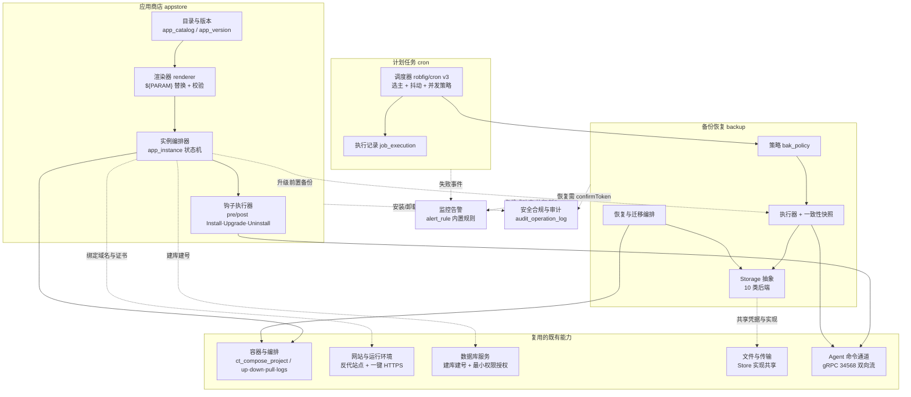

### 13.1.4 能力清单

| 编号 | 能力 | 落点 | 权限点 |
| --- | --- | --- | --- |
| A1 | 应用目录浏览：分类、标签、关键字、推荐位、已安装标记 | `app_catalog` | `appstore:app:list` |
| A2 | 参数化安装：动态表单 + 端口/域名/磁盘预检 + 实时进度 | `app_instance` | `appstore:instance:create` |
| A3 | 实例管理：启停、重启、日志、终端、访问地址、初始凭据一次性展示 | 复用容器通道 | `appstore:instance:update` |
| A4 | 参数变更：分级生效（热更新/重启/重建） | `param_value_json` | `appstore:instance:update` |
| A5 | 版本升级与回滚：兼容矩阵 + 前置备份 + 迁移钩子 | `app_version` | `appstore:instance:update` |
| A6 | 卸载：数据保留可选、卷与目录清理、关联资源处置确认 | — | `appstore:instance:delete` |
| A7 | 仓库管理：多仓库、索引同步、签名校验、离线包导入、镜像加速 | `app_catalog.source_repo` | `appstore:repo:update` |
| A8 | 自定义应用：本地上传应用包并纳入目录（私有仓库） | — | `appstore:repo:create` |
| B1 | 计划任务：10 类任务、cron 校验与下次预览、手动触发、暂停、强停 | `job_cron` | `cron:job:*` |
| B2 | 执行留痕：输出留存与截断、失败重试与退避、失败告警、串行 DAG | `job_execution` | `cron:execution:list` |
| C1 | 备份存储：10 类后端、连通性测试、用量与配额、限速与分片 | `bak_storage` | `backup:storage:*` |
| C2 | 备份策略：8 类对象、GFS 与计数保留、压缩、加密、异地副本 | `bak_policy` | `backup:policy:*` |
| C3 | 备份执行：一致性快照、增量、断点续传、进度推送、并发与资源限制 | `bak_record` | `backup:record:exec` |
| C4 | 完整性：manifest + sha256、定期抽检、损坏告警 | `verify_status` | `backup:record:read` |
| C5 | 恢复：整体/粒度/跨节点，预检、冲突处理、二次确认、报告 | — | `backup:restore:exec` |
| C6 | 整站迁移向导与面板灾难恢复手册 | — | `backup:migrate:exec` |
| C7 | 恢复演练：定时自动演练、影子验证、RTO/RPO 报表 | — | `backup:drill:exec` |

### 13.1.5 明确不做的部分

| 不做 | 原因 | 替代 |
| --- | --- | --- |
| 应用市场的线上交易、付费授权、评分评论 | 面板是私有部署工具，不承载社区运营 | 仓库只读同步，运营在仓库站点侧 |
| Helm Chart 安装与 K8s 应用编排 | v1.0 不做 K8s 写操作，见[容器与编排](./09-容器与编排.md) 9.1 的边界 | `deploy_type='helm'` 字段预留，v2.0 实现 |
| 应用内部业务配置（如 WordPress 主题、Gitea 组织） | 属于应用自身管理面 | 安装后跳转应用自己的后台 |
| 通用工作流引擎（并行分支、条件跳转、人工审批节点） | 运维场景 95% 是「按顺序跑几个任务」 | 13.9.8 的串行 DAG |
| 块级/文件系统级 CDP 连续数据保护 | 需要内核模块或 LVM 深度介入，运维成本高于收益 | 最小 5 分钟粒度的增量备份 |
| 备份数据的跨版本格式兼容承诺（面板降级后读新格式包） | 保证向下兼容会锁死 manifest 演进 | manifest 带 `schemaVersion`，低版本读到高版本包直接拒绝并提示 |
| 数据库逻辑备份的跨引擎转换（MySQL 包恢复到 PostgreSQL） | 语法与类型不可靠映射 | 恢复前校验引擎与大版本，不匹配即拒绝 |

## 13.2 应用元数据模型

四张表的 DDL 以[数据库设计](./04-数据库设计.md) 4.13.1–4.13.4 为准，本节只补充语义、取值约定与本模块的使用规则。

### 13.2.1 实体关系

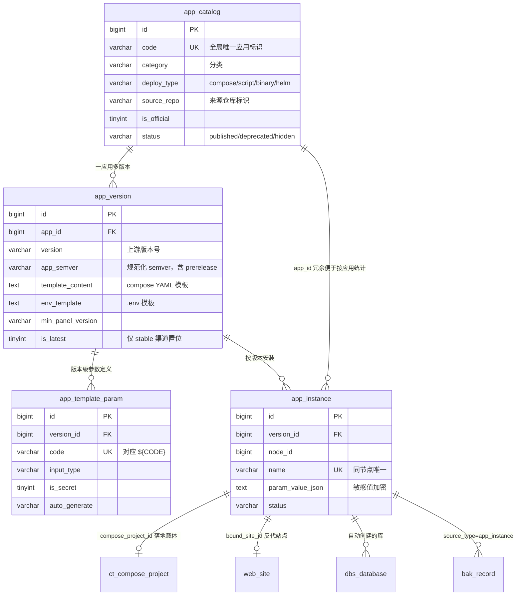

### 13.2.2 app_catalog 关键字段语义

| 字段 | 取值与约定 | 写入方 |
| --- | --- | --- |
| `code` | `^[a-z][a-z0-9-]{1,62}$`，与仓库目录名一致，跨仓库冲突时以「先同步者优先 + 后者加 `-<repoKey>` 后缀」处理 | 同步器 |
| `name` / `short_desc` / `description` | 取 `app.yaml` 的 `i18n` 中当前面板语言的文案，缺失回落 `en-US`，再回落 `name` 原文 | 同步器 |
| `category` | 见 13.2.7，不在字典内的一律落 `other` 并在同步报告中列出 | 同步器 |
| `deploy_type` | v1.0 只接受 `compose`；`script`/`binary` 的包在同步阶段被标 `hidden` 并记录原因；`helm` 直接拒绝入库 | 同步器 |
| `icon_url` | 优先落本地缓存路径 `/api/v1/appstore/asset/<code>/icon.png`（同步时下载并转 128×128 WebP，上限 64 KB），远端 URL 仅作回源 | 同步器 |
| `source_repo` | 仓库 key（如 `official`、`myrepo`），本地上传包固定 `local` | 同步器 |
| `tag_json` | `["php","mysql","博客"]`，用于搜索加权与筛选，上限 12 个、单个 ≤ 16 字符 | 同步器 |
| `install_count` | 本地安装成功计数，安装成功 +1、卸载不减；仅用于「常用应用」排序，不上报 | 实例编排器 |
| `min_mem_mb` / `min_disk_mb` | 取所有服务的 `resources.requests` 之和，安装预检的硬门槛来源 | 同步器 |
| `is_recommended` | 官方仓库索引给出，本地可覆盖（`PATCH /appstore/app/{id}/recommend`） | 同步器 / 管理员 |
| `status` | `published` 可见可装；`deprecated` 可见不可新装（已装实例仍可管理与升级到其他应用）；`hidden` 仅超管可见 | 同步器 / 管理员 |

### 13.2.3 app_version 关键字段语义

| 字段 | 取值与约定 |
| --- | --- |
| `version` | 上游原始版本号，可含前缀（`v6.6.0`）与构建元数据，仅作展示与镜像 tag 拼接 |
| `app_semver` | 规范化结果，格式 `MAJOR.MINOR.PATCH[-prerelease]`，由 `Masterminds/semver/v3` 解析；解析失败的版本拒绝入库（错误码 `800211`），保证版本比较可靠 |
| `template_content` | compose YAML 模板全文，即包内 `docker-compose.yml.tmpl`；单版本上限 256 KB |
| `env_template` | `.env` 模板全文；渲染后作为 `ct_compose_project.env_file_content_enc` 整体加密落库 |
| `default_port_json` | `[{"code":"HTTP_PORT","service":"app","container":80,"default":8080,"protocol":"tcp","expose":"host"}]`，安装预检与端口占用检查的输入 |
| `volume_json` | `[{"name":"data","path":"/opt/novapanel/data/compose/${NOVA_PROJECT}/data","container":"/var/www/html","backup":true}]`，`backup=true` 的条目自动进入实例备份范围 |
| `upgrade_note` | Markdown，升级确认弹窗内原样展示，含破坏性变更必须写明 |
| `min_panel_version` | semver 约束串，支持 `>=1.0.0`、`>=1.0.0 <2.0.0`；不满足时该版本在界面置灰并提示先升级面板 |
| `is_latest` | 同一 `app_id` 下**仅 stable 渠道**的最高 `app_semver` 置 1，同步事务内先清零再置位 |
| `status` | `published` / `deprecated`（上游已 EOL 或存在已知高危漏洞，界面标红警示但保留可装以便复现旧环境） |

### 13.2.4 app_template_param 与 app_instance 关键字段语义

| 表.字段 | 取值与约定 |
| --- | --- |
| `param.code` | `^[A-Z][A-Z0-9_]{1,62}$`，模板中以 `${CODE}` 引用；禁止以 `NOVA_` 开头（保留给内置变量，冲突时入库拒绝 `800212`） |
| `param.input_type` | 见 13.3.4 的九种类型；`volume` 与 `switch` 在 04 号 DDL 的注释枚举之外补充，落库仍用同一字段 |
| `param.default_value` | 允许内嵌内置变量（如 `${NOVA_INSTANCE_NAME}_db`），在表单初始化时先渲染再展示 |
| `param.option_json` | `select`：`[{"label":"MySQL 8.0","value":"8.0"}]`；`volume`：`[{"label":"数据目录","value":"data"}]`；其余类型忽略 |
| `param.is_secret` | 1 时：表单密码框、`param_value_json` 内该键以 AES-256-GCM 单值加密、API 返回 `"******"`、审计日志脱敏、日志与错误消息中不得出现 |
| `param.auto_generate` | `password16`（16 位含四类字符）/ `password24` / `uuid` / `hex32` / `free_port`（从节点空闲端口池取）/ `random_name`；仅在用户未填时生效，填了则以用户值为准 |
| `instance.name` | `^[a-z][a-z0-9-]{1,30}$`，同时用作 compose 项目名，故同节点唯一且不可改名（改名等于重建） |
| `instance.param_value_json` | `{"HTTP_PORT":"8080","DB_PASSWORD":{"enc":"base64..."}}`，敏感值以对象形态存放便于识别；升级时保留旧值、新增参数取默认值 |
| `instance.install_dir` | 固定 `/opt/novapanel/data/compose/<name>`，与 `ct_compose_project.work_dir` 一致，不允许自定义 |
| `instance.access_url` | 绑定域名后为 `https://<domain><basePath>`，未绑定为 `http://<nodeIP>:<HTTP_PORT>`，仅本地监听时展示 `http://127.0.0.1:<port>` 并附「未对外暴露」标记 |
| `instance.admin_password_enc` | 仅当 `app.yaml` 声明 `adminCredential` 时写入，首次查看后可调 `DELETE /appstore/instance/{id}/credential` 清空 |
| `instance.progress` | 0–100，仅安装/升级/卸载期间有意义，与 WebSocket 帧同源 |
| `instance.status` | `installing`/`running`/`stopped`/`failed`/`upgrading`/`uninstalling`，映射规则见 13.6.1 |

### 13.2.5 版本与渠道

面板不为渠道单独建字段，而是用 semver 的 prerelease 段表达，避免与已定稿的 DDL 冲突：

| 渠道 | 判定 | 默认可见性 | `is_latest` | 升级提示 |
| --- | --- | --- | --- | --- |
| stable | `app_semver` 无 prerelease 段（`6.6.0`） | 所有用户 | 参与竞争 | 正常提示 |
| beta | prerelease 段以 `beta`/`rc`/`alpha` 开头（`6.7.0-rc.1`） | 仅当 `app.channel_visible` 设置含 `beta` 时可见 | 恒为 0 | 仅在实例本身已是 beta 时提示 |

渠道规则三条：stable 实例默认不会被提示升级到 beta；beta 实例可以升级到更高的 stable（视为「转正」）；同一实例在 stable 与 beta 间反复切换不受限制，但跨渠道降级仍走 13.7.3 的降级校验。`sys_setting` 键 `app.channel_visible` 默认 `["stable"]`。

### 13.2.6 分类体系

`category` 取值固化为 10 项（`sys_dict` 组 `app_category`），只增不改，前端图标与排序随之：

| code | 中文名 | 收录范围 | 典型应用 | 默认排序 |
| --- | --- | --- | --- | --- |
| `cms` | 建站与 CMS | 内容管理、博客、论坛、电商 | WordPress、Typecho、Halo、Discourse | 10 |
| `database` | 数据库与缓存 | 关系库、KV、文档库、消息队列 | MySQL、PostgreSQL、Redis、MongoDB、RabbitMQ | 20 |
| `devtools` | 开发与协作 | 代码托管、CI、制品库、文档协作 | Gitea、Drone、Nexus、Outline | 30 |
| `monitor` | 监控与日志 | 指标、日志、链路、拨测 | Grafana、Uptime Kuma、Loki | 40 |
| `storage` | 存储与同步 | 网盘、对象存储、备份工具 | Nextcloud、MinIO、Syncthing | 50 |
| `network` | 网络与代理 | 反代、DNS、隧道、下载 | Traefik、AdGuard Home、qBittorrent | 60 |
| `ai` | AI 与模型 | 推理服务、向量库、对话前端 | Ollama、Open WebUI、Qdrant | 70 |
| `media` | 影音与媒体 | 媒体库、转码、图床 | Jellyfin、Navidrome、Chevereto | 80 |
| `security` | 安全与认证 | 密码管理、SSO、堡垒 | Vaultwarden、Authelia、Keycloak | 90 |
| `other` | 其他 | 未归类与自定义应用 | — | 999 |

### 13.2.7 清单与数据库的落点划分

`app.yaml` 的内容分两路持久化：**需要被列表查询、排序、筛选、比较的字段投影入库**，其余段落保留在本地仓库缓存的原始清单文件里，安装时按 `app_id + version` 读回。这样既不需要为清单新增大字段，也不丢失任何声明能力。

| `app.yaml` 段 | 落点 | 读取时机 |
| --- | --- | --- |
| `code`、`name`、`category`、`icon`、`tags`、`homepage`、`docs`、`i18n` | `app_catalog` 对应列 | 列表与详情 |
| `version`、`minPanelVersion`、`upgradeNote`、`ports`、`volumes` | `app_version` 对应列 | 列表与安装预检 |
| `params[]` | `app_template_param` 逐行 | 表单渲染与参数校验 |
| `compose` 模板正文、`env` 模板正文 | `app_version.template_content` / `env_template` | 渲染 |
| `requires`、`conflicts`、`hooks`、`healthcheck`、`backupItems`、`expose`、`resources`、`adminCredential` | 清单缓存文件 `/opt/novapanel/data/appstore/cache/<repoKey>/<code>/<version>/app.yaml` | 安装、升级、卸载、备份时读回 |

缓存文件与库记录用 `sha256` 关联：`app_version` 同步时把清单摘要写入 `tag_json` 的 `_manifestSha256` 键；安装前重算摘要，不一致则拒绝安装（`800213`），并触发该应用的强制重新同步。缓存目录丢失（如手工清理）时按 `source_repo` 自动回源重下。

### 13.2.8 依赖与冲突声明

```yaml
requires:
  panel: ">=1.0.0"              # 面板版本，semver 约束
  docker: ">=24.0"              # Docker Engine 版本
  capabilities: [ct.compose]    # 节点能力位，见 09 号文档 9.4
  arch: [amd64, arm64]          # 支持架构，节点架构不在列表内禁止安装
  os: ["!alpine"]               # 黑名单式排除，前缀 ! 表示不支持
  minMemMb: 1024
  minDiskMb: 4096
  services:                     # 需要的外部服务，可复用已有实例或由本包内置
    - kind: mysql
      version: ">=8.0"
      mode: bundled_or_shared   # bundled 仅内置 / shared 仅复用 / bundled_or_shared 用户选
      paramCode: DB_HOST        # 选择复用时把连接信息回填到这些参数
    - kind: redis
      version: ">=6.0"
      mode: bundled_or_shared
      optional: true            # 缺失时降级运行，表单里给「启用缓存」开关
conflicts:
  apps: [wordpress-lite]        # 同节点不可共存的应用 code
  hostPorts: []                 # 声明必须独占的固定宿主端口（无法参数化的场景）
  paths: ["/var/lib/mysql"]     # 必须独占的宿主路径
```

| 校验项 | 校验时机 | 不满足时 | 错误码 |
| --- | --- | --- | --- |
| `panel` | 目录列表渲染（置灰）+ 安装预检 | 提示先升级面板 | `800301` |
| `docker` / `capabilities` / `arch` / `os` | 选定节点后 + 安装预检 | 列出不满足的节点并允许换节点 | `800302` |
| `minMemMb` / `minDiskMb` | 安装预检（读节点最新指标与磁盘剩余） | 可勾选「我已知晓，强制继续」（写审计），磁盘不足不可强制 | `800303` |
| `services` | 表单加载（列出可复用实例）+ 安装预检（连通性与版本探测） | 复用目标不可达直接失败 | `800304` |
| `conflicts.apps` | 安装预检（查同节点 `app_instance`） | 硬失败，提示先卸载冲突应用 | `800305` |
| `conflicts.hostPorts` / `paths` | 安装预检 | 硬失败，给出占用者（容器名或应用名） | `800306` |

依赖不做递归自动安装：`services` 为 `shared` 时列出候选实例让用户选，为 `bundled` 时该服务作为本 compose 项目内的一个 service 一起起，**不会去装另一个应用实例**。这样依赖图深度恒为 1，卸载时无需做引用计数回收。

## 13.3 应用包结构与 app.yaml 规范

### 13.3.1 目录结构

一个**版本目录**就是一个自包含的应用包，可单独打成 `.napp`（zst 压缩的 tar）离线导入：

```text
apps/
└── wordpress/                          应用目录，目录名必须等于 app.yaml 的 code
    ├── icon.png                        应用级图标，128×128 PNG/WebP，≤64 KB，被所有版本共享
    ├── README.md                        应用介绍，Markdown，详情页正文
    ├── screenshots/                     截图，命名 01-*.png ~ 06-*.png，单张 ≤300 KB
    │   ├── 01-dashboard.png
    │   └── 02-editor.png
    ├── 6.6.1/                           版本目录，目录名必须等于 app.yaml 的 version
    │   ├── app.yaml                     完整清单，唯一必需文件
    │   ├── docker-compose.yml.tmpl      compose 模板，deploy_type=compose 时必需
    │   ├── env.tmpl                     .env 模板，可选
    │   ├── CHANGELOG.md                 本版本变更，升级确认框中展示
    │   ├── hooks/                        钩子脚本，POSIX sh，无则跳过
    │   │   ├── pre-install.sh
    │   │   ├── post-install.sh
    │   │   ├── pre-upgrade.sh
    │   │   ├── post-upgrade.sh
    │   │   └── pre-uninstall.sh
    │   ├── files/                        随实例复制到 install_dir 的伴生文件，支持 .tmpl 后缀参与渲染
    │   │   ├── nginx.conf.tmpl
    │   │   └── php-custom.ini
    │   └── i18n/                         多语言文案覆盖
    │       ├── zh-CN.yaml
    │       └── en-US.yaml
    └── 6.5.5/
        └── ...
```

设计取舍：应用级字段（`code`、`name`、`category` 等）在每个版本的 `app.yaml` 里重复出现，好处是单个版本包可独立分发与离线导入，代价是同一应用多版本间可能写出不一致。同步器以 `is_latest` 版本的应用级字段为准，`novactl appstore lint <dir>` 会对跨版本不一致给出 WARN。

打包与校验命令：

```bash
# 校验单个版本包（schema、模板渲染试运行、钩子 shellcheck、图标尺寸、i18n 键完整性）
novactl appstore lint apps/wordpress/6.6.1 --strict

# 打成离线包，产出 wordpress-6.6.1.napp 与同名 .napp.minisig
novactl appstore pack apps/wordpress/6.6.1 --out ./dist --sign-key ~/.minisign/nova.key

# 本地导入（等价于界面「上传应用包」）
novactl appstore import ./dist/wordpress-6.6.1.napp --repo local
```

### 13.3.2 app.yaml 顶层字段表

| 字段 | 类型 | 必填 | 默认 | 说明 |
| --- | --- | --- | --- | --- |
| `schemaVersion` | int | 是 | — | 清单格式版本，v1.0 面板只接受 `1`；更高值直接拒绝并提示升级面板 |
| `code` | string | 是 | — | `^[a-z][a-z0-9-]{1,62}$`，必须等于应用目录名 |
| `name` | string | 是 | — | 默认语言（en-US）名称，≤128 字符 |
| `version` | string | 是 | — | 上游版本号，必须等于版本目录名，且可被 semver 解析 |
| `channel` | string | 否 | 由 semver 推导 | 仅允许显式声明 `stable`；beta 由 prerelease 段自动判定，写了与推导冲突则以推导为准并 WARN |
| `deployType` | string | 否 | `compose` | v1.0 仅 `compose` |
| `category` | string | 是 | — | 见 13.2.6 的 10 项 |
| `shortDesc` | string | 是 | — | ≤255 字符，卡片副标题 |
| `tags` | string[] | 否 | `[]` | ≤12 项，单项 ≤16 字符 |
| `icon` | string | 否 | `../icon.png` | 相对路径或 `https://` URL |
| `homepage` | string | 否 | `''` | 上游官网 |
| `docs` | string | 否 | `''` | 上游文档地址 |
| `license` | string | 否 | `''` | SPDX 标识，如 `GPL-2.0-or-later` |
| `maintainer` | object | 否 | — | `{name, email, url}`，用于问题反馈入口 |
| `upgradeNote` | string | 否 | `''` | Markdown，落 `app_version.upgrade_note` |
| `minPanelVersion` | string | 是 | — | semver 约束，如 `>=1.0.0` |
| `requires` | object | 否 | — | 见 13.2.8 |
| `conflicts` | object | 否 | — | 见 13.2.8 |
| `resources` | object | 否 | — | `{requests:{memMb,cpu,diskMb}, limits:{memMb,cpu}}`；`requests` 汇总写入 `app_catalog.min_*`，`limits` 注入 compose 的 `deploy.resources` |
| `params` | object[] | 是 | — | 参数定义数组，见 13.3.4；上限 60 个 |
| `paramGroups` | object[] | 否 | — | `[{key, label, collapsed}]`，表单分组；参数用 `group` 引用，未声明的进「基础设置」 |
| `compose` | string | 否 | `docker-compose.yml.tmpl` | 模板文件相对路径 |
| `env` | string | 否 | `env.tmpl` | `.env` 模板相对路径，文件不存在则忽略 |
| `files` | object[] | 否 | `[]` | `[{src,dst,mode,render}]`，伴生文件投放规则；`dst` 相对 `install_dir`，禁止 `..` 与绝对路径 |
| `ports` | object[] | 否 | `[]` | 端口声明，落 `app_version.default_port_json`，见 13.3.9 |
| `volumes` | object[] | 否 | `[]` | 持久化声明，落 `app_version.volume_json` |
| `expose` | object | 否 | — | 对外暴露与域名绑定声明，见 13.3.9 |
| `healthcheck` | object | 否 | — | 安装/升级后的就绪判定，见 13.3.8 |
| `hooks` | object | 否 | — | 五个生命周期钩子，见 13.3.7 |
| `backupItems` | object[] | 否 | `[]` | 备份项声明，见 13.3.9 |
| `adminCredential` | object | 否 | — | `{userParam, passwordParam, note}`，声明后安装完成页一次性展示初始凭据 |
| `i18n` | object | 否 | — | 内联多语言覆盖，与 `i18n/*.yaml` 合并（内联优先），见 13.3.9 |
| `annotations` | map | 否 | `{}` | 自由键值，面板不解释，供仓库方自用；键长 ≤64、值长 ≤256 |

未在表中出现的顶层键在 `--strict` 下报错、在普通同步下忽略并 WARN，保证清单可向前演进而不破坏旧面板。

### 13.3.3 全字段参考清单

下面这份 `app.yaml` 把所有字段与全部十种参数类型都用到了一次，可直接作为编写新应用的起点（业务上没有意义，只做语法参考）：

```yaml
schemaVersion: 1
code: demo-all
name: Demo All Fields
version: 1.2.3
deployType: compose
category: other
shortDesc: 覆盖 app.yaml 全部字段与全部参数类型的参考清单
tags: [demo, reference]
icon: ../icon.png
homepage: https://example.com
docs: https://example.com/docs
license: MIT
maintainer:
  name: NovaPanel Apps
  email: apps@example.com
minPanelVersion: ">=1.0.0"
upgradeNote: |
  1.2.0 起配置文件从 /conf 迁移到 /etc/demo，升级钩子会自动搬运。
requires:
  panel: ">=1.0.0"
  docker: ">=24.0"
  capabilities: [ct.compose]
  arch: [amd64, arm64]
  minMemMb: 512
  minDiskMb: 2048
  services:
    - kind: mysql
      version: ">=8.0"
      mode: bundled_or_shared
      paramCode: DB_HOST
      optional: false
conflicts:
  apps: []
  hostPorts: []
  paths: []
resources:
  requests: { memMb: 512, cpu: 0.5, diskMb: 2048 }
  limits: { memMb: 2048, cpu: 2 }
paramGroups:
  - { key: basic, label: 基础设置, collapsed: false }
  - { key: db, label: 数据库, collapsed: false }
  - { key: advanced, label: 高级设置, collapsed: true }
```

参数段（十种类型各一例）：

```yaml
params:
  - code: SITE_TITLE            # text
    type: text
    label: 站点标题
    group: basic
    default: My Demo
    required: true
    minLen: 1
    maxLen: 64
    regex: "^[^<>]+$"
    regexMessage: 不允许包含尖括号
    help: 展示在浏览器标签页
  - code: ADMIN_PASSWORD        # password
    type: password
    label: 管理员密码
    group: basic
    required: true
    secret: true
    generate: password16
    minLen: 10
    strength: 3                 # 需满足的字符类别数
    confirm: true               # 表单出现二次输入框
  - code: WORKER_NUM            # number
    type: number
    label: 工作进程数
    group: advanced
    default: 4
    min: 1
    max: 64
    step: 1
    unit: 个
  - code: DB_VERSION            # select
    type: select
    label: MySQL 版本
    group: db
    default: "8.0"
    options:
      - { label: MySQL 8.0, value: "8.0" }
      - { label: MySQL 8.4 LTS, value: "8.4" }
    multiple: false
  - code: ENABLE_REDIS          # switch
    type: switch
    label: 启用 Redis 缓存
    group: advanced
    default: false
    trueValue: "1"              # 渲染进模板的字面值
    falseValue: "0"
```

```yaml
  - code: SITE_DOMAIN           # domain
    type: domain
    label: 访问域名
    group: basic
    required: false
    allowWildcard: false
    checkResolve: warn          # off/warn/require：是否校验解析到本节点公网 IP
    help: 留空则用「IP:端口」访问，填写后自动创建反代站点
  - code: HTTP_PORT             # port
    type: port
    label: HTTP 端口
    group: basic
    default: 8080
    min: 1024
    max: 65535
    generate: free_port         # 用户未填时从空闲端口池分配
    checkConflict: true         # 预检阶段查询节点端口占用
    exposeMode: host            # host 映射到宿主 / local 仅 127.0.0.1 / none 不映射
  - code: DATA_PATH             # path
    type: path
    label: 数据存放目录
    group: advanced
    default: ${NOVA_INSTALL_DIR}/data
    mustAbsolute: true
    mustEmptyDir: true          # 目录必须为空或不存在
    denyList: ["/", "/etc", "/usr", "/var/lib/docker", "/opt/novapanel/conf"]
  - code: MEDIA_VOLUME          # volume
    type: volume
    label: 媒体库存储
    group: advanced
    default: named:media        # named:<卷名> 使用 docker 命名卷 / bind:<宿主路径>
    allowModes: [named, bind]
    options:
      - { label: 使用 Docker 命名卷（推荐）, value: "named:media" }
      - { label: 绑定宿主目录, value: "bind:" }
  - code: EXTRA_CONFIG          # textarea
    type: textarea
    label: 追加配置
    group: advanced
    default: ""
    rows: 6
    maxLen: 8192
    language: ini               # 编辑器语法高亮：none/ini/yaml/json/nginx/sh
    visibleWhen: "ENABLE_ADVANCED == true"
```

其余段落：

```yaml
compose: docker-compose.yml.tmpl
env: env.tmpl
files:
  - { src: files/nginx.conf.tmpl, dst: conf/nginx.conf, mode: "0644", render: true }
  - { src: files/php-custom.ini, dst: conf/php-custom.ini, mode: "0644", render: false }
ports:
  - { code: HTTP_PORT, service: app, container: 80, protocol: tcp, primary: true }
  - { code: SSH_PORT, service: app, container: 22, protocol: tcp, primary: false }
volumes:
  - { name: data, container: /var/www/html, host: ${NOVA_INSTALL_DIR}/data, backup: true }
  - { name: media, container: /media, mode: fromParam, paramCode: MEDIA_VOLUME, backup: false }
expose:
  primaryPortCode: HTTP_PORT
  scheme: http                  # 容器内协议，反代回源用
  basePath: /                   # 应用挂载路径，非 / 时反代生成子路径 location
  healthPath: /wp-login.php     # 反代健康探测路径
  domainParamCode: SITE_DOMAIN
  autoSite: true                # 填了域名就自动建反代站点
  autoHttps: true               # 建站后自动申请证书并开强制跳转
  websocket: false
  clientMaxBodySize: 64m
  extraProxyHeaders:
    X-Forwarded-Proto: $scheme
healthcheck:
  type: http                    # http/tcp/exec/composeHealthy
  target: app                   # 服务名
  path: /wp-login.php
  portCode: HTTP_PORT
  expectStatus: [200, 302]
  intervalSec: 5
  timeoutSec: 5
  startPeriodSec: 30
  retries: 60                   # 5s × 60 = 最长等 5 分钟
hooks:
  preInstall: { script: hooks/pre-install.sh, timeoutSec: 120, runOn: node, onFail: abort }
  postInstall: { script: hooks/post-install.sh, timeoutSec: 300, runOn: container, container: app, onFail: warn }
  preUpgrade: { script: hooks/pre-upgrade.sh, timeoutSec: 300, runOn: node, onFail: abort }
  postUpgrade: { script: hooks/post-upgrade.sh, timeoutSec: 600, runOn: container, container: app, onFail: abort }
  preUninstall: { script: hooks/pre-uninstall.sh, timeoutSec: 120, runOn: node, onFail: warn }
backupItems:
  - { type: volume, name: data, required: true }
  - { type: database, kind: mysql, nameParam: DB_NAME, hostParam: DB_HOST, userParam: DB_USER, passwordParam: DB_PASSWORD, required: true }
  - { type: path, path: ${NOVA_INSTALL_DIR}/conf, required: false }
  - { type: composeProject, required: true }
adminCredential:
  userParam: ADMIN_USER
  passwordParam: ADMIN_PASSWORD
  note: 首次登录后请立即修改密码
i18n:
  zh-CN: { name: 演示应用, shortDesc: 覆盖全部字段的参考清单, params: { SITE_TITLE: { label: 站点标题, help: 展示在浏览器标签页 } } }
annotations:
  repo.reviewed: "2026-07-30"
```

### 13.3.4 参数类型与校验规则

所有类型共有的属性：

| 属性 | 类型 | 必填 | 默认 | 落库字段 | 说明 |
| --- | --- | --- | --- | --- | --- |
| `code` | string | 是 | — | `code` | `^[A-Z][A-Z0-9_]{1,62}$`，禁止 `NOVA_` 前缀 |
| `type` | string | 是 | `text` | `input_type` | 十种取值见下表 |
| `label` | string | 是 | — | `label` | 表单标签，≤128 字符 |
| `default` | any | 否 | `''` | `default_value` | 支持内嵌 `${NOVA_*}`，落库前不渲染，展示时渲染 |
| `required` | bool | 否 | `true` | `required` | `false` 时允许空串；空串仍会替换进模板 |
| `secret` | bool | 否 | `type==password` | `is_secret` | 见 13.2.4 的脱敏约定 |
| `generate` | string | 否 | `''` | `auto_generate` | 见 13.3.6 |
| `help` | string | 否 | `''` | `help_text` | 字段下方灰字说明 |
| `placeholder` | string | 否 | `''` | `placeholder` | 输入框占位提示 |
| `group` | string | 否 | `basic` | — | 引用 `paramGroups[].key`，不存在则归入基础设置并 WARN |
| `sort` | int | 否 | 数组下标×10 | `sort` | 组内排序 |
| `visibleWhen` | string | 否 | `''` | — | 条件显示表达式，见 13.3.5 |
| `immutable` | bool | 否 | `false` | — | 安装后不可改（如库名），参数变更界面置灰 |
| `changeImpact` | string | 否 | 按类型推导 | — | `hot`/`restart`/`recreate`，见 13.7.1 |

各类型的专属属性、前端控件与校验：

| type | Arco 控件 | 专属属性 | 服务端校验 | 渲染后形态 |
| --- | --- | --- | --- | --- |
| `text` | `a-input` | `minLen`、`maxLen`、`regex`、`regexMessage` | 长度区间、正则（用 Go RE2，禁止回溯型写法）、去首尾空白 | 原样字符串 |
| `password` | `a-input-password` | `minLen`（默认 8）、`strength`（1–4）、`confirm` | 长度、字符类别数、不得等于 `label` 或应用 code | 原样字符串，日志中替换为 `******` |
| `number` | `a-input-number` | `min`、`max`、`step`、`unit`、`float` | 数值区间、步长整除、`float=false` 时必须整数 | 十进制字面量，无引号 |
| `select` | `a-select` | `options`、`multiple`、`allowCreate` | 值必须命中 `options`（`allowCreate` 时放宽为长度与正则）；`multiple` 时渲染为逗号分隔 | 选中值或 `a,b,c` |
| `switch` | `a-switch` | `trueValue`、`falseValue` | 必须为 bool 或字符串 `true/false/1/0` | `trueValue`/`falseValue` 的字面值 |
| `domain` | `a-input` + 校验按钮 | `allowWildcard`、`checkResolve`、`allowMulti` | 域名语法（IDN 转 punycode）、不得与已有站点域名冲突（`300002`）、`checkResolve=require` 时必须解析到本节点出口 IP | 小写 punycode |
| `port` | `a-input-number` + 探测 | `min`（默认 1024）、`max`、`checkConflict`、`exposeMode` | 区间、不在系统保留清单（34567/34568/22 等）、`checkConflict` 时查 `ss -lntup` 与 `ct_container` 端口映射 | 十进制端口号 |
| `path` | `a-input` + 目录选择器 | `mustAbsolute`、`mustEmptyDir`、`denyList`、`mustExist` | 绝对路径、规范化后不含 `..`、不命中 `denyList`（与[文件管理与 WebSSH](./08-文件管理与WebSSH.md) 的全局禁写清单合并）、可写性探测 | 规范化后的绝对路径（去尾 `/`） |
| `volume` | `a-radio-group` + 条件输入 | `allowModes`、`options` | 形如 `named:<name>` 或 `bind:<absPath>`；`named` 卷名 `^[a-z0-9][a-z0-9_.-]{1,62}$`；`bind` 路径走 `path` 的全部校验且额外拒绝挂载 docker 目录 | `named:x` 渲染为 `x`（配合模板的 `volumes:` 段），`bind:/data/x` 渲染为 `/data/x` |
| `textarea` | `CodeEditor`（Monaco） | `rows`、`maxLen`、`language` | 长度上限、按 `language` 做语法预校验（ini/yaml/json 解析失败即拒绝） | 多行字符串，模板中需自行处理缩进（推荐写进 `files` 而非 compose） |

校验分三道且互不替代：前端即时校验（体验）、控制面入参校验（安全边界，权威）、渲染后 compose schema 校验（兜底，见[容器与编排](./09-容器与编排.md) 9.11.3）。任一失败都不产生任何落盘副作用。

### 13.3.5 条件显示 visibleWhen

表达式语法刻意做小：只支持「参数引用 + 比较 + 布尔连接 + 括号」，不支持函数调用与算术，保证前端（TS 求值）与后端（Go 求值）两套实现结果一致。

| 语法元素 | 写法 | 说明 |
| --- | --- | --- |
| 参数引用 | `ENABLE_REDIS` | 只能引用同版本的其他参数 code，引用不存在的 code 在 lint 阶段报错 |
| 比较 | `==` `!=` `>` `>=` `<` `<=` | 两侧类型不一致时按字符串比较；`>` 系列仅对 `number`/`port` 类型有效 |
| 布尔字面量 | `true` `false` | `switch` 参数与之比较时用原始 bool，不用 `trueValue` |
| 字符串字面量 | `"8.0"` | 双引号 |
| 集合判断 | `DB_VERSION in ("8.0","8.4")` | `in` 后跟括号列表，最多 20 项 |
| 空值判断 | `SITE_DOMAIN == ""` | 空串即未填 |
| 连接 | `&&` `\|\|` `!` `( )` | 优先级同 C，最大嵌套深度 5 |

三条语义约定：

1. 隐藏 ≠ 不生效。被隐藏的参数仍会取默认值参与渲染，模板作者不需要写「参数不存在」的分支。若希望隐藏即失效，把该参数的默认值设为空串或让模板用 `profiles` 控制服务启停。
2. 依赖必须无环。lint 阶段对 `visibleWhen` 的引用关系做拓扑排序，成环直接拒绝入库（`800214`）。
3. `required` 与可见性联动：不可见的参数即使 `required=true` 也不阻塞提交，服务端在校验前先求值可见性，对不可见项跳过必填检查（但仍做格式检查，因为默认值也可能违法）。

### 13.3.6 生成器 generate

| 生成器 | 输出 | 实现 | 适用类型 |
| --- | --- | --- | --- |
| `password16` | 16 位，含大写/小写/数字/符号各至少 1 个，符号集 `!@#%^*_-+=` | `crypto/rand` 拒绝采样，排除易混字符 `0O1lI` | password |
| `password24` | 同上，24 位 | 同上 | password |
| `password32hex` | 32 位十六进制小写 | `hex(rand16)` | password、text |
| `uuid` | RFC 4122 v4 | `google/uuid` | text |
| `hex32` / `hex64` | 32 / 64 位十六进制 | 用于 app secret、JWT key | text、password |
| `base64_32` | 32 字节的 base64（44 字符） | 用于需要 32 字节密钥的应用 | password |
| `free_port` | 节点上一个空闲 TCP 端口 | 见下 | port |
| `random_name` | `<形容词>-<名词>-<4位hex>`，如 `calm-otter-9f3a` | 内置词表各 64 个 | text |
| `instance_suffix` | 实例名 + `_` + 4 位 hex，用于库名/卷名避免撞名 | 依赖 `NOVA_INSTANCE_NAME` | text |

`free_port` 的分配算法（避免「分配了却被别人抢走」）：

1. 从 `sys_setting` 的 `app.port_pool`（默认 `20000-29999`）内按 `hash(instanceName+paramCode)` 取起点，顺序探测。
2. 排除三类：节点 `ss -lntup` 实时占用、`ct_container` 已声明的宿主端口映射、本次安装中已被其他参数分配的端口。
3. 命中后写入内存 `portReservation`（TTL 10 分钟，键 `node:<id>:port:<p>`），预留期内其他安装请求不会再分到同一端口。
4. 安装成功后预留自动失效（真实占用已由容器接管）；安装失败或超时则释放。

生成值的可见性：`secret=true` 的生成值仅在安装完成页与 `adminCredential` 卡片一次性明文展示，之后一律返回掩码；`secret=false` 的生成值（如端口、随机名）正常可见可查。

### 13.3.7 钩子

| 钩子 | 触发时机 | 典型用途 | 失败默认处理 |
| --- | --- | --- | --- |
| `preInstall` | 目录已创建、模板已渲染落盘，容器尚未启动 | 校验外部依赖、初始化宿主目录权限、生成额外配置 | `abort`（回滚并清理目录） |
| `postInstall` | 容器已启动且健康检查通过 | 应用内初始化（建表、写管理员、装插件） | `abort`（回滚，含删容器与卷） |
| `preUpgrade` | 前置备份已完成，旧容器仍在运行 | 导出数据、置维护模式、停后台队列 | `abort`（升级中止，实例保持旧版本运行） |
| `postUpgrade` | 新版本容器已启动且健康 | 执行数据迁移命令、清缓存、解除维护模式 | `abort`（触发自动回滚到旧版本） |
| `preUninstall` | 用户已确认卸载，容器仍在运行 | 优雅注销、导出用户数据、通知外部系统 | `warn`（记录后继续卸载） |

钩子定义字段：

| 字段 | 类型 | 默认 | 说明 |
| --- | --- | --- | --- |
| `script` | string | — | 相对版本目录的路径，必须在 `hooks/` 下，POSIX sh，不得超过 64 KB |
| `runOn` | string | `node` | `node` 在宿主执行（工作目录 `install_dir`，用户固定 `root`）；`container` 在指定服务的容器内执行 |
| `container` | string | — | `runOn=container` 时必填，取 compose 服务名 |
| `timeoutSec` | int | 300 | 上限 1800；超时视为失败 |
| `onFail` | string | `abort` | `abort` 中止并回滚 / `warn` 记录警告继续 / `ignore` 完全忽略（不产生警告，仅调试用） |
| `retries` | int | 0 | 失败重试次数，上限 3，间隔固定 5s |

钩子的执行环境（两种 `runOn` 一致）：

| 环境变量 | 值 |
| --- | --- |
| `NOVA_HOOK` | 钩子名，如 `postInstall` |
| `NOVA_INSTANCE_ID` / `NOVA_INSTANCE_NAME` | 实例 ID 与名称 |
| `NOVA_APP_CODE` / `NOVA_APP_VERSION` | 应用标识与本次目标版本 |
| `NOVA_FROM_VERSION` | 仅升级钩子有值，升级前版本 |
| `NOVA_INSTALL_DIR` | `/opt/novapanel/data/compose/<name>`（`runOn=container` 时为容器内挂载点 `/nova`） |
| `NOVA_NODE_ID` | 节点 ID |
| `NOVA_BACKUP_ID` | 仅 `preUpgrade`/`postUpgrade` 有值，前置备份的 `bak_record.id` |
| 全部非敏感参数 | 以 `code` 原名注入，如 `HTTP_PORT=8080` |
| 敏感参数 | 同样注入，但 Agent 侧从进程环境读取后立即从执行日志过滤；`ps` 不可见（通过 stdin 传递 env 文件而非命令行） |

约束：钩子的 stdout/stderr 合并流式推送到安装日志（`app.install` topic）并落 `install_log_path`，单钩子输出上限 1 MB（超出截断并标记）；钩子内禁止调用 `novactl`（防止递归触发面板操作，Agent 侧对进程做 `PATH` 裁剪）；`runOn=node` 的钩子受[安全合规与审计](./12-安全合规与审计.md)的命令白名单约束——钩子脚本整体作为一个受控脚本执行，但脚本内容会在同步阶段过 `shellcheck` 与危险指令扫描（`rm -rf /`、`mkfs`、`dd if=`、`curl | sh`），命中即拒绝上架。

### 13.3.8 健康检查

`healthcheck` 决定「安装完成」的判定，与 compose 自身的 `healthcheck` 是两层：compose 的用于容器自身重启策略与依赖顺序，`app.yaml` 的用于面板判断实例是否可交付给用户。

| `type` | 判定方式 | 需要的字段 | 适用场景 |
| --- | --- | --- | --- |
| `http` | Agent 在节点上向 `http://127.0.0.1:<portCode 映射的宿主端口><path>` 发 GET，状态码命中 `expectStatus` 即成功 | `path`、`portCode`、`expectStatus` | 有 Web 界面的应用（多数） |
| `tcp` | 端口可建立 TCP 连接 | `portCode` | 数据库、缓存等无 HTTP 的服务 |
| `exec` | 在容器内执行 `command`，退出码 0 即成功 | `target`、`command` | 需要业务级判定（如 `mysqladmin ping`） |
| `composeHealthy` | 所有声明了 compose `healthcheck` 的服务进入 `healthy`，未声明的服务只要 `running` | 无 | 模板自身已写好健康检查时最省事 |

时间参数语义：`startPeriodSec` 内的失败不计入 `retries`（给应用初始化留窗口）；总等待上限 = `startPeriodSec + intervalSec × retries`，超过即安装失败并进入回滚；界面在等待期显示「正在等待应用就绪（第 N/M 次探测）」，并提供「查看实时日志」入口，避免用户以为卡死。

未声明 `healthcheck` 时的兜底：等价于 `composeHealthy`，且最长等待 180 秒。

### 13.3.9 备份项、暴露声明与 i18n

`backupItems` 条目类型：

| `type` | 必需字段 | 采集方式 | 恢复方式 |
| --- | --- | --- | --- |
| `volume` | `name`（对应 `volumes[].name`） | 命名卷用临时容器挂载后 tar；bind 挂载直接打包宿主目录 | 反向解包到同名卷/目录，要求为空或显式覆盖 |
| `path` | `path`（可含 `${NOVA_*}`） | 宿主路径 tar | 解包覆盖 |
| `database` | `kind`、`nameParam`、`hostParam`、`userParam`、`passwordParam` | 按 `kind` 选一致性方案（见 13.12.2），凭据从 `param_value_json` 解密取得 | 建库（若不存在）后导入 |
| `composeProject` | 无 | 打包 `install_dir` 下的 `docker-compose.yml`、`.env`、`files/` 产物 | 覆盖落盘后 `compose up` |
| `exclude` | `patterns[]` | 不是采集项，而是对以上条目生效的排除 glob（如 `cache/**`、`*.log`） | — |

`required=true` 的条目采集失败即整次备份失败；`false` 则记 WARN 继续，并在 manifest 中标注 `skipped`。实例备份的默认范围 = 所有 `backupItems` + `volumes[].backup=true` 的卷去重合并。

`expose` 段的联动规则：

| 字段 | 行为 |
| --- | --- |
| `primaryPortCode` | 决定 `access_url` 用哪个端口，也是反代回源端口 |
| `basePath` | 非 `/` 时反代生成 `location <basePath>` 并设置 `proxy_set_header X-Forwarded-Prefix` |
| `autoSite` | `true` 且用户填了域名参数：安装成功后调[网站与运行环境](./07-网站与运行环境.md)的 `POST /api/v1/website/sites` 建 `proxy` 类型站点，回填 `bound_site_id` |
| `autoHttps` | `true` 且建站成功：调 `POST /website/sites/{id}/ssl` 申请证书并开 301 跳转；失败只降级为 HTTP 并告警，不回滚应用 |
| `websocket` / `clientMaxBodySize` / `extraProxyHeaders` | 透传到反代规则，避免用户装完还要手工改 Nginx |

i18n 合并优先级：`app.yaml` 的内联 `i18n` > `i18n/<lang>.yaml` > 顶层字段原文。可覆盖的键为 `name`、`shortDesc`、`description`、`upgradeNote`、`paramGroups[].label`、`params[].{label,help,placeholder}`、`params[].options[].label`。语言回落链固定 `<当前语言> → en-US → 原文`。lint 在 `--strict` 下要求 `zh-CN` 与 `en-US` 的键集合一致。

### 13.3.10 JSON Schema

面板内置 `schema/app.schema.json`（JSON Schema draft 2020-12），同步器与 `novactl appstore lint` 共用；该文件也发布到 `https://<面板地址>/api/v1/appstore/schema`，供作者在 VS Code 里通过 `# yaml-language-server: $schema=` 获得补全。核心片段：

```json
{
  "$schema": "https://json-schema.org/draft/2020-12/schema",
  "$id": "https://novapanel.dev/schema/app.schema.json",
  "type": "object",
  "required": ["schemaVersion", "code", "name", "version", "category", "shortDesc", "minPanelVersion", "params"],
  "additionalProperties": false,
  "properties": {
    "schemaVersion": { "const": 1 },
    "code": { "type": "string", "pattern": "^[a-z][a-z0-9-]{1,62}$" },
    "version": { "type": "string", "maxLength": 64 },
    "category": { "enum": ["cms","database","devtools","monitor","storage","network","ai","media","security","other"] },
    "minPanelVersion": { "type": "string", "pattern": "^[><=~^ 0-9.,|*x-]+$" },
    "resources": {
      "type": "object",
      "properties": {
        "requests": { "$ref": "#/$defs/resSpec" },
        "limits": { "$ref": "#/$defs/resSpec" }
      }
    },
    "params": {
      "type": "array", "maxItems": 60,
      "items": { "$ref": "#/$defs/param" }
    },
    "hooks": {
      "type": "object", "additionalProperties": false,
      "properties": {
        "preInstall": { "$ref": "#/$defs/hook" }, "postInstall": { "$ref": "#/$defs/hook" },
        "preUpgrade": { "$ref": "#/$defs/hook" }, "postUpgrade": { "$ref": "#/$defs/hook" },
        "preUninstall": { "$ref": "#/$defs/hook" }
      }
    }
  },
  "$defs": {
    "resSpec": {
      "type": "object", "additionalProperties": false,
      "properties": { "memMb": { "type": "integer", "minimum": 0 }, "cpu": { "type": "number", "minimum": 0 }, "diskMb": { "type": "integer", "minimum": 0 } }
    },
    "hook": {
      "type": "object", "required": ["script"], "additionalProperties": false,
      "properties": {
        "script": { "type": "string", "pattern": "^hooks/[A-Za-z0-9._-]+\\.sh$" },
        "runOn": { "enum": ["node", "container"], "default": "node" },
        "container": { "type": "string" },
        "timeoutSec": { "type": "integer", "minimum": 1, "maximum": 1800, "default": 300 },
        "onFail": { "enum": ["abort", "warn", "ignore"], "default": "abort" },
        "retries": { "type": "integer", "minimum": 0, "maximum": 3, "default": 0 }
      },
      "if": { "properties": { "runOn": { "const": "container" } } },
      "then": { "required": ["script", "container"] }
    }
  }
}
```

参数的 `$defs/param` 用 `allOf` + `if/then` 按 `type` 追加约束，示例（`port` 与 `select`）：

```json
{
  "param": {
    "type": "object",
    "required": ["code", "label"],
    "properties": {
      "code": { "type": "string", "pattern": "^(?!NOVA_)[A-Z][A-Z0-9_]{1,62}$" },
      "type": { "enum": ["text","password","number","select","switch","domain","port","path","volume","textarea"], "default": "text" },
      "label": { "type": "string", "maxLength": 128 },
      "required": { "type": "boolean", "default": true },
      "secret": { "type": "boolean" },
      "generate": { "enum": ["","password16","password24","password32hex","uuid","hex32","hex64","base64_32","free_port","random_name","instance_suffix"] },
      "visibleWhen": { "type": "string", "maxLength": 512 },
      "changeImpact": { "enum": ["hot","restart","recreate"] },
      "immutable": { "type": "boolean", "default": false }
    },
    "allOf": [
      {
        "if": { "properties": { "type": { "const": "port" } }, "required": ["type"] },
        "then": {
          "properties": {
            "min": { "type": "integer", "minimum": 1, "default": 1024 },
            "max": { "type": "integer", "maximum": 65535, "default": 65535 },
            "checkConflict": { "type": "boolean", "default": true },
            "exposeMode": { "enum": ["host", "local", "none"], "default": "host" }
          }
        }
      },
      {
        "if": { "properties": { "type": { "const": "select" } }, "required": ["type"] },
        "then": {
          "required": ["options"],
          "properties": {
            "options": {
              "type": "array", "minItems": 1, "maxItems": 200,
              "items": { "type": "object", "required": ["label", "value"],
                "properties": { "label": { "type": "string" }, "value": { "type": ["string","number","boolean"] } } }
            },
            "multiple": { "type": "boolean", "default": false }
          }
        }
      }
    ]
  }
}
```

Go 侧用 `santhosh-tekuri/jsonschema/v6` 编译校验（YAML 先转 `map[string]any` 再校验），错误路径直接透出到 lint 输出，如 `params/3/options: minItems 1 but got 0`。

### 13.3.11 模板渲染变量与占位规则

占位符语法与优先级：

| 写法 | 含义 | 示例 |
| --- | --- | --- |
| `${PARAM_CODE}` | 用户参数，来自 `app_template_param.code` | `${HTTP_PORT}` → `8080` |
| `${NOVA_XXX}` | 面板内置变量，见下表，作者不可定义同名参数 | `${NOVA_INSTANCE_NAME}` → `myblog` |
| `$${ANY}` | 转义，渲染为字面 `${ANY}`，用于保留给 compose/应用自身的变量 | `$${HOSTNAME}` → `${HOSTNAME}` |
| `${PARAM:-默认}` | **不支持**，遇到即渲染失败（`800215`），避免与 shell 语义混淆 | — |

渲染规则五条：

1. **单趟替换**。渲染器扫描一遍文本完成全部替换，替换结果不会再被扫描，因此参数值里含 `${...}` 不会造成二次展开（防注入）。
2. **未知占位符即失败**。文本中出现既非参数也非内置变量的 `${X}` 直接报错并指出行号，不静默留原文。
3. **未使用参数只 WARN**。定义了但模板与 `files` 都没引用的参数，lint 给 WARN（可能是漏写，也可能只给钩子用）。
4. **YAML 安全**。值中含 `: `、`#`、换行、前导 `*`/`&`/`!` 等 YAML 特殊字符时，渲染器自动按 YAML 双引号规则转义；`number`/`switch` 类型输出裸字面量，其余类型在需要时加引号。
5. **渲染范围**：`compose` 模板、`env` 模板、`files[].render=true` 的伴生文件、`volumes[].host`、`backupItems[].path`、`hooks` 的环境变量值。钩子脚本正文**不参与**渲染（参数通过环境变量传入，避免脚本被字符串拼接污染）。

内置变量表（与 `app_template_param` 不冲突，因为参数 code 禁止 `NOVA_` 前缀）：

| 变量 | 值 | 典型用法 |
| --- | --- | --- |
| `NOVA_APP_CODE` | 应用 code | 镜像 tag、label |
| `NOVA_APP_VERSION` | 本次安装/升级的目标版本 | 镜像 tag |
| `NOVA_INSTANCE_ID` | `app_instance.id` | label、外部对接 |
| `NOVA_INSTANCE_NAME` | 实例名，同时是 compose 项目名 | 容器名前缀、库名前缀 |
| `NOVA_PROJECT` | 等同 `NOVA_INSTANCE_NAME`，语义更贴近 compose | `container_name: ${NOVA_PROJECT}-app` |
| `NOVA_INSTALL_DIR` | `/opt/novapanel/data/compose/<name>` | bind 挂载根 |
| `NOVA_DATA_DIR` | `${NOVA_INSTALL_DIR}/data` | 数据目录 |
| `NOVA_CONF_DIR` | `${NOVA_INSTALL_DIR}/conf` | 配置目录（`files` 默认落点） |
| `NOVA_NODE_ID` | 目标节点 ID | label、多节点区分 |
| `NOVA_NODE_IP` | 节点内网 IP | 服务间互访 |
| `NOVA_PUID` / `NOVA_PGID` | 面板约定的运行身份（默认 `1000`/`1000`，可由 `app.run_uid` 设置改） | `user: ${NOVA_PUID}:${NOVA_PGID}` |
| `NOVA_TZ` | 面板时区（`panel.timezone`） | `TZ=${NOVA_TZ}` |
| `NOVA_PANEL_VERSION` | 面板版本 | 兼容性判断、label |
| `NOVA_NETWORK` | 实例专属 bridge 网络名 `nova_<name>` | compose `networks:` 段 |
| `NOVA_SHARED_NETWORK` | 共享服务网络名 `nova_shared`（复用外部 MySQL/Redis 时加入） | 见 13.8.5 |
| `NOVA_RANDOM_HEX8` | 每次渲染重新生成的 8 位 hex（同一次渲染内多处引用取同值） | 一次性 salt |

渲染结果的可见性：安装确认页提供「查看将要执行的 compose」抽屉，展示渲染后的 YAML，敏感参数值以 `******` 替换（同时提示「实际写入文件的是真实值」）；升级时展示新旧渲染结果的行级 diff，复用[容器与编排](./09-容器与编排.md) 9.11.3 的 diff 组件。

## 13.4 应用包完整示例

两个示例都是可直接放进仓库的完整包。示例一（WordPress）演示 Nginx + PHP-FPM 拆分、可选共享数据库、域名与 HTTPS 联动；示例二（Gitea）演示非 HTTP 端口（SSH）暴露、命名卷与备份项声明。

### 13.4.1 WordPress · 目录与 app.yaml

```text
apps/wordpress/
├── icon.png
├── README.md
├── screenshots/01-dashboard.png
└── 6.6.1/
    ├── app.yaml
    ├── docker-compose.yml.tmpl
    ├── env.tmpl
    ├── CHANGELOG.md
    ├── files/nginx.conf.tmpl
    ├── files/php-custom.ini.tmpl
    ├── hooks/pre-install.sh
    ├── hooks/post-install.sh
    ├── hooks/pre-upgrade.sh
    ├── hooks/post-upgrade.sh
    └── i18n/{zh-CN.yaml,en-US.yaml}
```

```yaml
schemaVersion: 1
code: wordpress
name: WordPress
version: 6.6.1
category: cms
shortDesc: 全球最流行的开源建站程序，本包采用 Nginx + PHP-FPM + MySQL 8.0，Redis 对象缓存可选
tags: [php, mysql, blog, cms, 建站]
icon: ../icon.png
homepage: https://wordpress.org
docs: https://wordpress.org/documentation/
license: GPL-2.0-or-later
maintainer: { name: NovaPanel Apps, email: apps@novapanel.dev }
minPanelVersion: ">=1.0.0"
upgradeNote: |
  - 6.6 起最低要求 PHP 7.2，本包固定 PHP 8.3，无需处理。
  - 升级会自动执行 `wp core update-db`，请确认已有前置备份（面板默认强制）。
  - 若安装了与 6.6 不兼容的插件，升级后请在后台逐个启用排查。
requires:
  panel: ">=1.0.0"
  docker: ">=24.0"
  capabilities: [ct.compose]
  arch: [amd64, arm64]
  minMemMb: 1024
  minDiskMb: 5120
  services:
    - { kind: mysql, version: ">=8.0", mode: bundled_or_shared, paramCode: DB_HOST }
    - { kind: redis, version: ">=6.0", mode: bundled_or_shared, paramCode: REDIS_HOST, optional: true }
conflicts:
  apps: []
resources:
  requests: { memMb: 1024, cpu: 1, diskMb: 5120 }
  limits: { memMb: 4096, cpu: 4 }
paramGroups:
  - { key: basic, label: 站点设置, collapsed: false }
  - { key: db, label: 数据库, collapsed: false }
  - { key: cache, label: 缓存, collapsed: true }
  - { key: advanced, label: PHP 与高级, collapsed: true }
```

```yaml
params:
  - { code: SITE_TITLE, type: text, label: 站点标题, group: basic, default: 我的站点, maxLen: 64, changeImpact: hot }
  - { code: SITE_DOMAIN, type: domain, label: 访问域名, group: basic, required: false, checkResolve: warn,
      help: 填写后自动创建反向代理站点并申请 HTTPS 证书；留空则用「节点 IP:端口」访问 }
  - { code: HTTP_PORT, type: port, label: 宿主 HTTP 端口, group: basic, generate: free_port, exposeMode: host,
      help: 绑定域名后该端口仅供反代回源，可保持默认 }
  - { code: ADMIN_USER, type: text, label: 管理员账号, group: basic, default: admin, regex: "^[a-zA-Z0-9_.-]{3,32}$", immutable: true }
  - { code: ADMIN_PASSWORD, type: password, label: 管理员密码, group: basic, generate: password16, minLen: 10, strength: 3, confirm: true }
  - { code: ADMIN_EMAIL, type: text, label: 管理员邮箱, group: basic, regex: "^[^@\\s]+@[^@\\s]+\\.[a-zA-Z]{2,}$", help: 用于找回密码与系统通知 }
  - { code: DB_MODE, type: select, label: 数据库方式, group: db, default: bundled,
      options: [{ label: 随应用创建独立 MySQL 8.0（推荐）, value: bundled }, { label: 复用已有 MySQL 实例, value: shared }] }
  - { code: MYSQL_VERSION, type: select, label: MySQL 版本, group: db, default: "8.0", visibleWhen: 'DB_MODE == "bundled"',
      options: [{ label: MySQL 8.0, value: "8.0" }, { label: MySQL 8.4 LTS, value: "8.4" }] }
  - { code: DB_ROOT_PASSWORD, type: password, label: MySQL root 密码, group: db, generate: password24, visibleWhen: 'DB_MODE == "bundled"' }
  - { code: DB_HOST, type: text, label: 数据库地址, group: db, default: db, visibleWhen: 'DB_MODE == "shared"', immutable: true,
      help: 复用模式下由面板在选择实例后自动回填 }
  - { code: DB_PORT, type: number, label: 数据库端口, group: db, default: 3306, min: 1, max: 65535, visibleWhen: 'DB_MODE == "shared"' }
  - { code: DB_NAME, type: text, label: 数据库名, group: db, default: ${NOVA_INSTANCE_NAME}_wp, regex: "^[a-z][a-z0-9_]{1,62}$", immutable: true }
  - { code: DB_USER, type: text, label: 数据库账号, group: db, default: ${NOVA_INSTANCE_NAME}_wp, regex: "^[a-z][a-z0-9_]{1,30}$", immutable: true }
  - { code: DB_PASSWORD, type: password, label: 数据库密码, group: db, generate: password24 }
  - { code: TABLE_PREFIX, type: text, label: 数据表前缀, group: db, default: wp_, regex: "^[a-z][a-z0-9_]{0,10}$", immutable: true,
      help: 安装后不可修改；建议使用非默认前缀降低自动化扫描命中率 }
  - { code: ENABLE_REDIS, type: switch, label: 启用 Redis 对象缓存, group: cache, default: true, trueValue: "on", falseValue: "off" }
  - { code: REDIS_MODE, type: select, label: Redis 方式, group: cache, default: bundled, visibleWhen: "ENABLE_REDIS == true",
      options: [{ label: 随应用创建, value: bundled }, { label: 复用已有实例, value: shared }] }
  - { code: REDIS_HOST, type: text, label: Redis 地址, group: cache, default: redis, visibleWhen: 'ENABLE_REDIS == true && REDIS_MODE == "shared"' }
  - { code: REDIS_PASSWORD, type: password, label: Redis 密码, group: cache, required: false, generate: password24, visibleWhen: "ENABLE_REDIS == true" }
  - { code: PHP_MEMORY_LIMIT, type: select, label: PHP 内存上限, group: advanced, default: 256M,
      options: [{ label: 128M, value: 128M }, { label: 256M, value: 256M }, { label: 512M, value: 512M }, { label: 1G, value: 1024M }], changeImpact: restart }
  - { code: UPLOAD_MAX_MB, type: number, label: 单文件上传上限, group: advanced, default: 64, min: 2, max: 2048, unit: MB, changeImpact: restart }
  - { code: WP_DEBUG, type: switch, label: 开启调试模式, group: advanced, default: false, trueValue: "true", falseValue: "false",
      help: 生产环境请保持关闭，开启会在页面输出错误细节, changeImpact: restart }
  - { code: DATA_VOLUME, type: volume, label: 站点文件存储, group: advanced, default: bind:${NOVA_DATA_DIR}/html, allowModes: [named, bind] }
```

```yaml
compose: docker-compose.yml.tmpl
env: env.tmpl
files:
  - { src: files/nginx.conf.tmpl, dst: conf/nginx.conf, mode: "0644", render: true }
  - { src: files/php-custom.ini.tmpl, dst: conf/php-custom.ini, mode: "0644", render: true }
ports:
  - { code: HTTP_PORT, service: web, container: 80, protocol: tcp, primary: true }
volumes:
  - { name: html, container: /var/www/html, mode: fromParam, paramCode: DATA_VOLUME, backup: true }
  - { name: mysql, container: /var/lib/mysql, host: ${NOVA_DATA_DIR}/mysql, backup: false }
expose:
  primaryPortCode: HTTP_PORT
  scheme: http
  basePath: /
  healthPath: /wp-login.php
  domainParamCode: SITE_DOMAIN
  autoSite: true
  autoHttps: true
  websocket: false
  clientMaxBodySize: ${UPLOAD_MAX_MB}m
  extraProxyHeaders: { X-Forwarded-Proto: $scheme, X-Forwarded-Port: "443" }
healthcheck:
  type: http
  target: web
  path: /wp-login.php
  portCode: HTTP_PORT
  expectStatus: [200, 302]
  intervalSec: 5
  timeoutSec: 5
  startPeriodSec: 30
  retries: 60
hooks:
  preInstall: { script: hooks/pre-install.sh, timeoutSec: 60, runOn: node, onFail: abort }
  postInstall: { script: hooks/post-install.sh, timeoutSec: 600, runOn: container, container: app, onFail: abort }
  preUpgrade: { script: hooks/pre-upgrade.sh, timeoutSec: 300, runOn: container, container: app, onFail: abort }
  postUpgrade: { script: hooks/post-upgrade.sh, timeoutSec: 600, runOn: container, container: app, onFail: abort }
backupItems:
  - { type: volume, name: html, required: true }
  - { type: database, kind: mysql, nameParam: DB_NAME, hostParam: DB_HOST, userParam: DB_USER, passwordParam: DB_PASSWORD, required: true }
  - { type: composeProject, required: true }
  - { type: exclude, patterns: ["wp-content/cache/**", "wp-content/uploads/cache/**", "*.log", "wp-content/debug.log"] }
adminCredential:
  userParam: ADMIN_USER
  passwordParam: ADMIN_PASSWORD
  note: 该密码仅此一次明文展示，登录后台后建议立即修改并开启两步验证插件
i18n:
  en-US:
    name: WordPress
    shortDesc: The most popular open-source CMS, packaged as Nginx + PHP-FPM + MySQL 8.0
    params:
      SITE_TITLE: { label: Site title }
      SITE_DOMAIN: { label: Domain, help: Leave empty to access via node IP and port }
      ADMIN_PASSWORD: { label: Admin password }
```

### 13.4.2 WordPress · compose 模板与伴生文件

没有条件渲染，可选服务用 compose 原生 `profiles` 表达，激活列表由 `.env` 的 `COMPOSE_PROFILES` 决定——这是把「分支」外移到参数取值的标准做法：

`env.tmpl`：

```bash
COMPOSE_PROJECT_NAME=${NOVA_PROJECT}
COMPOSE_PROFILES=db-${DB_MODE},redis-${ENABLE_REDIS}-${REDIS_MODE}
TZ=${NOVA_TZ}
WORDPRESS_DB_HOST=${DB_HOST}:${DB_PORT}
WORDPRESS_DB_NAME=${DB_NAME}
WORDPRESS_DB_USER=${DB_USER}
WORDPRESS_DB_PASSWORD=${DB_PASSWORD}
WORDPRESS_TABLE_PREFIX=${TABLE_PREFIX}
WORDPRESS_DEBUG=${WP_DEBUG}
```

`docker-compose.yml.tmpl`：

```yaml
name: ${NOVA_PROJECT}

services:
  app:
    image: wordpress:6.6.1-fpm-alpine
    restart: unless-stopped
    env_file: [.env]
    environment:
      WORDPRESS_CONFIG_EXTRA: |
        define('WP_REDIS_HOST', '${REDIS_HOST}');
        define('WP_REDIS_PASSWORD', '${REDIS_PASSWORD}');
        define('WP_REDIS_PREFIX', '${NOVA_PROJECT}:');
        define('WP_MEMORY_LIMIT', '${PHP_MEMORY_LIMIT}');
        define('DISALLOW_FILE_EDIT', true);
        if (isset($$_SERVER['HTTP_X_FORWARDED_PROTO']) && $$_SERVER['HTTP_X_FORWARDED_PROTO'] === 'https') { $$_SERVER['HTTPS'] = 'on'; }
    volumes:
      - html:/var/www/html
      - ./conf/php-custom.ini:/usr/local/etc/php/conf.d/zz-nova.ini:ro
    networks: [internal]
    labels:
      nova.app.code: ${NOVA_APP_CODE}
      nova.app.instance: ${NOVA_INSTANCE_ID}
    healthcheck:
      test: ["CMD-SHELL", "php-fpm-healthcheck || exit 1"]
      interval: 10s
      timeout: 5s
      retries: 6
      start_period: 30s
    deploy:
      resources:
        limits: { memory: ${PHP_MEMORY_LIMIT} }
```

```yaml
  web:
    image: nginx:1.27-alpine
    restart: unless-stopped
    depends_on:
      app: { condition: service_healthy }
    ports:
      - "127.0.0.1:${HTTP_PORT}:80"
    volumes:
      - html:/var/www/html:ro
      - ./conf/nginx.conf:/etc/nginx/conf.d/default.conf:ro
    networks: [internal]
    healthcheck:
      test: ["CMD", "wget", "-qO-", "http://127.0.0.1/wp-login.php"]
      interval: 10s
      timeout: 5s
      retries: 6

  db:
    image: mysql:${MYSQL_VERSION}
    profiles: [db-bundled]
    restart: unless-stopped
    command: ["--character-set-server=utf8mb4", "--collation-server=utf8mb4_unicode_ci", "--innodb-buffer-pool-size=256M"]
    environment:
      MYSQL_ROOT_PASSWORD: ${DB_ROOT_PASSWORD}
      MYSQL_DATABASE: ${DB_NAME}
      MYSQL_USER: ${DB_USER}
      MYSQL_PASSWORD: ${DB_PASSWORD}
      TZ: ${NOVA_TZ}
    volumes:
      - ${NOVA_DATA_DIR}/mysql:/var/lib/mysql
    networks: [internal]
    healthcheck:
      test: ["CMD", "mysqladmin", "ping", "-h", "127.0.0.1", "-uroot", "-p${DB_ROOT_PASSWORD}"]
      interval: 10s
      timeout: 5s
      retries: 12
      start_period: 40s

  redis:
    image: redis:7-alpine
    profiles: [redis-on-bundled]
    restart: unless-stopped
    command: ["redis-server", "--requirepass", "${REDIS_PASSWORD}", "--maxmemory", "256mb", "--maxmemory-policy", "allkeys-lru"]
    volumes:
      - ${NOVA_DATA_DIR}/redis:/data
    networks: [internal]
    healthcheck:
      test: ["CMD", "redis-cli", "-a", "${REDIS_PASSWORD}", "ping"]
      interval: 10s
      timeout: 3s
      retries: 6

volumes:
  html: {}

networks:
  internal:
    name: ${NOVA_NETWORK}
```

compose 模板里有三处依赖 `profiles` 的写法值得单独说明。`db` 与 `redis` 服务都挂在 profile 上，面板按 `DB_MODE`/`REDIS_MODE` 参数决定启用哪些 profile（`--profile db-bundled`），复用外部实例时这两个服务根本不会被创建。这比在模板里做条件渲染更可靠——compose 文件始终是同一份，差异只在启动参数，排查时能直接用 `docker compose config` 看到最终结果。`web` 服务的端口绑定写死 `127.0.0.1:` 前缀，容器端口不直接暴露到公网，对外访问一律经面板创建的反代站点。所有服务都定义了 `healthcheck`，因为 13.6 的安装流程用容器健康状态判定「安装是否成功」，缺了健康检查的服务只能靠「进程还在」这种弱判据。

### 13.4.3 WordPress · env.tmpl 与钩子脚本

```bash
# env.tmpl —— 渲染后写入实例目录 .env（0600，属主 root）
NOVA_INSTANCE_NAME={{ .Instance.Name }}
NOVA_DATA_DIR={{ .Instance.DataDir }}
NOVA_NETWORK={{ .Instance.Network }}
NOVA_TZ={{ .Node.Timezone }}

WP_VERSION={{ .App.Version }}
PHP_VERSION=8.3
MYSQL_VERSION={{ .Params.MYSQL_VERSION | default "8.0" }}

HTTP_PORT={{ .Params.HTTP_PORT }}
SITE_TITLE={{ .Params.SITE_TITLE | quote }}
SITE_URL={{ if .Params.SITE_DOMAIN }}https://{{ .Params.SITE_DOMAIN }}{{ else }}http://{{ .Node.PrimaryIP }}:{{ .Params.HTTP_PORT }}{{ end }}

DB_HOST={{ if eq .Params.DB_MODE "bundled" }}db{{ else }}{{ .Params.DB_HOST }}{{ end }}
DB_PORT={{ if eq .Params.DB_MODE "bundled" }}3306{{ else }}{{ .Params.DB_PORT }}{{ end }}
DB_NAME={{ .Params.DB_NAME }}
DB_USER={{ .Params.DB_USER }}
DB_PASSWORD={{ .Params.DB_PASSWORD }}
DB_ROOT_PASSWORD={{ .Params.DB_ROOT_PASSWORD }}
TABLE_PREFIX={{ .Params.TABLE_PREFIX }}

REDIS_ENABLED={{ .Params.ENABLE_REDIS }}
REDIS_HOST={{ if eq .Params.REDIS_MODE "bundled" }}redis{{ else }}{{ .Params.REDIS_HOST }}{{ end }}
REDIS_PASSWORD={{ .Params.REDIS_PASSWORD }}

PHP_MEMORY_LIMIT={{ .Params.PHP_MEMORY_LIMIT }}
UPLOAD_MAX_MB={{ .Params.UPLOAD_MAX_MB }}
WP_DEBUG={{ .Params.WP_DEBUG }}

# 由面板注入，脚本不应假定其存在于其他位置
NOVA_ADMIN_USER={{ .Params.ADMIN_USER }}
NOVA_ADMIN_PASSWORD={{ .Params.ADMIN_PASSWORD }}
NOVA_ADMIN_EMAIL={{ .Params.ADMIN_EMAIL }}
```

`.env` 文件权限 0600 且属主 root，因为它包含数据库与管理员密码明文。compose 需要读取它，而 compose 由面板以 root 执行，因此不需要放宽权限。备份时 `.env` 属于 `composeProject` 项并在备份包中加密存储（13.12）。

```bash
#!/bin/sh
# hooks/post-install.sh —— runOn: container（app 容器内），由面板 docker exec 执行
set -eu

cd /var/www/html

# 幂等：已安装则跳过，重装或恢复后重跑不会覆盖既有站点
if wp core is-installed --allow-root 2>/dev/null; then
    echo "[nova] WordPress already installed, skip core install"
else
    wp core install --allow-root \
        --url="${SITE_URL}" \
        --title="${SITE_TITLE}" \
        --admin_user="${NOVA_ADMIN_USER}" \
        --admin_password="${NOVA_ADMIN_PASSWORD}" \
        --admin_email="${NOVA_ADMIN_EMAIL}" \
        --skip-email
fi

wp option update timezone_string "${NOVA_TZ}" --allow-root || true
wp rewrite structure '/%postname%/' --allow-root
wp rewrite flush --allow-root

if [ "${REDIS_ENABLED}" = "on" ]; then
    wp plugin install redis-cache --activate --allow-root
    wp redis enable --allow-root || echo "[nova] redis enable failed, continue"
fi

# 移除默认示例内容，避免新站点带着 Hello World
wp post delete 1 --force --allow-root 2>/dev/null || true
wp plugin delete hello akismet --allow-root 2>/dev/null || true

echo "[nova] post-install done"
```

钩子脚本的三条硬要求，所有官方应用包一律遵守。**必须幂等**：脚本可能因超时重试、恢复后重跑、用户手动触发而执行多次，`wp core is-installed` 这类前置判断不可省略。**必须 `set -eu`**：未定义变量与命令失败都要立即中止，否则一个拼错的变量名会让脚本静默走完并留下半成品实例。**不可交互**：没有 TTY，任何等待输入的命令都会挂到超时。可容忍失败的步骤显式加 `|| true` 并打印说明，而不是靠关掉 `set -e`。

```bash
#!/bin/sh
# hooks/pre-upgrade.sh
set -eu
cd /var/www/html
wp core version --allow-root > /tmp/nova-prev-version
wp maintenance-mode activate --allow-root
```

```bash
#!/bin/sh
# hooks/post-upgrade.sh
set -eu
cd /var/www/html
wp core update-db --allow-root
wp cache flush --allow-root || true
wp maintenance-mode deactivate --allow-root
prev=$(cat /tmp/nova-prev-version 2>/dev/null || echo unknown)
echo "[nova] upgraded from ${prev} to $(wp core version --allow-root)"
```

维护模式在 `preUpgrade` 打开、`postUpgrade` 关闭。若升级中途失败，13.7 的回滚流程会重新拉起旧版本容器，而旧容器的文件卷里可能残留 `.maintenance` 文件——因此回滚流程末尾统一执行 `rm -f /var/www/html/.maintenance`。这类「失败路径的收尾」是应用包最容易漏掉的地方，包校验（13.3）会检查声明了 `preUpgrade` 的包是否同时声明了 `postUpgrade`。

### 13.4.4 Gitea · 非 HTTP 端口与命名卷

Gitea 示例的价值在于两处 WordPress 覆盖不到的场景：需要额外暴露 SSH 端口（22），以及数据全部在命名卷而非 bind mount。

```yaml
schemaVersion: 1
code: gitea
name: Gitea
version: "1.22.3"
category: devtools
shortDesc: 轻量级自托管 Git 服务，内置 Web UI、CI（Actions）与包仓库
tags: [git, devops, ci]
requires:
  panel: ">=1.0.0"
  docker: ">=24.0"
  capabilities: [ct.compose]
  arch: [amd64, arm64]
  minMemMb: 512
  minDiskMb: 2048
  services:
    - { kind: postgres, version: ">=13", mode: bundled_or_shared, paramCode: DB_HOST }
params:
  - { code: HTTP_PORT, type: port, label: Web 端口, group: basic, generate: free_port, exposeMode: host }
  - { code: SSH_PORT, type: port, label: Git SSH 端口, group: basic, default: 2222, exposeMode: host,
      help: 不建议使用 22，会与系统 SSH 冲突；如需 22 请先修改系统 SSH 端口 }
  - { code: SITE_DOMAIN, type: domain, label: 访问域名, group: basic, required: false, checkResolve: warn }
  - { code: DISABLE_REGISTRATION, type: switch, label: 关闭自助注册, group: basic, default: true,
      trueValue: "true", falseValue: "false", help: 建议保持关闭注册，由管理员邀请成员 }
  - { code: ENABLE_ACTIONS, type: switch, label: 启用 Gitea Actions, group: advanced, default: false,
      trueValue: "true", falseValue: "false", help: 启用后需另行部署 act_runner }
  - { code: DB_MODE, type: select, label: 数据库方式, group: db, default: bundled,
      options: [{ label: 随应用创建 PostgreSQL, value: bundled }, { label: 复用已有实例, value: shared }] }
ports:
  - { code: HTTP_PORT, service: server, container: 3000, protocol: tcp, primary: true }
  - { code: SSH_PORT,  service: server, container: 22,   protocol: tcp, primary: false, bindHost: "0.0.0.0",
      firewallHint: true, note: Git over SSH 需从外部直连，不经反代 }
volumes:
  - { name: gitea-data, container: /data, mode: named, backup: true }
  - { name: pg-data,    container: /var/lib/postgresql/data, mode: named, backup: false }
expose:
  primaryPortCode: HTTP_PORT
  scheme: http
  healthPath: /api/healthz
  domainParamCode: SITE_DOMAIN
  autoSite: true
  autoHttps: true
  websocket: true          # Actions 日志与仓库活动流用 WS
  clientMaxBodySize: 512m  # git push over HTTP 需要较大 body
backupItems:
  - { type: volume, name: gitea-data, required: true }
  - { type: database, kind: postgres, nameParam: DB_NAME, hostParam: DB_HOST, userParam: DB_USER, passwordParam: DB_PASSWORD, required: true }
  - { type: composeProject, required: true }
  - { type: exclude, patterns: ["tmp/**", "log/**", "**/*.lock"] }
```

三处与 WordPress 的关键差异。`SSH_PORT` 的 `bindHost: "0.0.0.0"` 与 `firewallHint: true`：Git over SSH 必须从外部直连容器端口，无法走 HTTP 反代，因此这个端口需要真正对外开放，`firewallHint` 让面板在安装完成页提示「需在防火墙放行 2222/tcp」并给出一键放行入口（走 12.15 的规则创建流程，含自锁检查）。默认值给 2222 而不是 22 并在 `help` 里说明原因——直接用 22 会与系统 sshd 冲突，这是自托管 Git 最常见的踩坑点。

`mode: named` 的命名卷相比 bind mount 的取舍：命名卷由 Docker 管理，权限问题少（Gitea 容器内以 UID 1000 运行，bind 到宿主目录常出现属主不匹配），代价是备份时需要通过临时容器导出而不能直接打包宿主目录，13.12 的备份执行对两种模式分别处理。应用包作者按「数据是否需要用户直接访问」来选：WordPress 的 `wp-content` 用户经常要手动放插件与主题，用 bind；Gitea 的 `/data` 是内部结构，用命名卷。

`websocket: true` 与 `clientMaxBodySize: 512m` 直接影响生成的反代配置。忘记设 `clientMaxBodySize` 会导致大仓库 `git push` 在 1 MB 处失败并报出难以理解的错误，这类默认值不合适的场景由应用包显式声明比让用户事后排查要好得多。

## 13.5 应用仓库与同步

### 13.5.1 仓库形态与选型

应用仓库本质上是「一份索引 + 一批应用包」。NovaPanel 支持三种承载方式，面板对上层统一为 `Repository` 接口，差异只在拉取实现。

| 形态 | 地址示例 | 适用场景 | 增量能力 | 说明 |
| --- | --- | --- | --- | --- |
| HTTP 静态索引 | `https://apps.novapanel.io/v1/` | 官方仓库、CDN 分发 | 按 `index.json` 版本比对 | 默认形态。只需对象存储 + CDN，无服务端逻辑 |
| Git 仓库 | `https://git.corp/apps.git` | 企业私有仓库、需要 Code Review 的场景 | `git fetch` 天然增量 | 支持分支/标签指定，便于灰度 |
| OCI Registry | `oci://harbor.corp/novapanel-apps` | 已有 Harbor 的团队 | 按 manifest digest | 应用包作为 OCI Artifact 存储，复用镜像仓库的权限与扫描 |

官方仓库固定为 HTTP 静态索引，理由是**运维成本最低且最难被单点拖垮**——纯静态文件可以放在任意对象存储上，出问题时用户可以自己换镜像地址。不做「面板直连 GitHub API」这类方案，API 限流与网络可达性都不可控。

### 13.5.2 索引文件格式

```json
{
  "schemaVersion": 1,
  "repoCode": "official",
  "repoName": "NovaPanel 官方应用仓库",
  "generatedAt": "2026-08-14T03:20:11Z",
  "expiresAt": "2026-09-13T03:20:11Z",
  "apps": [
    {
      "code": "wordpress",
      "name": "WordPress",
      "category": "cms",
      "tags": ["cms", "php", "blog"],
      "shortDesc": "全球使用最广的内容管理系统",
      "iconPath": "apps/wordpress/icon.png",
      "iconSha256": "9f2b...c41e",
      "versions": [
        { "version": "6.6.1", "packagePath": "apps/wordpress/6.6.1.tar.zst",
          "packageSha256": "3d7a...88f0", "packageSize": 48213,
          "publishedAt": "2026-08-02T00:00:00Z", "channel": "stable",
          "minPanel": "1.0.0", "arch": ["amd64", "arm64"],
          "upgradableFrom": [">=6.4.0 <6.6.1"] },
        { "version": "6.5.5", "packagePath": "apps/wordpress/6.5.5.tar.zst",
          "packageSha256": "b1c9...2ade", "packageSize": 47980,
          "publishedAt": "2026-06-18T00:00:00Z", "channel": "stable",
          "deprecated": true, "deprecatedReason": "已有安全更新，建议升级至 6.6.1" }
      ]
    }
  ]
}
```

索引里携带 `packageSha256` 与 `iconSha256` 是刻意设计：**索引本身有签名，包的哈希写在索引里，包就不需要单独签名**。这样发布流程只需对一个文件签名，而校验链依然完整（索引签名 → 包哈希 → 包内容）。`expiresAt` 用于防降级重放——攻击者即使能重放一份旧索引，超过有效期后面板会拒绝并提示「索引已过期，请检查网络或仓库地址」，避免把用户永久钉在含漏洞的旧版本上。有效期默认 30 天，官方仓库每日重新生成签名。

`upgradableFrom` 声明可直接升级到本版本的来源版本范围。跨大版本升级往往需要中间版本做数据迁移（WordPress 6.2 → 6.6 官方就不保证），面板据此在升级页面显示「需先升级到 x.y」而不是让用户自己撞。`deprecated` 版本仍可安装（已有实例需要能重装同版本），但列表默认折叠并显示原因。

### 13.5.3 同步流程与签名校验

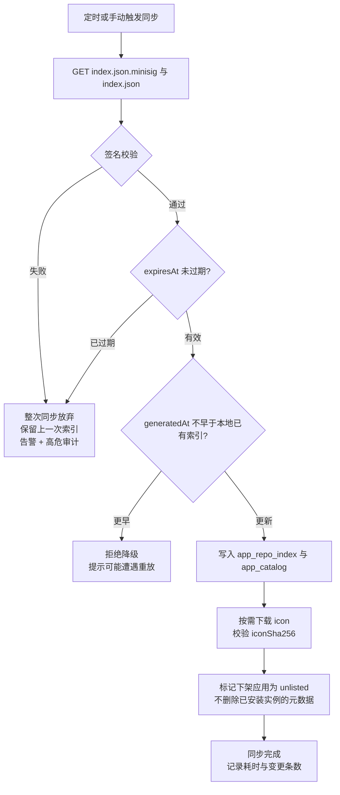

同步只拉索引与图标，**应用包在用户点击安装时才下载**。官方仓库全量索引约 400 KB、图标合计约 3 MB，而所有应用包总和会到几十 MB 且绝大多数永远不会被安装。

签名校验用 minisign（Ed25519），公钥内置于面板二进制并可通过 `novactl repo trust` 追加第三方仓库公钥。校验失败时的处理是**整次同步放弃并保留上一次索引**，而不是部分接受——一份被篡改的索引里，无法区分哪些条目可信。同步失败不影响已安装实例的运行，只影响新装与升级发现。

| 校验项 | 失败处理 | 审计级别 |
| --- | --- | --- |
| 索引签名 | 放弃同步，保留旧索引 | 高危（可能为中间人攻击） |
| 索引有效期 | 放弃同步，提示检查时间与网络 | 一般 |
| `generatedAt` 回退 | 拒绝，提示疑似重放 | 高危 |
| 图标哈希 | 跳过该图标用占位图，应用条目仍可用 | 忽略 |
| 应用包哈希 | 中止安装，删除临时文件 | 高危 |
| 包内 `app.yaml` 与索引元信息不一致 | 中止安装 | 高危 |

最后一项容易被忽略但很重要：索引里写 `wordpress 6.6.1`，包里的 `app.yaml` 却写着别的 `code` 或 `version`，说明发布流程出错或包被替换，必须中止而不是「以包为准」。

### 13.5.4 多仓库、冲突与离线导入

面板支持挂载多个仓库，每个仓库有独立的 `repoCode`、优先级、启用开关与公钥。应用的全局唯一标识是 `repoCode/appCode`（如 `official/wordpress`），**不做跨仓库的 code 合并**。两个仓库都提供 `wordpress` 时，列表里显示为两个条目并标注来源仓库，用户自己选。合并会引出「哪个版本更新就用哪个」这类隐式行为，而应用包的差异（参数、卷布局、钩子）远大于版本号能表达的信息，混用两个来源的包升级同一实例几乎必然出问题。实例创建后其 `repo_code` 固定，升级只在同一仓库内查找版本。

| 场景 | 行为 |
| --- | --- |
| 多仓库有同名 code | 分别展示，标注仓库来源；搜索结果按仓库优先级排序 |
| 实例所属仓库被删除 | 实例继续运行；升级与重装不可用，页面提示「来源仓库已移除」 |
| 实例所属版本在索引中下架 | 实例继续运行；重装该版本仍允许（元数据已本地留存） |
| 仓库地址变更 | 视为新仓库；提供「迁移实例归属」操作，需人工确认包结构兼容 |

离线环境用 `novactl repo import bundle.tar.zst` 导入离线包。离线包是「索引 + 全部应用包 + 图标 + 签名」的完整快照，导入时执行与在线同步完全相同的校验链，**不因为是本地文件就跳过签名**。制作离线包的命令是 `novactl repo bundle --repo official --out bundle.tar.zst`，需在能联网的机器上执行。离线包也可用于内网分发：一台机器下载，其余节点从它导入。

面板本地对应用包做内容寻址缓存，路径 `data/appstore/packages/<sha256前2位>/<sha256>.tar.zst`，默认上限 2 GB、LRU 淘汰。同一版本在多节点安装时只从上游下载一次，其余节点通过控制面分发（走 10 号的 Agent 通道，不要求 Agent 能访问公网）——这一点对内网隔离的被控节点是硬需求。

## 13.6 应用实例生命周期

### 13.6.1 实例状态机

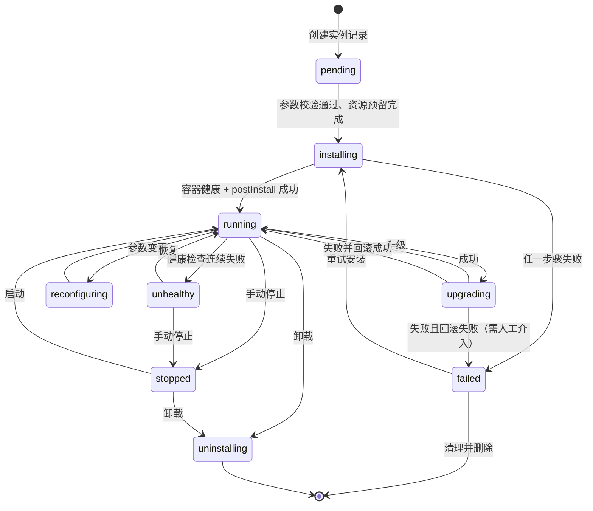

`unhealthy` 是独立状态而不是 `running` 的子标记，因为它需要不同的界面呈现（黄色告警 + 直达日志与健康检查详情）与不同的操作约束——处于 `unhealthy` 的实例禁止升级，先解决健康问题。`upgrading` 失败且回滚也失败时进入 `failed` 并**在实例详情页顶部固定显示人工恢复指引**（含备份恢复入口与手动命令），这是唯一需要人工介入的状态，不做自动重试，因为在数据可能已部分迁移的情况下重试会加剧损坏。

状态由两个来源共同决定：面板自身的操作流转（`installing`/`upgrading` 等瞬态）与容器实际状态的周期性对账。对账每 30 秒执行一次，发现「面板认为 running 但容器已退出」时更新为 `stopped` 并记录一条 `container_exited_externally` 事件——用户可能在终端里直接 `docker stop`，面板不假设自己是唯一的操作者。

### 13.6.2 安装流程

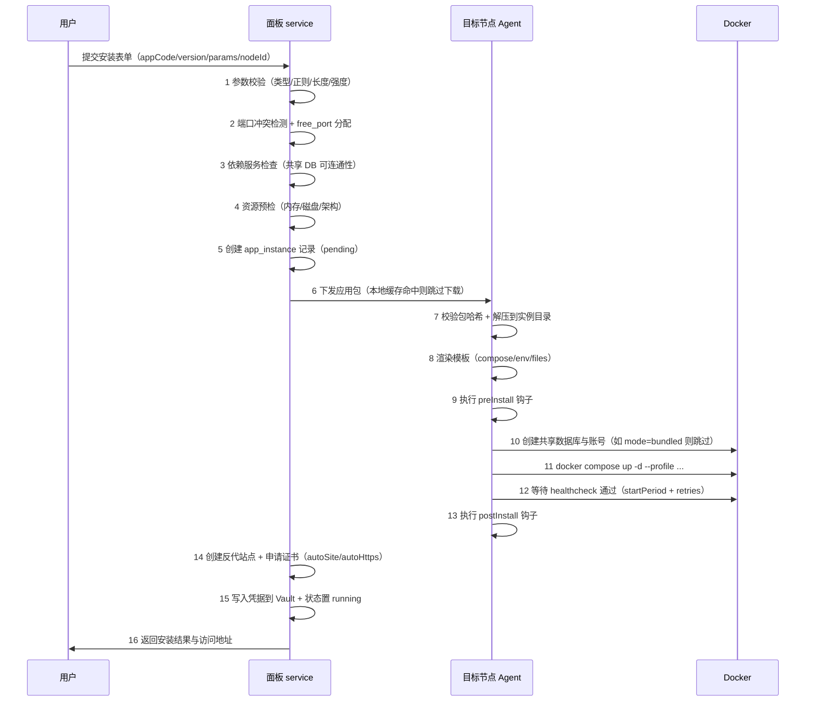

十六个步骤里，前五步在控制面完成且可快速失败——参数错误、端口冲突、内存不足这些问题不应该等到下发到节点才发现。第 6 步之后的失败都需要清理，清理规则见下节。

第 12 步的等待上限是 `startPeriodSec + intervalSec × retries`，超时后**不立即判失败，而是再宽限一个 `startPeriodSec`**：首次启动的数据库初始化在慢磁盘上确实可能超过预估，而误判失败会触发清理并销毁刚初始化的数据。宽限期内界面显示「启动较慢，仍在等待」并给出实时日志。

第 14 步的证书申请失败**不导致整个安装失败**。域名解析未生效是极常见的情况，此时实例已经健康运行，把它回滚掉是过度反应。处理方式是站点以 HTTP 创建、实例状态 `running`、在实例详情与站点列表标记「证书待签发」并加入 07 号的重试队列。

### 13.6.3 安装失败的清理规则

安装不是数据库事务，无法整体回滚，只能按「已完成到哪一步」逐项补偿。补偿动作必须容忍「要清理的东西其实没创建成功」。

| 失败发生的步骤 | 需清理的资源 | 保留的内容 | 说明 |
| --- | --- | --- | --- |
| 6~8 下发/解压/渲染 | 实例目录 | 无 | 尚未产生外部资源 |
| 9 preInstall 失败 | 实例目录、钩子产生的文件 | 钩子输出日志 | 钩子必须自行清理其副作用 |
| 10 创建数据库失败 | 实例目录、已创建的库与账号 | 无 | 库已存在时按 `800011 ErrAppDBExists` 报错而非复用 |
| 11 compose up 失败 | `compose down -v`、实例目录、库与账号 | compose 输出日志 | `-v` 会删卷，此时卷内无用户数据 |
| 12 健康检查超时 | 同上，但**默认保留卷** | 容器日志 + 卷 | 见下文 |
| 13 postInstall 失败 | 按 `onFail` 决定 | 容器 + 卷 + 日志 | `abort` 则回滚，`warn` 则置 running 并告警 |
| 14 站点/证书失败 | 不清理 | 全部 | 实例可用，仅标记证书待签发 |

第 12 步「默认保留卷」是与前几步不同的选择。健康检查超时的原因往往是配置问题（数据库密码错、端口被占），而此时数据库容器可能已经完成了耗时数分钟的初始化。删掉卷让用户改个密码重装一次要再等一遍，而保留卷则可以让用户改配置后直接重试。界面在这种情况下提供两个按钮：「修改参数并重试」（保留卷）与「彻底清理」（删卷）。默认停在 `failed` 状态等用户选择，超过 7 天未处理的 `failed` 实例由清理任务连卷一起删除并提前 24 小时告知。

清理本身也会失败（Docker 守护进程挂了、磁盘只读）。此时实例状态置 `failed` 并在 `app_instance.cleanup_pending` 记下未完成的清理项，由后台任务每 10 分钟重试，最多 24 小时。残留资源在「应用 → 孤儿资源」页面统一列出，包括无实例关联的卷、网络、库，提供手动清理入口。不做自动扫描删除——判断一个卷是否真的无主需要的上下文比面板掌握的更多。

### 13.6.4 实例数据模型与并发控制

```go
// internal/model/app.go
type AppInstance struct {
    ID          int64  `gorm:"primaryKey"`
    Name        string `gorm:"size:64;uniqueIndex:uk_node_name"`  // 用户可见名，节点内唯一
    NodeID      int64  `gorm:"uniqueIndex:uk_node_name;index"`
    RepoCode    string `gorm:"size:32;not null"`
    AppCode     string `gorm:"size:64;not null;index"`
    Version     string `gorm:"size:32;not null"`
    Status      string `gorm:"size:16;not null;index"`  // 见 13.6.1
    HealthState string `gorm:"size:16"`                 // healthy/unhealthy/unknown/none
    DataDir     string `gorm:"size:255;not null"`
    ProjectName string `gorm:"size:64;not null"`        // compose project name
    ParamsJSON  string `gorm:"type:text"`               // 非敏感参数，敏感项存 Vault 引用
    PortsJSON   string `gorm:"type:text"`               // 已分配端口，供冲突检测快速查询
    SiteID      *int64 `gorm:"index"`                   // 关联的反代站点，可空
    DBRefsJSON  string `gorm:"type:text"`               // 关联的库与账号，卸载时按此清理
    LockOwner   string `gorm:"size:64"`                 // 持有操作锁的任务 ID
    LockedUntil *time.Time
    CleanupPending string `gorm:"type:text"`
    LastOpError    string `gorm:"type:text"`            // 最近一次失败的原因，界面直接展示
    CreatedBy   int64
    CreatedAt   time.Time
    UpdatedAt   time.Time
    DeletedAt   gorm.DeletedAt `gorm:"index"`
}
```

`ParamsJSON` 只存非敏感参数，`type: password` 的参数在此处存 `{"DB_PASSWORD":"$vault:app/12/DB_PASSWORD"}` 形式的引用，实际值走 12.20 的 Vault。这样导出实例配置、写入审计、打印日志时都不会带出密码——**让敏感值在主表里根本不存在，比在每个出口做脱敏更可靠**。

每个实例的变更操作（安装、升级、参数变更、卸载、恢复）通过 `LockOwner` + `LockedUntil` 串行化。锁是**数据库层面的乐观锁 + 超时自动释放**：加锁时 `UPDATE ... WHERE id=? AND (lock_owner='' OR locked_until < NOW())`，影响行数为 0 则返回 `800012 ErrAppInstanceBusy`。超时时长按操作类型给不同值（参数变更 5 分钟、升级 30 分钟、恢复 2 小时），任务正常结束时主动释放。选超时释放而非常驻锁，是因为面板重启或任务进程被杀会留下永久锁，而「锁最多卡住 30 分钟」比「需要人工去数据库里解锁」体验好得多。锁被超时抢占时，原任务在写回结果前会检查 `LockOwner` 是否仍是自己，不是则放弃写入并记录冲突事件。

备份与监控读取属于只读操作，不加锁。但备份执行期间若发生升级，会得到不一致的快照，因此**备份任务加共享标记而非排他锁**：`app_instance.backing_up_until` 存在时，升级与卸载操作返回 `800012 ErrAppInstanceBusy` 提示「正在备份」，参数变更允许（不改数据只改配置）。

## 13.7 参数变更、升级与卸载

### 13.7.1 参数变更的四级生效策略

`app.yaml` 里每个参数的 `changeImpact` 决定改动如何落地。v1.0 定义四级，界面在用户修改表单时实时提示本次改动会造成什么影响。

| 级别 | 生效方式 | 服务中断 | 典型参数 | 界面提示 |
| --- | --- | --- | --- | --- |
| `hot` | 重写配置文件 + 容器内 reload | 无 | `PHP_MEMORY_LIMIT`、`UPLOAD_MAX_MB`、`WP_DEBUG` | 「立即生效」 |
| `restart` | 重写 `.env` 与配置 + `compose up -d`（重建受影响容器） | 秒级 | `HTTP_PORT`、`SITE_DOMAIN`、`DISABLE_REGISTRATION` | 「需重启容器，约中断 5~15 秒」 |
| `recreate` | 停止 + 删除容器 + 按新参数重建（保留卷） | 十秒级 | `MYSQL_VERSION`、`ENABLE_REDIS`（涉及 profile 变化） | 「需重建容器，数据保留，约中断 30 秒」 |
| `immutable` | 不允许修改 | — | `DB_NAME`、`TABLE_PREFIX`、`DB_MODE` | 字段置灰 + 说明原因 |

`immutable` 参数在界面上**显示但禁用，并把不可改的原因写在字段下方**，而不是干脆隐藏。用户会疑惑「表前缀在哪里改」，看到置灰的字段加一句「安装后不可修改，如需变更请新建实例并迁移数据」，比找不到字段要好。

变更提交后的执行顺序固定：校验新值 → 计算差异并归类到最高级别 → 写 `audit_change`（12.11） → 备份当前 `.env` 与配置到 `data/appstore/instances/<id>/history/<ts>/` → 应用变更 → 健康检查 → 失败则用刚才的备份回滚。配置历史保留最近 20 次，「回滚到此版本」的行为与 12.11 一致：**把历史值填回表单让用户确认，不直接写库**。历史配置里的端口可能已被别的实例占用，直接套用会创建出一个起不来的实例。

`hot` 级别的 reload 具体做什么由应用包声明：

```yaml
paramApply:
  - codes: [PHP_MEMORY_LIMIT, UPLOAD_MAX_MB]
    renders: [files/php-custom.ini.tmpl]
    reload: { service: web, exec: ["kill", "-USR2", "1"] }   # PHP-FPM 平滑重载
  - codes: [WP_DEBUG]
    renders: [files/wp-config-extra.php.tmpl]
    reload: { none: true }                                    # PHP 每次请求读配置，无需重载
```

`reload.exec` 失败时降级为 `restart` 并在结果里说明「平滑重载失败，已改为重启容器」。不静默忽略——配置改了但没生效是最难排查的一类问题。

### 13.7.2 升级与回滚

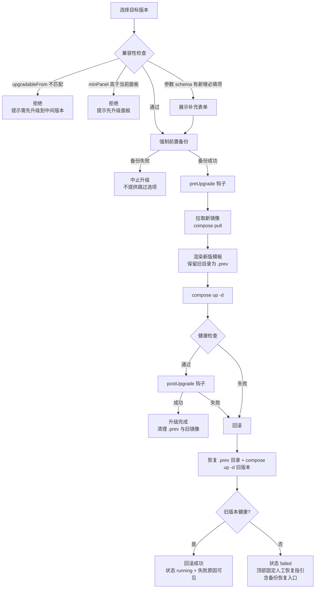

**前置备份不提供「跳过」选项**，这是升级流程里唯一的强制项。理由很直接：升级失败的补偿手段只有回滚容器与恢复数据两条，而容器回滚对已执行过 `update-db` 的数据库无效。用户抱怨「我只是升级个小版本」是可以理解的，但一次不可恢复的数据损坏造成的代价远大于每次多等两分钟。为了减轻这个负担，升级前置备份**只备份 `backupItems` 中 `required: true` 的项且强制使用本地存储**（避免上传耗时），保留 7 天，不占用用户配置的保留策略额度。

回滚依赖 `.prev` 目录（旧版渲染结果）与旧镜像。因此升级成功后才清理旧镜像，且 `docker image prune` 类操作永不由升级流程发起。若节点磁盘不足无法同时容纳新旧镜像，升级在拉取阶段就会失败，此时未做任何变更，属于安全失败。

### 13.7.3 参数 schema 跨版本演进

新版本的 `params` 可能与旧版不同。面板按四种情况处理，规则写进包校验（13.3），发布时就能发现问题而不是留给用户。

| 变化 | 处理 | 是否允许 |
| --- | --- | --- |
| 新增可选参数（有 default） | 用 default 填充，不打扰用户 | 允许 |
| 新增必填参数（无 default） | 升级页展示补充表单 | 允许 |
| 删除参数 | 旧值保留在 `params_json` 的 `_orphaned` 子对象中，不参与渲染 | 允许 |
| 修改参数的 `code` | 视为「删除 + 新增」，旧值丢失 | 包校验告警，要求作者提供 `renamedFrom` |
| 修改参数的 `type` 或 `immutable` 属性 | 包校验直接拒绝发布 | 不允许 |

保留 `_orphaned` 而非直接丢弃删除的参数，是为了支持降级重装：用户从 6.6 回退到 6.5 时，6.5 需要的那个参数还在。这份残留数据不参与任何渲染，只在重装旧版本时被查找。

`renamedFrom` 的写法是 `{ code: SITE_URL, renamedFrom: [BASE_URL] }`，升级时按此迁移旧值。包校验检查「新版本缺少的 code 是否都出现在某个参数的 `renamedFrom` 里」，未覆盖的给出告警但不阻断——确实存在「这个参数不需要了」的正当情况，作者可通过 `removedParams: [OLD_CODE]` 显式声明来消除告警。

### 13.7.4 卸载

卸载是不可逆操作，界面要求输入实例名确认，并携带 `X-Confirm-Token`（05 号 5.4）。用户需要就三项资源分别做出选择，**默认值全部偏保守**。

| 资源 | 默认 | 可选 | 说明 |
| --- | --- | --- | --- |
| 数据卷与实例目录 | 保留 | 删除 | 保留时移入 `data/appstore/orphaned/<instanceId>-<ts>/`，在孤儿资源页可见 |
| 自动创建的数据库 | 保留 | 删除 | 仅限 `DBRefsJSON` 中标记 `created_by_instance` 的库；共享库永不删 |
| 反代站点与证书 | 保留 | 删除 | 保留时站点变为「后端不可用」状态，避免误删用户配好的域名与证书 |

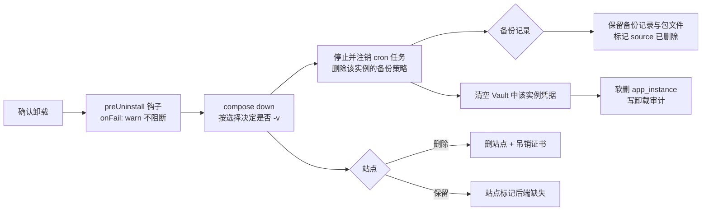

`preUninstall` 钩子的 `onFail` 强制为 `warn`：钩子失败不能阻止卸载。用户点卸载往往正是因为实例已经不正常，此时钩子大概率也跑不通，如果因此卡住卸载流程，用户只能去命令行手工清理，反而更糟。钩子输出照常留存，供事后查看。

**备份记录与备份包在卸载后一律保留**，只把 `bak_record.source_deleted` 置位。理由是「卸载后发现删错了」是真实存在的场景，而备份是唯一的挽回手段；如果跟着实例一起删掉，这个场景就彻底无解。这些记录仍受保留策略约束，到期正常淘汰，界面在备份列表中显示为「来源已删除」并允许恢复到新实例（13.14.4）。

卸载后同名实例可以立即重建。若上一次卸载选择了保留卷，重建时**不自动复用旧卷**，而是在创建表单里提示「检测到同名实例的历史数据，可选择挂载」——自动复用会让「重装以解决问题」这个常见操作变得无效，因为问题往往就在数据里。

## 13.8 应用与网站、数据库的联动

### 13.8.1 三方职责边界

应用商店不重新实现反代与建库，而是调用 07 号的站点服务与数据库服务。边界划分如下，任何一方都不越界写另一方的表。

| 能力 | 归属模块 | 应用商店的角色 | 表 |
| --- | --- | --- | --- |
| 反代站点、证书、HTTP 配置 | 网站与运行环境 | 调用方，传入 upstream 与选项 | `web_site`、`web_cert` |
| 建库、建账号、授权、密码轮换 | 数据库服务 | 调用方，传入库名与权限范围 | `dbs_database`、`dbs_account` |
| 容器编排、启停、日志 | 容器与编排 | 调用方，`source='app'` 标记归属 | `ct_compose_project` |
| 参数、版本、钩子、实例状态 | 应用商店 | 拥有者 | `app_*` |

关联关系存在 `app_instance` 一侧（`site_id`、`db_refs_json`、`compose_project_id`），反向由被关联方通过 `source`/`source_id` 标记来源。这样查询「这个站点是谁创建的」与「这个实例用了哪些库」都是一次索引查找，代价是关系存了两处，由 13.8.4 的对账任务保证一致。

### 13.8.2 自动建站与 HTTPS

`expose.autoSite: true` 的应用在安装第 14 步创建反代站点。生成的站点配置由 `expose` 字段决定，不给应用包提供写 nginx 原始配置的能力——**允许应用包注入任意 nginx 片段等于把面板的配置校验与 WAF 边界打开一个洞**，第三方包不可信。需要特殊配置的场景通过 `extraProxyHeaders` 这类受限字段表达，字段不够用时走应用包提交流程扩展规范。

| `expose` 字段 | 生成的配置 | 无域名时的行为 |
| --- | --- | --- |
| `primaryPortCode` + `scheme` | `proxy_pass http://127.0.0.1:<port>` | 同 |
| `domainParamCode` | `server_name` | 站点不创建，用 `IP:端口` 直接访问 |
| `autoHttps` | 申请证书 + 强制跳转 + HSTS | 不适用 |
| `basePath` | `location <basePath>` + 路径重写 | 同 |
| `websocket` | `Upgrade`/`Connection` 头 + 读超时 3600s | 同 |
| `clientMaxBodySize` | `client_max_body_size` | 同 |
| `healthPath` | 面板健康探测路径，不写入 nginx | 同 |

域名为空时不创建站点，界面给出「当前通过 `http://<IP>:<端口>` 访问，建议绑定域名以启用 HTTPS」并提供一键绑定入口，绑定后走 `changeImpact: restart` 流程重建站点。不默认创建 IP 站点，因为一台机器上多个应用共用 IP 时 `server_name _` 会互相抢占。

域名解析检查用 `checkResolve: warn`：解析结果与本机公网 IP 不一致时给出警告但允许继续。用户可能在配 CDN、可能刚改 DNS 还没生效、可能在内网用 hosts，把它做成硬校验会挡掉大量正当场景。真正的硬校验发生在证书申请阶段，由 ACME 自己给出准确的失败原因。

### 13.8.3 数据库依赖的两种模式

`requires.services` 里 `mode: bundled_or_shared` 的依赖，安装表单让用户在两者间选。

| 维度 | `bundled`（随应用创建） | `shared`（复用已有实例） |
| --- | --- | --- |
| 运行位置 | 同 compose 项目内的独立容器 | 面板已管理的数据库服务或外部地址 |
| 数据卷 | 应用自己的卷，`backup: false`（由逻辑备份覆盖） | 不属于本实例 |
| 建库建号 | 容器首次启动时由镜像的 `MYSQL_DATABASE` 环境变量完成 | 面板调用数据库服务创建，最小权限授权 |
| 密码 | 面板生成，存 Vault | 面板生成，存 Vault |
| 备份 | `backupItems` 的 `database` 项做逻辑备份（`mysqldump`/`pg_dump`） | 同 |
| 卸载 | 随 compose 一起删除 | 按用户选择删除本实例创建的库，不动其他库 |
| 适用 | 单应用、想要完全隔离、不想运维数据库 | 多应用共享一套数据库、已有主从或云 RDS |
| 代价 | 每个应用一个数据库容器，内存占用叠加 | 单点影响面扩大，版本需兼容所有使用方 |

`shared` 模式在安装前预检三项：连通性（TCP + 认证）、引擎与大版本满足 `requires.services.version` 约束、目标库名不存在。库名已存在时**报错而不是复用**——复用一个已有库可能覆盖别人的数据，而这个操作在安装向导里无法被充分确认。用户确实想复用时，走「导入已有数据」路径（13.14.4 的恢复到新实例）。

最小权限授权按应用声明的需求给：绝大多数应用只需要在自己那一个库上的 `ALL`，不需要全局权限。`GRANT ALL ON app_wp.* TO 'wp_user'@'%'` 而非 `ON *.*`，且 `%` 在同机部署时收窄为 `172.x.%`（容器网段）。应用声明需要 `SUPER` 或全局权限时，包校验直接拒绝——没有正当的应用需要这些。

### 13.8.4 关联一致性对账

关联关系存在两处必然会漂移：用户可能在网站模块直接删掉应用创建的站点、可能在数据库模块删掉应用的库、可能在容器模块删掉 compose 项目。面板不阻止这些操作（在各自模块给出「此资源由应用 X 创建，删除后应用可能不可用」的提示），而是通过对账把漂移变成可见状态。

```go
// internal/service/appstore/reconcile.go
// 每 5 分钟执行，只读检查 + 状态标记，不做自动修复
func (s *Service) Reconcile(ctx context.Context) (*ReconcileReport, error) {
    rep := &ReconcileReport{}
    insts, err := s.repo.ListActive(ctx)
    if err != nil { return nil, err }
    for _, in := range insts {
        var issues []string
        if in.ComposeProjectID != nil && !s.ct.ProjectExists(ctx, in.NodeID, *in.ComposeProjectID) {
            issues = append(issues, "compose_project_missing")
        }
        if in.SiteID != nil && !s.web.SiteExists(ctx, *in.SiteID) {
            issues = append(issues, "site_missing")
        }
        for _, ref := range in.DBRefs() {
            if ref.CreatedByInstance && !s.dbs.DatabaseExists(ctx, ref.ServiceID, ref.Name) {
                issues = append(issues, "database_missing:"+ref.Name)
            }
        }
        if len(issues) > 0 {
            // 只写标记与事件，不尝试重建。重建需要用户决策：
            // 站点缺失可能是用户有意改用自己的反代；库缺失可能已迁移到外部
            s.repo.SetIntegrityIssues(ctx, in.ID, issues)
            s.ev.Emit(ctx, "app.integrity_issue", in.ID, issues)
            rep.Degraded++
        } else if in.IntegrityIssues != "" {
            s.repo.ClearIntegrityIssues(ctx, in.ID)   // 用户已自行恢复
        }
    }
    // 反向：找出标记了 source='app' 但 app_instance 已不存在的资源
    rep.Orphaned, _ = s.findOrphanedResources(ctx)
    return rep, nil
}
```

**只标记不修复**是这里的核心取舍。自动重建缺失的站点会覆盖用户有意的改动（他可能删掉面板站点改用自己的 nginx），自动重建缺失的库会得到一个空库并让应用报出更难理解的错误。实例详情页在有 `integrity_issues` 时显示黄色横幅，逐项列出缺失的资源并提供「重建此资源」按钮，由用户决定。

## 13.9 计划任务

### 13.9.1 定位与任务类型

计划任务是面板内**唯一的定时执行入口**。备份、日志切割、证书续期、漏洞库更新、监控数据降采样这些内部周期动作全部注册为 job，与用户手动创建的 job 共用同一套调度器、执行记录与告警。这条约束的收益是可观测性：用户在一个列表里能看到「面板到底在定时干什么」，而不是有一批看不见的内部定时器。

| 类型 | `job_type` | 参数要点 | 执行位置 | 内置 |
| --- | --- | --- | --- | --- |
| Shell 脚本 | `shell` | 脚本内容或路径、工作目录、执行用户、超时 | 节点 | — |
| 容器内命令 | `container_exec` | 容器 ID/服务名、命令数组、用户 | 节点 | — |
| HTTP 请求 | `http` | URL、方法、头、体、期望状态码 | 控制面 | — |
| 网站备份 | `backup_site` | 站点 ID 或全选、策略 ID | 节点 | — |
| 数据库备份 | `backup_db` | 库 ID 或全选、策略 ID | 节点 | — |
| 应用实例备份 | `backup_app` | 实例 ID、策略 ID | 节点 | — |
| 目录备份 | `backup_path` | 路径、排除规则、策略 ID | 节点 | — |
| 日志切割 | `log_rotate` | 目标日志、保留份数、压缩 | 节点 | ✓ |
| 证书续期 | `cert_renew` | 无（扫描到期证书） | 控制面 | ✓ |
| 数据维护 | `maintenance` | 子类型（监控降采样/审计归档/漏洞库更新/缓存清理） | 控制面 | ✓ |
| 恢复演练 | `restore_drill` | 演练方案 ID | 节点 | — |
| 任务编排 | `pipeline` | 子任务 ID 有序列表 | 混合 | — |

内置任务（`is_builtin = 1`）可以暂停与调整时间，**不能删除也不能改类型**。删除「证书续期」这类任务会造成静默的功能缺失，而用户往往在证书过期后才发现。暂停内置任务时界面给出后果说明并写审计。

### 13.9.2 数据模型

```go
// internal/model/job.go
type JobCron struct {
    ID          int64  `gorm:"primaryKey"`
    Name        string `gorm:"size:128;not null"`
    JobType     string `gorm:"size:32;not null;index"`
    CronExpr    string `gorm:"size:64;not null"`      // 5 段，秒级不支持
    Timezone    string `gorm:"size:64;not null"`      // 默认取面板时区，任务级可覆盖
    NodeID      *int64 `gorm:"index"`                 // nil 表示控制面执行
    NodeScope   string `gorm:"size:16"`               // single/all/tag，批量任务用
    ParamsJSON  string `gorm:"type:text"`
    Enabled     bool   `gorm:"not null;default:true;index"`
    IsBuiltin   bool   `gorm:"not null;default:false"`
    ConcurrencyPolicy string `gorm:"size:16;not null;default:skip"` // skip/queue/replace
    TimeoutSec  int    `gorm:"not null;default:3600"`
    RetryMax    int    `gorm:"not null;default:0"`
    RetryBackoffSec int `gorm:"not null;default:60"`
    JitterSec   int    `gorm:"not null;default:0"`     // 集群批量任务的随机延迟上限
    NotifyOn    string `gorm:"size:32;not null;default:failure"` // never/failure/always
    NotifyChannels string `gorm:"size:255"`
    KeepExecutions int `gorm:"not null;default:100"`
    OutputLimitKb  int `gorm:"not null;default:256"`
    LastRunAt   *time.Time
    LastStatus  string `gorm:"size:16"`
    NextRunAt   *time.Time `gorm:"index"`             // 冗余，列表页排序与「即将执行」看板用
    CreatedBy   int64
    CreatedAt   time.Time
    UpdatedAt   time.Time
    DeletedAt   gorm.DeletedAt `gorm:"index"`
}
```

不支持秒级 cron（6 段表达式）是有意的：秒级任务本质上是常驻服务，用 cron 表达会带来大量并发与堆积问题，正确做法是写成 systemd service。界面在用户输入 6 段表达式时明确提示这一点并给出替代建议，而不是笼统报「格式错误」。

`Timezone` 存在任务级别而非只用全局，是因为跨时区团队会需要「按业务所在地的凌晨 3 点执行」。夏令时切换日的处理遵循 robfig/cron 的语义：跳过的时刻不执行，重复的时刻只执行一次，并在任务详情页对处于夏令时地区的任务给出提示。

```go
type JobExecution struct {
    ID         int64  `gorm:"primaryKey"`               // 雪花 ID，天然时序
    JobID      int64  `gorm:"index:idx_job_start"`
    NodeID     *int64 `gorm:"index"`
    TriggerBy  string `gorm:"size:16;not null"`         // schedule/manual/api/pipeline/retry
    TriggerUID *int64                                   // 手动触发者，审计归属用
    Status     string `gorm:"size:16;not null;index"`   // running/success/failed/timeout/canceled/skipped
    Attempt    int    `gorm:"not null;default:1"`
    ExitCode   *int
    StartedAt  time.Time `gorm:"index:idx_job_start,sort:desc"`
    FinishedAt *time.Time
    DurationMs int64
    OutputPath string `gorm:"size:255"`   // logs/jobs/<jobID>/<execID>.log，大输出不进 DB
    OutputHead string `gorm:"type:text"`  // 前 8 KB，列表页预览用
    Truncated  bool
    ErrMsg     string `gorm:"type:text"`
    PipelineExecID *int64 `gorm:"index"`   // 属于某次 pipeline 的子执行
}
```

输出**不整体入库**。一个 `mysqldump` 的 stderr 可以有几十 MB，进 TEXT 字段会让 SQLite 的单表体积失控且列表页查询变慢。落地策略是：前 8 KB 存 `OutputHead` 供列表预览，全量写节点上的 `logs/jobs/<jobID>/<execID>.log`，用户点开详情时按需拉取（走 08 号的文件读取通道，支持 tail 与下载）。超过 `OutputLimitKb` 的部分从中间截断并插入 `[... 已截断 N 字节 ...]` 标记——保留头尾比只保留头部有用，失败原因常在最后几行。

### 13.9.3 调度器与集群选主

```go
// internal/service/cron/scheduler.go
type Scheduler struct {
    cron   *cron.Cron              // robfig/cron v3，WithSeconds 关闭
    mu     sync.RWMutex
    active map[int64]cron.EntryID   // jobID -> entry
    leader *lease.Leader            // 多控制面实例时的选主
    runner Runner
}

func (s *Scheduler) Start(ctx context.Context) error {
    // 单实例部署时 leader 恒为 true，不引入额外依赖
    s.leader.OnAcquired(func() {
        if err := s.reloadAll(ctx); err != nil { slog.Error("reload jobs", "err", err) }
        s.cron.Start()
        slog.Info("scheduler started as leader")
    })
    s.leader.OnLost(func() {
        // 停止调度但不打断正在执行的任务：执行中的任务由其自身的
        // 心跳续约保护，强行中断会留下半完成的备份
        s.cron.Stop()
        slog.Warn("leadership lost, scheduling paused, running jobs continue")
    })
    return s.leader.Run(ctx)
}

func (s *Scheduler) trigger(jobID int64, by string, uid *int64) {
    job, err := s.repo.Get(context.Background(), jobID)
    if err != nil || !job.Enabled { return }
    // 并发策略在触发点判定，而不是在执行器内部
    switch job.ConcurrencyPolicy {
    case "skip":
        if s.repo.HasRunning(jobID) {
            s.repo.RecordSkipped(jobID, "previous execution still running")
            return   // 记一条 skipped，让「为什么没跑」可查
        }
    case "replace":
        s.runner.CancelRunning(jobID)   // 发送取消信号，等待最多 30 秒
    case "queue":
        // 入队等待，队列深度上限 3，超过则丢弃并记 skipped
    }
    if job.JitterSec > 0 {
        time.Sleep(time.Duration(rand.Int63n(int64(job.JitterSec))) * time.Second)
    }
    s.runner.Run(job, by, uid)
}
```

选主用数据库租约（`sys_lease` 表，30 秒 TTL、10 秒续约），不引入 etcd 或 Redis 依赖。单实例部署时 `leader` 恒真且不产生任何额外查询。丢失领导权时**停止调度但不中断正在执行的任务**：一个跑了 20 分钟的备份被强行掐掉会留下不完整的包，而它自己的心跳续约足以让新 leader 知道「这个任务已有人在跑」。

抖动（`JitterSec`）对集群批量任务是必需的。50 个节点在 03:00:00 同时开始备份会打满共享的对象存储带宽与目标数据库。默认值按任务类型给：单节点任务 0，`NodeScope != single` 的任务默认 300 秒。界面把抖动展示为「实际执行时间在 03:00~03:05 之间随机」，避免用户困惑于「为什么没在整点执行」。

`skipped` 是一等状态而非无记录。「昨晚的备份为什么没有」这个问题，答案常常是「上一次还在跑」，没有记录就无从查起。`skipped` 记录不计入失败告警，但连续 5 次 skip 会触发一条「任务执行时长超过调度间隔」的告警——这说明配置本身有问题。

### 13.9.4 cron 表达式的输入体验

绝大多数用户不熟悉 cron 语法，这一块的设计投入直接决定计划任务模块好不好用。

| 能力 | 实现 | 说明 |
| --- | --- | --- |
| 可视化构造器 | 按「每天/每周/每月/每小时/间隔/自定义」六种模式生成表达式 | 默认打开构造器，表达式框可折叠展开 |
| 实时校验 | `cron.ParseStandard` 前端调用后端 `POST /cron/validate` | 错误定位到具体段位，如「第 3 段（日）取值 32 超出 1-31」 |
| 下次执行预览 | 返回未来 5 次执行时刻，带时区标注 | 立刻暴露 `0 0 31 2 *` 这类永不执行的表达式 |
| 永不执行检测 | 未来一年内无匹配时刻则拒绝保存 | 2 月 31 日、周三且 31 日等组合 |
| 高频警告 | 间隔小于 5 分钟时提示，小于 1 分钟时要求确认 | 不禁止，但要用户知道 |
| 自然语言描述 | 表达式转中文，如「每天 03:30」「每周一、周四 02:00」 | 列表页显示描述而非裸表达式 |
| 常用模板 | 「每天凌晨 3 点」「每周日凌晨」「每月 1 日」等 8 个预设 | 覆盖 80% 场景 |

「下次执行预览」是投入产出比最高的一项。`0 0 31 2 *` 语法完全合法但永远不会执行，只有预览能让用户当场发现。列表页显示自然语言描述而不是 `30 3 * * *`，让「面板在定时干什么」一眼可读。

### 13.9.5 执行、超时与重试

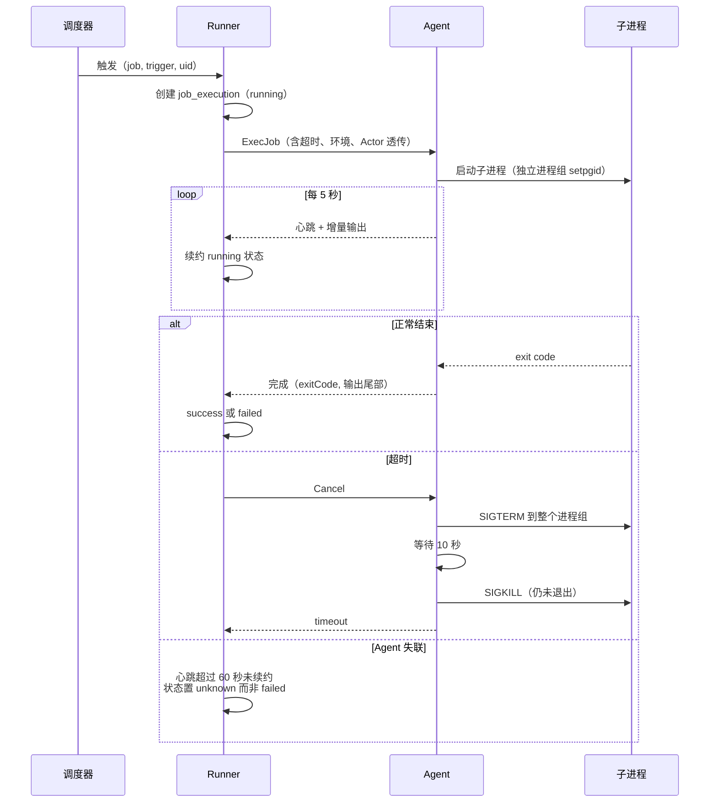

超时时向**整个进程组**发信号（`setpgid` + `kill(-pgid)`），而不是只杀直接子进程。`bash -c "mysqldump ... | gzip > f"` 这类命令杀掉 bash 后 `mysqldump` 会继续跑，留下一个既不被记录也不会结束的进程，下一次执行还会因为「上次还在跑」被 skip，形成永久卡死。

Agent 失联时状态置 `unknown` 而非 `failed`。任务可能已经成功完成，只是结果没传回来——直接判失败会触发不必要的告警与重试，而重试一个可能已完成的备份任务会造成重复数据。Agent 重连后上报本地执行记录，面板据此把 `unknown` 修正为最终状态；超过 24 小时未修正的 `unknown` 归档为 `failed` 并在描述里注明「因节点失联无法确认结果」。

重试的四条规则：只有 `failed` 与 `timeout` 触发重试（`canceled` 与 `skipped` 不重试）；退避为 `RetryBackoffSec × 2^(attempt-1)`，上限 30 分钟；重试产生新的 `job_execution` 记录并把 `Attempt` 递增，不覆盖原记录；**下一个调度周期到来时放弃剩余重试**——一个每小时执行的任务不该在下一小时的实例已经开始后还在重试上一小时的。

### 13.9.6 告警与通知

失败通知走 11 号的通知通道，不自建。通知策略的三处细节：

`NotifyOn = failure` 是默认值。`always` 在任务较多时会产生大量噪音，用户很快学会忽略这些通知，反而导致真正的失败被漏掉。首次成功执行仍会发一条「任务已按计划首次执行成功」，因为「我配的任务到底跑起来了吗」是新建任务后最关心的问题。

**连续失败合并**：同一任务连续失败时按 1、2、4、8 次的节奏通知，而不是每次都发。备份目标不可达这类问题会连续失败几十次，逐次通知等于把通知渠道变成垃圾。合并期间告警在面板内仍是持续可见的状态，只是不重复推送。

失败摘要里带**可直接行动的信息**：任务名、节点、失败原因（`ErrMsg`）、输出末尾 20 行、执行详情的直达链接。不带完整输出——通知渠道有长度限制，且完整输出在 IM 里不可读。

### 13.9.7 手动触发与强制停止

手动触发（`POST /cron/jobs/{id}/run`）与调度触发走完全相同的执行路径，只是 `TriggerBy = manual` 并记录触发者。这一点保证了「手动跑一次看看」的结果可以推断定时执行的结果。手动触发同样受 `ConcurrencyPolicy` 约束，`skip` 策略下正在执行时返回 `ErrJobRunning` 并提示当前执行的详情链接。

被禁用（`Enabled = false`）的任务**仍可手动触发**。用户禁用任务往往是为了「先不自动跑，我手动控制」，此时禁止手动触发没有道理。界面在禁用任务上保留运行按钮并标注「任务已暂停，本次为手动执行」。

强制停止（`POST /cron/executions/{id}/cancel`）对不同任务类型的语义不同，界面必须说清楚，否则用户会以为「停止」等于「撤销」：

| 任务类型 | 停止的效果 | 是否留下中间状态 |
| --- | --- | --- |
| `shell` / `container_exec` | 进程组收到 SIGTERM → SIGKILL | 脚本已做的事不会撤销 |
| `http` | 取消请求上下文 | 服务端可能已处理完 |
| `backup_*` | 中止传输，删除未完成的临时包 | 不留残包，已上传分片会 abort |
| `pipeline` | 当前子任务按其类型停止，后续子任务不再执行 | 已完成的子任务不回滚 |
| `restore_drill` | 停止并清理演练环境 | 不影响生产数据 |

`backup_*` 的「不留残包」是硬要求：一个中断的备份包如果留在存储里且被记录为可用，会在恢复时造成灾难。实现上是「先写 `.partial` 后缀，完成并校验后才 rename」，取消时直接删除 `.partial` 文件并对分片上传调用 `AbortMultipartUpload`。

### 13.9.8 串行编排（pipeline）

v1.0 只做串行 DAG，不做并行分支、条件跳转与人工审批节点。运维场景里 95% 的编排需求是「按顺序跑几个任务，前一个失败就别继续了」，为剩下 5% 引入一套工作流引擎的复杂度不划算。

```yaml
# job_type: pipeline 的 ParamsJSON 结构
steps:
  - { jobId: 12, name: 停止应用容器, onFail: abort }
  - { jobId: 15, name: 备份数据库, onFail: abort }
  - { jobId: 18, name: 执行数据清理脚本, onFail: continue, timeoutSec: 1800 }
  - { jobId: 12, name: 启动应用容器, onFail: abort, always: true }
maxTotalSec: 7200
```

三个语义点。`onFail: abort` 中止后续步骤，`continue` 继续；`always: true` 的步骤**无论前面是否失败都会执行**，用于「不管怎样都要把服务拉起来」这类收尾动作，这是不做完整工作流引擎时唯一必需的例外机制。同一个 `jobId` 可以在 steps 里出现多次（上例的停止与启动是同一个容器管理任务的不同参数，通过 `paramsOverride` 区分）。

`maxTotalSec` 是整条流水线的总超时，独立于各步骤的超时。防的是「每步都没超时但加起来跑了 8 小时」，此时下一个调度周期早已到来。超时后按 `always` 规则执行收尾步骤再终止。

pipeline 的执行记录是父子结构：一条 `PipelineExecID` 为空的父记录 + 每个步骤一条子记录。界面用可展开的时间线展示，每个步骤显示耗时与状态，失败步骤默认展开输出。禁止 pipeline 嵌套 pipeline（包含检查在保存时执行），避免循环引用与超时语义混乱。

## 13.10 备份存储后端抽象

### 13.10.1 Storage 接口

备份不直接调用任何具体 SDK，一律经 `Storage` 接口。这套接口与 08 号文件管理的远程挂载共用实现（`internal/storage`），凭据也共用一套 `bak_storage` 记录——用户不需要为「备份到 S3」和「浏览 S3」各配一次。

```go
// internal/storage/storage.go
type Storage interface {
    Kind() string
    // Put 上传对象。size 为 -1 表示未知（流式），实现需自行处理分片。
    // 返回实际写入字节数与远端 etag（可能为空，不是所有后端都提供）。
    Put(ctx context.Context, key string, r io.Reader, size int64, opt PutOptions) (*PutResult, error)
    Get(ctx context.Context, key string, rng *ByteRange) (io.ReadCloser, error)
    Stat(ctx context.Context, key string) (*ObjectInfo, error)
    List(ctx context.Context, prefix string, opt ListOptions) ([]ObjectInfo, string, error)
    Delete(ctx context.Context, keys []string) (deleted int, err error)
    // Usage 返回已用与总容量。多数对象存储无法给出总容量，Total 返回 -1。
    Usage(ctx context.Context) (*UsageInfo, error)
    Caps() Caps
    Close() error
}

type Caps struct {
    Multipart        bool  // 支持分片上传与断点续传
    RangeRead        bool  // 支持 Range 读，粒度恢复必需
    ServerSideCopy   bool  // 支持远端复制，异地副本可免下载
    ObjectLock       bool  // 支持 WORM 保留，防勒索
    PresignedURL     bool  // 支持预签名，大文件下载可绕过面板
    AtomicRename     bool  // 支持原子改名，.partial 转正式名靠它
    MaxObjectSize    int64 // 单对象上限，-1 无限制
    ConsistentList   bool  // List 强一致，弱一致时删除后校验需重试
}
```

`Caps` 存在的原因是后端能力差异巨大，而备份流程需要按能力选择不同路径。不支持 `AtomicRename` 的后端（部分 WebDAV 实现）改用「上传到 `.partial` key → 校验 → 复制到正式 key → 删除 `.partial`」，多一次复制但语义等价。不支持 `RangeRead` 的后端无法做粒度恢复，界面在该存储上把「恢复单个文件」入口置灰并说明原因，而不是让用户点了之后失败。

### 13.10.2 十类后端

| `kind` | 实现 | Multipart | Range | ObjectLock | 适用与注意 |
| --- | --- | --- | --- | --- | --- |
| `local` | 本地文件系统 | — | ✓ | — | 默认。与被备份数据同机，只防误删不防硬件故障，界面明示 |
| `nfs` | 挂载点 + 文件系统 | — | ✓ | — | 需先挂载好，面板只校验可写；断连时表现为 IO 卡住，需设超时 |
| `s3` | AWS SDK v2 | ✓ | ✓ | ✓ | 通用 S3 协议，兼容 MinIO、Ceph RGW |
| `oss` | 阿里云 OSS SDK | ✓ | ✓ | ✓ | 单独实现而非套 S3 兼容层，避免签名版本差异 |
| `cos` | 腾讯云 COS SDK | ✓ | ✓ | ✓ | 同上 |
| `obs` | 华为云 OBS SDK | ✓ | ✓ | ✓ | 同上 |
| `bos` | 百度云 BOS SDK | ✓ | ✓ | — | — |
| `webdav` | gowebdav | 部分 | 部分 | — | 实现质量差异大，连通性测试需覆盖 Range 与 Rename 探测 |
| `sftp` | golang.org/x/crypto/ssh | — | ✓ | — | 复用 08 号的 SSH 连接池；大量小文件时性能差 |
| `ftp` | jlaffaye/ftp | — | 部分 | — | 仅为兼容老环境保留；明确提示凭据明文传输风险 |

云厂商各自用官方 SDK 而不是统一走 S3 兼容接口，是因为兼容层在分片上传、服务端加密、生命周期规则这些地方行为不一致，出问题时难以定位。多写四份实现的代价换来的是「配了就能用」。

WebDAV 的实现质量差异是实际踩坑点：有的服务端不支持 `MOVE`、有的 Range 请求返回 200 而非 206、有的 `PROPFIND` 深度语义不同。连通性测试对 WebDAV **额外做能力探测**（上传 1 KB 测试对象 → Range 读中间 100 字节 → Rename → 删除），把探测结果写入 `bak_storage.caps_json` 并据此调整备份路径。

`local` 存储在界面上有一条不可关闭的提示：「本地存储与被备份数据在同一台机器，无法应对磁盘损坏、服务器丢失、勒索软件加密。强烈建议至少配置一个异地存储。」首次创建备份策略且只选了 local 时，确认对话框里重复这条提示。这不是过度提醒——「备份在同一块盘上」是最常见也最致命的配置错误。

### 13.10.3 存储配置与连通性测试

```go
type BakStorage struct {
    ID         int64  `gorm:"primaryKey"`
    Name       string `gorm:"size:64;not null;uniqueIndex"`
    Kind       string `gorm:"size:16;not null"`
    Endpoint   string `gorm:"size:255"`
    Region     string `gorm:"size:64"`
    Bucket     string `gorm:"size:128"`
    PathPrefix string `gorm:"size:255;not null;default:novapanel"`
    AccessKey  string `gorm:"size:255"`         // 明文存，非机密
    SecretRef  string `gorm:"size:128"`         // Vault 引用，见 12.20
    ExtraJSON  string `gorm:"type:text"`        // 后端特有项：pathStyle、storageClass、sshKeyRef 等
    CapsJSON   string `gorm:"type:text"`        // 探测结果
    RateLimitKbps int  `gorm:"not null;default:0"`   // 0 不限
    MaxConcurrent int  `gorm:"not null;default:4"`
    QuotaGb    int    `gorm:"not null;default:0"`     // 0 不限，软配额
    UsedBytes  int64                                  // 周期性统计缓存
    UsageAt    *time.Time
    LastTestAt *time.Time
    LastTestOK bool
    LastTestErr string `gorm:"type:text"`
    Enabled    bool   `gorm:"not null;default:true"`
    NodeScope  string `gorm:"size:16;not null;default:all"` // all/list，哪些节点可用此存储
    NodeIDsJSON string `gorm:"type:text"`
}
```

`SecretRef` 而非直接存密文，让「凭据在哪里」只有一个答案（Vault），也让 12.20 的密钥轮换自动覆盖备份存储凭据。云 API Secret 属于 12.20 定义的**只写不读**类凭据：配置后界面只显示 `****`，需要更换时重新输入，不提供查看。SFTP 私钥同理。

连通性测试（`POST /backup/storages/{id}/test` 或创建时的预检）依次执行七步，任一步失败即返回，错误信息**指向具体原因而非笼统的「连接失败」**：

| 步骤 | 失败时的提示 |
| --- | --- |
| 1 DNS 解析 endpoint | 「无法解析 `xxx`，请检查地址拼写与节点 DNS 配置」 |
| 2 TCP 连通（5 秒超时） | 「无法连接 `host:port`，请检查网络与防火墙出站规则」 |
| 3 TLS 握手 | 「证书校验失败：`具体原因`。如为自建服务可勾选跳过校验」 |
| 4 认证 | 「认证被拒绝，请检查 AccessKey 与 Secret」 |
| 5 bucket/路径存在且可列举 | 「bucket `xxx` 不存在或无 List 权限」 |
| 6 写入测试对象 + 校验哈希 + 删除 | 「写入成功但读回内容不一致，存储可能有问题」/「无删除权限，保留策略将无法清理旧备份」 |
| 7 能力探测（Range/Rename/Multipart） | 不失败，结果写入 `CapsJSON` |

第 6 步的「无删除权限」是**警告而非失败**：只写不删的配置在防勒索场景是有意的（配合 Object Lock），但用户必须知道保留策略不会生效，否则存储会无限增长。测试报告把这类信息以警告项列出，允许保存。

存储用量（`Usage`）对多数对象存储无法直接获得总容量，只能通过 List 累加已用量，而这在对象数很多时代价高。策略是：`local`/`nfs`/`sftp` 用 `statfs` 直接拿真实容量；对象存储只统计**本面板 `PathPrefix` 下的已用量**且每 6 小时更新一次，`Total` 返回 -1，界面显示「已用 1.2 TB（总容量未知）」。`QuotaGb` 是面板层面的软配额，超出时新备份任务失败并告警，不做硬拦截式的边写边算（会显著降低吞吐）。

### 13.10.4 路径布局与传输控制

```
<PathPrefix>/
├── nodes/<nodeUUID>/
│   ├── site/<siteId>/2026/08/17/site-blog.example.com-20260817T030102Z-full.tar.zst
│   ├── db/<dbId>/2026/08/17/db-wp_main-20260817T031500Z-full.sql.zst
│   ├── app/<instanceId>/2026/08/17/app-wordpress-20260817T032000Z-full.tar.zst
│   └── path/<policyId>/2026/08/17/path-var-www-20260817T033000Z-incr-3.tar.zst
├── panel/2026/08/17/panel-config-20260817T040000Z-full.tar.zst
└── manifests/<recordId>.json           # 与包同名的清单副本，便于不解包查询内容
```

路径设计的三个考虑。带 `nodeUUID` 而非节点名：节点可以改名，UUID 不变，避免改名后历史备份「找不到归属」。日期分层到日：对象存储的 List 在单前缀对象过多时很慢，按日分层让「列出某天的备份」代价可控。文件名里带完整时间戳与 `full`/`incr-N` 标记：**即使数据库彻底丢失，运维也能只凭对象存储里的文件名理解这些包是什么**，这是灾难恢复（13.16）能走通的前提。

`manifests/` 目录单独存一份清单副本。恢复时先读清单确认内容再决定是否下载几十 GB 的包，比下载后解开再看要经济得多。清单同时是灾难恢复的索引：`novactl backup scan --storage s3-main` 通过遍历 manifests 目录重建备份记录表。

传输控制三项，都在存储级别配置而非全局，因为不同存储的带宽成本差异很大：

`RateLimitKbps` 用令牌桶包装 `io.Reader`（`golang.org/x/time/rate`），作用于单个传输流。多个并发流各自限速，总带宽是 `RateLimitKbps × 实际并发数`，界面明确标注这一点避免误解。限速对公网上传是必需的——一个 50 GB 的备份不限速会打满出口带宽，影响线上业务。

`MaxConcurrent` 限制同一存储上的并发传输数。对象存储默认 4，SFTP 默认 2（SSH 通道多路复用在大量并发时容易触发服务端限制），`local` 默认 2（磁盘随机 IO 不是越并发越快）。

分片大小按对象大小动态选：小于 100 MB 单次上传；100 MB~10 GB 用 32 MB 分片；大于 10 GB 用 128 MB 分片（S3 的 10000 分片上限决定了大文件必须用大分片）。断点续传保存 `uploadId` 与已完成分片列表到 `bak_record.resume_json`，重试时跳过已完成分片。超过 7 天未完成的分片上传由维护任务调用 `AbortMultipartUpload` 清理——**未清理的分片在多数云厂商仍然计费且不可见**，这是备份存储账单异常增长的常见原因。

## 13.11 备份策略

### 13.11.1 八类备份对象

| `source_type` | 备份内容 | 一致性手段 | 增量支持 | 恢复粒度 |
| --- | --- | --- | --- | --- |
| `site` | 站点根目录 + nginx 配置 + 证书 + 关联库（可选） | 可选停站或直接拷贝 | ✓ | 整站 / 单文件 |
| `database` | 逻辑导出（`mysqldump` / `pg_dump` / `mongodump`） | 事务一致快照 | 仅全量 | 整库 / 单表 |
| `path` | 任意目录，支持排除规则 | 无（best effort） | ✓ | 目录 / 单文件 |
| `app_instance` | 按 `backupItems` 声明：卷 + 库 + compose 项目 | 可选停容器 | 卷支持 | 整实例 / 单项 |
| `container_volume` | 单个 Docker 卷 | 可选停用卷的容器 | ✓ | 整卷 / 单文件 |
| `panel_config` | 面板配置、数据库、证书、Vault 元数据（**不含主密钥**） | SQLite 在线备份 API / 逻辑导出 | 仅全量 | 整体 / 单项 |
| `runtime_config` | nginx/php/mysql 等运行环境的配置文件集合 | 无需 | 仅全量 | 单文件 |
| `custom_script` | 由用户脚本产出的 tar，面板只负责上传与保留 | 由脚本自行保证 | 仅全量 | 由用户处理 |

`panel_config` **不含主密钥**（12.20.3 的硬约束）。这意味着恢复面板配置后，L3 凭据仍需主密钥才能解密——主密钥必须由用户单独离线保管。界面在创建 `panel_config` 策略时强制展示这一点，并提供「导出主密钥」的独立入口（单次操作、需二次确认、写高危审计）。把主密钥打进备份包等于让备份包成为单点：拿到包就拿到全部凭据。

`custom_script` 是逃生舱：面板不可能覆盖所有备份需求（Elasticsearch 快照、Redis RDB、专有软件的导出工具），这个类型让用户自己写脚本产出 tar 文件，面板负责压缩、加密、上传、保留、校验、告警这些通用部分。约定是脚本把产物写到 `$NOVA_BACKUP_OUT` 指定的路径，退出码 0 表示成功。

### 13.11.2 策略模型

```yaml
# bak_policy 的语义视图
name: 生产站点每日备份
enabled: true
sourceType: site
sourceSelector:
  mode: list                # list | all | tag
  ids: [3, 7, 11]
  tags: []                  # mode=tag 时按站点标签选择，新增站点自动纳入
nodeScope: { mode: list, ids: [1, 4] }

schedule:
  cronExpr: "30 3 * * *"
  timezone: Asia/Shanghai
  jitterSec: 300
  concurrencyPolicy: skip

content:
  includeDatabase: true     # site 类型专有：连带备份关联库
  excludePatterns:
    - "**/cache/**"
    - "**/*.log"
    - "**/node_modules/**"
    - "**/.git/**"
  followSymlinks: false
  crossFilesystem: false

incremental:
  enabled: true
  fullEveryDays: 7          # 每 7 天一次全量，其余为增量
  maxChainLength: 6         # 增量链最长 6 环，超过强制全量
  method: mtime_size        # mtime_size | checksum

compression: { algo: zstd, level: 3 }
encryption: { enabled: true, mode: master_key }   # master_key | passphrase

targets:
  - { storageId: 1, primary: true }               # 本地，快速恢复
  - { storageId: 3, primary: false, copyMode: from_primary, delayMin: 30 }

retention:
  mode: gfs                 # count | days | gfs
  gfs: { hourly: 0, daily: 7, weekly: 4, monthly: 6, yearly: 1 }
  minKeep: 3                # 无论如何保留最近 3 份
  applyToCopies: independent  # 副本可有独立保留期
  deleteProtectedUntilDays: 0 # >0 时启用 Object Lock

resources: { ioNiceClass: 3, cpuQuotaPercent: 50, memLimitMb: 512 }
verify: { afterBackup: quick, periodicFull: weekly }
notify: { on: failure, channels: [default] }
```

`sourceSelector.mode: tag` 是与 `all` 不同的关键设计。`all` 的语义是「当前所有」还是「包括未来新增的」在实现上容易走偏，明确拆成两种：`all` 是动态的（每次执行时重新枚举），`list` 是静态的（新增站点不会自动纳入）。`tag` 提供折中——打了 `prod` 标签的站点自动进入备份范围，这样新上线的生产站点不会因为忘记加进策略而没有备份。

`nodeScope` 与 `sourceSelector` 是两个维度：策略可以是「节点 1 和 4 上的所有站点」。执行时按节点拆分为多个子任务，每个节点的失败独立记录，一个节点失败不影响其他节点——这与 12.15 的防火墙批量下发（`maxFailures` 强制为 1）取向相反，因为备份失败不会造成损害，而防火墙误配会断网。

`targets` 的 `copyMode: from_primary` 表示副本从主目标复制而非重新打包。能力允许时（`Caps.ServerSideCopy`）走服务端复制，否则由节点下载再上传。`delayMin: 30` 让副本上传延后半小时，避开备份窗口的带宽峰值。副本失败**不影响主目标的成功判定**，记录为 `copy_failed` 并单独告警，因为主备份可用时数据已经安全。

### 13.11.3 GFS 保留算法

三种保留模式：`count`（保留最近 N 份）、`days`（保留 N 天内）、`gfs`（祖父-父-子分层）。前两种直观，GFS 需要明确算法，否则用户无法预测哪些包会被删。

```go
// internal/service/backup/retention.go
// Plan 返回应删除的记录。输入按 StartedAt 降序排列。
// 核心规则：一份备份只要被任一档位选中就保留；增量链的完整性优先于保留规则。
func PlanGFS(recs []*BakRecord, g GFSConfig, minKeep int, now time.Time) []*BakRecord {
    keep := map[int64]string{}   // recordID -> 被哪个档位选中，用于界面解释「为何保留」

    // 最近 minKeep 份无条件保留，防止配置错误导致备份被清空
    for i, r := range recs {
        if i < minKeep { keep[r.ID] = "minKeep" }
    }

    // 每个档位在各自的时间桶内保留「最新的一份」
    type bucket struct{ n int; key func(time.Time) string; tag string }
    buckets := []bucket{
        {g.Hourly,  func(t time.Time) string { return t.Format("2006-01-02T15") }, "hourly"},
        {g.Daily,   func(t time.Time) string { return t.Format("2006-01-02") },    "daily"},
        {g.Weekly,  func(t time.Time) string { y, w := t.ISOWeek(); return fmt.Sprintf("%d-W%02d", y, w) }, "weekly"},
        {g.Monthly, func(t time.Time) string { return t.Format("2006-01") },       "monthly"},
        {g.Yearly,  func(t time.Time) string { return t.Format("2006") },          "yearly"},
    }
    for _, b := range buckets {
        if b.n <= 0 { continue }
        seen := map[string]bool{}
        for _, r := range recs {       // 已按时间降序，首次遇到即为该桶最新
            if r.Status != "success" { continue }   // 失败的包不占保留额度
            k := b.key(r.StartedAt.In(g.Location()))
            if seen[k] { continue }
            seen[k] = true
            if _, ok := keep[r.ID]; !ok { keep[r.ID] = b.tag }
            if len(seen) >= b.n { break }
        }
    }

    // 增量链保护：保留一个增量包，就必须保留它依赖的全量包与中间所有增量包。
    // 否则会留下一堆无法恢复的孤立增量，这是 GFS 用在增量备份上最容易出的错。
    byID := map[int64]*BakRecord{}
    for _, r := range recs { byID[r.ID] = r }
    for id := range maps.Clone(keep) {
        for cur := byID[id]; cur != nil && cur.BaseRecordID != nil; {
            base := byID[*cur.BaseRecordID]
            if base == nil { break }
            if _, ok := keep[base.ID]; !ok { keep[base.ID] = "chain:" + strconv.FormatInt(id, 10) }
            cur = base
        }
    }

    var del []*BakRecord
    for _, r := range recs {
        if _, ok := keep[r.ID]; !ok { del = append(del, r) }
    }
    return del
}
```

三处值得说明。**失败的包不占保留额度**：如果 `daily: 7` 而最近 7 天有 5 天失败，只算成功的份数，否则会因为一批失败而把之前的成功备份挤掉。**`keep` 记录被哪个档位选中**，界面在每份备份上显示「保留原因：monthly」，让用户能理解为什么某份三个月前的包还在——GFS 最大的困惑就是「这个包为什么还没删」和「那个包为什么被删了」。**增量链保护**是把 GFS 用在增量备份上必须处理的问题：按时间桶挑出的包可能是增量包，删掉它依赖的全量包后它就变成了无法恢复的垃圾。

保留计划的执行有两道保险：先在界面上以「即将删除 N 份，释放约 X GB」的形式呈现（策略详情页的保留预览），实际删除时**逐份校验其不在任何保留链中**再删。删除操作写审计，且只删本策略产生的记录——不同策略备份同一对象时互不干扰。

### 13.11.4 压缩、加密与资源限制

| 项 | 默认 | 可选 | 取舍 |
| --- | --- | --- | --- |
| 压缩算法 | zstd level 3 | zstd 1-19、gzip 1-9、none | zstd 在同等压缩率下比 gzip 快数倍；level 3 是速度与体积的平衡点 |
| 高压缩场景 | — | zstd 19 + `--long=27` | 体积再降 15%~25%，耗时增加 5~10 倍，适合月度归档 |
| 不压缩 | — | none | 已压缩数据（图片、视频、已 gzip 的日志）压缩只浪费 CPU，且会略微增大体积 |
| 加密算法 | AES-256-GCM | 无 | 与 12.20 的 Vault 同一套原语 |
| 密钥来源 | 面板主密钥 | 独立口令 | 见下文 |
| 分卷 | 关闭 | 按大小分卷 | 部分存储有单对象上限；FTP/WebDAV 大文件不稳定时也用得上 |

加密的两种密钥来源对应两种威胁模型，界面必须说清区别。`master_key` 模式用面板主密钥派生的备份密钥，好处是全自动、恢复时无需输入口令；代价是**主密钥丢失则备份无法解密**，而主密钥不在备份包内（13.11.1），所以必须离线保管。`passphrase` 模式用用户提供的口令派生（Argon2id，参数存 manifest），好处是与面板完全解耦——即使面板与主密钥全部丢失，只要记得口令就能用 `novactl backup decrypt` 独立解开；代价是口令忘了同样无解，且每次恢复都要输入。

推荐组合写在界面的帮助文本里：日常备份用 `master_key`（自动化优先），异地归档副本用 `passphrase`（独立性优先）。两者可以在同一策略的不同 target 上分别使用。

不加密也是允许的选项，但界面在包含数据库或 `panel_config` 的策略上默认开启加密且给出提示——数据库导出里有用户数据，明文放在第三方对象存储上是实际的风险。

资源限制三项防的是「备份把线上业务拖垮」。`ioNiceClass: 3`（idle）让备份 IO 让位于业务 IO，在机械盘上效果显著；`cpuQuotaPercent` 通过 cgroup v2 限制压缩进程的 CPU（zstd 多线程压缩可以吃满所有核心）；`memLimitMb` 防止 `mysqldump` 之类的工具在大表上内存暴涨。这三项在节点侧通过 `systemd-run --scope` 施加，不修改全局配置。

## 13.12 备份执行

### 13.12.1 执行流水线

备份在节点侧执行，采用**流式管道而不是先落盘再上传**：打包、压缩、加密、上传串成一条 `io.Pipe` 链，中间不产生完整的临时文件。50 GB 的站点备份如果先在本地打成 tar 再上传，需要 50 GB 的临时空间——而需要备份的机器往往正是磁盘紧张的机器。

```go
// internal/agent/backup/pipeline.go
func (r *Runner) Execute(ctx context.Context, job *BackupJob) (*Result, error) {
    // 1 前置：快照准备（数据库加锁、容器停止、LVM 快照等），返回清理函数
    snap, cleanup, err := r.prepareSnapshot(ctx, job)
    if err != nil { return nil, err }
    defer cleanup()   // 无论成败都要解锁/重启容器，这是最不能漏的一步

    // 2 构建清单：先枚举再打包，让总量已知从而能报进度
    mf, err := r.buildManifest(ctx, job, snap)
    if err != nil { return nil, err }

    // 3 组装管道：tar -> zstd -> aes-gcm -> 计数与哈希 -> storage
    pr, pw := io.Pipe()
    hasher := sha256.New()
    counter := &countingWriter{}

    g, gctx := errgroup.WithContext(ctx)
    g.Go(func() error {
        defer pw.Close()
        w := io.Writer(pw)
        if job.Encryption.Enabled {
            enc, err := crypto.NewStreamWriter(w, job.DEK, mf.Nonce)  // 分块 GCM，每 1 MB 一个块
            if err != nil { return err }
            defer enc.Close()
            w = enc
        }
        if job.Compression.Algo == "zstd" {
            zw, err := zstd.NewWriter(w, zstd.WithEncoderLevel(job.Compression.Level),
                zstd.WithEncoderConcurrency(job.Resources.CompressThreads))
            if err != nil { return err }
            defer zw.Close()
            w = zw
        }
        return r.writeTar(gctx, io.MultiWriter(w, /* 仅统计原始量 */ counter), mf, snap)
    })
    g.Go(func() error {
        // Put 的输入是密文流，同时计算密文哈希用于完整性校验
        res, err := r.storage.Put(gctx, mf.Key+".partial", io.TeeReader(pr, hasher), -1, job.PutOptions())
        if err != nil { return err }
        mf.CipherSha256 = hex.EncodeToString(hasher.Sum(nil))
        mf.CipherSize = res.Size
        return nil
    })
    if err := g.Wait(); err != nil {
        r.storage.Delete(context.WithoutCancel(ctx), []string{mf.Key + ".partial"})
        return nil, err   // 失败绝不留下可能被当作有效包的残留
    }

    // 4 上传清单 + 原子改名（能力不足时降级为复制+删除）
    if err := r.finalize(ctx, mf); err != nil { return nil, err }
    return &Result{Manifest: mf}, nil
}
```

`defer cleanup()` 的位置在最前面，这是整个流程里最不能出错的一行。清理函数负责解开数据库的表锁、重启为一致性而停掉的容器、删除 LVM 快照——如果因为某条 early return 跳过了它，用户的数据库会一直锁着或者应用一直停着。相应地，清理函数自身必须是幂等且尽力而为的（每一项独立 recover，一项失败不影响其余项），并使用 `context.WithoutCancel` 保证在任务被取消时仍然执行。

加密用**分块 GCM 而非单流 GCM**：GCM 的单次加密上限是 64 GB，且单流模式必须读完全部数据才能验证 tag，无法支持部分读取。分块方案每 1 MB 一个独立 GCM 块（nonce 为 `基础nonce || 块序号`），带来的能力是 Range 读可以只解密需要的块，这是粒度恢复（13.16.1）的前提。

### 13.12.2 一致性保障

「备份是否一致」决定了备份能不能用。不同对象的手段差异很大，面板对每类给出默认与可选项，并在界面标注每种方式的业务影响。

| 对象 | 默认方式 | 一致性级别 | 业务影响 | 可选升级 |
| --- | --- | --- | --- | --- |
| MySQL/MariaDB InnoDB | `--single-transaction --quick` | 事务一致 | 无（不锁表） | 加 `--master-data=2` 记录 binlog 位点，供 PITR |
| MySQL MyISAM 表 | `--lock-tables`（仅锁 MyISAM 库） | 表级一致 | 该库只读期间阻塞写 | 无。界面提示建议转 InnoDB |
| PostgreSQL | `pg_dump -Fc` | 事务一致（MVCC 快照） | 无 | `pg_basebackup` + WAL 归档（v1.5） |
| MongoDB | `mongodump --oplog` | 副本集一致 | 无 | — |
| Redis | `BGSAVE` 后拷 RDB | 时点一致 | fork 时内存翻倍风险 | 提示改用 AOF 或从节点备份 |
| SQLite（含面板自身） | `VACUUM INTO` / 在线备份 API | 事务一致 | 无 | — |
| 静态文件（站点/目录） | 直接读 | **无保证** | 无 | 见下文三种升级 |
| 容器卷 | 直接读挂载点 | 无保证 | 无 | 停容器 / `fsfreeze` |

静态文件的一致性是最容易被忽视的问题：备份一个正在被写入的 WordPress 目录，可能拿到一个写了一半的上传文件，或者文件列表与实际内容不匹配。三种升级手段按代价递增：

**排除易变路径**（默认，零代价）——`cache/`、`sessions/`、`*.log`、`tmp/` 这些目录的不一致无害，排除掉既减小体积又消除大部分问题。这是性价比最高的一项，默认排除规则覆盖了常见框架的缓存目录。

**LVM/Btrfs/ZFS 快照**（低代价，需存储支持）——检测到目标路径在支持快照的卷上时，创建快照、从快照读取、完成后删除快照。这给出真正的时点一致，业务无感知。检测逻辑走 `findmnt` + `lvs`，不支持时静默降级，并在备份记录的 `consistency` 字段标注实际使用的方式。

**停服务备份**（高代价，需用户显式选择）——停止应用容器或 PHP-FPM，备份，再启动。只在用户明确勾选时使用，界面显示预估中断时长（按上次备份耗时估算）。

`bak_record.consistency` 字段记录本次备份实际达到的一致性级别（`transactional`/`snapshot`/`stopped`/`best_effort`），恢复页面显示这个字段。**用户在恢复一个 `best_effort` 的包时应该知道它可能有轻微不一致**，而不是恢复完发现几个文件损坏才去猜原因。

### 13.12.3 增量备份

增量只用于文件类对象（`site`、`path`、`container_volume`、应用的卷项），数据库一律全量逻辑导出。原因是逻辑导出的增量需要 binlog/WAL 归档这一整套机制（v1.5 才做），而在 v1.0 里假装支持数据库增量只会得到无法恢复的备份。

判定文件是否变化的两种方法：

| `method` | 判据 | 代价 | 漏检风险 |
| --- | --- | --- | --- |
| `mtime_size`（默认） | 路径 + mtime（纳秒）+ size + inode | 只 stat，快 | 文件被改回同样大小且 mtime 被伪造时漏检 |
| `checksum` | 上述 + 内容 xxhash64 | 需读全部文件内容 | 无 |

默认 `mtime_size`，因为 `checksum` 每次增量都要读一遍全部数据，在几百 GB 的目录上耗时接近全量备份，失去了增量的意义。`inode` 纳入判据用于捕捉「删除后重建同名同大小文件」的情况。风险在界面上如实说明，对安全敏感的场景建议用 `checksum` 或缩短全量间隔。

```
增量链结构（fullEveryDays: 7, maxChainLength: 6）

Day1  [FULL  base=nil     ]  ← 恢复任何后续增量都需要它
Day2  [INCR  base=Day1    ]
Day3  [INCR  base=Day2    ]
...
Day7  [INCR  base=Day6    ]  ← 链长达到 6，下一次强制全量
Day8  [FULL  base=nil     ]  ← 新链起点；Day1 链可在保留策略允许时整体淘汰
```

链式增量（每份基于前一份）而非差分增量（每份基于全量）的取舍：链式的每份体积更小，但恢复需要按顺序应用整条链，且**链中任何一份损坏则其后全部不可恢复**。`maxChainLength: 6` 限制了这个风险的影响范围，配合 13.13 的定期校验（优先校验增量链上的包）把风险控制在可接受范围。差分方案作为可选项在 v1.5 提供，适合「愿意用空间换恢复可靠性」的场景。

增量清单里除了新增与修改的文件，还必须记录**删除列表**：

```json
{
  "type": "incr",
  "baseRecordId": 8812,
  "chainIndex": 3,
  "files": [
    { "path": "wp-content/uploads/2026/08/a.jpg", "size": 204800, "mtime": "2026-08-17T02:11:03.123456789Z", "mode": "0644", "op": "add" },
    { "path": "wp-config.php", "size": 3210, "mtime": "2026-08-17T01:50:00Z", "mode": "0640", "op": "modify" }
  ],
  "deleted": ["wp-content/uploads/2026/07/old.jpg", "wp-content/cache/x.tmp"],
  "unchangedCount": 128934,
  "unchangedBytes": 42949672960
}
```

漏掉 `deleted` 是增量备份最典型的 bug：恢复后目录里留着一堆早已删除的文件，看起来「恢复成功了」，但站点可能因为残留的旧插件文件而行为异常。恢复流程按链顺序应用，遇到 `deleted` 就删除对应文件。

### 13.12.4 进度、断点续传与并发

进度信封沿用 09 号定义的 `task.progress`（WebSocket 推送），备份任务补充四个阶段与各自的度量：

| 阶段 | `stage` | 进度依据 | 典型占比 |
| --- | --- | --- | --- |
| 准备与枚举 | `scanning` | 已扫描文件数（总数未知，显示为不确定进度） | 5% |
| 快照与前置 | `snapshot` | 步骤计数 | 2% |
| 打包上传 | `transferring` | 已传字节 / 清单总字节（**用原始字节而非压缩后**，因为压缩后总量未知） | 88% |
| 校验与收尾 | `finalizing` | 步骤计数 | 5% |

进度用原始字节做分母是必要的妥协：压缩后的总大小在压缩完成前不可知，如果用密文字节数做进度就只能显示「已传 X MB」而没有百分比。副作用是压缩率高的数据会让进度条走得比实际网络传输快，界面同时显示「原始 12.4 GB / 已压缩上传 3.1 GB / 速率 24 MB/s」三项，避免误导。

断点续传的粒度是分片而非文件。`bak_record.resume_json` 保存 `uploadId`、已完成分片的编号与 etag、以及**清单快照**——续传必须用中断时的那份清单，否则重新枚举会得到不同的文件列表，拼出来的包与清单不匹配。续传的有效期是 24 小时，超时后重新开始（并 abort 旧的分片上传）。不支持 Multipart 的后端（`local`、`sftp`、`ftp`）不支持续传，失败即重头再来，界面在这些存储上不显示「继续」按钮。

并发控制有三层，逐层收紧：

```yaml
# panel.yaml 的备份并发配置
backup:
  globalMaxConcurrent: 8         # 全面板同时执行的备份任务数
  perNodeMaxConcurrent: 2        # 单节点同时执行数，防止一台机器被自己的备份压垮
  perStorageMaxConcurrent: 4     # 见 bak_storage.MaxConcurrent，按存储配置
  queueMaxWaitMin: 120           # 排队超过 2 小时则放弃并记 skipped
```

`perNodeMaxConcurrent: 2` 是默认值里最重要的一个。一个节点上有 20 个站点、策略配成 `mode: all` 时，不限并发会同时起 20 个压缩进程把 CPU 和磁盘打满，业务直接受影响。排队等待的任务在界面上显示为 `queued` 并给出预估开始时间。

## 13.13 备份记录与完整性校验

### 13.13.1 备份记录模型

```go
type BakRecord struct {
    ID          int64  `gorm:"primaryKey"`            // 雪花 ID
    PolicyID    *int64 `gorm:"index"`                 // 手动备份为 nil
    NodeID      int64  `gorm:"index"`
    NodeUUID    string `gorm:"size:36;not null"`      // 冗余，节点删除后仍可定位对象路径
    SourceType  string `gorm:"size:24;not null;index:idx_src"`
    SourceID    string `gorm:"size:128;not null;index:idx_src"`  // string 承载路径类来源
    SourceName  string `gorm:"size:255;not null"`     // 冗余快照，来源删除后仍可读
    SourceDeleted bool `gorm:"not null;default:false"`
    BackupType  string `gorm:"size:8;not null"`       // full/incr
    BaseRecordID *int64 `gorm:"index"`                // 增量链的上一环
    ChainIndex  int    `gorm:"not null;default:0"`
    StorageID   int64  `gorm:"index"`
    ObjectKey   string `gorm:"size:512;not null"`
    ManifestKey string `gorm:"size:512;not null"`
    RawBytes    int64                                 // 原始数据量
    StoredBytes int64                                 // 实际占用（压缩加密后）
    FileCount   int64
    CipherSha256 string `gorm:"size:64;not null"`     // 密文哈希，校验用
    PlainSha256  string `gorm:"size:64"`              // 明文哈希，恢复后核对用
    Compression string `gorm:"size:16"`
    Encryption  string `gorm:"size:16"`               // none/master_key/passphrase
    KeyID       string `gorm:"size:32"`               // 主密钥版本，支持轮换后仍可解密
    Consistency string `gorm:"size:16;not null"`      // transactional/snapshot/stopped/best_effort
    Status      string `gorm:"size:16;not null;index"` // running/success/failed/canceled/partial
    VerifyStatus string `gorm:"size:16;not null;default:unverified"` // unverified/quick_ok/full_ok/corrupted
    VerifyAt    *time.Time
    VerifyErr   string `gorm:"type:text"`
    CopiesJSON  string `gorm:"type:text"`             // 各副本的 storageId、key、状态
    ResumeJSON  string `gorm:"type:text"`
    RetainUntil *time.Time `gorm:"index"`             // 保留计划算出的到期时间，加速清理查询
    RetainReason string `gorm:"size:32"`              // minKeep/daily/monthly/chain:xxx/manual_lock
    LockedByUser bool  `gorm:"not null;default:false"` // 用户手动锁定，永不自动删除
    StartedAt   time.Time `gorm:"index:idx_src,sort:desc"`
    FinishedAt  *time.Time
    DurationMs  int64
    ErrMsg      string `gorm:"type:text"`
    TriggerBy   string `gorm:"size:16"`
    TriggerUID  *int64
}
```

`SourceName`、`NodeUUID`、`KeyID` 三个冗余字段的存在都为了同一件事：**备份记录在其来源被删除后仍然自洽**。站点删了、节点下线了、主密钥轮换了，这条记录仍要能告诉运维「这是哪台机器上哪个站点在什么时候的备份，用哪个版本的密钥加密」。这与 12.9 的审计冗余存储是同一个道理。

`LockedByUser` 让用户把重要备份钉住（比如「大版本升级前的那一份」），保留策略永不删除被锁定的记录。锁定的备份在列表里有明显标记，界面显示当前锁定份数与占用空间，避免用户锁了一堆忘了解锁导致存储爆满。

`Status = partial` 用于「多来源策略中部分成功」的情况：策略备份 10 个站点，8 个成功 2 个失败。此时策略执行记为 `partial`，10 条 `bak_record` 中 8 条 `success`、2 条 `failed`。不把整批记为失败，因为那 8 份备份是真实可用的。

### 13.13.2 manifest 格式

manifest 是备份包的自描述文件，独立存储一份（13.10.4）。它必须做到**只凭这个文件就能理解包的内容与恢复方式**，因为灾难恢复时数据库可能已经不在了。

```json
{
  "schemaVersion": 1,
  "recordId": 9012345678901234,
  "createdAt": "2026-08-17T03:01:02.501Z",
  "panelVersion": "1.0.3",
  "agentVersion": "1.0.3",
  "node": { "uuid": "7f3c...", "name": "prod-web-01", "os": "Ubuntu 24.04", "arch": "amd64" },
  "source": {
    "type": "site", "id": "7", "name": "blog.example.com",
    "extra": { "root": "/www/wwwroot/blog.example.com", "phpVersion": "8.3",
               "nginxConf": "conf/vhost/blog.example.com.conf",
               "databases": [{ "kind": "mysql", "name": "wp_main", "charset": "utf8mb4",
                               "serverVersion": "8.0.39", "dumpFile": "db/wp_main.sql" }] }
  },
  "backup": { "type": "full", "baseRecordId": null, "chainIndex": 0,
              "consistency": "snapshot", "snapshotMethod": "lvm" },
  "content": { "rawBytes": 13314398208, "storedBytes": 3327602688, "fileCount": 128936,
               "excludePatterns": ["**/cache/**", "**/*.log"] },
  "codec": { "compression": { "algo": "zstd", "level": 3 },
             "encryption": { "algo": "aes-256-gcm", "mode": "master_key", "keyId": "k3",
                             "chunkSizeBytes": 1048576, "baseNonce": "b64:9f2b..." } },
  "integrity": { "cipherSha256": "3d7a...", "plainSha256": "88f0...",
                 "chunkDigests": "chunks.idx", "entryCount": 128936 },
  "layout": { "root": "data/", "dbDir": "db/", "confDir": "conf/", "indexFile": "index.jsonl" },
  "restore": { "requiresPassphrase": false, "minPanelVersion": "1.0.0",
               "notes": "恢复后需执行 wp search-replace 更新站点 URL（若域名变更）" },
  "deleted": []
}
```

`codec` 段完整描述了解码方式，包括分块大小与 base nonce——**这让 `novactl backup decrypt` 能在完全没有面板的环境里解开包**，只要有主密钥或口令。这是 13.16.3 灾难恢复手册能成立的技术前提。

`layout.indexFile` 指向包内的 `index.jsonl`（每行一个文件条目：路径、大小、mtime、mode、包内偏移、块号）。有了偏移与块号，粒度恢复可以精确计算需要 Range 读哪些字节、解密哪些块，不必下载整个包。`chunkDigests` 指向 `chunks.idx`（每块的 sha256），用于快速定位损坏位置——一个 30 GB 的包如果只报「哈希不匹配」，运维无法判断是整包报废还是只坏了一小段。

`restore.notes` 是应用/来源类型特有的恢复提示，由备份时生成。站点域名变更、数据库字符集差异这类需要人工处理的事项写在这里并在恢复向导中显示。

### 13.13.3 三级校验

| 级别 | 做什么 | 代价 | 何时执行 |
| --- | --- | --- | --- |
| `quick` | `Stat` 确认对象存在 + 大小与记录一致 + 拉取 manifest 校验其自身哈希 | 几百毫秒，几 KB 流量 | 每次备份完成后立即执行（默认） |
| `chunk` | 抽样读取 5% 的块（含首块与末块）并校验 `chunks.idx` 中的摘要 | 分钟级，5% 流量 | 周期抽检（默认每周） |
| `full` | 完整下载并解密解压，校验 `cipherSha256` 与 `plainSha256`，逐条核对 `index.jsonl` | 与备份体积等价的下载 | 手动触发或月度对关键备份执行 |

`quick` 之所以是默认的「备份后校验」，因为它能捕获最常见的失败模式：上传声称成功但对象不存在（部分 WebDAV 实现）、大小不符（传输截断）、manifest 未上传。这些问题占实际「备份不可用」案例的大多数，而代价几乎为零。

`chunk` 级别的抽样必须**包含首块与末块**。首块损坏意味着整包无法解压（zstd 帧头在开头），末块损坏在流式压缩下往往意味着上传被截断——这两处是最可能出问题也是影响最大的位置，随机抽样可能恰好漏掉。

`full` 校验的下载流量是真实成本：对象存储的出网流量按 GB 计费，对一个每天 30 GB 备份的环境，每份都做 `full` 校验的月流量费用不可忽视。因此 `full` 不设为默认，界面在配置周期校验时**显示预估的月流量与费用量级提示**，让用户自己权衡。

抽检的选取优先级不是随机的：

```go
// 周期校验的选取顺序，额度用尽即止（默认每次校验 20 份或 30 分钟内）
func (s *Service) pickForVerify(ctx context.Context, quota int) []*BakRecord {
    var out []*BakRecord
    // 1 从未校验过的（新备份优先）
    out = append(out, s.repo.ListUnverified(ctx, quota-len(out))...)
    // 2 活跃增量链上的全量基包——它坏了，整条链全废，影响面最大
    out = append(out, s.repo.ListActiveChainBases(ctx, quota-len(out))...)
    // 3 用户锁定的备份（通常是重要节点，如升级前）
    out = append(out, s.repo.ListLocked(ctx, quota-len(out))...)
    // 4 最久未校验的
    out = append(out, s.repo.ListOldestVerified(ctx, quota-len(out))...)
    // 5 距今最近的一份（「最新备份能用吗」是最常被问的问题）
    out = append(out, s.repo.ListLatestPerSource(ctx, quota-len(out))...)
    return dedup(out)
}
```

第 2 项的优先级安排回应了 13.12.3 的链式增量风险：全量基包是单点，优先保证它可用。

### 13.13.4 损坏处置与备份健康看板

发现 `corrupted` 后的处置**不自动删除损坏的包**。一个哈希不匹配的包仍可能部分可用（用 `chunks.idx` 定位损坏范围后跳过坏块恢复其余部分），而在只有这一份备份的情况下，部分恢复远好过没有。处置流程是：

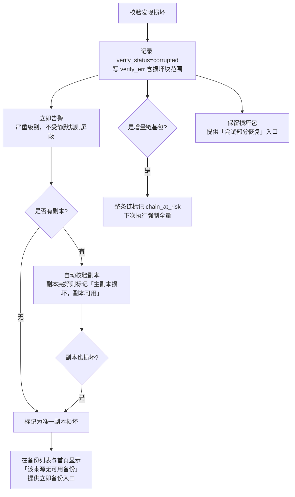

「该来源无可用备份」的提示放在首页而不只在备份页面。备份损坏是那种「发现得越早越好」的问题，而用户不会每天去看备份列表。这条提示与 12.20 的主密钥备份提醒、证书到期提醒并列，属于首页常驻的少数几项。

备份健康看板（`GET /backup/health`）给出四个维度的汇总，是「备份到底靠不靠谱」的单页答案：

| 指标 | 计算 | 红线 |
| --- | --- | --- |
| 覆盖率 | 有生效策略的站点/库/实例数 ÷ 总数 | < 80% 提示 |
| 新鲜度 | 各来源最近一次成功备份的时间分布 | 存在超过 RPO 目标 2 倍的来源则告警 |
| 成功率 | 近 7 天备份任务成功数 ÷ 总数 | < 95% 告警 |
| 可验证率 | `verify_status != unverified` 的记录占比 | < 50% 提示 |
| 异地率 | 至少有一个非 `local` 目标的策略占比 | 存在仅本地的策略则持续提示 |

「覆盖率」是最有价值的一项，因为**没有备份的对象不会产生任何失败告警**——它安静地存在，直到需要恢复时才被发现。看板明确列出「未被任何策略覆盖」的站点、库、应用实例清单并提供一键创建策略入口。

## 13.14 恢复流程设计

### 13.14.1 恢复的四种目标形态

同一份备份包可以恢复到四种目标，界面在恢复向导第一步就让用户选，因为后续的预检与冲突处理完全不同。

| 形态 | 目标 | 覆盖风险 | 典型场景 | 需要 `X-Confirm-Token` |
| --- | --- | --- | --- | --- |
| 原地恢复 | 原来源，覆盖现有数据 | **高** | 误删文件、误改配置、数据损坏 | ✓ |
| 恢复到新对象 | 同节点新建站点/库/实例 | 无 | 克隆环境、验证备份可用性 | — |
| 跨节点恢复 | 其他节点，新建或覆盖 | 视目标 | 迁移、扩容、故障转移 | 覆盖时需要 |
| 下载到本地 | 解密解压后下载或释放到指定目录 | 无 | 人工检查、提取单个文件 | — |

「恢复到新对象」是被低估的一项。它同时解决了两个问题：验证备份是否真的可恢复（比任何校验都可靠），以及在不冒风险的情况下取回数据（恢复到新库，然后用 SQL 把需要的表搬过去）。界面在原地恢复的确认对话框里显式提供「改为恢复到新对象」的转向按钮——很多时候用户点原地恢复只是因为没意识到还有更安全的选择。

### 13.14.2 恢复向导与预检

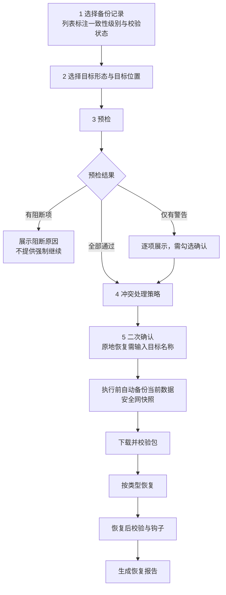

预检分阻断项与警告项。**阻断项没有「强制继续」选项**——能被强制跳过的检查等于没有检查，而恢复失败的代价通常比等一会儿更高。

| 检查 | 级别 | 说明 |
| --- | --- | --- |
| 备份包存在且大小匹配 | 阻断 | 相当于一次 `quick` 校验 |
| 增量链完整（全部环节可访问） | 阻断 | 缺任一环则无法恢复到该时点 |
| 解密条件满足（主密钥可用 / 口令正确） | 阻断 | 口令在此步验证，不等到解压时才发现错 |
| 目标磁盘空间 ≥ 原始大小 × 1.2 | 阻断 | 1.2 倍余量供临时文件与解压中间态 |
| 数据库引擎与大版本兼容 | 阻断 | MySQL 8.0 的包不能恢复到 5.7 |
| 面板版本 ≥ `restore.minPanelVersion` | 阻断 | manifest `schemaVersion` 高于当前也阻断 |
| 目标节点在线且 Agent 版本兼容 | 阻断 | — |
| 备份 `verify_status = corrupted` | 阻断（可转「部分恢复」） | 走 13.16.2 的部分恢复入口 |
| 目标对象已存在 | 警告 | 进入冲突处理 |
| 备份 `consistency = best_effort` | 警告 | 提示可能有轻微不一致 |
| 备份时间距今超过 30 天 | 警告 | 防止误选了很旧的包 |
| 域名/端口在目标节点已被占用 | 警告 | 恢复后需调整，向导提供修改入口 |
| 数据库小版本低于备份来源 | 警告 | 通常可用，但个别语法可能不兼容 |
| PHP 大版本与备份记录不同 | 警告 | 站点可能需要调整代码 |

「解密条件满足」放在预检而非执行时，是因为用户输错口令后如果等到下载完 30 GB 才报错，体验上不可接受。验证方式是只 Range 读第一个块并尝试解密——成功即证明密钥正确。

### 13.14.3 安全网快照与冲突处理

原地恢复前**强制对现有数据做一次备份**，这与升级前置备份（13.7.2）是同一个道理，且理由更充分：恢复是「用旧数据覆盖新数据」，如果选错了备份点，被覆盖的数据是唯一的现场。

安全网快照的三个特点让它的代价可接受：只备份将被覆盖的范围（恢复单个目录时不备份整站）、强制使用本地存储（不等上传）、保留 7 天且不占用保留策略额度、命名为 `pre-restore-<recordId>-<ts>`。磁盘不足无法创建安全网时，**不允许原地恢复**，界面引导用户改为「恢复到新对象」或先清理空间。这是少数几处「宁可挡住用户也不放行」的地方。

冲突处理按对象类型给不同选项，默认值都偏保守：

| 对象 | 冲突情形 | 选项（默认加粗） |
| --- | --- | --- |
| 文件与目录 | 目标已有同名文件 | **覆盖并删除多余文件**（完整还原到备份时状态） / 仅覆盖同名，保留多余 / 跳过已存在 |
| 数据库 | 目标库已有表 | **先 DROP 再导入**（需二次确认） / 仅导入不存在的表 / 恢复到新库 |
| 站点配置 | nginx 配置已存在 | **覆盖** / 保留现有配置只恢复文件 |
| 证书 | 目标已有更新的证书 | **保留现有证书**（不用旧证书覆盖新证书） / 覆盖 |
| 应用实例 | 同名实例存在 | **停止并覆盖其卷** / 恢复为新实例 |
| 端口占用 | 端口被其他对象使用 | **重新分配端口** / 手动指定 / 中止 |

「覆盖并删除多余文件」作为文件恢复的默认值是刻意的：用户点恢复的意图通常是「回到那个时间点的样子」，而残留的多余文件会让站点处于备份时不存在的混合状态——被入侵后恢复时，残留的正是攻击者留下的后门文件。界面把这个选项的说明写成「完整还原到备份时状态，备份后新增的文件将被删除」，并显示将被删除的文件数量与前 20 个路径供确认。

证书默认「保留现有」是唯一反向的例外：证书是时间敏感的，用一个月前的证书覆盖今天刚续期的证书会导致站点在几天后过期。

### 13.14.4 恢复到新对象

恢复到新对象需要把备份里的「身份信息」替换掉，这部分逻辑按来源类型各不相同，向导中呈现为可编辑的映射表：

| 来源类型 | 需要重新指定 | 自动处理 |
| --- | --- | --- |
| `site` | 新域名、新根目录、新数据库名 | nginx 配置里的 `server_name` 与 `root`；PHP-FPM 池名；`wp-config.php` 类配置中的 DB 连接（按 `restore.notes` 提示，不自动改代码） |
| `database` | 新库名、目标数据库服务 | dump 文件里的 `CREATE DATABASE` / `USE` 语句改写；新建账号并授权 |
| `app_instance` | 新实例名、新端口、新域名 | 重新渲染 compose 与 `.env`；卷改名；Vault 中生成新凭据条目 |
| `path` | 新目标路径 | 无 |
| `panel_config` | 不支持恢复到新对象 | — |

数据库 dump 的库名改写用**解析而非正则替换**：`sed 's/olddb/newdb/g'` 会误改数据内容里出现的同名字符串（用户表里恰好有个字段值是库名）。实现是只改写 dump 文件开头的 `CREATE DATABASE`/`USE` 语句与 `--databases` 模式下的库限定符，数据行原样透传。改写在流式管道里完成，不落临时文件。

站点恢复到新域名时**不自动修改应用代码或数据库内的 URL**。WordPress 的 `wp_options` 里存着旧域名，Discourse 存在配置表里，每个应用都不同，面板猜错的代价是把用户的数据改坏。处理方式是在恢复报告里给出针对该应用的具体命令（如 `wp search-replace 'https://old' 'https://new' --all-tables`），由用户执行。检测到应用类型（通过备份来源关联的 `app_instance` 或站点根目录特征文件）时给出准确命令，否则给通用提示。

## 13.15 跨节点恢复与整站迁移

### 13.15.1 跨节点恢复的数据路径

跨节点恢复的关键约束是**被控节点可能访问不了备份存储**。内网节点没有公网出口、对象存储凭据只配在控制面、目标节点是刚装好的新机器——这些都是常态。因此数据路径有三种，按可用性依次降级。

| 路径 | 条件 | 吞吐 | 说明 |
| --- | --- | --- | --- |
| 目标节点直读 | 目标节点可访问该存储且凭据下发允许 | 最优，不经控制面 | 默认。控制面只下发临时凭据（对象存储用预签名 URL，有效期 2 小时） |
| 控制面中转 | 目标节点无法访问存储 | 受控制面带宽限制 | 流式转发，控制面不落盘；并发受 `restore.relayMaxConcurrent`（默认 2）限制 |
| 源节点直传 | 存储为源节点本地 `local` | 取决于节点间网络 | 走 10 号的节点间传输通道，需两节点互通；不通则退回控制面中转 |

预签名 URL 是首选方案：控制面持有凭据并生成只对特定对象、只读、限时的 URL 下发给目标节点，凭据本身不离开控制面。不支持预签名的后端（`webdav`、`ftp`、`sftp`）走控制面中转。**不把存储凭据下发给节点**是一条硬规则——节点数量多、失陷概率高，一个被入侵的节点不应该获得读取全部备份的能力。

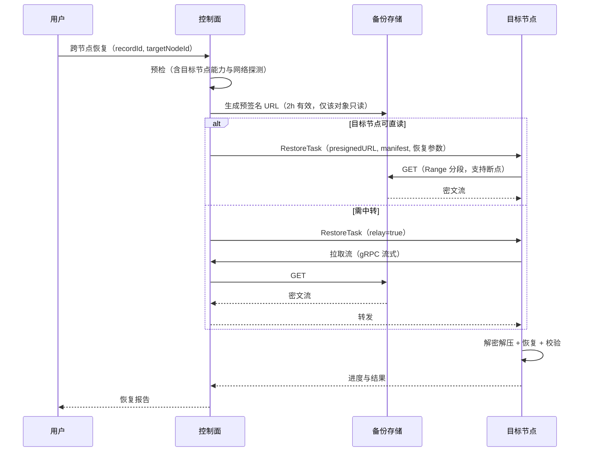

解密在**目标节点**完成，因此数据加密密钥（DEK）需要下发给节点。DEK 由控制面用主密钥解出后随任务下发，只存在于节点内存中，任务结束即清除，不写入节点磁盘或日志。这一点与 12.20 的凭据处理原则一致：`Secret` 类型承载、不落盘、`defer` 清零。

### 13.15.2 整站迁移向导

迁移与「跨节点恢复」的区别在于它是一个有状态的多步流程，需要处理增量同步与切换时机。向导覆盖单站点与整机两种范围。

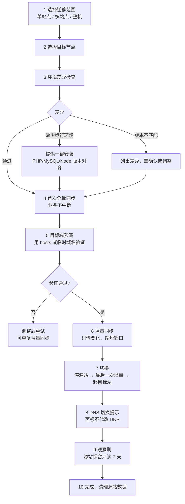

设计上的四个要点。**首次全量同步不中断业务**：源站正常运行，同步得到的是 `best_effort` 一致性的副本，用于目标端搭建与验证。真正的一致性由第 7 步的「停源站 → 最后一次增量」保证，这个窗口通常只有几十秒到几分钟。

**第 5 步的预演**是迁移向导相比「备份+恢复」的核心增值。目标站以临时域名（`<siteid>.migrate.<panel-domain>` 或指定端口）启动，用户可以在真实环境里点一遍站点确认可用，此时源站仍在服务。发现问题就调整目标端配置再增量同步一次，可以反复进行。没有这一步，用户只能在切换后才发现「PHP 版本不对，站点白屏」。

**DNS 不代改**。面板不接管用户的 DNS（除了可选的 DNS-01 证书验证），第 8 步只给出需要修改的记录清单与当前 TTL 提示，并提供一个持续检测目标域名解析是否已指向新 IP 的探测器。代改 DNS 需要用户交出域名管理凭据，收益与风险不成比例。

**观察期源站保留只读**。切换后源站不删除，而是停止服务但保留数据 7 天，nginx 配置改为返回 503 加迁移提示（防止 DNS 缓存未更新的访客看到旧数据造成数据分叉——**两边同时可写是迁移中最糟的结果**）。观察期结束后由用户手动确认清理，或到期自动清理并提前 24 小时通知。

### 13.15.3 迁移的环境差异处理

| 差异项 | 检测方式 | 处理 |
| --- | --- | --- |
| PHP 大版本 | 对比源站 `php_version` 与目标节点已装版本 | 提供一键安装对应版本；版本不同时警告并列出常见不兼容点 |
| PHP 扩展 | 对比 `php -m` 输出 | 自动安装缺失扩展（在支持的扩展列表内），列出无法自动处理的 |
| MySQL 大版本 | 对比 `version()` | 目标低于源则阻断；目标高于源则警告（8.0 → 8.4 有 SQL 模式差异） |
| 字符集与排序规则 | 对比库级 `charset`/`collation` | 恢复时保持原值，不做转换；目标不支持则阻断 |
| 系统架构 | `uname -m` | amd64 → arm64 时对容器类应用检查镜像是否有对应架构，无则阻断 |
| 目录路径 | 对比路径前缀配置 | 路径不同时改写 nginx 配置与 PHP-FPM 池配置 |
| 时区与 locale | 对比 `timedatectl` | 警告，提示可能影响日志时间与排序 |
| 内核参数与 ulimit | 对比关键项 | 警告并列出建议值 |
| 防火墙规则 | 对比源节点上与该站点相关的规则 | 提供「一并迁移规则」选项，走 12.15 的规则创建（含自锁检查） |
| 定时任务 | 列出源节点上引用该站点的 job | 提供「一并迁移」选项，迁移后源节点上的任务自动禁用而非删除 |

「定时任务迁移后源节点上禁用而非删除」是为了可回退：如果迁移后发现问题需要切回源站，任务重新启用即可。删掉了就要重新配。

架构差异（amd64 → arm64）对容器类应用是硬约束，必须在迁移前检查镜像的 manifest list 是否包含目标架构，而不是等到 `docker compose up` 失败。检查通过 registry 的 manifest API 完成，无法访问 registry 时降级为警告并说明「无法预先验证镜像架构」。

## 13.16 粒度恢复与面板灾难恢复

### 13.16.1 包内浏览与单文件恢复

粒度恢复的能力来自 13.13.2 的 `index.jsonl` 与分块加密：知道每个文件在包内的偏移与所属块，就能只下载并解密需要的部分。

```go
// internal/service/backup/browse.go
// ExtractFiles 从包中提取指定文件，只读取覆盖这些文件的块。
func (s *Service) ExtractFiles(ctx context.Context, rec *BakRecord, paths []string,
    out io.Writer) error {

    st, err := s.storageFor(ctx, rec.StorageID)
    if err != nil { return err }
    if !st.Caps().RangeRead {
        // 后端不支持 Range，只能整包下载。此时不静默走全量路径（可能是 30 GB），
        // 而是返回明确错误，由界面提示「该存储不支持按需提取，需完整下载 X GB」
        return errs.New(errs.CodeStorageNoRangeRead /* 900014 */)
    }
    idx, err := s.loadIndex(ctx, rec)   // index.jsonl 单独存储或从包头 Range 读
    if err != nil { return err }

    // 合并相邻块，避免为 100 个小文件发 100 次 Range 请求
    ranges := mergeChunkRanges(idx.Lookup(paths), rec.ChunkSizeBytes, /*gapTolerance*/ 4)
    tw := tar.NewWriter(out)
    defer tw.Close()
    for _, rg := range ranges {
        rc, err := st.Get(ctx, rec.ObjectKey, &storage.ByteRange{Start: rg.Off, End: rg.End})
        if err != nil { return err }
        dec, err := crypto.NewStreamReaderAt(rc, rec.DEK, idx.BaseNonce, rg.FirstChunk)
        if err != nil { rc.Close(); return err }
        if err := copyEntries(tw, dec, rg.Entries); err != nil { rc.Close(); return err }
        rc.Close()
    }
    return nil
}
```

`mergeChunkRanges` 的 `gapTolerance` 参数体现了一个实际权衡：两个需要的块之间隔着 3 个不需要的块时，一次读 5 块比发两次请求更快（HTTP 请求开销与 TCP 慢启动的代价大于多读几 MB）。容忍度设为 4 块（默认 4 MB）。

界面上的包内浏览器是一个文件树，支持搜索、按大小/时间排序、多选。它读的是 `index.jsonl`，不需要下载包体，因此打开速度与包大小无关。对增量备份的浏览呈现**合并视图**：按链顺序叠加各环的文件列表并应用删除记录，用户看到的是「该时点的完整目录结构」而不是「这一环变化了哪些文件」——后者虽然更接近底层事实，但不是用户想问的问题。文件条目上标注它实际来自链中哪一环，提取时自动从对应的包里读。

单文件恢复的三种落地方式：直接下载到浏览器、恢复到原路径（覆盖前自动备份该文件到 `.nova-bak-<ts>` 后缀）、恢复到指定的其他路径。默认第三种，因为「先取出来看看再决定」是更常见的意图。

数据库的粒度恢复（单表）不通过 Range 读实现——SQL dump 是流式文本，无法随机定位。实现方式是流式解压并用状态机识别表边界，只输出目标表的 `CREATE TABLE` 与 `INSERT` 语句。这需要读完整包但不需要落盘，且输出可以直接管道给 `mysql` 客户端。界面明确标注「单表恢复需读取完整备份包，耗时与包大小相关」。

### 13.16.2 损坏包的部分恢复

`verify_status = corrupted` 的包仍提供「尝试部分恢复」入口。分块加密在这里再次发挥作用：单个块的 GCM tag 校验失败只影响该块，其余块仍可正常解密。

```
部分恢复的处理流程

1  按 chunks.idx 逐块校验，标出损坏块集合 D
2  按 index.jsonl 计算受影响的文件集合 F（跨越 D 中任一块的文件）
3  向用户展示：可恢复 128,901 个文件（41.8 GB），受损 35 个文件（1.1 GB）
   并列出受损文件的完整路径清单，供判断是否可接受
4  用户确认后恢复 F 之外的全部文件
5  恢复报告中明确列出未恢复的文件，标记本次为「部分恢复」
6  在恢复目标上留下 RESTORE-INCOMPLETE.txt 说明缺失清单
```

第 3 步的「列出受损文件的完整路径」是决策所需的关键信息。如果损坏的只是 `wp-content/uploads/2019/` 下的几张图片，用户会接受；如果损坏的是数据库 dump，部分恢复毫无意义。让用户看到具体是什么，比给一个「35 个文件受损」的数字有用得多。

第 6 步在目标目录留下说明文件，是为了半年后有人排查「为什么这个站点少了几张图」时能找到答案。恢复报告会归档在面板里，但目录里的文件更容易被发现。

zstd 压缩流的特性让「损坏后半段仍可用前半段」成立，但**损坏首块则整包不可恢复**（帧头丢失）。这种情况界面直接说明「备份包头部损坏，无法恢复任何内容」，不给出无望的尝试入口。

### 13.16.3 面板自身的灾难恢复

这一节是整份文档里最需要「即使面板完全不可用也能照着做」的部分，因此手册以纯命令形式给出，且**不依赖面板的 Web 界面**。

面板需要保护的资产分四份，重要性递减：

| 资产 | 内容 | 丢失后果 | 保护方式 |
| --- | --- | --- | --- |
| 主密钥 | `conf/master.key` | L3 凭据全部不可解密，需重新配置所有存储/SSH/云凭据 | **用户离线保管**，不进备份包 |
| 面板数据库 | `data/novapanel.db` 或外部 MySQL | 节点、站点、策略、审计全部丢失 | `panel_config` 策略，每日 |
| 配置与证书 | `conf/panel.yaml`、`conf/certs/`、CA 私钥 | 面板证书与 Agent mTLS CA 丢失，需重新纳管所有节点 | 同上 |
| 备份记录 | `bak_record` 表（在数据库内） | 需通过 `novactl backup scan` 从存储重建 | 数据库备份 + manifests 目录 |

```bash
# 面板灾难恢复：在一台干净的机器上重建控制面
# 前提：手上有 ① 主密钥文件 ② 任意一份 panel_config 备份包（或其所在存储的访问凭据）

# 1 安装同版本或更高版本面板（版本号见备份包 manifest 的 panelVersion）
curl -fsSL https://get.novapanel.io/install.sh | bash -s -- --version 1.0.3 --no-start

# 2 放回主密钥（权限必须 0600，属主 root，否则面板拒绝启动）
install -m 0600 -o root -g root /path/to/master.key /opt/novapanel/conf/master.key

# 3 若备份在对象存储上，用临时凭据取回包与清单（不需要面板运行）
novactl backup fetch \
  --kind s3 --endpoint https://s3.example.com --bucket nova-backup \
  --access-key AKxxx --secret-key-stdin \
  --key novapanel/panel/2026/08/17/panel-config-20260817T040000Z-full.tar.zst \
  --out /tmp/panel.tar.zst
# 本地/NFS 备份直接用文件路径，跳过此步

# 4 校验并解密解压（主密钥模式自动从 conf/master.key 读；passphrase 模式加 --passphrase-stdin）
novactl backup verify --file /tmp/panel.tar.zst --manifest /tmp/panel.manifest.json
novactl restore --file /tmp/panel.tar.zst --manifest /tmp/panel.manifest.json --yes

# 5 启动并检查
systemctl start novapanel
novactl panel doctor          # 检查数据库、证书、密钥、节点连通性
novactl node list             # 节点应显示为 offline，等待其重连
```

第 5 步之后节点会自行重连——Agent 的 mTLS 证书由恢复回来的 CA 签发，控制面地址不变时无需在节点上做任何操作。这是把 CA 私钥纳入 `panel_config` 备份的直接收益：**不用逐台重装 Agent**。若控制面 IP 变更，需在各节点执行 `nova-agent set-server <new-addr>`（或通过原有的批量运维通道），手册中给出这两种情况的分支。

第 2 步的主密钥是整个流程的单点。因此面板在首次启动、每次登录后的首页、以及 `panel_config` 策略创建时反复提示导出并离线保管（12.20.3）。如果主密钥确实丢失，恢复仍可继续但会进入受限模式：面板可用、数据在、L1/L2 数据完整，但所有 L3 凭据（存储密钥、SSH 私钥、云 API）需要重新录入。界面在受限模式下列出所有待重新录入的条目清单，逐项打勾，而不是让用户自己去找哪里坏了。这一点在 12.20.3 已声明为硬约束：**不静默清空**。

`novactl panel doctor` 的检查项与输出格式见 14 号部署文档，它同时是日常巡检工具。灾难恢复演练（13.17.2）会定期在隔离环境里跑完上述五步，确保手册与实际行为不脱节——**没有被验证过的灾难恢复手册等于没有手册**。该演练在测试侧的编号是 `DR-01`（见 15.8.7），与验证业务备份可恢复的 `BR-01` 是两件事：`BR-01` 下面板一直健在，`DR-01` 的前提是面板整机没了。

恢复命令只有一个入口：`novactl restore`。它同时接受 14.9 的 `.npb` 面板包与本节的 `panel.tar.zst` + `manifest.json` 组合（后者必需 `--manifest`），确认参数统一为 `--yes`。不提供 `backup restore-panel` 这类第二个入口——恢复是灾难现场才跑的命令，多一个写法就多一份在压力下用错参数的风险。

## 13.17 恢复演练与 RTO/RPO

### 13.17.1 RTO 与 RPO 的定义与目标值

两个指标必须由用户按业务设定，面板不预设「合理值」——不同站点的容忍度差异可以是三个数量级。面板的职责是把当前配置能达到的实际值算出来，与目标值对比，差距可见。

| 指标 | 含义 | 由什么决定 | 面板如何测算 |
| --- | --- | --- | --- |
| RPO（恢复点目标） | 可容忍丢失多少数据（时间） | 备份频率 + 备份成功率 | 最近一次成功备份距今的时长；按周期统计 p50/p95 |
| RTO（恢复时间目标） | 从故障到恢复服务需多久 | 包体积 + 网络 + 解压速度 + 人工决策时间 | 演练实测；无演练数据时按包大小与实测带宽估算 |

```yaml
# 每个策略可设定目标，用于健康看板的红线判定
objectives:
  rpoMinutes: 1440        # 允许丢失 24 小时数据
  rtoMinutes: 120         # 2 小时内恢复
  includeHumanTimeMin: 30 # RTO 中预留的人工决策与操作时间
```

`includeHumanTimeMin` 是容易被忽略的一项。技术上恢复只要 40 分钟，但从「发现故障」到「有人决定执行恢复并输入完确认信息」通常还要半小时以上。把这部分算进 RTO，得到的数字才对得上真实的业务中断时长。演练时如果由脚本自动触发，实测 RTO 会系统性偏乐观，因此演练报告分别给出「技术耗时」与「含人工时间的估算 RTO」。

实际 RPO 的计算用**最近一次成功且校验通过的备份**，而不是最近一次备份记录。一份 `unverified` 或 `corrupted` 的备份不能算作恢复点，把它计入会让 RPO 数字虚假地漂亮。看板上这一列的表头写作「有效恢复点」并附说明。

### 13.17.2 演练方案与影子验证

演练的核心要求是**不碰生产数据**。三种方案按可信度递增，代价也递增。

| 方案 | 做什么 | 可信度 | 代价 | 频率建议 |
| --- | --- | --- | --- | --- |
| 校验演练 | 执行 `full` 级校验，确认包可解密可解压且清单匹配 | 中 | 一次全量下载流量 | 每月 |
| 影子恢复 | 恢复到临时对象（新库/新目录/新实例），跑健康检查，然后销毁 | 高 | 下载 + 目标端磁盘与 CPU | 每季度 |
| 全链路演练 | 在隔离节点上重建面板 + 恢复站点 + 验证访问 | 最高 | 一台临时机器 + 人工参与 | 每半年 |

影子恢复是性价比最高的一档，也是唯一可以完全自动化的「真恢复」验证。它的实现是复用 13.14.4 的「恢复到新对象」，加上自动化的验证与清理：

```yaml
# restore_drill 任务的参数
drill:
  mode: shadow                       # verify | shadow | full_chain
  sourceSelector: { mode: tag, tags: [prod] }
  pickStrategy: latest_verified      # latest | latest_verified | random_in_30d
  targetNode: 5                      # 建议用非生产节点；同节点时限制资源
  namePrefix: drill-
  validations:
    - { type: http, path: /, expectStatus: 200, timeoutSec: 30 }
    - { type: http, path: /wp-login.php, expectContains: "user_login" }
    - { type: db_query, sql: "SELECT COUNT(*) FROM wp_posts", expectMinRows: 1 }
    - { type: file_exists, path: wp-config.php }
    - { type: row_count_delta, table: wp_posts, tolerancePercent: 5 }
  cleanup: { always: true, keepOnFailureHours: 24 }
  report: { compareWithLast: true, notifyOn: always }
```

`row_count_delta` 这类验证把演练从「能恢复起来」推进到「恢复出来的数据是对的」。它对比恢复出的表行数与生产库当前行数，容差 5%（备份时点与当前的正常差异）。偏差过大说明备份内容有问题——比如 `mysqldump` 因为某个表的权限问题静默跳过了它，这种失败在备份阶段不报错，只有比对行数才能发现。

`cleanup.keepOnFailureHours: 24` 让失败的演练环境保留一天供排查。演练失败时最需要的是现场，自动清理掉等于每次都要重跑一遍才能看到问题。

`notifyOn: always` 与常规任务的 `failure` 默认不同：演练成功的通知是有价值的，它是「备份可用」的定期确认，也是审计与合规检查（12.14）需要的证据。

### 13.17.3 演练报告与趋势

每次演练产出一份报告，归档在 `data/drills/<drillId>/` 并可导出为 docx（走 12.14 的证据包机制，合规检查直接引用）。报告结构固定六段：

演练基本信息（时间、方案、执行者或「自动」、涉及来源清单）；耗时分解（下载、解密解压、导入、验证各阶段的实际秒数）；验证结果逐项（含实际值与期望值）；实测 RTO 与目标对比；发现的问题清单；与上次演练的对比（耗时变化、新增失败项）。

耗时分解是报告里最有行动价值的部分。RTO 超标时它直接指出瓶颈在哪：下载占 80% 说明需要更近的存储或更大带宽；导入占 80% 说明数据库恢复慢，可考虑物理备份（v1.5）；解压占大头说明压缩级别可以降低。没有分解的话，只知道「恢复要 3 小时」但不知道该改什么。

趋势视图按来源展示历次演练的 RTO 变化。**RTO 会随数据增长而变差**，这是缓慢发生且容易被忽视的：今天 40 分钟能恢复，一年后数据翻三倍就要 2 小时，而 RTO 目标没变。趋势线加上目标线，让这个问题在触线前几个月就可见。看板对「按当前增长速度，预计 N 个月后 RTO 将超标」给出提示。

演练也是唯一能验证**灾难恢复手册是否还准确**的手段。面板版本升级后，13.16.3 的命令可能已经变化（参数改名、步骤增减）。`full_chain` 演练按手册逐步执行并记录每一步的实际输出，与手册中的预期输出比对，不一致时在文档仓库开一个 issue 提醒更新——这条流程写进 15 号的升级回归测试项。

## 13.18 数据保留与成本估算

### 13.18.1 保留期配置与相互约束

保留期在三个层次上设定，实际生效值取最严的一档，界面在策略详情页显示「实际生效保留期及其来源」，避免用户改了策略却不生效而困惑。

| 层次 | 配置 | 作用 | 优先级 |
| --- | --- | --- | --- |
| 存储级 | `bak_storage` 的最大保留天数 | 防止某个存储被无限占用 | 最高（截断） |
| 策略级 | `bak_policy.retention` | 常规配置 | 中 |
| 记录级 | `LockedByUser` | 用户手动锁定 | 覆盖以上（永不删除） |

顺序是：策略算出的保留计划 → 被存储级上限截断 → 被记录级锁定豁免。三处都有可能让用户意外，因此备份列表的每一行都显示「保留至 X 日（原因：monthly）」或「已锁定」，把结果直接摆出来而不是让用户去推算。

三条不可绕过的下限，与 12.9 的审计保留期下限同一思路：`minKeep` 不得小于 1（至少留一份，否则保留策略可能把备份清空）；`panel_config` 类型的保留期不得小于 7 天（面板配置的问题往往几天后才发现）；已被恢复演练引用为「当前有效恢复点」的记录在演练完成前不删除。

### 13.18.2 容量估算模型

估算的目的不是精确预测，而是让用户在配置策略时对量级有概念。界面在策略保存前显示估算结果，并在 30 天后用实测数据替换估算值。

```
稳态占用 ≈ Σ(各档位保留份数 × 该档位对应的平均包体积)

包体积 ≈ 原始数据量 × 压缩率 × (增量情形下的变化比例)

压缩率参考（zstd level 3 实测量级，界面以「典型值」呈现并允许用户覆盖）：
  SQL dump（MySQL/PG 逻辑导出）      0.12 ~ 0.20
  文本与代码（PHP/JS/配置）           0.20 ~ 0.30
  混合站点目录（含图片与上传）        0.55 ~ 0.75
  已压缩内容（jpg/mp4/zip/已 gz 日志） 0.95 ~ 1.00
  Docker 卷（数据库文件等二进制）      0.30 ~ 0.50
```

一个具体算例，也是界面上「估算详情」展开后展示的内容：

```
场景：单站点，原始 20 GB（其中上传目录 16 GB 图片、代码 1 GB、数据库 3 GB）
策略：每日增量、每 7 天全量、GFS daily 7 / weekly 4 / monthly 6
日变化量：约 200 MB（新增上传 150 MB + 数据库变化）

全量包体积 = 16 GB × 0.97 + 1 GB × 0.25 + 3 GB × 0.15 = 16.3 GB
增量包体积 ≈ 200 MB × 0.90 = 0.18 GB（新增内容以图片为主，压缩收益低）
数据库每次全量（不做增量），已计入上式

daily 档 7 份   = 1 个全量 + 6 个增量 = 16.3 + 1.1 = 17.4 GB
weekly 档 4 份  = 4 个全量（各周的第一份，本身就是全量）= 65.2 GB
monthly 档 6 份 = 6 个全量 = 97.8 GB
去重（跨档位同一份只算一次，约 5 份重叠）≈ -81.5 GB

稳态占用 ≈ 99 GB   ← 界面显示「预计稳定在 90~110 GB」
达到稳态时间 ≈ 6 个月（受 monthly 档决定）
```

估算的三个诚实之处。给区间而非单一数字（压缩率有波动，界面显示 ±10%）；标注「达到稳态时间」——用户看到第一个月只用了 20 GB 会以为估算错了，而 monthly 档要 6 个月才填满；把「去重」这一步显式列出，因为 GFS 各档位重叠是估算中最容易算错的地方（简单累加会高估 80%）。

30 天后用实测值替换：面板按该策略实际产生的包体积计算真实压缩率与变化比例，重新估算并在界面标注「基于实测数据」。实测优于任何模型。

### 13.18.3 成本控制与存储类型

| 手段 | 效果 | 代价 | 默认 |
| --- | --- | --- | --- |
| 排除易变与可再生内容 | 体积降 10%~40% | 需要正确的排除规则 | 内置常见框架的缓存目录 |
| 提高压缩级别（zstd 19） | 体积再降 15%~25% | CPU 耗时 5~10 倍 | 关闭；建议只对 monthly 档启用 |
| 增量备份 | 日常包体积降 90%+ | 恢复需应用整条链 | 文件类默认开启 |
| 缩短 monthly/yearly 档 | 直接按比例降 | 长期回溯能力下降 | daily 7 / weekly 4 / monthly 6 / yearly 1 |
| 归档存储类型 | 存储单价降 60%~80% | 取回需解冻，数小时；有最短存储期计费 | 关闭 |
| 只在异地保留长期档 | 本地只留 daily，异地留全部 | 长期档恢复需从异地下载 | 推荐配置，非默认 |

归档存储（S3 Glacier、OSS 归档、COS 深度归档）的两个陷阱必须在界面上写清楚，否则用户会在账单和恢复时都吃惊。**取回需要解冻且耗时数小时**，这直接违反 RTO 目标，因此归档类型只应用于 monthly/yearly 这些「合规留存」用途的档位，不能用于日常恢复。**最短存储期计费**：Glacier 类存储有 90~180 天的最短计费期，一份存了 10 天就被保留策略删除的包仍按 90 天计费，此时「归档更省钱」不成立。面板的处理是：为归档目标启用时强制校验保留期不小于该存储类型的最短计费期，不满足则阻止保存并说明原因。

分层配置是推荐做法，界面提供「本地快恢复 + 异地长留存」的策略模板：本地存储只保留 `daily: 7`（快速恢复最近一周的问题），异地对象存储保留完整 GFS。这样本地磁盘占用只有 17 GB 而非 99 GB，而长期档在异地更安全。模板同时把异地目标的 `delayMin` 设为 30，避开备份窗口。

`deleteProtectedUntilDays > 0` 时启用对象存储的 Object Lock（合规模式），在保护期内**任何凭据都无法删除**该对象，包括面板自己和攻击者。这是应对勒索软件的最后一道防线：攻击者拿到面板权限后第一件事往往是删备份，而 Object Lock 让这件事在技术上做不到。代价是保护期内的对象必然产生存储费用，无法通过调整保留策略节省，因此这一项默认关闭，只在用户明确理解后启用，界面在启用时要求确认「保护期内的存储费用不可避免」。

## 13.19 接口清单与前端页面清单

### 13.19.1 功能点到接口的映射

对照 05 号 5.7.7 已列的 `/appstore/*`、`/cron/*`、`/backup/*` 三段（约 45 条），本文档的功能点覆盖情况如下。「已列」表示 05 号已定义且本文档未改变其语义。

| 本文档功能点 | 接口 | 状态 |
| --- | --- | --- |
| 13.1 应用目录浏览 | `GET /appstore/apps`、`GET /appstore/apps/{key}` | 05 号已列 |
| 13.3 参数表单定义 | `GET /appstore/apps/{key}/params` | 05 号已列 |
| 13.5 仓库管理与同步 | `GET/POST /appstore/repos`、`POST /appstore/repos/{id}/sync`、`DELETE /appstore/repos/{id}` | 05 号已列 |
| 13.5.4 离线包导入、公钥信任、仓库改配 | `POST /appstore/repos/import`、`POST /appstore/repos/{id}/keys`、`PUT /appstore/repos/{id}` | 需增补 |
| 13.6.2 安装 | `POST /appstore/instances` | 05 号已列 |
| 13.6.2 安装前渲染预览 | `POST /appstore/apps/{key}/versions/{version}/preview` | 需增补 |
| 13.6.3 失败重试与彻底清理 | `POST /appstore/instances/{id}/retry` | 需增补 |
| 13.6.3 孤儿资源列表与清理 | `GET /appstore/orphans`、`DELETE /appstore/orphans` | 需增补 |
| 13.6.4 实例详情与状态 | `GET /appstore/instances/{id}`、`GET /appstore/instances` | 05 号已列 |
| 13.6.1 启停重启、日志 | `POST /appstore/instances/{id}/{action}`、`GET /appstore/instances/{id}/logs` | 05 号已列 |
| 13.6 初始凭据一次性展示 | `GET /appstore/instances/{id}/credential` | 需增补 |
| 13.7.1 参数变更 | `PUT /appstore/instances/{id}` | 05 号已列 |
| 13.7.1 配置历史与回滚填表 | `GET /appstore/instances/{id}/history`、`GET /appstore/instances/{id}/history/{ts}` | 需增补 |
| 13.7.2 升级 | `POST /appstore/instances/{id}/upgrade` | 05 号已列 |
| 13.7.2 升级前兼容性检查与补充表单 | `GET /appstore/instances/{id}/upgrade-plan` | 需增补 |
| 13.7.4 卸载 | `DELETE /appstore/instances/{id}` | 05 号已列 |
| 13.8.4 一致性对账与重建缺失资源 | `GET /appstore/instances/{id}/integrity`、`POST /appstore/instances/{id}/integrity/repair` | 需增补 |
| 13.5.4 自定义应用包上传校验 | `POST /appstore/packages/validate` | 需增补 |
| 13.9 任务 CRUD、启停、手动执行 | `/cron/jobs` 全套、`PUT /cron/jobs/{id}/status`、`POST /cron/jobs/{id}/run` | 05 号已列 |
| 13.9.4 表达式校验与下次预览 | `POST /cron/validate` | 05 号已列（返回体需含 `nextRuns[5]`） |
| 13.9.2 执行历史与输出 | `GET /cron/jobs/{id}/records`、`GET /cron/records/{id}/log` | 05 号已列 |
| 13.9.2 全局执行记录、单次详情 | `GET /cron/records`、`GET /cron/records/{id}` | 需增补 |
| 13.9.7 强制停止 | `POST /cron/records/{id}/cancel` | 需增补 |
| 13.10 存储 CRUD 与连通性测试 | `/backup/storages` 全套、`POST /backup/storages/{id}/test` | 05 号已列 |
| 13.10.3 存储用量 | `GET /backup/storages/{id}/usage` | 需增补 |
| 13.10.4 从存储重建备份记录 | `POST /backup/storages/{id}/scan` | 需增补 |
| 13.11 策略 CRUD 与立即执行 | `/backup/policies` 全套、`POST /backup/policies/{id}/run` | 05 号已列 |
| 13.11.3 保留预览、13.18.2 容量估算 | `GET /backup/policies/{id}/retention-preview`、`GET /backup/policies/{id}/estimate` | 需增补 |
| 13.13 备份记录列表、详情、校验、删除、下载 | `/backup/records` 全套 | 05 号已列 |
| 13.13.1 记录锁定与解锁 | `PUT /backup/records/{id}/lock`、`DELETE /backup/records/{id}/lock` | 需增补 |
| 13.13.2 manifest 单独读取 | `GET /backup/records/{id}/manifest` | 需增补 |
| 13.16.1 包内浏览与单文件提取 | `GET /backup/records/{id}/browse`、`POST /backup/records/{id}/extract` | 需增补 |
| 13.11.2 手动触发副本 | `POST /backup/records/{id}/copies` | 需增补 |
| 13.13.4 备份健康看板 | `GET /backup/health` | 需增补 |
| 13.14 恢复任务创建、列表、进度 | `POST /backup/restores`、`GET /backup/restores`、`GET /backup/restores/{id}` | 05 号已列 |
| 13.14.2 独立预检、13.14 取消、恢复报告 | `POST /backup/restores/preflight`、`POST /backup/restores/{id}/cancel`、`GET /backup/restores/{id}/report` | 需增补 |
| 13.15.2 整站迁移向导 | `/backup/migrations` 6 条 | 需增补 |
| 13.17 演练发起与报告 | `POST /backup/drills`、`GET /backup/drills/{id}` | 05 号已列 |
| 13.17.3 演练列表与报告导出 | `GET /backup/drills`、`GET /backup/drills/{id}/report` | 需增补 |

### 13.19.2 需回写 05 号的接口增补（30 条）

沿用 05 号 5.7.7 的表头约定：节点列 `M`（多节点聚合）/`Y`（单节点定向）/`—`；幂等列 `I`（幂等）/`I!`（要求 `Idempotency-Key`）/`—`；确认列 `C`（需 `X-Confirm-Token`）。

| 方法与路径 | 说明 | 权限点 | 节点 | 幂等 | 确认 |
| --- | --- | --- | --- | --- | --- |
| `PUT /appstore/repos/{id}` | 修改仓库（优先级、启用、地址） | `appstore:repo:update` | — | — | |
| `POST /appstore/repos/import` | 导入离线应用包（multipart），执行完整签名校验 | `appstore:repo:create` | — | I! | |
| `POST /appstore/repos/{id}/keys` | 追加信任的仓库签名公钥 | `appstore:repo:update` | — | I | C |
| `POST /appstore/apps/{key}/versions/{version}/preview` | 按参数渲染 compose 与 `.env`，返回 diff 供安装前查看 | `appstore:app:read` | Y | — | |
| `POST /appstore/packages/validate` | 上传自定义应用包并做静态检查，返回问题清单 | `appstore:repo:create` | — | — | |
| `GET /appstore/instances/{id}/credential` | 一次性展示初始管理员凭据，读后标记已查看 | `appstore:instance:read` | Y | — | |
| `POST /appstore/instances/{id}/retry` | 重试失败的安装，`body.purgeVolumes` 决定是否删卷 | `appstore:instance:exec` | Y | I! | C |
| `GET /appstore/instances/{id}/upgrade-plan` | 升级兼容性检查、参数补充项、前置备份预估 | `appstore:instance:read` | Y | — | |
| `GET /appstore/instances/{id}/history` | 参数变更历史（最近 20 次） | `appstore:instance:read` | — | — | |
| `GET /appstore/instances/{id}/history/{ts}` | 取某次历史参数用于回填表单（不直接应用） | `appstore:instance:read` | — | — | |
| `GET /appstore/instances/{id}/integrity` | 关联资源对账结果（站点、库、compose 项目） | `appstore:instance:read` | Y | — | |
| `POST /appstore/instances/{id}/integrity/repair` | 重建指定的缺失关联资源 | `appstore:instance:update` | Y | I | C |
| `GET /appstore/orphans` | 孤儿资源列表（无实例关联的卷、网络、库、目录） | `appstore:instance:list` | M | — | |
| `DELETE /appstore/orphans` | 按 body 中的清单删除孤儿资源 | `appstore:instance:delete` | Y | — | C |
| `GET /cron/records` | 跨任务的执行记录（按节点、状态、时间筛选） | `cron:execution:list` | M | — | |
| `GET /cron/records/{id}` | 单次执行详情，pipeline 含子执行树 | `cron:execution:list` | — | — | |
| `POST /cron/records/{id}/cancel` | 强制停止正在执行的任务 | `cron:job:exec` | Y | I | |
| `GET /backup/storages/{id}/usage` | 存储已用量、对象数、配额与最近统计时间 | `backup:storage:read` | — | — | |
| `POST /backup/storages/{id}/scan` | 遍历 manifests 目录重建备份记录（灾难恢复用） | `backup:storage:exec` | — | I! | C |
| `GET /backup/policies/{id}/retention-preview` | 保留计划预览：将删除的记录、释放空间、保留原因 | `backup:policy:read` | — | — | |
| `GET /backup/policies/{id}/estimate` | 容量估算（30 天后返回基于实测的结果） | `backup:policy:read` | — | — | |
| `PUT /backup/records/{id}/lock` | 锁定记录，保留策略不再淘汰 | `backup:record:update` | — | I | |
| `DELETE /backup/records/{id}/lock` | 解除锁定 | `backup:record:update` | — | — | |
| `GET /backup/records/{id}/manifest` | 读取备份清单，不下载包体 | `backup:record:read` | — | — | |
| `GET /backup/records/{id}/browse` | 包内文件树浏览（增量为合并视图），支持搜索与分页 | `backup:record:read` | — | — | |
| `POST /backup/records/{id}/extract` | 按路径清单提取文件，返回下载任务或直接流式返回 | `backup:record:export` | Y | I | |
| `POST /backup/records/{id}/copies` | 手动触发到指定存储的副本复制 | `backup:record:exec` | — | I | |
| `GET /backup/health` | 备份健康看板：覆盖率、新鲜度、成功率、可验证率、异地率 | `backup:record:list` | M | — | |
| `POST /backup/restores/preflight` | 独立预检，返回阻断项与警告项清单 | `backup:restore:read` | Y | — | |
| `POST /backup/restores/{id}/cancel` | 取消恢复任务并清理临时数据 | `backup:restore:exec` | Y | I | |
| `GET /backup/restores/{id}/report` | 恢复报告（含未恢复文件清单与后续操作提示） | `backup:restore:read` | — | — | |
| `GET /backup/drills` | 演练列表与历次 RTO 趋势 | `backup:drill:read` | M | — | |
| `GET /backup/drills/{id}/report` | 演练报告，`?format=docx` 导出证据文件 | `backup:drill:read` | — | — | |
| `POST /backup/migrations` | 创建迁移任务（范围、目标节点） | `backup:migrate:exec` | Y | I! | |
| `GET /backup/migrations/{id}` | 迁移状态、环境差异清单、各阶段进度 | `backup:migrate:exec` | — | — | |
| `POST /backup/migrations/{id}/sync` | 执行一次同步（首次全量或后续增量） | `backup:migrate:exec` | Y | I! | |
| `POST /backup/migrations/{id}/switchover` | 切换：停源站、末次增量、起目标站 | `backup:migrate:exec` | Y | I! | C |
| `POST /backup/migrations/{id}/rollback` | 观察期内回切到源站 | `backup:migrate:exec` | Y | I! | C |
| `POST /backup/migrations/{id}/finish` | 结束观察期并清理源站数据 | `backup:migrate:exec` | Y | I! | C |

上表实为 39 行，其中 `/backup/migrations` 的 6 条属同一向导，按 05 号「一个向导计一组」的口径合并计数后为 30 条待增补接口。

### 13.19.3 需回写 05 号的错误码增补（14 条）

05 号 5.5.8 的 80xxxx 段已用至 `800010`、81xxxx 段已用至 `810007`；5.5.9 的 90xxxx 段已用至 `900013`。本文档新增按平铺顺序续编。

| 错误码 | HTTP | 常量名 | 中文提示 | 触发场景 | 前端处理 |
| --- | --- | --- | --- | --- | --- |
| 800011 | 409 | `ErrAppDBExists` | 目标数据库已存在，不会自动复用 | `shared` 模式下库名冲突 | form + 引导改名 |
| 800012 | 409 | `ErrAppInstanceBusy` | 实例有操作正在进行 | 实例操作锁被占用，`data.currentOp` | toast + refresh |
| 800013 | 409 | `ErrAppUnhealthy` | 实例健康检查未通过，不允许升级 | 状态为 `unhealthy` 时升级 | toast + 跳日志 |
| 800014 | 400 | `ErrAppPreBackupFailed` | 升级前置备份失败，已中止升级 | 前置备份不可跳过 | toast + 查看备份 |
| 800015 | 500 | `ErrAppRollbackFailed` | 升级失败且回滚未成功，需人工介入 | `.prev` 恢复失败，`data.guide` | 固定横幅 + 恢复入口 |
| 800016 | 409 | `ErrAppRepoRemoved` | 来源仓库已移除，无法升级或重装 | 实例的 `repo_code` 不存在 | toast |
| 800017 | 400 | `ErrAppIndexExpired` | 仓库索引已过期，请重新同步 | `expiresAt` 已过 | toast + 同步入口 |
| 800018 | 403 | `ErrAppIndexReplay` | 索引版本回退，疑似重放攻击 | `generatedAt` 早于本地 | 告警 + 高危审计 |
| 800019 | 400 | `ErrAppPackageRejected` | 应用包静态检查未通过 | 特权容器、宿主根挂载等，`data.findings` | 展示问题清单 |
| 810008 | 409 | `ErrJobPipelineNested` | 编排任务不可嵌套 | pipeline 引用 pipeline | form |
| 810009 | 400 | `ErrJobCronNeverFires` | 该表达式在未来一年内不会执行 | 如 `0 0 31 2 *` | form + 预览 |
| 900014 | 400 | `ErrStorageNoRangeRead` | 该存储不支持按需提取，需完整下载 | 后端缺 Range 能力 | toast + 改为整包 |
| 900015 | 507 | `ErrRestoreSafetyNetFailed` | 恢复前安全网备份失败，已阻止原地恢复 | 空间不足或存储不可写 | toast + 引导恢复到新对象 |
| 900016 | 409 | `ErrBackupChainBroken` | 增量链不完整，无法恢复到该时点 | 链中某环缺失，`data.missingRecordIds` | 展示链结构 |

### 13.19.4 登记的偏差与命名说明

按 05 号 5.7.8「已知路径命名不一致登记」的格式，本文档产生三处需登记项。

`/cron/records` 与表名 `job_execution` 不一致。05 号已定 `GET /cron/jobs/{id}/records` 与 `GET /cron/records/{id}/log`，路径用 `records` 而数据模型用 `execution`。**以 05 号路径为准不做改动**，理由是路径已发布且 `records` 对用户更易理解；权限点保持 `cron:execution:list` 与表名一致。在 04 号 `job_execution` 表注释与 05 号 5.7.8 各登记一行说明。

`POST /backup/records/{id}/copies` 用复数名词加 POST 表示「创建一个副本」，符合 05 号 5.1.3 的资源命名约定；而 `PUT /backup/records/{id}/lock` 用单数，因为锁是记录的单一属性而非集合。两种形态并存是有意的，登记以免后续被误判为不一致。

13.16.2 的「部分恢复」不新增接口，而是 `POST /backup/restores` 的 `body.allowPartial: true` 参数。理由是它与常规恢复共享全部预检、冲突处理、报告逻辑，独立成接口会产生两份几乎相同的实现。05 号 5.5.9 已有的 `900013 ErrPartialRestoreUnsupported` 语义据此收窄为「该备份类型（如数据库逻辑导出）不支持部分恢复」，与 `900014` 的「存储不支持 Range」区分开。

### 13.19.5 前端页面清单

| 路由 | 页面 | 关键组件 | 权限点 |
| --- | --- | --- | --- |
| `/appstore` | 应用商店首页 | `AppCardGrid` + 分类侧栏 + 搜索 + 推荐位 | `appstore:app:list` |
| `/appstore/apps/:key` | 应用详情 | 版本选择器 + 截图轮播 + README 渲染 + 安装按钮 | `appstore:app:read` |
| `/appstore/apps/:key/install` | 安装向导 | `DynamicForm` + `NodeSelector` + 端口检测 + 渲染预览 | `appstore:instance:create` |
| `/appstore/instances` | 已安装实例 | 状态标签 + 健康标记 + 完整性告警角标 | `appstore:instance:list` |
| `/appstore/instances/:id` | 实例详情 | 概览/参数/日志/终端/备份/事件 六个 Tab | `appstore:instance:read` |
| `/appstore/instances/:id/upgrade` | 升级向导 | 兼容性检查表 + 补充表单 + 前置备份进度 | `appstore:instance:exec` |
| `/appstore/repos` | 仓库管理 | 仓库列表 + 同步状态 + 公钥指纹 + 离线导入 | `appstore:repo:list` |
| `/appstore/orphans` | 孤儿资源 | 按类型分组 + 批量选择 + 关联推测 | `appstore:instance:list` |
| `/cron/jobs` | 计划任务列表 | 自然语言描述列 + 下次执行 + 上次结果 | `cron:job:list` |
| `/cron/jobs/:id` | 任务详情 | 配置 + 执行历史时间线 + 输出查看器 | `cron:job:read` |
| `/cron/jobs/new` | 任务编辑 | `CronBuilder` + 类型专属参数表单 + 预览 | `cron:job:create` |
| `/cron/records` | 执行记录 | 跨任务筛选 + pipeline 树展开 | `cron:execution:list` |
| `/backup/overview` | 备份总览 | 健康看板五指标 + 未覆盖对象清单 + 快捷入口 | `backup:record:list` |
| `/backup/storages` | 存储管理 | 用量环形图 + 能力标签 + 测试结果详情 | `backup:storage:list` |
| `/backup/policies` | 策略管理 | 生效保留期 + 估算容量 + 下次执行 | `backup:policy:list` |
| `/backup/policies/:id` | 策略详情 | 配置 + 保留预览 + 关联记录 + 目标状态 | `backup:policy:read` |
| `/backup/records` | 备份记录 | 一致性/校验状态列 + 锁定标记 + 保留原因 | `backup:record:list` |
| `/backup/records/:id` | 记录详情 | manifest 概览 + 包内浏览器 + 副本状态 + 校验历史 | `backup:record:read` |
| `/backup/restores/new` | 恢复向导 | 五步向导 + 预检结果 + 冲突处理 + 二次确认 | `backup:restore:exec` |
| `/backup/restores/:id` | 恢复进度与报告 | 阶段进度 + 逐项结果 + 未恢复清单 | `backup:restore:read` |
| `/backup/migrations/new` | 迁移向导 | 十步向导 + 环境差异表 + 预演入口 + 切换倒计时 | `backup:migrate:exec` |
| `/backup/drills` | 恢复演练 | 演练列表 + RTO 趋势图 + 报告导出 | `backup:drill:read` |

三个跨页面复用约定。`DynamicForm` 由 `app_template_param` 驱动，同一套渲染器同时服务应用安装、参数变更、升级补充表单三处，新增参数类型只需扩展渲染器映射表，三个页面零改动。`ProgressPanel` 统一消费 09 号的 `task.progress` 信封，应用安装、备份、恢复、迁移四类长任务共用同一个组件与断线重连逻辑。`RetentionExplain` 把「保留至 X（原因：monthly）」的解释逻辑收在一处，备份记录列表、策略详情、保留预览三个位置渲染一致——13.18.1 提到的三层保留期截断如果各页面自己算，几乎必然出现不一致。

## 13.20 排错手册

按 07 号 7.16 与 10 号 10.22 的同一体例组织：条目 ID 会作为 `errs.WithDetail` 的 `helpId` 随错误返回，前端在错误弹窗中给出「查看排错建议」链接直达对应条目。ID 前缀 `A` 为应用商店、`J` 为计划任务、`B` 为备份、`R` 为恢复与迁移。

### 13.20.1 应用商店

| ID | 现象 | 常见根因 | 定位与处置 |
| --- | --- | --- | --- |
| `A-001` | 应用列表为空或缺少某应用 | 仓库从未同步成功、索引过期被拒、应用的 `minPanelVersion` 高于当前面板 | 仓库管理页看最后同步时间与结果；`novactl app repo sync --id 1 --verbose` 输出被过滤掉的应用及原因 |
| `A-002` | 同步报 `800017 ErrAppIndexExpired` | 索引的 `expiresAt` 已过，仓库方长期未发布 | 属仓库侧问题，不能通过本地改时间绕过；如确认仓库可信可临时在仓库配置勾选「忽略过期」（会记审计） |
| `A-003` | 同步报 `800018 ErrAppIndexReplay` | 取到的 `generatedAt` 早于本地已记录值，可能是 CDN 缓存回退，也可能是降级重放 | 先换直连地址重试，若仍旧则视为攻击处理；此错误会同时产生高危安全告警 |
| `A-004` | 签名校验失败 | 索引签名公钥未信任、包哈希与索引不一致（传输损坏或被替换） | 前者在仓库详情追加公钥并核对指纹（须走带外渠道核对，不能只看页面显示）；后者清除本地包缓存 `data/appcache/<repo>/` 后重试，仍失败则不要安装 |
| `A-005` | 安装卡在「拉取镜像」超过 10 分钟 | 镜像仓库不可达或限速、镜像体积大、节点无镜像加速 | 实例详情的安装日志实时输出 docker pull 进度；节点上 `docker pull <image>` 手工验证；配置镜像加速见 09 号 9.5 |
| `A-006` | 安装失败且回滚后目录仍存在 | 补偿清理中某步失败，实例保留 `cleanup_pending=1` | 实例详情会显示「清理未完成」横幅；点「彻底清理」即 `POST /appstore/instances/{id}/retry` 带 `purgeVolumes`，或 `novactl app purge --id 12 --dry-run` 先看将删什么 |
| `A-007` | 安装成功但状态一直 `unhealthy` | 应用自身初始化慢（数据库首次建表）、健康检查探针配置过严、依赖服务未就绪 | 13.6.5 的健康检查超时默认保留卷，数据没丢；先看容器日志 `GET /appstore/instances/{id}/logs?tail=200`；确认是慢启动则在参数中放宽 `healthcheck.startPeriod` |
| `A-008` | 端口冲突报错但节点上看不到占用 | 冲突来自面板数据库中已登记的其他实例（尚未启动） | 端口检测同时查实时监听与 `app_instance.ports_json`；这是有意的，避免两个未启动实例分到同一端口 |
| `A-009` | 参数变更后应用行为未改变 | 变更项的 `changeImpact` 为 `hot` 但应用实际不支持热加载 | 实例详情的参数页会显示每项的生效方式；手动重启一次验证；若确认应用不支持热加载，属应用包元数据错误，应向仓库方反馈或在自定义包中修正为 `restart` |
| `A-010` | 升级报 `800013 ErrAppUnhealthy` | 升级前置检查要求实例健康 | 这是有意的硬阻断：对一个已经不正常的实例做升级，失败后无法区分是升级引入还是原有问题。先修好健康状态 |
| `A-011` | 升级失败且回滚也失败（`800015`） | `.prev` 目录被手工删除、卷数据已被新版本迁移脚本改写 | 错误详情里的 `data.guide` 给出具体恢复命令；核心路径是用升级前置备份做恢复（13.7.2 强制生成，记录名含 `pre-upgrade`） |
| `A-012` | 实例操作报 `800012 ErrAppInstanceBusy` | 操作锁被占用；或前次操作进程崩溃导致锁未释放 | `data.currentOp` 显示占用者；锁有 `locked_until` 兜底（参数变更 5 分钟、升级 30 分钟、恢复 2 小时），到期自动释放，不需要手工清理 |
| `A-013` | 卸载后磁盘空间未释放 | 13.7.4 的三项资源（数据目录、数据库、卷）默认全部保留 | 这是有意的默认值。孤儿资源页 `/appstore/orphans` 列出这些残留并可批量删除 |
| `A-014` | 实例详情提示「关联资源缺失」 | 站点或数据库被从各自模块直接删除，实例侧引用悬空 | 完整性对账结果在实例详情显示；`POST /appstore/instances/{id}/integrity/repair` 可重建站点或库，但**数据不会回来** |
| `A-015` | 自定义应用包安装后容器反复重启 | compose 中 `${PARAM}` 未被替换（参数名拼错，模板语言不做未定义变量报错） | `POST /appstore/apps/{key}/versions/{version}/preview` 渲染预览能直接看到残留的 `${}`；这是刻意不做条件渲染换来的代价——渲染结果完全可预测，但拼写错误只能靠预览发现 |
| `A-016` | 应用升级后 URL 变了导致站内链接失效 | 应用内部存有绝对 URL（WordPress 的 `siteurl` 等） | 面板不代改应用内数据。13.15.3 给出各应用的具体修正命令，实例详情的升级报告里会附上 |

### 13.20.2 计划任务

| ID | 现象 | 常见根因 | 定位与处置 |
| --- | --- | --- | --- |
| `J-001` | 任务到点没执行 | 任务被禁用、节点离线、上次执行未结束且策略为 `skip`、时区理解偏差 | 任务详情的「下次执行」按任务时区显示并标注时区名；执行记录里 `skipped` 是一等状态会明确列出，不会静默消失 |
| `J-002` | 任务比预期晚几分钟执行 | `jitter_sec` 抖动（默认 0，但策略生成的任务可能带）、调度器扫描周期 | 执行记录同时展示 `scheduled_at` 与 `started_at`，两者差值即实际延迟 |
| `J-003` | 表达式保存报 `810009 ErrJobCronNeverFires` | 如 `0 0 31 2 *` 这类永不成立的组合 | 校验接口返回未来一年内无匹配；改表达式，`POST /cron/validate` 会给出 5 次预览 |
| `J-004` | 想用秒级 cron 但保存失败 | 只支持 5 段标准表达式，不支持 6 段 | 13.9.4 说明了理由：秒级调度会让执行记录量级失控且大多是误用。真需要高频轮询应写常驻服务，用 07 号的 Supervisor 托管 |
| `J-005` | 脚本手工执行正常，任务里执行失败 | 环境变量与 `PATH` 不同、非交互 shell 未加载 `~/.bashrc`、`cwd` 不同 | 执行输出的头部会打印实际 `PATH`、`cwd`、执行用户；脚本内用绝对路径，或显式 `source` 需要的环境文件 |
| `J-006` | 任务超时被杀但子进程仍在运行 | 脚本用 `&` 派生了脱离进程组的后台进程 | 超时向整个进程组发信号（先 `TERM` 后 `KILL`），但 `setsid` 或 `nohup` 派生的进程会逃脱；这类需求应拆成独立任务而非后台派生 |
| `J-007` | 执行输出被截断 | 单次输出上限 `output_limit_kb`（默认 1024） | 完整输出在节点的 `logs/jobs/<jobID>/<execID>.log`，可从文件管理下载；界面只存前 8 KB 摘要 |
| `J-008` | 控制面重启后任务状态永久停在 `running` | 执行在 Agent 上继续，但结果上报丢失 | Agent 重连后会补报；超过判定窗口仍无结果则置 `unknown` 而非 `failed`（13.9.6：面板不知道它成功还是失败，不能编造结论） |
| `J-009` | 多实例部署下任务执行了两次 | 选主异常，两个实例同时认为自己是 leader | 数据库租约选主的 TTL 与续约间隔见 13.9.3；检查两实例时钟偏差，超过 TTL 一半即有风险 |
| `J-010` | pipeline 中某步失败后续步骤仍执行 | 该步骤配了 `always: true` | 这是有意的能力（清理步骤需要无论成败都跑）；任务编辑页的步骤列表会标出 `always` 标记 |
| `J-011` | 任务删除后历史记录也消失了 | 删除任务默认级联删除执行记录 | 需要留档的应先导出。备份类任务产生的**备份记录不受影响**——13.10 起的备份记录与任务解耦，任务删了备份还在 |
| `J-012` | 通知没收到 | `notify_on` 为 `failure` 而任务成功、通道未配置、告警静默期 | 任务详情显示最近一次通知的投递结果；通道测试见 11 号 |

### 13.20.3 备份

| ID | 现象 | 常见根因 | 定位与处置 |
| --- | --- | --- | --- |
| `B-001` | 存储连通性测试失败 | 凭据错误、endpoint 含多余的 bucket 路径、region 不符、时钟偏差导致签名失效 | 测试结果会分步显示（DNS→TCP→TLS→认证→列举→写入→删除），失败停在哪一步直接指向原因；时钟偏差是 S3 类存储最易被忽略的一项 |
| `B-002` | 存储能力探测后部分功能置灰 | `Caps` 探测发现后端不支持 Multipart 或 Range | 13.10.1 的取向是提前置灰而非让用户点了才失败。按需提取（`browse`/`extract`）依赖 Range，缺失时报 `900014` 并只能整包下载 |
| `B-003` | 备份任务报空间不足 | 节点本地临时空间不够（流式管道仍需少量缓冲）、存储配额已满 | 备份前置检查会预估并给出所需空间；`GET /backup/storages/{id}/usage` 看配额；数据库备份的临时 dump 落盘位置可在策略中改 |
| `B-004` | 备份成功但耗时远超预期 | 存储限速 `rate_limit_kbps` 生效、小文件过多、压缩级别过高 | 备份记录详情显示各阶段耗时与实际吞吐；小文件场景 `file_count` 会很大，此时瓶颈是 IOPS 不是带宽 |
| `B-005` | 数据库备份的一致性标记是 `best_effort` | MySQL 表含 MyISAM，无法用单事务快照 | 13.12.2 说明：混合引擎下 `--single-transaction` 不覆盖 MyISAM。要么转 InnoDB，要么接受该一致性级别，要么用停机备份 |
| `B-006` | 增量备份体积和全量差不多 | 变更检测用 `mtime_size`，某些操作（解压、rsync 不带 `-t`、批量 chmod）会刷新全部 mtime | 13.12.3 如实说明了这个漏检与误报双向风险；确认是误报可在该次备份后再跑一次增量观察 |
| `B-007` | 数据库没有增量备份选项 | 数据库一律全量 | 差分增量（MySQL binlog / PostgreSQL WAL 归档）排在 v1.5，见 16 号。当前唯一降低成本的手段是调低频率与保留期 |
| `B-008` | 保留策略没删掉预期的旧备份 | `min_keep` 无条件保留、记录被 `locked_by_user`、增量链保护、`retain_until` 未到 | `GET /backup/policies/{id}/retention-preview` 会为每条记录给出保留原因，逐条对照即可；界面的 `RetentionExplain` 组件展示同一套结论 |
| `B-009` | 删除备份记录后存储空间未释放 | 对象存储启用了 Object Lock 或版本控制 | 面板 `Delete` 成功不代表对象已物理删除。Object Lock 是防勒索的有意配置，代价就是保留期内不可删——这属于存储侧策略，面板不绕过 |
| `B-010` | 校验报 `corrupted` | 传输截断、存储静默损坏、加密密钥不匹配 | 损坏包**不自动删除**（13.13.3）：部分恢复往往仍可救出大部分数据。`novactl backup verify --record 88 --mode full` 输出首个坏块位置 |
| `B-011` | `full` 校验产生了意外的流量账单 | 全量校验需把整包读回本地 | 界面在发起 `full` 校验前显示预估下载量与费用提示；日常用 `quick`（尺寸+ETag）与 `chunk`（抽样，必含首末块）即可 |
| `B-012` | 备份健康看板显示「未覆盖对象」 | 新建的站点或库没有任何备份策略覆盖 | 这是看板的主要价值：`GET /backup/health` 反向枚举所有可备份对象，找出没被任何策略选中的 |
| `B-013` | 归档存储的备份无法立即恢复 | Glacier / 归档层需先解冻，数小时不等 | 13.18.3 提示了解冻耗时与最短计费期陷阱：归档层存放 GFS 的 monthly/yearly 档合适，daily 档放归档层通常反而更贵 |
| `B-014` | 异地副本长期处于 `pending` | 副本任务队列积压、目标存储不可用 | 备份记录详情的 `copies` 显示每个目标的状态与最后错误；`POST /backup/records/{id}/copies` 可手动重试 |
| `B-015` | 从存储扫描重建的记录缺少信息 | manifest 缺失或损坏时只能从对象名反推 | 13.10.4 的路径布局把类型、名称、时间戳编进对象名正是为此；这类记录标记为 `recovered` 且 `verify_status=unverified` |

### 13.20.4 恢复与迁移

| ID | 现象 | 常见根因 | 定位与处置 |
| --- | --- | --- | --- |
| `R-001` | 预检有阻断项无法继续 | 版本不兼容、目标资源被占用、空间不足、增量链断裂 | 阻断项**没有强制继续选项**（13.14.2）。这是有意的：这些条件下恢复几乎必然产生半成品状态，比恢复失败更难处理。警告项可以确认后继续 |
| `R-002` | 报 `900016 ErrBackupChainBroken` | 增量链中某个中间记录已被删除 | `data.missingRecordIds` 列出缺失环；记录详情的链结构图标出断点；只能恢复到断点之前的时点 |
| `R-003` | 恢复报 `900015 ErrRestoreSafetyNetFailed` | 原地恢复前的安全网快照失败 | 安全网不可跳过。改为恢复到新站点/新库（不覆盖现有数据），或先腾出空间 |
| `R-004` | 文件恢复后多了一些不该存在的文件 | 恢复模式选了「仅覆盖」而非默认的「覆盖并删除多余文件」 | 默认模式是后者，因为「恢复到某时点」的语义应包含删除该时点之后新增的文件；增量恢复依赖 manifest 的 `deleted` 列表实现这一点 |
| `R-005` | 恢复后站点报 502 | 运行环境版本不同（PHP 版本、扩展缺失）、权限属主不对 | 恢复报告列出环境差异；属主由 manifest 记录并还原，若跨节点且 UID 不同则按用户名重映射 |
| `R-006` | 恢复后证书失效 | 默认「保留现有证书」而非用备份中的 | 13.14.4 的默认值是保留现有——备份中的证书往往已过期。需要用备份中的证书时在恢复选项显式勾选 |
| `R-007` | 数据库恢复到了错误的库名 | 目标库名与 dump 中的不一致 | 库名改写用 SQL 解析而非正则（13.14.3），能正确处理注释与字符串中的同名字符串；若仍异常请附 dump 片段反馈 |
| `R-008` | 恢复进度条长时间不动 | 进度分母是原始字节数，压缩比高的数据前期解压快后期写入慢 | 分母用原始字节而非压缩字节正是为了让进度反映真实工作量；`GET /backup/restores/{id}` 里的 `phase` 字段说明当前阶段 |
| `R-009` | 想在面板外解密备份包 | 灾难场景下面板本身已损毁 | manifest 自描述，`novactl backup decrypt --manifest x.json --key-file master.key --in pkg.tar.zst --out ./restored` 可脱离面板运行；这是主密钥必须离线备份的直接原因 |
| `R-010` | 迁移观察期内源站数据发生了变化 | 观察期本应只读，但源站被误恢复为可写 | 13.15.2 的观察期只读是防数据分叉的关键；一旦双写发生，两侧数据都可能有唯一的新数据，合并需人工判断，面板不提供自动合并 |
| `R-011` | 切换后域名仍解析到源站 | 面板不代改 DNS | 13.15.2 明确面板不代改 DNS。迁移向导会显示当前解析结果与目标 IP 的比对，但改动需用户在 DNS 服务商侧完成 |
| `R-012` | 演练结果的 `row_count_delta` 不为 0 | 备份期间有写入（正常）或一致性级别不足（需关注） | 13.17.2 用行数差做验证：`transactional` 一致性下应为 0，`best_effort` 下有偏差属预期。持续偏差大说明该对象需要更强的一致性级别 |
| `R-013` | 演练占用了生产资源 | 演练在目标节点创建临时实例 | 演练支持指定专用节点；`includeHumanTimeMin` 让 RTO 结果包含人工介入时间，避免演练数据过于乐观 |

### 13.20.5 诊断工具

```bash
# 应用：渲染预览，检查 ${PARAM} 是否全部替换
novactl app render --key wordpress --version 6.6.2 --params params.json

# 应用：彻底清理某实例的残留资源，先看将删什么
novactl app purge --id 12 --dry-run

# 应用：仓库同步详情，输出被过滤的应用与原因
novactl app repo sync --id 1 --verbose

# 任务：本地校验 cron 表达式并打印未来 10 次执行时刻（按指定时区）
novactl cron next '0 3 * * 1' --tz Asia/Shanghai --count 10

# 备份：校验某记录，full 模式输出首个损坏块位置
novactl backup verify --record 88 --mode full

# 备份：脱离面板解密并解包（灾难恢复用，只依赖 manifest 与主密钥）
novactl backup decrypt --manifest manifests/88.json --key-file /root/master.key \
  --in pkg.tar.zst --out ./restored

# 备份：扫描存储重建记录索引
novactl backup scan --storage 2 --dry-run

# 恢复：独立预检，输出阻断项与警告项
novactl restore preflight --record 88 --target-node node-17
```

`novactl backup decrypt` 的设计原则与 `nova-agent selfcheck` 一致：不依赖控制面、不依赖数据库、只依赖手上的两个文件（manifest 与主密钥）。备份系统最坏的场景是面板自己没了，此时任何需要先把面板跑起来才能解包的设计都是失败的设计。

至此本文档覆盖的应用商店、计划任务、备份恢复能力全部定义完毕。实现顺序见 [16 号里程碑与迭代排期](./16-里程碑与迭代排期.md)：应用商店基础与备份恢复核心属 v0.5 必须完成项，GFS 保留、增量备份、恢复演练、整站迁移排在 v1.0，差分增量（MySQL binlog、PostgreSQL WAL 归档）与 OCI Artifact 应用仓库排在 v1.5，`deploy_type='helm'` 排在 v2.0。
