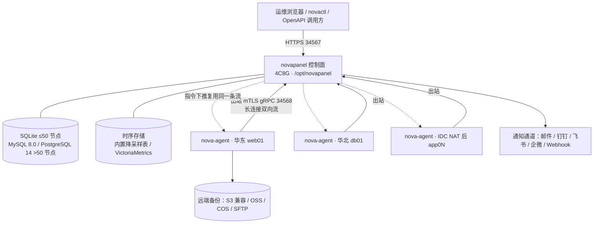
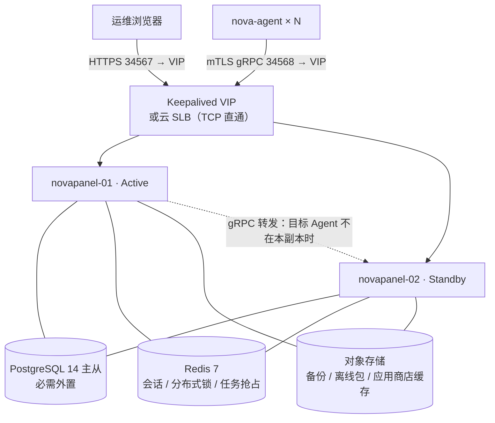
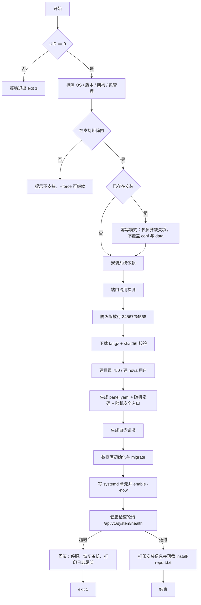
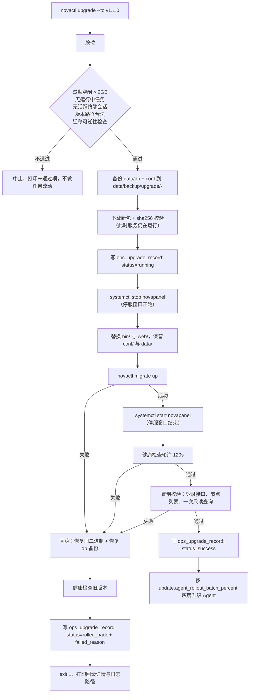
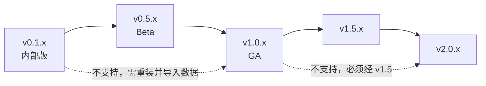

# NovaPanel（星舵面板）· 部署安装与升级

## 文档信息

| 项目 | 内容 |
| --- | --- |
| 文档名称 | 14-部署安装与升级 |
| 文档版本 | v1.0 |
| 更新日期 | 2026-08-17 |
| 状态 | 定稿 |
| 适用版本 | NovaPanel v1.0 |
| 产品代号 | nova |
| 覆盖内容 | 五种部署形态、环境与端口要求、install.sh 全量脚本、静默与离线安装、Agent 一键与批量部署、systemd 单元与加固、容器化部署、panel.yaml 全量配置项、初始化向导、novactl 命令全集、在线与离线升级及自动回滚、控制面高可用、迁移灾备、卸载清理、部署排错手册与诊断采集 |
| 关联文档 | [系统架构设计](./02-系统架构设计.md)、[技术栈与工程规范](./03-技术栈与工程规范.md)、[数据库设计](./04-数据库设计.md)、[API 接口规范](./05-API接口规范.md)、[多节点集群与 Agent](./10-多节点集群与Agent.md)、[监控告警与可观测](./11-监控告警与可观测.md)、[安全合规与审计](./12-安全合规与审计.md)、[应用商店与备份恢复](./13-应用商店与备份恢复.md)、[测试与质量保障](./15-测试与质量保障.md) |

## 目录

- [14.1 部署形态总览](#141-部署形态总览)
- [14.2 环境要求与端口清单](#142-环境要求与端口清单)
- [14.3 一键安装脚本 install.sh](#143-一键安装脚本-installsh)
- [14.4 安装参数、镜像源与静默安装](#144-安装参数镜像源与静默安装)
- [14.5 Agent 安装与批量部署](#145-agent-安装与批量部署)
- [14.6 systemd 单元与日志管理](#146-systemd-单元与日志管理)
- [14.7 容器化部署](#147-容器化部署)
- [14.8 配置管理 panel.yaml](#148-配置管理-panelyaml)
- [14.9 初始化与首次登录](#149-初始化与首次登录)
- [14.10 novactl 命令全集](#1410-novactl-命令全集)
- [14.11 升级与回滚](#1411-升级与回滚)
- [14.12 高可用部署](#1412-高可用部署)
- [14.13 迁移与灾备](#1413-迁移与灾备)
- [14.14 卸载与清理](#1414-卸载与清理)
- [14.15 部署排错手册与诊断采集](#1415-部署排错手册与诊断采集)

## 14.1 部署形态总览

### 14.1.1 形态对比表

NovaPanel 只交付一套二进制，形态差异全部由 `panel.yaml` 与是否部署 `nova-agent` 决定，不存在「社区版包／企业版包」之类的分叉产物。

| 编号 | 形态 | 纳管规模 | 数据库 | 组件构成 | 适用场景 | 不适用场景 |
| --- | --- | --- | --- | --- | --- | --- |
| D1 | 单机一体 | 1 台 | SQLite | `novapanel`（含内置 Agent） | 个人站长、单台云主机、开发测试、演示环境 | 需要纳管第二台机器 |
| D2 | 控制面 + 多 Agent | 2-500 台 | SQLite（≤50）/ MySQL、PostgreSQL（>50） | `novapanel` × 1 + `nova-agent` × N | 中小 IDC、多云混合、按业务分区的服务器群 | 控制面自身不可停机的场景 |
| D3 | 控制面高可用 | 50-500 台 | 外置 PostgreSQL 14+ 或 MySQL 8.0+（必需） | `novapanel` × 2（主备）+ Redis 7 + Keepalived/LB + 对象存储 | SLA 承诺 99.9%、控制面故障需分钟级接管 | 无外置数据库、无 VIP 或负载均衡能力 |
| D4 | 容器化部署 | 1-200 台 | 容器内 SQLite 或外置库 | `novapanel` 容器 + 挂载 `docker.sock` | 已有容器平台、希望面板本身可快速重建 | 需要管理宿主 Nginx/PHP 运行环境、需要 WebSSH 管宿主机 |
| D5 | 离线内网部署 | 1-500 台 | 同 D2/D3 | 全量离线包 + 内网 `mirror` 服务 | 政务、金融、军工等无外网环境；国产化信创环境 | 需要 ACME 自动签发公网证书 |

形态可平滑演进，无需重装：D1 加装第一个 Agent 即变为 D2；D2 执行 `novactl migrate --to postgres` 并拉起第二个控制面即变为 D3。反向降级同样支持，但 D3 → D2 需要先摘除 VIP。

### 14.1.2 D1 单机一体拓扑

```text
┌──────────────────────── 服务器（4C8G 起） ──────────────────────┐
│  浏览器 ──HTTPS 34567──▶ novapanel（单进程，含内置 Agent）        │
│                              │                                  │
│    ┌─────────────────────────┼──────────────────────────┐        │
│    ▼                         ▼                          ▼        │
│ /opt/novapanel/data      /opt/novapanel/conf     /opt/novapanel/logs
│  db/nova.db  kv.bolt      panel.yaml              panel.log      │
│  vhost/ backup/ ssl/      certs/panel.crt         audit.log      │
│  recycle/ compose/                                agent.log      │
│                                                                  │
│  被管资源：nginx / php-fpm / mysqld / dockerd / crond / 站点目录  │
└──────────────────────────────────────────────────────────────────┘
```

内置 Agent 与控制面同进程，通过进程内 channel 通信，不走 34568 端口，因此单机形态可在防火墙上完全关闭 34568。

### 14.1.3 D2 控制面 + 多 Agent 拓扑



关键约束：Agent 一律出站建连，不监听任何入站端口，因此 NAT、云厂商安全组默认拒绝入站的环境无需额外打洞。协议细节见 [多节点集群与 Agent](./10-多节点集群与Agent.md) 的 10.4 通信协议模型。

### 14.1.4 D3 控制面高可用拓扑



VIP 只承担 34567 与 34568 两个 TCP 端口的四层转发，禁止在前置代理上做 TLS 卸载后再明文回源，否则 Agent 的 mTLS 双向校验会失效，详见 14.12。

### 14.1.5 D4 与 D5 拓扑要点

| 形态 | 拓扑要点 | 强制约束 |
| --- | --- | --- |
| D4 容器化 | 单容器承载控制面，`/var/run/docker.sock` 与 `/opt/novapanel` 数据卷挂入；宿主运行环境类能力（Nginx/PHP 安装）在容器内不可用 | 必须 `network_mode: host` 或显式映射 34567/34568；数据卷必须落宿主持久化路径 |
| D5 离线内网 | 一台可上网机器下载 `novapanel-offline-v1.0.0-<arch>.tar.gz`，内网起 `mirror` HTTP 服务，`install.sh --offline --mirror http://10.0.0.9:8080` 指向它 | 证书改用内部 CA 或自签；应用商店走离线仓库快照；NTP 指向内网时钟源 |


## 14.2 环境要求与端口清单

### 14.2.1 操作系统支持矩阵

| 发行版 | 版本 | 架构 | 内核下限 | 包管理 | 支持级别 |
| --- | --- | --- | --- | --- | --- |
| Ubuntu | 22.04 LTS / 24.04 LTS | amd64、arm64 | 5.15 | apt | Tier 1（CI 全量回归） |
| Debian | 11 / 12 | amd64、arm64 | 5.10 | apt | Tier 1 |
| RHEL / Rocky / AlmaLinux | 8 / 9 | amd64、arm64 | 4.18 | dnf | Tier 1 |
| openEuler | 22.03 LTS / 24.03 LTS | amd64、arm64 | 5.10 | dnf | Tier 2（每 Release 手工验收） |
| Kylin（银河麒麟服务器版） | V10 | amd64、arm64 | 4.19 | dnf / yum | Tier 2 |

Tier 1 表示每次 PR 的 CI 矩阵中均执行安装与冒烟；Tier 2 表示每个 Release 前在真机或虚机上人工执行 14.15 的验收清单。RHEL 8 系内核 4.18 缺失部分 cgroup v2 能力，见 14.2.4。

### 14.2.2 硬件配置分档

控制面配置随纳管节点数增长，Agent 侧配置恒定。

| 档位 | 纳管节点 | 控制面 CPU | 控制面内存 | 控制面磁盘 | 数据库 | 时序存储 |
| --- | --- | --- | --- | --- | --- | --- |
| 最低（试用） | 1 | 1 核 | 1 GB | 10 GB | SQLite | 内置降采样表 |
| S 档 | ≤ 50 | 2 核 | 4 GB | 50 GB SSD | SQLite | 内置降采样表 |
| M 档 | ≤ 200 | 4 核 | 8 GB | 200 GB SSD | MySQL 8.0 / PostgreSQL 14 独立实例 | 内置或 VictoriaMetrics |
| L 档 | ≤ 500 | 8 核 | 16 GB | 500 GB NVMe | PostgreSQL 14 主从 | VictoriaMetrics 独立部署（必需） |
| Agent 侧 | 单节点 | 共享宿主，限 20% 单核 | 常驻 < 40 MB，`MemoryMax=256M` | 2 GB（缓冲与临时目录） | — | — |

磁盘分配建议（L 档，`/opt/novapanel` 独立挂载）：`data/db` 60 GB、`data/backup` 按备份保留策略另挂大容量卷或直接落对象存储、`data/recycle` 20 GB、`logs` 20 GB、时序数据 300 GB。`data/backup` 与 `data/recycle` 必须与 `data/db` 处于同一文件系统之外的独立卷，避免备份写满导致数据库无法写入。

容量校验口径：单节点 200 个指标、10 秒采集周期，500 节点即 10k point/s；开启容器与网站扩展指标后约 20k point/s，与非功能目标一致。内置存储在 L 档下原始点保留 7 天、5 分钟降采样保留 30 天、1 小时降采样保留 400 天，实测占用约 240 GB，故 L 档要求 500 GB 起。

### 14.2.3 端口清单

控制面入向端口：

| 端口 | 协议 | 方向 | 来源 | 用途 | 是否必需 | 备注 |
| --- | --- | --- | --- | --- | --- | --- |
| 34567 | TCP / HTTPS | 入向 | 运维网段、跳板机 | 面板 UI、REST API、WebSocket（终端与日志流） | 必需 | 可改，见 14.9.3；强烈建议只对办公网段放行 |
| 34568 | TCP / gRPC over mTLS | 入向 | 各被控节点 | AgentStream 双向流 | D2/D3/D5 必需，D1 可关闭 | 不承载浏览器流量，不要挂 7 层代理 |
| 34569 | TCP / HTTP | 入向 | 127.0.0.1 | 自身 metrics 与 pprof（`/metrics`、`/debug/pprof`） | 否，默认仅监听回环 | 对外暴露等同于泄露运行时内存，禁止绑 0.0.0.0 |

控制面出向端口：

| 目标 | 端口 | 用途 | 是否必需 |
| --- | --- | --- | --- |
| ACME 目录服务（Let's Encrypt / ZeroSSL） | 443 | 证书签发与续期 | 使用自动证书时必需 |
| DNS 服务商 API | 443 | DNS-01 校验 | 使用泛域名证书时必需 |
| 下载源（GitHub Release 或 `--mirror`） | 443 / 自定义 | 安装包、Agent 包、应用商店模板 | 在线安装与升级时必需 |
| SMTP / 钉钉 / 飞书 / 企微 / 自定义 Webhook | 25、465、587、443 | 告警与事件通知 | 按启用通道 |
| 对象存储（S3 / OSS / COS）或 SFTP | 443 / 22 | 备份上传与恢复下载 | 启用远端备份时必需 |
| NTP 服务器 | 123/UDP | 时间同步 | 必需 |
| 外置数据库 | 3306 / 5432 | MySQL / PostgreSQL | M、L 档必需 |
| Redis | 6379 | 会话与分布式锁 | D3 必需 |
| VictoriaMetrics | 8428 | 指标写入与查询 | L 档必需 |

被控节点：无任何入向端口需求；出向需可达控制面 34568，以及按需可达备份存储与镜像源。这一点是 NovaPanel 与「面板反向连接被控端」类方案的核心差异，安全组策略上被控节点可保持零入站。

### 14.2.4 系统依赖与 cgroup v2

| 依赖 | 要求 | 缺失后果 | 检测命令 |
| --- | --- | --- | --- |
| systemd | ≥ 239（RHEL 8 起满足） | 无法注册服务，安装中止 | `systemctl --version` |
| cgroup v2 统一层级 | 建议启用；v1 可运行但资源限额精度下降 | `MemoryMax`、`CPUQuota` 对 Agent 生效不准；容器资源统计偏差 | `stat -fc %T /sys/fs/cgroup` 返回 `cgroup2fs` |
| glibc | ≥ 2.28；musl 环境（Alpine）不在支持列表 | 二进制虽为纯 Go 但 WebSSH 的 PAM 相关能力受限 | `ldd --version` |
| tar、gzip、curl 或 wget | 任一下载工具 + 解包工具 | 安装脚本无法下载与解包 | `command -v curl wget tar` |
| openssl | ≥ 1.1.1（仅安装脚本自检使用，证书生成由 Go 完成） | 不影响主流程 | `openssl version` |
| iproute2 / ss | 用于端口占用检测 | 回退到 `netstat`，都缺失则跳过检测并警告 | `command -v ss netstat` |
| 文件描述符上限 | `LimitNOFILE` ≥ 65535 | 500 节点时连接被拒 | `ulimit -n` |
| 内核参数 | `net.core.somaxconn ≥ 4096`、`fs.inotify.max_user_watches ≥ 524288` | 高并发连接丢弃、文件监听失效 | `sysctl -a \| grep -E 'somaxconn\|max_user_watches'` |

RHEL 8 默认仍为 cgroup v1，安装脚本仅告警不强制切换（切换需重启，属于侵入宿主行为）。若需启用，手工执行 `grubby --update-kernel=ALL --args="systemd.unified_cgroup_hierarchy=1"` 后重启，由使用者决策。

### 14.2.5 SELinux 与 AppArmor

原则：不关闭宿主的强制访问控制，改为申请最小策略。`install.sh` 检测到 enforcing 时按下表处理并在安装报告中打印实际动作。

| 机制 | 检测 | 默认动作 | 涉及的受限行为 |
| --- | --- | --- | --- |
| SELinux（RHEL/Rocky/Alma/openEuler/Kylin） | `getenforce` 返回 `Enforcing` | 为 34567/34568 增加端口标签，为 `/opt/novapanel/bin` 打 `bin_t`，为 `data/vhost` 打 `httpd_sys_content_t`；不修改 `/etc/selinux/config` | 面板监听非标准端口、Nginx 读取站点目录、systemd 执行自定义路径二进制 |
| AppArmor（Ubuntu/Debian） | `aa-status` 可用且 profile 为 enforce | 不安装自定义 profile；若检测到 `usr.sbin.nginx` profile 阻断 `data/vhost`，输出手工修复指引 | Nginx 访问非 `/var/www` 的站点根目录 |

SELinux 处理命令（安装脚本内实际执行的等价命令）：

```bash
# 端口标签，幂等：已存在时 semanage 返回非 0，用 -m 修改兜底
semanage port -a -t http_port_t -p tcp 34567 2>/dev/null || semanage port -m -t http_port_t -p tcp 34567
semanage port -a -t http_port_t -p tcp 34568 2>/dev/null || semanage port -m -t http_port_t -p tcp 34568
# 文件上下文，先写规则再 restorecon，避免重装后丢失
semanage fcontext -a -t bin_t '/opt/novapanel/bin(/.*)?' 2>/dev/null || true
semanage fcontext -a -t httpd_sys_content_t '/opt/novapanel/data/vhost(/.*)?' 2>/dev/null || true
restorecon -R /opt/novapanel/bin /opt/novapanel/data/vhost
# 允许 Nginx 反代到本机上游（面板作为站点上游时需要）
setsebool -P httpd_can_network_connect 1
```

若 `semanage` 不存在（最小化安装），脚本会尝试安装 `policycoreutils-python-utils`；安装失败则中止并提示两个选项：手工安装该包，或以 `--skip-selinux` 显式跳过（跳过后需自行解决 Nginx 读取站点目录的 AVC 拒绝）。

### 14.2.6 时间同步

时间偏差直接影响四类功能：JWT 与会话有效期校验、mTLS 证书 NotBefore/NotAfter 校验、指标时间戳排序与降采样、cron 触发时刻。

| 项 | 要求 | 说明 |
| --- | --- | --- |
| 偏差上限 | 控制面与节点之间 < 5 秒 | 超过 30 秒时 Agent 注册会因证书时间校验失败而拒绝 |
| 同步服务 | `chronyd` 或 `systemd-timesyncd`，二者择一并处于 active | 安装脚本检测，未启用时自动 enable 并告警 |
| 时区 | 建议全集群统一 `Asia/Shanghai`，数据库内一律存 UTC | 面板展示按用户偏好时区渲染，见 [数据库设计](./04-数据库设计.md) |
| 检测命令 | `chronyc tracking \| grep 'System time'` 或 `timedatectl status` | 偏差写入 `novactl diagnose` 报告 |

时钟跳变的容错行为：Agent 检测到单调时钟与墙上时钟差异超过 60 秒时，主动重建 gRPC 流并重新拉取一次全量期望状态，避免基于错误时间戳做出的调度决策长期残留。该场景为混沌演练必测项，见 [测试与质量保障](./15-测试与质量保障.md) 的 15.8。


## 14.3 一键安装脚本 install.sh

### 14.3.1 执行流程与幂等约定

入口：`curl -fsSL https://get.novapanel.io/install.sh | bash`，或下载后 `bash install.sh --port 34567 --db sqlite`。



幂等规则（重复执行同一命令的行为）：

| 对象 | 首次安装 | 重跑（同版本） | 重跑（新版本） |
| --- | --- | --- | --- |
| `bin/*` | 写入 | 校验 sha256 一致则跳过 | 停服 → 替换 → 启动 |
| `conf/panel.yaml` | 生成 | 保留不动 | 保留不动，新增键由程序按默认值补齐 |
| `data/db/nova.db` | 建库 + migrate | 只 migrate（无待执行版本则空操作） | 备份后 migrate |
| 管理员密码 | 随机生成并打印 | 不重置，提示用 `novactl reset-password` | 不重置 |
| 安全入口 | 随机生成 | 不变更 | 不变更 |
| 证书 | 自签生成 | 剩余有效期 > 30 天则保留 | 同左 |
| systemd 单元 | 写入 + enable | 内容变更才重写并 `daemon-reload` | 同左 |
| 防火墙规则 | 放行 | 已放行则跳过 | 同左 |

### 14.3.2 头部、变量与日志

```bash
#!/usr/bin/env bash
# NovaPanel 一键安装脚本 · 适用 v1.0.x
# 用法: bash install.sh [选项]，选项见 --help 或文档 14.4
set -Eeuo pipefail
IFS=$'\n\t'

readonly SCRIPT_VERSION="1.0.0"
readonly INSTALL_ROOT="/opt/novapanel"
readonly SVC_USER="nova"
readonly PANEL_SVC="novapanel.service"
readonly LOG_FILE="/var/log/novapanel-install.log"
readonly LOCK_FILE="/var/run/novapanel-install.lock"
readonly DEFAULT_MIRROR="https://get.novapanel.io"
readonly CN_MIRROR="https://mirror.novapanel.cn"

# 可被命令行参数与环境变量覆盖的运行时变量
VERSION="${NOVA_VERSION:-latest}"
MIRROR="${NOVA_MIRROR:-$DEFAULT_MIRROR}"
PANEL_PORT="${NOVA_PORT:-34567}"
AGENT_PORT="${NOVA_AGENT_PORT:-34568}"
DB_TYPE="${NOVA_DB:-sqlite}"
DB_DSN="${NOVA_DB_DSN:-}"
ADMIN_USER="${NOVA_ADMIN_USER:-admin}"
ADMIN_PASS="${NOVA_ADMIN_PASS:-}"
SAFE_ENTRY="${NOVA_SAFE_ENTRY:-}"
OFFLINE=false; FORCE=false; SKIP_SELINUX=false; SKIP_FIREWALL=false
QUIET=false; ANSWER_FILE=""; TELEMETRY="${NOVA_TELEMETRY:-off}"

# 回滚栈：每个成功的破坏性步骤 push 一条撤销命令，失败时逆序执行
declare -a ROLLBACK_STACK=()
push_rollback() { ROLLBACK_STACK+=("$1"); }

log()  { printf '%s [INFO ] %s\n' "$(date '+%F %T')" "$*" | tee -a "$LOG_FILE"; }
warn() { printf '%s [WARN ] %s\n' "$(date '+%F %T')" "$*" | tee -a "$LOG_FILE" >&2; }
err()  { printf '%s [ERROR] %s\n' "$(date '+%F %T')" "$*" | tee -a "$LOG_FILE" >&2; }
step() { printf '\n=== %s ===\n' "$*" | tee -a "$LOG_FILE"; }
die()  { err "$*"; exit 1; }
```

### 14.3.3 失败回滚与错误陷阱

```bash
on_error() {
  local exit_code=$? line=${BASH_LINENO[0]} cmd=${BASH_COMMAND}
  err "安装在第 ${line} 行失败（exit=${exit_code}）：${cmd}"
  do_rollback
  cat <<EOF | tee -a "$LOG_FILE"

安装失败，系统已回滚到执行前状态。请附带以下信息反馈：
  安装日志: $LOG_FILE
  服务日志: journalctl -u $PANEL_SVC -n 200 --no-pager
  环境摘要: $OS_ID $OS_VERSION $ARCH / kernel $(uname -r)
EOF
  exit "$exit_code"
}

do_rollback() {
  [[ ${#ROLLBACK_STACK[@]} -eq 0 ]] && return 0
  warn "开始回滚，共 ${#ROLLBACK_STACK[@]} 步"
  for ((i=${#ROLLBACK_STACK[@]}-1; i>=0; i--)); do
    warn "回滚: ${ROLLBACK_STACK[i]}"
    # 回滚步骤本身失败不应中断后续回滚
    eval "${ROLLBACK_STACK[i]}" || warn "回滚步骤失败，已忽略"
  done
}

cleanup() { rm -f "$LOCK_FILE"; }
trap on_error ERR
trap cleanup EXIT

acquire_lock() {
  if [[ -e "$LOCK_FILE" ]] && kill -0 "$(cat "$LOCK_FILE" 2>/dev/null)" 2>/dev/null; then
    die "检测到另一个安装进程（PID $(cat "$LOCK_FILE")）正在运行"
  fi
  echo $$ >"$LOCK_FILE"
}
```

关键设计：回滚栈只登记「本次真正改动了系统」的步骤。以升级场景为例，`data/db/nova.db` 的备份在迁移前 push 一条 `cp -f <备份> <原库>`，而 `conf/panel.yaml` 在幂等重跑时未被改动，因此不会 push 任何撤销命令，避免回滚反而破坏用户配置。

### 14.3.4 环境检查：root、OS、架构、systemd

```bash
check_root() {
  [[ ${EUID} -eq 0 ]] || die "必须以 root 运行：sudo bash $0 $*"
}

detect_os() {
  [[ -r /etc/os-release ]] || die "无法读取 /etc/os-release，系统不受支持"
  # shellcheck disable=SC1091
  . /etc/os-release
  OS_ID="${ID:-unknown}"
  OS_VERSION="${VERSION_ID:-unknown}"
  OS_LIKE="${ID_LIKE:-}"
  case "$OS_ID" in
    ubuntu|debian)                     PKG=apt ;;
    rhel|centos|rocky|almalinux|openEuler|kylin) PKG=dnf ;;
    *)
      case "$OS_LIKE" in
        *debian*) PKG=apt ;;
        *rhel*|*fedora*) PKG=dnf ;;
        *) PKG="" ;;
      esac ;;
  esac
  [[ -n "$PKG" ]] || { $FORCE || die "不支持的发行版 ${OS_ID} ${OS_VERSION}，确认自行承担风险可加 --force"; PKG=dnf; }
  command -v dnf >/dev/null 2>&1 || [[ "$PKG" != dnf ]] || PKG=yum   # RHEL 7 系兜底
  log "发行版: ${OS_ID} ${OS_VERSION}，包管理: ${PKG}"
}

detect_arch() {
  case "$(uname -m)" in
    x86_64|amd64)  ARCH=amd64 ;;
    aarch64|arm64) ARCH=arm64 ;;
    *) die "不支持的架构 $(uname -m)，仅支持 amd64 与 arm64" ;;
  esac
  log "架构: ${ARCH}"
}

check_systemd() {
  [[ -d /run/systemd/system ]] || die "当前系统未使用 systemd，无法注册服务"
  local ver; ver=$(systemctl --version | head -1 | awk '{print $2}')
  (( ver >= 239 )) || warn "systemd ${ver} 低于建议版本 239，加固选项可能不生效"
  if [[ "$(stat -fc %T /sys/fs/cgroup 2>/dev/null)" != "cgroup2fs" ]]; then
    warn "未启用 cgroup v2，Agent 资源限额精度下降，处理方式见文档 14.2.4"
  fi
}
```

### 14.3.5 依赖安装、端口检测与防火墙

```bash
install_deps() {
  step "安装系统依赖"
  local deps_common="curl tar gzip ca-certificates"
  case "$PKG" in
    apt)
      export DEBIAN_FRONTEND=noninteractive
      apt-get update -qq || warn "apt update 失败，继续尝试安装（可能命中本地缓存）"
      # shellcheck disable=SC2086
      apt-get install -y -qq $deps_common iproute2 chrony unzip >>"$LOG_FILE" 2>&1
      ;;
    dnf|yum)
      # shellcheck disable=SC2086
      $PKG install -y -q $deps_common iproute chrony unzip >>"$LOG_FILE" 2>&1
      if [[ "$(getenforce 2>/dev/null || echo Disabled)" == "Enforcing" ]] && ! command -v semanage >/dev/null; then
        $PKG install -y -q policycoreutils-python-utils >>"$LOG_FILE" 2>&1 \
          || warn "policycoreutils-python-utils 安装失败，SELinux 策略将被跳过"
      fi
      ;;
  esac
  systemctl is-active --quiet chronyd 2>/dev/null \
    || systemctl is-active --quiet systemd-timesyncd 2>/dev/null \
    || systemctl enable --now chronyd >>"$LOG_FILE" 2>&1 \
    || warn "无法启用时间同步服务，请手工确认，见文档 14.2.6"
}

check_ports() {
  step "端口占用检测"
  local p occupant
  for p in "$PANEL_PORT" "$AGENT_PORT"; do
    if command -v ss >/dev/null; then
      occupant=$(ss -Hlntp "sport = :${p}" 2>/dev/null | head -1)
    elif command -v netstat >/dev/null; then
      occupant=$(netstat -lntp 2>/dev/null | awk -v pp=":${p}" '$4 ~ pp"$" {print; exit}')
    else
      warn "缺少 ss 与 netstat，跳过端口检测"; return 0
    fi
    [[ -z "$occupant" ]] && continue
    # 幂等重跑时占用者是自己，属正常
    if [[ "$occupant" == *novapanel* || "$occupant" == *nova-agent* ]]; then
      log "端口 ${p} 由已有 NovaPanel 进程占用，重装模式下正常"
    else
      die "端口 ${p} 已被占用：${occupant}；可用 --port <新端口> 更换"
    fi
  done
}
```

防火墙放行按实际生效的后端选择，三种后端互斥判定，避免同时下发规则造成冲突：

```bash
open_firewall() {
  $SKIP_FIREWALL && { log "按参数跳过防火墙配置"; return 0; }
  step "配置防火墙放行 ${PANEL_PORT}/tcp ${AGENT_PORT}/tcp"
  if systemctl is-active --quiet firewalld; then
    firewall-cmd --permanent --add-port="${PANEL_PORT}/tcp" >>"$LOG_FILE" 2>&1
    firewall-cmd --permanent --add-port="${AGENT_PORT}/tcp" >>"$LOG_FILE" 2>&1
    firewall-cmd --reload >>"$LOG_FILE" 2>&1
    push_rollback "firewall-cmd --permanent --remove-port=${PANEL_PORT}/tcp >/dev/null 2>&1; firewall-cmd --reload >/dev/null 2>&1"
    log "firewalld 规则已生效"
  elif command -v ufw >/dev/null && ufw status 2>/dev/null | grep -q '^Status: active'; then
    ufw allow "${PANEL_PORT}/tcp" >>"$LOG_FILE" 2>&1
    ufw allow "${AGENT_PORT}/tcp" >>"$LOG_FILE" 2>&1
    push_rollback "ufw delete allow ${PANEL_PORT}/tcp >/dev/null 2>&1"
    log "ufw 规则已生效"
  elif command -v nft >/dev/null && nft list ruleset 2>/dev/null | grep -q 'chain input'; then
    warn "检测到裸 nftables 规则集，未自动修改。请手工放行：nft add rule inet filter input tcp dport ${PANEL_PORT} accept"
  else
    log "未检测到启用中的防火墙，跳过"
  fi
  warn "云服务器还需在厂商安全组放行 ${PANEL_PORT}，脚本无法代为操作"
}
```

### 14.3.6 下载与 sha256 校验

```bash
resolve_version() {
  [[ "$VERSION" != "latest" ]] && return 0
  $OFFLINE && die "离线模式必须显式指定 --version"
  VERSION=$(curl -fsSL --max-time 15 "${MIRROR}/api/latest?channel=stable" \
    | grep -oE '"version"[[:space:]]*:[[:space:]]*"[^"]+"' | cut -d'"' -f4)
  [[ -n "$VERSION" ]] || die "无法获取最新版本号，请用 --version v1.0.0 指定，或检查网络与 --mirror"
  log "解析到最新稳定版: ${VERSION}"
}

download_package() {
  step "下载安装包"
  PKG_NAME="novapanel-${VERSION}-linux-${ARCH}.tar.gz"
  TMP_DIR=$(mktemp -d /tmp/novapanel-install.XXXXXX)
  push_rollback "rm -rf ${TMP_DIR}"
  if $OFFLINE && [[ -f "./${PKG_NAME}" ]]; then
    log "离线模式，使用本地包 ./${PKG_NAME}"
    cp "./${PKG_NAME}" "${TMP_DIR}/" && cp "./${PKG_NAME}.sha256" "${TMP_DIR}/" 2>/dev/null || true
  else
    local url="${MIRROR}/release/${VERSION}/${PKG_NAME}"
    log "下载 ${url}"
    curl -fL --retry 3 --retry-delay 2 --connect-timeout 10 --max-time 600 \
         -o "${TMP_DIR}/${PKG_NAME}" "$url" || die "下载失败，可尝试 --mirror ${CN_MIRROR}"
    curl -fsSL --retry 3 -o "${TMP_DIR}/${PKG_NAME}.sha256" "${url}.sha256" \
      || die "校验文件下载失败，拒绝安装未校验的二进制"
  fi
  ( cd "$TMP_DIR" && sha256sum -c "${PKG_NAME}.sha256" >>"$LOG_FILE" 2>&1 ) \
    || die "sha256 校验不通过，安装包可能损坏或被篡改，已中止"
  log "sha256 校验通过"
  tar -xzf "${TMP_DIR}/${PKG_NAME}" -C "$TMP_DIR" || die "解包失败"
}
```

包内结构固定为 `novapanel`、`nova-agent`、`novactl`、`web/`、`migrations/`、`deploy/`（systemd 单元模板与 logrotate 模板），脚本只从包内取文件，不做任何编译动作。

### 14.3.7 目录、用户与权限

```bash
setup_dirs() {
  step "创建目录与服务账号"
  id -u "$SVC_USER" >/dev/null 2>&1 || {
    useradd --system --no-create-home --shell /usr/sbin/nologin "$SVC_USER"
    push_rollback "userdel ${SVC_USER} >/dev/null 2>&1"
    log "已创建系统账号 ${SVC_USER}"
  }
  local d
  for d in bin conf conf/certs data data/db data/vhost data/backup data/recycle \
           data/compose data/ssl data/tmp logs web; do
    mkdir -p "${INSTALL_ROOT}/${d}"
  done
  [[ -d "${INSTALL_ROOT}" ]] || die "目录创建失败"
  # 目录 750，文件 640：同组可读，其他用户无任何权限
  chown -R root:"${SVC_USER}" "$INSTALL_ROOT"
  chmod 750 "$INSTALL_ROOT"
  find "$INSTALL_ROOT" -type d -exec chmod 750 {} +
  # 敏感目录进一步收紧到 700，仅 root 可进入
  chmod 700 "${INSTALL_ROOT}/conf/certs" "${INSTALL_ROOT}/data/db" "${INSTALL_ROOT}/data/ssl"
  install -m 0750 -o root -g "$SVC_USER" "${TMP_DIR}/novapanel"  "${INSTALL_ROOT}/bin/novapanel"
  install -m 0750 -o root -g "$SVC_USER" "${TMP_DIR}/nova-agent" "${INSTALL_ROOT}/bin/nova-agent"
  install -m 0755 -o root -g root       "${TMP_DIR}/novactl"    "${INSTALL_ROOT}/bin/novactl"
  ln -sf "${INSTALL_ROOT}/bin/novactl" /usr/local/bin/novactl
  push_rollback "rm -f /usr/local/bin/novactl"
  # 前端产物：包内 web/ 存在则外置，否则走 Go embed 内嵌
  if [[ -d "${TMP_DIR}/web" ]]; then
    rm -rf "${INSTALL_ROOT}/web" && cp -a "${TMP_DIR}/web" "${INSTALL_ROOT}/web"
    chown -R root:"$SVC_USER" "${INSTALL_ROOT}/web"
  fi
  cp -a "${TMP_DIR}/migrations" "${INSTALL_ROOT}/" 2>/dev/null || true
}
```

权限矩阵：

| 路径 | 属主:属组 | 权限 | 理由 |
| --- | --- | --- | --- |
| `/opt/novapanel` | root:nova | 750 | 非 nova 组用户不可遍历 |
| `bin/novapanel`、`bin/nova-agent` | root:nova | 750 | 禁止普通用户执行或复制走 |
| `bin/novactl` | root:root | 755 | 需要普通用户执行 `novactl version` 等只读子命令，写操作在程序内二次校验 UID |
| `conf/panel.yaml` | root:nova | 640 | 含数据库口令与主密钥引用 |
| `conf/certs/` | root:root | 700 | 面板私钥与内置 CA 私钥 |
| `data/db/` | root:root | 700 | 数据库文件，即使 nova 组也不可读 |
| `data/vhost/` | root:nova | 750 | Nginx 需读取，通过将 nginx 用户加入 nova 组解决 |
| `logs/` | root:nova | 750 | 日志可能含请求上下文 |

面板主进程以 root 运行（原因见 14.6.3），但仍保留 `nova` 组用于站点目录、日志目录与将来的降权子进程；`data/vhost` 的 750 + nova 组正是为 Nginx worker 读取站点文件而设。

### 14.3.8 配置初始化、随机密码与安全入口

```bash
rand_str() {  # $1=长度，仅取 URL 安全字符，避免复制粘贴出错
  tr -dc 'A-Za-z0-9' </dev/urandom | head -c "$1"
}
rand_pass() {  # 16 位，含大小写数字与有限符号，规避 shell 转义问题
  local base sym
  base=$(tr -dc 'A-Za-z0-9' </dev/urandom | head -c 14)
  sym=$(tr -dc '@#%^-_=+' </dev/urandom | head -c 2)
  printf '%s%s' "$base" "$sym"
}

init_config() {
  step "初始化配置"
  local conf="${INSTALL_ROOT}/conf/panel.yaml"
  if [[ -f "$conf" ]]; then
    log "检测到已有 panel.yaml，保留不动（新增配置项由程序按默认值补齐）"
    NEW_INSTALL=false
    return 0
  fi
  NEW_INSTALL=true
  [[ -n "$ADMIN_PASS" ]] || ADMIN_PASS=$(rand_pass)
  [[ -n "$SAFE_ENTRY" ]] || SAFE_ENTRY=$(rand_str 10)
  local jwt_secret master_key key_file
  jwt_secret=$(rand_str 48)
  master_key=$(rand_str 32)
  key_file="${INSTALL_ROOT}/conf/master.key"
  umask 077
  # 主密钥写独立文件而非 panel.yaml：密钥与配置分离，备份包才可能不含密钥
  printf '%s' "${master_key}" >"$key_file"
  chown root:root "$key_file" && chmod 600 "$key_file"
  push_rollback "rm -f ${key_file}"
  cat >"$conf" <<EOF
# NovaPanel 配置文件，由 install.sh ${SCRIPT_VERSION} 于 $(date '+%F %T') 生成
# 全量配置项说明见文档 14.8
server:
  host: 0.0.0.0
  port: ${PANEL_PORT}
  safe_entry: "${SAFE_ENTRY}"
  tls:
    enabled: true
    cert_file: conf/certs/panel.crt
    key_file: conf/certs/panel.key
agent:
  grpc_port: ${AGENT_PORT}
  ca_dir: conf/certs/ca
database:
  type: ${DB_TYPE}
  dsn: "${DB_DSN:-data/db/nova.db}"
security:
  jwt_secret: "${jwt_secret}"
  master_key_file: conf/master.key
telemetry:
  enabled: $([[ "$TELEMETRY" == "on" ]] && echo true || echo false)
EOF
  chown root:"$SVC_USER" "$conf" && chmod 640 "$conf"
  push_rollback "rm -f ${conf}"
  umask 022
  log "已生成 ${conf}"
}
```

主密钥用于加密 `panel.yaml` 之外的敏感字段（数据库中的第三方凭据、SSH 私钥、云厂商 AK/SK）。它存放在 `conf/master.key`（0600、root 属主）而不是写进 `panel.yaml`，生成后必须**离线单独保管**，且不进入任何备份包（12.20.3、13.11.1）；遗失将导致这些字段永久不可解密，详见 14.8.4。

### 14.3.9 证书、数据库初始化与 systemd 注册

证书与迁移都交给二进制自身完成，脚本不用 openssl 拼命令，避免各发行版 openssl 版本差异：

```bash
init_certs() {
  step "生成自签证书与内置 CA"
  local crt="${INSTALL_ROOT}/conf/certs/panel.crt"
  if [[ -f "$crt" ]] && openssl x509 -in "$crt" -checkend 2592000 -noout >/dev/null 2>&1; then
    log "已有面板证书剩余有效期大于 30 天，保留"
  else
    "${INSTALL_ROOT}/bin/novapanel" cert init \
      --dir "${INSTALL_ROOT}/conf/certs" --days 3650 \
      --ip "$(hostname -I 2>/dev/null | awk '{print $1}')" --dns "$(hostname -f 2>/dev/null || hostname)" \
      >>"$LOG_FILE" 2>&1 || die "证书生成失败"
    push_rollback "rm -f ${INSTALL_ROOT}/conf/certs/panel.crt ${INSTALL_ROOT}/conf/certs/panel.key"
    log "面板自签证书有效期 3650 天；Agent CA 有效期 10 年，签发的节点证书 90 天并自动轮换"
  fi
}

init_database() {
  step "初始化数据库并执行迁移"
  if [[ "$DB_TYPE" != "sqlite" ]]; then
    "${INSTALL_ROOT}/bin/novactl" db ping --config "${INSTALL_ROOT}/conf/panel.yaml" \
      >>"$LOG_FILE" 2>&1 || die "外部数据库连接失败，请核对 --db-dsn（排查见文档 14.15 第 6 条）"
  fi
  # 已有库先备份，回滚时可原样恢复
  local db="${INSTALL_ROOT}/data/db/nova.db"
  if [[ -f "$db" ]]; then
    local bak="${db}.pre-install.$(date +%Y%m%d%H%M%S)"
    cp -a "$db" "$bak"
    push_rollback "cp -f ${bak} ${db}"
    log "已备份现有数据库到 ${bak}"
  fi
  "${INSTALL_ROOT}/bin/novactl" migrate up --config "${INSTALL_ROOT}/conf/panel.yaml" \
    >>"$LOG_FILE" 2>&1 || die "数据库迁移失败，详见 ${LOG_FILE}"
  if $NEW_INSTALL; then
    "${INSTALL_ROOT}/bin/novactl" user create --username "$ADMIN_USER" --password "$ADMIN_PASS" \
      --role super_admin --config "${INSTALL_ROOT}/conf/panel.yaml" >>"$LOG_FILE" 2>&1 \
      || die "创建管理员失败"
    log "已创建超级管理员 ${ADMIN_USER}"
  fi
}
```

`novactl migrate up` 内部按 [技术栈与工程规范](./03-技术栈与工程规范.md) 的 3.12 迁移规范执行，单向递增、每个版本一个事务、失败即整版本回滚，不会留下半迁移状态。

```bash
register_service() {
  step "注册 systemd 服务"
  local unit=/etc/systemd/system/${PANEL_SVC}
  local tmp_unit; tmp_unit=$(mktemp)
  sed -e "s#@INSTALL_ROOT@#${INSTALL_ROOT}#g" \
      "${TMP_DIR}/deploy/systemd/novapanel.service" >"$tmp_unit"
  # 内容一致则不重写，避免无意义的 daemon-reload 与服务重启
  if [[ -f "$unit" ]] && cmp -s "$tmp_unit" "$unit"; then
    log "systemd 单元无变化"
  else
    [[ -f "$unit" ]] && cp -a "$unit" "${unit}.bak" && push_rollback "mv -f ${unit}.bak ${unit}"
    install -m 0644 "$tmp_unit" "$unit"
    $NEW_INSTALL && push_rollback "systemctl disable --now ${PANEL_SVC} >/dev/null 2>&1; rm -f ${unit}; systemctl daemon-reload"
    systemctl daemon-reload
  fi
  rm -f "$tmp_unit"
  install -m 0644 "${TMP_DIR}/deploy/logrotate/novapanel" /etc/logrotate.d/novapanel
  systemctl enable "${PANEL_SVC}" >>"$LOG_FILE" 2>&1
  systemctl restart "${PANEL_SVC}"
}

wait_healthy() {
  step "健康检查"
  local url="https://127.0.0.1:${PANEL_PORT}/api/v1/system/health"
  local i
  for ((i=1; i<=60; i++)); do
    if curl -fsSk --max-time 3 "$url" 2>/dev/null | grep -q '"status":"ok"'; then
      log "服务健康检查通过（第 ${i} 次探测，约 $((i*2)) 秒）"
      return 0
    fi
    # 进程已退出则无需再等
    systemctl is-active --quiet "$PANEL_SVC" || {
      err "服务已退出，最近日志："
      journalctl -u "$PANEL_SVC" -n 40 --no-pager | tee -a "$LOG_FILE"
      die "服务启动失败"
    }
    sleep 2
  done
  journalctl -u "$PANEL_SVC" -n 60 --no-pager | tee -a "$LOG_FILE"
  die "健康检查 120 秒超时"
}
```

健康检查接口 `GET /api/v1/system/health` 为免鉴权的轻量探针，只返回进程存活、数据库可写、迁移版本三项，不触碰任何业务数据，可直接给 LB 与 K8s probe 使用。

### 14.3.10 安装信息输出与主流程

```bash
print_report() {
  local ip report="${INSTALL_ROOT}/install-report.txt"
  ip=$(curl -fsS --max-time 5 https://api.ipify.org 2>/dev/null || hostname -I | awk '{print $1}')
  {
    echo "=================================================================="
    echo " NovaPanel 星舵面板 安装完成"
    echo "=================================================================="
    echo " 版本      : ${VERSION} (${ARCH})"
    echo " 访问地址  : https://${ip}:${PANEL_PORT}/${SAFE_ENTRY}"
    echo " 内网地址  : https://$(hostname -I | awk '{print $1}'):${PANEL_PORT}/${SAFE_ENTRY}"
    if $NEW_INSTALL; then
      echo " 用户名    : ${ADMIN_USER}"
      echo " 密码      : ${ADMIN_PASS}"
      echo " 提示      : 本密码仅此一次显示，请立即保存；遗忘用 novactl reset-password"
    else
      echo " 账号      : 沿用原有账号，本次未重置密码"
    fi
    echo " 安装目录  : ${INSTALL_ROOT}"
    echo " 配置文件  : ${INSTALL_ROOT}/conf/panel.yaml"
    echo " 安装日志  : ${LOG_FILE}"
    echo "------------------------------------------------------------------"
    echo " 首次登录会提示浏览器证书告警，属自签证书的预期行为；"
    echo " 生产环境请在「设置 - 证书」为面板域名申请正式证书。"
    echo " 安全入口是 URL 的一部分，不带入口路径访问一律返回 404。"
    echo "=================================================================="
  } | tee "$report"
  chmod 600 "$report"   # 含初始密码，仅 root 可读
  $NEW_INSTALL && warn "install-report.txt 含初始密码，登录后请执行 shred -u ${report}"
}

main() {
  mkdir -p "$(dirname "$LOG_FILE")"; : >"$LOG_FILE"; chmod 600 "$LOG_FILE"
  parse_args "$@"; load_answer_file
  acquire_lock; check_root; detect_os; detect_arch; check_systemd
  install_deps; check_ports
  resolve_version; download_package
  setup_dirs; init_config; init_certs
  apply_selinux; open_firewall
  init_database; register_service; wait_healthy
  ROLLBACK_STACK=()   # 到此已成功，清空回滚栈，防止 EXIT 阶段误触
  print_report
}
main "$@"
```

`ROLLBACK_STACK=()` 的清空时机是设计要点：健康检查通过之后任何异常（例如打印报告时 `curl` 取公网 IP 超时）都不应触发回滚，否则会把一个已经可用的安装拆掉。


## 14.4 安装参数、镜像源与静默安装

### 14.4.1 命令行参数表

| 参数 | 取值 | 默认 | 对应环境变量 | 说明 |
| --- | --- | --- | --- | --- |
| `--version` | `v1.0.0` \| `latest` | `latest` | `NOVA_VERSION` | 指定版本；离线模式必填 |
| `--port` | 1024-65535 | `34567` | `NOVA_PORT` | 面板 HTTPS 端口 |
| `--agent-port` | 1024-65535 | `34568` | `NOVA_AGENT_PORT` | Agent gRPC 端口 |
| `--db` | `sqlite` \| `mysql` \| `postgres` | `sqlite` | `NOVA_DB` | 数据库类型 |
| `--db-dsn` | DSN 串 | `data/db/nova.db` | `NOVA_DB_DSN` | 非 SQLite 时必填 |
| `--admin-user` | 字符串 | `admin` | `NOVA_ADMIN_USER` | 初始管理员用户名 |
| `--admin-pass` | 字符串 | 随机 16 位 | `NOVA_ADMIN_PASS` | 显式指定会落入 shell history，仅建议在 answer file 中使用 |
| `--safe-entry` | 字符串 | 随机 10 位 | `NOVA_SAFE_ENTRY` | 安全入口路径 |
| `--mirror` | URL | `https://get.novapanel.io` | `NOVA_MIRROR` | 下载源；国内用 `https://mirror.novapanel.cn` |
| `--offline` | 无值 | false | `NOVA_OFFLINE=1` | 使用当前目录的离线包，跳过所有联网动作 |
| `--data-dir` | 路径 | `/opt/novapanel/data` | `NOVA_DATA_DIR` | 数据目录外置到大容量卷时使用 |
| `--timezone` | IANA 时区 | 宿主时区 | `NOVA_TZ` | 写入 `panel.yaml` 的展示时区 |
| `--telemetry` | `on` \| `off` | `off` | `NOVA_TELEMETRY` | 匿名使用统计，默认关闭 |
| `--skip-firewall` | 无值 | false | `NOVA_SKIP_FIREWALL=1` | 不自动放行端口 |
| `--skip-selinux` | 无值 | false | `NOVA_SKIP_SELINUX=1` | 不下发 SELinux 策略 |
| `--force` | 无值 | false | `NOVA_FORCE=1` | 跳过发行版支持矩阵校验 |
| `--quiet` | 无值 | false | `NOVA_QUIET=1` | 仅输出错误与最终报告 |
| `--answer-file` | 路径 | 无 | `NOVA_ANSWER_FILE` | 无人值守应答文件，见 14.4.3 |
| `--uninstall` | 无值 | false | — | 转入卸载流程，见 14.14 |
| `--help` | 无值 | — | — | 打印参数说明并退出 0 |

参数优先级：命令行参数 > answer file > 环境变量 > 内置默认值。三处都未提供的必填项（如 `--db mysql` 时的 DSN）直接报错退出，不做交互提问，保证脚本在管道执行时行为确定。

### 14.4.2 国内镜像与加速

| 加速对象 | 默认源 | 国内镜像 | 切换方式 |
| --- | --- | --- | --- |
| 安装包与 Agent 包 | `get.novapanel.io` | `mirror.novapanel.cn` | `--mirror` 或安装后改 `panel.yaml` 的 `update.mirror` |
| 应用商店模板与图标 | `apps.novapanel.io` | `apps.novapanel.cn` | 面板「设置 - 镜像源」，或 `panel.yaml` 的 `appstore.mirror` |
| 容器镜像 | Docker Hub | 面板内置候选列表（可自定义 registry mirror） | 面板「容器 - 镜像加速」，落地为 `/etc/docker/daemon.json` 的 `registry-mirrors` |
| PHP / Node / Python 运行环境源码 | 官方站 | 清华 TUNA、阿里云 | `panel.yaml` 的 `runtime.source_mirror` |
| 系统包（apt/dnf） | 发行版默认 | 不代为修改 | 脚本不改宿主软件源，属侵入性操作，需用户自行决定 |

安装脚本对镜像源只做连通性探测，不做自动选优：`curl -fsI --max-time 5 ${MIRROR}/health` 失败时提示改用备用源并退出，而不是静默切换 —— 静默切换会让「我明确指定了内网源却下载到公网包」这类问题极难排查。

### 14.4.3 静默与无人值守安装

Answer file 为 KEY=VALUE 格式，只允许白名单键，权限必须 600（脚本校验，否则拒绝加载）：

```ini
# /root/nova-answer.conf  权限 600
NOVA_VERSION=v1.0.0
NOVA_PORT=34567
NOVA_DB=postgres
NOVA_DB_DSN=host=10.0.0.20 port=5432 user=nova password=<REDACTED> dbname=nova sslmode=require
NOVA_ADMIN_USER=opsadmin
NOVA_ADMIN_PASS=<REDACTED>
NOVA_SAFE_ENTRY=nova-ops-8f3a
NOVA_MIRROR=http://10.0.0.9:8080
NOVA_TZ=Asia/Shanghai
NOVA_TELEMETRY=off
NOVA_SKIP_FIREWALL=1
```

加载逻辑与安全校验：

```bash
load_answer_file() {
  [[ -z "$ANSWER_FILE" ]] && return 0
  [[ -f "$ANSWER_FILE" ]] || die "应答文件不存在: ${ANSWER_FILE}"
  local perm; perm=$(stat -c '%a' "$ANSWER_FILE")
  [[ "$perm" == "600" ]] || die "应答文件权限必须为 600，当前 ${perm}（含明文口令）"
  local line key val
  while IFS='=' read -r key val; do
    [[ -z "$key" || "$key" == \#* ]] && continue
    case "$key" in
      NOVA_VERSION|NOVA_PORT|NOVA_AGENT_PORT|NOVA_DB|NOVA_DB_DSN|NOVA_ADMIN_USER|\
      NOVA_ADMIN_PASS|NOVA_SAFE_ENTRY|NOVA_MIRROR|NOVA_TZ|NOVA_TELEMETRY|\
      NOVA_DATA_DIR|NOVA_SKIP_FIREWALL|NOVA_SKIP_SELINUX)
        # 命令行已显式指定的项不被应答文件覆盖
        [[ -n "${CLI_SET[$key]:-}" ]] || export "$key=$val" ;;
      *) warn "忽略未知配置键: ${key}" ;;
    esac
  done <"$ANSWER_FILE"
  log "已加载应答文件 ${ANSWER_FILE}"
}
```

三种无人值守调用方式：

```bash
# 1) 应答文件（推荐，口令不进 history 与进程列表）
bash install.sh --answer-file /root/nova-answer.conf --quiet

# 2) 环境变量（适合 CI，注意 CI 需将口令标记为 secret）
NOVA_DB=mysql NOVA_DB_DSN='nova:pass@tcp(10.0.0.30:3306)/nova?parseTime=true' \
NOVA_ADMIN_PASS="$PANEL_PASS" NOVA_QUIET=1 bash install.sh

# 3) 管道一行式（仅适合默认 SQLite 单机形态）
curl -fsSL https://mirror.novapanel.cn/install.sh | bash -s -- --mirror https://mirror.novapanel.cn
```

退出码约定，便于自动化判定失败原因：

| 退出码 | 含义 |
| --- | --- |
| 0 | 成功（含幂等重跑无变更） |
| 1 | 通用失败，详见日志 |
| 2 | 参数错误或必填项缺失 |
| 3 | 环境不满足（非 root、无 systemd、架构或发行版不支持） |
| 4 | 端口被占用 |
| 5 | 下载或 sha256 校验失败 |
| 6 | 数据库连接或迁移失败 |
| 7 | 健康检查超时（已回滚） |


## 14.5 Agent 安装与批量部署

### 14.5.1 一键接入命令

面板「节点 - 添加节点」生成 join token（默认 24 小时有效、可限次、可绑定 IP 段），页面直出可复制的命令：

```bash
curl -fsSL https://panel.example.com:34567/install-agent.sh \
  | bash -s -- --token jt_7f3c9a2b5e8d41f6a0c3 --server panel.example.com:34568
```

`install-agent.sh` 由面板动态渲染，内嵌当前面板 CA 证书的指纹，Agent 首次连接时用该指纹校验服务端，避免中间人在注册环节替换 CA。参数表：

| 参数 | 必需 | 说明 |
| --- | --- | --- |
| `--token` | 是 | join token，一次性使用后失效（可配置为限次） |
| `--server` | 是 | 控制面 gRPC 地址 `host:34568`，HA 环境填 VIP |
| `--name` | 否 | 节点显示名，默认取 hostname |
| `--tags` | 否 | 逗号分隔标签，如 `env=prod,role=web,region=cn-east-1` |
| `--group` | 否 | 节点分组名，不存在时自动创建 |
| `--mirror` | 否 | Agent 包下载源，默认取自面板配置 |
| `--proxy` | 否 | 出站 HTTP 代理，形如 `http://10.0.0.5:3128` |
| `--insecure-skip-verify` | 否 | 仅用于自签证书且 DNS 不可用的临时排障，生产禁用 |

Agent 安装动作比控制面简单得多：建 `/opt/novapanel/{bin,conf,logs}`（不建 `data/db`）、落 `nova-agent`、用 token 换取节点证书、写 `nova-agent.service`、启动。注册流程的 mTLS 细节见 [多节点集群与 Agent](./10-多节点集群与Agent.md) 的 10.8 节点注册流程。

### 14.5.2 批量部署

SSH 并发方式，适合几十台、无配置管理工具的场景：

```bash
#!/usr/bin/env bash
# batch-install-agent.sh  用法: ./batch-install-agent.sh hosts.txt <token> <panel-addr>
set -euo pipefail
HOSTS_FILE=$1; TOKEN=$2; SERVER=$3
CONCURRENCY=${CONCURRENCY:-10}
LOG_DIR=./agent-install-logs; mkdir -p "$LOG_DIR"

install_one() {
  local host=$1 rc=0
  # 每台机器独立日志，失败不影响其他机器
  ssh -o BatchMode=yes -o StrictHostKeyChecking=accept-new -o ConnectTimeout=10 \
      "root@${host}" \
      "curl -fsSL https://${SERVER%:*}:34567/install-agent.sh | bash -s -- \
         --token '${TOKEN}' --server '${SERVER}' --tags 'batch=$(date +%Y%m%d)'" \
      >"${LOG_DIR}/${host}.log" 2>&1 || rc=$?
  if [[ $rc -eq 0 ]]; then echo "OK   ${host}"; else echo "FAIL ${host} (rc=${rc}, log: ${LOG_DIR}/${host}.log)"; fi
}
export -f install_one; export TOKEN SERVER LOG_DIR

grep -vE '^\s*(#|$)' "$HOSTS_FILE" \
  | xargs -P "$CONCURRENCY" -I{} bash -c 'install_one {}' \
  | tee "${LOG_DIR}/summary.txt"

echo "成功 $(grep -c '^OK' "${LOG_DIR}/summary.txt") 台，失败 $(grep -c '^FAIL' "${LOG_DIR}/summary.txt") 台"
```

join token 需支持限次而非严格一次性，否则批量场景每台机器都要单独申请 token。建议为批量部署创建「限 200 次、限 2 小时、绑定内网段 10.0.0.0/8」的专用 token。

Ansible playbook，适合已有配置管理体系：

```yaml
# playbooks/nova-agent.yml  执行: ansible-playbook -i inventory nova-agent.yml -e "join_token=jt_xxx"
- name: 部署 nova-agent
  hosts: nova_nodes
  become: true
  serial: "20%"          # 分批，避免 500 台同时注册打爆控制面
  any_errors_fatal: false
  vars:
    panel_addr: "panel.example.com:34568"
    agent_version: "v1.0.0"
    install_root: "/opt/novapanel"
  tasks:
    - name: 幂等检查，已注册且版本一致则跳过
      ansible.builtin.command: "{{ install_root }}/bin/nova-agent version --short"
      register: cur_ver
      changed_when: false
      failed_when: false

    - name: 分发离线包（内网无外网出口时启用）
      ansible.builtin.copy:
        src: "files/nova-agent-{{ agent_version }}-linux-{{ nova_arch | default('amd64') }}.tar.gz"
        dest: /tmp/nova-agent.tar.gz
        mode: "0600"
      when: cur_ver.stdout | default('') != agent_version and offline | default(false)

    - name: 在线安装或升级
      ansible.builtin.shell: |
        set -o pipefail
        curl -fsSL https://{{ panel_addr | regex_replace(':\\d+$','') }}:34567/install-agent.sh \
          | bash -s -- --token '{{ join_token }}' --server '{{ panel_addr }}' \
              --tags 'env={{ nova_env | default("prod") }},managed_by=ansible'
      args: { executable: /bin/bash }
      when: cur_ver.stdout | default('') != agent_version
      register: install_out
      retries: 2
      delay: 15
      until: install_out.rc == 0

    - name: 校验服务状态
      ansible.builtin.systemd: { name: nova-agent, state: started, enabled: true }

    - name: 等待节点在控制面转为在线
      ansible.builtin.wait_for:
        host: "{{ panel_addr.split(':')[0] }}"
        port: 34568
        timeout: 30
      changed_when: false
```

`serial: "20%"` 是规模化关键：500 台一次性注册会在同一时刻产生 500 次证书签发与全量状态同步，实测会让控制面 CPU 打满并触发注册限流。分批后每批 100 台，注册耗时可控在 30 秒内。

### 14.5.3 离线安装包与注册排错

离线包内容：`nova-agent`（amd64 与 arm64 各一份）、`nova-agent.service` 模板、`ca-bundle.crt`、`offline-install.sh`。离线注册需在面板导出 token 与 CA 后随包分发：

```bash
tar -xzf nova-agent-offline-v1.0.0.tar.gz && cd nova-agent-offline
bash offline-install.sh --token jt_xxx --server 10.0.0.10:34568 --ca ./ca-bundle.crt --arch amd64
```

注册失败排查表：

| 现象 | 可能原因 | 排查命令 | 解决方案 |
| --- | --- | --- | --- |
| `connection refused` | 控制面未监听 34568 或防火墙拦截 | `ss -lntp \| grep 34568`（面板侧）；`nc -vz <panel> 34568`（节点侧） | 检查 `agent.grpc_port`；放行安全组与 firewalld |
| `context deadline exceeded` | 网络不可达或 MTU 导致大包黑洞 | `ping -M do -s 1400 <panel>` | 调低 MTU 或排查中间设备 |
| `token invalid or expired` | token 过期、已用尽次数、IP 不在绑定段 | 面板「节点 - Join Token」查看剩余次数 | 重新生成 token |
| `x509: certificate signed by unknown authority` | 节点未取得面板 CA，或 CA 已轮换 | `openssl s_client -connect <panel>:34568 -showcerts` | 重新执行 install-agent.sh 拉取最新 CA |
| `x509: certificate has expired or is not yet valid` | 时钟偏差过大 | `date`、`chronyc tracking` | 修正时间同步，见 14.2.6 |
| 注册成功但状态一直 `pending` | 面板开启了节点接入审批 | 面板「节点 - 待审批」 | 管理员批准 |
| 节点重复出现两条记录 | 重装后 machine-id 变化，或克隆虚机 machine-id 相同 | `cat /etc/machine-id`；`novactl agent-token list` | 克隆机执行 `systemd-machine-id-setup --commit` 重新生成 |
| `permission denied` 写 `/opt/novapanel` | 非 root 执行安装 | `id` | 用 root 或 sudo 重跑 |
| 服务反复重启 | Agent 版本与面板协议不兼容 | `journalctl -u nova-agent -n 50` | 按 14.11.1 版本矩阵对齐版本 |
| 在线后指标为空 | 采集权限不足或 cgroup v1 | `nova-agent diagnose --collector` | 见 14.2.4 |


## 14.6 systemd 单元与日志管理

### 14.6.1 novapanel.service

```ini
[Unit]
Description=NovaPanel Control Plane (星舵面板控制面)
Documentation=https://docs.novapanel.io/deploy
After=network-online.target time-sync.target
Wants=network-online.target
# Docker 存在时才等待它，不存在也不阻塞启动
After=docker.service
StartLimitIntervalSec=300
StartLimitBurst=5

[Service]
Type=notify
NotifyAccess=main
# 面板需要管理宿主服务与站点文件，必须 root，降权方案见 14.6.3
User=root
Group=root
WorkingDirectory=/opt/novapanel
ExecStart=/opt/novapanel/bin/novapanel serve --config /opt/novapanel/conf/panel.yaml
ExecReload=/bin/kill -HUP $MAINPID
KillMode=mixed
KillSignal=SIGTERM
# 优雅退出：等待在途 HTTP 请求、WebSocket 会话与 Agent 流关闭
TimeoutStopSec=45
TimeoutStartSec=90
Restart=on-failure
RestartSec=5s

# ---- 资源限制 ----
LimitNOFILE=655350
LimitNPROC=65535
LimitCORE=0
# 500 节点 L 档实测常驻约 130MB，留 3 倍余量作为 OOM 兜底
MemoryMax=2G
MemoryHigh=1G
CPUQuota=400%
TasksMax=8192
OOMPolicy=continue

# ---- 加固：在 root 前提下仍可生效的项 ----
NoNewPrivileges=false
PrivateTmp=false
ProtectSystem=false
ProtectHome=false
ProtectKernelTunables=false
RestrictSUIDSGID=false
LockPersonality=true
RestrictRealtime=true
ProtectClock=false
SystemCallArchitectures=native
UMask=0027

# ---- 日志 ----
StandardOutput=journal
StandardError=journal
SyslogIdentifier=novapanel
Environment=NOVA_LOG_FORMAT=json
Environment=GOMAXPROCS=0

[Install]
WantedBy=multi-user.target
```

`Type=notify` 要求进程在监听端口、数据库连通、迁移校验全部完成后调用 `sd_notify(READY=1)`，Go 侧用 `coreos/go-systemd/daemon.SdNotify` 实现。这样 `systemctl start` 返回即代表服务真正可用，`install.sh` 与升级流程的健康检查不必依赖固定 sleep。

### 14.6.2 nova-agent.service

Agent 不需要管理宿主服务，可以做实质性的加固与降权。

```ini
[Unit]
Description=NovaPanel Agent (星舵面板被控端)
Documentation=https://docs.novapanel.io/deploy
After=network-online.target time-sync.target
Wants=network-online.target
StartLimitIntervalSec=300
StartLimitBurst=10

[Service]
Type=notify
NotifyAccess=main
# Agent 仍需 root 以采集全量进程、执行运维命令、读写站点目录
User=root
Group=root
WorkingDirectory=/opt/novapanel
ExecStart=/opt/novapanel/bin/nova-agent run --config /opt/novapanel/conf/agent.yaml
ExecReload=/bin/kill -HUP $MAINPID
KillMode=mixed
TimeoutStopSec=20
# 与控制面断连不代表 Agent 故障，永远重启
Restart=always
RestartSec=5s

# ---- 资源限制：常驻目标 <40MB，硬上限 256MB ----
MemoryMax=256M
MemoryHigh=192M
CPUQuota=50%
CPUWeight=50
IOWeight=50
TasksMax=2048
LimitNOFILE=65535
LimitCORE=0
OOMPolicy=continue

# ---- 加固：能力白名单，去掉与 Agent 无关的高危能力 ----
CapabilityBoundingSet=CAP_CHOWN CAP_DAC_OVERRIDE CAP_FOWNER CAP_KILL \
    CAP_NET_ADMIN CAP_NET_BIND_SERVICE CAP_NET_RAW CAP_SETGID CAP_SETUID \
    CAP_SYS_ADMIN CAP_SYS_PTRACE CAP_SYS_RESOURCE CAP_AUDIT_READ
AmbientCapabilities=
NoNewPrivileges=false
PrivateTmp=true
ProtectClock=true
ProtectKernelModules=true
ProtectKernelLogs=false
LockPersonality=true
RestrictRealtime=true
RestrictNamespaces=false
SystemCallArchitectures=native
SystemCallFilter=@system-service @mount @privileged
ReadWritePaths=/opt/novapanel /var/log /etc /var/lib /srv /home /www
UMask=0027

# ---- 日志 ----
StandardOutput=journal
StandardError=journal
SyslogIdentifier=nova-agent
Environment=NOVA_LOG_FORMAT=json

[Install]
WantedBy=multi-user.target
```

被显式排除的能力及理由：`CAP_SYS_BOOT`（Agent 无重启宿主职责，重启走 `systemctl` 由用户确认）、`CAP_SYS_MODULE`（不加载内核模块）、`CAP_SYS_TIME`（时间由 chrony 管，Agent 只读）、`CAP_MAC_ADMIN`/`CAP_MAC_OVERRIDE`（不改 SELinux 策略）。若某个运维动作确实需要被排除的能力，正确做法是让 Agent 调用对应的系统工具（如 `systemctl reboot`），而不是放宽 `CapabilityBoundingSet`。

### 14.6.3 加固项与 root 权限的矛盾及处理

面板的产品定位就是「代替人手在宿主上做运维」，这与 systemd 沙箱化的设计目标天然冲突。下表逐项说明为何被关闭，以及采用什么替代控制。

| 加固项 | 面板侧取值 | 关闭原因（具体到功能） | 替代控制手段 |
| --- | --- | --- | --- |
| `ProtectSystem=strict` | false | 需要写 `/etc/nginx`、`/etc/php`、`/etc/my.cnf`、`/etc/systemd/system`、`/etc/crontab` | 写路径白名单在应用层强制：所有文件写入必须落在 `pathguard` 允许的前缀内，越界直接返回 `errs` 错误并记审计 |
| `ProtectHome=true` | false | 站点目录常在 `/home/<user>/www` 或 `/root`，文件管理器与备份需要访问 | 文件管理器的可访问根由 `panel.yaml` 的 `file.allow_roots` 限定，默认不含 `/root` |
| `PrivateTmp=true` | false | 需要读取被管服务写入宿主 `/tmp` 的 socket（如 `php-fpm.sock` 部分发行版落 `/tmp`）与 MySQL socket | 面板自身临时文件统一落 `data/tmp`，不使用 `/tmp` |
| `NoNewPrivileges=true` | false | 需要执行 `setuid` 二进制（`su`、`sudo`、`passwd`）以按站点用户执行任务 | 可执行命令走白名单 + 参数校验，禁止拼接用户输入，见 [安全合规与审计](./12-安全合规与审计.md) |
| `CapabilityBoundingSet` 收紧 | 面板不收紧 | 安装运行环境时可能触发任意包管理动作，能力需求不可穷举 | 面板侧改为在应用层做「危险操作二次确认 + 全量审计 + 操作可追溯到人」 |
| `ProtectKernelTunables=true` | false | 需要写 `net.core.somaxconn` 等内核参数以优化网站性能 | 允许修改的 sysctl 键为固定白名单，非白名单键请求被拒绝 |
| `SystemCallFilter` | 面板不设 | 会阻断 `mount`、`clone` 等容器与运行环境安装所需调用 | Agent 侧已设 `@system-service @mount @privileged`，比面板更严 |

补偿性设计（面板以 root 运行时，风险控制的真实落点）：

1. 命令执行不走 `sh -c`。所有系统命令通过 `exec.Command(bin, args...)` 形式调用，参数以数组传递，禁止字符串拼接；`executor` 层接口化，单测中以 fake 实现替换，禁止真执行。
2. 路径统一过流 `pathguard.Resolve()`：先 `filepath.Clean` 再 `EvalSymlinks`，然后校验是否落在白名单前缀内，拒绝 `..` 与符号链接逃逸。对应单测见 [测试与质量保障](./15-测试与质量保障.md) 的 15.4.2。
3. 高危操作（删除站点、重置数据库、执行自定义脚本、修改防火墙）需二次确认 + 强制记录 `audit_operation_log`，并可按角色关闭。
4. 面板进程内不提供「任意命令执行」API；WebSSH 是独立的 PTY 会话，全程录制并可回放。
5. 面板 34567 支持绑定指定网卡与 IP 白名单，默认不建议直接暴露公网。

不接受的折中：以 `User=nova` 运行面板并给 `nova` 配 `sudo NOPASSWD: ALL`。这在攻击面上等价于 root，却额外增加了 sudo 提权链的复杂度与审计难度。

### 14.6.4 日志：journald 与自有文件日志

两套日志并存，职责不同：

| 通道 | 内容 | 保留策略 | 用途 |
| --- | --- | --- | --- |
| journald | 启动、停止、panic、systemd 层事件 | 受 `/etc/systemd/journald.conf` 的 `SystemMaxUse` 约束 | 排查启不来、被 OOM kill、反复重启 |
| `logs/panel.log` | 应用结构化日志（JSON），含 trace_id、user_id、耗时 | lumberjack 滚动，见下 | 业务排错、性能分析、日志检索 |
| `logs/access.log` | HTTP 访问日志（JSON） | 同上 | 请求量统计、慢接口定位 |
| `logs/audit.log` | 审计日志（JSON，与 `audit_operation_log` 双写） | 保留 ≥ 180 天，只追加 | 合规取证，见 12 号文档 |
| `logs/agent.log` | 节点侧 Agent 日志（落在各节点） | 同 lumberjack | 节点问题定位 |

lumberjack 参数（`panel.yaml` 的 `log` 段，各字段热加载生效）：

| 键 | 类型 | 默认 | 说明 |
| --- | --- | --- | --- |
| `log.level` | enum | `info` | `debug`/`info`/`warn`/`error`，`debug` 会打印 SQL |
| `log.format` | enum | `json` | `json`/`text`，生产必须 json |
| `log.dir` | string | `logs` | 相对安装根目录 |
| `log.max_size_mb` | int | `100` | 单文件上限，超过即切割 |
| `log.max_backups` | int | `10` | 保留的切割文件数 |
| `log.max_age_days` | int | `30` | 切割文件最长保留天数 |
| `log.compress` | bool | `true` | 切割后 gzip |
| `log.audit_max_age_days` | int | `180` | 审计日志单独的保留期，不受 `max_age_days` 约束 |

lumberjack 已负责应用日志切割，`logrotate` 只兜底两类它管不到的文件：进程被 `kill -9` 时可能残留的 `.tmp` 分片，以及历史版本遗留的非 lumberjack 日志。

```ini
# /etc/logrotate.d/novapanel
/opt/novapanel/logs/*.log {
    weekly
    rotate 4
    missingok
    notifempty
    compress
    delaycompress
    # 关键：不能用 create，lumberjack 自己持有 fd 并管理文件
    copytruncate
    su root nova
    # 仅在应用未运行（lumberjack 未接管）时兜底，运行中由应用自行切割
    prerotate
        systemctl is-active --quiet novapanel.service && exit 1 || exit 0
    endscript
}
```

journald 建议配置（防止单机日志把 `/var` 写满，属于 14.15 排错表第 11 条的预防措施）：

```ini
# /etc/systemd/journald.conf.d/novapanel.conf
[Journal]
SystemMaxUse=2G
SystemMaxFileSize=200M
MaxRetentionSec=30day
RateLimitIntervalSec=30s
RateLimitBurst=20000
```


## 14.7 容器化部署

### 14.7.1 多阶段 Dockerfile

```dockerfile
# syntax=docker/dockerfile:1.10
# ---------- 阶段 1: 前端构建 ----------
FROM node:20.11-bookworm AS web
WORKDIR /src/web
ENV PNPM_HOME=/pnpm CI=true
RUN corepack enable && corepack prepare pnpm@9.12.3 --activate
# 依赖层单独缓存：只有 lock 变化才重装
COPY web/package.json web/pnpm-lock.yaml ./
RUN --mount=type=cache,target=/pnpm/store pnpm install --frozen-lockfile
COPY web/ ./
RUN pnpm run build     # 产物 /src/web/dist

# ---------- 阶段 2: Go 构建 ----------
FROM golang:1.24-bookworm AS build
WORKDIR /src
ENV CGO_ENABLED=0 GOFLAGS=-trimpath
ARG VERSION=dev
ARG COMMIT=unknown
ARG TARGETARCH
COPY go.mod go.sum ./
RUN --mount=type=cache,target=/go/pkg/mod go mod download
COPY . .
# 前端产物放进 embed 目录，单二进制内嵌，无需运行时挂载 web/
COPY --from=web /src/web/dist ./internal/web/dist
RUN --mount=type=cache,target=/root/.cache/go-build \
    --mount=type=cache,target=/go/pkg/mod \
    GOOS=linux GOARCH=${TARGETARCH} go build \
      -ldflags "-s -w -X main.Version=${VERSION} -X main.Commit=${COMMIT}" \
      -o /out/novapanel ./cmd/novapanel && \
    GOOS=linux GOARCH=${TARGETARCH} go build -ldflags "-s -w" -o /out/novactl ./cmd/novactl && \
    GOOS=linux GOARCH=${TARGETARCH} go build -ldflags "-s -w" -o /out/nova-agent ./cmd/nova-agent

# ---------- 阶段 3: 运行镜像 ----------
# 不用 scratch/distroless：面板需要 docker-cli、tar、curl 等外部命令
FROM debian:12-slim
LABEL org.opencontainers.image.title="NovaPanel" \
      org.opencontainers.image.source="https://github.com/novapanel/novapanel" \
      org.opencontainers.image.licenses="Apache-2.0"
ARG DOCKER_CLI_VERSION=27.3.1
RUN apt-get update && apt-get install -y --no-install-recommends \
      ca-certificates curl tar gzip tzdata openssh-client rsync procps \
    && curl -fsSL "https://download.docker.com/linux/static/stable/$(uname -m)/docker-${DOCKER_CLI_VERSION}.tgz" \
       | tar -xz -C /usr/local/bin --strip-components=1 docker/docker \
    && apt-get purge -y --auto-remove && rm -rf /var/lib/apt/lists/*
ENV TZ=Asia/Shanghai NOVA_IN_CONTAINER=1
WORKDIR /opt/novapanel
COPY --from=build /out/novapanel /out/novactl /out/nova-agent ./bin/
COPY deploy/migrations ./migrations
RUN mkdir -p conf/certs data/db data/vhost data/backup data/recycle data/compose data/ssl data/tmp logs \
    && chmod 750 /opt/novapanel && chmod 700 conf/certs data/db
VOLUME ["/opt/novapanel/conf", "/opt/novapanel/data", "/opt/novapanel/logs"]
EXPOSE 34567 34568
HEALTHCHECK --interval=30s --timeout=5s --start-period=40s --retries=3 \
  CMD curl -fsk https://127.0.0.1:34567/api/v1/system/health || exit 1
ENTRYPOINT ["/opt/novapanel/bin/novapanel"]
CMD ["serve", "--config", "/opt/novapanel/conf/panel.yaml"]
```

镜像体积参考：`novapanel` 二进制含内嵌前端约 48 MB，最终镜像约 210 MB。多架构构建用 `docker buildx build --platform linux/amd64,linux/arm64`，`TARGETARCH` 由 buildx 自动注入。

### 14.7.2 docker-compose.yml

```yaml
name: novapanel
services:
  panel:
    image: novapanel/novapanel:1.0.0
    container_name: novapanel
    restart: unless-stopped
    # host 网络的必要性：面板需感知宿主真实网卡与端口占用，
    # 且 Agent 的 mTLS 依赖真实源 IP 做可选的 IP 绑定校验。
    # 若不接受 host 网络，改用 ports 映射并在 panel.yaml 关闭 IP 绑定校验。
    network_mode: host
    # ports:              # network_mode 与 ports 互斥，二者择一
    #   - "34567:34567"
    #   - "34568:34568"
    environment:
      TZ: Asia/Shanghai
      NOVA_DB: postgres
      NOVA_DB_DSN: "host=pg port=5432 user=nova dbname=nova sslmode=disable"
      NOVA_DB_PASSWORD_FILE: /run/secrets/db_password
      NOVA_LOG_LEVEL: info
    secrets: [db_password]
    volumes:
      - ./conf:/opt/novapanel/conf
      - novapanel-data:/opt/novapanel/data
      - ./logs:/opt/novapanel/logs
      # 容器管理能力依赖宿主 Docker：只读挂载不可行，创建容器需写权限
      - /var/run/docker.sock:/var/run/docker.sock
      # 站点目录直通宿主，容器重建不丢站点
      - /www:/www
      # 只读挂载宿主配置，供「读取现有 Nginx 配置」类功能使用
      - /etc/nginx:/etc/nginx:ro
      - /etc/localtime:/etc/localtime:ro
    # 不使用 privileged: true。仅在需要容器内管理宿主 systemd 时才追加，
    # 且必须同时挂载 /run/systemd 与 /sys/fs/cgroup，风险见 14.7.3
    cap_add: [NET_ADMIN]
    security_opt: ["no-new-privileges:false"]
    healthcheck:
      test: ["CMD", "curl", "-fsk", "https://127.0.0.1:34567/api/v1/system/health"]
      interval: 30s
      timeout: 5s
      retries: 3
      start_period: 40s
    depends_on:
      pg: { condition: service_healthy }
    logging:
      driver: json-file
      options: { max-size: "50m", max-file: "5" }

  pg:
    image: postgres:14-alpine
    container_name: novapanel-pg
    restart: unless-stopped
    environment:
      POSTGRES_DB: nova
      POSTGRES_USER: nova
      POSTGRES_PASSWORD_FILE: /run/secrets/db_password
      POSTGRES_INITDB_ARGS: "--encoding=UTF8 --locale=C"
    secrets: [db_password]
    volumes:
      - novapanel-pg:/var/lib/postgresql/data
    healthcheck:
      test: ["CMD-SHELL", "pg_isready -U nova -d nova"]
      interval: 10s
      timeout: 3s
      retries: 5

volumes:
  novapanel-data:
  novapanel-pg:

secrets:
  db_password:
    file: ./secrets/db_password.txt   # 权限 600，禁止提交到版本库
```

### 14.7.3 挂载 docker.sock 与特权模式的风险

| 做法 | 换来的能力 | 实际风险 | 建议 |
| --- | --- | --- | --- |
| 挂载 `/var/run/docker.sock` | 容器与编排模块全部功能 | 等价于宿主 root：可启动特权容器挂载宿主根文件系统 | 容器化部署的必要代价；必须配合面板侧鉴权与审计，且面板端口不暴露公网 |
| `network_mode: host` | 真实网卡与端口占用可见、Agent 源 IP 正确 | 容器网络隔离完全丧失，容器内进程可访问宿主所有回环服务 | 推荐；替代方案是 ports 映射 + 关闭 IP 绑定校验 |
| `privileged: true` | 容器内直接操作宿主设备、挂载、cgroup | 逃逸成本几乎为零 | 不推荐，默认关闭。仅当确实需要在容器内管理宿主 systemd 时启用，并将该主机视为单一信任域 |
| 挂载 `/`（宿主根） | 文件管理器可管理整机 | 任何路径穿越漏洞直接等于全盘失守 | 不推荐，改为按需挂载具体目录（`/www`、`/etc/nginx`） |

容器化形态的能力缺口需明确告知用户，不能让人在装完后才发现：宿主运行环境安装（Nginx、PHP、MySQL 的编译或包安装）、宿主 systemd 服务管理、宿主 WebSSH、宿主防火墙规则下发，这四类功能在容器内默认不可用。需要完整能力的场景应改用 D1/D2 形态直接装宿主，或在宿主上另装一个 `nova-agent` 并由容器内的控制面纳管它 —— 后者是容器化部署下的推荐组合。

### 14.7.4 Kubernetes 部署要点与不推荐场景

若确实要上 K8s，关键约束如下：

| 项 | 要求 |
| --- | --- |
| 工作负载类型 | `StatefulSet`，`replicas: 1`（SQLite）或 2（外置库 + Redis，配合 leader 选举） |
| 存储 | `conf` 与 `data` 各一个 `PVC`，`accessModes: ReadWriteOnce`，storageClass 必须支持 `fsync`（禁用 NFS 承载 SQLite） |
| Service | 两个 Service：`ClusterIP` 给 UI（可接 Ingress），`LoadBalancer` 或 `NodePort` 给 34568（gRPC 必须 TCP 直通，不能走 HTTP Ingress） |
| 探针 | `readinessProbe` 与 `livenessProbe` 均指向 `/api/v1/system/health`，`scheme: HTTPS`，`initialDelaySeconds: 30` |
| 配置 | `panel.yaml` 放 `ConfigMap`，`jwt_secret`、主密钥、数据库口令放 `Secret` 并以文件挂载（主密钥挂到 `master_key_file` 指向的路径；不用环境变量，避免 `kubectl describe` 泄露） |
| 会话亲和 | WebSocket 与 WebSSH 需要 `sessionAffinity: ClientIP` 或 Ingress 层 sticky |
| 优雅退出 | `terminationGracePeriodSeconds: 60`，与 `TimeoutStopSec=45` 对齐 |

不推荐在 K8s 上部署的场景：需要管理 K8s 集群自身节点的宿主环境（等于让 Pod 反过来管宿主）；Agent 数量超过 200 且频繁扩缩（Pod 重建导致的 IP 变化会让 Agent 反复重连，需要额外的固定 VIP）；仅有单个 K8s 集群且面板本身承担该集群的故障排查职责（集群故障时面板一起不可用，失去应急价值）。最后一条是最实际的理由：运维面板应当比被它运维的系统更简单、更独立。


## 14.8 配置管理 panel.yaml

### 14.8.1 顶层键与全量配置项

`panel.yaml` 共 16 个顶层键：`server`、`agent`、`database`、`redis`、`security`、`log`、`monitor`、`alert`、`backup`、`appstore`、`runtime`、`file`、`terminal`、`update`、`cluster`、`telemetry`。热加载列的含义：「是」= `SIGHUP` 或面板内保存后立即生效；「否」= 需 `systemctl restart novapanel`。

`server` 与 `agent`：

| 键 | 类型 | 默认值 | 说明 | 热加载 |
| --- | --- | --- | --- | --- |
| `server.host` | string | `0.0.0.0` | 监听地址，建议改为内网 IP | 否 |
| `server.port` | int | `34567` | HTTPS 端口 | 否 |
| `server.safe_entry` | string | 随机 10 位 | 安全入口路径，不匹配返回 404 | 是 |
| `server.base_path` | string | `/` | 挂在反代子路径时使用 | 否 |
| `server.read_timeout` | duration | `60s` | 请求读超时；文件上传接口单独放宽 | 否 |
| `server.write_timeout` | duration | `120s` | 响应写超时；WebSocket 不受此限 | 否 |
| `server.idle_timeout` | duration | `120s` | keep-alive 空闲超时 | 否 |
| `server.max_body_mb` | int | `1024` | 请求体上限，影响文件上传单片大小 | 是 |
| `server.trusted_proxies` | []string | `[]` | 前置代理 CIDR，为空则不信任 `X-Forwarded-For` | 是 |
| `server.tls.enabled` | bool | `true` | 关闭仅允许在 `server.host=127.0.0.1` 时 | 否 |
| `server.tls.cert_file` | string | `conf/certs/panel.crt` | 证书路径 | 是 |
| `server.tls.key_file` | string | `conf/certs/panel.key` | 私钥路径 | 是 |
| `server.tls.min_version` | string | `1.2` | 最低 TLS 版本，合规场景设 `1.3` | 否 |
| `server.gzip` | bool | `true` | 响应压缩 | 是 |
| `agent.grpc_port` | int | `34568` | Agent 监听端口 | 否 |
| `agent.ca_dir` | string | `conf/certs/ca` | 内置 CA 目录 | 否 |
| `agent.cert_ttl_days` | int | `90` | 签发的节点证书有效期 | 是 |
| `agent.cert_renew_before_days` | int | `30` | 提前多少天自动轮换 | 是 |
| `agent.heartbeat_interval` | duration | `10s` | 心跳周期 | 是 |
| `agent.offline_after_missed` | int | `3` | 连续丢失几次心跳判离线 | 是 |
| `agent.max_concurrent_tasks` | int | `8` | 单节点并发任务上限 | 是 |
| `agent.join_token_ttl` | duration | `24h` | join token 默认有效期 | 是 |
| `agent.require_approval` | bool | `false` | 新节点是否需人工审批 | 是 |
| `agent.stream_send_buffer` | int | `256` | 下行帧缓冲，背压相关 | 否 |

`database`、`redis`、`security`：

| 键 | 类型 | 默认值 | 说明 | 热加载 |
| --- | --- | --- | --- | --- |
| `database.type` | enum | `sqlite` | `sqlite`/`mysql`/`postgres` | 否 |
| `database.dsn` | string | `data/db/nova.db` | 连接串；SQLite 为相对安装根的路径 | 否 |
| `database.max_open_conns` | int | `50`（SQLite 强制 1 写连接） | 连接池上限 | 否 |
| `database.max_idle_conns` | int | `10` | 空闲连接 | 否 |
| `database.conn_max_lifetime` | duration | `1h` | 连接最长存活 | 否 |
| `database.slow_threshold` | duration | `200ms` | 慢 SQL 阈值，超过打 warn 日志 | 是 |
| `database.log_sql` | bool | `false` | 打印全部 SQL，仅排障用 | 是 |
| `redis.enabled` | bool | `false` | 启用后会话与锁走 Redis | 否 |
| `redis.addr` | string | `127.0.0.1:6379` | 地址 | 否 |
| `redis.password` | string | 空 | 建议用 `NOVA_REDIS_PASSWORD` 注入 | 否 |
| `redis.db` | int | `0` | 库号 | 否 |
| `redis.key_prefix` | string | `nova:` | 键前缀，多实例共用 Redis 时区分 | 否 |
| `security.jwt_secret` | string | 安装时随机 48 位 | 变更会使全部会话失效 | 否 |
| `security.master_key_file` | string | `conf/master.key` | 敏感字段加密主密钥的文件路径，权限须 0600，见 14.8.4 | 否 |
| `security.access_token_ttl` | duration | `2h` | access token 有效期 | 是 |
| `security.refresh_token_ttl` | duration | `168h` | refresh token 有效期 | 是 |
| `security.session_max_per_user` | int | `5` | 同一用户并发会话上限 | 是 |
| `security.password_min_length` | int | `10` | 密码长度下限 | 是 |
| `security.password_complexity` | bool | `true` | 要求大小写数字符号任三类 | 是 |
| `security.login_fail_lock_threshold` | int | `5` | 连续失败次数触发锁定 | 是 |
| `security.login_fail_lock_duration` | duration | `30m` | 锁定时长 | 是 |
| `security.force_2fa_roles` | []string | `["super_admin"]` | 强制开启 2FA 的角色 | 是 |
| `security.ip_allowlist` | []string | `[]` | 访问面板的 IP 白名单，为空不限制 | 是 |
| `security.rate_limit.enabled` | bool | `true` | 全局限流开关 | 是 |
| `security.rate_limit.rps` | int | `100` | 单 IP 每秒请求数 | 是 |
| `security.rate_limit.burst` | int | `200` | 突发桶容量 | 是 |
| `security.cors_origins` | []string | `[]` | 允许的跨域来源，默认同源 | 是 |
| `security.audit_retention_days` | int | `180` | 审计记录保留天数 | 是 |

`monitor`、`alert`、`backup`、`appstore`：

| 键 | 类型 | 默认值 | 说明 | 热加载 |
| --- | --- | --- | --- | --- |
| `monitor.enabled` | bool | `true` | 指标采集总开关 | 是 |
| `monitor.interval` | duration | `10s` | 采集周期，500 节点建议 `15s` | 是 |
| `monitor.storage` | enum | `builtin` | `builtin`/`victoriametrics` | 否 |
| `monitor.vm_endpoint` | string | 空 | VictoriaMetrics 写入地址 | 否 |
| `monitor.retention.raw_days` | int | `7` | 原始点保留 | 是 |
| `monitor.retention.m5_days` | int | `30` | 5 分钟降采样保留 | 是 |
| `monitor.retention.h1_days` | int | `400` | 1 小时降采样保留 | 是 |
| `monitor.write_batch_size` | int | `2000` | 批量写入条数，20k point/s 的关键参数 | 是 |
| `monitor.write_workers` | int | `4` | 写入并发 | 否 |
| `monitor.self_metrics` | bool | `true` | 暴露面板自身指标到 34569 | 否 |
| `monitor.pprof` | bool | `false` | 开启 `/debug/pprof`，仅回环可访问 | 否 |
| `alert.enabled` | bool | `true` | 告警引擎开关 | 是 |
| `alert.eval_interval` | duration | `30s` | 规则评估周期 | 是 |
| `alert.max_concurrent_eval` | int | `8` | 并发评估规则数 | 是 |
| `alert.default_repeat_interval` | duration | `4h` | 未恢复告警重复通知间隔 | 是 |
| `alert.notify_timeout` | duration | `10s` | 单次通知投递超时 | 是 |
| `alert.notify_retry` | int | `3` | 投递重试次数 | 是 |
| `backup.default_storage` | string | `local` | 默认备份存储标识 | 是 |
| `backup.local_dir` | string | `data/backup` | 本地备份目录 | 否 |
| `backup.retention_count` | int | `7` | 默认保留份数 | 是 |
| `backup.compress` | enum | `gzip` | `none`/`gzip`/`zstd` | 是 |
| `backup.encrypt` | bool | `false` | 备份加密，密钥派生自 `master_key` | 是 |
| `backup.bandwidth_limit_mbps` | int | `0` | 上传限速，0 为不限 | 是 |
| `backup.panel_self_backup_cron` | string | `0 3 * * *` | 面板自身配置与库的自动备份 | 是 |
| `appstore.enabled` | bool | `true` | 应用商店开关 | 是 |
| `appstore.mirror` | string | `https://apps.novapanel.io` | 模板源 | 是 |
| `appstore.sync_cron` | string | `0 4 * * *` | 目录同步周期 | 是 |
| `appstore.allow_custom_repo` | bool | `false` | 允许添加第三方仓库 | 是 |

`runtime`、`file`、`terminal`、`update`、`cluster`、`telemetry`：

| 键 | 类型 | 默认值 | 说明 | 热加载 |
| --- | --- | --- | --- | --- |
| `runtime.install_root` | string | `/usr/local/nova` | 运行环境（PHP、Node 等）安装根 | 否 |
| `runtime.source_mirror` | string | `official` | `official`/`tuna`/`aliyun` | 是 |
| `runtime.build_jobs` | int | CPU 核数 | 编译并行度 | 是 |
| `runtime.nginx_conf_dir` | string | `/etc/nginx` | Nginx 配置根，按发行版自动探测后可覆盖 | 否 |
| `file.allow_roots` | []string | `["/www","/opt/novapanel/data/vhost"]` | 文件管理器可访问根，白名单外一律拒绝 | 是 |
| `file.deny_patterns` | []string | `["/etc/shadow","**/.ssh/id_*","/proc/**"]` | 即使在白名单内也禁止访问的路径模式 | 是 |
| `file.recycle_enabled` | bool | `true` | 删除进回收站而非直接删除 | 是 |
| `file.recycle_retention_days` | int | `7` | 回收站保留天数 | 是 |
| `file.max_upload_mb` | int | `1024` | 单文件上传上限 | 是 |
| `file.list_page_size` | int | `200` | 目录列表分页，大目录性能关键 | 是 |
| `terminal.enabled` | bool | `true` | WebSSH 开关 | 是 |
| `terminal.record` | bool | `true` | 会话录制，合规场景必开 | 是 |
| `terminal.record_retention_days` | int | `90` | 录像保留天数 | 是 |
| `terminal.idle_timeout` | duration | `30m` | 空闲自动断开 | 是 |
| `terminal.max_sessions` | int | `200` | 全局并发会话上限 | 是 |
| `terminal.forbidden_commands` | []string | `["rm -rf /","mkfs","dd if=/dev/zero of=/dev/"]` | 命令拦截黑名单，命中需二次确认 | 是 |
| `update.channel` | enum | `stable` | `stable`/`beta` | 是 |
| `update.mirror` | string | `https://get.novapanel.io` | 升级包源 | 是 |
| `update.check_cron` | string | `0 5 * * *` | 版本检查周期 | 是 |
| `update.auto_upgrade` | bool | `false` | 自动升级，生产建议保持关闭 | 是 |
| `update.pre_backup` | bool | `true` | 升级前自动备份 db 与 conf，不建议关闭 | 是 |
| `update.agent_rollout_batch_percent` | int | `20` | Agent 灰度批次占比 | 是 |
| `cluster.enabled` | bool | `false` | 控制面高可用开关 | 否 |
| `cluster.node_id` | string | hostname | 本副本标识，HA 下必须唯一 | 否 |
| `cluster.advertise_addr` | string | 空 | 供对端副本转发 gRPC 的地址 | 否 |
| `cluster.lease_ttl` | duration | `15s` | leader 租约，依赖 Redis | 是 |
| `cluster.peer_forward_timeout` | duration | `5s` | 跨副本转发超时 | 是 |
| `telemetry.enabled` | bool | `false` | 匿名统计，默认关闭 | 是 |
| `telemetry.endpoint` | string | `https://t.novapanel.io` | 上报地址 | 是 |
| `telemetry.include_version_only` | bool | `true` | 仅上报版本与 OS，不含任何资产信息 | 是 |

### 14.8.2 完整示例（生产 M 档，含注释）

```yaml
# /opt/novapanel/conf/panel.yaml
# NovaPanel v1.0 · 200 节点档参考配置。未列出的键使用内置默认值。
server:
  host: 10.0.0.10                 # 只监听内网网卡，公网访问走跳板机或 VPN
  port: 34567
  safe_entry: "nova-ops-8f3a"     # URL 前缀，不匹配返回 404
  max_body_mb: 2048               # 允许 2GB 单文件上传
  trusted_proxies: ["10.0.0.0/24"] # 前置 Nginx 所在网段，否则 XFF 不被信任
  tls:
    enabled: true
    cert_file: conf/certs/panel.crt
    key_file: conf/certs/panel.key
    min_version: "1.2"

agent:
  grpc_port: 34568
  heartbeat_interval: 15s         # 200 节点降低心跳频率，减少写入压力
  offline_after_missed: 3         # 45 秒判离线
  max_concurrent_tasks: 8
  require_approval: true          # 生产环境强制人工审批新节点
  cert_ttl_days: 90

database:
  type: postgres
  dsn: "host=10.0.0.20 port=5432 user=nova dbname=nova sslmode=require"
  # 口令不写在此处，用 NOVA_DATABASE_PASSWORD 或 *_FILE 注入
  max_open_conns: 80
  max_idle_conns: 20
  slow_threshold: 200ms

redis:
  enabled: true
  addr: 10.0.0.21:6379
  key_prefix: "nova:"

security:
  # jwt_secret 与主密钥文件由 install.sh 生成，切勿手工改动
  jwt_secret: "<48 位随机串>"
  master_key_file: conf/master.key   # 内容为 32 字节随机密钥，权限 0600
  access_token_ttl: 2h
  refresh_token_ttl: 168h
  force_2fa_roles: ["super_admin", "ops_admin"]
  ip_allowlist: ["10.0.0.0/8", "192.168.1.0/24"]
  rate_limit: { enabled: true, rps: 200, burst: 400 }
  audit_retention_days: 365       # 等保要求 180 天以上，这里留一年

log:
  level: info
  format: json
  max_size_mb: 200
  max_backups: 10
  max_age_days: 30
  compress: true
  audit_max_age_days: 365

monitor:
  interval: 15s
  storage: builtin                # 超过 200 节点改 victoriametrics
  write_batch_size: 4000
  write_workers: 6
  retention: { raw_days: 7, m5_days: 30, h1_days: 400 }
  self_metrics: true
  pprof: false                    # 排障时临时打开，事后必须关闭

alert:
  eval_interval: 30s
  default_repeat_interval: 4h
  notify_retry: 3

backup:
  default_storage: s3-main
  retention_count: 14
  compress: zstd
  encrypt: true                   # 密钥派生自 master_key，见 14.8.4
  bandwidth_limit_mbps: 100       # 避免备份上传打满出口带宽
  panel_self_backup_cron: "0 3 * * *"

file:
  allow_roots: ["/www", "/opt/novapanel/data/vhost", "/data/apps"]
  deny_patterns: ["/etc/shadow", "**/.ssh/id_*", "/proc/**", "/sys/**"]
  recycle_retention_days: 14
  list_page_size: 200

terminal:
  record: true
  record_retention_days: 180
  idle_timeout: 15m
  max_sessions: 200

update:
  channel: stable
  auto_upgrade: false             # 生产环境一律手工触发
  pre_backup: true
  agent_rollout_batch_percent: 10 # 200 节点即每批 20 台

cluster:
  enabled: false                  # 升级为 D3 形态时改 true，见 14.12

telemetry:
  enabled: false
```

### 14.8.3 环境变量覆盖规则

规则：`NOVA_` 前缀 + 配置路径全大写 + `.` 替换为 `_`。数组用逗号分隔，duration 用 Go 语法（`15s`、`2h`）。

| 配置键 | 环境变量 | 示例值 |
| --- | --- | --- |
| `server.port` | `NOVA_SERVER_PORT` | `34567` |
| `server.tls.enabled` | `NOVA_SERVER_TLS_ENABLED` | `false` |
| `database.dsn` | `NOVA_DATABASE_DSN` | `host=pg user=nova dbname=nova` |
| `security.ip_allowlist` | `NOVA_SECURITY_IP_ALLOWLIST` | `10.0.0.0/8,192.168.1.0/24` |
| `monitor.retention.raw_days` | `NOVA_MONITOR_RETENTION_RAW_DAYS` | `7` |

安装脚本使用的 `NOVA_PORT`、`NOVA_DB`、`NOVA_DB_DSN` 等短别名只在 `install.sh` 内生效，不参与运行时配置解析；运行时一律使用上表的全路径形式，避免两套命名混淆。

三类敏感项额外支持 `_FILE` 后缀，从文件读取内容（尾部换行自动去除），用于 Docker secret 与 K8s Secret 挂载：`NOVA_DATABASE_PASSWORD_FILE`、`NOVA_REDIS_PASSWORD_FILE`、`NOVA_SECURITY_MASTER_KEY_FILE`。同时提供 `XXX` 与 `XXX_FILE` 时以 `_FILE` 优先，并在启动日志中打 warn 提示冲突。

优先级：环境变量 > `panel.yaml` > 内置默认值。启动时会打印一行汇总，标明哪些键被环境变量覆盖（只打键名不打值），便于排查「改了 yaml 却不生效」这类问题。

### 14.8.4 敏感项加密与主密钥保管

`panel.yaml` 中只有 `jwt_secret` 是明文，主密钥存放在 `master_key_file` 指向的独立文件（默认 `conf/master.key`，0600），其余凭据一律加密后存数据库：

| 数据 | 存储位置 | 加密方式 |
| --- | --- | --- |
| 用户登录密码 | `sys_user.password` | bcrypt cost=12，不可解密 |
| 2FA 密钥 | `sys_two_factor.secret` | AES-256-GCM，密钥 = HKDF(master_key, "2fa") |
| 外部数据库口令、云厂商 AK/SK、SMTP 口令、Webhook 密钥 | 各业务表 | AES-256-GCM，密钥 = HKDF(master_key, "cred") |
| SSH 私钥、备份存储凭据 | 各业务表 | 同上，且解密结果只在内存中存在 |
| 备份文件（`backup.encrypt=true`） | 备份介质 | AES-256-GCM，密钥 = HKDF(master_key, "backup") + 每份备份独立 nonce |
| API Token | `sys_api_token.token_hash` | SHA-256，仅存哈希，明文只在创建时返回一次 |

主密钥保管要求：

1. `conf/master.key` 必须**离线单独备份**，且**不进入** `.npb` 备份包与任何上传到远端的包（12.20.3、13.11.1）。把密钥与密文放进同一个包等于加密没做。仅备份数据库而不单独保管主密钥的备份是不可解密的 —— 这是最容易在灾备演练中暴露的问题，因此 14.13.2 的恢复演练把「有备份包但缺主密钥」列为必测的负面场景。
2. 轮换主密钥必须走 `novactl` 而不是手工替换密钥文件：`novactl rotate-master-key --new-key-file <path>` 会在一个事务内解密全部密文字段并用新密钥重新加密，失败自动回滚。手工替换文件会导致所有密文字段解密失败。
3. 更严格的托管方式可用 systemd `LoadCredential=` 或 K8s `Secret` 挂载，把 `master_key_file` 指向运行时注入的路径，使磁盘上不留长期密钥文件。外部 KMS 对接排在 v1.5（12.20.3）。
4. `panel.yaml` 权限必须 640 且属组 `nova`，`conf/master.key` 必须 600 且属主 root；`novactl diagnose` 会检查这两项，宽于要求时分别报 `WARN` 与 `ERROR`。

### 14.8.5 热加载与需重启项

热加载触发方式三种，效果等价：面板内「设置」页保存、`novactl reload`、`systemctl reload novapanel`（映射到 `kill -HUP`）。

必须重启才生效的项，按原因分类：

| 类别 | 涉及键 | 原因 |
| --- | --- | --- |
| 监听套接字 | `server.host`、`server.port`、`server.base_path`、`server.*_timeout`、`agent.grpc_port` | 需重建 listener，热切换会中断在途连接 |
| 数据库连接 | `database.type`、`database.dsn`、连接池三项 | 需重建连接池并重跑迁移校验 |
| 缓存与集群 | `redis.*`、`cluster.enabled`、`cluster.node_id`、`cluster.advertise_addr` | 涉及分布式锁归属与 leader 身份，热切换会产生双主窗口 |
| 密钥 | `security.jwt_secret`、`security.master_key` | 变更会使全部会话与密文解密上下文失效，必须重启并显式告知用户 |
| 存储后端 | `monitor.storage`、`monitor.write_workers`、`backup.local_dir`、`runtime.install_root`、`agent.ca_dir` | 涉及写入协程组与路径句柄 |
| TLS 开关 | `server.tls.enabled`、`server.tls.min_version` | 协议栈切换 |

`server.tls.cert_file` 与 `key_file` 的内容变更是热加载的（证书续期后自动 reload，无需重启），但路径变更需重启。

reload 的实现约束：热加载只允许替换「读时取值」的配置，任何被缓存进结构体字段的配置项必须列入需重启清单。评审时的判定口径是「该值是否在每次使用时从 `config.Get()` 读取」，若答案为否，则不得标注为可热加载。


## 14.9 初始化与首次登录

### 14.9.1 初始化向导

首次以管理员登录后强制进入向导，未完成不可访问其他页面（后端以 `sys_setting` 的 `system.initialized` 标记控制，前端路由守卫拦截）。

| 步骤 | 内容 | 可跳过 | 落地位置 |
| --- | --- | --- | --- |
| 1 | 修改初始密码（校验不得与安装时随机密码相同） | 否 | `sys_user.password` |
| 2 | 绑定 2FA（TOTP，展示二维码与 10 个一次性恢复码） | 仅当 `force_2fa_roles` 不含当前角色时可跳过 | `sys_two_factor` |
| 3 | 设置面板访问域名，选择证书方式：继续自签 / 上传证书 / ACME 自动申请 | 是（默认继续自签） | `sys_setting` + `conf/certs` |
| 4 | 时区与语言（默认取宿主时区，语言 zh-CN） | 是 | `sys_setting` |
| 5 | 镜像源选择（自动测速：官方源 vs 国内镜像，展示实测延迟） | 是 | `panel.yaml` 的 `appstore.mirror`、`runtime.source_mirror` |
| 6 | 遥测开关（明确列出上报字段：版本号、OS 与架构、节点数量区间；不含 IP、域名、资产清单） | 是（默认关闭） | `telemetry.enabled` |
| 7 | 安全建议自检（面板端口是否暴露公网、是否已改默认端口、是否配置 IP 白名单、SSH 是否允许 root 密码登录），逐项给出一键修复或跳过 | 是 | 各自对应配置 |

第 7 步是差异化设计：多数面板在装完后不做任何安全提示，用户往往在公网裸奔数月。向导以「检查项 + 现状 + 一键修复」的形式呈现，并把结果写入首页的安全评分卡。

### 14.9.2 安全入口机制

安全入口是路径前缀而非查询参数：`https://<host>:34567/<safe_entry>/`。中间件在路由最前置执行，规则如下：

| 请求路径 | 行为 |
| --- | --- |
| `/<safe_entry>/...` | 正常处理，去掉前缀后交给业务路由 |
| `/api/v1/...` 且携带有效 token | 正常处理（API 调用方不需要知道安全入口） |
| `/api/v1/system/health` | 放行（供 LB 探针） |
| 其他任意路径 | 返回 404 空响应体，不返回任何标识面板身份的内容 |

404 响应必须与 Nginx 默认 404 无法区分：不带 `Server` 头、不带自定义响应头、响应体为空。目的是让扫描器无法通过响应特征识别出这里跑着 NovaPanel。

### 14.9.3 修改端口与入口

```bash
# 改端口（需重启）：先改配置再放行防火墙，顺序反了会把自己关在门外
novactl config set server.port 45678
firewall-cmd --permanent --add-port=45678/tcp && firewall-cmd --reload
systemctl restart novapanel
novactl show-entry            # 打印当前完整访问地址

# 改安全入口（热加载，无需重启）
novactl config set server.safe_entry $(tr -dc 'A-Za-z0-9' </dev/urandom | head -c 12)
novactl reload && novactl show-entry
```

`novactl config set` 会在写入前做三项校验：键是否存在于配置 schema、值类型是否匹配、该键是否需要重启（需要则在输出中提示）。校验失败不写文件。

### 14.9.4 忘记密码与 2FA 丢失

只能在服务器本地以 root 身份重置，不提供任何远程重置通道（无「找回密码」邮件功能，避免邮箱失陷即面板失陷）。

```bash
# 重置密码：不指定 --password 则生成随机强密码并打印
novactl reset-password --user admin
novactl reset-password --user admin --password 'MyNewPass#2026'

# 解绑 2FA（丢失手机且恢复码用尽时）
novactl reset-2fa --user admin

# 用户被登录失败锁定时解锁
novactl user unlock --user admin
```

三条命令均要求 UID=0，且都会写入 `audit_operation_log`（`actor` 记为 `cli:root@<hostname>`，`source_ip` 记为 `127.0.0.1`），确保本地重置行为同样可被审计追溯。重置密码后该用户的全部会话立即失效。


## 14.10 novactl 命令全集

### 14.10.1 子命令总表

`novactl` 基于 cobra，全局参数 `--config`（默认 `/opt/novapanel/conf/panel.yaml`）、`--output`（`table`/`json`/`yaml`）、`--verbose`。

| 子命令 | 用途 | 需要 root | 典型用法 |
| --- | --- | --- | --- |
| `status` | 展示服务状态、版本、迁移版本、DB 连通性、在线节点数、许可信息 | 否 | `novactl status` |
| `start` | 启动服务（等价 `systemctl start novapanel`，并等待健康检查通过） | 是 | `novactl start` |
| `stop` | 优雅停止，等待在途请求与终端会话结束 | 是 | `novactl stop --timeout 60s` |
| `restart` | 重启并等待健康检查 | 是 | `novactl restart` |
| `reset-password` | 重置指定用户密码 | 是 | `novactl reset-password --user admin` |
| `reset-2fa` | 解绑指定用户 2FA | 是 | `novactl reset-2fa --user admin` |
| `show-entry` | 打印完整访问地址（含协议、IP、端口、安全入口） | 是 | `novactl show-entry` |
| `backup` | 备份面板自身（db + conf + certs），输出 `.npb` 包 | 是 | `novactl backup --out /data/nova-$(date +%F).npb` |
| `restore` | 从 `.npb`（或 13.16 的 `panel.tar.zst` + `--manifest`）恢复面板，确认参数统一为 `--yes` | 是 | `novactl restore --file nova-2026-08-17.npb --yes` |
| `migrate` | 数据库迁移：`up`/`status`/`to <version>`/`--to <dbtype>` 跨库迁移 | 是 | `novactl migrate status` |
| `agent-token` | join token 管理：`create`/`list`/`revoke` | 是 | `novactl agent-token create --ttl 2h --limit 200 --cidr 10.0.0.0/8` |
| `diagnose` | 采集诊断信息打成压缩包 | 是 | `novactl diagnose --out /tmp/nova-diag.tar.gz` |
| `version` | 版本、commit、构建时间、Go 版本、协议版本 | 否 | `novactl version --output json` |

辅助子命令（非必背，供脚本与排障使用）：

| 子命令 | 用途 |
| --- | --- |
| `config get/set/list` | 读写单个配置项，含 schema 校验与「需重启」提示 |
| `reload` | 触发热加载（`kill -HUP`） |
| `db ping` | 仅测试数据库连通性，安装脚本使用 |
| `user create/list/unlock/disable` | 命令行用户管理 |
| `rotate-master-key` | 主密钥轮换，见 14.8.4 |
| `cert init/renew/show` | 面板证书与内置 CA 操作 |
| `node list/exec` | 列出节点、在指定节点执行白名单命令 |
| `upgrade` | 触发升级流程，见 14.11 |
| `logs` | 聚合查看 `panel.log` 与 journald，支持 `--follow` 与 `--level` |
| `completion` | 生成 bash/zsh/fish 补全脚本 |

### 14.10.2 输出示例

```bash
$ novactl status
组件            状态      详情
panel           running   v1.0.0 (a3f9c21) · uptime 6d4h · PID 1284 · RSS 132 MB
database        ok        postgres 14.13 · 8/80 conns · migrate 20260817_014
redis           ok        10.0.0.21:6379 · latency 0.4ms
agents          ok        online 187 / total 190 · offline: web042, db007, cache03
scheduler       running   next job: backup.daily at 2026-08-18 03:00:00 +08:00
alert engine    running   rules 126 · firing 2 · silenced 1
listen          ok        https://10.0.0.10:34567 · grpc 0.0.0.0:34568
license         community 无节点数限制

$ novactl version --output json
{"version":"v1.0.0","commit":"a3f9c21","build_time":"2026-08-15T02:11:44Z",
 "go_version":"go1.24.0","agent_protocol":"1.2","db_schema":"20260817_014"}
```

`novactl status` 的退出码可用于监控脚本：0 全部正常，1 有组件异常，2 服务未运行。`agents` 行的 offline 列表最多打印 5 个节点名，超出显示 `... and N more`。


## 14.11 升级与回滚

### 14.11.1 版本与协议兼容策略

语义化版本 `MAJOR.MINOR.PATCH`，各段的兼容承诺：

| 变更类型 | 允许的破坏性变更 | 数据库迁移 | Agent 协议 | 升级方式 |
| --- | --- | --- | --- | --- |
| PATCH（1.0.0 → 1.0.1） | 无 | 仅允许加索引、改默认值 | 不变 | 直接替换二进制，可不停 Agent |
| MINOR（1.0.x → 1.1.0） | REST API 只增不改；配置项只增不删 | 允许加表、加列（必须有默认值） | 向后兼容，旧 Agent 可连新面板 | 面板先升，Agent 后灰度 |
| MAJOR（1.x → 2.0.0） | 允许删除废弃 API 与配置项 | 允许改列类型、删列（须提供数据迁移脚本） | 可能不兼容，需在同一窗口升级 Agent | 按 14.11.6 的跨版本路径 |

面板与 Agent 版本兼容矩阵（`agent_protocol` 独立于产品版本演进）：

| 面板版本 | 协议版本 | 可接受的 Agent 版本 | 超出范围时的行为 |
| --- | --- | --- | --- |
| v1.0.x | 1.2 | v1.0.x | 拒绝注册，节点状态标 `version_mismatch`，面板给出升级提示 |
| v1.1.x | 1.3 | v1.0.x、v1.1.x | 旧 Agent 可用但新增能力不可用，节点列表标「功能受限」 |
| v1.5.x | 1.4 | v1.0.x 及以上（向后兼容 3 个 MINOR） | 低于 v1.0 拒绝 |
| v2.0.x | 2.0 | v1.5.x、v2.0.x | 低于 v1.5 拒绝，必须先升到 v1.5 |

硬性规则：面板版本必须 ≥ Agent 版本。不允许「Agent 比面板新」的组合 —— 新 Agent 可能上报面板无法解析的字段。灰度升级时若批次顺序颠倒会立即被面板侧的版本校验拦下。

数据库迁移的向前兼容要求（保障失败可回滚的关键）：

1. 一个 MINOR 版本内的迁移必须是「加法」：加表、加列、加索引。加列必须带 `DEFAULT`，且旧版本代码不读该列也能正常工作。
2. 禁止在同一个版本内既加新列又删旧列。删除拆到下一个 MINOR：v1.1 停止写入旧列，v1.2 才删除。
3. 迁移脚本必须与代码同 PR 提交，且带对应的向下迁移（`down`），即使 `down` 只是记录「不可逆」。
4. 不可逆迁移（改列类型、合并表、数据格式转换）必须在 Release Notes 中显式标注，并在 `novactl upgrade` 预检阶段提示「此版本升级后无法自动回滚，请确认已有可用备份」，需交互确认或 `--accept-irreversible`。

### 14.11.2 在线升级流程



停服窗口最小化的三个设计点：

1. 下载与校验在停服之前完成。实测 48 MB 包在千兆内网约 2 秒，但在公网慢速链路可能几分钟，绝不能占用停服时间。
2. 数据库迁移在停服窗口内执行，但 PATCH 与多数 MINOR 的迁移只有加列加索引，SQLite 与 PostgreSQL 均为毫秒级。若某版本包含大表数据回填，必须拆为「停服内改结构 + 启动后异步回填」两段，Release Notes 中标注预计停服时长。
3. Agent 侧不受停服影响：Agent 检测到连接断开后按指数退避重连（1s、2s、4s…上限 30s），面板恢复后自动重连并补传缓冲期内的指标与任务结果，无需人工干预。实测停服 20 秒内无数据丢失。

典型停服时长：PATCH 3-8 秒，MINOR 8-20 秒，MAJOR 视迁移内容，Release Notes 中给出预估值。

### 14.11.3 ops_upgrade_record 记录项

每次升级（含失败与回滚）写一条记录，表定义见 [数据库设计](./04-数据库设计.md) 的 4.13 节。字段与用途：

| 字段 | 类型 | 说明 |
| --- | --- | --- |
| `id` | BIGINT | 雪花 ID |
| `from_version` | VARCHAR(32) | 升级前版本，如 `v1.0.3` |
| `to_version` | VARCHAR(32) | 目标版本 |
| `from_db_schema` | VARCHAR(32) | 升级前迁移版本，如 `20260817_014` |
| `to_db_schema` | VARCHAR(32) | 升级后迁移版本 |
| `mode` | VARCHAR(32) | `online`/`offline`/`auto`/`rollback` |
| `trigger_by` | VARCHAR(64) | `ui:<user_id>`/`cli:root@<host>`/`cron:auto_upgrade` |
| `status` | VARCHAR(32) | `running`/`success`/`failed`/`rolled_back` |
| `stage` | VARCHAR(32) | 失败时停在哪一阶段：`precheck`/`backup`/`download`/`migrate`/`start`/`healthcheck`/`smoke` |
| `backup_path` | VARCHAR(512) | 升级前备份包路径，回滚依据 |
| `package_sha256` | CHAR(64) | 安装包摘要，用于事后核对实际装了什么 |
| `downtime_ms` | INT | 实测停服毫秒数，用于评估后续升级窗口 |
| `irreversible` | TINYINT | 本次是否含不可逆迁移 |
| `failed_reason` | TEXT | 失败原因（含 stderr 尾部 2000 字符） |
| `agent_rollout_json` | TEXT | Agent 灰度批次结果：`[{"batch":1,"total":20,"ok":20,"fail":0}]` |
| `started_at` / `finished_at` | DATETIME | 起止时间 |

`downtime_ms` 与 `package_sha256` 是事后追溯的核心：前者让「这次升级停了多久」有据可查而非凭印象，后者可证明生产环境实际运行的二进制与发布产物一致。

### 14.11.4 离线升级

```bash
# 步骤 1：外网机器下载并校验
curl -fLO https://get.novapanel.io/release/v1.1.0/novapanel-v1.1.0-linux-amd64.tar.gz
curl -fLO https://get.novapanel.io/release/v1.1.0/novapanel-v1.1.0-linux-amd64.tar.gz.sha256
sha256sum -c novapanel-v1.1.0-linux-amd64.tar.gz.sha256

# 步骤 2：传入内网（介质拷贝或跳板机 scp）
scp novapanel-v1.1.0-linux-amd64.tar.gz* jump:/data/pkg/

# 步骤 3：目标机执行离线升级
novactl upgrade --file /data/pkg/novapanel-v1.1.0-linux-amd64.tar.gz \
                --checksum-file /data/pkg/novapanel-v1.1.0-linux-amd64.tar.gz.sha256

# 步骤 4：Agent 离线升级包上传到面板，由面板分发（无需每台机器单独拷贝）
novactl agent-package upload --file /data/pkg/nova-agent-v1.1.0-linux-amd64.tar.gz
novactl node upgrade --all --batch-percent 10
```

离线升级与在线升级共用同一套流程与回滚逻辑，唯一差异是包来源。`--checksum-file` 不可省略：跳过校验的离线升级曾在内测中因介质损坏导致二进制截断，表现为服务启动后立即退出且日志为空，排查成本很高。

### 14.11.5 Agent 灰度升级与回滚

面板升级完成后才升 Agent，批次由 `update.agent_rollout_batch_percent` 控制。每批的判定与推进逻辑见 [多节点集群与 Agent](./10-多节点集群与Agent.md) 的 10.18 Agent 自升级，此处只给运维视角的操作与判据：

```bash
# 先在指定的少量节点验证（金丝雀）
novactl node upgrade --nodes web001,web002 --to v1.1.0 --wait

# 观察 10 分钟后全量灰度，失败率超过阈值自动暂停
novactl node upgrade --all --to v1.1.0 --batch-percent 10 --pause-on-failure-rate 5

# 查看进度
novactl node upgrade status
# 单节点回滚
novactl node upgrade --nodes web003 --to v1.0.3
```

灰度暂停判据：单批失败率 > 5%、或累计失败节点数 > 10、或任一节点升级后 5 分钟内心跳丢失 ≥ 3 次。暂停后不自动回滚已成功的节点（新旧 Agent 在同一 MINOR 内可共存），仅停止推进并告警，由人工决策继续或回滚。

Agent 自升级的原子性：新二进制下载到 `bin/nova-agent.new` 并校验 sha256，随后 `rename` 覆盖（同文件系统下的原子操作）再 `systemctl restart`。若新进程 60 秒内未上报心跳，Agent 侧的 watchdog 会用保留的 `bin/nova-agent.old` 自动回退 —— 这是必要的兜底：Agent 一旦升级失败且无法自愈，就必须人工登录该机器，规模化场景下代价极高。

### 14.11.6 手工回滚与不可逆迁移

自动回滚在 14.11.2 流程内完成。若自动回滚也失败（例如备份文件本身损坏），按以下步骤手工处理：

```bash
# 1. 停服，确认进程已退出
systemctl stop novapanel && sleep 3 && pgrep -a novapanel

# 2. 查找最近一次升级的备份
novactl migrate status                       # 当前 schema 版本
ls -lt /opt/novapanel/data/backup/upgrade/   # 备份包按时间倒序

# 3. 恢复二进制（升级会保留上一版本到 bin/novapanel.prev）
cp -a /opt/novapanel/bin/novapanel.prev /opt/novapanel/bin/novapanel

# 4. 恢复数据库与配置
novactl restore --file /opt/novapanel/data/backup/upgrade/v1.0.3-20260817T0312.npb \
                --components db,conf --yes

# 5. 启动并验证
systemctl start novapanel && novactl status
```

不可逆迁移的处理原则与操作：

| 场景 | 能否回滚 | 处理方式 |
| --- | --- | --- |
| 只加表加列（绝大多数 MINOR） | 可以 | 旧版本代码忽略新列，直接换回旧二进制即可，甚至无需恢复数据库 |
| 改列类型或长度 | 有条件 | 若新类型是旧类型的超集（如 VARCHAR(64) → VARCHAR(255)），换回旧二进制后数据可能超长截断，必须恢复数据库备份 |
| 删列或合并表 | 不可以 | 必须恢复升级前的数据库备份，升级窗口内产生的新数据会丢失 |
| 数据格式转换（如加密算法变更） | 不可以 | 同上；此类版本在 Release Notes 中标注为「不可回滚版本」，并要求先在预发环境完整演练 |

因此升级前备份不是可选项。`update.pre_backup` 默认 true，若用户显式关闭，`novactl upgrade` 会在预检阶段要求 `--i-know-what-i-am-doing` 才继续，并把该选择记入 `ops_upgrade_record.failed_reason` 备查。

### 14.11.7 跨大版本升级路径

不支持跳版本直升。允许的路径：



| 起点 | 终点 | 路径 | 说明 |
| --- | --- | --- | --- |
| v0.1.x | v1.0.x | 不支持升级 | 内部版数据结构未冻结，需全新安装后用 `novactl restore --from-legacy` 导入站点与节点清单 |
| v0.5.x | v1.0.x | 直升 | Beta 到 GA 提供完整迁移；GA 前的最后一个 Beta 必须先升到 v0.5 的最新 PATCH |
| v1.0.x | v1.5.x | 直升 | 同 MAJOR 内 |
| v1.0.x | v2.0.x | v1.0.x → v1.5 最新 PATCH → v2.0.x | v2.0 的迁移脚本只认 v1.5 的 schema |
| 任意 | 降级 | 不支持 | 只能通过恢复升级前备份实现「回到旧版本」 |

升级前的强制检查（`novactl upgrade` 预检自动执行）：当前版本是否为源版本序列的最新 PATCH。若不是，先升 PATCH 再跨 MINOR —— 这个约束让迁移脚本只需覆盖「MINOR 最新 PATCH → 下一 MINOR」的有限组合，而不是笛卡尔积，显著降低迁移测试矩阵规模，对应的测试矩阵见 [测试与质量保障](./15-测试与质量保障.md) 的 15.11.1。


## 14.12 高可用部署

### 14.12.1 方案选择：主备优先于双活

v1.0 交付的是「双副本主备 + 读请求可分流」，而非完全双活。原因是控制面持有三类难以无锁并发的状态：cron 调度器（同一任务不能被两个副本同时触发）、告警评估器（同一规则重复评估会产生重复通知）、Agent 长连接（一条 gRPC 流只属于一个副本）。

| 能力 | Active 副本 | Standby 副本 |
| --- | --- | --- |
| HTTP 读请求（列表、详情、监控查询） | 处理 | 处理 |
| HTTP 写请求 | 处理 | 处理（数据库层统一，无需转发） |
| cron 调度器 | 运行 | 不运行（未持有 leader 租约） |
| 告警评估引擎 | 运行 | 不运行 |
| Agent gRPC 接入 | 接受 | 接受（各自持有部分节点的连接） |
| 跨副本指令下发 | 直连本副本节点 | 目标节点在对端时转发 |

leader 选举依赖 Redis：`SET nova:cluster:leader <node_id> NX PX 15000`，持有者每 5 秒续租，失联 15 秒后另一副本接管。选举失败（Redis 不可用）时两副本均降级为「只处理请求、不运行调度器」，避免双主重复调度 —— 宁可暂时不跑定时任务，也不能让备份任务或告警通知发两次。

本节的两条行为契约由测试侧验证，不靠人工巡查：接管发生在 30 秒内由 `CHAOS-19` 断言，Redis 不可用时的降级（两副本都不跑单例回路、恢复后 15 秒内重新选出唯一 leader）由 `CHAOS-20` 断言，两者定义见 15.8.3，升级顺序另由 `UP-10`/`UPF-08` 覆盖。

### 14.12.2 部署步骤

```bash
# --- 前置：外置 PostgreSQL 与 Redis 就绪 ---
# 1. 在副本 1 安装（会执行数据库迁移）
bash install.sh --db postgres --db-dsn 'host=10.0.0.20 user=nova dbname=nova sslmode=require'

# 2. 副本 1 导出集群加入材料：CA、jwt_secret、master_key
novactl cluster export --out /tmp/nova-cluster.bundle   # 权限 600，含密钥

# 3. 在副本 2 安装，用 --skip-migrate 避免重复迁移
scp /tmp/nova-cluster.bundle root@10.0.0.12:/tmp/
bash install.sh --db postgres --db-dsn '<同上>' --skip-migrate \
     --cluster-bundle /tmp/nova-cluster.bundle

# 4. 两副本分别开启 cluster 段
novactl config set cluster.enabled true
novactl config set cluster.node_id panel-01     # 副本 2 填 panel-02
novactl config set cluster.advertise_addr 10.0.0.11:34568
systemctl restart novapanel

# 5. 验证
novactl cluster status
```

`cluster export` 分发的三项材料必须完全一致：内置 CA（否则 Agent 只能连其中一个副本）、`jwt_secret`（否则会话在副本间不通，用户被随机踢出）、`master_key`（否则一个副本写入的密文另一个无法解密）。这三项不一致是 HA 部署最常见的错误，`novactl cluster status` 会显式校验并对不一致项报 ERROR。

这个 bundle 是 12.20.1 中 L4「不传输」的唯一例外，因此约束是硬性的：只能由管理员在带外通道一次性搬运（scp 或离线介质，不经任何 HTTP 接口），文件权限 600，导出动作记审计事件 `cluster.export`，且**搬运完成后必须立即删除两端的临时文件**：

```bash
shred -u /tmp/nova-cluster.bundle              # 副本 1
ssh root@10.0.0.12 'shred -u /tmp/nova-cluster.bundle'   # 副本 2
```

### 14.12.3 前置代理与 Keepalived

```nginx
# /etc/nginx/nginx.conf 的 stream 段：34567 与 34568 都走四层，不做 TLS 卸载
stream {
    upstream nova_ui {
        least_conn;
        server 10.0.0.11:34567 max_fails=2 fail_timeout=10s;
        server 10.0.0.12:34567 max_fails=2 fail_timeout=10s;
    }
    upstream nova_grpc {
        # gRPC 长连接用 hash 保持归属稳定，减少重连引起的连接迁移
        hash $remote_addr consistent;
        server 10.0.0.11:34568 max_fails=2 fail_timeout=10s;
        server 10.0.0.12:34568 max_fails=2 fail_timeout=10s;
    }
    server { listen 34567; proxy_pass nova_ui;   proxy_timeout 1h; proxy_connect_timeout 5s; }
    server { listen 34568; proxy_pass nova_grpc; proxy_timeout 24h; proxy_connect_timeout 5s; }
}
```

`proxy_timeout` 必须放大：34567 承载 WebSocket 终端（默认 10 分钟会把终端踢掉），34568 是永久长连接。这两个超时值配错是 HA 环境下「终端老是断」「节点频繁闪断」的高频原因。

```ini
# /etc/keepalived/keepalived.conf（副本 1，MASTER）
vrrp_script chk_nova {
    script "/usr/bin/curl -fsk --max-time 3 https://127.0.0.1:34567/api/v1/system/health"
    interval 3
    timeout 4
    fall 2
    rise 2
    weight -40
}
vrrp_instance NOVA {
    state MASTER
    interface eth0
    virtual_router_id 51
    priority 100          # 副本 2 设 90，state BACKUP
    advert_int 1
    authentication { auth_type PASS; auth_pass <8 位口令> }
    virtual_ipaddress { 10.0.0.100/24 }
    track_script { chk_nova }
}
```

### 14.12.4 会话与任务一致性

| 状态 | 单机存放 | HA 存放 | 不做处理的后果 |
| --- | --- | --- | --- |
| 登录会话 | bbolt + 内存 | Redis（`nova:session:*`） | 请求落到另一副本被判未登录 |
| 幂等键 | bbolt | Redis（`nova:idem:*`，TTL 24h） | 重试请求被执行两次 |
| 分布式锁 | 进程内 mutex | Redis（`nova:lock:*`） | 同一站点被并发修改 |
| cron 触发 | 进程内调度器 | leader 独占 | 备份任务执行两次 |
| 告警状态机 | 内存 + 数据库 | 数据库为准，leader 独占评估 | 重复通知 |
| WebSocket 终端会话 | 内存 | 不共享，绑定所在副本 | 副本故障时终端断开，需重连（可接受） |
| 文件上传分片 | `data/tmp` | 共享存储或对象存储；否则上传需 sticky | 分片落在不同副本导致合并失败 |

WebSSH 会话不做跨副本迁移，这是有意的取舍：迁移 PTY 状态的复杂度与收益不成比例，且用户重连一次的成本远低于引入分布式 PTY 的风险。前置代理需为 34567 开启 `hash $remote_addr` 或由前端在断线后自动重连。

### 14.12.5 容量规划与自监控

压测方法与目标值见 [测试与质量保障](./15-测试与质量保障.md) 的 15.7，此处给运维侧的扩容判据：

| 观测指标 | 扩容/优化阈值 | 动作 |
| --- | --- | --- |
| `nova_http_request_duration_seconds{quantile="0.99"}` | > 300ms 持续 10 分钟 | 检查慢 SQL；考虑升配或加副本 |
| `nova_metric_write_dropped_total` | > 0 | 提高 `monitor.write_batch_size`/`write_workers`，或切 VictoriaMetrics |
| `nova_agent_stream_active` / 总节点数 | < 95% 持续 5 分钟 | 排查网络或 `LimitNOFILE` |
| `process_resident_memory_bytes` | > 500MB | 抓 heap profile；核对是否命中已知泄漏 |
| `go_goroutines` | 持续单调增长 | goroutine 泄漏，抓 `/debug/pprof/goroutine` |
| 数据库连接使用率 | > 80% | 提高 `max_open_conns` 或排查连接未释放 |
| `data/db` 所在分区可用空间 | < 20% | 清理指标或扩容 |

面板自身指标的完整清单与告警规则见 [监控告警与可观测](./11-监控告警与可观测.md) 的面板自监控章节。HA 环境下务必用第三方手段（外部拨测或另一套监控）监控面板可用性 —— 面板自己监控自己在整体宕机时是失效的。


## 14.13 迁移与灾备

### 14.13.1 面板数据备份内容清单

`novactl backup` 产出的 `.npb` 包（本质是带清单文件的 tar.zst）内容：

| 组件 | 内容 | 是否必需 | 缺失后果 |
| --- | --- | --- | --- |
| `db` | 数据库全量导出（SQLite 为 `VACUUM INTO` 出的一致性快照；MySQL/PG 为 `pg_dump`/`mysqldump` 等价实现） | 是 | 无法恢复任何数据 |
| `conf` | `panel.yaml`（含 `jwt_secret`；**不含主密钥**） | 是 | 端口、DSN、TLS 等配置需手工重建；会话全部失效 |
| `certs` | 面板证书、内置 CA 及其私钥 | 是 | 全部 Agent 需重新注册 |
| `vhost` | Nginx 站点配置 | 建议 | 站点配置需手工重建 |
| `compose` | Compose 编排文件 | 建议 | 编排定义丢失 |
| `manifest.json` | 版本、schema 版本、生成时间、各组件 sha256、宿主信息 | 自动 | 恢复时无法校验兼容性 |

不含在 `.npb` 内、需单独备份的内容：**`conf/master.key` 主密钥**（必须离线单独保管，`novactl backup` 会显式跳过并在输出中提示，见 14.8.4）、站点文件与数据库业务数据（由 [应用商店与备份恢复](./13-应用商店与备份恢复.md) 定义的业务备份策略负责）、`data/backup` 自身（避免递归）、`logs`、指标时序数据（可选，用 `--include metrics` 显式包含，体积大）。

没有主密钥时 `.npb` 仍可恢复出面板骨架与明文数据，但全部 `_enc` 字段不可解密，面板按 12.20.3 进入受限模式并明确报错，不会静默清空数据。因此「备份包 + 离线主密钥」是两件必须分开保管、缺一不可的东西。

```bash
# 全量备份并上传到对象存储
novactl backup --out /data/nova-$(date +%F).npb --components db,conf,certs,vhost,compose
novactl backup --out s3://nova-dr/panel/$(hostname)-$(date +%F).npb --storage s3-main

# 校验备份包完整性（不解包，只校验 manifest 中的 sha256）
novactl backup verify --file /data/nova-2026-08-17.npb
```

### 14.13.2 整机迁移与恢复演练

新机恢复步骤清单（RTO 目标 30 分钟内）：

| 步骤 | 操作 | 校验点 |
| --- | --- | --- |
| 1 | 新机安装同版本面板：`bash install.sh --version v1.0.0 --no-start` | `novactl version` 与备份 `manifest.json` 的 `version` 一致 |
| 2 | 停服：`systemctl stop novapanel` | 进程已退出 |
| 2.5 | 放置离线主密钥：`install -m 0600 -o root -g root /path/to/master.key ${INSTALL_ROOT}/conf/master.key` | `novactl diagnose` 的密钥检查为 ok |
| 3 | 恢复：`novactl restore --file nova-2026-08-17.npb --yes` | 输出中列出的组件与预期一致，且提示「主密钥不在包内，已使用现有密钥文件」 |
| 4 | 若新机 IP 变化，更新 Agent 侧服务端地址（见下） | 至少一个节点先行验证 |
| 5 | 启动：`systemctl start novapanel && novactl status` | `database ok`、`listen ok` |
| 6 | 登录验证：账号密码可用、2FA 可用、任取一条第三方凭据可解密 | 说明离线主密钥与密文匹配 |
| 7 | 节点验证：`novactl node list` 逐步转为在线 | 说明 CA 恢复正确 |
| 8 | 抽查业务：打开一个站点配置、执行一次备份任务、触发一条告警 | 说明业务数据完整 |

IP 变化时的 Agent 重指向（面板 CA 未变，无需重新注册）：

```bash
# 方式 1：旧面板仍可访问时，先在旧面板批量下发新地址，再迁移
novactl node exec --all -- 'nova-agent config set server.addr 10.0.0.50:34568 && systemctl restart nova-agent'

# 方式 2：旧面板已不可用，用 DNS 保持地址不变（推荐做法：注册时就用域名而非 IP）
# 方式 3：逐台执行
ssh root@web001 "sed -i 's/10.0.0.10:34568/10.0.0.50:34568/' /opt/novapanel/conf/agent.yaml && systemctl restart nova-agent"
```

方式 2 说明了一条部署规范：Agent 注册时的 `--server` 应当填域名而非 IP，即使是内网。这个决定在建设期只需多花几分钟配一条内网 DNS 记录，却能在迁移与容灾时省掉逐台改配置的工作量。

恢复演练要求：每季度至少一次，在隔离环境用生产备份完整走一遍上表步骤，记录实际 RTO 并归档。演练必须包含「有完整备份包但缺主密钥」的负面场景：断言面板进入受限模式并明确报错、不静默清空数据，以此验证团队确实理解主密钥必须离线单独保管。该演练对应 15.8.7 的 `DR-01` 用例，是 M3 与 M4 的阻断项（16.8.2）。

### 14.13.3 DR 手册与 RTO/RPO

| 故障场景 | 影响面 | RTO 目标 | RPO 目标 | 处置流程 |
| --- | --- | --- | --- | --- |
| 面板进程崩溃 | 面板不可用，被管业务不受影响 | 30 秒 | 0 | systemd `Restart=on-failure` 自动恢复；连续 5 次失败在 300 秒内则停止重启并告警 |
| 面板所在主机宕机（D2） | 面板不可用，业务不受影响 | 30 分钟 | ≤ 24 小时（按每日备份） | 按 14.13.2 在新机恢复 |
| 面板所在主机宕机（D3） | 30 秒内 VIP 漂移，业务与面板均不受影响 | 30 秒 | 0 | Keepalived 自动，事后修复故障副本 |
| 数据库损坏（SQLite） | 面板不可用 | 30 分钟 | ≤ 24 小时 | 恢复最近备份；先用 `sqlite3 .recover` 尝试抢救增量 |
| 外置数据库宕机 | 面板不可用，Agent 缓冲数据本地暂存 | 15 分钟 | 0（有主从） | 数据库主从切换，面板自动重连 |
| 内置 CA 私钥泄露 | 攻击者可伪造节点身份 | 4 小时 | 0 | 轮换 CA，全部节点重新签发证书（`novactl cert renew --rotate-ca`），期间节点短暂离线 |
| `master_key` 丢失 | 全部密文字段不可用 | 不可恢复 | — | 无法恢复，只能清空密文字段并让用户重新录入凭据；因此 conf 备份是硬要求 |
| 被管节点宕机 | 该节点业务中断，面板正常 | 视业务 | 视业务备份策略 | 面板告警 + 按 13 号文档恢复业务 |
| 机房级故障 | 全部不可用 | 4 小时 | ≤ 24 小时 | 异地恢复面板（备份需已上传对象存储）+ 业务侧 DR |

RPO 的实际值取决于 `backup.panel_self_backup_cron`。默认每日 03:00 一次即 RPO ≤ 24 小时；对配置变更频繁的环境建议改为每 6 小时（`0 */6 * * *`），面板自身备份包通常只有几十 MB，成本可忽略。


## 14.14 卸载与清理

### 14.14.1 卸载脚本

```bash
#!/usr/bin/env bash
# uninstall.sh —— 也可用 install.sh --uninstall 触发
set -Eeuo pipefail
KEEP_DATA=${KEEP_DATA:-true}      # 默认保留数据，需 --purge 才删
PURGE=false; YES=false; FORCE=false
for a in "$@"; do case $a in --purge) PURGE=true; KEEP_DATA=false ;; --yes|-y) YES=true ;; --force) FORCE=true ;; esac; done

INSTALL_ROOT=/opt/novapanel
[[ ${EUID} -eq 0 ]] || { echo "需要 root"; exit 1; }

if ! $YES; then
  echo "即将卸载 NovaPanel。数据目录处理方式: $($PURGE && echo '彻底删除（不可恢复）' || echo '保留')"
  read -rp "确认继续？输入 yes: " ans; [[ "$ans" == "yes" ]] || exit 1
fi

# 1. 卸载前强制备份（即使 --purge 也备份，放到 /root 下不受 purge 影响）
if [[ -x ${INSTALL_ROOT}/bin/novactl ]]; then
  BAK=/root/novapanel-uninstall-$(date +%Y%m%d%H%M%S).npb
  if ${INSTALL_ROOT}/bin/novactl backup --out "$BAK" --components db,conf,certs; then
    # 备份包不含主密钥，必须另行复制，否则包内密文将永久不可解密
    if cp -p "${INSTALL_ROOT}/conf/master.key" "${BAK%.npb}.master.key"; then
      chmod 0600 "${BAK%.npb}.master.key"
      echo "已备份到 ${BAK}；主密钥已另存为 ${BAK%.npb}.master.key，请与备份包分开保管"
    else
      echo "错误：主密钥另存失败，${BAK} 内的 L3 密文将永久不可解密。" >&2
      echo "      请手工保存 ${INSTALL_ROOT}/conf/master.key 后重试，或确认放弃这些密文并加 --force 继续" >&2
      $FORCE || exit 1
    fi
  else
    echo "错误：卸载前备份失败。请排查后重试，或确认放弃数据并加 --force 继续" >&2
    $FORCE || exit 1
  fi
fi

# 2. 停止并禁用服务
for svc in novapanel nova-agent; do
  systemctl disable --now "${svc}.service" 2>/dev/null || true
  rm -f "/etc/systemd/system/${svc}.service" "/etc/systemd/system/${svc}.service.bak"
done
systemctl daemon-reload; systemctl reset-failed 2>/dev/null || true

# 3. 移除防火墙规则
if systemctl is-active --quiet firewalld; then
  firewall-cmd --permanent --remove-port=34567/tcp 2>/dev/null || true
  firewall-cmd --permanent --remove-port=34568/tcp 2>/dev/null || true
  firewall-cmd --reload 2>/dev/null || true
elif command -v ufw >/dev/null; then
  ufw delete allow 34567/tcp 2>/dev/null || true
  ufw delete allow 34568/tcp 2>/dev/null || true
fi

# 4. 移除 SELinux 策略与辅助文件
command -v semanage >/dev/null && {
  semanage port -d -t http_port_t -p tcp 34567 2>/dev/null || true
  semanage port -d -t http_port_t -p tcp 34568 2>/dev/null || true
  semanage fcontext -d '/opt/novapanel/bin(/.*)?' 2>/dev/null || true
}
rm -f /usr/local/bin/novactl /etc/logrotate.d/novapanel \
      /etc/systemd/journald.conf.d/novapanel.conf

# 5. 删除程序文件；数据按选项处理
rm -rf "${INSTALL_ROOT}/bin" "${INSTALL_ROOT}/web" "${INSTALL_ROOT}/migrations" \
       "${INSTALL_ROOT}/install-report.txt"
if $PURGE; then
  rm -rf "${INSTALL_ROOT}"
  userdel nova 2>/dev/null || true
  echo "已彻底删除 ${INSTALL_ROOT} 与 nova 账号"
else
  echo "已保留数据: ${INSTALL_ROOT}/{conf,data,logs}"
fi

# 6. 残留检查
echo "--- 残留检查 ---"
pgrep -a 'novapanel|nova-agent' || echo "无残留进程"
ss -lntp 2>/dev/null | grep -E ':34567|:34568' || echo "端口已释放"
ls -d /opt/novapanel 2>/dev/null || echo "安装目录已清理"
crontab -l 2>/dev/null | grep -i nova && echo "警告: 检测到 nova 相关 crontab，请手工确认" || true
echo "卸载完成。被管资源（Nginx/PHP/MySQL/Docker/站点文件）未被删除。"
```

### 14.14.2 残留检查清单

卸载脚本不会动的东西必须让用户知道，否则「卸载了面板但网站还在跑」会造成困惑：

| 类别 | 是否被卸载脚本删除 | 说明与手工处理方式 |
| --- | --- | --- |
| `novapanel`、`nova-agent`、`novactl` 二进制 | 是 | — |
| systemd 单元与 logrotate、journald 配置 | 是 | — |
| 防火墙与 SELinux 规则 | 是 | 仅删除脚本添加的那几条 |
| `conf/`、`data/`、`logs/` | 仅 `--purge` 时 | 保留时含 `master_key`，等同于密钥文件，需按密钥管理要求处置 |
| 面板安装的 Nginx / PHP / MySQL / Redis | 否 | 属被管资源，用发行版包管理或 `/usr/local/nova` 下的安装脚本自行卸载 |
| 站点文件（`/www`、`data/vhost`） | 否 | 网站数据，删除前务必确认已备份 |
| 面板创建的 Docker 容器、镜像、网络、卷 | 否 | `docker ps -a --filter label=io.novapanel.managed=true` 可列出 |
| 面板写入的 crontab 条目 | 否（仅检测告警） | 计划任务由面板托管在自有调度器，但用户可能手工加过 |
| 各节点上的 `nova-agent` | 否 | 需在每台节点单独执行卸载，或卸载前先在面板批量下发 |
| 对象存储中的备份文件 | 否 | 按数据保留策略人工清理 |

节点侧批量卸载（必须在面板卸载之前执行，否则失去下发通道）：

```bash
novactl node exec --all -- 'systemctl disable --now nova-agent; rm -rf /opt/novapanel; rm -f /etc/systemd/system/nova-agent.service; systemctl daemon-reload'
```


## 14.15 部署排错手册与诊断采集

### 14.15.1 排错手册

| # | 现象 | 可能原因 | 排查命令 | 解决方案 |
| --- | --- | --- | --- | --- |
| 1 | 安装脚本报「端口 34567 已被占用」 | 其他面板（宝塔 8888、1Panel 10086 不冲突，但用户可能改过端口）或自建服务占用 | `ss -lntp \| grep 34567` | 停掉占用进程，或 `--port 45678` 换端口安装 |
| 2 | 安装成功但浏览器无法访问 | 云厂商安全组未放行；面板绑定了内网 IP；未带安全入口路径 | 面板机 `curl -fsk https://127.0.0.1:34567/api/v1/system/health`；`novactl show-entry` | 本机 curl 通说明是网络层：放行安全组；不通看服务日志 |
| 3 | 浏览器提示证书不受信任 | 自签证书的预期行为 | `openssl s_client -connect <host>:34567 </dev/null 2>&1 \| grep -i issuer` | 临时点「继续访问」；正式环境在「设置-证书」申请 ACME 证书或上传商业证书 |
| 4 | 服务反复重启，`journalctl` 显示 `address already in use` | 上一个进程未完全退出（`TimeoutStopSec` 内仍在关闭 WebSocket） | `systemctl status novapanel`；`pgrep -a novapanel` | 等待 45 秒或 `systemctl stop` 后确认进程退出再 start |
| 5 | 启动即退出，日志为空 | 二进制损坏（下载截断）；架构不匹配 | `sha256sum bin/novapanel` 与发布页核对；`file bin/novapanel` | 重新下载并校验；确认 amd64/arm64 选对 |
| 6 | `database connection failed` | DSN 错误、口令错、数据库未放行来源 IP、`sslmode` 不匹配 | `novactl db ping`；`psql "<dsn>" -c 'select 1'` | 修正 DSN；PostgreSQL 检查 `pg_hba.conf`；MySQL 检查用户 host 授权 |
| 7 | 迁移失败 `table already exists` | 曾手工改过库结构；或从备份恢复了不匹配版本的库 | `novactl migrate status`；查 `schema_migrations` 表 | 恢复升级前备份重来；勿手工改表结构 |
| 8 | SQLite 报 `database is locked` | `data/db` 在 NFS 或网络盘；或有其他进程持有连接 | `df -T /opt/novapanel/data/db`；`lsof \| grep nova.db` | 迁到本地盘；SQLite 不支持网络文件系统 |
| 9 | 面板可访问但节点全部离线 | 34568 未放行；Agent 侧 `server.addr` 错；CA 不一致（HA） | 节点 `nc -vz <panel> 34568`；`journalctl -u nova-agent -n 50`；`novactl cluster status` | 按 14.5.3 排查表逐项处理 |
| 10 | 节点在线但指标为空或断续 | 采集被 cgroup v1 限制；`monitor.enabled=false`；写入队列丢弃 | `novactl status`；查 `nova_metric_write_dropped_total` | 见 14.2.4；提高 `write_batch_size` 与 `write_workers` |
| 11 | 磁盘被写满，服务异常 | journald 无上限；`data/backup` 与数据库同盘；指标保留期过长 | `df -h`；`du -sh /var/log/journal /opt/novapanel/*`；`journalctl --disk-usage` | 按 14.6.4 限制 journald；备份与回收站挂独立卷；调低 `monitor.retention` |
| 12 | 面板内存持续增长直至被 OOM kill | goroutine 或连接泄漏 | `journalctl -k \| grep -i 'killed process'`；`curl -s localhost:34569/debug/pprof/goroutine?debug=1 \| head -40` | 抓 profile 提 issue；临时上调 `MemoryMax` 并缩短 `terminal.idle_timeout` |
| 13 | WebSSH 打不开或几分钟就断 | 前置代理超时过短；`terminal.enabled=false`；`terminal.max_sessions` 已满 | 浏览器 Network 看 ws 握手状态码；`novactl config get terminal.max_sessions` | 按 14.12.3 放大 `proxy_timeout`；检查 Nginx 是否配了 `proxy_read_timeout` |
| 14 | 文件管理器提示「路径不允许访问」 | 目标路径不在 `file.allow_roots`，或命中 `deny_patterns` | `novactl config get file.allow_roots` | 按需追加白名单根；不要直接加 `/` |
| 15 | ACME 证书申请失败 | 80 端口被占用（HTTP-01）；DNS 未生效；触发 Let's Encrypt 限流 | `ss -lntp \| grep :80`；`dig +short <domain>`；查 `logs/panel.log` 中 lego 输出 | 改用 DNS-01；等限流窗口（同域名每周 5 次）；先用 staging 环境验证流程 |
| 16 | 升级后页面白屏或 JS 报 404 | 浏览器缓存了旧版本 index.html；`web/` 与二进制版本不一致 | 硬刷新 Ctrl+Shift+R；`novactl version` 与页面 footer 版本对比 | 清缓存；内嵌前端形态下重装同版本包修正 |
| 17 | 升级后 Agent 大面积离线 | 面板与 Agent 协议版本不兼容 | `novactl node list --output json \| grep version_mismatch` | 按 14.11.1 矩阵对齐；执行 `novactl node upgrade --all` |
| 18 | HA 环境下用户被随机踢出登录 | 两副本 `jwt_secret` 不一致；或 Redis 未启用 | `novactl cluster status`；两机对比 `security.jwt_secret` 前 8 位 | 用 `novactl cluster export/import` 重新同步材料并重启 |
| 19 | 定时任务执行两次 | HA 双主（Redis 不可用导致选举失败）；或手工在两副本都开了调度器 | `novactl cluster status \| grep leader`；`redis-cli -h <redis> ping` | 恢复 Redis；确认 `cluster.node_id` 两副本不同 |
| 20 | 面板日志刷满 `context canceled` | 客户端主动断开的正常现象（浏览器切页、终端关闭） | `grep -c 'context canceled' logs/panel.log` | 属预期，非错误；如噪音过大将该场景日志级别降为 debug |

### 14.15.2 novactl diagnose 采集项

```bash
novactl diagnose --out /tmp/nova-diag.tar.gz          # 默认脱敏
novactl diagnose --include-config --include-logs 2000 # 包含配置（自动脱敏）与最近 2000 行日志
novactl diagnose --node web001                        # 采集指定节点的 Agent 诊断信息
```

| 分类 | 采集项 | 脱敏处理 |
| --- | --- | --- |
| 版本信息 | 面板版本、commit、构建时间、Go 版本、协议版本、db schema 版本 | 无需 |
| 宿主环境 | OS 与版本、内核、架构、CPU 与内存、磁盘使用、cgroup 版本、SELinux/AppArmor 状态、时间同步状态与偏差 | 无需 |
| 服务状态 | `systemctl status` 与 `show` 全量属性、进程 RSS 与 fd 数、启动耗时 | 无需 |
| 网络 | 34567/34568/34569 监听状态、连接数分布、防火墙规则摘要、到 `update.mirror` 的连通性 | 公网 IP 掩码为 `x.x.x.0` |
| 配置 | `panel.yaml` 全文 | `jwt_secret`、`master_key`、各类 password/token/secret/AK/SK 一律替换为 `<REDACTED:sha256前8位>`，保留哈希前缀以便判断两副本是否一致 |
| 数据库 | 类型与版本、连接池状态、迁移历史、各表行数、慢 SQL Top 20（语句已参数化，不含值） | DSN 中的口令脱敏 |
| 日志 | `panel.log` 与 `agent.log` 尾部 N 行、`journalctl -u novapanel` 尾部 N 行、最近 20 条 ERROR 及其上下文 | 请求体中的密码字段已在写日志时脱敏 |
| 集群 | 节点总数与在线数、离线节点清单及最后心跳时间、Agent 版本分布、leader 归属 | 节点内网 IP 保留（排障必需），主机名保留 |
| 运行时 | goroutine 数、heap 与 goroutine profile（`--include-pprof` 时）、GC 统计 | 无需 |
| 升级 | `ops_upgrade_record` 最近 10 条 | 无需 |
| 自检结论 | 对 14.15.1 中可自动判定的 12 项做检查，输出 `PASS`/`WARN`/`FAIL` 与建议 | 无需 |

脱敏是默认行为而非选项：诊断包最常见的用途是发给支持人员或贴到 issue，若默认包含明文密钥，泄露只是时间问题。采集完成后终端会打印包内文件清单与体积，并提示「已脱敏项列表」，让用户在发送前能自行确认。


