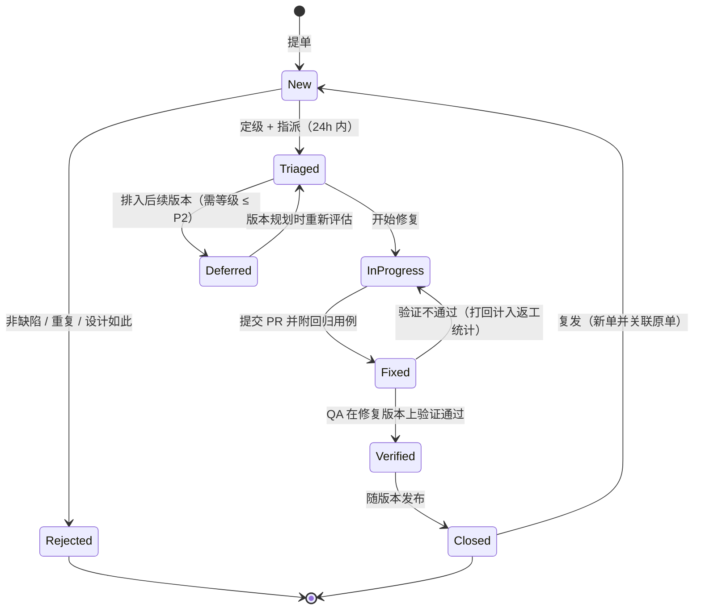

# 青垣面板 · 测试与质量保障

## 文档信息

| 项目 | 内容 |
| --- | --- |
| 文档名称 | 15-测试与质量保障 |
| 文档版本 | v1.0 |
| 更新日期 | 2026-08-17 |
| 状态 | 定稿 |
| 适用版本 | 青垣面板 v1.0 |
| 产品代号 | qingyuan |
| 覆盖内容 | 质量指标与门槛、测试金字塔与工具选型、四套测试环境与 testcontainers、Go 分层单测规范与示例、API 与迁移与 gRPC 集成测试、Vitest 与 Playwright 前端测试、k6 性能与容量测试、长稳与混沌演练、兼容性矩阵、安全测试清单、升级回归、缺陷管理与发布门禁、CI/CD 卡点、复杂功能用例集 |
| 关联文档 | [系统架构设计](./02-系统架构设计.md)、[技术栈与工程规范](./03-技术栈与工程规范.md)、[数据库设计](./04-数据库设计.md)、[API 接口规范](./05-API接口规范.md)、[多节点集群与 Agent](./10-多节点集群与Agent.md)、[监控告警与可观测](./11-监控告警与可观测.md)、[安全合规与审计](./12-安全合规与审计.md)、[应用商店与备份恢复](./13-应用商店与备份恢复.md)、[部署安装与升级](./14-部署安装与升级.md) |

## 目录

- [15.1 质量目标与度量](#151-质量目标与度量)
- [15.2 测试策略总览](#152-测试策略总览)
- [15.3 测试环境与数据](#153-测试环境与数据)
- [15.4 单元测试规范](#154-单元测试规范)
- [15.5 集成测试](#155-集成测试)
- [15.6 前端测试](#156-前端测试)
- [15.7 性能与容量测试](#157-性能与容量测试)
- [15.8 稳定性与混沌演练](#158-稳定性与混沌演练)
- [15.9 兼容性测试矩阵](#159-兼容性测试矩阵)
- [15.10 安全测试](#1510-安全测试)
- [15.11 升级回归与国际化无障碍测试](#1511-升级回归与国际化无障碍测试)
- [15.12 缺陷管理与发布质量门禁](#1512-缺陷管理与发布质量门禁)
- [15.13 CI/CD 中的质量卡点](#1513-cicd-中的质量卡点)
- [15.14 测试用例设计示例](#1514-测试用例设计示例)

## 15.1 质量目标与度量

### 15.1.1 覆盖率门槛（按层分级）

不设统一覆盖率数字。不同层的测试成本与收益差异极大，一刀切会逼出为覆盖率而写的空测试。

| 代码层 | 包路径 | 行覆盖门槛 | 分支覆盖门槛 | 理由 |
| --- | --- | --- | --- | --- |
| 领域逻辑与工具 | `internal/pkg/**`、`internal/domain/**` | 90% | 85% | 纯函数，无外部依赖，测试成本最低，且路径安全、cron 解析这类代码出错影响最大 |
| service 业务层 | `internal/service/**` | 80% | 70% | 依赖可 mock，是业务规则的主要承载层 |
| repository 数据层 | `internal/repository/**` | 75% | 60% | 用真实 SQLite 测，重点覆盖查询正确性与事务边界 |
| API handler | `internal/api/**` | 70% | 60% | 主要靠集成测试覆盖，单测只测参数校验与错误映射 |
| executor 执行层 | `internal/executor/**` | 60% | 50% | 与系统命令交互，只能测命令构造与输出解析，实际执行由集成测试覆盖 |
| Agent | `cmd/nova-agent`、`internal/agent/**` | 70% | 60% | 通信与状态机逻辑必测，采集器部分依赖真实系统 |
| 前端 store 与 hooks | `web/src/store`、`web/src/hooks` | 75% | — | 状态流转是前端 bug 高发区 |
| 前端组件 | `web/src/components` | 60% | — | 通用组件必测，页面组件靠 E2E |
| 全仓整体 | — | 75% | — | CI 门禁值 |

门禁执行方式：`golangci-lint` 后跑 `go test -coverprofile`，用自研的 `make cover-gate` 按包前缀分档校验，任一档不达标即 CI 失败。新增代码的增量覆盖率要求 85%（用 `git diff` 计算变更行的覆盖情况），避免「整体达标但新代码全裸」。

### 15.1.2 质量指标表

| 指标 | 定义 | 目标值 | 采集方式 | 责任角色 |
| --- | --- | --- | --- | --- |
| 单测覆盖率 | 见 15.1.1 分层 | 全仓 ≥ 75%，增量 ≥ 85% | CI codecov 报告 | 各模块开发 |
| 缺陷密度 | 每千行新增代码的有效缺陷数 | ≤ 2.0 | Sprint 结束统计 | QA |
| 逃逸缺陷率 | 线上发现的缺陷 / 全部缺陷 | ≤ 8% | 按季度统计 | QA + 架构 |
| 用例自动化率 | 已自动化用例 / 全部用例 | ≥ 70%（P0 用例 100%） | 测试管理平台 | QA |
| CI 通过率 | main 分支流水线首次通过率 | ≥ 90% | GitHub Actions 统计 | DevOps |
| CI 时长 | PR 流水线端到端 | ≤ 12 分钟 | 同上 | DevOps |
| 构建可重现性 | 同 commit 两次构建产物 sha256 一致 | 100% | Release 流水线校验 | DevOps |
| P0 缺陷响应 | 从确认到有临时缓解 | ≤ 2 小时 | 缺陷系统时间戳 | 值班 + 模块负责人 |
| P0 缺陷修复 | 从确认到发布修复版本 | ≤ 24 小时 | 同上 | 同上 |
| P1 缺陷修复 | — | ≤ 3 个工作日 | 同上 | 模块负责人 |
| 已知漏洞 | 依赖中的 High/Critical CVE | 0（发布前必须为 0） | `govulncheck` + `pnpm audit` + Trivy | DevOps |
| 性能回归 | 关键接口 P99 相对上版本 | 劣化 ≤ 10% | Nightly 基准对比 | 后端 |
| 内存基线 | 面板常驻 RSS / Agent 常驻 RSS | < 150MB / < 40MB | Nightly 长稳任务 | 后端 |
| 长稳无故障 | 7×24 运行无重启、无泄漏 | 168 小时 | Nightly 环境 | QA |
| 文档同步率 | API 变更是否同步更新文档 | 100% | PR 检查项 | 提交人 |

### 15.1.3 性能与安全门禁

以下为发布阻断项，不达标不允许发版，也不接受「下个版本修」：

| 门禁 | 阈值 | 检测手段 |
| --- | --- | --- |
| API P99 延迟 | < 300ms（500 节点、100 并发用户下的读接口） | k6 基准场景 |
| 指标写入吞吐 | ≥ 20k point/s 且丢弃数为 0 | k6 + 内置计数器 |
| 500 节点接入 | 全部在线，心跳丢失率 < 0.1% | mock Agent 集群 |
| 面板常驻内存 | < 150MB（500 节点、稳定运行 4 小时后） | pprof + RSS 采样 |
| Agent 常驻内存 | < 40MB | 同上 |
| 高危漏洞 | 依赖与镜像 High/Critical 均为 0 | govulncheck、Trivy、pnpm audit |
| SAST 高危 | gosec High 为 0，semgrep ERROR 为 0 | CI 阶段 |
| 渗透测试清单 | 15.10.4 的 10 类全部通过 | 每个 MINOR 版本执行一次 |
| 硬编码密钥 | 0 | gitleaks 扫描全历史 |

计数口径固定为**五项性能门禁**（API P99、指标写入吞吐、500 节点接入、面板常驻内存、Agent 常驻内存）与**四项安全门禁**（高危漏洞、SAST 高危、渗透测试清单、硬编码密钥），16.8.2 的 M3 条件 2 与 15.12.5 的自动组一按这个口径引用。四项安全门禁里只有三项能自动判定，渗透测试清单由人工组一核对（15.12.5）。

面板常驻内存 150MB 是唯一口径，D2 与 D3 都按这条判；D3（双副本）下两个副本各自采样，取较高值，不做求和也不放宽阈值——副本多了不构成单实例吃更多内存的理由。

## 15.2 测试策略总览

### 15.2.1 测试金字塔与投入分配

青垣面板 的形态是「一个控制面 + N 个被控端 + 大量系统调用」，纯 Web 项目的金字塔比例不适用：executor 与 Agent 层无法靠单测覆盖真实行为，集成测试占比必须更高。

| 层级 | 用例数量占比 | 执行时长占比 | 单次执行预算 | 触发时机 | 失败是否阻断 |
| --- | --- | --- | --- | --- | --- |
| Go 单元测试 | 60% | 15% | ≤ 4 min | 每次 push 与 PR | 阻断 |
| 前端单元测试（Vitest） | 12% | 5% | ≤ 90 s | 每次 push 与 PR | 阻断 |
| 集成测试（API + DB + gRPC） | 18% | 35% | ≤ 8 min | PR 跑核心集，nightly 跑全量 | 阻断 |
| E2E（Playwright） | 6% | 30% | ≤ 12 min | merge 到 develop 与 nightly | P0 用例阻断 |
| 性能与容量（k6） | 2% | 10% | ≤ 40 min | nightly 与 release | 见 15.1.3 门禁 |
| 长稳与混沌 | 2% | 5% | 168 h（独立环境） | 每个 MINOR 版本 | 不阻断 PR，阻断发版 |

比例只作为季度回顾时的健康度参考，不作为提交门槛。真正的门槛是 15.1.1 的分层覆盖率与 15.1.3 的发布阻断项。

判断一个能力该放在哪一层，只用一条判据：能否在不启动外部进程的前提下确定性验证。能，写单测；不能但可用容器替身，写集成测试；只能靠真实浏览器加真实系统，写 E2E。

### 15.2.2 各层职责与工具选型

| 层级 | 验证对象 | 工具 | 依赖处理方式 | 代码位置 |
| --- | --- | --- | --- | --- |
| Go 单测（pkg/domain） | 路径校验、cron 解析、选择器匹配、错误码映射、单位换算 | `go test` + `testify/assert` | 无外部依赖 | 同包 `*_test.go` |
| Go 单测（service） | 业务规则、状态流转、幂等、权限判定分支 | `go test` + `gomock` | repository 与 executor 全部打桩 | 同包 `*_test.go` |
| Go 单测（repository） | SQL 正确性、事务边界、乐观锁、分页 | `go test` + 临时 SQLite | 真实库文件，每例独立 | 同包 `*_test.go` |
| Go 单测（executor） | 命令行拼装、stdout/stderr 解析、超时与取消 | `go test` + `CommandRunner` 接口替换 | 严禁真实执行系统命令 | 同包 `*_test.go` |
| 集成测试（API） | 路由、中间件、鉴权、响应信封、错误码 | `httptest` + 真实 Gin 引擎 | testcontainers 起 DB 与 Redis | `test/integration/api/` |
| 集成测试（迁移） | up/down/up 全量、三库兼容 | `novactl migrate` + testcontainers | MySQL 8.0、PostgreSQL 14 容器 | `test/integration/migrate/` |
| 集成测试（gRPC） | Envelope 编解码、注册、心跳、流控、重连 | `bufconn` + mock Agent | 不起真实节点 | `test/integration/agent/` |
| 契约测试 | 响应与 OpenAPI schema 一致 | `kin-openapi` schema 校验 | 复用 API 集成测试的响应体 | `test/contract/` |
| 前端单测 | store、hooks、通用组件 | Vitest + `@vue/test-utils` | MSW 拦截 HTTP，Arco 全量注册 | `web/src/**/__tests__/` |
| E2E | 跨页面主流程、权限可见性、WebSocket 交互 | Playwright | 真实面板 + 1 个真实 Agent | `test/e2e/` |
| 性能 | 吞吐、延迟、资源占用 | k6 + pprof | mock Agent 集群 | `test/perf/` |
| 混沌 | 故障注入下的降级与自愈 | `scripts/chaos/*.sh` + tc + stress-ng | 预发环境 | `test/chaos/` |
| 安全 | SCA、SAST、DAST、密钥泄露 | gosec、semgrep、trivy、gitleaks、ZAP | CI 与专项环境 | `.github/workflows/security.yml` |

### 15.2.3 该测什么与不该测什么

必须有测试（缺失则 Code Review 打回）：

| 类别 | 具体范围 | 原因 |
| --- | --- | --- |
| 安全边界 | `pathguard.Resolve`、命令白名单、Casbin 策略判定、JWT 校验、mTLS 证书链校验、上传类型嗅探 | 一处漏洞等于全盘失守 |
| 状态机 | 节点生命周期、告警 `pending/firing/resolving/resolved/nodata`、Job 状态、证书续期状态 | 分支多、人工推演不可靠 |
| 解析与序列化 | cron 表达式、nginx 配置片段、`panel.yaml` schema、Envelope 编解码、告警表达式 DSL | 输入不可控，边界情况极多 |
| 幂等与并发 | `idempotency_key` 去重、乐观锁版本冲突、分布式定时任务抢锁 | 线上必现，本地难复现 |
| 错误码契约 | `errs` 码值与 HTTP status 的映射 | 前端依赖码值分支 |
| 数据迁移 | 每个 migration 的 up 与 down | 不可逆，出错即数据损失 |
| 计算逻辑 | 磁盘与内存百分比、限流窗口、备份保留策略计算、时序降采样 | 静默错误，用户不会报障但决策已错 |

不写测试（写了是负债）：

| 类别 | 说明 |
| --- | --- |
| GORM 自动生成的简单 CRUD | 测的是 ORM 而不是自己的代码；有条件查询或事务时才测 |
| DTO 与 model 的字段拷贝 | 编译器已保证类型，改字段名会同时改测试，纯重复劳动 |
| 常量表与 i18n 词条内容 | 用「缺失 key 扫描」而不是断言具体文案 |
| 页面级 Vue 组件的渲染快照 | 快照测试对样式改动过度敏感，主流程交给 E2E |
| 第三方库行为 | 不为 Gin 的路由匹配、Arco 的表格排序写测试 |
| 日志文本内容 | 只在「日志必须包含 traceId」这类结构性约束上断言 |
| 单纯 getter/setter 与 `String()` | 除非包含格式化逻辑 |

### 15.2.4 命名与目录约定

```text
internal/service/site/
├── service.go
├── service_test.go              单测与实现同目录、同包（可测私有函数）
├── export_test.go               仅在需要向外暴露私有符号时使用
└── testdata/
    ├── nginx_vhost_ok.conf      固定装置，禁止在 Go 字符串里堆大段文本
    └── expect_vhost.golden      golden 文件，用 -update 标志重新生成

test/
├── integration/{api,migrate,agent,external}/   集成测试，build tag: integration
├── contract/                                   OpenAPI 契约测试
├── e2e/{specs,fixtures,pages}/                 Playwright，pages 放 Page Object
├── perf/{api_mixed.js,metric_ingest.js}/       k6 脚本
├── chaos/                                      混沌场景与预期
└── mockagent/                                  mock Agent 库，被集成与性能测试共用
```

| 约定 | 规则 | 反例 |
| --- | --- | --- |
| 测试函数名 | `TestXxx_场景_预期`，中文场景用拼音或英文 | `TestResolve1` |
| 子测试名 | table-driven 的 `name` 用中文描述，便于失败定位 | `case3` |
| 包名 | 默认同包（内部测试）；只测公开 API 时用 `xxx_test` 包 | 混用两种风格 |
| 构建标记 | 集成测试文件首行 `//go:build integration` | 让 `go test ./...` 拖到 10 分钟 |
| 固定装置 | 一律放 `testdata/`（Go 工具链自动忽略该目录） | 放 `fixtures/` 被当成源码包 |
| golden 文件 | 后缀 `.golden`，用 `go test -update` 刷新 | 手工维护期望文本 |
| 临时目录 | `t.TempDir()`，禁止写 `/tmp` 固定路径 | 并行测试互相踩 |
| 清理 | `t.Cleanup()`，禁止 `defer` 里做跨子测试清理 | 子测试提前退出后残留 |
| E2E 用例 ID | `E2E-<模块>-<序号>`，与 15.6.3 表格一一对应 | 无编号，无法追溯 |

## 15.3 测试环境与数据

### 15.3.1 四套环境定义

| 维度 | 本地（local） | CI（GitHub Actions） | 集成（integration） | 预发（staging） |
| --- | --- | --- | --- | --- |
| 用途 | 开发自测、单测、调试 | PR 门禁、单测与核心集成 | 全量集成、E2E、契约 | 长稳、混沌、性能、升级回归、发版验收 |
| 拓扑 | 1 台开发机，Agent 与 Panel 同机 | ubuntu-24.04 runner，容器化依赖 | 1 控制面 + 3 Agent（不同发行版） | 1 控制面 + 20 真实 Agent + 480 mock Agent |
| 数据库 | SQLite 文件 `.dev/nova.db` | SQLite + testcontainers MySQL/PG | PostgreSQL 14 容器 + MySQL 8.0 容器 | PostgreSQL 14 独立实例（贴近生产） |
| Redis | 不启用 | testcontainers 按需 | Redis 7 容器 | Redis 7 独立实例 |
| 数据来源 | `make seed` 生成的最小数据集 | 每例自建，用完即弃 | 每次运行前 `truncate + seed` | 脱敏后的仿真数据集，保留 30 天 |
| 外部依赖 | 全部 mock | pebble、minio、mailhog 容器 | 同 CI，另加真实 Docker daemon | 真实 Let's Encrypt staging、真实 SMTP、真实对象存储桶 |
| 破坏性操作 | 允许（重装系统级软件、删库） | 允许（runner 一次性） | 允许（每次重建） | 允许，但需在窗口内并提前通知 |
| 数据保留 | 不保留 | 不保留（仅 artifact 保留 7 天） | 不保留 | 快照保留 30 天，用于回滚复现 |
| 可访问性 | 仅本机 | 仅流水线 | 内网，需 VPN | 内网，需 VPN + 二次审批 |
| 重建方式 | `make dev-reset` | 每次 job 全新 | `make integ-up` / `integ-down`（compose） | Terraform + Ansible，全量重建 ≤ 40 min |
| 谁可以改 | 开发本人 | DevOps（改 workflow 需评审） | DevOps + QA | DevOps，变更走工单 |

预发环境是唯一允许接触真实 ACME 与真实对象存储的环境；其余环境一律用 pebble 与 minio，避免撞 Let's Encrypt 限流（见 16.8 风险 R-11）。

### 15.3.2 testcontainers-go 依赖编排

集成测试的外部依赖统一由 `test/integration/env` 包托管，容器版本与 [技术栈与工程规范](./03-技术栈与工程规范.md) 声明的最低支持版本一致。

```go
// test/integration/env/containers.go
//go:build integration

package env

import (
    "context"
    "fmt"
    "testing"
    "time"

    "github.com/testcontainers/testcontainers-go"
    "github.com/testcontainers/testcontainers-go/modules/mysql"
    "github.com/testcontainers/testcontainers-go/modules/postgres"
    "github.com/testcontainers/testcontainers-go/modules/redis"
    "github.com/testcontainers/testcontainers-go/wait"
)

// StartMySQL 启动 MySQL 8.0 并返回 GORM DSN。容器随测试结束自动销毁。
func StartMySQL(t *testing.T) string {
    t.Helper()
    ctx := context.Background()
    c, err := mysql.Run(ctx, "mysql:8.0.39",
        mysql.WithDatabase("nova_test"),
        mysql.WithUsername("nova"),
        mysql.WithPassword("nova_ci"),
        // 与生产一致的字符集与时区，避免「本地过 CI 挂」的经典问题
        mysql.WithConfigFile("testdata/my.cnf"),
        testcontainers.WithWaitStrategy(
            wait.ForLog("ready for connections").WithOccurrence(2).
                WithStartupTimeout(90*time.Second)),
    )
    if err != nil {
        t.Fatalf("启动 MySQL 容器失败: %v", err)
    }
    t.Cleanup(func() { _ = testcontainers.TerminateContainer(c) })
    host, _ := c.Host(ctx)
    port, _ := c.MappedPort(ctx, "3306/tcp")
    return fmt.Sprintf("nova:nova_ci@tcp(%s:%s)/nova_test?parseTime=true&loc=Asia%%2FShanghai&charset=utf8mb4",
        host, port.Port())
}
```

```go
// StartPostgres 启动 PostgreSQL 14。
func StartPostgres(t *testing.T) string {
    t.Helper()
    ctx := context.Background()
    c, err := postgres.Run(ctx, "postgres:14.13-alpine",
        postgres.WithDatabase("nova_test"),
        postgres.WithUsername("nova"),
        postgres.WithPassword("nova_ci"),
        postgres.BasicWaitStrategies(), // 内部已含 pg_isready 双次探测
    )
    if err != nil {
        t.Fatalf("启动 PostgreSQL 容器失败: %v", err)
    }
    t.Cleanup(func() { _ = testcontainers.TerminateContainer(c) })
    dsn, err := c.ConnectionString(ctx, "sslmode=disable", "TimeZone=Asia/Shanghai")
    if err != nil {
        t.Fatalf("获取 DSN 失败: %v", err)
    }
    return dsn
}

// StartRedis 启动 Redis 7，用于分布式锁与会话相关的集成测试。
func StartRedis(t *testing.T) string {
    t.Helper()
    ctx := context.Background()
    c, err := redis.Run(ctx, "redis:7.4-alpine",
        redis.WithSnapshotting(10, 1),
        redis.WithLogLevel(redis.LogLevelWarning),
    )
    if err != nil {
        t.Fatalf("启动 Redis 容器失败: %v", err)
    }
    t.Cleanup(func() { _ = testcontainers.TerminateContainer(c) })
    uri, _ := c.ConnectionString(ctx) // redis://host:port
    return uri
}

// StartDinD 启动 Docker-in-Docker，用于 container 模块的集成测试。
// 返回 DOCKER_HOST 值，Agent 侧的 docker client 直连该地址。
func StartDinD(t *testing.T) string {
    t.Helper()
    ctx := context.Background()
    req := testcontainers.ContainerRequest{
        Image:        "docker:27.3-dind",
        ExposedPorts: []string{"2375/tcp"},
        Privileged:   true, // DinD 必需；仅限 CI 与集成环境
        Env: map[string]string{
            "DOCKER_TLS_CERTDIR": "", // 关闭 TLS，容器仅监听内网端口
        },
        Cmd: []string{"dockerd", "--host=tcp://0.0.0.0:2375", "--host=unix:///var/run/docker.sock"},
        WaitingFor: wait.ForListeningPort("2375/tcp").
            WithStartupTimeout(120 * time.Second),
    }
    c, err := testcontainers.GenericContainer(ctx, testcontainers.GenericContainerRequest{
        ContainerRequest: req, Started: true,
    })
    if err != nil {
        t.Skipf("跳过：当前环境不支持 DinD（%v）", err) // 开发机无 privileged 时跳过而非失败
    }
    t.Cleanup(func() { _ = testcontainers.TerminateContainer(c) })
    host, _ := c.Host(ctx)
    port, _ := c.MappedPort(ctx, "2375/tcp")
    return fmt.Sprintf("tcp://%s:%s", host, port.Port())
}
```

容器复用策略：单个测试包内的 MySQL/PostgreSQL 容器通过 `TestMain` 启动一次、包内共享，用「每例一个 schema」而不是「每例一个容器」来隔离，否则 CI 时长会翻三倍。`testcontainers.WithReuse` 只在本地开启（通过环境变量 `NOVA_TC_REUSE=1`），CI 上禁用以保证干净。

### 15.3.3 多 OS 与多架构矩阵方案

被管软件的安装与服务管理是发行版差异最大的部分（包管理器、systemd 版本、SELinux、防火墙工具、PHP 源），必须真机或近真机验证。分三层解决：

| 层次 | 手段 | 覆盖内容 | 成本 | 频率 |
| --- | --- | --- | --- | --- |
| L1 容器镜像 | GitHub Actions container job，跑 `ubuntu:24.04`、`debian:12`、`rockylinux:9`、`openeuler:24.03`、`kylin:v10` | 包管理器命令拼装、路径差异、`os-release` 探测、install.sh 的非 systemd 分支 | 低 | 每次 PR（L1 三个镜像）+ nightly（全部） |
| L2 QEMU/云主机 | nightly 用 `qemu-system-aarch64` 起 arm64 虚机；或按需拉云上按量实例 | systemd 单元、真实服务启停、防火墙、SELinux、内核参数 | 中 | nightly + 每版本 |
| L3 真机池 | 集成与预发环境常驻的 20 台机器（覆盖表 15.9.1 全部一级 OS） | 端到端安装、升级、卸载、Agent 长稳 | 高 | 每个 MINOR 版本发布前 |

容器层的局限必须明说：容器内没有真实 systemd，`systemctl` 相关逻辑只能验证命令构造与错误分支，不能验证服务真起来了。因此 install.sh 的测试拆成两段——「参数解析与环境探测」在 L1 跑，「服务安装与健康检查」在 L2/L3 跑。

```yaml
# .github/workflows/os-matrix.yml 片段（nightly）
jobs:
  os-matrix:
    strategy:
      fail-fast: false
      matrix:
        include:
          - { os: ubuntu,   tag: '24.04',  pm: apt,  tier: 1 }
          - { os: ubuntu,   tag: '22.04',  pm: apt,  tier: 1 }
          - { os: debian,   tag: '12',     pm: apt,  tier: 1 }
          - { os: debian,   tag: '11',     pm: apt,  tier: 2 }
          - { os: rockylinux, tag: '9',    pm: dnf,  tier: 1 }
          - { os: rockylinux, tag: '8',    pm: dnf,  tier: 2 }
          - { os: openeuler/openeuler, tag: '24.03', pm: dnf, tier: 1 }
    runs-on: ubuntu-24.04
    container:
      image: ${{ matrix.os }}:${{ matrix.tag }}
      options: --privileged   # install.sh 需要挂载与 sysctl
    steps:
      - uses: actions/checkout@v4
      - name: 探测与依赖安装
        run: ./scripts/ci/bootstrap-os.sh ${{ matrix.pm }}
      - name: install.sh 静默安装（--skip-service 模式）
        run: bash deploy/install.sh --silent --skip-service --prefix /opt/novapanel
      - name: 校验目录与配置产物
        run: ./scripts/ci/assert-layout.sh
```

Kylin V10 与麒麟系镜像不在公共 registry，放在内网 registry，由 nightly 的自托管 runner 拉取；公共 fork 的 PR 自动跳过该矩阵项，避免外部贡献者流水线红。

### 15.3.4 mock Agent

集群逻辑（调度、批量执行、心跳判活、规模化）不能依赖真实节点：起 500 台机器不现实，且真实节点引入非确定性。`test/mockagent` 提供一个可编程的假 Agent，实现 `nova.agent.v1.AgentStream` 客户端侧行为，走 bufconn（单测与集成）或真实 TCP（性能测试的 500 节点模拟）。

```go
// test/mockagent/agent.go
package mockagent

import (
    "context"
    "io"
    "sync"
    "sync/atomic"
    "time"

    agentv1 "github.com/novapanel/novapanel/api/gen/agent/v1"
    "google.golang.org/grpc"
)

// Handler 是可编程响应钩子：返回 nil 表示不回帧（用于模拟超时与丢包）。
type Handler func(in *agentv1.Envelope) *agentv1.Envelope

// Options 描述一个 mock 节点的行为特征。
type Options struct {
    NodeID        string
    Hostname      string
    AgentVersion  string        // 用于版本兼容测试，如 "v0.9.3"
    Arch          string        // amd64 / arm64
    OSRelease     string        // ubuntu-24.04
    HeartbeatFreq time.Duration // 默认 10s
    ExecDelay     time.Duration // 模拟命令执行耗时
    ExecExitCode  int32         // 模拟非零退出
    DropRate      float64       // 0-1，按比例丢弃待发帧
    ExtraLatency  time.Duration // 每帧附加延迟，模拟跨地域
    MetricPoints  int           // 每次上报的指标点数，压测用
    Handlers      map[agentv1.MsgType]Handler // 覆盖默认行为
}

type Agent struct {
    opt      Options
    conn     *grpc.ClientConn
    stream   agentv1.AgentStream_StreamClient
    msgID    atomic.Uint64
    sent     atomic.Int64
    recv     atomic.Int64
    mu       sync.Mutex
    inbox    map[uint64]chan *agentv1.Envelope // correlate_id -> 等待方
    closed   chan struct{}
}
```

```go
// Dial 建立反向拨号连接并完成 Hello + Register 握手。
func Dial(ctx context.Context, dialer grpc.DialOption, opt Options) (*Agent, error) {
    if opt.HeartbeatFreq == 0 {
        opt.HeartbeatFreq = 10 * time.Second
    }
    cc, err := grpc.NewClient("passthrough:///bufnet", dialer,
        grpc.WithTransportCredentials(insecureOrMTLS(opt)))
    if err != nil {
        return nil, err
    }
    st, err := agentv1.NewAgentStreamClient(cc).Stream(ctx)
    if err != nil {
        return nil, err
    }
    a := &Agent{opt: opt, conn: cc, stream: st,
        inbox: make(map[uint64]chan *agentv1.Envelope), closed: make(chan struct{})}
    if err := a.handshake(); err != nil {
        return nil, err
    }
    go a.readLoop()
    go a.heartbeatLoop()
    return a, nil
}

// readLoop 收帧并按 msg_type 分发：请求类交给 Handler，响应类唤醒等待方。
func (a *Agent) readLoop() {
    for {
        in, err := a.stream.Recv()
        if err == io.EOF || err != nil {
            close(a.closed)
            return
        }
        a.recv.Add(1)
        if in.CorrelateId != 0 {
            a.mu.Lock()
            ch, ok := a.inbox[in.CorrelateId]
            delete(a.inbox, in.CorrelateId)
            a.mu.Unlock()
            if ok {
                ch <- in
            }
            continue
        }
        if h, ok := a.opt.Handlers[in.MsgType]; ok {
            if out := h(in); out != nil {
                a.send(out)
            }
            continue
        }
        a.defaultHandle(in) // 内置：EXEC_REQ 回 EXEC_RESULT，PTY_OPEN 回固定 banner 等
    }
}
```

`defaultHandle` 的内置行为覆盖 Panel 侧最常用的六类请求，写测试时通常不需要自定义 Handler：

| 收到 | 默认回复 | 可调参数 |
| --- | --- | --- |
| `MSG_EXEC_REQ` | 延迟 `ExecDelay` 后回 `MSG_EXEC_RESULT`，stdout 为 `mock: <cmd>` | `ExecDelay`、`ExecExitCode` |
| `MSG_HEARTBEAT_ACK` | 记录 RTT，不回帧 | — |
| `MSG_CONFIG_SYNC` | 回 `MSG_CONFIG_ACK`，版本号回填 | 可返回 `ConfigDrift` 模拟漂移 |
| `MSG_UPGRADE_CMD` | 分 5 档回 `MSG_UPGRADE_PROGRESS`，最后改 `AgentVersion` | 可注入失败档位 |
| `MSG_CERT_ROTATE` | 生成自签 CSR 回 `MSG_CERT_CSR` | 可回错误码测试拒绝路径 |
| `MSG_LOG_STREAM_OPEN` | 按 100 行/秒推 `MSG_LOG_STREAM_DATA` | 行数与速率可配 |

配套的集群构造器 `mockagent.Fleet` 用于一次拉起 N 个节点，并提供 `KillRandom(n)`、`PartitionAll(d)`、`SetDropRate(r)` 三个方法，直接服务 15.8 的混沌演练与 15.7 的 500 节点压测：

```go
fleet := mockagent.NewFleet(t, panelAddr, mockagent.FleetOptions{
    Count: 500, IDPrefix: "mock-", ArchMix: map[string]int{"amd64": 400, "arm64": 100},
    HeartbeatFreq: 10 * time.Second, MetricPoints: 40,
})
defer fleet.Close()
fleet.WaitOnline(t, 500, 2*time.Minute) // 断言 500 个全部在线
fleet.KillRandom(50)                    // 模拟 10% 节点宕机
```

### 15.3.5 测试数据工厂与固定装置

禁止在测试里手写完整实体结构体，一律走 `test/factory` 的构造器；默认值合法，只覆写关心的字段。这样新增必填字段时只改工厂一处，不会引发几百个测试同时编译失败。

```go
// test/factory/site.go
func Site(t *testing.T, db *gorm.DB, opts ...func(*model.Site)) *model.Site {
    t.Helper()
    s := &model.Site{
        TenantID: 1, Name: "site-" + Rand(6), PrimaryDomain: Rand(6) + ".test",
        Root: "/www/wwwroot/" + Rand(6), Type: model.SiteTypePHP, PHPVersion: "8.3",
        Status: model.SiteStatusRunning, NodeID: 1, CreatedAt: FixedNow(),
    }
    for _, o := range opts {
        o(s)
    }
    require.NoError(t, db.Create(s).Error)
    return s
}

// 用法：factory.Site(t, db, factory.WithSiteStatus(model.SiteStatusStopped))
```

| 工厂 | 覆盖实体 | 关联自动创建 |
| --- | --- | --- |
| `factory.Tenant` | `sys_tenant` | — |
| `factory.User` | `sys_user`（默认 bcrypt 已哈希的 `Test@123456`） | 角色绑定 |
| `factory.Node` | `cluster_node` | 证书指纹、心跳记录 |
| `factory.Site` | `web_site` | 域名绑定、Nginx 配置行 |
| `factory.Cert` | `web_cert` | 可指定到期时间，测续期 |
| `factory.AlertRule` | `alert_rule` | 通知渠道 |
| `factory.Job` | `job_task` + `job_target` | 按节点数展开子目标 |
| `factory.Backup` | `bak_plan` + `bak_record` | 对象存储配置 |

固定装置的三条硬规则：时间一律用 `FixedNow()`（`2026-08-17T10:00:00+08:00`）而非 `time.Now()`；随机串用带固定种子的 `Rand()`，失败可复现；大段配置文本放 `testdata/`，Go 代码里只留文件名。

### 15.3.6 测试数据脱敏

预发环境使用的仿真数据集由生产反馈样本加工而来，加工流程强制经过 `scripts/anonymize.go`，未过脱敏的数据禁止进入任何测试环境。

| 数据类别 | 处理方式 | 校验手段 |
| --- | --- | --- |
| 用户名与邮箱 | 替换为 `user<N>@example.com` | 正则扫描非 `example.com` 域名即失败 |
| 密码哈希 | 全量重置为固定测试口令的哈希 | 断言哈希值集合唯一 |
| TOTP 密钥与恢复码 | 清空，重新绑定 | 字段非空即失败 |
| 域名 | 映射到 `*.test` 与 `*.example.com` | 同上 |
| 公网 IP | 映射到 `198.51.100.0/24`、`203.0.113.0/24`（RFC 5737） | 扫描是否落在保留段 |
| API Token 与 JWT 密钥 | 重新生成，不复用生产值 | gitleaks 规则覆盖测试数据目录 |
| 数据库连接串与对象存储凭证 | 替换为容器内凭证 | 断言 host 为内网或容器名 |
| 证书私钥 | 全部替换为测试 CA 签发的短期证书 | 断言签发者为 `Qingyuan Test CA` |
| 审计日志中的命令内容 | 保留结构，敏感参数替换为 `***` | 抽样人工复核 |
| 备份包内容 | 只保留元数据，实体文件用同大小随机字节填充 | 断言无可读文本 |

脱敏后的数据集打成 `nova-fixture-<日期>.tar.zst`，存内网对象存储，哈希登记在 `test/fixtures/CHECKSUMS`；预发环境重建时校验哈希，不匹配拒绝加载。

## 15.4 单元测试规范

### 15.4.1 分层策略

| 被测层 | 依赖处理 | 允许的副作用 | 明确禁止 |
| --- | --- | --- | --- |
| `internal/pkg/**`、`internal/domain/**` | 无依赖，纯函数 | 无 | 读环境变量、读时钟（时间从参数传入） |
| `internal/repository/**` | 真实 SQLite 临时库（`t.TempDir()` 内文件，非 `:memory:`） | 建表、写数据 | 连接 MySQL/PostgreSQL（那是集成测试的事） |
| `internal/service/**` | repository 与 executor 全部用 gomock 打桩 | 无 | 真实数据库、真实文件系统 |
| `internal/executor/**` | `CommandRunner` 接口替换为 fake | 无 | `exec.Command` 真实执行 |
| `internal/api/**` | service 用 gomock 打桩 | 无 | 起真实 HTTP 监听端口 |
| `internal/agent/**` | 采集器接口替换、gRPC 用 bufconn | 无 | 读 `/proc`（改为注入 `procfs.FS`） |
| `internal/alerting/**` | 时钟注入 `Clock` 接口，样本用内存序列 | 无 | 真实定时器 `time.Sleep` 驱动状态机 |

repository 层用真实 SQLite 文件而不是 `:memory:` 的原因：`modernc.org/sqlite` 的内存库在多连接场景下行为与文件库不一致（GORM 连接池会开多连接），用文件库能暴露真实的锁与事务问题。每个测试用 `t.TempDir()` 得到独立文件，天然并行安全。

executor 层的接口替换是硬性要求。单测里执行 `systemctl restart nginx` 会破坏开发机，也让 CI 结果依赖 runner 状态：

```go
// internal/executor/runner.go
type CommandRunner interface {
    Run(ctx context.Context, name string, args ...string) (stdout, stderr []byte, code int, err error)
}

// internal/executor/fake_runner.go（带 //go:build !prod 或放在 _test 包）
type FakeRunner struct {
    Calls   [][]string                       // 记录调用序列，供断言命令拼装
    Replies map[string]FakeReply             // key 为 "name arg1 arg2"
    Default FakeReply
}
```

service 层示例（只测规则，不测存储）：

```go
func TestSiteService_Create_域名冲突时返回409(t *testing.T) {
    ctrl := gomock.NewController(t)
    repo := mock.NewMockSiteRepository(ctrl)
    exec := execmock.NewMockNginxExecutor(ctrl)

    repo.EXPECT().ExistsByDomain(gomock.Any(), uint64(1), "a.test").Return(true, nil)
    // 冲突时不应触碰 executor，用 Times(0) 把「多余的副作用」也测掉
    exec.EXPECT().WriteVhost(gomock.Any(), gomock.Any()).Times(0)

    svc := site.New(repo, exec, testClock)
    _, err := svc.Create(context.Background(), &dto.SiteCreateReq{PrimaryDomain: "a.test"})

    require.Error(t, err)
    assert.Equal(t, errs.CodeConflict, errs.Code(err))
}
```

### 15.4.2 gomock 生成与 Makefile 目标

mock 代码由 `mockgen` 生成并提交进仓库（不在 CI 现场生成），保证任何人 clone 后 `go test ./...` 直接可跑。`make mocks` 在 [技术栈与工程规范](./03-技术栈与工程规范.md) 已定义两条基础规则，测试相关的补充目标如下：

```makefile
# ===== 测试相关目标（Makefile 增补） =====
MOCK_SRCS := internal/repository/interface.go internal/executor/interface.go \
             internal/service/interface.go   internal/agentproto/invoker.go

mocks: ## 生成接口 mock（go.uber.org/mock v0.5.0）
	@for f in $(MOCK_SRCS); do \
		d=$$(dirname $$f)/mock; b=$$(basename $$f .go); \
		mockgen -source=$$f -destination=$$d/$${b}_mock.go -package=mock || exit 1; \
	done

mocks-check: mocks ## CI 校验 mock 是否与接口同步（有 diff 即失败）
	@git diff --exit-code -- '*_mock.go' || \
		{ echo "mock 与接口不同步，请执行 make mocks 并提交"; exit 1; }

test-unit: ## 单元测试（默认目标，不含 integration tag）
	go test -race -count=1 -timeout 10m -shuffle=on ./...

test-integration: ## 集成测试（需 Docker）
	go test -race -count=1 -timeout 25m -tags=integration ./test/integration/...

test-contract: ## OpenAPI 契约测试
	go test -count=1 -tags=integration ./test/contract/...

cover: ## 生成全仓覆盖率报告
	go test -race -covermode=atomic -coverprofile=$(COVER_PROFILE) \
		-coverpkg=./internal/...,./cmd/... ./...
	go tool cover -html=$(COVER_PROFILE) -o coverage.html

cover-gate: cover ## 按 15.1.1 分层门槛校验，任一档不达标即失败
	go run ./scripts/covergate -profile=$(COVER_PROFILE) -config=.covergate.yml

cover-diff: ## 增量覆盖率门槛 85%
	go run ./scripts/covergate -profile=$(COVER_PROFILE) \
		-diff-base=origin/develop -diff-min=85

test-e2e: ## Playwright E2E
	cd test/e2e && pnpm install --frozen-lockfile && pnpm playwright test

test-web: ## 前端单测
	cd web && pnpm vitest run --coverage

fuzz: ## 模糊测试（每个目标 30s）
	go test -run=NONE -fuzz=FuzzCronParse   -fuzztime=30s ./internal/pkg/cronx
	go test -run=NONE -fuzz=FuzzResolvePath -fuzztime=30s ./internal/service/file/pathguard
	go test -run=NONE -fuzz=FuzzAlertExpr   -fuzztime=30s ./internal/alerting/expr
	go test -run=NONE -fuzz=FuzzPanelYAML   -fuzztime=30s ./internal/pkg/config
```

`.covergate.yml` 把 15.1.1 的表格直接翻译成配置，避免两处数字不一致：

```yaml
# .covergate.yml
overall: { line: 75 }
increment: { line: 85, base: origin/develop }
packages:
  - { prefix: "internal/pkg/",        line: 90, branch: 85 }
  - { prefix: "internal/domain/",     line: 90, branch: 85 }
  - { prefix: "internal/security/",   line: 85, branch: 80 }
  - { prefix: "internal/service/",    line: 80, branch: 70 }
  - { prefix: "internal/repository/", line: 75, branch: 60 }
  - { prefix: "internal/api/",        line: 70, branch: 60 }
  - { prefix: "internal/agent/",      line: 70, branch: 60 }
  - { prefix: "internal/executor/",   line: 60, branch: 50 }
exclude:
  - "internal/agentproto/**"     # protoc 生成代码
  - "**/mock/**"                 # mockgen 生成代码
  - "**/*_gen.go"
  - "cmd/*/wire_gen.go"
```

### 15.4.3 示例一：路径安全校验 SafeJoin

被测对象是文件模块的唯一入口 `pathguard`（见 [文件管理与 WebSSH](./08-文件管理与WebSSH.md) 的 Guard 设计）。这是全项目最需要穷举的函数，用例覆盖穿越、编码变体、符号链接逃逸、黑名单优先级、写模式差异。

```go
// internal/service/file/pathguard/guard_test.go
package pathguard

import (
    "os"
    "path/filepath"
    "testing"

    "github.com/stretchr/testify/assert"
    "github.com/stretchr/testify/require"
)

func newTestGuard(t *testing.T, root string, follow bool) *Guard {
    t.Helper()
    g, err := New(Config{
        AllowRoots:     []string{root, filepath.Join(root, "..", "shared")},
        DenyPaths:      []string{"/proc", "/sys", "/etc/shadow"},
        DenyWritePaths: []string{"/etc/passwd"},
        FollowSymlink:  follow,
        MaxPathLen:     4096,
    })
    require.NoError(t, err)
    return g
}

func TestGuard_Resolve(t *testing.T) {
    t.Parallel()
    root := t.TempDir()
    require.NoError(t, os.MkdirAll(filepath.Join(root, "www", "a"), 0o755))
    require.NoError(t, os.WriteFile(filepath.Join(root, "www", "a", "f.txt"), []byte("x"), 0o644))
    // 站点目录内埋一个指向 /etc 的软链，模拟逃逸攻击
    require.NoError(t, os.Symlink("/etc", filepath.Join(root, "www", "escape")))
    // 再埋一个指向根内部的软链，这个应当放行
    require.NoError(t, os.Symlink(filepath.Join(root, "www", "a"), filepath.Join(root, "www", "inner")))

    tests := []struct {
        name    string
        raw     string
        mode    Mode
        follow  bool
        wantErr error
        wantAbs string // 非空时断言解析结果
    }{
        {name: "正常绝对路径读取", raw: filepath.Join(root, "www/a/f.txt"), mode: ModeRead,
            wantAbs: filepath.Join(root, "www/a/f.txt")},
        {name: "空路径", raw: "", mode: ModeRead, wantErr: ErrEmptyPath},
        {name: "相对路径被拒", raw: "www/a/f.txt", mode: ModeRead, wantErr: ErrNotAbs},
        {name: "含 NUL 字节", raw: root + "/www/a\x00.txt", mode: ModeRead, wantErr: ErrNullByte},
        {name: "超长路径", raw: "/" + string(make([]byte, 5000)), mode: ModeRead, wantErr: ErrTooLong},
        {name: "点点穿越到父目录", raw: filepath.Join(root, "www/../../etc/passwd"),
            mode: ModeRead, wantErr: ErrOutOfRoot},
        {name: "多级点点穿越", raw: root + "/www/a/../../../../../../etc/hosts",
            mode: ModeRead, wantErr: ErrOutOfRoot},
        {name: "Clean 后仍在根内的点点", raw: filepath.Join(root, "www/a/../a/f.txt"),
            mode: ModeRead, wantAbs: filepath.Join(root, "www/a/f.txt")},
        {name: "冗余斜杠与点", raw: root + "//www/./a//f.txt", mode: ModeRead,
            wantAbs: filepath.Join(root, "www/a/f.txt")},
        {name: "黑名单优先于白名单", raw: "/proc/self/environ", mode: ModeRead, wantErr: ErrDenied},
        {name: "只读黑名单允许读", raw: "/etc/passwd", mode: ModeRead, wantErr: ErrOutOfRoot},
        {name: "只读黑名单禁止写", raw: "/etc/passwd", mode: ModeWrite, wantErr: ErrReadOnly},
        {name: "软链逃逸出根", raw: filepath.Join(root, "www/escape/passwd"),
            mode: ModeRead, wantErr: ErrSymlinkOut},
        {name: "软链指向根内允许", raw: filepath.Join(root, "www/inner/f.txt"),
            mode: ModeRead, wantAbs: filepath.Join(root, "www/a/f.txt")},
        {name: "写入不存在文件的父目录合法", raw: filepath.Join(root, "www/a/new.txt"),
            mode: ModeWrite, wantAbs: filepath.Join(root, "www/a/new.txt")},
        {name: "写入不存在的多级父目录", raw: filepath.Join(root, "www/nope/x/new.txt"),
            mode: ModeWrite, wantErr: ErrParentMissing},
        {name: "根目录本身可读", raw: root, mode: ModeRead, wantAbs: root},
    }

    for _, tt := range tests {
        tt := tt
        t.Run(tt.name, func(t *testing.T) {
            t.Parallel()
            g := newTestGuard(t, root, tt.follow)
            got, err := g.Resolve(tt.raw, tt.mode)
            if tt.wantErr != nil {
                require.ErrorIs(t, err, tt.wantErr)
                assert.Empty(t, got, "拒绝时不得返回路径，防止调用方误用")
                return
            }
            require.NoError(t, err)
            if tt.wantAbs != "" {
                assert.Equal(t, tt.wantAbs, got)
            }
        })
    }
}
```

配套的 fuzz 目标只断言一条不变量：任何输入下，`Resolve` 返回的路径必须落在 allowRoots 之内，或者返回错误。这条不变量比任何具体用例都值钱。

```go
func FuzzResolvePath(f *testing.F) {
    root := f.TempDir()
    g := mustGuard(root)
    f.Add("/www/a/../b")
    f.Add("/www/%2e%2e/etc")
    f.Fuzz(func(t *testing.T, raw string) {
        got, err := g.Resolve(raw, ModeWrite)
        if err != nil {
            return
        }
        if !strings.HasPrefix(got, root+string(os.PathSeparator)) && got != root {
            t.Fatalf("越界放行: raw=%q got=%q", raw, got)
        }
    })
}
```

### 15.4.4 示例二：cron 表达式解析与下次执行时间

`internal/pkg/cronx` 包装 `robfig/cron/v3`，额外承担时区处理、秒级可选、`@every` 语法与人类可读描述。计算错一次，用户的备份就少跑一天而且没人发现，必须穷举。

```go
// internal/pkg/cronx/parse_test.go
package cronx

import (
    "testing"
    "time"

    "github.com/stretchr/testify/assert"
    "github.com/stretchr/testify/require"
)

var shanghai = mustLoad("Asia/Shanghai")

func at(s string, loc *time.Location) time.Time {
    t, err := time.ParseInLocation("2006-01-02 15:04:05", s, loc)
    if err != nil {
        panic(err)
    }
    return t
}

func TestParse_下次执行时间(t *testing.T) {
    t.Parallel()
    tests := []struct {
        name    string
        expr    string
        loc     *time.Location
        from    string
        want    string
        wantErr string // 非空表示期望解析失败，断言错误码
    }{
        {name: "每天凌晨三点", expr: "0 3 * * *", loc: shanghai,
            from: "2026-08-17 02:59:59", want: "2026-08-17 03:00:00"},
        {name: "已过今天则顺延到明天", expr: "0 3 * * *", loc: shanghai,
            from: "2026-08-17 03:00:00", want: "2026-08-18 03:00:00"},
        {name: "每五分钟", expr: "*/5 * * * *", loc: shanghai,
            from: "2026-08-17 10:03:20", want: "2026-08-17 10:05:00"},
        {name: "带秒的六段式", expr: "30 0 3 * * *", loc: shanghai,
            from: "2026-08-17 03:00:00", want: "2026-08-17 03:00:30"},
        {name: "每周一", expr: "0 4 * * 1", loc: shanghai,
            from: "2026-08-17 05:00:00", want: "2026-08-24 04:00:00"},
        {name: "星期日用 0 表示", expr: "0 4 * * 0", loc: shanghai,
            from: "2026-08-17 05:00:00", want: "2026-08-23 04:00:00"},
        {name: "星期日用 7 表示等价", expr: "0 4 * * 7", loc: shanghai,
            from: "2026-08-17 05:00:00", want: "2026-08-23 04:00:00"},
        {name: "每月一号", expr: "0 2 1 * *", loc: shanghai,
            from: "2026-08-17 00:00:00", want: "2026-09-01 02:00:00"},
        {name: "31 号在无 31 日的月份跳过", expr: "0 2 31 * *", loc: shanghai,
            from: "2026-09-01 00:00:00", want: "2026-10-31 02:00:00"},
        {name: "闰日在非闰年顺延到四年后", expr: "0 2 29 2 *", loc: shanghai,
            from: "2026-03-01 00:00:00", want: "2028-02-29 02:00:00"},
        {name: "at every 语法", expr: "@every 90m", loc: shanghai,
            from: "2026-08-17 10:00:00", want: "2026-08-17 11:30:00"},
        {name: "at daily 语法", expr: "@daily", loc: shanghai,
            from: "2026-08-17 10:00:00", want: "2026-08-18 00:00:00"},
        {name: "日与星期同时限定取并集", expr: "0 5 13 * 5", loc: shanghai,
            from: "2026-08-17 00:00:00", want: "2026-08-21 05:00:00"},
        {name: "字段数为四段报错", expr: "0 3 * *", loc: shanghai,
            from: "2026-08-17 00:00:00", wantErr: "cronx: 表达式字段数应为 5 或 6"},
        {name: "分钟越界报错", expr: "60 3 * * *", loc: shanghai,
            from: "2026-08-17 00:00:00", wantErr: "cronx: 字段越界"},
        {name: "步长为零报错", expr: "*/0 * * * *", loc: shanghai,
            from: "2026-08-17 00:00:00", wantErr: "cronx: 步长必须大于 0"},
        {name: "禁止秒级过密", expr: "*/1 * * * * *", loc: shanghai,
            from: "2026-08-17 00:00:00", wantErr: "cronx: 最小间隔为 10 秒"},
    }

    for _, tt := range tests {
        tt := tt
        t.Run(tt.name, func(t *testing.T) {
            t.Parallel()
            sched, err := Parse(tt.expr, tt.loc)
            if tt.wantErr != "" {
                require.Error(t, err)
                assert.Contains(t, err.Error(), tt.wantErr)
                return
            }
            require.NoError(t, err)
            got := sched.Next(at(tt.from, tt.loc))
            assert.Equal(t, at(tt.want, tt.loc), got,
                "expr=%s from=%s", tt.expr, tt.from)
        })
    }
}
```

夏令时是这一层最容易出错的地方，单独一个用例组覆盖。`Asia/Shanghai` 自 1991 年后无夏令时，因此用 `America/New_York` 验证跳变行为，确保引擎在「不存在的本地时间」与「重复出现的本地时间」下都不会漏跑或重复跑：

```go
func TestParse_夏令时跳变(t *testing.T) {
    ny := mustLoad("America/New_York")
    // 2026-03-08 02:30 在纽约不存在（02:00 直接跳到 03:00）
    sched, err := Parse("30 2 * * *", ny)
    require.NoError(t, err)
    next := sched.Next(at("2026-03-08 01:00:00", ny))
    assert.Equal(t, at("2026-03-09 02:30:00", ny), next,
        "不存在的本地时间应跳过当日，而不是回落到 01:30 或 03:30")

    // 2026-11-01 01:30 出现两次，只应触发一次
    sched2, _ := Parse("30 1 * * *", ny)
    first := sched2.Next(at("2026-11-01 00:00:00", ny))
    second := sched2.Next(first)
    assert.True(t, second.Sub(first) > 23*time.Hour, "重复时间不得触发两次")
}
```

### 15.4.5 示例三：告警规则阈值评估

被测对象是 [监控告警与可观测](./11-监控告警与可观测.md) 定义的评估器状态机，涉及 `for_duration`、`keep_firing_for`、`no_data_after` 与四种 `no_data_policy`。关键设计是时钟必须可注入，否则测一条 `for_duration=300s` 的规则要真等五分钟。

```go
// internal/alerting/eval/evaluator_test.go
package eval

import (
    "testing"
    "time"

    "github.com/stretchr/testify/assert"
    "github.com/stretchr/testify/require"
)

// sample 描述一轮评估的输入：相对起点的偏移秒数与样本值。
// value 为 nil 表示该轮无数据（采集器故障或节点离线）。
type sample struct {
    offset int
    value  *float64
}

func v(f float64) *float64 { return &f }

func TestEvaluator_状态机(t *testing.T) {
    t.Parallel()
    tests := []struct {
        name       string
        rule       Rule
        samples    []sample
        wantStates []State // 与 samples 一一对应
        wantEvents []Event // 期望落库的事件序列，pending 不落库
    }{
        {
            name: "for_duration 为 0 时立即触发",
            rule: Rule{Op: OpGT, Threshold: 80, ForDuration: 0, Interval: 30 * time.Second},
            samples:    []sample{{0, v(85)}},
            wantStates: []State{StateFiring},
            wantEvents: []Event{{Kind: EventFiring, At: 0, Value: 85}},
        },
        {
            name: "单点尖峰在 for_duration 内不触发",
            rule: Rule{Op: OpGT, Threshold: 80, ForDuration: 90 * time.Second, Interval: 30 * time.Second},
            samples:    []sample{{0, v(85)}, {30, v(70)}, {60, v(70)}},
            wantStates: []State{StatePending, StateNormal, StateNormal},
            wantEvents: nil, // pending 不落库，避免事件表被抖动灌满
        },
        {
            name: "连续满足达到 for_duration 才 firing",
            rule: Rule{Op: OpGT, Threshold: 80, ForDuration: 90 * time.Second, Interval: 30 * time.Second},
            samples:    []sample{{0, v(85)}, {30, v(86)}, {60, v(87)}, {90, v(88)}},
            wantStates: []State{StatePending, StatePending, StatePending, StateFiring},
            wantEvents: []Event{{Kind: EventFiring, At: 90, Value: 88}},
        },
        {
            name: "中途转假重置计时器",
            rule: Rule{Op: OpGT, Threshold: 80, ForDuration: 90 * time.Second, Interval: 30 * time.Second},
            samples:    []sample{{0, v(85)}, {30, v(79)}, {60, v(85)}, {90, v(85)}, {120, v(85)}, {150, v(85)}},
            wantStates: []State{StatePending, StateNormal, StatePending, StatePending, StatePending, StateFiring},
            wantEvents: []Event{{Kind: EventFiring, At: 150, Value: 85}},
        },
        {
            name: "keep_firing_for 内抖动不产生新事件",
            rule: Rule{Op: OpGT, Threshold: 80, ForDuration: 0, KeepFiringFor: 120 * time.Second,
                Interval: 30 * time.Second},
            samples:    []sample{{0, v(85)}, {30, v(70)}, {60, v(85)}, {90, v(70)}},
            wantStates: []State{StateFiring, StateResolving, StateFiring, StateResolving},
            wantEvents: []Event{{Kind: EventFiring, At: 0, Value: 85}}, // 全程只有一条
        },
        {
            name: "超过 keep_firing_for 才恢复",
            rule: Rule{Op: OpGT, Threshold: 80, ForDuration: 0, KeepFiringFor: 60 * time.Second,
                Interval: 30 * time.Second},
            samples:    []sample{{0, v(85)}, {30, v(70)}, {60, v(70)}, {90, v(70)}},
            wantStates: []State{StateFiring, StateResolving, StateResolving, StateResolved},
            wantEvents: []Event{{Kind: EventFiring, At: 0}, {Kind: EventResolved, At: 90}},
        },
        {
            name: "阈值边界等于不触发（严格大于）",
            rule: Rule{Op: OpGT, Threshold: 80, ForDuration: 0, Interval: 30 * time.Second},
            samples:    []sample{{0, v(80)}},
            wantStates: []State{StateNormal},
            wantEvents: nil,
        },
        {
            name: "大于等于运算符在边界触发",
            rule: Rule{Op: OpGTE, Threshold: 80, ForDuration: 0, Interval: 30 * time.Second},
            samples:    []sample{{0, v(80)}},
            wantStates: []State{StateFiring},
            wantEvents: []Event{{Kind: EventFiring, At: 0, Value: 80}},
        },
        {
            name: "no_data_after 未到仍维持 normal",
            rule: Rule{Op: OpGT, Threshold: 80, Interval: 30 * time.Second,
                NoDataAfter: 300 * time.Second, NoDataPolicy: PolicyFiring},
            samples:    []sample{{0, v(10)}, {30, nil}, {60, nil}},
            wantStates: []State{StateNormal, StateNormal, StateNormal},
            wantEvents: nil,
        },
        {
            name: "no_data_policy=firing 超时后告警",
            rule: Rule{Op: OpGT, Threshold: 80, Interval: 120 * time.Second,
                NoDataAfter: 300 * time.Second, NoDataPolicy: PolicyFiring},
            samples:    []sample{{0, v(10)}, {120, nil}, {240, nil}, {360, nil}},
            wantStates: []State{StateNormal, StateNormal, StateNormal, StateFiring},
            wantEvents: []Event{{Kind: EventFiring, At: 360, Reason: ReasonNoData}},
        },
        {
            name: "no_data_policy=keep 维持前一状态",
            rule: Rule{Op: OpGT, Threshold: 80, Interval: 120 * time.Second,
                NoDataAfter: 300 * time.Second, NoDataPolicy: PolicyKeep},
            samples:    []sample{{0, v(85)}, {120, nil}, {360, nil}},
            wantStates: []State{StateFiring, StateFiring, StateNoData},
            wantEvents: []Event{{Kind: EventFiring, At: 0, Value: 85}},
        },
        {
            name: "no_data_policy=resolved 超时后自动消警",
            rule: Rule{Op: OpGT, Threshold: 80, Interval: 120 * time.Second,
                NoDataAfter: 240 * time.Second, NoDataPolicy: PolicyResolved},
            samples:    []sample{{0, v(85)}, {120, nil}, {240, nil}},
            wantStates: []State{StateFiring, StateFiring, StateResolved},
            wantEvents: []Event{{Kind: EventFiring, At: 0}, {Kind: EventResolved, At: 240,
                Reason: ReasonNoData}},
        },
        {
            name: "no_data_policy=ignore 不改状态不通知",
            rule: Rule{Op: OpGT, Threshold: 80, Interval: 120 * time.Second,
                NoDataAfter: 120 * time.Second, NoDataPolicy: PolicyIgnore},
            samples:    []sample{{0, v(85)}, {120, nil}, {360, nil}},
            wantStates: []State{StateFiring, StateFiring, StateFiring},
            wantEvents: []Event{{Kind: EventFiring, At: 0, Value: 85}},
        },
        {
            name: "数据恢复且表达式为假时从 nodata 回 normal",
            rule: Rule{Op: OpGT, Threshold: 80, Interval: 120 * time.Second,
                NoDataAfter: 120 * time.Second, NoDataPolicy: PolicyKeep},
            samples:    []sample{{0, v(10)}, {240, nil}, {360, v(10)}},
            wantStates: []State{StateNormal, StateNoData, StateNormal},
            wantEvents: nil,
        },
    }

    for _, tt := range tests {
        tt := tt
        t.Run(tt.name, func(t *testing.T) {
            t.Parallel()
            base := time.Date(2026, 8, 17, 10, 0, 0, 0, time.UTC)
            clk := NewFakeClock(base)
            sink := &EventSink{}
            ev := New(tt.rule, clk, sink)

            require.Len(t, tt.wantStates, len(tt.samples), "用例定义错误：状态数与样本数不等")
            for i, s := range tt.samples {
                clk.SetNow(base.Add(time.Duration(s.offset) * time.Second))
                got := ev.Evaluate(s.value)
                assert.Equalf(t, tt.wantStates[i], got,
                    "第 %d 轮（offset=%ds）状态不符", i, s.offset)
            }
            assertEvents(t, base, tt.wantEvents, sink.All())
        })
    }
}
```

状态机测试的两条写法要求：一是必须断言完整的状态序列而不只是终态，中间态错了同样是 bug（比如少了 `pending` 会导致 UI 上告警闪现）；二是必须断言事件序列，因为「状态对了但通知发重了」是用户实际感知到的问题。`FakeClock` 只提供 `SetNow`，不提供 `Sleep`，从设计上杜绝测试里出现真实等待。

### 15.4.6 断言、并行与竞态检测

| 场景 | 用法 | 说明 |
| --- | --- | --- |
| 前置条件失败应终止 | `require.NoError` | 后续断言无意义时用 require，避免刷一屏级联失败 |
| 业务断言 | `assert.Equal` / `assert.ErrorIs` | 允许继续执行，一次跑出全部问题 |
| 错误码比较 | `assert.Equal(t, errs.CodeXxx, errs.Code(err))` | 禁止比较错误文案（i18n 会变） |
| 浮点比较 | `assert.InDelta(t, want, got, 1e-6)` | 百分比与降采样计算必须用 delta |
| 时间比较 | `assert.WithinDuration(t, want, got, time.Second)` | 涉及真实时钟的场景 |
| 结构体部分字段 | 显式逐字段断言或 `cmp.Diff` + `cmpopts.IgnoreFields` | 禁止整体 `Equal` 后再加一堆 `ID = 0` 的抹平 |
| 无序集合 | `assert.ElementsMatch` | 数据库查询未指定 order 时必须用 |
| 期望不发生 | `mock.EXPECT().X().Times(0)` | 把「不该有的副作用」也测掉 |

并行规则：所有单测默认加 `t.Parallel()`（顶层与子测试都加），并在子测试内重新捕获循环变量。CI 用 `-shuffle=on` 打乱执行顺序，暴露隐式依赖；`-count=1` 禁用缓存，保证每次真实执行。全仓 `-race` 强制开启，`-race` 报告等同测试失败。

不能并行的测试必须显式声明原因，写在测试函数第一行注释里。目前允许的例外只有三类：修改进程级全局状态（`os.Setenv`、`flag` 解析）、绑定固定端口、依赖 `runtime.GOMAXPROCS`。这些测试统一放在 `serial_test.go` 并省略 `t.Parallel()`。

goroutine 泄漏检测在包级别接入 `go.uber.org/goleak`，成本极低但能抓住 Agent 与 WebSocket 相关的大类 bug：

```go
// internal/agent/main_test.go
func TestMain(m *testing.M) {
    goleak.VerifyTestMain(m,
        // gRPC 与 SQLite 驱动的常驻后台 goroutine 需要显式忽略
        goleak.IgnoreTopFunction("google.golang.org/grpc.(*ClientConn).WithStateChangeHandler"),
        goleak.IgnoreAnyFunction("modernc.org/sqlite.(*conn).run"),
    )
}
```

### 15.4.7 覆盖率统计与门禁执行

```bash
# 本地：单包覆盖率与未覆盖行定位
go test -covermode=atomic -coverprofile=c.out ./internal/service/site/
go tool cover -func=c.out | grep -v '100.0%'   # 只看没满的
go tool cover -html=c.out                       # 浏览器里看红色行

# 本地：全仓门禁预演，与 CI 完全一致
make cover-gate

# 本地：只看本次改动的增量覆盖率
make cover-diff
```

`-coverpkg` 的取值直接影响数字大小，必须固定为 `./internal/...,./cmd/...`：不加会漏掉「被集成测试覆盖但本包无测试」的代码，加 `./...` 会把生成代码算进分母。CI 与本地用同一个 Makefile 目标，杜绝「本地过了 CI 不过」。

| 门禁项 | 命令 | 阈值来源 | 失败处理 |
| --- | --- | --- | --- |
| 分层覆盖率 | `make cover-gate` | `.covergate.yml`（对应 15.1.1） | 阻断合入 |
| 增量覆盖率 | `make cover-diff` | 85% | 阻断合入，可由架构负责人在 PR 上打 `coverage-waiver` 标签豁免并说明理由 |
| mock 同步 | `make mocks-check` | 无 diff | 阻断合入 |
| 竞态 | `go test -race` | 0 报告 | 阻断合入 |
| goroutine 泄漏 | goleak | 0 泄漏 | 阻断合入 |
| fuzz 语料回归 | `go test -run=Fuzz` | 全部通过 | 阻断合入（语料入库后即成为普通用例） |

### 15.4.8 易错点清单

| 类别 | 典型错误 | 后果 | 正确做法 |
| --- | --- | --- | --- |
| 时间 | 测试里调用 `time.Now()` | 跨零点、跨月失败；`for_duration` 类测试不可复现 | 时钟经 `Clock` 接口注入，测试用 `FakeClock` |
| 时间 | 断言 `time.Time` 相等但忽略 Location | 同一时刻不同时区对象不相等 | 断言前统一 `.UTC()`，或用 `.Equal()` 而非 `==` |
| 时间 | 依赖 `time.Sleep` 等待异步完成 | 慢且 flaky | 用 channel 同步或 `require.Eventually` 带明确超时 |
| 时区 | 测试机 TZ 与 CI 不同 | 本地过 CI 挂 | CI 显式 `TZ=Asia/Shanghai`，涉及时区的用例显式指定 `Location` |
| 随机 | `rand.Intn` 无固定种子 | 偶发失败无法复现 | 用固定种子的 `rand.New(rand.NewSource(42))` |
| 随机 | 依赖 map 遍历顺序 | 用例时好时坏 | 排序后断言，或用 `ElementsMatch` |
| 并发 | 子测试共享可变 fixture | 数据互相污染 | 每个子测试独立构造，或用 `t.TempDir()` 隔离 |
| 并发 | 循环变量未重新捕获（Go 1.22 前问题，仍需警惕闭包捕获） | 全部子测试跑同一份数据 | 子测试内 `tt := tt` 或直接用局部变量 |
| 并发 | 在 goroutine 里调用 `t.Fatalf` | panic 且报错位置错乱 | goroutine 内只收集错误，主协程断言 |
| 文件系统 | 写死 `/tmp/nova-test` | 并行冲突、CI 残留 | `t.TempDir()`，自动清理 |
| 文件系统 | 断言文件权限但未考虑 umask | 不同环境结果不同 | 显式 `os.Chmod` 后再断言 |
| 文件系统 | 用 `os.Stat` 判断软链 | 跟随了链接 | 用 `os.Lstat` |
| goroutine | 启动后台任务不提供停止方式 | goleak 报泄漏，CI 随机超时 | 一律接受 `context.Context` 并在 `t.Cleanup` 里取消 |
| goroutine | 无缓冲 channel 写入无人读取 | 死锁，测试超时 10 分钟 | 带缓冲或 `select` + `ctx.Done()` |
| 数据库 | SQLite 用 `:memory:` 且并发访问 | `database is locked` 偶发 | 用 `t.TempDir()` 内的文件库 |
| 数据库 | 依赖自增 ID 的具体值 | 顺序变化即失败 | 断言关系而非具体 ID |
| 数据库 | 测试间不清理数据 | 用例互相干扰 | 每例独立库，或事务回滚 |
| mock | `EXPECT()` 未被调用却不校验 | 漏测真实调用路径 | `gomock.NewController(t)` 自动在 Cleanup 校验；不要用 `AnyTimes()` 兜底 |
| mock | 用 `gomock.Any()` 匹配全部参数 | 参数拼错也能过 | 关键参数写具体值或自定义 Matcher |
| 断言 | 只断言 `err != nil` | 错了原因也算通过 | 断言错误码或 `errors.Is` |
| 断言 | 断言中文错误文案 | i18n 改文案就红 | 断言 `errs.Code` |
| 覆盖率 | 为凑数字写只调用不断言的测试 | 覆盖率虚高，问题照旧 | Review 时看断言密度，不看行数 |
| 网络 | 单测里发起真实 HTTP 请求 | 离线环境失败 | `httptest.Server` 或 mock transport |
| 环境 | 读取 `os.Getenv` 决定行为 | CI 与本地行为分叉 | 配置从参数传入 |

## 15.5 集成测试

### 15.5.1 API 层集成测试

集成测试起真实的 Gin 引擎与真实数据库，只在最外层用 `httptest` 替代网络监听。这样中间件链（鉴权、限流、审计、traceId 注入、错误映射）全部真实生效，覆盖单测无法触达的组合行为。

```go
// test/integration/api/suite.go
//go:build integration

package api_test

import (
    "bytes"
    "encoding/json"
    "net/http"
    "net/http/httptest"
    "testing"

    "github.com/stretchr/testify/require"
    "gorm.io/gorm"
)

type Suite struct {
    T      *testing.T
    Engine http.Handler
    DB     *gorm.DB
    token  string
}

// NewSuite 每个测试函数一套：独立 schema + 真实路由 + 迁移到最新版本。
func NewSuite(t *testing.T) *Suite {
    t.Helper()
    dsn := env.StartPostgresShared(t)          // 包级共享容器
    db := env.NewSchema(t, dsn)                // 每例一个 schema，测试结束 DROP
    require.NoError(t, migrate.Up(db))
    app := bootstrap.NewForTest(bootstrap.Options{
        DB: db, Redis: env.StartRedisShared(t),
        NodeInvoker: mockagent.NewInvoker(),   // 集群调用打到 mock Agent
        Clock:       testClock,
        DisableRateLimit: false,               // 限流必须真实开启，否则测不到 429
    })
    s := &Suite{T: t, Engine: app.Handler(), DB: db}
    t.Cleanup(app.Close)
    return s
}

// Login 完成「密码 + 2FA」两步登录并缓存 access token。
// 测试账号由 factory 创建，TOTP 密钥固定，用同一算法现算验证码。
func (s *Suite) Login(username, password, totpSecret string) string {
    s.T.Helper()
    if s.token != "" {
        return s.token
    }
    var step1 struct {
        Code int `json:"code"`
        Data struct {
            NeedTwoFactor bool   `json:"needTwoFactor"`
            ChallengeID   string `json:"challengeId"`
            AccessToken   string `json:"accessToken"`
        } `json:"data"`
    }
    s.Do(http.MethodPost, "/api/v1/auth/login", map[string]any{
        "username": username, "password": password,
    }, nil).DecodeInto(&step1)
    require.Equal(s.T, 0, step1.Code)

    if !step1.Data.NeedTwoFactor {
        s.token = step1.Data.AccessToken
        return s.token
    }
    var step2 struct {
        Code int `json:"code"`
        Data struct{ AccessToken string `json:"accessToken"` } `json:"data"`
    }
    s.Do(http.MethodPost, "/api/v1/auth/2fa/verify", map[string]any{
        "challengeId": step1.Data.ChallengeID,
        "code":        totp.Now(totpSecret, testClock.Now()),
    }, nil).DecodeInto(&step2)
    require.Equal(s.T, 0, step2.Code)
    require.NotEmpty(s.T, step2.Data.AccessToken)
    s.token = step2.Data.AccessToken
    return s.token
}

// Do 发起请求；token 非空时自动带 Authorization 头。
func (s *Suite) Do(method, path string, body any, token *string) *Resp {
    s.T.Helper()
    var buf bytes.Buffer
    if body != nil {
        require.NoError(s.T, json.NewEncoder(&buf).Encode(body))
    }
    req := httptest.NewRequest(method, path, &buf)
    req.Header.Set("Content-Type", "application/json")
    req.Header.Set("X-Request-Id", "it-"+randHex(8))
    if token != nil {
        req.Header.Set("Authorization", "Bearer "+*token)
    }
    rec := httptest.NewRecorder()
    s.Engine.ServeHTTP(rec, req)
    return &Resp{T: s.T, Rec: rec}
}

// InTx 在事务内执行断言并强制回滚，用于「写操作不留痕」的只读校验场景。
func (s *Suite) InTx(fn func(tx *gorm.DB)) {
    s.T.Helper()
    err := s.DB.Transaction(func(tx *gorm.DB) error {
        fn(tx)
        return errRollback // 哨兵错误，触发回滚
    })
    require.ErrorIs(s.T, err, errRollback)
}
```

典型用例（站点创建的完整链路，含权限、幂等、审计三项断言）：

```go
func TestSiteAPI_创建站点全链路(t *testing.T) {
    s := NewSuite(t)
    admin := factory.User(t, s.DB, factory.AsAdmin(), factory.With2FA("JBSWY3DPEHPK3PXP"))
    node := factory.Node(t, s.DB, factory.NodeOnline())
    tok := s.Login(admin.Username, "Test@123456", "JBSWY3DPEHPK3PXP")

    body := map[string]any{
        "name": "demo", "primaryDomain": "demo.test", "type": "php",
        "phpVersion": "8.3", "nodeId": node.ID, "root": "/www/wwwroot/demo",
    }
    r := s.Do(http.MethodPost, "/api/v1/sites", body, &tok)
    r.AssertCode(http.StatusOK, 0)
    siteID := r.Uint64("data.id")

    // 1. 数据落库且状态正确
    var got model.Site
    require.NoError(t, s.DB.First(&got, siteID).Error)
    assert.Equal(t, model.SiteStatusRunning, got.Status)

    // 2. 幂等：同 Idempotency-Key 重放不产生第二条
    r2 := s.DoWithHeaders(http.MethodPost, "/api/v1/sites", body, &tok,
        map[string]string{"Idempotency-Key": r.Header("Idempotency-Key")})
    r2.AssertCode(http.StatusOK, 0)
    assert.Equal(t, siteID, r2.Uint64("data.id"))
    var cnt int64
    s.DB.Model(&model.Site{}).Where("primary_domain = ?", "demo.test").Count(&cnt)
    assert.EqualValues(t, 1, cnt)

    // 3. 审计留痕：动作、对象、操作人、traceId 齐全
    var log model.AuditLog
    require.NoError(t, s.DB.Where("action = ? AND resource_id = ?", "site.create", siteID).
        First(&log).Error)
    assert.Equal(t, admin.ID, log.OperatorID)
    assert.NotEmpty(t, log.TraceID)

    // 4. 越权：普通用户不可删除他人站点
    viewer := factory.User(t, s.DB, factory.AsViewer())
    vtok := s.LoginAs(viewer)
    s.Do(http.MethodDelete, fmt.Sprintf("/api/v1/sites/%d", siteID), nil, &vtok).
        AssertCode(http.StatusForbidden, errs.CodeForbidden)
}
```

API 集成测试必须覆盖的横切项，每个模块的测试文件都要有对应用例：

| 横切项 | 断言要点 | 覆盖方式 |
| --- | --- | --- |
| 未认证 | 无 token 返回 401 与统一错误信封 | 每个模块抽一个写接口 |
| 越权 | viewer 调 admin 接口返回 403 | 每个模块的删除接口 |
| 参数校验 | 缺必填、类型错、超长返回 400 与字段级 message | 每个模块的创建接口 |
| 分页 | `page`、`pageSize` 边界（0、负数、超上限 200） | 每个列表接口 |
| 幂等 | 重放同 key 返回同结果，不产生副本 | 所有写接口 |
| 限流 | 超阈值返回 429 且带 `Retry-After` | 登录与批量执行接口 |
| 响应信封 | `code`/`message`/`data`/`traceId`/`timestamp` 五字段齐全 | 通用断言辅助函数统一校验 |
| 审计 | 写操作必落 `sys_audit_log` | 所有写接口 |
| 节点离线 | 目标节点离线时返回明确错误码而非超时 | 所有需要下发的接口 |
| 软删除隔离 | 已删除资源不出现在列表，按 ID 查返回 404 | 所有支持删除的模块 |

### 15.5.2 数据库迁移测试

迁移是不可逆操作，测试强度必须最高。三条链路全部在 CI 跑：

| 测试 | 步骤 | 断言 |
| --- | --- | --- |
| 全量 up | 空库执行全部 migration | 最终 schema version 等于最新；表数、索引数、外键数与期望快照一致 |
| 全量 down | up 到最新后逐个 down 到 0 | 无残留表（除 `schema_migrations`）；每步无报错 |
| up-down-up | up → down --all → up | 第二次 up 后 schema 与第一次的快照 md5 一致 |
| 带数据 up | 灌入上一个 release 的仿真数据后 up | 行数不变；关键字段无 NULL 化；新增列默认值正确 |
| 单步幂等 | 对每个 migration 重复执行 | 第二次执行报「已应用」而非改动数据 |
| 三库一致 | 同一套 migration 在 SQLite/MySQL/PostgreSQL 各跑一遍 | 逻辑 schema 等价（表名、列名、可空性、索引一致） |

```go
//go:build integration

func TestMigrate_三库全量升降级(t *testing.T) {
    for _, drv := range []string{"sqlite", "mysql", "postgres"} {
        drv := drv
        t.Run(drv, func(t *testing.T) {
            t.Parallel()
            db := env.OpenByDriver(t, drv)

            require.NoError(t, migrate.Up(db))
            after1 := schemaFingerprint(t, db) // 表、列、类型、可空、索引的规范化摘要

            require.NoError(t, migrate.DownAll(db))
            assert.Equal(t, []string{"schema_migrations"}, listTables(t, db),
                "down 之后应只剩迁移记录表")

            require.NoError(t, migrate.Up(db))
            assert.Equal(t, after1, schemaFingerprint(t, db),
                "up-down-up 后 schema 必须与首次一致")

            v, err := migrate.Current(db)
            require.NoError(t, err)
            assert.Equal(t, migrate.Latest(), v)
        })
    }
}

func TestMigrate_带数据升级不丢行(t *testing.T) {
    db := env.OpenByDriver(t, "postgres")
    require.NoError(t, migrate.UpTo(db, "20260701_008")) // 上一个 release 的版本
    fixture.LoadPrevRelease(t, db)                        // 灌入脱敏仿真数据
    before := tableCounts(t, db)

    require.NoError(t, migrate.Up(db))
    after := tableCounts(t, db)
    for tbl, n := range before {
        assert.Equalf(t, n, after[tbl], "表 %s 行数在升级后发生变化", tbl)
    }
    // 新增的 NOT NULL 列必须有合法默认值，不能残留空串导致业务判空失败
    var bad int64
    db.Raw(`SELECT COUNT(*) FROM cluster_node WHERE agent_channel = ''`).Scan(&bad)
    assert.Zero(t, bad)
}
```

### 15.5.3 gRPC 通信测试（bufconn）

Agent 通道用 `bufconn` 在内存里建立 gRPC 连接，不占端口、不受网络影响、可精确控制时序。测试对象是 [多节点集群与 Agent](./10-多节点集群与Agent.md) 定义的 Envelope 协议与连接状态机。

```go
// test/integration/agent/stream_test.go
//go:build integration

func newBufconnPanel(t *testing.T, db *gorm.DB) (grpc.DialOption, *hub.Hub) {
    t.Helper()
    lis := bufconn.Listen(1024 * 1024)
    h := hub.New(hub.Options{DB: db, Clock: testClock,
        HeartbeatTimeout: 30 * time.Second, MaxInflightPerNode: 64})
    srv := grpc.NewServer(
        grpc.MaxRecvMsgSize(8<<20),
        grpc.UnaryInterceptor(nil), // 单一双向流，无 unary 拦截器
    )
    agentv1.RegisterAgentStreamServer(srv, h.GRPCServer())
    go func() { _ = srv.Serve(lis) }()
    t.Cleanup(func() { srv.Stop(); _ = lis.Close() })

    dialer := grpc.WithContextDialer(func(ctx context.Context, _ string) (net.Conn, error) {
        return lis.DialContext(ctx)
    })
    return dialer, h
}

func TestAgentStream_注册与心跳(t *testing.T) {
    db := env.NewSQLite(t)
    require.NoError(t, migrate.Up(db))
    dialer, h := newBufconnPanel(t, db)
    tokenStr := factory.JoinToken(t, db, factory.TokenTTL(time.Hour), factory.TokenLimit(10))

    a, err := mockagent.Dial(context.Background(), dialer, mockagent.Options{
        NodeID: "", Hostname: "web-01", AgentVersion: "v1.0.0",
        Arch: "amd64", OSRelease: "ubuntu-24.04", JoinToken: tokenStr,
        HeartbeatFreq: 5 * time.Second,
    })
    require.NoError(t, err)
    defer a.Close()

    // 1. 注册成功后节点入库且状态为 online
    require.Eventually(t, func() bool {
        var n model.Node
        return db.Where("hostname = ?", "web-01").First(&n).Error == nil &&
            n.Status == model.NodeOnline
    }, 5*time.Second, 50*time.Millisecond)
    nodeID := a.AssignedNodeID()
    require.NotEmpty(t, nodeID, "RegisterAck 必须回填 node_id")

    // 2. 心跳推进 last_seen_at
    testClock.Advance(6 * time.Second)
    a.SendHeartbeat()
    require.Eventually(t, func() bool {
        var n model.Node
        db.Where("node_id = ?", nodeID).First(&n)
        return n.LastSeenAt.After(testClock.Now().Add(-2 * time.Second))
    }, 3*time.Second, 50*time.Millisecond)

    // 3. 心跳超时后判定离线，并产生离线事件
    testClock.Advance(31 * time.Second)
    h.TickFaultDetector()
    var n model.Node
    require.NoError(t, db.Where("node_id = ?", nodeID).First(&n).Error)
    assert.Equal(t, model.NodeOffline, n.Status)
    assertEventExists(t, db, "node.offline", nodeID)
}

func TestAgentStream_协议边界(t *testing.T) {
    tests := []struct {
        name     string
        mutate   func(*agentv1.Envelope)
        wantCode uint32
        wantConn bool // 是否应保持连接
    }{
        {name: "未知 msg_type 回错误但不断连", mutate: func(e *agentv1.Envelope) {
            e.MsgType = 9999
        }, wantCode: errs.CodeProtoUnknownType, wantConn: true},
        {name: "correlate_id 指向不存在的请求", mutate: func(e *agentv1.Envelope) {
            e.CorrelateId = 88888888
        }, wantCode: errs.CodeProtoOrphanReply, wantConn: true},
        {name: "首帧不是 Hello 直接断连", mutate: func(e *agentv1.Envelope) {
            e.MsgType, e.Payload = agentv1.MsgType_MSG_HEARTBEAT, heartbeatPayload()
        }, wantCode: errs.CodeProtoHandshake, wantConn: false},
        {name: "join token 过期拒绝注册", mutate: expiredToken,
            wantCode: errs.CodeAgentTokenExpired, wantConn: false},
        {name: "证书指纹与注册记录不符拒绝", mutate: wrongFingerprint,
            wantCode: errs.CodeAgentIdentityMismatch, wantConn: false},
        {name: "payload 超过 8MB 拒绝", mutate: oversizePayload,
            wantCode: errs.CodeProtoTooLarge, wantConn: true},
        {name: "zstd 解压后超限拒绝（防压缩炸弹）", mutate: zstdBomb,
            wantCode: errs.CodeProtoTooLarge, wantConn: false},
        {name: "sent_at 与服务端时钟偏差超 5 分钟告警", mutate: skewClock,
            wantCode: errs.CodeAgentClockSkew, wantConn: true},
        {name: "同节点重复连接踢掉旧连接", mutate: nil,
            wantCode: 0, wantConn: true},
        {name: "inflight 超上限触发背压", mutate: nil,
            wantCode: errs.CodeAgentBackpressure, wantConn: true},
    }
    // 每个用例独立起 bufconn，断言错误码与连接存活状态
    for _, tt := range tests { runProtoCase(t, tt) }
}
```

流式能力（日志、文件、PTY）另有专项用例，验证 `stream_id` 复用、`seq` 重组、`FLAG_END_STREAM` 语义、取消后不再收帧、以及 `FlowWindowUpdate` 背压生效（发送方在窗口耗尽后阻塞而不是丢帧）。断连重连场景用 `a.Reconnect()` 触发，断言离线期间的上报进入本地队列，重连后带 `FLAG_REPLAY` 重放且不重复入库。

### 15.5.4 契约测试

契约测试解决一个具体问题：`make swagger` 生成的 OpenAPI 与实际响应体漂移，前端按文档写类型然后线上炸。做法是把 API 集成测试的每个响应都拿 OpenAPI schema 校验一遍，成本几乎为零。

```go
// test/contract/contract_test.go
//go:build integration

var doc *openapi3.T

func TestMain(m *testing.M) {
    loader := openapi3.NewLoader()
    d, err := loader.LoadFromFile("../../docs/openapi/swagger.json")
    if err != nil { panic(err) }
    if err := d.Validate(loader.Context); err != nil { panic(err) } // 文档自身必须合法
    doc = d
    os.Exit(m.Run())
}

// AssertContract 校验请求与响应双向符合 OpenAPI 定义。
func AssertContract(t *testing.T, req *http.Request, rec *httptest.ResponseRecorder) {
    t.Helper()
    router, err := gorillamux.NewRouter(doc)
    require.NoError(t, err)
    route, params, err := router.FindRoute(req)
    require.NoErrorf(t, err, "接口 %s %s 未在 OpenAPI 中定义", req.Method, req.URL.Path)

    reqInput := &openapi3filter.RequestValidationInput{
        Request: req, PathParams: params, Route: route,
        Options: &openapi3filter.Options{
            AuthenticationFunc: openapi3filter.NoopAuthenticationFunc,
        },
    }
    require.NoError(t, openapi3filter.ValidateRequest(req.Context(), reqInput))

    err = openapi3filter.ValidateResponse(req.Context(), &openapi3filter.ResponseValidationInput{
        RequestValidationInput: reqInput,
        Status:                 rec.Code,
        Header:                 rec.Header(),
        Body:                   io.NopCloser(bytes.NewReader(rec.Body.Bytes())),
        Options:                &openapi3filter.Options{IncludeResponseStatus: true},
    })
    require.NoErrorf(t, err, "响应不符合 schema: %s", rec.Body.String())
}
```

`Suite.Do` 在 `NOVA_CONTRACT=1` 时自动对每个响应调用 `AssertContract`，因此不需要单独维护契约用例集——跑一遍 API 集成测试就是跑一遍契约测试。CI 的 nightly 开启该开关，PR 阶段不开（额外耗时约 25%）。

除 schema 校验外，另有三条独立的契约断言：错误码全集必须与 [API 接口规范](./05-API接口规范.md) 的表格一致（脚本 `scripts/check-errcode.sh` 已在 pre-commit 执行）；所有接口的成功响应必须含 `traceId`；所有分页接口的响应必须含 `total` 与 `list` 且 `list` 为数组（即使为空也不能是 `null`，这是前端 `v-for` 崩溃的常见原因）。

### 15.5.5 外部依赖替身

真实第三方服务不进入 CI，一律用可控替身。替身的选择标准是「协议行为与真实实现一致」，而不是「返回固定假数据」——固定假数据测不出 ACME 的挑战流程、S3 的分片上传这类真实复杂度。

| 依赖 | 替身 | 镜像 | 覆盖的行为 | 局限与补偿 |
| --- | --- | --- | --- | --- |
| ACME（Let's Encrypt） | pebble | `letsencrypt/pebble:v2.6.0` | 账户注册、HTTP-01 与 DNS-01 挑战、签发、吊销、续期、nonce 重试 | 不含真实限流；限流逻辑用单测覆盖，真实签发在预发用 LE staging 验证一次 |
| 对象存储（S3 兼容） | MinIO | `minio/minio:RELEASE.2026-07-11` | 分片上传、断点续传、预签名 URL、版本、生命周期、权限错误 | 与阿里云 OSS/腾讯 COS 的细节差异靠预发真实桶抽测 |
| SMTP | MailHog | `mailhog/mailhog:v1.0.1` | 发信、附件、HTML 模板渲染、认证失败、连接超时 | 不测投递到达率；用 HTTP API 断言收件箱内容 |
| DNS（DNS-01 挑战与解析） | CoreDNS + 自定义 zone | `coredns/coredns:1.11.3` | TXT 记录写入与传播、NXDOMAIN、超时 | 各 DNS 服务商 API 各写一个单测级 fake |
| Webhook 接收方 | `httptest.Server` | — | 签名校验、重试 2 次后丢弃、超时 | — |
| 钉钉/企业微信/飞书 | 自建 `httptest` 桩，按官方文档返回码 | — | 签名、限流码、消息体格式 | 每季度用真实机器人抽测一次 |
| Docker daemon | DinD | `docker:27.3-dind` | 镜像拉取、容器增删改查、日志流、exec、compose | Podman 兼容性单独在 L2 真机矩阵验证 |
| Prometheus remote-write 目标 | VictoriaMetrics 单机版 | `victoriametrics/victoria-metrics:v1.102` | remote-write 协议、查询、乱序样本拒绝 | — |
| LDAP/AD | OpenLDAP | `bitnami/openldap:2.6` | 绑定认证、组同步、TLS、账号禁用 | AD 特有属性在预发用真实 AD 验证 |
| 时间源（NTP 回拨） | 容器内 `libfaketime` | — | 时钟跳变下的 cron 与告警行为 | 见 15.8 混沌项 CH-10 |

替身统一由 `test/integration/env/externals.go` 启动，并暴露 `env.Externals` 结构供测试取地址。所有替身容器都设 `WithReuse` 关闭与 `AutoRemove`，避免开发机残留。

### 15.5.6 分级与执行

集成测试按标签分核心集与全量集，PR 阶段只跑核心集以守住 8 分钟预算：

| 标签 | 内容 | 用例规模 | 执行时机 | 预算 |
| --- | --- | --- | --- | --- |
| `smoke` | 登录、节点注册、站点 CRUD、迁移 up、契约抽样 | 约 60 条 | 每次 PR | ≤ 8 min |
| `full` | 全部模块的 API 集成 + gRPC 协议边界 + 三库迁移 + 外部依赖 | 约 420 条 | merge 到 develop、nightly | ≤ 25 min |
| `slow` | 大数据量分页、10 万行日志检索、批量 500 目标下发 | 约 20 条 | nightly | ≤ 20 min |

标签通过 `t.Skip` 前置判断实现（读 `NOVA_TEST_TIER` 环境变量），而不是拆多个 build tag，避免 tag 组合爆炸。

## 15.6 前端测试

### 15.6.1 Vitest 配置

```ts
// web/vitest.config.ts
import { defineConfig, mergeConfig } from 'vitest/config'
import viteConfig from './vite.config'

export default mergeConfig(viteConfig, defineConfig({
  test: {
    environment: 'jsdom',
    globals: true,
    setupFiles: ['./test/setup.ts'],
    include: ['src/**/__tests__/**/*.spec.ts'],
    // Arco 与 ECharts 体积大，用 threads 池并发跑，单文件超时放宽到 20s
    pool: 'threads',
    testTimeout: 20_000,
    clearMocks: true,
    restoreMocks: true,
    coverage: {
      provider: 'v8',
      reporter: ['text-summary', 'lcov'],
      include: ['src/store/**', 'src/hooks/**', 'src/components/**', 'src/utils/**'],
      exclude: ['src/**/*.d.ts', 'src/api/**/types.ts', 'src/mock/**'],
      thresholds: {
        // 与 15.1.1 分层门槛对齐
        'src/store/**':      { lines: 75, functions: 75 },
        'src/hooks/**':      { lines: 75, functions: 75 },
        'src/components/**': { lines: 60, functions: 60 },
      },
    },
  },
}))
```

```ts
// web/test/setup.ts
import { config } from '@vue/test-utils'
import ArcoVue from '@arco-design/web-vue'
import ArcoVueIcon from '@arco-design/web-vue/es/icon'
import { createPinia, setActivePinia } from 'pinia'
import { beforeAll, afterEach, afterAll, beforeEach, vi } from 'vitest'
import { server } from './msw/server'
import '@arco-design/web-vue/dist/arco.css'

// Arco 全量注册：组件测试里 a-table 内部会用到 a-spin/a-empty/a-pagination 等，
// 按需注册几乎必然漏，全量注册的启动成本（约 300ms）比调试漏注册便宜得多。
config.global.plugins = [ArcoVue, ArcoVueIcon]
config.global.mocks = { $t: (k: string) => k }   // i18n 只回 key，断言不依赖文案

// jsdom 缺失的浏览器 API，Arco 的 Table/Tooltip/ResizeObserver 依赖它们
beforeAll(() => {
  global.ResizeObserver = vi.fn(() => ({ observe: vi.fn(), unobserve: vi.fn(), disconnect: vi.fn() })) as never
  global.IntersectionObserver = vi.fn(() => ({ observe: vi.fn(), disconnect: vi.fn() })) as never
  Object.defineProperty(window, 'matchMedia', {
    writable: true,
    value: vi.fn().mockImplementation((q: string) => ({
      matches: false, media: q, addEventListener: vi.fn(), removeEventListener: vi.fn(),
    })),
  })
  server.listen({ onUnhandledRequest: 'error' })  // 未 mock 的请求直接失败，禁止真实网络
})
beforeEach(() => { setActivePinia(createPinia()) })
afterEach(() => { server.resetHandlers() })
afterAll(() => { server.close() })
```

### 15.6.2 示例一：ProTable 组件

`ProTable` 是全项目复用最广的组件（承载 17 个模块的列表页），它的分页、排序、筛选、列配置持久化、空态、加载态必须有测试。

```ts
// web/src/components/ProTable/__tests__/ProTable.spec.ts
import { mount, flushPromises } from '@vue/test-utils'
import { describe, it, expect, vi } from 'vitest'
import ProTable from '../index.vue'

const columns = [
  { title: '名称', dataIndex: 'name', sortable: { sortDirections: ['ascend', 'descend'] } },
  { title: '状态', dataIndex: 'status' },
]

function makeRequest(total = 42) {
  return vi.fn(async (params: { page: number; pageSize: number; sort?: string }) => ({
    list: Array.from({ length: Math.min(params.pageSize, total - (params.page - 1) * params.pageSize) },
      (_, i) => ({ id: (params.page - 1) * params.pageSize + i + 1, name: `n${i}`, status: 'running' })),
    total,
  }))
}

describe('ProTable', () => {
  it('挂载后自动发起首次请求并渲染行', async () => {
    const request = makeRequest()
    const w = mount(ProTable, { props: { columns, request, rowKey: 'id' } })
    await flushPromises()
    expect(request).toHaveBeenCalledWith(expect.objectContaining({ page: 1, pageSize: 20 }))
    expect(w.findAll('tbody tr')).toHaveLength(20)
  })

  it('切换分页时携带新的 page 参数且不重复请求', async () => {
    const request = makeRequest()
    const w = mount(ProTable, { props: { columns, request, rowKey: 'id' } })
    await flushPromises()
    await w.find('[data-testid="protable-pagination-next"]').trigger('click')
    await flushPromises()
    expect(request).toHaveBeenCalledTimes(2)
    expect(request).toHaveBeenLastCalledWith(expect.objectContaining({ page: 2 }))
  })

  it('排序参数按 field:asc 格式传给后端', async () => {
    const request = makeRequest()
    const w = mount(ProTable, { props: { columns, request, rowKey: 'id' } })
    await flushPromises()
    await w.find('th[data-testid="protable-th-name"] .arco-table-column-sorter').trigger('click')
    await flushPromises()
    expect(request).toHaveBeenLastCalledWith(expect.objectContaining({ sort: 'name:asc' }))
  })

  it('请求失败时展示错误态且保留上一页数据', async () => {
    const request = vi.fn()
      .mockResolvedValueOnce({ list: [{ id: 1, name: 'a', status: 'running' }], total: 1 })
      .mockRejectedValueOnce(new Error('500100 内部错误'))
    const w = mount(ProTable, { props: { columns, request, rowKey: 'id' } })
    await flushPromises()
    await w.vm.reload()
    await flushPromises()
    expect(w.find('[data-testid="protable-error"]').exists()).toBe(true)
    expect(w.findAll('tbody tr')).toHaveLength(1)   // 不清空，避免闪屏
  })

  it('total 为 0 时展示空态而非空白', async () => {
    const w = mount(ProTable, { props: { columns, request: makeRequest(0), rowKey: 'id' } })
    await flushPromises()
    expect(w.find('.arco-empty').exists()).toBe(true)
  })

  it('列配置变更持久化到 localStorage 并在重挂载后恢复', async () => {
    const w = mount(ProTable, { props: { columns, request: makeRequest(), rowKey: 'id', cacheKey: 'site-list' } })
    await flushPromises()
    await w.vm.setColumnVisible('status', false)
    expect(JSON.parse(localStorage.getItem('protable:site-list')!).hidden).toEqual(['status'])
    w.unmount()
    const w2 = mount(ProTable, { props: { columns, request: makeRequest(), rowKey: 'id', cacheKey: 'site-list' } })
    await flushPromises()
    expect(w2.findAll('thead th')).toHaveLength(1)
  })

  it('快速连续切页只保留最后一次结果（竞态防护）', async () => {
    let resolveFirst: (v: unknown) => void = () => {}
    const request = vi.fn()
      .mockImplementationOnce(() => new Promise((r) => { resolveFirst = r }))
      .mockResolvedValueOnce({ list: [{ id: 9, name: 'last', status: 'running' }], total: 1 })
    const w = mount(ProTable, { props: { columns, request, rowKey: 'id' } })
    await w.vm.reload()
    resolveFirst({ list: [{ id: 1, name: 'stale', status: 'running' }], total: 1 })
    await flushPromises()
    expect(w.text()).toContain('last')
    expect(w.text()).not.toContain('stale')
  })
})
```

### 15.6.3 示例二：useNodeStore

节点 store 承担全局节点列表、当前选中节点、WebSocket 推送的增量更新，是跨模块共享状态的核心，状态流转错误会导致「在 A 节点执行了 B 节点的命令」这类严重问题。

```ts
// web/src/store/__tests__/node.spec.ts
import { describe, it, expect, beforeEach, vi } from 'vitest'
import { setActivePinia, createPinia } from 'pinia'
import { useNodeStore } from '@/store/node'
import { server } from '../../../test/msw/server'
import { http, HttpResponse } from 'msw'

const nodes = [
  { id: 1, nodeId: 'n-1', hostname: 'web-01', status: 'online',  groupId: 1, tags: ['web'] },
  { id: 2, nodeId: 'n-2', hostname: 'db-01',  status: 'offline', groupId: 2, tags: ['db'] },
  { id: 3, nodeId: 'n-3', hostname: 'web-02', status: 'online',  groupId: 1, tags: ['web', 'cn-east'] },
]

describe('useNodeStore', () => {
  beforeEach(() => {
    setActivePinia(createPinia())
    localStorage.clear()
    server.use(http.get('/api/v1/nodes', () =>
      HttpResponse.json({ code: 0, data: { list: nodes, total: 3 }, traceId: 't1' })))
  })

  it('fetchList 成功后填充列表并按在线优先排序', async () => {
    const s = useNodeStore()
    await s.fetchList()
    expect(s.list).toHaveLength(3)
    expect(s.list.map(n => n.hostname)).toEqual(['web-01', 'web-02', 'db-01'])
    expect(s.onlineCount).toBe(2)
    expect(s.loading).toBe(false)
  })

  it('并发调用 fetchList 只发一次请求', async () => {
    const spy = vi.fn()
    server.use(http.get('/api/v1/nodes', () => { spy(); return HttpResponse.json({ code: 0, data: { list: nodes, total: 3 } }) }))
    const s = useNodeStore()
    await Promise.all([s.fetchList(), s.fetchList(), s.fetchList()])
    expect(spy).toHaveBeenCalledTimes(1)
  })

  it('请求失败时保留旧数据并置 error', async () => {
    const s = useNodeStore()
    await s.fetchList()
    server.use(http.get('/api/v1/nodes', () =>
      HttpResponse.json({ code: 500100, message: '内部错误' }, { status: 500 })))
    await s.fetchList(true)
    expect(s.list).toHaveLength(3)
    expect(s.error).toContain('500100')
  })

  it('selectNode 写入当前节点并持久化，刷新后可恢复', async () => {
    const s = useNodeStore()
    await s.fetchList()
    s.selectNode('n-3')
    expect(s.current?.hostname).toBe('web-02')
    expect(localStorage.getItem('nova:currentNode')).toBe('n-3')
  })

  it('选中的节点被删除后自动回退到第一个在线节点', async () => {
    const s = useNodeStore()
    await s.fetchList()
    s.selectNode('n-3')
    s.applyEvent({ type: 'node.deleted', nodeId: 'n-3' })
    expect(s.current?.nodeId).toBe('n-1')
  })

  it('WebSocket 状态事件增量更新且不触发全量拉取', async () => {
    const s = useNodeStore()
    await s.fetchList()
    const spy = vi.spyOn(s, 'fetchList')
    s.applyEvent({ type: 'node.status', nodeId: 'n-2', payload: { status: 'online' } })
    expect(s.list.find(n => n.nodeId === 'n-2')!.status).toBe('online')
    expect(s.onlineCount).toBe(3)
    expect(spy).not.toHaveBeenCalled()
  })

  it('未知 nodeId 的事件被忽略且不抛异常', async () => {
    const s = useNodeStore()
    await s.fetchList()
    expect(() => s.applyEvent({ type: 'node.status', nodeId: 'n-999', payload: { status: 'online' } }))
      .not.toThrow()
    expect(s.list).toHaveLength(3)
  })

  it('byTag 与 byGroup 选择器返回正确子集', async () => {
    const s = useNodeStore()
    await s.fetchList()
    expect(s.byTag('web').map(n => n.nodeId)).toEqual(['n-1', 'n-3'])
    expect(s.byGroup(2).map(n => n.nodeId)).toEqual(['n-2'])
    expect(s.byTag('nonexistent')).toEqual([])
  })

  it('reset 清空全部状态与持久化', async () => {
    const s = useNodeStore()
    await s.fetchList()
    s.selectNode('n-1')
    s.reset()
    expect(s.list).toEqual([])
    expect(s.current).toBeNull()
    expect(localStorage.getItem('nova:currentNode')).toBeNull()
  })
})
```

### 15.6.4 示例三：usePermission

`usePermission` 是 `PermissionWrap` 组件与路由守卫的共同底座，判定逻辑写错会直接造成越权入口暴露（后端仍会拦，但按钮可见即是缺陷）。

```ts
// web/src/hooks/__tests__/usePermission.spec.ts
import { describe, it, expect, beforeEach } from 'vitest'
import { setActivePinia, createPinia } from 'pinia'
import { usePermission } from '@/hooks/usePermission'
import { usePermissionStore } from '@/store/permission'

function grant(codes: string[], role = 'operator') {
  const ps = usePermissionStore()
  ps.$patch({ codes, role, loaded: true })
}

describe('usePermission', () => {
  beforeEach(() => { setActivePinia(createPinia()) })

  it('精确匹配已授权的权限码', () => {
    grant(['site:create', 'site:read'])
    expect(usePermission().has('site:create')).toBe(true)
    expect(usePermission().has('site:delete')).toBe(false)
  })

  it('通配符权限覆盖同模块全部操作', () => {
    grant(['site:*'])
    const { has } = usePermission()
    expect(has('site:create')).toBe(true)
    expect(has('site:delete')).toBe(true)
    expect(has('database:create')).toBe(false)
  })

  it('super_admin 拥有全部权限且不查码表', () => {
    grant([], 'super_admin')
    expect(usePermission().has('anything:at:all')).toBe(true)
  })

  it('hasAny 与 hasAll 的语义区分', () => {
    grant(['site:read', 'cert:read'])
    const { hasAny, hasAll } = usePermission()
    expect(hasAny(['site:read', 'site:delete'])).toBe(true)
    expect(hasAll(['site:read', 'site:delete'])).toBe(false)
    expect(hasAll(['site:read', 'cert:read'])).toBe(true)
    expect(hasAny([])).toBe(false)   // 空数组视为无要求不通过，避免误放行
  })

  it('权限未加载完成时一律返回 false（防按钮闪现）', () => {
    const ps = usePermissionStore()
    ps.$patch({ codes: ['site:create'], loaded: false })
    expect(usePermission().has('site:create')).toBe(false)
  })

  it('节点级权限需要同时满足操作码与节点范围', () => {
    grant(['node:exec'])
    usePermissionStore().$patch({ nodeScope: ['n-1', 'n-2'] })
    const { hasOnNode } = usePermission()
    expect(hasOnNode('node:exec', 'n-1')).toBe(true)
    expect(hasOnNode('node:exec', 'n-9')).toBe(false)
  })

  it('nodeScope 为空数组表示全部节点', () => {
    grant(['node:exec'])
    usePermissionStore().$patch({ nodeScope: [] })
    expect(usePermission().hasOnNode('node:exec', 'n-9')).toBe(true)
  })

  it('权限码大小写与空白不敏感', () => {
    grant(['Site:Create'])
    expect(usePermission().has('  site:create ')).toBe(true)
  })

  it('响应式：store 更新后计算属性同步变化', async () => {
    grant([])
    const { has } = usePermission()
    expect(has('site:create')).toBe(false)
    usePermissionStore().$patch({ codes: ['site:create'] })
    expect(has('site:create')).toBe(true)
  })
})
```

### 15.6.5 Arco 依赖与 mock 策略

| 依赖 | 处理方式 | 原因 |
| --- | --- | --- |
| Arco 组件库 | `config.global.plugins` 全量注册 | 按需注册必然漏 Table 内部依赖的 Spin/Empty/Pagination |
| `Message` / `Notification` / `Modal` | `vi.mock('@arco-design/web-vue')` 保留原模块，只替换这三个为 spy | 需要断言「操作失败弹了提示」，且它们会往 body 挂 DOM 干扰查询 |
| HTTP 请求 | MSW（`onUnhandledRequest: 'error'`） | 覆盖 axios 拦截器的真实行为；漏 mock 直接失败而不是静默挂起 |
| WebSocket | 自建 `MockWebSocket` 类替换 `global.WebSocket`，支持 `emit(topic, payload)` | 需要驱动 15.6.3 的推送更新用例 |
| ECharts | `vi.mock('echarts')` 返回 `{ init: () => ({ setOption, resize, dispose }) }` | jsdom 无 canvas；图表内容交给 E2E 与视觉回归 |
| Monaco Editor | `vi.mock` 成一个受控的 `<textarea>` | 体积大、依赖 worker，单测只需验证 v-model 双向绑定 |
| xterm.js | 同上，替换为记录写入内容的假终端 | 真实渲染在 E2E 验证 |
| `vue-router` | 用 `createRouter` + `createMemoryHistory` 建真实路由 | 路由守卫是被测对象之一，不能 mock |
| 时间 | `vi.useFakeTimers({ shouldAdvanceTime: true })` | 轮询与防抖逻辑需要控制时间 |
| `localStorage` | jsdom 原生实现，每个用例 `beforeEach` 清空 | 持久化是被测行为，不该 mock |

不 mock 的原则：凡是被测行为的一部分（路由守卫、axios 拦截器、持久化、Pinia）都用真实实现；只 mock 渲染成本高且与逻辑无关的（图表、编辑器、终端）和会污染全局 DOM 的（Message/Modal）。

### 15.6.6 Playwright 配置与登录态复用

E2E 跑在真实面板加一个真实 Agent 上（`docker-compose.e2e.yml` 起 `novapanel` + `nova-agent` + MySQL），不用 mock。这是 E2E 存在的唯一理由——mock 掉的每一层都是它本该覆盖的地方。

```ts
// test/e2e/playwright.config.ts
import { defineConfig, devices } from '@playwright/test'

export default defineConfig({
  testDir: './specs',
  timeout: 60_000,                    // 面板操作动辄涉及真实服务安装，60s 是必要的
  expect: { timeout: 10_000 },
  fullyParallel: false,               // 见下方说明：共享同一套真实节点，不能并行
  workers: 1,
  retries: process.env.CI ? 2 : 0,    // 只为吸收真实环境的偶发抖动，不掩盖确定性失败
  forbidOnly: !!process.env.CI,
  reporter: [
    ['list'],
    ['html', { outputFolder: '../../reports/e2e', open: 'never' }],
    ['junit', { outputFile: '../../reports/e2e/junit.xml' }],   // 供 CI 汇总
  ],
  use: {
    baseURL: process.env.E2E_BASE_URL ?? 'https://127.0.0.1:34567',
    ignoreHTTPSErrors: true,          // 测试环境用自签名证书
    trace: 'retain-on-failure',
    video: 'retain-on-failure',
    screenshot: 'only-on-failure',
    locale: 'zh-CN',
    timezoneId: 'Asia/Shanghai',
  },
  projects: [
    { name: 'setup', testMatch: /global\.setup\.ts/ },
    {
      name: 'chromium',
      use: { ...devices['Desktop Chrome'], storageState: '.auth/admin.json' },
      dependencies: ['setup'],
    },
    {
      // 只跑标了 @cross-browser 的用例，控制总时长
      name: 'firefox',
      use: { ...devices['Desktop Firefox'], storageState: '.auth/admin.json' },
      dependencies: ['setup'],
      grep: /@cross-browser/,
    },
  ],
})
```

`fullyParallel: false` 是这套 E2E 与常规 Web 项目最大的差异。用例操作的是同一台真实主机上的 nginx、MySQL、Docker，两个用例同时装 PHP 会互相破坏 apt 锁；端口分配、防火墙规则、系统服务状态都是全局单例。用并行换速度在这里换来的是不可复现的失败，代价远高于收益。真正的加速手段是把 E2E 用例数控制在 15.2.1 的 6% 以内，其余场景下沉到集成测试。

登录态在 setup 阶段生成一次，后续所有用例复用，避免每个用例重复走登录与 2FA：

```ts
// test/e2e/global.setup.ts
import { test as setup, expect } from '@playwright/test'
import { authenticator } from 'otplib'

const ADMIN = { user: 'admin', pass: process.env.E2E_ADMIN_PASS!, totp: process.env.E2E_ADMIN_TOTP! }

setup('登录并保存管理员会话', async ({ page }) => {
  await page.goto('/login')
  await page.getByLabel('用户名').fill(ADMIN.user)
  await page.getByLabel('密码').fill(ADMIN.pass)
  await page.getByRole('button', { name: '登录' }).click()

  // 2FA 在测试环境同样开启：登录流程本身是被测对象，不能为了方便而关掉
  await page.getByLabel('动态验证码').fill(authenticator.generate(ADMIN.totp))
  await page.getByRole('button', { name: '验证' }).click()

  await expect(page.getByTestId('layout-sidebar')).toBeVisible()
  await page.context().storageState({ path: '.auth/admin.json' })
})

setup('准备只读角色会话', async ({ browser }) => {
  const ctx = await browser.newContext()
  // ... 同上流程，用 viewer 账号，产出 .auth/viewer.json
  await ctx.storageState({ path: '.auth/viewer.json' })
  await ctx.close()
})
```

两套会话是必要的：15.6.7 的权限可见性用例需要在同一次运行里对比 admin 与 viewer 看到的界面差异。前端权限控制是「隐藏入口」而不是安全边界（真正的拦截在后端），但入口该隐藏而未隐藏是明确的缺陷——用户点了才发现无权限，体验上等同于功能坏了。

选择器一律用 `getByRole` / `getByLabel` / `getByTestId`，禁止 CSS 类选择器。Arco 的内部类名（`.arco-table-td`）会随版本变化，而且用类名选择等于把测试绑在实现细节上。需要定位的自定义元素统一加 `data-testid`，命名规则 `<模块>-<对象>-<用途>`，如 `site-list-create-btn`。

### 15.6.7 Page Object 与 E2E 用例示例

Page Object 只封装「定位与交互」，不封装断言。断言留在用例里，否则失败信息会指向 Page Object 内部而不是业务意图。

```ts
// test/e2e/pages/SitePage.ts
import { Page, Locator, expect } from '@playwright/test'

export class SitePage {
  readonly createBtn: Locator
  readonly table: Locator

  constructor(private page: Page) {
    this.createBtn = page.getByTestId('site-list-create-btn')
    this.table = page.getByTestId('site-list-table')
  }

  async goto() {
    await this.page.goto('/site/list')
    await expect(this.table).toBeVisible()
  }

  /** 走完创建向导，返回后端分配的站点 ID */
  async create(opts: { domain: string; phpVersion?: string; ssl?: boolean }): Promise<string> {
    await this.createBtn.click()
    const drawer = this.page.getByRole('dialog', { name: '新建站点' })
    await drawer.getByLabel('域名').fill(opts.domain)
    if (opts.phpVersion) {
      await drawer.getByLabel('PHP 版本').click()
      await this.page.getByRole('option', { name: opts.phpVersion }).click()
    }
    if (opts.ssl) await drawer.getByLabel('申请免费证书').check()

    // 等待创建接口返回，直接拿到 ID，比从 DOM 里抠可靠
    const [resp] = await Promise.all([
      this.page.waitForResponse(r => r.url().includes('/api/v1/sites') && r.request().method() === 'POST'),
      drawer.getByRole('button', { name: '提交' }).click(),
    ])
    const body = await resp.json()
    expect(body.code).toBe(0)
    return String(body.data.id)
  }

  row(domain: string): Locator {
    return this.table.getByRole('row', { name: new RegExp(domain) })
  }
}
```

建站主流程用例，覆盖「创建 → 验证 nginx 真的生效 → 清理」：

```ts
// test/e2e/specs/site-lifecycle.spec.ts
import { test, expect } from '@playwright/test'
import { SitePage } from '../pages/SitePage'

test.describe('站点生命周期 @P0', () => {
  const domain = `e2e-${Date.now()}.test`

  test.afterAll(async ({ request }) => {
    // 清理走 API 而不是界面：afterAll 里的界面操作失败会掩盖用例本身的失败信息
    await request.delete(`/api/v1/sites/by-domain/${domain}?purge=true`)
  })

  test('创建 PHP 站点并验证可访问', async ({ page, request }) => {
    const sitePage = new SitePage(page)
    await sitePage.goto()
    const id = await sitePage.create({ domain, phpVersion: 'PHP 8.3' })

    await expect(sitePage.row(domain).getByText('运行中')).toBeVisible({ timeout: 30_000 })

    // 关键：不满足于界面显示「运行中」，要验证 nginx 确实在服务这个域名
    const probe = await request.get(`https://127.0.0.1/`, { headers: { Host: domain }, ignoreHTTPSErrors: true })
    expect(probe.status()).toBe(200)
    expect(await probe.text()).toContain('青垣面板')   // 默认索引页

    // 配置文件落盘且语法正确
    const conf = await request.get(`/api/v1/sites/${id}/config?type=nginx`)
    expect((await conf.json()).data.content).toContain(`server_name ${domain}`)
  })

  test('停止站点后返回 502 @P0', async ({ page, request }) => {
    const sitePage = new SitePage(page)
    await sitePage.goto()
    await sitePage.row(domain).getByRole('button', { name: '停止' }).click()
    await page.getByRole('dialog').getByRole('button', { name: '确认' }).click()
    await expect(sitePage.row(domain).getByText('已停止')).toBeVisible()

    const probe = await request.get('https://127.0.0.1/', { headers: { Host: domain }, ignoreHTTPSErrors: true })
    expect(probe.status()).toBe(502)
  })
})
```

用例名带 `@P0` 标记，CI 用 `--grep @P0` 在 PR 阶段只跑阻断集。P0 的判定标准是「坏了就没法用面板」：登录、建站、文件上传下载、WebSSH 连通、容器启停、备份创建与恢复、节点上线。其余标 `@P1`，进 nightly。

WebSSH 与实时推送这两类交互只能靠 E2E 验证，且需要特殊的等待策略：

```ts
// test/e2e/specs/webssh.spec.ts
test('WebSSH 能执行命令并回显 @P0', async ({ page }) => {
  await page.goto('/terminal?nodeId=1')
  const term = page.getByTestId('xterm-container')
  await expect(term).toBeVisible()

  // 等待提示符出现，而不是 waitForTimeout。终端就绪时间取决于 SSH 握手，不可预估
  await expect(term).toContainText(/[$#]\s*$/, { timeout: 20_000 })

  await page.keyboard.type('echo NOVA_E2E_$((6*7))')
  await page.keyboard.press('Enter')
  await expect(term).toContainText('NOVA_E2E_42')
})

test('高危命令被拦截并记录审计 @P0', async ({ page, request }) => {
  await page.goto('/terminal?nodeId=1')
  const term = page.getByTestId('xterm-container')
  await expect(term).toContainText(/[$#]\s*$/, { timeout: 20_000 })

  await page.keyboard.type('rm -rf /')
  await page.keyboard.press('Enter')
  await expect(term).toContainText('该命令已被面板拦截')

  // 拦截必须留痕：只拦不记等于给了攻击者试探空间而无人知晓
  const audit = await request.get('/api/v1/audit/logs?action=term.command.blocked&limit=1')
  expect((await audit.json()).data.list[0].detail).toContain('rm -rf /')
})
```

`page.waitForTimeout` 在 E2E 中全面禁止，ESLint 规则 `playwright/no-wait-for-timeout` 设为 error。固定等待要么太短导致偶发失败，要么太长拖累总时长，而且它掩盖的往往正是需要被发现的性能退化。所有等待都要有明确的可观察条件：DOM 出现、接口返回、文本匹配、或轮询业务状态接口直到期望值。

### 15.6.8 前端测试易错点

| 易错点 | 后果 | 正确做法 |
| --- | --- | --- |
| 单测里断言 Arco 内部 DOM 结构 | Arco 小版本升级批量失败 | 断言可见文本与 `role`，或组件对外 emit 的事件 |
| `mount` 后立即断言异步数据 | 偶发失败 | `await flushPromises()`，或 `await expect.poll(...)` |
| 用 `wrapper.vm.someMethod()` 直接调内部方法 | 测的是实现不是行为，重构即失败 | 通过用户交互触发（`trigger('click')`） |
| Pinia store 在用例间共享状态 | 用例顺序相关，单独跑通、批量跑失败 | `beforeEach` 里 `setActivePinia(createPinia())` |
| MSW handler 用例间残留 | 相互污染 | `afterEach(() => server.resetHandlers())` |
| E2E 用 `nth-child` 定位表格行 | 数据顺序变化即失败 | 用行内唯一文本（域名、名称）定位 |
| E2E 依赖前一个用例创建的数据 | 单独重跑失败，无法定位 | 每个用例自备数据，或在 `describe` 的 `beforeAll` 里显式创建 |
| E2E 断言「界面显示成功」就收工 | 界面对了但系统实际没生效 | 必须验证副作用：探测端口、读配置、查审计、调接口核对 |
| 测试数据用固定域名或端口 | 重跑冲突 | 名称带时间戳，端口从预留段动态取 |
| 忽略 `console.error` | 掩盖 Vue 警告与未捕获的 Promise 拒绝 | Vitest setup 中把 `console.error` 转为用例失败（白名单排除已知的第三方噪声） |

## 15.7 性能与容量测试

### 15.7.1 场景清单与判定标准

性能测试只针对会成为瓶颈的路径，不做全接口压测——全接口压测的产出是一张没人看的报表，而真正的容量上限取决于少数几条热路径。

| 编号 | 场景 | 负载模型 | 关键指标与阈值 | 频率 |
| --- | --- | --- | --- | --- |
| `PERF-01` | 面板读接口混合 | 100 VU 恒定，读写比 9:1 | P99 < 300ms，错误率 < 0.1% | nightly |
| `PERF-02` | 指标写入 | 500 节点 × 每 10s 上报 40 指标 ≈ 2k point/s 常态；阶梯压到 30k | ≥ 20k point/s 且 `mon_dropped_total` 为 0 | nightly |
| `PERF-03` | 500 节点接入 | mock Agent 从 0 到 500 逐步上线 | 全部 online，心跳丢失率 < 0.1%，接入耗时 < 10 min | nightly |
| `PERF-04` | 时序查询 | 30 天范围、10 指标、50 并发 | P95 < 1.5s（降采样命中） | nightly |
| `PERF-05` | 批量任务下发 | 一次向 500 节点下发命令 | 全部完成 < 60s，控制面 RSS 增量 < 30MB | nightly |
| `PERF-06` | 大文件上传下载 | 5 GB 单文件，4 并发 | 吞吐 ≥ 磁盘顺序写的 70%，内存增量 < 50MB | release |
| `PERF-07` | 文件列表 | 单目录 10 万文件 | 首屏 < 2s（分页 200） | release |
| `PERF-08` | WebSSH 并发 | 200 路终端同时活跃 | 单帧端到端延迟 P95 < 150ms（局域网） | release |
| `PERF-09` | 告警评估 | 1000 条规则 × 500 节点序列 | 单轮评估 < 5s，不与下一轮重叠 | nightly |
| `PERF-10` | 备份并发 | 20 个 10 GB 备份同时执行 | 不 OOM，限速生效，进度上报不阻塞 | release |
| `PERF-11` | 审计写入 | 5k 条/s 突发持续 60s | 无丢失，哈希链连续 | nightly |
| `PERF-12` | 登录风暴 | 200 并发登录（含 2FA 与 Casbin 加载） | P99 < 800ms | nightly |

每个场景的判定不只看均值。`PERF-02` 的核心不是「能不能达到 20k」而是「超载时表现如何」：过载应表现为写入队列满后返回明确错误并递增 `mon_dropped_total`，而不是内存无限增长直到 OOM。压测脚本因此都包含一个「刻意超载」阶段来验证降级行为，这一阶段的错误是预期结果。

### 15.7.2 混合读写场景（PERF-01）

```js
// test/perf/api_mixed.js
import http from 'k6/http'
import { check, group } from 'k6'
import { Trend, Rate, Counter } from 'k6/metrics'
import { randomItem } from 'https://jslib.k6.io/k6-utils/1.4.0/index.js'

const BASE = __ENV.BASE_URL || 'https://127.0.0.1:34567/api/v1'
const readLatency = new Trend('nova_read_latency', true)
const bizErrors = new Counter('nova_biz_errors')     // code != 0 但 HTTP 200 的业务错误
const authFail = new Rate('nova_auth_fail')

export const options = {
  insecureSkipTLSVerify: true,
  scenarios: {
    steady: {
      executor: 'constant-vus', vus: 100, duration: '10m', exec: 'mixed',
      gracefulStop: '30s',
    },
    // 刻意超载：验证限流生效而非崩溃
    overload: {
      executor: 'ramping-arrival-rate', startTime: '10m', startRate: 200,
      timeUnit: '1s', preAllocatedVUs: 200, maxVUs: 600, exec: 'mixed',
      stages: [{ target: 2000, duration: '2m' }, { target: 2000, duration: '1m' }],
    },
  },
  thresholds: {
    // 只对 steady 阶段设阈值：超载阶段的高延迟与 429 是预期行为
    'nova_read_latency{scenario:steady}': ['p(99)<300'],
    'http_req_failed{scenario:steady}': ['rate<0.001'],
    'nova_biz_errors{scenario:steady}': ['count<10'],
    'nova_auth_fail': ['rate<0.0001'],   // 任何阶段都不接受鉴权异常
  },
}

const READ_PATHS = [
  '/nodes?page=1&pageSize=20', '/sites?page=1&pageSize=20',
  '/containers?page=1&pageSize=20', '/monitor/overview',
  '/alert/events?status=firing', '/backup/records?page=1&pageSize=20',
  '/cron/jobs?page=1&pageSize=20', '/audit/logs?page=1&pageSize=20',
]

export function setup() {
  // 登录一次，全部 VU 复用同一 token：压的是业务接口而不是登录
  const r = http.post(`${BASE}/auth/login`, JSON.stringify({
    username: __ENV.PERF_USER, password: __ENV.PERF_PASS, totp: __ENV.PERF_TOTP,
  }), { headers: { 'Content-Type': 'application/json' } })
  check(r, { '登录成功': res => res.json('code') === 0 })
  return { token: r.json('data.accessToken') }
}

export function mixed(data) {
  const h = {
    headers: {
      Authorization: `Bearer ${data.token}`,
      'X-Request-Id': `perf-${__VU}-${__ITER}`,
    },
    tags: { scenario: __ENV.K6_SCENARIO || 'steady' },
  }

  group('read', () => {
    const res = http.get(`${BASE}${randomItem(READ_PATHS)}`, h)
    readLatency.add(res.timings.duration)
    authFail.add(res.status === 401 || res.status === 403)
    // 429 在超载阶段是正确行为，不计入业务错误
    if (res.status === 200 && res.json('code') !== 0) bizErrors.add(1)
    check(res, { '非 5xx': r => r.status < 500 })
  })

  // 10% 的写操作：走幂等的低副作用接口，避免压测把测试环境搞脏
  if (__ITER % 10 === 0) {
    group('write', () => {
      const res = http.put(`${BASE}/users/me/preferences`, JSON.stringify({
        theme: __ITER % 20 === 0 ? 'dark' : 'light',
      }), { ...h, headers: { ...h.headers, 'Content-Type': 'application/json' } })
      check(res, { '写成功': r => r.status === 200 })
    })
  }
}
```

三点设计取舍值得说明。写操作选 `PUT /users/me/preferences` 而不是建站或建容器：后者每次执行都会改变系统状态，压测 10 分钟会留下几万个站点，清理成本高于测试价值，而且状态膨胀本身会影响后续读接口的性能，使结果不可比。真正需要压建站这类重写操作的场景单独设计，用固定次数而非固定时长。

`authFail` 在所有阶段都设阈值。过载时返回 429 或 503 是可接受的降级，但返回 401 说明 token 校验路径在压力下出了问题（缓存击穿、Casbin 加载超时），这类问题在生产会表现为「用户随机被登出」，属于必须拦住的缺陷。

超载阶段不设延迟阈值但要人工看曲线。理想形态是延迟上升到某点后趋于平台，错误率随之上升——说明限流在起作用。如果延迟持续攀升且无错误返回，说明请求在无界队列里堆积，这是比直接拒绝更糟的行为。

### 15.7.3 指标写入与 500 节点接入（PERF-02、PERF-03）

指标写入不走 HTTP 而走 AgentStream，k6 无法直接压。用 Go 写的专用压测工具 `nova-loadgen` 复用 15.3.4 的 mock Agent，一个进程模拟数百个节点。

```go
// test/perf/loadgen/main.go（核心循环，省略参数解析）
type LoadGen struct {
    nodes      []*mockagent.Agent
    pointsSent atomic.Int64
    errs       atomic.Int64
}

// Run 按阶梯提升上报频率，每阶段持续 stageDur
func (l *LoadGen) Run(ctx context.Context, stages []int, stageDur time.Duration) {
    for _, targetPPS := range stages {
        // 每节点每轮上报 40 个指标，反推所需的轮次间隔
        perNodePerRound := 40
        roundsPerSec := float64(targetPPS) / float64(perNodePerRound*len(l.nodes))
        interval := time.Duration(float64(time.Second) / roundsPerSec)

        slog.Info("阶段开始", "targetPPS", targetPPS, "interval", interval)
        stageCtx, cancel := context.WithTimeout(ctx, stageDur)
        var wg sync.WaitGroup
        for _, n := range l.nodes {
            wg.Add(1)
            go func(a *mockagent.Agent) {
                defer wg.Done()
                t := time.NewTicker(interval)
                defer t.Stop()
                for {
                    select {
                    case <-stageCtx.Done():
                        return
                    case <-t.C:
                        if err := a.SendMetrics(genPoints(a.NodeID, perNodePerRound)); err != nil {
                            l.errs.Add(1)
                            continue
                        }
                        l.pointsSent.Add(int64(perNodePerRound))
                    }
                }
            }(n)
        }
        wg.Wait()
        cancel()
        l.reportStage(targetPPS, stageDur)   // 拉控制面 /metrics 对比发送量与落库量
    }
}
```

判定不看 `pointsSent`，看控制面自身暴露的三个计数器之差：

| 计数器 | 含义 | 判定 |
| --- | --- | --- |
| `nova_metric_received_total` | 收到的点数 | 与 loadgen 的 `pointsSent` 差值 < 0.01%（差值来自在途） |
| `nova_metric_written_total` | 成功落库点数 | 与 received 相等 |
| `nova_metric_dropped_total` | 因队列满丢弃 | 20k point/s 以下必须为 0 |

「发送量等于落库量」这条比吞吐数字重要得多。写入路径上任何静默丢点都会让监控数据出现无法解释的空洞，而这类问题在生产上极难定位——用户只会说「图表偶尔断线」。因此压测的首要目的是确认丢点为 0，吞吐上限只是副产品。

500 节点接入测试用 5 个 loadgen 进程各模拟 100 节点，分布在不同宿主上（单机 500 个 TLS 长连接会让 loadgen 自己先成为瓶颈，测出来的是压测工具的上限而非面板的）。接入过程分三段观测：注册阶段的 CA 签发 QPS、首次全量资产上报造成的写入尖峰、稳态后的心跳抖动。

### 15.7.4 内存与 CPU 剖析

压测期间同步采集 pprof，否则拿到「内存超标」的结论后无从下手。

```bash
# scripts/perf/profile.sh —— 与压测同时启动
BASE=http://127.0.0.1:34567/debug/pprof   # 仅监听 127.0.0.1，且需配置显式开启
OUT=reports/perf/$(date +%Y%m%d-%H%M)
mkdir -p "$OUT"

# 稳态 5 分钟后取第一次堆快照，压测结束前取第二次，用 -base 看增量
curl -s "$BASE/heap" -o "$OUT/heap-1.pb.gz"
sleep 600
curl -s "$BASE/heap" -o "$OUT/heap-2.pb.gz"
curl -s "$BASE/profile?seconds=30" -o "$OUT/cpu.pb.gz"
curl -s "$BASE/goroutine?debug=1" -o "$OUT/goroutine.txt"
curl -s "$BASE/mutex" -o "$OUT/mutex.pb.gz"

go tool pprof -base "$OUT/heap-1.pb.gz" -top -nodecount=20 "$OUT/heap-2.pb.gz" > "$OUT/heap-diff.txt"
go tool pprof -top -nodecount=20 "$OUT/cpu.pb.gz" > "$OUT/cpu-top.txt"
# 协程数是泄漏最灵敏的指标，比 RSS 早暴露问题
grep -c '^goroutine ' "$OUT/goroutine.txt" > "$OUT/goroutine-count.txt"
```

pprof 端点默认关闭，需在 `panel.yaml` 中 `debug.pprof.enabled: true` 且只绑 `127.0.0.1`。这不是可选的谨慎——pprof 暴露在公网等于把内存内容和调用栈拱手送出。压测环境开启，生产环境保持关闭，排障时临时开启并在完成后关闭，整个过程记审计。

四项观测指标与判定：

| 观测项 | 采集 | 判定 |
| --- | --- | --- |
| RSS 稳态值 | `ps -o rss` 每 10s | 500 节点下 < 150MB（15.1.3 门禁） |
| RSS 增长斜率 | 4 小时线性回归 | 斜率 < 1MB/h，否则视为泄漏 |
| 协程数 | pprof goroutine 计数 | 稳态波动 < ±10%，无单调增长 |
| 堆增量 Top1 | `pprof -base` | 增量最大项须能解释（缓存预热属正常，未释放的 buffer 不正常） |

Agent 侧同样采集，阈值 40MB。Agent 的内存约束比面板严格得多——它要装在用户的生产服务器上，占用过高会直接影响业务，而用户对「管理工具吃掉我 300MB 内存」的容忍度接近于零。40MB 这个数字是按「最小 1 GB 内存的 VPS 上占比不超过 4%」倒推的。

### 15.7.5 前端性能预算

| 预算项 | 阈值 | 检测 | 超标处理 |
| --- | --- | --- | --- |
| 首屏 JS（gzip 后） | ≤ 400 KB | `rollup-plugin-visualizer` + CI 脚本比对 | 阻断合并 |
| 单个异步 chunk | ≤ 250 KB | 同上 | 阻断合并 |
| 首屏 LCP（本地回环） | ≤ 1.5s | Lighthouse CI | 警告 |
| 可交互时间 TTI | ≤ 2.0s | Lighthouse CI | 警告 |
| 路由切换耗时 | ≤ 300ms | Playwright 内埋点 | 警告 |
| 长列表滚动帧率 | ≥ 50 fps（1 万行虚拟滚动） | Playwright + CDP `Performance` 域 | 警告 |
| Monaco 与 xterm | 必须异步加载 | 构建产物中不得出现在首屏 chunk | 阻断合并 |
| ECharts | 按需引入，不整包 | 同上 | 阻断合并 |

只有四项阻断，其余为警告。理由是包体积是确定性的、可复现的、责任明确的；而 LCP、TTI 这类指标在 CI 机器上波动可达 30%，设为阻断项只会导致大量无意义的重跑，最终团队会习惯性忽略它们——一个被例行忽略的门禁比没有门禁更糟。

### 15.7.6 基准回归对比

绝对阈值只能发现「已经很慢」，发现不了「这个版本比上个版本慢了 40% 但仍在阈值内」。后者才是性能退化的常态形态——一次退化 40%，两次就出界了，而每次单看都合格。

```bash
# scripts/perf/compare.sh <baseline.json> <current.json>
# k6 用 --summary-export 导出 JSON，脚本比对关键指标的相对变化
python3 scripts/perf/compare.py \
  --baseline reports/perf/baseline-v1.0.0.json \
  --current  reports/perf/$(git rev-parse --short HEAD).json \
  --rules scripts/perf/regression-rules.yaml \
  --output reports/perf/regression.md
```

```yaml
# scripts/perf/regression-rules.yaml
metrics:
  - name: nova_read_latency          # 读接口 P99
    stat: p99
    max_regression_pct: 10           # 15.1.2 的门禁
    action: block
  - name: http_req_duration
    stat: p95
    max_regression_pct: 15
    action: block
  - name: nova_metric_written_total  # 吞吐是越大越好，方向相反
    stat: rate
    max_regression_pct: 10
    direction: higher_is_better
    action: block
  - name: panel_rss_mb
    stat: max
    max_regression_pct: 15
    action: warn                     # 内存受 GC 时机影响，波动大，先观察
noise_floor_ms: 5                    # 绝对差值小于 5ms 时不判定退化
min_samples: 3                       # 连续 3 次 nightly 都退化才阻断
```

`noise_floor_ms` 与 `min_samples` 两个参数是让这套机制真正可用的关键。没有噪声下限时，一个 8ms 的接口涨到 9ms 就是 12.5% 退化，会产生大量假报警；没有连续判定时，CI 机器的一次邻居干扰就能阻断发版。代价是真实的小幅退化要三天才被发现，这个延迟是可以接受的——性能退化不是安全漏洞，不需要即时响应。

基准由 release 流水线在打 tag 时更新，存放于 `reports/perf/baseline-<version>.json` 并随发布产物归档。基准不能由开发者手工更新，否则「性能退化了就更新基准」会成为默认操作，这套机制随即失效。更新基准需要在 PR 中显式说明原因并由架构角色批准。

### 15.7.7 容量规划输出

压测的最终交付物不是报表，而是对 [部署安装与升级](./14-部署安装与升级.md) 14.2.2 硬件配置分档的实测背书。档位定义、CPU、内存、磁盘、数据库选型全部以 14.2.2 为唯一出处，本表只补充「每档由哪些场景验证、验证到什么程度」，不重复给出第二套配置数字——两份文档各写一套容量建议，用户看到哪份都不敢确信。

| 14.2.2 档位 | 纳管节点 | 覆盖场景 | 实测结论 | 未覆盖项 |
| --- | --- | --- | --- | --- |
| 最低（试用） | 1 | PERF-01 降配跑（10 VU）、PERF-07 | 1C1G 下读接口 P99 约 180ms；SQLite 单写不成瓶颈 | 并发用户 > 10 未测 |
| S 档 | ≤ 50 | PERF-01~04、PERF-09、PERF-11 | 全部达标，面板 RSS 稳态 95MB | PERF-06/08/10 未在此档跑 |
| M 档 | ≤ 200 | PERF-01~05、PERF-09、PERF-11、PERF-12 | 全部达标；MySQL 独立实例后写入延迟 P99 降约 40% | 内置时序在此档接近容量上限 |
| L 档 | ≤ 500 | 全部 12 个场景 | 达到 15.1.3 全部门禁；VictoriaMetrics 为必需项已由 PERF-02/04 证实 | 控制面双实例的选主切换未做长时压测 |
| 超出 L 档 | > 500 | — | 未实测 | 全部 |

最后一行如实标注「未实测」。500 节点是本版本压测覆盖的上限，也是 10.20 中架构设计声称支持的上限。超过这个规模的建议是分片部署多套控制面，而不是给一个未经验证的更大配置——给出没测过的数字，用户按此采购后出问题，比直接说「没测过」的损害大得多。

时序保留期一律引用 14.2.2 的口径（L 档原始 7 天、5 分钟降采样 30 天、1 小时降采样 400 天，实测约 240 GB）。PERF-04 验证的正是这套保留配置下 30 天范围查询能否落在 1.5s 内：能，但已用掉阈值的八成余量。因此「延长原始点保留期」这个看起来无害的配置改动实际会突破查询性能门禁，14.2.2 的保留期不是保守估计而是实测上限。用户确需更长原始数据时，正确做法是接外部 TSDB。

M 档「内置时序接近容量上限」这条结论需要写进安装向导的提示：M 档上限 200 节点是按内置时序存储算的，若在 M 档硬件上纳管超过 150 节点，界面应提示考虑外接 VictoriaMetrics，而不是等到查询变慢后由用户自己发现。

### 15.7.8 性能测试的执行纪律

四条纪律，违反其一则结果不可用。

压测环境必须独占物理机或独占 CPU 配额的云主机。共享环境上的压测结果没有意义——邻居噪声可以造成 3 倍的延迟差异，而这个差异会被误读为代码变更的影响。CI 的 runner 不满足这个条件，所以性能测试不在 PR 流水线里跑，只在专用的 nightly 环境。

每次压测前重建数据集到固定状态。数据量影响查询性能，而数据量会随压测次数增长。`scripts/perf/reset.sh` 用 15.3.5 的数据工厂生成固定规模的数据集（节点、站点、时序点数、审计条数全部指定），并在压测后不清理——留给失败分析用，下次压测前才重建。

压测期间禁止其他操作，包括登录面板看界面。一个人在压测时打开监控大屏，就给系统额外增加了 WebSocket 推送与时序查询负载。所有观测通过 `/metrics` 与 pprof 端点完成，不通过界面。

结果必须连同环境指纹一起归档：CPU 型号、核数、内存、磁盘类型与 fio 基准值、内核版本、Go 版本、面板 commit、数据集规模。换了机器的结果不能与旧基准比对，环境指纹是判断「能不能比」的依据。磁盘的 fio 基准尤其重要——同样标称 SSD 的云盘，IOPS 可以差 10 倍，而备份、文件、数据库场景全部受此支配。

## 15.8 稳定性与混沌演练

### 15.8.1 长稳测试设计（168 小时）

面板是常驻进程，用户装上之后可能一年不重启。开发期的功能测试跑几分钟，暴露不了任何累积型缺陷：连接未释放、goroutine 泄漏、时序数据无限增长、日志占满磁盘、证书到期未续、缓存只增不减。这些问题的共同特征是「上线三个月后突然出问题，且与最近的变更无关」，排查成本极高。

长稳环境刻意按 14.2.2 的 S 档下限配置：2C4G 面板 + 50 个 mock Agent + 10 个真实 Agent，跑 168 小时。用档位下限而非宽裕配置，是为了让资源问题更早暴露——L 档 8C16G 上跑一周看不出的泄漏，在 4G 上三天就撑不住了。同时这也顺带验证了 S 档配置声明的真实性：如果长稳环境需要超配才能跑满一周，那 14.2.2 给用户的 S 档建议就是不成立的。

| 观测项 | 采集间隔 | 判定标准 | 常见根因 |
| --- | --- | --- | --- |
| 面板 RSS | 1 min | 168h 线性回归斜率 < 1MB/h，且峰值 < 300MB | 缓存无上限、buffer 未复用 |
| Agent RSS | 1 min | 斜率 < 0.2MB/h，峰值 < 80MB | PTY 会话未回收、日志跟随流未关 |
| goroutine 数 | 1 min | 稳态 ±10%，无单调趋势 | `context` 未取消、channel 无接收方 |
| 文件描述符 | 5 min | 稳态 ±5%，不超过 `ulimit` 的 50% | 连接未 Close、临时文件未删 |
| 数据库连接数 | 1 min | 不超过配置池上限，无长期占满 | 事务未提交、`Rows` 未 Close |
| 数据库文件体积 | 1 h | 增长符合 11 号的保留策略预期（±20%） | 保留任务未执行、软删除未清理 |
| 磁盘占用 | 1 h | 日志、临时目录、备份缓存均在配额内 | 日志未轮转、失败任务的临时文件残留 |
| 时序数据点数 | 1 h | 降采样后总点数趋于平稳 | 降采样任务失败、原始数据未过期 |
| 定时任务执行次数 | 每次 | 与理论次数一致（168h × 频率） | 调度器漏跑、时区处理错误 |
| 心跳丢失累计 | 1 min | 丢失率 < 0.1% | 网络抖动之外的原因需排查 |
| WebSocket 连接数 | 1 min | 与实际会话数一致，断开后归零 | 前端断连未通知后端 |
| 错误日志条数 | 1 h | 每日新增 ERROR 不增长 | 周期性失败被忽略 |
| P99 延迟漂移 | 10 min | 第 7 天相比第 1 天劣化 < 20% | 索引失效、数据量增长导致全表扫 |

长稳期间不是静置，而是持续施加轻负载：10 VU 的读请求、每小时一次备份、每 6 小时一次批量任务、每天一次应用安装与卸载、每 4 小时一次节点重启（模拟真实运维）。完全静置的长稳测试只能发现最粗糙的泄漏。

### 15.8.2 泄漏判定：斜率而非峰值

「内存有没有涨」这个问题不能靠肉眼看曲线回答。Go 的 GC 与堆归还策略会让 RSS 呈锯齿形，肉眼看必然产生分歧。用线性回归给出斜率与置信度，把判定变成可复现的计算。

```python
# scripts/perf/leak_detect.py（长稳任务每小时执行，结果写入报告）
import numpy as np, sys, json

def detect(samples, label, slope_limit_mb_per_h, min_hours=24):
    """samples: [(unix_ts, rss_bytes), ...]，返回判定结果字典"""
    if len(samples) < min_hours * 60:                 # 采样不足不下结论
        return {'label': label, 'verdict': 'insufficient_data'}
    t = np.array([s[0] for s in samples], dtype=float)
    y = np.array([s[1] for s in samples], dtype=float) / 1024 / 1024
    hours = (t - t[0]) / 3600.0
    slope, intercept = np.polyfit(hours, y, 1)
    resid = y - (slope * hours + intercept)
    # R² 低说明数据是噪声而非趋势，此时斜率没有意义
    r2 = 1 - resid.var() / y.var() if y.var() > 0 else 0.0

    # 用后半段单独回归，检查是否已收敛（前期缓存预热造成的上升不算泄漏）
    half = len(hours) // 2
    slope_late, _ = np.polyfit(hours[half:], y[half:], 1)

    verdict = 'ok'
    if slope > slope_limit_mb_per_h and r2 > 0.5:
        verdict = 'leak' if slope_late > slope_limit_mb_per_h * 0.5 else 'warmup_only'
    return {
        'label': label, 'verdict': verdict, 'slope_mb_per_h': round(slope, 3),
        'slope_late_mb_per_h': round(slope_late, 3), 'r2': round(r2, 3),
        'first_mb': round(y[0], 1), 'last_mb': round(y[-1], 1), 'peak_mb': round(y.max(), 1),
    }
```

`warmup_only` 这一档是必要的。面板启动后会逐步填充权限缓存、节点连接注册表、指标写入缓冲，前 24 小时的内存上升是正常的。只看整段斜率会把这个正常过程判成泄漏，导致每次长稳都出「泄漏」报告，最终没人再看它。后半段斜率低于阈值一半即判定为预热而非泄漏。

判定为 `leak` 时，报告自动附上 `pprof -base` 的堆增量 Top 10 与 goroutine 分组统计。没有这两份数据的泄漏报告等于只说了「有问题」而不指向任何位置，接手的人要从零开始复现 168 小时。

### 15.8.3 混沌场景清单

混沌测试的目的不是证明系统不会坏，而是验证坏的时候行为符合设计声明。每个场景都有明确的预期行为，预期行为来自各模块文档中已声明的降级策略——如果一个场景的预期行为在文档里找不到，说明设计没想清楚，这本身就是缺陷。

| 编号 | 注入 | 预期行为 | 依据 |
| --- | --- | --- | --- |
| `CHAOS-01` | 杀死 Agent 进程 | systemd 自动重启，重启后重新注册并补报离线期数据 | 10.9 |
| `CHAOS-02` | 切断节点网络 60s | 节点转 `offline`，操作立即报错而非超时等待，恢复后自动重连 | 10.9、13.20 `A-005` |
| `CHAOS-03` | 网络延迟 500ms + 丢包 5% | 心跳不误判离线，操作超时后有明确错误码 | 10.9 |
| `CHAOS-04` | 数据库主库断开 30s | 读请求走缓存降级，写请求返回 503 而非挂起，恢复后自动重连 | 02 号 |
| `CHAOS-05` | 数据库连接池打满 | 新请求快速失败（有排队上限），不出现雪崩 | 02 号 |
| `CHAOS-06` | 磁盘写满（面板侧） | 拒绝新的写操作，告警送达，已有会话不崩溃 | 14 号 |
| `CHAOS-07` | 磁盘写满（节点侧） | 备份与安装失败并给出明确原因，不产生半成品 | 13.20 `B-003` |
| `CHAOS-08` | 备份存储不可达 | 备份任务失败重试三次后标记失败，告警送达，不阻塞其他任务 | 13.12 |
| `CHAOS-09` | 时钟向前跳 1 小时 | 定时任务不重复执行，JWT 不误判过期 | 13.9 |
| `CHAOS-10` | 时钟向后跳 1 小时 | 定时任务不密集补跑，审计时间戳单调性告警 | 12.12 |
| `CHAOS-11` | 控制面进程重启 | 执行中的批量任务转 `unknown` 后由对账修正，WebSocket 客户端自动重连 | 10.22 `N-007` |
| `CHAOS-12` | 控制面 CPU 打满 | 心跳处理优先于查询请求，不出现大规模节点误判离线 | 10.9 |
| `CHAOS-13` | 单节点被 OOM killer 杀掉服务 | 面板检测到服务异常并告警，不自动重启用户业务进程 | 07 号 |
| `CHAOS-14` | Docker daemon 停止 | 容器模块降级为不可用并给出明确提示，其他模块不受影响 | 09.2 |
| `CHAOS-15` | 证书过期 | 提前 30 天告警；真过期后 Agent 拒绝连接并给出可执行的修复命令 | 10.19 |
| `CHAOS-16` | 大量并发登录失败 | 触发锁定与限流，不影响正常用户登录 | 12.4 |
| `CHAOS-17` | 单个节点上报超大 payload（10MB） | 被帧大小限制拒绝，该节点不影响其他节点 | 10.6 |
| `CHAOS-18` | 主密钥文件被删 | 面板拒绝启动并给出明确提示，不以「无加密」模式降级运行 | 12.20 |
| `CHAOS-19` | HA 双副本下杀掉 active（持有 leader 租约）副本 | 另一副本在 30 秒内接管 leader（租约 15 秒 + 启动余量）；VIP/LB 漂移后 HTTP 可用；原连到该副本的 Agent 自动重连到存活副本且不重复注册；cron 与告警评估无重复触发（单例语义保持）；无数据丢失 | 14.12.1、14.12.2、16.8.2 M3 条件 4 |
| `CHAOS-20` | HA 双副本下 Redis 不可用 60s | 两副本都停止单例控制回路（cron、告警评估）而不是都抢着执行，并告警提示选主不可用；HTTP 与 Agent 接入保持可用；Redis 恢复后 15 秒内重新选出唯一 leader，无双主窗口 | 14.12.2 |

`CHAOS-18` 的预期行为是拒绝启动。降级为无加密运行会让用户在不知情的情况下明文存储凭据，这比不能启动严重得多。这类「宁可停止服务也不降低安全性」的选择在混沌测试中要显式验证，因为实现时很容易为了「可用性」而写出静默降级。

`CHAOS-19` 与 `CHAOS-20` 只在 D3（双副本 HA，14.12）环境下执行，需要 16.1.2 A6 假设里的 HA 演练环境（外置 PostgreSQL + Redis + VIP/LB）；单实例部署（D1/D2）下这两条标 `n/a` 而不是失败。两者分开的原因是失败含义不同：`CHAOS-19` 验证「接管确实会发生」，是 M3 的阻断项；`CHAOS-20` 验证「选主不可用时宁可不跑也不能双跑」，在 S17 执行，是 M4 的阻断项。重复执行定时任务或重复发告警通知一律计为失败——切换完成但单例语义破了，比不切换更难排查。

### 15.8.4 注入实现与验证脚本

混沌场景用 shell 脚本实现，不引入 Chaos Mesh 这类框架。理由是场景总数为 20 个，且大部分注入手段（`kill`、`tc`、`iptables`、`fallocate`、`date`）都是一两行命令，引入框架的成本（Kubernetes 依赖、CRD 学习、调试复杂度）远超收益。框架的价值在于大规模随机注入，而这套测试是定向验证已声明的降级行为。

```bash
#!/usr/bin/env bash
# test/chaos/CHAOS-02-node-network-partition.sh
set -euo pipefail
source "$(dirname "$0")/lib/chaos.sh"     # 提供 assert_api、wait_until、cleanup_trap

NODE_ID="${NODE_ID:-2}"
NODE_IP="${NODE_IP:?需指定被隔离节点 IP}"
PARTITION_SEC=60

# 无论脚本如何退出都恢复网络，否则一次失败会污染整个环境
cleanup() {
  iptables -D INPUT -s "$NODE_IP" -j DROP 2>/dev/null || true
  iptables -D OUTPUT -d "$NODE_IP" -j DROP 2>/dev/null || true
  log "网络已恢复"
}
cleanup_trap cleanup

step "前置：确认节点在线"
assert_api "GET /nodes/$NODE_ID" '.data.status == "online"'

step "注入：丢弃与该节点的全部往来流量 ${PARTITION_SEC}s"
iptables -I INPUT -s "$NODE_IP" -j DROP
iptables -I OUTPUT -d "$NODE_IP" -j DROP
T0=$(date +%s)

step "验证一：在心跳超时窗口内应转为 offline"
# 10.9 定义的判定窗口是 3 个心跳周期，默认 15s × 3 = 45s，留 15s 余量
wait_until 60 "assert_api 'GET /nodes/$NODE_ID' '.data.status == \"offline\"'"
DETECT=$(( $(date +%s) - T0 ))
log "检测耗时 ${DETECT}s"
[[ $DETECT -ge 30 ]] || fail "检测过快（${DETECT}s），可能是误判阈值设置过激进"

step "验证二：对离线节点的操作应立即失败，不能挂起"
START=$(date +%s%3N)
RESP=$(api_raw "POST /nodes/$NODE_ID/exec" '{"cmd":"echo hi"}' || true)
ELAPSED=$(( $(date +%s%3N) - START ))
echo "$RESP" | jq -e '.code == 200002' >/dev/null || fail "期望 200002 ErrNodeOffline，实得：$(echo "$RESP" | jq -c .code)"
[[ $ELAPSED -lt 2000 ]] || fail "操作耗时 ${ELAPSED}ms，离线节点应立即失败而非等待超时"

step "验证三：其他节点不受影响"
assert_api "GET /nodes?status=online" '.data.total >= 1'

sleep $(( PARTITION_SEC - (($(date +%s) - T0)) ))
step "恢复：删除 iptables 规则"
cleanup

step "验证四：应自动重连并恢复 online，无需人工干预"
wait_until 120 "assert_api 'GET /nodes/$NODE_ID' '.data.status == \"online\"'"

step "验证五：离线期间的指标应补报（10.9 的离线队列）"
GAP=$(api "GET /monitor/series?nodeId=$NODE_ID&metric=cpu.usage&from=-5m" \
       | jq '[.data.points[] | select(.value == null)] | length')
[[ "$GAP" -le 1 ]] || fail "补报后仍有 $GAP 个空洞，离线队列未生效"

pass "CHAOS-02 通过（检测 ${DETECT}s，恢复自动完成）"
```

三个细节值得注意。检测耗时同时设了下限（30s）与上限（60s）：过慢是故障发现不及时，过快说明判定阈值太激进，会在正常的网络抖动下误判节点离线——生产环境里 Agent 反复 online/offline 翻转的告警噪声，比晚 30 秒发现故障更让运维厌烦。

「操作立即失败」这条比状态正确更重要。用户点了按钮之后等 30 秒才看到错误，与等 1 秒看到错误，是完全不同的产品体验，而实现上很容易写成「照常发请求，等 gRPC 超时」。这条断言把它固定下来。

清理函数用 `trap` 注册在注入之前。混沌脚本最危险的失败模式是脚本自己在注入后崩掉，把环境永久留在故障状态——尤其 `iptables` 这类注入，脚本挂了之后连 SSH 都可能进不去。所有注入类脚本都必须先注册清理再注入。

### 15.8.5 执行方式与结论判定

混沌测试在预发环境执行，每个 MINOR 版本至少一轮全量，release 候选版本必须全绿。不进 PR 流水线——单个场景平均 3 到 5 分钟，20 个场景加上环境重置超过 2 小时（其中 `CHAOS-19`/`CHAOS-20` 需先搭起 D3 双副本环境），且需要 root 权限做网络与磁盘注入，与 CI runner 的安全模型冲突。

```bash
# 全量执行，失败继续跑完（要拿到完整的失败面而不是第一个失败）
make chaos-all                  # 等价于 test/chaos/run-all.sh --continue-on-error
make chaos ID=CHAOS-09          # 单场景，用于修复后验证
make chaos-report               # 汇总为 reports/chaos/<date>.md
```

每个场景的结论只有三种状态，没有「部分通过」：

| 结论 | 含义 | 处理 |
| --- | --- | --- |
| `pass` | 全部断言通过 | 记录耗时用于趋势观察 |
| `fail` | 行为与文档声明的降级策略不符 | 建缺陷，按受影响能力定优先级；阻断发版 |
| `undefined` | 文档未声明该情况下的预期行为 | 先补设计再补测试，不允许「实测什么就写什么」 |

`undefined` 是刻意设置的一档。混沌测试最容易走偏的方式是「跑一遍看看会发生什么，然后把观察到的行为写成预期」——这样测试永远通过，但完全没有验证任何设计意图。碰到 `undefined` 时正确的顺序是：先在对应模块文档里明确该场景下应该怎样，评审通过后再写断言。

场景耗时纳入趋势观察，因为它反映的是故障检测与恢复速度。`CHAOS-02` 的检测耗时从 45s 涨到 90s，即使断言仍通过，也意味着故障发现能力退化了一半，这是需要解释的变化。

### 15.8.6 混沌测试的能力边界

这套测试覆盖的是单点故障与资源耗尽，不覆盖以下几类，如实列出以免对系统韧性产生过高预期。

多故障叠加不做组合覆盖。20 个场景的两两组合有 190 种，三三组合上千种，全跑不现实，而挑选组合又缺乏客观依据。实际做法是只测三组有明确关联的叠加：数据库断开 + 节点离线（`CHAOS-04` + `CHAOS-02`）、磁盘写满 + 备份执行中（`CHAOS-06` + 备份任务）、控制面重启 + 批量任务执行中（`CHAOS-11` + 500 节点下发）。其余组合下的行为未验证。

拜占庭故障不覆盖。所有场景假设组件要么正常工作要么完全不工作，不包含「Agent 返回错误但看起来合法的数据」这类情况。防御这类故障需要交叉校验与多数表决机制，当前架构没有，也不打算有——面板与 Agent 是同一套代码的两端，信任边界在 mTLS，Agent 被完全控制的场景属于安全事件而不是可靠性问题，对应的应对手段是 12 号的审计与告警而不是容错。

数据损坏恢复不在此列。数据库文件损坏、备份包损坏这类场景由 13 号的校验与恢复机制覆盖，混沌测试只验证「检测到损坏后不做危险动作」（`CHAOS-18` 属此类），不验证损坏后的恢复正确性——那是 13.17 恢复演练的职责。

云厂商级故障不测。可用区中断、云盘 IOPS 突降、内网抖动这些无法在自建环境注入，且应对手段在架构层（多可用区部署）而非代码层。文档里如实写明这一点，避免用户以为「通过了混沌测试」等于「能扛住可用区故障」。

### 15.8.7 面板灾备恢复演练（`DR-01`）

混沌用例验证「坏的时候行为正确」，`DR-01` 验证的是另一件事：**面板整机丢失后能不能拿备份建回来**。它不放进混沌集合，因为混沌不验证恢复的正确性（15.8.6）；也不能用 `BR-01` 代替——`BR-01` 是单站点备份恢复的 E2E，过程中面板一直健在，而 `DR-01` 的前提是面板没了。用例对应 14.13.2 的恢复步骤表与 13.17 的季度演练要求。

| 项 | 内容 |
| --- | --- |
| 编号 | `DR-01` |
| 频率 | 每季度至少一次；每个 MINOR 发布前必跑一次（M3、M4 阻断项） |
| 环境 | 隔离环境的一台干净机 + 一份等规模 `.npb` 备份包 + 离线保管的 `master.key` |
| 步骤 | 严格按 14.13.2 执行：装同版本 → 停服 → 放置离线主密钥（0600、root）→ `novactl restore` → 启动 → 验证 |
| 主断言 | RTO ≤ 30 分钟（从开始安装到验证通过，人工计时并归档） |
| 验证项 | 账号可登录、2FA 可用、任取一条第三方凭据可解密（证明离线主密钥与密文匹配）、Agent 节点数与备份一致且能上线、任取一个站点可正常操作 |
| 负面场景（必测） | 有完整备份包但**缺主密钥**：面板进入受限模式并明确报错，不静默清空数据、不把 `_enc` 字段当空值写回（12.20.3、14.13.3） |
| 输出 | 演练记录归档（实际 RTO、每步耗时、遇到的问题），作为 15.12.5 人工组二与 16.8.2 的证据 |

负面场景不是可选项。「备份包与主密钥必须分开保管」这条约定，只要团队没真正经历过一次缺密钥的恢复，实际就不会被当真；而它被发现的时机通常是真灾难现场。`DR-01` 也是唯一能验证 14.13 声称的 30 分钟 RTO 是否真实的手段——没跑过的 RTO 只是一个愿望。

## 15.9 兼容性测试矩阵

### 15.9.1 操作系统矩阵与测试深度

支持范围以 [部署安装与升级](./14-部署安装与升级.md) 14.2.1 为唯一出处，本节定义每档「测到什么程度」。Tier 划分决定测试深度而不是功能差异——Tier 2 系统上功能同样完整，区别在于验证频率与自动化程度。

| 发行版与版本 | Tier | L1 容器 | L2 虚机 | L3 真机 | 必跑用例集 | 已知差异 |
| --- | --- | --- | --- | --- | --- | --- |
| Ubuntu 24.04 | 1 | 每 PR | nightly | 每 MINOR | 全量 | 基准环境 |
| Ubuntu 22.04 | 1 | 每 PR | nightly | 每 MINOR | 全量 | AppArmor 默认 enforce |
| Debian 12 | 1 | 每 PR | nightly | 每 MINOR | 全量 | 无 `sudo` 预装 |
| Debian 11 | 1 | nightly | nightly | 每 MINOR | 全量 | 内核 5.10，cgroup v2 需显式启用 |
| Rocky / Alma / RHEL 9 | 1 | 每 PR | nightly | 每 MINOR | 全量 | SELinux enforcing、firewalld |
| Rocky / Alma / RHEL 8 | 1 | nightly | nightly | 每 MINOR | 全量 | 内核 4.18，cgroup v2 部分能力缺失（见 14.2.4） |
| openEuler 24.03 | 2 | nightly | 每 MINOR | 每 MINOR | 冒烟 + 安装升级 | dnf 源差异、部分 PHP 扩展需自编译 |
| openEuler 22.03 | 2 | nightly | 每 MINOR | — | 冒烟 + 安装升级 | 同上 |
| Kylin V10 | 2 | nightly（内网 registry） | 每 MINOR | 每 MINOR | 冒烟 + 安装升级 | 包名与上游不同、内核 4.19 |

必跑用例集的两档定义：

**全量**指 15.14 的 P0 用例集加上该 OS 相关的系统交互用例（服务安装、systemd 单元、防火墙、SELinux/AppArmor、日志轮转、开机自启），约 120 条，L3 真机上执行需 4 小时。

**冒烟**指 18 条：安装、启动、登录、建站、访问站点、装 PHP、建库、连库、上传文件、WebSSH、装 Docker、起容器、加节点、看监控、发告警、做备份、恢复备份、卸载。这 18 条覆盖了每个模块至少一条主路径，任何一条失败即认为该 OS 不可用。

Tier 2 的 `undefined` 处理原则：Tier 2 上发现的问题若仅影响该 OS，按 P2 处理并在发布说明中列为已知问题，不阻断发版；若同时影响 Tier 1，按正常优先级处理。这条规则必须写明，否则「支持 Kylin」会变成一个无法交付的承诺——国产化发行版的包生态差异是持续存在的，每个都当 P0 会让发版无限期推迟。

### 15.9.2 架构与内核

| 维度 | 覆盖 | 测试方式 | 判定 |
| --- | --- | --- | --- |
| amd64 | 全部场景 | 原生 CI | 基准 |
| arm64 | 冒烟 + 单测 + 集成测试 | nightly 用 `ubuntu-24.04-arm` runner；真机每 MINOR | 与 amd64 结果一致 |
| loong64 / riscv64 | 不支持 | — | 编译不做保证，`install.sh` 明确拒绝并提示 |
| 内核 4.18（RHEL 8 系） | 全量 | L2/L3 | cgroup v2 缺失时容器资源限制降级，界面须提示（14.2.4） |
| 内核 ≥ 5.10 | 全量 | L1/L2/L3 | 无降级 |
| cgroup v1 | 容器模块降级 | L2 显式配置 v1 | 内存限制生效、CPU 权重生效、`cpu.max` 不可用时用 `cpu.cfs_quota_us` |

arm64 只跑冒烟加单测加集成，不跑 E2E 与性能。原因是 arm64 上的性能数字与 amd64 不可比（不同的 CPU 型号、不同的云厂商实例），而 E2E 依赖的浏览器在 arm64 runner 上不稳定。arm64 要验证的是「功能正确、编译产物可用」，性能问题若真在 arm64 上出现，会先在冒烟的超时上暴露。

交叉编译产物必须做实机启动验证。`GOARCH=arm64 go build` 能编过不代表能跑——CGO 依赖、汇编优化、`unsafe` 用法、`syscall` 号差异都可能在运行时才暴露。Release 流水线对每个架构的产物都做一次「启动、健康检查、版本号输出、优雅退出」的四步验证。

### 15.9.3 数据库与被管软件矩阵

| 类别 | 版本 | 测试深度 | 说明 |
| --- | --- | --- | --- |
| SQLite（modernc） | 内置 | 全量单测 + 集成 + 长稳 | 默认存储，必须全覆盖 |
| MySQL | 8.0、8.4 | 迁移全量 + API 集成 + PERF-01 | 8.4 的 `caching_sha2_password` 默认变化需专项用例 |
| MySQL | 5.7 | 不支持 | 已 EOL，`utf8mb4` 与 JSON 函数差异过大，安装向导明确拒绝 |
| MariaDB | 10.11 | 冒烟 | 作为被管软件支持，不作为面板自身存储 |
| PostgreSQL | 14、16 | 迁移全量 + API 集成 + PERF-01 | 14 是下限，16 为推荐 |
| Redis | 6.2、7.x | 集成（会话与限流） | 可选组件，缺失时降级为单机内存 |
| Nginx / OpenResty | 1.24、1.26 / 1.25 | 全量（vhost 生成、reload、伪静态） | 配置语法差异见 07 号 |
| PHP | 7.4、8.0~8.4 | 每版本一条建站冒烟 + 扩展安装 | 7.4 已 EOL 但存量站点多，保留支持并在界面标注风险 |
| Node.js | 18、20、22 | 冒烟（Supervisor 托管） | LTS 版本 |
| Docker Engine | 24、25、26、27 | 全量容器模块用例 | API 版本协商见 09.2 |
| Podman | 4.x | 冒烟（兼容层） | 09.2 声明的能力边界内 |
| MySQL/PG 作为被管服务 | 同上版本 | 备份恢复用例全量 | 13 号的一致性级别按引擎区分 |

数据库矩阵的组合不做笛卡尔积。三种面板存储 × 四种被管数据库 × 五个 PHP 版本是 60 种组合，全跑不可行也无必要——它们之间不存在耦合。实际策略是每个维度独立覆盖：面板存储三种各跑全量迁移与 API 集成，被管数据库各跑备份恢复，PHP 各跑建站冒烟。只有在有明确耦合的地方才做组合，目前只有一处：面板用 PostgreSQL 时，备份恢复模块中「面板自身配置备份」的路径与 MySQL 不同，需单独覆盖。

PHP 7.4 保留支持是权衡后的决定。它已经 EOL，从安全角度应该移除，但存量站点占比在国内环境仍然可观，移除支持会直接导致用户无法迁移到本面板。折中做法是保留安装能力，但在版本选择器里标红并显示「已停止安全更新」，建站时若选 7.4 需二次确认。这属于「如实告知风险后由用户决定」而不是替用户做决定。

### 15.9.4 浏览器矩阵

| 浏览器 | 版本 | 测试深度 | 说明 |
| --- | --- | --- | --- |
| Chrome / Edge | 最近两个稳定版 | Playwright 全量 | 基准环境 |
| Firefox | 最近稳定版 | 标 `@cross-browser` 的用例（约 15 条） | 覆盖 WebSocket、xterm、文件上传、Monaco |
| Safari | 17+ | 每 MINOR 手工冒烟 | Playwright 的 WebKit 与真实 Safari 有差异，手工更可靠 |
| 移动端浏览器 | — | 不测 | 面板未做移动端适配，见下 |
| IE / 旧版 Edge | — | 不支持 | 构建目标 ES2020，不做降级 |

移动端明确不测也不适配。服务器管理面板在手机上完成实质操作是危险的：终端输入困难、误触概率高、确认弹窗容易被忽略，而这个场景下的误操作代价是删掉生产数据。响应式布局做到「小屏下能看监控、能收告警、能看日志」即止，写操作在小屏下不做优化，重要的破坏性操作在窄屏下直接隐藏入口并提示「请在桌面端操作」。这是有意的产品决策而非能力缺失。

Safari 用手工冒烟而非 WebKit 自动化，原因是 Playwright 的 WebKit 是编译版本，在 WebSocket 重连、`EventSource`、字体渲染、`position: sticky` 等处与真实 Safari 行为不一致。跑一个「通过了但真机仍有问题」的自动化测试比不跑更糟——它给出虚假的安全感。冒烟清单 12 条，与 15.9.1 的 18 条冒烟去掉纯后端项。

### 15.9.5 前后端与 Agent 版本兼容

三方版本不总是一致：面板升级后 Agent 可能滞后数天，浏览器可能缓存旧前端资源。兼容性规则与测试如下。

| 组合 | 规则 | 测试方式 |
| --- | --- | --- |
| 前端版本 < 后端版本 | 支持一个 MINOR 内的滞后 | 用旧版前端产物 + 新版后端跑 P0 E2E |
| 前端版本 > 后端版本 | 不支持，检测到即强制刷新 | 集成测试断言版本头触发 `426` 与前端自动 reload |
| Agent 版本 < 面板版本 | 支持两个 MINOR 内的滞后，缺失能力通过 `Supports` 探测降级 | mock Agent 声明旧能力集，断言界面置灰而非报错 |
| Agent 版本 > 面板版本 | 不支持，Agent 拒绝注册并提示先升面板 | 集成测试断言返回 `200701` |
| Agent 与面板跨 MAJOR | 不支持，明确拒绝 | 同上 |

前端与后端的版本协商靠响应头 `X-Panel-Version`。前端启动时记录，之后每次响应比对，发现后端版本变化即提示用户刷新（不自动刷新——用户可能正在编辑配置文件，强制刷新会丢失输入）。这条「不自动刷新」的取舍要在测试里固定下来，否则很容易被实现成「检测到就 `location.reload()`」，而那会造成实际的数据丢失。

Agent 向后兼容两个 MINOR 是硬约束，直接影响 10.16 的自升级设计：升级面板后不能要求用户立即升级全部 500 个节点，那在实际运维中做不到。测试用 mock Agent 声明 `N-2` 版本的能力集，验证新面板对旧 Agent 的全部路径都能工作或明确降级。

### 15.9.6 兼容性问题的处置流程

发现兼容性问题后的判定顺序固定，避免每次都重新讨论：

第一步判断影响 Tier。仅影响 Tier 2 且有可行的手工绕过方案，记入发布说明的已知问题，排入后续版本。影响 Tier 1 的按功能重要性定优先级，P0 能力（登录、建站、备份恢复）上的兼容性问题一律 P0。

第二步判断是「我们的代码」还是「环境的差异」。前者修代码；后者优先做能力探测加降级，其次做安装前拦截，最下策是文档标注。顺序不能颠倒——把能探测的差异写成文档注意事项，等于把成本转移给每一个用户。

第三步补充回归用例。每个兼容性缺陷修复后必须补一条能在 CI 里跑的用例。做不到的（如需要特定硬件）也要在 `test/compat/manual-cases.md` 里登记，进入每 MINOR 的手工验收清单。没有回归用例的兼容性修复会在半年内复发，这一点在同类项目上反复被验证。

## 15.10 安全测试

### 15.10.1 与 12 号的分工

12 号定义安全措施本身——认证怎么做、数据域怎么注入、供应链怎么管、漏洞怎么披露。本节只回答一个问题：**怎么验证那些措施真的生效，并且在后续迭代中不被改坏**。两者的边界要清楚，否则同一件事会在两份文档里各写一遍，改了一处忘了另一处。

具体到落地：`pathguard` 的算法与拒绝规则在 [8.4](08-文件管理与WebSSH.md#84-路径安全) 定义，本节定义它的测试向量；依赖引入门禁在 [12.22.1](12-安全合规与审计.md#12221-依赖与构建) 定义，本节定义扫描器在 CI 的哪个阶段跑、什么条件阻断、豁免走什么流程；渗透测试的频率在 12.22.4 定义，本节定义测哪 10 类、怎么判定通过。

安全测试分四层，每层的定位不同，不能互相替代：

| 层次 | 手段 | 频率 | 发现的问题类型 | 阻断能力 |
| --- | --- | --- | --- | --- |
| 静态 | SAST（gosec、semgrep）、密钥扫描（gitleaks）、五个自定义 lint | 每次 push | 已知不安全写法、硬编码密钥、遗漏审计与数据域 | 强，直接失败 |
| 组件 | SCA（govulncheck、osv-scanner、pnpm audit、Trivy） | 每次 push + 每日定时 | 依赖与基础镜像的已知 CVE | 强，High/Critical 阻断 |
| 动态 | DAST（ZAP baseline）、API 模糊测试、越权自动化 | 每次合并到 `main` | 运行时才暴露的配置与逻辑缺陷 | 中，越权类强阻断，ZAP 部分规则告警 |
| 人工 | 渗透测试、威胁建模评审、代码安全评审 | 每 MINOR 一次 / 每次架构变更 | 业务逻辑漏洞、组合利用链 | 强，未通过不发版 |

四层里最容易被高估的是静态层。SAST 能发现 `exec.Command` 拼接字符串，但发现不了「这个接口忘了加数据域过滤」——后者要靠自定义 lint 加越权自动化。最容易被低估的是人工层：青垣面板 的高危面（WebSSH 命令执行、文件管理任意路径、备份文件解压、Docker socket 代理）全部是业务逻辑漏洞的高发区，工具在这些地方基本无效。

### 15.10.2 SCA 在 CI 的落地

四个扫描器分工不重叠，全部跑，不做「选一个」的简化：

| 工具 | 扫描对象 | 命令 | 阻断条件 |
| --- | --- | --- | --- |
| `govulncheck` | Go 依赖，且做**可达性分析** | `govulncheck ./...` | 报告任一漏洞即失败（可达性已过滤，误报率低） |
| `osv-scanner` | `go.sum` + `pnpm-lock.yaml` 全量 | `osv-scanner --lockfile=...` | High/Critical 失败，Medium 记录 |
| `pnpm audit` | 前端依赖 | `pnpm audit --audit-level=high` | High 以上失败 |
| `trivy` | 容器镜像 + 文件系统 + IaC | `trivy image --severity HIGH,CRITICAL --exit-code 1` | High/Critical 失败 |

`govulncheck` 与 `osv-scanner` 看起来重复，实际不是：前者只报「你的代码路径真的会走到漏洞函数」的漏洞，误报少但依赖 Go 官方漏洞库；后者覆盖 OSV 全库（含 GitHub Advisory），召回高但会报大量不可达漏洞。策略是 `govulncheck` 一票否决，`osv-scanner` 的结果需人工判定可达性后再决定。只跑一个的话，要么漏，要么每周花半天处理误报——后者的实际结局是团队开始批量加豁免。

镜像扫描有一处必须注意：Trivy 扫的是**构建产物**而不是 Dockerfile 里写的 base image。因为 `FROM alpine:3.20` 在两周后拉到的已经是不同的镜像。扫描在 `docker build` 之后、`docker push` 之前，扫的是刚构建出的本地 digest。

```yaml
# .github/workflows/security.yml（节选）
name: security
on:
  push:
  pull_request:
  schedule:
    - cron: '0 18 * * *'   # 每日 02:00 Asia/Shanghai，捕获新披露的 CVE

jobs:
  sca-go:
    runs-on: ubuntu-24.04
    steps:
      - uses: actions/checkout@v4
      - uses: actions/setup-go@v5
        with: { go-version: '1.24', cache: true }
      - name: govulncheck
        run: |
          go install golang.org/x/vuln/cmd/govulncheck@latest
          govulncheck -format sarif ./... > govulncheck.sarif || echo "VULN_FOUND=1" >> $GITHUB_ENV
      - name: 检查豁免清单
        run: python3 scripts/security/check-vuln-waiver.py govulncheck.sarif .security/waivers.yaml
      - uses: github/codeql-action/upload-sarif@v3
        if: always()
        with: { sarif_file: govulncheck.sarif }

  sca-image:
    runs-on: ubuntu-24.04
    steps:
      - uses: actions/checkout@v4
      - name: 构建镜像（不推送）
        run: docker build -t novapanel:scan -f build/Dockerfile .
      - name: Trivy 扫描本地 digest
        uses: aquasecurity/trivy-action@0.28.0
        with:
          image-ref: novapanel:scan
          severity: HIGH,CRITICAL
          exit-code: '1'
          ignore-unfixed: false      # 不忽略无补丁漏洞，需人工登记缓解措施
          vuln-type: os,library
```

`ignore-unfixed: false` 是个反直觉的选择。很多项目开着 `true`，理由是「上游没补丁我也没办法」。但无补丁的高危漏洞恰恰是最需要知道的——它决定我们要不要换依赖、要不要在代码里加缓解。忽略掉它等于假装漏洞不存在。做法是让它阻断构建，然后走豁免流程：在 `.security/waivers.yaml` 登记，写明缓解措施与复查日期。

```yaml
# .security/waivers.yaml
waivers:
  - id: CVE-2025-XXXXX
    package: github.com/example/tarfs
    reason: 漏洞在 zip64 解析路径，青垣面板 只用 tar.zst，该路径不可达
    mitigation: 备份解压前用 magic number 校验格式，非 tar 直接拒绝（见 13.11.4）
    approved_by: ["@security-owner", "@tech-lead"]
    expires: 2026-11-30            # 到期后 CI 重新阻断，强制复查
    verified_by_test: internal/backup/extract_format_test.go
```

三个字段是硬要求。`expires` 让豁免自动过期，避免「加了就永远在」——没有过期时间的豁免清单会在一年内膨胀到没人敢删。`verified_by_test` 要求每条豁免指向一个证明缓解措施有效的测试，`scripts/security/check-vuln-waiver.py` 会检查该文件存在且被 `go test` 覆盖。`approved_by` 要求两人，与 12.22.4 的 CODEOWNERS 规则一致。

### 15.10.3 SAST 与密钥扫描

gosec 与 semgrep 都跑，规则集有意配得不同。gosec 用全规则集但对测试文件放宽；semgrep 只启用自己维护的规则加官方 `p/golang`、`p/gitleaks` 两个包——semgrep 的社区规则集里有大量对本项目不适用的规则，全开会产生几百条噪音。

```yaml
# .gosec.json
{
  "global": { "nosec": "false", "audit": "true" },
  "exclude-generated": true,
  "excludes": ["G104"],
  "exclude-dir": ["test", "docs"],
  "severity": "medium",
  "confidence": "low"
}
```

`"nosec": "false"` 表示不允许用 `#nosec` 无条件跳过（与 12.22.4 对自定义 lint 的要求一致：豁免必须写原因，且走 review）。排除 `G104`（未处理错误）不是因为它不重要，而是 `errcheck` 已经在 lint 阶段以更好的精度覆盖了它，两处报同一问题会让开发者习惯性忽略 gosec 输出。`severity: medium` + `confidence: low` 的组合偏向高召回，把判定权交给人。

自己维护的 semgrep 规则针对本项目的高危模式，工具通用规则覆盖不到：

```yaml
# .semgrep/novapanel.yaml
rules:
  - id: nova-no-raw-path-join
    pattern-either:
      - pattern: filepath.Join($ROOT, $USERINPUT)
      - pattern: path.Join($ROOT, $USERINPUT)
    pattern-not-inside: |
      func ...(...) { ... pathguard.Resolve(...) ... }
    message: 用户输入参与路径拼接必须先过 pathguard.Resolve（见 8.4），直接 Join 无法防 ../ 与符号链接
    severity: ERROR
    languages: [go]
    paths:
      exclude: ["*_test.go"]

  - id: nova-no-shell-string
    pattern-either:
      - pattern: exec.Command("sh", "-c", $X)
      - pattern: exec.Command("bash", "-c", $X)
    message: 禁止 shell -c 拼接执行，用 exec.Command(bin, args...) 形式；确需 shell 的场景走 7.12 的模板化白名单
    severity: ERROR
    languages: [go]

  - id: nova-no-md5-sha1-for-auth
    patterns:
      - pattern-either:
          - pattern: md5.Sum(...)
          - pattern: sha1.Sum(...)
      - pattern-inside: |
          package $P
          ...
      - metavariable-regex: { metavariable: $P, regex: "(auth|token|session|password|cred)" }
    message: 认证相关包内禁用 MD5/SHA1；口令用 argon2id，令牌摘要用 SHA-256
    severity: ERROR
    languages: [go]

  - id: nova-no-error-detail-to-client
    pattern: |
      c.JSON($CODE, gin.H{..., "message": $ERR.Error(), ...})
    message: 不得把 error.Error() 直接返回客户端，会泄漏路径与 SQL；用 errs.Wrap 后由中间件统一映射（见 5.4）
    severity: ERROR
    languages: [go]
```

最后一条规则来自实际经验：把 `err.Error()` 塞进响应是最常见的信息泄漏方式，而且几乎不会在 code review 里被拦下来，因为它看起来是「贴心的错误提示」。实际泄漏的内容包括数据库表结构（SQL 错误）、绝对路径（文件错误）、内网地址（连接错误）。

gitleaks 的关键是**扫全历史**而不只是当前工作区。已经提交过的密钥即使后来删了，仍然在 git 对象里，clone 就能拿到。

```bash
# scripts/security/scan-secrets.sh
set -euo pipefail

# 1. 全历史扫描（PR 阶段只扫增量以控制耗时，main 分支与每日定时任务扫全量）
if [[ "${SCAN_MODE:-incremental}" == "full" ]]; then
  gitleaks detect --source . --redact --report-format sarif \
    --report-path gitleaks-full.sarif --log-opts="--all"
else
  gitleaks protect --staged --redact --verbose
fi

# 2. 扫构建产物：二进制里嵌入密钥的情况 gitleaks 抓不到
for bin in dist/novapanel dist/nova-agent dist/novactl; do
  strings -n 16 "$bin" | grep -nEi \
    '(AKIA[0-9A-Z]{16}|ghp_[A-Za-z0-9]{36}|-----BEGIN (RSA|EC|OPENSSH) PRIVATE KEY-----)' \
    && { echo "FAIL: $bin 内发现疑似凭据"; exit 1; }
done

# 3. 扫默认配置：确认没有把开发环境的默认口令带进发布包
if grep -rnE '(password|secret|token)\s*[:=]\s*["'\'']?(admin|123456|changeme|test)' \
     --include='*.yaml' --include='*.yml' --include='*.json' config/ deploy/; then
  echo "FAIL: 配置文件中存在弱默认口令"; exit 1
fi

echo "OK: 未发现硬编码凭据"
```

第二步扫二进制的必要性容易被忽略：`go:embed` 一个含密钥的配置文件、或者用 `-ldflags -X` 注入令牌，源码里都看不出来。第三步针对的是另一类问题——开发环境的 `admin/123456` 被复制到发布配置里。青垣面板 的初始口令按 [14.4.3](14-部署安装与升级.md#1443-初始凭据) 是安装时随机生成的，配置文件里不该出现任何固定口令，这条检查确保它不会因为某次「方便调试」的改动而回退。

五个自定义 lint（`lint-datascope`、`lint-audit`、`lint-secret`、`lint-templates`、`lint-datachange`）的实现见 12.22.4，本节要求的是**它们自己也要有测试**。每个 lint 在 `tools/lint/<name>/testdata/` 下放 `want.go`（应报错）与 `ok.go`（不应报错）两组样例，用 `golang.org/x/tools/go/analysis/analysistest` 驱动：

```go
// tools/lint/datascope/analyzer_test.go
func TestDataScopeAnalyzer(t *testing.T) {
    testdata := analysistest.TestData()
    analysistest.Run(t, testdata, Analyzer, "want", "ok")
}
```

`testdata/want/missing_scope.go` 里用 `// want "缺少数据域"` 注释标记期望的报错位置。没有这层测试的 lint 会在某次重构后静默失效——AST 匹配对代码写法敏感，把 `db.Where(...)` 改成 `db.Scopes(...)` 就可能让规则完全不再命中，而 CI 依然全绿。这是比「没有 lint」更危险的状态。

### 15.10.4 渗透测试清单

这 10 类是 [15.1.3](#1513-性能与安全门禁) 的发布阻断项。每个 MINOR 版本发布前由内部执行一轮，v1.0 GA 前额外由第三方执行一次（频率见 12.22.4）。清单的作用是把「做过渗透测试」这句话变成可核对的事实——没有清单的渗透测试，结论完全取决于执行人当天想到了什么。

| 编号 | 类别 | 主要攻击面 | 通过判定 |
| --- | --- | --- | --- |
| `PEN-01` | 认证与会话 | 登录、MFA、SSO、口令重置、令牌 | 无绕过路径；所有失败尝试有审计 |
| `PEN-02` | 授权与越权 | 权限点、数据域、step-up、批量接口 | 越权全部 403/404；无 step-up 绕过 |
| `PEN-03` | 命令注入与终端逃逸 | WebSSH、服务管理、计划任务、`novactl` | 无法执行白名单外命令；无法提权到 root shell |
| `PEN-04` | 路径遍历与文件操作 | 文件管理、上传、解压、下载、日志查看 | 无法访问受限目录；Zip Slip 与符号链接被拒 |
| `PEN-05` | 配置注入 | nginx/Apache 配置生成、`panel.yaml`、cron、环境变量 | 无法通过参数注入配置指令；渲染前后校验一致 |
| `PEN-06` | SSRF 与外发请求 | 应用仓库、Webhook、S3 端点、镜像仓库、证书 ACME | 内网与元数据地址被拒；无法用重定向绕过 |
| `PEN-07` | 容器与编排逃逸 | Docker socket、容器创建参数、Compose、卷挂载 | 无法通过面板取得宿主 root；危险参数被拦 |
| `PEN-08` | 浏览器侧 | XSS、CSRF、点击劫持、WebSocket 跨源、CSP | 无可利用 XSS；跨站请求全部失败 |
| `PEN-09` | 密码学与密钥管理 | 备份加密、mTLS、令牌熵、密钥落盘 | 无弱算法与固定 IV；密钥不出现在日志与响应 |
| `PEN-10` | 集群与 Agent 通道 | Agent 注册、gRPC 双向流、指令重放、节点冒充 | 无法伪造节点；无法重放或篡改指令 |

每类的具体手法与已知的高危点如下。列出「必测手法」是为了让不同的人执行时得到可比较的结果；列出「本项目的薄弱点」是因为这些位置在设计阶段就已经知道风险较高，测试时应当加重投入。

`PEN-01` 认证与会话。必测：口令爆破（验证 [12.6.4](12-安全合规与审计.md#1264-登录失败与锁定) 的锁定策略在分布式部署下也生效）、MFA 绕过（登录第一步返回的中间态令牌能否直接当访问令牌用）、SSO 断言篡改（改 `NameID`、去掉签名、换 IdP 证书）、口令重置令牌可预测性与复用、注销后令牌是否真的失效（黑名单是否覆盖 refresh token）、会话固定。薄弱点是 SSO 的 JIT 用户创建：伪造断言里的组名可能拿到更高角色，12.7 已要求组到角色的映射为白名单，测试必须验证不在白名单的组不会被静默忽略成默认角色。

`PEN-02` 授权与越权。必测：用低权令牌调所有写接口（这部分已自动化，见 15.10.5）、改 URL 与 body 里的资源 ID 访问他人资源、批量接口里混入一个越权 ID（其余合法）、`X-Confirm-Token` 的跨操作复用与重放、租户字段注入（body 里塞 `tenantId` 看是否被采信）、只读角色能否通过 WebSSH 或文件管理绕开权限体系拿到等效能力。最后一项是本项目结构性的薄弱点：任何拥有终端或文件写入权限的角色实际上等价于 root，权限设计上要么不给，要么明确承认该角色是特权角色，不能在 UI 上让它看起来「只是个开发者」。

`PEN-03` 命令注入与终端逃逸。必测：服务管理接口的服务名参数注入（`nginx; rm -rf /`）、计划任务的命令字段（这是**设计上允许执行任意命令**的地方，因此测的是权限而非注入）、WebSSH 的命令拦截绕过（变量替换 `r''m`、base64 解码执行、`$'\x72\x6d'`、通过 `vi` 的 `:!cmd`、通过 `find -exec`）、`novactl` 的参数注入、日志文件路径参数指向 `/dev/`。薄弱点是命令拦截本身：12.11 已声明**命令黑名单不是安全边界而是防误操作**，渗透测试的判定标准相应调整——绕过黑名单不算漏洞，能以超出账号权限的身份执行命令才算。这一点必须在测试报告里写清楚，否则每次都会收到一堆「成功绕过 rm 拦截」的报告，淹没真正的问题。

`PEN-04` 路径遍历与文件操作。必测：`../` 与编码变体（`%2e%2e`、`..%2f`、`%c0%ae`、UTF-8 过长编码）、绝对路径、符号链接指向 `/etc`（含创建软链后再访问的两步利用）、硬链接、上传时的文件名遍历、压缩包解压的 Zip Slip 与符号链接条目、`tar` 里的绝对路径成员、解压炸弹、大小写不敏感文件系统上的绕过、竞态（TOCTOU：校验后替换为软链）。薄弱点是解压：备份恢复与应用商店都要解包外部文件，13.11 已要求解包时逐条目校验而非解包后再检查，测试要覆盖到 `tar.zst` 与 `zip` 两种格式，且包含「条目名合法但内含 `..` 的多级路径」这一变体。

`PEN-05` 配置注入。必测：域名参数注入 nginx 指令（`example.com; root /etc;`、换行注入 `%0a`）、伪静态规则里的 `include`、SSL 证书内容里的注释逃逸、PHP 版本参数指向任意 fpm socket、`panel.yaml` 的 YAML 别名炸弹与 `!!python` 类标签、cron 表达式里的 `%` 与换行（crontab 语法中 `%` 有特殊含义）、环境变量注入 `LD_PRELOAD`。判定不只看是否生成了非法配置，还要看 [7.9](07-网站与运行环境.md#79-配置渲染与校验) 要求的「渲染后 `nginx -t` 校验」是否真的在所有路径上执行——绕过校验直接写盘的路径（如批量导入）是最容易漏的。

`PEN-06` SSRF 与外发请求。必测：应用仓库 URL 指向 `169.254.169.254`（云元数据）、`127.0.0.1:34567`（面板自身）、`unix:///var/run/docker.sock`、内网段；DNS rebinding（域名首次解析为公网、复用时解析为内网）；HTTP 重定向到内网（302 链）；S3 端点指向内网 MinIO 以外的服务；Webhook 目标为内网；ACME 挑战回调；`gz`/`br` 解压炸弹作为响应体。薄弱点是重定向与 rebinding：只在请求前校验 URL 主机名是不可靠的，12.14 要求的做法是自定义 `DialContext` 在**建连时**校验解析出的 IP，测试必须验证这一层存在，而不只是验证首次 URL 校验。

`PEN-07` 容器与编排逃逸。必测：创建容器时指定 `privileged`、`--pid=host`、`--net=host`、`CAP_SYS_ADMIN`、挂载 `/`、挂载 `/var/run/docker.sock`、`--device=/dev/sda`、`--security-opt seccomp=unconfined`、`--userns=host`；Compose 文件里的等价写法（YAML 里更容易绕过参数校验）；镜像的 `ENTRYPOINT` 覆盖；`docker cp` 到宿主任意路径；`exec` 进容器后利用挂载的 socket。判定是「面板用户无法通过面板取得宿主 root」——注意 09 号已明确：拥有容器管理权限在技术上就接近宿主 root，所以真实判定是**危险参数是否被显式拦截或至少要求 step-up 确认并记审计**，而不是「完全不可能」。这个口径要在报告里写明，与 `PEN-03` 同理。

`PEN-08` 浏览器侧。必测：所有富文本与文件名回显点的 XSS（文件管理的文件名、告警消息、审计日志的 UA 字段、Nginx 配置编辑器的错误提示）、`javascript:` 与 `data:` URL、SVG 上传后直接访问、CSP 是否可被内联事件绕过、CSRF（面板用 Bearer 令牌天然免疫表单 CSRF，但要验证没有任何接口接受 cookie 认证）、WebSocket 的 `Origin` 校验（终端与日志流两处）、点击劫持（`X-Frame-Options`）、下载接口的 `Content-Disposition` 与 MIME 嗅探。薄弱点是文件管理的在线编辑与预览：预览 HTML 文件时若同源渲染，等于给了存储型 XSS，[8.9](08-文件管理与WebSSH.md#89-在线预览) 要求预览走独立沙箱域或强制 `Content-Type: text/plain`，测试必须验证。

`PEN-09` 密码学与密钥管理。必测：备份加密的算法与 IV 复用（同一密钥下两次备份的 IV 是否不同）、口令派生参数（argon2id 的 memory/time 是否被降级过）、令牌熵（收集 1000 个令牌做统计检验）、mTLS 的证书链校验是否真的校验（用自签证书、用过期证书、用其他 CA 签的同 CN 证书）、密钥是否出现在日志/审计/错误响应/`/proc/<pid>/cmdline`、密钥文件权限（`0600` 与 owner）、备份文件在删除后是否可从磁盘恢复出明文。薄弱点是 mTLS 校验：Go 里把 `InsecureSkipVerify: true` 留在某条路径上是很常见的失误，`nova-no-insecure-tls` 应作为第六条自定义 semgrep 规则，但工具规则可能被 `// nolint` 绕过，因此渗透测试要用真实的错误证书做端到端验证。

`PEN-10` 集群与 Agent 通道。必测：用泄漏的注册令牌重复注册（一次性校验）、伪造 `node_id` 冒充其他节点上报指标与拉取指令、gRPC 服务未经 mTLS 直连、指令信封重放（时间戳窗口与 nonce）、指令内容篡改（若有签名则验签，无签名则确认 mTLS 已足够）、Agent 反向连接被 MITM（证书 pin）、通过 Agent 的文件下发能力写入宿主任意路径、Agent 自升级包的签名校验绕过（换包、降级到旧版本）。薄弱点是自升级：10.16 的自升级如果只校验哈希不校验签名，任何能控制升级源的人就能在 500 个节点上执行代码，这是本项目最高危的单点，必须验证 Ed25519 签名校验在 Agent 侧强制执行且无法通过配置关闭。

执行与判定的规则固定为：每类给出「通过 / 有条件通过 / 未通过」三档。有条件通过指发现问题但已有补偿控制（如需要更高权限才能利用、或已被审计捕获），需登记为已知问题并排入后续版本。未通过的一律阻断发版。测试报告存放在内部仓库 `security/pentest/<version>/`，包含每类的执行记录、复现步骤、判定结论；报告本身不进开源仓库，但**修复对应的回归测试进**——这是渗透测试成果唯一能长期保留的形式。

### 15.10.5 越权测试的自动生成

12.8.7 要求存在 `test/e2e/authz_bypass_test.go`，用只读账号的令牌逐个调用所有写接口并断言 403。这组测试的价值在于它是**从路由表生成而不是手写**的：新增接口忘记加权限中间件会立刻暴露，而手写清单永远滞后于代码。

生成器直接读 Gin 的路由表，不解析源码：

```go
// test/e2e/authz/generate.go
// 生成 authz_bypass_cases.json：从 router 的实际路由表推导应受保护的写接口
package main

func main() {
    r := server.NewRouter(server.TestDeps())   // 与生产完全同一份路由注册
    var cases []Case
    for _, ri := range r.Routes() {
        if ri.Method == http.MethodGet || ri.Method == http.MethodHead {
            continue                            // 读接口在另一组用例中按数据域校验
        }
        perm, ok := middleware.LookupPermission(ri.Handler)
        if !ok {
            // 写接口没有登记权限点：直接让生成器失败，而不是生成一条“跳过”的用例
            log.Fatalf("写接口 %s %s 未声明权限点，若确为公开接口请加入 allowlist",
                ri.Method, ri.Path)
        }
        cases = append(cases, Case{
            Method:  ri.Method,
            Path:    fillPathParams(ri.Path),   // {id} → 一个属于 admin 的真实资源 ID
            Perm:    perm,
            Confirm: middleware.NeedsConfirm(ri.Handler),
        })
    }
    writeJSON("authz_bypass_cases.json", cases)
}
```

关键设计是**没有权限点就让生成器失败**，而不是跳过。跳过意味着漏掉的接口既不会被测试也不会被发现，正是最危险的组合。公开接口（登录、健康检查、版本查询）走显式 allowlist，加入 allowlist 的改动会触发 CODEOWNERS 里的安全负责人审批。

用例执行时对每个接口跑四种身份，判定各不相同：

| 身份 | 期望 | 说明 |
| --- | --- | --- |
| 无令牌 | 401 | 且响应体不含任何业务信息 |
| 只读角色令牌 | 403 | 且审计中有 `security.authz_denied` |
| 有权限但资源属他人 | 404 | 不用 403，避免暴露资源存在性（12.8.7） |
| 有权限但缺 `X-Confirm-Token` | 428 | 仅对 `Confirm: true` 的接口断言 |

第三种身份是最容易实现错的：数据域过滤如果写在 handler 而不是 repository 层，某些接口会漏。生成器为每个带 `{id}` 的路由准备两个资源——一个属于测试账号 A，一个属于账号 B——用 A 的令牌访问 B 的资源。

```go
// test/e2e/authz/authz_bypass_test.go
func TestAuthzBypass(t *testing.T) {
    cases := loadCases(t, "authz_bypass_cases.json")
    require.Greater(t, len(cases), 200, "用例数异常偏少，生成器可能未覆盖全部路由")

    for _, c := range cases {
        t.Run(c.Method+" "+c.Path, func(t *testing.T) {
            t.Run("no-token", func(t *testing.T) {
                assertStatus(t, doReq(c, ""), 401)
            })
            t.Run("readonly", func(t *testing.T) {
                resp := doReq(c, tokens.ReadOnly)
                assertStatus(t, resp, 403)
                assertAuditLogged(t, "security.authz_denied", c.Perm)
            })
            t.Run("cross-tenant", func(t *testing.T) {
                if !c.HasPathID { t.Skip("无路径 ID，不适用") }
                assertStatus(t, doReqAs(c, tokens.UserA, resources.OwnedByB), 404)
            })
            t.Run("missing-confirm", func(t *testing.T) {
                if !c.Confirm { t.Skip("无需二次确认") }
                assertStatus(t, doReqWithoutConfirm(c, tokens.Admin), 428)
            })
        })
    }
}
```

`require.Greater(len(cases), 200)` 这条断言防的是另一类失效：生成器因为依赖注入失败而只拿到少量路由，测试全绿但什么都没测。用一个下界断言把这种情况变成失败。数字随接口规模上调，但不要写成精确相等——那会让每次加接口都要改测试，很快就会被人改成宽松条件。

这组测试有明确的局限：它只验证「接口被权限中间件保护」，不验证「权限点分配得合理」。把 `security:user:delete` 错配成 `site:list` 的接口依然会通过。后者靠 12.5 的权限矩阵评审，以及一条辅助检查——路径前缀与权限点模块名必须一致（`/api/v1/sites/*` 的权限点必须以 `site:` 开头），不一致的写进 `.security/perm-exceptions.yaml` 并说明理由。

### 15.10.6 安全单元测试的强制项

15.2.3 把「安全边界」列为必须有测试的第一类。这里给出每一项的具体测试向量，让「有测试」变成可核对的条件而不是主观判断。这些向量不是穷举，而是**回归集**——每次发现新的绕过手法就往里加一条，永久保留。

`pathguard.Resolve` 的向量表存在 `internal/pathguard/testdata/vectors.yaml`，用表驱动测试遍历。允许与拒绝两类都要覆盖，只测拒绝会让一次「过度收紧」的改动悄悄通过：

```yaml
# internal/pathguard/testdata/vectors.yaml
root: /www/wwwroot/example.com
allow:
  - { in: "index.php",              out: "/www/wwwroot/example.com/index.php" }
  - { in: "./a/../index.php",       out: "/www/wwwroot/example.com/index.php" }
  - { in: "sub/dir/",               out: "/www/wwwroot/example.com/sub/dir" }
  - { in: "文件 名.txt",            out: "/www/wwwroot/example.com/文件 名.txt" }
  - { in: "a\tb.txt",               out: "/www/wwwroot/example.com/a\tb.txt" }
deny:
  - { in: "../../../etc/passwd",    err: ErrPathEscape }
  - { in: "/etc/passwd",           err: ErrPathAbsolute }
  - { in: "..%2f..%2fetc/passwd",   err: ErrPathEscape }      # 双重解码
  - { in: "%2e%2e%2f",              err: ErrPathEscape }
  - { in: "....//",                 err: ErrPathEscape }      # 折叠后仍越界
  - { in: "a/../../..",             err: ErrPathEscape }
  - { in: "sym-to-etc/passwd",      err: ErrPathSymlinkEscape, setup: symlink_out }
  - { in: "deep/sym/../x",          err: ErrPathSymlinkEscape, setup: symlink_mid }
  - { in: "a\x00b",                 err: ErrPathNullByte }
  - { in: "",                       err: ErrPathEmpty }
  - { in: "con",                    err: nil, note: "Windows 保留名在 Linux 上合法，不误拒" }
```

`symlink_mid` 这条是最容易漏的：中间路径段是符号链接、且用 `..` 从链接目标跳出根目录。只做字符串层面的 `filepath.Clean` 检查完全防不住，必须用 `filepath.EvalSymlinks` 或逐段 `openat2(RESOLVE_BENEATH)`。测试要在真实文件系统上建软链，不能用 mock——mock 掉的正是要验证的那一层。

其余五项的强制向量：

| 被测对象 | 必测向量 | 常见漏测点 |
| --- | --- | --- |
| 命令白名单 | 白名单内命令、带参数的白名单命令、别名、大小写变体、前后空白、`;`/`&&`/`\|` 分隔的复合命令、注释符 `#` 截断 | 复合命令只校验第一段 |
| Casbin 策略判定 | 每个角色 × 每个权限点的完整笛卡尔积（用生成器）、通配符策略、角色继承链、策略变更后的缓存失效 | 策略热加载后旧缓存仍生效 |
| JWT 校验 | 签名错误、`alg: none`、`alg` 从 RS256 改 HS256、过期、`nbf` 未到、`iss`/`aud` 不匹配、缺 `jti`、黑名单命中、密钥轮换期间的双密钥验证 | `alg` 混淆与黑名单只查 access 不查 refresh |
| mTLS 证书链 | 正确链、自签、过期、未到生效期、错误 CA、CN 匹配但 SAN 不匹配、吊销（CRL/OCSP）、中间证书缺失、密钥用途错误 | 只校验签名不校验 SAN 与用途 |
| 上传类型嗅探 | 扩展名与 magic number 一致、不一致、双扩展名 `a.php.jpg`、无扩展名、magic 正确但内含 PHP 标签的图片、SVG 内含 script、超长文件名、控制字符文件名 | 只看扩展名或只看 `Content-Type` |

Casbin 那一行的「完整笛卡尔积」值得单独说明。角色数 × 权限点数在本项目约为 8 × 380，三千条断言，用生成器产出并把期望结果存成快照文件 `internal/authz/testdata/matrix.golden`。改动权限模型时快照 diff 会明确显示「哪个角色多了或少了哪个权限」——这是权限变更评审最需要的输入，比读 diff 里的 policy 语句可靠得多。快照更新必须走 CODEOWNERS 审批。

### 15.10.7 DAST 与模糊测试

DAST 用 ZAP 的 baseline 扫描，跑在每次合并到 `main` 之后的部署实例上。ZAP 对本项目的价值有限但不为零：它能稳定发现响应头缺失、cookie 属性、目录列举这类配置问题，而这些恰好是最容易在某次改动中被弄丢的。

```bash
# scripts/security/dast-baseline.sh
docker run --rm --network host \
  -v "$PWD/.security:/zap/wrk:rw" \
  ghcr.io/zaproxy/zaproxy:stable zap-api-scan.py \
  -t https://127.0.0.1:34567/api/v1/openapi.json -f openapi \
  -z "-config replacer.full_list\(0\).replacement=Bearer $ZAP_TOKEN" \
  -c zap-rules.conf \
  -r zap-report.html -J zap-report.json \
  -l WARN
```

用 `zap-api-scan.py` 配合 OpenAPI 而不是 `zap-full-scan.py` 爬站，原因是面板是 SPA，爬虫拿不到路由；用 OpenAPI 喂给 ZAP 反而覆盖得更全。`zap-rules.conf` 里把三类规则降级为 `IGNORE` 并写明理由：

```
# .security/zap-rules.conf   规则ID  处置  说明
10015   IGNORE   # Cache-Control 缺失：静态资源由 Vite 加 hash，长缓存是有意设计
10038   FAIL     # CSP 缺失：必须阻断
10054   FAIL     # Cookie 无 SameSite：必须阻断
10098   IGNORE   # 跨域配置：面板同源部署，CORS 白名单为空是预期
90022   IGNORE   # 应用错误泄漏：ZAP 把中文错误消息误判为堆栈，已由 nova-no-error-detail-to-client 覆盖
```

每条 `IGNORE` 都写理由，并且指明该风险由什么手段替代覆盖。没有理由的 `IGNORE` 会在半年内变成一堆没人知道为什么存在的条目，届时要么全部保留（等于不扫）要么全部删除（等于制造大量误报）。

模糊测试用 Go 原生 `go test -fuzz`，只对**解析器**做，不对整个 HTTP 层做。原因很实际：HTTP 层模糊测试产生的多是无意义的 400，而解析器是真正会因为畸形输入而崩溃或误判的地方。

```go
// internal/alert/expr/fuzz_test.go
func FuzzParseExpr(f *testing.F) {
    for _, s := range []string{
        `cpu.usage > 80`,
        `mem.used / mem.total * 100 >= 90 for 5m`,
        `rate(net.rx[5m]) > 1e9 and node.tag == "prod"`,
    } {
        f.Add(s)
    }
    f.Fuzz(func(t *testing.T, s string) {
        ast, err := Parse(s)
        if err != nil {
            return                       // 解析失败是合法结果
        }
        // 不变式 1：解析成功的表达式必须能重新序列化并再次解析出等价 AST
        again, err2 := Parse(ast.String())
        if err2 != nil {
            t.Fatalf("round-trip 失败: %q → %q: %v", s, ast.String(), err2)
        }
        if !ast.Equal(again) {
            t.Fatalf("round-trip 不等价: %q", s)
        }
        // 不变式 2：求值不得 panic，且必须在 100ms 内返回（防指数级回溯与深递归）
        ctx, cancel := context.WithTimeout(context.Background(), 100*time.Millisecond)
        defer cancel()
        _, _ = ast.Eval(ctx, stubSamples())
    })
}
```

`round-trip` 不变式比「不 panic」有价值得多。不 panic 只能发现崩溃，round-trip 能发现**语义错误**：`a and b or c` 被解析成错误的优先级、`String()` 丢掉括号导致再次解析后含义改变。告警表达式的优先级错误会造成告警在错误的条件下触发或静默，这类问题不会崩溃，也不会有人报障。

模糊测试的目标清单固定为六个解析器：告警表达式 DSL、cron 表达式、nginx 配置片段解析、`panel.yaml` schema、Agent 通信信封的解码、备份 manifest 的解析。语料库存在 `testdata/fuzz/` 并入版本控制——CI 里每个 PR 跑 30 秒（只跑语料库回归），定时任务每晚每个目标跑 10 分钟，发现的崩溃输入自动提交为新语料。

信封解码那一项要特别注意：它处理的是**来自被控节点的数据**，而节点在威胁模型里是半可信的（节点被攻破后可以向面板发任意字节）。这是模糊测试在本项目里唯一直接对应真实攻击面的目标，其余五个更多是防自己写错。

### 15.10.8 安全测试的能力边界

如实列出做不到的部分，避免把「测过了」当成「安全」：

不做形式化验证。权限模型、状态机、加密协议都没有机器证明。这意味着「所有可能的权限组合都安全」这类结论是靠不住的，只能说清单内的组合已验证。

不做完整的密码学审计。我们验证的是「用对了库」（算法选择、参数、IV/nonce 管理、常量时间比较），不验证库本身的实现。自己没有实现任何密码学原语——这既是有意的设计选择，也是这条边界成立的前提。

不做侧信道攻击测试。时序攻击只在口令与令牌比较这一处用 `subtle.ConstantTimeCompare` 做了防护并有单测，其余位置（如用户名是否存在的响应时间差异）未系统测量。缓存、功耗、电磁类侧信道完全不在范围内。

不做供应链的深度验证。我们校验签名与哈希、扫描 CVE、记录 SBOM，但不审计依赖的源码。一个被投毒的上游依赖如果没有公开 CVE，我们发现不了。缓解手段是 `pnpm ignore-scripts` 与依赖引入的两人审批，但这是降低概率而非消除风险。

不测「拿到宿主 root 之后」的场景。面板以 root 运行，攻破面板进程等于攻破主机。因此不存在「限制已攻破的面板进程能做什么」这一层防护，也就无从测试。这是宿主级管理面板的固有属性，同类产品都是如此，唯一的缓解是把面板端口限制在内网或 VPN 之后，并按 [12.6.2](12-安全合规与审计.md#1262-访问入口收敛) 强制修改默认端口与开启 IP 白名单。

不做社会工程与物理安全测试。不测钓鱼、不测运维人员的口令管理、不测机房准入。

对多租户隔离的测试深度有限。数据域过滤在 repository 层有强制测试，但共享的宿主资源（同一台机器上不同租户的站点、同一个 nginx 进程、同一份系统日志）在设计上就没有做隔离。多租户在本项目里是**管理视图的隔离而非运行时隔离**，这个前提必须在文档与销售材料里说清楚，测试只能验证前者。


## 15.11 升级回归与国际化无障碍测试

### 15.11.1 升级测试矩阵

14.11.7 把升级路径约束为「先升到本 MINOR 的最新 PATCH，再跨 MINOR」，这条约束的直接收益是测试矩阵从笛卡尔积降为线性。矩阵按该约束枚举：

| 编号 | 起点 | 终点 | 数据规模 | 必验项 | 频率 |
| --- | --- | --- | --- | --- | --- |
| `UP-01` | 上一 PATCH | 当前 PATCH | 小（10 站点 / 3 节点） | 服务不中断，Agent 不重连 | 每次 PATCH 发布 |
| `UP-02` | 上一 MINOR 最新 PATCH | 当前 MINOR | 中（200 站点 / 50 节点） | 迁移成功，旧 Agent 仍在线 | 每次 MINOR 发布 |
| `UP-03` | 上一 MINOR 最新 PATCH | 当前 MINOR | 大（2000 站点 / 500 节点 / 3 亿指标点） | 迁移耗时 < 10min，无锁表超时 | 每次 MINOR 发布 |
| `UP-04` | 两个 MINOR 前 | 当前 MINOR | 中 | 预检拦截并提示先升 PATCH | 每次 MINOR 发布 |
| `UP-05` | v0.5 最新 | v1.0 | 中 | Beta→GA 完整迁移 | v1.0 GA 前 |
| `UP-06` | v1.0.x | v2.0 | 中 | 预检拒绝，提示必经 v1.5 | v2.0 前 |
| `UP-07` | v1.5 最新 | v2.0 | 中 | 不可逆迁移的确认交互与 `--accept-irreversible` | v2.0 前 |
| `UP-08` | 任意 | 降级 | 小 | 明确拒绝，提示走备份恢复 | 每次 MINOR |
| `UP-09` | 当前 | 当前（重入） | 小 | 重复升级幂等，不重跑迁移 | 每次发布 |
| `UP-10` | 上一 MINOR | 当前（HA 主备） | 中 | 按 14.12 的主备顺序升级，切换期间可用 | 每次 MINOR |

三个数据规模档不是随意分的。小档验证功能正确性，跑得快，进 CI；中档验证真实场景，每次 MINOR 手工触发；大档只验证**迁移耗时与锁行为**——这是升级最容易翻车的地方，而且只有在数据量大时才暴露。2000 站点 / 3 亿指标点的数据集由 `scripts/test/gen-upgrade-dataset.go` 生成并作为归档镜像保存，不每次重新生成（生成一次约 40 分钟）。

`UP-09` 的重入测试值得单独说明：用户在升级卡住时按 Ctrl-C 再重跑是常见行为，迁移必须能识别「这个迁移已经执行过」并跳过。Goose/golang-migrate 的版本表能处理正常情况，但**中断在迁移执行到一半**的情况取决于该迁移是否在事务里。因此矩阵里还有一条隐含要求：每个迁移必须声明是否事务安全，不安全的（如 MySQL 的 DDL）要额外写幂等保护。

```go
// test/upgrade/upgrade_matrix_test.go
// 每个 case 起一个干净容器，导入起点版本的数据快照，执行升级，校验终点状态
func TestUpgradeMatrix(t *testing.T) {
    if testing.Short() { t.Skip("升级矩阵不进 -short") }
    for _, c := range loadMatrix(t, "matrix.yaml") {
        c := c
        t.Run(c.ID, func(t *testing.T) {
            env := upgradetest.Setup(t, c.FromVersion, c.Dataset)  // 起旧版本 + 导入快照
            defer env.Teardown()

            env.AssertHealthy(t)                       // 升级前基线
            before := env.Snapshot(t)                  // 站点数、节点数、用户数、告警规则数

            res := env.Upgrade(t, c.ToVersion, c.Flags...)
            if c.ExpectReject {
                require.Error(t, res.Err)
                require.Contains(t, res.Stderr, c.ExpectMessage)
                env.AssertHealthy(t)                   // 被拒绝后旧版本必须仍然健康
                return
            }
            require.NoError(t, res.Err)
            require.Less(t, res.MigrationDuration, c.MaxMigrationDuration)

            env.AssertHealthy(t)
            after := env.Snapshot(t)
            require.Equal(t, before, after, "升级不得改变业务对象数量")
            env.AssertSitesServing(t)                  // 抽 20 个站点验证 HTTP 200
            env.AssertAgentsOnline(t, c.ExpectOnline)  // 旧版 Agent 是否仍在线
            env.AssertNoErrorLog(t, "level=ERROR")
        })
    }
}
```

`require.Equal(before, after)` 这条断言看起来平淡，实际拦住的是最坏的一类缺陷：迁移脚本的 `WHERE` 条件写错，静默删掉一部分数据。升级完成后面板能正常启动、能登录、看起来一切正常，只是少了 30 个站点。没有这条计数断言，这种问题会在用户发现后才暴露，而那时备份可能已经轮转掉了。

`env.AssertSitesServing` 验证的是升级没有破坏 nginx 配置。升级可能重新渲染配置模板，模板的一处变更会同时影响所有站点——这是「一次升级毁掉全部站点」的现实路径。

### 15.11.2 数据迁移测试

每个 migration 都要有独立测试，与升级矩阵是两个层次：矩阵测「整体升级能跑通」，迁移测试测「这个迁移在各种数据形态下正确」。

```go
// internal/store/migrations/m20261012_add_site_quota_test.go
func TestM20261012_AddSiteQuota(t *testing.T) {
    for _, driver := range []string{"sqlite", "mysql", "postgres"} {
        t.Run(driver, func(t *testing.T) {
            db := migtest.OpenAt(t, driver, "20261011")   // 迁移到前一个版本
            // 造三种数据形态：正常、边界（quota 为 NULL 的历史行）、脏数据
            migtest.Exec(t, db, `INSERT INTO site (id,name,disk_limit) VALUES
                (1,'a.com',1073741824), (2,'b.com',0), (3,'c.com',NULL)`)

            require.NoError(t, migtest.Up(t, db, "20261012"))

            var rows []struct{ ID int64; QuotaBytes *int64; QuotaMode string }
            migtest.Query(t, db, `SELECT id,quota_bytes,quota_mode FROM site ORDER BY id`, &rows)
            require.Equal(t, "limited", rows[0].QuotaMode)     // 有限额 → limited
            require.Equal(t, "unlimited", rows[1].QuotaMode)   // 0 → unlimited（语义转换）
            require.Equal(t, "unlimited", rows[2].QuotaMode)   // NULL 视为无限额，不能是空串

            // down 必须能回到前一版本，且旧列数据可被旧代码读取
            require.NoError(t, migtest.Down(t, db, "20261011"))
            migtest.AssertColumnAbsent(t, db, "site", "quota_bytes")
            migtest.AssertColumnValue(t, db, "site", 1, "disk_limit", int64(1073741824))
        })
    }
}
```

三个驱动都跑是硬要求。SQLite 的 `ALTER TABLE` 能力有限（旧版本不支持 `DROP COLUMN`），PostgreSQL 的 DDL 在事务内、MySQL 的不在，三者对 `NULL` 与空串、对大小写、对 `DEFAULT` 的处理各有差异。只在 SQLite 上测过的迁移在 MySQL 上失败是本项目最容易发生的事故类型，因为开发环境默认用 SQLite。

`down` 测试的重点不是「能执行」而是「回滚后旧代码能工作」。上例里断言 `disk_limit` 的原值仍在——如果 up 阶段把数据搬到新列后清空了旧列,down 之后就是数据丢失，而这种 `down` 在语法上完全成功。

有三类迁移的测试要求更高：

| 类型 | 额外要求 |
| --- | --- |
| 数据转换类（改格式、拆列、合表） | 必须用**生产形态的数据集**（≥ 10 万行）测一次，验证耗时与内存；必须测中断后重跑 |
| 不可逆迁移 | `down` 写明「不可逆」并在测试中断言 `migtest.Down` 返回 `ErrIrreversible`；同时必须有一条测试验证 `novactl upgrade` 的预检确实弹出确认 |
| 涉及加密字段 | 必须验证迁移前后解密结果一致；密钥轮换类迁移要测「一半行用旧密钥、一半用新密钥」的中间态可读 |

「中断后重跑」的测法是在迁移的数据循环里注入一个 `panic`（通过测试专用的 hook），然后重新执行迁移，断言最终结果与一次跑完相同。数据转换类迁移如果不幂等，用户在升级时按了 Ctrl-C 就会得到一半转换、一半未转换的数据库，且没有任何机制能告诉他这件事。

### 15.11.3 升级失败与回滚

升级流程本身要按故障注入的方式测。清单与 15.8.3 的混沌用例风格一致，但放在这里因为它只在升级路径上有意义：

| 编号 | 注入点 | 期望行为 |
| --- | --- | --- |
| `UPF-01` | 下载升级包时网络中断 | 保留旧版本运行，报错明确，可重试；不留半个包 |
| `UPF-02` | 升级包签名校验失败 | 拒绝安装，记审计，提示可能被篡改 |
| `UPF-03` | 磁盘空间不足（预检后、解包时） | 回滚到旧二进制，服务恢复 |
| `UPF-04` | 迁移执行中数据库连接断开 | 事务回滚（PG/MySQL）；SQLite 走文件级备份还原 |
| `UPF-05` | 迁移成功但新版本启动失败 | 自动回滚二进制；数据库停在新 schema，旧代码需能启动（这是 14.11.1 加法迁移约束的价值所在） |
| `UPF-06` | 升级过程中进程被 kill -9 | 重启后能识别中间态，`novactl upgrade --resume` 或明确要求手工介入 |
| `UPF-07` | Agent 灰度升级中途失败 | 已升级批次不回滚，失败批次标记，面板可继续管理两个版本 |
| `UPF-08` | 主备 HA 中备机版本落后 | 拒绝自动切换，告警提示版本不一致 |

`UPF-05` 是整套设计里最关键的一条，它决定了 14.11.1 那条「加法迁移」约束是不是真的成立。测法是：执行迁移到新 schema，然后**用旧版本二进制启动**，断言能正常启动并提供服务（新列不被读取）。这条测试通过，才意味着「迁移成功但代码启动失败」是可恢复的；不通过则说明迁移里有破坏性变更被漏掉了。这是一条本可以只靠 code review 保证、但实际上必须靠测试保证的约束。

```bash
# test/upgrade/UPF-05-new-schema-old-binary.sh
set -euo pipefail
source "$(dirname "$0")/lib.sh"

env_setup_at_version "$FROM_VERSION"
baseline_site_count=$(api GET /api/v1/sites | jq '.data.total')

# 只执行迁移，不替换二进制
novactl_at "$TO_VERSION" migrate up --yes

# 用旧二进制启动
start_panel_binary "$FROM_VERSION"
wait_healthy 60 || fail "旧二进制无法在新 schema 上启动 —— 迁移含破坏性变更"

now=$(api GET /api/v1/sites | jq '.data.total')
[[ "$now" == "$baseline_site_count" ]] || fail "站点数变化: $baseline_site_count → $now"

# 写操作也必须可用（旧代码 INSERT 不带新列，依赖 DEFAULT 生效）
api POST /api/v1/sites -d '{"domain":"upf05.test","phpVersion":"8.3"}' | assert_code 0
api GET /api/v1/sites | jq -e '.data.list[] | select(.domain=="upf05.test")' >/dev/null \
  || fail "旧代码写入后读不到 —— 新列缺少 DEFAULT"

pass "UPF-05"
```

最后那步写操作检查抓的是一类具体缺陷：新增列声明了 `NOT NULL` 但没给 `DEFAULT`。迁移本身成功（表是空的或者用了 `USING` 填充），旧代码的 `INSERT` 却会因为缺少该列而失败。只做读取验证发现不了。

### 15.11.4 API 与配置的兼容回归

14.11.1 承诺「MINOR 内 REST API 只增不改，配置项只增不删」。这是对用户的契约，靠人工 review 保不住，用两条自动化检查固定：

```bash
# scripts/ci/api-compat.sh —— 对比当前 OpenAPI 与上一个 MINOR 的基线
set -euo pipefail
BASE_TAG=$(git describe --tags --abbrev=0 --match 'v*.*.0' HEAD^ 2>/dev/null || echo "")
[[ -z "$BASE_TAG" ]] && { echo "无基线，跳过"; exit 0; }

git show "$BASE_TAG:api/openapi.json" > /tmp/base.json
swag init -o /tmp/cur --parseDependency >/dev/null

# oasdiff 的 breaking 检查：删接口、删字段、改类型、加必填参数、缩小枚举都算破坏
oasdiff breaking /tmp/base.json /tmp/cur/swagger.json \
  --fail-on ERR \
  --exclude-elements description,examples \
  --format text | tee api-breaking.txt

if [[ -s api-breaking.txt ]] && grep -q 'ERR' api-breaking.txt; then
  if [[ "${ALLOW_BREAKING:-}" == "major" && "$(cat VERSION)" =~ ^[0-9]+\.0\.0$ ]]; then
    echo "MAJOR 版本，允许破坏性变更，但必须在 .changes/breaking.md 登记"
    grep -q "$(cat VERSION)" .changes/breaking.md || { echo "未登记"; exit 1; }
  else
    echo "FAIL: MINOR/PATCH 不允许破坏性 API 变更"; exit 1
  fi
fi
```

配置项检查同理，比对 `panel.yaml` 的 schema：删除的键、变更的默认值、收紧的取值范围都要拦。默认值变更容易被忽略却影响很大——把 `metrics.retention.raw` 从 7 天改成 3 天，用户不改配置就会静默丢数据。规则是**默认值变更等同破坏性变更**，MINOR 内只允许新增键并给出与旧行为一致的默认值。

```go
// internal/config/compat_test.go
func TestConfigSchemaCompat(t *testing.T) {
    base := loadSchemaFromTag(t, previousMinorTag(t))
    cur := config.Schema()

    for key, oldSpec := range base.Keys {
        newSpec, ok := cur.Keys[key]
        if !ok {
            // 允许删除的前提：已标记 deprecated 至少一个 MINOR
            require.Contains(t, cur.RemovedKeys, key,
                "配置项 %s 被删除但未走 deprecated 流程", key)
            require.LessOrEqual(t, cur.RemovedKeys[key].DeprecatedSince.Minor,
                cur.Version.Minor-1, "配置项 %s 弃用不足一个 MINOR", key)
            continue
        }
        require.Equal(t, oldSpec.Default, newSpec.Default,
            "配置项 %s 默认值变更（旧 %v → 新 %v），MINOR 内不允许", key, oldSpec.Default, newSpec.Default)
        require.Equal(t, oldSpec.Type, newSpec.Type, "配置项 %s 类型变更", key)
        if oldSpec.Enum != nil {
            require.Subset(t, newSpec.Enum, oldSpec.Enum, "配置项 %s 枚举收窄", key)
        }
    }
}
```

还有一类兼容性容易漏：**错误码的 HTTP status 映射**。前端按 status 分支处理（401 跳登录、428 弹确认框），把某个错误码从 400 改成 409 会让前端行为变化，而这不算 API schema 变更，oasdiff 抓不到。用一个快照文件固定：`internal/errs/testdata/status-mapping.golden` 存全部错误码到 status 的映射，改动需要显式更新快照并在 PR 描述里说明影响。

### 15.11.5 国际化测试

6.14.2 已要求「CI 用脚本比对 `en-US` 缺失/多余 key 并失败」。这里补充其余四项，因为只做 key 比对会漏掉更常见的问题——key 齐全但页面上仍然出现中文。

第一项是**硬编码文案扫描**。key 比对只能发现语言包里的缺失，发现不了压根没进语言包的字面量：

```js
// scripts/i18n/scan-hardcoded.mjs
// 扫描 .vue 与 .ts 中的中文字面量，白名单外一律报错
import { globby } from 'globby'
import fs from 'node:fs/promises'

const CJK = /[一-鿿]/
const ALLOW = [
  /^src\/locale\//,              // 语言包本身
  /\.spec\.ts$/, /\.test\.ts$/,  // 测试
  /^src\/mock\//,
]
const ALLOW_INLINE = /\/\/\s*i18n-ignore|<!--\s*i18n-ignore\s*-->/

let fail = 0
for (const f of await globby(['src/**/*.{vue,ts}'])) {
  if (ALLOW.some((re) => re.test(f))) continue
  const lines = (await fs.readFile(f, 'utf8')).split('\n')
  lines.forEach((line, i) => {
    if (!CJK.test(line)) return
    if (ALLOW_INLINE.test(line)) return
    // 注释行放过；t('...') 的 key 里不会有中文，所以只要有中文就是字面量
    const code = line.replace(/\/\/.*$/, '').replace(/\/\*[\s\S]*?\*\//g, '')
    if (!CJK.test(code)) return
    console.error(`${f}:${i + 1}  硬编码中文: ${line.trim().slice(0, 60)}`)
    fail++
  })
}
process.exit(fail > 0 ? 1 : 0)
```

`i18n-ignore` 行注释是唯一的豁免方式，用于确实不需要翻译的内容（如正则说明、日志前缀）。豁免要写在同一行，这样 review 时能看见。

第二项是**伪本地化**（pseudo-localization）。自动生成一份 `en-XA` 语言包，把每条英文文案变换为「加长 40% + 首尾加标记」，用它跑一遍 E2E 截图：

```js
// scripts/i18n/gen-pseudo.mjs
const map = { a: 'ä', e: 'é', i: 'í', o: 'ø', u: 'ü', c: 'ç', n: 'ñ' }
function pseudo(s) {
  // 保留 {插值} 与 <标签> 不变换，其余字符替换并拉长
  const parts = s.split(/(\{[^}]*\}|<[^>]*>)/)
  const body = parts.map((p, i) => (i % 2 ? p : [...p].map((ch) => map[ch] ?? ch).join(''))).join('')
  const pad = 'ᴡ'.repeat(Math.ceil(s.length * 0.4))
  return `⟦${body}${pad}⟧`
}
```

伪本地化能一次性暴露三类问题：文案被截断（按钮宽度按中文两字设计）、字符串拼接（`⟧` 与 `⟦` 出现在句子中间说明代码里拼了两个 key）、漏翻译（页面上出现中文说明该处没走 `t()`，与第一项互为验证）。用它跑 E2E 并做截图比对，人工看一遍比读 diff 有效。这项每个 MINOR 执行一次，不进每次 CI。

第三项是**格式化本地化**。6.14.3 规定了时间、数字、字节的格式规则，用单测覆盖：

| 被测函数 | zh-CN 期望 | en-US 期望 | 边界 |
| --- | --- | --- | --- |
| `formatDateTime` | `2026-08-17 14:30:00` | `Aug 17, 2026 14:30:00` | 跨年、闰秒不崩、无效日期返回 `-` |
| `formatSize` | `1.5 GiB` | `1.5 GiB` | 0 → `0 B`；负数 → `-`；1023 B 不进位 |
| `formatPercent` | `12.3%` | `12.3%` | NaN → `-`；> 100 不截断（超配场景真实存在） |
| `formatRate` | `120 Mbps` | `120 Mbps` | 单位不混用，字节速率用 `MB/s` |
| `formatDuration` | `1天2小时3分` | `1d 2h 3m` | 0 → `0秒`；负数取绝对值并标注 |

`formatPercent` 不截断 100 这条是有意的：内存超配、磁盘 inode 使用率、CPU 多核累加都可能超过 100%，截断会让运维看不到真实情况。

第四项是**时区**。6.14.3 要求「一律用浏览器本地时区渲染」，测试用 Playwright 的 `timezoneId` 起三个上下文（`Asia/Shanghai`、`UTC`、`America/Los_Angeles`）验证同一条审计记录显示的本地时间正确，且切到 UTC 模式后显示一致。这项容易出错的地方是后端返回的时间戳格式不统一——有的接口返回 RFC3339 带偏移，有的返回 Unix 秒，前端处理路径不同。测试实际验证的是 05 号「所有时间字段统一 RFC3339 带偏移」这条规范被遵守。

### 15.11.6 无障碍测试

6.16.1 定的六项要求里，只有三项能自动化，另外三项必须手工。把这个分界写清楚，避免「axe 通过了就是无障碍」的误解。

自动化部分用 `axe-core` 集成到 Playwright，对每个主要页面跑一遍：

```ts
// test/e2e/specs/a11y.spec.ts
import AxeBuilder from '@axe-core/playwright'

const PAGES = [
  '/login', '/dashboard', '/site/list', '/site/create', '/file',
  '/container/list', '/monitor/dashboard', '/alert/rule', '/security/user',
  '/backup/policy', '/appstore', '/node/list', '/setting/panel',
]

for (const path of PAGES) {
  for (const theme of ['light', 'dark'] as const) {
    test(`a11y ${path} @${theme}`, async ({ page }) => {
      await page.goto(path)
      await page.evaluate((t) => document.documentElement.setAttribute('arco-theme', t === 'dark' ? 'dark' : ''), theme)
      await page.waitForLoadState('networkidle')

      const { violations } = await new AxeBuilder({ page })
        .withTags(['wcag2a', 'wcag2aa', 'wcag21a', 'wcag21aa'])
        // Arco 自身的两条已知问题，已提 upstream issue，不阻断本项目
        .disableRules(['aria-required-children', 'nested-interactive'])
        .analyze()

      const serious = violations.filter((v) => v.impact === 'critical' || v.impact === 'serious')
      expect(serious, formatViolations(serious)).toHaveLength(0)
    })
  }
}
```

暗色主题单独跑是必要的。对比度问题在暗色下经常独立出现——浅灰文字在白底上勉强达标，在深灰底上就不达标了。6.16.1 已要求「暗色主题单独校验」，这里是它的执行方式。

`disableRules` 里的两条要写明是 Arco 组件自身的问题而非本项目代码的问题，并附 upstream issue 链接。不写清楚的话，半年后没人知道能不能删。

自动化能覆盖的：对比度（文本与背景）、`aria-label` 缺失、表单标签关联、`role` 使用错误、标题层级、`lang` 属性、重复 ID。

自动化覆盖不了、必须手工的三项：

| 项 | 手工验证方式 | 频率 |
| --- | --- | --- |
| 键盘完整可达 | 全键盘走通五条主流程（登录→建站→上传文件→创建备份→查看告警），不碰鼠标；记录每处无法到达或焦点丢失的位置 | 每 MINOR |
| 屏幕阅读器可用 | NVDA + Chrome 走通登录与站点列表；重点验证表格行操作、Modal 焦点陷阱、`aria-live` 的告警计数播报 | 每 MINOR |
| 色盲友好 | 用 Chrome DevTools 的 `Emulate vision deficiencies` 逐个检查状态标识（四态、告警等级、图表折线），确认「颜色 + 图标 + 文案」三重编码真的都在 | 每 MINOR |

键盘可达性列在手工项里是因为 axe 只检查元素是否**可聚焦**，检查不了 Tab 顺序是否合理、焦点环是否可见、焦点是否会掉进不可见元素。这些只有人真的按一遍 Tab 才知道。结果记录在 `test/a11y/manual-<version>.md`，与 15.9.6 的手工兼容清单同一套机制。

无障碍问题的定级：阻断键盘用户完成 P0 流程（登录、建站、备份恢复）的按 P1 处理，其余按 P3。这个定级偏低，是基于用户构成的判断——面板用户以运维工程师为主，且已有 `novactl` 作为完全键盘化的替代路径。这不是不重视，而是承认资源有限时的优先级，并且明确记录了这个判断的依据，以便在依据变化时重新评估。

### 15.11.7 本节的边界

升级测试的三个盲区。第一，只测「我们发布过的版本」之间的升级，不测用户手工改过数据库或配置的环境。实际支持工作中这类环境不少，只能靠升级前的一致性预检（`novactl doctor`）覆盖一部分。第二，不测 v0.1 之前的开发版本，这些版本的 schema 未冻结，按 14.11.7 明确不支持升级。第三，大数据集档只有 2000 站点 / 500 节点一个规模，超过 14.2.2 的 L 档没有实测数据。

国际化只覆盖 `zh-CN` 与 `en-US` 两种语言。RTL（阿拉伯语、希伯来语）完全未适配也未测试——不是「暂未支持」而是**布局层面就没有做 RTL 准备**，加语言前需要先改样式体系。这个前提要在接受社区语言贡献前说清楚，否则会收到无法合并的 PR。

无障碍不做认证。没有 VPAT 文档，不声明 WCAG 2.1 AA 符合性——自动化检查通过不等于符合标准，标准里有大量需要人工判断的成功准则（如 1.3.1 信息与关系、2.4.6 标题和标签的描述性）我们没有系统评估过。声明符合性而实际不符合，比不声明更糟。

移动端与平板的无障碍完全未测。6.16.2 已把移动端定为「只保证查看状态 + 应急操作」，触屏手势、放大到 200% 后的布局、移动端屏幕阅读器都在范围外。

## 15.12 缺陷管理与发布质量门禁

### 15.12.1 缺陷等级判定

15.1.2 给出了各等级的响应与修复时限，本节定义**怎么判等级**。判定规则要写得能让两个人独立判出同一个结果，否则时限承诺就是空话——实际情况往往是「所有人都觉得自己的 bug 是 P1」。

判定按「影响面 × 后果严重度」两个维度，不看修复难度：

| 等级 | 判定条件（满足任一即成立） | 时限（见 15.1.2） |
| --- | --- | --- |
| P0 | 数据丢失或损坏；面板无法登录；被控节点批量离线；安全漏洞可被未认证利用；升级后服务不可用；备份无法恢复 | 2 小时缓解 / 24 小时修复 |
| P1 | P0 能力不可用但有绕过方案；安全漏洞需认证才可利用；单节点失联；监控数据缺失或告警不触发；性能劣化导致操作超时 | 3 个工作日 |
| P2 | 非核心功能失效；界面错误导致误操作风险；日志或审计记录缺失；兼容性问题（Tier 2 OS 一律 P2，见 15.9.6） | 当前 Sprint 内 |
| P3 | 界面瑕疵；文案错误；边界场景的非阻塞异常；可优化的体验问题 | 排期，不承诺 |

有五条判定细则用来消除争议，都是从容易反复讨论的情形里固化下来的：

「备份无法恢复」一律 P0，即使备份功能本身看起来正常。理由是这个缺陷只在用户真正需要恢复时才暴露，届时损失已经发生，没有任何补救余地。同理，「备份成功但内容不完整」也是 P0。

「告警不触发」是 P1 而非 P2，因为监控失效会掩盖其他所有问题。相反「告警误触发」是 P2——虽然烦人，但不会掩盖问题。这个不对称是有意的。

安全漏洞按可利用前提定级而非按 CVSS。未认证可利用是 P0，需要低权限账号是 P1，需要管理员权限的一般是 P2（管理员本来就有等效能力，见 15.10.4 对 `PEN-03`/`PEN-07` 的口径说明）。CVSS 分数只作为参考记录在缺陷单里。

「只影响一个用户」不降级。数据丢失影响一个用户仍是 P0。影响面维度看的是「可能影响多少用户」而非「已报告多少用户」——一个能删掉站点的竞态条件，报告者只有一个，但所有用户都在这个雷上。

界面问题在两种情况下升到 P1：一是显示的数据是错的（磁盘用量少算了一半、告警状态显示反了），因为运维会据此做决策；二是危险操作的确认信息指向错误的对象（要删 A 站，确认框写的是 B 站）。单纯的样式错位、间距不对停在 P3。

### 15.12.2 缺陷生命周期

状态流转固定，每次流转都要有人和时间：



三处约束值得注意。P0 与 P1 不允许进 `Deferred`——如果确实无法在时限内修复，要么降级（并写明降级理由，需模块负责人加安全负责人两人确认，安全类缺陷必须有安全负责人签字），要么升级为发布阻断项。允许 P0 无声延期等于取消整套时限承诺。

`Fixed → InProgress` 的打回要单独统计。返工率高于 20% 说明「修复」阶段的自测不足，这是一个比缺陷数量更有信息量的信号：它指向流程问题而非个人问题。

复发缺陷开新单并关联原单，不复用旧单。理由是复用会丢掉「这个问题修过一次又坏了」这条信息，而它恰恰是最需要被看见的——复发意味着上次的回归用例没写或者写得不对。

### 15.12.3 缺陷单的必备信息

缺陷单模板落在 `.github/ISSUE_TEMPLATE/bug.yml`，其中六项为必填，缺失则机器人自动打回并说明缺什么：

| 字段 | 要求 | 缺失的后果 |
| --- | --- | --- |
| 版本与部署形态 | 面板版本、Agent 版本、OS 与版本、数据库类型、单机/HA、节点数 | 复现环境猜错，来回三轮 |
| 复现步骤 | 从干净环境开始的完整步骤，不省略「显然」的步骤 | 无法复现，缺陷被关成「无法重现」但问题仍在 |
| 期望与实际 | 分开写。「不工作」不是实际结果 | 判定不了是缺陷还是误解 |
| `traceId` 或时间窗口 | 从错误提示里复制 `traceId`，或给出精确到分钟的发生时间 | 查不到对应日志，只能靠猜 |
| 诊断包 | `novactl diagnose --since 30m` 的输出（自动脱敏） | 缺少环境上下文 |
| 影响面 | 影响几个站点/节点/用户，是否有绕过方案 | 定级没有依据 |

`novactl diagnose` 的存在是为了让「必备信息」这件事对用户不构成负担。它自动收集面板与 Agent 版本、OS 信息、最近日志、配置（脱敏后）、健康检查结果、资源使用快照，打成一个包。要求用户手工填十几个字段的结果通常是字段被填成「最新版」。脱敏规则与 12 号的日志脱敏一致，且诊断包在生成后会打印一份「包含哪些内容」的清单，让用户能决定是否愿意提供。

内部提单额外要求一项：**这个缺陷本应被哪一层测试拦住**。选项是单测、集成、E2E、性能、安全、人工、或「无法测试」。这个字段的价值在修复阶段体现——它直接指明回归用例该写在哪一层。选「无法测试」的要写理由，并且这些单会在季度复盘时集中看一遍，它们标示出测试体系的结构性盲区。

### 15.12.4 回归用例的强制要求

规则只有一条：**P0 与 P1 缺陷的修复 PR 必须包含一条能复现原缺陷的测试**，且该测试在修复前必须失败。这条规则用 CI 检查而非靠 review 记得：

```bash
# scripts/ci/check-regression-test.sh
# 从 PR 描述解析 "Fixes #123"，查缺陷等级；P0/P1 必须有新增测试文件或测试函数
set -euo pipefail
issue=$(echo "$PR_BODY" | grep -oiE '(fix|fixes|closes) #([0-9]+)' | grep -oE '[0-9]+' | head -1)
[[ -z "$issue" ]] && { echo "未关联缺陷，跳过检查"; exit 0; }

sev=$(gh issue view "$issue" --json labels -q '.labels[].name' | grep -oE '^P[0-3]$' | head -1)
[[ "$sev" =~ ^P[23]$ ]] && { echo "$sev 不强制回归用例"; exit 0; }

added_tests=$(git diff --unified=0 "origin/$BASE_REF...HEAD" -- '*_test.go' '*.spec.ts' \
  | grep -cE '^\+(func (Test|Fuzz)|\s*(test|it)\()' || true)
if [[ "$added_tests" -eq 0 ]]; then
  echo "FAIL: $sev 缺陷的修复必须新增至少一条回归测试。"
  echo "若确实无法自动化（如需特定硬件），在 PR 描述加 'regression-test: manual(<原因>)'"
  echo "并在 test/manual-regression.md 登记，该豁免需 QA 负责人审批。"
  grep -qE 'regression-test:\s*manual\(' <<<"$PR_BODY" || exit 1
fi
echo "OK: 新增 $added_tests 条测试"
```

「修复前必须失败」这一半没法自动检查，靠 PR 模板要求提交人贴出「在修复提交前运行该测试的失败输出」。这看起来形式主义，实际拦住的是很常见的一类问题：写了一条测试，但它测的不是原缺陷的触发路径，修复前后都通过。这种测试比没有测试更糟，因为它会让人误以为该问题已被守住。

回归用例要写在**尽可能低的层次**。一个通过 E2E 复现的缺陷，如果根因在某个函数的边界判断，回归用例应该是那个函数的单测，而不是 E2E 用例。E2E 用例慢、脆、并且不能指出问题所在。只有当缺陷确实来自组件间的交互时才写在 E2E 层。

### 15.12.5 发布质量门禁清单

发布前逐项核对，全部满足才能打 tag。清单分四组，前两组由 `make release-gate` 汇总，后两组人工确认。

需要说清 `make release-gate` 到底做了什么，否则它会被当成「一条命令跑完所有门禁」：它**在本地/CI 直接执行**自动组一的检查（测试、覆盖率、性能与安全门禁脚本、兼容性 diff、可重现构建、SBOM 验证），而对自动组二**只读取各专项流水线最近一次的结果文件并校验其新鲜度与结论**（升级矩阵、混沌、兼容性矩阵、无障碍、i18n、长稳 168 小时都由 nightly 或专项流水线产出，不可能在发布前重跑一遍）。结果文件缺失、过期（晚于当前 RC 提交）或结论为 `undefined` 均判定门禁失败。人工两组只产出核对记录，`make release-gate` 不校验它们。

自动组一，来自 CI 的硬指标：

| 项 | 判定 | 出处 |
| --- | --- | --- |
| 全部单测与集成测试通过 | 0 失败，0 跳过（跳过需在 `.testskip.yaml` 登记） | — |
| 覆盖率分层门槛 | 全部达标 | 15.1.1 |
| 性能门禁五项 | 全部达标（API P99、指标写入吞吐、500 节点接入、面板内存、Agent 内存） | 15.1.3 |
| 安全门禁四项 | 高危漏洞、SAST 高危、硬编码密钥三项自动校验；渗透测试清单由人工组一核对 | 15.1.3 |
| API 兼容性 | 无未登记的破坏性变更 | 15.11.4 |
| 配置兼容性 | 无删除键、无默认值变更 | 15.11.4 |
| 构建可重现 | 两次构建 sha256 一致 | 15.1.2 |
| SBOM 与签名 | 已生成并验证通过 | 12.22.1 |

自动组二，来自专项测试的结果：

| 项 | 判定 |
| --- | --- |
| 升级矩阵 | 本版本适用的 `UP-*` 全部通过 |
| E2E 用例集 | 关键域用例全绿，含备份恢复 `BR-01`~`BR-05`（15.14.7）；失败用例不允许用重跑掩盖 |
| 升级故障注入 | `UPF-01` ~ `UPF-08` 全部通过 |
| 混沌用例 | `CHAOS-01`~`CHAOS-20` 无 `undefined` 结论，无新增失败；单实例部署下 `CHAOS-19`/`CHAOS-20` 可标 `n/a` 并说明 |
| 兼容性矩阵 | Tier 1 全部通过，Tier 2 无新增 P2 以上问题 |
| 无障碍 | 13 个页面 × 2 主题的 serious/critical 为 0 |
| i18n | key 无缺失，无硬编码中文 |
| 长稳 | 168 小时无重启、无泄漏（MINOR 必须；PATCH 可用 24 小时替代） |

人工组一，缺陷状态：

| 项 | 判定 |
| --- | --- |
| P0/P1 缺陷 | 全部 `Verified`，无 `Deferred` |
| P2 缺陷 | 本 Sprint 内的已处理；遗留项已写入 Release Notes 的已知问题 |
| 返工中的缺陷 | 无 `Fixed → InProgress` 处于未闭环状态 |
| 渗透测试 | MINOR 版本：10 类清单全部「通过」或「有条件通过」且已登记 |

人工组二，交付物：

| 项 | 判定 |
| --- | --- |
| Release Notes | 含变更、破坏性变更、已知问题、升级注意事项（不可逆迁移必须显式标注） |
| 升级文档 | 若有新的前置条件或迁移风险，14 号已更新 |
| API 文档 | OpenAPI 已重新生成并与代码一致 |
| 回滚方案 | 已验证过一次的回滚步骤，写明「哪些变更不可回滚」 |
| 运维手册 | 新增故障模式已进对应模块的排错手册 |
| 灾备演练 | 本 RC 上跑过一次 `DR-01`，RTO ≤ 30 分钟，缺主密钥的负面场景行为正确（15.8.7） |

清单里没有「所有测试用例执行完毕」这种无法核验的项。每一项都要能给出「通过/不通过」和证据来源。PATCH 版本可以豁免自动组二里的升级矩阵大数据档与长稳 168 小时，其余不豁免——PATCH 之所以要快，靠的是变更范围小，不是靠少测。

### 15.12.6 逃逸缺陷复盘

15.1.2 把逃逸缺陷率目标定为 ≤ 8%。这个数字本身不重要，重要的是每一个逃逸缺陷都被追问到「测试体系为什么没拦住」。复盘对事不对人，产出必须是**测试体系的变更**而不是「以后要更小心」。

每个线上 P0/P1 缺陷在闭环后 5 个工作日内完成复盘，模板固定四段：

第一段，时间线。从引入（哪个 commit）到发现（谁、怎么发现的）到缓解到修复的时间点。引入时间要查出来——如果这个缺陷已经在代码里存在四个月，说明它所在的代码路径长期没有被任何测试或用户触及，这本身是有价值的信息。

第二段，逃逸路径分析。按顺序回答：单测为什么没覆盖？集成测试为什么没覆盖？E2E 为什么没覆盖？CI 的哪个环节本应发现？答案不能是「没写测试」，要说明为什么当时判断不需要写——是漏了，还是当时的判断在当时是合理的（比如这是一个新出现的使用方式）。

第三段，改进项。至少一条，且必须是可执行的具体动作。允许的形式有四种：新增测试用例（最常见）、修改测试策略（如把某类代码提升到「必须有测试」清单）、增加自动检查（新的 lint 规则或 CI 卡点）、修改设计（让这类错误在结构上不可能发生）。「加强 code review」不是可接受的改进项。

第四段，同类问题排查。同样的错误模式在别处是否也存在。这一段经常产出最多的实际收益——一个地方漏了数据域过滤，通常意味着同批写的另外几个接口也漏了。排查结果要写清楚查了哪些位置、结论是什么。

```markdown
<!-- docs/internal/postmortem/2026-09-03-backup-manifest-truncated.md 的骨架 -->
## 摘要
备份 manifest 在站点数 > 1000 时被截断，导致恢复只还原前 1000 个站点。
影响：3 个用户，其中 1 个已实际执行恢复并丢失 217 个站点配置（已从 nginx 目录人工重建）。

## 时间线
| 时间 | 事件 |
| --- | --- |
| 2026-07-11 | 引入（commit a1b2c3d，manifest 写入改为分页查询，漏了循环） |
| 2026-09-01 14:20 | 用户报障 |
| 2026-09-01 15:05 | 确认为 P0，公告暂停使用恢复功能 |
| 2026-09-01 18:40 | 发布 v1.2.3 修复 |

## 逃逸路径
- 单测：`manifest_test.go` 用 3 个站点造数据，分页 limit 为 1000，边界未触发。
- 集成：备份恢复集成测试用 10 个站点。
- E2E：同上。
- 性能测试：`PERF-06` 用 2000 站点，但只验证耗时，没有校验 manifest 内容完整性。
- 结论：**所有层的测试数据规模都小于分页边界**，且没有任何一层断言「manifest 条目数 == 站点数」。

## 改进项
1. `manifest_test.go` 增加参数化用例，站点数取 {0, 1, 999, 1000, 1001, 2500}。（已合并 #1893）
2. 测试数据工厂增加 `WithScale(n)`，并在 15.3 的数据构造规范中要求「涉及分页的逻辑必须测 limit 边界」。（已合并 #1895）
3. `PERF-06` 增加内容完整性断言，不只测耗时。（已合并 #1897）
4. 新增 lint 规则 `nova-paginated-loop`：检测 `Limit(` 后未在循环内或未取 `Offset` 的查询。（#1902，进行中）

## 同类问题排查
搜索全仓 47 处分页查询，发现另外 2 处同类缺陷：
- `internal/service/node/export.go:88` 节点导出同样截断在 1000（已修，#1899）
- `internal/service/audit/archive.go:142` 审计归档分页正确但未测边界（补测，#1900）
```

复盘文档存在内部仓库，不进开源仓库；但改进项对应的测试与 lint 规则进开源仓库。这与 15.10.4 对渗透测试报告的处理一致——过程材料留内部，防护成果留代码。

复盘会议不做「根因分析五问」这类形式化流程。实践中它经常把根因追到「流程不完善」这类无法行动的层面。这里固定为上面四段，每段都要求具体到文件、commit、PR 编号。

### 15.12.7 质量数据的采集与展示

15.1.2 的指标要能自动采集，否则每次统计要花半天，结果就是季度末补一份数字交差。采集方式：

| 指标来源 | 采集方式 |
| --- | --- |
| 覆盖率、CI 时长、通过率 | GitHub Actions 的 workflow run API，每日拉取入库 |
| 缺陷密度、逃逸率、返工率、修复时长 | GitHub Issues API + label，按 milestone 聚合 |
| 性能与内存基线 | Nightly 任务写入时序库（用面板自己的监控，见下） |
| 自动化率 | 测试用例登记表与实际测试函数名比对 |

性能基线用 青垣面板 自己的监控存储，这是有意的选择：dogfooding 能持续暴露监控模块的问题。Nightly 任务把每次基准结果作为自定义指标推送到测试环境的面板，用面板的仪表盘看趋势。副产品是「监控模块自己坏了会立刻被注意到」——比任何监控模块的测试都直接。

对外只公开三项：CI 状态、覆盖率徽章、当前版本的已知问题列表。缺陷密度、逃逸率、返工率这些属于内部改进指标，公开它们会产生把数字做好看的压力，那会立刻毁掉数据的真实性——比如把缺陷单标成「设计如此」。这一点必须在建立度量体系时就说清楚，指标是给团队自己用的诊断工具，不是考核依据。

### 15.12.8 质量体系的分阶段启用

上面这套门禁如果在项目第一天就全部打开，结果是流水线永远红着，团队很快学会用 `--no-verify` 和批量豁免绕过它，之后再想收紧比从零建立更难。所以门禁按版本节奏分批启用，每批的原则是「启用时就已经能通过」。

| 启用节点 | 新增启用项 | 此时暂不启用的项与理由 |
| --- | --- | --- |
| v0.1 开发期 | `gofmt`/`golangci-lint`/ESLint 阻断；单测必须能跑通；`gitleaks`；PR 需一人审批 | 覆盖率门槛（代码结构还在大改，覆盖率数字无意义）；性能门禁（没有基线）；E2E（页面还在推翻重做） |
| v0.5 Beta | 覆盖率分层门槛（初值比 15.1.1 低 10 个百分点）；集成测试；`govulncheck` 阻断；`gosec`；五个自定义 lint；升级矩阵的 `UP-01`~`UP-04`；E2E 的 P0 主流程 | 长稳 168 小时（改为 24 小时）；混沌全集（只跑 `CHAOS-01`~`CHAOS-06`）；渗透测试（改为内部自查）；无障碍全量（只查关键页） |
| v1.0 GA | 15.1.1 的正式覆盖率门槛；15.1.3 全部八项；渗透测试 10 类；无障碍 13 页 × 2 主题；混沌全集；长稳 168 小时；构建可重现；第三方渗透测试一次 | 无 |
| v1.5 及以后 | cosign 签名验证进门禁；性能回归对比升级为四项阻断；OS 兼容矩阵扩展到 Tier 2 自动化 | — |

配套的一条纪律：门禁只能收紧，不能放松。任何下调阈值的提议走与架构变更同级的评审，记录在 `.quality/gate-changes.md` 里写明「为什么当时的值定错了」。允许的例外是新增门禁项的首次上线可以先跑两周 warning 模式再切 error，这段时间用来清存量问题，两周后必须切换，不接受延期——延期一次就会延期无数次。

反过来，如果某项门禁连续两个 Sprint 都在被豁免，说明它定错了而不是团队不守规矩，应该重新讨论阈值或删掉它。`make release-gate` 的报告里带一列「近两个 Sprint 的豁免次数」，正是为这个判断服务的。

## 15.13 CI/CD 中的质量卡点

### 15.13.1 与 03 号的分工

3.15 定义了流水线的结构——有哪些 job、依赖关系、workflow 文件长什么样。本节定义的是**卡点的编排**：哪一类测试放在哪个时机、为什么不能都放在 PR 阶段、时间预算怎么分配、卡点红了怎么处置。两者的关系类似「管道」与「阀门」。

编排的核心约束来自 15.1.2 的一条指标：PR 流水线端到端 ≤ 12 分钟。这个数字不是随便定的。超过 15 分钟，开发者就不再等结果、转而去做别的事，上下文切换的成本使得「快速反馈」的价值消失；此时的实际行为是提交 PR 后先去开会，回来再看红绿，一个原本 2 分钟能改完的 lint 错误会拖成半天。所以 12 分钟是产品需求而不是优化目标，凡是让 PR 流水线超时的测试都必须移到后置时机。

四个时机与各自能承担的测试类型：

| 时机 | 触发 | 时间预算 | 承担的测试 | 失败后果 |
| --- | --- | --- | --- | --- |
| 提交前（本地） | `pre-commit` hook | ≤ 20 秒 | 格式化、增量 lint、变更包的单测 | 拒绝提交（可 `--no-verify` 绕过，但 CI 会再拦一次） |
| PR | `pull_request` | ≤ 12 分钟 | 全量 lint、全量单测（含 race）、集成测试（SQLite）、构建、错误码与 API 契约检查、SCA、SAST、模糊测试语料回归 | 阻断合并 |
| 合并到 main | `push: main` | ≤ 40 分钟 | 上述全部 + 三库集成测试 + E2E 全量 + DAST + 越权自动化 + 升级矩阵小档 | 阻断发布，触发通知，值班人 1 小时内响应 |
| Nightly | `schedule` | 无硬上限（约 6 小时） | 性能基准、长稳、混沌、升级矩阵中/大档、模糊测试 10 分钟档、兼容性矩阵、无障碍全量、SCA 全库重扫 | 次日站会必须处置，不阻断当日提交 |

这张表最重要的信息是**哪些测试不在 PR 阶段**。E2E 全量不在，因为它需要真实主机 runner 且串行执行（15.6.6 的 `fullyParallel: false`），跑一遍 18 分钟。性能测试不在，因为共享 runner 的性能数据没有可比性。混沌不在，因为它要动 iptables 和 kill 进程。把这些放进 PR 会让流水线膨胀到 40 分钟以上，换来的收益却很小——这几类测试发现的问题，绝大多数不是「这个 PR 引入的」而是「累积到现在暴露的」。

代价要说清楚：E2E 不在 PR 阶段意味着**破坏 E2E 的改动会先被合并进 main**，然后由合并后的流水线发现。这是有意的取舍，前提是 main 分支红了必须立刻处置（1 小时响应）而不是攒着。如果团队做不到这一点，就该把 E2E 的 P0 子集拉回 PR 阶段，代价是流水线加 5 分钟。这个决定应该在 v0.5 阶段根据实际的 main 红灯频率来定，而不是现在拍死。

### 15.13.2 PR 流水线的 12 分钟

12 分钟怎么放得下全量单测、集成测试、构建和四个扫描器？靠并行与切分，不靠减少测试。

```text
PR 流水线的时间构成（并行泳道，宽度表示耗时）

t=0                                                          t=12min
├─ lint ────────────┤                                    (Go 3'20 + 前端 2'10，同 job 串行)
├─ unit-go ─────────────────┤                             (分 4 shard 并行，最慢 shard 4'40)
├─ unit-web ──────┤                                       (Vitest，2'05)
├─ integration ──────────────────┤                        (SQLite only，5'30)
├─ build ─────────────┤                                   (缓存命中时 3'10)
├─ contract ────┤                                         (errcode + oasdiff + config-compat，1'25)
├─ security ──────────────┤                               (govulncheck+gosec+semgrep+gitleaks，4'15)
└─ fuzz-seed ──┤                                          (6 个目标各 30 秒语料回归，3'00)
                                       └─ gate ──┤        (汇总覆盖率与门槛校验，0'50)
```

单测分 shard 是这里唯一有技术含量的部分。Go 的 `go test ./...` 不支持原生分片，用包列表切分：

```makefile
# Makefile（节选）
SHARD_TOTAL ?= 1
SHARD_INDEX ?= 0

# 按包路径哈希分片，保证同一包始终落在同一 shard（缓存友好），且各 shard 包数均衡
test-shard:
	@go list ./... | awk -v t=$(SHARD_TOTAL) -v i=$(SHARD_INDEX) \
		'{h=0; for(k=1;k<=length($$0);k++) h=(h*31+index("abcdefghijklmnopqrstuvwxyz",substr($$0,k,1)))%1000003; \
		  if (h%t==i) print}' \
		| xargs go test -race -timeout 5m -coverprofile=cover-$(SHARD_INDEX).out -covermode=atomic
```

哈希分片而不是简单的「按序号取模」，原因是包列表会随新增包而整体移位，取模会让几乎所有包换 shard、把测试缓存全部作废。按路径哈希则只有新包本身会落到某个 shard，其余不动。这个细节在 shard 数 ≥ 4 时对 CI 时长的影响是分钟级的。

覆盖率合并在 `gate` job 里做，把四个 shard 的 profile 合并后再按 15.1.1 的分层门槛校验。这里有个坑:`covermode=atomic` 是分片的前提，默认的 `set` 模式合并后会丢计数。

四个扫描器放同一 job 而不是四个 job，因为它们都需要完整的依赖下载，拆开会让下载动作重复四次。同 job 内用 `&` 并行执行，任一失败则整个 job 失败，并在摘要里说明是哪一个。

超时预算留了 20% 余量：各泳道相加的关键路径是 `integration` 的 5'30 加 `gate` 的 0'50，约 6'20，实际观测的 P95 在 8 分钟左右——余量用来吸收 GitHub Actions 的排队与拉取镜像的抖动。当 P95 触及 10 分钟时就要动手优化，不要等到超 12 分钟才处理，因为那时已经在影响每个人了。

### 15.13.3 测试环境的供给

三类测试环境，供给方式完全不同：

| 环境 | 用途 | 供给方式 | 隔离级别 |
| --- | --- | --- | --- |
| 容器化依赖 | 集成测试的 MySQL/PostgreSQL/Redis/MinIO | testcontainers-go，每个测试包一套，随测试生命周期 | 完全隔离，可并行 |
| 真实主机 | E2E、升级、混沌、性能 | 自托管 runner（每次用完销毁重建的虚拟机） | 单例，串行使用 |
| 长稳环境 | 168 小时长稳 | 常驻虚拟机，不销毁 | 单例，独占 |

真实主机 runner 必须是**每次销毁重建**而不是复用。面板会改 nginx 配置、装 PHP、创建系统用户、写 crontab、动 iptables——这些副作用无法可靠清理。复用 runner 的结果是测试结果依赖执行顺序，而且会出现「本地过、CI 过、换个 runner 就不过」的情况。销毁重建的成本是每次多 90 秒（从快照恢复），远低于排查环境污染的成本。

```yaml
# .github/workflows/main.yml（节选）—— 合并到 main 后的重型测试
jobs:
  e2e:
    runs-on: [self-hosted, linux, x64, ephemeral]   # ephemeral 标签保证一次性
    timeout-minutes: 35
    steps:
      - uses: actions/checkout@v4
      - name: 确认环境洁净
        run: |
          # 防止 runner 池配置错误导致复用了脏机器
          test ! -d /www && test ! -f /etc/systemd/system/novapanel.service \
            || { echo "runner 非洁净状态，拒绝执行"; exit 1; }
      - name: 安装被测版本
        run: sudo ./deploy/install.sh --version "$(cat VERSION)" --port 34567 --no-interactive
      - name: 跑 E2E
        run: pnpm --dir web test:e2e
        env: { E2E_BASE_URL: 'https://127.0.0.1:34567' }
      - name: 收集诊断（无论成败）
        if: always()
        run: sudo novactl diagnose --since 60m --output "$RUNNER_TEMP/diag.tar.gz"
      - uses: actions/upload-artifact@v4
        if: always()
        with:
          name: e2e-artifacts
          path: |
            web/test-results/**
            ${{ runner.temp }}/diag.tar.gz
          retention-days: 14
```

「确认环境洁净」这一步是防御性的，成本几乎为零，但能把「runner 池配置错误」这类问题在 5 秒内变成明确的失败，而不是变成一堆莫名其妙的测试失败。诊断包与 Playwright 的 trace 无条件上传，保留 14 天——E2E 失败的排查几乎完全依赖这两样东西，事后再去复现通常做不到。

集成测试用 testcontainers 的一个实际约束：CI runner 上拉镜像慢。做法是把 MySQL、PostgreSQL、Redis、MinIO 四个镜像预置进自托管 runner 的镜像缓存，GitHub 托管 runner 上则依赖 registry 缓存并把这四个容器的启动放在测试开始前并行预热。这部分省下的时间约 100 秒，占 PR 预算的 14%，值得做。

### 15.13.4 不稳定测试的治理

不稳定测试（时而通过时而失败）是 CI 体系里唯一会自我加速恶化的问题。一条 flaky 测试的直接危害不大，但它会训练团队养成「红了先重跑一次」的习惯，而这个习惯会让真实的失败也被重跑掉。所以治理规则从严：

检测方式是自动的。`main` 分支每次运行的结果写入 `.quality/test-history.jsonl`，每天由一个任务扫描最近 50 次运行，计算每个测试的失败率与失败模式：

```python
# scripts/quality/detect-flaky.py（核心判定）
def classify(test_name: str, runs: list[dict]) -> str:
    """runs 按时间倒序，每项 {commit, passed, duration_ms}"""
    fails = [r for r in runs if not r["passed"]]
    if not fails:
        return "stable"
    # 同一 commit 上既有通过又有失败 → 确定的 flaky（最强证据）
    by_commit: dict[str, set[bool]] = {}
    for r in runs:
        by_commit.setdefault(r["commit"], set()).add(r["passed"])
    if any(len(v) > 1 for v in by_commit.values()):
        return "flaky_confirmed"
    # 从某个 commit 起持续失败 → 真实回归，不是 flaky
    if all(not r["passed"] for r in runs[: len(fails)]):
        return "regression"
    # 间歇失败但未在同 commit 上重现 → 疑似 flaky，需要压测确认
    rate = len(fails) / len(runs)
    return "flaky_suspected" if rate >= 0.02 else "rare_failure"
```

`flaky_confirmed` 的判定标准是「同一 commit 上既通过又失败」，这是唯一无需争论的证据。区分 `regression` 很重要：把真实回归误判为 flaky 然后加重试，等于把一个已经暴露的缺陷藏起来。

处置流程按分类固定：

| 分类 | 处置 | 时限 |
| --- | --- | --- |
| `flaky_confirmed` | 立即用 `t.Skip` 加 `// FLAKY: <issue>` 标记并开 P2 缺陷单；同时进 `.testskip.yaml` 登记（15.12.5 的门禁会检查此文件非空项都有对应 issue） | 当天隔离，两周内修复 |
| `flaky_suspected` | 用 `go test -count=50 -run <name>` 与 `-race` 压测确认；确认后转 `flaky_confirmed`，未复现则观察 | 一周内出结论 |
| `regression` | 按 15.12.1 定级处理，不得隔离 | 按等级时限 |
| `rare_failure` | 记录不处置，若两个月内重现则升为 `flaky_suspected` | — |

隔离而不是加重试，这是与很多团队做法不同的地方。`retries: 2` 在 Playwright 配置里是开着的（15.6.6），但那是为 E2E 的真实环境抖动准备的兜底，不是解决 flaky 的手段。对单测和集成测试**不配置任何重试**——重试会让 flaky 变得不可见，两周后没人记得它存在，而它一直在消耗 CI 时间并降低所有人对红灯的敏感度。隔离虽然意味着这段时间没有保护，但它把问题记在账上了。

两周内不修复的 flaky 测试直接删除，并把对应的缺陷单改为「测试缺失」记录在案。留着一条被 skip 了半年的测试，比删掉它更糟：它给人一种「这里有测试」的错觉。

flaky 的根因在本项目里高度集中于四类，排查时先查这四类：

| 根因 | 典型表现 | 修法 |
| --- | --- | --- |
| 时间依赖 | 断言 `time.Now()` 相关、`sleep` 后检查状态、跨午夜失败 | 注入时钟（`clock.Clock` 接口），禁止 `sleep` 等状态（改轮询 + 超时） |
| 并发与共享状态 | 单跑通过、`-count=10` 失败、`-race` 报警 | 消除包级变量，测试内建独立临时目录与独立 DB |
| 端口与文件系统 | 「address already in use」、临时文件冲突 | 端口用 `:0` 让内核分配，目录用 `t.TempDir()` |
| 外部依赖 | 拉镜像超时、DNS 抖动、真实网络请求 | 集成测试禁止访问公网（CI 里加网络策略验证），外部依赖全部容器化或 mock |

第四类有一个专门的检查：集成测试运行时在 CI 里断掉出网（保留容器网络），任何因此失败的测试说明它偷偷依赖了公网。这条检查在 v0.5 阶段执行一次即可，之后靠 code review 维持。

### 15.13.5 卡点失败的处置

红灯的处置规则要写死，否则每次都会有人问「这个能不能先合」。

PR 流水线红灯：不合并，没有例外。这是四个时机里唯一完全不留活口的。理由是 PR 阶段的卡点都是快的、确定的、与本次改动直接相关的——红了就是这个 PR 的问题。

`main` 红灯：进入「修复优先」状态。值班人 1 小时内响应，先判断是 flaky 还是真实失败。真实失败时优先 revert 而不是 forward fix，除非 revert 本身有风险（如已含数据库迁移）。这个优先级有意与很多团队相反：forward fix 感觉更「干净」，但它让 main 保持红灯直到修好，期间所有人的 PR 都无法验证，阻塞成本按人数放大。revert 让 main 立刻变绿，代价只是原作者要重新提一次。

Nightly 红灯：次日站会处置，不阻断当日提交。但有两个例外必须当天处理——性能门禁四项之一被击穿、以及长稳发现内存泄漏。这两类问题会随时间累积，拖一天意味着后续所有 nightly 结果都不可信。

关于绕过机制。系统里只有三个合法的绕过入口，全部留痕：

| 入口 | 适用 | 留痕方式 |
| --- | --- | --- |
| `git commit --no-verify` | 本地 hook（如需要提交一个 WIP 到自己的分支） | 无需留痕，CI 会再拦一次 |
| `.testskip.yaml` | 隔离 flaky 测试 | 必须有 issue 编号与 owner，门禁检查 |
| `regression-test: manual(<原因>)` | 无法自动化的回归用例（15.12.4） | PR 描述里可见，需 QA 负责人审批 |

不存在「管理员强制合并」这个入口。GitHub 的分支保护里 `Do not allow bypassing the above settings` 对管理员同样开启。这条设置在项目早期会带来不便（比如流水线本身坏了导致所有 PR 卡住），处理方式是修流水线，而不是给自己开后门——后门一旦存在，它会在每次赶工期被使用。

### 15.13.6 本节的边界

CI 编排上有三处已知的不足，如实登记：

第一，`main` 分支的 40 分钟窗口意味着**破坏 E2E 的改动会先进 main**。上面已说明这是取舍以及重新评估的条件（v0.5 阶段按实际红灯频率决定是否把 E2E 的 P0 子集前移）。

第二，自托管 runner 的容量是瓶颈。E2E、升级、混沌、性能都需要独占真实主机，且必须串行。当并行 PR 较多时，合并后的流水线会排队，极端情况下 main 的验证会滞后一两个小时。缓解是给 runner 池配 3 台机器并按测试类型分流，但根本上无法消除——这类测试的本质就是独占宿主。

第三，没有跨版本的持续验证。我们测「上一个版本升到当前版本」，但不会每天回归「所有历史版本升到当前版本」。这意味着一个只在特定旧版本升级路径上出现的问题，只会在那次 MINOR 发布前的升级矩阵里被发现，而不是被持续监控。这是资源上的选择，不是判断这类问题不重要。

另外一处不做的事：不搞 CI 上的「测试影响分析」（只跑与改动相关的测试）。工具链在 Go 上不成熟，误判会导致漏跑，而全量单测在分片后只要 4 分半——省下的时间不值得承担漏跑的风险。前端 Vitest 的 `--changed` 模式同理不启用。

## 15.14 测试用例设计示例

### 15.14.1 用例编号与必备要素

前面各节已出现四套编号（`PERF-*`、`CHAOS-*`、`UP-*`/`UPF-*`、`PEN-*`），它们的共同点是**用于人工执行或需要跨版本追踪的用例才编号**。自动化的单测与集成测试不编号，用测试函数名定位即可——给三千条单测编号只会产生一张永远过期的对照表。

编号规则统一为 `<域>-<序号>`，域取值固定为八个：

| 域 | 含义 | 是否自动化 | 出处 |
| --- | --- | --- | --- |
| `PERF` | 性能与容量场景 | 是（k6/loadgen） | 15.7.1 |
| `CHAOS` | 故障注入 | 是（脚本） | 15.8.3 |
| `UP` | 升级路径 | 是 | 15.11.1 |
| `UPF` | 升级故障注入 | 是 | 15.11.3 |
| `PEN` | 渗透测试类别 | 否（人工） | 15.10.4 |
| `A11Y` | 无障碍手工项 | 否 | 15.11.6 |
| `COMPAT` | 兼容性手工项 | 否 | 15.9.6 |
| `SMOKE` | 发版前手工冒烟（含 Safari） | 否 | 15.9.4 |

自动化用例的必备要素只有三条，写在测试函数上方的注释里：被测行为的一句话描述、为什么这个行为重要（或关联的缺陷单号）、以及不测什么。第三条最容易被省掉却最有价值——它让后来的人知道边界在哪，不会误以为这个测试已经覆盖了相邻场景。

手工用例的要素多两条：前置条件（精确到「几个节点、什么 OS、多少数据」）与判定标准（可观察的现象，不能是「功能正常」）。手工用例写在 `test/manual/<域>-<序号>.md`，一个文件一条。

### 15.14.2 示例一：表驱动单测（保留期三层截断）

13.18.1 定义了保留期在存储级、策略级、记录级三层上生效，取最严的一档，并有三条不可绕过的下限。这段逻辑纯计算、无外部依赖、错了会静默删掉用户备份——是表驱动单测的典型对象。

```go
// internal/service/backup/retention_effective_test.go

// 验证 13.18.1 的三层保留期取严规则与三条下限。
// 重要性：算错会静默删除用户备份，且在用户需要恢复时才暴露（对应 15.12.1 的 P0 判定）。
// 不测：GFS 分档算法本身（见 PlanGFS 的独立测试）、实际删除动作（见集成测试）。
func TestEffectiveRetention(t *testing.T) {
    const day = 24 * time.Hour
    tests := []struct {
        name        string
        storageMax  int          // 存储级上限（天），0 表示不限
        policy      RetentionCfg // 策略级
        locked      bool         // 记录级锁定
        objType     string
        wantDays    int          // 期望生效保留天数，-1 表示永不删除
        wantSource  string       // 期望的「来源」标签，直接用于界面展示
    }{
        {
            name: "策略严于存储上限时取策略",
            storageMax: 90, policy: RetentionCfg{Mode: "days", Days: 30},
            objType: "site", wantDays: 30, wantSource: "policy",
        },
        {
            name: "存储上限严于策略时被截断",
            storageMax: 14, policy: RetentionCfg{Mode: "days", Days: 30},
            objType: "site", wantDays: 14, wantSource: "storage",
        },
        {
            name: "存储上限为 0 表示不限，不参与取严",
            storageMax: 0, policy: RetentionCfg{Mode: "days", Days: 365},
            objType: "site", wantDays: 365, wantSource: "policy",
        },
        {
            name: "记录级锁定覆盖前两层",
            storageMax: 7, policy: RetentionCfg{Mode: "days", Days: 7}, locked: true,
            objType: "site", wantDays: -1, wantSource: "locked",
        },
        {
            name: "panel_config 类型的 7 天下限：策略配 3 天时抬到 7 天",
            storageMax: 0, policy: RetentionCfg{Mode: "days", Days: 3},
            objType: "panel_config", wantDays: 7, wantSource: "floor:panel_config",
        },
        {
            name: "panel_config 下限也不被存储上限压穿",
            storageMax: 3, policy: RetentionCfg{Mode: "days", Days: 3},
            objType: "panel_config", wantDays: 7, wantSource: "floor:panel_config",
        },
        {
            name: "count 模式下 minKeep 不得小于 1",
            storageMax: 30, policy: RetentionCfg{Mode: "count", Count: 0},
            objType: "site", wantDays: 30, wantSource: "storage",
            // count=0 被抬到 1，天数维度仍受存储上限约束
        },
        {
            name: "gfs 模式取各档位最长者与存储上限比较",
            storageMax: 400,
            policy: RetentionCfg{Mode: "gfs", GFS: GFSConfig{Daily: 7, Weekly: 4, Monthly: 12}},
            objType: "site", wantDays: 365, wantSource: "policy",
        },
        {
            name: "被演练引用为当前恢复点的记录不删除",
            storageMax: 7, policy: RetentionCfg{Mode: "days", Days: 7},
            objType: "site", wantDays: -1, wantSource: "drill_pinned",
            // 该 case 通过 opts 传入 pinnedByDrill=true
        },
    }
    for _, tt := range tests {
        t.Run(tt.name, func(t *testing.T) {
            got := EffectiveRetention(Input{
                StorageMaxDays: tt.storageMax,
                Policy:         tt.policy,
                Locked:         tt.locked,
                ObjectType:     tt.objType,
                PinnedByDrill:  strings.Contains(tt.wantSource, "drill"),
            })
            assert.Equal(t, tt.wantDays, got.Days)
            assert.Equal(t, tt.wantSource, got.Source,
                "Source 直接展示在备份列表，错了用户会误判为什么某份包还在")
        })
    }
}
```

三处设计值得说明。第一，断言 `Source` 而不只是 `Days`。13.18.1 要求界面显示「保留至 X 日（原因：monthly）」，`Source` 是产品承诺的一部分，不断言它就等于允许实现随便返回一个来源标签。第二，用例名写的是**规则**而不是输入值（「存储上限严于策略时被截断」而非「storageMax=14 policy=30」），失败时的输出直接告诉人哪条规则破了。第三，两条下限各有一个「也不被上层压穿」的用例——单独测下限生效很容易，容易漏的是下限与截断同时出现时的优先级。

### 15.14.3 示例二：状态机测试（告警评估）

11.10.2 的告警状态机有 6 个状态、13 条迁移，且迁移条件涉及时间（`for_duration`、`keep_firing_for`、`no_data_after`）。这类逻辑人工推演不可靠，必须穷举迁移并且**注入时钟**。

```go
// internal/service/alert/statemachine_test.go

// 验证 11.10.2 状态机的全部迁移，含时间相关的三个参数与 no_data_policy 四种取值。
// 重要性：告警失效会掩盖其他所有问题（对应 15.12.1「告警不触发」为 P1）。
// 不测：通知渠道发送（见 notifier 的测试）、表达式求值（见 expr 包）。
func TestAlertStateMachine(t *testing.T) {
    // steps 用「相对时间 + 表达式结果」描述一条时间线，比逐个构造事件可读得多
    type step struct {
        after time.Duration
        value evalResult // true / false / nodata
        want  State      // 该步之后的期望状态
        event string     // 期望落库的事件类型，"" 表示不落库
    }
    tests := []struct {
        name  string
        rule  Rule
        steps []step
    }{
        {
            name: "未达 for_duration 即转假，不产生事件",
            rule: Rule{ForDuration: 3 * time.Minute},
            steps: []step{
                {after: 0, value: vTrue, want: StatePending, event: ""},
                {after: time.Minute, value: vTrue, want: StatePending, event: ""},
                {after: time.Minute, value: vFalse, want: StateNormal, event: ""},
            },
        },
        {
            name: "达到 for_duration 转 firing 并落事件",
            rule: Rule{ForDuration: 3 * time.Minute},
            steps: []step{
                {after: 0, value: vTrue, want: StatePending},
                {after: 3 * time.Minute, value: vTrue, want: StateFiring, event: "firing"},
                {after: time.Minute, value: vTrue, want: StateFiring, event: ""}, // 不重复落事件
            },
        },
        {
            name: "keep_firing_for 内抖动回 firing 不产生新事件",
            rule: Rule{ForDuration: 0, KeepFiringFor: 5 * time.Minute},
            steps: []step{
                {after: 0, value: vTrue, want: StateFiring, event: "firing"},
                {after: time.Minute, value: vFalse, want: StateResolving, event: ""},
                {after: time.Minute, value: vTrue, want: StateFiring, event: ""}, // 关键：无新事件
                {after: time.Minute, value: vFalse, want: StateResolving, event: ""},
                {after: 6 * time.Minute, value: vFalse, want: StateResolved, event: "resolved"},
            },
        },
        {
            name: "no_data_policy=keep 维持现状且不通知",
            rule: Rule{NoDataAfter: 2 * time.Minute, NoDataPolicy: "keep", ForDuration: 0},
            steps: []step{
                {after: 0, value: vTrue, want: StateFiring, event: "firing"},
                {after: 3 * time.Minute, value: vNoData, want: StateFiring, event: ""},
                {after: 3 * time.Minute, value: vNoData, want: StateFiring, event: ""},
                {after: time.Minute, value: vFalse, want: StateResolved, event: "resolved"},
            },
        },
        {
            name: "no_data_policy=firing 从 normal 直接告警",
            rule: Rule{NoDataAfter: 2 * time.Minute, NoDataPolicy: "firing"},
            steps: []step{
                {after: 0, value: vFalse, want: StateNormal},
                {after: 3 * time.Minute, value: vNoData, want: StateFiring, event: "firing"},
            },
        },
        {
            name: "no_data_policy=ignore 不改状态也不通知",
            rule: Rule{NoDataAfter: 2 * time.Minute, NoDataPolicy: "ignore", ForDuration: time.Minute},
            steps: []step{
                {after: 0, value: vTrue, want: StatePending},
                {after: 3 * time.Minute, value: vNoData, want: StatePending, event: ""},
                {after: time.Minute, value: vTrue, want: StateFiring, event: "firing"},
                // 注意：ignore 期间不推进 for_duration 计时，第 4 分钟才满足
            },
        },
    }

    for _, tt := range tests {
        t.Run(tt.name, func(t *testing.T) {
            clk := clock.NewMock(time.Date(2026, 8, 17, 10, 0, 0, 0, time.UTC))
            ev := newEvaluator(t, tt.rule, clk)
            for i, s := range tt.steps {
                clk.Advance(s.after)
                ev.feed(s.value)
                require.Equal(t, s.want, ev.State(),
                    "第 %d 步（t+%s，value=%v）状态不符", i+1, s.after, s.value)
                require.Equal(t, s.event, ev.LastEventAndClear(),
                    "第 %d 步的事件落库不符", i+1)
            }
        })
    }
}

// 迁移覆盖率检查：确保上面的用例覆盖了状态机声明的全部迁移，
// 新增迁移但忘记加用例时会失败。
func TestAlertStateMachine_AllTransitionsCovered(t *testing.T) {
    covered := collectCoveredTransitions(t)   // 由上面的测试通过 hook 记录
    for _, tr := range AllTransitions() {     // 与 11.10.2 的状态图一一对应
        assert.Contains(t, covered, tr, "迁移 %s 未被任何用例覆盖", tr)
    }
}
```

`TestAlertStateMachine_AllTransitionsCovered` 是这个示例里最值得复用的部分。状态机测试的典型失效模式不是「用例写错」而是「加了新迁移忘了加用例」——行覆盖率看不出来，因为新迁移的代码可能被别的用例顺带执行到了。用一张显式的迁移清单做对照，把遗漏变成失败。`AllTransitions()` 与 11.10.2 的状态图必须手工保持一致，这是这个方案的代价；收益是状态图和代码之间有了一处会报警的绑定。

`ignore` 那条用例里注释说明的「ignore 期间不推进 for_duration 计时」是一处**规范未明确、由测试固定下来**的行为。发现这类空白时的处理方式是：先在 11 号补一句规范，再写测试。测试固定行为但不定义行为——这个顺序反过来的话，实现细节就变成了事实标准，而它可能根本不是想要的语义。

### 15.14.4 示例三：幂等与并发

15.2.3 把「幂等与并发」列为必测类别，理由是「线上必现，本地难复现」。这类测试的写法与前两类完全不同：不穷举输入，而是制造竞争并断言不变式。

```go
// internal/api/middleware/idempotency_test.go

// 验证 Idempotency-Key 在并发重复提交下只产生一次副作用（05 号的幂等约定）。
// 重要性：用户双击提交按钮、前端重试、网络重传都会产生重复请求。
// 不测：key 的过期清理（见独立的 TTL 测试）、跨节点幂等（见集群集成测试）。
func TestIdempotency_ConcurrentDuplicate(t *testing.T) {
    const n = 20
    srv, counter := newTestServerWithCounter(t)   // counter 统计真实业务执行次数
    key := uuid.NewString()

    var wg sync.WaitGroup
    codes := make([]int, n)
    bodies := make([]string, n)
    start := make(chan struct{})                  // 同时发车，最大化竞争窗口

    for i := 0; i < n; i++ {
        wg.Add(1)
        go func(i int) {
            defer wg.Done()
            <-start
            resp := srv.Post("/api/v1/sites",
                `{"domain":"idem.test","phpVersion":"8.3"}`,
                withHeader("Idempotency-Key", key))
            codes[i], bodies[i] = resp.Code, resp.Body
        }(i)
    }
    close(start)
    wg.Wait()

    // 不变式 1：业务逻辑只执行一次
    assert.Equal(t, int32(1), counter.Load(), "重复请求产生了多次副作用")

    // 不变式 2：所有响应体一致（后到的请求返回首次结果，而不是「重复提交」错误）
    for i := 1; i < n; i++ {
        assert.Equal(t, bodies[0], bodies[i], "第 %d 个响应与首个不一致", i)
        assert.Equal(t, codes[0], codes[i])
    }

    // 不变式 3：数据库里只有一条记录
    assert.Equal(t, 1, srv.CountSites(t, "idem.test"))
}
```

不变式 2 是这个用例的重点，也是最容易实现错的地方。常见的错误实现是「检测到重复 key 就返回 409 重复提交」——功能上避免了双写，但前端拿到 409 无法区分「我自己重试撞上了」和「真的有冲突」，用户看到的是一个莫名的错误提示。正确行为是返回首次执行的结果，让重试对调用方透明。这条语义必须由测试固定，因为它在代码里看不出来是有意的。

并发测试的两条纪律。第一，**必须在 `-race` 下跑**，且 CI 的单测 job 已经全局开启（15.13.2）。没有 race detector 的并发测试价值减半。第二，**不用 `time.Sleep` 制造时序**。上例用 `close(start)` 让所有 goroutine 同时开始，这比 sleep 更可靠也更快。如果一个并发测试需要 sleep 才能复现问题，说明竞争窗口太窄，应该用测试专用的 hook 在关键位置阻塞，而不是靠运气。

乐观锁冲突的测法略有不同，断言的是「恰好一个成功」：

```go
func TestOptimisticLock_ConcurrentUpdate(t *testing.T) {
    srv := newTestServer(t)
    id := srv.CreateSite(t, "lock.test")
    site := srv.GetSite(t, id)                    // 两个请求拿到同一个 version

    var ok, conflict int32
    var wg sync.WaitGroup
    for i := 0; i < 5; i++ {
        wg.Add(1)
        go func(i int) {
            defer wg.Done()
            resp := srv.Put(fmt.Sprintf("/api/v1/sites/%d", id),
                fmt.Sprintf(`{"version":%d,"remark":"w%d"}`, site.Version, i))
            switch resp.BizCode {
            case 0:
                atomic.AddInt32(&ok, 1)
            case 300009: // ErrVersionConflict
                atomic.AddInt32(&conflict, 1)
            default:
                t.Errorf("意外的错误码 %d：%s", resp.BizCode, resp.Body)
            }
        }(i)
    }
    wg.Wait()
    assert.Equal(t, int32(1), ok, "乐观锁应只允许一个写入成功")
    assert.Equal(t, int32(4), conflict)
    // 且最终数据是那个成功写入的值，不是混合状态
    final := srv.GetSite(t, id)
    assert.Regexp(t, `^w[0-4]$`, final.Remark)
    assert.Equal(t, site.Version+1, final.Version)
}
```

`default` 分支里的 `t.Errorf` 而不是忽略，是为了抓住「并发下冒出第三种错误」的情况——比如死锁被数据库回滚后返回了 500。只统计成功与冲突两类会让这种情况静默通过。

### 15.14.5 示例四：集成测试（站点创建的副作用）

单测验证逻辑，集成测试验证**副作用真的落到了系统上**。15.6.7 已在 E2E 层要求验证 nginx 真实生效，集成层的分工是验证得更细但不启动浏览器。

```go
// test/integration/site_create_test.go

// 验证站点创建的六项副作用全部落地且可回滚。
// 重要性：站点创建失败留下半成品是最常见的支持问题（目录建了但配置没生成，或反之）。
// 不测：浏览器端表现（见 E2E 的 site.spec.ts）、多节点分发（见 cluster 集成测试）。
func TestSiteCreate_SideEffects(t *testing.T) {
    env := integration.Setup(t, integration.WithRealNginx(), integration.WithPHP("8.3"))
    defer env.Teardown()

    resp := env.API.Post(t, "/api/v1/sites", site.CreateReq{
        Domain: "sfx.test", PHPVersion: "8.3", EnableSSL: false,
        DBType: "mysql", DBName: "sfx_db",
    })
    require.Equal(t, 0, resp.BizCode)
    id := resp.Data.ID

    // 六项副作用逐一验证，任一缺失都说明创建流程不完整
    t.Run("目录与权限", func(t *testing.T) {
        st := env.Host.Stat(t, "/www/wwwroot/sfx.test")
        require.True(t, st.IsDir())
        require.Equal(t, "www:www", st.Owner)
        require.Equal(t, os.FileMode(0755), st.Perm)
        env.Host.AssertFileExists(t, "/www/wwwroot/sfx.test/index.html")
    })
    t.Run("nginx 配置生成且语法正确", func(t *testing.T) {
        conf := env.Host.ReadFile(t, "/www/server/nginx/conf/vhost/sfx.test.conf")
        require.Contains(t, conf, "server_name sfx.test;")
        require.Contains(t, conf, "fastcgi_pass unix:/tmp/php-cgi-83.sock;")
        env.Host.RunOK(t, "nginx", "-t")            // 真实校验，不是字符串匹配
    })
    t.Run("nginx 已 reload 且站点可访问", func(t *testing.T) {
        body, code := env.HTTP.GetWithHost(t, "http://127.0.0.1/", "sfx.test")
        require.Equal(t, 200, code)
        require.Contains(t, body, "青垣面板")
    })
    t.Run("数据库与用户已创建且可连接", func(t *testing.T) {
        cred := env.API.Get(t, "/api/v1/databases/"+resp.Data.DBID+"/credential")
        env.MySQL.AssertCanConnect(t, cred.User, cred.Password, "sfx_db")
        env.MySQL.AssertNoGrantOn(t, cred.User, "other_db")  // 权限不过界
    })
    t.Run("数据库记录一致", func(t *testing.T) {
        row := env.DB.QuerySite(t, id)
        require.Equal(t, "running", row.Status)
        require.Equal(t, "/www/wwwroot/sfx.test", row.RootPath)
        require.NotZero(t, row.CreatedAt)
    })
    t.Run("审计记录完整", func(t *testing.T) {
        log := env.DB.LastAudit(t, "site.create")
        require.Equal(t, "sfx.test", log.TargetName)
        require.Equal(t, resp.TraceID, log.TraceID)      // 可与请求关联
        require.NotContains(t, log.Detail, cred.Password) // 凭据不入审计
    })

    // 删除必须清理干净，否则重建同名站点会失败
    t.Run("删除后无残留", func(t *testing.T) {
        env.API.Delete(t, "/api/v1/sites/"+id+"?purge=true", withConfirmToken(t, env))
        env.Host.AssertPathAbsent(t, "/www/wwwroot/sfx.test")
        env.Host.AssertPathAbsent(t, "/www/server/nginx/conf/vhost/sfx.test.conf")
        env.MySQL.AssertDatabaseAbsent(t, "sfx_db")
        env.Host.RunOK(t, "nginx", "-t")
        require.Equal(t, 0, env.API.Post(t, "/api/v1/sites", site.CreateReq{
            Domain: "sfx.test", PHPVersion: "8.3",
        }).BizCode, "同名站点无法重建，说明清理不彻底")
    })
}
```

最后那条「同名站点无法重建」是整个用例里最有价值的一条断言。它把六个「AssertAbsent」压缩成一个端到端的证明——任何一处残留（数据库里的软删记录、nginx 配置、系统用户、目录）都会让重建失败。这类「用后续操作证明清理彻底」的断言比逐项检查更难被绕过，因为它不依赖测试作者想到了所有残留位置。

失败时的可诊断性也要设计。`env.Teardown()` 在测试失败时（`t.Failed()`）不清理环境，而是打印宿主状态快照并保留现场：nginx 配置目录树、`nginx -t` 输出、相关表的行、面板最近 200 行日志。集成测试失败最耗时的部分是「重新复现」，把现场留下来能省掉大部分。

### 15.14.6 示例五：前端组件测试（DynamicForm）

13.19.5 要求 `DynamicForm` 由 `app_template_param` 驱动，并在服务安装、变更、升级三处复用。组件被三处复用意味着它的契约必须靠测试固定，否则为了迁就某一处的需求改动会破坏另外两处。

```ts
// web/src/components/DynamicForm/index.spec.ts
import { mount } from '@vue/test-utils'
import DynamicForm from './index.vue'

// 验证 DynamicForm 对 app_template_param 全部字段类型与约束的渲染与校验。
// 重要性：安装/变更/升级三处复用，契约破坏会同时影响三个流程（13.19.5）。
// 不测：提交后的接口调用（见各页面自己的测试）、Arco 组件内部行为。
describe('DynamicForm', () => {
  const params = [
    { key: 'admin_user', type: 'string', required: true, default: 'admin',
      label: '管理员账号', pattern: '^[a-zA-Z][a-zA-Z0-9_]{2,31}$' },
    { key: 'admin_pass', type: 'password', required: true, minLength: 8 },
    { key: 'port', type: 'int', required: true, default: 8080, min: 1024, max: 65535 },
    { key: 'enable_cache', type: 'bool', default: true },
    { key: 'php_version', type: 'enum', options: ['8.1', '8.2', '8.3'], default: '8.3' },
    { key: 'extra_env', type: 'kv', default: {} },
    { key: 'cache_size', type: 'int', default: 128, visibleWhen: 'enable_cache == true' },
  ]

  it('按类型渲染对应控件', () => {
    const w = mount(DynamicForm, { props: { params } })
    expect(w.find('[data-test="admin_user"] input').exists()).toBe(true)
    expect(w.find('[data-test="admin_pass"] input[type="password"]').exists()).toBe(true)
    expect(w.find('[data-test="port"] .arco-input-number').exists()).toBe(true)
    expect(w.find('[data-test="enable_cache"] .arco-switch').exists()).toBe(true)
    expect(w.find('[data-test="php_version"] .arco-select').exists()).toBe(true)
    expect(w.find('[data-test="extra_env"] .nova-kv-editor').exists()).toBe(true)
  })

  it('默认值填充后 modelValue 立即可提交', async () => {
    const w = mount(DynamicForm, { props: { params } })
    await w.vm.$nextTick()
    // 这条防的是「界面显示了默认值但 model 里是空」的经典缺陷
    expect(w.props('modelValue') ?? w.vm.formData).toMatchObject({
      admin_user: 'admin', port: 8080, enable_cache: true, php_version: '8.3',
    })
  })

  it('visibleWhen 表达式控制字段显隐且隐藏字段不参与校验', async () => {
    const w = mount(DynamicForm, { props: { params } })
    expect(w.find('[data-test="cache_size"]').isVisible()).toBe(true)
    await w.find('[data-test="enable_cache"] .arco-switch').trigger('click')
    expect(w.find('[data-test="cache_size"]').exists()).toBe(false)
    // 隐藏字段即使无值也不应阻塞校验
    await w.setValue('[data-test="admin_pass"] input', 'Passw0rd!')
    expect(await w.vm.validate()).toBe(true)
  })

  it('校验失败时不提交且定位到首个错误字段', async () => {
    const w = mount(DynamicForm, { props: { params } })
    await w.setValue('[data-test="admin_user"] input', '1bad')   // 违反 pattern
    await w.setValue('[data-test="port"] input', '80')           // 低于 min
    expect(await w.vm.validate()).toBe(false)
    const errs = w.findAll('.arco-form-item-message')
    expect(errs).toHaveLength(3)   // pattern + min + admin_pass 必填
    // 焦点落在第一个错误字段，长表单里这是必要的（6.16.1 的焦点管理要求）
    expect(document.activeElement).toBe(
      w.find('[data-test="admin_user"] input').element)
  })

  it('未知 type 降级为文本框并给出提示，不整体崩溃', () => {
    const w = mount(DynamicForm, {
      props: { params: [{ key: 'x', type: 'future_type_v2' }] },
    })
    expect(w.find('[data-test="x"] input').exists()).toBe(true)
    expect(w.text()).toContain('该参数类型由更高版本支持')
  })
})
```

最后一条用例对应一个真实约束：应用包由第三方或更高版本的面板产出，`app.yaml` 里可能出现当前面板不认识的参数类型。整体渲染失败会让用户完全无法安装应用，而降级为文本框至少能让他填进去。这是「向前兼容」在前端的具体体现，值得为它写一条用例。

`default` 值填充那条用例防的缺陷（界面显示但 model 为空）在 Vue 里很常见——把默认值写在模板的 `:placeholder` 或者只在 `watch` 里赋值，首次提交就会漏字段。这类缺陷不会在开发时被发现，因为人手工填表时会真的输入值。

### 15.14.7 示例六：E2E（备份恢复演练）

备份恢复是 15.12.1 里唯一「一律 P0」的功能域，它的 E2E 用例也是全套用例里最长的一条。这条用例的设计要点是：**恢复的验证对象不是「操作成功」而是「数据真的回来了」**。

```ts
// test/e2e/specs/backup-restore.spec.ts
import { test, expect } from '../fixtures'

// BR-01：站点备份 → 破坏 → 恢复 → 数据一致
// 重要性：备份不可恢复是 P0 缺陷，且只有走完整链路才能发现（13.11 的恢复演练）
// 不测：跨版本恢复（见 UP-07）、异地存储后端（见 backup-remote.spec.ts）
test('BR-01 站点备份与恢复后数据完全一致', async ({ page, host, api }) => {
  test.slow()   // 这条用例超过默认超时是正常的，标注而不是调高全局超时

  // 1. 准备可验证的数据：文件 + 数据库行 + 一个特意的边界值
  const site = await api.createSite({ domain: 'br.test', phpVersion: '8.3', db: true })
  await host.writeFile(`/www/wwwroot/br.test/marker.txt`, 'MARKER-9527')
  await host.writeFile(`/www/wwwroot/br.test/sub/深层目录/文件.txt`, 'CJK-PATH-OK')
  await api.execSQL(site.dbName,
    `CREATE TABLE t(id INT PRIMARY KEY, v VARCHAR(64), b BLOB);
     INSERT INTO t VALUES (1,'row-one',UNHEX('00FF00')),(2,'中文行',NULL);`)
  const before = await api.execSQL(site.dbName, 'SELECT id,v,HEX(b) FROM t ORDER BY id')

  // 2. 从界面发起备份（走真实交互路径，不是直接调 API）
  await page.goto('/backup')
  await page.getByRole('button', { name: '新建备份' }).click()
  await page.getByLabel('备份对象').click()
  await page.getByRole('option', { name: 'br.test' }).click()
  await page.getByLabel('包含数据库').check()
  await page.getByRole('button', { name: '开始备份' }).click()

  // 3. 等任务完成——轮询任务状态而不是等固定时间
  const taskRow = page.getByRole('row', { name: /br\.test/ }).first()
  await expect(taskRow.getByText('已完成')).toBeVisible({ timeout: 180_000 })

  // 4. 校验备份产物自身（这一步常被省略，但它能提前发现空包问题）
  const backup = (await api.listBackups({ site: 'br.test' }))[0]
  expect(backup.sizeBytes).toBeGreaterThan(1024)
  expect(backup.checksum).toMatch(/^sha256:[0-9a-f]{64}$/)
  await api.verifyBackup(backup.id)      // 服务端重算校验和并解析 manifest
  const manifest = await api.backupManifest(backup.id)
  expect(manifest.entries.length).toBeGreaterThan(2)
  expect(manifest.entries.map((e) => e.path)).toContain('files/sub/深层目录/文件.txt')

  // 5. 破坏现场——删文件、改数据、丢一张表，模拟真实事故
  await host.remove('/www/wwwroot/br.test/marker.txt')
  await host.writeFile('/www/wwwroot/br.test/sub/深层目录/文件.txt', 'CORRUPTED')
  await api.execSQL(site.dbName, `UPDATE t SET v='tampered' WHERE id=1; DELETE FROM t WHERE id=2;`)

  // 6. 从界面恢复，包含二次确认（12.9 的危险操作确认）
  await page.goto(`/backup/${backup.id}`)
  await page.getByRole('button', { name: '恢复' }).click()
  await expect(page.getByText(/将覆盖当前站点数据/)).toBeVisible()
  await page.getByLabel('我已了解此操作不可撤销').check()
  await page.getByPlaceholder('请输入站点域名以确认').fill('br.test')
  await page.getByRole('button', { name: '确认恢复' }).click()
  await expect(page.getByText('恢复完成')).toBeVisible({ timeout: 180_000 })

  // 7. 验证数据真的回来了——逐项比对，包括 BLOB 与 CJK 路径
  expect(await host.readFile('/www/wwwroot/br.test/marker.txt')).toBe('MARKER-9527')
  expect(await host.readFile('/www/wwwroot/br.test/sub/深层目录/文件.txt')).toBe('CJK-PATH-OK')
  const after = await api.execSQL(site.dbName, 'SELECT id,v,HEX(b) FROM t ORDER BY id')
  expect(after).toEqual(before)          // 含 id=2 的恢复与 BLOB 的字节一致

  // 8. 恢复后站点仍能正常服务——恢复过程可能改坏权限或没重启 PHP
  const res = await host.curl('http://127.0.0.1/marker.txt', { hostHeader: 'br.test' })
  expect(res.status).toBe(200)
  expect(res.body).toBe('MARKER-9527')
  expect((await host.stat('/www/wwwroot/br.test')).owner).toBe('www:www')

  // 9. 审计与通知
  const audit = await api.lastAudit('backup.restore')
  expect(audit.targetName).toBe('br.test')
  expect(audit.result).toBe('success')
})
```

九个步骤里，第 4 步和第 8 步是最容易被省略、但历史上最容易出问题的两步。第 4 步（校验产物自身）能在恢复之前就发现空包、manifest 截断（15.12.6 的复盘案例正是这一类）、校验和算错。第 8 步（恢复后站点仍能服务）抓的是「文件回来了但属主变成 root，PHP-FPM 读不了」这类问题——数据比对全过但用户看到 500。

数据准备里刻意放了三个边界值：CJK 路径（tar 的编码处理）、`BLOB` 含 `0x00` 字节（避免被当字符串截断）、`NULL` 值（导出为 SQL 时容易变成空串）。E2E 用例跑得慢，一条用例里能顺带覆盖的边界要尽量塞进去，而不是为每个边界单开一条 E2E。

`test.slow()` 而不是调高全局超时，是一条值得强调的做法。全局超时一旦调高，所有用例的失败反馈都会变慢，而且会掩盖别的用例的性能退化。哪条慢就标哪条。

备份恢复域的其余用例编号在此一并登记，避免各文档各起一套编号。它们与 `BR-01` 同属 `test/e2e/specs/backup-*.spec.ts`，在 S14 完成并纳入 15.12.5 自动组二：

| 编号 | 验证对象 | 主断言 | 依据 |
| --- | --- | --- | --- |
| `BR-01` | 单站点备份 → 破坏 → 恢复 | 文件、数据库、BLOB、CJK 路径逐项一致，恢复后站点仍能服务 | 13.14 |
| `BR-02` | 增量链恢复 | 一个全量 + 三个增量，恢复到指定增量点的数据与该时点一致；缺链中任一包时明确拒绝而非静默恢复到错误时点 | 13.12 |
| `BR-03` | GFS 保留裁剪 | 按日/周/月保留策略裁剪后，被保留的每个恢复点仍可恢复（增量链不被裁断，即 13.11.3 的链保护），裁剪动作有审计 | 13.11.3 |
| `BR-04` | 异地存储往返 | 备份直传对象存储后可 `fetch` 回来并校验通过；存储不可达时行为符合 `CHAOS-08` | 13.10 |
| `BR-05` | `passphrase` 模式脱离面板解密 | 只用备份包 + manifest + passphrase，通过 `novactl backup decrypt` 在无面板环境解出内容 | 13.16 |

`BR-02` 与 `BR-03` 必须分开：前者验证链的可用性，后者验证「裁剪不会把还需要的链断掉」。历史上这两件事被合成一条用例的结果是，裁剪逻辑的缺陷要等到某次真实恢复才暴露。`BR-05` 与 `DR-01`（15.8.7）的区别在于范围——`BR-05` 只验证包能脱离面板解开，`DR-01` 验证整个控制面能建回来。

### 15.14.8 用例评审清单

用例代码同样走 code review，评审时按下面这张清单看。它不追求完备，只列出评审中反复出现的问题。

| # | 检查项 | 不通过的典型表现 |
|---|--------|-----------------|
| 1 | 用例名描述**规则**而非输入值 | `TestRetention_Case3`、`test_1000_sites` |
| 2 | 三要素齐全（测什么、为什么重要、不测什么） | 只有一行注释重复函数名 |
| 3 | 失败信息能定位问题 | `assert.True(t, ok)`，失败只说 `false != true` |
| 4 | 断言的是**行为**而非实现 | 断言内部字段、调用次数、日志文本 |
| 5 | 断言足够强 | 只断言 `err == nil`，不校验返回值内容 |
| 6 | 无固定 sleep、无对执行顺序的隐含依赖 | `time.Sleep(2*time.Second)` 等异步完成 |
| 7 | 自带清理且清理在 `t.Cleanup`/`defer` 里 | 清理写在用例末尾，中途失败即泄漏 |
| 8 | 可单独运行、可并行、可重复运行 | 第二次跑因残留数据而失败 |
| 9 | 边界与错误路径有覆盖 | 只有 happy path |
| 10 | 不包含真实凭据、真实域名、真实 IP | 用了同事的测试服务器地址 |
| 11 | 时间相关逻辑用注入时钟 | 直接 `time.Now()`，跨零点或月末失败 |
| 12 | 新增的规范空白已先补规范 | 测试固定了一个文档里没定义的行为 |

第 4 项在实践中最难判断。判据是「重构实现但不改行为，这条用例会不会失败」——会失败就说明它绑到了实现上。允许的例外是安全相关的断言：15.10.6 的 Casbin 权限矩阵 golden 就是有意绑死实现的，因为权限点的任何静默变化都需要人来确认。

第 12 项对应 15.14.3 遇到的情况。评审时看到测试固定了一个规范里查不到的行为，正确的处理是先补规范再合并测试，而不是「测试写了就算定了」。

清单本身不进 CI 检查——除了第 10 项由 gitleaks 覆盖（15.10.3）、第 8 项由 `-count=2` 与 `-shuffle=on` 部分覆盖（15.13.2），其余各项没有可靠的自动判据。把它们做成 lint 规则的尝试做过一次，误报率高到没人看，最后退回人工评审。

---

至此，15 号文档定义的测试体系覆盖了从单测到 E2E 的五层结构、性能与混沌、安全与升级、缺陷管理与 CI 卡点。需要强调的是本章开头就摆明的立场：这套体系不是一次性建成的，15.12.8 给出了分阶段启用表，v0.1 阶段真正强制的只有单测覆盖率与冒烟用例。**先让门禁少而硬，再逐步加严，比一开始就全套上线然后大面积豁免更有效。**

各阶段具体启用哪些门禁、由谁负责、与功能开发如何并行，见 [16 号里程碑与迭代排期](./16-里程碑与迭代排期.md)。
