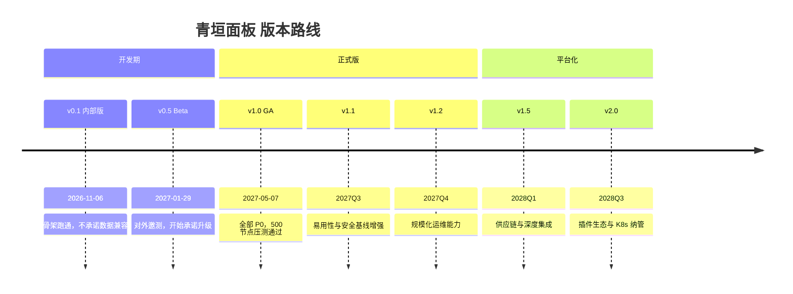
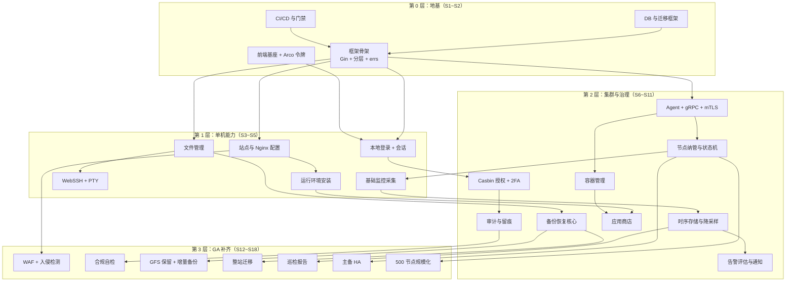
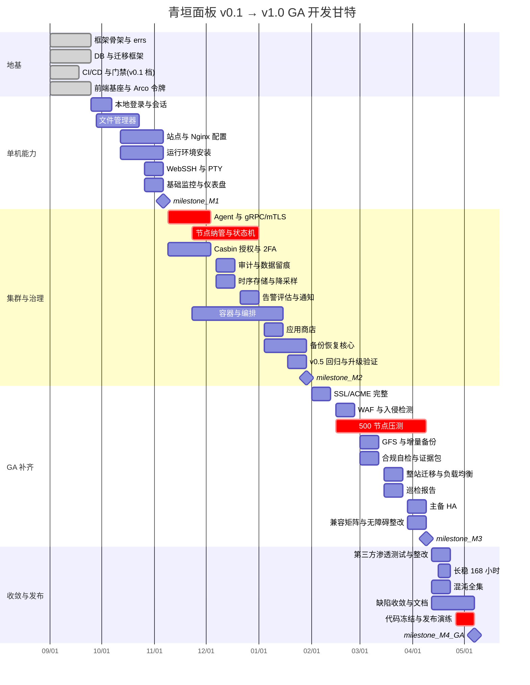
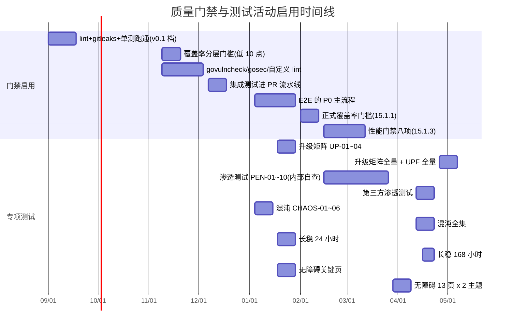

# 青垣面板 · 里程碑与迭代排期

## 文档信息

| 项目 | 内容 |
| --- | --- |
| 文档名称 | 16-里程碑与迭代排期 |
| 文档版本 | v1.0 |
| 更新日期 | 2026-08-17 |
| 状态 | 定稿 |
| 适用版本 | 青垣面板 v1.0 |
| 产品代号 | qingyuan |
| 覆盖内容 | 排期总则与前提、版本路线图与口径裁定、团队与人力配置、16 模块工作量估算、依赖顺序与关键路径、20 个 Sprint 排期表与甘特图、里程碑与验收标准、风险登记册、协作机制、开源版与企业版边界、度量与复盘 |
| 关联文档 | [产品定位与需求规格](./01-产品定位与需求规格.md)、[系统架构设计](./02-系统架构设计.md)、[技术栈与工程规范](./03-技术栈与工程规范.md)、[安全合规与审计](./12-安全合规与审计.md)、[应用商店与备份恢复](./13-应用商店与备份恢复.md)、[部署安装与升级](./14-部署安装与升级.md)、[测试与质量保障](./15-测试与质量保障.md) |

## 目录

- [16.1 排期总则与前提假设](#161-排期总则与前提假设)
- [16.2 版本路线图与口径裁定](#162-版本路线图与口径裁定)
- [16.3 团队组成与人力配置](#163-团队组成与人力配置)
- [16.4 工作量估算](#164-工作量估算)
- [16.5 开发顺序与依赖关系](#165-开发顺序与依赖关系)
- [16.6 Sprint 排期表](#166-sprint-排期表)
- [16.7 甘特图](#167-甘特图)
- [16.8 里程碑与验收](#168-里程碑与验收)
- [16.9 风险登记册](#169-风险登记册)
- [16.10 协作机制](#1610-协作机制)
- [16.11 开源版与商业版边界](#1611-开源版与商业版边界)
- [16.12 度量与复盘](#1612-度量与复盘)

## 16.1 排期总则与前提假设

### 16.1.1 本文档的定位

前面十五份文档回答「做什么、怎么做」，这一份回答「什么时候做、谁来做、先做哪个」。它是唯一有权裁定版本归属的文档：当其他文档对某个功能的版本归属说法不一致时，以 16.2.3 的口径裁定表为准。

需要先说清楚这份排期的性质。**Sprint 级的排期只对未来两个季度有效，再往后是版本目标而非日期承诺。** 远期排到具体 Sprint 是假精确——需求会变、人会换、上游依赖会出意外，一份排到 2028 年的甘特图除了让人安心之外没有任何信息量。所以本文档的结构是：近期（v0.1 到 v1.0 GA）给到 Sprint 与人日粒度，远期（v1.1 及以后）只给季度与目标。

### 16.1.2 前提假设

排期建立在下面这些假设上。任何一条被打破，排期需要重算而不是硬扛。

| # | 假设 | 若不成立的影响 |
| --- | --- | --- |
| A1 | 项目 2026-09-01 启动，团队在 S1 开始时已完整到位 | 每延迟一周到位，GA 日期顺延约一周（关键路径上的角色影响更大） |
| A2 | 迭代周期固定 2 周，不做变长冲刺 | — |
| A3 | 团队按 7.0 FTE 稳定投入，无并行项目抽调 | 抽调 1 人约等于 GA 顺延 3 周 |
| A4 | 需求基线为 01 号文档 1.6 的功能清单，P0 项不删减 | P0 删减需走 1.13.3 的变更评审 |
| A5 | 技术选型不在开发期推翻（02 号的 12 条 ADR 已定） | 推翻一条核心 ADR 的重做成本按模块估算，最大的是存储层（约 25 人日） |
| A6 | 一级 OS 的测试机与 500 节点压测环境在 S9 前就绪；灾备演练环境（对象存储 + 一台干净机）在 S14 前就绪；HA 演练环境（外置 PostgreSQL、Redis、VIP/LB）在 S16 前就绪 | 第一项直接卡 M3，压测无法前置到 v0.5；第二项卡 S14 的 `DR-01` 验收；第三项卡 S16 的 `CHAOS-19` 与 S17 的 `CHAOS-20`/`UP-10`/`UPF-08`（见 R-26） |
| A7 | 上游依赖（Docker Engine API、ACME 服务、Arco Design）在开发期无破坏性变更 | 见 R-07 风险 |
| A8 | 无外部强制的合规认证时间点（等保测评等） | 若有，合规自检需从 v1.0 前移，挤占 2~3 个 Sprint |

A3 这条值得展开。7.0 FTE 不是 7 个人，是 8 个人扣除会议、支持、招聘面试、以及不可避免的上下文切换后的有效投入。按 8 人 × 87.5% 计算。把这个折损写进假设而不是事后解释进度落后，是这份排期唯一能做的诚实之处。

### 16.1.3 估算方法与置信度

工作量用**人日**，一个人日 = 一名对应角色的工程师一个有效工作日的产出，已含编码、单测、自测、code review 往返、文档更新。不含集成联调（单列）、不含缺陷修复（按 15% 缓冲预留）。

估算方法是三点估算取加权：`E = (乐观 + 4×最可能 + 悲观) / 6`。本文档的表格只列 `E`，三点原值记录在 `docs/internal/estimate/` 下的表格里。

置信度分三档，标在 16.4 的每个模块上：

| 档位 | 含义 | 偏差预期 |
| --- | --- | --- |
| 高 | 同类工作做过，技术路径明确，无未知依赖 | ±15% |
| 中 | 技术路径明确但有未验证的集成点 | ±30% |
| 低 | 存在需先做技术验证（spike）的部分 | ±60%，且必须先安排 spike |

所有「低」置信度的模块在正式排期前必须先做 spike，spike 本身占用的人日单独列出且不计入模块估算。这条纪律的作用是把不确定性显式化——把一个低置信度模块直接排进 Sprint，等于把风险埋进进度表。

### 16.1.4 节假日与有效工作日

排期按中国大陆法定节假日扣减。三个假期会明显击穿所在 Sprint：

| 假期 | 日期 | 影响 Sprint | 该 Sprint 有效工作日 |
| --- | --- | --- | --- |
| 国庆中秋 | 2026-10-01 ~ 10-07 | S3 | 5（正常 10） |
| 元旦 | 2027-01-01 | S9 | 9 |
| 春节 | 2027-02-05 ~ 02-11 | S12 | 5（正常 10） |
| 清明 | 2027-04-05 | S16 | 9 |
| 劳动节 | 2027-05-01 ~ 05-05 | S18 | 6（正常 10） |

处理原则：**被假期击穿的 Sprint 不塞满**，按有效工作日折算容量，而不是指望大家假期加班补回来。S3 与 S12 的容量按半个 Sprint 规划，S18 按六成。历史上排期失败最常见的原因之一就是按自然周而非工作日排容量，然后在节后发现欠了两周的债。

## 16.2 版本路线图与口径裁定

### 16.2.1 版本序列与语义

版本号遵循语义化版本，但有两条本项目特有的约定，与 14.11 的升级规则配套：

| 版本位 | 变更含义 | 数据迁移约束 |
| --- | --- | --- |
| MAJOR | 破坏性变更（配置格式、API 契约、插件接口） | 允许不可逆迁移，必须提供 v1.5 → v2.0 的专用迁移脚本 |
| MINOR | 新功能，向后兼容 | 只允许加法迁移（加表、加列且有 DEFAULT、加索引），见 14.11.1 |
| PATCH | 缺陷修复与安全修复 | 不允许任何 schema 变更 |

v0.1 与 v0.5 是开发期版本，MINOR 位的加法约束从 **v0.5 开始生效**——v0.1 期间 schema 可以随意重构，这也是 14.11.7 中「v0.1.x 不支持升级到 v1.0.x，需重装并导入」的由来。把 schema 冻结点设在 v0.5 而不是 v1.0，是为了让升级链路本身能在 Beta 期间被真实用户验证过至少一轮；等到 GA 才第一次跑升级，风险太集中。

### 16.2.2 各版本的交付内容

| 版本 | 交付日 | 交付内容 | 不含（明确排除） |
| --- | --- | --- | --- |
| v0.1 | 2026-11-06 | 单机形态：站点创建（静态/PHP/反代）、运行环境安装、文件管理、WebSSH、基础监控、本地账号登录 | 多节点、容器、备份、告警、审计、权限体系 |
| v0.5 | 2027-01-29 | 增加：多节点纳管与 Agent、完整认证授权（Casbin + 2FA）、操作审计、容器管理、应用商店基础、备份恢复核心、告警评估与通知 | WAF、入侵检测、合规自检、GFS 保留、增量备份、整站迁移、HA |
| v1.0 GA | 2027-05-07 | 增加：WAF 基础防护、入侵检测、合规自检与证据包、GFS 保留、增量备份、恢复演练、整站迁移、巡检报告、主备 HA、500 节点规模化、完整兼容矩阵 | 见 01 号 1.11 的范围外清单 |
| v1.1 | 2027Q3 | 自定义仪表盘、脚本库、主机安全基线检查、数据库切换向导、cosign 产物签名产出 | — |
| v1.2 | 2027Q4 | 跨节点编排、值班与升级策略、remote-write、SSH 密钥集中下发与轮换 | — |
| v1.5 | 2028Q1 | KMS 对接、cosign 验签进 CI 门禁、差分增量备份（binlog/WAL）、OCI Artifact 应用仓库、MySQL 物理备份、Tier 2 OS 自动化 | — |
| v2.0 | 2028Q3 | 插件沙箱（WASM）、WAF 自定义规则集与 CRS 完整语法、镜像漏洞扫描、文件完整性监控、日志关键字告警、等保报告模板、大屏、K8s 只读纳管、控制面联邦 | — |

### 16.2.3 版本口径裁定表

十五份文档在各自的章节里对功能的版本归属做过声明，其中若干处表述不一致。下表逐条裁定，**以本表为准**。裁定后需同步修正的文档位置逐条登记在本表右侧，完成后才得勾除——裁定本身不等于各文档已经改完，这类「已同步」的自我声明正是 R-19（文档与实现脱节）最常见的发生形式，每个里程碑的文档抽查必须回归本表逐条核对。

| # | 功能 | 曾出现的不同说法 | 裁定 | 理由 |
| --- | --- | --- | --- | --- |
| V-01 | cosign 产物签名 | 03 号 3.15.3「v1.1 起启用」；12 号 12.22.1「v1.5」 | **v1.1 产出签名，v1.5 起进 CI 强制验证** | 两者说的是不同环节。产出侧越早越好（供应链证明是安全基线）；验证进门禁需要密钥托管与吊销流程配套，排 v1.5 |
| V-02 | WAF | 01 号 1.6.3「P2 / v2.0」；12 号结尾「v1.0」 | **v1.0 交付基础防护（内置 CRS 子集、CC 防护、拦截日志），v2.0 交付自定义规则集与 CRS 完整语法** | 12 号 12.17.1 已明确「只支持 CRS 约 70% 规则」，这个子集属于 v1.0 的安全基线；完整语法需 Coraza 集成，属平台化 |
| V-03 | 容器镜像 cosign 验签 | 09 号「留在 v2.0」 | **v2.0，且与 V-01 无关** | 面板产物签名与容器镜像验签是两条独立链路，只是复用同一工具 |
| V-04 | 控制面高可用 | 01 号 1.5.2 与 OOS-13「v1.0 单实例，v2.0 评估多副本」；14 号 14.12「主备优先于双活」 | **v1.0 交付可选的双副本主备：请求面多活（两副本均处理 HTTP 读写与 Agent 接入）+ 调度器与告警评估 leader 独占；默认形态仍为单实例（D1/D2）。v2.0 评估无状态多写双活与跨机房** | 不能叫「冷备」：14.12.1 的 Standby 副本实际在处理请求并持有部分 Agent 连接，只有单例控制回路（cron、告警评估）靠 Redis 选主独占。已同步到 01 号 1.5.2 与 OOS-13；14.12 未改，「主备」一词仅作简称 |
| V-05 | Coraza 集成 | 12 号 12.17.1「v2.0 评估」；12 号结尾「v1.5 之后」 | **v2.0 评估** | 「v1.5 之后」包含 v2.0，取更明确的说法 |
| V-06 | KMS 对接 | 12 号结尾「v1.5 之后」 | **v1.5** | — |
| V-07 | K8s 纳管 | 09 号「v2.0，v1.0 仅设计并落地数据表」 | **v2.0 只读纳管；v1.0 交付 `ct_k8s_cluster` 表与 kubeconfig 导入校验，界面入口由 `feature.k8s` 开关隐藏** | 09 号 9.14 的表述已足够明确，此处仅登记 |
| V-08 | 主机安全基线检查 | 01 号 1.6.8「P1 / v1.1」；12 号 12.19 无版本标注 | **v1.1** | 12.19 的 CIS 基线核查依赖 v1.1 的脚本库能力 |
| V-09 | 合规自检与证据包 | 12 号结尾「v1.0」 | **v1.0** | 已在 01 号 1.6.8 补登记 |
| V-10 | MySQL 物理备份（xtrabackup） | 07 号 7.11「需 v1.5 提供」 | **v1.5** | — |
| V-11 | `deploy_type='helm'` | 13 号结尾「v2.0」 | **v2.0** | 依赖 V-07 的 K8s 纳管 |
| V-12 | API 别名与废弃接口移除 | 05 号 5.12「保留至 v1.5 后移除」 | **v1.5 标记废弃，v2.0 移除** | MINOR 版本内移除接口违反向后兼容承诺，必须等 MAJOR |
| V-13 | 控制面联邦（>500 节点） | 10 号 10.15「v2.0 的联邦能力」 | **v2.0** | — |
| V-14 | 插件沙箱 | 01 号 1.11「v2.0 评估 WASM 沙箱」；02 号「二进制插件独立进程 + gRPC（v2.0）」 | **v2.0 交付进程隔离插件（gRPC），WASM 沙箱在 v2.0 期内评估但不承诺** | 进程隔离是确定方案，WASM 是可选增强，不应混为一谈 |

V-12 的裁定需要额外解释，因为它推翻了 05 号原本的说法。05 号 5.12 写「兼容别名保留至 v1.5 后移除」，但在 v1.x 序列内移除接口会破坏向后兼容承诺——一个按 v1.0 文档写好的自动化脚本，升到 v1.5 后就断了。正确做法是 v1.5 把别名标记为 `deprecated: true` 并在响应头带 `Deprecation` 与 `Sunset`，实际移除等到 v2.0。这条改动已同步回 05 号。

### 16.2.4 发布节奏

| 版本类型 | 节奏 | 发布窗口 | 冻结期 |
| --- | --- | --- | --- |
| PATCH | 按需，安全修复 48 小时内 | 任意工作日 10:00-16:00 | 无 |
| MINOR | 每 2~3 个月 | 周二或周三，避开周一与周五 | 发布前 3 个工作日代码冻结 |
| MAJOR | 每年至多一次 | 单独规划 | 发布前 2 周冻结，只接受 P0 修复 |

不在周五发布。这条看似琐碎，但周五发布的问题一旦在周末暴露，处置人力和用户容忍度都是最低的。避开周一是因为周一上午通常有积压的支持请求，发布与支持撞在一起会互相拖慢。

安全修复的 48 小时窗口对应 12.22.3 的响应时限。若修复需要 schema 变更（PATCH 不允许），处理方式是提升为 MINOR 并走完整流程——不为了赶时限而破坏 PATCH 的无迁移约定，因为用户对 PATCH 的信任正建立在「打了不会出事」上。

## 16.3 团队组成与人力配置

### 16.3.1 角色与人数

| 角色 | 人数 | FTE | 主要职责 | 关键技能要求 |
| --- | --- | --- | --- | --- |
| 技术负责人 / 架构 | 1 | 0.6 | 架构决策、ADR 评审、跨模块接口裁定、代码评审终审 | Go 深度、分布式系统、有面板类或 Agent 类产品经验 |
| 后端工程师（平台组） | 2 | 2.0 | 站点与运行环境、文件与终端、数据库服务、应用商店 | Go、Nginx/OpenResty、Linux 系统编程、PTY |
| 后端工程师（集群组） | 2 | 2.0 | Agent、gRPC 协议、集群调度、监控采集与时序存储、告警 | Go、gRPC、mTLS、时序数据、容器 |
| 前端工程师 | 2 | 1.8 | 全部前端页面、Arco 组件封装、实时通道、图表与终端 | Vue 3、TypeScript、Arco Design、ECharts、xterm |
| 测试工程师 | 1 | 0.9 | 测试体系落地、用例设计、自动化框架、性能与混沌 | Go 测试、Playwright、k6、Linux 运维基础 |
| DevOps / SRE | 0.5 | 0.5 | CI/CD、测试环境供给、构建与发布流水线、压测环境 | GitHub Actions、容器、多 OS 环境管理 |
| 产品负责人 | 0.5 | 0.2 | 需求裁剪、验收、竞品跟踪、文档维护 | 服务器运维背景，能自己装一遍宝塔并说出痛点 |
| **合计** | **9（其中 2 人半投入）** | **8.0** | | |

有效投入按 8.0 FTE × 87.5% = **7.0 FTE** 计入容量（16.1.2 的 A3）。折损的 12.5% 是会议、招聘面试、跨组支援、上下文切换。

安全与合规没有专职角色，由技术负责人兼任并在关键节点引入外部力量：v1.0 GA 前的第三方渗透测试（12.22.4）由外部机构执行。这是一个明确的取舍——9 人团队养不起专职安全工程师，代价是安全设计的评审深度依赖技术负责人一个人，写在 R-11 风险里。

### 16.3.2 分组与模块归属

分两个后端组的理由是模块间的依赖方向：平台组做的是「在一台机器上把事情做对」，集群组做的是「把事情下发到很多台机器」。前者的难点在系统交互细节（Nginx 配置语义、PTY 行为、文件权限），后者的难点在通信可靠性与状态一致。技能栈重叠但不完全相同，混在一起会导致每个人都在补另一半的上下文。

| 组 | 负责的文档模块 | 主要交付物 |
| --- | --- | --- |
| 平台组 | 07 网站与运行环境、08 文件管理与 WebSSH、09 容器与编排、13 应用商店与备份恢复 | `internal/service/{site,runtime,file,terminal,container,app,backup}`、`internal/executor/**` |
| 集群组 | 10 多节点集群与 Agent、11 监控告警与可观测、12 安全合规与审计、14 部署安装与升级 | `cmd/nova-agent`、`internal/agent/**`、`internal/service/{node,metric,alert,audit,auth}`、安装脚本、`novactl` |
| 共担 | 02 架构、03 工程规范、04 数据库、05 API 规范 | 由技术负责人主笔，两组评审后冻结 |
| 前端 | 06 前端架构与 Arco 规范 | `web/**` 全部 |
| 测试 | 15 测试与质量保障 | `test/**`、CI 门禁脚本、`scripts/quality/**` |

跨组接口一律走 05 号的 API 契约与 10 号的 proto，不允许直接调用对方的 service 层。这条约束在 9 人团队里显得过重，但它换来的是两组可以并行推进而不必频繁同步——代价是初期要多写一些看似冗余的接口定义。

### 16.3.3 人力投入曲线

不是从 S1 就满负荷。前端在 S1~S2 期间只有 1 人（另 1 人在做设计系统落地与组件库预研），测试工程师在 S1~S3 主要建框架而不是写用例。

| 阶段 | Sprint | 后端 | 前端 | 测试 | DevOps | 有效 FTE |
| --- | --- | --- | --- | --- | --- | --- |
| 基建与骨架 | S1~S2 | 4.0 | 1.0 | 0.9 | 0.5 | 5.9 |
| v0.1 主体 | S3~S5 | 4.6 | 1.8 | 0.9 | 0.3 | 7.0 |
| v0.5 主体 | S6~S11 | 4.6 | 1.8 | 0.9 | 0.3 | 7.0 |
| v1.0 主体 | S12~S16 | 4.6 | 1.8 | 0.9 | 0.3 | 7.0 |
| GA 收敛 | S17~S18 | 3.6 | 1.4 | 1.5 | 0.5 | 7.0 |
| GA 后稳定 | S19~S20 | 3.0 | 1.0 | 1.2 | 0.5 | 5.7（其余转 v1.1 预研） |

GA 收敛期（S17~S18）测试投入从 0.9 提到 1.5，来源是后端与前端各让出一部分人力做用例补全与缺陷修复。这个切换必须提前一个 Sprint 通知，否则会出现「测试等着开发交付、开发以为测试还在写用例」的空转。

## 16.4 工作量估算

### 16.4.1 按文档模块估算

单位人日。「集成」列是与其他模块联调的独立预算，不含在开发列内。

| 模块 | 后端 | 前端 | 测试 | 集成 | 合计 | 置信度 | 需要 spike |
| --- | --- | --- | --- | --- | --- | --- | --- |
| 02 架构与基础框架 | 24 | 6 | 4 | 4 | 38 | 高 | — |
| 03 工程规范与 CI/CD | 12 | 6 | 10 | 2 | 30 | 高 | — |
| 04 数据库与迁移框架 | 22 | — | 6 | 3 | 31 | 高 | — |
| 05 API 框架与错误码 | 14 | 8 | 4 | 3 | 29 | 高 | — |
| 06 前端基座与 Arco 规范 | — | 42 | 6 | 4 | 52 | 中 | 双主题令牌方案 |
| 07 网站与运行环境 | 68 | 34 | 16 | 10 | 128 | 中 | ACME DNS 多厂商适配 |
| 08 文件管理与 WebSSH | 42 | 30 | 14 | 8 | 94 | 中 | PTY 与命令录像 |
| 09 容器与编排 | 52 | 32 | 12 | 8 | 104 | 中 | Compose 编排与 exec 流 |
| 10 多节点集群与 Agent | 76 | 22 | 20 | 14 | 132 | 低 | Agent 自升级、mTLS 轮换 |
| 11 监控告警与可观测 | 62 | 36 | 14 | 8 | 120 | 低 | 内置时序存储与降采样 |
| 12 安全合规与审计 | 58 | 26 | 18 | 8 | 110 | 中 | Casbin 域模型、审计哈希链 |
| 13 应用商店与备份恢复 | 64 | 28 | 20 | 10 | 122 | 中 | 增量备份与存储后端抽象 |
| 14 部署安装与升级 | 34 | 4 | 14 | 10 | 62 | 中 | 一键安装脚本多 OS 适配 |
| 15 测试体系建设 | 8 | 6 | 46 | — | 60 | 中 | — |
| 16 项目管理与文档维护 | 6 | 4 | 4 | — | 14 | 高 | — |
| **小计** | **542** | **284** | **208** | **92** | **1126** | | |

三项全局预算另计：

| 项目 | 人日 | 说明 |
| --- | --- | --- |
| Spike（技术验证） | 46 | 见 16.4.2 |
| 缺陷修复缓冲 | 169 | 按开发+集成小计的 15% 计提 |
| 发布与文档收尾 | 38 | 三次版本发布 + 用户文档 + 迁移指南 |
| **总计** | **1379** | |

按 7.0 FTE × 每 Sprint 10 个有效工作日计算，单 Sprint 容量约 70 人日；扣除节假日击穿，S1~S18 的总容量约 **1190 人日**。

这个数字比 1379 少 189 人日，缺口约 16%。**这个缺口是明知的，处理方式不是把估算调低，而是预先划定可延后到 v1.1 的范围。** 16.6.4 列出了这份「可牺牲清单」。把缺口摆在明面上，比在 S15 才发现做不完要好得多——那时候能砍的东西已经砍不动了。

### 16.4.2 技术验证（spike）清单

低置信度模块的不确定性集中在下面这些点上。每个 spike 有明确的产出物与时限，超时即结束并按已有结论决策，不允许无限延长。

| # | 主题 | 人日 | 排期 | 产出物 | 超时决策 |
| --- | --- | --- | --- | --- | --- |
| SP-01 | 内置时序存储的写入与查询性能（SQLite 多级降采样是否够用） | 6 | S2 | 500 节点 × 40 指标 × 15 秒的写入压测报告与查询延迟数据 | 若不达标，直接采用外接 VictoriaMetrics 为默认 |
| SP-02 | Agent 自升级的原子替换与回滚 | 5 | S4 | 可工作的原型 + 断电/断网中断测试记录 | 退化为「下载后由控制面下发重启指令」的两段式 |
| SP-03 | mTLS 证书轮换的零中断验证 | 4 | S5 | 轮换期间连接不中断的验证报告 | 接受轮换时的秒级重连，写入非功能约束 |
| SP-04 | PTY 与命令录像的性能开销 | 4 | S3 | 100 并发终端会话下的 CPU/内存数据 | 录像改为异步落盘并允许丢弃超长输出 |
| SP-05 | Docker Compose 编排的 compose-go 集成边界 | 5 | S6 | 支持与不支持的 compose 语法清单 | 明确只支持 v2 规范子集并在导入时报错 |
| SP-06 | Casbin RBAC with domains 在 380 权限点下的判定性能 | 3 | S6 | 判定延迟 P99 与内存占用 | 增加判定结果缓存层 |
| SP-07 | 增量备份的实现路径（rsync 式 vs 快照式） | 6 | S10 | 两种方案在 100 GB 数据集上的耗时与空间对比 | 选 rsync 式（更简单），差分留 v1.5 |
| SP-08 | ACME DNS-01 多厂商适配的抽象层 | 4 | S4 | 三家厂商（阿里云、腾讯云、Cloudflare）的适配原型 | 只支持 HTTP-01，DNS-01 延后 |
| SP-09 | 一键安装脚本在六个一级 OS 上的差异清单 | 5 | S7 | 差异矩阵与统一抽象方案 | 按 OS 分别维护脚本，接受重复 |
| SP-10 | 审计哈希链在高写入下的性能影响 | 4 | S8 | 1000 QPS 写审计的延迟数据 | 哈希链改为异步批量计算，接受秒级延迟 |
| **合计** | | **46** | | | |

每个 spike 的「超时决策」列是这张表最重要的部分。它保证了即使验证失败，排期也不会卡住——有一个已经想好的降级方案可以立即启用。spike 最大的风险不是结论不理想，而是没有结论还一直做下去。

SP-01 的结论会影响 11 号文档的核心选型，所以它排在 S2 而不是更晚。如果内置时序存储走不通，11 号的存储层设计要改，而 11 号的排期在 S8 才开始——留出 6 个 Sprint 的缓冲是有意的。

### 16.4.3 估算的已知偏差来源

估算会偏，把偏差的方向写出来比假装精确有用：

- **系统交互类模块普遍低估**。07、08、14 三个模块要处理各发行版的差异（systemd 版本、包管理器、SELinux 状态、Nginx 编译选项），这类工作的量与「兼容多少种环境」成正比，而环境的长尾是发现式的。历史经验是这类模块实际耗时比估算高 20%~40%。
- **前端页面数量估得比复杂度准**。06 号的 52 人日按页面数与组件数推算，偏差通常不大；但实时页面（终端、日志流、监控大盘）的调试时间容易翻倍。
- **测试模块的 208 人日偏乐观**。这个数字假设开发交付时自测充分。若 S6~S10 期间缺陷密度超过 15.1.2 的 2.0/千行目标，测试投入需要上调，来源只能是压缩功能范围。
- **集成预算 92 人日可能不够**。两个后端组 + 前端的三方联调，每次接口不一致的往返成本比估算中假设的高。缓解手段是 05 号契约先行与 mock 服务（16.10.4）。

## 16.5 开发顺序与依赖关系

### 16.5.1 模块依赖图

图中箭头是「必须先完成」的硬依赖。三条值得注意的边：

`FILE --> BK` 存在是因为备份的文件遍历、排除规则、大文件分块复用了文件管理的底层实现。把这层实现抽在 `internal/pkg/fsx` 而不是各自实现，是 S4 时的一个决定，代价是文件管理模块要先把接口设计好。

`NODE --> MON0` 这条边看起来方向反了——监控在第 1 层，节点纳管在第 2 层。实际含义是：v0.1 的基础监控只采集本机，第 2 层的节点纳管完成后，监控要改造成支持多节点上报。这是一次**已知的返工**，估算里已包含（11 号模块的 62 人日含 8 人日的多节点改造）。之所以不等节点纳管做完再做监控，是因为 v0.1 需要有可见的监控界面来验证前端图表体系。

`AGENT --> CT` 是因为容器操作在多节点场景下必须经 Agent 转发，而不是控制面直连远程 Docker socket——后者需要暴露 Docker API 端口，是 12.2 威胁建模里明确否决的方案。

### 16.5.2 关键路径

关键路径是 `DB → FW → AGENT → NODE → SCALE`，总长约 156 人日（集群组 2.0 FTE 折算约 78 个工作日，即约 8 个 Sprint）。这条路径上的任何延迟直接推迟 GA。

| 关键路径节点 | 人日 | 最早开始 | 最晚完成 | 浮动 |
| --- | --- | --- | --- | --- |
| DB 与迁移框架 | 22 | S1 | S2 末 | 0 |
| 框架骨架 | 24 | S1 | S2 末 | 0（与 DB 并行） |
| Agent + gRPC + mTLS | 44 | S3 | S7 末 | 3 人日 |
| 节点纳管与状态机 | 32 | S6 | S9 末 | 5 人日 |
| 500 节点规模化与压测 | 34 | S12 | S16 末 | 0 |

浮动为 0 的三个节点是重点盯的对象。规模化压测（S12~S16）浮动为 0 且依赖 A6 假设（压测环境在 S9 前就绪），这是排期里最脆弱的一处，对应 R-03 风险。

关键路径之外，平台组的 07/08/09/13 四个模块有较大浮动，是可以吸收延误的缓冲区。**这也意味着当需要砍范围时，砍的应该是平台组的功能而不是集群组的——砍关键路径上的东西不会让项目更快，只会让它更不完整。**

### 16.5.3 并行冲突点

两组并行推进时有五处会互相阻塞，需要提前约定：

| # | 冲突点 | 阻塞关系 | 解法 | 约定时间 |
| --- | --- | --- | --- | --- |
| C-01 | 04 号 schema | 两组都要加表，迁移文件序号会撞 | 迁移文件名带组前缀（`plat_`/`clus_`），序号按时间戳而非自增 | S1 |
| C-02 | 05 号错误码分段 | 两组同时注册错误码 | 按 05 号 5.5 的子域分段各自占段，段内自由，跨段需登记 | S1 |
| C-03 | 前端路由与菜单 | 两组的页面都要挂菜单，`router` 文件冲突 | 路由按模块拆文件自动聚合，菜单从后端权限点动态生成 | S2 |
| C-04 | Agent proto | 平台组要往 Agent 加指令，集群组维护 proto | 指令号按 10 号 10.4 的段位预留分配，平台组在自己段内加，改公共字段需集群组评审 | S3 |
| C-05 | 测试环境 | 两组抢真实主机 runner | runner 按组绑定标签，压测环境按 Sprint 预约 | S3 |

C-04 是最容易出问题的一处。proto 的公共字段（信封、trace、错误）改动会让两组同时编译失败，所以约定「公共字段只在 Sprint 第一天改，改前群里通知」。这条约定很土，但比引入 proto 版本管理机制更适合 9 人团队的规模。

## 16.6 Sprint 排期表

### 16.6.1 v0.1 阶段（S1~S5）

目标是**骨架跑通并且能演示**。这个阶段最容易犯的错是追求完整——v0.1 的站点创建只需要能建静态站和 PHP 站，SSL、伪静态、负载均衡全部延后。

| Sprint | 日期 | 有效工日 | 容量(人日） | 主要目标 | 交付判定 |
| --- | --- | --- | --- | --- | --- |
| S1 | 2026-09-01 ~ 09-11 | 9 | 53 | 仓库与 CI 骨架、Gin 分层框架、errs 包、配置加载、DB 迁移框架、四张核心表、前端工程初始化与 Arco 令牌 | `make build` 与 `make test` 在 CI 通过；前端能登录到一个空壳首页 |
| S2 | 09-14 ~ 09-25 | 10 | 59 | 本地账号与登录、JWT 会话、前端请求层与路由权限骨架、布局系统、SP-01 时序存储验证 | 能登录、能看到菜单、SP-01 有结论 |
| S3 | 09-28 ~ 10-09 | 5 | 35 | 文件管理器基础（列表、上传下载、编辑）、SP-04 PTY 验证 | 能在界面上浏览与编辑 `/www` 下的文件 |
| S4 | 10-12 ~ 10-23 | 10 | 70 | 站点创建（静态 + PHP）、Nginx 配置模板与下发、运行环境安装（Nginx + PHP 8.3）、SP-02/SP-08 | 能从界面建一个 PHP 站并在浏览器访问到 `phpinfo()` |
| S5 | 10-26 ~ 11-06 | 10 | 70 | WebSSH 与 PTY、基础监控采集与首页仪表盘、v0.1 冒烟用例、打包与安装脚本雏形 | **M1：v0.1 内部版可安装、可建站、可终端、可看监控** |

S3 只有 35 人日容量（国庆），所以只安排文件管理一个模块。把假期 Sprint 排成单模块推进，比排两个模块然后都做一半更好——半成品模块无法验证，会把风险带进下一个 Sprint。

### 16.6.2 v0.5 阶段（S6~S11）

目标是**多节点与治理能力成型，可对外邀测**。这个阶段是整个项目最重的六个 Sprint，关键路径上的 Agent 与节点纳管都在这里。

| Sprint | 日期 | 有效工日 | 容量(人日） | 主要目标 | 交付判定 |
| --- | --- | --- | --- | --- | --- |
| S6 | 2026-11-09 ~ 11-20 | 10 | 70 | Agent 骨架与 gRPC 双向流、mTLS 与注册流程、Casbin 模型与权限点落库、SP-05/SP-06 | 一个 Agent 能注册并保持心跳；权限判定接口可用 |
| S7 | 11-23 ~ 12-04 | 10 | 70 | 节点纳管与状态机、批量任务调度、2FA、容器管理基础（生命周期 + 日志 + exec）、SP-09 | 能纳管 3 个节点并在其中一个上启停容器 |
| S8 | 12-07 ~ 12-18 | 10 | 70 | 时序存储与降采样、多节点指标上报、审计埋点与留痕、SP-10 | 三节点的指标能在同一张图上看到；写操作全部有审计记录 |
| S9 | 12-21 ~ 2027-01-01 | 9 | 63 | 告警规则 DSL 与评估器、通知通道（邮件 + Webhook + 钉钉）、镜像与仓库、网络与卷 | 能配一条 CPU 告警并收到通知；告警状态机通过 11.10.2 的迁移覆盖检查 |
| S10 | 2027-01-04 ~ 01-15 | 10 | 70 | 应用商店（仓库同步 + 一键部署 + 实例管理）、Compose 编排、SP-07 | 能从商店部署一个 WordPress 并访问 |
| S11 | 01-18 ~ 01-29 | 10 | 70 | 备份恢复核心（本地 + S3 后端、站点 + 数据库备份、恢复）、计划任务、v0.5 回归与升级测试 `UP-01`~`UP-04` | **M2：v0.5 Beta 可邀测，v0.1→v0.5 升级路径打通** |

S11 末必须打通升级路径，这是 16.2.1 中「schema 冻结点设在 v0.5」的落地动作。如果这个 Sprint 只做完备份而没做升级验证，v0.5 就不能算达成——**Beta 的核心价值是让升级链路被真实使用过**，功能完整度反而次要。

### 16.6.3 v1.0 GA 阶段（S12~S18）

目标是**补齐 P0、跑通规模化与兼容矩阵、质量门禁全开**。

| Sprint | 日期 | 有效工日 | 容量(人日） | 主要目标 | 交付判定 |
| --- | --- | --- | --- | --- | --- |
| S12 | 2027-02-01 ~ 02-12 | 5 | 35 | SSL/ACME 完整（含 DNS-01）、伪静态模板库、Beta 反馈缺陷修复 | 能自动签发并续期证书；Beta 期 P1 及以上缺陷清零 |
| S13 | 02-15 ~ 02-26 | 10 | 70 | WAF 基础防护、入侵检测、防火墙管理、SSH 加固、500 节点压测环境搭建与首轮压测 | WAF 能拦住 `PEN` 清单里的注入样本；首轮压测有基线数据 |
| S14 | 03-01 ~ 03-12 | 10 | 70 | GFS 保留策略、增量备份、恢复演练、合规自检与证据包 | `BR-02`~`BR-05` 通过（增量链恢复、GFS 裁剪不断链、异地存储往返、passphrase 包脱离面板解密，见 15.14.7）；`DR-01` 面板灾备演练通过（15.8.7）；能导出一份等保证据包 |
| S15 | 03-15 ~ 03-26 | 10 | 70 | 整站迁移、负载均衡站点类型、数据库服务完整（主从监控除外）、巡检报告 | 能把一个站点整体迁到另一节点且服务不中断超过 60 秒 |
| S16 | 03-29 ~ 04-09 | 9 | 63 | 双副本 HA（请求面多活 + leader 选主）、规模化优化（针对 S13 压测暴露的瓶颈）、兼容矩阵全量执行、无障碍与国际化整改 | **M3：500 节点压测达标（15.1.3 的性能门禁），六个一级 OS 全绿，`CHAOS-19` 接管用例通过** |
| S17 | 04-12 ~ 04-23 | 10 | 70 | 缺陷收敛、第三方渗透测试与整改、长稳 168 小时启动、混沌全集（含 `CHAOS-20` Redis 不可用）、HA 升级用例 `UP-10`/`UPF-08`、文档与用户指南 | 渗透测试报告无高危未修项；长稳测试运行中 |
| S18 | 04-26 ~ 05-07 | 6 | 42 | 代码冻结、发布候选构建、升级矩阵全量、发布演练、GA 发布 | **M4：v1.0 GA 发布**，15.12.5 的四组门禁全部通过 |

S17 的长稳 168 小时（7 天）跨到 S18，这是有意安排——长稳测试在 S17 中段启动，S18 第一周得到结果，还留出时间处置。如果长稳排在 S18 才启动，结果出来时已经没有修复窗口了。

S18 只有 42 人日容量且要完成发布，所以这个 Sprint **不安排任何新功能**。冻结期只做三件事：修 P0/P1、跑门禁、准备发布物料。任何「顺手加个小功能」的请求在这个 Sprint 一律拒绝并顺延到 v1.1。

### 16.6.4 可牺牲清单

16.4.1 算出约 16% 的容量缺口。下面这份清单是预先划定的牺牲顺序，按「从上到下」的顺序砍，每砍一项在 Sprint 评审会上记录并同步 01 号文档的版本列。

| 顺序 | 可延后项 | 释放人日 | 延后到 | 影响评估 |
| --- | --- | --- | --- | --- |
| 1 | Podman 兼容（09 号只留 Docker） | 14 | v1.1 | 影响少量 RHEL 系用户，可用 `podman-docker` 兼容层临时绕过 |
| 2 | 数据库主从状态监控 | 10 | v1.2 | 01 号已标 P2/v2.0，此处只是提前登记 |
| 3 | FTP 服务管理 | 12 | v1.1 | 使用率低，且 SFTP 可通过 WebSSH 场景部分替代 |
| 4 | 负载均衡站点类型 | 16 | v1.1 | P0 功能，砍它需产品负责人签字（1.13.3 的变更评审） |
| 5 | 巡检报告 | 14 | v1.2 | 01 号已标 P1/v1.2 |
| 6 | 国际化（英文包） | 12 | v1.1 | 保留 i18n 框架与 key 抽取，只是不出英文包 |
| 7 | 双副本 HA | 22 | v1.1 | **最后才砍**：砍掉会让「可用于生产」的宣称站不住。一旦砍掉，必须同步：删除 M3 条件 4、从 v1.0 矩阵移除 `UP-10`/`UPF-08`/`CHAOS-19`/`CHAOS-20`、修正 01 号 OOS-13 与 14.12 的版本标注、将 D3 形态标为 v1.1（否则 15.12.5 会把已砍掉的能力当成发布阻断项） |

顺序设计的逻辑是「先砍替代方案成本低的」。第 4 项和第 7 项都是 P0，砍它们要走变更评审——放在清单里不是说打算砍，而是说如果到了必须砍 P0 的程度，这两项的顺序已经想好了，不用在压力下临时决定。

反过来，有三项**不在可牺牲清单里**，无论进度如何都不砍：审计完整性（12 号的全量写操作留痕）、备份的可恢复性验证（13 号的恢复演练）、升级路径（14 号的 v0.5→v1.0）。理由是这三项都属于「砍了之后无法后补」的类型——审计缺了的记录补不回来，备份恢复没验证过等于没有备份，升级路径断了用户就永久留在旧版本上。

### 16.6.5 GA 后（S19~S20 与远期）

| Sprint / 阶段 | 日期 | 内容 |
| --- | --- | --- |
| S19 | 2027-05-10 ~ 05-21 | GA 线上问题响应、逃逸缺陷复盘（15.12.6）、v1.1 需求梳理与 spike |
| S20 | 05-24 ~ 06-04 | v1.1 开发启动、cosign 产出链路搭建、自定义仪表盘 |
| v1.1 | 2027Q3 | 见 16.2.2 |
| v1.2 | 2027Q4 | 见 16.2.2 |
| v1.5 | 2028Q1 | 见 16.2.2 |
| v2.0 | 2028Q3 | 见 16.2.2 |

S19 全部投入线上响应与复盘，不排新功能。GA 后两周是缺陷暴露最密集的时段，预留一个完整 Sprint 而不是「边做 v1.1 边修」，是因为后者的实际结果通常是两件事都做不好。这个 Sprint 如果没有缺陷需要处理，多出的时间用于补测试与技术债，不提前启动 v1.1。

## 16.7 甘特图

### 16.7.1 模块级甘特

标为 `crit` 的四条是关键路径上的任务：Agent、节点纳管、500 节点压测、代码冻结与发布。这四条中任何一条延期，GA 日期直接顺延。

甘特图里 `done` 状态标在地基阶段并不表示已完成，是 Mermaid 的样式用法——地基任务用不同底色区分，它们是所有后续任务的前置。

### 16.7.2 质量活动的时间线

质量活动与功能开发并行推进，单独画一条时间线，因为它们的启用节点由 15.12.8 的分阶段表决定，与功能排期是两套节奏。

两条时间线的错位是有意的：**门禁在功能之前启用，专项测试在功能之后执行。** 门禁提前是为了让代码从一开始就符合要求（后补比预防贵），专项测试后置是因为它们需要功能已经稳定才有意义——在功能还在改的时候跑渗透测试，报告出来就过期了。

## 16.8 里程碑与验收

### 16.8.1 里程碑定义

| 里程碑 | 日期 | 名称 | 判定人 |
| --- | --- | --- | --- |
| M0 | 2026-09-25 | 地基完成，两组可并行 | 技术负责人 |
| M1 | 2026-11-06 | v0.1 内部版可用 | 技术负责人 + 产品负责人 |
| M2 | 2027-01-29 | v0.5 Beta 可邀测 | 全体评审 |
| M3 | 2027-04-09 | 规模化与兼容性达标 | 技术负责人 + 测试负责人 |
| M4 | 2027-05-07 | v1.0 GA 发布 | 全体评审 + 外部渗透报告 |

### 16.8.2 各里程碑的验收标准

验收标准写成可以被否决的形式。「基本可用」「大部分通过」这类表述不作为验收条件。

**M0 地基完成**

| # | 条件 | 验证方式 |
| --- | --- | --- |
| 1 | `make build` 在 CI 上产出六平台二进制 | CI 产物列表 |
| 2 | `make test` 全绿，且 `internal/pkg` 覆盖率 ≥ 70% | 覆盖率报告 |
| 3 | 迁移框架支持 up/down，三种数据库驱动都能建库 | `make migrate-test` |
| 4 | errs 包的错误码→HTTP status 映射有 golden 测试 | 15.11.4 的 `status-mapping.golden` |
| 5 | 前端能登录、能加载菜单、双主题可切换 | 手工演示 |
| 6 | C-01~C-03 三项并行约定已文档化 | `docs/internal/conventions.md` |

**M1 v0.1 内部版**

| # | 条件 | 验证方式 |
| --- | --- | --- |
| 1 | 一键安装脚本能在 Ubuntu 24.04 与 RHEL 9 上装成功 | 手工验证两台干净机器 |
| 2 | 能创建静态站与 PHP 站并从浏览器访问 | `SMOKE-01`~`SMOKE-03` 自动化 |
| 3 | 文件管理器能上传 1 GB 文件、能在线编辑并保存 | `SMOKE-04` |
| 4 | WebSSH 能开会话、能执行命令、断线能重连 | `SMOKE-05` |
| 5 | 首页仪表盘显示 CPU/内存/磁盘/网络四项实时数据 | 手工验证 |
| 6 | SP-01 与 SP-04 有明确结论并已决策 | spike 报告 |
| 7 | 无 P0/P1 缺陷 | 缺陷列表 |

**M2 v0.5 Beta**

| # | 条件 | 验证方式 |
| --- | --- | --- |
| 1 | 能纳管 20 个节点并保持 24 小时全在线 | 长稳 24 小时报告 |
| 2 | 8 个内置角色的权限判定与 12.8 的矩阵一致 | `matrix.golden` 通过 |
| 3 | 全部写操作有审计记录，哈希链校验通过 | `novactl audit verify` |
| 4 | 能从应用商店部署 WordPress 与 MySQL 并访问 | E2E 用例 |
| 5 | 能备份一个站点并恢复，数据完全一致 | `BR-01` 通过 |
| 6 | v0.1 → v0.5 升级成功，站点与节点数量不变 | `UP-01`~`UP-04` 通过 |
| 7 | 告警能触发并送达三个通道 | E2E 用例 |
| 8 | 覆盖率达到 15.1.1 门槛减 10 个百分点 | 覆盖率报告 |
| 9 | 无 P0，P1 ≤ 3 且都有明确修复计划 | 缺陷列表 |

条件 6 是 M2 的核心。如果升级测试没通过，即使功能全部完成也不发 Beta——发一个升不上去的 Beta，等于让早期用户在 GA 时必须重装，而早期用户是最不该被这样对待的一群人。

**M3 规模化与兼容性**

| # | 条件 | 验证方式 |
| --- | --- | --- |
| 1 | 500 节点在线，心跳丢失率 < 0.1%，面板常驻内存 < 150 MB（与 15.1.3 同标准） | 压测报告 + pprof/RSS 采样 |
| 2 | 15.1.3 的五项性能门禁与四项安全门禁全部达标 | k6 报告 + 安全扫描报告 |
| 3 | 六个一级 OS 的完整用例集全绿 | 兼容矩阵报告 |
| 4 | Active 副本失联后 30 秒内完成 leader 接管（租约 15 秒 + 启动余量），cron 与告警无重复触发，无数据丢失 | `CHAOS-19` 演练记录 |
| 5 | 无障碍 13 页 × 2 主题，axe-core 无 serious 及以上问题 | `a11y.spec.ts` 通过 |
| 6 | 前端首屏 < 1.5 秒（P75，本地网络） | Lighthouse 报告 |
| 7 | 面板灾备：干净机 + 离线主密钥 + 备份包完成恢复，RTO ≤ 30 分钟，且缺主密钥的负面场景行为正确 | `DR-01` 演练记录（14.13.2） |

条件 4 的 30 秒与 14.12.2 的 15 秒 leader 租约、14.13.3 的 D3 场景 30 秒 RTO 一致。它不是「切换完成就行」：重复触发定时任务或重复发告警通知同样算失败，因为那意味着选主隔离没做对。Redis 不可用时的降级行为由 `CHAOS-20` 在 S17 验证，不阻断 M3。

**M4 v1.0 GA**

| # | 条件 | 验证方式 |
| --- | --- | --- |
| 1 | 15.12.5 的四组门禁全部通过 | 前两组：`make release-gate` 报告；后两组：人工确认记录（签字人见 15.12.5） |
| 2 | 第三方渗透测试无高危未修项，中危有处置结论 | 渗透报告 + 整改记录 |
| 3 | 长稳 168 小时无内存泄漏、无 goroutine 泄漏、无未处理 panic | 长稳报告 |
| 4 | 升级矩阵 `UP-01`~`UP-10` 与 `UPF-01`~`UPF-08` 全部通过 | 升级测试报告 |
| 5 | 01 号 1.6 的全部 P0 功能验收通过 | 需求追溯表（1.13.2） |
| 6 | 用户文档完整：安装、升级、备份恢复、故障排查四份 | 文档评审 |
| 7 | 构建可重现（两次构建产物 sha256 一致） | CI 校验 |
| 8 | 无 P0/P1 缺陷，P2 ≤ 10 且已排入 v1.1 | 缺陷列表 |
| 9 | 发布演练在预生产环境完整走过一遍（含回滚） | 演练记录 |
| 10 | 灾备与 HA 用例全绿：`DR-01`、`CHAOS-19`、`CHAOS-20` | 演练与混沌报告 |

条件 9 常被省略但价值很高。发布流程本身也是软件，第一次执行必然有问题——把这些问题留到正式发布时暴露，处置压力完全不同。演练要包含回滚，因为回滚路径通常是所有路径里被验证最少的一条。

### 16.8.3 里程碑未达成的处理

| 情形 | 处理 |
| --- | --- |
| 单项条件未达成但可在 1 周内补齐 | 里程碑有条件通过，标注遗留项与责任人，下个 Sprint 首日复核 |
| 多项未达成或存在阻塞性缺陷 | 里程碑不通过，顺延一个 Sprint，同步启动 16.6.4 的可牺牲清单评估 |
| 关键路径任务延期超过 2 周 | 触发排期重算，重新评估 GA 日期，通知所有相关方 |
| 里程碑达成但质量指标下滑 | 里程碑通过，但下个 Sprint 必须安排质量偿还（不排新功能的时间） |

不接受的处理方式是「先标记通过，遗留项后面再说」。里程碑的意义在于它是一个真实的检查点，如果可以带着未达成项通过，它就退化成日历上的一个日期。第一行允许的「有条件通过」有严格边界：单项、且 1 周内可补齐、且有明确责任人，三个条件同时满足。

## 16.9 风险登记册

### 16.9.1 登记规则

风险按「可能性 × 影响」定级，两个维度各三档，得出高/中/低三级。每条风险必须有责任人、触发信号、应对措施；**没有可观测的触发信号的条目不是风险，是焦虑**，不进登记册。

| 字段 | 说明 |
| --- | --- |
| 可能性 | 高（>50%）/ 中（20%~50%）/ 低（<20%） |
| 影响 | 高（GA 延期 >2 周或 P0 功能不可交付）/ 中（延期 1~2 周或功能降级）/ 低（可在 Sprint 内吸收） |
| 触发信号 | 一个可观测的、有明确判据的现象。风险由「担心」变成「发生」的判定点 |
| 应对 | 缓解（降低可能性）、转移（外部承担）、接受（不处理但监控）、规避（改变方案） |

登记册每个 Sprint 评审会更新一次：新增、降级、关闭。关闭需要写明理由，「时间过了没发生」也是合法理由。

### 16.9.2 技术风险

| # | 风险 | 可能性 | 影响 | 级别 | 触发信号 | 应对 | 责任人 |
| --- | --- | --- | --- | --- | --- | --- | --- |
| R-01 | 内置 SQLite 时序存储在 500 节点规模下写入或查询不达标 | 中 | 高 | **高** | SP-01 的写入延迟 P99 > 200ms，或 24 小时区间查询 > 3 秒 | 缓解：SP-01 前置到 S2；规避：预留外接 VictoriaMetrics 的适配层，切换成本控制在 5 人日内 | 集群组负责人 |
| R-02 | Agent 自升级在中断场景下变砖，导致节点失联且无法远程恢复 | 中 | 高 | **高** | SP-02 的断电测试中出现不可恢复状态 | 缓解：双分区 + 原子软链切换 + 启动自检回退；降级：改为控制面下发重启的两段式（SP-02 的超时决策） | 集群组负责人 |
| R-03 | 500 节点压测环境无法按 A6 假设在 S9 前就绪 | 中 | 高 | **高** | S8 结束时资源申请仍未批复 | 缓解：用容器模拟 Agent 做 300 节点级压测作为过渡；转移：向基础设施方提前 3 个月提申请并写入依赖清单 | DevOps |
| R-04 | 一键安装脚本的 OS 长尾差异远超预期（SELinux、AppArmor、精简镜像缺包） | 高 | 中 | **高** | SP-09 的差异矩阵超过 30 项，或单个 OS 适配超过 5 人日 | 接受 + 缓解：一级 OS 保证脚本装成功，二级 OS 提供容器化部署作为替代路径 | 集群组 |
| R-05 | 内置时序数据的降采样任务与业务查询争抢 SQLite 写锁，导致面板卡顿 | 中 | 中 | 中 | 面板 API P99 在降采样窗口内翻倍 | 缓解：时序库与业务库分文件；降采样限速并避开业务高峰 | 集群组 |
| R-06 | Nginx 配置模板在用户手工改动后被面板覆盖，引发生产事故 | 中 | 高 | **高** | Beta 期收到任一例此类反馈 | 缓解：配置区块用标记包裹只改标记内内容 + 改动前自动快照 + 检测到区块外手工修改时拒绝下发并提示 | 平台组 |
| R-07 | 上游依赖破坏性变更（Docker Engine API、Arco Design、ACME 服务） | 中 | 中 | 中 | 依赖更新 PR 上 CI 红灯，或 `oasdiff` 报破坏性变更 | 缓解：依赖版本全部锁定（03 号约定），升级走单独 PR 且必须跑全量集成测试；Docker API 版本显式声明 v1.45 并做能力探测 | 技术负责人 |
| R-08 | WebSSH 的 PTY 在特殊终端程序（vim、tmux、中文输入）下表现异常 | 高 | 中 | **高** | SP-04 期间发现渲染错位或输入丢失 | 接受：明确支持的终端程序清单，清单外的问题按 P2 处理；缓解：`SMOKE` 用例覆盖 vim/top/tmux 三个高频场景 | 平台组 |
| R-09 | 备份的大文件（>100 GB）处理超时或内存溢出 | 中 | 高 | **高** | 备份 100 GB 数据集时内存峰值 > 1 GB 或耗时 > 4 小时 | 缓解：全程流式处理 + 分块校验 + 断点续传；15.7 的性能用例强制覆盖大数据集档 | 平台组 |
| R-10 | 三种数据库驱动的 SQL 兼容性问题在后期集中暴露 | 中 | 中 | 中 | 任一 Sprint 内出现 2 个以上仅在某一驱动上失败的用例 | 缓解：repository 层测试从 S2 起就三驱动全跑（15.11.2），不允许「先做 SQLite 后面适配」 | 技术负责人 |
| R-11 | 安全设计的评审深度依赖技术负责人一人，存在盲区 | 中 | 高 | **高** | 第三方渗透测试报出设计层面（而非实现层面）的高危问题 | 缓解：12 号的威胁建模在 S6 做一次外部评审（付费咨询，2 人日）；转移：GA 前的第三方渗透测试提前到 S17 而非发布前一周 | 技术负责人 |
| R-12 | 前端实时通道（WebSocket）在弱网与代理环境下频繁断连 | 中 | 中 | 中 | Beta 期收到 3 例以上断连反馈 | 缓解：指数退避重连 + 断连期间数据补拉 + 降级为轮询的开关 | 前端负责人 |

### 16.9.3 进度与资源风险

| # | 风险 | 可能性 | 影响 | 级别 | 触发信号 | 应对 | 责任人 |
| --- | --- | --- | --- | --- | --- | --- | --- |
| R-13 | 16% 的容量缺口无法通过牺牲清单吸收 | 中 | 高 | **高** | S12 结束时累计完成人日低于计划的 85% | 缓解：16.6.4 的牺牲清单按序执行；升级：连续两个 Sprint 低于 85% 则重算 GA 日期而非继续压缩 | 技术负责人 |
| R-14 | 关键角色离职或长期缺席（尤其集群组的 Agent 负责人） | 低 | 高 | 中 | 任一关键路径角色请假 > 2 周或提出离职 | 缓解：Agent 与 proto 的设计文档必须在 S6 结束前完整（10 号已覆盖）；每个关键模块有第二熟悉人（结对评审制度） | 技术负责人 |
| R-15 | 团队未按 A1 假设在 S1 完整到位 | 中 | 中 | 中 | S1 开始时缺岗 | 缓解：S1~S2 的地基工作可由 4 人完成，前端第二人可延至 S3；升级：若缺集群组岗位，GA 日期按每周 1:1 顺延 | 技术负责人 |
| R-16 | 节假日击穿的 Sprint 实际产出低于按工作日的折算 | 高 | 低 | 中 | S3、S12 的完成率低于容量的 80% | 接受：S3 与 S12 已按半容量规划；缓解：假期前后各留半天做上下文恢复，不安排关键交付卡在假期首日 | 技术负责人 |
| R-17 | 缺陷修复缓冲（169 人日）不足 | 中 | 中 | 中 | 任一 Sprint 的缺陷修复占用超过 25% 容量 | 缓解：提高 code review 与自测要求；升级：缺陷密度连续两个 Sprint > 3.0/千行则暂停新功能一个 Sprint 做质量偿还 | 测试负责人 |
| R-18 | 两组的集成成本超出 92 人日预算 | 中 | 中 | 中 | 单次跨组联调超过 3 天，或接口不一致返工超过 2 轮 | 缓解：05 号契约先行 + mock 服务（16.10.4）+ 每周一次 30 分钟的跨组接口同步 | 技术负责人 |
| R-19 | 文档与实现脱节，导致 16 份文档失去参考价值 | 高 | 中 | **高** | 任一 Sprint 有超过 3 处实现与文档不符且未同步 | 缓解：文档更新纳入 DoD（16.10.2）；OpenAPI 由代码生成并与 05 号做 CI 比对；每个里程碑做一次文档与实现的抽查 | 全体 |
| R-20 | Beta 期用户反馈量超出处理能力，挤占 GA 开发 | 中 | 中 | 中 | 单周新增有效反馈 > 20 条 | 缓解：S12 预留整个 Sprint 处理 Beta 反馈；转移：邀测名额控制在 30 个以内，宁少而深 | 产品负责人 |
| R-26 | HA 开发（22 人日）与 M3 验收落在同一个 Sprint（S16，9 工日/63 人日，同期还背着规模化优化、兼容矩阵全量、无障碍整改），零缓冲 | 高 | 中 | **高** | S16 中期（04-02）HA 仍未进入联调，或 A6 的 HA 演练环境未就绪 | 缓解：M3 只卡 `CHAOS-19` 基本接管，`CHAOS-20`/`UP-10`/`UPF-08` 拆到 S17；升级：触发信号出现时按 16.6.4 第 7 项评估将 HA 整体顺延到 v1.1（需变更评审 + 同步修正全部关联验收项） | 集群组负责人 |

### 16.9.4 产品与外部风险

| # | 风险 | 可能性 | 影响 | 级别 | 触发信号 | 应对 | 责任人 |
| --- | --- | --- | --- | --- | --- | --- | --- |
| R-21 | 竞品在同期发布对标功能，差异化优势被削弱 | 中 | 中 | 中 | 主要竞品发布多节点或可观测能力 | 接受 + 缓解：四大差异化重点（集群、容器、可观测、安全审计）中至少保持两项的深度领先，不追求全面对标 | 产品负责人 |
| R-22 | 用户实际更在意「像宝塔一样简单」而非本产品强调的深度能力 | 中 | 高 | **高** | Beta 期反馈中「太复杂/找不到功能」类占比 > 30% | 缓解：默认视图收敛为基础功能，高级能力放二级入口；Beta 期专门做一轮易用性访谈（5 个用户） | 产品负责人 |
| R-23 | 开源版与商业版的边界划分引发社区反弹 | 中 | 中 | 中 | 边界公布后社区出现集中质疑 | 缓解：16.11 的边界原则先公布再实施，且承诺已开源的能力永不闭源；核心运维能力全部在开源版 | 产品负责人 |
| R-24 | 等保或其他合规认证被客户强制要求且时间点早于 v1.0 | 低 | 高 | 中 | 出现有明确时间点的合规要求（A8 假设被打破） | 转移：合规自检已在 v1.0 范围内（12.14.4），若被前置则从 S13 提前到 S9，代价是延后 WAF 与入侵检测到 v1.1 | 产品负责人 |
| R-25 | 供应链事件（依赖包投毒、构建环境被入侵） | 低 | 高 | 中 | `govulncheck`/`osv-scanner` 报出恶意包，或构建产物 sha256 不可重现 | 缓解：依赖锁定 + SBOM + 构建可重现 + 每日 SCA 扫描（15.10.2）；转移：cosign 签名在 v1.1 落地，让用户能验证产物来源 | 技术负责人 |

### 16.9.5 高风险项的集中说明

25 条里有 11 条是高级别。它们不是均匀分布的，集中在三个地方：

**规模化能力（R-01、R-03、R-13）**。500 节点是产品对外的核心宣称，而它同时依赖一个未验证的存储方案、一个未落实的压测环境、和一个已知有缺口的排期。这三条如果同时发生，GA 只能降级宣称规模（比如改成 200 节点），这是整个排期里最需要提前处置的一组。处置动作是 SP-01 前置到 S2、压测环境申请在 S1 就发出、S13 就开始首轮压测而不是等到 S16。

**系统交互的长尾（R-04、R-08）**。这两条的共同特征是「无法穷举，只能划定边界」。应对方式不是投入更多人力去覆盖，而是明确说出支持范围——一级 OS 保证、二级 OS 提供替代路径、终端程序给清单。把边界写清楚比假装无边界更负责。

**产品方向（R-22）**。这是唯一一条无法用技术手段缓解的高风险。产品的立论是「比宝塔更强大完善」，但「更强大」在很多用户眼里等于「更难用」。缓解手段是默认视图的收敛，但真正的答案只能从 Beta 期的用户反馈里得到。这也是为什么 M2 的验收里包含「可邀测」而不只是「功能完成」——Beta 的目的之一就是验证这个前提。

R-06 值得单独一提，它是唯一一条「一次发生就必须立即处置」的风险。面板覆盖用户手工改的 Nginx 配置会直接导致生产站点下线，这类事故对面板类产品的信任损伤是不可逆的。所以应对措施写得比其他风险更具体：标记包裹、改前快照、检测到区块外修改就拒绝下发。三层里任何一层单独都不够。

## 16.10 协作机制

### 16.10.1 会议节奏

| 会议 | 频率 | 时长 | 参与者 | 产出 |
| --- | --- | --- | --- | --- |
| 每日同步 | 每工作日 10:00 | 15 分钟 | 全体 | 阻塞项清单（只说阻塞，不报进度） |
| Sprint 规划 | 每 Sprint 首日 | 90 分钟 | 全体 | Sprint 待办与容量确认 |
| Sprint 评审 | 每 Sprint 末日上午 | 60 分钟 | 全体 + 产品 | 演示 + 验收结论 |
| Sprint 回顾 | 每 Sprint 末日下午 | 45 分钟 | 开发 + 测试 | 改进项（≤3 条，必须可执行） |
| 跨组接口同步 | 每周三 | 30 分钟 | 两组各 1 人 + 技术负责人 | 接口变更清单 |
| 架构评审 | 按需 | 60 分钟 | 技术负责人 + 相关模块负责人 | ADR 或裁定记录 |
| 风险评审 | 每 Sprint 末日（并入回顾） | 15 分钟 | 全体 | 登记册更新 |

每日同步只说阻塞不报进度，是一条刻意的约定。进度看板上有，重复口述是浪费；而阻塞项如果不在会上说，往往会拖到当事人自己搞不定为止。15 分钟的上限靠这条约定来保证。

会议总量控制在每人每周 4 小时以内。9 人团队的协作成本已经不低，再多的会议只会挤压真正的工作时间。

### 16.10.2 完成定义（DoD）

一个任务算「完成」需同时满足：

| # | 条件 |
| --- | --- |
| 1 | 代码合入 `main`，CI 全绿 |
| 2 | 单测覆盖新增代码，且达到 15.1.1 对应层的门槛 |
| 3 | 至少一人 code review 通过（跨组模块需对方组一人参与） |
| 4 | 相关文档已同步更新（API 变更同步 05 号，schema 变更同步 04 号，界面变更同步 06 号） |
| 5 | 有对应的验收标准并已自测通过 |
| 6 | 若修复缺陷，有回归用例（15.12.4） |
| 7 | 无新增的 lint 豁免与测试跳过；若有，PR 描述中说明理由 |

第 4 项是 R-19 的主要缓解手段，也是最容易被跳过的一项。执行方式是 PR 模板里有一行勾选框「本 PR 涉及的文档已更新 / 不涉及文档变更」，勾第二项时需要在描述里说一句为什么不涉及。这个成本很低，但它把「忘了改文档」变成了「有意声明不需要改文档」。

### 16.10.3 分支与评审

沿用 03 号 3.14 的 Git 工作流，此处只补充与排期相关的三条：

- **功能分支生命周期不超过 5 个工作日**。超过说明任务拆得太大，应拆分并分批合入。长生命周期分支的合并冲突成本随天数指数上升，且会让 CI 门禁的反馈失效（分支上通过不代表合入后通过）。
- **跨组模块的 PR 必须有对方组一人 review**。这是 R-14 的第二熟悉人机制的落地方式，成本是评审时间增加，收益是知识不集中在一个人身上。
- **冻结期（S18）的 PR 需要技术负责人 + 测试负责人双签**。冻结期的每次改动都在缩短回归窗口，双签是为了让「值不值得改」这个判断有两个人参与。

### 16.10.4 契约先行与 mock

两组并行的前提是接口先定。执行方式：

1. 接口设计阶段先在 05 号文档里写清路径、请求体、响应体、错误码，走一次架构评审。
2. 从 05 号的 OpenAPI 定义生成 mock 服务（`make mock-server`），前端与调用方基于 mock 开发，不等真实实现。
3. 真实实现完成后，用同一份 OpenAPI 做契约测试（15.5 的 API 集成测试），保证实现与契约一致。
4. 契约变更走 PR，`oasdiff` 检测破坏性变更（15.11.4），破坏性变更需两组同时确认。

这套流程的成本是接口定义阶段慢一些，收益是前端不必等后端。对于前端 1.8 FTE 而言，等待后端的空转是最大的浪费——mock 服务把这个空转消掉了。

需要说明的是，mock 只解决「接口形状」的一致性，不解决语义一致性。前端基于 mock 开发完成后，与真实后端联调时仍会发现字段含义理解不同、边界行为不一致这类问题。所以 92 人日的集成预算不能因为有 mock 就压缩——mock 减少的是等待，不是联调。

### 16.10.5 需求变更处理

| 变更类型 | 处理路径 | 决策人 |
| --- | --- | --- |
| 缺陷修复 | 直接进当前 Sprint（P0/P1）或下个 Sprint（P2/P3） | 测试负责人 |
| 已有功能的小调整（≤1 人日） | 由模块负责人判断，可插入当前 Sprint | 模块负责人 |
| 新功能或大调整 | 进 backlog，下个 Sprint 规划时评估 | 产品负责人 |
| P0 功能的删减 | 走 01 号 1.13.3 的变更评审，需更新 01 号与本文档 | 产品负责人 + 技术负责人 |
| 影响基线约定（端口、目录、错误码分段、命名） | 架构评审，且需同步 02/03/04/05 四份文档 | 技术负责人 |

当前 Sprint 已开始后不接受新功能插入，这是 Sprint 制度的基本约定。例外只有一种：线上 P0。此外的「这个很急」一律进下个 Sprint——如果每个「很急」都能插队，Sprint 承诺就不存在了，而没有承诺的迭代无法用于排期。

## 16.11 开源版与商业版边界

### 16.11.1 划分原则

先说原则，再说清单，因为清单会随时间调整而原则不应该。

| # | 原则 |
| --- | --- |
| 1 | **单机与小规模运维能力全部开源。** 一个人管几台服务器所需要的一切，开源版必须完整可用，不做功能阉割式的引流 |
| 2 | **已开源的能力永不闭源。** 任何已经在开源版中发布过的功能，不会在后续版本中移到商业版 |
| 3 | **商业版的价值来自规模、协作、合规三类需求**，而不是来自把基础功能拿走 |
| 4 | **安全能力不作为商业版卖点。** 认证、授权、审计、加固全部开源——把安全做成付费项，等于让不付费的用户跑在不安全的系统上 |
| 5 | **数据可迁出。** 开源版与商业版的数据格式一致，`novactl backup` 导出的备份在两版之间可互相恢复 |

第 4 条是与不少同类产品的明显差别，值得说明取舍。把 2FA、审计日志、权限管理做成付费功能在商业上是有效的，但它的后果是大量小团队跑在没有审计、没有权限隔离的面板上，而这些团队恰恰是最容易出安全事故的一群。这个产品选择不这样做，代价是商业版的差异化必须完全建立在规模与协作能力上，门槛更高。

第 2 条需要写成承诺而不只是意图。执行方式是在 `LICENSE` 同级目录放一份 `COMMITMENT.md`，逐条列出已开源功能清单并声明不闭源，每个版本发布时追加。这份文件的存在本身就是约束——想反悔时它会成为一个显眼的障碍。

### 16.11.2 功能边界

| 能力域 | 开源版 | 商业版增强 |
| --- | --- | --- |
| 站点与运行环境 | 全部 | — |
| 文件管理与 WebSSH | 全部（含命令录像） | 录像的集中检索与长期归档 |
| 容器与编排 | 全部（含 Compose） | K8s 纳管（v2.0） |
| 节点管理 | 不限节点数 | — |
| 监控与告警 | 全部，内置时序存储 | 长期存储（>1 年）、跨集群聚合视图 |
| 认证与授权 | 全部（含 2FA、Casbin、API Token） | OIDC/LDAP 单点登录、SCIM 用户同步 |
| 审计 | 全部（含哈希链、导出） | 审计外发到 SIEM、审计数据的独立存储与保全 |
| 备份恢复 | 全部（含 GFS、增量、异地存储） | 备份的集中策略下发与合规报表 |
| 应用商店 | 官方仓库 + 自定义模板 | 企业私有仓库的权限与审批流 |
| 安全防护 | 防火墙、WAF 基础、入侵检测、基线核查 | — |
| 合规 | 等保 2.0 自检与证据包 | 多框架合规模板、自动化测评辅助 |
| 高可用 | 主备 | 多副本（v2.0 评估） |
| 多租户 | 管理视图隔离 | 资源配额、计费对接、租户级 SLA |
| 支持 | 社区 | SLA 响应、私有化部署协助、定制开发 |

「节点管理不限节点数」这一行是有意的。按节点数收费是这类产品最常见的商业模式，但它与原则 1 冲突——一个人管 50 台服务器仍然属于「小规模运维」，不应该因为节点多就被迫付费。商业版的分界线画在协作与合规上（单点登录、SIEM、配额、审批流），这些是组织规模带来的需求，而非服务器数量。

### 16.11.3 版本与许可

| 项目 | 开源版 | 商业版 |
| --- | --- | --- |
| 许可 | AGPL-3.0 | 商业许可 |
| 仓库 | 公开 | 私有，基于开源版 + 插件 |
| 发布节奏 | 与本文档排期一致 | 跟随开源版，商业插件独立版本号 |
| 技术形态 | 完整产品 | 开源版 + 商业插件（走 02 号的插件接口） |

商业版走插件形态而不是分叉代码库，是为了保证原则 5（数据可迁出）与原则 2（不闭源）在工程上成立。分叉之后两个代码库会不可避免地分化，几个版本后「开源版是商业版的子集」就不再是事实。插件形态的代价是插件接口必须足够通用，这也是 v2.0 才把插件接口稳定作为发布门槛的原因（01 号 1.13.1）。

商业版的具体排期不在本文档范围内——它依赖 v2.0 的插件接口稳定，在那之前商业化能力以「定制开发」形式交付，不作为产品排期。

## 16.12 度量与复盘

### 16.12.1 项目度量指标

与 15.1.2 的质量指标不重复，这里只列进度与协作类指标。

| 指标 | 定义 | 目标 | 采集 | 用途 |
| --- | --- | --- | --- | --- |
| Sprint 完成率 | 完成人日 / 计划人日 | 85%~110% | Sprint 评审 | 低于 85% 触发排期重估，高于 110% 说明估算偏保守 |
| 计划稳定度 | Sprint 内未变更的任务占比 | ≥ 80% | Sprint 评审 | 低于 80% 说明规划质量或需求管理有问题 |
| 累计完成度 | 累计完成人日 / 累计计划人日 | ≥ 85% | 每 Sprint | R-13 的触发信号来源 |
| PR 平均合并时长 | 从提交到合入的中位数 | ≤ 8 工作小时 | Git 数据 | 超过说明评审成为瓶颈 |
| 分支平均生命周期 | 功能分支从创建到合并的天数 | ≤ 3 天 | Git 数据 | 超过 5 天触发任务拆分讨论 |
| 缺陷修复占比 | 缺陷修复人日 / Sprint 容量 | ≤ 20% | Sprint 评审 | 超过 25% 触发 R-17 |
| 阻塞时长 | 每日同步中报出的阻塞项从报出到解除的中位数 | ≤ 1 工作日 | 看板 | 反映协作效率 |
| 关键路径浮动消耗 | 已消耗浮动 / 总浮动 | 与时间进度同步 | 每 Sprint | 提前消耗完浮动是 GA 延期的早期信号 |

「Sprint 完成率高于 110% 说明估算偏保守」这条容易被忽略。完成率长期偏高不是好事——它意味着估算里有系统性水分，会导致排期比实际需要的更长，也让容量规划失去意义。

刻意不采集的指标：个人代码行数、个人任务完成数、个人缺陷引入数。这三类指标在小团队里的副作用大于收益：它们会驱动人拆小任务、避开难活、以及在缺陷归属上扯皮。团队级的指标已经足够反映问题。

### 16.12.2 度量数据的采集与呈现

进度数据来源于三处：任务看板（人日与状态）、Git（PR 与分支数据）、CI（构建与测试数据）。三处数据由一个每日运行的脚本汇总到 `docs/internal/metrics/` 下的 CSV，Sprint 评审时生成一页图表。

不引入专门的项目管理平台。9 人团队用 GitHub Projects + 一个汇总脚本足够，引入重型工具的维护成本会超过它带来的信息增量。这个判断在团队规模翻倍时需要重新评估。

质量数据的采集方式见 15.12.7——用 青垣面板 自己的监控存储做 dogfooding。项目度量数据不走这条路，因为它是开发期数据，与产品运行时无关。

### 16.12.3 复盘机制

三种复盘，触发条件与产出各不相同：

| 类型 | 触发 | 时长 | 产出 | 归档 |
| --- | --- | --- | --- | --- |
| Sprint 回顾 | 每 Sprint 末 | 45 分钟 | ≤3 条可执行改进项，指定责任人与验证方式 | `docs/internal/retro/S{n}.md` |
| 里程碑复盘 | M1~M4 达成后 | 2 小时 | 估算偏差分析、风险登记册全面更新、下阶段调整 | `docs/internal/retro/M{n}.md` |
| 逃逸缺陷复盘 | 线上 P0/P1 | 按 15.12.6 | 四段模板（时间线/逃逸路径/改进项/同类排查） | `docs/internal/postmortem/` |

Sprint 回顾的改进项限制在 3 条以内，且必须写明「怎么验证它做到了」。没有验证方式的改进项在下个回顾里会原样重复出现——这是回顾会最常见的失效模式，开的次数越多，重复的条目越多，最后大家都不再认真对待。

里程碑复盘的核心动作是**估算偏差分析**：把该阶段每个模块的估算值与实际值对比，找出偏差 >30% 的模块并分析原因。这个数据会用于修正后续阶段的估算——16.4.3 列出的「系统交互类模块普遍低估 20%~40%」这类结论，正是这样积累出来的。第一次复盘（M1）的数据量还不够支撑修正，但从 M2 开始应该能看出团队估算的系统性倾向。

### 16.12.4 本文档的维护

| 情形 | 处理 |
| --- | --- |
| Sprint 完成后 | 更新 16.6 对应行的实际完成情况（在表格后追加一行实际值，不修改计划值） |
| 排期变更 | 更新受影响的 Sprint 与里程碑日期，在 16.12.5 变更记录中说明原因 |
| 风险状态变化 | 更新 16.9 对应条目，关闭的风险保留在表中并标注关闭日期与理由 |
| 版本归属调整 | 更新 16.2.3 的裁定表并同步相关文档 |
| 里程碑复盘后 | 若估算方法需修正，更新 16.1.3 与 16.4.3 |

计划值不修改，只追加实际值。这条约定让排期偏差可追溯——如果计划值随着实际情况不断被改写，事后就无法回答「当初估的是多少」，也就无法做 16.12.3 的偏差分析。

关闭的风险保留在表中而不删除，理由类似：一个「已关闭」的风险如果条件重新出现，比从零识别一条新风险要快得多。

### 16.12.5 变更记录

| 版本 | 日期 | 变更内容 | 责任人 |
| --- | --- | --- | --- |
| v1.0 | 2026-08-17 | 首次定稿：确立 20 个 Sprint 排期、四个里程碑、25 条风险登记、版本口径裁定表、开源与商业边界 | 技术负责人 |

---

十六份文档到此完整。这一份的作用是把前十五份里散落的版本声明收口到一处（16.2.3），并给出一份**承认自己有缺口的排期**——16% 的容量差、11 条高风险、预先划定的可牺牲清单，都写在了明面上。

一份排期文档的价值不在于它预测得多准，而在于当现实偏离计划时，它能告诉你偏离了多少、该砍什么、以及谁需要知道。这也是为什么本文档在每张表后面都要写一段「为什么这样定」——日期会变，但定日期时的判断依据可以复用。

